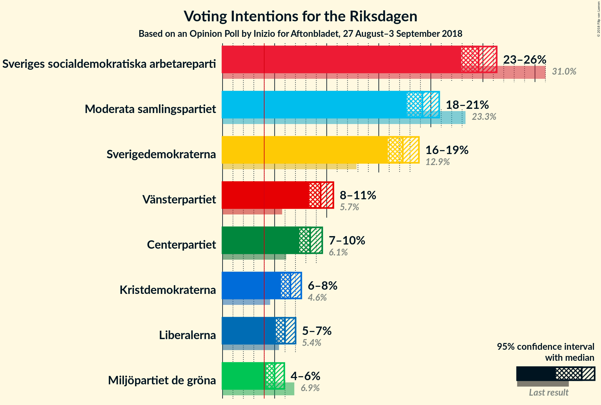
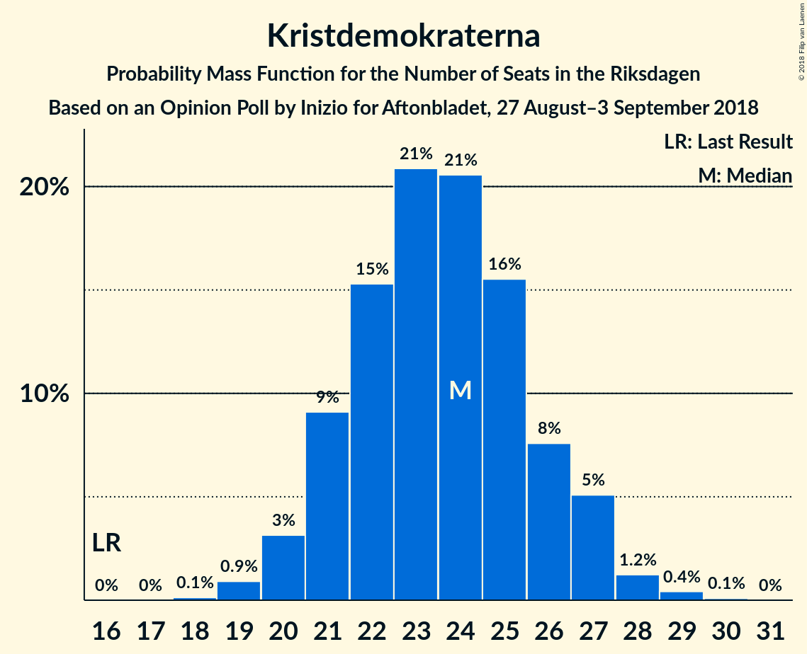

# Opinion Poll by Inizio for Aftonbladet, 27 August–3 September 2018

<a href="#voting-intentions">Voting Intentions</a> | <a href="#seats">Seats</a> | <a href="#coalitions">Coalitions</a> | <a href="#technical-information">Technical Information</a>

## Voting Intentions

### Confidence Intervals

| Party | Last Result | Poll Result | 80% Confidence Interval | 90% Confidence Interval | 95% Confidence Interval | 99% Confidence Interval |
|:-----:|:-----------:|:-----------:|:-----------------------:|:-----------------------:|:-----------------------:|:-----------------------:|
| Sveriges socialdemokratiska arbetareparti | 31.0% | 24.6% | 23.5–25.7% |23.2–26.0% |22.9–26.3% |22.4–26.9% |
| Moderata samlingspartiet | 23.3% | 19.2% | 18.2–20.2% |17.9–20.5% |17.7–20.8% |17.2–21.3% |
| Sverigedemokraterna | 12.9% | 17.3% | 16.4–18.3% |16.1–18.6% |15.9–18.9% |15.4–19.3% |
| Vänsterpartiet | 5.7% | 9.4% | 8.7–10.2% |8.5–10.4% |8.3–10.6% |8.0–11.0% |
| Centerpartiet | 6.1% | 8.4% | 7.7–9.2% |7.5–9.4% |7.4–9.6% |7.1–10.0% |
| Kristdemokraterna | 4.6% | 6.5% | 5.9–7.2% |5.7–7.4% |5.6–7.6% |5.3–7.9% |
| Liberalerna | 5.4% | 6.0% | 5.4–6.7% |5.3–6.8% |5.1–7.0% |4.9–7.3% |
| Miljöpartiet de gröna | 6.9% | 5.0% | 4.5–5.6% |4.3–5.8% |4.2–5.9% |4.0–6.2% |

*Note:* The poll result column reflects the actual value used in the calculations. Published results may vary slightly, and in addition be rounded to fewer digits.

## Seats

### Confidence Intervals

| Party | Last Result | Median | 80% Confidence Interval | 90% Confidence Interval | 95% Confidence Interval | 99% Confidence Interval |
|:-----:|:-----------:|:------:|:-----------------------:|:-----------------------:|:-----------------------:|:-----------------------:|
| <a href="#sveriges-socialdemokratiska-arbetareparti">Sveriges socialdemokratiska arbetareparti</a> | 113 | 88 | 84–92 |83–94 |82–95 |80–97 |
| <a href="#moderata-samlingspartiet">Moderata samlingspartiet</a> | 84 | 69 | 65–73 |64–74 |63–75 |61–77 |
| <a href="#sverigedemokraterna">Sverigedemokraterna</a> | 49 | 62 | 59–66 |57–67 |57–68 |55–70 |
| <a href="#vänsterpartiet">Vänsterpartiet</a> | 21 | 34 | 31–37 |30–37 |30–38 |28–40 |
| <a href="#centerpartiet">Centerpartiet</a> | 22 | 30 | 28–33 |27–34 |27–34 |25–36 |
| <a href="#kristdemokraterna">Kristdemokraterna</a> | 16 | 24 | 21–26 |21–27 |20–27 |19–29 |
| <a href="#liberalerna">Liberalerna</a> | 19 | 22 | 19–24 |19–25 |18–25 |17–26 |
| <a href="#miljöpartiet-de-gröna">Miljöpartiet de gröna</a> | 25 | 18 | 16–20 |15–21 |15–21 |0–22 |

### Sveriges socialdemokratiska arbetareparti

*For a full overview of the results for this party, see the [Sveriges socialdemokratiska arbetareparti](party-sverigessocialdemokratiskaarbetareparti.html) page.*

| Number of Seats | Probability | Accumulated | Special Marks |
|:---------------:|:-----------:|:-----------:|:-------------:|
| 77 | 0.1% | 100% |  |
| 78 | 0.1% | 99.9% |  |
| 79 | 0.3% | 99.8% |  |
| 80 | 0.4% | 99.5% |  |
| 81 | 1.2% | 99.1% |  |
| 82 | 3% | 98% |  |
| 83 | 3% | 95% |  |
| 84 | 5% | 92% |  |
| 85 | 5% | 87% |  |
| 86 | 8% | 82% |  |
| 87 | 12% | 74% |  |
| 88 | 17% | 62% | Median |
| 89 | 10% | 44% |  |
| 90 | 12% | 34% |  |
| 91 | 8% | 23% |  |
| 92 | 5% | 15% |  |
| 93 | 3% | 9% |  |
| 94 | 3% | 6% |  |
| 95 | 2% | 4% |  |
| 96 | 0.8% | 1.5% |  |
| 97 | 0.4% | 0.7% |  |
| 98 | 0.2% | 0.3% |  |
| 99 | 0.1% | 0.1% |  |
| 100 | 0% | 0% |  |
| 101 | 0% | 0% |  |
| 102 | 0% | 0% |  |
| 103 | 0% | 0% |  |
| 104 | 0% | 0% |  |
| 105 | 0% | 0% |  |
| 106 | 0% | 0% |  |
| 107 | 0% | 0% |  |
| 108 | 0% | 0% |  |
| 109 | 0% | 0% |  |
| 110 | 0% | 0% |  |
| 111 | 0% | 0% |  |
| 112 | 0% | 0% |  |
| 113 | 0% | 0% | Last Result |

### Moderata samlingspartiet

*For a full overview of the results for this party, see the [Moderata samlingspartiet](party-moderatasamlingspartiet.html) page.*

| Number of Seats | Probability | Accumulated | Special Marks |
|:---------------:|:-----------:|:-----------:|:-------------:|
| 59 | 0% | 100% |  |
| 60 | 0.2% | 99.9% |  |
| 61 | 0.4% | 99.8% |  |
| 62 | 0.8% | 99.4% |  |
| 63 | 2% | 98.5% |  |
| 64 | 4% | 96% |  |
| 65 | 4% | 93% |  |
| 66 | 8% | 88% |  |
| 67 | 9% | 81% |  |
| 68 | 11% | 71% |  |
| 69 | 15% | 60% | Median |
| 70 | 16% | 46% |  |
| 71 | 10% | 29% |  |
| 72 | 7% | 19% |  |
| 73 | 7% | 12% |  |
| 74 | 2% | 6% |  |
| 75 | 2% | 4% |  |
| 76 | 0.7% | 1.5% |  |
| 77 | 0.5% | 0.8% |  |
| 78 | 0.2% | 0.3% |  |
| 79 | 0.1% | 0.1% |  |
| 80 | 0% | 0% |  |
| 81 | 0% | 0% |  |
| 82 | 0% | 0% |  |
| 83 | 0% | 0% |  |
| 84 | 0% | 0% | Last Result |

### Sverigedemokraterna

*For a full overview of the results for this party, see the [Sverigedemokraterna](party-sverigedemokraterna.html) page.*

| Number of Seats | Probability | Accumulated | Special Marks |
|:---------------:|:-----------:|:-----------:|:-------------:|
| 49 | 0% | 100% | Last Result |
| 50 | 0% | 100% |  |
| 51 | 0% | 100% |  |
| 52 | 0% | 100% |  |
| 53 | 0.1% | 100% |  |
| 54 | 0.2% | 99.9% |  |
| 55 | 0.5% | 99.7% |  |
| 56 | 1.4% | 99.2% |  |
| 57 | 3% | 98% |  |
| 58 | 5% | 95% |  |
| 59 | 7% | 90% |  |
| 60 | 8% | 83% |  |
| 61 | 15% | 74% |  |
| 62 | 12% | 59% | Median |
| 63 | 13% | 48% |  |
| 64 | 15% | 35% |  |
| 65 | 7% | 20% |  |
| 66 | 7% | 13% |  |
| 67 | 3% | 6% |  |
| 68 | 2% | 3% |  |
| 69 | 0.7% | 1.3% |  |
| 70 | 0.4% | 0.7% |  |
| 71 | 0.2% | 0.3% |  |
| 72 | 0.1% | 0.1% |  |
| 73 | 0% | 0% |  |

### Vänsterpartiet

*For a full overview of the results for this party, see the [Vänsterpartiet](party-vänsterpartiet.html) page.*

| Number of Seats | Probability | Accumulated | Special Marks |
|:---------------:|:-----------:|:-----------:|:-------------:|
| 21 | 0% | 100% | Last Result |
| 22 | 0% | 100% |  |
| 23 | 0% | 100% |  |
| 24 | 0% | 100% |  |
| 25 | 0% | 100% |  |
| 26 | 0% | 100% |  |
| 27 | 0.1% | 100% |  |
| 28 | 0.4% | 99.9% |  |
| 29 | 2% | 99.5% |  |
| 30 | 3% | 98% |  |
| 31 | 7% | 95% |  |
| 32 | 15% | 87% |  |
| 33 | 15% | 72% |  |
| 34 | 17% | 57% | Median |
| 35 | 16% | 40% |  |
| 36 | 11% | 24% |  |
| 37 | 8% | 13% |  |
| 38 | 3% | 5% |  |
| 39 | 1.2% | 2% |  |
| 40 | 0.6% | 0.7% |  |
| 41 | 0.1% | 0.2% |  |
| 42 | 0% | 0% |  |

### Centerpartiet

*For a full overview of the results for this party, see the [Centerpartiet](party-centerpartiet.html) page.*

| Number of Seats | Probability | Accumulated | Special Marks |
|:---------------:|:-----------:|:-----------:|:-------------:|
| 22 | 0% | 100% | Last Result |
| 23 | 0% | 100% |  |
| 24 | 0.1% | 100% |  |
| 25 | 0.6% | 99.9% |  |
| 26 | 2% | 99.3% |  |
| 27 | 5% | 98% |  |
| 28 | 12% | 92% |  |
| 29 | 16% | 80% |  |
| 30 | 19% | 64% | Median |
| 31 | 17% | 45% |  |
| 32 | 16% | 28% |  |
| 33 | 7% | 12% |  |
| 34 | 3% | 5% |  |
| 35 | 2% | 2% |  |
| 36 | 0.6% | 0.7% |  |
| 37 | 0.1% | 0.2% |  |
| 38 | 0% | 0% |  |

### Kristdemokraterna

*For a full overview of the results for this party, see the [Kristdemokraterna](party-kristdemokraterna.html) page.*

| Number of Seats | Probability | Accumulated | Special Marks |
|:---------------:|:-----------:|:-----------:|:-------------:|
| 16 | 0% | 100% | Last Result |
| 17 | 0% | 100% |  |
| 18 | 0.1% | 100% |  |
| 19 | 0.9% | 99.9% |  |
| 20 | 3% | 98.9% |  |
| 21 | 9% | 96% |  |
| 22 | 15% | 87% |  |
| 23 | 21% | 71% |  |
| 24 | 21% | 51% | Median |
| 25 | 16% | 30% |  |
| 26 | 8% | 14% |  |
| 27 | 5% | 7% |  |
| 28 | 1.2% | 2% |  |
| 29 | 0.4% | 0.5% |  |
| 30 | 0.1% | 0.1% |  |
| 31 | 0% | 0% |  |

### Liberalerna

*For a full overview of the results for this party, see the [Liberalerna](party-liberalerna.html) page.*

| Number of Seats | Probability | Accumulated | Special Marks |
|:---------------:|:-----------:|:-----------:|:-------------:|
| 16 | 0.1% | 100% |  |
| 17 | 0.4% | 99.9% |  |
| 18 | 3% | 99.5% |  |
| 19 | 11% | 96% | Last Result |
| 20 | 15% | 85% |  |
| 21 | 20% | 70% |  |
| 22 | 21% | 50% | Median |
| 23 | 16% | 30% |  |
| 24 | 7% | 14% |  |
| 25 | 6% | 7% |  |
| 26 | 0.9% | 1.4% |  |
| 27 | 0.3% | 0.4% |  |
| 28 | 0.1% | 0.1% |  |
| 29 | 0% | 0% |  |

### Miljöpartiet de gröna

*For a full overview of the results for this party, see the [Miljöpartiet de gröna](party-miljöpartietdegröna.html) page.*

| Number of Seats | Probability | Accumulated | Special Marks |
|:---------------:|:-----------:|:-----------:|:-------------:|
| 0 | 0.6% | 100% |  |
| 1 | 0% | 99.4% |  |
| 2 | 0% | 99.4% |  |
| 3 | 0% | 99.4% |  |
| 4 | 0% | 99.4% |  |
| 5 | 0% | 99.4% |  |
| 6 | 0% | 99.4% |  |
| 7 | 0% | 99.4% |  |
| 8 | 0% | 99.4% |  |
| 9 | 0% | 99.4% |  |
| 10 | 0% | 99.4% |  |
| 11 | 0% | 99.4% |  |
| 12 | 0% | 99.4% |  |
| 13 | 0% | 99.4% |  |
| 14 | 0.4% | 99.4% |  |
| 15 | 4% | 98.9% |  |
| 16 | 13% | 95% |  |
| 17 | 19% | 82% |  |
| 18 | 28% | 63% | Median |
| 19 | 19% | 35% |  |
| 20 | 9% | 17% |  |
| 21 | 5% | 7% |  |
| 22 | 1.4% | 2% |  |
| 23 | 0.4% | 0.4% |  |
| 24 | 0.1% | 0.1% |  |
| 25 | 0% | 0% | Last Result |

## Coalitions

### Confidence Intervals

| Coalition | Last Result | Median | Majority? | 80% Confidence Interval | 90% Confidence Interval | 95% Confidence Interval | 99% Confidence Interval |
|:---------:|:-----------:|:------:|:---------:|:-----------------------:|:-----------------------:|:-----------------------:|:-----------------------:|
| Sveriges socialdemokratiska arbetareparti – Moderata samlingspartiet – Centerpartiet | 219 | 188 | 99.5% | 181–193 | 179–194 | 178–196 | 175–199 |
| Sveriges socialdemokratiska arbetareparti – Moderata samlingspartiet | 197 | 158 | 0% | 151–162 | 150–164 | 149–166 | 145–168 |
| Moderata samlingspartiet – Sverigedemokraterna – Kristdemokraterna | 149 | 155 | 0% | 149–160 | 147–161 | 146–163 | 143–166 |
| Moderata samlingspartiet – Centerpartiet – Kristdemokraterna – Liberalerna | 141 | 144 | 0% | 139–150 | 137–151 | 135–152 | 133–155 |
| Sveriges socialdemokratiska arbetareparti – Vänsterpartiet – Miljöpartiet de gröna | 159 | 141 | 0% | 135–145 | 133–147 | 132–148 | 127–150 |
| Moderata samlingspartiet – Sverigedemokraterna | 133 | 132 | 0% | 126–136 | 124–137 | 123–139 | 120–142 |
| Sveriges socialdemokratiska arbetareparti – Vänsterpartiet | 134 | 122 | 0% | 117–127 | 116–128 | 115–130 | 112–132 |
| Moderata samlingspartiet – Centerpartiet – Kristdemokraterna | 122 | 123 | 0% | 118–128 | 116–129 | 114–130 | 113–133 |
| Moderata samlingspartiet – Centerpartiet – Liberalerna | 125 | 121 | 0% | 116–125 | 114–127 | 112–128 | 111–131 |
| Sveriges socialdemokratiska arbetareparti – Miljöpartiet de gröna | 138 | 106 | 0% | 102–111 | 100–112 | 99–113 | 94–116 |
| Moderata samlingspartiet – Centerpartiet | 106 | 99 | 0% | 95–104 | 93–105 | 92–106 | 90–108 |

### Sveriges socialdemokratiska arbetareparti – Moderata samlingspartiet – Centerpartiet

| Number of Seats | Probability | Accumulated | Special Marks |
|:---------------:|:-----------:|:-----------:|:-------------:|
| 171 | 0% | 100% |  |
| 172 | 0.1% | 99.9% |  |
| 173 | 0.1% | 99.9% |  |
| 174 | 0.2% | 99.8% |  |
| 175 | 0.4% | 99.5% | Majority |
| 176 | 0.6% | 99.1% |  |
| 177 | 0.8% | 98% |  |
| 178 | 1.1% | 98% |  |
| 179 | 2% | 97% |  |
| 180 | 3% | 95% |  |
| 181 | 3% | 92% |  |
| 182 | 2% | 89% |  |
| 183 | 4% | 87% |  |
| 184 | 4% | 83% |  |
| 185 | 6% | 78% |  |
| 186 | 9% | 73% |  |
| 187 | 6% | 63% | Median |
| 188 | 14% | 57% |  |
| 189 | 11% | 44% |  |
| 190 | 7% | 32% |  |
| 191 | 7% | 26% |  |
| 192 | 7% | 19% |  |
| 193 | 4% | 12% |  |
| 194 | 3% | 8% |  |
| 195 | 2% | 5% |  |
| 196 | 0.7% | 3% |  |
| 197 | 1.1% | 2% |  |
| 198 | 0.4% | 1.0% |  |
| 199 | 0.2% | 0.6% |  |
| 200 | 0.2% | 0.4% |  |
| 201 | 0% | 0.2% |  |
| 202 | 0% | 0.1% |  |
| 203 | 0% | 0.1% |  |
| 204 | 0% | 0% |  |
| 205 | 0% | 0% |  |
| 206 | 0% | 0% |  |
| 207 | 0% | 0% |  |
| 208 | 0% | 0% |  |
| 209 | 0% | 0% |  |
| 210 | 0% | 0% |  |
| 211 | 0% | 0% |  |
| 212 | 0% | 0% |  |
| 213 | 0% | 0% |  |
| 214 | 0% | 0% |  |
| 215 | 0% | 0% |  |
| 216 | 0% | 0% |  |
| 217 | 0% | 0% |  |
| 218 | 0% | 0% |  |
| 219 | 0% | 0% | Last Result |

### Sveriges socialdemokratiska arbetareparti – Moderata samlingspartiet

| Number of Seats | Probability | Accumulated | Special Marks |
|:---------------:|:-----------:|:-----------:|:-------------:|
| 143 | 0.2% | 100% |  |
| 144 | 0.2% | 99.8% |  |
| 145 | 0.4% | 99.6% |  |
| 146 | 0.2% | 99.3% |  |
| 147 | 0.3% | 99.1% |  |
| 148 | 0.6% | 98.8% |  |
| 149 | 1.2% | 98% |  |
| 150 | 4% | 97% |  |
| 151 | 4% | 93% |  |
| 152 | 5% | 89% |  |
| 153 | 4% | 84% |  |
| 154 | 3% | 80% |  |
| 155 | 4% | 77% |  |
| 156 | 5% | 73% |  |
| 157 | 17% | 69% | Median |
| 158 | 14% | 51% |  |
| 159 | 12% | 38% |  |
| 160 | 7% | 26% |  |
| 161 | 7% | 19% |  |
| 162 | 2% | 12% |  |
| 163 | 2% | 10% |  |
| 164 | 3% | 7% |  |
| 165 | 1.1% | 4% |  |
| 166 | 2% | 3% |  |
| 167 | 0.8% | 1.3% |  |
| 168 | 0.2% | 0.5% |  |
| 169 | 0.2% | 0.3% |  |
| 170 | 0% | 0.1% |  |
| 171 | 0% | 0.1% |  |
| 172 | 0% | 0.1% |  |
| 173 | 0% | 0% |  |
| 174 | 0% | 0% |  |
| 175 | 0% | 0% | Majority |
| 176 | 0% | 0% |  |
| 177 | 0% | 0% |  |
| 178 | 0% | 0% |  |
| 179 | 0% | 0% |  |
| 180 | 0% | 0% |  |
| 181 | 0% | 0% |  |
| 182 | 0% | 0% |  |
| 183 | 0% | 0% |  |
| 184 | 0% | 0% |  |
| 185 | 0% | 0% |  |
| 186 | 0% | 0% |  |
| 187 | 0% | 0% |  |
| 188 | 0% | 0% |  |
| 189 | 0% | 0% |  |
| 190 | 0% | 0% |  |
| 191 | 0% | 0% |  |
| 192 | 0% | 0% |  |
| 193 | 0% | 0% |  |
| 194 | 0% | 0% |  |
| 195 | 0% | 0% |  |
| 196 | 0% | 0% |  |
| 197 | 0% | 0% | Last Result |

### Moderata samlingspartiet – Sverigedemokraterna – Kristdemokraterna

| Number of Seats | Probability | Accumulated | Special Marks |
|:---------------:|:-----------:|:-----------:|:-------------:|
| 140 | 0% | 100% |  |
| 141 | 0.1% | 99.9% |  |
| 142 | 0.3% | 99.8% |  |
| 143 | 0.4% | 99.5% |  |
| 144 | 0.3% | 99.2% |  |
| 145 | 0.7% | 98.9% |  |
| 146 | 2% | 98% |  |
| 147 | 3% | 96% |  |
| 148 | 2% | 93% |  |
| 149 | 3% | 91% | Last Result |
| 150 | 4% | 88% |  |
| 151 | 4% | 84% |  |
| 152 | 7% | 80% |  |
| 153 | 9% | 73% |  |
| 154 | 11% | 64% |  |
| 155 | 7% | 54% | Median |
| 156 | 6% | 46% |  |
| 157 | 9% | 40% |  |
| 158 | 13% | 32% |  |
| 159 | 7% | 18% |  |
| 160 | 4% | 11% |  |
| 161 | 3% | 8% |  |
| 162 | 2% | 5% |  |
| 163 | 1.3% | 3% |  |
| 164 | 0.6% | 2% |  |
| 165 | 0.3% | 0.9% |  |
| 166 | 0.2% | 0.6% |  |
| 167 | 0.1% | 0.4% |  |
| 168 | 0.1% | 0.3% |  |
| 169 | 0.1% | 0.2% |  |
| 170 | 0.1% | 0.1% |  |
| 171 | 0% | 0% |  |

### Moderata samlingspartiet – Centerpartiet – Kristdemokraterna – Liberalerna

| Number of Seats | Probability | Accumulated | Special Marks |
|:---------------:|:-----------:|:-----------:|:-------------:|
| 130 | 0% | 100% |  |
| 131 | 0.1% | 99.9% |  |
| 132 | 0.3% | 99.9% |  |
| 133 | 0.3% | 99.6% |  |
| 134 | 1.3% | 99.3% |  |
| 135 | 0.7% | 98% |  |
| 136 | 1.5% | 97% |  |
| 137 | 2% | 96% |  |
| 138 | 3% | 94% |  |
| 139 | 3% | 91% |  |
| 140 | 3% | 88% |  |
| 141 | 5% | 85% | Last Result |
| 142 | 9% | 80% |  |
| 143 | 7% | 70% |  |
| 144 | 14% | 63% |  |
| 145 | 5% | 49% | Median |
| 146 | 16% | 44% |  |
| 147 | 6% | 28% |  |
| 148 | 5% | 21% |  |
| 149 | 5% | 16% |  |
| 150 | 5% | 11% |  |
| 151 | 3% | 6% |  |
| 152 | 2% | 4% |  |
| 153 | 0.7% | 2% |  |
| 154 | 0.8% | 1.4% |  |
| 155 | 0.4% | 0.7% |  |
| 156 | 0.1% | 0.3% |  |
| 157 | 0.1% | 0.1% |  |
| 158 | 0% | 0.1% |  |
| 159 | 0% | 0% |  |

### Sveriges socialdemokratiska arbetareparti – Vänsterpartiet – Miljöpartiet de gröna

| Number of Seats | Probability | Accumulated | Special Marks |
|:---------------:|:-----------:|:-----------:|:-------------:|
| 123 | 0.1% | 100% |  |
| 124 | 0% | 99.9% |  |
| 125 | 0.1% | 99.9% |  |
| 126 | 0.1% | 99.8% |  |
| 127 | 0.1% | 99.6% |  |
| 128 | 0.1% | 99.5% |  |
| 129 | 0.3% | 99.3% |  |
| 130 | 0.4% | 99.0% |  |
| 131 | 0.8% | 98.6% |  |
| 132 | 1.0% | 98% |  |
| 133 | 2% | 97% |  |
| 134 | 3% | 95% |  |
| 135 | 5% | 92% |  |
| 136 | 4% | 87% |  |
| 137 | 7% | 82% |  |
| 138 | 6% | 75% |  |
| 139 | 12% | 69% |  |
| 140 | 6% | 57% | Median |
| 141 | 12% | 51% |  |
| 142 | 13% | 39% |  |
| 143 | 7% | 26% |  |
| 144 | 6% | 19% |  |
| 145 | 4% | 13% |  |
| 146 | 3% | 9% |  |
| 147 | 2% | 5% |  |
| 148 | 2% | 3% |  |
| 149 | 0.7% | 1.3% |  |
| 150 | 0.3% | 0.6% |  |
| 151 | 0.1% | 0.3% |  |
| 152 | 0.1% | 0.1% |  |
| 153 | 0% | 0% |  |
| 154 | 0% | 0% |  |
| 155 | 0% | 0% |  |
| 156 | 0% | 0% |  |
| 157 | 0% | 0% |  |
| 158 | 0% | 0% |  |
| 159 | 0% | 0% | Last Result |

### Moderata samlingspartiet – Sverigedemokraterna

| Number of Seats | Probability | Accumulated | Special Marks |
|:---------------:|:-----------:|:-----------:|:-------------:|
| 117 | 0% | 100% |  |
| 118 | 0.1% | 99.9% |  |
| 119 | 0.1% | 99.9% |  |
| 120 | 0.4% | 99.8% |  |
| 121 | 1.1% | 99.4% |  |
| 122 | 0.6% | 98% |  |
| 123 | 1.1% | 98% |  |
| 124 | 2% | 97% |  |
| 125 | 3% | 95% |  |
| 126 | 3% | 91% |  |
| 127 | 5% | 89% |  |
| 128 | 5% | 83% |  |
| 129 | 10% | 79% |  |
| 130 | 10% | 68% |  |
| 131 | 8% | 58% | Median |
| 132 | 10% | 50% |  |
| 133 | 10% | 40% | Last Result |
| 134 | 12% | 30% |  |
| 135 | 5% | 18% |  |
| 136 | 4% | 14% |  |
| 137 | 4% | 9% |  |
| 138 | 2% | 5% |  |
| 139 | 1.4% | 3% |  |
| 140 | 0.6% | 2% |  |
| 141 | 0.3% | 0.9% |  |
| 142 | 0.3% | 0.6% |  |
| 143 | 0.1% | 0.3% |  |
| 144 | 0.1% | 0.3% |  |
| 145 | 0.2% | 0.2% |  |
| 146 | 0% | 0% |  |

### Sveriges socialdemokratiska arbetareparti – Vänsterpartiet

| Number of Seats | Probability | Accumulated | Special Marks |
|:---------------:|:-----------:|:-----------:|:-------------:|
| 109 | 0% | 100% |  |
| 110 | 0.1% | 99.9% |  |
| 111 | 0.1% | 99.9% |  |
| 112 | 0.4% | 99.7% |  |
| 113 | 1.1% | 99.4% |  |
| 114 | 0.7% | 98% |  |
| 115 | 2% | 98% |  |
| 116 | 2% | 96% |  |
| 117 | 5% | 94% |  |
| 118 | 5% | 89% |  |
| 119 | 8% | 84% |  |
| 120 | 11% | 76% |  |
| 121 | 8% | 65% |  |
| 122 | 9% | 57% | Median |
| 123 | 9% | 48% |  |
| 124 | 11% | 39% |  |
| 125 | 9% | 28% |  |
| 126 | 7% | 20% |  |
| 127 | 5% | 13% |  |
| 128 | 3% | 8% |  |
| 129 | 2% | 4% |  |
| 130 | 1.2% | 3% |  |
| 131 | 0.8% | 1.4% |  |
| 132 | 0.3% | 0.6% |  |
| 133 | 0.1% | 0.3% |  |
| 134 | 0.1% | 0.2% | Last Result |
| 135 | 0.1% | 0.1% |  |
| 136 | 0% | 0% |  |

### Moderata samlingspartiet – Centerpartiet – Kristdemokraterna

| Number of Seats | Probability | Accumulated | Special Marks |
|:---------------:|:-----------:|:-----------:|:-------------:|
| 110 | 0% | 100% |  |
| 111 | 0.2% | 99.9% |  |
| 112 | 0.3% | 99.8% |  |
| 113 | 1.2% | 99.5% |  |
| 114 | 1.0% | 98% |  |
| 115 | 2% | 97% |  |
| 116 | 2% | 96% |  |
| 117 | 3% | 94% |  |
| 118 | 5% | 91% |  |
| 119 | 4% | 87% |  |
| 120 | 6% | 83% |  |
| 121 | 10% | 77% |  |
| 122 | 8% | 67% | Last Result |
| 123 | 14% | 59% | Median |
| 124 | 13% | 45% |  |
| 125 | 10% | 32% |  |
| 126 | 6% | 21% |  |
| 127 | 5% | 16% |  |
| 128 | 3% | 11% |  |
| 129 | 3% | 8% |  |
| 130 | 3% | 5% |  |
| 131 | 1.1% | 2% |  |
| 132 | 0.5% | 1.1% |  |
| 133 | 0.4% | 0.6% |  |
| 134 | 0.1% | 0.2% |  |
| 135 | 0.1% | 0.1% |  |
| 136 | 0% | 0% |  |

### Moderata samlingspartiet – Centerpartiet – Liberalerna

| Number of Seats | Probability | Accumulated | Special Marks |
|:---------------:|:-----------:|:-----------:|:-------------:|
| 107 | 0% | 100% |  |
| 108 | 0.1% | 99.9% |  |
| 109 | 0.1% | 99.9% |  |
| 110 | 0.2% | 99.7% |  |
| 111 | 0.5% | 99.6% |  |
| 112 | 2% | 99.0% |  |
| 113 | 1.1% | 97% |  |
| 114 | 1.4% | 96% |  |
| 115 | 3% | 95% |  |
| 116 | 4% | 92% |  |
| 117 | 7% | 88% |  |
| 118 | 6% | 80% |  |
| 119 | 10% | 75% |  |
| 120 | 6% | 64% |  |
| 121 | 12% | 58% | Median |
| 122 | 16% | 46% |  |
| 123 | 6% | 30% |  |
| 124 | 7% | 24% |  |
| 125 | 7% | 17% | Last Result |
| 126 | 3% | 10% |  |
| 127 | 3% | 7% |  |
| 128 | 2% | 4% |  |
| 129 | 1.0% | 2% |  |
| 130 | 0.6% | 1.3% |  |
| 131 | 0.5% | 0.7% |  |
| 132 | 0.1% | 0.2% |  |
| 133 | 0.1% | 0.2% |  |
| 134 | 0% | 0.1% |  |
| 135 | 0% | 0% |  |

### Sveriges socialdemokratiska arbetareparti – Miljöpartiet de gröna

| Number of Seats | Probability | Accumulated | Special Marks |
|:---------------:|:-----------:|:-----------:|:-------------:|
| 88 | 0% | 100% |  |
| 89 | 0% | 99.9% |  |
| 90 | 0% | 99.9% |  |
| 91 | 0.1% | 99.8% |  |
| 92 | 0.2% | 99.8% |  |
| 93 | 0.1% | 99.6% |  |
| 94 | 0.2% | 99.5% |  |
| 95 | 0.1% | 99.4% |  |
| 96 | 0.3% | 99.3% |  |
| 97 | 0.4% | 99.0% |  |
| 98 | 0.8% | 98.7% |  |
| 99 | 2% | 98% |  |
| 100 | 2% | 96% |  |
| 101 | 4% | 94% |  |
| 102 | 6% | 90% |  |
| 103 | 6% | 85% |  |
| 104 | 6% | 79% |  |
| 105 | 14% | 73% |  |
| 106 | 8% | 58% | Median |
| 107 | 16% | 50% |  |
| 108 | 11% | 34% |  |
| 109 | 6% | 23% |  |
| 110 | 7% | 18% |  |
| 111 | 3% | 10% |  |
| 112 | 3% | 7% |  |
| 113 | 2% | 4% |  |
| 114 | 1.0% | 2% |  |
| 115 | 0.7% | 1.4% |  |
| 116 | 0.5% | 0.7% |  |
| 117 | 0.1% | 0.2% |  |
| 118 | 0% | 0.1% |  |
| 119 | 0% | 0% |  |
| 120 | 0% | 0% |  |
| 121 | 0% | 0% |  |
| 122 | 0% | 0% |  |
| 123 | 0% | 0% |  |
| 124 | 0% | 0% |  |
| 125 | 0% | 0% |  |
| 126 | 0% | 0% |  |
| 127 | 0% | 0% |  |
| 128 | 0% | 0% |  |
| 129 | 0% | 0% |  |
| 130 | 0% | 0% |  |
| 131 | 0% | 0% |  |
| 132 | 0% | 0% |  |
| 133 | 0% | 0% |  |
| 134 | 0% | 0% |  |
| 135 | 0% | 0% |  |
| 136 | 0% | 0% |  |
| 137 | 0% | 0% |  |
| 138 | 0% | 0% | Last Result |

### Moderata samlingspartiet – Centerpartiet

| Number of Seats | Probability | Accumulated | Special Marks |
|:---------------:|:-----------:|:-----------:|:-------------:|
| 88 | 0.1% | 100% |  |
| 89 | 0.2% | 99.9% |  |
| 90 | 0.5% | 99.6% |  |
| 91 | 1.4% | 99.2% |  |
| 92 | 1.3% | 98% |  |
| 93 | 2% | 97% |  |
| 94 | 3% | 95% |  |
| 95 | 5% | 91% |  |
| 96 | 5% | 87% |  |
| 97 | 7% | 82% |  |
| 98 | 15% | 74% |  |
| 99 | 11% | 59% | Median |
| 100 | 13% | 48% |  |
| 101 | 9% | 35% |  |
| 102 | 11% | 26% |  |
| 103 | 5% | 16% |  |
| 104 | 3% | 11% |  |
| 105 | 4% | 8% |  |
| 106 | 2% | 4% | Last Result |
| 107 | 1.4% | 2% |  |
| 108 | 0.5% | 1.0% |  |
| 109 | 0.3% | 0.4% |  |
| 110 | 0.1% | 0.2% |  |
| 111 | 0% | 0.1% |  |
| 112 | 0% | 0% |  |

## Technical Information

### Opinion Poll

+ **Polling firm:** Inizio
+ **Commissioner(s):** Aftonbladet
+ **Fieldwork period:** 27 August–3 September 2018

### Calculations

+ **Sample size:** 2485
+ **Simulations done:** 1,048,576
+ **Error estimate:** 1.27%

