# Opinion Poll by SKOP, 28 August–4 September 2018

<a href="#voting-intentions">Voting Intentions</a> | <a href="#seats">Seats</a> | <a href="#coalitions">Coalitions</a> | <a href="#technical-information">Technical Information</a>

## Voting Intentions

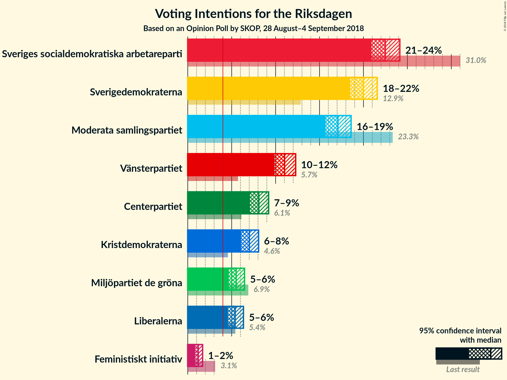

### Confidence Intervals

| Party | Last Result | Poll Result | 80% Confidence Interval | 90% Confidence Interval | 95% Confidence Interval | 99% Confidence Interval |
|:-----:|:-----------:|:-----------:|:-----------------------:|:-----------------------:|:-----------------------:|:-----------------------:|
| Sveriges socialdemokratiska arbetareparti | 31.0% | 22.5% | 21.5–23.6% |21.2–23.9% |20.9–24.1% |20.4–24.7% |
| Sverigedemokraterna | 12.9% | 20.0% | 19.0–21.0% |18.7–21.3% |18.5–21.6% |18.0–22.1% |
| Moderata samlingspartiet | 23.3% | 17.1% | 16.2–18.1% |15.9–18.4% |15.7–18.6% |15.3–19.1% |
| Vänsterpartiet | 5.7% | 11.0% | 10.3–11.8% |10.0–12.1% |9.9–12.3% |9.5–12.7% |
| Centerpartiet | 6.1% | 8.1% | 7.4–8.8% |7.3–9.0% |7.1–9.2% |6.8–9.6% |
| Kristdemokraterna | 4.6% | 7.0% | 6.4–7.7% |6.2–7.9% |6.1–8.1% |5.8–8.4% |
| Miljöpartiet de gröna | 6.9% | 5.5% | 5.0–6.1% |4.8–6.3% |4.7–6.5% |4.4–6.8% |
| Liberalerna | 5.4% | 5.4% | 4.9–6.0% |4.7–6.2% |4.6–6.3% |4.3–6.6% |
| Feministiskt initiativ | 3.1% | 1.2% | 1.0–1.5% |0.9–1.6% |0.8–1.7% |0.7–1.9% |

*Note:* The poll result column reflects the actual value used in the calculations. Published results may vary slightly, and in addition be rounded to fewer digits.

## Seats

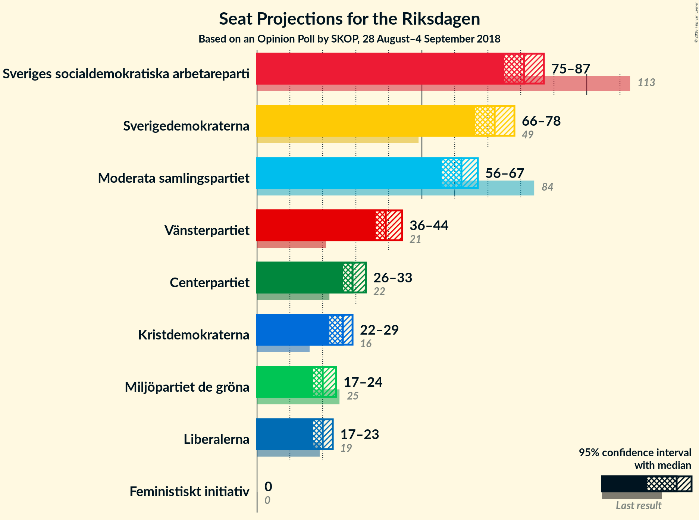

### Confidence Intervals

| Party | Last Result | Median | 80% Confidence Interval | 90% Confidence Interval | 95% Confidence Interval | 99% Confidence Interval |
|:-----:|:-----------:|:------:|:-----------------------:|:-----------------------:|:-----------------------:|:-----------------------:|
| <a href="#sveriges-socialdemokratiska-arbetareparti">Sveriges socialdemokratiska arbetareparti</a> | 113 | 81 | 77–85 |76–87 |75–87 |73–89 |
| <a href="#sverigedemokraterna">Sverigedemokraterna</a> | 49 | 72 | 69–76 |67–77 |66–78 |65–79 |
| <a href="#moderata-samlingspartiet">Moderata samlingspartiet</a> | 84 | 62 | 58–65 |57–66 |56–67 |56–69 |
| <a href="#vänsterpartiet">Vänsterpartiet</a> | 21 | 39 | 37–42 |36–43 |36–44 |34–46 |
| <a href="#centerpartiet">Centerpartiet</a> | 22 | 29 | 27–32 |26–32 |26–33 |25–35 |
| <a href="#kristdemokraterna">Kristdemokraterna</a> | 16 | 26 | 23–28 |22–28 |22–29 |21–30 |
| <a href="#miljöpartiet-de-gröna">Miljöpartiet de gröna</a> | 25 | 20 | 18–22 |17–23 |17–24 |16–24 |
| <a href="#liberalerna">Liberalerna</a> | 19 | 20 | 18–22 |17–22 |17–23 |16–24 |
| <a href="#feministiskt-initiativ">Feministiskt initiativ</a> | 0 | 0 | 0 |0 |0 |0 |

### Sveriges socialdemokratiska arbetareparti

*For a full overview of the results for this party, see the [Sveriges socialdemokratiska arbetareparti](party-sverigessocialdemokratiskaarbetareparti.html) page.*

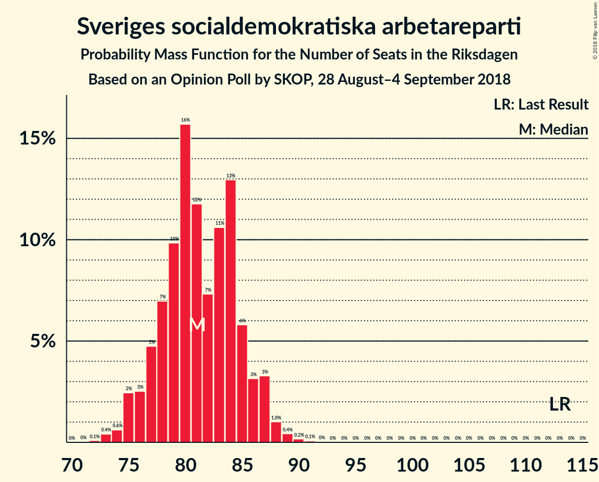

| Number of Seats | Probability | Accumulated | Special Marks |
|:---------------:|:-----------:|:-----------:|:-------------:|
| 72 | 0.1% | 100% |  |
| 73 | 0.4% | 99.9% |  |
| 74 | 0.6% | 99.5% |  |
| 75 | 2% | 98.8% |  |
| 76 | 3% | 96% |  |
| 77 | 5% | 94% |  |
| 78 | 7% | 89% |  |
| 79 | 10% | 82% |  |
| 80 | 16% | 72% |  |
| 81 | 12% | 57% | Median |
| 82 | 7% | 45% |  |
| 83 | 11% | 38% |  |
| 84 | 13% | 27% |  |
| 85 | 6% | 14% |  |
| 86 | 3% | 8% |  |
| 87 | 3% | 5% |  |
| 88 | 1.0% | 2% |  |
| 89 | 0.4% | 0.7% |  |
| 90 | 0.2% | 0.3% |  |
| 91 | 0.1% | 0.1% |  |
| 92 | 0% | 0% |  |
| 93 | 0% | 0% |  |
| 94 | 0% | 0% |  |
| 95 | 0% | 0% |  |
| 96 | 0% | 0% |  |
| 97 | 0% | 0% |  |
| 98 | 0% | 0% |  |
| 99 | 0% | 0% |  |
| 100 | 0% | 0% |  |
| 101 | 0% | 0% |  |
| 102 | 0% | 0% |  |
| 103 | 0% | 0% |  |
| 104 | 0% | 0% |  |
| 105 | 0% | 0% |  |
| 106 | 0% | 0% |  |
| 107 | 0% | 0% |  |
| 108 | 0% | 0% |  |
| 109 | 0% | 0% |  |
| 110 | 0% | 0% |  |
| 111 | 0% | 0% |  |
| 112 | 0% | 0% |  |
| 113 | 0% | 0% | Last Result |

### Sverigedemokraterna

*For a full overview of the results for this party, see the [Sverigedemokraterna](party-sverigedemokraterna.html) page.*

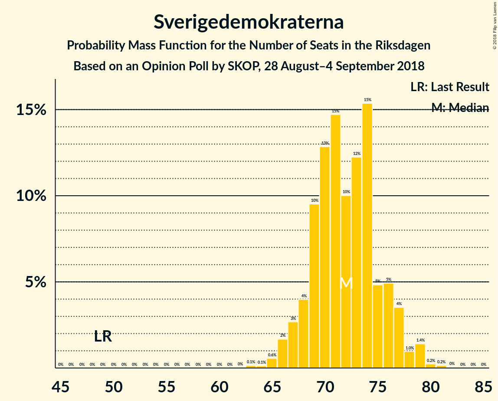

| Number of Seats | Probability | Accumulated | Special Marks |
|:---------------:|:-----------:|:-----------:|:-------------:|
| 49 | 0% | 100% | Last Result |
| 50 | 0% | 100% |  |
| 51 | 0% | 100% |  |
| 52 | 0% | 100% |  |
| 53 | 0% | 100% |  |
| 54 | 0% | 100% |  |
| 55 | 0% | 100% |  |
| 56 | 0% | 100% |  |
| 57 | 0% | 100% |  |
| 58 | 0% | 100% |  |
| 59 | 0% | 100% |  |
| 60 | 0% | 100% |  |
| 61 | 0% | 100% |  |
| 62 | 0% | 100% |  |
| 63 | 0.1% | 100% |  |
| 64 | 0.1% | 99.8% |  |
| 65 | 0.6% | 99.7% |  |
| 66 | 2% | 99.1% |  |
| 67 | 3% | 97% |  |
| 68 | 4% | 95% |  |
| 69 | 10% | 91% |  |
| 70 | 13% | 81% |  |
| 71 | 15% | 68% |  |
| 72 | 10% | 54% | Median |
| 73 | 12% | 44% |  |
| 74 | 15% | 31% |  |
| 75 | 5% | 16% |  |
| 76 | 5% | 11% |  |
| 77 | 4% | 6% |  |
| 78 | 1.0% | 3% |  |
| 79 | 1.4% | 2% |  |
| 80 | 0.2% | 0.5% |  |
| 81 | 0.2% | 0.2% |  |
| 82 | 0% | 0.1% |  |
| 83 | 0% | 0% |  |

### Moderata samlingspartiet

*For a full overview of the results for this party, see the [Moderata samlingspartiet](party-moderatasamlingspartiet.html) page.*

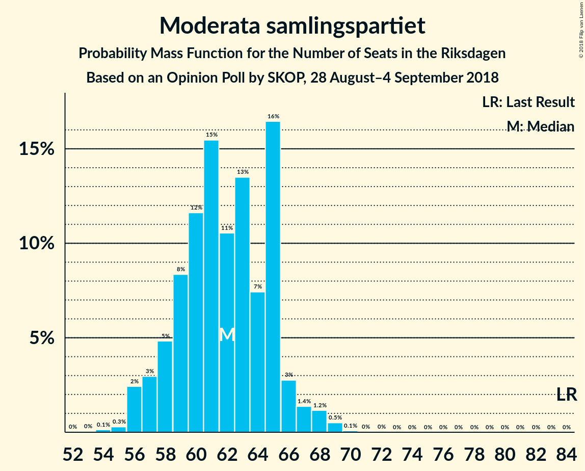

| Number of Seats | Probability | Accumulated | Special Marks |
|:---------------:|:-----------:|:-----------:|:-------------:|
| 53 | 0% | 100% |  |
| 54 | 0.1% | 99.9% |  |
| 55 | 0.3% | 99.8% |  |
| 56 | 2% | 99.5% |  |
| 57 | 3% | 97% |  |
| 58 | 5% | 94% |  |
| 59 | 8% | 89% |  |
| 60 | 12% | 81% |  |
| 61 | 15% | 69% |  |
| 62 | 11% | 54% | Median |
| 63 | 13% | 43% |  |
| 64 | 7% | 30% |  |
| 65 | 16% | 22% |  |
| 66 | 3% | 6% |  |
| 67 | 1.4% | 3% |  |
| 68 | 1.2% | 2% |  |
| 69 | 0.5% | 0.6% |  |
| 70 | 0.1% | 0.1% |  |
| 71 | 0% | 0% |  |
| 72 | 0% | 0% |  |
| 73 | 0% | 0% |  |
| 74 | 0% | 0% |  |
| 75 | 0% | 0% |  |
| 76 | 0% | 0% |  |
| 77 | 0% | 0% |  |
| 78 | 0% | 0% |  |
| 79 | 0% | 0% |  |
| 80 | 0% | 0% |  |
| 81 | 0% | 0% |  |
| 82 | 0% | 0% |  |
| 83 | 0% | 0% |  |
| 84 | 0% | 0% | Last Result |

### Vänsterpartiet

*For a full overview of the results for this party, see the [Vänsterpartiet](party-vänsterpartiet.html) page.*

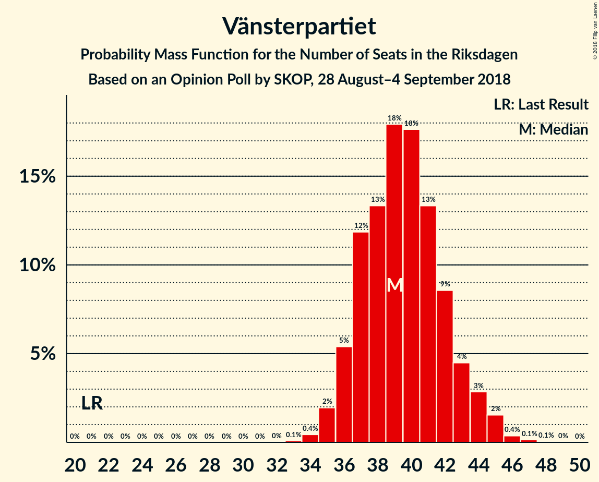

| Number of Seats | Probability | Accumulated | Special Marks |
|:---------------:|:-----------:|:-----------:|:-------------:|
| 21 | 0% | 100% | Last Result |
| 22 | 0% | 100% |  |
| 23 | 0% | 100% |  |
| 24 | 0% | 100% |  |
| 25 | 0% | 100% |  |
| 26 | 0% | 100% |  |
| 27 | 0% | 100% |  |
| 28 | 0% | 100% |  |
| 29 | 0% | 100% |  |
| 30 | 0% | 100% |  |
| 31 | 0% | 100% |  |
| 32 | 0% | 100% |  |
| 33 | 0.1% | 100% |  |
| 34 | 0.4% | 99.9% |  |
| 35 | 2% | 99.5% |  |
| 36 | 5% | 98% |  |
| 37 | 12% | 92% |  |
| 38 | 13% | 80% |  |
| 39 | 18% | 67% | Median |
| 40 | 18% | 49% |  |
| 41 | 13% | 31% |  |
| 42 | 9% | 18% |  |
| 43 | 4% | 9% |  |
| 44 | 3% | 5% |  |
| 45 | 2% | 2% |  |
| 46 | 0.4% | 0.6% |  |
| 47 | 0.1% | 0.2% |  |
| 48 | 0.1% | 0.1% |  |
| 49 | 0% | 0% |  |

### Centerpartiet

*For a full overview of the results for this party, see the [Centerpartiet](party-centerpartiet.html) page.*

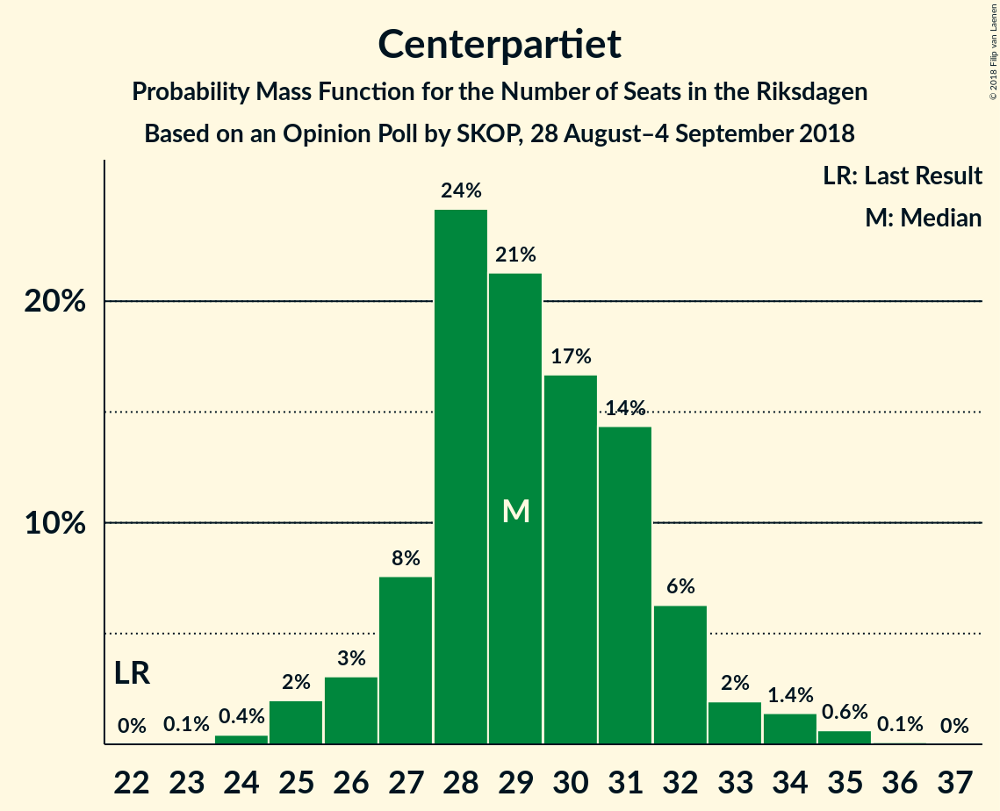

| Number of Seats | Probability | Accumulated | Special Marks |
|:---------------:|:-----------:|:-----------:|:-------------:|
| 22 | 0% | 100% | Last Result |
| 23 | 0.1% | 100% |  |
| 24 | 0.4% | 99.9% |  |
| 25 | 2% | 99.5% |  |
| 26 | 3% | 98% |  |
| 27 | 8% | 94% |  |
| 28 | 24% | 87% |  |
| 29 | 21% | 63% | Median |
| 30 | 17% | 41% |  |
| 31 | 14% | 25% |  |
| 32 | 6% | 10% |  |
| 33 | 2% | 4% |  |
| 34 | 1.4% | 2% |  |
| 35 | 0.6% | 0.7% |  |
| 36 | 0.1% | 0.1% |  |
| 37 | 0% | 0% |  |

### Kristdemokraterna

*For a full overview of the results for this party, see the [Kristdemokraterna](party-kristdemokraterna.html) page.*

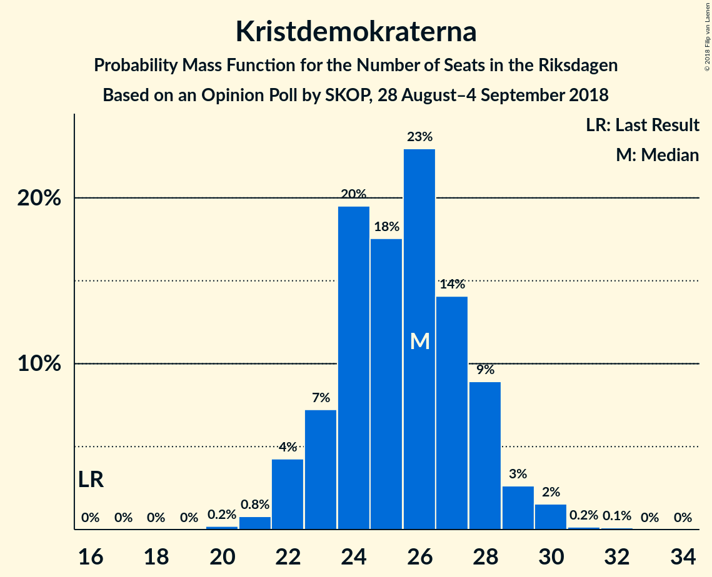

| Number of Seats | Probability | Accumulated | Special Marks |
|:---------------:|:-----------:|:-----------:|:-------------:|
| 16 | 0% | 100% | Last Result |
| 17 | 0% | 100% |  |
| 18 | 0% | 100% |  |
| 19 | 0% | 100% |  |
| 20 | 0.2% | 100% |  |
| 21 | 0.8% | 99.8% |  |
| 22 | 4% | 99.0% |  |
| 23 | 7% | 95% |  |
| 24 | 20% | 87% |  |
| 25 | 18% | 68% |  |
| 26 | 23% | 50% | Median |
| 27 | 14% | 27% |  |
| 28 | 9% | 13% |  |
| 29 | 3% | 4% |  |
| 30 | 2% | 2% |  |
| 31 | 0.2% | 0.3% |  |
| 32 | 0.1% | 0.1% |  |
| 33 | 0% | 0% |  |

### Miljöpartiet de gröna

*For a full overview of the results for this party, see the [Miljöpartiet de gröna](party-miljöpartietdegröna.html) page.*

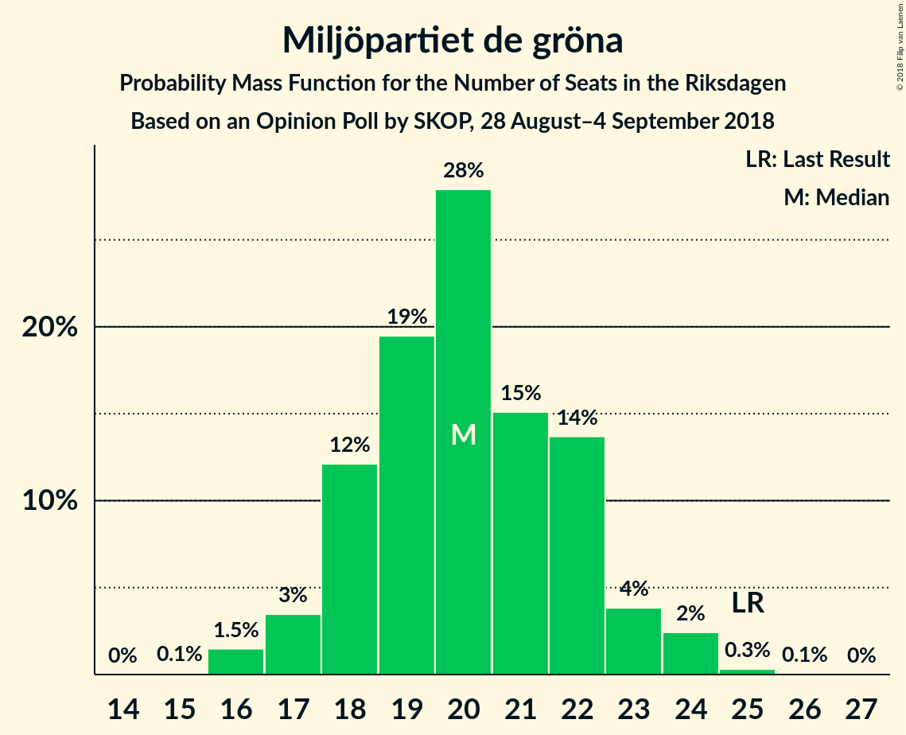

| Number of Seats | Probability | Accumulated | Special Marks |
|:---------------:|:-----------:|:-----------:|:-------------:|
| 15 | 0.1% | 100% |  |
| 16 | 1.5% | 99.9% |  |
| 17 | 3% | 98% |  |
| 18 | 12% | 95% |  |
| 19 | 19% | 83% |  |
| 20 | 28% | 63% | Median |
| 21 | 15% | 35% |  |
| 22 | 14% | 20% |  |
| 23 | 4% | 7% |  |
| 24 | 2% | 3% |  |
| 25 | 0.3% | 0.4% | Last Result |
| 26 | 0.1% | 0.1% |  |
| 27 | 0% | 0% |  |

### Liberalerna

*For a full overview of the results for this party, see the [Liberalerna](party-liberalerna.html) page.*

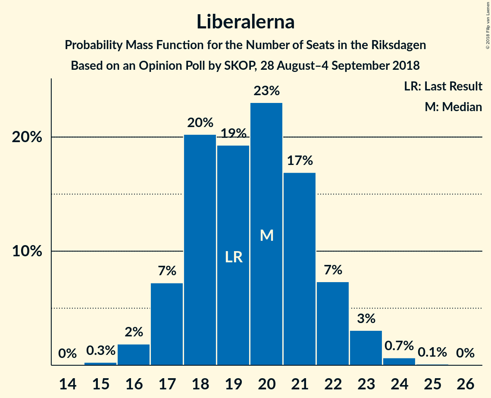

| Number of Seats | Probability | Accumulated | Special Marks |
|:---------------:|:-----------:|:-----------:|:-------------:|
| 15 | 0.3% | 100% |  |
| 16 | 2% | 99.7% |  |
| 17 | 7% | 98% |  |
| 18 | 20% | 91% |  |
| 19 | 19% | 70% | Last Result |
| 20 | 23% | 51% | Median |
| 21 | 17% | 28% |  |
| 22 | 7% | 11% |  |
| 23 | 3% | 4% |  |
| 24 | 0.7% | 0.8% |  |
| 25 | 0.1% | 0.1% |  |
| 26 | 0% | 0% |  |

### Feministiskt initiativ

*For a full overview of the results for this party, see the [Feministiskt initiativ](party-feministisktinitiativ.html) page.*

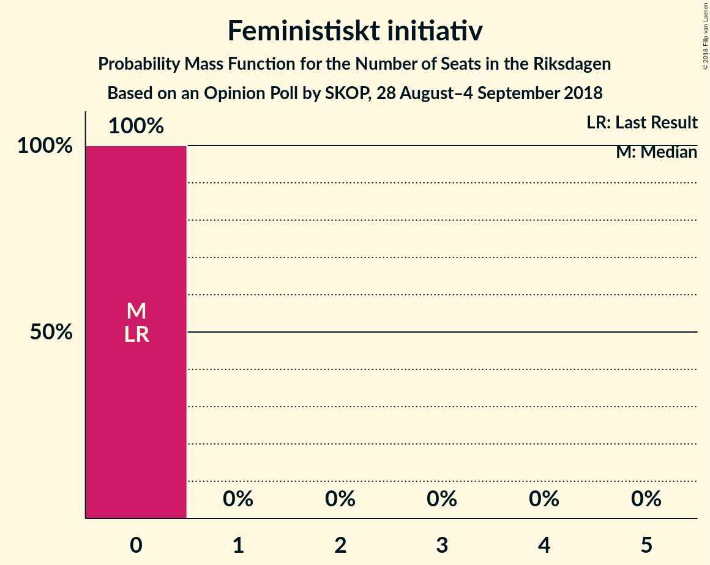

| Number of Seats | Probability | Accumulated | Special Marks |
|:---------------:|:-----------:|:-----------:|:-------------:|
| 0 | 100% | 100% | Last Result, Median |

## Coalitions

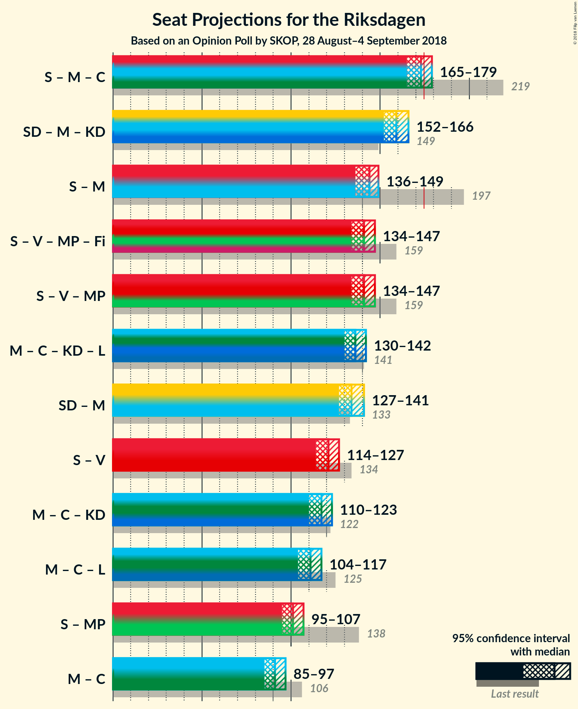

### Confidence Intervals

| Coalition | Last Result | Median | Majority? | 80% Confidence Interval | 90% Confidence Interval | 95% Confidence Interval | 99% Confidence Interval |
|:---------:|:-----------:|:------:|:---------:|:-----------------------:|:-----------------------:|:-----------------------:|:-----------------------:|
| Sveriges socialdemokratiska arbetareparti – Moderata samlingspartiet – Centerpartiet | 219 | 173 | 24% | 168–176 | 166–177 | 165–179 | 163–182 |
| Sverigedemokraterna – Moderata samlingspartiet – Kristdemokraterna | 149 | 159 | 0% | 155–164 | 154–165 | 152–166 | 150–168 |
| Sveriges socialdemokratiska arbetareparti – Moderata samlingspartiet | 197 | 144 | 0% | 138–148 | 137–148 | 136–149 | 134–152 |
| Sveriges socialdemokratiska arbetareparti – Vänsterpartiet – Miljöpartiet de gröna – Feministiskt initiativ | 159 | 141 | 0% | 136–145 | 135–146 | 134–147 | 132–150 |
| Sveriges socialdemokratiska arbetareparti – Vänsterpartiet – Miljöpartiet de gröna | 159 | 141 | 0% | 136–145 | 135–146 | 134–147 | 132–150 |
| Moderata samlingspartiet – Centerpartiet – Kristdemokraterna – Liberalerna | 141 | 136 | 0% | 132–141 | 131–142 | 130–142 | 127–145 |
| Sverigedemokraterna – Moderata samlingspartiet | 133 | 134 | 0% | 129–139 | 128–139 | 127–141 | 125–142 |
| Sveriges socialdemokratiska arbetareparti – Vänsterpartiet | 134 | 121 | 0% | 117–125 | 115–126 | 114–127 | 113–130 |
| Moderata samlingspartiet – Centerpartiet – Kristdemokraterna | 122 | 117 | 0% | 112–121 | 111–122 | 110–123 | 108–125 |
| Moderata samlingspartiet – Centerpartiet – Liberalerna | 125 | 111 | 0% | 107–115 | 105–116 | 104–117 | 103–119 |
| Sveriges socialdemokratiska arbetareparti – Miljöpartiet de gröna | 138 | 101 | 0% | 97–106 | 96–107 | 95–107 | 93–109 |
| Moderata samlingspartiet – Centerpartiet | 106 | 91 | 0% | 87–95 | 86–96 | 85–97 | 84–99 |

### Sveriges socialdemokratiska arbetareparti – Moderata samlingspartiet – Centerpartiet

| Number of Seats | Probability | Accumulated | Special Marks |
|:---------------:|:-----------:|:-----------:|:-------------:|
| 161 | 0.1% | 100% |  |
| 162 | 0.2% | 99.9% |  |
| 163 | 0.2% | 99.7% |  |
| 164 | 1.0% | 99.5% |  |
| 165 | 2% | 98% |  |
| 166 | 4% | 97% |  |
| 167 | 3% | 93% |  |
| 168 | 2% | 90% |  |
| 169 | 8% | 88% |  |
| 170 | 7% | 80% |  |
| 171 | 9% | 72% |  |
| 172 | 5% | 64% | Median |
| 173 | 16% | 58% |  |
| 174 | 18% | 42% |  |
| 175 | 8% | 24% | Majority |
| 176 | 6% | 16% |  |
| 177 | 5% | 10% |  |
| 178 | 2% | 5% |  |
| 179 | 2% | 3% |  |
| 180 | 0.5% | 1.5% |  |
| 181 | 0.4% | 0.9% |  |
| 182 | 0.4% | 0.6% |  |
| 183 | 0.2% | 0.2% |  |
| 184 | 0% | 0% |  |
| 185 | 0% | 0% |  |
| 186 | 0% | 0% |  |
| 187 | 0% | 0% |  |
| 188 | 0% | 0% |  |
| 189 | 0% | 0% |  |
| 190 | 0% | 0% |  |
| 191 | 0% | 0% |  |
| 192 | 0% | 0% |  |
| 193 | 0% | 0% |  |
| 194 | 0% | 0% |  |
| 195 | 0% | 0% |  |
| 196 | 0% | 0% |  |
| 197 | 0% | 0% |  |
| 198 | 0% | 0% |  |
| 199 | 0% | 0% |  |
| 200 | 0% | 0% |  |
| 201 | 0% | 0% |  |
| 202 | 0% | 0% |  |
| 203 | 0% | 0% |  |
| 204 | 0% | 0% |  |
| 205 | 0% | 0% |  |
| 206 | 0% | 0% |  |
| 207 | 0% | 0% |  |
| 208 | 0% | 0% |  |
| 209 | 0% | 0% |  |
| 210 | 0% | 0% |  |
| 211 | 0% | 0% |  |
| 212 | 0% | 0% |  |
| 213 | 0% | 0% |  |
| 214 | 0% | 0% |  |
| 215 | 0% | 0% |  |
| 216 | 0% | 0% |  |
| 217 | 0% | 0% |  |
| 218 | 0% | 0% |  |
| 219 | 0% | 0% | Last Result |

### Sverigedemokraterna – Moderata samlingspartiet – Kristdemokraterna

| Number of Seats | Probability | Accumulated | Special Marks |
|:---------------:|:-----------:|:-----------:|:-------------:|
| 147 | 0% | 100% |  |
| 148 | 0% | 99.9% |  |
| 149 | 0.1% | 99.9% | Last Result |
| 150 | 0.4% | 99.8% |  |
| 151 | 2% | 99.4% |  |
| 152 | 1.3% | 98% |  |
| 153 | 1.2% | 96% |  |
| 154 | 2% | 95% |  |
| 155 | 5% | 93% |  |
| 156 | 5% | 88% |  |
| 157 | 12% | 83% |  |
| 158 | 12% | 71% |  |
| 159 | 9% | 58% |  |
| 160 | 14% | 49% | Median |
| 161 | 6% | 35% |  |
| 162 | 12% | 29% |  |
| 163 | 5% | 17% |  |
| 164 | 6% | 12% |  |
| 165 | 2% | 6% |  |
| 166 | 1.4% | 4% |  |
| 167 | 0.9% | 2% |  |
| 168 | 0.9% | 1.3% |  |
| 169 | 0.2% | 0.4% |  |
| 170 | 0.1% | 0.2% |  |
| 171 | 0% | 0.1% |  |
| 172 | 0% | 0% |  |

### Sveriges socialdemokratiska arbetareparti – Moderata samlingspartiet

| Number of Seats | Probability | Accumulated | Special Marks |
|:---------------:|:-----------:|:-----------:|:-------------:|
| 132 | 0.1% | 100% |  |
| 133 | 0.2% | 99.9% |  |
| 134 | 0.8% | 99.7% |  |
| 135 | 0.6% | 98.9% |  |
| 136 | 2% | 98% |  |
| 137 | 3% | 97% |  |
| 138 | 4% | 94% |  |
| 139 | 7% | 90% |  |
| 140 | 6% | 82% |  |
| 141 | 6% | 77% |  |
| 142 | 8% | 70% |  |
| 143 | 9% | 62% | Median |
| 144 | 15% | 53% |  |
| 145 | 15% | 38% |  |
| 146 | 6% | 23% |  |
| 147 | 6% | 17% |  |
| 148 | 6% | 11% |  |
| 149 | 2% | 4% |  |
| 150 | 1.2% | 2% |  |
| 151 | 0.5% | 1.2% |  |
| 152 | 0.2% | 0.7% |  |
| 153 | 0.3% | 0.5% |  |
| 154 | 0.1% | 0.2% |  |
| 155 | 0.1% | 0.1% |  |
| 156 | 0% | 0% |  |
| 157 | 0% | 0% |  |
| 158 | 0% | 0% |  |
| 159 | 0% | 0% |  |
| 160 | 0% | 0% |  |
| 161 | 0% | 0% |  |
| 162 | 0% | 0% |  |
| 163 | 0% | 0% |  |
| 164 | 0% | 0% |  |
| 165 | 0% | 0% |  |
| 166 | 0% | 0% |  |
| 167 | 0% | 0% |  |
| 168 | 0% | 0% |  |
| 169 | 0% | 0% |  |
| 170 | 0% | 0% |  |
| 171 | 0% | 0% |  |
| 172 | 0% | 0% |  |
| 173 | 0% | 0% |  |
| 174 | 0% | 0% |  |
| 175 | 0% | 0% | Majority |
| 176 | 0% | 0% |  |
| 177 | 0% | 0% |  |
| 178 | 0% | 0% |  |
| 179 | 0% | 0% |  |
| 180 | 0% | 0% |  |
| 181 | 0% | 0% |  |
| 182 | 0% | 0% |  |
| 183 | 0% | 0% |  |
| 184 | 0% | 0% |  |
| 185 | 0% | 0% |  |
| 186 | 0% | 0% |  |
| 187 | 0% | 0% |  |
| 188 | 0% | 0% |  |
| 189 | 0% | 0% |  |
| 190 | 0% | 0% |  |
| 191 | 0% | 0% |  |
| 192 | 0% | 0% |  |
| 193 | 0% | 0% |  |
| 194 | 0% | 0% |  |
| 195 | 0% | 0% |  |
| 196 | 0% | 0% |  |
| 197 | 0% | 0% | Last Result |

### Sveriges socialdemokratiska arbetareparti – Vänsterpartiet – Miljöpartiet de gröna – Feministiskt initiativ

| Number of Seats | Probability | Accumulated | Special Marks |
|:---------------:|:-----------:|:-----------:|:-------------:|
| 130 | 0.1% | 100% |  |
| 131 | 0.2% | 99.9% |  |
| 132 | 0.6% | 99.7% |  |
| 133 | 0.6% | 99.1% |  |
| 134 | 2% | 98% |  |
| 135 | 2% | 96% |  |
| 136 | 5% | 94% |  |
| 137 | 6% | 89% |  |
| 138 | 7% | 83% |  |
| 139 | 5% | 76% |  |
| 140 | 15% | 71% | Median |
| 141 | 16% | 55% |  |
| 142 | 9% | 40% |  |
| 143 | 9% | 31% |  |
| 144 | 11% | 22% |  |
| 145 | 3% | 11% |  |
| 146 | 4% | 8% |  |
| 147 | 2% | 5% |  |
| 148 | 1.0% | 2% |  |
| 149 | 0.7% | 1.5% |  |
| 150 | 0.4% | 0.7% |  |
| 151 | 0.2% | 0.4% |  |
| 152 | 0.1% | 0.1% |  |
| 153 | 0% | 0.1% |  |
| 154 | 0% | 0% |  |
| 155 | 0% | 0% |  |
| 156 | 0% | 0% |  |
| 157 | 0% | 0% |  |
| 158 | 0% | 0% |  |
| 159 | 0% | 0% | Last Result |

### Sveriges socialdemokratiska arbetareparti – Vänsterpartiet – Miljöpartiet de gröna

| Number of Seats | Probability | Accumulated | Special Marks |
|:---------------:|:-----------:|:-----------:|:-------------:|
| 130 | 0.1% | 100% |  |
| 131 | 0.2% | 99.9% |  |
| 132 | 0.6% | 99.7% |  |
| 133 | 0.6% | 99.1% |  |
| 134 | 2% | 98% |  |
| 135 | 2% | 96% |  |
| 136 | 5% | 94% |  |
| 137 | 6% | 89% |  |
| 138 | 7% | 83% |  |
| 139 | 5% | 76% |  |
| 140 | 15% | 71% | Median |
| 141 | 16% | 55% |  |
| 142 | 9% | 40% |  |
| 143 | 9% | 31% |  |
| 144 | 11% | 22% |  |
| 145 | 3% | 11% |  |
| 146 | 4% | 8% |  |
| 147 | 2% | 5% |  |
| 148 | 1.0% | 2% |  |
| 149 | 0.7% | 1.5% |  |
| 150 | 0.4% | 0.7% |  |
| 151 | 0.2% | 0.4% |  |
| 152 | 0.1% | 0.1% |  |
| 153 | 0% | 0.1% |  |
| 154 | 0% | 0% |  |
| 155 | 0% | 0% |  |
| 156 | 0% | 0% |  |
| 157 | 0% | 0% |  |
| 158 | 0% | 0% |  |
| 159 | 0% | 0% | Last Result |

### Moderata samlingspartiet – Centerpartiet – Kristdemokraterna – Liberalerna

| Number of Seats | Probability | Accumulated | Special Marks |
|:---------------:|:-----------:|:-----------:|:-------------:|
| 125 | 0.1% | 100% |  |
| 126 | 0.3% | 99.9% |  |
| 127 | 0.3% | 99.6% |  |
| 128 | 0.6% | 99.3% |  |
| 129 | 1.0% | 98.8% |  |
| 130 | 2% | 98% |  |
| 131 | 4% | 96% |  |
| 132 | 6% | 92% |  |
| 133 | 5% | 86% |  |
| 134 | 15% | 81% |  |
| 135 | 10% | 65% |  |
| 136 | 9% | 55% |  |
| 137 | 9% | 47% | Median |
| 138 | 16% | 38% |  |
| 139 | 8% | 22% |  |
| 140 | 4% | 15% |  |
| 141 | 3% | 11% | Last Result |
| 142 | 5% | 7% |  |
| 143 | 1.2% | 2% |  |
| 144 | 0.5% | 1.0% |  |
| 145 | 0.3% | 0.5% |  |
| 146 | 0.1% | 0.2% |  |
| 147 | 0.1% | 0.1% |  |
| 148 | 0% | 0% |  |

### Sverigedemokraterna – Moderata samlingspartiet

| Number of Seats | Probability | Accumulated | Special Marks |
|:---------------:|:-----------:|:-----------:|:-------------:|
| 123 | 0.1% | 100% |  |
| 124 | 0.1% | 99.9% |  |
| 125 | 0.8% | 99.8% |  |
| 126 | 0.6% | 99.0% |  |
| 127 | 2% | 98% |  |
| 128 | 2% | 96% |  |
| 129 | 6% | 94% |  |
| 130 | 5% | 88% |  |
| 131 | 4% | 83% |  |
| 132 | 14% | 79% |  |
| 133 | 11% | 65% | Last Result |
| 134 | 9% | 54% | Median |
| 135 | 15% | 45% |  |
| 136 | 8% | 30% |  |
| 137 | 5% | 22% |  |
| 138 | 5% | 16% |  |
| 139 | 6% | 11% |  |
| 140 | 1.4% | 5% |  |
| 141 | 3% | 3% |  |
| 142 | 0.3% | 0.7% |  |
| 143 | 0.2% | 0.5% |  |
| 144 | 0.1% | 0.2% |  |
| 145 | 0.1% | 0.1% |  |
| 146 | 0% | 0% |  |

### Sveriges socialdemokratiska arbetareparti – Vänsterpartiet

| Number of Seats | Probability | Accumulated | Special Marks |
|:---------------:|:-----------:|:-----------:|:-------------:|
| 110 | 0.1% | 100% |  |
| 111 | 0.2% | 99.9% |  |
| 112 | 0.1% | 99.7% |  |
| 113 | 0.6% | 99.6% |  |
| 114 | 3% | 99.0% |  |
| 115 | 2% | 96% |  |
| 116 | 2% | 94% |  |
| 117 | 9% | 92% |  |
| 118 | 7% | 83% |  |
| 119 | 8% | 76% |  |
| 120 | 14% | 68% | Median |
| 121 | 16% | 54% |  |
| 122 | 7% | 39% |  |
| 123 | 13% | 32% |  |
| 124 | 8% | 19% |  |
| 125 | 3% | 11% |  |
| 126 | 4% | 8% |  |
| 127 | 2% | 4% |  |
| 128 | 1.2% | 2% |  |
| 129 | 0.6% | 1.2% |  |
| 130 | 0.4% | 0.6% |  |
| 131 | 0.1% | 0.2% |  |
| 132 | 0.1% | 0.1% |  |
| 133 | 0% | 0% |  |
| 134 | 0% | 0% | Last Result |

### Moderata samlingspartiet – Centerpartiet – Kristdemokraterna

| Number of Seats | Probability | Accumulated | Special Marks |
|:---------------:|:-----------:|:-----------:|:-------------:|
| 106 | 0.1% | 100% |  |
| 107 | 0.3% | 99.9% |  |
| 108 | 0.2% | 99.5% |  |
| 109 | 0.5% | 99.3% |  |
| 110 | 1.3% | 98.8% |  |
| 111 | 5% | 97% |  |
| 112 | 5% | 93% |  |
| 113 | 3% | 88% |  |
| 114 | 9% | 85% |  |
| 115 | 12% | 76% |  |
| 116 | 9% | 64% |  |
| 117 | 11% | 55% | Median |
| 118 | 20% | 44% |  |
| 119 | 9% | 24% |  |
| 120 | 3% | 14% |  |
| 121 | 4% | 11% |  |
| 122 | 4% | 7% | Last Result |
| 123 | 2% | 4% |  |
| 124 | 0.7% | 1.2% |  |
| 125 | 0.3% | 0.5% |  |
| 126 | 0.1% | 0.2% |  |
| 127 | 0.1% | 0.1% |  |
| 128 | 0% | 0.1% |  |
| 129 | 0% | 0% |  |

### Moderata samlingspartiet – Centerpartiet – Liberalerna

| Number of Seats | Probability | Accumulated | Special Marks |
|:---------------:|:-----------:|:-----------:|:-------------:|
| 100 | 0% | 100% |  |
| 101 | 0.2% | 99.9% |  |
| 102 | 0.2% | 99.7% |  |
| 103 | 0.4% | 99.5% |  |
| 104 | 2% | 99.1% |  |
| 105 | 3% | 97% |  |
| 106 | 1.1% | 94% |  |
| 107 | 11% | 93% |  |
| 108 | 11% | 83% |  |
| 109 | 8% | 71% |  |
| 110 | 11% | 64% |  |
| 111 | 16% | 53% | Median |
| 112 | 6% | 36% |  |
| 113 | 4% | 30% |  |
| 114 | 15% | 26% |  |
| 115 | 3% | 11% |  |
| 116 | 5% | 8% |  |
| 117 | 2% | 3% |  |
| 118 | 0.6% | 1.2% |  |
| 119 | 0.1% | 0.6% |  |
| 120 | 0.3% | 0.5% |  |
| 121 | 0.1% | 0.1% |  |
| 122 | 0% | 0% |  |
| 123 | 0% | 0% |  |
| 124 | 0% | 0% |  |
| 125 | 0% | 0% | Last Result |

### Sveriges socialdemokratiska arbetareparti – Miljöpartiet de gröna

| Number of Seats | Probability | Accumulated | Special Marks |
|:---------------:|:-----------:|:-----------:|:-------------:|
| 91 | 0.1% | 100% |  |
| 92 | 0.2% | 99.9% |  |
| 93 | 0.7% | 99.7% |  |
| 94 | 1.0% | 99.0% |  |
| 95 | 2% | 98% |  |
| 96 | 4% | 96% |  |
| 97 | 3% | 92% |  |
| 98 | 7% | 89% |  |
| 99 | 12% | 82% |  |
| 100 | 11% | 70% |  |
| 101 | 13% | 59% | Median |
| 102 | 12% | 46% |  |
| 103 | 7% | 34% |  |
| 104 | 8% | 27% |  |
| 105 | 6% | 19% |  |
| 106 | 8% | 13% |  |
| 107 | 3% | 5% |  |
| 108 | 2% | 2% |  |
| 109 | 0.4% | 0.9% |  |
| 110 | 0.4% | 0.5% |  |
| 111 | 0.1% | 0.1% |  |
| 112 | 0% | 0% |  |
| 113 | 0% | 0% |  |
| 114 | 0% | 0% |  |
| 115 | 0% | 0% |  |
| 116 | 0% | 0% |  |
| 117 | 0% | 0% |  |
| 118 | 0% | 0% |  |
| 119 | 0% | 0% |  |
| 120 | 0% | 0% |  |
| 121 | 0% | 0% |  |
| 122 | 0% | 0% |  |
| 123 | 0% | 0% |  |
| 124 | 0% | 0% |  |
| 125 | 0% | 0% |  |
| 126 | 0% | 0% |  |
| 127 | 0% | 0% |  |
| 128 | 0% | 0% |  |
| 129 | 0% | 0% |  |
| 130 | 0% | 0% |  |
| 131 | 0% | 0% |  |
| 132 | 0% | 0% |  |
| 133 | 0% | 0% |  |
| 134 | 0% | 0% |  |
| 135 | 0% | 0% |  |
| 136 | 0% | 0% |  |
| 137 | 0% | 0% |  |
| 138 | 0% | 0% | Last Result |

### Moderata samlingspartiet – Centerpartiet

| Number of Seats | Probability | Accumulated | Special Marks |
|:---------------:|:-----------:|:-----------:|:-------------:|
| 81 | 0% | 100% |  |
| 82 | 0.1% | 99.9% |  |
| 83 | 0.3% | 99.8% |  |
| 84 | 1.4% | 99.6% |  |
| 85 | 2% | 98% |  |
| 86 | 4% | 96% |  |
| 87 | 3% | 92% |  |
| 88 | 4% | 89% |  |
| 89 | 14% | 85% |  |
| 90 | 11% | 71% |  |
| 91 | 12% | 59% | Median |
| 92 | 13% | 48% |  |
| 93 | 14% | 34% |  |
| 94 | 7% | 20% |  |
| 95 | 7% | 13% |  |
| 96 | 3% | 6% |  |
| 97 | 1.5% | 3% |  |
| 98 | 1.0% | 2% |  |
| 99 | 0.3% | 0.6% |  |
| 100 | 0.2% | 0.3% |  |
| 101 | 0.1% | 0.1% |  |
| 102 | 0% | 0.1% |  |
| 103 | 0% | 0% |  |
| 104 | 0% | 0% |  |
| 105 | 0% | 0% |  |
| 106 | 0% | 0% | Last Result |

## Technical Information

### Opinion Poll

+ **Polling firm:** SKOP
+ **Commissioner(s):** —
+ **Fieldwork period:** 28 August–4 September 2018

### Calculations

+ **Sample size:** 2597
+ **Simulations done:** 1,048,576
+ **Error estimate:** 1.05%

