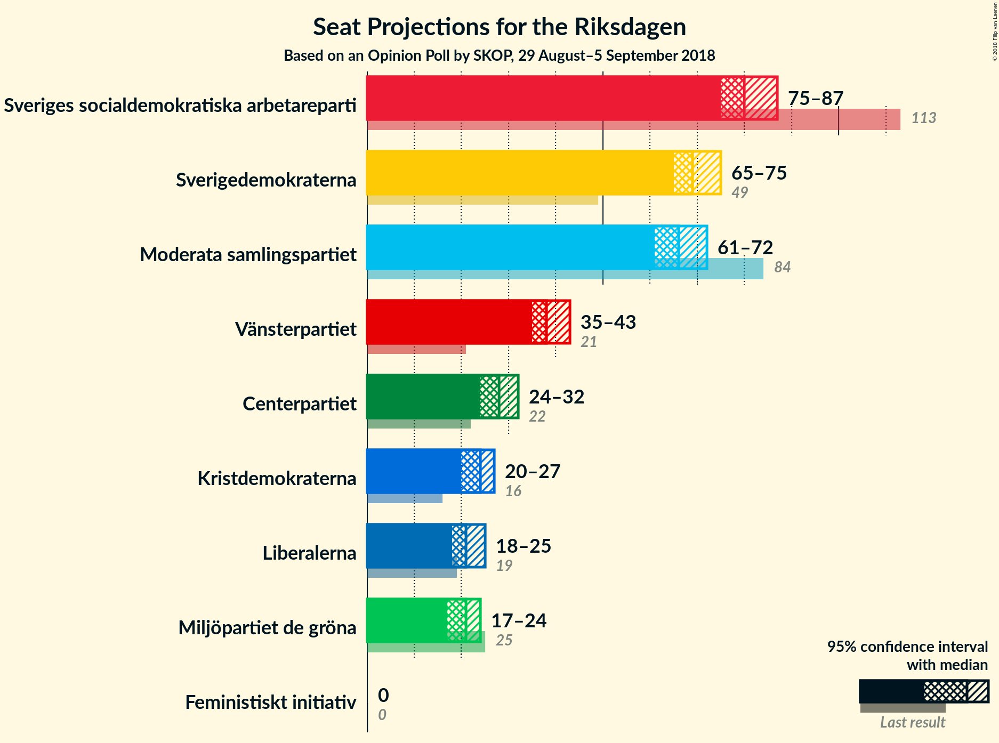
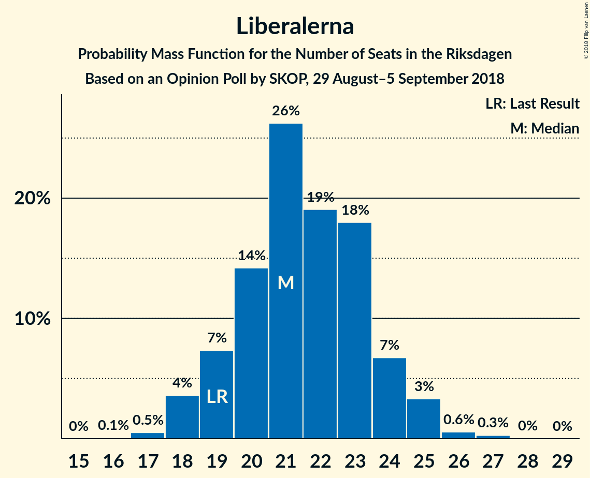
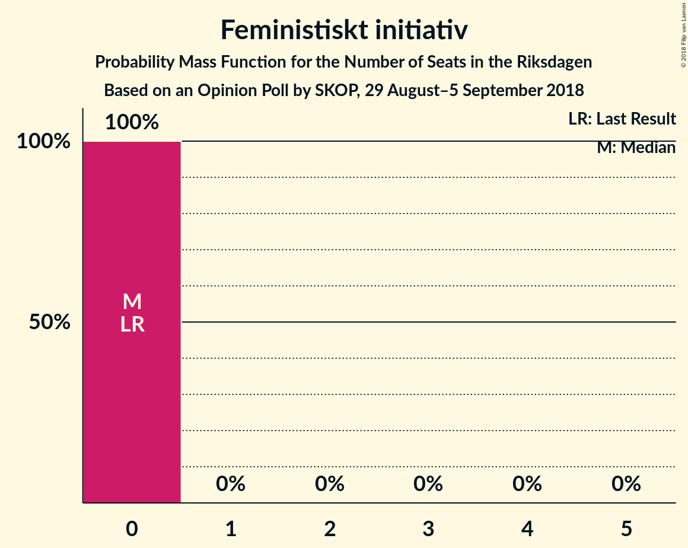

# Opinion Poll by SKOP, 29 August–5 September 2018

<a href="#voting-intentions">Voting Intentions</a> | <a href="#seats">Seats</a> | <a href="#coalitions">Coalitions</a> | <a href="#technical-information">Technical Information</a>

## Voting Intentions

### Confidence Intervals

| Party | Last Result | Poll Result | 80% Confidence Interval | 90% Confidence Interval | 95% Confidence Interval | 99% Confidence Interval |
|:-----:|:-----------:|:-----------:|:-----------------------:|:-----------------------:|:-----------------------:|:-----------------------:|
| Sveriges socialdemokratiska arbetareparti | 31.0% | 22.1% | 21.1–23.2% |20.8–23.5% |20.6–23.7% |20.1–24.2% |
| Sverigedemokraterna | 12.9% | 19.2% | 18.2–20.2% |18.0–20.5% |17.7–20.8% |17.3–21.2% |
| Moderata samlingspartiet | 23.3% | 18.2% | 17.2–19.2% |17.0–19.5% |16.8–19.7% |16.3–20.2% |
| Vänsterpartiet | 5.7% | 10.6% | 9.9–11.4% |9.6–11.6% |9.5–11.8% |9.1–12.2% |
| Centerpartiet | 6.1% | 7.7% | 7.1–8.4% |6.9–8.6% |6.7–8.8% |6.4–9.1% |
| Kristdemokraterna | 4.6% | 6.6% | 6.0–7.3% |5.9–7.5% |5.7–7.6% |5.4–7.9% |
| Liberalerna | 5.4% | 5.9% | 5.3–6.5% |5.2–6.7% |5.0–6.9% |4.8–7.2% |
| Miljöpartiet de gröna | 6.9% | 5.6% | 5.0–6.2% |4.9–6.4% |4.8–6.5% |4.5–6.8% |
| Feministiskt initiativ | 3.1% | 1.1% | 0.9–1.4% |0.8–1.5% |0.8–1.6% |0.7–1.7% |

*Note:* The poll result column reflects the actual value used in the calculations. Published results may vary slightly, and in addition be rounded to fewer digits.

## Seats

### Confidence Intervals

| Party | Last Result | Median | 80% Confidence Interval | 90% Confidence Interval | 95% Confidence Interval | 99% Confidence Interval |
|:-----:|:-----------:|:------:|:-----------------------:|:-----------------------:|:-----------------------:|:-----------------------:|
| <a href="#sveriges-socialdemokratiska-arbetareparti">Sveriges socialdemokratiska arbetareparti</a> | 113 | 80 | 76–85 |75–86 |75–87 |72–88 |
| <a href="#sverigedemokraterna">Sverigedemokraterna</a> | 49 | 69 | 66–74 |65–75 |65–75 |63–76 |
| <a href="#moderata-samlingspartiet">Moderata samlingspartiet</a> | 84 | 66 | 63–70 |61–70 |61–72 |59–73 |
| <a href="#vänsterpartiet">Vänsterpartiet</a> | 21 | 38 | 36–42 |35–43 |35–43 |33–45 |
| <a href="#centerpartiet">Centerpartiet</a> | 22 | 28 | 26–31 |25–31 |24–32 |23–33 |
| <a href="#kristdemokraterna">Kristdemokraterna</a> | 16 | 24 | 22–26 |21–27 |20–27 |20–29 |
| <a href="#liberalerna">Liberalerna</a> | 19 | 21 | 19–24 |19–24 |18–25 |17–26 |
| <a href="#miljöpartiet-de-gröna">Miljöpartiet de gröna</a> | 25 | 21 | 18–23 |18–23 |17–24 |17–25 |
| <a href="#feministiskt-initiativ">Feministiskt initiativ</a> | 0 | 0 | 0 |0 |0 |0 |

### Sveriges socialdemokratiska arbetareparti

*For a full overview of the results for this party, see the [Sveriges socialdemokratiska arbetareparti](party-sverigessocialdemokratiskaarbetareparti.html) page.*

| Number of Seats | Probability | Accumulated | Special Marks |
|:---------------:|:-----------:|:-----------:|:-------------:|
| 71 | 0.2% | 100% |  |
| 72 | 0.3% | 99.8% |  |
| 73 | 0.7% | 99.4% |  |
| 74 | 0.8% | 98.7% |  |
| 75 | 3% | 98% |  |
| 76 | 7% | 95% |  |
| 77 | 9% | 88% |  |
| 78 | 9% | 79% |  |
| 79 | 9% | 70% |  |
| 80 | 11% | 60% | Median |
| 81 | 14% | 50% |  |
| 82 | 8% | 36% |  |
| 83 | 8% | 28% |  |
| 84 | 9% | 20% |  |
| 85 | 5% | 11% |  |
| 86 | 3% | 6% |  |
| 87 | 2% | 3% |  |
| 88 | 0.5% | 0.9% |  |
| 89 | 0.3% | 0.4% |  |
| 90 | 0.1% | 0.1% |  |
| 91 | 0% | 0.1% |  |
| 92 | 0% | 0% |  |
| 93 | 0% | 0% |  |
| 94 | 0% | 0% |  |
| 95 | 0% | 0% |  |
| 96 | 0% | 0% |  |
| 97 | 0% | 0% |  |
| 98 | 0% | 0% |  |
| 99 | 0% | 0% |  |
| 100 | 0% | 0% |  |
| 101 | 0% | 0% |  |
| 102 | 0% | 0% |  |
| 103 | 0% | 0% |  |
| 104 | 0% | 0% |  |
| 105 | 0% | 0% |  |
| 106 | 0% | 0% |  |
| 107 | 0% | 0% |  |
| 108 | 0% | 0% |  |
| 109 | 0% | 0% |  |
| 110 | 0% | 0% |  |
| 111 | 0% | 0% |  |
| 112 | 0% | 0% |  |
| 113 | 0% | 0% | Last Result |

### Sverigedemokraterna

*For a full overview of the results for this party, see the [Sverigedemokraterna](party-sverigedemokraterna.html) page.*

| Number of Seats | Probability | Accumulated | Special Marks |
|:---------------:|:-----------:|:-----------:|:-------------:|
| 49 | 0% | 100% | Last Result |
| 50 | 0% | 100% |  |
| 51 | 0% | 100% |  |
| 52 | 0% | 100% |  |
| 53 | 0% | 100% |  |
| 54 | 0% | 100% |  |
| 55 | 0% | 100% |  |
| 56 | 0% | 100% |  |
| 57 | 0% | 100% |  |
| 58 | 0% | 100% |  |
| 59 | 0% | 100% |  |
| 60 | 0.1% | 100% |  |
| 61 | 0.1% | 99.9% |  |
| 62 | 0.2% | 99.8% |  |
| 63 | 0.4% | 99.6% |  |
| 64 | 2% | 99.2% |  |
| 65 | 4% | 98% |  |
| 66 | 16% | 93% |  |
| 67 | 15% | 77% |  |
| 68 | 10% | 62% |  |
| 69 | 10% | 52% | Median |
| 70 | 3% | 42% |  |
| 71 | 2% | 39% |  |
| 72 | 7% | 37% |  |
| 73 | 13% | 29% |  |
| 74 | 7% | 16% |  |
| 75 | 8% | 9% |  |
| 76 | 1.1% | 1.5% |  |
| 77 | 0.2% | 0.4% |  |
| 78 | 0.1% | 0.2% |  |
| 79 | 0.1% | 0.1% |  |
| 80 | 0% | 0% |  |

### Moderata samlingspartiet

*For a full overview of the results for this party, see the [Moderata samlingspartiet](party-moderatasamlingspartiet.html) page.*

| Number of Seats | Probability | Accumulated | Special Marks |
|:---------------:|:-----------:|:-----------:|:-------------:|
| 57 | 0.1% | 100% |  |
| 58 | 0.2% | 99.9% |  |
| 59 | 0.5% | 99.8% |  |
| 60 | 1.2% | 99.3% |  |
| 61 | 4% | 98% |  |
| 62 | 4% | 95% |  |
| 63 | 8% | 91% |  |
| 64 | 10% | 83% |  |
| 65 | 11% | 73% |  |
| 66 | 21% | 61% | Median |
| 67 | 12% | 41% |  |
| 68 | 10% | 29% |  |
| 69 | 8% | 18% |  |
| 70 | 5% | 10% |  |
| 71 | 2% | 5% |  |
| 72 | 2% | 3% |  |
| 73 | 0.8% | 1.3% |  |
| 74 | 0.3% | 0.4% |  |
| 75 | 0.1% | 0.2% |  |
| 76 | 0% | 0% |  |
| 77 | 0% | 0% |  |
| 78 | 0% | 0% |  |
| 79 | 0% | 0% |  |
| 80 | 0% | 0% |  |
| 81 | 0% | 0% |  |
| 82 | 0% | 0% |  |
| 83 | 0% | 0% |  |
| 84 | 0% | 0% | Last Result |

### Vänsterpartiet

*For a full overview of the results for this party, see the [Vänsterpartiet](party-vänsterpartiet.html) page.*

| Number of Seats | Probability | Accumulated | Special Marks |
|:---------------:|:-----------:|:-----------:|:-------------:|
| 21 | 0% | 100% | Last Result |
| 22 | 0% | 100% |  |
| 23 | 0% | 100% |  |
| 24 | 0% | 100% |  |
| 25 | 0% | 100% |  |
| 26 | 0% | 100% |  |
| 27 | 0% | 100% |  |
| 28 | 0% | 100% |  |
| 29 | 0% | 100% |  |
| 30 | 0% | 100% |  |
| 31 | 0.1% | 100% |  |
| 32 | 0.2% | 99.9% |  |
| 33 | 1.0% | 99.8% |  |
| 34 | 1.2% | 98.8% |  |
| 35 | 7% | 98% |  |
| 36 | 8% | 90% |  |
| 37 | 11% | 82% |  |
| 38 | 22% | 71% | Median |
| 39 | 14% | 48% |  |
| 40 | 11% | 34% |  |
| 41 | 8% | 23% |  |
| 42 | 9% | 15% |  |
| 43 | 4% | 6% |  |
| 44 | 1.1% | 2% |  |
| 45 | 0.5% | 0.6% |  |
| 46 | 0.1% | 0.1% |  |
| 47 | 0% | 0% |  |

### Centerpartiet

*For a full overview of the results for this party, see the [Centerpartiet](party-centerpartiet.html) page.*

| Number of Seats | Probability | Accumulated | Special Marks |
|:---------------:|:-----------:|:-----------:|:-------------:|
| 22 | 0.1% | 100% | Last Result |
| 23 | 0.5% | 99.9% |  |
| 24 | 2% | 99.4% |  |
| 25 | 5% | 97% |  |
| 26 | 10% | 92% |  |
| 27 | 19% | 82% |  |
| 28 | 18% | 62% | Median |
| 29 | 20% | 45% |  |
| 30 | 15% | 25% |  |
| 31 | 6% | 10% |  |
| 32 | 2% | 4% |  |
| 33 | 1.2% | 1.5% |  |
| 34 | 0.2% | 0.2% |  |
| 35 | 0% | 0.1% |  |
| 36 | 0% | 0% |  |

### Kristdemokraterna

*For a full overview of the results for this party, see the [Kristdemokraterna](party-kristdemokraterna.html) page.*

| Number of Seats | Probability | Accumulated | Special Marks |
|:---------------:|:-----------:|:-----------:|:-------------:|
| 16 | 0% | 100% | Last Result |
| 17 | 0% | 100% |  |
| 18 | 0% | 100% |  |
| 19 | 0.4% | 100% |  |
| 20 | 2% | 99.6% |  |
| 21 | 6% | 97% |  |
| 22 | 9% | 92% |  |
| 23 | 25% | 83% |  |
| 24 | 27% | 58% | Median |
| 25 | 7% | 30% |  |
| 26 | 16% | 23% |  |
| 27 | 6% | 8% |  |
| 28 | 1.0% | 2% |  |
| 29 | 0.6% | 0.9% |  |
| 30 | 0.2% | 0.3% |  |
| 31 | 0% | 0% |  |

### Liberalerna

*For a full overview of the results for this party, see the [Liberalerna](party-liberalerna.html) page.*

| Number of Seats | Probability | Accumulated | Special Marks |
|:---------------:|:-----------:|:-----------:|:-------------:|
| 16 | 0.1% | 100% |  |
| 17 | 0.5% | 99.9% |  |
| 18 | 4% | 99.4% |  |
| 19 | 7% | 96% | Last Result |
| 20 | 14% | 88% |  |
| 21 | 26% | 74% | Median |
| 22 | 19% | 48% |  |
| 23 | 18% | 29% |  |
| 24 | 7% | 11% |  |
| 25 | 3% | 4% |  |
| 26 | 0.6% | 0.9% |  |
| 27 | 0.3% | 0.3% |  |
| 28 | 0% | 0.1% |  |
| 29 | 0% | 0% |  |

### Miljöpartiet de gröna

*For a full overview of the results for this party, see the [Miljöpartiet de gröna](party-miljöpartietdegröna.html) page.*

| Number of Seats | Probability | Accumulated | Special Marks |
|:---------------:|:-----------:|:-----------:|:-------------:|
| 15 | 0.1% | 100% |  |
| 16 | 0.3% | 99.9% |  |
| 17 | 3% | 99.6% |  |
| 18 | 9% | 96% |  |
| 19 | 13% | 87% |  |
| 20 | 19% | 74% |  |
| 21 | 36% | 55% | Median |
| 22 | 5% | 19% |  |
| 23 | 10% | 14% |  |
| 24 | 3% | 4% |  |
| 25 | 0.4% | 0.6% | Last Result |
| 26 | 0.2% | 0.2% |  |
| 27 | 0% | 0% |  |

### Feministiskt initiativ

*For a full overview of the results for this party, see the [Feministiskt initiativ](party-feministisktinitiativ.html) page.*

| Number of Seats | Probability | Accumulated | Special Marks |
|:---------------:|:-----------:|:-----------:|:-------------:|
| 0 | 100% | 100% | Last Result, Median |

## Coalitions

### Confidence Intervals

| Coalition | Last Result | Median | Majority? | 80% Confidence Interval | 90% Confidence Interval | 95% Confidence Interval | 99% Confidence Interval |
|:---------:|:-----------:|:------:|:---------:|:-----------------------:|:-----------------------:|:-----------------------:|:-----------------------:|
| Sveriges socialdemokratiska arbetareparti – Moderata samlingspartiet – Centerpartiet | 219 | 175 | 56% | 169–179 | 168–180 | 167–182 | 164–184 |
| Sverigedemokraterna – Moderata samlingspartiet – Kristdemokraterna | 149 | 159 | 0% | 154–165 | 153–166 | 152–167 | 150–169 |
| Sveriges socialdemokratiska arbetareparti – Moderata samlingspartiet | 197 | 147 | 0% | 141–151 | 141–152 | 140–154 | 137–156 |
| Sveriges socialdemokratiska arbetareparti – Vänsterpartiet – Miljöpartiet de gröna – Feministiskt initiativ | 159 | 140 | 0% | 135–145 | 133–146 | 132–147 | 130–148 |
| Sveriges socialdemokratiska arbetareparti – Vänsterpartiet – Miljöpartiet de gröna | 159 | 140 | 0% | 135–145 | 133–146 | 132–147 | 130–148 |
| Moderata samlingspartiet – Centerpartiet – Kristdemokraterna – Liberalerna | 141 | 140 | 0% | 135–144 | 134–145 | 133–146 | 131–149 |
| Sverigedemokraterna – Moderata samlingspartiet | 133 | 135 | 0% | 131–142 | 129–142 | 128–143 | 127–145 |
| Sveriges socialdemokratiska arbetareparti – Vänsterpartiet | 134 | 119 | 0% | 114–125 | 113–125 | 112–127 | 110–128 |
| Moderata samlingspartiet – Centerpartiet – Kristdemokraterna | 122 | 119 | 0% | 114–122 | 113–124 | 111–125 | 109–127 |
| Moderata samlingspartiet – Centerpartiet – Liberalerna | 125 | 116 | 0% | 111–120 | 110–121 | 110–122 | 107–124 |
| Sveriges socialdemokratiska arbetareparti – Miljöpartiet de gröna | 138 | 101 | 0% | 97–105 | 96–107 | 94–107 | 92–110 |
| Moderata samlingspartiet – Centerpartiet | 106 | 95 | 0% | 90–98 | 89–99 | 88–100 | 86–102 |

### Sveriges socialdemokratiska arbetareparti – Moderata samlingspartiet – Centerpartiet

| Number of Seats | Probability | Accumulated | Special Marks |
|:---------------:|:-----------:|:-----------:|:-------------:|
| 162 | 0% | 100% |  |
| 163 | 0.1% | 99.9% |  |
| 164 | 0.4% | 99.9% |  |
| 165 | 0.5% | 99.5% |  |
| 166 | 1.0% | 99.0% |  |
| 167 | 0.9% | 98% |  |
| 168 | 2% | 97% |  |
| 169 | 6% | 95% |  |
| 170 | 2% | 89% |  |
| 171 | 9% | 87% |  |
| 172 | 3% | 78% |  |
| 173 | 12% | 75% |  |
| 174 | 7% | 63% | Median |
| 175 | 12% | 56% | Majority |
| 176 | 8% | 44% |  |
| 177 | 16% | 35% |  |
| 178 | 4% | 19% |  |
| 179 | 8% | 15% |  |
| 180 | 3% | 7% |  |
| 181 | 1.4% | 5% |  |
| 182 | 1.4% | 3% |  |
| 183 | 1.5% | 2% |  |
| 184 | 0.3% | 0.6% |  |
| 185 | 0.2% | 0.3% |  |
| 186 | 0% | 0.1% |  |
| 187 | 0% | 0% |  |
| 188 | 0% | 0% |  |
| 189 | 0% | 0% |  |
| 190 | 0% | 0% |  |
| 191 | 0% | 0% |  |
| 192 | 0% | 0% |  |
| 193 | 0% | 0% |  |
| 194 | 0% | 0% |  |
| 195 | 0% | 0% |  |
| 196 | 0% | 0% |  |
| 197 | 0% | 0% |  |
| 198 | 0% | 0% |  |
| 199 | 0% | 0% |  |
| 200 | 0% | 0% |  |
| 201 | 0% | 0% |  |
| 202 | 0% | 0% |  |
| 203 | 0% | 0% |  |
| 204 | 0% | 0% |  |
| 205 | 0% | 0% |  |
| 206 | 0% | 0% |  |
| 207 | 0% | 0% |  |
| 208 | 0% | 0% |  |
| 209 | 0% | 0% |  |
| 210 | 0% | 0% |  |
| 211 | 0% | 0% |  |
| 212 | 0% | 0% |  |
| 213 | 0% | 0% |  |
| 214 | 0% | 0% |  |
| 215 | 0% | 0% |  |
| 216 | 0% | 0% |  |
| 217 | 0% | 0% |  |
| 218 | 0% | 0% |  |
| 219 | 0% | 0% | Last Result |

### Sverigedemokraterna – Moderata samlingspartiet – Kristdemokraterna

| Number of Seats | Probability | Accumulated | Special Marks |
|:---------------:|:-----------:|:-----------:|:-------------:|
| 148 | 0.1% | 100% |  |
| 149 | 0.1% | 99.9% | Last Result |
| 150 | 0.9% | 99.8% |  |
| 151 | 0.6% | 98.9% |  |
| 152 | 3% | 98% |  |
| 153 | 3% | 95% |  |
| 154 | 5% | 93% |  |
| 155 | 5% | 88% |  |
| 156 | 14% | 83% |  |
| 157 | 9% | 70% |  |
| 158 | 4% | 60% |  |
| 159 | 7% | 56% | Median |
| 160 | 7% | 49% |  |
| 161 | 6% | 42% |  |
| 162 | 5% | 36% |  |
| 163 | 8% | 31% |  |
| 164 | 6% | 24% |  |
| 165 | 11% | 18% |  |
| 166 | 3% | 7% |  |
| 167 | 2% | 4% |  |
| 168 | 1.2% | 2% |  |
| 169 | 0.7% | 1.0% |  |
| 170 | 0.1% | 0.2% |  |
| 171 | 0.1% | 0.1% |  |
| 172 | 0% | 0% |  |

### Sveriges socialdemokratiska arbetareparti – Moderata samlingspartiet

| Number of Seats | Probability | Accumulated | Special Marks |
|:---------------:|:-----------:|:-----------:|:-------------:|
| 135 | 0.1% | 100% |  |
| 136 | 0.1% | 99.9% |  |
| 137 | 0.3% | 99.8% |  |
| 138 | 0.8% | 99.5% |  |
| 139 | 0.9% | 98.7% |  |
| 140 | 2% | 98% |  |
| 141 | 5% | 95% |  |
| 142 | 8% | 90% |  |
| 143 | 5% | 82% |  |
| 144 | 4% | 77% |  |
| 145 | 5% | 73% |  |
| 146 | 16% | 69% | Median |
| 147 | 14% | 52% |  |
| 148 | 10% | 38% |  |
| 149 | 9% | 28% |  |
| 150 | 7% | 20% |  |
| 151 | 6% | 13% |  |
| 152 | 2% | 7% |  |
| 153 | 1.1% | 5% |  |
| 154 | 2% | 4% |  |
| 155 | 0.9% | 2% |  |
| 156 | 0.6% | 0.7% |  |
| 157 | 0.1% | 0.1% |  |
| 158 | 0% | 0.1% |  |
| 159 | 0% | 0% |  |
| 160 | 0% | 0% |  |
| 161 | 0% | 0% |  |
| 162 | 0% | 0% |  |
| 163 | 0% | 0% |  |
| 164 | 0% | 0% |  |
| 165 | 0% | 0% |  |
| 166 | 0% | 0% |  |
| 167 | 0% | 0% |  |
| 168 | 0% | 0% |  |
| 169 | 0% | 0% |  |
| 170 | 0% | 0% |  |
| 171 | 0% | 0% |  |
| 172 | 0% | 0% |  |
| 173 | 0% | 0% |  |
| 174 | 0% | 0% |  |
| 175 | 0% | 0% | Majority |
| 176 | 0% | 0% |  |
| 177 | 0% | 0% |  |
| 178 | 0% | 0% |  |
| 179 | 0% | 0% |  |
| 180 | 0% | 0% |  |
| 181 | 0% | 0% |  |
| 182 | 0% | 0% |  |
| 183 | 0% | 0% |  |
| 184 | 0% | 0% |  |
| 185 | 0% | 0% |  |
| 186 | 0% | 0% |  |
| 187 | 0% | 0% |  |
| 188 | 0% | 0% |  |
| 189 | 0% | 0% |  |
| 190 | 0% | 0% |  |
| 191 | 0% | 0% |  |
| 192 | 0% | 0% |  |
| 193 | 0% | 0% |  |
| 194 | 0% | 0% |  |
| 195 | 0% | 0% |  |
| 196 | 0% | 0% |  |
| 197 | 0% | 0% | Last Result |

### Sveriges socialdemokratiska arbetareparti – Vänsterpartiet – Miljöpartiet de gröna – Feministiskt initiativ

| Number of Seats | Probability | Accumulated | Special Marks |
|:---------------:|:-----------:|:-----------:|:-------------:|
| 127 | 0% | 100% |  |
| 128 | 0.1% | 99.9% |  |
| 129 | 0.2% | 99.9% |  |
| 130 | 0.5% | 99.6% |  |
| 131 | 0.9% | 99.1% |  |
| 132 | 1.3% | 98% |  |
| 133 | 4% | 97% |  |
| 134 | 2% | 93% |  |
| 135 | 9% | 91% |  |
| 136 | 7% | 81% |  |
| 137 | 7% | 74% |  |
| 138 | 7% | 68% |  |
| 139 | 6% | 61% | Median |
| 140 | 12% | 54% |  |
| 141 | 8% | 42% |  |
| 142 | 9% | 34% |  |
| 143 | 7% | 25% |  |
| 144 | 6% | 18% |  |
| 145 | 5% | 12% |  |
| 146 | 4% | 7% |  |
| 147 | 1.3% | 3% |  |
| 148 | 2% | 2% |  |
| 149 | 0.2% | 0.4% |  |
| 150 | 0.1% | 0.2% |  |
| 151 | 0.1% | 0.1% |  |
| 152 | 0% | 0% |  |
| 153 | 0% | 0% |  |
| 154 | 0% | 0% |  |
| 155 | 0% | 0% |  |
| 156 | 0% | 0% |  |
| 157 | 0% | 0% |  |
| 158 | 0% | 0% |  |
| 159 | 0% | 0% | Last Result |

### Sveriges socialdemokratiska arbetareparti – Vänsterpartiet – Miljöpartiet de gröna

| Number of Seats | Probability | Accumulated | Special Marks |
|:---------------:|:-----------:|:-----------:|:-------------:|
| 127 | 0% | 100% |  |
| 128 | 0.1% | 99.9% |  |
| 129 | 0.2% | 99.9% |  |
| 130 | 0.5% | 99.6% |  |
| 131 | 0.9% | 99.1% |  |
| 132 | 1.3% | 98% |  |
| 133 | 4% | 97% |  |
| 134 | 2% | 93% |  |
| 135 | 9% | 91% |  |
| 136 | 7% | 81% |  |
| 137 | 7% | 74% |  |
| 138 | 7% | 68% |  |
| 139 | 6% | 61% | Median |
| 140 | 12% | 54% |  |
| 141 | 8% | 42% |  |
| 142 | 9% | 34% |  |
| 143 | 7% | 25% |  |
| 144 | 6% | 18% |  |
| 145 | 5% | 12% |  |
| 146 | 4% | 7% |  |
| 147 | 1.3% | 3% |  |
| 148 | 2% | 2% |  |
| 149 | 0.2% | 0.4% |  |
| 150 | 0.1% | 0.2% |  |
| 151 | 0.1% | 0.1% |  |
| 152 | 0% | 0% |  |
| 153 | 0% | 0% |  |
| 154 | 0% | 0% |  |
| 155 | 0% | 0% |  |
| 156 | 0% | 0% |  |
| 157 | 0% | 0% |  |
| 158 | 0% | 0% |  |
| 159 | 0% | 0% | Last Result |

### Moderata samlingspartiet – Centerpartiet – Kristdemokraterna – Liberalerna

| Number of Seats | Probability | Accumulated | Special Marks |
|:---------------:|:-----------:|:-----------:|:-------------:|
| 128 | 0.1% | 100% |  |
| 129 | 0.1% | 99.9% |  |
| 130 | 0.2% | 99.8% |  |
| 131 | 0.6% | 99.6% |  |
| 132 | 0.5% | 99.0% |  |
| 133 | 3% | 98.5% |  |
| 134 | 4% | 96% |  |
| 135 | 4% | 92% |  |
| 136 | 6% | 88% |  |
| 137 | 9% | 82% |  |
| 138 | 9% | 73% |  |
| 139 | 9% | 64% | Median |
| 140 | 11% | 55% |  |
| 141 | 14% | 43% | Last Result |
| 142 | 6% | 30% |  |
| 143 | 13% | 24% |  |
| 144 | 3% | 11% |  |
| 145 | 3% | 8% |  |
| 146 | 2% | 5% |  |
| 147 | 1.3% | 2% |  |
| 148 | 0.5% | 1.2% |  |
| 149 | 0.4% | 0.6% |  |
| 150 | 0.2% | 0.3% |  |
| 151 | 0% | 0.1% |  |
| 152 | 0% | 0% |  |

### Sverigedemokraterna – Moderata samlingspartiet

| Number of Seats | Probability | Accumulated | Special Marks |
|:---------------:|:-----------:|:-----------:|:-------------:|
| 125 | 0.1% | 100% |  |
| 126 | 0.3% | 99.9% |  |
| 127 | 0.4% | 99.6% |  |
| 128 | 3% | 99.2% |  |
| 129 | 3% | 96% |  |
| 130 | 3% | 94% |  |
| 131 | 5% | 90% |  |
| 132 | 11% | 85% |  |
| 133 | 10% | 74% | Last Result |
| 134 | 8% | 64% |  |
| 135 | 7% | 56% | Median |
| 136 | 9% | 50% |  |
| 137 | 7% | 41% |  |
| 138 | 5% | 34% |  |
| 139 | 11% | 29% |  |
| 140 | 5% | 18% |  |
| 141 | 3% | 14% |  |
| 142 | 6% | 11% |  |
| 143 | 3% | 5% |  |
| 144 | 1.3% | 2% |  |
| 145 | 0.2% | 0.7% |  |
| 146 | 0.3% | 0.4% |  |
| 147 | 0.1% | 0.1% |  |
| 148 | 0% | 0% |  |

### Sveriges socialdemokratiska arbetareparti – Vänsterpartiet

| Number of Seats | Probability | Accumulated | Special Marks |
|:---------------:|:-----------:|:-----------:|:-------------:|
| 108 | 0.1% | 100% |  |
| 109 | 0.2% | 99.9% |  |
| 110 | 0.6% | 99.7% |  |
| 111 | 0.4% | 99.2% |  |
| 112 | 3% | 98.7% |  |
| 113 | 2% | 95% |  |
| 114 | 8% | 93% |  |
| 115 | 8% | 85% |  |
| 116 | 7% | 78% |  |
| 117 | 5% | 71% |  |
| 118 | 9% | 65% | Median |
| 119 | 11% | 56% |  |
| 120 | 7% | 45% |  |
| 121 | 10% | 39% |  |
| 122 | 9% | 29% |  |
| 123 | 4% | 20% |  |
| 124 | 3% | 16% |  |
| 125 | 8% | 12% |  |
| 126 | 2% | 4% |  |
| 127 | 2% | 3% |  |
| 128 | 0.5% | 0.8% |  |
| 129 | 0.2% | 0.3% |  |
| 130 | 0.1% | 0.1% |  |
| 131 | 0% | 0% |  |
| 132 | 0% | 0% |  |
| 133 | 0% | 0% |  |
| 134 | 0% | 0% | Last Result |

### Moderata samlingspartiet – Centerpartiet – Kristdemokraterna

| Number of Seats | Probability | Accumulated | Special Marks |
|:---------------:|:-----------:|:-----------:|:-------------:|
| 107 | 0.1% | 100% |  |
| 108 | 0.1% | 99.9% |  |
| 109 | 0.4% | 99.8% |  |
| 110 | 0.5% | 99.4% |  |
| 111 | 1.5% | 98.9% |  |
| 112 | 2% | 97% |  |
| 113 | 5% | 95% |  |
| 114 | 3% | 90% |  |
| 115 | 9% | 87% |  |
| 116 | 13% | 79% |  |
| 117 | 7% | 66% |  |
| 118 | 9% | 59% | Median |
| 119 | 12% | 50% |  |
| 120 | 13% | 39% |  |
| 121 | 11% | 26% |  |
| 122 | 7% | 15% | Last Result |
| 123 | 3% | 8% |  |
| 124 | 2% | 5% |  |
| 125 | 2% | 3% |  |
| 126 | 0.5% | 1.2% |  |
| 127 | 0.4% | 0.7% |  |
| 128 | 0.2% | 0.3% |  |
| 129 | 0.1% | 0.1% |  |
| 130 | 0% | 0% |  |

### Moderata samlingspartiet – Centerpartiet – Liberalerna

| Number of Seats | Probability | Accumulated | Special Marks |
|:---------------:|:-----------:|:-----------:|:-------------:|
| 105 | 0.1% | 100% |  |
| 106 | 0.2% | 99.9% |  |
| 107 | 0.9% | 99.7% |  |
| 108 | 0.4% | 98.8% |  |
| 109 | 0.8% | 98% |  |
| 110 | 5% | 98% |  |
| 111 | 4% | 93% |  |
| 112 | 6% | 89% |  |
| 113 | 5% | 84% |  |
| 114 | 15% | 79% |  |
| 115 | 13% | 64% | Median |
| 116 | 11% | 51% |  |
| 117 | 7% | 39% |  |
| 118 | 7% | 33% |  |
| 119 | 14% | 26% |  |
| 120 | 7% | 12% |  |
| 121 | 2% | 5% |  |
| 122 | 2% | 4% |  |
| 123 | 1.0% | 2% |  |
| 124 | 0.6% | 1.0% |  |
| 125 | 0.3% | 0.4% | Last Result |
| 126 | 0.1% | 0.1% |  |
| 127 | 0% | 0% |  |

### Sveriges socialdemokratiska arbetareparti – Miljöpartiet de gröna

| Number of Seats | Probability | Accumulated | Special Marks |
|:---------------:|:-----------:|:-----------:|:-------------:|
| 90 | 0.1% | 100% |  |
| 91 | 0.3% | 99.9% |  |
| 92 | 0.3% | 99.6% |  |
| 93 | 0.7% | 99.3% |  |
| 94 | 1.2% | 98.5% |  |
| 95 | 2% | 97% |  |
| 96 | 5% | 96% |  |
| 97 | 10% | 91% |  |
| 98 | 7% | 81% |  |
| 99 | 10% | 74% |  |
| 100 | 4% | 64% |  |
| 101 | 16% | 60% | Median |
| 102 | 15% | 44% |  |
| 103 | 7% | 29% |  |
| 104 | 5% | 22% |  |
| 105 | 7% | 16% |  |
| 106 | 2% | 10% |  |
| 107 | 5% | 7% |  |
| 108 | 1.0% | 2% |  |
| 109 | 0.5% | 1.2% |  |
| 110 | 0.6% | 0.7% |  |
| 111 | 0.1% | 0.1% |  |
| 112 | 0.1% | 0.1% |  |
| 113 | 0% | 0% |  |
| 114 | 0% | 0% |  |
| 115 | 0% | 0% |  |
| 116 | 0% | 0% |  |
| 117 | 0% | 0% |  |
| 118 | 0% | 0% |  |
| 119 | 0% | 0% |  |
| 120 | 0% | 0% |  |
| 121 | 0% | 0% |  |
| 122 | 0% | 0% |  |
| 123 | 0% | 0% |  |
| 124 | 0% | 0% |  |
| 125 | 0% | 0% |  |
| 126 | 0% | 0% |  |
| 127 | 0% | 0% |  |
| 128 | 0% | 0% |  |
| 129 | 0% | 0% |  |
| 130 | 0% | 0% |  |
| 131 | 0% | 0% |  |
| 132 | 0% | 0% |  |
| 133 | 0% | 0% |  |
| 134 | 0% | 0% |  |
| 135 | 0% | 0% |  |
| 136 | 0% | 0% |  |
| 137 | 0% | 0% |  |
| 138 | 0% | 0% | Last Result |

### Moderata samlingspartiet – Centerpartiet

| Number of Seats | Probability | Accumulated | Special Marks |
|:---------------:|:-----------:|:-----------:|:-------------:|
| 84 | 0% | 100% |  |
| 85 | 0.3% | 99.9% |  |
| 86 | 0.3% | 99.6% |  |
| 87 | 2% | 99.4% |  |
| 88 | 1.3% | 98% |  |
| 89 | 5% | 96% |  |
| 90 | 4% | 92% |  |
| 91 | 3% | 87% |  |
| 92 | 9% | 84% |  |
| 93 | 17% | 75% |  |
| 94 | 6% | 59% | Median |
| 95 | 18% | 52% |  |
| 96 | 14% | 35% |  |
| 97 | 6% | 21% |  |
| 98 | 8% | 15% |  |
| 99 | 4% | 7% |  |
| 100 | 0.8% | 3% |  |
| 101 | 1.1% | 2% |  |
| 102 | 0.5% | 0.9% |  |
| 103 | 0.1% | 0.4% |  |
| 104 | 0.2% | 0.3% |  |
| 105 | 0.1% | 0.1% |  |
| 106 | 0% | 0% | Last Result |

## Technical Information

### Opinion Poll

+ **Polling firm:** SKOP
+ **Commissioner(s):** —
+ **Fieldwork period:** 29 August–5 September 2018

### Calculations

+ **Sample size:** 2651
+ **Simulations done:** 1,048,576
+ **Error estimate:** 1.86%

