# Opinion Poll by SKOP, 2–7 September 2018

<a href="#voting-intentions">Voting Intentions</a> | <a href="#seats">Seats</a> | <a href="#coalitions">Coalitions</a> | <a href="#technical-information">Technical Information</a>

## Voting Intentions

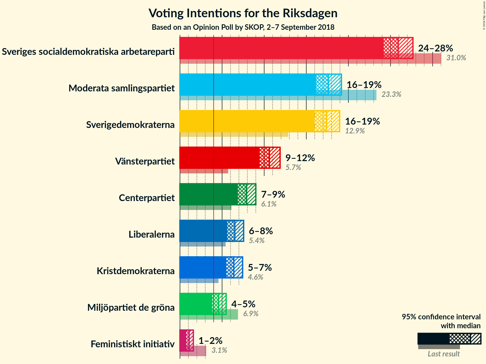

### Confidence Intervals

| Party | Last Result | Poll Result | 80% Confidence Interval | 90% Confidence Interval | 95% Confidence Interval | 99% Confidence Interval |
|:-----:|:-----------:|:-----------:|:-----------------------:|:-----------------------:|:-----------------------:|:-----------------------:|
| Sveriges socialdemokratiska arbetareparti | 31.0% | 25.9% | 24.8–27.1% |24.5–27.4% |24.2–27.7% |23.7–28.2% |
| Moderata samlingspartiet | 23.3% | 17.6% | 16.7–18.6% |16.4–18.9% |16.2–19.2% |15.7–19.7% |
| Sverigedemokraterna | 12.9% | 17.4% | 16.5–18.4% |16.2–18.7% |16.0–19.0% |15.5–19.4% |
| Vänsterpartiet | 5.7% | 10.6% | 9.9–11.4% |9.6–11.7% |9.5–11.9% |9.1–12.3% |
| Centerpartiet | 6.1% | 7.9% | 7.2–8.6% |7.0–8.8% |6.9–9.0% |6.6–9.4% |
| Liberalerna | 5.4% | 6.5% | 5.9–7.2% |5.7–7.4% |5.6–7.6% |5.3–7.9% |
| Kristdemokraterna | 4.6% | 6.4% | 5.8–7.1% |5.6–7.3% |5.5–7.4% |5.2–7.8% |
| Miljöpartiet de gröna | 6.9% | 4.6% | 4.1–5.2% |3.9–5.3% |3.8–5.5% |3.6–5.8% |
| Feministiskt initiativ | 3.1% | 1.1% | 0.9–1.4% |0.8–1.5% |0.7–1.6% |0.6–1.8% |

*Note:* The poll result column reflects the actual value used in the calculations. Published results may vary slightly, and in addition be rounded to fewer digits.

## Seats

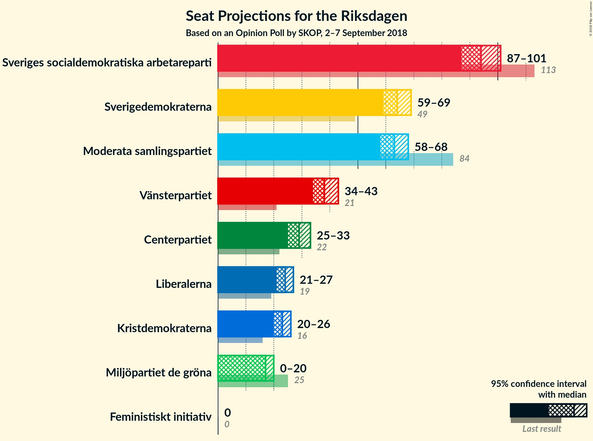

### Confidence Intervals

| Party | Last Result | Median | 80% Confidence Interval | 90% Confidence Interval | 95% Confidence Interval | 99% Confidence Interval |
|:-----:|:-----------:|:------:|:-----------------------:|:-----------------------:|:-----------------------:|:-----------------------:|
| <a href="#sveriges-socialdemokratiska-arbetareparti">Sveriges socialdemokratiska arbetareparti</a> | 113 | 94 | 88–98 |88–99 |87–101 |85–103 |
| <a href="#moderata-samlingspartiet">Moderata samlingspartiet</a> | 84 | 63 | 60–66 |59–66 |58–68 |56–70 |
| <a href="#sverigedemokraterna">Sverigedemokraterna</a> | 49 | 64 | 61–67 |60–68 |59–69 |58–71 |
| <a href="#vänsterpartiet">Vänsterpartiet</a> | 21 | 38 | 36–41 |35–42 |34–43 |33–45 |
| <a href="#centerpartiet">Centerpartiet</a> | 22 | 29 | 26–31 |25–32 |25–33 |24–34 |
| <a href="#liberalerna">Liberalerna</a> | 19 | 24 | 22–26 |22–27 |21–27 |20–29 |
| <a href="#kristdemokraterna">Kristdemokraterna</a> | 16 | 23 | 21–24 |20–25 |20–26 |19–27 |
| <a href="#miljöpartiet-de-gröna">Miljöpartiet de gröna</a> | 25 | 17 | 14–19 |0–19 |0–20 |0–21 |
| <a href="#feministiskt-initiativ">Feministiskt initiativ</a> | 0 | 0 | 0 |0 |0 |0 |

### Sveriges socialdemokratiska arbetareparti

*For a full overview of the results for this party, see the [Sveriges socialdemokratiska arbetareparti](party-sverigessocialdemokratiskaarbetareparti.html) page.*

| Number of Seats | Probability | Accumulated | Special Marks |
|:---------------:|:-----------:|:-----------:|:-------------:|
| 83 | 0.1% | 100% |  |
| 84 | 0.1% | 99.9% |  |
| 85 | 0.3% | 99.8% |  |
| 86 | 1.2% | 99.4% |  |
| 87 | 2% | 98% |  |
| 88 | 6% | 96% |  |
| 89 | 5% | 90% |  |
| 90 | 7% | 85% |  |
| 91 | 10% | 78% |  |
| 92 | 10% | 68% |  |
| 93 | 8% | 58% |  |
| 94 | 11% | 50% | Median |
| 95 | 12% | 39% |  |
| 96 | 9% | 26% |  |
| 97 | 5% | 18% |  |
| 98 | 5% | 12% |  |
| 99 | 3% | 7% |  |
| 100 | 1.0% | 4% |  |
| 101 | 0.8% | 3% |  |
| 102 | 1.4% | 2% |  |
| 103 | 0.3% | 0.6% |  |
| 104 | 0.2% | 0.3% |  |
| 105 | 0.1% | 0.2% |  |
| 106 | 0% | 0.1% |  |
| 107 | 0% | 0% |  |
| 108 | 0% | 0% |  |
| 109 | 0% | 0% |  |
| 110 | 0% | 0% |  |
| 111 | 0% | 0% |  |
| 112 | 0% | 0% |  |
| 113 | 0% | 0% | Last Result |

### Moderata samlingspartiet

*For a full overview of the results for this party, see the [Moderata samlingspartiet](party-moderatasamlingspartiet.html) page.*

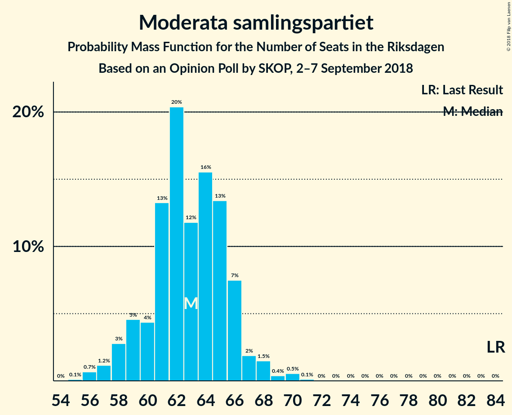

| Number of Seats | Probability | Accumulated | Special Marks |
|:---------------:|:-----------:|:-----------:|:-------------:|
| 55 | 0.1% | 100% |  |
| 56 | 0.7% | 99.9% |  |
| 57 | 1.2% | 99.2% |  |
| 58 | 3% | 98% |  |
| 59 | 5% | 95% |  |
| 60 | 4% | 91% |  |
| 61 | 13% | 86% |  |
| 62 | 20% | 73% |  |
| 63 | 12% | 53% | Median |
| 64 | 16% | 41% |  |
| 65 | 13% | 25% |  |
| 66 | 7% | 12% |  |
| 67 | 2% | 4% |  |
| 68 | 1.5% | 3% |  |
| 69 | 0.4% | 1.1% |  |
| 70 | 0.5% | 0.7% |  |
| 71 | 0.1% | 0.2% |  |
| 72 | 0% | 0% |  |
| 73 | 0% | 0% |  |
| 74 | 0% | 0% |  |
| 75 | 0% | 0% |  |
| 76 | 0% | 0% |  |
| 77 | 0% | 0% |  |
| 78 | 0% | 0% |  |
| 79 | 0% | 0% |  |
| 80 | 0% | 0% |  |
| 81 | 0% | 0% |  |
| 82 | 0% | 0% |  |
| 83 | 0% | 0% |  |
| 84 | 0% | 0% | Last Result |

### Sverigedemokraterna

*For a full overview of the results for this party, see the [Sverigedemokraterna](party-sverigedemokraterna.html) page.*

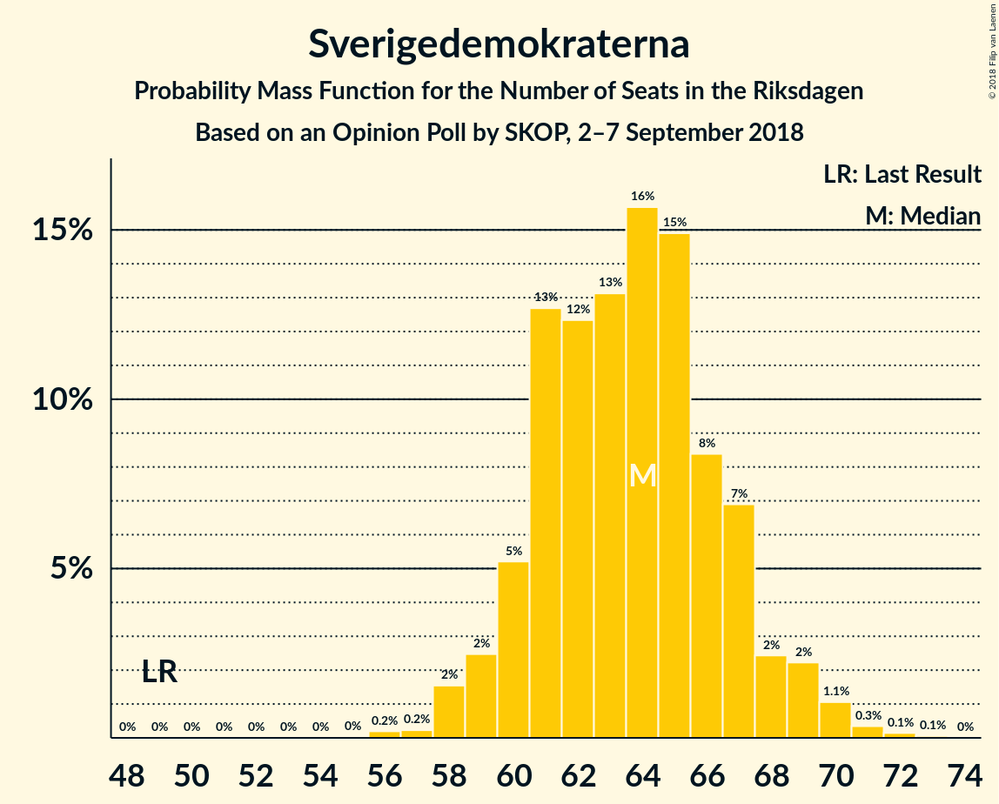

| Number of Seats | Probability | Accumulated | Special Marks |
|:---------------:|:-----------:|:-----------:|:-------------:|
| 49 | 0% | 100% | Last Result |
| 50 | 0% | 100% |  |
| 51 | 0% | 100% |  |
| 52 | 0% | 100% |  |
| 53 | 0% | 100% |  |
| 54 | 0% | 100% |  |
| 55 | 0% | 100% |  |
| 56 | 0.2% | 100% |  |
| 57 | 0.2% | 99.8% |  |
| 58 | 2% | 99.5% |  |
| 59 | 2% | 98% |  |
| 60 | 5% | 96% |  |
| 61 | 13% | 90% |  |
| 62 | 12% | 78% |  |
| 63 | 13% | 65% |  |
| 64 | 16% | 52% | Median |
| 65 | 15% | 36% |  |
| 66 | 8% | 22% |  |
| 67 | 7% | 13% |  |
| 68 | 2% | 6% |  |
| 69 | 2% | 4% |  |
| 70 | 1.1% | 2% |  |
| 71 | 0.3% | 0.6% |  |
| 72 | 0.1% | 0.2% |  |
| 73 | 0.1% | 0.1% |  |
| 74 | 0% | 0% |  |

### Vänsterpartiet

*For a full overview of the results for this party, see the [Vänsterpartiet](party-vänsterpartiet.html) page.*

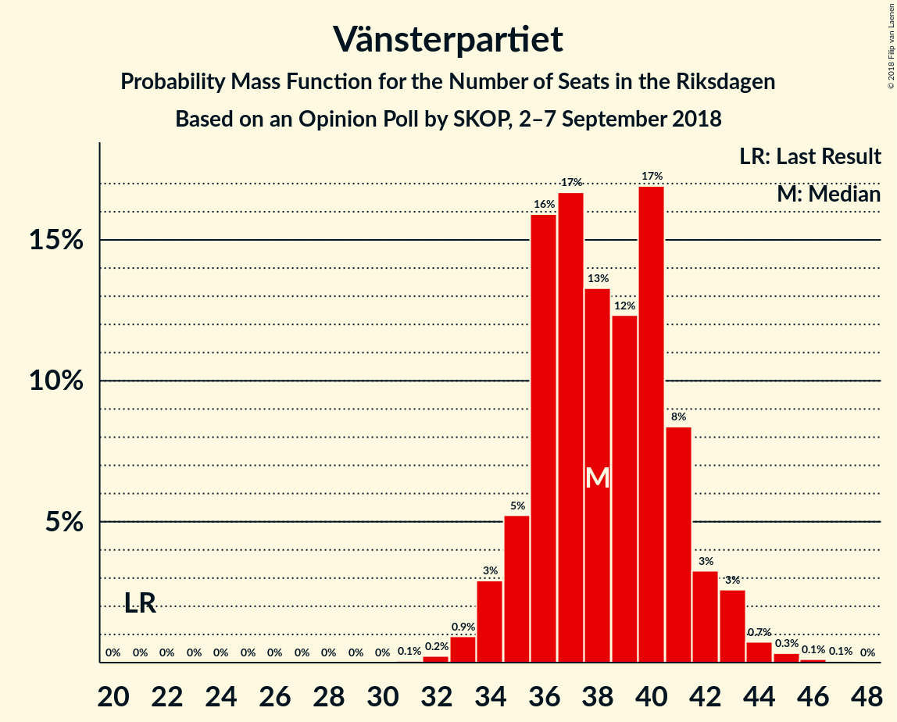

| Number of Seats | Probability | Accumulated | Special Marks |
|:---------------:|:-----------:|:-----------:|:-------------:|
| 21 | 0% | 100% | Last Result |
| 22 | 0% | 100% |  |
| 23 | 0% | 100% |  |
| 24 | 0% | 100% |  |
| 25 | 0% | 100% |  |
| 26 | 0% | 100% |  |
| 27 | 0% | 100% |  |
| 28 | 0% | 100% |  |
| 29 | 0% | 100% |  |
| 30 | 0% | 100% |  |
| 31 | 0.1% | 100% |  |
| 32 | 0.2% | 99.9% |  |
| 33 | 0.9% | 99.7% |  |
| 34 | 3% | 98.8% |  |
| 35 | 5% | 96% |  |
| 36 | 16% | 91% |  |
| 37 | 17% | 75% |  |
| 38 | 13% | 58% | Median |
| 39 | 12% | 45% |  |
| 40 | 17% | 32% |  |
| 41 | 8% | 15% |  |
| 42 | 3% | 7% |  |
| 43 | 3% | 4% |  |
| 44 | 0.7% | 1.3% |  |
| 45 | 0.3% | 0.5% |  |
| 46 | 0.1% | 0.2% |  |
| 47 | 0.1% | 0.1% |  |
| 48 | 0% | 0% |  |

### Centerpartiet

*For a full overview of the results for this party, see the [Centerpartiet](party-centerpartiet.html) page.*

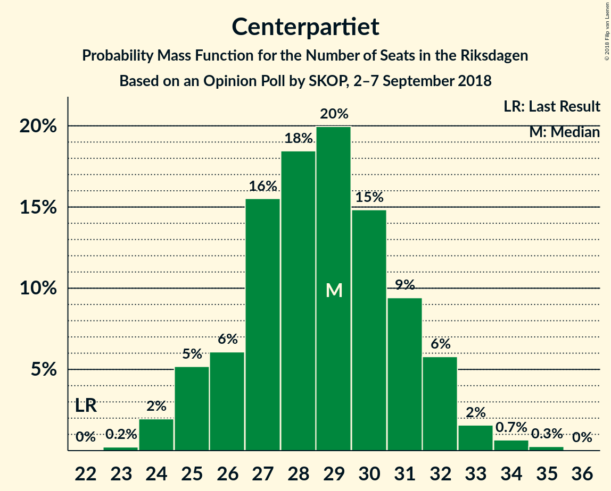

| Number of Seats | Probability | Accumulated | Special Marks |
|:---------------:|:-----------:|:-----------:|:-------------:|
| 22 | 0% | 100% | Last Result |
| 23 | 0.2% | 99.9% |  |
| 24 | 2% | 99.7% |  |
| 25 | 5% | 98% |  |
| 26 | 6% | 93% |  |
| 27 | 16% | 87% |  |
| 28 | 18% | 71% |  |
| 29 | 20% | 53% | Median |
| 30 | 15% | 33% |  |
| 31 | 9% | 18% |  |
| 32 | 6% | 8% |  |
| 33 | 2% | 3% |  |
| 34 | 0.7% | 1.0% |  |
| 35 | 0.3% | 0.3% |  |
| 36 | 0% | 0% |  |

### Liberalerna

*For a full overview of the results for this party, see the [Liberalerna](party-liberalerna.html) page.*

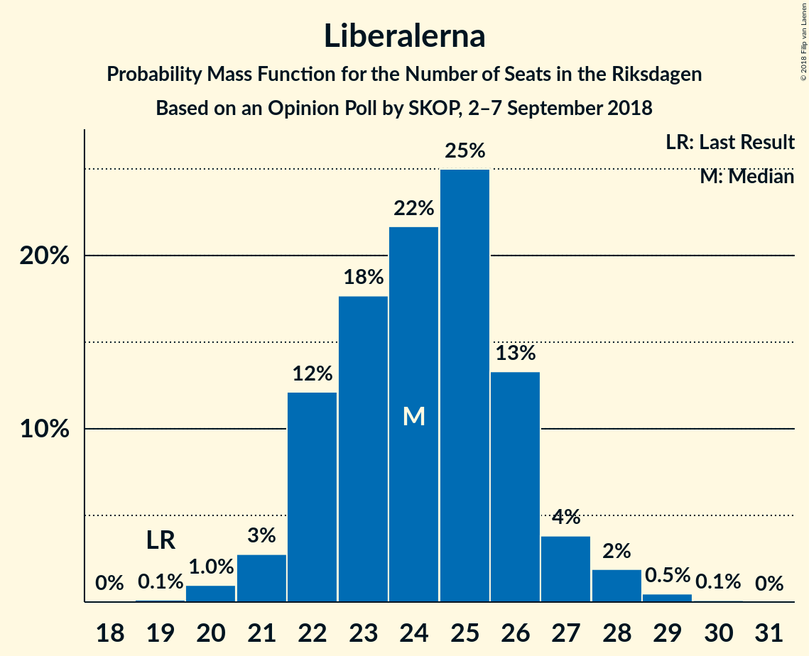

| Number of Seats | Probability | Accumulated | Special Marks |
|:---------------:|:-----------:|:-----------:|:-------------:|
| 19 | 0.1% | 100% | Last Result |
| 20 | 1.0% | 99.8% |  |
| 21 | 3% | 98.9% |  |
| 22 | 12% | 96% |  |
| 23 | 18% | 84% |  |
| 24 | 22% | 66% | Median |
| 25 | 25% | 45% |  |
| 26 | 13% | 20% |  |
| 27 | 4% | 6% |  |
| 28 | 2% | 2% |  |
| 29 | 0.5% | 0.6% |  |
| 30 | 0.1% | 0.1% |  |
| 31 | 0% | 0% |  |

### Kristdemokraterna

*For a full overview of the results for this party, see the [Kristdemokraterna](party-kristdemokraterna.html) page.*

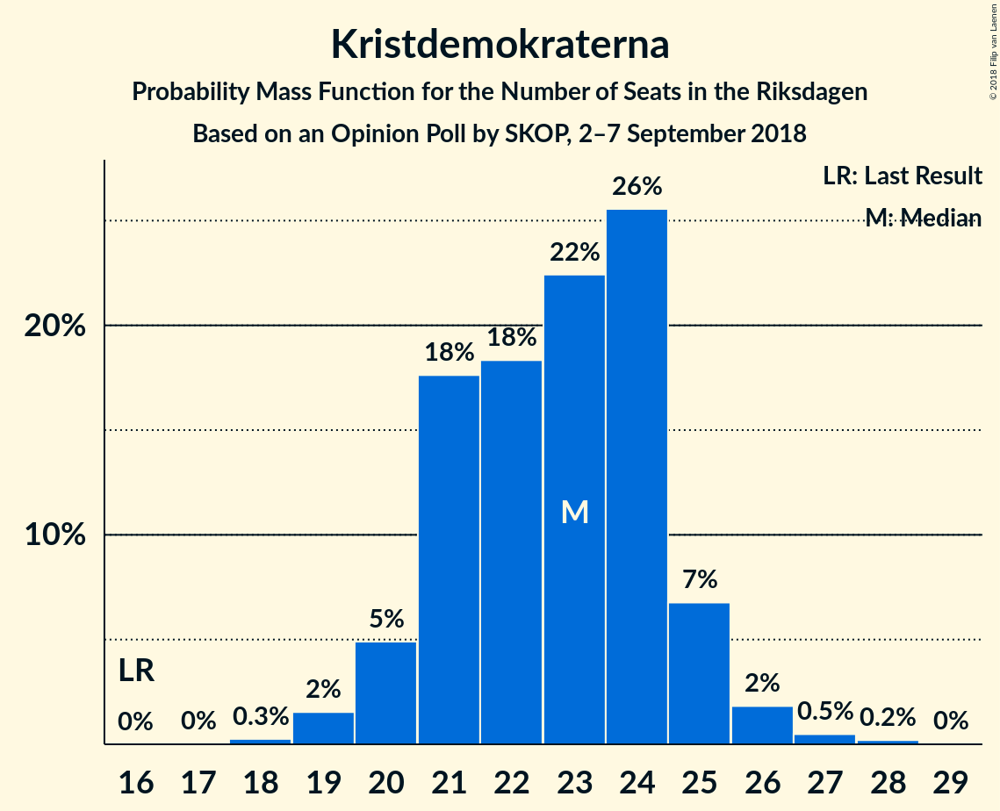

| Number of Seats | Probability | Accumulated | Special Marks |
|:---------------:|:-----------:|:-----------:|:-------------:|
| 16 | 0% | 100% | Last Result |
| 17 | 0% | 100% |  |
| 18 | 0.3% | 100% |  |
| 19 | 2% | 99.7% |  |
| 20 | 5% | 98% |  |
| 21 | 18% | 93% |  |
| 22 | 18% | 76% |  |
| 23 | 22% | 57% | Median |
| 24 | 26% | 35% |  |
| 25 | 7% | 9% |  |
| 26 | 2% | 3% |  |
| 27 | 0.5% | 0.7% |  |
| 28 | 0.2% | 0.2% |  |
| 29 | 0% | 0% |  |

### Miljöpartiet de gröna

*For a full overview of the results for this party, see the [Miljöpartiet de gröna](party-miljöpartietdegröna.html) page.*

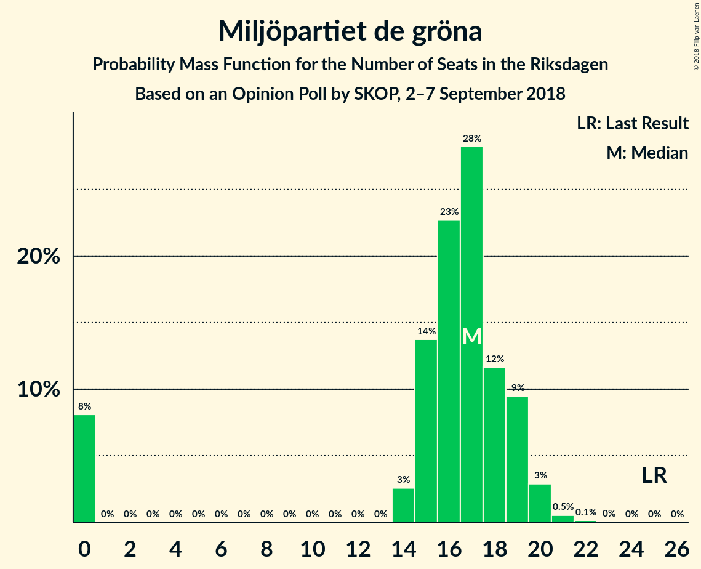

| Number of Seats | Probability | Accumulated | Special Marks |
|:---------------:|:-----------:|:-----------:|:-------------:|
| 0 | 8% | 100% |  |
| 1 | 0% | 92% |  |
| 2 | 0% | 92% |  |
| 3 | 0% | 92% |  |
| 4 | 0% | 92% |  |
| 5 | 0% | 92% |  |
| 6 | 0% | 92% |  |
| 7 | 0% | 92% |  |
| 8 | 0% | 92% |  |
| 9 | 0% | 92% |  |
| 10 | 0% | 92% |  |
| 11 | 0% | 92% |  |
| 12 | 0% | 92% |  |
| 13 | 0% | 92% |  |
| 14 | 3% | 92% |  |
| 15 | 14% | 89% |  |
| 16 | 23% | 76% |  |
| 17 | 28% | 53% | Median |
| 18 | 12% | 25% |  |
| 19 | 9% | 13% |  |
| 20 | 3% | 4% |  |
| 21 | 0.5% | 0.7% |  |
| 22 | 0.1% | 0.1% |  |
| 23 | 0% | 0% |  |
| 24 | 0% | 0% |  |
| 25 | 0% | 0% | Last Result |

### Feministiskt initiativ

*For a full overview of the results for this party, see the [Feministiskt initiativ](party-feministisktinitiativ.html) page.*

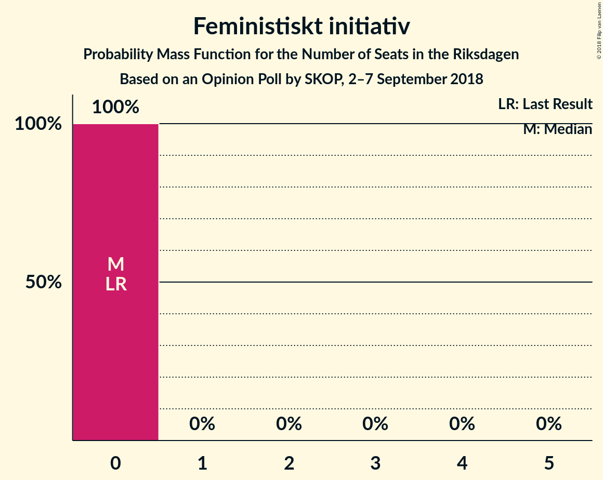

| Number of Seats | Probability | Accumulated | Special Marks |
|:---------------:|:-----------:|:-----------:|:-------------:|
| 0 | 100% | 100% | Last Result, Median |

## Coalitions

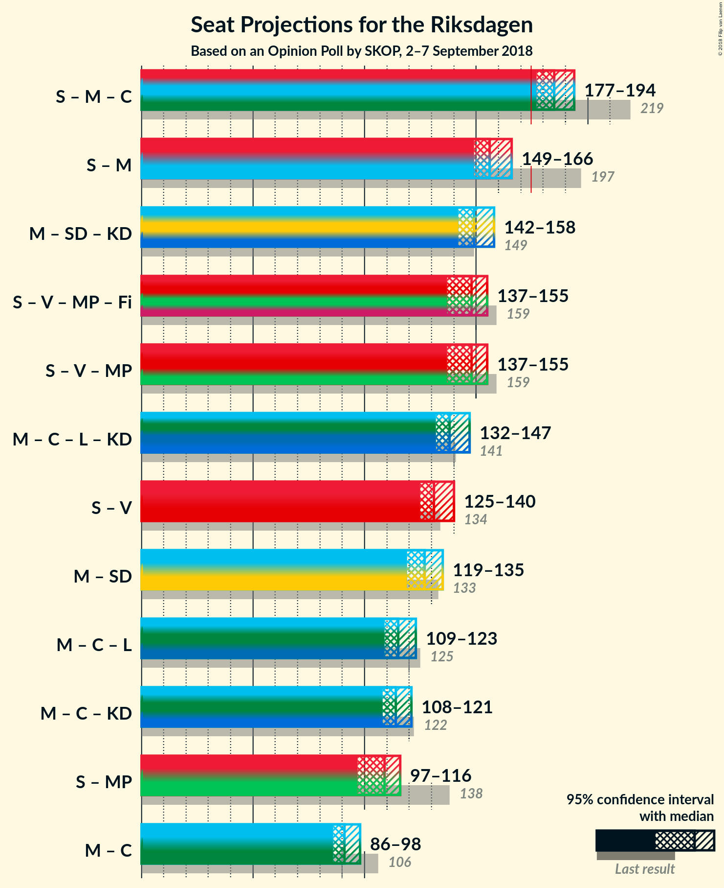

### Confidence Intervals

| Coalition | Last Result | Median | Majority? | 80% Confidence Interval | 90% Confidence Interval | 95% Confidence Interval | 99% Confidence Interval |
|:---------:|:-----------:|:------:|:---------:|:-----------------------:|:-----------------------:|:-----------------------:|:-----------------------:|
| Sveriges socialdemokratiska arbetareparti – Moderata samlingspartiet – Centerpartiet | 219 | 185 | 99.9% | 180–190 | 178–193 | 177–194 | 176–199 |
| Sveriges socialdemokratiska arbetareparti – Moderata samlingspartiet | 197 | 156 | 0% | 151–161 | 150–163 | 149–166 | 147–167 |
| Moderata samlingspartiet – Sverigedemokraterna – Kristdemokraterna | 149 | 149 | 0% | 144–154 | 143–156 | 142–158 | 140–162 |
| Sveriges socialdemokratiska arbetareparti – Vänsterpartiet – Miljöpartiet de gröna – Feministiskt initiativ | 159 | 148 | 0% | 142–152 | 138–154 | 137–155 | 131–157 |
| Sveriges socialdemokratiska arbetareparti – Vänsterpartiet – Miljöpartiet de gröna | 159 | 148 | 0% | 142–152 | 138–154 | 137–155 | 131–157 |
| Moderata samlingspartiet – Centerpartiet – Liberalerna – Kristdemokraterna | 141 | 138 | 0% | 134–143 | 132–144 | 132–147 | 129–150 |
| Sveriges socialdemokratiska arbetareparti – Vänsterpartiet | 134 | 131 | 0% | 126–137 | 125–139 | 125–140 | 123–143 |
| Moderata samlingspartiet – Sverigedemokraterna | 133 | 127 | 0% | 122–131 | 120–133 | 119–135 | 117–139 |
| Moderata samlingspartiet – Centerpartiet – Liberalerna | 125 | 115 | 0% | 111–120 | 110–122 | 109–123 | 107–126 |
| Moderata samlingspartiet – Centerpartiet – Kristdemokraterna | 122 | 114 | 0% | 110–118 | 109–120 | 108–121 | 107–123 |
| Sveriges socialdemokratiska arbetareparti – Miljöpartiet de gröna | 138 | 109 | 0% | 103–114 | 98–115 | 97–116 | 93–119 |
| Moderata samlingspartiet – Centerpartiet | 106 | 91 | 0% | 88–96 | 87–96 | 86–98 | 84–100 |

### Sveriges socialdemokratiska arbetareparti – Moderata samlingspartiet – Centerpartiet

| Number of Seats | Probability | Accumulated | Special Marks |
|:---------------:|:-----------:|:-----------:|:-------------:|
| 173 | 0% | 100% |  |
| 174 | 0.1% | 99.9% |  |
| 175 | 0.2% | 99.9% | Majority |
| 176 | 0.3% | 99.6% |  |
| 177 | 2% | 99.4% |  |
| 178 | 3% | 97% |  |
| 179 | 3% | 94% |  |
| 180 | 6% | 91% |  |
| 181 | 7% | 85% |  |
| 182 | 10% | 78% |  |
| 183 | 4% | 68% |  |
| 184 | 9% | 64% |  |
| 185 | 7% | 55% |  |
| 186 | 19% | 48% | Median |
| 187 | 10% | 29% |  |
| 188 | 7% | 18% |  |
| 189 | 1.2% | 11% |  |
| 190 | 2% | 10% |  |
| 191 | 1.1% | 9% |  |
| 192 | 1.2% | 7% |  |
| 193 | 3% | 6% |  |
| 194 | 1.1% | 3% |  |
| 195 | 0.2% | 2% |  |
| 196 | 0.8% | 2% |  |
| 197 | 0.1% | 0.8% |  |
| 198 | 0.2% | 0.7% |  |
| 199 | 0.4% | 0.5% |  |
| 200 | 0.1% | 0.2% |  |
| 201 | 0.1% | 0.1% |  |
| 202 | 0% | 0% |  |
| 203 | 0% | 0% |  |
| 204 | 0% | 0% |  |
| 205 | 0% | 0% |  |
| 206 | 0% | 0% |  |
| 207 | 0% | 0% |  |
| 208 | 0% | 0% |  |
| 209 | 0% | 0% |  |
| 210 | 0% | 0% |  |
| 211 | 0% | 0% |  |
| 212 | 0% | 0% |  |
| 213 | 0% | 0% |  |
| 214 | 0% | 0% |  |
| 215 | 0% | 0% |  |
| 216 | 0% | 0% |  |
| 217 | 0% | 0% |  |
| 218 | 0% | 0% |  |
| 219 | 0% | 0% | Last Result |

### Sveriges socialdemokratiska arbetareparti – Moderata samlingspartiet

| Number of Seats | Probability | Accumulated | Special Marks |
|:---------------:|:-----------:|:-----------:|:-------------:|
| 145 | 0.1% | 100% |  |
| 146 | 0.1% | 99.9% |  |
| 147 | 0.3% | 99.8% |  |
| 148 | 1.5% | 99.5% |  |
| 149 | 2% | 98% |  |
| 150 | 3% | 96% |  |
| 151 | 3% | 93% |  |
| 152 | 8% | 90% |  |
| 153 | 5% | 82% |  |
| 154 | 11% | 77% |  |
| 155 | 8% | 66% |  |
| 156 | 10% | 58% |  |
| 157 | 14% | 48% | Median |
| 158 | 13% | 33% |  |
| 159 | 6% | 21% |  |
| 160 | 3% | 15% |  |
| 161 | 4% | 12% |  |
| 162 | 2% | 8% |  |
| 163 | 3% | 7% |  |
| 164 | 0.8% | 4% |  |
| 165 | 0.3% | 3% |  |
| 166 | 2% | 3% |  |
| 167 | 0.4% | 0.9% |  |
| 168 | 0.2% | 0.5% |  |
| 169 | 0.1% | 0.3% |  |
| 170 | 0.1% | 0.2% |  |
| 171 | 0% | 0.1% |  |
| 172 | 0% | 0% |  |
| 173 | 0% | 0% |  |
| 174 | 0% | 0% |  |
| 175 | 0% | 0% | Majority |
| 176 | 0% | 0% |  |
| 177 | 0% | 0% |  |
| 178 | 0% | 0% |  |
| 179 | 0% | 0% |  |
| 180 | 0% | 0% |  |
| 181 | 0% | 0% |  |
| 182 | 0% | 0% |  |
| 183 | 0% | 0% |  |
| 184 | 0% | 0% |  |
| 185 | 0% | 0% |  |
| 186 | 0% | 0% |  |
| 187 | 0% | 0% |  |
| 188 | 0% | 0% |  |
| 189 | 0% | 0% |  |
| 190 | 0% | 0% |  |
| 191 | 0% | 0% |  |
| 192 | 0% | 0% |  |
| 193 | 0% | 0% |  |
| 194 | 0% | 0% |  |
| 195 | 0% | 0% |  |
| 196 | 0% | 0% |  |
| 197 | 0% | 0% | Last Result |

### Moderata samlingspartiet – Sverigedemokraterna – Kristdemokraterna

| Number of Seats | Probability | Accumulated | Special Marks |
|:---------------:|:-----------:|:-----------:|:-------------:|
| 137 | 0% | 100% |  |
| 138 | 0.1% | 99.9% |  |
| 139 | 0.2% | 99.8% |  |
| 140 | 0.5% | 99.7% |  |
| 141 | 1.1% | 99.1% |  |
| 142 | 1.2% | 98% |  |
| 143 | 4% | 97% |  |
| 144 | 4% | 92% |  |
| 145 | 6% | 89% |  |
| 146 | 9% | 83% |  |
| 147 | 11% | 74% |  |
| 148 | 9% | 62% |  |
| 149 | 7% | 54% | Last Result |
| 150 | 12% | 47% | Median |
| 151 | 10% | 35% |  |
| 152 | 7% | 25% |  |
| 153 | 4% | 18% |  |
| 154 | 5% | 15% |  |
| 155 | 4% | 10% |  |
| 156 | 2% | 6% |  |
| 157 | 1.3% | 4% |  |
| 158 | 0.6% | 3% |  |
| 159 | 1.0% | 2% |  |
| 160 | 0.2% | 1.3% |  |
| 161 | 0.4% | 1.1% |  |
| 162 | 0.4% | 0.6% |  |
| 163 | 0.1% | 0.2% |  |
| 164 | 0.1% | 0.1% |  |
| 165 | 0% | 0.1% |  |
| 166 | 0% | 0.1% |  |
| 167 | 0% | 0% |  |

### Sveriges socialdemokratiska arbetareparti – Vänsterpartiet – Miljöpartiet de gröna – Feministiskt initiativ

| Number of Seats | Probability | Accumulated | Special Marks |
|:---------------:|:-----------:|:-----------:|:-------------:|
| 130 | 0.1% | 100% |  |
| 131 | 0.5% | 99.9% |  |
| 132 | 0.4% | 99.4% |  |
| 133 | 0.1% | 99.0% |  |
| 134 | 0.2% | 98.9% |  |
| 135 | 0.2% | 98.7% |  |
| 136 | 0.8% | 98% |  |
| 137 | 2% | 98% |  |
| 138 | 1.3% | 96% |  |
| 139 | 1.2% | 95% |  |
| 140 | 2% | 94% |  |
| 141 | 1.5% | 92% |  |
| 142 | 4% | 90% |  |
| 143 | 6% | 86% |  |
| 144 | 3% | 80% |  |
| 145 | 11% | 77% |  |
| 146 | 8% | 66% |  |
| 147 | 7% | 58% |  |
| 148 | 11% | 51% |  |
| 149 | 9% | 40% | Median |
| 150 | 10% | 30% |  |
| 151 | 5% | 20% |  |
| 152 | 6% | 15% |  |
| 153 | 3% | 9% |  |
| 154 | 3% | 6% |  |
| 155 | 1.4% | 3% |  |
| 156 | 1.2% | 2% |  |
| 157 | 0.3% | 0.6% |  |
| 158 | 0.1% | 0.3% |  |
| 159 | 0.1% | 0.1% | Last Result |
| 160 | 0% | 0.1% |  |
| 161 | 0% | 0% |  |

### Sveriges socialdemokratiska arbetareparti – Vänsterpartiet – Miljöpartiet de gröna

| Number of Seats | Probability | Accumulated | Special Marks |
|:---------------:|:-----------:|:-----------:|:-------------:|
| 130 | 0.1% | 100% |  |
| 131 | 0.5% | 99.9% |  |
| 132 | 0.4% | 99.4% |  |
| 133 | 0.1% | 99.0% |  |
| 134 | 0.2% | 98.9% |  |
| 135 | 0.2% | 98.7% |  |
| 136 | 0.8% | 98% |  |
| 137 | 2% | 98% |  |
| 138 | 1.3% | 96% |  |
| 139 | 1.2% | 95% |  |
| 140 | 2% | 94% |  |
| 141 | 1.5% | 92% |  |
| 142 | 4% | 90% |  |
| 143 | 6% | 86% |  |
| 144 | 3% | 80% |  |
| 145 | 11% | 77% |  |
| 146 | 8% | 66% |  |
| 147 | 7% | 58% |  |
| 148 | 11% | 51% |  |
| 149 | 9% | 40% | Median |
| 150 | 10% | 30% |  |
| 151 | 5% | 20% |  |
| 152 | 6% | 15% |  |
| 153 | 3% | 9% |  |
| 154 | 3% | 6% |  |
| 155 | 1.4% | 3% |  |
| 156 | 1.2% | 2% |  |
| 157 | 0.3% | 0.6% |  |
| 158 | 0.1% | 0.3% |  |
| 159 | 0.1% | 0.1% | Last Result |
| 160 | 0% | 0.1% |  |
| 161 | 0% | 0% |  |

### Moderata samlingspartiet – Centerpartiet – Liberalerna – Kristdemokraterna

| Number of Seats | Probability | Accumulated | Special Marks |
|:---------------:|:-----------:|:-----------:|:-------------:|
| 127 | 0.1% | 100% |  |
| 128 | 0.2% | 99.9% |  |
| 129 | 0.3% | 99.7% |  |
| 130 | 0.4% | 99.3% |  |
| 131 | 1.2% | 98.9% |  |
| 132 | 4% | 98% |  |
| 133 | 3% | 94% |  |
| 134 | 7% | 91% |  |
| 135 | 6% | 84% |  |
| 136 | 6% | 78% |  |
| 137 | 11% | 72% |  |
| 138 | 16% | 61% |  |
| 139 | 10% | 45% | Median |
| 140 | 11% | 34% |  |
| 141 | 2% | 24% | Last Result |
| 142 | 8% | 21% |  |
| 143 | 6% | 13% |  |
| 144 | 2% | 7% |  |
| 145 | 1.0% | 5% |  |
| 146 | 1.4% | 4% |  |
| 147 | 0.3% | 3% |  |
| 148 | 2% | 2% |  |
| 149 | 0.2% | 0.7% |  |
| 150 | 0.4% | 0.5% |  |
| 151 | 0% | 0.1% |  |
| 152 | 0% | 0.1% |  |
| 153 | 0% | 0.1% |  |
| 154 | 0% | 0.1% |  |
| 155 | 0% | 0% |  |

### Sveriges socialdemokratiska arbetareparti – Vänsterpartiet

| Number of Seats | Probability | Accumulated | Special Marks |
|:---------------:|:-----------:|:-----------:|:-------------:|
| 120 | 0.1% | 100% |  |
| 121 | 0.2% | 99.9% |  |
| 122 | 0.2% | 99.8% |  |
| 123 | 0.3% | 99.5% |  |
| 124 | 0.6% | 99.2% |  |
| 125 | 7% | 98.6% |  |
| 126 | 3% | 91% |  |
| 127 | 3% | 88% |  |
| 128 | 10% | 85% |  |
| 129 | 9% | 75% |  |
| 130 | 6% | 67% |  |
| 131 | 11% | 61% |  |
| 132 | 10% | 50% | Median |
| 133 | 10% | 40% |  |
| 134 | 10% | 30% | Last Result |
| 135 | 3% | 20% |  |
| 136 | 3% | 17% |  |
| 137 | 4% | 13% |  |
| 138 | 4% | 9% |  |
| 139 | 2% | 5% |  |
| 140 | 0.9% | 3% |  |
| 141 | 0.5% | 2% |  |
| 142 | 0.3% | 2% |  |
| 143 | 1.0% | 1.3% |  |
| 144 | 0.1% | 0.4% |  |
| 145 | 0.1% | 0.3% |  |
| 146 | 0.1% | 0.1% |  |
| 147 | 0% | 0% |  |

### Moderata samlingspartiet – Sverigedemokraterna

| Number of Seats | Probability | Accumulated | Special Marks |
|:---------------:|:-----------:|:-----------:|:-------------:|
| 115 | 0% | 100% |  |
| 116 | 0.2% | 99.9% |  |
| 117 | 0.3% | 99.8% |  |
| 118 | 0.5% | 99.5% |  |
| 119 | 1.5% | 99.0% |  |
| 120 | 3% | 97% |  |
| 121 | 3% | 94% |  |
| 122 | 6% | 92% |  |
| 123 | 9% | 86% |  |
| 124 | 13% | 77% |  |
| 125 | 7% | 64% |  |
| 126 | 5% | 57% |  |
| 127 | 12% | 52% | Median |
| 128 | 9% | 39% |  |
| 129 | 12% | 31% |  |
| 130 | 5% | 18% |  |
| 131 | 5% | 13% |  |
| 132 | 3% | 8% |  |
| 133 | 3% | 6% | Last Result |
| 134 | 0.7% | 3% |  |
| 135 | 0.6% | 3% |  |
| 136 | 0.3% | 2% |  |
| 137 | 1.2% | 2% |  |
| 138 | 0.1% | 0.6% |  |
| 139 | 0.4% | 0.5% |  |
| 140 | 0.1% | 0.2% |  |
| 141 | 0% | 0.1% |  |
| 142 | 0.1% | 0.1% |  |
| 143 | 0% | 0% |  |

### Moderata samlingspartiet – Centerpartiet – Liberalerna

| Number of Seats | Probability | Accumulated | Special Marks |
|:---------------:|:-----------:|:-----------:|:-------------:|
| 104 | 0.1% | 100% |  |
| 105 | 0.2% | 99.9% |  |
| 106 | 0.2% | 99.7% |  |
| 107 | 0.6% | 99.5% |  |
| 108 | 0.8% | 98.9% |  |
| 109 | 3% | 98% |  |
| 110 | 2% | 96% |  |
| 111 | 5% | 93% |  |
| 112 | 8% | 88% |  |
| 113 | 7% | 80% |  |
| 114 | 11% | 73% |  |
| 115 | 15% | 62% |  |
| 116 | 7% | 47% | Median |
| 117 | 9% | 40% |  |
| 118 | 9% | 31% |  |
| 119 | 9% | 22% |  |
| 120 | 3% | 13% |  |
| 121 | 4% | 10% |  |
| 122 | 2% | 5% |  |
| 123 | 1.0% | 3% |  |
| 124 | 0.2% | 2% |  |
| 125 | 0.8% | 2% | Last Result |
| 126 | 0.7% | 0.9% |  |
| 127 | 0% | 0.2% |  |
| 128 | 0.1% | 0.2% |  |
| 129 | 0% | 0.1% |  |
| 130 | 0% | 0% |  |

### Moderata samlingspartiet – Centerpartiet – Kristdemokraterna

| Number of Seats | Probability | Accumulated | Special Marks |
|:---------------:|:-----------:|:-----------:|:-------------:|
| 105 | 0.1% | 100% |  |
| 106 | 0.2% | 99.9% |  |
| 107 | 0.5% | 99.7% |  |
| 108 | 2% | 99.2% |  |
| 109 | 3% | 97% |  |
| 110 | 5% | 94% |  |
| 111 | 7% | 89% |  |
| 112 | 10% | 83% |  |
| 113 | 14% | 72% |  |
| 114 | 15% | 58% |  |
| 115 | 13% | 43% | Median |
| 116 | 10% | 30% |  |
| 117 | 6% | 20% |  |
| 118 | 6% | 13% |  |
| 119 | 2% | 7% |  |
| 120 | 2% | 5% |  |
| 121 | 0.4% | 3% |  |
| 122 | 1.2% | 2% | Last Result |
| 123 | 0.6% | 0.9% |  |
| 124 | 0.1% | 0.3% |  |
| 125 | 0.1% | 0.1% |  |
| 126 | 0% | 0.1% |  |
| 127 | 0% | 0% |  |

### Sveriges socialdemokratiska arbetareparti – Miljöpartiet de gröna

| Number of Seats | Probability | Accumulated | Special Marks |
|:---------------:|:-----------:|:-----------:|:-------------:|
| 91 | 0.1% | 100% |  |
| 92 | 0.1% | 99.8% |  |
| 93 | 0.5% | 99.7% |  |
| 94 | 0.1% | 99.2% |  |
| 95 | 0.6% | 99.1% |  |
| 96 | 0.6% | 98% |  |
| 97 | 2% | 98% |  |
| 98 | 1.4% | 96% |  |
| 99 | 1.0% | 95% |  |
| 100 | 0.3% | 94% |  |
| 101 | 0.9% | 93% |  |
| 102 | 2% | 93% |  |
| 103 | 0.6% | 90% |  |
| 104 | 3% | 90% |  |
| 105 | 3% | 86% |  |
| 106 | 9% | 84% |  |
| 107 | 5% | 74% |  |
| 108 | 12% | 70% |  |
| 109 | 8% | 58% |  |
| 110 | 10% | 49% |  |
| 111 | 8% | 39% | Median |
| 112 | 14% | 32% |  |
| 113 | 8% | 18% |  |
| 114 | 4% | 10% |  |
| 115 | 2% | 6% |  |
| 116 | 2% | 4% |  |
| 117 | 0.5% | 2% |  |
| 118 | 0.5% | 1.1% |  |
| 119 | 0.3% | 0.6% |  |
| 120 | 0.2% | 0.3% |  |
| 121 | 0% | 0% |  |
| 122 | 0% | 0% |  |
| 123 | 0% | 0% |  |
| 124 | 0% | 0% |  |
| 125 | 0% | 0% |  |
| 126 | 0% | 0% |  |
| 127 | 0% | 0% |  |
| 128 | 0% | 0% |  |
| 129 | 0% | 0% |  |
| 130 | 0% | 0% |  |
| 131 | 0% | 0% |  |
| 132 | 0% | 0% |  |
| 133 | 0% | 0% |  |
| 134 | 0% | 0% |  |
| 135 | 0% | 0% |  |
| 136 | 0% | 0% |  |
| 137 | 0% | 0% |  |
| 138 | 0% | 0% | Last Result |

### Moderata samlingspartiet – Centerpartiet

| Number of Seats | Probability | Accumulated | Special Marks |
|:---------------:|:-----------:|:-----------:|:-------------:|
| 82 | 0.1% | 100% |  |
| 83 | 0.3% | 99.9% |  |
| 84 | 0.3% | 99.6% |  |
| 85 | 2% | 99.3% |  |
| 86 | 3% | 98% |  |
| 87 | 5% | 95% |  |
| 88 | 7% | 90% |  |
| 89 | 7% | 83% |  |
| 90 | 16% | 76% |  |
| 91 | 14% | 60% |  |
| 92 | 10% | 46% | Median |
| 93 | 10% | 37% |  |
| 94 | 13% | 27% |  |
| 95 | 3% | 13% |  |
| 96 | 6% | 11% |  |
| 97 | 2% | 5% |  |
| 98 | 1.4% | 3% |  |
| 99 | 0.7% | 1.4% |  |
| 100 | 0.5% | 0.7% |  |
| 101 | 0.1% | 0.2% |  |
| 102 | 0% | 0.1% |  |
| 103 | 0% | 0.1% |  |
| 104 | 0% | 0% |  |
| 105 | 0% | 0% |  |
| 106 | 0% | 0% | Last Result |

## Technical Information

### Opinion Poll

+ **Polling firm:** SKOP
+ **Commissioner(s):** —
+ **Fieldwork period:** 2–7 September 2018

### Calculations

+ **Sample size:** 2487
+ **Simulations done:** 1,048,576
+ **Error estimate:** 0.79%

