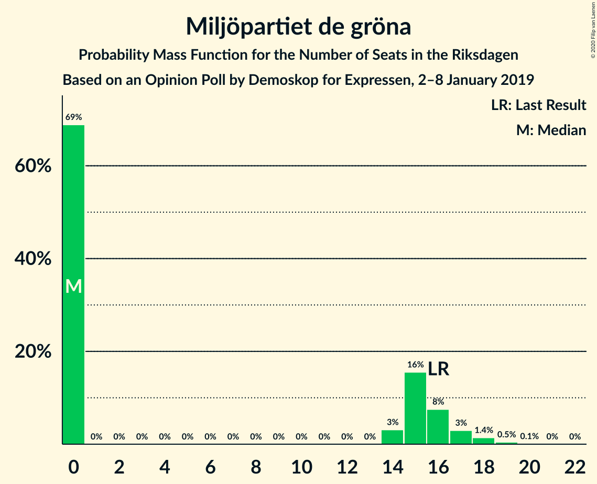
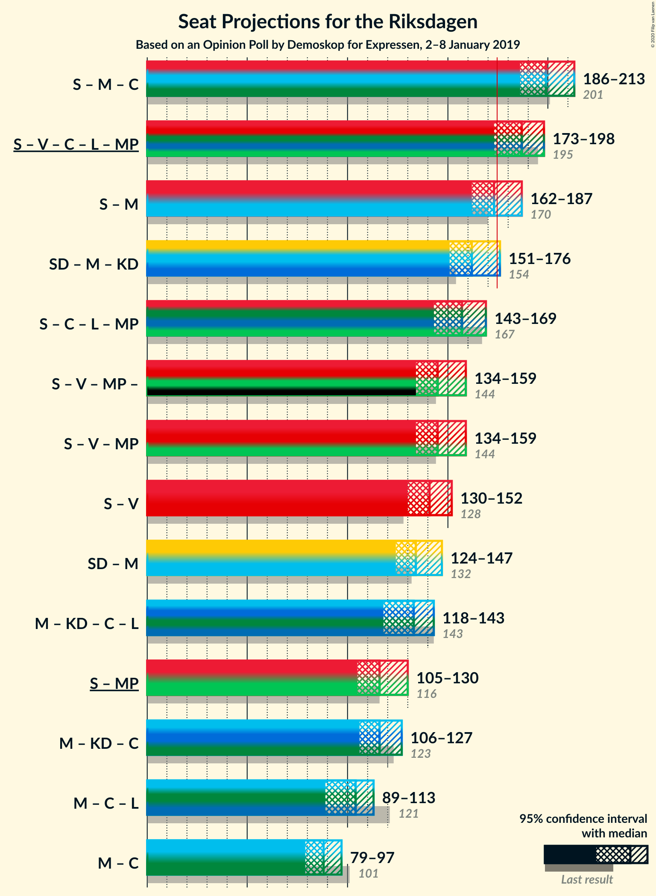

# Opinion Poll by Demoskop for Expressen, 2–8 January 2019

<a href="#voting-intentions">Voting Intentions</a> | <a href="#seats">Seats</a> | <a href="#coalitions">Coalitions</a> | <a href="#technical-information">Technical Information</a>

## Voting Intentions

### Confidence Intervals

| Party | Last Result | Poll Result | 80% Confidence Interval | 90% Confidence Interval | 95% Confidence Interval | 99% Confidence Interval |
|:-----:|:-----------:|:-----------:|:-----------------------:|:-----------------------:|:-----------------------:|:-----------------------:|
| Sveriges socialdemokratiska arbetareparti | 28.3% | 30.2% | 28.8–31.7% |28.4–32.2% |28.0–32.5% |27.4–33.3% |
| Sverigedemokraterna | 17.5% | 19.5% | 18.3–20.8% |17.9–21.2% |17.6–21.5% |17.1–22.2% |
| Moderata samlingspartiet | 19.8% | 17.1% | 15.9–18.4% |15.6–18.7% |15.3–19.0% |14.8–19.6% |
| Vänsterpartiet | 8.0% | 8.0% | 7.2–8.9% |7.0–9.2% |6.8–9.4% |6.4–9.9% |
| Kristdemokraterna | 6.3% | 7.7% | 6.9–8.6% |6.7–8.9% |6.5–9.1% |6.1–9.6% |
| Centerpartiet | 8.6% | 6.9% | 6.1–7.8% |5.9–8.0% |5.7–8.2% |5.4–8.7% |
| Liberalerna | 5.5% | 4.5% | 3.9–5.3% |3.7–5.5% |3.6–5.7% |3.3–6.0% |
| Miljöpartiet de gröna | 4.4% | 3.8% | 3.2–4.5% |3.1–4.7% |2.9–4.8% |2.7–5.2% |

*Note:* The poll result column reflects the actual value used in the calculations. Published results may vary slightly, and in addition be rounded to fewer digits.

## Seats

### Confidence Intervals

| Party | Last Result | Median | 80% Confidence Interval | 90% Confidence Interval | 95% Confidence Interval | 99% Confidence Interval |
|:-----:|:-----------:|:------:|:-----------------------:|:-----------------------:|:-----------------------:|:-----------------------:|
| <a href="#sveriges-socialdemokratiska-arbetareparti">Sveriges socialdemokratiska arbetareparti</a> | 100 | 111 | 105–117 |103–120 |101–122 |99–123 |
| <a href="#sverigedemokraterna">Sverigedemokraterna</a> | 62 | 71 | 66–77 |65–78 |64–80 |62–83 |
| <a href="#moderata-samlingspartiet">Moderata samlingspartiet</a> | 70 | 63 | 58–68 |57–70 |56–70 |53–73 |
| <a href="#vänsterpartiet">Vänsterpartiet</a> | 28 | 29 | 26–33 |25–34 |25–34 |23–37 |
| <a href="#kristdemokraterna">Kristdemokraterna</a> | 22 | 28 | 25–32 |24–32 |23–33 |22–35 |
| <a href="#centerpartiet">Centerpartiet</a> | 31 | 25 | 23–29 |22–29 |21–30 |19–32 |
| <a href="#liberalerna">Liberalerna</a> | 20 | 17 | 0–19 |0–20 |0–21 |0–22 |
| <a href="#miljöpartiet-de-gröna">Miljöpartiet de gröna</a> | 16 | 0 | 0–16 |0–17 |0–17 |0–19 |

### Sveriges socialdemokratiska arbetareparti

*For a full overview of the results for this party, see the [Sveriges socialdemokratiska arbetareparti](party-sverigessocialdemokratiskaarbetareparti.html) page.*

| Number of Seats | Probability | Accumulated | Special Marks |
|:---------------:|:-----------:|:-----------:|:-------------:|
| 95 | 0.1% | 100% |  |
| 96 | 0% | 99.9% |  |
| 97 | 0.2% | 99.9% |  |
| 98 | 0.2% | 99.7% |  |
| 99 | 0.3% | 99.6% |  |
| 100 | 1.0% | 99.3% | Last Result |
| 101 | 2% | 98% |  |
| 102 | 1.4% | 96% |  |
| 103 | 2% | 95% |  |
| 104 | 1.4% | 93% |  |
| 105 | 3% | 92% |  |
| 106 | 5% | 89% |  |
| 107 | 8% | 85% |  |
| 108 | 8% | 76% |  |
| 109 | 3% | 68% |  |
| 110 | 10% | 65% |  |
| 111 | 7% | 54% | Median |
| 112 | 9% | 47% |  |
| 113 | 5% | 38% |  |
| 114 | 2% | 33% |  |
| 115 | 7% | 31% |  |
| 116 | 3% | 24% |  |
| 117 | 12% | 21% |  |
| 118 | 2% | 9% |  |
| 119 | 1.3% | 7% |  |
| 120 | 2% | 6% |  |
| 121 | 0.6% | 4% |  |
| 122 | 2% | 3% |  |
| 123 | 1.0% | 2% |  |
| 124 | 0.1% | 0.5% |  |
| 125 | 0.2% | 0.3% |  |
| 126 | 0% | 0.2% |  |
| 127 | 0% | 0.1% |  |
| 128 | 0.1% | 0.1% |  |
| 129 | 0% | 0% |  |

### Sverigedemokraterna

*For a full overview of the results for this party, see the [Sverigedemokraterna](party-sverigedemokraterna.html) page.*

| Number of Seats | Probability | Accumulated | Special Marks |
|:---------------:|:-----------:|:-----------:|:-------------:|
| 59 | 0.1% | 100% |  |
| 60 | 0.1% | 99.9% |  |
| 61 | 0.2% | 99.8% |  |
| 62 | 0.4% | 99.6% | Last Result |
| 63 | 1.0% | 99.2% |  |
| 64 | 2% | 98% |  |
| 65 | 4% | 96% |  |
| 66 | 6% | 93% |  |
| 67 | 3% | 87% |  |
| 68 | 7% | 84% |  |
| 69 | 10% | 78% |  |
| 70 | 8% | 68% |  |
| 71 | 11% | 59% | Median |
| 72 | 10% | 49% |  |
| 73 | 10% | 39% |  |
| 74 | 7% | 29% |  |
| 75 | 7% | 22% |  |
| 76 | 5% | 15% |  |
| 77 | 3% | 11% |  |
| 78 | 3% | 8% |  |
| 79 | 2% | 5% |  |
| 80 | 1.2% | 3% |  |
| 81 | 0.6% | 1.5% |  |
| 82 | 0.3% | 0.9% |  |
| 83 | 0.3% | 0.6% |  |
| 84 | 0.2% | 0.3% |  |
| 85 | 0.1% | 0.2% |  |
| 86 | 0% | 0.1% |  |
| 87 | 0% | 0% |  |

### Moderata samlingspartiet

*For a full overview of the results for this party, see the [Moderata samlingspartiet](party-moderatasamlingspartiet.html) page.*

| Number of Seats | Probability | Accumulated | Special Marks |
|:---------------:|:-----------:|:-----------:|:-------------:|
| 51 | 0% | 100% |  |
| 52 | 0.3% | 99.9% |  |
| 53 | 0.2% | 99.7% |  |
| 54 | 0.6% | 99.4% |  |
| 55 | 1.0% | 98.9% |  |
| 56 | 2% | 98% |  |
| 57 | 3% | 96% |  |
| 58 | 6% | 93% |  |
| 59 | 7% | 88% |  |
| 60 | 6% | 81% |  |
| 61 | 11% | 75% |  |
| 62 | 11% | 64% |  |
| 63 | 10% | 53% | Median |
| 64 | 9% | 43% |  |
| 65 | 14% | 34% |  |
| 66 | 4% | 20% |  |
| 67 | 4% | 16% |  |
| 68 | 4% | 12% |  |
| 69 | 4% | 9% |  |
| 70 | 3% | 5% | Last Result |
| 71 | 1.0% | 2% |  |
| 72 | 0.4% | 1.0% |  |
| 73 | 0.2% | 0.6% |  |
| 74 | 0.1% | 0.4% |  |
| 75 | 0.1% | 0.2% |  |
| 76 | 0% | 0.1% |  |
| 77 | 0.1% | 0.1% |  |
| 78 | 0% | 0% |  |

### Vänsterpartiet

*For a full overview of the results for this party, see the [Vänsterpartiet](party-vänsterpartiet.html) page.*

| Number of Seats | Probability | Accumulated | Special Marks |
|:---------------:|:-----------:|:-----------:|:-------------:|
| 22 | 0.2% | 100% |  |
| 23 | 0.3% | 99.7% |  |
| 24 | 1.0% | 99.4% |  |
| 25 | 6% | 98% |  |
| 26 | 11% | 92% |  |
| 27 | 11% | 81% |  |
| 28 | 10% | 70% | Last Result |
| 29 | 10% | 60% | Median |
| 30 | 17% | 50% |  |
| 31 | 5% | 33% |  |
| 32 | 12% | 27% |  |
| 33 | 5% | 15% |  |
| 34 | 8% | 10% |  |
| 35 | 0.5% | 2% |  |
| 36 | 0.6% | 1.3% |  |
| 37 | 0.5% | 0.7% |  |
| 38 | 0.1% | 0.2% |  |
| 39 | 0.1% | 0.1% |  |
| 40 | 0% | 0% |  |

### Kristdemokraterna

*For a full overview of the results for this party, see the [Kristdemokraterna](party-kristdemokraterna.html) page.*

| Number of Seats | Probability | Accumulated | Special Marks |
|:---------------:|:-----------:|:-----------:|:-------------:|
| 21 | 0.1% | 100% |  |
| 22 | 0.4% | 99.9% | Last Result |
| 23 | 2% | 99.5% |  |
| 24 | 4% | 97% |  |
| 25 | 4% | 93% |  |
| 26 | 16% | 89% |  |
| 27 | 20% | 73% |  |
| 28 | 10% | 53% | Median |
| 29 | 13% | 43% |  |
| 30 | 12% | 30% |  |
| 31 | 5% | 17% |  |
| 32 | 8% | 13% |  |
| 33 | 3% | 5% |  |
| 34 | 1.0% | 2% |  |
| 35 | 0.8% | 1.3% |  |
| 36 | 0.3% | 0.5% |  |
| 37 | 0.1% | 0.1% |  |
| 38 | 0% | 0% |  |

### Centerpartiet

*For a full overview of the results for this party, see the [Centerpartiet](party-centerpartiet.html) page.*

| Number of Seats | Probability | Accumulated | Special Marks |
|:---------------:|:-----------:|:-----------:|:-------------:|
| 18 | 0% | 100% |  |
| 19 | 0.5% | 99.9% |  |
| 20 | 0.9% | 99.5% |  |
| 21 | 4% | 98.6% |  |
| 22 | 5% | 95% |  |
| 23 | 7% | 91% |  |
| 24 | 18% | 83% |  |
| 25 | 18% | 65% | Median |
| 26 | 12% | 47% |  |
| 27 | 11% | 35% |  |
| 28 | 12% | 24% |  |
| 29 | 7% | 12% |  |
| 30 | 3% | 4% |  |
| 31 | 0.9% | 2% | Last Result |
| 32 | 0.4% | 0.6% |  |
| 33 | 0.2% | 0.3% |  |
| 34 | 0% | 0.1% |  |
| 35 | 0% | 0% |  |

### Liberalerna

*For a full overview of the results for this party, see the [Liberalerna](party-liberalerna.html) page.*

| Number of Seats | Probability | Accumulated | Special Marks |
|:---------------:|:-----------:|:-----------:|:-------------:|
| 0 | 11% | 100% |  |
| 1 | 0% | 89% |  |
| 2 | 0% | 89% |  |
| 3 | 0% | 89% |  |
| 4 | 0% | 89% |  |
| 5 | 0% | 89% |  |
| 6 | 0% | 89% |  |
| 7 | 0% | 89% |  |
| 8 | 0% | 89% |  |
| 9 | 0% | 89% |  |
| 10 | 0% | 89% |  |
| 11 | 0% | 89% |  |
| 12 | 0% | 89% |  |
| 13 | 0% | 89% |  |
| 14 | 0.8% | 89% |  |
| 15 | 8% | 88% |  |
| 16 | 18% | 80% |  |
| 17 | 26% | 62% | Median |
| 18 | 17% | 36% |  |
| 19 | 13% | 19% |  |
| 20 | 3% | 6% | Last Result |
| 21 | 1.1% | 3% |  |
| 22 | 1.3% | 2% |  |
| 23 | 0.2% | 0.3% |  |
| 24 | 0.1% | 0.1% |  |
| 25 | 0% | 0% |  |

### Miljöpartiet de gröna

*For a full overview of the results for this party, see the [Miljöpartiet de gröna](party-miljöpartietdegröna.html) page.*

| Number of Seats | Probability | Accumulated | Special Marks |
|:---------------:|:-----------:|:-----------:|:-------------:|
| 0 | 70% | 100% | Median |
| 1 | 0% | 30% |  |
| 2 | 0% | 30% |  |
| 3 | 0% | 30% |  |
| 4 | 0% | 30% |  |
| 5 | 0% | 30% |  |
| 6 | 0% | 30% |  |
| 7 | 0% | 30% |  |
| 8 | 0% | 30% |  |
| 9 | 0% | 30% |  |
| 10 | 0% | 30% |  |
| 11 | 0% | 30% |  |
| 12 | 0% | 30% |  |
| 13 | 0% | 30% |  |
| 14 | 4% | 30% |  |
| 15 | 14% | 26% |  |
| 16 | 7% | 13% | Last Result |
| 17 | 3% | 6% |  |
| 18 | 2% | 2% |  |
| 19 | 0.5% | 0.6% |  |
| 20 | 0.1% | 0.1% |  |
| 21 | 0% | 0% |  |

## Coalitions

### Confidence Intervals

| Coalition | Last Result | Median | Majority? | 80% Confidence Interval | 90% Confidence Interval | 95% Confidence Interval | 99% Confidence Interval |
|:---------:|:-----------:|:------:|:---------:|:-----------------------:|:-----------------------:|:-----------------------:|:-----------------------:|
| Sveriges socialdemokratiska arbetareparti – Moderata samlingspartiet – Centerpartiet | 201 | 200 | 100% | 190–208 | 189–212 | 187–215 | 183–217 |
| Sveriges socialdemokratiska arbetareparti – Moderata samlingspartiet | 170 | 174 | 45% | 166–182 | 163–185 | 162–188 | 159–191 |
| Sverigedemokraterna – Moderata samlingspartiet – Kristdemokraterna | 154 | 162 | 4% | 155–170 | 153–173 | 151–176 | 148–179 |
| Sveriges socialdemokratiska arbetareparti – Vänsterpartiet – Miljöpartiet de gröna | 144 | 145 | 0% | 138–154 | 136–157 | 135–159 | 131–163 |
| Sveriges socialdemokratiska arbetareparti – Vänsterpartiet | 128 | 141 | 0% | 133–147 | 131–150 | 129–152 | 126–157 |
| Sverigedemokraterna – Moderata samlingspartiet | 132 | 134 | 0% | 128–142 | 126–144 | 124–147 | 121–151 |
| Moderata samlingspartiet – Kristdemokraterna – Centerpartiet – Liberalerna | 143 | 133 | 0% | 124–139 | 121–141 | 118–143 | 114–146 |
| Sveriges socialdemokratiska arbetareparti – Miljöpartiet de gröna | 116 | 116 | 0% | 108–125 | 107–128 | 106–129 | 102–134 |
| Moderata samlingspartiet – Kristdemokraterna – Centerpartiet | 123 | 116 | 0% | 111–123 | 109–126 | 106–128 | 103–130 |
| Moderata samlingspartiet – Centerpartiet – Liberalerna | 121 | 105 | 0% | 96–111 | 92–113 | 89–114 | 85–116 |
| Moderata samlingspartiet – Centerpartiet | 101 | 89 | 0% | 83–94 | 81–96 | 80–97 | 77–100 |

### Sveriges socialdemokratiska arbetareparti – Moderata samlingspartiet – Centerpartiet

| Number of Seats | Probability | Accumulated | Special Marks |
|:---------------:|:-----------:|:-----------:|:-------------:|
| 180 | 0% | 100% |  |
| 181 | 0.1% | 99.9% |  |
| 182 | 0.1% | 99.9% |  |
| 183 | 0.5% | 99.7% |  |
| 184 | 0.3% | 99.2% |  |
| 185 | 0.3% | 98.9% |  |
| 186 | 1.0% | 98.6% |  |
| 187 | 1.4% | 98% |  |
| 188 | 1.0% | 96% |  |
| 189 | 1.2% | 95% |  |
| 190 | 5% | 94% |  |
| 191 | 2% | 89% |  |
| 192 | 2% | 87% |  |
| 193 | 3% | 84% |  |
| 194 | 3% | 81% |  |
| 195 | 5% | 79% |  |
| 196 | 4% | 74% |  |
| 197 | 4% | 70% |  |
| 198 | 11% | 66% |  |
| 199 | 5% | 55% | Median |
| 200 | 3% | 51% |  |
| 201 | 6% | 48% | Last Result |
| 202 | 6% | 42% |  |
| 203 | 6% | 35% |  |
| 204 | 3% | 30% |  |
| 205 | 4% | 26% |  |
| 206 | 10% | 23% |  |
| 207 | 2% | 13% |  |
| 208 | 2% | 11% |  |
| 209 | 2% | 9% |  |
| 210 | 2% | 8% |  |
| 211 | 0.5% | 6% |  |
| 212 | 1.0% | 5% |  |
| 213 | 1.4% | 4% |  |
| 214 | 0.3% | 3% |  |
| 215 | 1.0% | 3% |  |
| 216 | 1.1% | 2% |  |
| 217 | 0.1% | 0.5% |  |
| 218 | 0.1% | 0.5% |  |
| 219 | 0.2% | 0.4% |  |
| 220 | 0.1% | 0.2% |  |
| 221 | 0% | 0.1% |  |
| 222 | 0% | 0.1% |  |
| 223 | 0% | 0% |  |

### Sveriges socialdemokratiska arbetareparti – Moderata samlingspartiet

| Number of Seats | Probability | Accumulated | Special Marks |
|:---------------:|:-----------:|:-----------:|:-------------:|
| 155 | 0% | 100% |  |
| 156 | 0.1% | 99.9% |  |
| 157 | 0.1% | 99.9% |  |
| 158 | 0.2% | 99.7% |  |
| 159 | 0.3% | 99.6% |  |
| 160 | 0.9% | 99.3% |  |
| 161 | 0.5% | 98% |  |
| 162 | 0.7% | 98% |  |
| 163 | 2% | 97% |  |
| 164 | 2% | 95% |  |
| 165 | 2% | 93% |  |
| 166 | 4% | 91% |  |
| 167 | 2% | 88% |  |
| 168 | 5% | 86% |  |
| 169 | 3% | 82% |  |
| 170 | 6% | 78% | Last Result |
| 171 | 7% | 72% |  |
| 172 | 4% | 65% |  |
| 173 | 9% | 61% |  |
| 174 | 6% | 51% | Median |
| 175 | 4% | 45% | Majority |
| 176 | 6% | 41% |  |
| 177 | 5% | 35% |  |
| 178 | 4% | 30% |  |
| 179 | 2% | 26% |  |
| 180 | 6% | 24% |  |
| 181 | 2% | 18% |  |
| 182 | 7% | 16% |  |
| 183 | 1.0% | 9% |  |
| 184 | 2% | 8% |  |
| 185 | 2% | 6% |  |
| 186 | 1.2% | 5% |  |
| 187 | 0.4% | 3% |  |
| 188 | 0.9% | 3% |  |
| 189 | 1.1% | 2% |  |
| 190 | 0.1% | 0.9% |  |
| 191 | 0.5% | 0.8% |  |
| 192 | 0.1% | 0.3% |  |
| 193 | 0% | 0.2% |  |
| 194 | 0% | 0.1% |  |
| 195 | 0.1% | 0.1% |  |
| 196 | 0% | 0% |  |

### Sverigedemokraterna – Moderata samlingspartiet – Kristdemokraterna

| Number of Seats | Probability | Accumulated | Special Marks |
|:---------------:|:-----------:|:-----------:|:-------------:|
| 144 | 0% | 100% |  |
| 145 | 0% | 99.9% |  |
| 146 | 0.1% | 99.9% |  |
| 147 | 0.1% | 99.8% |  |
| 148 | 0.4% | 99.7% |  |
| 149 | 0.5% | 99.3% |  |
| 150 | 0.2% | 98.9% |  |
| 151 | 2% | 98.6% |  |
| 152 | 1.1% | 97% |  |
| 153 | 2% | 96% |  |
| 154 | 1.3% | 94% | Last Result |
| 155 | 3% | 93% |  |
| 156 | 5% | 90% |  |
| 157 | 3% | 85% |  |
| 158 | 7% | 82% |  |
| 159 | 4% | 75% |  |
| 160 | 7% | 71% |  |
| 161 | 13% | 64% |  |
| 162 | 5% | 51% | Median |
| 163 | 7% | 46% |  |
| 164 | 6% | 39% |  |
| 165 | 5% | 33% |  |
| 166 | 3% | 28% |  |
| 167 | 5% | 25% |  |
| 168 | 5% | 20% |  |
| 169 | 2% | 15% |  |
| 170 | 4% | 13% |  |
| 171 | 2% | 9% |  |
| 172 | 0.9% | 7% |  |
| 173 | 1.2% | 6% |  |
| 174 | 0.8% | 5% |  |
| 175 | 2% | 4% | Majority |
| 176 | 0.4% | 3% |  |
| 177 | 0.2% | 2% |  |
| 178 | 0.4% | 2% |  |
| 179 | 1.0% | 1.5% |  |
| 180 | 0.1% | 0.5% |  |
| 181 | 0.1% | 0.4% |  |
| 182 | 0.1% | 0.3% |  |
| 183 | 0% | 0.2% |  |
| 184 | 0.2% | 0.2% |  |
| 185 | 0% | 0% |  |

### Sveriges socialdemokratiska arbetareparti – Vänsterpartiet – Miljöpartiet de gröna

| Number of Seats | Probability | Accumulated | Special Marks |
|:---------------:|:-----------:|:-----------:|:-------------:|
| 128 | 0.1% | 100% |  |
| 129 | 0.1% | 99.9% |  |
| 130 | 0.2% | 99.8% |  |
| 131 | 0.2% | 99.6% |  |
| 132 | 0.3% | 99.5% |  |
| 133 | 0.9% | 99.2% |  |
| 134 | 0.7% | 98% |  |
| 135 | 2% | 98% |  |
| 136 | 1.3% | 95% |  |
| 137 | 3% | 94% |  |
| 138 | 6% | 91% |  |
| 139 | 4% | 86% |  |
| 140 | 2% | 82% | Median |
| 141 | 6% | 80% |  |
| 142 | 9% | 74% |  |
| 143 | 6% | 65% |  |
| 144 | 4% | 59% | Last Result |
| 145 | 6% | 55% |  |
| 146 | 4% | 49% |  |
| 147 | 13% | 44% |  |
| 148 | 5% | 31% |  |
| 149 | 2% | 27% |  |
| 150 | 3% | 25% |  |
| 151 | 3% | 22% |  |
| 152 | 3% | 18% |  |
| 153 | 4% | 15% |  |
| 154 | 3% | 11% |  |
| 155 | 2% | 8% |  |
| 156 | 0.9% | 6% |  |
| 157 | 2% | 5% |  |
| 158 | 0.8% | 4% |  |
| 159 | 1.0% | 3% |  |
| 160 | 0.7% | 2% |  |
| 161 | 0.5% | 1.1% |  |
| 162 | 0.1% | 0.7% |  |
| 163 | 0.2% | 0.5% |  |
| 164 | 0.1% | 0.3% |  |
| 165 | 0% | 0.2% |  |
| 166 | 0% | 0.1% |  |
| 167 | 0% | 0.1% |  |
| 168 | 0% | 0.1% |  |
| 169 | 0% | 0.1% |  |
| 170 | 0% | 0% |  |

### Sveriges socialdemokratiska arbetareparti – Vänsterpartiet

| Number of Seats | Probability | Accumulated | Special Marks |
|:---------------:|:-----------:|:-----------:|:-------------:|
| 124 | 0.1% | 100% |  |
| 125 | 0.1% | 99.9% |  |
| 126 | 0.3% | 99.8% |  |
| 127 | 0.3% | 99.5% |  |
| 128 | 1.1% | 99.2% | Last Result |
| 129 | 1.0% | 98% |  |
| 130 | 1.0% | 97% |  |
| 131 | 2% | 96% |  |
| 132 | 3% | 94% |  |
| 133 | 2% | 91% |  |
| 134 | 4% | 89% |  |
| 135 | 4% | 84% |  |
| 136 | 3% | 80% |  |
| 137 | 6% | 77% |  |
| 138 | 8% | 71% |  |
| 139 | 6% | 63% |  |
| 140 | 2% | 58% | Median |
| 141 | 8% | 55% |  |
| 142 | 10% | 48% |  |
| 143 | 6% | 38% |  |
| 144 | 4% | 32% |  |
| 145 | 6% | 28% |  |
| 146 | 3% | 22% |  |
| 147 | 10% | 19% |  |
| 148 | 2% | 9% |  |
| 149 | 0.8% | 7% |  |
| 150 | 2% | 6% |  |
| 151 | 1.0% | 4% |  |
| 152 | 2% | 4% |  |
| 153 | 0.2% | 2% |  |
| 154 | 0.2% | 2% |  |
| 155 | 0.4% | 1.5% |  |
| 156 | 0.3% | 1.1% |  |
| 157 | 0.5% | 0.8% |  |
| 158 | 0.1% | 0.3% |  |
| 159 | 0.1% | 0.2% |  |
| 160 | 0.1% | 0.1% |  |
| 161 | 0% | 0.1% |  |
| 162 | 0% | 0.1% |  |
| 163 | 0% | 0% |  |

### Sverigedemokraterna – Moderata samlingspartiet

| Number of Seats | Probability | Accumulated | Special Marks |
|:---------------:|:-----------:|:-----------:|:-------------:|
| 118 | 0% | 100% |  |
| 119 | 0.1% | 99.9% |  |
| 120 | 0.2% | 99.9% |  |
| 121 | 0.4% | 99.7% |  |
| 122 | 0.5% | 99.3% |  |
| 123 | 0.4% | 98.8% |  |
| 124 | 2% | 98% |  |
| 125 | 1.2% | 97% |  |
| 126 | 2% | 95% |  |
| 127 | 1.4% | 94% |  |
| 128 | 4% | 92% |  |
| 129 | 7% | 88% |  |
| 130 | 5% | 82% |  |
| 131 | 5% | 77% |  |
| 132 | 7% | 72% | Last Result |
| 133 | 7% | 65% |  |
| 134 | 11% | 57% | Median |
| 135 | 12% | 47% |  |
| 136 | 5% | 34% |  |
| 137 | 5% | 29% |  |
| 138 | 5% | 24% |  |
| 139 | 2% | 19% |  |
| 140 | 3% | 16% |  |
| 141 | 3% | 13% |  |
| 142 | 3% | 10% |  |
| 143 | 2% | 8% |  |
| 144 | 1.2% | 6% |  |
| 145 | 1.1% | 4% |  |
| 146 | 0.3% | 3% |  |
| 147 | 1.2% | 3% |  |
| 148 | 0.2% | 2% |  |
| 149 | 0.9% | 2% |  |
| 150 | 0.1% | 0.7% |  |
| 151 | 0.2% | 0.5% |  |
| 152 | 0.2% | 0.3% |  |
| 153 | 0.1% | 0.1% |  |
| 154 | 0% | 0.1% |  |
| 155 | 0% | 0% |  |

### Moderata samlingspartiet – Kristdemokraterna – Centerpartiet – Liberalerna

| Number of Seats | Probability | Accumulated | Special Marks |
|:---------------:|:-----------:|:-----------:|:-------------:|
| 109 | 0% | 100% |  |
| 110 | 0.1% | 99.9% |  |
| 111 | 0.1% | 99.9% |  |
| 112 | 0.1% | 99.8% |  |
| 113 | 0.1% | 99.7% |  |
| 114 | 0.2% | 99.6% |  |
| 115 | 0.6% | 99.4% |  |
| 116 | 0.4% | 98.8% |  |
| 117 | 0.3% | 98% |  |
| 118 | 1.0% | 98% |  |
| 119 | 0.8% | 97% |  |
| 120 | 1.1% | 96% |  |
| 121 | 0.8% | 95% |  |
| 122 | 1.3% | 95% |  |
| 123 | 1.1% | 93% |  |
| 124 | 4% | 92% |  |
| 125 | 1.5% | 88% |  |
| 126 | 3% | 87% |  |
| 127 | 3% | 84% |  |
| 128 | 6% | 81% |  |
| 129 | 2% | 75% |  |
| 130 | 3% | 73% |  |
| 131 | 9% | 70% |  |
| 132 | 8% | 61% |  |
| 133 | 13% | 53% | Median |
| 134 | 5% | 40% |  |
| 135 | 9% | 34% |  |
| 136 | 6% | 25% |  |
| 137 | 3% | 20% |  |
| 138 | 3% | 17% |  |
| 139 | 6% | 14% |  |
| 140 | 1.4% | 8% |  |
| 141 | 1.5% | 6% |  |
| 142 | 1.4% | 5% |  |
| 143 | 2% | 3% | Last Result |
| 144 | 0.4% | 1.2% |  |
| 145 | 0.2% | 0.8% |  |
| 146 | 0.4% | 0.6% |  |
| 147 | 0.2% | 0.2% |  |
| 148 | 0% | 0.1% |  |
| 149 | 0% | 0.1% |  |
| 150 | 0% | 0% |  |

### Sveriges socialdemokratiska arbetareparti – Miljöpartiet de gröna

| Number of Seats | Probability | Accumulated | Special Marks |
|:---------------:|:-----------:|:-----------:|:-------------:|
| 100 | 0.1% | 100% |  |
| 101 | 0.3% | 99.9% |  |
| 102 | 0.3% | 99.6% |  |
| 103 | 0.2% | 99.3% |  |
| 104 | 0.5% | 99.1% |  |
| 105 | 1.1% | 98.6% |  |
| 106 | 1.5% | 98% |  |
| 107 | 4% | 96% |  |
| 108 | 4% | 92% |  |
| 109 | 2% | 88% |  |
| 110 | 9% | 86% |  |
| 111 | 6% | 77% | Median |
| 112 | 7% | 72% |  |
| 113 | 5% | 65% |  |
| 114 | 2% | 61% |  |
| 115 | 7% | 59% |  |
| 116 | 4% | 52% | Last Result |
| 117 | 13% | 48% |  |
| 118 | 3% | 35% |  |
| 119 | 2% | 32% |  |
| 120 | 3% | 30% |  |
| 121 | 3% | 27% |  |
| 122 | 7% | 24% |  |
| 123 | 4% | 17% |  |
| 124 | 2% | 12% |  |
| 125 | 2% | 10% |  |
| 126 | 1.5% | 9% |  |
| 127 | 2% | 7% |  |
| 128 | 2% | 5% |  |
| 129 | 0.8% | 3% |  |
| 130 | 0.6% | 2% |  |
| 131 | 0.2% | 2% |  |
| 132 | 0.6% | 1.5% |  |
| 133 | 0.3% | 0.9% |  |
| 134 | 0.1% | 0.6% |  |
| 135 | 0.2% | 0.5% |  |
| 136 | 0.1% | 0.2% |  |
| 137 | 0.1% | 0.2% |  |
| 138 | 0.1% | 0.1% |  |
| 139 | 0% | 0% |  |

### Moderata samlingspartiet – Kristdemokraterna – Centerpartiet

| Number of Seats | Probability | Accumulated | Special Marks |
|:---------------:|:-----------:|:-----------:|:-------------:|
| 100 | 0% | 100% |  |
| 101 | 0% | 99.9% |  |
| 102 | 0.3% | 99.9% |  |
| 103 | 0.1% | 99.6% |  |
| 104 | 0.5% | 99.5% |  |
| 105 | 0.3% | 99.0% |  |
| 106 | 1.4% | 98.7% |  |
| 107 | 1.0% | 97% |  |
| 108 | 0.9% | 96% |  |
| 109 | 2% | 95% |  |
| 110 | 2% | 93% |  |
| 111 | 3% | 91% |  |
| 112 | 4% | 87% |  |
| 113 | 7% | 83% |  |
| 114 | 8% | 76% |  |
| 115 | 8% | 68% |  |
| 116 | 15% | 60% | Median |
| 117 | 9% | 46% |  |
| 118 | 3% | 36% |  |
| 119 | 9% | 33% |  |
| 120 | 4% | 24% |  |
| 121 | 3% | 20% |  |
| 122 | 5% | 17% |  |
| 123 | 2% | 12% | Last Result |
| 124 | 3% | 10% |  |
| 125 | 2% | 7% |  |
| 126 | 2% | 5% |  |
| 127 | 0.8% | 3% |  |
| 128 | 1.3% | 3% |  |
| 129 | 0.6% | 1.3% |  |
| 130 | 0.3% | 0.8% |  |
| 131 | 0.2% | 0.5% |  |
| 132 | 0.1% | 0.3% |  |
| 133 | 0.1% | 0.2% |  |
| 134 | 0% | 0.1% |  |
| 135 | 0% | 0.1% |  |
| 136 | 0% | 0% |  |

### Moderata samlingspartiet – Centerpartiet – Liberalerna

| Number of Seats | Probability | Accumulated | Special Marks |
|:---------------:|:-----------:|:-----------:|:-------------:|
| 80 | 0.1% | 100% |  |
| 81 | 0% | 99.9% |  |
| 82 | 0% | 99.9% |  |
| 83 | 0.1% | 99.9% |  |
| 84 | 0.1% | 99.8% |  |
| 85 | 0.4% | 99.7% |  |
| 86 | 0.6% | 99.3% |  |
| 87 | 0.3% | 98.8% |  |
| 88 | 0.4% | 98% |  |
| 89 | 0.9% | 98% |  |
| 90 | 0.8% | 97% |  |
| 91 | 0.8% | 96% |  |
| 92 | 0.8% | 96% |  |
| 93 | 0.8% | 95% |  |
| 94 | 1.4% | 94% |  |
| 95 | 1.3% | 93% |  |
| 96 | 2% | 91% |  |
| 97 | 2% | 89% |  |
| 98 | 4% | 87% |  |
| 99 | 3% | 83% |  |
| 100 | 1.4% | 80% |  |
| 101 | 6% | 78% |  |
| 102 | 6% | 72% |  |
| 103 | 7% | 66% |  |
| 104 | 5% | 59% |  |
| 105 | 7% | 54% | Median |
| 106 | 13% | 47% |  |
| 107 | 9% | 34% |  |
| 108 | 6% | 25% |  |
| 109 | 6% | 19% |  |
| 110 | 3% | 13% |  |
| 111 | 4% | 10% |  |
| 112 | 1.0% | 7% |  |
| 113 | 3% | 6% |  |
| 114 | 2% | 3% |  |
| 115 | 0.7% | 1.2% |  |
| 116 | 0.2% | 0.5% |  |
| 117 | 0.2% | 0.3% |  |
| 118 | 0% | 0.1% |  |
| 119 | 0% | 0.1% |  |
| 120 | 0% | 0% |  |
| 121 | 0% | 0% | Last Result |

### Moderata samlingspartiet – Centerpartiet

| Number of Seats | Probability | Accumulated | Special Marks |
|:---------------:|:-----------:|:-----------:|:-------------:|
| 74 | 0% | 100% |  |
| 75 | 0.2% | 99.9% |  |
| 76 | 0.2% | 99.8% |  |
| 77 | 0.5% | 99.5% |  |
| 78 | 0.4% | 99.1% |  |
| 79 | 0.7% | 98.7% |  |
| 80 | 1.4% | 98% |  |
| 81 | 2% | 97% |  |
| 82 | 3% | 95% |  |
| 83 | 6% | 92% |  |
| 84 | 4% | 86% |  |
| 85 | 4% | 83% |  |
| 86 | 9% | 79% |  |
| 87 | 10% | 70% |  |
| 88 | 10% | 60% | Median |
| 89 | 14% | 51% |  |
| 90 | 11% | 37% |  |
| 91 | 5% | 26% |  |
| 92 | 4% | 21% |  |
| 93 | 3% | 17% |  |
| 94 | 5% | 14% |  |
| 95 | 3% | 9% |  |
| 96 | 3% | 6% |  |
| 97 | 1.1% | 4% |  |
| 98 | 1.3% | 2% |  |
| 99 | 0.5% | 1.1% |  |
| 100 | 0.2% | 0.7% |  |
| 101 | 0.2% | 0.4% | Last Result |
| 102 | 0.1% | 0.2% |  |
| 103 | 0% | 0.2% |  |
| 104 | 0% | 0.1% |  |
| 105 | 0.1% | 0.1% |  |
| 106 | 0% | 0% |  |

## Technical Information

### Opinion Poll

+ **Polling firm:** Demoskop
+ **Commissioner(s):** Expressen
+ **Fieldwork period:** 2–8 January 2019

### Calculations

+ **Sample size:** 1614
+ **Simulations done:** 524,288
+ **Error estimate:** 1.45%

