# Opinion Poll by Novus for SVT, 2–13 January 2019

<a href="#voting-intentions">Voting Intentions</a> | <a href="#seats">Seats</a> | <a href="#coalitions">Coalitions</a> | <a href="#technical-information">Technical Information</a>

## Voting Intentions

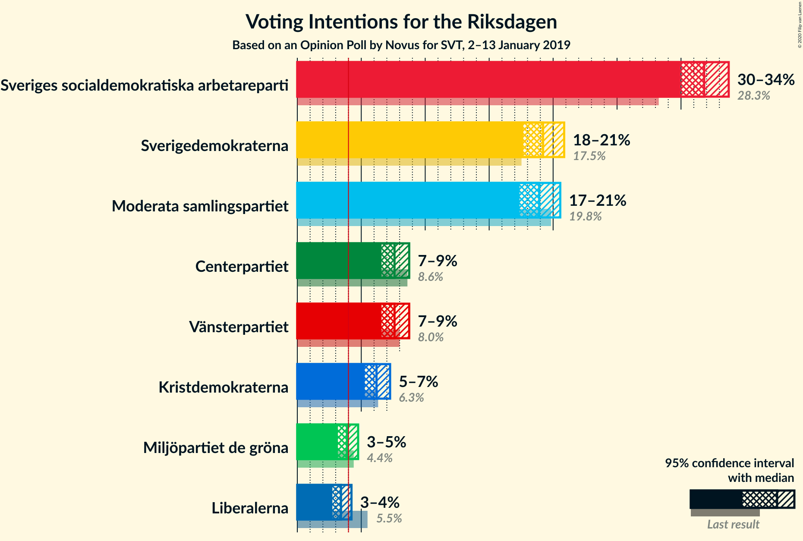

### Confidence Intervals

| Party | Last Result | Poll Result | 80% Confidence Interval | 90% Confidence Interval | 95% Confidence Interval | 99% Confidence Interval |
|:-----:|:-----------:|:-----------:|:-----------------------:|:-----------------------:|:-----------------------:|:-----------------------:|
| Sveriges socialdemokratiska arbetareparti | 28.3% | 31.8% | 30.6–33.1% |30.2–33.4% |29.9–33.7% |29.4–34.3% |
| Sverigedemokraterna | 17.5% | 19.2% | 18.2–20.3% |17.9–20.6% |17.7–20.9% |17.2–21.4% |
| Moderata samlingspartiet | 19.8% | 18.9% | 17.9–20.0% |17.6–20.3% |17.4–20.6% |16.9–21.1% |
| Centerpartiet | 8.6% | 7.6% | 6.9–8.4% |6.8–8.6% |6.6–8.7% |6.3–9.1% |
| Vänsterpartiet | 8.0% | 7.6% | 6.9–8.4% |6.8–8.6% |6.6–8.7% |6.3–9.1% |
| Kristdemokraterna | 6.3% | 6.2% | 5.6–6.9% |5.4–7.1% |5.3–7.3% |5.0–7.6% |
| Miljöpartiet de gröna | 4.4% | 3.9% | 3.4–4.5% |3.3–4.6% |3.2–4.8% |3.0–5.0% |
| Liberalerna | 5.5% | 3.4% | 3.0–3.9% |2.9–4.1% |2.7–4.2% |2.5–4.5% |

*Note:* The poll result column reflects the actual value used in the calculations. Published results may vary slightly, and in addition be rounded to fewer digits.

## Seats

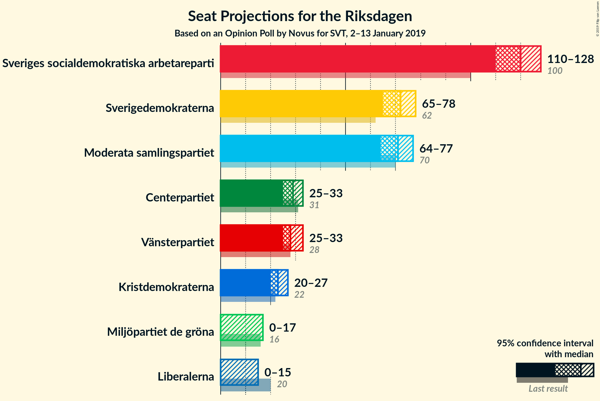

### Confidence Intervals

| Party | Last Result | Median | 80% Confidence Interval | 90% Confidence Interval | 95% Confidence Interval | 99% Confidence Interval |
|:-----:|:-----------:|:------:|:-----------------------:|:-----------------------:|:-----------------------:|:-----------------------:|
| <a href="#sveriges-socialdemokratiska-arbetareparti">Sveriges socialdemokratiska arbetareparti</a> | 100 | 119 | 113–125 |111–127 |110–128 |107–130 |
| <a href="#sverigedemokraterna">Sverigedemokraterna</a> | 62 | 72 | 67–77 |66–78 |65–79 |63–81 |
| <a href="#moderata-samlingspartiet">Moderata samlingspartiet</a> | 70 | 71 | 66–75 |65–76 |64–77 |62–79 |
| <a href="#centerpartiet">Centerpartiet</a> | 31 | 29 | 26–31 |25–32 |24–33 |23–34 |
| <a href="#vänsterpartiet">Vänsterpartiet</a> | 28 | 28 | 26–31 |25–32 |24–33 |23–34 |
| <a href="#kristdemokraterna">Kristdemokraterna</a> | 22 | 23 | 21–26 |20–26 |20–27 |19–29 |
| <a href="#miljöpartiet-de-gröna">Miljöpartiet de gröna</a> | 16 | 0 | 0–16 |0–17 |0–17 |0–18 |
| <a href="#liberalerna">Liberalerna</a> | 20 | 0 | 0 |0–15 |0–15 |0–16 |

### Sveriges socialdemokratiska arbetareparti

*For a full overview of the results for this party, see the [Sveriges socialdemokratiska arbetareparti](party-sverigessocialdemokratiskaarbetareparti.html) page.*

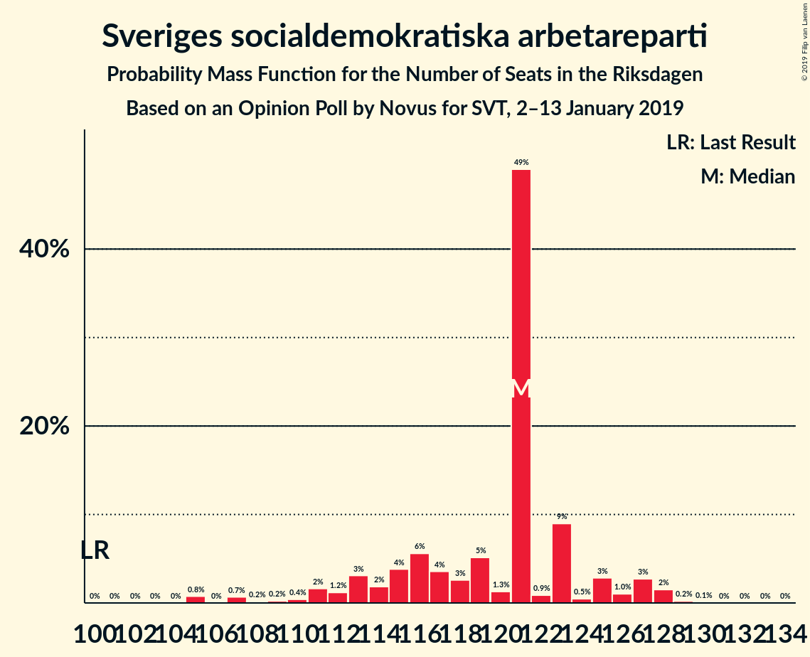

| Number of Seats | Probability | Accumulated | Special Marks |
|:---------------:|:-----------:|:-----------:|:-------------:|
| 100 | 0% | 100% | Last Result |
| 101 | 0% | 100% |  |
| 102 | 0% | 100% |  |
| 103 | 0% | 100% |  |
| 104 | 0% | 100% |  |
| 105 | 0.2% | 99.9% |  |
| 106 | 0.1% | 99.7% |  |
| 107 | 0.3% | 99.6% |  |
| 108 | 0.5% | 99.3% |  |
| 109 | 0.9% | 98.8% |  |
| 110 | 1.4% | 98% |  |
| 111 | 2% | 96% |  |
| 112 | 3% | 94% |  |
| 113 | 4% | 92% |  |
| 114 | 4% | 88% |  |
| 115 | 5% | 84% |  |
| 116 | 7% | 79% |  |
| 117 | 8% | 72% |  |
| 118 | 6% | 64% |  |
| 119 | 10% | 58% | Median |
| 120 | 7% | 48% |  |
| 121 | 13% | 41% |  |
| 122 | 7% | 28% |  |
| 123 | 4% | 21% |  |
| 124 | 5% | 17% |  |
| 125 | 5% | 12% |  |
| 126 | 2% | 8% |  |
| 127 | 2% | 6% |  |
| 128 | 1.4% | 3% |  |
| 129 | 1.4% | 2% |  |
| 130 | 0.3% | 0.6% |  |
| 131 | 0.2% | 0.3% |  |
| 132 | 0% | 0.1% |  |
| 133 | 0% | 0.1% |  |
| 134 | 0% | 0% |  |

### Sverigedemokraterna

*For a full overview of the results for this party, see the [Sverigedemokraterna](party-sverigedemokraterna.html) page.*

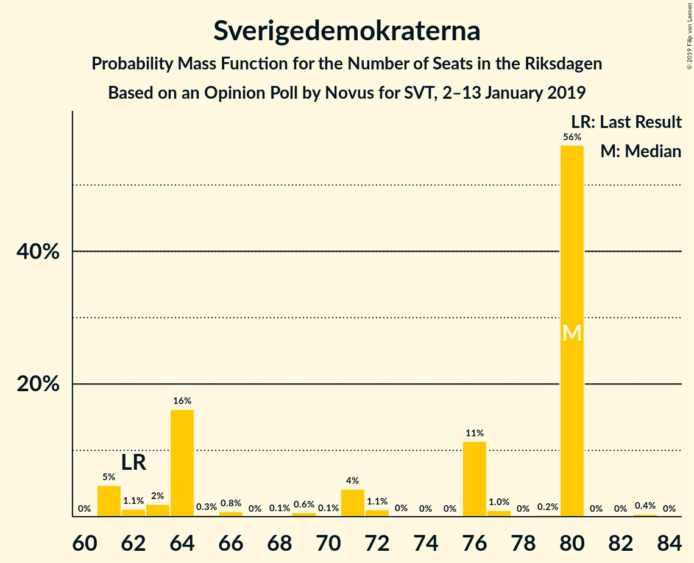

| Number of Seats | Probability | Accumulated | Special Marks |
|:---------------:|:-----------:|:-----------:|:-------------:|
| 61 | 0.1% | 100% |  |
| 62 | 0.2% | 99.9% | Last Result |
| 63 | 0.3% | 99.6% |  |
| 64 | 1.0% | 99.3% |  |
| 65 | 2% | 98% |  |
| 66 | 3% | 96% |  |
| 67 | 4% | 93% |  |
| 68 | 6% | 89% |  |
| 69 | 10% | 83% |  |
| 70 | 7% | 73% |  |
| 71 | 10% | 66% |  |
| 72 | 12% | 56% | Median |
| 73 | 14% | 44% |  |
| 74 | 7% | 30% |  |
| 75 | 5% | 23% |  |
| 76 | 7% | 18% |  |
| 77 | 6% | 11% |  |
| 78 | 2% | 5% |  |
| 79 | 2% | 3% |  |
| 80 | 0.6% | 1.3% |  |
| 81 | 0.5% | 0.7% |  |
| 82 | 0.1% | 0.2% |  |
| 83 | 0% | 0.1% |  |
| 84 | 0% | 0% |  |

### Moderata samlingspartiet

*For a full overview of the results for this party, see the [Moderata samlingspartiet](party-moderatasamlingspartiet.html) page.*

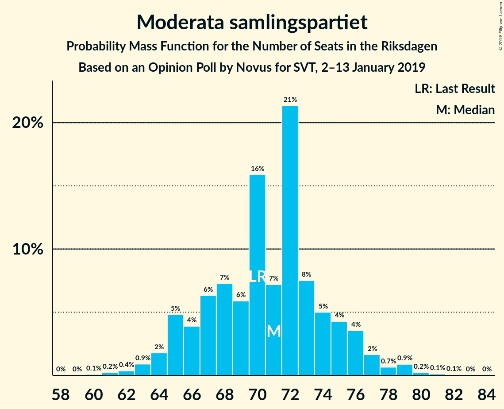

| Number of Seats | Probability | Accumulated | Special Marks |
|:---------------:|:-----------:|:-----------:|:-------------:|
| 60 | 0.1% | 100% |  |
| 61 | 0.2% | 99.9% |  |
| 62 | 0.4% | 99.6% |  |
| 63 | 1.2% | 99.2% |  |
| 64 | 1.4% | 98% |  |
| 65 | 4% | 97% |  |
| 66 | 4% | 93% |  |
| 67 | 6% | 89% |  |
| 68 | 8% | 83% |  |
| 69 | 6% | 74% |  |
| 70 | 12% | 68% | Last Result |
| 71 | 11% | 56% | Median |
| 72 | 19% | 45% |  |
| 73 | 7% | 27% |  |
| 74 | 7% | 19% |  |
| 75 | 5% | 12% |  |
| 76 | 3% | 7% |  |
| 77 | 2% | 4% |  |
| 78 | 1.0% | 2% |  |
| 79 | 0.6% | 1.0% |  |
| 80 | 0.3% | 0.4% |  |
| 81 | 0.1% | 0.2% |  |
| 82 | 0.1% | 0.1% |  |
| 83 | 0% | 0% |  |

### Centerpartiet

*For a full overview of the results for this party, see the [Centerpartiet](party-centerpartiet.html) page.*

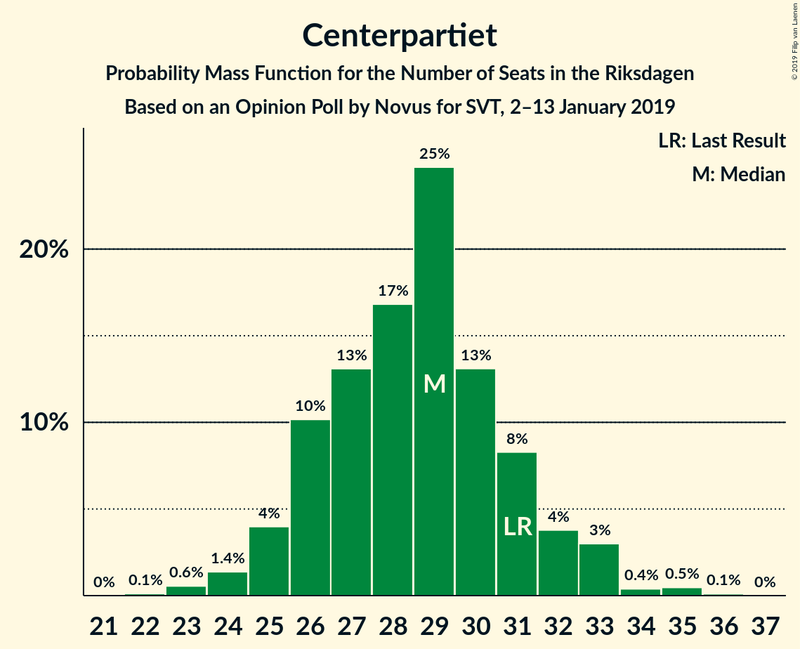

| Number of Seats | Probability | Accumulated | Special Marks |
|:---------------:|:-----------:|:-----------:|:-------------:|
| 22 | 0.1% | 100% |  |
| 23 | 0.5% | 99.9% |  |
| 24 | 2% | 99.4% |  |
| 25 | 4% | 97% |  |
| 26 | 8% | 93% |  |
| 27 | 14% | 84% |  |
| 28 | 15% | 70% |  |
| 29 | 23% | 54% | Median |
| 30 | 12% | 31% |  |
| 31 | 11% | 19% | Last Result |
| 32 | 4% | 8% |  |
| 33 | 3% | 4% |  |
| 34 | 0.7% | 1.1% |  |
| 35 | 0.3% | 0.5% |  |
| 36 | 0.1% | 0.1% |  |
| 37 | 0% | 0% |  |

### Vänsterpartiet

*For a full overview of the results for this party, see the [Vänsterpartiet](party-vänsterpartiet.html) page.*

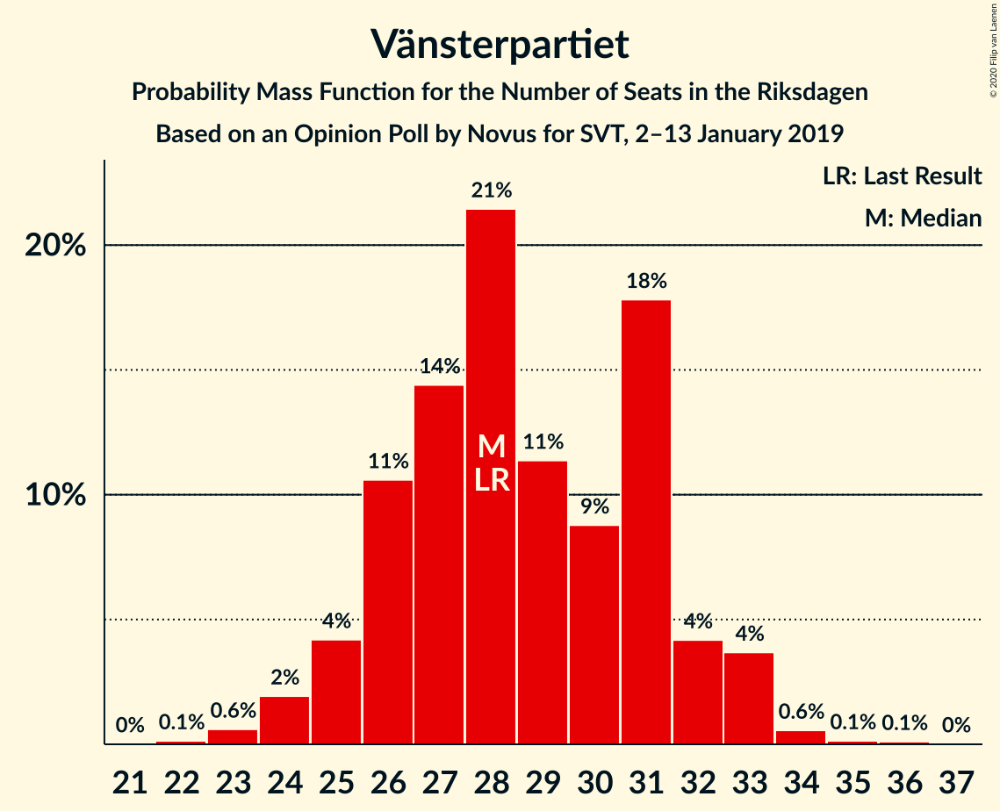

| Number of Seats | Probability | Accumulated | Special Marks |
|:---------------:|:-----------:|:-----------:|:-------------:|
| 22 | 0.1% | 100% |  |
| 23 | 0.6% | 99.8% |  |
| 24 | 2% | 99.2% |  |
| 25 | 4% | 97% |  |
| 26 | 11% | 93% |  |
| 27 | 14% | 83% |  |
| 28 | 21% | 68% | Last Result, Median |
| 29 | 11% | 47% |  |
| 30 | 9% | 35% |  |
| 31 | 18% | 27% |  |
| 32 | 4% | 9% |  |
| 33 | 4% | 5% |  |
| 34 | 0.6% | 0.8% |  |
| 35 | 0.1% | 0.3% |  |
| 36 | 0.1% | 0.1% |  |
| 37 | 0% | 0% |  |

### Kristdemokraterna

*For a full overview of the results for this party, see the [Kristdemokraterna](party-kristdemokraterna.html) page.*

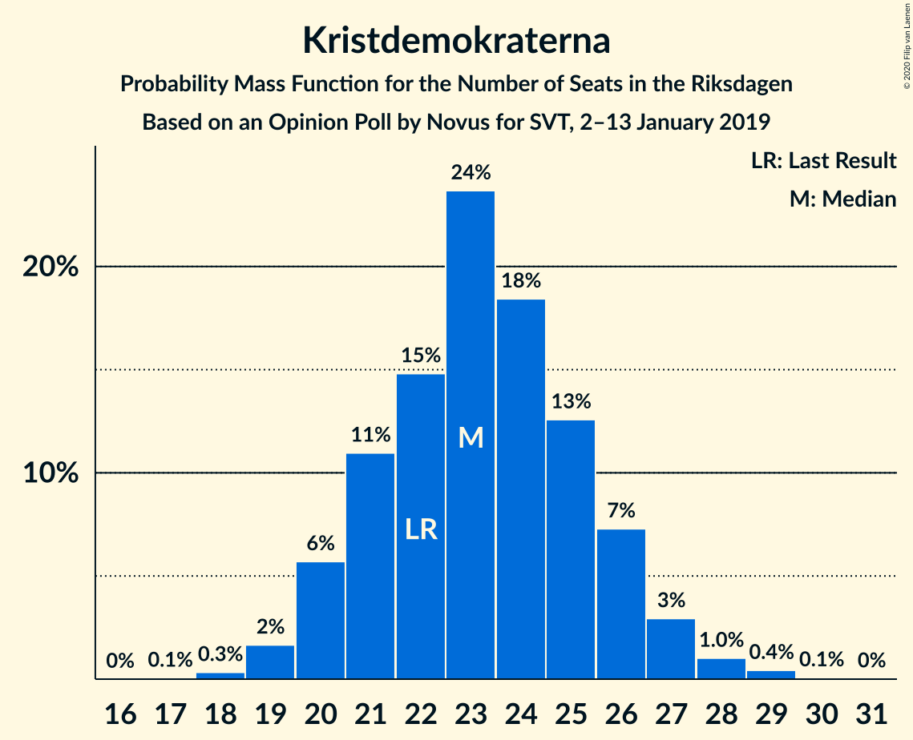

| Number of Seats | Probability | Accumulated | Special Marks |
|:---------------:|:-----------:|:-----------:|:-------------:|
| 17 | 0.1% | 100% |  |
| 18 | 0.3% | 99.9% |  |
| 19 | 2% | 99.6% |  |
| 20 | 6% | 98% |  |
| 21 | 11% | 92% |  |
| 22 | 15% | 81% | Last Result |
| 23 | 24% | 66% | Median |
| 24 | 18% | 43% |  |
| 25 | 13% | 24% |  |
| 26 | 7% | 12% |  |
| 27 | 3% | 4% |  |
| 28 | 1.0% | 2% |  |
| 29 | 0.4% | 0.5% |  |
| 30 | 0.1% | 0.1% |  |
| 31 | 0% | 0% |  |

### Miljöpartiet de gröna

*For a full overview of the results for this party, see the [Miljöpartiet de gröna](party-miljöpartietdegröna.html) page.*

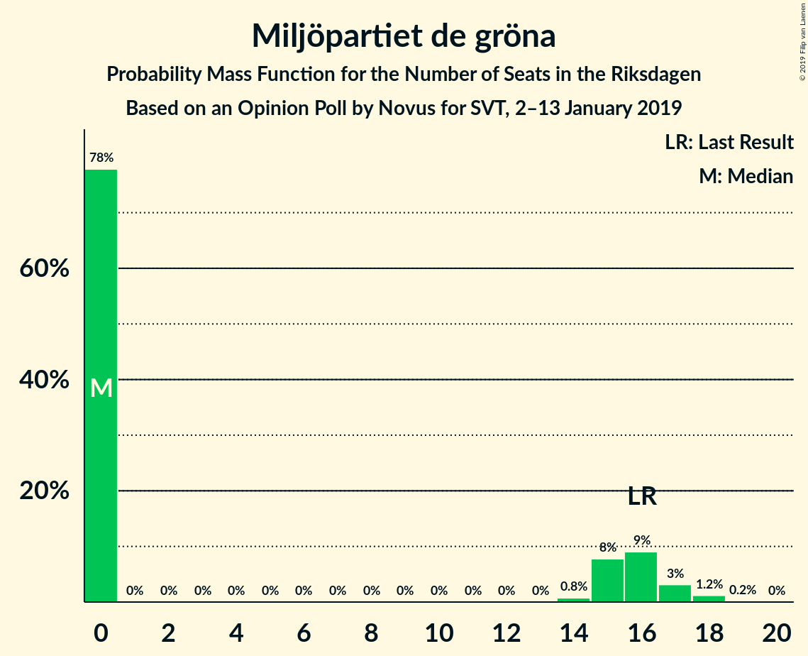

| Number of Seats | Probability | Accumulated | Special Marks |
|:---------------:|:-----------:|:-----------:|:-------------:|
| 0 | 64% | 100% | Median |
| 1 | 0% | 36% |  |
| 2 | 0% | 36% |  |
| 3 | 0% | 36% |  |
| 4 | 0% | 36% |  |
| 5 | 0% | 36% |  |
| 6 | 0% | 36% |  |
| 7 | 0% | 36% |  |
| 8 | 0% | 36% |  |
| 9 | 0% | 36% |  |
| 10 | 0% | 36% |  |
| 11 | 0% | 36% |  |
| 12 | 0% | 36% |  |
| 13 | 0% | 36% |  |
| 14 | 0.3% | 36% |  |
| 15 | 18% | 36% |  |
| 16 | 10% | 18% | Last Result |
| 17 | 5% | 7% |  |
| 18 | 2% | 2% |  |
| 19 | 0.2% | 0.3% |  |
| 20 | 0.1% | 0.1% |  |
| 21 | 0% | 0% |  |

### Liberalerna

*For a full overview of the results for this party, see the [Liberalerna](party-liberalerna.html) page.*

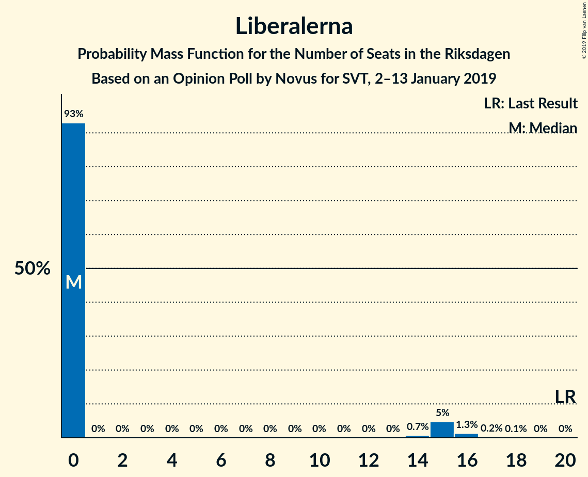

| Number of Seats | Probability | Accumulated | Special Marks |
|:---------------:|:-----------:|:-----------:|:-------------:|
| 0 | 93% | 100% | Median |
| 1 | 0% | 7% |  |
| 2 | 0% | 7% |  |
| 3 | 0% | 7% |  |
| 4 | 0% | 7% |  |
| 5 | 0% | 7% |  |
| 6 | 0% | 7% |  |
| 7 | 0% | 7% |  |
| 8 | 0% | 7% |  |
| 9 | 0% | 7% |  |
| 10 | 0% | 7% |  |
| 11 | 0% | 7% |  |
| 12 | 0% | 7% |  |
| 13 | 0% | 7% |  |
| 14 | 0.5% | 7% |  |
| 15 | 4% | 6% |  |
| 16 | 1.4% | 2% |  |
| 17 | 0.4% | 0.5% |  |
| 18 | 0% | 0.1% |  |
| 19 | 0% | 0% |  |
| 20 | 0% | 0% | Last Result |

## Coalitions

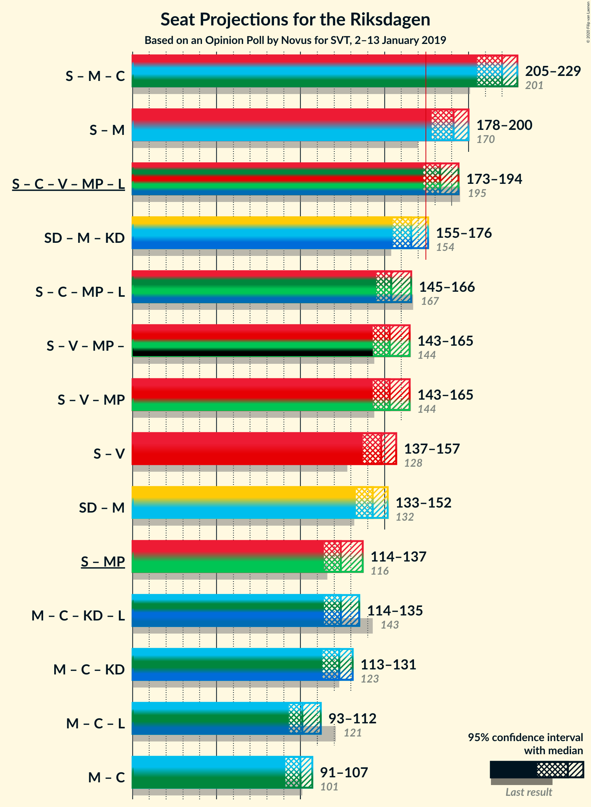

### Confidence Intervals

| Coalition | Last Result | Median | Majority? | 80% Confidence Interval | 90% Confidence Interval | 95% Confidence Interval | 99% Confidence Interval |
|:---------:|:-----------:|:------:|:---------:|:-----------------------:|:-----------------------:|:-----------------------:|:-----------------------:|
| Sveriges socialdemokratiska arbetareparti – Moderata samlingspartiet – Centerpartiet | 201 | 220 | 100% | 210–226 | 207–228 | 205–229 | 201–231 |
| Sveriges socialdemokratiska arbetareparti – Moderata samlingspartiet | 170 | 191 | 99.4% | 182–196 | 179–199 | 178–200 | 174–202 |
| Sveriges socialdemokratiska arbetareparti – Centerpartiet – Vänsterpartiet – Miljöpartiet de gröna – Liberalerna | 195 | 183 | 96% | 177–191 | 175–192 | 173–194 | 171–198 |
| Sverigedemokraterna – Moderata samlingspartiet – Kristdemokraterna | 154 | 166 | 4% | 158–172 | 157–174 | 155–176 | 151–178 |
| Sveriges socialdemokratiska arbetareparti – Centerpartiet – Miljöpartiet de gröna – Liberalerna | 167 | 154 | 0.1% | 147–162 | 146–165 | 145–166 | 143–170 |
| Sveriges socialdemokratiska arbetareparti – Vänsterpartiet – Miljöpartiet de gröna | 144 | 153 | 0% | 147–162 | 144–163 | 143–165 | 139–167 |
| Sveriges socialdemokratiska arbetareparti – Vänsterpartiet | 128 | 148 | 0% | 141–154 | 139–156 | 137–157 | 134–160 |
| Sverigedemokraterna – Moderata samlingspartiet | 132 | 143 | 0% | 136–149 | 134–151 | 133–152 | 129–154 |
| Sveriges socialdemokratiska arbetareparti – Miljöpartiet de gröna | 116 | 124 | 0% | 117–134 | 116–136 | 114–137 | 111–140 |
| Moderata samlingspartiet – Centerpartiet – Kristdemokraterna – Liberalerna | 143 | 124 | 0% | 117–130 | 116–132 | 114–135 | 112–140 |
| Moderata samlingspartiet – Centerpartiet – Kristdemokraterna | 123 | 123 | 0% | 117–128 | 114–130 | 113–131 | 111–134 |
| Moderata samlingspartiet – Centerpartiet – Liberalerna | 121 | 101 | 0% | 94–105 | 93–109 | 93–112 | 90–117 |
| Moderata samlingspartiet – Centerpartiet | 101 | 100 | 0% | 94–105 | 93–105 | 91–107 | 89–109 |

### Sveriges socialdemokratiska arbetareparti – Moderata samlingspartiet – Centerpartiet

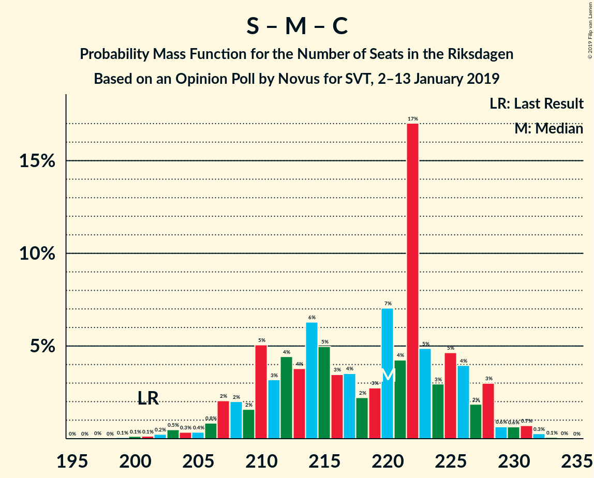

| Number of Seats | Probability | Accumulated | Special Marks |
|:---------------:|:-----------:|:-----------:|:-------------:|
| 196 | 0% | 100% |  |
| 197 | 0% | 99.9% |  |
| 198 | 0% | 99.9% |  |
| 199 | 0.1% | 99.9% |  |
| 200 | 0.2% | 99.8% |  |
| 201 | 0.3% | 99.6% | Last Result |
| 202 | 0.2% | 99.4% |  |
| 203 | 0.6% | 99.1% |  |
| 204 | 0.3% | 98.5% |  |
| 205 | 0.8% | 98% |  |
| 206 | 1.0% | 97% |  |
| 207 | 2% | 96% |  |
| 208 | 2% | 95% |  |
| 209 | 2% | 93% |  |
| 210 | 3% | 91% |  |
| 211 | 4% | 88% |  |
| 212 | 4% | 84% |  |
| 213 | 4% | 81% |  |
| 214 | 6% | 77% |  |
| 215 | 4% | 71% |  |
| 216 | 4% | 67% |  |
| 217 | 3% | 63% |  |
| 218 | 5% | 60% |  |
| 219 | 3% | 55% | Median |
| 220 | 5% | 52% |  |
| 221 | 9% | 47% |  |
| 222 | 12% | 37% |  |
| 223 | 4% | 26% |  |
| 224 | 4% | 22% |  |
| 225 | 6% | 18% |  |
| 226 | 3% | 12% |  |
| 227 | 3% | 9% |  |
| 228 | 3% | 6% |  |
| 229 | 0.8% | 3% |  |
| 230 | 1.2% | 2% |  |
| 231 | 0.5% | 0.8% |  |
| 232 | 0.2% | 0.4% |  |
| 233 | 0.1% | 0.2% |  |
| 234 | 0% | 0.1% |  |
| 235 | 0% | 0% |  |

### Sveriges socialdemokratiska arbetareparti – Moderata samlingspartiet

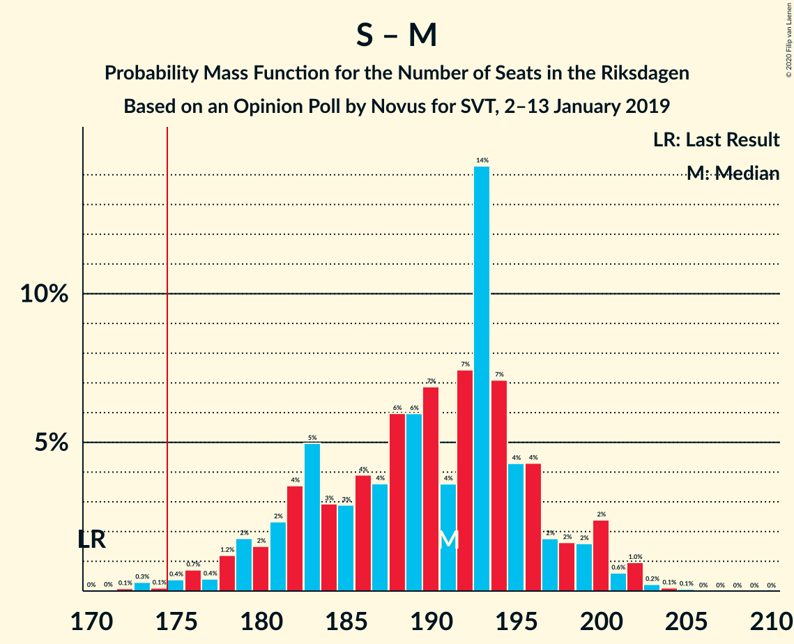

| Number of Seats | Probability | Accumulated | Special Marks |
|:---------------:|:-----------:|:-----------:|:-------------:|
| 170 | 0% | 100% | Last Result |
| 171 | 0% | 99.9% |  |
| 172 | 0.1% | 99.9% |  |
| 173 | 0.3% | 99.8% |  |
| 174 | 0.1% | 99.5% |  |
| 175 | 0.4% | 99.4% | Majority |
| 176 | 0.7% | 99.0% |  |
| 177 | 0.4% | 98% |  |
| 178 | 1.2% | 98% |  |
| 179 | 2% | 97% |  |
| 180 | 2% | 95% |  |
| 181 | 2% | 93% |  |
| 182 | 4% | 91% |  |
| 183 | 5% | 88% |  |
| 184 | 3% | 83% |  |
| 185 | 3% | 80% |  |
| 186 | 4% | 77% |  |
| 187 | 4% | 73% |  |
| 188 | 6% | 69% |  |
| 189 | 6% | 63% |  |
| 190 | 7% | 57% | Median |
| 191 | 4% | 50% |  |
| 192 | 7% | 47% |  |
| 193 | 14% | 39% |  |
| 194 | 7% | 25% |  |
| 195 | 4% | 18% |  |
| 196 | 4% | 14% |  |
| 197 | 2% | 9% |  |
| 198 | 2% | 8% |  |
| 199 | 2% | 6% |  |
| 200 | 2% | 4% |  |
| 201 | 0.6% | 2% |  |
| 202 | 1.0% | 1.4% |  |
| 203 | 0.2% | 0.4% |  |
| 204 | 0.1% | 0.2% |  |
| 205 | 0.1% | 0.1% |  |
| 206 | 0% | 0% |  |

### Sveriges socialdemokratiska arbetareparti – Centerpartiet – Vänsterpartiet – Miljöpartiet de gröna – Liberalerna

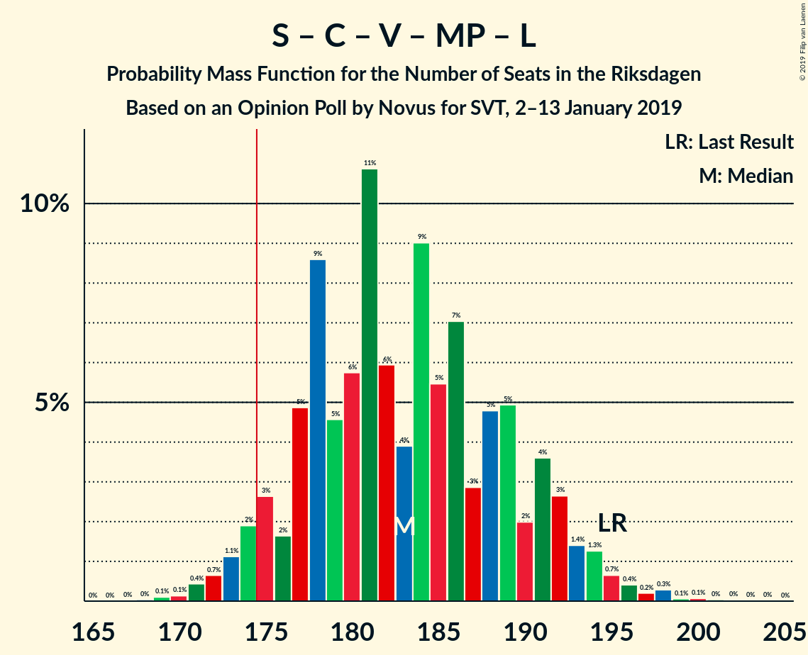

| Number of Seats | Probability | Accumulated | Special Marks |
|:---------------:|:-----------:|:-----------:|:-------------:|
| 168 | 0% | 100% |  |
| 169 | 0.1% | 99.9% |  |
| 170 | 0.1% | 99.8% |  |
| 171 | 0.4% | 99.7% |  |
| 172 | 0.7% | 99.3% |  |
| 173 | 1.1% | 98.6% |  |
| 174 | 2% | 97% |  |
| 175 | 3% | 96% | Majority |
| 176 | 2% | 93% | Median |
| 177 | 5% | 91% |  |
| 178 | 9% | 86% |  |
| 179 | 5% | 78% |  |
| 180 | 6% | 73% |  |
| 181 | 11% | 68% |  |
| 182 | 6% | 57% |  |
| 183 | 4% | 51% |  |
| 184 | 9% | 47% |  |
| 185 | 5% | 38% |  |
| 186 | 7% | 32% |  |
| 187 | 3% | 25% |  |
| 188 | 5% | 22% |  |
| 189 | 5% | 18% |  |
| 190 | 2% | 13% |  |
| 191 | 4% | 11% |  |
| 192 | 3% | 7% |  |
| 193 | 1.4% | 4% |  |
| 194 | 1.3% | 3% |  |
| 195 | 0.7% | 2% | Last Result |
| 196 | 0.4% | 1.1% |  |
| 197 | 0.2% | 0.7% |  |
| 198 | 0.3% | 0.5% |  |
| 199 | 0.1% | 0.2% |  |
| 200 | 0.1% | 0.2% |  |
| 201 | 0% | 0.1% |  |
| 202 | 0% | 0.1% |  |
| 203 | 0% | 0% |  |

### Sverigedemokraterna – Moderata samlingspartiet – Kristdemokraterna

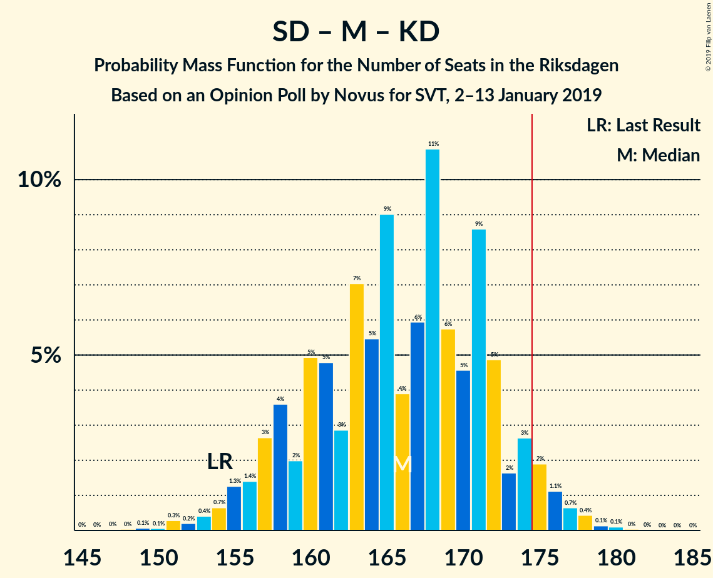

| Number of Seats | Probability | Accumulated | Special Marks |
|:---------------:|:-----------:|:-----------:|:-------------:|
| 147 | 0% | 100% |  |
| 148 | 0% | 99.9% |  |
| 149 | 0.1% | 99.9% |  |
| 150 | 0.1% | 99.8% |  |
| 151 | 0.3% | 99.8% |  |
| 152 | 0.2% | 99.5% |  |
| 153 | 0.4% | 99.3% |  |
| 154 | 0.7% | 98.9% | Last Result |
| 155 | 1.3% | 98% |  |
| 156 | 1.4% | 97% |  |
| 157 | 3% | 96% |  |
| 158 | 4% | 93% |  |
| 159 | 2% | 89% |  |
| 160 | 5% | 87% |  |
| 161 | 5% | 82% |  |
| 162 | 3% | 78% |  |
| 163 | 7% | 75% |  |
| 164 | 5% | 68% |  |
| 165 | 9% | 62% |  |
| 166 | 4% | 53% | Median |
| 167 | 6% | 49% |  |
| 168 | 11% | 43% |  |
| 169 | 6% | 32% |  |
| 170 | 5% | 27% |  |
| 171 | 9% | 22% |  |
| 172 | 5% | 14% |  |
| 173 | 2% | 9% |  |
| 174 | 3% | 7% |  |
| 175 | 2% | 4% | Majority |
| 176 | 1.1% | 3% |  |
| 177 | 0.7% | 1.4% |  |
| 178 | 0.4% | 0.7% |  |
| 179 | 0.1% | 0.3% |  |
| 180 | 0.1% | 0.2% |  |
| 181 | 0% | 0.1% |  |
| 182 | 0% | 0% |  |

### Sveriges socialdemokratiska arbetareparti – Centerpartiet – Miljöpartiet de gröna – Liberalerna

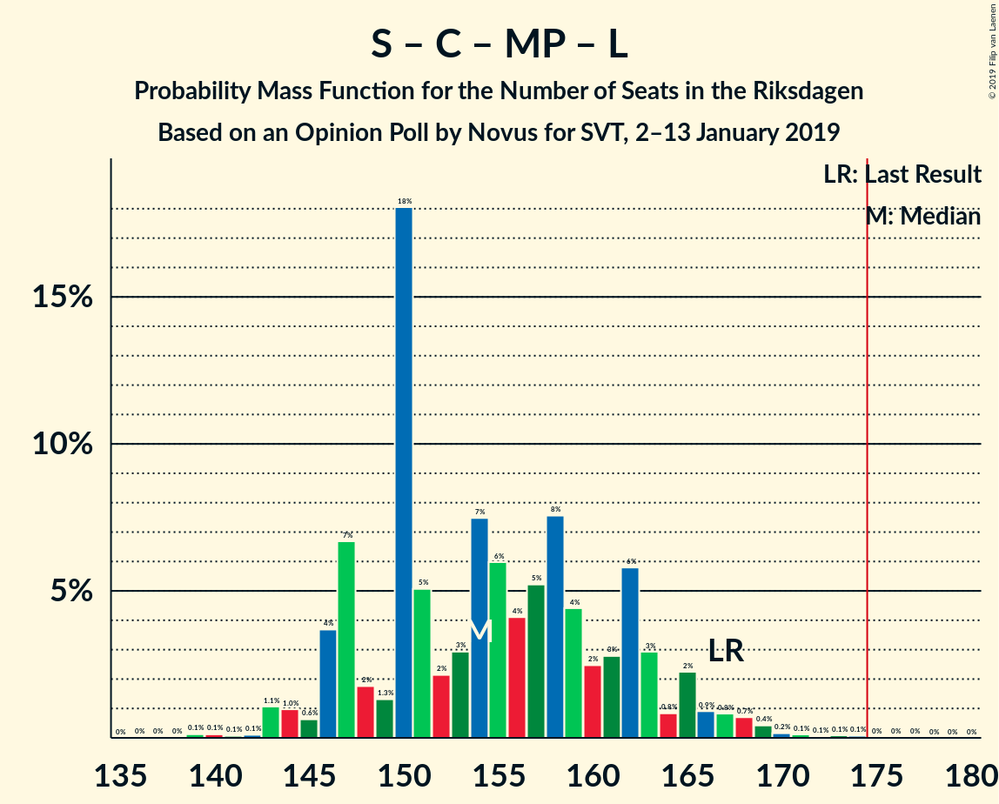

| Number of Seats | Probability | Accumulated | Special Marks |
|:---------------:|:-----------:|:-----------:|:-------------:|
| 139 | 0.1% | 100% |  |
| 140 | 0.1% | 99.9% |  |
| 141 | 0.1% | 99.7% |  |
| 142 | 0.1% | 99.7% |  |
| 143 | 1.1% | 99.6% |  |
| 144 | 1.0% | 98% |  |
| 145 | 0.6% | 98% |  |
| 146 | 4% | 97% |  |
| 147 | 7% | 93% |  |
| 148 | 2% | 87% | Median |
| 149 | 1.3% | 85% |  |
| 150 | 18% | 83% |  |
| 151 | 5% | 65% |  |
| 152 | 2% | 60% |  |
| 153 | 3% | 58% |  |
| 154 | 7% | 55% |  |
| 155 | 6% | 48% |  |
| 156 | 4% | 42% |  |
| 157 | 5% | 38% |  |
| 158 | 8% | 32% |  |
| 159 | 4% | 25% |  |
| 160 | 2% | 20% |  |
| 161 | 3% | 18% |  |
| 162 | 6% | 15% |  |
| 163 | 3% | 9% |  |
| 164 | 0.8% | 6% |  |
| 165 | 2% | 6% |  |
| 166 | 0.9% | 3% |  |
| 167 | 0.8% | 2% | Last Result |
| 168 | 0.7% | 2% |  |
| 169 | 0.4% | 1.0% |  |
| 170 | 0.2% | 0.5% |  |
| 171 | 0.1% | 0.4% |  |
| 172 | 0.1% | 0.3% |  |
| 173 | 0.1% | 0.2% |  |
| 174 | 0.1% | 0.1% |  |
| 175 | 0% | 0.1% | Majority |
| 176 | 0% | 0% |  |

### Sveriges socialdemokratiska arbetareparti – Vänsterpartiet – Miljöpartiet de gröna

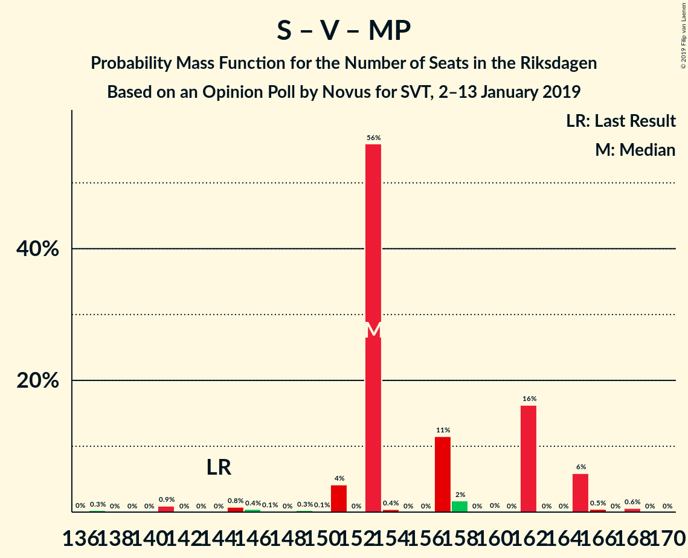

| Number of Seats | Probability | Accumulated | Special Marks |
|:---------------:|:-----------:|:-----------:|:-------------:|
| 136 | 0% | 100% |  |
| 137 | 0% | 99.9% |  |
| 138 | 0.1% | 99.9% |  |
| 139 | 0.3% | 99.8% |  |
| 140 | 0.2% | 99.4% |  |
| 141 | 0.9% | 99.3% |  |
| 142 | 0.7% | 98% |  |
| 143 | 1.0% | 98% |  |
| 144 | 2% | 97% | Last Result |
| 145 | 3% | 95% |  |
| 146 | 2% | 92% |  |
| 147 | 6% | 90% | Median |
| 148 | 6% | 84% |  |
| 149 | 3% | 77% |  |
| 150 | 8% | 74% |  |
| 151 | 3% | 66% |  |
| 152 | 11% | 63% |  |
| 153 | 5% | 52% |  |
| 154 | 8% | 47% |  |
| 155 | 5% | 39% |  |
| 156 | 4% | 35% |  |
| 157 | 5% | 31% |  |
| 158 | 3% | 26% |  |
| 159 | 5% | 23% |  |
| 160 | 3% | 18% |  |
| 161 | 4% | 14% |  |
| 162 | 3% | 11% |  |
| 163 | 5% | 8% |  |
| 164 | 1.1% | 4% |  |
| 165 | 0.9% | 3% |  |
| 166 | 0.8% | 2% |  |
| 167 | 0.3% | 0.7% |  |
| 168 | 0.2% | 0.4% |  |
| 169 | 0.2% | 0.3% |  |
| 170 | 0.1% | 0.1% |  |
| 171 | 0% | 0% |  |

### Sveriges socialdemokratiska arbetareparti – Vänsterpartiet

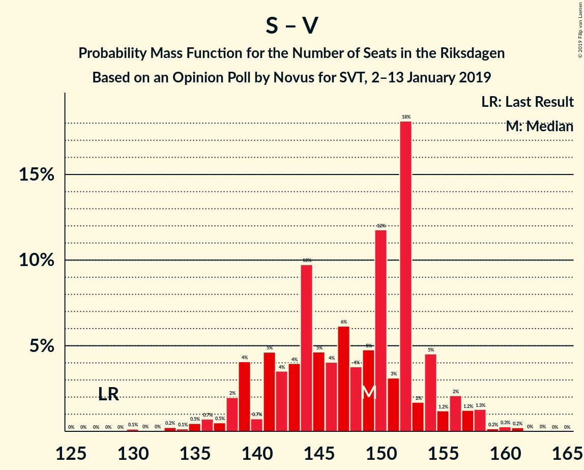

| Number of Seats | Probability | Accumulated | Special Marks |
|:---------------:|:-----------:|:-----------:|:-------------:|
| 128 | 0% | 100% | Last Result |
| 129 | 0% | 100% |  |
| 130 | 0.1% | 100% |  |
| 131 | 0.1% | 99.9% |  |
| 132 | 0.1% | 99.8% |  |
| 133 | 0.2% | 99.8% |  |
| 134 | 0.2% | 99.6% |  |
| 135 | 0.5% | 99.4% |  |
| 136 | 0.8% | 98.9% |  |
| 137 | 0.9% | 98% |  |
| 138 | 1.4% | 97% |  |
| 139 | 4% | 96% |  |
| 140 | 1.3% | 92% |  |
| 141 | 4% | 91% |  |
| 142 | 3% | 87% |  |
| 143 | 4% | 83% |  |
| 144 | 7% | 80% |  |
| 145 | 7% | 73% |  |
| 146 | 4% | 66% |  |
| 147 | 9% | 62% | Median |
| 148 | 9% | 53% |  |
| 149 | 4% | 44% |  |
| 150 | 8% | 40% |  |
| 151 | 3% | 32% |  |
| 152 | 11% | 29% |  |
| 153 | 4% | 18% |  |
| 154 | 5% | 14% |  |
| 155 | 3% | 9% |  |
| 156 | 2% | 5% |  |
| 157 | 2% | 4% |  |
| 158 | 0.8% | 2% |  |
| 159 | 0.4% | 1.1% |  |
| 160 | 0.3% | 0.6% |  |
| 161 | 0.2% | 0.3% |  |
| 162 | 0% | 0.1% |  |
| 163 | 0% | 0% |  |

### Sverigedemokraterna – Moderata samlingspartiet

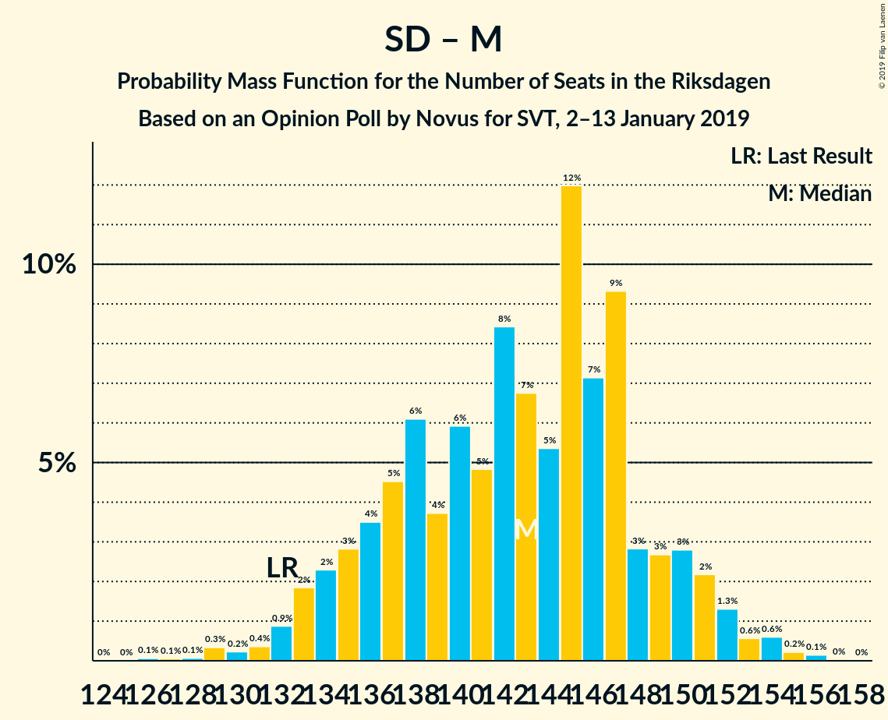

| Number of Seats | Probability | Accumulated | Special Marks |
|:---------------:|:-----------:|:-----------:|:-------------:|
| 126 | 0.1% | 100% |  |
| 127 | 0.1% | 99.9% |  |
| 128 | 0.1% | 99.9% |  |
| 129 | 0.3% | 99.8% |  |
| 130 | 0.2% | 99.4% |  |
| 131 | 0.4% | 99.2% |  |
| 132 | 0.9% | 98.9% | Last Result |
| 133 | 2% | 98% |  |
| 134 | 2% | 96% |  |
| 135 | 3% | 94% |  |
| 136 | 4% | 91% |  |
| 137 | 5% | 88% |  |
| 138 | 6% | 83% |  |
| 139 | 4% | 77% |  |
| 140 | 6% | 73% |  |
| 141 | 5% | 67% |  |
| 142 | 8% | 62% |  |
| 143 | 7% | 54% | Median |
| 144 | 5% | 47% |  |
| 145 | 12% | 42% |  |
| 146 | 7% | 30% |  |
| 147 | 9% | 23% |  |
| 148 | 3% | 13% |  |
| 149 | 3% | 11% |  |
| 150 | 3% | 8% |  |
| 151 | 2% | 5% |  |
| 152 | 1.3% | 3% |  |
| 153 | 0.6% | 2% |  |
| 154 | 0.6% | 1.0% |  |
| 155 | 0.2% | 0.4% |  |
| 156 | 0.1% | 0.2% |  |
| 157 | 0% | 0.1% |  |
| 158 | 0% | 0% |  |

### Sveriges socialdemokratiska arbetareparti – Miljöpartiet de gröna

| Number of Seats | Probability | Accumulated | Special Marks |
|:---------------:|:-----------:|:-----------:|:-------------:|
| 108 | 0% | 100% |  |
| 109 | 0% | 99.9% |  |
| 110 | 0.2% | 99.9% |  |
| 111 | 0.3% | 99.7% |  |
| 112 | 0.4% | 99.4% |  |
| 113 | 0.9% | 99.1% |  |
| 114 | 0.8% | 98% |  |
| 115 | 2% | 97% |  |
| 116 | 2% | 95% | Last Result |
| 117 | 4% | 93% |  |
| 118 | 3% | 89% |  |
| 119 | 7% | 86% | Median |
| 120 | 5% | 79% |  |
| 121 | 12% | 75% |  |
| 122 | 7% | 62% |  |
| 123 | 3% | 56% |  |
| 124 | 6% | 52% |  |
| 125 | 5% | 47% |  |
| 126 | 3% | 41% |  |
| 127 | 4% | 38% |  |
| 128 | 5% | 34% |  |
| 129 | 3% | 29% |  |
| 130 | 5% | 27% |  |
| 131 | 3% | 22% |  |
| 132 | 4% | 19% |  |
| 133 | 3% | 15% |  |
| 134 | 4% | 11% |  |
| 135 | 3% | 8% |  |
| 136 | 2% | 5% |  |
| 137 | 1.2% | 3% |  |
| 138 | 0.6% | 2% |  |
| 139 | 0.4% | 1.0% |  |
| 140 | 0.4% | 0.6% |  |
| 141 | 0.1% | 0.2% |  |
| 142 | 0% | 0.1% |  |
| 143 | 0% | 0% |  |

### Moderata samlingspartiet – Centerpartiet – Kristdemokraterna – Liberalerna

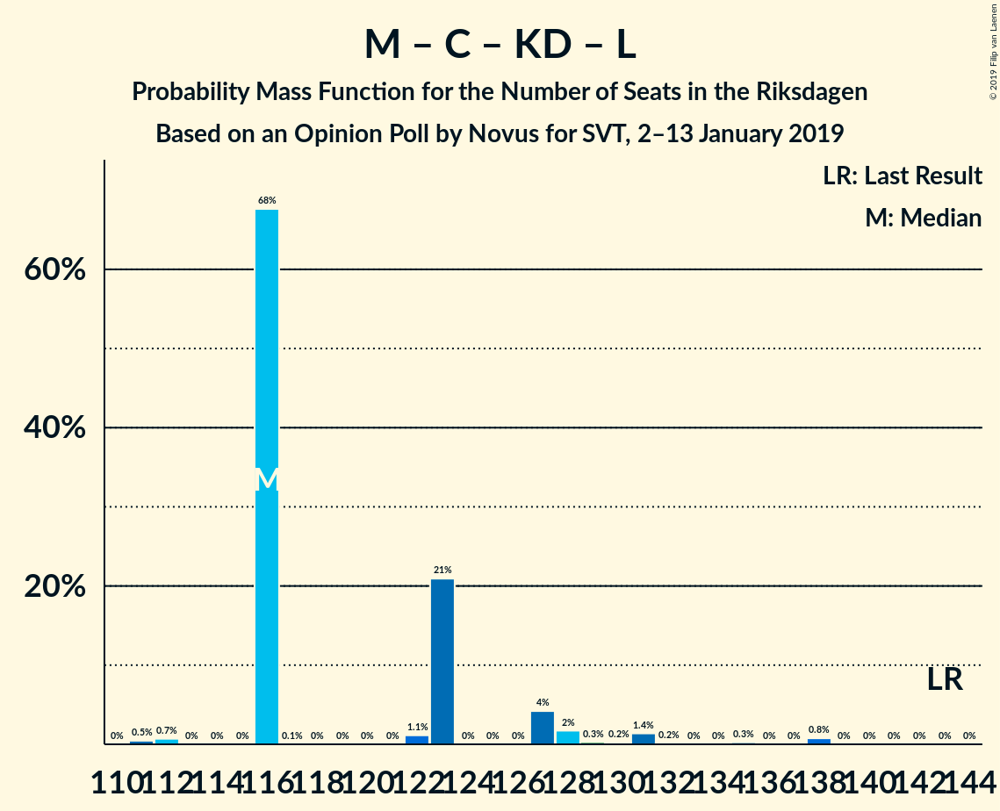

| Number of Seats | Probability | Accumulated | Special Marks |
|:---------------:|:-----------:|:-----------:|:-------------:|
| 109 | 0.1% | 100% |  |
| 110 | 0.1% | 99.9% |  |
| 111 | 0.2% | 99.8% |  |
| 112 | 0.6% | 99.6% |  |
| 113 | 1.1% | 99.0% |  |
| 114 | 1.3% | 98% |  |
| 115 | 0.9% | 97% |  |
| 116 | 2% | 96% |  |
| 117 | 4% | 93% |  |
| 118 | 5% | 90% |  |
| 119 | 5% | 85% |  |
| 120 | 6% | 80% |  |
| 121 | 6% | 74% |  |
| 122 | 11% | 68% |  |
| 123 | 6% | 57% | Median |
| 124 | 12% | 51% |  |
| 125 | 5% | 39% |  |
| 126 | 9% | 34% |  |
| 127 | 6% | 25% |  |
| 128 | 3% | 18% |  |
| 129 | 4% | 15% |  |
| 130 | 2% | 11% |  |
| 131 | 3% | 9% |  |
| 132 | 1.1% | 6% |  |
| 133 | 0.6% | 5% |  |
| 134 | 1.2% | 4% |  |
| 135 | 0.6% | 3% |  |
| 136 | 0.6% | 2% |  |
| 137 | 0.3% | 2% |  |
| 138 | 0.5% | 1.3% |  |
| 139 | 0.2% | 0.7% |  |
| 140 | 0.3% | 0.6% |  |
| 141 | 0.1% | 0.3% |  |
| 142 | 0.1% | 0.2% |  |
| 143 | 0% | 0.1% | Last Result |
| 144 | 0% | 0% |  |

### Moderata samlingspartiet – Centerpartiet – Kristdemokraterna

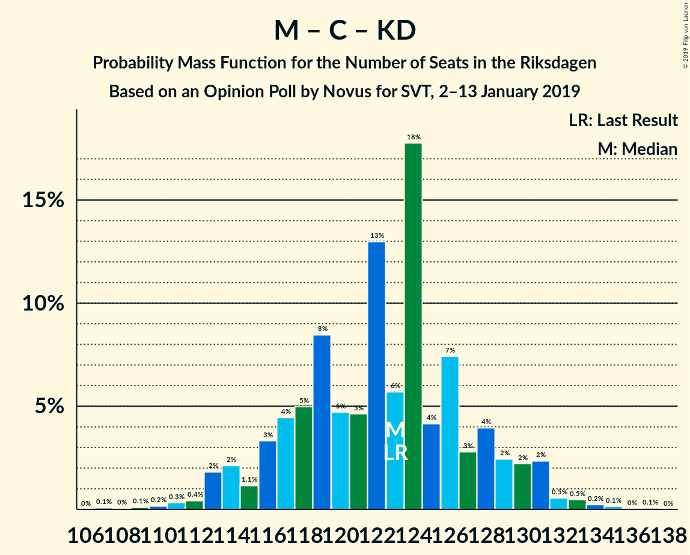

| Number of Seats | Probability | Accumulated | Special Marks |
|:---------------:|:-----------:|:-----------:|:-------------:|
| 107 | 0% | 100% |  |
| 108 | 0.1% | 99.9% |  |
| 109 | 0.1% | 99.9% |  |
| 110 | 0.2% | 99.8% |  |
| 111 | 0.4% | 99.6% |  |
| 112 | 0.8% | 99.2% |  |
| 113 | 1.3% | 98% |  |
| 114 | 2% | 97% |  |
| 115 | 1.1% | 95% |  |
| 116 | 3% | 94% |  |
| 117 | 4% | 91% |  |
| 118 | 5% | 87% |  |
| 119 | 6% | 82% |  |
| 120 | 6% | 76% |  |
| 121 | 7% | 69% |  |
| 122 | 11% | 63% |  |
| 123 | 6% | 51% | Last Result, Median |
| 124 | 12% | 45% |  |
| 125 | 5% | 32% |  |
| 126 | 9% | 28% |  |
| 127 | 6% | 19% |  |
| 128 | 3% | 12% |  |
| 129 | 4% | 9% |  |
| 130 | 2% | 5% |  |
| 131 | 3% | 4% |  |
| 132 | 0.4% | 1.3% |  |
| 133 | 0.3% | 0.9% |  |
| 134 | 0.3% | 0.5% |  |
| 135 | 0.1% | 0.2% |  |
| 136 | 0.1% | 0.1% |  |
| 137 | 0% | 0.1% |  |
| 138 | 0% | 0% |  |

### Moderata samlingspartiet – Centerpartiet – Liberalerna

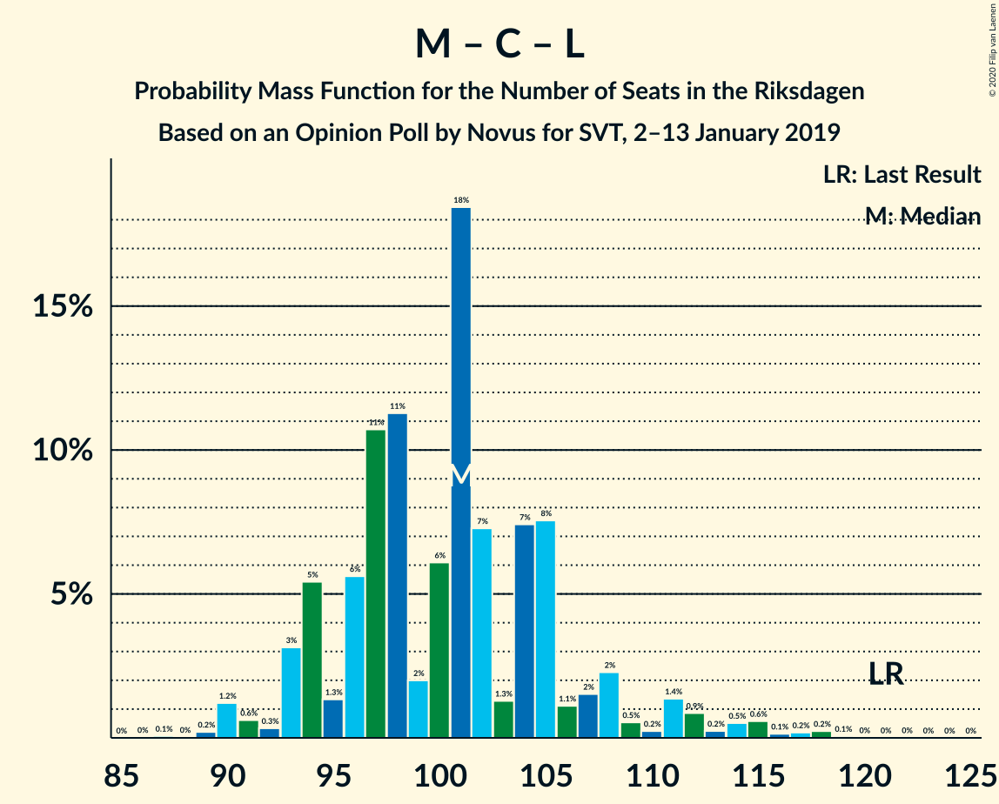

| Number of Seats | Probability | Accumulated | Special Marks |
|:---------------:|:-----------:|:-----------:|:-------------:|
| 87 | 0.1% | 100% |  |
| 88 | 0% | 99.9% |  |
| 89 | 0.2% | 99.9% |  |
| 90 | 1.2% | 99.7% |  |
| 91 | 0.6% | 98% |  |
| 92 | 0.3% | 98% |  |
| 93 | 3% | 98% |  |
| 94 | 5% | 94% |  |
| 95 | 1.3% | 89% |  |
| 96 | 6% | 88% |  |
| 97 | 11% | 82% |  |
| 98 | 11% | 71% |  |
| 99 | 2% | 60% |  |
| 100 | 6% | 58% | Median |
| 101 | 18% | 52% |  |
| 102 | 7% | 33% |  |
| 103 | 1.3% | 26% |  |
| 104 | 7% | 25% |  |
| 105 | 8% | 17% |  |
| 106 | 1.1% | 10% |  |
| 107 | 2% | 9% |  |
| 108 | 2% | 7% |  |
| 109 | 0.5% | 5% |  |
| 110 | 0.2% | 4% |  |
| 111 | 1.4% | 4% |  |
| 112 | 0.9% | 3% |  |
| 113 | 0.2% | 2% |  |
| 114 | 0.5% | 2% |  |
| 115 | 0.6% | 1.2% |  |
| 116 | 0.1% | 0.7% |  |
| 117 | 0.2% | 0.5% |  |
| 118 | 0.2% | 0.3% |  |
| 119 | 0.1% | 0.1% |  |
| 120 | 0% | 0% |  |
| 121 | 0% | 0% | Last Result |

### Moderata samlingspartiet – Centerpartiet

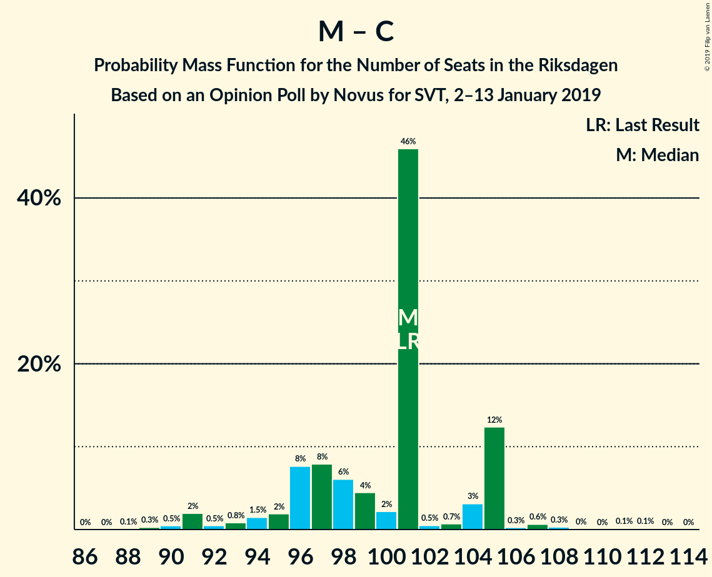

| Number of Seats | Probability | Accumulated | Special Marks |
|:---------------:|:-----------:|:-----------:|:-------------:|
| 86 | 0.1% | 100% |  |
| 87 | 0.1% | 99.9% |  |
| 88 | 0.1% | 99.8% |  |
| 89 | 0.4% | 99.6% |  |
| 90 | 1.3% | 99.3% |  |
| 91 | 0.8% | 98% |  |
| 92 | 1.0% | 97% |  |
| 93 | 4% | 96% |  |
| 94 | 6% | 92% |  |
| 95 | 2% | 86% |  |
| 96 | 7% | 84% |  |
| 97 | 11% | 78% |  |
| 98 | 11% | 66% |  |
| 99 | 3% | 55% |  |
| 100 | 7% | 52% | Median |
| 101 | 18% | 46% | Last Result |
| 102 | 7% | 27% |  |
| 103 | 1.4% | 20% |  |
| 104 | 7% | 18% |  |
| 105 | 7% | 11% |  |
| 106 | 1.0% | 4% |  |
| 107 | 0.8% | 3% |  |
| 108 | 1.3% | 2% |  |
| 109 | 0.2% | 0.5% |  |
| 110 | 0% | 0.4% |  |
| 111 | 0.2% | 0.3% |  |
| 112 | 0.1% | 0.2% |  |
| 113 | 0% | 0% |  |

## Technical Information

### Opinion Poll

+ **Polling firm:** Novus
+ **Commissioner(s):** SVT
+ **Fieldwork period:** 2–13 January 2019

### Calculations

+ **Sample size:** 2342
+ **Simulations done:** 1,048,576
+ **Error estimate:** 0.85%

