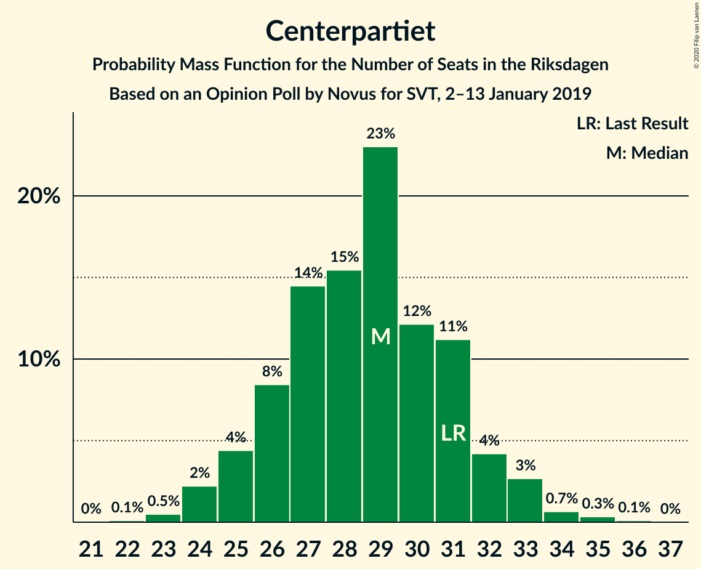
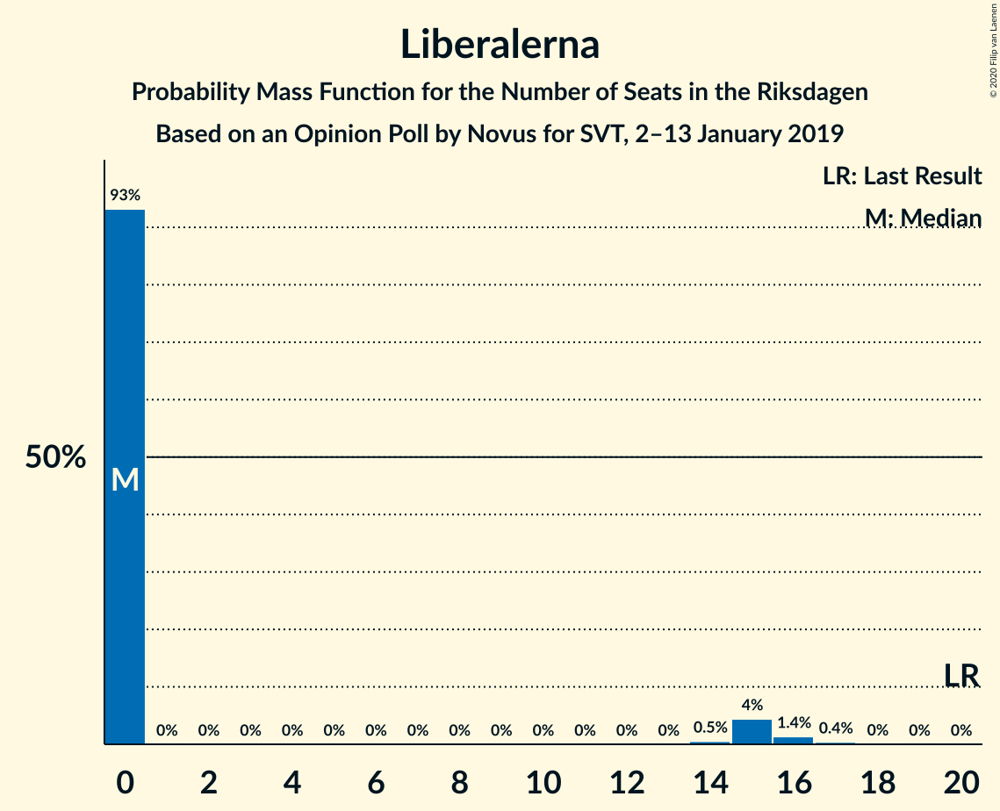
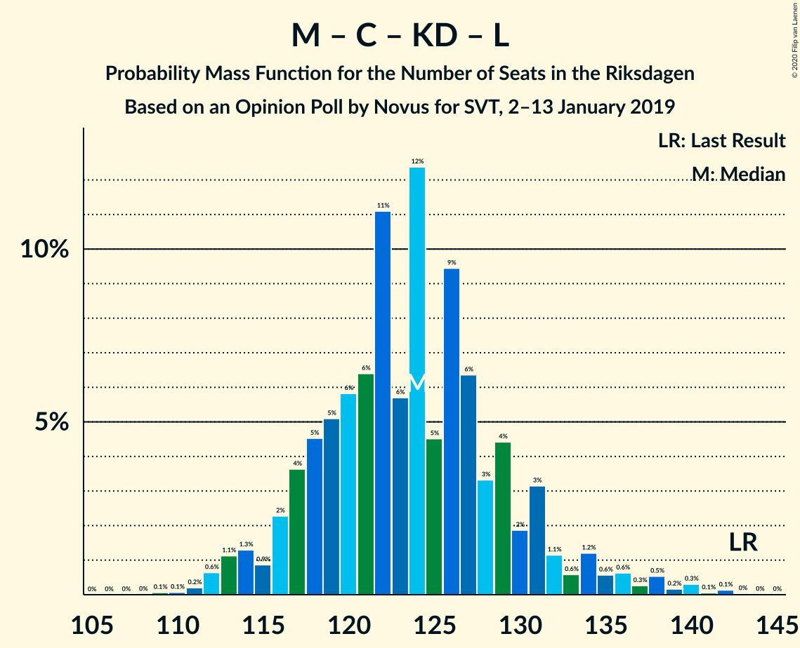

# Opinion Poll by Novus for SVT, 2–13 January 2019

<a href="#voting-intentions">Voting Intentions</a> | <a href="#seats">Seats</a> | <a href="#coalitions">Coalitions</a> | <a href="#technical-information">Technical Information</a>

## Voting Intentions

### Confidence Intervals

| Party | Last Result | Poll Result | 80% Confidence Interval | 90% Confidence Interval | 95% Confidence Interval | 99% Confidence Interval |
|:-----:|:-----------:|:-----------:|:-----------------------:|:-----------------------:|:-----------------------:|:-----------------------:|
| Sveriges socialdemokratiska arbetareparti | 28.3% | 31.8% | 30.6–33.1% |30.2–33.4% |29.9–33.7% |29.4–34.3% |
| Sverigedemokraterna | 17.5% | 19.2% | 18.2–20.3% |17.9–20.6% |17.7–20.9% |17.2–21.4% |
| Moderata samlingspartiet | 19.8% | 18.9% | 17.9–20.0% |17.6–20.3% |17.4–20.6% |16.9–21.1% |
| Centerpartiet | 8.6% | 7.6% | 6.9–8.4% |6.8–8.6% |6.6–8.7% |6.3–9.1% |
| Vänsterpartiet | 8.0% | 7.6% | 6.9–8.4% |6.8–8.6% |6.6–8.7% |6.3–9.1% |
| Kristdemokraterna | 6.3% | 6.2% | 5.6–6.9% |5.4–7.1% |5.3–7.3% |5.0–7.6% |
| Miljöpartiet de gröna | 4.4% | 3.9% | 3.4–4.5% |3.3–4.6% |3.2–4.8% |3.0–5.0% |
| Liberalerna | 5.5% | 3.4% | 3.0–3.9% |2.9–4.1% |2.7–4.2% |2.5–4.5% |

*Note:* The poll result column reflects the actual value used in the calculations. Published results may vary slightly, and in addition be rounded to fewer digits.

## Seats

### Confidence Intervals

| Party | Last Result | Median | 80% Confidence Interval | 90% Confidence Interval | 95% Confidence Interval | 99% Confidence Interval |
|:-----:|:-----------:|:------:|:-----------------------:|:-----------------------:|:-----------------------:|:-----------------------:|
| <a href="#sveriges-socialdemokratiska-arbetareparti">Sveriges socialdemokratiska arbetareparti</a> | 100 | 121 | 114–123 |112–126 |111–127 |105–128 |
| <a href="#sverigedemokraterna">Sverigedemokraterna</a> | 62 | 73 | 68–74 |67–76 |66–77 |64–80 |
| <a href="#moderata-samlingspartiet">Moderata samlingspartiet</a> | 70 | 72 | 67–74 |66–75 |65–76 |62–79 |
| <a href="#centerpartiet">Centerpartiet</a> | 31 | 29 | 26–32 |26–32 |25–33 |23–35 |
| <a href="#vänsterpartiet">Vänsterpartiet</a> | 28 | 31 | 26–31 |25–31 |25–32 |23–34 |
| <a href="#kristdemokraterna">Kristdemokraterna</a> | 22 | 23 | 21–25 |20–26 |20–27 |19–29 |
| <a href="#miljöpartiet-de-gröna">Miljöpartiet de gröna</a> | 16 | 0 | 0–16 |0–16 |0–17 |0–18 |
| <a href="#liberalerna">Liberalerna</a> | 20 | 0 | 0 |0–15 |0–15 |0–16 |

### Sveriges socialdemokratiska arbetareparti

*For a full overview of the results for this party, see the [Sveriges socialdemokratiska arbetareparti](party-sverigessocialdemokratiskaarbetareparti.html) page.*

| Number of Seats | Probability | Accumulated | Special Marks |
|:---------------:|:-----------:|:-----------:|:-------------:|
| 100 | 0% | 100% | Last Result |
| 101 | 0% | 100% |  |
| 102 | 0% | 100% |  |
| 103 | 0% | 100% |  |
| 104 | 0% | 100% |  |
| 105 | 0.8% | 100% |  |
| 106 | 0% | 99.2% |  |
| 107 | 0.7% | 99.2% |  |
| 108 | 0.2% | 98% |  |
| 109 | 0.2% | 98% |  |
| 110 | 0.4% | 98% |  |
| 111 | 2% | 98% |  |
| 112 | 1.2% | 96% |  |
| 113 | 3% | 95% |  |
| 114 | 2% | 92% |  |
| 115 | 4% | 90% |  |
| 116 | 6% | 86% |  |
| 117 | 4% | 80% |  |
| 118 | 3% | 77% |  |
| 119 | 5% | 74% |  |
| 120 | 1.3% | 69% |  |
| 121 | 49% | 68% | Median |
| 122 | 0.9% | 19% |  |
| 123 | 9% | 18% |  |
| 124 | 0.5% | 9% |  |
| 125 | 3% | 9% |  |
| 126 | 1.0% | 6% |  |
| 127 | 3% | 5% |  |
| 128 | 2% | 2% |  |
| 129 | 0.2% | 0.4% |  |
| 130 | 0.1% | 0.2% |  |
| 131 | 0% | 0.1% |  |
| 132 | 0% | 0.1% |  |
| 133 | 0% | 0% |  |

### Sverigedemokraterna

*For a full overview of the results for this party, see the [Sverigedemokraterna](party-sverigedemokraterna.html) page.*

| Number of Seats | Probability | Accumulated | Special Marks |
|:---------------:|:-----------:|:-----------:|:-------------:|
| 61 | 0% | 100% |  |
| 62 | 0.2% | 99.9% | Last Result |
| 63 | 0.1% | 99.8% |  |
| 64 | 0.2% | 99.7% |  |
| 65 | 0.7% | 99.5% |  |
| 66 | 2% | 98.7% |  |
| 67 | 2% | 97% |  |
| 68 | 7% | 95% |  |
| 69 | 6% | 88% |  |
| 70 | 5% | 83% |  |
| 71 | 8% | 78% |  |
| 72 | 12% | 71% |  |
| 73 | 46% | 58% | Median |
| 74 | 5% | 13% |  |
| 75 | 2% | 8% |  |
| 76 | 2% | 6% |  |
| 77 | 1.4% | 3% |  |
| 78 | 0.9% | 2% |  |
| 79 | 0.6% | 1.2% |  |
| 80 | 0.3% | 0.6% |  |
| 81 | 0.1% | 0.3% |  |
| 82 | 0.1% | 0.2% |  |
| 83 | 0% | 0.1% |  |
| 84 | 0% | 0.1% |  |
| 85 | 0% | 0% |  |

### Moderata samlingspartiet

*For a full overview of the results for this party, see the [Moderata samlingspartiet](party-moderatasamlingspartiet.html) page.*

| Number of Seats | Probability | Accumulated | Special Marks |
|:---------------:|:-----------:|:-----------:|:-------------:|
| 60 | 0% | 100% |  |
| 61 | 0.3% | 99.9% |  |
| 62 | 0.3% | 99.6% |  |
| 63 | 0.5% | 99.3% |  |
| 64 | 0.5% | 98.8% |  |
| 65 | 2% | 98% |  |
| 66 | 6% | 97% |  |
| 67 | 2% | 91% |  |
| 68 | 5% | 89% |  |
| 69 | 7% | 84% |  |
| 70 | 5% | 77% | Last Result |
| 71 | 5% | 72% |  |
| 72 | 51% | 66% | Median |
| 73 | 6% | 16% |  |
| 74 | 0.9% | 10% |  |
| 75 | 6% | 9% |  |
| 76 | 2% | 3% |  |
| 77 | 0.5% | 2% |  |
| 78 | 0.5% | 1.2% |  |
| 79 | 0.4% | 0.6% |  |
| 80 | 0.1% | 0.2% |  |
| 81 | 0.1% | 0.1% |  |
| 82 | 0% | 0% |  |

### Centerpartiet

*For a full overview of the results for this party, see the [Centerpartiet](party-centerpartiet.html) page.*

| Number of Seats | Probability | Accumulated | Special Marks |
|:---------------:|:-----------:|:-----------:|:-------------:|
| 22 | 0% | 100% |  |
| 23 | 0.8% | 99.9% |  |
| 24 | 0.9% | 99.2% |  |
| 25 | 2% | 98% |  |
| 26 | 9% | 96% |  |
| 27 | 6% | 87% |  |
| 28 | 5% | 82% |  |
| 29 | 51% | 77% | Median |
| 30 | 14% | 26% |  |
| 31 | 2% | 12% | Last Result |
| 32 | 6% | 11% |  |
| 33 | 4% | 5% |  |
| 34 | 0.2% | 1.4% |  |
| 35 | 1.0% | 1.2% |  |
| 36 | 0.1% | 0.2% |  |
| 37 | 0% | 0% |  |

### Vänsterpartiet

*For a full overview of the results for this party, see the [Vänsterpartiet](party-vänsterpartiet.html) page.*

| Number of Seats | Probability | Accumulated | Special Marks |
|:---------------:|:-----------:|:-----------:|:-------------:|
| 22 | 0.1% | 100% |  |
| 23 | 0.4% | 99.9% |  |
| 24 | 1.3% | 99.5% |  |
| 25 | 7% | 98% |  |
| 26 | 8% | 92% |  |
| 27 | 8% | 84% |  |
| 28 | 8% | 76% | Last Result |
| 29 | 9% | 68% |  |
| 30 | 8% | 59% |  |
| 31 | 47% | 51% | Median |
| 32 | 1.0% | 3% |  |
| 33 | 2% | 2% |  |
| 34 | 0.5% | 0.6% |  |
| 35 | 0.1% | 0.2% |  |
| 36 | 0% | 0.1% |  |
| 37 | 0% | 0% |  |

### Kristdemokraterna

*For a full overview of the results for this party, see the [Kristdemokraterna](party-kristdemokraterna.html) page.*

| Number of Seats | Probability | Accumulated | Special Marks |
|:---------------:|:-----------:|:-----------:|:-------------:|
| 18 | 0.4% | 100% |  |
| 19 | 1.0% | 99.5% |  |
| 20 | 4% | 98.5% |  |
| 21 | 13% | 94% |  |
| 22 | 9% | 81% | Last Result |
| 23 | 52% | 72% | Median |
| 24 | 6% | 20% |  |
| 25 | 6% | 15% |  |
| 26 | 5% | 9% |  |
| 27 | 3% | 4% |  |
| 28 | 0.7% | 1.4% |  |
| 29 | 0.6% | 0.7% |  |
| 30 | 0% | 0.1% |  |
| 31 | 0% | 0% |  |

### Miljöpartiet de gröna

*For a full overview of the results for this party, see the [Miljöpartiet de gröna](party-miljöpartietdegröna.html) page.*

| Number of Seats | Probability | Accumulated | Special Marks |
|:---------------:|:-----------:|:-----------:|:-------------:|
| 0 | 78% | 100% | Median |
| 1 | 0% | 22% |  |
| 2 | 0% | 22% |  |
| 3 | 0% | 22% |  |
| 4 | 0% | 22% |  |
| 5 | 0% | 22% |  |
| 6 | 0% | 22% |  |
| 7 | 0% | 22% |  |
| 8 | 0% | 22% |  |
| 9 | 0% | 22% |  |
| 10 | 0% | 22% |  |
| 11 | 0% | 22% |  |
| 12 | 0% | 22% |  |
| 13 | 0% | 22% |  |
| 14 | 0.8% | 22% |  |
| 15 | 8% | 21% |  |
| 16 | 9% | 14% | Last Result |
| 17 | 3% | 5% |  |
| 18 | 1.2% | 1.4% |  |
| 19 | 0.2% | 0.2% |  |
| 20 | 0% | 0% |  |

### Liberalerna

*For a full overview of the results for this party, see the [Liberalerna](party-liberalerna.html) page.*

| Number of Seats | Probability | Accumulated | Special Marks |
|:---------------:|:-----------:|:-----------:|:-------------:|
| 0 | 92% | 100% | Median |
| 1 | 0% | 8% |  |
| 2 | 0% | 8% |  |
| 3 | 0% | 8% |  |
| 4 | 0% | 8% |  |
| 5 | 0% | 8% |  |
| 6 | 0% | 8% |  |
| 7 | 0% | 8% |  |
| 8 | 0% | 8% |  |
| 9 | 0% | 8% |  |
| 10 | 0% | 8% |  |
| 11 | 0% | 8% |  |
| 12 | 0% | 8% |  |
| 13 | 0% | 8% |  |
| 14 | 0.4% | 8% |  |
| 15 | 5% | 8% |  |
| 16 | 2% | 2% |  |
| 17 | 0.1% | 0.2% |  |
| 18 | 0.1% | 0.1% |  |
| 19 | 0% | 0% |  |
| 20 | 0% | 0% | Last Result |

## Coalitions

### Confidence Intervals

| Coalition | Last Result | Median | Majority? | 80% Confidence Interval | 90% Confidence Interval | 95% Confidence Interval | 99% Confidence Interval |
|:---------:|:-----------:|:------:|:---------:|:-----------------------:|:-----------------------:|:-----------------------:|:-----------------------:|
| Sveriges socialdemokratiska arbetareparti – Moderata samlingspartiet – Centerpartiet | 201 | 222 | 100% | 212–226 | 209–228 | 207–228 | 201–231 |
| Sveriges socialdemokratiska arbetareparti – Moderata samlingspartiet | 170 | 193 | 99.5% | 183–196 | 181–197 | 178–198 | 175–201 |
| Sveriges socialdemokratiska arbetareparti – Centerpartiet – Vänsterpartiet – Miljöpartiet de gröna – Liberalerna | 195 | 181 | 97% | 180–189 | 177–192 | 174–193 | 172–196 |
| Sverigedemokraterna – Moderata samlingspartiet – Kristdemokraterna | 154 | 168 | 3% | 160–169 | 157–172 | 156–175 | 153–177 |
| Sveriges socialdemokratiska arbetareparti – Centerpartiet – Miljöpartiet de gröna – Liberalerna | 167 | 150 | 0% | 150–162 | 148–162 | 146–165 | 141–168 |
| Sveriges socialdemokratiska arbetareparti – Vänsterpartiet – Miljöpartiet de gröna | 144 | 152 | 0% | 147–160 | 143–162 | 141–164 | 141–167 |
| Sveriges socialdemokratiska arbetareparti – Vänsterpartiet | 128 | 152 | 0% | 142–152 | 138–156 | 138–157 | 132–158 |
| Sverigedemokraterna – Moderata samlingspartiet | 132 | 145 | 0% | 137–145 | 135–148 | 135–151 | 131–152 |
| Sveriges socialdemokratiska arbetareparti – Miljöpartiet de gröna | 116 | 121 | 0% | 118–132 | 115–134 | 115–136 | 112–138 |
| Moderata samlingspartiet – Centerpartiet – Kristdemokraterna – Liberalerna | 143 | 124 | 0% | 118–131 | 118–134 | 115–135 | 112–138 |
| Moderata samlingspartiet – Centerpartiet – Kristdemokraterna | 123 | 124 | 0% | 118–127 | 116–130 | 114–131 | 111–132 |
| Moderata samlingspartiet – Centerpartiet – Liberalerna | 121 | 101 | 0% | 97–105 | 95–111 | 91–112 | 90–115 |
| Moderata samlingspartiet – Centerpartiet | 101 | 101 | 0% | 96–105 | 94–105 | 91–105 | 90–108 |

### Sveriges socialdemokratiska arbetareparti – Moderata samlingspartiet – Centerpartiet

| Number of Seats | Probability | Accumulated | Special Marks |
|:---------------:|:-----------:|:-----------:|:-------------:|
| 197 | 0% | 100% |  |
| 198 | 0% | 99.9% |  |
| 199 | 0.1% | 99.9% |  |
| 200 | 0.3% | 99.8% |  |
| 201 | 0.1% | 99.5% | Last Result |
| 202 | 0% | 99.5% |  |
| 203 | 0.3% | 99.4% |  |
| 204 | 0.6% | 99.1% |  |
| 205 | 0.1% | 98.5% |  |
| 206 | 0.6% | 98% |  |
| 207 | 1.2% | 98% |  |
| 208 | 1.3% | 97% |  |
| 209 | 0.6% | 95% |  |
| 210 | 1.0% | 95% |  |
| 211 | 4% | 94% |  |
| 212 | 5% | 90% |  |
| 213 | 2% | 85% |  |
| 214 | 2% | 83% |  |
| 215 | 2% | 81% |  |
| 216 | 5% | 79% |  |
| 217 | 4% | 74% |  |
| 218 | 1.4% | 71% |  |
| 219 | 1.3% | 69% |  |
| 220 | 0.9% | 68% |  |
| 221 | 1.4% | 67% |  |
| 222 | 45% | 66% | Median |
| 223 | 0.9% | 20% |  |
| 224 | 4% | 19% |  |
| 225 | 3% | 16% |  |
| 226 | 4% | 13% |  |
| 227 | 0.9% | 9% |  |
| 228 | 7% | 8% |  |
| 229 | 0.2% | 0.9% |  |
| 230 | 0.1% | 0.7% |  |
| 231 | 0.4% | 0.6% |  |
| 232 | 0% | 0.2% |  |
| 233 | 0.2% | 0.2% |  |
| 234 | 0% | 0% |  |

### Sveriges socialdemokratiska arbetareparti – Moderata samlingspartiet

| Number of Seats | Probability | Accumulated | Special Marks |
|:---------------:|:-----------:|:-----------:|:-------------:|
| 170 | 0% | 100% | Last Result |
| 171 | 0% | 99.9% |  |
| 172 | 0.2% | 99.9% |  |
| 173 | 0% | 99.7% |  |
| 174 | 0.1% | 99.6% |  |
| 175 | 0.8% | 99.5% | Majority |
| 176 | 0.6% | 98.8% |  |
| 177 | 0.2% | 98% |  |
| 178 | 1.0% | 98% |  |
| 179 | 0.4% | 97% |  |
| 180 | 1.4% | 97% |  |
| 181 | 0.5% | 95% |  |
| 182 | 5% | 95% |  |
| 183 | 1.0% | 90% |  |
| 184 | 3% | 89% |  |
| 185 | 3% | 86% |  |
| 186 | 1.5% | 84% |  |
| 187 | 2% | 82% |  |
| 188 | 4% | 80% |  |
| 189 | 3% | 76% |  |
| 190 | 5% | 74% |  |
| 191 | 1.3% | 69% |  |
| 192 | 1.4% | 67% |  |
| 193 | 49% | 66% | Median |
| 194 | 3% | 17% |  |
| 195 | 3% | 14% |  |
| 196 | 5% | 11% |  |
| 197 | 2% | 5% |  |
| 198 | 2% | 4% |  |
| 199 | 1.0% | 2% |  |
| 200 | 0.2% | 1.1% |  |
| 201 | 0.6% | 1.0% |  |
| 202 | 0.1% | 0.4% |  |
| 203 | 0.2% | 0.3% |  |
| 204 | 0.1% | 0.1% |  |
| 205 | 0% | 0% |  |

### Sveriges socialdemokratiska arbetareparti – Centerpartiet – Vänsterpartiet – Miljöpartiet de gröna – Liberalerna

| Number of Seats | Probability | Accumulated | Special Marks |
|:---------------:|:-----------:|:-----------:|:-------------:|
| 168 | 0.1% | 100% |  |
| 169 | 0% | 99.9% |  |
| 170 | 0.1% | 99.8% |  |
| 171 | 0% | 99.7% |  |
| 172 | 0.8% | 99.7% |  |
| 173 | 1.0% | 98.8% |  |
| 174 | 1.1% | 98% |  |
| 175 | 0.2% | 97% | Majority |
| 176 | 0.4% | 97% |  |
| 177 | 2% | 96% |  |
| 178 | 0.3% | 95% |  |
| 179 | 2% | 94% |  |
| 180 | 6% | 92% |  |
| 181 | 45% | 87% | Median |
| 182 | 2% | 42% |  |
| 183 | 7% | 40% |  |
| 184 | 5% | 33% |  |
| 185 | 5% | 27% |  |
| 186 | 3% | 22% |  |
| 187 | 7% | 19% |  |
| 188 | 2% | 12% |  |
| 189 | 1.2% | 10% |  |
| 190 | 1.0% | 9% |  |
| 191 | 0.6% | 8% |  |
| 192 | 5% | 7% |  |
| 193 | 0.9% | 3% |  |
| 194 | 0.5% | 2% |  |
| 195 | 0.8% | 1.3% | Last Result |
| 196 | 0.3% | 0.6% |  |
| 197 | 0.1% | 0.2% |  |
| 198 | 0% | 0.1% |  |
| 199 | 0% | 0.1% |  |
| 200 | 0% | 0.1% |  |
| 201 | 0% | 0% |  |

### Sverigedemokraterna – Moderata samlingspartiet – Kristdemokraterna

| Number of Seats | Probability | Accumulated | Special Marks |
|:---------------:|:-----------:|:-----------:|:-------------:|
| 149 | 0% | 100% |  |
| 150 | 0% | 99.9% |  |
| 151 | 0% | 99.9% |  |
| 152 | 0.1% | 99.9% |  |
| 153 | 0.3% | 99.8% |  |
| 154 | 0.8% | 99.4% | Last Result |
| 155 | 0.5% | 98.7% |  |
| 156 | 0.9% | 98% |  |
| 157 | 5% | 97% |  |
| 158 | 0.6% | 93% |  |
| 159 | 1.0% | 92% |  |
| 160 | 1.2% | 91% |  |
| 161 | 2% | 90% |  |
| 162 | 7% | 88% |  |
| 163 | 3% | 81% |  |
| 164 | 5% | 78% |  |
| 165 | 5% | 73% |  |
| 166 | 7% | 67% |  |
| 167 | 2% | 60% |  |
| 168 | 45% | 58% | Median |
| 169 | 6% | 13% |  |
| 170 | 2% | 8% |  |
| 171 | 0.3% | 6% |  |
| 172 | 2% | 5% |  |
| 173 | 0.4% | 4% |  |
| 174 | 0.2% | 3% |  |
| 175 | 1.1% | 3% | Majority |
| 176 | 1.0% | 2% |  |
| 177 | 0.8% | 1.2% |  |
| 178 | 0% | 0.3% |  |
| 179 | 0.1% | 0.3% |  |
| 180 | 0% | 0.2% |  |
| 181 | 0.1% | 0.1% |  |
| 182 | 0% | 0% |  |

### Sveriges socialdemokratiska arbetareparti – Centerpartiet – Miljöpartiet de gröna – Liberalerna

| Number of Seats | Probability | Accumulated | Special Marks |
|:---------------:|:-----------:|:-----------:|:-------------:|
| 139 | 0.3% | 100% |  |
| 140 | 0.2% | 99.7% |  |
| 141 | 0% | 99.5% |  |
| 142 | 0% | 99.5% |  |
| 143 | 2% | 99.5% |  |
| 144 | 0.1% | 98% |  |
| 145 | 0.2% | 98% |  |
| 146 | 1.1% | 98% |  |
| 147 | 0.6% | 96% |  |
| 148 | 1.3% | 96% |  |
| 149 | 0.3% | 95% |  |
| 150 | 47% | 94% | Median |
| 151 | 0.6% | 47% |  |
| 152 | 0.6% | 47% |  |
| 153 | 2% | 46% |  |
| 154 | 3% | 43% |  |
| 155 | 9% | 40% |  |
| 156 | 2% | 31% |  |
| 157 | 7% | 30% |  |
| 158 | 3% | 23% |  |
| 159 | 4% | 20% |  |
| 160 | 4% | 16% |  |
| 161 | 2% | 12% |  |
| 162 | 6% | 10% |  |
| 163 | 1.1% | 5% |  |
| 164 | 0.8% | 4% |  |
| 165 | 1.0% | 3% |  |
| 166 | 0.8% | 2% |  |
| 167 | 0.4% | 1.1% | Last Result |
| 168 | 0.4% | 0.8% |  |
| 169 | 0.1% | 0.3% |  |
| 170 | 0% | 0.2% |  |
| 171 | 0.1% | 0.2% |  |
| 172 | 0% | 0.1% |  |
| 173 | 0% | 0.1% |  |
| 174 | 0% | 0.1% |  |
| 175 | 0% | 0% | Majority |

### Sveriges socialdemokratiska arbetareparti – Vänsterpartiet – Miljöpartiet de gröna

| Number of Seats | Probability | Accumulated | Special Marks |
|:---------------:|:-----------:|:-----------:|:-------------:|
| 137 | 0% | 100% |  |
| 138 | 0% | 99.9% |  |
| 139 | 0.2% | 99.9% |  |
| 140 | 0.1% | 99.7% |  |
| 141 | 3% | 99.7% |  |
| 142 | 0.5% | 97% |  |
| 143 | 2% | 96% |  |
| 144 | 1.2% | 94% | Last Result |
| 145 | 0.6% | 93% |  |
| 146 | 2% | 92% |  |
| 147 | 3% | 90% |  |
| 148 | 2% | 87% |  |
| 149 | 0.8% | 85% |  |
| 150 | 4% | 85% |  |
| 151 | 1.1% | 81% |  |
| 152 | 51% | 80% | Median |
| 153 | 3% | 29% |  |
| 154 | 3% | 26% |  |
| 155 | 1.2% | 23% |  |
| 156 | 2% | 22% |  |
| 157 | 3% | 20% |  |
| 158 | 1.4% | 17% |  |
| 159 | 4% | 15% |  |
| 160 | 2% | 11% |  |
| 161 | 1.3% | 9% |  |
| 162 | 4% | 8% |  |
| 163 | 0.5% | 3% |  |
| 164 | 2% | 3% |  |
| 165 | 0.2% | 1.2% |  |
| 166 | 0.5% | 1.0% |  |
| 167 | 0.4% | 0.5% |  |
| 168 | 0.1% | 0.2% |  |
| 169 | 0% | 0.1% |  |
| 170 | 0.1% | 0.1% |  |
| 171 | 0% | 0% |  |

### Sveriges socialdemokratiska arbetareparti – Vänsterpartiet

| Number of Seats | Probability | Accumulated | Special Marks |
|:---------------:|:-----------:|:-----------:|:-------------:|
| 128 | 0% | 100% | Last Result |
| 129 | 0% | 100% |  |
| 130 | 0.4% | 100% |  |
| 131 | 0.1% | 99.6% |  |
| 132 | 0% | 99.5% |  |
| 133 | 0.1% | 99.5% |  |
| 134 | 0.3% | 99.4% |  |
| 135 | 1.0% | 99.1% |  |
| 136 | 0.1% | 98% |  |
| 137 | 0.1% | 98% |  |
| 138 | 3% | 98% |  |
| 139 | 0.4% | 95% |  |
| 140 | 0.6% | 94% |  |
| 141 | 3% | 94% |  |
| 142 | 2% | 90% |  |
| 143 | 3% | 88% |  |
| 144 | 6% | 86% |  |
| 145 | 0.8% | 80% |  |
| 146 | 7% | 79% |  |
| 147 | 4% | 72% |  |
| 148 | 2% | 68% |  |
| 149 | 1.4% | 66% |  |
| 150 | 3% | 64% |  |
| 151 | 1.1% | 61% |  |
| 152 | 50% | 60% | Median |
| 153 | 3% | 9% |  |
| 154 | 0.7% | 7% |  |
| 155 | 0.6% | 6% |  |
| 156 | 1.5% | 5% |  |
| 157 | 3% | 4% |  |
| 158 | 0.8% | 1.2% |  |
| 159 | 0.1% | 0.4% |  |
| 160 | 0.1% | 0.3% |  |
| 161 | 0.2% | 0.2% |  |
| 162 | 0% | 0% |  |

### Sverigedemokraterna – Moderata samlingspartiet

| Number of Seats | Probability | Accumulated | Special Marks |
|:---------------:|:-----------:|:-----------:|:-------------:|
| 126 | 0% | 100% |  |
| 127 | 0% | 99.9% |  |
| 128 | 0% | 99.9% |  |
| 129 | 0.1% | 99.9% |  |
| 130 | 0.1% | 99.9% |  |
| 131 | 0.4% | 99.7% |  |
| 132 | 0.4% | 99.3% | Last Result |
| 133 | 0.2% | 98.9% |  |
| 134 | 0.9% | 98.7% |  |
| 135 | 5% | 98% |  |
| 136 | 1.4% | 93% |  |
| 137 | 2% | 91% |  |
| 138 | 3% | 89% |  |
| 139 | 4% | 87% |  |
| 140 | 6% | 82% |  |
| 141 | 2% | 77% |  |
| 142 | 2% | 75% |  |
| 143 | 10% | 73% |  |
| 144 | 9% | 63% |  |
| 145 | 45% | 54% | Median |
| 146 | 2% | 9% |  |
| 147 | 2% | 7% |  |
| 148 | 1.2% | 6% |  |
| 149 | 0.2% | 4% |  |
| 150 | 0.2% | 4% |  |
| 151 | 2% | 4% |  |
| 152 | 1.2% | 2% |  |
| 153 | 0% | 0.4% |  |
| 154 | 0% | 0.3% |  |
| 155 | 0% | 0.3% |  |
| 156 | 0.2% | 0.2% |  |
| 157 | 0.1% | 0.1% |  |
| 158 | 0% | 0% |  |

### Sveriges socialdemokratiska arbetareparti – Miljöpartiet de gröna

| Number of Seats | Probability | Accumulated | Special Marks |
|:---------------:|:-----------:|:-----------:|:-------------:|
| 110 | 0.1% | 100% |  |
| 111 | 0.2% | 99.9% |  |
| 112 | 1.1% | 99.7% |  |
| 113 | 0.3% | 98.6% |  |
| 114 | 0.8% | 98% |  |
| 115 | 3% | 98% |  |
| 116 | 1.4% | 95% | Last Result |
| 117 | 2% | 93% |  |
| 118 | 2% | 91% |  |
| 119 | 2% | 90% |  |
| 120 | 0.4% | 88% |  |
| 121 | 48% | 87% | Median |
| 122 | 0.8% | 39% |  |
| 123 | 9% | 38% |  |
| 124 | 0.6% | 30% |  |
| 125 | 3% | 29% |  |
| 126 | 1.4% | 26% |  |
| 127 | 4% | 24% |  |
| 128 | 2% | 21% |  |
| 129 | 2% | 19% |  |
| 130 | 0.9% | 16% |  |
| 131 | 1.5% | 15% |  |
| 132 | 4% | 14% |  |
| 133 | 2% | 10% |  |
| 134 | 4% | 8% |  |
| 135 | 1.1% | 4% |  |
| 136 | 1.2% | 3% |  |
| 137 | 0.8% | 2% |  |
| 138 | 0.7% | 1.0% |  |
| 139 | 0.1% | 0.2% |  |
| 140 | 0.1% | 0.2% |  |
| 141 | 0% | 0.1% |  |
| 142 | 0% | 0% |  |

### Moderata samlingspartiet – Centerpartiet – Kristdemokraterna – Liberalerna

| Number of Seats | Probability | Accumulated | Special Marks |
|:---------------:|:-----------:|:-----------:|:-------------:|
| 109 | 0.1% | 100% |  |
| 110 | 0% | 99.9% |  |
| 111 | 0.2% | 99.9% |  |
| 112 | 0.3% | 99.6% |  |
| 113 | 0.3% | 99.4% |  |
| 114 | 1.2% | 99.1% |  |
| 115 | 1.4% | 98% |  |
| 116 | 0.3% | 97% |  |
| 117 | 1.2% | 96% |  |
| 118 | 8% | 95% |  |
| 119 | 0.3% | 87% |  |
| 120 | 4% | 86% |  |
| 121 | 4% | 83% |  |
| 122 | 0.4% | 78% |  |
| 123 | 3% | 78% |  |
| 124 | 46% | 75% | Median |
| 125 | 1.1% | 29% |  |
| 126 | 9% | 28% |  |
| 127 | 3% | 19% |  |
| 128 | 0.2% | 16% |  |
| 129 | 0.9% | 15% |  |
| 130 | 4% | 15% |  |
| 131 | 3% | 10% |  |
| 132 | 0.7% | 7% |  |
| 133 | 0.3% | 6% |  |
| 134 | 3% | 6% |  |
| 135 | 1.1% | 3% |  |
| 136 | 0.6% | 2% |  |
| 137 | 0.3% | 1.2% |  |
| 138 | 0.5% | 0.9% |  |
| 139 | 0.4% | 0.5% |  |
| 140 | 0% | 0.1% |  |
| 141 | 0% | 0.1% |  |
| 142 | 0% | 0% |  |
| 143 | 0% | 0% | Last Result |

### Moderata samlingspartiet – Centerpartiet – Kristdemokraterna

| Number of Seats | Probability | Accumulated | Special Marks |
|:---------------:|:-----------:|:-----------:|:-------------:|
| 109 | 0.1% | 100% |  |
| 110 | 0.1% | 99.9% |  |
| 111 | 0.3% | 99.8% |  |
| 112 | 0.3% | 99.5% |  |
| 113 | 0.5% | 99.2% |  |
| 114 | 1.3% | 98.7% |  |
| 115 | 1.4% | 97% |  |
| 116 | 2% | 96% |  |
| 117 | 2% | 94% |  |
| 118 | 9% | 93% |  |
| 119 | 3% | 84% |  |
| 120 | 4% | 80% |  |
| 121 | 5% | 76% |  |
| 122 | 0.6% | 71% |  |
| 123 | 3% | 71% | Last Result |
| 124 | 47% | 67% | Median |
| 125 | 1.1% | 21% |  |
| 126 | 9% | 20% |  |
| 127 | 3% | 11% |  |
| 128 | 0.2% | 8% |  |
| 129 | 0.7% | 8% |  |
| 130 | 4% | 7% |  |
| 131 | 2% | 3% |  |
| 132 | 0.4% | 0.8% |  |
| 133 | 0.2% | 0.4% |  |
| 134 | 0% | 0.2% |  |
| 135 | 0.1% | 0.1% |  |
| 136 | 0% | 0% |  |

### Moderata samlingspartiet – Centerpartiet – Liberalerna

| Number of Seats | Probability | Accumulated | Special Marks |
|:---------------:|:-----------:|:-----------:|:-------------:|
| 89 | 0.2% | 100% |  |
| 90 | 0.5% | 99.8% |  |
| 91 | 2% | 99.3% |  |
| 92 | 0.2% | 97% |  |
| 93 | 0.7% | 97% |  |
| 94 | 1.4% | 96% |  |
| 95 | 0.2% | 95% |  |
| 96 | 4% | 95% |  |
| 97 | 8% | 90% |  |
| 98 | 6% | 83% |  |
| 99 | 3% | 77% |  |
| 100 | 1.2% | 73% |  |
| 101 | 46% | 72% | Median |
| 102 | 0.5% | 26% |  |
| 103 | 0.7% | 26% |  |
| 104 | 3% | 25% |  |
| 105 | 12% | 22% |  |
| 106 | 0.3% | 9% |  |
| 107 | 0.7% | 9% |  |
| 108 | 0.5% | 8% |  |
| 109 | 0.3% | 8% |  |
| 110 | 0.3% | 8% |  |
| 111 | 4% | 7% |  |
| 112 | 0.5% | 3% |  |
| 113 | 0.2% | 2% |  |
| 114 | 0.7% | 2% |  |
| 115 | 1.1% | 1.4% |  |
| 116 | 0.2% | 0.2% |  |
| 117 | 0% | 0.1% |  |
| 118 | 0% | 0.1% |  |
| 119 | 0% | 0% |  |
| 120 | 0% | 0% |  |
| 121 | 0% | 0% | Last Result |

### Moderata samlingspartiet – Centerpartiet

| Number of Seats | Probability | Accumulated | Special Marks |
|:---------------:|:-----------:|:-----------:|:-------------:|
| 87 | 0% | 100% |  |
| 88 | 0.1% | 99.9% |  |
| 89 | 0.3% | 99.9% |  |
| 90 | 0.5% | 99.6% |  |
| 91 | 2% | 99.1% |  |
| 92 | 0.5% | 97% |  |
| 93 | 0.8% | 97% |  |
| 94 | 1.5% | 96% |  |
| 95 | 2% | 94% |  |
| 96 | 8% | 92% |  |
| 97 | 8% | 85% |  |
| 98 | 6% | 77% |  |
| 99 | 4% | 71% |  |
| 100 | 2% | 66% |  |
| 101 | 46% | 64% | Last Result, Median |
| 102 | 0.5% | 18% |  |
| 103 | 0.7% | 18% |  |
| 104 | 3% | 17% |  |
| 105 | 12% | 14% |  |
| 106 | 0.3% | 2% |  |
| 107 | 0.6% | 1.3% |  |
| 108 | 0.3% | 0.6% |  |
| 109 | 0% | 0.3% |  |
| 110 | 0% | 0.3% |  |
| 111 | 0.1% | 0.3% |  |
| 112 | 0.1% | 0.1% |  |
| 113 | 0% | 0% |  |

## Technical Information

### Opinion Poll

+ **Polling firm:** Novus
+ **Commissioner(s):** SVT
+ **Fieldwork period:** 2–13 January 2019

### Calculations

+ **Sample size:** 2342
+ **Simulations done:** 131,072
+ **Error estimate:** 0.98%

