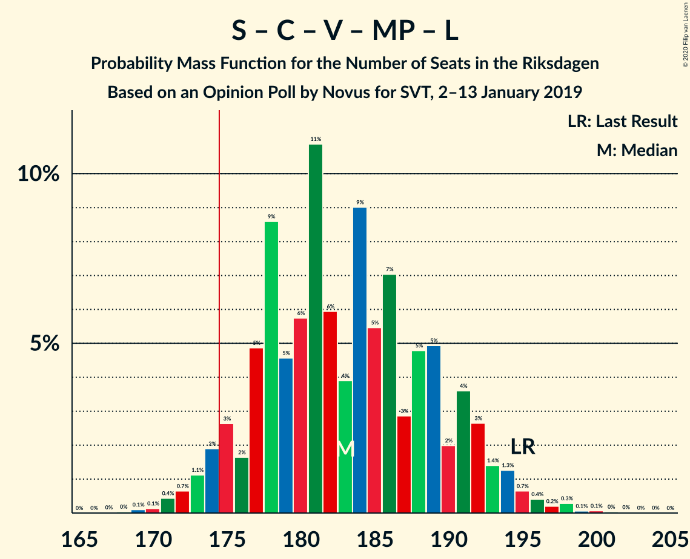
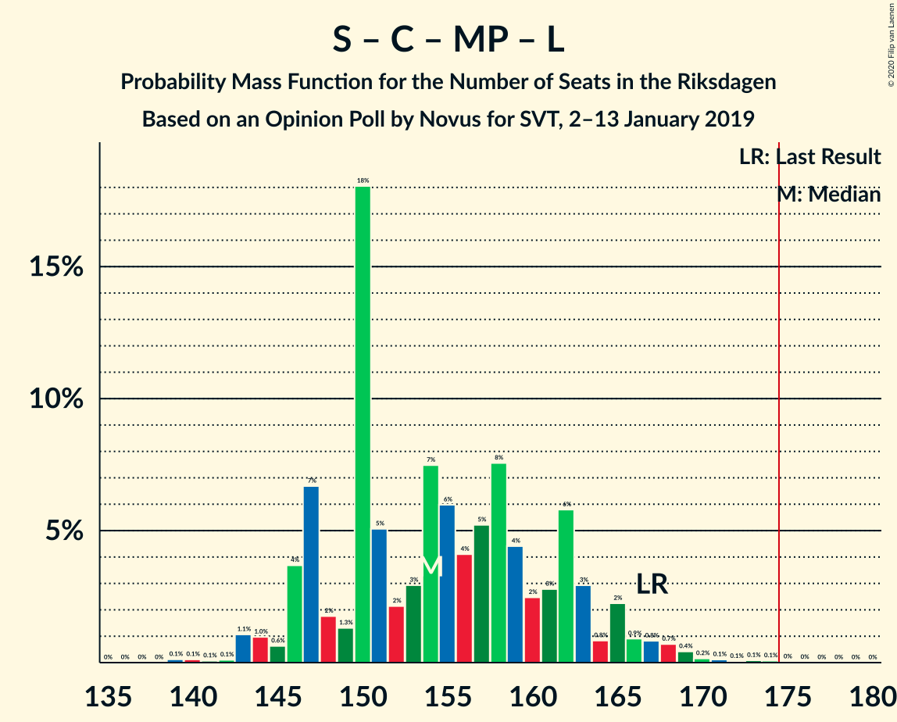
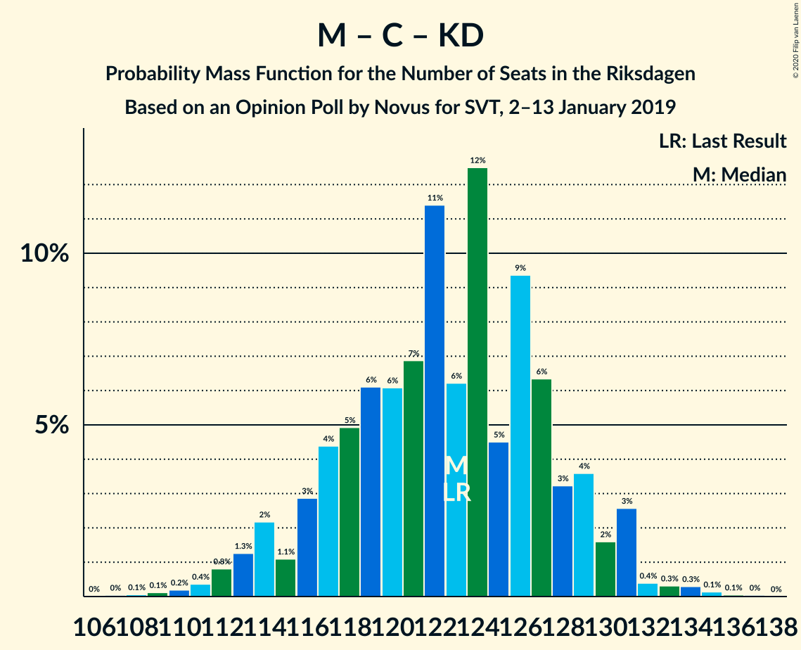

# Opinion Poll by Novus for SVT, 2–13 January 2019

<a href="#voting-intentions">Voting Intentions</a> | <a href="#seats">Seats</a> | <a href="#coalitions">Coalitions</a> | <a href="#technical-information">Technical Information</a>

## Voting Intentions

### Confidence Intervals

| Party | Last Result | Poll Result | 80% Confidence Interval | 90% Confidence Interval | 95% Confidence Interval | 99% Confidence Interval |
|:-----:|:-----------:|:-----------:|:-----------------------:|:-----------------------:|:-----------------------:|:-----------------------:|
| Sveriges socialdemokratiska arbetareparti | 28.3% | 31.8% | 30.6–33.1% |30.2–33.4% |29.9–33.7% |29.4–34.3% |
| Sverigedemokraterna | 17.5% | 19.2% | 18.2–20.3% |17.9–20.6% |17.7–20.9% |17.2–21.4% |
| Moderata samlingspartiet | 19.8% | 18.9% | 17.9–20.0% |17.6–20.3% |17.4–20.6% |16.9–21.1% |
| Centerpartiet | 8.6% | 7.6% | 6.9–8.4% |6.8–8.6% |6.6–8.7% |6.3–9.1% |
| Vänsterpartiet | 8.0% | 7.6% | 6.9–8.4% |6.8–8.6% |6.6–8.7% |6.3–9.1% |
| Kristdemokraterna | 6.3% | 6.2% | 5.6–6.9% |5.4–7.1% |5.3–7.3% |5.0–7.6% |
| Miljöpartiet de gröna | 4.4% | 3.9% | 3.4–4.5% |3.3–4.6% |3.2–4.8% |3.0–5.0% |
| Liberalerna | 5.5% | 3.4% | 3.0–3.9% |2.9–4.1% |2.7–4.2% |2.5–4.5% |

*Note:* The poll result column reflects the actual value used in the calculations. Published results may vary slightly, and in addition be rounded to fewer digits.

## Seats

### Confidence Intervals

| Party | Last Result | Median | 80% Confidence Interval | 90% Confidence Interval | 95% Confidence Interval | 99% Confidence Interval |
|:-----:|:-----------:|:------:|:-----------------------:|:-----------------------:|:-----------------------:|:-----------------------:|
| <a href="#sveriges-socialdemokratiska-arbetareparti">Sveriges socialdemokratiska arbetareparti</a> | 100 | 120 | 113–124 |111–126 |110–128 |107–130 |
| <a href="#sverigedemokraterna">Sverigedemokraterna</a> | 62 | 72 | 68–77 |66–77 |65–78 |63–81 |
| <a href="#moderata-samlingspartiet">Moderata samlingspartiet</a> | 70 | 71 | 66–75 |65–76 |64–77 |62–79 |
| <a href="#centerpartiet">Centerpartiet</a> | 31 | 29 | 26–31 |25–32 |25–33 |23–35 |
| <a href="#vänsterpartiet">Vänsterpartiet</a> | 28 | 28 | 26–31 |25–32 |25–33 |23–34 |
| <a href="#kristdemokraterna">Kristdemokraterna</a> | 22 | 23 | 21–26 |20–26 |20–27 |19–29 |
| <a href="#miljöpartiet-de-gröna">Miljöpartiet de gröna</a> | 16 | 0 | 0–16 |0–17 |0–17 |0–18 |
| <a href="#liberalerna">Liberalerna</a> | 20 | 0 | 0 |0–15 |0–15 |0–16 |

### Sveriges socialdemokratiska arbetareparti

*For a full overview of the results for this party, see the [Sveriges socialdemokratiska arbetareparti](party-sverigessocialdemokratiskaarbetareparti.html) page.*

| Number of Seats | Probability | Accumulated | Special Marks |
|:---------------:|:-----------:|:-----------:|:-------------:|
| 100 | 0% | 100% | Last Result |
| 101 | 0% | 100% |  |
| 102 | 0% | 100% |  |
| 103 | 0% | 100% |  |
| 104 | 0% | 100% |  |
| 105 | 0.3% | 100% |  |
| 106 | 0.1% | 99.7% |  |
| 107 | 0.3% | 99.5% |  |
| 108 | 0.3% | 99.2% |  |
| 109 | 0.8% | 98.9% |  |
| 110 | 1.2% | 98% |  |
| 111 | 3% | 97% |  |
| 112 | 2% | 94% |  |
| 113 | 5% | 92% |  |
| 114 | 3% | 87% |  |
| 115 | 6% | 84% |  |
| 116 | 9% | 79% |  |
| 117 | 5% | 70% |  |
| 118 | 6% | 64% |  |
| 119 | 7% | 58% |  |
| 120 | 5% | 51% | Median |
| 121 | 18% | 46% |  |
| 122 | 10% | 28% |  |
| 123 | 4% | 19% |  |
| 124 | 6% | 15% |  |
| 125 | 3% | 9% |  |
| 126 | 1.1% | 6% |  |
| 127 | 2% | 5% |  |
| 128 | 2% | 3% |  |
| 129 | 0.4% | 1.1% |  |
| 130 | 0.5% | 0.7% |  |
| 131 | 0.1% | 0.2% |  |
| 132 | 0% | 0.1% |  |
| 133 | 0% | 0.1% |  |
| 134 | 0% | 0% |  |

### Sverigedemokraterna

*For a full overview of the results for this party, see the [Sverigedemokraterna](party-sverigedemokraterna.html) page.*

| Number of Seats | Probability | Accumulated | Special Marks |
|:---------------:|:-----------:|:-----------:|:-------------:|
| 61 | 0.1% | 100% |  |
| 62 | 0.3% | 99.9% | Last Result |
| 63 | 0.2% | 99.5% |  |
| 64 | 0.9% | 99.4% |  |
| 65 | 1.2% | 98% |  |
| 66 | 3% | 97% |  |
| 67 | 3% | 94% |  |
| 68 | 5% | 92% |  |
| 69 | 11% | 87% |  |
| 70 | 7% | 75% |  |
| 71 | 10% | 68% |  |
| 72 | 10% | 58% | Median |
| 73 | 23% | 48% |  |
| 74 | 4% | 25% |  |
| 75 | 5% | 20% |  |
| 76 | 4% | 15% |  |
| 77 | 7% | 11% |  |
| 78 | 0.9% | 3% |  |
| 79 | 1.3% | 2% |  |
| 80 | 0.4% | 1.0% |  |
| 81 | 0.4% | 0.6% |  |
| 82 | 0.1% | 0.2% |  |
| 83 | 0% | 0.1% |  |
| 84 | 0% | 0% |  |

### Moderata samlingspartiet

*For a full overview of the results for this party, see the [Moderata samlingspartiet](party-moderatasamlingspartiet.html) page.*

| Number of Seats | Probability | Accumulated | Special Marks |
|:---------------:|:-----------:|:-----------:|:-------------:|
| 60 | 0.1% | 100% |  |
| 61 | 0.2% | 99.9% |  |
| 62 | 0.4% | 99.7% |  |
| 63 | 0.9% | 99.3% |  |
| 64 | 2% | 98% |  |
| 65 | 5% | 97% |  |
| 66 | 4% | 92% |  |
| 67 | 6% | 88% |  |
| 68 | 7% | 82% |  |
| 69 | 6% | 74% |  |
| 70 | 16% | 68% | Last Result |
| 71 | 7% | 52% | Median |
| 72 | 21% | 45% |  |
| 73 | 8% | 24% |  |
| 74 | 5% | 16% |  |
| 75 | 4% | 11% |  |
| 76 | 4% | 7% |  |
| 77 | 2% | 4% |  |
| 78 | 0.7% | 2% |  |
| 79 | 0.9% | 1.3% |  |
| 80 | 0.2% | 0.4% |  |
| 81 | 0.1% | 0.2% |  |
| 82 | 0.1% | 0.1% |  |
| 83 | 0% | 0% |  |

### Centerpartiet

*For a full overview of the results for this party, see the [Centerpartiet](party-centerpartiet.html) page.*

| Number of Seats | Probability | Accumulated | Special Marks |
|:---------------:|:-----------:|:-----------:|:-------------:|
| 22 | 0.1% | 100% |  |
| 23 | 0.6% | 99.9% |  |
| 24 | 1.4% | 99.3% |  |
| 25 | 4% | 98% |  |
| 26 | 10% | 94% |  |
| 27 | 13% | 84% |  |
| 28 | 17% | 71% |  |
| 29 | 25% | 54% | Median |
| 30 | 13% | 29% |  |
| 31 | 8% | 16% | Last Result |
| 32 | 4% | 8% |  |
| 33 | 3% | 4% |  |
| 34 | 0.4% | 1.0% |  |
| 35 | 0.5% | 0.6% |  |
| 36 | 0.1% | 0.1% |  |
| 37 | 0% | 0% |  |

### Vänsterpartiet

*For a full overview of the results for this party, see the [Vänsterpartiet](party-vänsterpartiet.html) page.*

| Number of Seats | Probability | Accumulated | Special Marks |
|:---------------:|:-----------:|:-----------:|:-------------:|
| 22 | 0.1% | 100% |  |
| 23 | 0.7% | 99.9% |  |
| 24 | 1.1% | 99.2% |  |
| 25 | 6% | 98% |  |
| 26 | 11% | 93% |  |
| 27 | 15% | 81% |  |
| 28 | 17% | 66% | Last Result, Median |
| 29 | 11% | 49% |  |
| 30 | 10% | 38% |  |
| 31 | 21% | 29% |  |
| 32 | 4% | 8% |  |
| 33 | 3% | 3% |  |
| 34 | 0.6% | 0.9% |  |
| 35 | 0.1% | 0.3% |  |
| 36 | 0.2% | 0.2% |  |
| 37 | 0% | 0% |  |

### Kristdemokraterna

*For a full overview of the results for this party, see the [Kristdemokraterna](party-kristdemokraterna.html) page.*

| Number of Seats | Probability | Accumulated | Special Marks |
|:---------------:|:-----------:|:-----------:|:-------------:|
| 17 | 0% | 100% |  |
| 18 | 0.3% | 99.9% |  |
| 19 | 2% | 99.6% |  |
| 20 | 6% | 98% |  |
| 21 | 10% | 92% |  |
| 22 | 14% | 82% | Last Result |
| 23 | 29% | 68% | Median |
| 24 | 17% | 39% |  |
| 25 | 12% | 22% |  |
| 26 | 6% | 10% |  |
| 27 | 3% | 4% |  |
| 28 | 1.0% | 2% |  |
| 29 | 0.4% | 0.5% |  |
| 30 | 0.1% | 0.1% |  |
| 31 | 0% | 0% |  |

### Miljöpartiet de gröna

*For a full overview of the results for this party, see the [Miljöpartiet de gröna](party-miljöpartietdegröna.html) page.*

| Number of Seats | Probability | Accumulated | Special Marks |
|:---------------:|:-----------:|:-----------:|:-------------:|
| 0 | 63% | 100% | Median |
| 1 | 0% | 37% |  |
| 2 | 0% | 37% |  |
| 3 | 0% | 37% |  |
| 4 | 0% | 37% |  |
| 5 | 0% | 37% |  |
| 6 | 0% | 37% |  |
| 7 | 0% | 37% |  |
| 8 | 0% | 37% |  |
| 9 | 0% | 37% |  |
| 10 | 0% | 37% |  |
| 11 | 0% | 37% |  |
| 12 | 0% | 37% |  |
| 13 | 0% | 37% |  |
| 14 | 0.4% | 37% |  |
| 15 | 21% | 37% |  |
| 16 | 9% | 16% | Last Result |
| 17 | 6% | 8% |  |
| 18 | 2% | 2% |  |
| 19 | 0.3% | 0.3% |  |
| 20 | 0% | 0% |  |

### Liberalerna

*For a full overview of the results for this party, see the [Liberalerna](party-liberalerna.html) page.*

| Number of Seats | Probability | Accumulated | Special Marks |
|:---------------:|:-----------:|:-----------:|:-------------:|
| 0 | 93% | 100% | Median |
| 1 | 0% | 7% |  |
| 2 | 0% | 7% |  |
| 3 | 0% | 7% |  |
| 4 | 0% | 7% |  |
| 5 | 0% | 7% |  |
| 6 | 0% | 7% |  |
| 7 | 0% | 7% |  |
| 8 | 0% | 7% |  |
| 9 | 0% | 7% |  |
| 10 | 0% | 7% |  |
| 11 | 0% | 7% |  |
| 12 | 0% | 7% |  |
| 13 | 0% | 7% |  |
| 14 | 0.7% | 7% |  |
| 15 | 5% | 6% |  |
| 16 | 1.3% | 2% |  |
| 17 | 0.2% | 0.3% |  |
| 18 | 0.1% | 0.1% |  |
| 19 | 0% | 0% |  |
| 20 | 0% | 0% | Last Result |

## Coalitions

### Confidence Intervals

| Coalition | Last Result | Median | Majority? | 80% Confidence Interval | 90% Confidence Interval | 95% Confidence Interval | 99% Confidence Interval |
|:---------:|:-----------:|:------:|:---------:|:-----------------------:|:-----------------------:|:-----------------------:|:-----------------------:|
| Sveriges socialdemokratiska arbetareparti – Moderata samlingspartiet – Centerpartiet | 201 | 220 | 100% | 210–226 | 208–228 | 206–228 | 202–231 |
| Sveriges socialdemokratiska arbetareparti – Moderata samlingspartiet | 170 | 191 | 99.5% | 182–196 | 180–198 | 178–200 | 174–202 |
| Sveriges socialdemokratiska arbetareparti – Centerpartiet – Vänsterpartiet – Miljöpartiet de gröna – Liberalerna | 195 | 183 | 96% | 178–191 | 175–192 | 174–194 | 171–198 |
| Sverigedemokraterna – Moderata samlingspartiet – Kristdemokraterna | 154 | 166 | 4% | 158–171 | 157–174 | 155–175 | 151–178 |
| Sveriges socialdemokratiska arbetareparti – Centerpartiet – Miljöpartiet de gröna – Liberalerna | 167 | 154 | 0% | 147–162 | 147–165 | 145–166 | 143–169 |
| Sveriges socialdemokratiska arbetareparti – Vänsterpartiet – Miljöpartiet de gröna | 144 | 152 | 0% | 146–162 | 145–163 | 143–164 | 140–167 |
| Sveriges socialdemokratiska arbetareparti – Vänsterpartiet | 128 | 149 | 0% | 141–154 | 139–156 | 138–157 | 134–160 |
| Sverigedemokraterna – Moderata samlingspartiet | 132 | 143 | 0% | 136–148 | 134–151 | 133–152 | 129–155 |
| Sveriges socialdemokratiska arbetareparti – Miljöpartiet de gröna | 116 | 124 | 0% | 118–134 | 116–136 | 115–137 | 111–140 |
| Moderata samlingspartiet – Centerpartiet – Kristdemokraterna – Liberalerna | 143 | 124 | 0% | 117–130 | 116–132 | 114–134 | 112–139 |
| Moderata samlingspartiet – Centerpartiet – Kristdemokraterna | 123 | 123 | 0% | 117–128 | 114–130 | 113–131 | 111–133 |
| Moderata samlingspartiet – Centerpartiet – Liberalerna | 121 | 101 | 0% | 94–105 | 93–109 | 93–111 | 90–115 |
| Moderata samlingspartiet – Centerpartiet | 101 | 100 | 0% | 94–105 | 93–105 | 91–106 | 89–109 |

### Sveriges socialdemokratiska arbetareparti – Moderata samlingspartiet – Centerpartiet

| Number of Seats | Probability | Accumulated | Special Marks |
|:---------------:|:-----------:|:-----------:|:-------------:|
| 197 | 0% | 100% |  |
| 198 | 0% | 99.9% |  |
| 199 | 0.1% | 99.9% |  |
| 200 | 0.1% | 99.8% |  |
| 201 | 0.1% | 99.7% | Last Result |
| 202 | 0.2% | 99.6% |  |
| 203 | 0.5% | 99.3% |  |
| 204 | 0.3% | 98.9% |  |
| 205 | 0.4% | 98.5% |  |
| 206 | 0.8% | 98% |  |
| 207 | 2% | 97% |  |
| 208 | 2% | 95% |  |
| 209 | 2% | 93% |  |
| 210 | 5% | 92% |  |
| 211 | 3% | 87% |  |
| 212 | 4% | 83% |  |
| 213 | 4% | 79% |  |
| 214 | 6% | 75% |  |
| 215 | 5% | 69% |  |
| 216 | 3% | 64% |  |
| 217 | 4% | 60% |  |
| 218 | 2% | 57% |  |
| 219 | 3% | 55% |  |
| 220 | 7% | 52% | Median |
| 221 | 4% | 45% |  |
| 222 | 17% | 41% |  |
| 223 | 5% | 24% |  |
| 224 | 3% | 19% |  |
| 225 | 5% | 16% |  |
| 226 | 4% | 11% |  |
| 227 | 2% | 7% |  |
| 228 | 3% | 5% |  |
| 229 | 0.6% | 2% |  |
| 230 | 0.6% | 2% |  |
| 231 | 0.7% | 1.1% |  |
| 232 | 0.3% | 0.4% |  |
| 233 | 0.1% | 0.1% |  |
| 234 | 0% | 0.1% |  |
| 235 | 0% | 0% |  |

### Sveriges socialdemokratiska arbetareparti – Moderata samlingspartiet

| Number of Seats | Probability | Accumulated | Special Marks |
|:---------------:|:-----------:|:-----------:|:-------------:|
| 170 | 0% | 100% | Last Result |
| 171 | 0% | 99.9% |  |
| 172 | 0.1% | 99.9% |  |
| 173 | 0.2% | 99.8% |  |
| 174 | 0.1% | 99.6% |  |
| 175 | 0.4% | 99.5% | Majority |
| 176 | 0.6% | 99.1% |  |
| 177 | 0.2% | 98.5% |  |
| 178 | 1.1% | 98% |  |
| 179 | 2% | 97% |  |
| 180 | 2% | 95% |  |
| 181 | 2% | 94% |  |
| 182 | 3% | 91% |  |
| 183 | 7% | 88% |  |
| 184 | 4% | 81% |  |
| 185 | 3% | 77% |  |
| 186 | 3% | 74% |  |
| 187 | 3% | 71% |  |
| 188 | 9% | 69% |  |
| 189 | 3% | 60% |  |
| 190 | 4% | 57% |  |
| 191 | 4% | 53% | Median |
| 192 | 9% | 49% |  |
| 193 | 16% | 40% |  |
| 194 | 6% | 23% |  |
| 195 | 5% | 17% |  |
| 196 | 5% | 12% |  |
| 197 | 2% | 8% |  |
| 198 | 2% | 6% |  |
| 199 | 0.9% | 4% |  |
| 200 | 0.7% | 3% |  |
| 201 | 0.8% | 2% |  |
| 202 | 1.1% | 2% |  |
| 203 | 0.2% | 0.4% |  |
| 204 | 0.1% | 0.2% |  |
| 205 | 0.1% | 0.1% |  |
| 206 | 0% | 0% |  |

### Sveriges socialdemokratiska arbetareparti – Centerpartiet – Vänsterpartiet – Miljöpartiet de gröna – Liberalerna

| Number of Seats | Probability | Accumulated | Special Marks |
|:---------------:|:-----------:|:-----------:|:-------------:|
| 168 | 0.1% | 100% |  |
| 169 | 0.1% | 99.9% |  |
| 170 | 0.1% | 99.8% |  |
| 171 | 0.2% | 99.7% |  |
| 172 | 0.7% | 99.5% |  |
| 173 | 1.1% | 98.8% |  |
| 174 | 2% | 98% |  |
| 175 | 1.4% | 96% | Majority |
| 176 | 2% | 94% |  |
| 177 | 1.4% | 92% | Median |
| 178 | 9% | 91% |  |
| 179 | 4% | 82% |  |
| 180 | 6% | 78% |  |
| 181 | 17% | 72% |  |
| 182 | 5% | 56% |  |
| 183 | 5% | 50% |  |
| 184 | 8% | 45% |  |
| 185 | 3% | 37% |  |
| 186 | 9% | 34% |  |
| 187 | 3% | 25% |  |
| 188 | 5% | 22% |  |
| 189 | 6% | 17% |  |
| 190 | 1.1% | 11% |  |
| 191 | 3% | 10% |  |
| 192 | 3% | 7% |  |
| 193 | 1.3% | 4% |  |
| 194 | 0.9% | 3% |  |
| 195 | 0.6% | 2% | Last Result |
| 196 | 0.4% | 1.1% |  |
| 197 | 0.2% | 0.7% |  |
| 198 | 0.4% | 0.5% |  |
| 199 | 0% | 0.2% |  |
| 200 | 0% | 0.1% |  |
| 201 | 0.1% | 0.1% |  |
| 202 | 0% | 0% |  |

### Sverigedemokraterna – Moderata samlingspartiet – Kristdemokraterna

| Number of Seats | Probability | Accumulated | Special Marks |
|:---------------:|:-----------:|:-----------:|:-------------:|
| 148 | 0.1% | 100% |  |
| 149 | 0% | 99.9% |  |
| 150 | 0% | 99.9% |  |
| 151 | 0.4% | 99.8% |  |
| 152 | 0.2% | 99.5% |  |
| 153 | 0.4% | 99.3% |  |
| 154 | 0.6% | 98.9% | Last Result |
| 155 | 0.9% | 98% |  |
| 156 | 1.3% | 97% |  |
| 157 | 3% | 96% |  |
| 158 | 3% | 93% |  |
| 159 | 1.1% | 90% |  |
| 160 | 6% | 89% |  |
| 161 | 5% | 83% |  |
| 162 | 3% | 78% |  |
| 163 | 9% | 75% |  |
| 164 | 3% | 66% |  |
| 165 | 8% | 63% |  |
| 166 | 5% | 55% | Median |
| 167 | 5% | 50% |  |
| 168 | 17% | 44% |  |
| 169 | 6% | 28% |  |
| 170 | 4% | 22% |  |
| 171 | 9% | 18% |  |
| 172 | 1.4% | 9% |  |
| 173 | 2% | 8% |  |
| 174 | 1.4% | 6% |  |
| 175 | 2% | 4% | Majority |
| 176 | 1.1% | 2% |  |
| 177 | 0.7% | 1.2% |  |
| 178 | 0.2% | 0.5% |  |
| 179 | 0.1% | 0.3% |  |
| 180 | 0.1% | 0.2% |  |
| 181 | 0.1% | 0.1% |  |
| 182 | 0% | 0% |  |

### Sveriges socialdemokratiska arbetareparti – Centerpartiet – Miljöpartiet de gröna – Liberalerna

| Number of Seats | Probability | Accumulated | Special Marks |
|:---------------:|:-----------:|:-----------:|:-------------:|
| 139 | 0.2% | 100% |  |
| 140 | 0.1% | 99.8% |  |
| 141 | 0.1% | 99.7% |  |
| 142 | 0.1% | 99.6% |  |
| 143 | 0.8% | 99.5% |  |
| 144 | 0.8% | 98.7% |  |
| 145 | 0.8% | 98% |  |
| 146 | 2% | 97% |  |
| 147 | 6% | 95% |  |
| 148 | 2% | 90% |  |
| 149 | 1.4% | 88% | Median |
| 150 | 24% | 86% |  |
| 151 | 3% | 62% |  |
| 152 | 2% | 59% |  |
| 153 | 2% | 57% |  |
| 154 | 5% | 55% |  |
| 155 | 6% | 50% |  |
| 156 | 3% | 44% |  |
| 157 | 7% | 41% |  |
| 158 | 9% | 34% |  |
| 159 | 4% | 25% |  |
| 160 | 2% | 21% |  |
| 161 | 3% | 18% |  |
| 162 | 8% | 15% |  |
| 163 | 2% | 8% |  |
| 164 | 0.7% | 6% |  |
| 165 | 2% | 5% |  |
| 166 | 1.2% | 4% |  |
| 167 | 0.4% | 2% | Last Result |
| 168 | 1.0% | 2% |  |
| 169 | 0.5% | 0.9% |  |
| 170 | 0.1% | 0.4% |  |
| 171 | 0.1% | 0.3% |  |
| 172 | 0% | 0.2% |  |
| 173 | 0.1% | 0.2% |  |
| 174 | 0% | 0.1% |  |
| 175 | 0% | 0% | Majority |

### Sveriges socialdemokratiska arbetareparti – Vänsterpartiet – Miljöpartiet de gröna

| Number of Seats | Probability | Accumulated | Special Marks |
|:---------------:|:-----------:|:-----------:|:-------------:|
| 135 | 0% | 100% |  |
| 136 | 0% | 99.9% |  |
| 137 | 0% | 99.9% |  |
| 138 | 0.1% | 99.9% |  |
| 139 | 0.3% | 99.8% |  |
| 140 | 0.2% | 99.5% |  |
| 141 | 1.4% | 99.3% |  |
| 142 | 0.3% | 98% |  |
| 143 | 0.9% | 98% |  |
| 144 | 2% | 97% | Last Result |
| 145 | 4% | 95% |  |
| 146 | 2% | 92% |  |
| 147 | 3% | 90% |  |
| 148 | 1.3% | 86% | Median |
| 149 | 4% | 85% |  |
| 150 | 11% | 81% |  |
| 151 | 3% | 70% |  |
| 152 | 19% | 67% |  |
| 153 | 2% | 48% |  |
| 154 | 9% | 46% |  |
| 155 | 2% | 37% |  |
| 156 | 4% | 35% |  |
| 157 | 5% | 31% |  |
| 158 | 3% | 26% |  |
| 159 | 7% | 23% |  |
| 160 | 3% | 16% |  |
| 161 | 3% | 13% |  |
| 162 | 2% | 10% |  |
| 163 | 4% | 8% |  |
| 164 | 2% | 4% |  |
| 165 | 1.2% | 2% |  |
| 166 | 0.5% | 1.2% |  |
| 167 | 0.4% | 0.7% |  |
| 168 | 0.1% | 0.3% |  |
| 169 | 0.1% | 0.2% |  |
| 170 | 0.1% | 0.1% |  |
| 171 | 0% | 0% |  |

### Sveriges socialdemokratiska arbetareparti – Vänsterpartiet

| Number of Seats | Probability | Accumulated | Special Marks |
|:---------------:|:-----------:|:-----------:|:-------------:|
| 128 | 0% | 100% | Last Result |
| 129 | 0% | 100% |  |
| 130 | 0.1% | 100% |  |
| 131 | 0% | 99.8% |  |
| 132 | 0% | 99.8% |  |
| 133 | 0.2% | 99.8% |  |
| 134 | 0.1% | 99.6% |  |
| 135 | 0.5% | 99.4% |  |
| 136 | 0.7% | 98.9% |  |
| 137 | 0.5% | 98% |  |
| 138 | 2% | 98% |  |
| 139 | 4% | 96% |  |
| 140 | 0.7% | 92% |  |
| 141 | 5% | 91% |  |
| 142 | 4% | 86% |  |
| 143 | 4% | 83% |  |
| 144 | 10% | 79% |  |
| 145 | 5% | 69% |  |
| 146 | 4% | 64% |  |
| 147 | 6% | 60% |  |
| 148 | 4% | 54% | Median |
| 149 | 5% | 51% |  |
| 150 | 12% | 46% |  |
| 151 | 3% | 34% |  |
| 152 | 18% | 31% |  |
| 153 | 2% | 13% |  |
| 154 | 5% | 11% |  |
| 155 | 1.2% | 7% |  |
| 156 | 2% | 5% |  |
| 157 | 1.2% | 3% |  |
| 158 | 1.3% | 2% |  |
| 159 | 0.2% | 0.7% |  |
| 160 | 0.3% | 0.5% |  |
| 161 | 0.2% | 0.3% |  |
| 162 | 0% | 0.1% |  |
| 163 | 0% | 0% |  |

### Sverigedemokraterna – Moderata samlingspartiet

| Number of Seats | Probability | Accumulated | Special Marks |
|:---------------:|:-----------:|:-----------:|:-------------:|
| 126 | 0.1% | 100% |  |
| 127 | 0% | 99.9% |  |
| 128 | 0% | 99.9% |  |
| 129 | 0.5% | 99.8% |  |
| 130 | 0.3% | 99.4% |  |
| 131 | 0.5% | 99.1% |  |
| 132 | 0.5% | 98.6% | Last Result |
| 133 | 0.9% | 98% |  |
| 134 | 3% | 97% |  |
| 135 | 4% | 94% |  |
| 136 | 1.4% | 91% |  |
| 137 | 4% | 89% |  |
| 138 | 10% | 85% |  |
| 139 | 5% | 76% |  |
| 140 | 3% | 70% |  |
| 141 | 2% | 67% |  |
| 142 | 7% | 65% |  |
| 143 | 12% | 58% | Median |
| 144 | 6% | 46% |  |
| 145 | 15% | 41% |  |
| 146 | 6% | 26% |  |
| 147 | 9% | 20% |  |
| 148 | 4% | 11% |  |
| 149 | 0.8% | 7% |  |
| 150 | 1.1% | 7% |  |
| 151 | 2% | 5% |  |
| 152 | 2% | 3% |  |
| 153 | 0.1% | 0.9% |  |
| 154 | 0.1% | 0.8% |  |
| 155 | 0.4% | 0.6% |  |
| 156 | 0.2% | 0.3% |  |
| 157 | 0% | 0.1% |  |
| 158 | 0% | 0% |  |

### Sveriges socialdemokratiska arbetareparti – Miljöpartiet de gröna

| Number of Seats | Probability | Accumulated | Special Marks |
|:---------------:|:-----------:|:-----------:|:-------------:|
| 108 | 0% | 100% |  |
| 109 | 0% | 99.9% |  |
| 110 | 0.2% | 99.9% |  |
| 111 | 0.4% | 99.7% |  |
| 112 | 0.5% | 99.3% |  |
| 113 | 0.4% | 98.9% |  |
| 114 | 0.7% | 98% |  |
| 115 | 2% | 98% |  |
| 116 | 2% | 96% | Last Result |
| 117 | 3% | 93% |  |
| 118 | 4% | 91% |  |
| 119 | 3% | 87% |  |
| 120 | 2% | 83% | Median |
| 121 | 18% | 81% |  |
| 122 | 9% | 64% |  |
| 123 | 3% | 54% |  |
| 124 | 7% | 51% |  |
| 125 | 3% | 44% |  |
| 126 | 3% | 41% |  |
| 127 | 4% | 39% |  |
| 128 | 6% | 35% |  |
| 129 | 2% | 29% |  |
| 130 | 5% | 27% |  |
| 131 | 4% | 22% |  |
| 132 | 4% | 18% |  |
| 133 | 2% | 14% |  |
| 134 | 5% | 12% |  |
| 135 | 2% | 7% |  |
| 136 | 3% | 5% |  |
| 137 | 1.0% | 3% |  |
| 138 | 0.7% | 2% |  |
| 139 | 0.2% | 1.0% |  |
| 140 | 0.6% | 0.8% |  |
| 141 | 0.1% | 0.2% |  |
| 142 | 0% | 0% |  |

### Moderata samlingspartiet – Centerpartiet – Kristdemokraterna – Liberalerna

| Number of Seats | Probability | Accumulated | Special Marks |
|:---------------:|:-----------:|:-----------:|:-------------:|
| 109 | 0.1% | 100% |  |
| 110 | 0.1% | 99.9% |  |
| 111 | 0.1% | 99.8% |  |
| 112 | 0.3% | 99.7% |  |
| 113 | 2% | 99.4% |  |
| 114 | 1.2% | 98% |  |
| 115 | 0.9% | 97% |  |
| 116 | 3% | 96% |  |
| 117 | 3% | 93% |  |
| 118 | 4% | 90% |  |
| 119 | 7% | 85% |  |
| 120 | 4% | 78% |  |
| 121 | 4% | 74% |  |
| 122 | 13% | 69% |  |
| 123 | 5% | 56% | Median |
| 124 | 18% | 51% |  |
| 125 | 4% | 33% |  |
| 126 | 7% | 29% |  |
| 127 | 3% | 22% |  |
| 128 | 4% | 19% |  |
| 129 | 3% | 15% |  |
| 130 | 2% | 12% |  |
| 131 | 3% | 9% |  |
| 132 | 2% | 6% |  |
| 133 | 0.7% | 4% |  |
| 134 | 1.3% | 4% |  |
| 135 | 0.7% | 2% |  |
| 136 | 0.4% | 2% |  |
| 137 | 0.2% | 1.2% |  |
| 138 | 0.3% | 0.9% |  |
| 139 | 0.2% | 0.6% |  |
| 140 | 0.3% | 0.4% |  |
| 141 | 0% | 0.1% |  |
| 142 | 0.1% | 0.1% |  |
| 143 | 0% | 0.1% | Last Result |
| 144 | 0% | 0% |  |

### Moderata samlingspartiet – Centerpartiet – Kristdemokraterna

| Number of Seats | Probability | Accumulated | Special Marks |
|:---------------:|:-----------:|:-----------:|:-------------:|
| 107 | 0.1% | 100% |  |
| 108 | 0% | 99.9% |  |
| 109 | 0.1% | 99.9% |  |
| 110 | 0.2% | 99.8% |  |
| 111 | 0.3% | 99.6% |  |
| 112 | 0.4% | 99.3% |  |
| 113 | 2% | 98.9% |  |
| 114 | 2% | 97% |  |
| 115 | 1.1% | 95% |  |
| 116 | 3% | 94% |  |
| 117 | 4% | 90% |  |
| 118 | 5% | 86% |  |
| 119 | 8% | 81% |  |
| 120 | 5% | 73% |  |
| 121 | 5% | 68% |  |
| 122 | 13% | 63% |  |
| 123 | 6% | 50% | Last Result, Median |
| 124 | 18% | 45% |  |
| 125 | 4% | 27% |  |
| 126 | 7% | 23% |  |
| 127 | 3% | 15% |  |
| 128 | 4% | 12% |  |
| 129 | 2% | 8% |  |
| 130 | 2% | 6% |  |
| 131 | 2% | 4% |  |
| 132 | 0.5% | 1.5% |  |
| 133 | 0.5% | 0.9% |  |
| 134 | 0.2% | 0.5% |  |
| 135 | 0.1% | 0.2% |  |
| 136 | 0% | 0.1% |  |
| 137 | 0.1% | 0.1% |  |
| 138 | 0% | 0% |  |

### Moderata samlingspartiet – Centerpartiet – Liberalerna

| Number of Seats | Probability | Accumulated | Special Marks |
|:---------------:|:-----------:|:-----------:|:-------------:|
| 87 | 0.1% | 100% |  |
| 88 | 0% | 99.9% |  |
| 89 | 0.2% | 99.8% |  |
| 90 | 0.8% | 99.6% |  |
| 91 | 0.7% | 98.8% |  |
| 92 | 0.2% | 98% |  |
| 93 | 4% | 98% |  |
| 94 | 8% | 94% |  |
| 95 | 2% | 87% |  |
| 96 | 5% | 85% |  |
| 97 | 7% | 80% |  |
| 98 | 13% | 73% |  |
| 99 | 2% | 60% |  |
| 100 | 7% | 58% | Median |
| 101 | 22% | 51% |  |
| 102 | 3% | 29% |  |
| 103 | 1.2% | 26% |  |
| 104 | 5% | 25% |  |
| 105 | 10% | 19% |  |
| 106 | 1.1% | 9% |  |
| 107 | 1.2% | 8% |  |
| 108 | 2% | 7% |  |
| 109 | 0.7% | 5% |  |
| 110 | 0.2% | 4% |  |
| 111 | 2% | 4% |  |
| 112 | 0.5% | 2% |  |
| 113 | 0.2% | 2% |  |
| 114 | 0.3% | 2% |  |
| 115 | 0.9% | 1.3% |  |
| 116 | 0.2% | 0.3% |  |
| 117 | 0% | 0.2% |  |
| 118 | 0% | 0.1% |  |
| 119 | 0.1% | 0.1% |  |
| 120 | 0% | 0% |  |
| 121 | 0% | 0% | Last Result |

### Moderata samlingspartiet – Centerpartiet

| Number of Seats | Probability | Accumulated | Special Marks |
|:---------------:|:-----------:|:-----------:|:-------------:|
| 86 | 0.1% | 100% |  |
| 87 | 0.1% | 99.9% |  |
| 88 | 0.1% | 99.7% |  |
| 89 | 0.3% | 99.7% |  |
| 90 | 1.0% | 99.3% |  |
| 91 | 0.9% | 98% |  |
| 92 | 0.9% | 97% |  |
| 93 | 5% | 97% |  |
| 94 | 8% | 91% |  |
| 95 | 2% | 83% |  |
| 96 | 6% | 81% |  |
| 97 | 8% | 75% |  |
| 98 | 13% | 68% |  |
| 99 | 3% | 55% |  |
| 100 | 8% | 52% | Median |
| 101 | 22% | 44% | Last Result |
| 102 | 3% | 22% |  |
| 103 | 1.2% | 19% |  |
| 104 | 5% | 18% |  |
| 105 | 9% | 12% |  |
| 106 | 0.9% | 3% |  |
| 107 | 0.4% | 2% |  |
| 108 | 0.9% | 1.5% |  |
| 109 | 0.2% | 0.6% |  |
| 110 | 0% | 0.4% |  |
| 111 | 0.2% | 0.4% |  |
| 112 | 0.1% | 0.2% |  |
| 113 | 0% | 0% |  |

## Technical Information

### Opinion Poll

+ **Polling firm:** Novus
+ **Commissioner(s):** SVT
+ **Fieldwork period:** 2–13 January 2019

### Calculations

+ **Sample size:** 2342
+ **Simulations done:** 524,288
+ **Error estimate:** 1.23%

