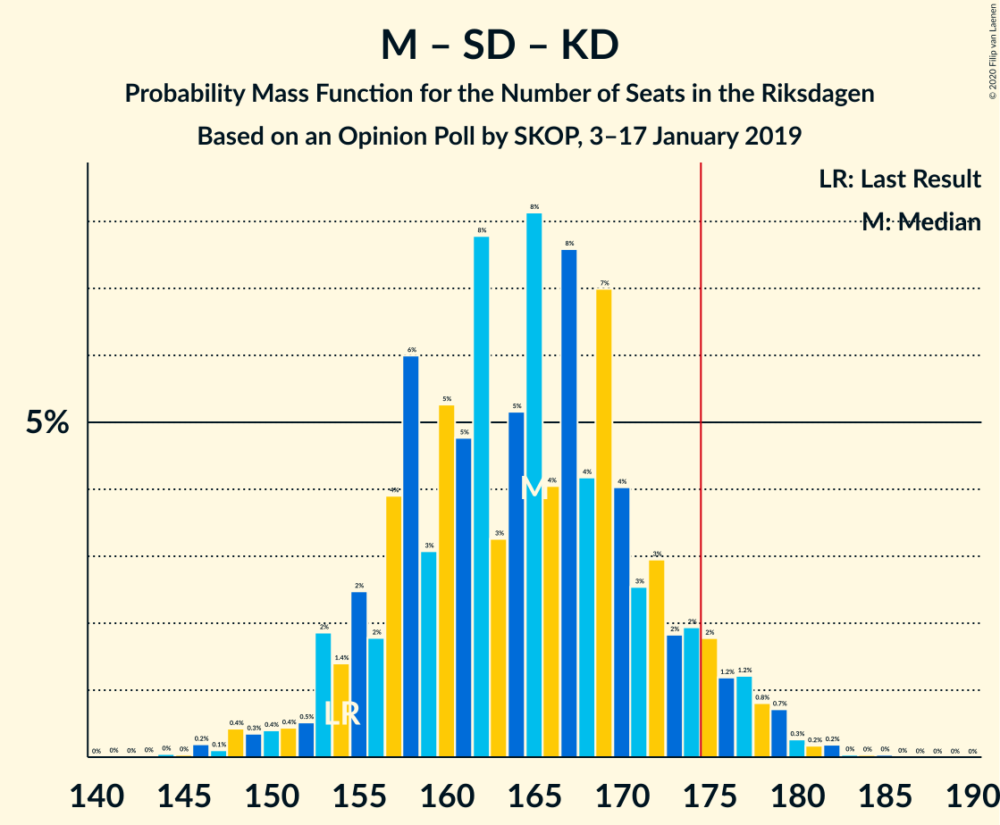
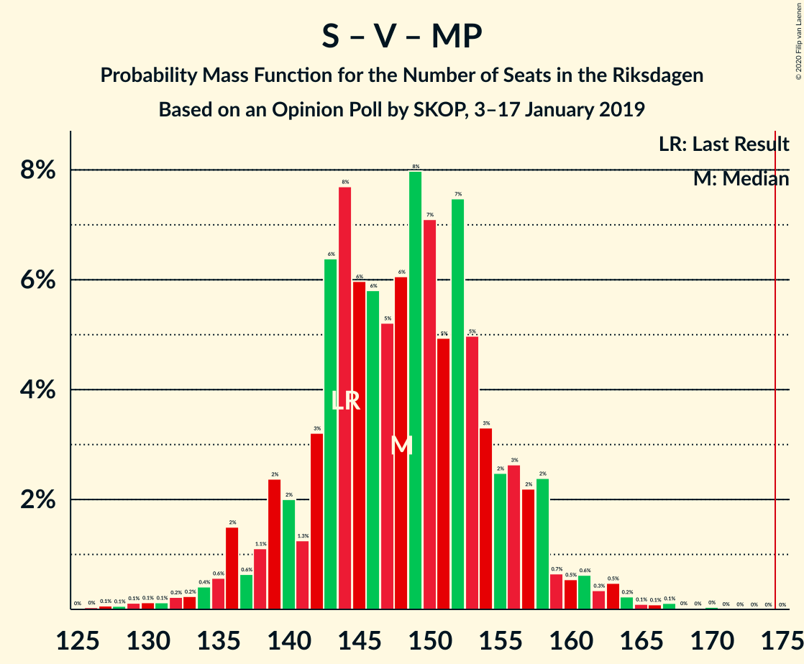

# Opinion Poll by SKOP, 3–17 January 2019

<a href="#voting-intentions">Voting Intentions</a> | <a href="#seats">Seats</a> | <a href="#coalitions">Coalitions</a> | <a href="#technical-information">Technical Information</a>

## Voting Intentions

### Confidence Intervals

| Party | Last Result | Poll Result | 80% Confidence Interval | 90% Confidence Interval | 95% Confidence Interval | 99% Confidence Interval |
|:-----:|:-----------:|:-----------:|:-----------------------:|:-----------------------:|:-----------------------:|:-----------------------:|
| Sveriges socialdemokratiska arbetareparti | 28.3% | 30.2% | 28.5–32.0% |28.0–32.5% |27.6–33.0% |26.8–33.8% |
| Moderata samlingspartiet | 19.8% | 18.1% | 16.7–19.6% |16.3–20.1% |15.9–20.5% |15.3–21.2% |
| Sverigedemokraterna | 17.5% | 16.9% | 15.6–18.5% |15.2–18.9% |14.8–19.3% |14.2–20.0% |
| Kristdemokraterna | 6.3% | 9.5% | 8.5–10.7% |8.2–11.1% |7.9–11.4% |7.4–12.0% |
| Vänsterpartiet | 8.0% | 8.9% | 7.9–10.1% |7.6–10.4% |7.3–10.7% |6.9–11.3% |
| Centerpartiet | 8.6% | 8.3% | 7.4–9.5% |7.1–9.8% |6.8–10.1% |6.4–10.7% |
| Liberalerna | 5.5% | 4.0% | 3.4–4.9% |3.2–5.1% |3.0–5.4% |2.7–5.8% |
| Miljöpartiet de gröna | 4.4% | 3.1% | 2.6–3.9% |2.4–4.1% |2.3–4.3% |2.0–4.7% |

*Note:* The poll result column reflects the actual value used in the calculations. Published results may vary slightly, and in addition be rounded to fewer digits.

## Seats

### Confidence Intervals

| Party | Last Result | Median | 80% Confidence Interval | 90% Confidence Interval | 95% Confidence Interval | 99% Confidence Interval |
|:-----:|:-----------:|:------:|:-----------------------:|:-----------------------:|:-----------------------:|:-----------------------:|
| <a href="#sveriges-socialdemokratiska-arbetareparti">Sveriges socialdemokratiska arbetareparti</a> | 100 | 116 | 108–125 |104–125 |101–126 |96–128 |
| <a href="#moderata-samlingspartiet">Moderata samlingspartiet</a> | 70 | 65 | 60–70 |58–72 |57–74 |54–80 |
| <a href="#sverigedemokraterna">Sverigedemokraterna</a> | 62 | 62 | 58–68 |55–69 |54–71 |51–75 |
| <a href="#kristdemokraterna">Kristdemokraterna</a> | 22 | 38 | 32–42 |31–43 |30–44 |28–44 |
| <a href="#vänsterpartiet">Vänsterpartiet</a> | 28 | 33 | 30–38 |29–38 |27–39 |25–43 |
| <a href="#centerpartiet">Centerpartiet</a> | 31 | 30 | 26–34 |25–34 |24–36 |22–39 |
| <a href="#liberalerna">Liberalerna</a> | 20 | 0 | 0–17 |0–18 |0–19 |0–21 |
| <a href="#miljöpartiet-de-gröna">Miljöpartiet de gröna</a> | 16 | 0 | 0 |0–15 |0–15 |0–17 |

### Sveriges socialdemokratiska arbetareparti

*For a full overview of the results for this party, see the [Sveriges socialdemokratiska arbetareparti](party-sverigessocialdemokratiskaarbetareparti.html) page.*

| Number of Seats | Probability | Accumulated | Special Marks |
|:---------------:|:-----------:|:-----------:|:-------------:|
| 92 | 0.1% | 100% |  |
| 93 | 0.1% | 99.9% |  |
| 94 | 0.3% | 99.9% |  |
| 95 | 0.1% | 99.6% |  |
| 96 | 0.2% | 99.5% |  |
| 97 | 0.4% | 99.3% |  |
| 98 | 0.4% | 98.9% |  |
| 99 | 0.5% | 98.5% |  |
| 100 | 0.4% | 98% | Last Result |
| 101 | 0.7% | 98% |  |
| 102 | 0.6% | 97% |  |
| 103 | 0.6% | 96% |  |
| 104 | 0.8% | 96% |  |
| 105 | 2% | 95% |  |
| 106 | 1.0% | 93% |  |
| 107 | 0.9% | 92% |  |
| 108 | 1.5% | 91% |  |
| 109 | 1.0% | 89% |  |
| 110 | 1.4% | 88% |  |
| 111 | 4% | 87% |  |
| 112 | 3% | 83% |  |
| 113 | 9% | 80% |  |
| 114 | 6% | 71% |  |
| 115 | 12% | 65% |  |
| 116 | 4% | 53% | Median |
| 117 | 9% | 49% |  |
| 118 | 2% | 39% |  |
| 119 | 2% | 37% |  |
| 120 | 13% | 35% |  |
| 121 | 3% | 22% |  |
| 122 | 2% | 19% |  |
| 123 | 5% | 18% |  |
| 124 | 2% | 13% |  |
| 125 | 7% | 10% |  |
| 126 | 2% | 3% |  |
| 127 | 0.4% | 1.0% |  |
| 128 | 0.4% | 0.6% |  |
| 129 | 0.1% | 0.2% |  |
| 130 | 0% | 0.1% |  |
| 131 | 0.1% | 0.1% |  |
| 132 | 0% | 0% |  |

### Moderata samlingspartiet

*For a full overview of the results for this party, see the [Moderata samlingspartiet](party-moderatasamlingspartiet.html) page.*

| Number of Seats | Probability | Accumulated | Special Marks |
|:---------------:|:-----------:|:-----------:|:-------------:|
| 52 | 0.1% | 100% |  |
| 53 | 0.2% | 99.8% |  |
| 54 | 0.5% | 99.6% |  |
| 55 | 0.5% | 99.1% |  |
| 56 | 0.9% | 98.6% |  |
| 57 | 2% | 98% |  |
| 58 | 1.0% | 96% |  |
| 59 | 2% | 95% |  |
| 60 | 8% | 93% |  |
| 61 | 5% | 85% |  |
| 62 | 7% | 80% |  |
| 63 | 10% | 73% |  |
| 64 | 8% | 63% |  |
| 65 | 14% | 55% | Median |
| 66 | 5% | 41% |  |
| 67 | 3% | 35% |  |
| 68 | 3% | 32% |  |
| 69 | 19% | 30% |  |
| 70 | 2% | 11% | Last Result |
| 71 | 2% | 9% |  |
| 72 | 2% | 6% |  |
| 73 | 2% | 4% |  |
| 74 | 0.9% | 3% |  |
| 75 | 0.3% | 2% |  |
| 76 | 0.4% | 1.4% |  |
| 77 | 0.1% | 0.9% |  |
| 78 | 0.1% | 0.9% |  |
| 79 | 0.2% | 0.8% |  |
| 80 | 0.4% | 0.5% |  |
| 81 | 0% | 0.1% |  |
| 82 | 0% | 0.1% |  |
| 83 | 0% | 0% |  |

### Sverigedemokraterna

*For a full overview of the results for this party, see the [Sverigedemokraterna](party-sverigedemokraterna.html) page.*

| Number of Seats | Probability | Accumulated | Special Marks |
|:---------------:|:-----------:|:-----------:|:-------------:|
| 49 | 0% | 100% |  |
| 50 | 0.1% | 99.9% |  |
| 51 | 0.5% | 99.9% |  |
| 52 | 0.2% | 99.4% |  |
| 53 | 0.6% | 99.2% |  |
| 54 | 2% | 98.6% |  |
| 55 | 2% | 96% |  |
| 56 | 4% | 94% |  |
| 57 | 0.7% | 91% |  |
| 58 | 12% | 90% |  |
| 59 | 3% | 79% |  |
| 60 | 20% | 76% |  |
| 61 | 4% | 56% |  |
| 62 | 6% | 52% | Last Result, Median |
| 63 | 4% | 46% |  |
| 64 | 11% | 42% |  |
| 65 | 6% | 31% |  |
| 66 | 5% | 25% |  |
| 67 | 9% | 21% |  |
| 68 | 5% | 11% |  |
| 69 | 2% | 6% |  |
| 70 | 2% | 4% |  |
| 71 | 0.5% | 3% |  |
| 72 | 0.8% | 2% |  |
| 73 | 0.4% | 1.3% |  |
| 74 | 0.4% | 0.9% |  |
| 75 | 0.2% | 0.5% |  |
| 76 | 0% | 0.3% |  |
| 77 | 0.3% | 0.3% |  |
| 78 | 0% | 0% |  |

### Kristdemokraterna

*For a full overview of the results for this party, see the [Kristdemokraterna](party-kristdemokraterna.html) page.*

| Number of Seats | Probability | Accumulated | Special Marks |
|:---------------:|:-----------:|:-----------:|:-------------:|
| 22 | 0% | 100% | Last Result |
| 23 | 0% | 100% |  |
| 24 | 0% | 100% |  |
| 25 | 0.1% | 100% |  |
| 26 | 0.1% | 99.9% |  |
| 27 | 0.2% | 99.7% |  |
| 28 | 0.9% | 99.5% |  |
| 29 | 0.6% | 98.6% |  |
| 30 | 2% | 98% |  |
| 31 | 4% | 96% |  |
| 32 | 5% | 92% |  |
| 33 | 2% | 87% |  |
| 34 | 6% | 85% |  |
| 35 | 14% | 79% |  |
| 36 | 3% | 65% |  |
| 37 | 4% | 61% |  |
| 38 | 17% | 58% | Median |
| 39 | 12% | 40% |  |
| 40 | 8% | 29% |  |
| 41 | 4% | 21% |  |
| 42 | 12% | 17% |  |
| 43 | 2% | 5% |  |
| 44 | 3% | 3% |  |
| 45 | 0.2% | 0.5% |  |
| 46 | 0.2% | 0.3% |  |
| 47 | 0% | 0.1% |  |
| 48 | 0.1% | 0.1% |  |
| 49 | 0% | 0% |  |

### Vänsterpartiet

*For a full overview of the results for this party, see the [Vänsterpartiet](party-vänsterpartiet.html) page.*

| Number of Seats | Probability | Accumulated | Special Marks |
|:---------------:|:-----------:|:-----------:|:-------------:|
| 24 | 0.2% | 100% |  |
| 25 | 1.2% | 99.8% |  |
| 26 | 0.9% | 98.6% |  |
| 27 | 0.8% | 98% |  |
| 28 | 2% | 97% | Last Result |
| 29 | 5% | 95% |  |
| 30 | 10% | 90% |  |
| 31 | 4% | 80% |  |
| 32 | 18% | 76% |  |
| 33 | 19% | 58% | Median |
| 34 | 6% | 38% |  |
| 35 | 2% | 32% |  |
| 36 | 4% | 30% |  |
| 37 | 14% | 27% |  |
| 38 | 8% | 12% |  |
| 39 | 2% | 4% |  |
| 40 | 1.1% | 2% |  |
| 41 | 0.5% | 1.1% |  |
| 42 | 0.2% | 0.7% |  |
| 43 | 0.2% | 0.5% |  |
| 44 | 0.2% | 0.3% |  |
| 45 | 0% | 0% |  |

### Centerpartiet

*For a full overview of the results for this party, see the [Centerpartiet](party-centerpartiet.html) page.*

| Number of Seats | Probability | Accumulated | Special Marks |
|:---------------:|:-----------:|:-----------:|:-------------:|
| 21 | 0% | 100% |  |
| 22 | 0.5% | 99.9% |  |
| 23 | 1.2% | 99.5% |  |
| 24 | 2% | 98% |  |
| 25 | 2% | 96% |  |
| 26 | 6% | 94% |  |
| 27 | 17% | 88% |  |
| 28 | 5% | 71% |  |
| 29 | 8% | 66% |  |
| 30 | 14% | 58% | Median |
| 31 | 7% | 44% | Last Result |
| 32 | 16% | 36% |  |
| 33 | 1.3% | 20% |  |
| 34 | 14% | 19% |  |
| 35 | 1.3% | 4% |  |
| 36 | 1.4% | 3% |  |
| 37 | 0.5% | 2% |  |
| 38 | 0.6% | 1.2% |  |
| 39 | 0.1% | 0.6% |  |
| 40 | 0.3% | 0.5% |  |
| 41 | 0.1% | 0.1% |  |
| 42 | 0.1% | 0.1% |  |
| 43 | 0% | 0% |  |

### Liberalerna

*For a full overview of the results for this party, see the [Liberalerna](party-liberalerna.html) page.*

| Number of Seats | Probability | Accumulated | Special Marks |
|:---------------:|:-----------:|:-----------:|:-------------:|
| 0 | 77% | 100% | Median |
| 1 | 0% | 23% |  |
| 2 | 0% | 23% |  |
| 3 | 0% | 23% |  |
| 4 | 0% | 23% |  |
| 5 | 0% | 23% |  |
| 6 | 0% | 23% |  |
| 7 | 0% | 23% |  |
| 8 | 0% | 23% |  |
| 9 | 0% | 23% |  |
| 10 | 0% | 23% |  |
| 11 | 0% | 23% |  |
| 12 | 0% | 23% |  |
| 13 | 0% | 23% |  |
| 14 | 0.7% | 23% |  |
| 15 | 7% | 22% |  |
| 16 | 4% | 15% |  |
| 17 | 3% | 11% |  |
| 18 | 3% | 7% |  |
| 19 | 3% | 5% |  |
| 20 | 1.1% | 2% | Last Result |
| 21 | 0.2% | 0.6% |  |
| 22 | 0.2% | 0.3% |  |
| 23 | 0.1% | 0.1% |  |
| 24 | 0% | 0% |  |

### Miljöpartiet de gröna

*For a full overview of the results for this party, see the [Miljöpartiet de gröna](party-miljöpartietdegröna.html) page.*

| Number of Seats | Probability | Accumulated | Special Marks |
|:---------------:|:-----------:|:-----------:|:-------------:|
| 0 | 94% | 100% | Median |
| 1 | 0% | 6% |  |
| 2 | 0% | 6% |  |
| 3 | 0% | 6% |  |
| 4 | 0% | 6% |  |
| 5 | 0% | 6% |  |
| 6 | 0% | 6% |  |
| 7 | 0% | 6% |  |
| 8 | 0% | 6% |  |
| 9 | 0% | 6% |  |
| 10 | 0% | 6% |  |
| 11 | 0% | 6% |  |
| 12 | 0% | 6% |  |
| 13 | 0% | 6% |  |
| 14 | 0.7% | 6% |  |
| 15 | 4% | 5% |  |
| 16 | 0.6% | 1.4% | Last Result |
| 17 | 0.6% | 0.7% |  |
| 18 | 0.1% | 0.2% |  |
| 19 | 0% | 0% |  |

## Coalitions

### Confidence Intervals

| Coalition | Last Result | Median | Majority? | 80% Confidence Interval | 90% Confidence Interval | 95% Confidence Interval | 99% Confidence Interval |
|:---------:|:-----------:|:------:|:---------:|:-----------------------:|:-----------------------:|:-----------------------:|:-----------------------:|
| Sveriges socialdemokratiska arbetareparti – Moderata samlingspartiet – Centerpartiet | 201 | 212 | 100% | 202–221 | 199–221 | 195–222 | 190–227 |
| Sveriges socialdemokratiska arbetareparti – Vänsterpartiet – Centerpartiet – Liberalerna – Miljöpartiet de gröna | 195 | 185 | 89% | 174–193 | 174–197 | 173–200 | 167–201 |
| Sveriges socialdemokratiska arbetareparti – Moderata samlingspartiet | 170 | 182 | 84% | 172–191 | 169–194 | 166–194 | 161–196 |
| Moderata samlingspartiet – Sverigedemokraterna – Kristdemokraterna | 154 | 164 | 11% | 156–175 | 152–175 | 149–176 | 148–182 |
| Sveriges socialdemokratiska arbetareparti – Centerpartiet – Liberalerna – Miljöpartiet de gröna | 167 | 151 | 0% | 142–161 | 141–165 | 140–168 | 136–172 |
| Sveriges socialdemokratiska arbetareparti – Vänsterpartiet – Miljöpartiet de gröna | 144 | 151 | 0% | 142–158 | 136–159 | 134–161 | 127–165 |
| Sveriges socialdemokratiska arbetareparti – Vänsterpartiet | 128 | 150 | 0% | 140–158 | 135–158 | 132–159 | 127–164 |
| Moderata samlingspartiet – Kristdemokraterna – Centerpartiet – Liberalerna | 143 | 136 | 0% | 127–145 | 125–151 | 124–154 | 121–160 |
| Moderata samlingspartiet – Kristdemokraterna – Centerpartiet | 123 | 133 | 0% | 123–140 | 122–142 | 119–142 | 115–148 |
| Moderata samlingspartiet – Sverigedemokraterna | 132 | 128 | 0% | 121–134 | 117–137 | 114–139 | 112–142 |
| Sveriges socialdemokratiska arbetareparti – Miljöpartiet de gröna | 116 | 117 | 0% | 110–125 | 105–126 | 101–128 | 96–131 |
| Moderata samlingspartiet – Centerpartiet – Liberalerna | 121 | 96 | 0% | 93–107 | 92–121 | 91–124 | 88–127 |
| Moderata samlingspartiet – Centerpartiet | 101 | 96 | 0% | 88–100 | 86–104 | 85–106 | 82–114 |

### Sveriges socialdemokratiska arbetareparti – Moderata samlingspartiet – Centerpartiet

| Number of Seats | Probability | Accumulated | Special Marks |
|:---------------:|:-----------:|:-----------:|:-------------:|
| 181 | 0.1% | 100% |  |
| 182 | 0% | 99.9% |  |
| 183 | 0% | 99.9% |  |
| 184 | 0% | 99.9% |  |
| 185 | 0% | 99.9% |  |
| 186 | 0% | 99.9% |  |
| 187 | 0.1% | 99.9% |  |
| 188 | 0.1% | 99.8% |  |
| 189 | 0% | 99.7% |  |
| 190 | 0.3% | 99.7% |  |
| 191 | 0.2% | 99.4% |  |
| 192 | 0.6% | 99.2% |  |
| 193 | 0.5% | 98.7% |  |
| 194 | 0.5% | 98% |  |
| 195 | 0.3% | 98% |  |
| 196 | 1.2% | 97% |  |
| 197 | 0.7% | 96% |  |
| 198 | 0.5% | 95% |  |
| 199 | 0.5% | 95% |  |
| 200 | 2% | 95% |  |
| 201 | 1.4% | 92% | Last Result |
| 202 | 3% | 91% |  |
| 203 | 3% | 88% |  |
| 204 | 2% | 86% |  |
| 205 | 3% | 84% |  |
| 206 | 10% | 81% |  |
| 207 | 2% | 71% |  |
| 208 | 3% | 69% |  |
| 209 | 3% | 65% |  |
| 210 | 3% | 63% |  |
| 211 | 8% | 59% | Median |
| 212 | 8% | 51% |  |
| 213 | 7% | 43% |  |
| 214 | 4% | 36% |  |
| 215 | 2% | 32% |  |
| 216 | 1.1% | 30% |  |
| 217 | 1.0% | 29% |  |
| 218 | 3% | 28% |  |
| 219 | 10% | 25% |  |
| 220 | 5% | 15% |  |
| 221 | 7% | 10% |  |
| 222 | 2% | 3% |  |
| 223 | 0.3% | 2% |  |
| 224 | 0.2% | 1.2% |  |
| 225 | 0.4% | 1.0% |  |
| 226 | 0% | 0.7% |  |
| 227 | 0.4% | 0.6% |  |
| 228 | 0.1% | 0.3% |  |
| 229 | 0% | 0.1% |  |
| 230 | 0% | 0.1% |  |
| 231 | 0% | 0% |  |

### Sveriges socialdemokratiska arbetareparti – Vänsterpartiet – Centerpartiet – Liberalerna – Miljöpartiet de gröna

| Number of Seats | Probability | Accumulated | Special Marks |
|:---------------:|:-----------:|:-----------:|:-------------:|
| 164 | 0% | 100% |  |
| 165 | 0% | 99.9% |  |
| 166 | 0.1% | 99.9% |  |
| 167 | 0.4% | 99.8% |  |
| 168 | 0.1% | 99.4% |  |
| 169 | 0.1% | 99.3% |  |
| 170 | 0.4% | 99.2% |  |
| 171 | 0.2% | 98.8% |  |
| 172 | 1.0% | 98.7% |  |
| 173 | 2% | 98% |  |
| 174 | 7% | 96% |  |
| 175 | 1.3% | 89% | Majority |
| 176 | 4% | 87% |  |
| 177 | 3% | 83% |  |
| 178 | 3% | 81% |  |
| 179 | 2% | 78% | Median |
| 180 | 14% | 76% |  |
| 181 | 0.8% | 62% |  |
| 182 | 2% | 61% |  |
| 183 | 1.0% | 59% |  |
| 184 | 3% | 58% |  |
| 185 | 8% | 56% |  |
| 186 | 10% | 48% |  |
| 187 | 6% | 37% |  |
| 188 | 7% | 32% |  |
| 189 | 2% | 24% |  |
| 190 | 5% | 22% |  |
| 191 | 2% | 17% |  |
| 192 | 4% | 15% |  |
| 193 | 2% | 11% |  |
| 194 | 0.7% | 9% |  |
| 195 | 1.2% | 8% | Last Result |
| 196 | 2% | 7% |  |
| 197 | 1.2% | 5% |  |
| 198 | 0.9% | 4% |  |
| 199 | 0.2% | 3% |  |
| 200 | 0.9% | 3% |  |
| 201 | 1.3% | 2% |  |
| 202 | 0.2% | 0.5% |  |
| 203 | 0.2% | 0.3% |  |
| 204 | 0% | 0.1% |  |
| 205 | 0.1% | 0.1% |  |
| 206 | 0% | 0% |  |

### Sveriges socialdemokratiska arbetareparti – Moderata samlingspartiet

| Number of Seats | Probability | Accumulated | Special Marks |
|:---------------:|:-----------:|:-----------:|:-------------:|
| 156 | 0.1% | 100% |  |
| 157 | 0% | 99.9% |  |
| 158 | 0% | 99.9% |  |
| 159 | 0.1% | 99.9% |  |
| 160 | 0.2% | 99.8% |  |
| 161 | 0.1% | 99.6% |  |
| 162 | 0.2% | 99.5% |  |
| 163 | 0.2% | 99.3% |  |
| 164 | 0.7% | 99.2% |  |
| 165 | 0.3% | 98% |  |
| 166 | 1.2% | 98% |  |
| 167 | 0.5% | 97% |  |
| 168 | 0.9% | 96% |  |
| 169 | 1.1% | 96% |  |
| 170 | 2% | 94% | Last Result |
| 171 | 2% | 93% |  |
| 172 | 3% | 91% |  |
| 173 | 1.3% | 88% |  |
| 174 | 3% | 87% |  |
| 175 | 2% | 84% | Majority |
| 176 | 11% | 82% |  |
| 177 | 4% | 71% |  |
| 178 | 1.3% | 66% |  |
| 179 | 2% | 65% |  |
| 180 | 7% | 63% |  |
| 181 | 6% | 56% | Median |
| 182 | 2% | 50% |  |
| 183 | 6% | 48% |  |
| 184 | 7% | 42% |  |
| 185 | 8% | 35% |  |
| 186 | 6% | 26% |  |
| 187 | 0.3% | 20% |  |
| 188 | 8% | 20% |  |
| 189 | 0.9% | 12% |  |
| 190 | 0.9% | 11% |  |
| 191 | 0.6% | 10% |  |
| 192 | 0.2% | 9% |  |
| 193 | 2% | 9% |  |
| 194 | 7% | 8% |  |
| 195 | 0% | 0.6% |  |
| 196 | 0.1% | 0.6% |  |
| 197 | 0.3% | 0.5% |  |
| 198 | 0% | 0.2% |  |
| 199 | 0.1% | 0.2% |  |
| 200 | 0% | 0% |  |

### Moderata samlingspartiet – Sverigedemokraterna – Kristdemokraterna

| Number of Seats | Probability | Accumulated | Special Marks |
|:---------------:|:-----------:|:-----------:|:-------------:|
| 144 | 0.1% | 100% |  |
| 145 | 0% | 99.9% |  |
| 146 | 0.2% | 99.9% |  |
| 147 | 0.2% | 99.7% |  |
| 148 | 1.3% | 99.5% |  |
| 149 | 0.9% | 98% |  |
| 150 | 0.2% | 97% |  |
| 151 | 0.9% | 97% |  |
| 152 | 1.2% | 96% |  |
| 153 | 2% | 95% |  |
| 154 | 1.2% | 93% | Last Result |
| 155 | 0.7% | 92% |  |
| 156 | 2% | 91% |  |
| 157 | 4% | 89% |  |
| 158 | 2% | 85% |  |
| 159 | 5% | 83% |  |
| 160 | 2% | 78% |  |
| 161 | 7% | 76% |  |
| 162 | 6% | 68% |  |
| 163 | 10% | 63% |  |
| 164 | 8% | 52% |  |
| 165 | 3% | 44% | Median |
| 166 | 1.0% | 42% |  |
| 167 | 2% | 41% |  |
| 168 | 0.8% | 39% |  |
| 169 | 14% | 38% |  |
| 170 | 2% | 24% |  |
| 171 | 3% | 22% |  |
| 172 | 3% | 19% |  |
| 173 | 4% | 17% |  |
| 174 | 1.3% | 13% |  |
| 175 | 7% | 11% | Majority |
| 176 | 2% | 4% |  |
| 177 | 1.0% | 2% |  |
| 178 | 0.2% | 1.3% |  |
| 179 | 0.4% | 1.2% |  |
| 180 | 0.1% | 0.8% |  |
| 181 | 0.1% | 0.7% |  |
| 182 | 0.4% | 0.6% |  |
| 183 | 0.1% | 0.2% |  |
| 184 | 0% | 0.1% |  |
| 185 | 0% | 0.1% |  |
| 186 | 0% | 0% |  |

### Sveriges socialdemokratiska arbetareparti – Centerpartiet – Liberalerna – Miljöpartiet de gröna

| Number of Seats | Probability | Accumulated | Special Marks |
|:---------------:|:-----------:|:-----------:|:-------------:|
| 131 | 0% | 100% |  |
| 132 | 0% | 99.9% |  |
| 133 | 0% | 99.9% |  |
| 134 | 0.1% | 99.9% |  |
| 135 | 0.2% | 99.8% |  |
| 136 | 0.1% | 99.6% |  |
| 137 | 0.4% | 99.5% |  |
| 138 | 0.5% | 99.0% |  |
| 139 | 0.2% | 98% |  |
| 140 | 2% | 98% |  |
| 141 | 2% | 96% |  |
| 142 | 8% | 94% |  |
| 143 | 12% | 86% |  |
| 144 | 0.4% | 74% |  |
| 145 | 2% | 73% |  |
| 146 | 4% | 71% | Median |
| 147 | 4% | 67% |  |
| 148 | 3% | 63% |  |
| 149 | 6% | 60% |  |
| 150 | 3% | 54% |  |
| 151 | 1.2% | 51% |  |
| 152 | 8% | 50% |  |
| 153 | 0.6% | 42% |  |
| 154 | 12% | 41% |  |
| 155 | 6% | 29% |  |
| 156 | 3% | 23% |  |
| 157 | 3% | 20% |  |
| 158 | 4% | 17% |  |
| 159 | 1.3% | 13% |  |
| 160 | 1.1% | 12% |  |
| 161 | 2% | 10% |  |
| 162 | 1.5% | 9% |  |
| 163 | 0.7% | 7% |  |
| 164 | 0.9% | 7% |  |
| 165 | 1.4% | 6% |  |
| 166 | 0.9% | 4% |  |
| 167 | 0.7% | 3% | Last Result |
| 168 | 0.3% | 3% |  |
| 169 | 0.6% | 2% |  |
| 170 | 0.3% | 2% |  |
| 171 | 0.1% | 1.4% |  |
| 172 | 1.2% | 1.3% |  |
| 173 | 0% | 0.1% |  |
| 174 | 0.1% | 0.1% |  |
| 175 | 0% | 0% | Majority |

### Sveriges socialdemokratiska arbetareparti – Vänsterpartiet – Miljöpartiet de gröna

| Number of Seats | Probability | Accumulated | Special Marks |
|:---------------:|:-----------:|:-----------:|:-------------:|
| 125 | 0.2% | 100% |  |
| 126 | 0% | 99.8% |  |
| 127 | 0.5% | 99.8% |  |
| 128 | 0.2% | 99.3% |  |
| 129 | 0.2% | 99.1% |  |
| 130 | 0.2% | 98.9% |  |
| 131 | 0.2% | 98.7% |  |
| 132 | 0.6% | 98% |  |
| 133 | 0.3% | 98% |  |
| 134 | 0.2% | 98% |  |
| 135 | 2% | 97% |  |
| 136 | 0.3% | 95% |  |
| 137 | 0.3% | 95% |  |
| 138 | 0.7% | 94% |  |
| 139 | 1.1% | 94% |  |
| 140 | 0.7% | 93% |  |
| 141 | 1.2% | 92% |  |
| 142 | 1.2% | 91% |  |
| 143 | 1.2% | 89% |  |
| 144 | 3% | 88% | Last Result |
| 145 | 2% | 86% |  |
| 146 | 2% | 84% |  |
| 147 | 12% | 82% |  |
| 148 | 7% | 70% |  |
| 149 | 2% | 63% | Median |
| 150 | 10% | 61% |  |
| 151 | 2% | 51% |  |
| 152 | 11% | 49% |  |
| 153 | 1.4% | 37% |  |
| 154 | 5% | 36% |  |
| 155 | 6% | 31% |  |
| 156 | 6% | 25% |  |
| 157 | 0.4% | 18% |  |
| 158 | 12% | 18% |  |
| 159 | 2% | 6% |  |
| 160 | 1.1% | 4% |  |
| 161 | 1.2% | 3% |  |
| 162 | 0.4% | 1.4% |  |
| 163 | 0.2% | 1.0% |  |
| 164 | 0.2% | 0.8% |  |
| 165 | 0.2% | 0.7% |  |
| 166 | 0.2% | 0.4% |  |
| 167 | 0.1% | 0.2% |  |
| 168 | 0% | 0.1% |  |
| 169 | 0.1% | 0.1% |  |
| 170 | 0% | 0% |  |

### Sveriges socialdemokratiska arbetareparti – Vänsterpartiet

| Number of Seats | Probability | Accumulated | Special Marks |
|:---------------:|:-----------:|:-----------:|:-------------:|
| 124 | 0% | 100% |  |
| 125 | 0.2% | 99.9% |  |
| 126 | 0% | 99.7% |  |
| 127 | 0.5% | 99.7% |  |
| 128 | 0.4% | 99.2% | Last Result |
| 129 | 0.3% | 98.8% |  |
| 130 | 0.3% | 98.5% |  |
| 131 | 0.3% | 98% |  |
| 132 | 0.6% | 98% |  |
| 133 | 0.4% | 97% |  |
| 134 | 0.2% | 97% |  |
| 135 | 2% | 97% |  |
| 136 | 0.4% | 94% |  |
| 137 | 0.6% | 94% |  |
| 138 | 0.7% | 93% |  |
| 139 | 2% | 93% |  |
| 140 | 1.2% | 91% |  |
| 141 | 2% | 90% |  |
| 142 | 1.1% | 88% |  |
| 143 | 3% | 87% |  |
| 144 | 3% | 84% |  |
| 145 | 2% | 81% |  |
| 146 | 2% | 79% |  |
| 147 | 12% | 77% |  |
| 148 | 7% | 65% |  |
| 149 | 2% | 58% | Median |
| 150 | 10% | 56% |  |
| 151 | 2% | 46% |  |
| 152 | 11% | 44% |  |
| 153 | 1.1% | 32% |  |
| 154 | 5% | 31% |  |
| 155 | 5% | 27% |  |
| 156 | 6% | 21% |  |
| 157 | 0.3% | 15% |  |
| 158 | 11% | 15% |  |
| 159 | 2% | 4% |  |
| 160 | 0.8% | 2% |  |
| 161 | 0.8% | 2% |  |
| 162 | 0.2% | 0.9% |  |
| 163 | 0.1% | 0.6% |  |
| 164 | 0.1% | 0.5% |  |
| 165 | 0.2% | 0.4% |  |
| 166 | 0.2% | 0.2% |  |
| 167 | 0% | 0% |  |

### Moderata samlingspartiet – Kristdemokraterna – Centerpartiet – Liberalerna

| Number of Seats | Probability | Accumulated | Special Marks |
|:---------------:|:-----------:|:-----------:|:-------------:|
| 117 | 0% | 100% |  |
| 118 | 0% | 99.9% |  |
| 119 | 0.1% | 99.9% |  |
| 120 | 0% | 99.8% |  |
| 121 | 0.7% | 99.8% |  |
| 122 | 0.1% | 99.0% |  |
| 123 | 0.4% | 98.9% |  |
| 124 | 2% | 98.5% |  |
| 125 | 2% | 96% |  |
| 126 | 3% | 95% |  |
| 127 | 3% | 92% |  |
| 128 | 0.3% | 89% |  |
| 129 | 3% | 89% |  |
| 130 | 0.7% | 86% |  |
| 131 | 7% | 85% |  |
| 132 | 11% | 78% |  |
| 133 | 2% | 67% | Median |
| 134 | 4% | 65% |  |
| 135 | 7% | 61% |  |
| 136 | 7% | 55% |  |
| 137 | 11% | 48% |  |
| 138 | 10% | 37% |  |
| 139 | 3% | 27% |  |
| 140 | 7% | 25% |  |
| 141 | 0.8% | 17% |  |
| 142 | 4% | 17% |  |
| 143 | 1.0% | 13% | Last Result |
| 144 | 0.8% | 12% |  |
| 145 | 2% | 11% |  |
| 146 | 0.7% | 9% |  |
| 147 | 0.4% | 9% |  |
| 148 | 1.0% | 8% |  |
| 149 | 0.5% | 7% |  |
| 150 | 0.7% | 7% |  |
| 151 | 1.1% | 6% |  |
| 152 | 0.6% | 5% |  |
| 153 | 0.4% | 4% |  |
| 154 | 2% | 4% |  |
| 155 | 0.4% | 2% |  |
| 156 | 0.2% | 2% |  |
| 157 | 0.6% | 2% |  |
| 158 | 0.2% | 1.1% |  |
| 159 | 0.4% | 0.9% |  |
| 160 | 0.1% | 0.5% |  |
| 161 | 0.1% | 0.4% |  |
| 162 | 0.1% | 0.3% |  |
| 163 | 0% | 0.2% |  |
| 164 | 0.1% | 0.2% |  |
| 165 | 0.1% | 0.1% |  |
| 166 | 0% | 0% |  |

### Moderata samlingspartiet – Kristdemokraterna – Centerpartiet

| Number of Seats | Probability | Accumulated | Special Marks |
|:---------------:|:-----------:|:-----------:|:-------------:|
| 111 | 0% | 100% |  |
| 112 | 0.1% | 99.9% |  |
| 113 | 0% | 99.8% |  |
| 114 | 0.3% | 99.8% |  |
| 115 | 0.2% | 99.5% |  |
| 116 | 0.3% | 99.3% |  |
| 117 | 1.0% | 99.1% |  |
| 118 | 0.5% | 98% |  |
| 119 | 0.6% | 98% |  |
| 120 | 0.5% | 97% |  |
| 121 | 1.1% | 96% |  |
| 122 | 4% | 95% |  |
| 123 | 1.5% | 91% | Last Result |
| 124 | 4% | 90% |  |
| 125 | 2% | 86% |  |
| 126 | 3% | 84% |  |
| 127 | 4% | 81% |  |
| 128 | 2% | 77% |  |
| 129 | 3% | 75% |  |
| 130 | 2% | 72% |  |
| 131 | 7% | 70% |  |
| 132 | 10% | 62% |  |
| 133 | 2% | 52% | Median |
| 134 | 4% | 50% |  |
| 135 | 9% | 46% |  |
| 136 | 7% | 37% |  |
| 137 | 10% | 31% |  |
| 138 | 8% | 21% |  |
| 139 | 1.3% | 13% |  |
| 140 | 6% | 11% |  |
| 141 | 0.2% | 5% |  |
| 142 | 3% | 5% |  |
| 143 | 0.3% | 2% |  |
| 144 | 0.6% | 2% |  |
| 145 | 0.4% | 1.3% |  |
| 146 | 0.3% | 0.9% |  |
| 147 | 0.1% | 0.6% |  |
| 148 | 0.3% | 0.6% |  |
| 149 | 0% | 0.3% |  |
| 150 | 0.1% | 0.2% |  |
| 151 | 0.1% | 0.2% |  |
| 152 | 0% | 0% |  |

### Moderata samlingspartiet – Sverigedemokraterna

| Number of Seats | Probability | Accumulated | Special Marks |
|:---------------:|:-----------:|:-----------:|:-------------:|
| 109 | 0% | 100% |  |
| 110 | 0.1% | 99.9% |  |
| 111 | 0.2% | 99.8% |  |
| 112 | 0.1% | 99.6% |  |
| 113 | 0.5% | 99.5% |  |
| 114 | 2% | 99.0% |  |
| 115 | 0.3% | 97% |  |
| 116 | 2% | 97% |  |
| 117 | 1.4% | 95% |  |
| 118 | 0.5% | 94% |  |
| 119 | 1.1% | 93% |  |
| 120 | 2% | 92% |  |
| 121 | 3% | 91% |  |
| 122 | 9% | 88% |  |
| 123 | 6% | 79% |  |
| 124 | 2% | 73% |  |
| 125 | 12% | 70% |  |
| 126 | 1.1% | 59% |  |
| 127 | 3% | 58% | Median |
| 128 | 7% | 54% |  |
| 129 | 9% | 48% |  |
| 130 | 11% | 39% |  |
| 131 | 6% | 28% |  |
| 132 | 2% | 22% | Last Result |
| 133 | 9% | 20% |  |
| 134 | 3% | 11% |  |
| 135 | 2% | 8% |  |
| 136 | 1.1% | 6% |  |
| 137 | 1.5% | 5% |  |
| 138 | 0.7% | 4% |  |
| 139 | 2% | 3% |  |
| 140 | 0.2% | 2% |  |
| 141 | 0.8% | 1.4% |  |
| 142 | 0.2% | 0.6% |  |
| 143 | 0% | 0.5% |  |
| 144 | 0.1% | 0.4% |  |
| 145 | 0% | 0.3% |  |
| 146 | 0% | 0.3% |  |
| 147 | 0.2% | 0.3% |  |
| 148 | 0% | 0.1% |  |
| 149 | 0% | 0.1% |  |
| 150 | 0% | 0% |  |

### Sveriges socialdemokratiska arbetareparti – Miljöpartiet de gröna

| Number of Seats | Probability | Accumulated | Special Marks |
|:---------------:|:-----------:|:-----------:|:-------------:|
| 92 | 0% | 100% |  |
| 93 | 0% | 99.9% |  |
| 94 | 0.2% | 99.9% |  |
| 95 | 0% | 99.7% |  |
| 96 | 0.2% | 99.7% |  |
| 97 | 0.4% | 99.5% |  |
| 98 | 0.3% | 99.1% |  |
| 99 | 0.3% | 98.8% |  |
| 100 | 0.4% | 98% |  |
| 101 | 0.7% | 98% |  |
| 102 | 0.5% | 97% |  |
| 103 | 0.5% | 97% |  |
| 104 | 0.8% | 96% |  |
| 105 | 2% | 96% |  |
| 106 | 0.9% | 94% |  |
| 107 | 0.5% | 93% |  |
| 108 | 1.0% | 92% |  |
| 109 | 0.4% | 91% |  |
| 110 | 1.2% | 91% |  |
| 111 | 3% | 90% |  |
| 112 | 3% | 86% |  |
| 113 | 9% | 83% |  |
| 114 | 5% | 74% |  |
| 115 | 12% | 69% |  |
| 116 | 4% | 58% | Last Result, Median |
| 117 | 9% | 54% |  |
| 118 | 2% | 44% |  |
| 119 | 2% | 42% |  |
| 120 | 14% | 41% |  |
| 121 | 3% | 27% |  |
| 122 | 2% | 24% |  |
| 123 | 5% | 22% |  |
| 124 | 3% | 17% |  |
| 125 | 8% | 14% |  |
| 126 | 3% | 6% |  |
| 127 | 0.5% | 3% |  |
| 128 | 0.6% | 3% |  |
| 129 | 1.4% | 2% |  |
| 130 | 0.2% | 0.8% |  |
| 131 | 0.1% | 0.6% |  |
| 132 | 0% | 0.4% |  |
| 133 | 0.1% | 0.4% |  |
| 134 | 0.1% | 0.3% |  |
| 135 | 0.1% | 0.2% |  |
| 136 | 0% | 0.1% |  |
| 137 | 0.1% | 0.1% |  |
| 138 | 0% | 0% |  |

### Moderata samlingspartiet – Centerpartiet – Liberalerna

| Number of Seats | Probability | Accumulated | Special Marks |
|:---------------:|:-----------:|:-----------:|:-------------:|
| 87 | 0.1% | 100% |  |
| 88 | 1.0% | 99.9% |  |
| 89 | 0.8% | 98.8% |  |
| 90 | 0.2% | 98% |  |
| 91 | 2% | 98% |  |
| 92 | 4% | 96% |  |
| 93 | 11% | 92% |  |
| 94 | 7% | 82% |  |
| 95 | 3% | 74% | Median |
| 96 | 24% | 71% |  |
| 97 | 5% | 47% |  |
| 98 | 5% | 42% |  |
| 99 | 11% | 37% |  |
| 100 | 2% | 26% |  |
| 101 | 3% | 24% |  |
| 102 | 1.0% | 21% |  |
| 103 | 5% | 20% |  |
| 104 | 1.0% | 15% |  |
| 105 | 2% | 14% |  |
| 106 | 2% | 13% |  |
| 107 | 2% | 10% |  |
| 108 | 0.3% | 8% |  |
| 109 | 0% | 8% |  |
| 110 | 0.3% | 8% |  |
| 111 | 0.1% | 8% |  |
| 112 | 0% | 8% |  |
| 113 | 0% | 8% |  |
| 114 | 0.5% | 8% |  |
| 115 | 0.1% | 7% |  |
| 116 | 0.1% | 7% |  |
| 117 | 0.2% | 7% |  |
| 118 | 0.3% | 7% |  |
| 119 | 0.8% | 6% |  |
| 120 | 0.2% | 5% |  |
| 121 | 0.6% | 5% | Last Result |
| 122 | 0.8% | 5% |  |
| 123 | 0.7% | 4% |  |
| 124 | 2% | 3% |  |
| 125 | 0.2% | 0.9% |  |
| 126 | 0.1% | 0.8% |  |
| 127 | 0.4% | 0.6% |  |
| 128 | 0.2% | 0.2% |  |
| 129 | 0% | 0% |  |

### Moderata samlingspartiet – Centerpartiet

| Number of Seats | Probability | Accumulated | Special Marks |
|:---------------:|:-----------:|:-----------:|:-------------:|
| 80 | 0.1% | 100% |  |
| 81 | 0.1% | 99.8% |  |
| 82 | 0.6% | 99.8% |  |
| 83 | 0.6% | 99.1% |  |
| 84 | 0.6% | 98% |  |
| 85 | 2% | 98% |  |
| 86 | 2% | 96% |  |
| 87 | 2% | 94% |  |
| 88 | 3% | 92% |  |
| 89 | 2% | 89% |  |
| 90 | 2% | 87% |  |
| 91 | 3% | 85% |  |
| 92 | 4% | 81% |  |
| 93 | 11% | 77% |  |
| 94 | 7% | 66% |  |
| 95 | 3% | 59% | Median |
| 96 | 24% | 55% |  |
| 97 | 5% | 31% |  |
| 98 | 5% | 26% |  |
| 99 | 11% | 22% |  |
| 100 | 2% | 11% |  |
| 101 | 3% | 9% | Last Result |
| 102 | 0.7% | 7% |  |
| 103 | 0.7% | 6% |  |
| 104 | 0.5% | 5% |  |
| 105 | 2% | 5% |  |
| 106 | 0.4% | 3% |  |
| 107 | 0.3% | 2% |  |
| 108 | 0.4% | 2% |  |
| 109 | 0.1% | 1.5% |  |
| 110 | 0% | 1.4% |  |
| 111 | 0.2% | 1.3% |  |
| 112 | 0.3% | 1.1% |  |
| 113 | 0% | 0.8% |  |
| 114 | 0.5% | 0.8% |  |
| 115 | 0.1% | 0.3% |  |
| 116 | 0% | 0.2% |  |
| 117 | 0.1% | 0.1% |  |
| 118 | 0% | 0.1% |  |
| 119 | 0% | 0.1% |  |
| 120 | 0% | 0% |  |

## Technical Information

### Opinion Poll

+ **Polling firm:** SKOP
+ **Commissioner(s):** —
+ **Fieldwork period:** 3–17 January 2019

### Calculations

+ **Sample size:** 1116
+ **Simulations done:** 131,072
+ **Error estimate:** 2.96%

