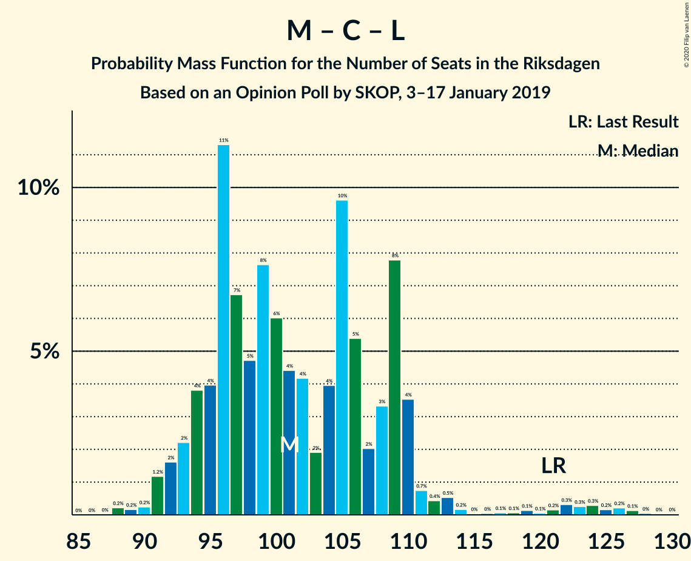

# Opinion Poll by SKOP, 3–17 January 2019

<a href="#voting-intentions">Voting Intentions</a> | <a href="#seats">Seats</a> | <a href="#coalitions">Coalitions</a> | <a href="#technical-information">Technical Information</a>

## Voting Intentions

### Confidence Intervals

| Party | Last Result | Poll Result | 80% Confidence Interval | 90% Confidence Interval | 95% Confidence Interval | 99% Confidence Interval |
|:-----:|:-----------:|:-----------:|:-----------------------:|:-----------------------:|:-----------------------:|:-----------------------:|
| Sveriges socialdemokratiska arbetareparti | 28.3% | 30.2% | 28.5–32.0% |28.0–32.5% |27.6–33.0% |26.8–33.8% |
| Moderata samlingspartiet | 19.8% | 18.1% | 16.7–19.6% |16.3–20.1% |15.9–20.5% |15.3–21.2% |
| Sverigedemokraterna | 17.5% | 16.9% | 15.6–18.5% |15.2–18.9% |14.8–19.3% |14.2–20.0% |
| Kristdemokraterna | 6.3% | 9.5% | 8.5–10.7% |8.2–11.1% |7.9–11.4% |7.4–12.0% |
| Vänsterpartiet | 8.0% | 8.9% | 7.9–10.1% |7.6–10.4% |7.3–10.7% |6.9–11.3% |
| Centerpartiet | 8.6% | 8.3% | 7.4–9.5% |7.1–9.8% |6.8–10.1% |6.4–10.7% |
| Liberalerna | 5.5% | 4.0% | 3.4–4.9% |3.2–5.1% |3.0–5.4% |2.7–5.8% |
| Miljöpartiet de gröna | 4.4% | 3.1% | 2.6–3.9% |2.4–4.1% |2.3–4.3% |2.0–4.7% |

*Note:* The poll result column reflects the actual value used in the calculations. Published results may vary slightly, and in addition be rounded to fewer digits.

## Seats

### Confidence Intervals

| Party | Last Result | Median | 80% Confidence Interval | 90% Confidence Interval | 95% Confidence Interval | 99% Confidence Interval |
|:-----:|:-----------:|:------:|:-----------------------:|:-----------------------:|:-----------------------:|:-----------------------:|
| <a href="#sveriges-socialdemokratiska-arbetareparti">Sveriges socialdemokratiska arbetareparti</a> | 100 | 120 | 119–120 |115–120 |115–120 |96–120 |
| <a href="#moderata-samlingspartiet">Moderata samlingspartiet</a> | 70 | 60 | 60–61 |57–61 |57–61 |57–67 |
| <a href="#sverigedemokraterna">Sverigedemokraterna</a> | 62 | 62 | 55–62 |55–70 |55–70 |55–70 |
| <a href="#kristdemokraterna">Kristdemokraterna</a> | 22 | 35 | 35–38 |35–38 |35–38 |30–38 |
| <a href="#vänsterpartiet">Vänsterpartiet</a> | 28 | 38 | 30–38 |30–39 |30–39 |30–39 |
| <a href="#centerpartiet">Centerpartiet</a> | 31 | 34 | 31–34 |31–34 |31–34 |31–34 |
| <a href="#liberalerna">Liberalerna</a> | 20 | 0 | 0–15 |0–15 |0–15 |0–16 |
| <a href="#miljöpartiet-de-gröna">Miljöpartiet de gröna</a> | 16 | 0 | 0 |0 |0 |0–17 |

### Sveriges socialdemokratiska arbetareparti

*For a full overview of the results for this party, see the [Sveriges socialdemokratiska arbetareparti](party-sverigessocialdemokratiskaarbetareparti.html) page.*

| Number of Seats | Probability | Accumulated | Special Marks |
|:---------------:|:-----------:|:-----------:|:-------------:|
| 91 | 0.2% | 100% |  |
| 92 | 0% | 99.8% |  |
| 93 | 0% | 99.8% |  |
| 94 | 0% | 99.8% |  |
| 95 | 0% | 99.8% |  |
| 96 | 1.0% | 99.8% |  |
| 97 | 0% | 98.9% |  |
| 98 | 0% | 98.8% |  |
| 99 | 0% | 98.8% |  |
| 100 | 0% | 98.8% | Last Result |
| 101 | 0% | 98.8% |  |
| 102 | 0% | 98.8% |  |
| 103 | 0% | 98.8% |  |
| 104 | 0% | 98.8% |  |
| 105 | 0% | 98.8% |  |
| 106 | 0% | 98.8% |  |
| 107 | 0.1% | 98.8% |  |
| 108 | 0% | 98.7% |  |
| 109 | 0% | 98.7% |  |
| 110 | 0% | 98.7% |  |
| 111 | 0% | 98.7% |  |
| 112 | 0.2% | 98.7% |  |
| 113 | 0% | 98% |  |
| 114 | 0% | 98% |  |
| 115 | 8% | 98% |  |
| 116 | 0% | 91% |  |
| 117 | 0% | 91% |  |
| 118 | 0% | 91% |  |
| 119 | 26% | 91% |  |
| 120 | 64% | 64% | Median |
| 121 | 0% | 0.2% |  |
| 122 | 0% | 0.2% |  |
| 123 | 0% | 0.2% |  |
| 124 | 0% | 0.2% |  |
| 125 | 0% | 0.2% |  |
| 126 | 0% | 0.2% |  |
| 127 | 0.1% | 0.2% |  |
| 128 | 0% | 0% |  |

### Moderata samlingspartiet

*For a full overview of the results for this party, see the [Moderata samlingspartiet](party-moderatasamlingspartiet.html) page.*

| Number of Seats | Probability | Accumulated | Special Marks |
|:---------------:|:-----------:|:-----------:|:-------------:|
| 57 | 8% | 100% |  |
| 58 | 0% | 92% |  |
| 59 | 0.3% | 92% |  |
| 60 | 64% | 92% | Median |
| 61 | 26% | 28% |  |
| 62 | 0% | 1.4% |  |
| 63 | 0.2% | 1.4% |  |
| 64 | 0% | 1.2% |  |
| 65 | 0% | 1.2% |  |
| 66 | 0% | 1.2% |  |
| 67 | 1.0% | 1.2% |  |
| 68 | 0% | 0.2% |  |
| 69 | 0% | 0.2% |  |
| 70 | 0.2% | 0.2% | Last Result |
| 71 | 0% | 0.1% |  |
| 72 | 0% | 0.1% |  |
| 73 | 0% | 0.1% |  |
| 74 | 0% | 0% |  |

### Sverigedemokraterna

*For a full overview of the results for this party, see the [Sverigedemokraterna](party-sverigedemokraterna.html) page.*

| Number of Seats | Probability | Accumulated | Special Marks |
|:---------------:|:-----------:|:-----------:|:-------------:|
| 54 | 0.2% | 100% |  |
| 55 | 26% | 99.8% |  |
| 56 | 1.0% | 73% |  |
| 57 | 0% | 72% |  |
| 58 | 0% | 72% |  |
| 59 | 0% | 72% |  |
| 60 | 0% | 72% |  |
| 61 | 0% | 72% |  |
| 62 | 64% | 72% | Last Result, Median |
| 63 | 0.1% | 8% |  |
| 64 | 0% | 8% |  |
| 65 | 0% | 8% |  |
| 66 | 0% | 8% |  |
| 67 | 0% | 8% |  |
| 68 | 0% | 8% |  |
| 69 | 0% | 8% |  |
| 70 | 8% | 8% |  |
| 71 | 0% | 0.2% |  |
| 72 | 0.2% | 0.2% |  |
| 73 | 0% | 0% |  |

### Kristdemokraterna

*For a full overview of the results for this party, see the [Kristdemokraterna](party-kristdemokraterna.html) page.*

| Number of Seats | Probability | Accumulated | Special Marks |
|:---------------:|:-----------:|:-----------:|:-------------:|
| 22 | 0% | 100% | Last Result |
| 23 | 0% | 100% |  |
| 24 | 0% | 100% |  |
| 25 | 0% | 100% |  |
| 26 | 0% | 100% |  |
| 27 | 0% | 100% |  |
| 28 | 0% | 100% |  |
| 29 | 0% | 100% |  |
| 30 | 1.1% | 100% |  |
| 31 | 0% | 98.9% |  |
| 32 | 0% | 98.9% |  |
| 33 | 0% | 98.9% |  |
| 34 | 0% | 98.8% |  |
| 35 | 64% | 98.8% | Median |
| 36 | 8% | 35% |  |
| 37 | 0.2% | 27% |  |
| 38 | 26% | 27% |  |
| 39 | 0% | 0.3% |  |
| 40 | 0% | 0.3% |  |
| 41 | 0% | 0.3% |  |
| 42 | 0% | 0.3% |  |
| 43 | 0.2% | 0.3% |  |
| 44 | 0.1% | 0.1% |  |
| 45 | 0% | 0% |  |

### Vänsterpartiet

*For a full overview of the results for this party, see the [Vänsterpartiet](party-vänsterpartiet.html) page.*

| Number of Seats | Probability | Accumulated | Special Marks |
|:---------------:|:-----------:|:-----------:|:-------------:|
| 25 | 0.1% | 100% |  |
| 26 | 0% | 99.9% |  |
| 27 | 0% | 99.9% |  |
| 28 | 0% | 99.8% | Last Result |
| 29 | 0.2% | 99.8% |  |
| 30 | 26% | 99.6% |  |
| 31 | 0% | 73% |  |
| 32 | 0% | 73% |  |
| 33 | 0% | 73% |  |
| 34 | 1.0% | 73% |  |
| 35 | 0% | 72% |  |
| 36 | 0% | 72% |  |
| 37 | 0% | 72% |  |
| 38 | 64% | 72% | Median |
| 39 | 8% | 8% |  |
| 40 | 0% | 0.3% |  |
| 41 | 0% | 0.3% |  |
| 42 | 0.2% | 0.3% |  |
| 43 | 0% | 0.1% |  |
| 44 | 0.1% | 0.1% |  |
| 45 | 0% | 0% |  |

### Centerpartiet

*For a full overview of the results for this party, see the [Centerpartiet](party-centerpartiet.html) page.*

| Number of Seats | Probability | Accumulated | Special Marks |
|:---------------:|:-----------:|:-----------:|:-------------:|
| 30 | 0.1% | 100% |  |
| 31 | 26% | 99.9% | Last Result |
| 32 | 8% | 73% |  |
| 33 | 1.3% | 66% |  |
| 34 | 64% | 64% | Median |
| 35 | 0.2% | 0.3% |  |
| 36 | 0% | 0.1% |  |
| 37 | 0% | 0.1% |  |
| 38 | 0% | 0% |  |

### Liberalerna

*For a full overview of the results for this party, see the [Liberalerna](party-liberalerna.html) page.*

| Number of Seats | Probability | Accumulated | Special Marks |
|:---------------:|:-----------:|:-----------:|:-------------:|
| 0 | 72% | 100% | Median |
| 1 | 0% | 28% |  |
| 2 | 0% | 28% |  |
| 3 | 0% | 28% |  |
| 4 | 0% | 28% |  |
| 5 | 0% | 28% |  |
| 6 | 0% | 28% |  |
| 7 | 0% | 28% |  |
| 8 | 0% | 28% |  |
| 9 | 0% | 28% |  |
| 10 | 0% | 28% |  |
| 11 | 0% | 28% |  |
| 12 | 0% | 28% |  |
| 13 | 0% | 28% |  |
| 14 | 0% | 28% |  |
| 15 | 27% | 28% |  |
| 16 | 1.0% | 1.2% |  |
| 17 | 0.2% | 0.2% |  |
| 18 | 0% | 0% |  |
| 19 | 0% | 0% |  |
| 20 | 0% | 0% | Last Result |

### Miljöpartiet de gröna

*For a full overview of the results for this party, see the [Miljöpartiet de gröna](party-miljöpartietdegröna.html) page.*

| Number of Seats | Probability | Accumulated | Special Marks |
|:---------------:|:-----------:|:-----------:|:-------------:|
| 0 | 99.0% | 100% | Median |
| 1 | 0% | 1.0% |  |
| 2 | 0% | 1.0% |  |
| 3 | 0% | 1.0% |  |
| 4 | 0% | 1.0% |  |
| 5 | 0% | 1.0% |  |
| 6 | 0% | 1.0% |  |
| 7 | 0% | 1.0% |  |
| 8 | 0% | 1.0% |  |
| 9 | 0% | 1.0% |  |
| 10 | 0% | 1.0% |  |
| 11 | 0% | 1.0% |  |
| 12 | 0% | 1.0% |  |
| 13 | 0% | 1.0% |  |
| 14 | 0% | 1.0% |  |
| 15 | 0% | 1.0% |  |
| 16 | 0% | 1.0% | Last Result |
| 17 | 1.0% | 1.0% |  |
| 18 | 0% | 0% |  |

## Coalitions

### Confidence Intervals

| Coalition | Last Result | Median | Majority? | 80% Confidence Interval | 90% Confidence Interval | 95% Confidence Interval | 99% Confidence Interval |
|:---------:|:-----------:|:------:|:---------:|:-----------------------:|:-----------------------:|:-----------------------:|:-----------------------:|
| Sveriges socialdemokratiska arbetareparti – Moderata samlingspartiet – Centerpartiet | 201 | 214 | 100% | 211–214 | 204–214 | 204–214 | 196–214 |
| Sveriges socialdemokratiska arbetareparti – Vänsterpartiet – Centerpartiet – Liberalerna – Miljöpartiet de gröna | 195 | 192 | 99.8% | 192–195 | 186–195 | 186–195 | 186–196 |
| Sveriges socialdemokratiska arbetareparti – Moderata samlingspartiet | 170 | 180 | 91% | 180 | 172–180 | 172–180 | 163–180 |
| Sveriges socialdemokratiska arbetareparti – Centerpartiet – Liberalerna – Miljöpartiet de gröna | 167 | 154 | 0% | 154–165 | 147–165 | 147–165 | 147–165 |
| Moderata samlingspartiet – Sverigedemokraterna – Kristdemokraterna | 154 | 157 | 0.2% | 154–157 | 154–163 | 154–163 | 153–163 |
| Sveriges socialdemokratiska arbetareparti – Vänsterpartiet – Miljöpartiet de gröna | 144 | 158 | 0% | 149–158 | 149–158 | 149–158 | 147–158 |
| Sveriges socialdemokratiska arbetareparti – Vänsterpartiet | 128 | 158 | 0% | 149–158 | 149–158 | 149–158 | 130–158 |
| Moderata samlingspartiet – Kristdemokraterna – Centerpartiet – Liberalerna | 143 | 129 | 0% | 129–145 | 125–145 | 125–145 | 125–146 |
| Moderata samlingspartiet – Kristdemokraterna – Centerpartiet | 123 | 129 | 0% | 129–130 | 125–130 | 125–130 | 125–136 |
| Moderata samlingspartiet – Sverigedemokraterna | 132 | 122 | 0% | 116–122 | 116–127 | 116–127 | 116–127 |
| Sveriges socialdemokratiska arbetareparti – Miljöpartiet de gröna | 116 | 120 | 0% | 119–120 | 115–120 | 115–120 | 112–120 |
| Moderata samlingspartiet – Centerpartiet – Liberalerna | 121 | 94 | 0% | 94–107 | 89–107 | 89–107 | 89–116 |
| Moderata samlingspartiet – Centerpartiet | 101 | 94 | 0% | 92–94 | 89–94 | 89–94 | 89–100 |

### Sveriges socialdemokratiska arbetareparti – Moderata samlingspartiet – Centerpartiet

| Number of Seats | Probability | Accumulated | Special Marks |
|:---------------:|:-----------:|:-----------:|:-------------:|
| 194 | 0.2% | 100% |  |
| 195 | 0% | 99.8% |  |
| 196 | 1.0% | 99.8% |  |
| 197 | 0% | 98.9% |  |
| 198 | 0% | 98.9% |  |
| 199 | 0.1% | 98.9% |  |
| 200 | 0% | 98.8% |  |
| 201 | 0% | 98.8% | Last Result |
| 202 | 0% | 98.8% |  |
| 203 | 0% | 98.8% |  |
| 204 | 8% | 98.7% |  |
| 205 | 0% | 91% |  |
| 206 | 0% | 91% |  |
| 207 | 0% | 91% |  |
| 208 | 0% | 91% |  |
| 209 | 0% | 91% |  |
| 210 | 0.2% | 91% |  |
| 211 | 26% | 91% |  |
| 212 | 0% | 64% |  |
| 213 | 0% | 64% |  |
| 214 | 64% | 64% | Median |
| 215 | 0% | 0.2% |  |
| 216 | 0.1% | 0.2% |  |
| 217 | 0% | 0% |  |

### Sveriges socialdemokratiska arbetareparti – Vänsterpartiet – Centerpartiet – Liberalerna – Miljöpartiet de gröna

| Number of Seats | Probability | Accumulated | Special Marks |
|:---------------:|:-----------:|:-----------:|:-------------:|
| 170 | 0.2% | 100% |  |
| 171 | 0% | 99.8% |  |
| 172 | 0% | 99.8% |  |
| 173 | 0% | 99.8% |  |
| 174 | 0% | 99.8% |  |
| 175 | 0% | 99.8% | Majority |
| 176 | 0% | 99.8% |  |
| 177 | 0% | 99.8% |  |
| 178 | 0% | 99.8% |  |
| 179 | 0% | 99.8% |  |
| 180 | 0% | 99.8% |  |
| 181 | 0% | 99.8% |  |
| 182 | 0% | 99.8% |  |
| 183 | 0% | 99.8% |  |
| 184 | 0.1% | 99.8% |  |
| 185 | 0% | 99.6% |  |
| 186 | 8% | 99.6% |  |
| 187 | 0% | 92% |  |
| 188 | 0% | 92% |  |
| 189 | 0.2% | 92% |  |
| 190 | 0% | 92% |  |
| 191 | 0% | 92% |  |
| 192 | 64% | 92% | Median |
| 193 | 0% | 28% |  |
| 194 | 0% | 28% |  |
| 195 | 26% | 28% | Last Result |
| 196 | 1.0% | 1.1% |  |
| 197 | 0.1% | 0.1% |  |
| 198 | 0% | 0% |  |

### Sveriges socialdemokratiska arbetareparti – Moderata samlingspartiet

| Number of Seats | Probability | Accumulated | Special Marks |
|:---------------:|:-----------:|:-----------:|:-------------:|
| 161 | 0.2% | 100% |  |
| 162 | 0% | 99.8% |  |
| 163 | 1.0% | 99.8% |  |
| 164 | 0% | 98.9% |  |
| 165 | 0% | 98.9% |  |
| 166 | 0.1% | 98.9% |  |
| 167 | 0% | 98.7% |  |
| 168 | 0% | 98.7% |  |
| 169 | 0% | 98.7% |  |
| 170 | 0% | 98.7% | Last Result |
| 171 | 0% | 98.7% |  |
| 172 | 8% | 98.7% |  |
| 173 | 0% | 91% |  |
| 174 | 0% | 91% |  |
| 175 | 0.2% | 91% | Majority |
| 176 | 0% | 91% |  |
| 177 | 0% | 91% |  |
| 178 | 0% | 91% |  |
| 179 | 0% | 91% |  |
| 180 | 91% | 91% | Median |
| 181 | 0% | 0.2% |  |
| 182 | 0% | 0.2% |  |
| 183 | 0% | 0.2% |  |
| 184 | 0% | 0.2% |  |
| 185 | 0% | 0.2% |  |
| 186 | 0.1% | 0.2% |  |
| 187 | 0% | 0% |  |

### Sveriges socialdemokratiska arbetareparti – Centerpartiet – Liberalerna – Miljöpartiet de gröna

| Number of Seats | Probability | Accumulated | Special Marks |
|:---------------:|:-----------:|:-----------:|:-------------:|
| 140 | 0.1% | 100% |  |
| 141 | 0.2% | 99.9% |  |
| 142 | 0% | 99.7% |  |
| 143 | 0% | 99.7% |  |
| 144 | 0% | 99.7% |  |
| 145 | 0% | 99.7% |  |
| 146 | 0% | 99.7% |  |
| 147 | 8% | 99.7% |  |
| 148 | 0% | 92% |  |
| 149 | 0% | 92% |  |
| 150 | 0% | 92% |  |
| 151 | 0% | 92% |  |
| 152 | 0% | 92% |  |
| 153 | 0% | 92% |  |
| 154 | 64% | 92% | Median |
| 155 | 0% | 28% |  |
| 156 | 0% | 28% |  |
| 157 | 0% | 28% |  |
| 158 | 0% | 28% |  |
| 159 | 0% | 28% |  |
| 160 | 0% | 28% |  |
| 161 | 0% | 28% |  |
| 162 | 1.0% | 28% |  |
| 163 | 0% | 27% |  |
| 164 | 0% | 27% |  |
| 165 | 26% | 27% |  |
| 166 | 0% | 0.2% |  |
| 167 | 0% | 0.1% | Last Result |
| 168 | 0% | 0.1% |  |
| 169 | 0% | 0.1% |  |
| 170 | 0% | 0.1% |  |
| 171 | 0% | 0.1% |  |
| 172 | 0.1% | 0.1% |  |
| 173 | 0% | 0% |  |

### Moderata samlingspartiet – Sverigedemokraterna – Kristdemokraterna

| Number of Seats | Probability | Accumulated | Special Marks |
|:---------------:|:-----------:|:-----------:|:-------------:|
| 152 | 0.1% | 100% |  |
| 153 | 1.0% | 99.9% |  |
| 154 | 26% | 98.9% | Last Result |
| 155 | 0% | 72% |  |
| 156 | 0% | 72% |  |
| 157 | 64% | 72% | Median |
| 158 | 0% | 8% |  |
| 159 | 0% | 8% |  |
| 160 | 0.2% | 8% |  |
| 161 | 0% | 8% |  |
| 162 | 0% | 8% |  |
| 163 | 8% | 8% |  |
| 164 | 0% | 0.4% |  |
| 165 | 0.1% | 0.4% |  |
| 166 | 0% | 0.2% |  |
| 167 | 0% | 0.2% |  |
| 168 | 0% | 0.2% |  |
| 169 | 0% | 0.2% |  |
| 170 | 0% | 0.2% |  |
| 171 | 0% | 0.2% |  |
| 172 | 0% | 0.2% |  |
| 173 | 0% | 0.2% |  |
| 174 | 0% | 0.2% |  |
| 175 | 0% | 0.2% | Majority |
| 176 | 0% | 0.2% |  |
| 177 | 0% | 0.2% |  |
| 178 | 0% | 0.2% |  |
| 179 | 0.2% | 0.2% |  |
| 180 | 0% | 0% |  |

### Sveriges socialdemokratiska arbetareparti – Vänsterpartiet – Miljöpartiet de gröna

| Number of Seats | Probability | Accumulated | Special Marks |
|:---------------:|:-----------:|:-----------:|:-------------:|
| 120 | 0.2% | 100% |  |
| 121 | 0% | 99.8% |  |
| 122 | 0% | 99.8% |  |
| 123 | 0% | 99.8% |  |
| 124 | 0% | 99.8% |  |
| 125 | 0% | 99.8% |  |
| 126 | 0% | 99.8% |  |
| 127 | 0% | 99.8% |  |
| 128 | 0% | 99.8% |  |
| 129 | 0% | 99.8% |  |
| 130 | 0% | 99.8% |  |
| 131 | 0% | 99.8% |  |
| 132 | 0% | 99.8% |  |
| 133 | 0% | 99.8% |  |
| 134 | 0% | 99.8% |  |
| 135 | 0% | 99.8% |  |
| 136 | 0% | 99.8% |  |
| 137 | 0% | 99.8% |  |
| 138 | 0% | 99.8% |  |
| 139 | 0% | 99.8% |  |
| 140 | 0% | 99.8% |  |
| 141 | 0% | 99.8% |  |
| 142 | 0% | 99.8% |  |
| 143 | 0% | 99.8% |  |
| 144 | 0% | 99.7% | Last Result |
| 145 | 0% | 99.7% |  |
| 146 | 0% | 99.7% |  |
| 147 | 1.0% | 99.7% |  |
| 148 | 0% | 98.8% |  |
| 149 | 26% | 98.8% |  |
| 150 | 0% | 72% |  |
| 151 | 0.1% | 72% |  |
| 152 | 0.1% | 72% |  |
| 153 | 0% | 72% |  |
| 154 | 8% | 72% |  |
| 155 | 0% | 64% |  |
| 156 | 0% | 64% |  |
| 157 | 0% | 64% |  |
| 158 | 64% | 64% | Median |
| 159 | 0% | 0% |  |

### Sveriges socialdemokratiska arbetareparti – Vänsterpartiet

| Number of Seats | Probability | Accumulated | Special Marks |
|:---------------:|:-----------:|:-----------:|:-------------:|
| 120 | 0.2% | 100% |  |
| 121 | 0% | 99.8% |  |
| 122 | 0% | 99.8% |  |
| 123 | 0% | 99.8% |  |
| 124 | 0% | 99.8% |  |
| 125 | 0% | 99.8% |  |
| 126 | 0% | 99.8% |  |
| 127 | 0% | 99.8% |  |
| 128 | 0% | 99.8% | Last Result |
| 129 | 0% | 99.8% |  |
| 130 | 1.0% | 99.8% |  |
| 131 | 0% | 98.8% |  |
| 132 | 0% | 98.8% |  |
| 133 | 0% | 98.8% |  |
| 134 | 0% | 98.8% |  |
| 135 | 0% | 98.8% |  |
| 136 | 0% | 98.8% |  |
| 137 | 0% | 98.8% |  |
| 138 | 0% | 98.8% |  |
| 139 | 0% | 98.8% |  |
| 140 | 0% | 98.8% |  |
| 141 | 0% | 98.8% |  |
| 142 | 0% | 98.8% |  |
| 143 | 0% | 98.8% |  |
| 144 | 0% | 98.8% |  |
| 145 | 0% | 98.8% |  |
| 146 | 0% | 98.8% |  |
| 147 | 0% | 98.8% |  |
| 148 | 0% | 98.8% |  |
| 149 | 26% | 98.8% |  |
| 150 | 0% | 72% |  |
| 151 | 0.1% | 72% |  |
| 152 | 0.1% | 72% |  |
| 153 | 0% | 72% |  |
| 154 | 8% | 72% |  |
| 155 | 0% | 64% |  |
| 156 | 0% | 64% |  |
| 157 | 0% | 64% |  |
| 158 | 64% | 64% | Median |
| 159 | 0% | 0% |  |

### Moderata samlingspartiet – Kristdemokraterna – Centerpartiet – Liberalerna

| Number of Seats | Probability | Accumulated | Special Marks |
|:---------------:|:-----------:|:-----------:|:-------------:|
| 125 | 8% | 100% |  |
| 126 | 0% | 92% |  |
| 127 | 0% | 92% |  |
| 128 | 0% | 92% |  |
| 129 | 64% | 92% | Median |
| 130 | 0% | 28% |  |
| 131 | 0% | 28% |  |
| 132 | 0% | 28% |  |
| 133 | 0% | 28% |  |
| 134 | 0.1% | 28% |  |
| 135 | 0% | 28% |  |
| 136 | 0.1% | 28% |  |
| 137 | 0% | 28% |  |
| 138 | 0% | 28% |  |
| 139 | 0% | 28% |  |
| 140 | 0% | 28% |  |
| 141 | 0.2% | 28% |  |
| 142 | 0% | 28% |  |
| 143 | 0% | 28% | Last Result |
| 144 | 0% | 28% |  |
| 145 | 26% | 28% |  |
| 146 | 1.0% | 1.2% |  |
| 147 | 0% | 0.2% |  |
| 148 | 0% | 0.2% |  |
| 149 | 0% | 0.2% |  |
| 150 | 0% | 0.2% |  |
| 151 | 0% | 0.2% |  |
| 152 | 0% | 0.2% |  |
| 153 | 0% | 0.2% |  |
| 154 | 0% | 0.2% |  |
| 155 | 0% | 0.2% |  |
| 156 | 0% | 0.2% |  |
| 157 | 0.2% | 0.2% |  |
| 158 | 0% | 0.1% |  |
| 159 | 0% | 0.1% |  |
| 160 | 0% | 0.1% |  |
| 161 | 0% | 0% |  |

### Moderata samlingspartiet – Kristdemokraterna – Centerpartiet

| Number of Seats | Probability | Accumulated | Special Marks |
|:---------------:|:-----------:|:-----------:|:-------------:|
| 119 | 0.1% | 100% |  |
| 120 | 0% | 99.8% |  |
| 121 | 0% | 99.8% |  |
| 122 | 0% | 99.8% |  |
| 123 | 0% | 99.8% | Last Result |
| 124 | 0% | 99.8% |  |
| 125 | 8% | 99.8% |  |
| 126 | 0% | 92% |  |
| 127 | 0% | 92% |  |
| 128 | 0% | 92% |  |
| 129 | 64% | 92% | Median |
| 130 | 27% | 28% |  |
| 131 | 0% | 0.5% |  |
| 132 | 0% | 0.5% |  |
| 133 | 0% | 0.5% |  |
| 134 | 0% | 0.5% |  |
| 135 | 0% | 0.5% |  |
| 136 | 0.1% | 0.5% |  |
| 137 | 0% | 0.4% |  |
| 138 | 0% | 0.4% |  |
| 139 | 0% | 0.4% |  |
| 140 | 0.2% | 0.4% |  |
| 141 | 0.2% | 0.3% |  |
| 142 | 0% | 0.1% |  |
| 143 | 0% | 0.1% |  |
| 144 | 0% | 0.1% |  |
| 145 | 0% | 0% |  |

### Moderata samlingspartiet – Sverigedemokraterna

| Number of Seats | Probability | Accumulated | Special Marks |
|:---------------:|:-----------:|:-----------:|:-------------:|
| 116 | 26% | 100% |  |
| 117 | 0.2% | 74% |  |
| 118 | 0% | 73% |  |
| 119 | 0% | 73% |  |
| 120 | 0% | 73% |  |
| 121 | 0.1% | 73% |  |
| 122 | 64% | 73% | Median |
| 123 | 1.0% | 9% |  |
| 124 | 0% | 8% |  |
| 125 | 0% | 8% |  |
| 126 | 0% | 8% |  |
| 127 | 8% | 8% |  |
| 128 | 0% | 0.3% |  |
| 129 | 0% | 0.2% |  |
| 130 | 0% | 0.2% |  |
| 131 | 0% | 0.2% |  |
| 132 | 0% | 0.2% | Last Result |
| 133 | 0% | 0.2% |  |
| 134 | 0% | 0.2% |  |
| 135 | 0% | 0.2% |  |
| 136 | 0% | 0.2% |  |
| 137 | 0% | 0.2% |  |
| 138 | 0% | 0.2% |  |
| 139 | 0% | 0.2% |  |
| 140 | 0% | 0.2% |  |
| 141 | 0% | 0.2% |  |
| 142 | 0.2% | 0.2% |  |
| 143 | 0% | 0% |  |

### Sveriges socialdemokratiska arbetareparti – Miljöpartiet de gröna

| Number of Seats | Probability | Accumulated | Special Marks |
|:---------------:|:-----------:|:-----------:|:-------------:|
| 91 | 0.2% | 100% |  |
| 92 | 0% | 99.8% |  |
| 93 | 0% | 99.8% |  |
| 94 | 0% | 99.8% |  |
| 95 | 0% | 99.8% |  |
| 96 | 0% | 99.8% |  |
| 97 | 0% | 99.8% |  |
| 98 | 0% | 99.8% |  |
| 99 | 0% | 99.8% |  |
| 100 | 0% | 99.8% |  |
| 101 | 0% | 99.8% |  |
| 102 | 0% | 99.8% |  |
| 103 | 0% | 99.8% |  |
| 104 | 0% | 99.8% |  |
| 105 | 0% | 99.8% |  |
| 106 | 0% | 99.8% |  |
| 107 | 0.1% | 99.8% |  |
| 108 | 0% | 99.6% |  |
| 109 | 0% | 99.6% |  |
| 110 | 0% | 99.6% |  |
| 111 | 0% | 99.6% |  |
| 112 | 0.2% | 99.6% |  |
| 113 | 1.0% | 99.5% |  |
| 114 | 0% | 98% |  |
| 115 | 8% | 98% |  |
| 116 | 0% | 91% | Last Result |
| 117 | 0% | 91% |  |
| 118 | 0% | 91% |  |
| 119 | 26% | 91% |  |
| 120 | 64% | 64% | Median |
| 121 | 0% | 0.2% |  |
| 122 | 0% | 0.2% |  |
| 123 | 0% | 0.2% |  |
| 124 | 0% | 0.2% |  |
| 125 | 0% | 0.2% |  |
| 126 | 0% | 0.2% |  |
| 127 | 0.1% | 0.2% |  |
| 128 | 0% | 0% |  |

### Moderata samlingspartiet – Centerpartiet – Liberalerna

| Number of Seats | Probability | Accumulated | Special Marks |
|:---------------:|:-----------:|:-----------:|:-------------:|
| 89 | 8% | 100% |  |
| 90 | 0% | 92% |  |
| 91 | 0% | 92% |  |
| 92 | 0.1% | 92% |  |
| 93 | 0% | 92% |  |
| 94 | 64% | 92% | Median |
| 95 | 0% | 28% |  |
| 96 | 0% | 28% |  |
| 97 | 0% | 28% |  |
| 98 | 0.2% | 28% |  |
| 99 | 0% | 28% |  |
| 100 | 0% | 28% |  |
| 101 | 0% | 28% |  |
| 102 | 0% | 28% |  |
| 103 | 0% | 28% |  |
| 104 | 0.1% | 28% |  |
| 105 | 0% | 28% |  |
| 106 | 0% | 28% |  |
| 107 | 26% | 28% |  |
| 108 | 0% | 1.2% |  |
| 109 | 0% | 1.2% |  |
| 110 | 0% | 1.2% |  |
| 111 | 0% | 1.2% |  |
| 112 | 0% | 1.2% |  |
| 113 | 0% | 1.2% |  |
| 114 | 0% | 1.2% |  |
| 115 | 0% | 1.2% |  |
| 116 | 1.0% | 1.2% |  |
| 117 | 0% | 0.2% |  |
| 118 | 0% | 0.2% |  |
| 119 | 0% | 0.2% |  |
| 120 | 0.2% | 0.2% |  |
| 121 | 0% | 0.1% | Last Result |
| 122 | 0% | 0.1% |  |
| 123 | 0% | 0.1% |  |
| 124 | 0% | 0.1% |  |
| 125 | 0% | 0% |  |

### Moderata samlingspartiet – Centerpartiet

| Number of Seats | Probability | Accumulated | Special Marks |
|:---------------:|:-----------:|:-----------:|:-------------:|
| 89 | 8% | 100% |  |
| 90 | 0% | 92% |  |
| 91 | 0% | 92% |  |
| 92 | 27% | 92% |  |
| 93 | 0% | 66% |  |
| 94 | 64% | 66% | Median |
| 95 | 0% | 1.4% |  |
| 96 | 0% | 1.4% |  |
| 97 | 0% | 1.4% |  |
| 98 | 0.2% | 1.4% |  |
| 99 | 0% | 1.2% |  |
| 100 | 1.0% | 1.2% |  |
| 101 | 0% | 0.3% | Last Result |
| 102 | 0% | 0.3% |  |
| 103 | 0.2% | 0.3% |  |
| 104 | 0% | 0.1% |  |
| 105 | 0% | 0.1% |  |
| 106 | 0% | 0.1% |  |
| 107 | 0% | 0.1% |  |
| 108 | 0% | 0.1% |  |
| 109 | 0% | 0% |  |

## Technical Information

### Opinion Poll

+ **Polling firm:** SKOP
+ **Commissioner(s):** —
+ **Fieldwork period:** 3–17 January 2019

### Calculations

+ **Sample size:** 1116
+ **Simulations done:** 1,024
+ **Error estimate:** 1.74%

