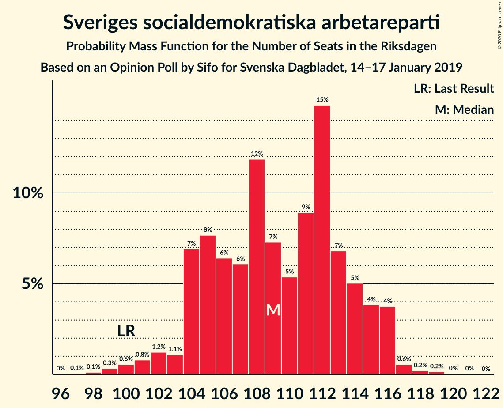
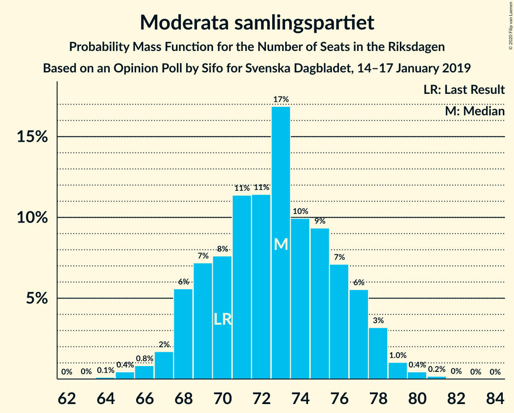
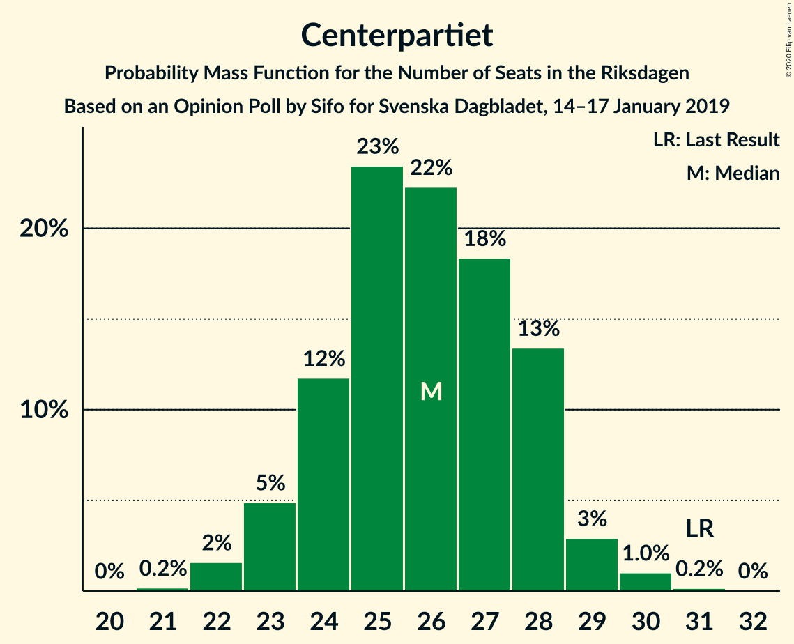
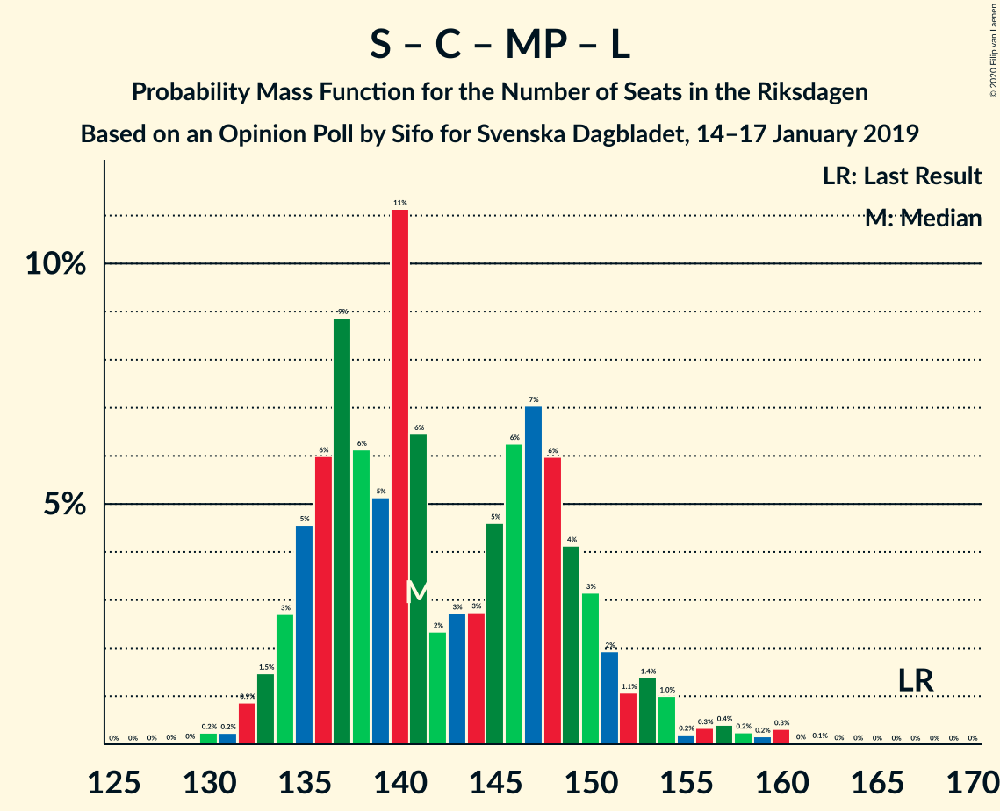
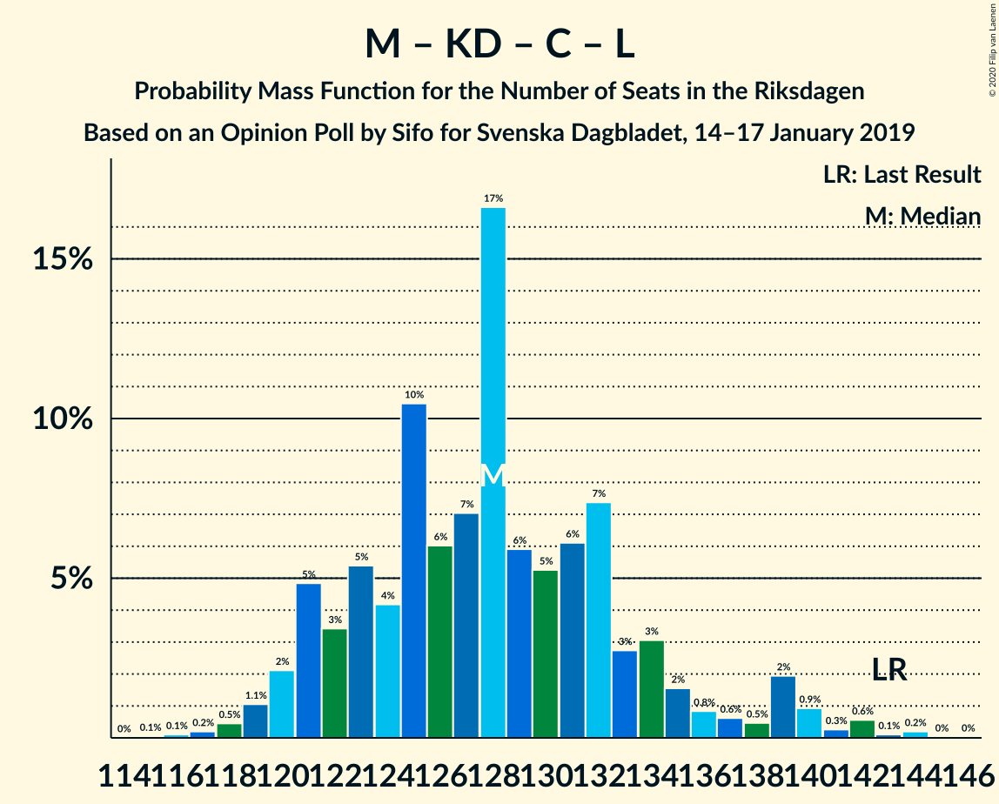

# Opinion Poll by Sifo for Svenska Dagbladet, 14–17 January 2019

<a href="#voting-intentions">Voting Intentions</a> | <a href="#seats">Seats</a> | <a href="#coalitions">Coalitions</a> | <a href="#technical-information">Technical Information</a>

## Voting Intentions

### Confidence Intervals

| Party | Last Result | Poll Result | 80% Confidence Interval | 90% Confidence Interval | 95% Confidence Interval | 99% Confidence Interval |
|:-----:|:-----------:|:-----------:|:-----------------------:|:-----------------------:|:-----------------------:|:-----------------------:|
| Sveriges socialdemokratiska arbetareparti | 28.3% | 29.3% | 28.4–30.2% |28.2–30.4% |27.9–30.7% |27.5–31.1% |
| Sverigedemokraterna | 17.5% | 19.9% | 19.1–20.7% |18.9–20.9% |18.7–21.1% |18.4–21.5% |
| Moderata samlingspartiet | 19.8% | 19.5% | 18.7–20.3% |18.5–20.5% |18.3–20.7% |18.0–21.1% |
| Vänsterpartiet | 8.0% | 8.5% | 8.0–9.1% |7.8–9.2% |7.7–9.4% |7.5–9.7% |
| Kristdemokraterna | 6.3% | 7.5% | 7.0–8.0% |6.8–8.2% |6.7–8.3% |6.5–8.6% |
| Centerpartiet | 8.6% | 6.9% | 6.4–7.4% |6.3–7.6% |6.2–7.7% |6.0–8.0% |
| Miljöpartiet de gröna | 4.4% | 3.9% | 3.5–4.3% |3.4–4.4% |3.4–4.5% |3.2–4.7% |
| Liberalerna | 5.5% | 3.6% | 3.2–4.0% |3.2–4.1% |3.1–4.2% |2.9–4.4% |

*Note:* The poll result column reflects the actual value used in the calculations. Published results may vary slightly, and in addition be rounded to fewer digits.

## Seats

### Confidence Intervals

| Party | Last Result | Median | 80% Confidence Interval | 90% Confidence Interval | 95% Confidence Interval | 99% Confidence Interval |
|:-----:|:-----------:|:------:|:-----------------------:|:-----------------------:|:-----------------------:|:-----------------------:|
| <a href="#sveriges-socialdemokratiska-arbetareparti">Sveriges socialdemokratiska arbetareparti</a> | 100 | 109 | 104–114 |104–115 |102–116 |99–117 |
| <a href="#sverigedemokraterna">Sverigedemokraterna</a> | 62 | 75 | 71–77 |70–80 |68–80 |67–81 |
| <a href="#moderata-samlingspartiet">Moderata samlingspartiet</a> | 70 | 73 | 69–77 |68–77 |67–78 |65–80 |
| <a href="#vänsterpartiet">Vänsterpartiet</a> | 28 | 32 | 29–34 |29–35 |28–35 |28–36 |
| <a href="#kristdemokraterna">Kristdemokraterna</a> | 22 | 28 | 26–30 |25–31 |25–31 |24–32 |
| <a href="#centerpartiet">Centerpartiet</a> | 31 | 26 | 24–28 |23–28 |23–29 |22–30 |
| <a href="#miljöpartiet-de-gröna">Miljöpartiet de gröna</a> | 16 | 0 | 0–16 |0–16 |0–17 |0–17 |
| <a href="#liberalerna">Liberalerna</a> | 20 | 0 | 0 |0–15 |0–15 |0–16 |

### Sveriges socialdemokratiska arbetareparti

*For a full overview of the results for this party, see the [Sveriges socialdemokratiska arbetareparti](party-sverigessocialdemokratiskaarbetareparti.html) page.*

| Number of Seats | Probability | Accumulated | Special Marks |
|:---------------:|:-----------:|:-----------:|:-------------:|
| 97 | 0.1% | 100% |  |
| 98 | 0.1% | 99.9% |  |
| 99 | 0.3% | 99.8% |  |
| 100 | 0.6% | 99.4% | Last Result |
| 101 | 0.8% | 98.9% |  |
| 102 | 1.2% | 98% |  |
| 103 | 1.1% | 97% |  |
| 104 | 7% | 96% |  |
| 105 | 8% | 89% |  |
| 106 | 6% | 81% |  |
| 107 | 6% | 75% |  |
| 108 | 12% | 69% |  |
| 109 | 7% | 57% | Median |
| 110 | 5% | 50% |  |
| 111 | 9% | 44% |  |
| 112 | 15% | 35% |  |
| 113 | 7% | 20% |  |
| 114 | 5% | 14% |  |
| 115 | 4% | 9% |  |
| 116 | 4% | 5% |  |
| 117 | 0.6% | 1.0% |  |
| 118 | 0.2% | 0.4% |  |
| 119 | 0.2% | 0.2% |  |
| 120 | 0% | 0.1% |  |
| 121 | 0% | 0% |  |

### Sverigedemokraterna

*For a full overview of the results for this party, see the [Sverigedemokraterna](party-sverigedemokraterna.html) page.*

| Number of Seats | Probability | Accumulated | Special Marks |
|:---------------:|:-----------:|:-----------:|:-------------:|
| 62 | 0% | 100% | Last Result |
| 63 | 0% | 100% |  |
| 64 | 0% | 100% |  |
| 65 | 0% | 100% |  |
| 66 | 0.3% | 100% |  |
| 67 | 0.9% | 99.7% |  |
| 68 | 1.4% | 98.8% |  |
| 69 | 1.2% | 97% |  |
| 70 | 4% | 96% |  |
| 71 | 11% | 92% |  |
| 72 | 12% | 81% |  |
| 73 | 6% | 69% |  |
| 74 | 5% | 63% |  |
| 75 | 21% | 58% | Median |
| 76 | 23% | 37% |  |
| 77 | 6% | 14% |  |
| 78 | 1.1% | 9% |  |
| 79 | 3% | 8% |  |
| 80 | 3% | 5% |  |
| 81 | 2% | 2% |  |
| 82 | 0.1% | 0.1% |  |
| 83 | 0% | 0.1% |  |
| 84 | 0% | 0% |  |

### Moderata samlingspartiet

*For a full overview of the results for this party, see the [Moderata samlingspartiet](party-moderatasamlingspartiet.html) page.*

| Number of Seats | Probability | Accumulated | Special Marks |
|:---------------:|:-----------:|:-----------:|:-------------:|
| 64 | 0.1% | 100% |  |
| 65 | 0.4% | 99.9% |  |
| 66 | 0.8% | 99.4% |  |
| 67 | 2% | 98.6% |  |
| 68 | 6% | 97% |  |
| 69 | 7% | 91% |  |
| 70 | 8% | 84% | Last Result |
| 71 | 11% | 76% |  |
| 72 | 11% | 65% |  |
| 73 | 17% | 54% | Median |
| 74 | 10% | 37% |  |
| 75 | 9% | 27% |  |
| 76 | 7% | 18% |  |
| 77 | 6% | 10% |  |
| 78 | 3% | 5% |  |
| 79 | 1.0% | 2% |  |
| 80 | 0.4% | 0.7% |  |
| 81 | 0.2% | 0.2% |  |
| 82 | 0% | 0.1% |  |
| 83 | 0% | 0% |  |

### Vänsterpartiet

*For a full overview of the results for this party, see the [Vänsterpartiet](party-vänsterpartiet.html) page.*

| Number of Seats | Probability | Accumulated | Special Marks |
|:---------------:|:-----------:|:-----------:|:-------------:|
| 26 | 0.1% | 100% |  |
| 27 | 0.4% | 99.9% |  |
| 28 | 3% | 99.6% | Last Result |
| 29 | 8% | 97% |  |
| 30 | 12% | 89% |  |
| 31 | 21% | 77% |  |
| 32 | 24% | 56% | Median |
| 33 | 14% | 33% |  |
| 34 | 14% | 19% |  |
| 35 | 3% | 6% |  |
| 36 | 2% | 2% |  |
| 37 | 0.4% | 0.4% |  |
| 38 | 0% | 0% |  |

### Kristdemokraterna

*For a full overview of the results for this party, see the [Kristdemokraterna](party-kristdemokraterna.html) page.*

| Number of Seats | Probability | Accumulated | Special Marks |
|:---------------:|:-----------:|:-----------:|:-------------:|
| 22 | 0% | 100% | Last Result |
| 23 | 0.2% | 100% |  |
| 24 | 1.4% | 99.8% |  |
| 25 | 4% | 98% |  |
| 26 | 14% | 94% |  |
| 27 | 21% | 81% |  |
| 28 | 22% | 60% | Median |
| 29 | 17% | 38% |  |
| 30 | 14% | 20% |  |
| 31 | 5% | 7% |  |
| 32 | 2% | 2% |  |
| 33 | 0.3% | 0.4% |  |
| 34 | 0.1% | 0.1% |  |
| 35 | 0% | 0% |  |

### Centerpartiet

*For a full overview of the results for this party, see the [Centerpartiet](party-centerpartiet.html) page.*

| Number of Seats | Probability | Accumulated | Special Marks |
|:---------------:|:-----------:|:-----------:|:-------------:|
| 21 | 0.2% | 100% |  |
| 22 | 2% | 99.8% |  |
| 23 | 5% | 98% |  |
| 24 | 12% | 93% |  |
| 25 | 23% | 82% |  |
| 26 | 22% | 58% | Median |
| 27 | 18% | 36% |  |
| 28 | 13% | 18% |  |
| 29 | 3% | 4% |  |
| 30 | 1.0% | 1.2% |  |
| 31 | 0.2% | 0.2% | Last Result |
| 32 | 0% | 0% |  |

### Miljöpartiet de gröna

*For a full overview of the results for this party, see the [Miljöpartiet de gröna](party-miljöpartietdegröna.html) page.*

| Number of Seats | Probability | Accumulated | Special Marks |
|:---------------:|:-----------:|:-----------:|:-------------:|
| 0 | 63% | 100% | Median |
| 1 | 0% | 37% |  |
| 2 | 0% | 37% |  |
| 3 | 0% | 37% |  |
| 4 | 0% | 37% |  |
| 5 | 0% | 37% |  |
| 6 | 0% | 37% |  |
| 7 | 0% | 37% |  |
| 8 | 0% | 37% |  |
| 9 | 0% | 37% |  |
| 10 | 0% | 37% |  |
| 11 | 0% | 37% |  |
| 12 | 0% | 37% |  |
| 13 | 0% | 37% |  |
| 14 | 1.0% | 37% |  |
| 15 | 23% | 36% |  |
| 16 | 10% | 12% | Last Result |
| 17 | 3% | 3% |  |
| 18 | 0.3% | 0.3% |  |
| 19 | 0% | 0% |  |

### Liberalerna

*For a full overview of the results for this party, see the [Liberalerna](party-liberalerna.html) page.*

| Number of Seats | Probability | Accumulated | Special Marks |
|:---------------:|:-----------:|:-----------:|:-------------:|
| 0 | 91% | 100% | Median |
| 1 | 0% | 9% |  |
| 2 | 0% | 9% |  |
| 3 | 0% | 9% |  |
| 4 | 0% | 9% |  |
| 5 | 0% | 9% |  |
| 6 | 0% | 9% |  |
| 7 | 0% | 9% |  |
| 8 | 0% | 9% |  |
| 9 | 0% | 9% |  |
| 10 | 0% | 9% |  |
| 11 | 0% | 9% |  |
| 12 | 0% | 9% |  |
| 13 | 0% | 9% |  |
| 14 | 1.2% | 9% |  |
| 15 | 6% | 8% |  |
| 16 | 1.1% | 1.3% |  |
| 17 | 0.2% | 0.2% |  |
| 18 | 0% | 0% |  |
| 19 | 0% | 0% |  |
| 20 | 0% | 0% | Last Result |

## Coalitions

### Confidence Intervals

| Coalition | Last Result | Median | Majority? | 80% Confidence Interval | 90% Confidence Interval | 95% Confidence Interval | 99% Confidence Interval |
|:---------:|:-----------:|:------:|:---------:|:-----------------------:|:-----------------------:|:-----------------------:|:-----------------------:|
| Sveriges socialdemokratiska arbetareparti – Moderata samlingspartiet – Centerpartiet | 201 | 209 | 100% | 200–215 | 199–216 | 197–217 | 192–218 |
| Sveriges socialdemokratiska arbetareparti – Moderata samlingspartiet | 170 | 183 | 91% | 175–189 | 173–190 | 172–191 | 167–192 |
| Sveriges socialdemokratiska arbetareparti – Vänsterpartiet – Centerpartiet – Miljöpartiet de gröna – Liberalerna | 195 | 173 | 44% | 167–181 | 166–182 | 166–184 | 164–188 |
| Sverigedemokraterna – Moderata samlingspartiet – Kristdemokraterna | 154 | 176 | 56% | 168–182 | 167–183 | 165–183 | 161–185 |
| Sveriges socialdemokratiska arbetareparti – Vänsterpartiet – Miljöpartiet de gröna | 144 | 146 | 0% | 140–154 | 138–156 | 137–157 | 134–159 |
| Sverigedemokraterna – Moderata samlingspartiet | 132 | 147 | 0% | 141–153 | 139–154 | 138–154 | 135–157 |
| Sveriges socialdemokratiska arbetareparti – Centerpartiet – Miljöpartiet de gröna – Liberalerna | 167 | 141 | 0% | 135–150 | 134–152 | 133–154 | 131–159 |
| Sveriges socialdemokratiska arbetareparti – Vänsterpartiet | 128 | 142 | 0% | 135–147 | 134–148 | 133–149 | 130–151 |
| Moderata samlingspartiet – Kristdemokraterna – Centerpartiet – Liberalerna | 143 | 128 | 0% | 122–134 | 121–137 | 120–139 | 118–142 |
| Moderata samlingspartiet – Kristdemokraterna – Centerpartiet | 123 | 127 | 0% | 121–132 | 120–133 | 118–134 | 115–135 |
| Sveriges socialdemokratiska arbetareparti – Miljöpartiet de gröna | 116 | 113 | 0% | 108–123 | 107–124 | 106–126 | 103–128 |
| Moderata samlingspartiet – Centerpartiet – Liberalerna | 121 | 99 | 0% | 95–105 | 93–110 | 93–112 | 91–115 |
| Moderata samlingspartiet – Centerpartiet | 101 | 99 | 0% | 94–103 | 93–104 | 92–105 | 90–106 |

### Sveriges socialdemokratiska arbetareparti – Moderata samlingspartiet – Centerpartiet

| Number of Seats | Probability | Accumulated | Special Marks |
|:---------------:|:-----------:|:-----------:|:-------------:|
| 189 | 0.1% | 100% |  |
| 190 | 0.1% | 99.9% |  |
| 191 | 0.1% | 99.8% |  |
| 192 | 0.3% | 99.7% |  |
| 193 | 0.7% | 99.4% |  |
| 194 | 0.6% | 98.7% |  |
| 195 | 0.3% | 98% |  |
| 196 | 0.2% | 98% |  |
| 197 | 0.9% | 98% |  |
| 198 | 1.1% | 97% |  |
| 199 | 4% | 96% |  |
| 200 | 3% | 92% |  |
| 201 | 7% | 89% | Last Result |
| 202 | 5% | 82% |  |
| 203 | 4% | 77% |  |
| 204 | 4% | 73% |  |
| 205 | 6% | 69% |  |
| 206 | 4% | 63% |  |
| 207 | 3% | 60% |  |
| 208 | 3% | 56% | Median |
| 209 | 4% | 53% |  |
| 210 | 6% | 49% |  |
| 211 | 10% | 43% |  |
| 212 | 7% | 33% |  |
| 213 | 8% | 26% |  |
| 214 | 6% | 17% |  |
| 215 | 4% | 12% |  |
| 216 | 5% | 8% |  |
| 217 | 2% | 3% |  |
| 218 | 0.8% | 1.1% |  |
| 219 | 0.1% | 0.3% |  |
| 220 | 0.1% | 0.2% |  |
| 221 | 0.1% | 0.1% |  |
| 222 | 0% | 0% |  |

### Sveriges socialdemokratiska arbetareparti – Moderata samlingspartiet

| Number of Seats | Probability | Accumulated | Special Marks |
|:---------------:|:-----------:|:-----------:|:-------------:|
| 165 | 0.1% | 100% |  |
| 166 | 0.3% | 99.9% |  |
| 167 | 0.4% | 99.6% |  |
| 168 | 0.2% | 99.3% |  |
| 169 | 0.3% | 99.1% |  |
| 170 | 0.3% | 98.7% | Last Result |
| 171 | 0.7% | 98% |  |
| 172 | 1.2% | 98% |  |
| 173 | 3% | 97% |  |
| 174 | 3% | 94% |  |
| 175 | 4% | 91% | Majority |
| 176 | 4% | 86% |  |
| 177 | 5% | 82% |  |
| 178 | 7% | 77% |  |
| 179 | 4% | 70% |  |
| 180 | 5% | 66% |  |
| 181 | 5% | 61% |  |
| 182 | 5% | 56% | Median |
| 183 | 2% | 51% |  |
| 184 | 6% | 48% |  |
| 185 | 13% | 42% |  |
| 186 | 8% | 29% |  |
| 187 | 5% | 20% |  |
| 188 | 4% | 15% |  |
| 189 | 3% | 12% |  |
| 190 | 5% | 8% |  |
| 191 | 2% | 3% |  |
| 192 | 0.3% | 0.6% |  |
| 193 | 0.1% | 0.4% |  |
| 194 | 0.2% | 0.2% |  |
| 195 | 0% | 0.1% |  |
| 196 | 0% | 0% |  |

### Sveriges socialdemokratiska arbetareparti – Vänsterpartiet – Centerpartiet – Miljöpartiet de gröna – Liberalerna

| Number of Seats | Probability | Accumulated | Special Marks |
|:---------------:|:-----------:|:-----------:|:-------------:|
| 161 | 0.1% | 100% |  |
| 162 | 0% | 99.9% |  |
| 163 | 0.1% | 99.9% |  |
| 164 | 0.7% | 99.8% |  |
| 165 | 2% | 99.1% |  |
| 166 | 3% | 98% |  |
| 167 | 5% | 95% | Median |
| 168 | 5% | 90% |  |
| 169 | 3% | 85% |  |
| 170 | 8% | 82% |  |
| 171 | 8% | 74% |  |
| 172 | 8% | 66% |  |
| 173 | 11% | 58% |  |
| 174 | 3% | 47% |  |
| 175 | 5% | 44% | Majority |
| 176 | 7% | 39% |  |
| 177 | 5% | 32% |  |
| 178 | 7% | 27% |  |
| 179 | 5% | 20% |  |
| 180 | 3% | 15% |  |
| 181 | 3% | 11% |  |
| 182 | 4% | 8% |  |
| 183 | 1.4% | 5% |  |
| 184 | 1.2% | 3% |  |
| 185 | 0.7% | 2% |  |
| 186 | 0.3% | 2% |  |
| 187 | 0.6% | 1.3% |  |
| 188 | 0.5% | 0.8% |  |
| 189 | 0.1% | 0.2% |  |
| 190 | 0% | 0.1% |  |
| 191 | 0% | 0.1% |  |
| 192 | 0% | 0.1% |  |
| 193 | 0% | 0% |  |
| 194 | 0% | 0% |  |
| 195 | 0% | 0% | Last Result |

### Sverigedemokraterna – Moderata samlingspartiet – Kristdemokraterna

| Number of Seats | Probability | Accumulated | Special Marks |
|:---------------:|:-----------:|:-----------:|:-------------:|
| 154 | 0% | 100% | Last Result |
| 155 | 0% | 100% |  |
| 156 | 0% | 100% |  |
| 157 | 0% | 100% |  |
| 158 | 0% | 99.9% |  |
| 159 | 0% | 99.9% |  |
| 160 | 0.1% | 99.9% |  |
| 161 | 0.5% | 99.8% |  |
| 162 | 0.6% | 99.2% |  |
| 163 | 0.3% | 98.7% |  |
| 164 | 0.7% | 98% |  |
| 165 | 1.2% | 98% |  |
| 166 | 1.4% | 97% |  |
| 167 | 4% | 95% |  |
| 168 | 3% | 92% |  |
| 169 | 3% | 89% |  |
| 170 | 5% | 85% |  |
| 171 | 7% | 80% |  |
| 172 | 5% | 73% |  |
| 173 | 7% | 68% |  |
| 174 | 5% | 61% |  |
| 175 | 3% | 56% | Majority |
| 176 | 11% | 53% | Median |
| 177 | 8% | 42% |  |
| 178 | 8% | 34% |  |
| 179 | 8% | 26% |  |
| 180 | 3% | 18% |  |
| 181 | 5% | 15% |  |
| 182 | 5% | 10% |  |
| 183 | 3% | 5% |  |
| 184 | 2% | 2% |  |
| 185 | 0.7% | 0.9% |  |
| 186 | 0.1% | 0.2% |  |
| 187 | 0% | 0.1% |  |
| 188 | 0.1% | 0.1% |  |
| 189 | 0% | 0% |  |

### Sveriges socialdemokratiska arbetareparti – Vänsterpartiet – Miljöpartiet de gröna

| Number of Seats | Probability | Accumulated | Special Marks |
|:---------------:|:-----------:|:-----------:|:-------------:|
| 132 | 0% | 100% |  |
| 133 | 0.1% | 99.9% |  |
| 134 | 0.4% | 99.8% |  |
| 135 | 0.7% | 99.4% |  |
| 136 | 0.5% | 98.7% |  |
| 137 | 2% | 98% |  |
| 138 | 2% | 97% |  |
| 139 | 2% | 95% |  |
| 140 | 4% | 93% |  |
| 141 | 4% | 89% | Median |
| 142 | 7% | 84% |  |
| 143 | 5% | 77% |  |
| 144 | 6% | 72% | Last Result |
| 145 | 12% | 66% |  |
| 146 | 8% | 54% |  |
| 147 | 6% | 46% |  |
| 148 | 4% | 40% |  |
| 149 | 4% | 36% |  |
| 150 | 4% | 32% |  |
| 151 | 2% | 28% |  |
| 152 | 8% | 26% |  |
| 153 | 5% | 17% |  |
| 154 | 3% | 12% |  |
| 155 | 3% | 9% |  |
| 156 | 2% | 6% |  |
| 157 | 2% | 3% |  |
| 158 | 0.6% | 1.2% |  |
| 159 | 0.3% | 0.6% |  |
| 160 | 0.2% | 0.3% |  |
| 161 | 0.1% | 0.1% |  |
| 162 | 0% | 0% |  |

### Sverigedemokraterna – Moderata samlingspartiet

| Number of Seats | Probability | Accumulated | Special Marks |
|:---------------:|:-----------:|:-----------:|:-------------:|
| 132 | 0.1% | 100% | Last Result |
| 133 | 0.1% | 99.9% |  |
| 134 | 0.2% | 99.8% |  |
| 135 | 0.4% | 99.6% |  |
| 136 | 0.5% | 99.2% |  |
| 137 | 0.7% | 98.7% |  |
| 138 | 1.1% | 98% |  |
| 139 | 2% | 97% |  |
| 140 | 3% | 95% |  |
| 141 | 4% | 92% |  |
| 142 | 5% | 88% |  |
| 143 | 5% | 82% |  |
| 144 | 8% | 78% |  |
| 145 | 7% | 70% |  |
| 146 | 7% | 63% |  |
| 147 | 6% | 56% |  |
| 148 | 11% | 49% | Median |
| 149 | 9% | 39% |  |
| 150 | 6% | 30% |  |
| 151 | 8% | 24% |  |
| 152 | 4% | 15% |  |
| 153 | 4% | 11% |  |
| 154 | 5% | 7% |  |
| 155 | 1.0% | 2% |  |
| 156 | 0.8% | 1.3% |  |
| 157 | 0.3% | 0.5% |  |
| 158 | 0.2% | 0.2% |  |
| 159 | 0% | 0.1% |  |
| 160 | 0% | 0% |  |

### Sveriges socialdemokratiska arbetareparti – Centerpartiet – Miljöpartiet de gröna – Liberalerna

| Number of Seats | Probability | Accumulated | Special Marks |
|:---------------:|:-----------:|:-----------:|:-------------:|
| 129 | 0% | 100% |  |
| 130 | 0.2% | 99.9% |  |
| 131 | 0.2% | 99.7% |  |
| 132 | 0.9% | 99.5% |  |
| 133 | 1.5% | 98.6% |  |
| 134 | 3% | 97% |  |
| 135 | 5% | 94% | Median |
| 136 | 6% | 90% |  |
| 137 | 9% | 84% |  |
| 138 | 6% | 75% |  |
| 139 | 5% | 69% |  |
| 140 | 11% | 64% |  |
| 141 | 6% | 53% |  |
| 142 | 2% | 46% |  |
| 143 | 3% | 44% |  |
| 144 | 3% | 41% |  |
| 145 | 5% | 38% |  |
| 146 | 6% | 34% |  |
| 147 | 7% | 27% |  |
| 148 | 6% | 20% |  |
| 149 | 4% | 14% |  |
| 150 | 3% | 10% |  |
| 151 | 2% | 7% |  |
| 152 | 1.1% | 5% |  |
| 153 | 1.4% | 4% |  |
| 154 | 1.0% | 3% |  |
| 155 | 0.2% | 2% |  |
| 156 | 0.3% | 2% |  |
| 157 | 0.4% | 1.2% |  |
| 158 | 0.2% | 0.8% |  |
| 159 | 0.2% | 0.6% |  |
| 160 | 0.3% | 0.4% |  |
| 161 | 0% | 0.1% |  |
| 162 | 0.1% | 0.1% |  |
| 163 | 0% | 0% |  |
| 164 | 0% | 0% |  |
| 165 | 0% | 0% |  |
| 166 | 0% | 0% |  |
| 167 | 0% | 0% | Last Result |

### Sveriges socialdemokratiska arbetareparti – Vänsterpartiet

| Number of Seats | Probability | Accumulated | Special Marks |
|:---------------:|:-----------:|:-----------:|:-------------:|
| 126 | 0.1% | 100% |  |
| 127 | 0.1% | 99.9% |  |
| 128 | 0.1% | 99.8% | Last Result |
| 129 | 0.1% | 99.7% |  |
| 130 | 0.5% | 99.5% |  |
| 131 | 0.6% | 99.1% |  |
| 132 | 0.8% | 98.5% |  |
| 133 | 2% | 98% |  |
| 134 | 3% | 95% |  |
| 135 | 4% | 93% |  |
| 136 | 6% | 88% |  |
| 137 | 7% | 82% |  |
| 138 | 6% | 75% |  |
| 139 | 5% | 69% |  |
| 140 | 7% | 64% |  |
| 141 | 6% | 57% | Median |
| 142 | 9% | 51% |  |
| 143 | 6% | 42% |  |
| 144 | 6% | 36% |  |
| 145 | 12% | 31% |  |
| 146 | 8% | 19% |  |
| 147 | 5% | 11% |  |
| 148 | 3% | 6% |  |
| 149 | 2% | 3% |  |
| 150 | 0.6% | 1.2% |  |
| 151 | 0.4% | 0.6% |  |
| 152 | 0.1% | 0.2% |  |
| 153 | 0.1% | 0.1% |  |
| 154 | 0% | 0% |  |

### Moderata samlingspartiet – Kristdemokraterna – Centerpartiet – Liberalerna

| Number of Seats | Probability | Accumulated | Special Marks |
|:---------------:|:-----------:|:-----------:|:-------------:|
| 115 | 0.1% | 100% |  |
| 116 | 0.1% | 99.9% |  |
| 117 | 0.2% | 99.8% |  |
| 118 | 0.5% | 99.6% |  |
| 119 | 1.1% | 99.2% |  |
| 120 | 2% | 98% |  |
| 121 | 5% | 96% |  |
| 122 | 3% | 91% |  |
| 123 | 5% | 88% |  |
| 124 | 4% | 82% |  |
| 125 | 10% | 78% |  |
| 126 | 6% | 68% |  |
| 127 | 7% | 62% | Median |
| 128 | 17% | 55% |  |
| 129 | 6% | 38% |  |
| 130 | 5% | 32% |  |
| 131 | 6% | 27% |  |
| 132 | 7% | 21% |  |
| 133 | 3% | 13% |  |
| 134 | 3% | 11% |  |
| 135 | 2% | 8% |  |
| 136 | 0.8% | 6% |  |
| 137 | 0.6% | 5% |  |
| 138 | 0.5% | 5% |  |
| 139 | 2% | 4% |  |
| 140 | 0.9% | 2% |  |
| 141 | 0.3% | 1.2% |  |
| 142 | 0.6% | 0.9% |  |
| 143 | 0.1% | 0.4% | Last Result |
| 144 | 0.2% | 0.3% |  |
| 145 | 0% | 0.1% |  |
| 146 | 0% | 0% |  |

### Moderata samlingspartiet – Kristdemokraterna – Centerpartiet

| Number of Seats | Probability | Accumulated | Special Marks |
|:---------------:|:-----------:|:-----------:|:-------------:|
| 113 | 0% | 100% |  |
| 114 | 0.1% | 99.9% |  |
| 115 | 0.6% | 99.8% |  |
| 116 | 0.6% | 99.2% |  |
| 117 | 0.5% | 98.7% |  |
| 118 | 0.8% | 98% |  |
| 119 | 2% | 97% |  |
| 120 | 3% | 96% |  |
| 121 | 5% | 93% |  |
| 122 | 4% | 87% |  |
| 123 | 6% | 83% | Last Result |
| 124 | 6% | 77% |  |
| 125 | 11% | 71% |  |
| 126 | 6% | 60% |  |
| 127 | 7% | 53% | Median |
| 128 | 17% | 46% |  |
| 129 | 6% | 29% |  |
| 130 | 5% | 24% |  |
| 131 | 6% | 19% |  |
| 132 | 7% | 13% |  |
| 133 | 3% | 6% |  |
| 134 | 2% | 3% |  |
| 135 | 0.5% | 1.0% |  |
| 136 | 0.3% | 0.5% |  |
| 137 | 0.1% | 0.2% |  |
| 138 | 0.1% | 0.1% |  |
| 139 | 0% | 0% |  |

### Sveriges socialdemokratiska arbetareparti – Miljöpartiet de gröna

| Number of Seats | Probability | Accumulated | Special Marks |
|:---------------:|:-----------:|:-----------:|:-------------:|
| 101 | 0.1% | 100% |  |
| 102 | 0.3% | 99.9% |  |
| 103 | 0.2% | 99.7% |  |
| 104 | 0.7% | 99.4% |  |
| 105 | 1.0% | 98.7% |  |
| 106 | 2% | 98% |  |
| 107 | 2% | 95% |  |
| 108 | 6% | 93% |  |
| 109 | 4% | 87% | Median |
| 110 | 5% | 83% |  |
| 111 | 8% | 79% |  |
| 112 | 14% | 71% |  |
| 113 | 7% | 56% |  |
| 114 | 5% | 50% |  |
| 115 | 4% | 44% |  |
| 116 | 4% | 40% | Last Result |
| 117 | 1.2% | 36% |  |
| 118 | 2% | 35% |  |
| 119 | 5% | 33% |  |
| 120 | 3% | 28% |  |
| 121 | 7% | 25% |  |
| 122 | 5% | 18% |  |
| 123 | 5% | 13% |  |
| 124 | 4% | 8% |  |
| 125 | 2% | 4% |  |
| 126 | 1.3% | 3% |  |
| 127 | 0.7% | 1.4% |  |
| 128 | 0.4% | 0.6% |  |
| 129 | 0.1% | 0.2% |  |
| 130 | 0.1% | 0.1% |  |
| 131 | 0% | 0% |  |

### Moderata samlingspartiet – Centerpartiet – Liberalerna

| Number of Seats | Probability | Accumulated | Special Marks |
|:---------------:|:-----------:|:-----------:|:-------------:|
| 89 | 0.1% | 100% |  |
| 90 | 0.1% | 99.9% |  |
| 91 | 0.5% | 99.7% |  |
| 92 | 0.9% | 99.2% |  |
| 93 | 4% | 98% |  |
| 94 | 3% | 94% |  |
| 95 | 8% | 91% |  |
| 96 | 7% | 84% |  |
| 97 | 7% | 77% |  |
| 98 | 7% | 70% |  |
| 99 | 14% | 64% | Median |
| 100 | 9% | 49% |  |
| 101 | 11% | 40% |  |
| 102 | 5% | 29% |  |
| 103 | 10% | 24% |  |
| 104 | 3% | 14% |  |
| 105 | 2% | 11% |  |
| 106 | 1.2% | 9% |  |
| 107 | 0.6% | 8% |  |
| 108 | 1.4% | 7% |  |
| 109 | 0.6% | 6% |  |
| 110 | 2% | 5% |  |
| 111 | 0.5% | 3% |  |
| 112 | 0.5% | 3% |  |
| 113 | 0.7% | 2% |  |
| 114 | 0.7% | 1.4% |  |
| 115 | 0.3% | 0.7% |  |
| 116 | 0.3% | 0.4% |  |
| 117 | 0% | 0.1% |  |
| 118 | 0% | 0% |  |
| 119 | 0% | 0% |  |
| 120 | 0% | 0% |  |
| 121 | 0% | 0% | Last Result |

### Moderata samlingspartiet – Centerpartiet

| Number of Seats | Probability | Accumulated | Special Marks |
|:---------------:|:-----------:|:-----------:|:-------------:|
| 87 | 0% | 100% |  |
| 88 | 0.2% | 99.9% |  |
| 89 | 0.2% | 99.7% |  |
| 90 | 1.0% | 99.6% |  |
| 91 | 1.0% | 98.5% |  |
| 92 | 1.2% | 98% |  |
| 93 | 5% | 96% |  |
| 94 | 4% | 91% |  |
| 95 | 10% | 87% |  |
| 96 | 7% | 78% |  |
| 97 | 7% | 70% |  |
| 98 | 7% | 63% |  |
| 99 | 15% | 56% | Median |
| 100 | 10% | 41% |  |
| 101 | 11% | 31% | Last Result |
| 102 | 5% | 20% |  |
| 103 | 10% | 15% |  |
| 104 | 3% | 5% |  |
| 105 | 1.2% | 3% |  |
| 106 | 1.0% | 1.4% |  |
| 107 | 0.3% | 0.5% |  |
| 108 | 0.1% | 0.2% |  |
| 109 | 0% | 0.1% |  |
| 110 | 0% | 0% |  |

## Technical Information

### Opinion Poll

+ **Polling firm:** Sifo
+ **Commissioner(s):** Svenska Dagbladet
+ **Fieldwork period:** 14–17 January 2019

### Calculations

+ **Sample size:** 4317
+ **Simulations done:** 1,048,576
+ **Error estimate:** 0.58%

