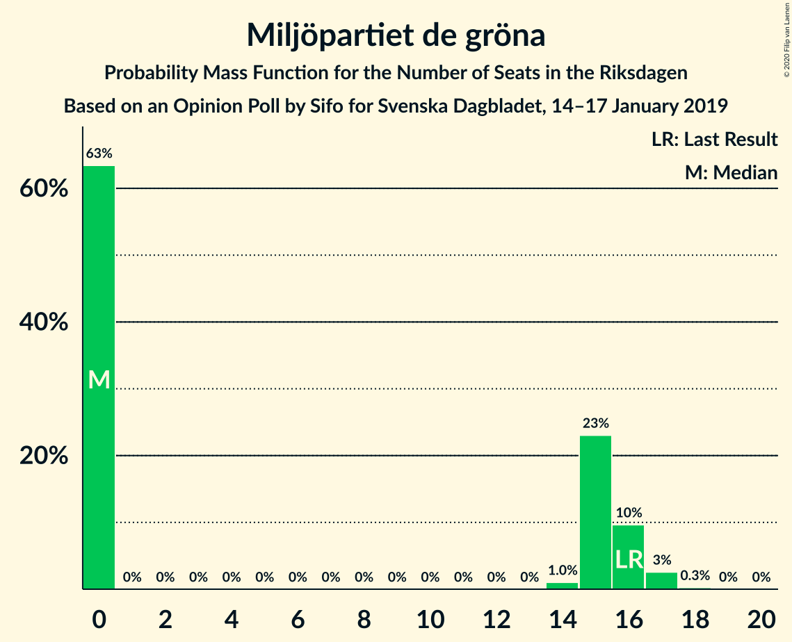
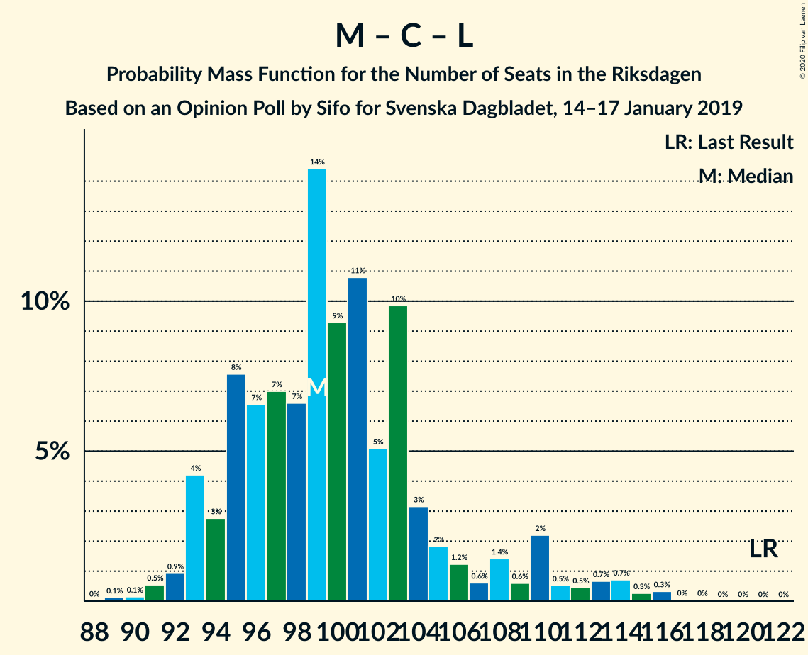

# Opinion Poll by Sifo for Svenska Dagbladet, 14–17 January 2019

<a href="#voting-intentions">Voting Intentions</a> | <a href="#seats">Seats</a> | <a href="#coalitions">Coalitions</a> | <a href="#technical-information">Technical Information</a>

## Voting Intentions

### Confidence Intervals

| Party | Last Result | Poll Result | 80% Confidence Interval | 90% Confidence Interval | 95% Confidence Interval | 99% Confidence Interval |
|:-----:|:-----------:|:-----------:|:-----------------------:|:-----------------------:|:-----------------------:|:-----------------------:|
| Sveriges socialdemokratiska arbetareparti | 28.3% | 29.3% | 28.4–30.2% |28.2–30.4% |27.9–30.7% |27.5–31.1% |
| Sverigedemokraterna | 17.5% | 19.9% | 19.1–20.7% |18.9–20.9% |18.7–21.1% |18.4–21.5% |
| Moderata samlingspartiet | 19.8% | 19.5% | 18.7–20.3% |18.5–20.5% |18.3–20.7% |18.0–21.1% |
| Vänsterpartiet | 8.0% | 8.5% | 8.0–9.1% |7.8–9.2% |7.7–9.4% |7.5–9.7% |
| Kristdemokraterna | 6.3% | 7.5% | 7.0–8.0% |6.8–8.2% |6.7–8.3% |6.5–8.6% |
| Centerpartiet | 8.6% | 6.9% | 6.4–7.4% |6.3–7.6% |6.2–7.7% |6.0–8.0% |
| Miljöpartiet de gröna | 4.4% | 3.9% | 3.5–4.3% |3.4–4.4% |3.4–4.5% |3.2–4.7% |
| Liberalerna | 5.5% | 3.6% | 3.2–4.0% |3.2–4.1% |3.1–4.2% |2.9–4.4% |

*Note:* The poll result column reflects the actual value used in the calculations. Published results may vary slightly, and in addition be rounded to fewer digits.

## Seats

### Confidence Intervals

| Party | Last Result | Median | 80% Confidence Interval | 90% Confidence Interval | 95% Confidence Interval | 99% Confidence Interval |
|:-----:|:-----------:|:------:|:-----------------------:|:-----------------------:|:-----------------------:|:-----------------------:|
| <a href="#sveriges-socialdemokratiska-arbetareparti">Sveriges socialdemokratiska arbetareparti</a> | 100 | 109 | 109 |102–109 |102–115 |99–115 |
| <a href="#sverigedemokraterna">Sverigedemokraterna</a> | 62 | 76 | 74–76 |72–76 |72–76 |70–76 |
| <a href="#moderata-samlingspartiet">Moderata samlingspartiet</a> | 70 | 76 | 74–76 |74–76 |72–76 |68–76 |
| <a href="#vänsterpartiet">Vänsterpartiet</a> | 28 | 33 | 32–33 |30–33 |30–33 |30–33 |
| <a href="#kristdemokraterna">Kristdemokraterna</a> | 22 | 29 | 29 |29 |29–30 |25–30 |
| <a href="#centerpartiet">Centerpartiet</a> | 31 | 26 | 26 |26 |26 |26–27 |
| <a href="#miljöpartiet-de-gröna">Miljöpartiet de gröna</a> | 16 | 0 | 0 |0–16 |0–16 |0–16 |
| <a href="#liberalerna">Liberalerna</a> | 20 | 0 | 0 |0 |0 |0–16 |

### Sveriges socialdemokratiska arbetareparti

*For a full overview of the results for this party, see the [Sveriges socialdemokratiska arbetareparti](party-sverigessocialdemokratiskaarbetareparti.html) page.*

| Number of Seats | Probability | Accumulated | Special Marks |
|:---------------:|:-----------:|:-----------:|:-------------:|
| 99 | 1.2% | 100% |  |
| 100 | 0% | 98.7% | Last Result |
| 101 | 0% | 98.7% |  |
| 102 | 5% | 98.7% |  |
| 103 | 0.3% | 93% |  |
| 104 | 0.2% | 93% |  |
| 105 | 0% | 93% |  |
| 106 | 0% | 93% |  |
| 107 | 0.3% | 93% |  |
| 108 | 0% | 93% |  |
| 109 | 89% | 93% | Median |
| 110 | 0% | 3% |  |
| 111 | 0% | 3% |  |
| 112 | 0% | 3% |  |
| 113 | 0% | 3% |  |
| 114 | 0% | 3% |  |
| 115 | 3% | 3% |  |
| 116 | 0% | 0% |  |

### Sverigedemokraterna

*For a full overview of the results for this party, see the [Sverigedemokraterna](party-sverigedemokraterna.html) page.*

| Number of Seats | Probability | Accumulated | Special Marks |
|:---------------:|:-----------:|:-----------:|:-------------:|
| 62 | 0% | 100% | Last Result |
| 63 | 0% | 100% |  |
| 64 | 0% | 100% |  |
| 65 | 0% | 100% |  |
| 66 | 0% | 100% |  |
| 67 | 0% | 100% |  |
| 68 | 0.2% | 100% |  |
| 69 | 0% | 99.8% |  |
| 70 | 1.5% | 99.8% |  |
| 71 | 0% | 98% |  |
| 72 | 5% | 98% |  |
| 73 | 0.1% | 93% |  |
| 74 | 3% | 93% |  |
| 75 | 0% | 90% |  |
| 76 | 89% | 90% | Median |
| 77 | 0% | 0.3% |  |
| 78 | 0.3% | 0.3% |  |
| 79 | 0% | 0% |  |

### Moderata samlingspartiet

*For a full overview of the results for this party, see the [Moderata samlingspartiet](party-moderatasamlingspartiet.html) page.*

| Number of Seats | Probability | Accumulated | Special Marks |
|:---------------:|:-----------:|:-----------:|:-------------:|
| 64 | 0.2% | 100% |  |
| 65 | 0% | 99.8% |  |
| 66 | 0% | 99.8% |  |
| 67 | 0% | 99.8% |  |
| 68 | 1.2% | 99.8% |  |
| 69 | 0% | 98.6% |  |
| 70 | 0.3% | 98.6% | Last Result |
| 71 | 0% | 98% |  |
| 72 | 3% | 98% |  |
| 73 | 0% | 95% |  |
| 74 | 5% | 95% |  |
| 75 | 0% | 90% |  |
| 76 | 89% | 90% | Median |
| 77 | 0% | 0.3% |  |
| 78 | 0% | 0.3% |  |
| 79 | 0% | 0.3% |  |
| 80 | 0% | 0.3% |  |
| 81 | 0.3% | 0.3% |  |
| 82 | 0% | 0% |  |

### Vänsterpartiet

*For a full overview of the results for this party, see the [Vänsterpartiet](party-vänsterpartiet.html) page.*

| Number of Seats | Probability | Accumulated | Special Marks |
|:---------------:|:-----------:|:-----------:|:-------------:|
| 28 | 0% | 100% | Last Result |
| 29 | 0% | 100% |  |
| 30 | 7% | 100% |  |
| 31 | 0% | 93% |  |
| 32 | 3% | 93% |  |
| 33 | 90% | 90% | Median |
| 34 | 0% | 0% |  |

### Kristdemokraterna

*For a full overview of the results for this party, see the [Kristdemokraterna](party-kristdemokraterna.html) page.*

| Number of Seats | Probability | Accumulated | Special Marks |
|:---------------:|:-----------:|:-----------:|:-------------:|
| 22 | 0% | 100% | Last Result |
| 23 | 0% | 100% |  |
| 24 | 0% | 100% |  |
| 25 | 1.5% | 100% |  |
| 26 | 0% | 98.5% |  |
| 27 | 0% | 98% |  |
| 28 | 0% | 98% |  |
| 29 | 95% | 98% | Median |
| 30 | 3% | 3% |  |
| 31 | 0% | 0% |  |

### Centerpartiet

*For a full overview of the results for this party, see the [Centerpartiet](party-centerpartiet.html) page.*

| Number of Seats | Probability | Accumulated | Special Marks |
|:---------------:|:-----------:|:-----------:|:-------------:|
| 24 | 0% | 100% |  |
| 25 | 0.3% | 99.9% |  |
| 26 | 98% | 99.7% | Median |
| 27 | 2% | 2% |  |
| 28 | 0.2% | 0.2% |  |
| 29 | 0% | 0% |  |
| 30 | 0% | 0% |  |
| 31 | 0% | 0% | Last Result |

### Miljöpartiet de gröna

*For a full overview of the results for this party, see the [Miljöpartiet de gröna](party-miljöpartietdegröna.html) page.*

| Number of Seats | Probability | Accumulated | Special Marks |
|:---------------:|:-----------:|:-----------:|:-------------:|
| 0 | 93% | 100% | Median |
| 1 | 0% | 7% |  |
| 2 | 0% | 7% |  |
| 3 | 0% | 7% |  |
| 4 | 0% | 7% |  |
| 5 | 0% | 7% |  |
| 6 | 0% | 7% |  |
| 7 | 0% | 7% |  |
| 8 | 0% | 7% |  |
| 9 | 0% | 7% |  |
| 10 | 0% | 7% |  |
| 11 | 0% | 7% |  |
| 12 | 0% | 7% |  |
| 13 | 0% | 7% |  |
| 14 | 1.2% | 7% |  |
| 15 | 0.2% | 6% |  |
| 16 | 6% | 6% | Last Result |
| 17 | 0% | 0% |  |

### Liberalerna

*For a full overview of the results for this party, see the [Liberalerna](party-liberalerna.html) page.*

| Number of Seats | Probability | Accumulated | Special Marks |
|:---------------:|:-----------:|:-----------:|:-------------:|
| 0 | 98.5% | 100% | Median |
| 1 | 0% | 1.5% |  |
| 2 | 0% | 1.5% |  |
| 3 | 0% | 1.5% |  |
| 4 | 0% | 1.5% |  |
| 5 | 0% | 1.5% |  |
| 6 | 0% | 1.5% |  |
| 7 | 0% | 1.5% |  |
| 8 | 0% | 1.5% |  |
| 9 | 0% | 1.5% |  |
| 10 | 0% | 1.5% |  |
| 11 | 0% | 1.5% |  |
| 12 | 0% | 1.5% |  |
| 13 | 0% | 1.5% |  |
| 14 | 0% | 1.5% |  |
| 15 | 0.2% | 1.5% |  |
| 16 | 1.2% | 1.3% |  |
| 17 | 0.1% | 0.1% |  |
| 18 | 0% | 0% |  |
| 19 | 0% | 0% |  |
| 20 | 0% | 0% | Last Result |

## Coalitions

### Confidence Intervals

| Coalition | Last Result | Median | Majority? | 80% Confidence Interval | 90% Confidence Interval | 95% Confidence Interval | 99% Confidence Interval |
|:---------:|:-----------:|:------:|:---------:|:-----------------------:|:-----------------------:|:-----------------------:|:-----------------------:|
| Sveriges socialdemokratiska arbetareparti – Moderata samlingspartiet – Centerpartiet | 201 | 211 | 100% | 211 | 202–211 | 202–213 | 194–213 |
| Sveriges socialdemokratiska arbetareparti – Moderata samlingspartiet | 170 | 185 | 98.5% | 185 | 176–185 | 176–187 | 167–187 |
| Sverigedemokraterna – Moderata samlingspartiet – Kristdemokraterna | 154 | 181 | 98% | 176–181 | 175–181 | 175–181 | 163–181 |
| Sveriges socialdemokratiska arbetareparti – Vänsterpartiet – Centerpartiet – Miljöpartiet de gröna – Liberalerna | 195 | 168 | 2% | 168–173 | 168–174 | 168–174 | 168–186 |
| Sverigedemokraterna – Moderata samlingspartiet | 132 | 152 | 0% | 146–152 | 146–152 | 146–152 | 138–152 |
| Sveriges socialdemokratiska arbetareparti – Vänsterpartiet – Miljöpartiet de gröna | 144 | 142 | 0% | 142–143 | 142–148 | 142–148 | 142–148 |
| Sveriges socialdemokratiska arbetareparti – Vänsterpartiet | 128 | 142 | 0% | 142 | 132–142 | 132–147 | 129–147 |
| Sveriges socialdemokratiska arbetareparti – Centerpartiet – Miljöpartiet de gröna – Liberalerna | 167 | 135 | 0% | 135–141 | 135–144 | 135–144 | 135–156 |
| Moderata samlingspartiet – Kristdemokraterna – Centerpartiet – Liberalerna | 143 | 131 | 0% | 131 | 129–131 | 128–131 | 128–136 |
| Moderata samlingspartiet – Kristdemokraterna – Centerpartiet | 123 | 131 | 0% | 129–131 | 129–131 | 128–131 | 120–131 |
| Sveriges socialdemokratiska arbetareparti – Miljöpartiet de gröna | 116 | 109 | 0% | 109–113 | 109–118 | 109–118 | 109–118 |
| Moderata samlingspartiet – Centerpartiet – Liberalerna | 121 | 102 | 0% | 102 | 100–102 | 98–102 | 98–111 |
| Moderata samlingspartiet – Centerpartiet | 101 | 102 | 0% | 100–102 | 100–102 | 98–102 | 95–102 |

### Sveriges socialdemokratiska arbetareparti – Moderata samlingspartiet – Centerpartiet

| Number of Seats | Probability | Accumulated | Special Marks |
|:---------------:|:-----------:|:-----------:|:-------------:|
| 194 | 1.2% | 100% |  |
| 195 | 0% | 98.8% |  |
| 196 | 0.2% | 98.8% |  |
| 197 | 0% | 98.6% |  |
| 198 | 0% | 98.6% |  |
| 199 | 0% | 98.6% |  |
| 200 | 0% | 98.6% |  |
| 201 | 0.1% | 98.6% | Last Result |
| 202 | 5% | 98% |  |
| 203 | 0% | 93% |  |
| 204 | 0.3% | 93% |  |
| 205 | 0% | 93% |  |
| 206 | 0% | 93% |  |
| 207 | 0% | 93% |  |
| 208 | 0% | 93% |  |
| 209 | 0.3% | 93% |  |
| 210 | 0% | 93% |  |
| 211 | 89% | 93% | Median |
| 212 | 0% | 3% |  |
| 213 | 3% | 3% |  |
| 214 | 0% | 0% |  |

### Sveriges socialdemokratiska arbetareparti – Moderata samlingspartiet

| Number of Seats | Probability | Accumulated | Special Marks |
|:---------------:|:-----------:|:-----------:|:-------------:|
| 167 | 1.2% | 100% |  |
| 168 | 0.2% | 98.8% |  |
| 169 | 0% | 98.6% |  |
| 170 | 0% | 98.6% | Last Result |
| 171 | 0% | 98.6% |  |
| 172 | 0% | 98.6% |  |
| 173 | 0% | 98.6% |  |
| 174 | 0.1% | 98.6% |  |
| 175 | 0% | 98.5% | Majority |
| 176 | 5% | 98.5% |  |
| 177 | 0.3% | 93% |  |
| 178 | 0% | 93% |  |
| 179 | 0% | 93% |  |
| 180 | 0% | 93% |  |
| 181 | 0% | 93% |  |
| 182 | 0% | 93% |  |
| 183 | 0% | 93% |  |
| 184 | 0.3% | 93% |  |
| 185 | 90% | 93% | Median |
| 186 | 0% | 3% |  |
| 187 | 3% | 3% |  |
| 188 | 0% | 0% |  |

### Sverigedemokraterna – Moderata samlingspartiet – Kristdemokraterna

| Number of Seats | Probability | Accumulated | Special Marks |
|:---------------:|:-----------:|:-----------:|:-------------:|
| 154 | 0% | 100% | Last Result |
| 155 | 0% | 100% |  |
| 156 | 0% | 100% |  |
| 157 | 0.2% | 100% |  |
| 158 | 0% | 99.8% |  |
| 159 | 0% | 99.8% |  |
| 160 | 0% | 99.8% |  |
| 161 | 0% | 99.8% |  |
| 162 | 0% | 99.8% |  |
| 163 | 1.2% | 99.8% |  |
| 164 | 0% | 98.6% |  |
| 165 | 0% | 98.6% |  |
| 166 | 0% | 98.6% |  |
| 167 | 0% | 98.6% |  |
| 168 | 0.1% | 98.6% |  |
| 169 | 0.3% | 98.5% |  |
| 170 | 0% | 98% |  |
| 171 | 0% | 98% |  |
| 172 | 0% | 98% |  |
| 173 | 0% | 98% |  |
| 174 | 0% | 98% |  |
| 175 | 5% | 98% | Majority |
| 176 | 3% | 93% |  |
| 177 | 0% | 90% |  |
| 178 | 0% | 90% |  |
| 179 | 0% | 90% |  |
| 180 | 0% | 90% |  |
| 181 | 90% | 90% | Median |
| 182 | 0% | 0.3% |  |
| 183 | 0% | 0.3% |  |
| 184 | 0% | 0.3% |  |
| 185 | 0% | 0.3% |  |
| 186 | 0% | 0.3% |  |
| 187 | 0% | 0.3% |  |
| 188 | 0.3% | 0.3% |  |
| 189 | 0% | 0% |  |

### Sveriges socialdemokratiska arbetareparti – Vänsterpartiet – Centerpartiet – Miljöpartiet de gröna – Liberalerna

| Number of Seats | Probability | Accumulated | Special Marks |
|:---------------:|:-----------:|:-----------:|:-------------:|
| 161 | 0.3% | 100% |  |
| 162 | 0% | 99.7% |  |
| 163 | 0% | 99.7% |  |
| 164 | 0% | 99.7% |  |
| 165 | 0% | 99.7% |  |
| 166 | 0% | 99.7% |  |
| 167 | 0% | 99.7% |  |
| 168 | 90% | 99.7% | Median |
| 169 | 0% | 10% |  |
| 170 | 0% | 10% |  |
| 171 | 0% | 10% |  |
| 172 | 0% | 10% |  |
| 173 | 3% | 10% |  |
| 174 | 5% | 7% |  |
| 175 | 0% | 2% | Majority |
| 176 | 0% | 2% |  |
| 177 | 0% | 2% |  |
| 178 | 0% | 2% |  |
| 179 | 0% | 2% |  |
| 180 | 0.3% | 2% |  |
| 181 | 0.1% | 1.5% |  |
| 182 | 0% | 1.4% |  |
| 183 | 0% | 1.4% |  |
| 184 | 0% | 1.4% |  |
| 185 | 0% | 1.4% |  |
| 186 | 1.2% | 1.4% |  |
| 187 | 0% | 0.2% |  |
| 188 | 0% | 0.2% |  |
| 189 | 0% | 0.2% |  |
| 190 | 0% | 0.2% |  |
| 191 | 0% | 0.2% |  |
| 192 | 0.2% | 0.2% |  |
| 193 | 0% | 0% |  |
| 194 | 0% | 0% |  |
| 195 | 0% | 0% | Last Result |

### Sverigedemokraterna – Moderata samlingspartiet

| Number of Seats | Probability | Accumulated | Special Marks |
|:---------------:|:-----------:|:-----------:|:-------------:|
| 132 | 0.2% | 100% | Last Result |
| 133 | 0% | 99.8% |  |
| 134 | 0% | 99.8% |  |
| 135 | 0% | 99.8% |  |
| 136 | 0% | 99.8% |  |
| 137 | 0% | 99.8% |  |
| 138 | 1.2% | 99.8% |  |
| 139 | 0% | 98.6% |  |
| 140 | 0.3% | 98.6% |  |
| 141 | 0% | 98% |  |
| 142 | 0% | 98% |  |
| 143 | 0.1% | 98% |  |
| 144 | 0.1% | 98% |  |
| 145 | 0% | 98% |  |
| 146 | 8% | 98% |  |
| 147 | 0% | 90% |  |
| 148 | 0% | 90% |  |
| 149 | 0% | 90% |  |
| 150 | 0% | 90% |  |
| 151 | 0% | 90% |  |
| 152 | 90% | 90% | Median |
| 153 | 0% | 0.3% |  |
| 154 | 0% | 0.3% |  |
| 155 | 0% | 0.3% |  |
| 156 | 0% | 0.3% |  |
| 157 | 0% | 0.3% |  |
| 158 | 0% | 0.3% |  |
| 159 | 0.3% | 0.3% |  |
| 160 | 0% | 0% |  |

### Sveriges socialdemokratiska arbetareparti – Vänsterpartiet – Miljöpartiet de gröna

| Number of Seats | Probability | Accumulated | Special Marks |
|:---------------:|:-----------:|:-----------:|:-------------:|
| 136 | 0.3% | 100% |  |
| 137 | 0.1% | 99.7% |  |
| 138 | 0% | 99.7% |  |
| 139 | 0% | 99.7% |  |
| 140 | 0% | 99.7% |  |
| 141 | 0% | 99.7% |  |
| 142 | 89% | 99.7% | Median |
| 143 | 1.2% | 10% |  |
| 144 | 0% | 9% | Last Result |
| 145 | 0% | 9% |  |
| 146 | 0% | 9% |  |
| 147 | 3% | 9% |  |
| 148 | 5% | 6% |  |
| 149 | 0.2% | 0.5% |  |
| 150 | 0% | 0.3% |  |
| 151 | 0% | 0.3% |  |
| 152 | 0% | 0.3% |  |
| 153 | 0.3% | 0.3% |  |
| 154 | 0% | 0% |  |

### Sveriges socialdemokratiska arbetareparti – Vänsterpartiet

| Number of Seats | Probability | Accumulated | Special Marks |
|:---------------:|:-----------:|:-----------:|:-------------:|
| 128 | 0% | 100% | Last Result |
| 129 | 1.2% | 100% |  |
| 130 | 0% | 98.7% |  |
| 131 | 0% | 98.7% |  |
| 132 | 5% | 98.7% |  |
| 133 | 0% | 93% |  |
| 134 | 0.2% | 93% |  |
| 135 | 0% | 93% |  |
| 136 | 0.3% | 93% |  |
| 137 | 0.3% | 93% |  |
| 138 | 0% | 93% |  |
| 139 | 0% | 93% |  |
| 140 | 0% | 93% |  |
| 141 | 0% | 93% |  |
| 142 | 89% | 93% | Median |
| 143 | 0% | 3% |  |
| 144 | 0% | 3% |  |
| 145 | 0% | 3% |  |
| 146 | 0% | 3% |  |
| 147 | 3% | 3% |  |
| 148 | 0% | 0% |  |

### Sveriges socialdemokratiska arbetareparti – Centerpartiet – Miljöpartiet de gröna – Liberalerna

| Number of Seats | Probability | Accumulated | Special Marks |
|:---------------:|:-----------:|:-----------:|:-------------:|
| 128 | 0.3% | 100% |  |
| 129 | 0% | 99.7% |  |
| 130 | 0% | 99.7% |  |
| 131 | 0% | 99.7% |  |
| 132 | 0% | 99.7% |  |
| 133 | 0% | 99.7% |  |
| 134 | 0% | 99.7% |  |
| 135 | 89% | 99.7% | Median |
| 136 | 0% | 10% |  |
| 137 | 0% | 10% |  |
| 138 | 0% | 10% |  |
| 139 | 0% | 10% |  |
| 140 | 0% | 10% |  |
| 141 | 3% | 10% |  |
| 142 | 0% | 7% |  |
| 143 | 0% | 7% |  |
| 144 | 5% | 7% |  |
| 145 | 0% | 2% |  |
| 146 | 0% | 2% |  |
| 147 | 0% | 2% |  |
| 148 | 0.1% | 2% |  |
| 149 | 0% | 2% |  |
| 150 | 0.3% | 2% |  |
| 151 | 0% | 1.4% |  |
| 152 | 0% | 1.4% |  |
| 153 | 0% | 1.4% |  |
| 154 | 0% | 1.4% |  |
| 155 | 0% | 1.4% |  |
| 156 | 1.2% | 1.4% |  |
| 157 | 0% | 0.2% |  |
| 158 | 0% | 0.2% |  |
| 159 | 0% | 0.2% |  |
| 160 | 0% | 0.2% |  |
| 161 | 0% | 0.2% |  |
| 162 | 0.2% | 0.2% |  |
| 163 | 0% | 0% |  |
| 164 | 0% | 0% |  |
| 165 | 0% | 0% |  |
| 166 | 0% | 0% |  |
| 167 | 0% | 0% | Last Result |

### Moderata samlingspartiet – Kristdemokraterna – Centerpartiet – Liberalerna

| Number of Seats | Probability | Accumulated | Special Marks |
|:---------------:|:-----------:|:-----------:|:-------------:|
| 126 | 0.3% | 100% |  |
| 127 | 0% | 99.7% |  |
| 128 | 3% | 99.7% |  |
| 129 | 5% | 97% |  |
| 130 | 0% | 91% |  |
| 131 | 89% | 91% | Median |
| 132 | 0.2% | 2% |  |
| 133 | 0% | 2% |  |
| 134 | 0% | 2% |  |
| 135 | 0.3% | 2% |  |
| 136 | 1.2% | 1.3% |  |
| 137 | 0% | 0.1% |  |
| 138 | 0% | 0.1% |  |
| 139 | 0.1% | 0.1% |  |
| 140 | 0% | 0% |  |
| 141 | 0% | 0% |  |
| 142 | 0% | 0% |  |
| 143 | 0% | 0% | Last Result |

### Moderata samlingspartiet – Kristdemokraterna – Centerpartiet

| Number of Seats | Probability | Accumulated | Special Marks |
|:---------------:|:-----------:|:-----------:|:-------------:|
| 117 | 0.2% | 100% |  |
| 118 | 0% | 99.8% |  |
| 119 | 0% | 99.8% |  |
| 120 | 1.2% | 99.8% |  |
| 121 | 0% | 98.6% |  |
| 122 | 0.1% | 98.5% |  |
| 123 | 0% | 98% | Last Result |
| 124 | 0% | 98% |  |
| 125 | 0% | 98% |  |
| 126 | 0.3% | 98% |  |
| 127 | 0% | 98% |  |
| 128 | 3% | 98% |  |
| 129 | 5% | 95% |  |
| 130 | 0% | 90% |  |
| 131 | 89% | 90% | Median |
| 132 | 0% | 0.3% |  |
| 133 | 0% | 0.3% |  |
| 134 | 0% | 0.3% |  |
| 135 | 0.3% | 0.3% |  |
| 136 | 0% | 0% |  |

### Sveriges socialdemokratiska arbetareparti – Miljöpartiet de gröna

| Number of Seats | Probability | Accumulated | Special Marks |
|:---------------:|:-----------:|:-----------:|:-------------:|
| 103 | 0.3% | 100% |  |
| 104 | 0.1% | 99.7% |  |
| 105 | 0% | 99.7% |  |
| 106 | 0% | 99.7% |  |
| 107 | 0% | 99.7% |  |
| 108 | 0% | 99.7% |  |
| 109 | 89% | 99.7% | Median |
| 110 | 0% | 10% |  |
| 111 | 0% | 10% |  |
| 112 | 0% | 10% |  |
| 113 | 1.3% | 10% |  |
| 114 | 0% | 9% |  |
| 115 | 3% | 9% |  |
| 116 | 0% | 6% | Last Result |
| 117 | 0% | 6% |  |
| 118 | 5% | 6% |  |
| 119 | 0.2% | 0.5% |  |
| 120 | 0% | 0.3% |  |
| 121 | 0% | 0.3% |  |
| 122 | 0% | 0.3% |  |
| 123 | 0.3% | 0.3% |  |
| 124 | 0% | 0% |  |

### Moderata samlingspartiet – Centerpartiet – Liberalerna

| Number of Seats | Probability | Accumulated | Special Marks |
|:---------------:|:-----------:|:-----------:|:-------------:|
| 97 | 0.3% | 100% |  |
| 98 | 3% | 99.7% |  |
| 99 | 0% | 97% |  |
| 100 | 5% | 97% |  |
| 101 | 0% | 91% |  |
| 102 | 89% | 91% | Median |
| 103 | 0% | 2% |  |
| 104 | 0% | 2% |  |
| 105 | 0% | 2% |  |
| 106 | 0.3% | 2% |  |
| 107 | 0.2% | 1.5% |  |
| 108 | 0% | 1.3% |  |
| 109 | 0% | 1.3% |  |
| 110 | 0% | 1.3% |  |
| 111 | 1.2% | 1.3% |  |
| 112 | 0% | 0.1% |  |
| 113 | 0% | 0.1% |  |
| 114 | 0.1% | 0.1% |  |
| 115 | 0% | 0% |  |
| 116 | 0% | 0% |  |
| 117 | 0% | 0% |  |
| 118 | 0% | 0% |  |
| 119 | 0% | 0% |  |
| 120 | 0% | 0% |  |
| 121 | 0% | 0% | Last Result |

### Moderata samlingspartiet – Centerpartiet

| Number of Seats | Probability | Accumulated | Special Marks |
|:---------------:|:-----------:|:-----------:|:-------------:|
| 92 | 0.2% | 100% |  |
| 93 | 0% | 99.8% |  |
| 94 | 0% | 99.8% |  |
| 95 | 1.2% | 99.8% |  |
| 96 | 0% | 98.5% |  |
| 97 | 0.3% | 98.5% |  |
| 98 | 3% | 98% |  |
| 99 | 0% | 95% |  |
| 100 | 5% | 95% |  |
| 101 | 0% | 90% | Last Result |
| 102 | 89% | 90% | Median |
| 103 | 0% | 0.3% |  |
| 104 | 0% | 0.3% |  |
| 105 | 0% | 0.3% |  |
| 106 | 0.3% | 0.3% |  |
| 107 | 0% | 0% |  |

## Technical Information

### Opinion Poll

+ **Polling firm:** Sifo
+ **Commissioner(s):** Svenska Dagbladet
+ **Fieldwork period:** 14–17 January 2019

### Calculations

+ **Sample size:** 4317
+ **Simulations done:** 1,024
+ **Error estimate:** 1.28%

