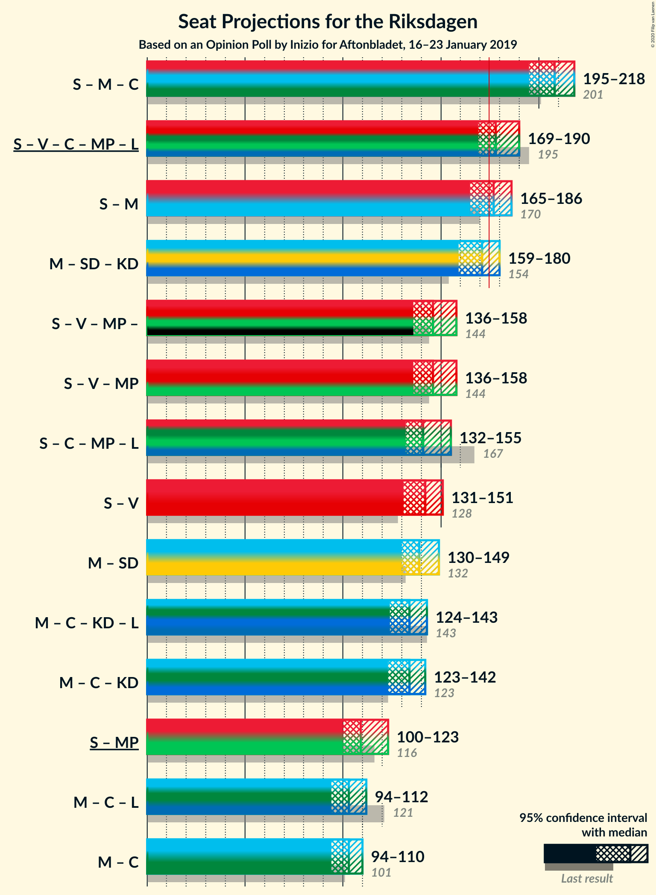
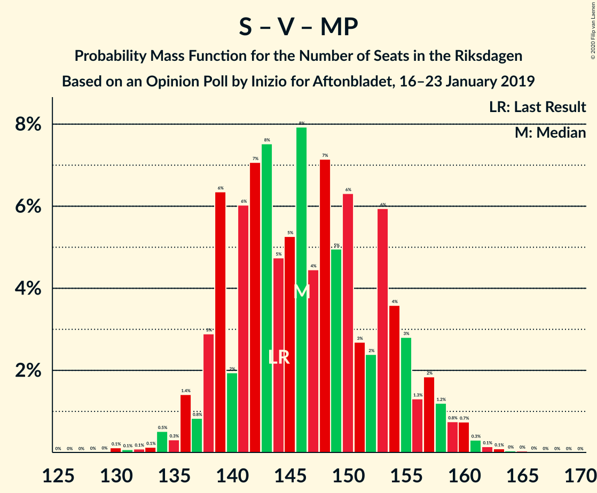

# Opinion Poll by Inizio for Aftonbladet, 16–23 January 2019

<a href="#voting-intentions">Voting Intentions</a> | <a href="#seats">Seats</a> | <a href="#coalitions">Coalitions</a> | <a href="#technical-information">Technical Information</a>

## Voting Intentions

### Confidence Intervals

| Party | Last Result | Poll Result | 80% Confidence Interval | 90% Confidence Interval | 95% Confidence Interval | 99% Confidence Interval |
|:-----:|:-----------:|:-----------:|:-----------------------:|:-----------------------:|:-----------------------:|:-----------------------:|
| Sveriges socialdemokratiska arbetareparti | 28.3% | 28.2% | 26.9–29.5% |26.6–29.9% |26.3–30.2% |25.7–30.8% |
| Moderata samlingspartiet | 19.8% | 19.0% | 17.9–20.1% |17.6–20.5% |17.4–20.7% |16.9–21.3% |
| Sverigedemokraterna | 17.5% | 18.4% | 17.3–19.5% |17.0–19.8% |16.8–20.1% |16.3–20.7% |
| Vänsterpartiet | 8.0% | 9.7% | 8.9–10.5% |8.7–10.8% |8.5–11.0% |8.1–11.5% |
| Centerpartiet | 8.6% | 8.3% | 7.5–9.1% |7.3–9.3% |7.2–9.6% |6.8–10.0% |
| Kristdemokraterna | 6.3% | 8.3% | 7.5–9.1% |7.3–9.3% |7.2–9.6% |6.8–10.0% |
| Miljöpartiet de gröna | 4.4% | 3.8% | 3.3–4.4% |3.2–4.5% |3.0–4.7% |2.8–5.0% |
| Liberalerna | 5.5% | 3.2% | 2.8–3.8% |2.6–3.9% |2.5–4.1% |2.3–4.3% |

*Note:* The poll result column reflects the actual value used in the calculations. Published results may vary slightly, and in addition be rounded to fewer digits.

## Seats

### Confidence Intervals

| Party | Last Result | Median | 80% Confidence Interval | 90% Confidence Interval | 95% Confidence Interval | 99% Confidence Interval |
|:-----:|:-----------:|:------:|:-----------------------:|:-----------------------:|:-----------------------:|:-----------------------:|
| <a href="#sveriges-socialdemokratiska-arbetareparti">Sveriges socialdemokratiska arbetareparti</a> | 100 | 102 | 101–110 |101–112 |101–112 |100–113 |
| <a href="#moderata-samlingspartiet">Moderata samlingspartiet</a> | 70 | 68 | 67–70 |66–72 |62–74 |62–74 |
| <a href="#sverigedemokraterna">Sverigedemokraterna</a> | 62 | 63 | 61–66 |61–70 |61–73 |61–73 |
| <a href="#vänsterpartiet">Vänsterpartiet</a> | 28 | 37 | 37–41 |34–41 |34–43 |34–43 |
| <a href="#centerpartiet">Centerpartiet</a> | 31 | 28 | 25–30 |25–33 |25–34 |25–41 |
| <a href="#kristdemokraterna">Kristdemokraterna</a> | 22 | 33 | 31–34 |31–34 |28–34 |25–35 |
| <a href="#miljöpartiet-de-gröna">Miljöpartiet de gröna</a> | 16 | 16 | 0–18 |0–18 |0–18 |0–18 |
| <a href="#liberalerna">Liberalerna</a> | 20 | 0 | 0 |0 |0–15 |0–15 |

### Sveriges socialdemokratiska arbetareparti

*For a full overview of the results for this party, see the [Sveriges socialdemokratiska arbetareparti](party-sverigessocialdemokratiskaarbetareparti.html) page.*

| Number of Seats | Probability | Accumulated | Special Marks |
|:---------------:|:-----------:|:-----------:|:-------------:|
| 95 | 0.1% | 100% |  |
| 96 | 0% | 99.9% |  |
| 97 | 0.1% | 99.9% |  |
| 98 | 0% | 99.9% |  |
| 99 | 0% | 99.9% |  |
| 100 | 0.7% | 99.8% | Last Result |
| 101 | 33% | 99.1% |  |
| 102 | 24% | 66% | Median |
| 103 | 0% | 42% |  |
| 104 | 0% | 42% |  |
| 105 | 0% | 42% |  |
| 106 | 25% | 42% |  |
| 107 | 0.3% | 17% |  |
| 108 | 2% | 16% |  |
| 109 | 0% | 15% |  |
| 110 | 9% | 15% |  |
| 111 | 0.2% | 5% |  |
| 112 | 3% | 5% |  |
| 113 | 2% | 2% |  |
| 114 | 0% | 0% |  |

### Moderata samlingspartiet

*For a full overview of the results for this party, see the [Moderata samlingspartiet](party-moderatasamlingspartiet.html) page.*

| Number of Seats | Probability | Accumulated | Special Marks |
|:---------------:|:-----------:|:-----------:|:-------------:|
| 61 | 0.1% | 100% |  |
| 62 | 3% | 99.9% |  |
| 63 | 2% | 97% |  |
| 64 | 0% | 95% |  |
| 65 | 0.1% | 95% |  |
| 66 | 5% | 95% |  |
| 67 | 24% | 91% |  |
| 68 | 26% | 67% | Median |
| 69 | 0% | 40% |  |
| 70 | 32% | 40% | Last Result |
| 71 | 1.3% | 8% |  |
| 72 | 2% | 7% |  |
| 73 | 0% | 5% |  |
| 74 | 5% | 5% |  |
| 75 | 0% | 0% |  |

### Sverigedemokraterna

*For a full overview of the results for this party, see the [Sverigedemokraterna](party-sverigedemokraterna.html) page.*

| Number of Seats | Probability | Accumulated | Special Marks |
|:---------------:|:-----------:|:-----------:|:-------------:|
| 59 | 0.1% | 100% |  |
| 60 | 0% | 99.9% |  |
| 61 | 26% | 99.9% |  |
| 62 | 23% | 74% | Last Result |
| 63 | 1.0% | 51% | Median |
| 64 | 0% | 50% |  |
| 65 | 36% | 50% |  |
| 66 | 5% | 14% |  |
| 67 | 0% | 9% |  |
| 68 | 2% | 9% |  |
| 69 | 0.2% | 6% |  |
| 70 | 3% | 6% |  |
| 71 | 0% | 3% |  |
| 72 | 0% | 3% |  |
| 73 | 3% | 3% |  |
| 74 | 0% | 0% |  |

### Vänsterpartiet

*For a full overview of the results for this party, see the [Vänsterpartiet](party-vänsterpartiet.html) page.*

| Number of Seats | Probability | Accumulated | Special Marks |
|:---------------:|:-----------:|:-----------:|:-------------:|
| 28 | 0% | 100% | Last Result |
| 29 | 0% | 100% |  |
| 30 | 0% | 100% |  |
| 31 | 0% | 100% |  |
| 32 | 0% | 100% |  |
| 33 | 0% | 100% |  |
| 34 | 6% | 100% |  |
| 35 | 0.1% | 94% |  |
| 36 | 3% | 94% |  |
| 37 | 57% | 90% | Median |
| 38 | 1.1% | 34% |  |
| 39 | 2% | 33% |  |
| 40 | 0% | 31% |  |
| 41 | 26% | 31% |  |
| 42 | 0% | 5% |  |
| 43 | 5% | 5% |  |
| 44 | 0% | 0% |  |

### Centerpartiet

*For a full overview of the results for this party, see the [Centerpartiet](party-centerpartiet.html) page.*

| Number of Seats | Probability | Accumulated | Special Marks |
|:---------------:|:-----------:|:-----------:|:-------------:|
| 25 | 30% | 100% |  |
| 26 | 0.1% | 70% |  |
| 27 | 0.2% | 70% |  |
| 28 | 34% | 69% | Median |
| 29 | 23% | 35% |  |
| 30 | 3% | 12% |  |
| 31 | 0% | 9% | Last Result |
| 32 | 4% | 9% |  |
| 33 | 0.7% | 5% |  |
| 34 | 3% | 5% |  |
| 35 | 0% | 2% |  |
| 36 | 0.2% | 2% |  |
| 37 | 0.4% | 2% |  |
| 38 | 0% | 1.4% |  |
| 39 | 0% | 1.4% |  |
| 40 | 0% | 1.3% |  |
| 41 | 1.3% | 1.3% |  |
| 42 | 0% | 0% |  |

### Kristdemokraterna

*For a full overview of the results for this party, see the [Kristdemokraterna](party-kristdemokraterna.html) page.*

| Number of Seats | Probability | Accumulated | Special Marks |
|:---------------:|:-----------:|:-----------:|:-------------:|
| 22 | 0% | 100% | Last Result |
| 23 | 0% | 100% |  |
| 24 | 0.2% | 100% |  |
| 25 | 0.5% | 99.7% |  |
| 26 | 1.2% | 99.3% |  |
| 27 | 0.1% | 98% |  |
| 28 | 2% | 98% |  |
| 29 | 0.1% | 96% |  |
| 30 | 0.1% | 96% |  |
| 31 | 8% | 96% |  |
| 32 | 36% | 88% |  |
| 33 | 25% | 52% | Median |
| 34 | 25% | 27% |  |
| 35 | 2% | 2% |  |
| 36 | 0% | 0% |  |

### Miljöpartiet de gröna

*For a full overview of the results for this party, see the [Miljöpartiet de gröna](party-miljöpartietdegröna.html) page.*

| Number of Seats | Probability | Accumulated | Special Marks |
|:---------------:|:-----------:|:-----------:|:-------------:|
| 0 | 16% | 100% |  |
| 1 | 0% | 84% |  |
| 2 | 0% | 84% |  |
| 3 | 0% | 84% |  |
| 4 | 0% | 84% |  |
| 5 | 0% | 84% |  |
| 6 | 0% | 84% |  |
| 7 | 0% | 84% |  |
| 8 | 0% | 84% |  |
| 9 | 0% | 84% |  |
| 10 | 0% | 84% |  |
| 11 | 0% | 84% |  |
| 12 | 0% | 84% |  |
| 13 | 0% | 84% |  |
| 14 | 0% | 84% |  |
| 15 | 25% | 84% |  |
| 16 | 33% | 58% | Last Result, Median |
| 17 | 0.6% | 25% |  |
| 18 | 24% | 24% |  |
| 19 | 0% | 0.3% |  |
| 20 | 0.3% | 0.3% |  |
| 21 | 0% | 0% |  |

### Liberalerna

*For a full overview of the results for this party, see the [Liberalerna](party-liberalerna.html) page.*

| Number of Seats | Probability | Accumulated | Special Marks |
|:---------------:|:-----------:|:-----------:|:-------------:|
| 0 | 97% | 100% | Median |
| 1 | 0% | 3% |  |
| 2 | 0% | 3% |  |
| 3 | 0% | 3% |  |
| 4 | 0% | 3% |  |
| 5 | 0% | 3% |  |
| 6 | 0% | 3% |  |
| 7 | 0% | 3% |  |
| 8 | 0% | 3% |  |
| 9 | 0% | 3% |  |
| 10 | 0% | 3% |  |
| 11 | 0% | 3% |  |
| 12 | 0% | 3% |  |
| 13 | 0% | 3% |  |
| 14 | 0% | 3% |  |
| 15 | 3% | 3% |  |
| 16 | 0.2% | 0.2% |  |
| 17 | 0% | 0% |  |
| 18 | 0% | 0% |  |
| 19 | 0% | 0% |  |
| 20 | 0% | 0% | Last Result |

## Coalitions

### Confidence Intervals

| Coalition | Last Result | Median | Majority? | 80% Confidence Interval | 90% Confidence Interval | 95% Confidence Interval | 99% Confidence Interval |
|:---------:|:-----------:|:------:|:---------:|:-----------------------:|:-----------------------:|:-----------------------:|:-----------------------:|
| Sveriges socialdemokratiska arbetareparti – Moderata samlingspartiet – Centerpartiet | 201 | 199 | 100% | 198–209 | 198–210 | 198–210 | 198–217 |
| Sveriges socialdemokratiska arbetareparti – Vänsterpartiet – Centerpartiet – Miljöpartiet de gröna – Liberalerna | 195 | 186 | 100% | 181–187 | 178–188 | 178–191 | 175–192 |
| Sveriges socialdemokratiska arbetareparti – Moderata samlingspartiet | 170 | 171 | 13% | 169–178 | 169–180 | 169–184 | 169–184 |
| Moderata samlingspartiet – Sverigedemokraterna – Kristdemokraterna | 154 | 163 | 0% | 162–168 | 161–171 | 158–171 | 157–174 |
| Sveriges socialdemokratiska arbetareparti – Vänsterpartiet – Miljöpartiet de gröna | 144 | 156 | 0% | 147–162 | 146–162 | 146–162 | 144–162 |
| Sveriges socialdemokratiska arbetareparti – Centerpartiet – Miljöpartiet de gröna – Liberalerna | 167 | 146 | 0% | 145–149 | 136–151 | 135–155 | 135–155 |
| Sveriges socialdemokratiska arbetareparti – Vänsterpartiet | 128 | 139 | 0% | 138–147 | 138–151 | 138–153 | 138–153 |
| Moderata samlingspartiet – Sverigedemokraterna | 132 | 129 | 0% | 129–136 | 129–140 | 127–140 | 127–140 |
| Moderata samlingspartiet – Centerpartiet – Kristdemokraterna – Liberalerna | 143 | 130 | 0% | 126–130 | 126–134 | 126–138 | 126–138 |
| Moderata samlingspartiet – Centerpartiet – Kristdemokraterna | 123 | 130 | 0% | 126–130 | 126–130 | 123–134 | 123–135 |
| Sveriges socialdemokratiska arbetareparti – Miljöpartiet de gröna | 116 | 119 | 0% | 110–121 | 110–121 | 110–121 | 108–121 |
| Moderata samlingspartiet – Centerpartiet – Liberalerna | 121 | 97 | 0% | 93–99 | 93–104 | 93–107 | 93–107 |
| Moderata samlingspartiet – Centerpartiet | 101 | 96 | 0% | 93–99 | 93–100 | 92–103 | 92–107 |

### Sveriges socialdemokratiska arbetareparti – Moderata samlingspartiet – Centerpartiet

| Number of Seats | Probability | Accumulated | Special Marks |
|:---------------:|:-----------:|:-----------:|:-------------:|
| 192 | 0.1% | 100% |  |
| 193 | 0% | 99.9% |  |
| 194 | 0% | 99.9% |  |
| 195 | 0% | 99.9% |  |
| 196 | 0% | 99.9% |  |
| 197 | 0% | 99.9% |  |
| 198 | 23% | 99.9% | Median |
| 199 | 58% | 77% |  |
| 200 | 0.1% | 19% |  |
| 201 | 0.2% | 19% | Last Result |
| 202 | 3% | 19% |  |
| 203 | 1.1% | 16% |  |
| 204 | 0.7% | 15% |  |
| 205 | 0.5% | 14% |  |
| 206 | 0% | 13% |  |
| 207 | 0% | 13% |  |
| 208 | 2% | 13% |  |
| 209 | 5% | 12% |  |
| 210 | 5% | 7% |  |
| 211 | 0% | 2% |  |
| 212 | 0.2% | 2% |  |
| 213 | 0% | 2% |  |
| 214 | 0% | 2% |  |
| 215 | 0% | 2% |  |
| 216 | 0% | 2% |  |
| 217 | 2% | 2% |  |
| 218 | 0% | 0% |  |

### Sveriges socialdemokratiska arbetareparti – Vänsterpartiet – Centerpartiet – Miljöpartiet de gröna – Liberalerna

| Number of Seats | Probability | Accumulated | Special Marks |
|:---------------:|:-----------:|:-----------:|:-------------:|
| 175 | 2% | 100% | Majority |
| 176 | 0% | 98% |  |
| 177 | 0% | 98% |  |
| 178 | 8% | 98% |  |
| 179 | 0% | 90% |  |
| 180 | 0% | 90% |  |
| 181 | 2% | 90% |  |
| 182 | 32% | 88% |  |
| 183 | 0% | 56% | Median |
| 184 | 0% | 56% |  |
| 185 | 1.3% | 56% |  |
| 186 | 23% | 55% |  |
| 187 | 26% | 31% |  |
| 188 | 0.4% | 5% |  |
| 189 | 0.2% | 5% |  |
| 190 | 1.2% | 5% |  |
| 191 | 3% | 4% |  |
| 192 | 0.5% | 0.6% |  |
| 193 | 0.1% | 0.1% |  |
| 194 | 0% | 0% |  |
| 195 | 0% | 0% | Last Result |

### Sveriges socialdemokratiska arbetareparti – Moderata samlingspartiet

| Number of Seats | Probability | Accumulated | Special Marks |
|:---------------:|:-----------:|:-----------:|:-------------:|
| 165 | 0% | 100% |  |
| 166 | 0.1% | 99.9% |  |
| 167 | 0% | 99.9% |  |
| 168 | 0% | 99.8% |  |
| 169 | 24% | 99.8% |  |
| 170 | 0% | 76% | Last Result, Median |
| 171 | 33% | 76% |  |
| 172 | 3% | 42% |  |
| 173 | 0.6% | 40% |  |
| 174 | 26% | 39% |  |
| 175 | 0% | 13% | Majority |
| 176 | 3% | 13% |  |
| 177 | 0% | 10% |  |
| 178 | 3% | 10% |  |
| 179 | 0% | 7% |  |
| 180 | 2% | 7% |  |
| 181 | 0% | 5% |  |
| 182 | 0% | 5% |  |
| 183 | 0% | 5% |  |
| 184 | 5% | 5% |  |
| 185 | 0% | 0% |  |

### Moderata samlingspartiet – Sverigedemokraterna – Kristdemokraterna

| Number of Seats | Probability | Accumulated | Special Marks |
|:---------------:|:-----------:|:-----------:|:-------------:|
| 154 | 0% | 100% | Last Result |
| 155 | 0% | 100% |  |
| 156 | 0.1% | 100% |  |
| 157 | 0.5% | 99.9% |  |
| 158 | 3% | 99.4% |  |
| 159 | 1.2% | 96% |  |
| 160 | 0.2% | 95% |  |
| 161 | 0.4% | 95% |  |
| 162 | 26% | 95% |  |
| 163 | 23% | 69% |  |
| 164 | 1.3% | 45% | Median |
| 165 | 0% | 44% |  |
| 166 | 0% | 44% |  |
| 167 | 32% | 44% |  |
| 168 | 2% | 12% |  |
| 169 | 0% | 10% |  |
| 170 | 0% | 10% |  |
| 171 | 8% | 10% |  |
| 172 | 0% | 2% |  |
| 173 | 0% | 2% |  |
| 174 | 2% | 2% |  |
| 175 | 0% | 0% | Majority |

### Sveriges socialdemokratiska arbetareparti – Vänsterpartiet – Miljöpartiet de gröna

| Number of Seats | Probability | Accumulated | Special Marks |
|:---------------:|:-----------:|:-----------:|:-------------:|
| 135 | 0% | 100% |  |
| 136 | 0% | 99.9% |  |
| 137 | 0% | 99.9% |  |
| 138 | 0% | 99.9% |  |
| 139 | 0% | 99.9% |  |
| 140 | 0% | 99.9% |  |
| 141 | 0% | 99.9% |  |
| 142 | 0% | 99.9% |  |
| 143 | 0.1% | 99.9% |  |
| 144 | 1.3% | 99.8% | Last Result |
| 145 | 0.2% | 98% |  |
| 146 | 6% | 98% |  |
| 147 | 3% | 92% |  |
| 148 | 0% | 89% |  |
| 149 | 0% | 89% |  |
| 150 | 0% | 89% |  |
| 151 | 0.4% | 89% |  |
| 152 | 0% | 88% |  |
| 153 | 5% | 88% |  |
| 154 | 33% | 83% |  |
| 155 | 0% | 50% | Median |
| 156 | 1.0% | 50% |  |
| 157 | 23% | 49% |  |
| 158 | 0% | 26% |  |
| 159 | 0% | 26% |  |
| 160 | 0.5% | 26% |  |
| 161 | 0% | 26% |  |
| 162 | 25% | 26% |  |
| 163 | 0.2% | 0.3% |  |
| 164 | 0% | 0.1% |  |
| 165 | 0.1% | 0.1% |  |
| 166 | 0% | 0% |  |

### Sveriges socialdemokratiska arbetareparti – Centerpartiet – Miljöpartiet de gröna – Liberalerna

| Number of Seats | Probability | Accumulated | Special Marks |
|:---------------:|:-----------:|:-----------:|:-------------:|
| 135 | 5% | 100% |  |
| 136 | 2% | 95% |  |
| 137 | 0% | 93% |  |
| 138 | 0% | 93% |  |
| 139 | 0% | 93% |  |
| 140 | 0% | 93% |  |
| 141 | 0% | 93% |  |
| 142 | 0% | 93% |  |
| 143 | 0% | 93% |  |
| 144 | 3% | 93% |  |
| 145 | 32% | 90% |  |
| 146 | 25% | 58% | Median |
| 147 | 2% | 32% |  |
| 148 | 0% | 31% |  |
| 149 | 24% | 31% |  |
| 150 | 0.4% | 7% |  |
| 151 | 2% | 6% |  |
| 152 | 0.1% | 4% |  |
| 153 | 1.0% | 4% |  |
| 154 | 0.3% | 3% |  |
| 155 | 3% | 3% |  |
| 156 | 0.1% | 0.1% |  |
| 157 | 0% | 0% |  |
| 158 | 0% | 0% |  |
| 159 | 0% | 0% |  |
| 160 | 0% | 0% |  |
| 161 | 0% | 0% |  |
| 162 | 0% | 0% |  |
| 163 | 0% | 0% |  |
| 164 | 0% | 0% |  |
| 165 | 0% | 0% |  |
| 166 | 0% | 0% |  |
| 167 | 0% | 0% | Last Result |

### Sveriges socialdemokratiska arbetareparti – Vänsterpartiet

| Number of Seats | Probability | Accumulated | Special Marks |
|:---------------:|:-----------:|:-----------:|:-------------:|
| 128 | 0% | 100% | Last Result |
| 129 | 0% | 100% |  |
| 130 | 0% | 100% |  |
| 131 | 0% | 100% |  |
| 132 | 0% | 100% |  |
| 133 | 0% | 100% |  |
| 134 | 0.1% | 100% |  |
| 135 | 0% | 99.9% |  |
| 136 | 0% | 99.8% |  |
| 137 | 0% | 99.8% |  |
| 138 | 34% | 99.8% |  |
| 139 | 23% | 66% | Median |
| 140 | 0% | 43% |  |
| 141 | 0% | 43% |  |
| 142 | 0.1% | 43% |  |
| 143 | 0.9% | 42% |  |
| 144 | 1.3% | 42% |  |
| 145 | 0.1% | 40% |  |
| 146 | 6% | 40% |  |
| 147 | 29% | 34% |  |
| 148 | 0.1% | 5% |  |
| 149 | 0% | 5% |  |
| 150 | 0% | 5% |  |
| 151 | 0.4% | 5% |  |
| 152 | 0% | 5% |  |
| 153 | 5% | 5% |  |
| 154 | 0% | 0% |  |

### Moderata samlingspartiet – Sverigedemokraterna

| Number of Seats | Probability | Accumulated | Special Marks |
|:---------------:|:-----------:|:-----------:|:-------------:|
| 125 | 0% | 100% |  |
| 126 | 0% | 99.9% |  |
| 127 | 3% | 99.9% |  |
| 128 | 0% | 97% |  |
| 129 | 49% | 97% |  |
| 130 | 0.1% | 48% |  |
| 131 | 1.0% | 48% | Median |
| 132 | 0.5% | 47% | Last Result |
| 133 | 2% | 47% |  |
| 134 | 0.2% | 45% |  |
| 135 | 33% | 45% |  |
| 136 | 2% | 12% |  |
| 137 | 0% | 10% |  |
| 138 | 0% | 10% |  |
| 139 | 3% | 10% |  |
| 140 | 7% | 7% |  |
| 141 | 0% | 0.1% |  |
| 142 | 0% | 0% |  |

### Moderata samlingspartiet – Centerpartiet – Kristdemokraterna – Liberalerna

| Number of Seats | Probability | Accumulated | Special Marks |
|:---------------:|:-----------:|:-----------:|:-------------:|
| 116 | 0.1% | 100% |  |
| 117 | 0% | 99.9% |  |
| 118 | 0.2% | 99.9% |  |
| 119 | 0% | 99.7% |  |
| 120 | 0% | 99.7% |  |
| 121 | 0% | 99.7% |  |
| 122 | 0% | 99.7% |  |
| 123 | 0% | 99.7% |  |
| 124 | 0% | 99.7% |  |
| 125 | 0% | 99.7% |  |
| 126 | 25% | 99.7% |  |
| 127 | 0% | 74% |  |
| 128 | 0.5% | 74% |  |
| 129 | 0% | 74% | Median |
| 130 | 66% | 74% |  |
| 131 | 0% | 8% |  |
| 132 | 2% | 8% |  |
| 133 | 0% | 6% |  |
| 134 | 2% | 6% |  |
| 135 | 1.5% | 5% |  |
| 136 | 0% | 3% |  |
| 137 | 0% | 3% |  |
| 138 | 3% | 3% |  |
| 139 | 0.1% | 0.3% |  |
| 140 | 0.1% | 0.2% |  |
| 141 | 0% | 0.1% |  |
| 142 | 0% | 0.1% |  |
| 143 | 0% | 0.1% | Last Result |
| 144 | 0% | 0.1% |  |
| 145 | 0% | 0.1% |  |
| 146 | 0% | 0.1% |  |
| 147 | 0% | 0.1% |  |
| 148 | 0% | 0.1% |  |
| 149 | 0% | 0.1% |  |
| 150 | 0% | 0.1% |  |
| 151 | 0% | 0.1% |  |
| 152 | 0% | 0.1% |  |
| 153 | 0% | 0% |  |

### Moderata samlingspartiet – Centerpartiet – Kristdemokraterna

| Number of Seats | Probability | Accumulated | Special Marks |
|:---------------:|:-----------:|:-----------:|:-------------:|
| 116 | 0.1% | 100% |  |
| 117 | 0% | 99.9% |  |
| 118 | 0.2% | 99.9% |  |
| 119 | 0% | 99.7% |  |
| 120 | 0% | 99.7% |  |
| 121 | 0% | 99.7% |  |
| 122 | 0% | 99.7% |  |
| 123 | 3% | 99.7% | Last Result |
| 124 | 0.1% | 97% |  |
| 125 | 0% | 97% |  |
| 126 | 25% | 97% |  |
| 127 | 0% | 71% |  |
| 128 | 0.5% | 71% |  |
| 129 | 0% | 71% | Median |
| 130 | 66% | 71% |  |
| 131 | 0% | 5% |  |
| 132 | 2% | 5% |  |
| 133 | 0% | 3% |  |
| 134 | 2% | 3% |  |
| 135 | 1.5% | 2% |  |
| 136 | 0% | 0.1% |  |
| 137 | 0% | 0.1% |  |
| 138 | 0% | 0.1% |  |
| 139 | 0% | 0.1% |  |
| 140 | 0% | 0% |  |

### Sveriges socialdemokratiska arbetareparti – Miljöpartiet de gröna

| Number of Seats | Probability | Accumulated | Special Marks |
|:---------------:|:-----------:|:-----------:|:-------------:|
| 97 | 0.1% | 100% |  |
| 98 | 0% | 99.9% |  |
| 99 | 0% | 99.9% |  |
| 100 | 0% | 99.9% |  |
| 101 | 0% | 99.9% |  |
| 102 | 0% | 99.9% |  |
| 103 | 0% | 99.9% |  |
| 104 | 0% | 99.9% |  |
| 105 | 0% | 99.9% |  |
| 106 | 0.1% | 99.9% |  |
| 107 | 0% | 99.8% |  |
| 108 | 2% | 99.8% |  |
| 109 | 0% | 98% |  |
| 110 | 9% | 98% |  |
| 111 | 0.1% | 89% |  |
| 112 | 3% | 89% |  |
| 113 | 2% | 85% |  |
| 114 | 0% | 84% |  |
| 115 | 0% | 84% |  |
| 116 | 0.7% | 84% | Last Result |
| 117 | 32% | 83% |  |
| 118 | 0% | 50% | Median |
| 119 | 1.4% | 50% |  |
| 120 | 23% | 49% |  |
| 121 | 25% | 26% |  |
| 122 | 0% | 0.4% |  |
| 123 | 0% | 0.3% |  |
| 124 | 0% | 0.3% |  |
| 125 | 0% | 0.3% |  |
| 126 | 0% | 0.3% |  |
| 127 | 0.2% | 0.3% |  |
| 128 | 0% | 0.1% |  |
| 129 | 0% | 0.1% |  |
| 130 | 0.1% | 0.1% |  |
| 131 | 0% | 0% |  |

### Moderata samlingspartiet – Centerpartiet – Liberalerna

| Number of Seats | Probability | Accumulated | Special Marks |
|:---------------:|:-----------:|:-----------:|:-------------:|
| 87 | 0.1% | 100% |  |
| 88 | 0% | 99.9% |  |
| 89 | 0% | 99.9% |  |
| 90 | 0% | 99.9% |  |
| 91 | 0% | 99.9% |  |
| 92 | 0% | 99.9% |  |
| 93 | 25% | 99.9% |  |
| 94 | 0.2% | 75% |  |
| 95 | 0% | 74% |  |
| 96 | 23% | 74% | Median |
| 97 | 2% | 51% |  |
| 98 | 36% | 49% |  |
| 99 | 5% | 14% |  |
| 100 | 2% | 9% |  |
| 101 | 0.2% | 7% |  |
| 102 | 1.0% | 7% |  |
| 103 | 0.5% | 6% |  |
| 104 | 1.1% | 6% |  |
| 105 | 0% | 5% |  |
| 106 | 0% | 5% |  |
| 107 | 4% | 5% |  |
| 108 | 0% | 0.3% |  |
| 109 | 0% | 0.3% |  |
| 110 | 0% | 0.3% |  |
| 111 | 0% | 0.3% |  |
| 112 | 0% | 0.3% |  |
| 113 | 0.2% | 0.3% |  |
| 114 | 0% | 0.1% |  |
| 115 | 0% | 0.1% |  |
| 116 | 0% | 0.1% |  |
| 117 | 0% | 0.1% |  |
| 118 | 0% | 0% |  |
| 119 | 0% | 0% |  |
| 120 | 0% | 0% |  |
| 121 | 0% | 0% | Last Result |

### Moderata samlingspartiet – Centerpartiet

| Number of Seats | Probability | Accumulated | Special Marks |
|:---------------:|:-----------:|:-----------:|:-------------:|
| 87 | 0.1% | 100% |  |
| 88 | 0% | 99.9% |  |
| 89 | 0% | 99.9% |  |
| 90 | 0% | 99.9% |  |
| 91 | 0% | 99.9% |  |
| 92 | 3% | 99.9% |  |
| 93 | 25% | 97% |  |
| 94 | 0.2% | 72% |  |
| 95 | 0% | 71% |  |
| 96 | 23% | 71% | Median |
| 97 | 2% | 48% |  |
| 98 | 36% | 46% |  |
| 99 | 5% | 11% |  |
| 100 | 2% | 6% |  |
| 101 | 0.2% | 4% | Last Result |
| 102 | 1.0% | 4% |  |
| 103 | 0.5% | 3% |  |
| 104 | 1.1% | 2% |  |
| 105 | 0% | 1.4% |  |
| 106 | 0% | 1.4% |  |
| 107 | 1.3% | 1.4% |  |
| 108 | 0% | 0.1% |  |
| 109 | 0% | 0.1% |  |
| 110 | 0% | 0% |  |

## Technical Information

### Opinion Poll

+ **Polling firm:** Inizio
+ **Commissioner(s):** Aftonbladet
+ **Fieldwork period:** 16–23 January 2019

### Calculations

+ **Sample size:** 2089
+ **Simulations done:** 1,024
+ **Error estimate:** 1.48%

