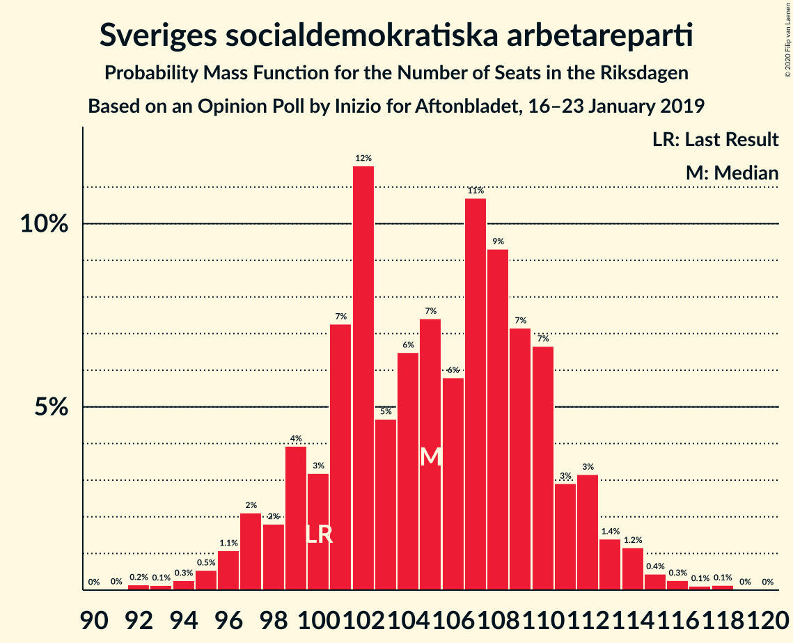
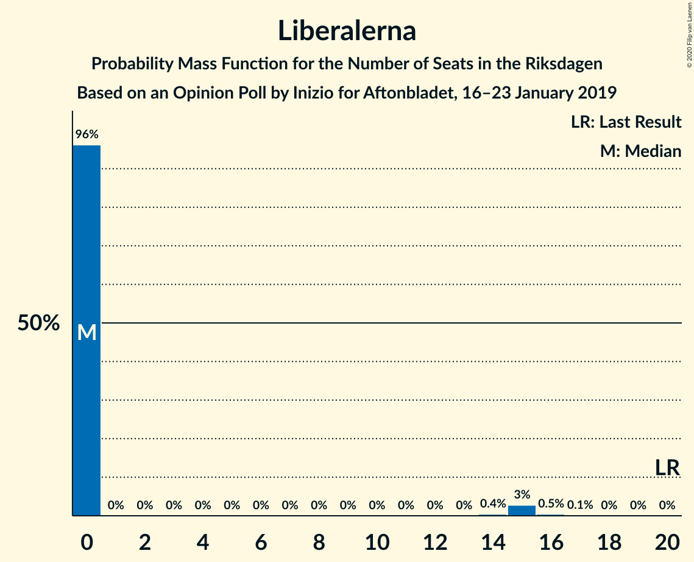
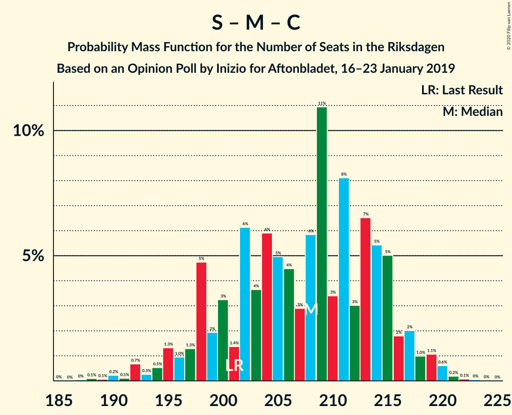
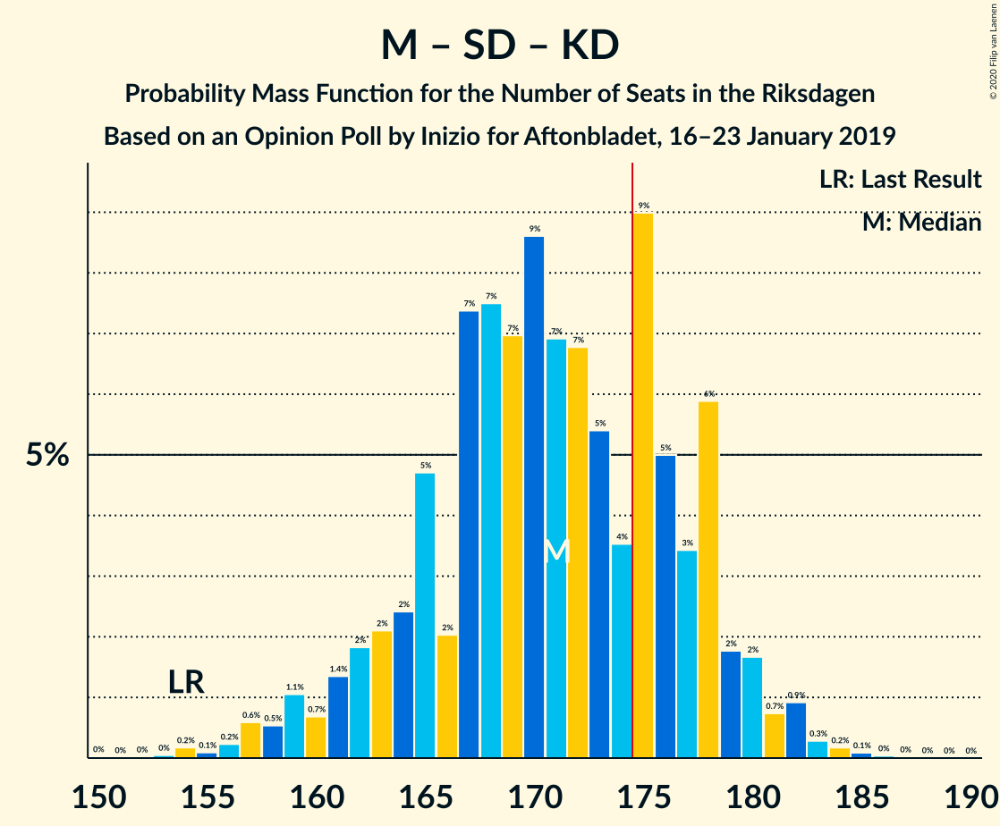

# Opinion Poll by Inizio for Aftonbladet, 16–23 January 2019

<a href="#voting-intentions">Voting Intentions</a> | <a href="#seats">Seats</a> | <a href="#coalitions">Coalitions</a> | <a href="#technical-information">Technical Information</a>

## Voting Intentions

### Confidence Intervals

| Party | Last Result | Poll Result | 80% Confidence Interval | 90% Confidence Interval | 95% Confidence Interval | 99% Confidence Interval |
|:-----:|:-----------:|:-----------:|:-----------------------:|:-----------------------:|:-----------------------:|:-----------------------:|
| Sveriges socialdemokratiska arbetareparti | 28.3% | 28.2% | 26.9–29.5% |26.6–29.9% |26.3–30.2% |25.7–30.8% |
| Moderata samlingspartiet | 19.8% | 19.0% | 17.9–20.1% |17.6–20.5% |17.4–20.7% |16.9–21.3% |
| Sverigedemokraterna | 17.5% | 18.4% | 17.3–19.5% |17.0–19.8% |16.8–20.1% |16.3–20.7% |
| Vänsterpartiet | 8.0% | 9.7% | 8.9–10.5% |8.7–10.8% |8.5–11.0% |8.1–11.5% |
| Centerpartiet | 8.6% | 8.3% | 7.5–9.1% |7.3–9.3% |7.2–9.6% |6.8–10.0% |
| Kristdemokraterna | 6.3% | 8.3% | 7.5–9.1% |7.3–9.3% |7.2–9.6% |6.8–10.0% |
| Miljöpartiet de gröna | 4.4% | 3.8% | 3.3–4.4% |3.2–4.5% |3.0–4.7% |2.8–5.0% |
| Liberalerna | 5.5% | 3.2% | 2.8–3.8% |2.6–3.9% |2.5–4.1% |2.3–4.3% |

*Note:* The poll result column reflects the actual value used in the calculations. Published results may vary slightly, and in addition be rounded to fewer digits.

## Seats

### Confidence Intervals

| Party | Last Result | Median | 80% Confidence Interval | 90% Confidence Interval | 95% Confidence Interval | 99% Confidence Interval |
|:-----:|:-----------:|:------:|:-----------------------:|:-----------------------:|:-----------------------:|:-----------------------:|
| <a href="#sveriges-socialdemokratiska-arbetareparti">Sveriges socialdemokratiska arbetareparti</a> | 100 | 105 | 100–110 |98–111 |97–112 |92–116 |
| <a href="#moderata-samlingspartiet">Moderata samlingspartiet</a> | 70 | 71 | 66–76 |65–76 |64–78 |62–80 |
| <a href="#sverigedemokraterna">Sverigedemokraterna</a> | 62 | 68 | 64–72 |64–75 |62–77 |60–77 |
| <a href="#vänsterpartiet">Vänsterpartiet</a> | 28 | 36 | 33–39 |32–41 |32–42 |31–43 |
| <a href="#centerpartiet">Centerpartiet</a> | 31 | 31 | 28–35 |27–35 |27–35 |25–38 |
| <a href="#kristdemokraterna">Kristdemokraterna</a> | 22 | 31 | 28–35 |27–35 |27–36 |26–37 |
| <a href="#miljöpartiet-de-gröna">Miljöpartiet de gröna</a> | 16 | 0 | 0–17 |0–17 |0–18 |0–18 |
| <a href="#liberalerna">Liberalerna</a> | 20 | 0 | 0 |0–15 |0–15 |0–16 |

### Sveriges socialdemokratiska arbetareparti

*For a full overview of the results for this party, see the [Sveriges socialdemokratiska arbetareparti](party-sverigessocialdemokratiskaarbetareparti.html) page.*

| Number of Seats | Probability | Accumulated | Special Marks |
|:---------------:|:-----------:|:-----------:|:-------------:|
| 91 | 0.1% | 100% |  |
| 92 | 0.4% | 99.9% |  |
| 93 | 0.2% | 99.5% |  |
| 94 | 0.5% | 99.3% |  |
| 95 | 0.4% | 98.8% |  |
| 96 | 0.5% | 98% |  |
| 97 | 1.1% | 98% |  |
| 98 | 2% | 97% |  |
| 99 | 1.2% | 94% |  |
| 100 | 6% | 93% | Last Result |
| 101 | 6% | 87% |  |
| 102 | 14% | 81% |  |
| 103 | 6% | 67% |  |
| 104 | 10% | 61% |  |
| 105 | 7% | 51% | Median |
| 106 | 6% | 44% |  |
| 107 | 8% | 38% |  |
| 108 | 12% | 31% |  |
| 109 | 7% | 19% |  |
| 110 | 4% | 12% |  |
| 111 | 4% | 7% |  |
| 112 | 0.8% | 3% |  |
| 113 | 0.4% | 2% |  |
| 114 | 0.3% | 1.5% |  |
| 115 | 0.4% | 1.1% |  |
| 116 | 0.4% | 0.7% |  |
| 117 | 0.1% | 0.4% |  |
| 118 | 0.2% | 0.3% |  |
| 119 | 0.1% | 0.1% |  |
| 120 | 0% | 0% |  |

### Moderata samlingspartiet

*For a full overview of the results for this party, see the [Moderata samlingspartiet](party-moderatasamlingspartiet.html) page.*

| Number of Seats | Probability | Accumulated | Special Marks |
|:---------------:|:-----------:|:-----------:|:-------------:|
| 60 | 0.1% | 100% |  |
| 61 | 0.2% | 99.8% |  |
| 62 | 0.2% | 99.6% |  |
| 63 | 2% | 99.5% |  |
| 64 | 3% | 98% |  |
| 65 | 5% | 95% |  |
| 66 | 3% | 90% |  |
| 67 | 6% | 88% |  |
| 68 | 9% | 81% |  |
| 69 | 4% | 72% |  |
| 70 | 8% | 68% | Last Result |
| 71 | 12% | 60% | Median |
| 72 | 13% | 47% |  |
| 73 | 4% | 34% |  |
| 74 | 9% | 30% |  |
| 75 | 4% | 21% |  |
| 76 | 12% | 17% |  |
| 77 | 0.7% | 4% |  |
| 78 | 1.1% | 4% |  |
| 79 | 1.4% | 2% |  |
| 80 | 0.9% | 1.0% |  |
| 81 | 0% | 0.1% |  |
| 82 | 0% | 0.1% |  |
| 83 | 0.1% | 0.1% |  |
| 84 | 0% | 0% |  |

### Sverigedemokraterna

*For a full overview of the results for this party, see the [Sverigedemokraterna](party-sverigedemokraterna.html) page.*

| Number of Seats | Probability | Accumulated | Special Marks |
|:---------------:|:-----------:|:-----------:|:-------------:|
| 58 | 0.1% | 100% |  |
| 59 | 0.3% | 99.9% |  |
| 60 | 0.3% | 99.6% |  |
| 61 | 0.4% | 99.3% |  |
| 62 | 2% | 98.9% | Last Result |
| 63 | 1.3% | 97% |  |
| 64 | 13% | 96% |  |
| 65 | 4% | 83% |  |
| 66 | 7% | 78% |  |
| 67 | 5% | 72% |  |
| 68 | 26% | 66% | Median |
| 69 | 7% | 41% |  |
| 70 | 4% | 34% |  |
| 71 | 15% | 29% |  |
| 72 | 6% | 15% |  |
| 73 | 3% | 9% |  |
| 74 | 0.6% | 6% |  |
| 75 | 2% | 5% |  |
| 76 | 1.0% | 4% |  |
| 77 | 2% | 3% |  |
| 78 | 0.3% | 0.4% |  |
| 79 | 0% | 0.1% |  |
| 80 | 0.1% | 0.1% |  |
| 81 | 0% | 0% |  |

### Vänsterpartiet

*For a full overview of the results for this party, see the [Vänsterpartiet](party-vänsterpartiet.html) page.*

| Number of Seats | Probability | Accumulated | Special Marks |
|:---------------:|:-----------:|:-----------:|:-------------:|
| 28 | 0% | 100% | Last Result |
| 29 | 0.2% | 100% |  |
| 30 | 0.2% | 99.8% |  |
| 31 | 1.1% | 99.6% |  |
| 32 | 4% | 98% |  |
| 33 | 5% | 94% |  |
| 34 | 18% | 89% |  |
| 35 | 9% | 71% |  |
| 36 | 13% | 62% | Median |
| 37 | 21% | 49% |  |
| 38 | 14% | 27% |  |
| 39 | 5% | 13% |  |
| 40 | 2% | 9% |  |
| 41 | 3% | 6% |  |
| 42 | 2% | 4% |  |
| 43 | 1.4% | 2% |  |
| 44 | 0.3% | 0.3% |  |
| 45 | 0% | 0.1% |  |
| 46 | 0.1% | 0.1% |  |
| 47 | 0% | 0% |  |

### Centerpartiet

*For a full overview of the results for this party, see the [Centerpartiet](party-centerpartiet.html) page.*

| Number of Seats | Probability | Accumulated | Special Marks |
|:---------------:|:-----------:|:-----------:|:-------------:|
| 24 | 0.3% | 100% |  |
| 25 | 0.4% | 99.7% |  |
| 26 | 0.3% | 99.3% |  |
| 27 | 8% | 99.0% |  |
| 28 | 9% | 91% |  |
| 29 | 9% | 82% |  |
| 30 | 9% | 73% |  |
| 31 | 22% | 63% | Last Result, Median |
| 32 | 16% | 41% |  |
| 33 | 6% | 25% |  |
| 34 | 8% | 19% |  |
| 35 | 10% | 12% |  |
| 36 | 0.6% | 1.4% |  |
| 37 | 0.3% | 0.8% |  |
| 38 | 0.3% | 0.5% |  |
| 39 | 0.2% | 0.2% |  |
| 40 | 0% | 0% |  |

### Kristdemokraterna

*For a full overview of the results for this party, see the [Kristdemokraterna](party-kristdemokraterna.html) page.*

| Number of Seats | Probability | Accumulated | Special Marks |
|:---------------:|:-----------:|:-----------:|:-------------:|
| 22 | 0% | 100% | Last Result |
| 23 | 0.1% | 100% |  |
| 24 | 0% | 99.9% |  |
| 25 | 0.2% | 99.9% |  |
| 26 | 1.2% | 99.7% |  |
| 27 | 8% | 98% |  |
| 28 | 6% | 90% |  |
| 29 | 6% | 84% |  |
| 30 | 20% | 78% |  |
| 31 | 10% | 58% | Median |
| 32 | 19% | 48% |  |
| 33 | 7% | 29% |  |
| 34 | 6% | 22% |  |
| 35 | 13% | 16% |  |
| 36 | 1.2% | 3% |  |
| 37 | 0.9% | 1.3% |  |
| 38 | 0.1% | 0.4% |  |
| 39 | 0.3% | 0.3% |  |
| 40 | 0% | 0% |  |

### Miljöpartiet de gröna

*For a full overview of the results for this party, see the [Miljöpartiet de gröna](party-miljöpartietdegröna.html) page.*

| Number of Seats | Probability | Accumulated | Special Marks |
|:---------------:|:-----------:|:-----------:|:-------------:|
| 0 | 68% | 100% | Median |
| 1 | 0% | 32% |  |
| 2 | 0% | 32% |  |
| 3 | 0% | 32% |  |
| 4 | 0% | 32% |  |
| 5 | 0% | 32% |  |
| 6 | 0% | 32% |  |
| 7 | 0% | 32% |  |
| 8 | 0% | 32% |  |
| 9 | 0% | 32% |  |
| 10 | 0% | 32% |  |
| 11 | 0% | 32% |  |
| 12 | 0% | 32% |  |
| 13 | 0% | 32% |  |
| 14 | 0.2% | 32% |  |
| 15 | 19% | 32% |  |
| 16 | 3% | 13% | Last Result |
| 17 | 6% | 10% |  |
| 18 | 4% | 4% |  |
| 19 | 0.3% | 0.3% |  |
| 20 | 0% | 0% |  |

### Liberalerna

*For a full overview of the results for this party, see the [Liberalerna](party-liberalerna.html) page.*

| Number of Seats | Probability | Accumulated | Special Marks |
|:---------------:|:-----------:|:-----------:|:-------------:|
| 0 | 93% | 100% | Median |
| 1 | 0% | 7% |  |
| 2 | 0% | 7% |  |
| 3 | 0% | 7% |  |
| 4 | 0% | 7% |  |
| 5 | 0% | 7% |  |
| 6 | 0% | 7% |  |
| 7 | 0% | 7% |  |
| 8 | 0% | 7% |  |
| 9 | 0% | 7% |  |
| 10 | 0% | 7% |  |
| 11 | 0% | 7% |  |
| 12 | 0% | 7% |  |
| 13 | 0% | 7% |  |
| 14 | 0.3% | 7% |  |
| 15 | 6% | 6% |  |
| 16 | 0.5% | 0.5% |  |
| 17 | 0% | 0% |  |
| 18 | 0% | 0% |  |
| 19 | 0% | 0% |  |
| 20 | 0% | 0% | Last Result |

## Coalitions

### Confidence Intervals

| Coalition | Last Result | Median | Majority? | 80% Confidence Interval | 90% Confidence Interval | 95% Confidence Interval | 99% Confidence Interval |
|:---------:|:-----------:|:------:|:---------:|:-----------------------:|:-----------------------:|:-----------------------:|:-----------------------:|
| Sveriges socialdemokratiska arbetareparti – Moderata samlingspartiet – Centerpartiet | 201 | 206 | 100% | 199–215 | 197–216 | 196–217 | 190–219 |
| Sveriges socialdemokratiska arbetareparti – Vänsterpartiet – Centerpartiet – Miljöpartiet de gröna – Liberalerna | 195 | 178 | 68% | 171–186 | 171–190 | 168–190 | 166–194 |
| Sveriges socialdemokratiska arbetareparti – Moderata samlingspartiet | 170 | 176 | 52% | 169–184 | 166–184 | 166–184 | 160–190 |
| Moderata samlingspartiet – Sverigedemokraterna – Kristdemokraterna | 154 | 171 | 32% | 163–178 | 159–178 | 159–181 | 155–183 |
| Sveriges socialdemokratiska arbetareparti – Vänsterpartiet – Miljöpartiet de gröna | 144 | 145 | 0% | 139–156 | 138–158 | 136–160 | 133–160 |
| Sveriges socialdemokratiska arbetareparti – Centerpartiet – Miljöpartiet de gröna – Liberalerna | 167 | 141 | 0% | 134–150 | 134–154 | 132–154 | 130–158 |
| Sveriges socialdemokratiska arbetareparti – Vänsterpartiet | 128 | 141 | 0% | 136–148 | 134–149 | 131–150 | 128–153 |
| Moderata samlingspartiet – Sverigedemokraterna | 132 | 140 | 0% | 132–144 | 131–147 | 129–150 | 126–151 |
| Moderata samlingspartiet – Centerpartiet – Kristdemokraterna – Liberalerna | 143 | 135 | 0% | 125–140 | 125–143 | 122–144 | 122–148 |
| Moderata samlingspartiet – Centerpartiet – Kristdemokraterna | 123 | 135 | 0% | 125–139 | 122–139 | 122–142 | 121–144 |
| Sveriges socialdemokratiska arbetareparti – Miljöpartiet de gröna | 116 | 108 | 0% | 102–122 | 102–122 | 100–124 | 96–124 |
| Moderata samlingspartiet – Centerpartiet – Liberalerna | 121 | 104 | 0% | 95–109 | 94–112 | 93–114 | 93–117 |
| Moderata samlingspartiet – Centerpartiet | 101 | 103 | 0% | 95–109 | 94–109 | 93–109 | 91–112 |

### Sveriges socialdemokratiska arbetareparti – Moderata samlingspartiet – Centerpartiet

| Number of Seats | Probability | Accumulated | Special Marks |
|:---------------:|:-----------:|:-----------:|:-------------:|
| 189 | 0.2% | 100% |  |
| 190 | 0.4% | 99.7% |  |
| 191 | 0.1% | 99.3% |  |
| 192 | 0.2% | 99.2% |  |
| 193 | 0.4% | 99.1% |  |
| 194 | 0.5% | 98.7% |  |
| 195 | 0.4% | 98% |  |
| 196 | 0.4% | 98% |  |
| 197 | 3% | 97% |  |
| 198 | 4% | 95% |  |
| 199 | 1.0% | 90% |  |
| 200 | 17% | 89% |  |
| 201 | 0.8% | 72% | Last Result |
| 202 | 0.5% | 71% |  |
| 203 | 3% | 71% |  |
| 204 | 3% | 68% |  |
| 205 | 3% | 66% |  |
| 206 | 13% | 63% |  |
| 207 | 4% | 50% | Median |
| 208 | 6% | 46% |  |
| 209 | 1.1% | 40% |  |
| 210 | 2% | 39% |  |
| 211 | 3% | 37% |  |
| 212 | 1.0% | 34% |  |
| 213 | 11% | 33% |  |
| 214 | 6% | 22% |  |
| 215 | 10% | 16% |  |
| 216 | 2% | 6% |  |
| 217 | 2% | 3% |  |
| 218 | 0.2% | 1.1% |  |
| 219 | 0.6% | 0.9% |  |
| 220 | 0% | 0.3% |  |
| 221 | 0.2% | 0.3% |  |
| 222 | 0% | 0.1% |  |
| 223 | 0% | 0.1% |  |
| 224 | 0% | 0% |  |

### Sveriges socialdemokratiska arbetareparti – Vänsterpartiet – Centerpartiet – Miljöpartiet de gröna – Liberalerna

| Number of Seats | Probability | Accumulated | Special Marks |
|:---------------:|:-----------:|:-----------:|:-------------:|
| 164 | 0% | 100% |  |
| 165 | 0.1% | 99.9% |  |
| 166 | 0.7% | 99.8% |  |
| 167 | 1.4% | 99.2% |  |
| 168 | 0.4% | 98% |  |
| 169 | 0.7% | 97% |  |
| 170 | 2% | 97% |  |
| 171 | 11% | 95% |  |
| 172 | 3% | 84% | Median |
| 173 | 10% | 81% |  |
| 174 | 2% | 70% |  |
| 175 | 4% | 68% | Majority |
| 176 | 1.3% | 64% |  |
| 177 | 9% | 63% |  |
| 178 | 4% | 53% |  |
| 179 | 6% | 49% |  |
| 180 | 5% | 43% |  |
| 181 | 14% | 38% |  |
| 182 | 1.3% | 24% |  |
| 183 | 2% | 23% |  |
| 184 | 8% | 21% |  |
| 185 | 3% | 13% |  |
| 186 | 0.7% | 10% |  |
| 187 | 2% | 10% |  |
| 188 | 2% | 8% |  |
| 189 | 0.8% | 6% |  |
| 190 | 4% | 5% |  |
| 191 | 0.4% | 1.2% |  |
| 192 | 0.1% | 0.8% |  |
| 193 | 0.2% | 0.7% |  |
| 194 | 0.2% | 0.5% |  |
| 195 | 0% | 0.3% | Last Result |
| 196 | 0.1% | 0.3% |  |
| 197 | 0% | 0.2% |  |
| 198 | 0% | 0.2% |  |
| 199 | 0.1% | 0.1% |  |
| 200 | 0% | 0% |  |

### Sveriges socialdemokratiska arbetareparti – Moderata samlingspartiet

| Number of Seats | Probability | Accumulated | Special Marks |
|:---------------:|:-----------:|:-----------:|:-------------:|
| 160 | 0.5% | 100% |  |
| 161 | 0.3% | 99.4% |  |
| 162 | 0.4% | 99.2% |  |
| 163 | 0.2% | 98.8% |  |
| 164 | 0.2% | 98.6% |  |
| 165 | 0.5% | 98% |  |
| 166 | 3% | 98% |  |
| 167 | 4% | 95% |  |
| 168 | 0.7% | 91% |  |
| 169 | 2% | 90% |  |
| 170 | 3% | 88% | Last Result |
| 171 | 7% | 85% |  |
| 172 | 7% | 78% |  |
| 173 | 8% | 71% |  |
| 174 | 11% | 63% |  |
| 175 | 2% | 52% | Majority |
| 176 | 2% | 51% | Median |
| 177 | 4% | 49% |  |
| 178 | 14% | 45% |  |
| 179 | 5% | 31% |  |
| 180 | 2% | 26% |  |
| 181 | 3% | 24% |  |
| 182 | 1.4% | 21% |  |
| 183 | 4% | 19% |  |
| 184 | 14% | 16% |  |
| 185 | 0.4% | 2% |  |
| 186 | 0.2% | 2% |  |
| 187 | 0.4% | 2% |  |
| 188 | 0.2% | 1.2% |  |
| 189 | 0.4% | 0.9% |  |
| 190 | 0.2% | 0.5% |  |
| 191 | 0.3% | 0.3% |  |
| 192 | 0% | 0% |  |

### Moderata samlingspartiet – Sverigedemokraterna – Kristdemokraterna

| Number of Seats | Probability | Accumulated | Special Marks |
|:---------------:|:-----------:|:-----------:|:-------------:|
| 150 | 0.1% | 100% |  |
| 151 | 0% | 99.9% |  |
| 152 | 0% | 99.8% |  |
| 153 | 0.1% | 99.8% |  |
| 154 | 0% | 99.7% | Last Result |
| 155 | 0.2% | 99.7% |  |
| 156 | 0.2% | 99.5% |  |
| 157 | 0.1% | 99.3% |  |
| 158 | 0.4% | 99.2% |  |
| 159 | 4% | 98.8% |  |
| 160 | 0.8% | 95% |  |
| 161 | 2% | 94% |  |
| 162 | 2% | 92% |  |
| 163 | 0.7% | 90% |  |
| 164 | 3% | 90% |  |
| 165 | 8% | 87% |  |
| 166 | 2% | 79% |  |
| 167 | 1.3% | 77% |  |
| 168 | 14% | 76% |  |
| 169 | 5% | 62% |  |
| 170 | 6% | 57% | Median |
| 171 | 4% | 51% |  |
| 172 | 9% | 47% |  |
| 173 | 1.3% | 37% |  |
| 174 | 4% | 36% |  |
| 175 | 2% | 32% | Majority |
| 176 | 10% | 30% |  |
| 177 | 3% | 19% |  |
| 178 | 11% | 16% |  |
| 179 | 2% | 5% |  |
| 180 | 0.7% | 3% |  |
| 181 | 0.4% | 3% |  |
| 182 | 1.4% | 2% |  |
| 183 | 0.7% | 0.8% |  |
| 184 | 0.1% | 0.2% |  |
| 185 | 0% | 0.1% |  |
| 186 | 0% | 0% |  |

### Sveriges socialdemokratiska arbetareparti – Vänsterpartiet – Miljöpartiet de gröna

| Number of Seats | Probability | Accumulated | Special Marks |
|:---------------:|:-----------:|:-----------:|:-------------:|
| 131 | 0% | 100% |  |
| 132 | 0.4% | 99.9% |  |
| 133 | 0.1% | 99.5% |  |
| 134 | 0.7% | 99.4% |  |
| 135 | 0% | 98.7% |  |
| 136 | 2% | 98.7% |  |
| 137 | 1.2% | 96% |  |
| 138 | 4% | 95% |  |
| 139 | 13% | 91% |  |
| 140 | 0.9% | 79% |  |
| 141 | 2% | 78% | Median |
| 142 | 18% | 76% |  |
| 143 | 4% | 57% |  |
| 144 | 2% | 53% | Last Result |
| 145 | 2% | 51% |  |
| 146 | 8% | 49% |  |
| 147 | 1.2% | 41% |  |
| 148 | 6% | 40% |  |
| 149 | 3% | 34% |  |
| 150 | 2% | 31% |  |
| 151 | 2% | 29% |  |
| 152 | 1.1% | 27% |  |
| 153 | 9% | 26% |  |
| 154 | 2% | 17% |  |
| 155 | 4% | 15% |  |
| 156 | 1.4% | 10% |  |
| 157 | 3% | 9% |  |
| 158 | 2% | 6% |  |
| 159 | 0.4% | 4% |  |
| 160 | 3% | 3% |  |
| 161 | 0% | 0.3% |  |
| 162 | 0.2% | 0.3% |  |
| 163 | 0% | 0.1% |  |
| 164 | 0.1% | 0.1% |  |
| 165 | 0% | 0% |  |

### Sveriges socialdemokratiska arbetareparti – Centerpartiet – Miljöpartiet de gröna – Liberalerna

| Number of Seats | Probability | Accumulated | Special Marks |
|:---------------:|:-----------:|:-----------:|:-------------:|
| 127 | 0% | 100% |  |
| 128 | 0.3% | 99.9% |  |
| 129 | 0.1% | 99.6% |  |
| 130 | 0.1% | 99.5% |  |
| 131 | 0.8% | 99.4% |  |
| 132 | 2% | 98.6% |  |
| 133 | 0.4% | 97% |  |
| 134 | 13% | 96% |  |
| 135 | 2% | 83% |  |
| 136 | 1.5% | 81% | Median |
| 137 | 3% | 79% |  |
| 138 | 2% | 76% |  |
| 139 | 20% | 74% |  |
| 140 | 4% | 54% |  |
| 141 | 5% | 51% |  |
| 142 | 2% | 45% |  |
| 143 | 1.4% | 43% |  |
| 144 | 11% | 42% |  |
| 145 | 4% | 31% |  |
| 146 | 2% | 27% |  |
| 147 | 1.0% | 25% |  |
| 148 | 0.6% | 24% |  |
| 149 | 9% | 23% |  |
| 150 | 6% | 14% |  |
| 151 | 0.3% | 9% |  |
| 152 | 1.1% | 8% |  |
| 153 | 0.3% | 7% |  |
| 154 | 5% | 7% |  |
| 155 | 0.1% | 2% |  |
| 156 | 1.0% | 2% |  |
| 157 | 0.3% | 0.9% |  |
| 158 | 0.2% | 0.6% |  |
| 159 | 0% | 0.4% |  |
| 160 | 0.1% | 0.4% |  |
| 161 | 0.1% | 0.3% |  |
| 162 | 0% | 0.2% |  |
| 163 | 0.1% | 0.2% |  |
| 164 | 0% | 0% |  |
| 165 | 0% | 0% |  |
| 166 | 0% | 0% |  |
| 167 | 0% | 0% | Last Result |

### Sveriges socialdemokratiska arbetareparti – Vänsterpartiet

| Number of Seats | Probability | Accumulated | Special Marks |
|:---------------:|:-----------:|:-----------:|:-------------:|
| 124 | 0% | 100% |  |
| 125 | 0.3% | 99.9% |  |
| 126 | 0.1% | 99.6% |  |
| 127 | 0% | 99.5% |  |
| 128 | 0% | 99.5% | Last Result |
| 129 | 0.2% | 99.5% |  |
| 130 | 1.0% | 99.2% |  |
| 131 | 0.9% | 98% |  |
| 132 | 0.7% | 97% |  |
| 133 | 1.2% | 97% |  |
| 134 | 0.9% | 95% |  |
| 135 | 4% | 94% |  |
| 136 | 4% | 90% |  |
| 137 | 4% | 87% |  |
| 138 | 9% | 83% |  |
| 139 | 13% | 74% |  |
| 140 | 8% | 61% |  |
| 141 | 3% | 52% | Median |
| 142 | 19% | 50% |  |
| 143 | 7% | 31% |  |
| 144 | 2% | 25% |  |
| 145 | 4% | 23% |  |
| 146 | 7% | 19% |  |
| 147 | 0.8% | 12% |  |
| 148 | 6% | 11% |  |
| 149 | 2% | 5% |  |
| 150 | 1.1% | 3% |  |
| 151 | 0.7% | 2% |  |
| 152 | 0.4% | 1.0% |  |
| 153 | 0.3% | 0.7% |  |
| 154 | 0.1% | 0.4% |  |
| 155 | 0.2% | 0.3% |  |
| 156 | 0.1% | 0.1% |  |
| 157 | 0% | 0% |  |

### Moderata samlingspartiet – Sverigedemokraterna

| Number of Seats | Probability | Accumulated | Special Marks |
|:---------------:|:-----------:|:-----------:|:-------------:|
| 123 | 0.2% | 100% |  |
| 124 | 0.1% | 99.8% |  |
| 125 | 0% | 99.6% |  |
| 126 | 0.2% | 99.6% |  |
| 127 | 0.3% | 99.4% |  |
| 128 | 1.3% | 99.1% |  |
| 129 | 0.4% | 98% |  |
| 130 | 0.6% | 97% |  |
| 131 | 2% | 97% |  |
| 132 | 5% | 95% | Last Result |
| 133 | 0.7% | 89% |  |
| 134 | 3% | 89% |  |
| 135 | 11% | 85% |  |
| 136 | 5% | 74% |  |
| 137 | 7% | 69% |  |
| 138 | 3% | 62% |  |
| 139 | 7% | 59% | Median |
| 140 | 5% | 52% |  |
| 141 | 3% | 47% |  |
| 142 | 10% | 44% |  |
| 143 | 11% | 35% |  |
| 144 | 14% | 24% |  |
| 145 | 3% | 9% |  |
| 146 | 0.6% | 6% |  |
| 147 | 1.1% | 6% |  |
| 148 | 1.5% | 5% |  |
| 149 | 0.1% | 3% |  |
| 150 | 2% | 3% |  |
| 151 | 1.3% | 1.5% |  |
| 152 | 0.1% | 0.2% |  |
| 153 | 0% | 0.1% |  |
| 154 | 0% | 0.1% |  |
| 155 | 0% | 0% |  |

### Moderata samlingspartiet – Centerpartiet – Kristdemokraterna – Liberalerna

| Number of Seats | Probability | Accumulated | Special Marks |
|:---------------:|:-----------:|:-----------:|:-------------:|
| 119 | 0.2% | 100% |  |
| 120 | 0% | 99.8% |  |
| 121 | 0.2% | 99.7% |  |
| 122 | 4% | 99.6% |  |
| 123 | 0.1% | 96% |  |
| 124 | 0.1% | 96% |  |
| 125 | 7% | 95% |  |
| 126 | 0.7% | 88% |  |
| 127 | 3% | 88% |  |
| 128 | 7% | 85% |  |
| 129 | 0.8% | 78% |  |
| 130 | 2% | 77% |  |
| 131 | 3% | 75% |  |
| 132 | 8% | 72% |  |
| 133 | 3% | 64% | Median |
| 134 | 5% | 61% |  |
| 135 | 7% | 57% |  |
| 136 | 4% | 50% |  |
| 137 | 5% | 46% |  |
| 138 | 0.8% | 41% |  |
| 139 | 30% | 40% |  |
| 140 | 1.1% | 10% |  |
| 141 | 0.7% | 9% |  |
| 142 | 3% | 8% |  |
| 143 | 2% | 5% | Last Result |
| 144 | 1.5% | 3% |  |
| 145 | 0.3% | 2% |  |
| 146 | 0.1% | 2% |  |
| 147 | 0.7% | 2% |  |
| 148 | 0.4% | 0.9% |  |
| 149 | 0.1% | 0.5% |  |
| 150 | 0.4% | 0.4% |  |
| 151 | 0% | 0% |  |

### Moderata samlingspartiet – Centerpartiet – Kristdemokraterna

| Number of Seats | Probability | Accumulated | Special Marks |
|:---------------:|:-----------:|:-----------:|:-------------:|
| 117 | 0.1% | 100% |  |
| 118 | 0% | 99.9% |  |
| 119 | 0.2% | 99.9% |  |
| 120 | 0.1% | 99.6% |  |
| 121 | 0.3% | 99.5% |  |
| 122 | 4% | 99.2% |  |
| 123 | 0.2% | 95% | Last Result |
| 124 | 0.5% | 95% |  |
| 125 | 7% | 94% |  |
| 126 | 1.1% | 87% |  |
| 127 | 5% | 86% |  |
| 128 | 8% | 81% |  |
| 129 | 1.0% | 73% |  |
| 130 | 2% | 72% |  |
| 131 | 3% | 70% |  |
| 132 | 9% | 67% |  |
| 133 | 3% | 58% | Median |
| 134 | 5% | 55% |  |
| 135 | 7% | 50% |  |
| 136 | 4% | 43% |  |
| 137 | 5% | 39% |  |
| 138 | 0.6% | 34% |  |
| 139 | 29% | 34% |  |
| 140 | 1.0% | 4% |  |
| 141 | 0.3% | 3% |  |
| 142 | 0.6% | 3% |  |
| 143 | 0.8% | 2% |  |
| 144 | 1.4% | 2% |  |
| 145 | 0.2% | 0.3% |  |
| 146 | 0.1% | 0.2% |  |
| 147 | 0% | 0.1% |  |
| 148 | 0% | 0.1% |  |
| 149 | 0% | 0% |  |

### Sveriges socialdemokratiska arbetareparti – Miljöpartiet de gröna

| Number of Seats | Probability | Accumulated | Special Marks |
|:---------------:|:-----------:|:-----------:|:-------------:|
| 95 | 0.1% | 100% |  |
| 96 | 0.4% | 99.9% |  |
| 97 | 0.1% | 99.5% |  |
| 98 | 1.4% | 99.4% |  |
| 99 | 0.1% | 98% |  |
| 100 | 2% | 98% |  |
| 101 | 0.4% | 96% |  |
| 102 | 13% | 96% |  |
| 103 | 6% | 83% |  |
| 104 | 9% | 78% |  |
| 105 | 4% | 68% | Median |
| 106 | 0.7% | 64% |  |
| 107 | 4% | 63% |  |
| 108 | 12% | 59% |  |
| 109 | 5% | 47% |  |
| 110 | 5% | 42% |  |
| 111 | 5% | 38% |  |
| 112 | 2% | 33% |  |
| 113 | 0.8% | 31% |  |
| 114 | 1.1% | 30% |  |
| 115 | 2% | 29% |  |
| 116 | 6% | 28% | Last Result |
| 117 | 0.8% | 22% |  |
| 118 | 4% | 21% |  |
| 119 | 2% | 17% |  |
| 120 | 0.4% | 15% |  |
| 121 | 4% | 14% |  |
| 122 | 5% | 10% |  |
| 123 | 0.3% | 5% |  |
| 124 | 4% | 5% |  |
| 125 | 0.1% | 0.3% |  |
| 126 | 0.1% | 0.2% |  |
| 127 | 0% | 0.1% |  |
| 128 | 0.1% | 0.1% |  |
| 129 | 0% | 0% |  |

### Moderata samlingspartiet – Centerpartiet – Liberalerna

| Number of Seats | Probability | Accumulated | Special Marks |
|:---------------:|:-----------:|:-----------:|:-------------:|
| 88 | 0% | 100% |  |
| 89 | 0% | 99.9% |  |
| 90 | 0.1% | 99.9% |  |
| 91 | 0.1% | 99.9% |  |
| 92 | 0.2% | 99.8% |  |
| 93 | 3% | 99.6% |  |
| 94 | 4% | 97% |  |
| 95 | 5% | 93% |  |
| 96 | 0.5% | 88% |  |
| 97 | 2% | 88% |  |
| 98 | 8% | 86% |  |
| 99 | 7% | 78% |  |
| 100 | 2% | 71% |  |
| 101 | 7% | 69% |  |
| 102 | 2% | 61% | Median |
| 103 | 6% | 59% |  |
| 104 | 14% | 53% |  |
| 105 | 3% | 40% |  |
| 106 | 4% | 36% |  |
| 107 | 13% | 33% |  |
| 108 | 3% | 20% |  |
| 109 | 9% | 17% |  |
| 110 | 0.3% | 8% |  |
| 111 | 0.4% | 7% |  |
| 112 | 4% | 7% |  |
| 113 | 0.5% | 3% |  |
| 114 | 1.2% | 3% |  |
| 115 | 0.1% | 2% |  |
| 116 | 0.6% | 2% |  |
| 117 | 0.5% | 0.9% |  |
| 118 | 0% | 0.4% |  |
| 119 | 0.4% | 0.4% |  |
| 120 | 0% | 0% |  |
| 121 | 0% | 0% | Last Result |

### Moderata samlingspartiet – Centerpartiet

| Number of Seats | Probability | Accumulated | Special Marks |
|:---------------:|:-----------:|:-----------:|:-------------:|
| 88 | 0.1% | 100% |  |
| 89 | 0.1% | 99.8% |  |
| 90 | 0.1% | 99.8% |  |
| 91 | 0.2% | 99.6% |  |
| 92 | 0.2% | 99.5% |  |
| 93 | 3% | 99.3% |  |
| 94 | 4% | 96% |  |
| 95 | 5% | 92% |  |
| 96 | 0.7% | 87% |  |
| 97 | 4% | 87% |  |
| 98 | 9% | 82% |  |
| 99 | 8% | 74% |  |
| 100 | 2% | 66% |  |
| 101 | 8% | 63% | Last Result |
| 102 | 2% | 55% | Median |
| 103 | 6% | 53% |  |
| 104 | 14% | 47% |  |
| 105 | 3% | 33% |  |
| 106 | 3% | 29% |  |
| 107 | 13% | 26% |  |
| 108 | 3% | 14% |  |
| 109 | 9% | 11% |  |
| 110 | 0.2% | 2% |  |
| 111 | 0.2% | 2% |  |
| 112 | 1.4% | 2% |  |
| 113 | 0.1% | 0.3% |  |
| 114 | 0.1% | 0.1% |  |
| 115 | 0% | 0% |  |

## Technical Information

### Opinion Poll

+ **Polling firm:** Inizio
+ **Commissioner(s):** Aftonbladet
+ **Fieldwork period:** 16–23 January 2019

### Calculations

+ **Sample size:** 2089
+ **Simulations done:** 131,072
+ **Error estimate:** 1.07%

