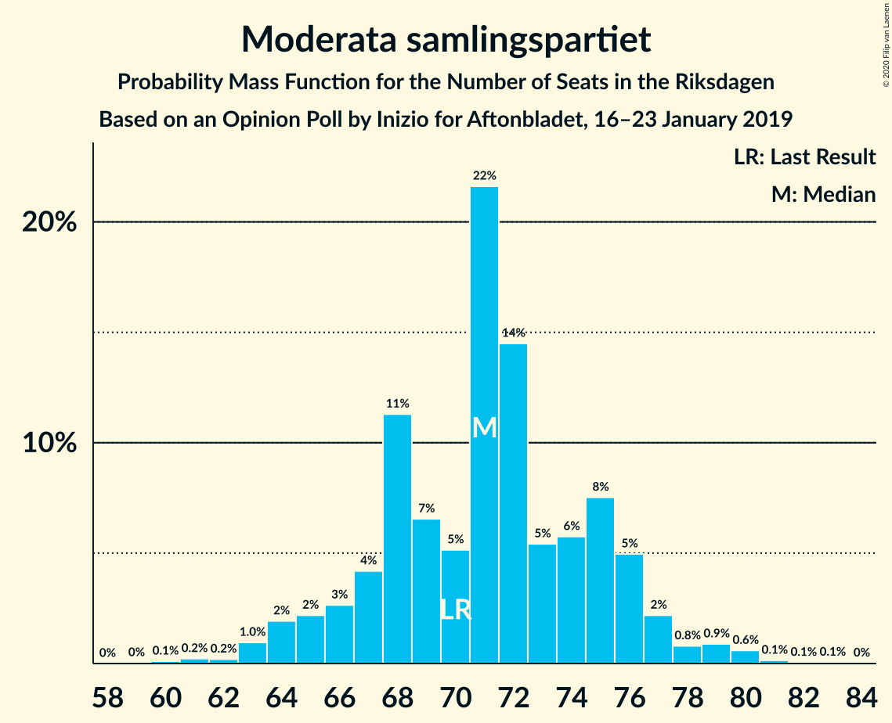
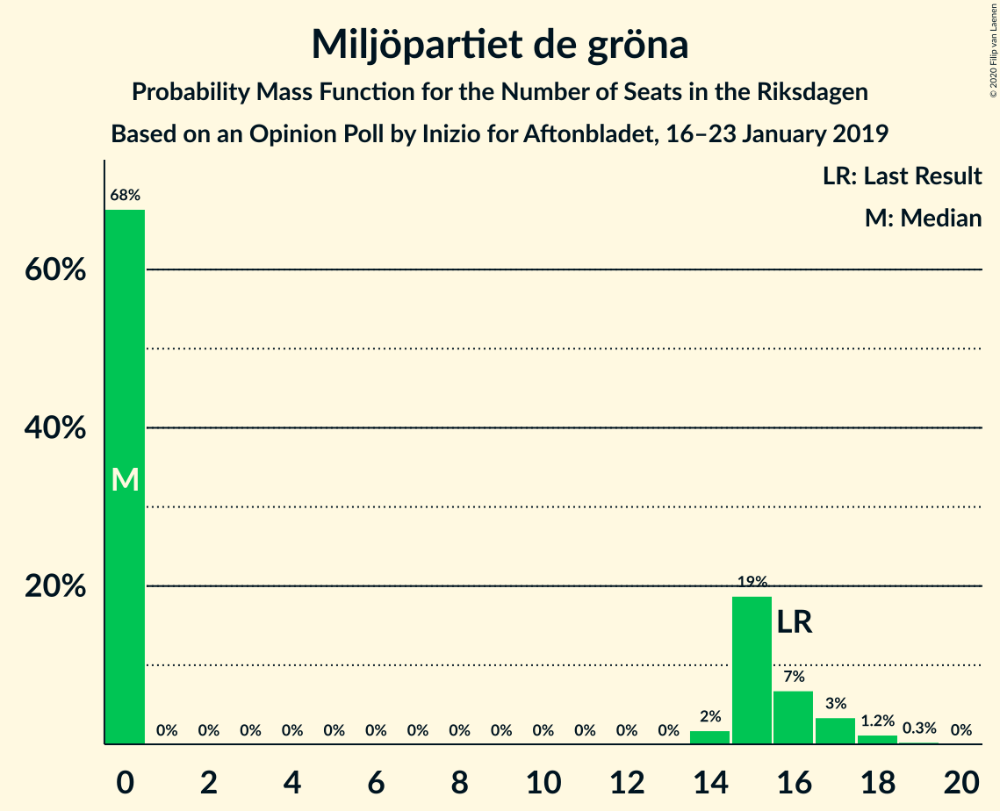
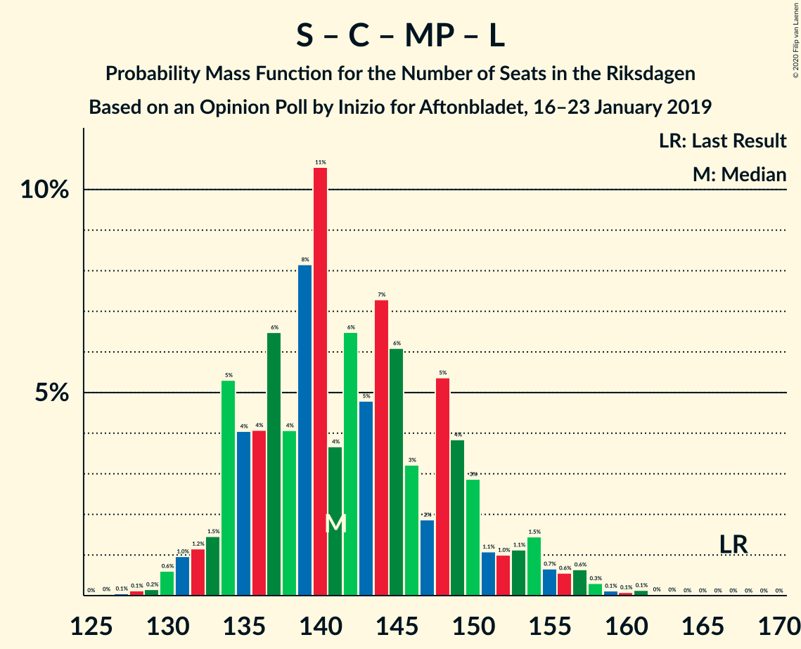

# Opinion Poll by Inizio for Aftonbladet, 16–23 January 2019

<a href="#voting-intentions">Voting Intentions</a> | <a href="#seats">Seats</a> | <a href="#coalitions">Coalitions</a> | <a href="#technical-information">Technical Information</a>

## Voting Intentions

### Confidence Intervals

| Party | Last Result | Poll Result | 80% Confidence Interval | 90% Confidence Interval | 95% Confidence Interval | 99% Confidence Interval |
|:-----:|:-----------:|:-----------:|:-----------------------:|:-----------------------:|:-----------------------:|:-----------------------:|
| Sveriges socialdemokratiska arbetareparti | 28.3% | 28.2% | 26.9–29.5% |26.6–29.9% |26.3–30.2% |25.7–30.8% |
| Moderata samlingspartiet | 19.8% | 19.0% | 17.9–20.1% |17.6–20.5% |17.4–20.7% |16.9–21.3% |
| Sverigedemokraterna | 17.5% | 18.4% | 17.3–19.5% |17.0–19.8% |16.8–20.1% |16.3–20.7% |
| Vänsterpartiet | 8.0% | 9.7% | 8.9–10.5% |8.7–10.8% |8.5–11.0% |8.1–11.5% |
| Centerpartiet | 8.6% | 8.3% | 7.5–9.1% |7.3–9.3% |7.2–9.6% |6.8–10.0% |
| Kristdemokraterna | 6.3% | 8.3% | 7.5–9.1% |7.3–9.3% |7.2–9.6% |6.8–10.0% |
| Miljöpartiet de gröna | 4.4% | 3.8% | 3.3–4.4% |3.2–4.5% |3.0–4.7% |2.8–5.0% |
| Liberalerna | 5.5% | 3.2% | 2.8–3.8% |2.6–3.9% |2.5–4.1% |2.3–4.3% |

*Note:* The poll result column reflects the actual value used in the calculations. Published results may vary slightly, and in addition be rounded to fewer digits.

## Seats

### Confidence Intervals

| Party | Last Result | Median | 80% Confidence Interval | 90% Confidence Interval | 95% Confidence Interval | 99% Confidence Interval |
|:-----:|:-----------:|:------:|:-----------------------:|:-----------------------:|:-----------------------:|:-----------------------:|
| <a href="#sveriges-socialdemokratiska-arbetareparti">Sveriges socialdemokratiska arbetareparti</a> | 100 | 105 | 99–110 |98–112 |97–113 |94–116 |
| <a href="#moderata-samlingspartiet">Moderata samlingspartiet</a> | 70 | 71 | 67–75 |65–76 |64–78 |62–80 |
| <a href="#sverigedemokraterna">Sverigedemokraterna</a> | 62 | 68 | 64–73 |63–75 |62–76 |60–78 |
| <a href="#vänsterpartiet">Vänsterpartiet</a> | 28 | 36 | 33–39 |32–41 |32–42 |30–43 |
| <a href="#centerpartiet">Centerpartiet</a> | 31 | 31 | 28–35 |27–35 |27–36 |25–37 |
| <a href="#kristdemokraterna">Kristdemokraterna</a> | 22 | 31 | 28–34 |27–35 |27–36 |25–37 |
| <a href="#miljöpartiet-de-gröna">Miljöpartiet de gröna</a> | 16 | 0 | 0–16 |0–16 |0–17 |0–18 |
| <a href="#liberalerna">Liberalerna</a> | 20 | 0 | 0 |0 |0–15 |0–16 |

### Sveriges socialdemokratiska arbetareparti

*For a full overview of the results for this party, see the [Sveriges socialdemokratiska arbetareparti](party-sverigessocialdemokratiskaarbetareparti.html) page.*

| Number of Seats | Probability | Accumulated | Special Marks |
|:---------------:|:-----------:|:-----------:|:-------------:|
| 91 | 0% | 100% |  |
| 92 | 0.2% | 99.9% |  |
| 93 | 0.1% | 99.8% |  |
| 94 | 0.3% | 99.7% |  |
| 95 | 0.5% | 99.4% |  |
| 96 | 1.1% | 98.8% |  |
| 97 | 2% | 98% |  |
| 98 | 2% | 96% |  |
| 99 | 4% | 94% |  |
| 100 | 3% | 90% | Last Result |
| 101 | 7% | 87% |  |
| 102 | 12% | 79% |  |
| 103 | 5% | 68% |  |
| 104 | 6% | 63% |  |
| 105 | 7% | 57% | Median |
| 106 | 6% | 49% |  |
| 107 | 11% | 43% |  |
| 108 | 9% | 33% |  |
| 109 | 7% | 23% |  |
| 110 | 7% | 16% |  |
| 111 | 3% | 10% |  |
| 112 | 3% | 7% |  |
| 113 | 1.4% | 4% |  |
| 114 | 1.2% | 2% |  |
| 115 | 0.4% | 1.0% |  |
| 116 | 0.3% | 0.6% |  |
| 117 | 0.1% | 0.3% |  |
| 118 | 0.1% | 0.2% |  |
| 119 | 0% | 0% |  |

### Moderata samlingspartiet

*For a full overview of the results for this party, see the [Moderata samlingspartiet](party-moderatasamlingspartiet.html) page.*

| Number of Seats | Probability | Accumulated | Special Marks |
|:---------------:|:-----------:|:-----------:|:-------------:|
| 60 | 0.1% | 100% |  |
| 61 | 0.2% | 99.8% |  |
| 62 | 0.2% | 99.6% |  |
| 63 | 1.0% | 99.4% |  |
| 64 | 2% | 98% |  |
| 65 | 2% | 97% |  |
| 66 | 3% | 94% |  |
| 67 | 4% | 92% |  |
| 68 | 11% | 88% |  |
| 69 | 7% | 76% |  |
| 70 | 5% | 70% | Last Result |
| 71 | 22% | 65% | Median |
| 72 | 14% | 43% |  |
| 73 | 5% | 28% |  |
| 74 | 6% | 23% |  |
| 75 | 8% | 17% |  |
| 76 | 5% | 10% |  |
| 77 | 2% | 5% |  |
| 78 | 0.8% | 3% |  |
| 79 | 0.9% | 2% |  |
| 80 | 0.6% | 0.9% |  |
| 81 | 0.1% | 0.3% |  |
| 82 | 0.1% | 0.1% |  |
| 83 | 0.1% | 0.1% |  |
| 84 | 0% | 0% |  |

### Sverigedemokraterna

*For a full overview of the results for this party, see the [Sverigedemokraterna](party-sverigedemokraterna.html) page.*

| Number of Seats | Probability | Accumulated | Special Marks |
|:---------------:|:-----------:|:-----------:|:-------------:|
| 58 | 0.1% | 100% |  |
| 59 | 0.2% | 99.9% |  |
| 60 | 0.3% | 99.7% |  |
| 61 | 1.1% | 99.4% |  |
| 62 | 2% | 98% | Last Result |
| 63 | 3% | 97% |  |
| 64 | 5% | 93% |  |
| 65 | 8% | 88% |  |
| 66 | 12% | 80% |  |
| 67 | 7% | 69% |  |
| 68 | 12% | 61% | Median |
| 69 | 9% | 49% |  |
| 70 | 7% | 40% |  |
| 71 | 12% | 33% |  |
| 72 | 6% | 20% |  |
| 73 | 5% | 14% |  |
| 74 | 3% | 9% |  |
| 75 | 3% | 6% |  |
| 76 | 1.0% | 3% |  |
| 77 | 1.1% | 2% |  |
| 78 | 0.3% | 0.6% |  |
| 79 | 0.2% | 0.3% |  |
| 80 | 0.1% | 0.1% |  |
| 81 | 0% | 0% |  |

### Vänsterpartiet

*For a full overview of the results for this party, see the [Vänsterpartiet](party-vänsterpartiet.html) page.*

| Number of Seats | Probability | Accumulated | Special Marks |
|:---------------:|:-----------:|:-----------:|:-------------:|
| 28 | 0% | 100% | Last Result |
| 29 | 0.2% | 100% |  |
| 30 | 0.7% | 99.7% |  |
| 31 | 1.4% | 99.0% |  |
| 32 | 4% | 98% |  |
| 33 | 5% | 94% |  |
| 34 | 15% | 88% |  |
| 35 | 13% | 74% |  |
| 36 | 14% | 61% | Median |
| 37 | 18% | 47% |  |
| 38 | 11% | 29% |  |
| 39 | 9% | 19% |  |
| 40 | 4% | 10% |  |
| 41 | 3% | 6% |  |
| 42 | 2% | 3% |  |
| 43 | 0.6% | 0.9% |  |
| 44 | 0.2% | 0.3% |  |
| 45 | 0.1% | 0.1% |  |
| 46 | 0% | 0% |  |

### Centerpartiet

*For a full overview of the results for this party, see the [Centerpartiet](party-centerpartiet.html) page.*

| Number of Seats | Probability | Accumulated | Special Marks |
|:---------------:|:-----------:|:-----------:|:-------------:|
| 24 | 0.2% | 100% |  |
| 25 | 0.5% | 99.8% |  |
| 26 | 0.9% | 99.4% |  |
| 27 | 5% | 98% |  |
| 28 | 11% | 94% |  |
| 29 | 11% | 83% |  |
| 30 | 9% | 72% |  |
| 31 | 16% | 63% | Last Result, Median |
| 32 | 22% | 47% |  |
| 33 | 9% | 24% |  |
| 34 | 5% | 15% |  |
| 35 | 7% | 11% |  |
| 36 | 2% | 3% |  |
| 37 | 0.5% | 0.9% |  |
| 38 | 0.2% | 0.4% |  |
| 39 | 0.1% | 0.2% |  |
| 40 | 0% | 0% |  |

### Kristdemokraterna

*For a full overview of the results for this party, see the [Kristdemokraterna](party-kristdemokraterna.html) page.*

| Number of Seats | Probability | Accumulated | Special Marks |
|:---------------:|:-----------:|:-----------:|:-------------:|
| 22 | 0% | 100% | Last Result |
| 23 | 0% | 100% |  |
| 24 | 0.1% | 100% |  |
| 25 | 0.4% | 99.8% |  |
| 26 | 1.3% | 99.5% |  |
| 27 | 5% | 98% |  |
| 28 | 7% | 93% |  |
| 29 | 9% | 86% |  |
| 30 | 17% | 77% |  |
| 31 | 14% | 60% | Median |
| 32 | 20% | 46% |  |
| 33 | 13% | 26% |  |
| 34 | 5% | 13% |  |
| 35 | 4% | 9% |  |
| 36 | 4% | 5% |  |
| 37 | 0.7% | 1.1% |  |
| 38 | 0.3% | 0.4% |  |
| 39 | 0.1% | 0.1% |  |
| 40 | 0% | 0% |  |

### Miljöpartiet de gröna

*For a full overview of the results for this party, see the [Miljöpartiet de gröna](party-miljöpartietdegröna.html) page.*

| Number of Seats | Probability | Accumulated | Special Marks |
|:---------------:|:-----------:|:-----------:|:-------------:|
| 0 | 68% | 100% | Median |
| 1 | 0% | 32% |  |
| 2 | 0% | 32% |  |
| 3 | 0% | 32% |  |
| 4 | 0% | 32% |  |
| 5 | 0% | 32% |  |
| 6 | 0% | 32% |  |
| 7 | 0% | 32% |  |
| 8 | 0% | 32% |  |
| 9 | 0% | 32% |  |
| 10 | 0% | 32% |  |
| 11 | 0% | 32% |  |
| 12 | 0% | 32% |  |
| 13 | 0% | 32% |  |
| 14 | 2% | 32% |  |
| 15 | 19% | 31% |  |
| 16 | 7% | 12% | Last Result |
| 17 | 3% | 5% |  |
| 18 | 1.2% | 2% |  |
| 19 | 0.3% | 0.3% |  |
| 20 | 0% | 0% |  |

### Liberalerna

*For a full overview of the results for this party, see the [Liberalerna](party-liberalerna.html) page.*

| Number of Seats | Probability | Accumulated | Special Marks |
|:---------------:|:-----------:|:-----------:|:-------------:|
| 0 | 96% | 100% | Median |
| 1 | 0% | 4% |  |
| 2 | 0% | 4% |  |
| 3 | 0% | 4% |  |
| 4 | 0% | 4% |  |
| 5 | 0% | 4% |  |
| 6 | 0% | 4% |  |
| 7 | 0% | 4% |  |
| 8 | 0% | 4% |  |
| 9 | 0% | 4% |  |
| 10 | 0% | 4% |  |
| 11 | 0% | 4% |  |
| 12 | 0% | 4% |  |
| 13 | 0% | 4% |  |
| 14 | 0.4% | 4% |  |
| 15 | 3% | 3% |  |
| 16 | 0.5% | 0.6% |  |
| 17 | 0.1% | 0.1% |  |
| 18 | 0% | 0% |  |
| 19 | 0% | 0% |  |
| 20 | 0% | 0% | Last Result |

## Coalitions

### Confidence Intervals

| Coalition | Last Result | Median | Majority? | 80% Confidence Interval | 90% Confidence Interval | 95% Confidence Interval | 99% Confidence Interval |
|:---------:|:-----------:|:------:|:---------:|:-----------------------:|:-----------------------:|:-----------------------:|:-----------------------:|
| Sveriges socialdemokratiska arbetareparti – Moderata samlingspartiet – Centerpartiet | 201 | 208 | 100% | 198–215 | 197–217 | 195–218 | 191–220 |
| Sveriges socialdemokratiska arbetareparti – Vänsterpartiet – Centerpartiet – Miljöpartiet de gröna – Liberalerna | 195 | 178 | 71% | 171–185 | 170–187 | 169–190 | 166–193 |
| Sveriges socialdemokratiska arbetareparti – Moderata samlingspartiet | 170 | 177 | 64% | 169–183 | 167–185 | 165–186 | 161–189 |
| Moderata samlingspartiet – Sverigedemokraterna – Kristdemokraterna | 154 | 171 | 29% | 164–178 | 162–179 | 159–180 | 156–183 |
| Sveriges socialdemokratiska arbetareparti – Vänsterpartiet – Miljöpartiet de gröna | 144 | 146 | 0% | 139–154 | 138–157 | 136–158 | 134–161 |
| Sveriges socialdemokratiska arbetareparti – Centerpartiet – Miljöpartiet de gröna – Liberalerna | 167 | 141 | 0% | 135–150 | 134–153 | 132–155 | 130–158 |
| Sveriges socialdemokratiska arbetareparti – Vänsterpartiet | 128 | 142 | 0% | 135–148 | 133–149 | 131–151 | 128–153 |
| Moderata samlingspartiet – Sverigedemokraterna | 132 | 139 | 0% | 134–146 | 132–147 | 130–149 | 126–151 |
| Moderata samlingspartiet – Centerpartiet – Kristdemokraterna – Liberalerna | 143 | 134 | 0% | 127–139 | 126–141 | 124–143 | 121–148 |
| Moderata samlingspartiet – Centerpartiet – Kristdemokraterna | 123 | 134 | 0% | 127–139 | 125–140 | 123–142 | 121–144 |
| Sveriges socialdemokratiska arbetareparti – Miljöpartiet de gröna | 116 | 109 | 0% | 102–119 | 102–122 | 100–123 | 98–126 |
| Moderata samlingspartiet – Centerpartiet – Liberalerna | 121 | 103 | 0% | 97–108 | 96–110 | 94–112 | 92–117 |
| Moderata samlingspartiet – Centerpartiet | 101 | 103 | 0% | 96–107 | 95–109 | 94–110 | 91–112 |

### Sveriges socialdemokratiska arbetareparti – Moderata samlingspartiet – Centerpartiet

| Number of Seats | Probability | Accumulated | Special Marks |
|:---------------:|:-----------:|:-----------:|:-------------:|
| 187 | 0% | 100% |  |
| 188 | 0.1% | 99.9% |  |
| 189 | 0.1% | 99.8% |  |
| 190 | 0.2% | 99.8% |  |
| 191 | 0.1% | 99.5% |  |
| 192 | 0.7% | 99.4% |  |
| 193 | 0.3% | 98.8% |  |
| 194 | 0.5% | 98.5% |  |
| 195 | 1.3% | 98% |  |
| 196 | 1.0% | 97% |  |
| 197 | 1.3% | 96% |  |
| 198 | 5% | 94% |  |
| 199 | 2% | 90% |  |
| 200 | 3% | 88% |  |
| 201 | 1.4% | 84% | Last Result |
| 202 | 6% | 83% |  |
| 203 | 4% | 77% |  |
| 204 | 6% | 73% |  |
| 205 | 5% | 67% |  |
| 206 | 4% | 62% |  |
| 207 | 3% | 58% | Median |
| 208 | 6% | 55% |  |
| 209 | 11% | 49% |  |
| 210 | 3% | 38% |  |
| 211 | 8% | 35% |  |
| 212 | 3% | 27% |  |
| 213 | 7% | 24% |  |
| 214 | 5% | 17% |  |
| 215 | 5% | 12% |  |
| 216 | 2% | 7% |  |
| 217 | 2% | 5% |  |
| 218 | 1.0% | 3% |  |
| 219 | 1.1% | 2% |  |
| 220 | 0.6% | 0.9% |  |
| 221 | 0.2% | 0.3% |  |
| 222 | 0.1% | 0.2% |  |
| 223 | 0% | 0.1% |  |
| 224 | 0% | 0% |  |

### Sveriges socialdemokratiska arbetareparti – Vänsterpartiet – Centerpartiet – Miljöpartiet de gröna – Liberalerna

| Number of Seats | Probability | Accumulated | Special Marks |
|:---------------:|:-----------:|:-----------:|:-------------:|
| 163 | 0% | 100% |  |
| 164 | 0.1% | 99.9% |  |
| 165 | 0.2% | 99.8% |  |
| 166 | 0.3% | 99.7% |  |
| 167 | 0.9% | 99.4% |  |
| 168 | 0.7% | 98% |  |
| 169 | 2% | 98% |  |
| 170 | 2% | 96% |  |
| 171 | 6% | 94% |  |
| 172 | 3% | 88% | Median |
| 173 | 5% | 85% |  |
| 174 | 9% | 80% |  |
| 175 | 4% | 71% | Majority |
| 176 | 5% | 67% |  |
| 177 | 7% | 62% |  |
| 178 | 7% | 55% |  |
| 179 | 9% | 48% |  |
| 180 | 7% | 40% |  |
| 181 | 7% | 33% |  |
| 182 | 7% | 25% |  |
| 183 | 2% | 18% |  |
| 184 | 5% | 16% |  |
| 185 | 2% | 11% |  |
| 186 | 2% | 9% |  |
| 187 | 2% | 7% |  |
| 188 | 1.4% | 5% |  |
| 189 | 0.7% | 3% |  |
| 190 | 1.1% | 3% |  |
| 191 | 0.5% | 2% |  |
| 192 | 0.6% | 1.2% |  |
| 193 | 0.2% | 0.6% |  |
| 194 | 0.1% | 0.4% |  |
| 195 | 0.2% | 0.3% | Last Result |
| 196 | 0% | 0.1% |  |
| 197 | 0% | 0.1% |  |
| 198 | 0% | 0% |  |

### Sveriges socialdemokratiska arbetareparti – Moderata samlingspartiet

| Number of Seats | Probability | Accumulated | Special Marks |
|:---------------:|:-----------:|:-----------:|:-------------:|
| 157 | 0% | 100% |  |
| 158 | 0% | 99.9% |  |
| 159 | 0% | 99.9% |  |
| 160 | 0.3% | 99.9% |  |
| 161 | 0.5% | 99.5% |  |
| 162 | 0.3% | 99.0% |  |
| 163 | 0.5% | 98.7% |  |
| 164 | 0.5% | 98% |  |
| 165 | 0.6% | 98% |  |
| 166 | 1.4% | 97% |  |
| 167 | 3% | 96% |  |
| 168 | 2% | 93% |  |
| 169 | 2% | 91% |  |
| 170 | 4% | 89% | Last Result |
| 171 | 3% | 85% |  |
| 172 | 8% | 82% |  |
| 173 | 4% | 74% |  |
| 174 | 7% | 71% |  |
| 175 | 4% | 64% | Majority |
| 176 | 8% | 60% | Median |
| 177 | 9% | 52% |  |
| 178 | 7% | 43% |  |
| 179 | 7% | 35% |  |
| 180 | 5% | 28% |  |
| 181 | 6% | 23% |  |
| 182 | 3% | 17% |  |
| 183 | 5% | 14% |  |
| 184 | 3% | 9% |  |
| 185 | 2% | 5% |  |
| 186 | 2% | 4% |  |
| 187 | 0.7% | 2% |  |
| 188 | 0.6% | 1.2% |  |
| 189 | 0.3% | 0.7% |  |
| 190 | 0.2% | 0.3% |  |
| 191 | 0.1% | 0.2% |  |
| 192 | 0% | 0.1% |  |
| 193 | 0% | 0% |  |

### Moderata samlingspartiet – Sverigedemokraterna – Kristdemokraterna

| Number of Seats | Probability | Accumulated | Special Marks |
|:---------------:|:-----------:|:-----------:|:-------------:|
| 152 | 0% | 100% |  |
| 153 | 0% | 99.9% |  |
| 154 | 0.2% | 99.9% | Last Result |
| 155 | 0.1% | 99.7% |  |
| 156 | 0.2% | 99.6% |  |
| 157 | 0.6% | 99.4% |  |
| 158 | 0.5% | 98.8% |  |
| 159 | 1.1% | 98% |  |
| 160 | 0.7% | 97% |  |
| 161 | 1.4% | 97% |  |
| 162 | 2% | 95% |  |
| 163 | 2% | 93% |  |
| 164 | 2% | 91% |  |
| 165 | 5% | 89% |  |
| 166 | 2% | 84% |  |
| 167 | 7% | 82% |  |
| 168 | 7% | 75% |  |
| 169 | 7% | 67% |  |
| 170 | 9% | 60% | Median |
| 171 | 7% | 52% |  |
| 172 | 7% | 45% |  |
| 173 | 5% | 38% |  |
| 174 | 4% | 33% |  |
| 175 | 9% | 29% | Majority |
| 176 | 5% | 20% |  |
| 177 | 3% | 15% |  |
| 178 | 6% | 12% |  |
| 179 | 2% | 6% |  |
| 180 | 2% | 4% |  |
| 181 | 0.7% | 2% |  |
| 182 | 0.9% | 2% |  |
| 183 | 0.3% | 0.6% |  |
| 184 | 0.2% | 0.3% |  |
| 185 | 0.1% | 0.2% |  |
| 186 | 0% | 0.1% |  |
| 187 | 0% | 0% |  |

### Sveriges socialdemokratiska arbetareparti – Vänsterpartiet – Miljöpartiet de gröna

| Number of Seats | Probability | Accumulated | Special Marks |
|:---------------:|:-----------:|:-----------:|:-------------:|
| 130 | 0.1% | 100% |  |
| 131 | 0.1% | 99.9% |  |
| 132 | 0.1% | 99.8% |  |
| 133 | 0.1% | 99.7% |  |
| 134 | 0.5% | 99.6% |  |
| 135 | 0.3% | 99.1% |  |
| 136 | 1.4% | 98.7% |  |
| 137 | 0.8% | 97% |  |
| 138 | 3% | 97% |  |
| 139 | 6% | 94% |  |
| 140 | 2% | 87% |  |
| 141 | 6% | 85% | Median |
| 142 | 7% | 79% |  |
| 143 | 8% | 72% |  |
| 144 | 5% | 65% | Last Result |
| 145 | 5% | 60% |  |
| 146 | 8% | 55% |  |
| 147 | 4% | 47% |  |
| 148 | 7% | 42% |  |
| 149 | 5% | 35% |  |
| 150 | 6% | 30% |  |
| 151 | 3% | 24% |  |
| 152 | 2% | 21% |  |
| 153 | 6% | 19% |  |
| 154 | 4% | 13% |  |
| 155 | 3% | 9% |  |
| 156 | 1.3% | 6% |  |
| 157 | 2% | 5% |  |
| 158 | 1.2% | 3% |  |
| 159 | 0.8% | 2% |  |
| 160 | 0.7% | 1.4% |  |
| 161 | 0.3% | 0.6% |  |
| 162 | 0.1% | 0.3% |  |
| 163 | 0.1% | 0.2% |  |
| 164 | 0% | 0.1% |  |
| 165 | 0% | 0.1% |  |
| 166 | 0% | 0% |  |

### Sveriges socialdemokratiska arbetareparti – Centerpartiet – Miljöpartiet de gröna – Liberalerna

| Number of Seats | Probability | Accumulated | Special Marks |
|:---------------:|:-----------:|:-----------:|:-------------:|
| 126 | 0% | 100% |  |
| 127 | 0.1% | 99.9% |  |
| 128 | 0.1% | 99.9% |  |
| 129 | 0.2% | 99.8% |  |
| 130 | 0.6% | 99.6% |  |
| 131 | 1.0% | 99.0% |  |
| 132 | 1.2% | 98% |  |
| 133 | 1.5% | 97% |  |
| 134 | 5% | 95% |  |
| 135 | 4% | 90% |  |
| 136 | 4% | 86% | Median |
| 137 | 6% | 82% |  |
| 138 | 4% | 76% |  |
| 139 | 8% | 71% |  |
| 140 | 11% | 63% |  |
| 141 | 4% | 53% |  |
| 142 | 6% | 49% |  |
| 143 | 5% | 43% |  |
| 144 | 7% | 38% |  |
| 145 | 6% | 30% |  |
| 146 | 3% | 24% |  |
| 147 | 2% | 21% |  |
| 148 | 5% | 19% |  |
| 149 | 4% | 14% |  |
| 150 | 3% | 10% |  |
| 151 | 1.1% | 7% |  |
| 152 | 1.0% | 6% |  |
| 153 | 1.1% | 5% |  |
| 154 | 1.5% | 4% |  |
| 155 | 0.7% | 3% |  |
| 156 | 0.6% | 2% |  |
| 157 | 0.6% | 1.4% |  |
| 158 | 0.3% | 0.7% |  |
| 159 | 0.1% | 0.4% |  |
| 160 | 0.1% | 0.3% |  |
| 161 | 0.1% | 0.2% |  |
| 162 | 0% | 0.1% |  |
| 163 | 0% | 0% |  |
| 164 | 0% | 0% |  |
| 165 | 0% | 0% |  |
| 166 | 0% | 0% |  |
| 167 | 0% | 0% | Last Result |

### Sveriges socialdemokratiska arbetareparti – Vänsterpartiet

| Number of Seats | Probability | Accumulated | Special Marks |
|:---------------:|:-----------:|:-----------:|:-------------:|
| 125 | 0.1% | 100% |  |
| 126 | 0.1% | 99.9% |  |
| 127 | 0.1% | 99.8% |  |
| 128 | 0.5% | 99.7% | Last Result |
| 129 | 0.3% | 99.2% |  |
| 130 | 0.7% | 98.9% |  |
| 131 | 1.1% | 98% |  |
| 132 | 0.9% | 97% |  |
| 133 | 2% | 96% |  |
| 134 | 1.1% | 94% |  |
| 135 | 7% | 93% |  |
| 136 | 3% | 86% |  |
| 137 | 3% | 83% |  |
| 138 | 9% | 80% |  |
| 139 | 8% | 71% |  |
| 140 | 5% | 63% |  |
| 141 | 7% | 58% | Median |
| 142 | 9% | 51% |  |
| 143 | 8% | 42% |  |
| 144 | 5% | 34% |  |
| 145 | 5% | 29% |  |
| 146 | 7% | 24% |  |
| 147 | 4% | 17% |  |
| 148 | 6% | 13% |  |
| 149 | 3% | 7% |  |
| 150 | 2% | 5% |  |
| 151 | 1.3% | 3% |  |
| 152 | 0.6% | 2% |  |
| 153 | 0.7% | 1.0% |  |
| 154 | 0.2% | 0.4% |  |
| 155 | 0.1% | 0.2% |  |
| 156 | 0% | 0.1% |  |
| 157 | 0% | 0% |  |

### Moderata samlingspartiet – Sverigedemokraterna

| Number of Seats | Probability | Accumulated | Special Marks |
|:---------------:|:-----------:|:-----------:|:-------------:|
| 123 | 0% | 100% |  |
| 124 | 0.2% | 99.9% |  |
| 125 | 0.1% | 99.8% |  |
| 126 | 0.2% | 99.7% |  |
| 127 | 0.3% | 99.5% |  |
| 128 | 0.8% | 99.2% |  |
| 129 | 0.6% | 98% |  |
| 130 | 1.1% | 98% |  |
| 131 | 1.3% | 97% |  |
| 132 | 2% | 95% | Last Result |
| 133 | 2% | 93% |  |
| 134 | 3% | 91% |  |
| 135 | 5% | 87% |  |
| 136 | 9% | 83% |  |
| 137 | 9% | 74% |  |
| 138 | 7% | 65% |  |
| 139 | 8% | 58% | Median |
| 140 | 6% | 50% |  |
| 141 | 6% | 43% |  |
| 142 | 6% | 37% |  |
| 143 | 9% | 31% |  |
| 144 | 4% | 22% |  |
| 145 | 6% | 18% |  |
| 146 | 5% | 12% |  |
| 147 | 2% | 7% |  |
| 148 | 2% | 5% |  |
| 149 | 1.0% | 3% |  |
| 150 | 0.6% | 2% |  |
| 151 | 0.8% | 1.2% |  |
| 152 | 0.2% | 0.4% |  |
| 153 | 0.1% | 0.2% |  |
| 154 | 0% | 0.1% |  |
| 155 | 0% | 0% |  |

### Moderata samlingspartiet – Centerpartiet – Kristdemokraterna – Liberalerna

| Number of Seats | Probability | Accumulated | Special Marks |
|:---------------:|:-----------:|:-----------:|:-------------:|
| 118 | 0% | 100% |  |
| 119 | 0.1% | 99.9% |  |
| 120 | 0.1% | 99.9% |  |
| 121 | 0.3% | 99.7% |  |
| 122 | 0.8% | 99.4% |  |
| 123 | 0.7% | 98.5% |  |
| 124 | 0.7% | 98% |  |
| 125 | 2% | 97% |  |
| 126 | 2% | 95% |  |
| 127 | 3% | 93% |  |
| 128 | 4% | 90% |  |
| 129 | 3% | 86% |  |
| 130 | 7% | 83% |  |
| 131 | 10% | 76% |  |
| 132 | 6% | 67% |  |
| 133 | 6% | 60% | Median |
| 134 | 8% | 54% |  |
| 135 | 8% | 47% |  |
| 136 | 5% | 38% |  |
| 137 | 8% | 33% |  |
| 138 | 6% | 25% |  |
| 139 | 11% | 20% |  |
| 140 | 2% | 9% |  |
| 141 | 2% | 7% |  |
| 142 | 1.1% | 5% |  |
| 143 | 1.0% | 4% | Last Result |
| 144 | 1.1% | 2% |  |
| 145 | 0.4% | 1.4% |  |
| 146 | 0.2% | 1.0% |  |
| 147 | 0.2% | 0.8% |  |
| 148 | 0.2% | 0.6% |  |
| 149 | 0.1% | 0.4% |  |
| 150 | 0.1% | 0.3% |  |
| 151 | 0.1% | 0.2% |  |
| 152 | 0.1% | 0.1% |  |
| 153 | 0% | 0% |  |

### Moderata samlingspartiet – Centerpartiet – Kristdemokraterna

| Number of Seats | Probability | Accumulated | Special Marks |
|:---------------:|:-----------:|:-----------:|:-------------:|
| 117 | 0.1% | 100% |  |
| 118 | 0% | 99.9% |  |
| 119 | 0.1% | 99.9% |  |
| 120 | 0.2% | 99.8% |  |
| 121 | 0.4% | 99.6% |  |
| 122 | 1.0% | 99.2% |  |
| 123 | 0.9% | 98% | Last Result |
| 124 | 1.3% | 97% |  |
| 125 | 2% | 96% |  |
| 126 | 3% | 94% |  |
| 127 | 4% | 91% |  |
| 128 | 4% | 88% |  |
| 129 | 4% | 84% |  |
| 130 | 7% | 80% |  |
| 131 | 10% | 73% |  |
| 132 | 6% | 64% |  |
| 133 | 6% | 57% | Median |
| 134 | 8% | 51% |  |
| 135 | 8% | 43% |  |
| 136 | 5% | 35% |  |
| 137 | 8% | 30% |  |
| 138 | 5% | 22% |  |
| 139 | 10% | 16% |  |
| 140 | 2% | 6% |  |
| 141 | 2% | 5% |  |
| 142 | 0.7% | 3% |  |
| 143 | 0.8% | 2% |  |
| 144 | 0.6% | 1.1% |  |
| 145 | 0.2% | 0.5% |  |
| 146 | 0.1% | 0.2% |  |
| 147 | 0.1% | 0.1% |  |
| 148 | 0% | 0.1% |  |
| 149 | 0% | 0% |  |

### Sveriges socialdemokratiska arbetareparti – Miljöpartiet de gröna

| Number of Seats | Probability | Accumulated | Special Marks |
|:---------------:|:-----------:|:-----------:|:-------------:|
| 95 | 0% | 100% |  |
| 96 | 0.1% | 99.9% |  |
| 97 | 0.3% | 99.8% |  |
| 98 | 0.6% | 99.5% |  |
| 99 | 0.7% | 98.9% |  |
| 100 | 0.9% | 98% |  |
| 101 | 1.1% | 97% |  |
| 102 | 6% | 96% |  |
| 103 | 3% | 90% |  |
| 104 | 6% | 87% |  |
| 105 | 5% | 82% | Median |
| 106 | 4% | 76% |  |
| 107 | 9% | 72% |  |
| 108 | 9% | 63% |  |
| 109 | 6% | 54% |  |
| 110 | 6% | 48% |  |
| 111 | 4% | 41% |  |
| 112 | 4% | 37% |  |
| 113 | 4% | 33% |  |
| 114 | 3% | 29% |  |
| 115 | 2% | 26% |  |
| 116 | 7% | 24% | Last Result |
| 117 | 6% | 18% |  |
| 118 | 1.5% | 12% |  |
| 119 | 2% | 11% |  |
| 120 | 2% | 8% |  |
| 121 | 1.1% | 6% |  |
| 122 | 2% | 5% |  |
| 123 | 2% | 4% |  |
| 124 | 1.2% | 2% |  |
| 125 | 0.3% | 0.9% |  |
| 126 | 0.2% | 0.5% |  |
| 127 | 0.2% | 0.3% |  |
| 128 | 0.1% | 0.1% |  |
| 129 | 0% | 0.1% |  |
| 130 | 0% | 0% |  |

### Moderata samlingspartiet – Centerpartiet – Liberalerna

| Number of Seats | Probability | Accumulated | Special Marks |
|:---------------:|:-----------:|:-----------:|:-------------:|
| 89 | 0.1% | 100% |  |
| 90 | 0.1% | 99.9% |  |
| 91 | 0.2% | 99.8% |  |
| 92 | 0.3% | 99.6% |  |
| 93 | 0.8% | 99.3% |  |
| 94 | 1.4% | 98.6% |  |
| 95 | 2% | 97% |  |
| 96 | 5% | 95% |  |
| 97 | 2% | 90% |  |
| 98 | 3% | 88% |  |
| 99 | 8% | 85% |  |
| 100 | 8% | 77% |  |
| 101 | 9% | 69% |  |
| 102 | 5% | 60% | Median |
| 103 | 13% | 55% |  |
| 104 | 10% | 41% |  |
| 105 | 5% | 32% |  |
| 106 | 6% | 27% |  |
| 107 | 8% | 21% |  |
| 108 | 3% | 13% |  |
| 109 | 3% | 10% |  |
| 110 | 2% | 7% |  |
| 111 | 2% | 5% |  |
| 112 | 1.4% | 3% |  |
| 113 | 0.3% | 2% |  |
| 114 | 0.4% | 1.5% |  |
| 115 | 0.2% | 1.1% |  |
| 116 | 0.2% | 0.9% |  |
| 117 | 0.2% | 0.7% |  |
| 118 | 0.1% | 0.5% |  |
| 119 | 0.2% | 0.3% |  |
| 120 | 0% | 0.1% |  |
| 121 | 0% | 0.1% | Last Result |
| 122 | 0.1% | 0.1% |  |
| 123 | 0% | 0% |  |

### Moderata samlingspartiet – Centerpartiet

| Number of Seats | Probability | Accumulated | Special Marks |
|:---------------:|:-----------:|:-----------:|:-------------:|
| 88 | 0.1% | 100% |  |
| 89 | 0.1% | 99.9% |  |
| 90 | 0.2% | 99.8% |  |
| 91 | 0.2% | 99.7% |  |
| 92 | 0.3% | 99.4% |  |
| 93 | 0.9% | 99.1% |  |
| 94 | 2% | 98% |  |
| 95 | 2% | 96% |  |
| 96 | 5% | 94% |  |
| 97 | 3% | 89% |  |
| 98 | 4% | 86% |  |
| 99 | 8% | 82% |  |
| 100 | 8% | 74% |  |
| 101 | 9% | 66% | Last Result |
| 102 | 5% | 57% | Median |
| 103 | 13% | 51% |  |
| 104 | 10% | 38% |  |
| 105 | 5% | 28% |  |
| 106 | 6% | 23% |  |
| 107 | 8% | 17% |  |
| 108 | 3% | 10% |  |
| 109 | 3% | 7% |  |
| 110 | 1.3% | 3% |  |
| 111 | 1.2% | 2% |  |
| 112 | 0.6% | 1.0% |  |
| 113 | 0.1% | 0.4% |  |
| 114 | 0.2% | 0.3% |  |
| 115 | 0.1% | 0.1% |  |
| 116 | 0% | 0% |  |

## Technical Information

### Opinion Poll

+ **Polling firm:** Inizio
+ **Commissioner(s):** Aftonbladet
+ **Fieldwork period:** 16–23 January 2019

### Calculations

+ **Sample size:** 2089
+ **Simulations done:** 1,048,576
+ **Error estimate:** 0.94%

