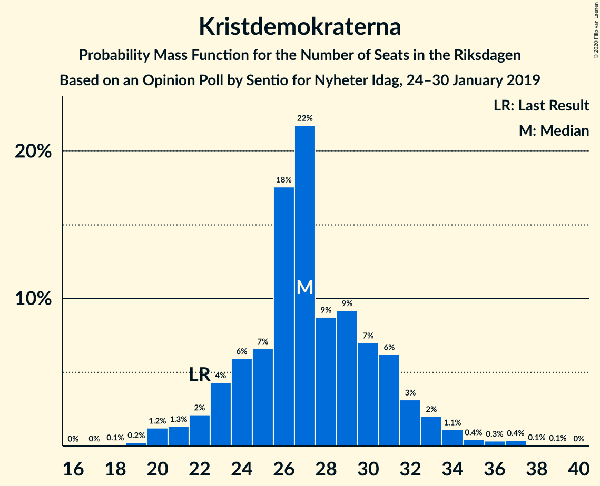
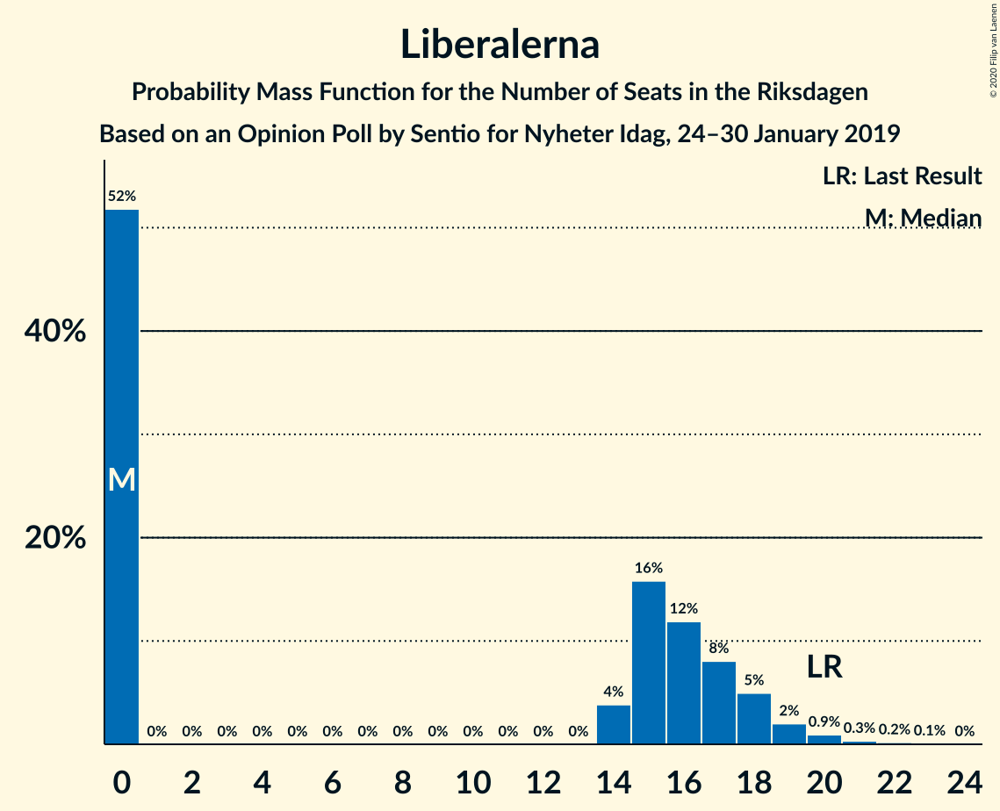
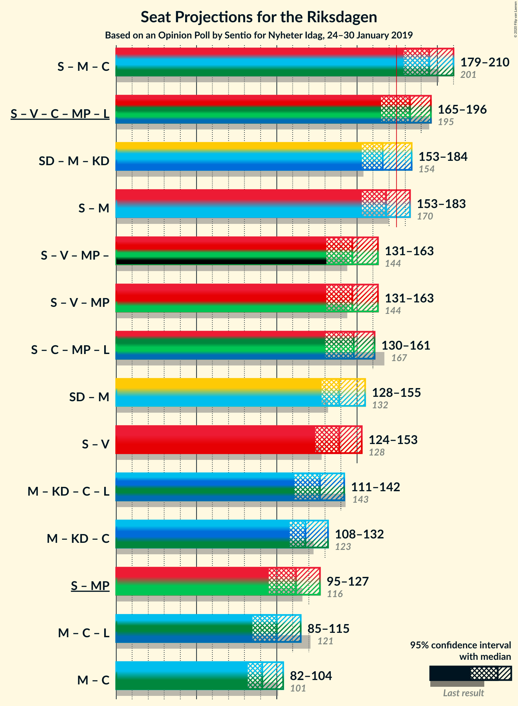
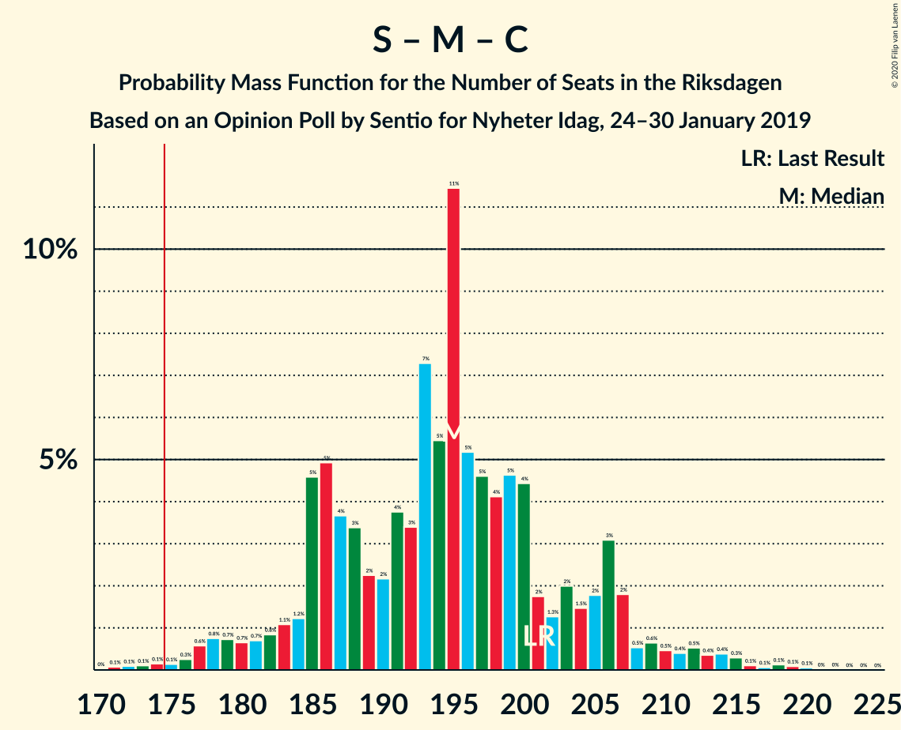
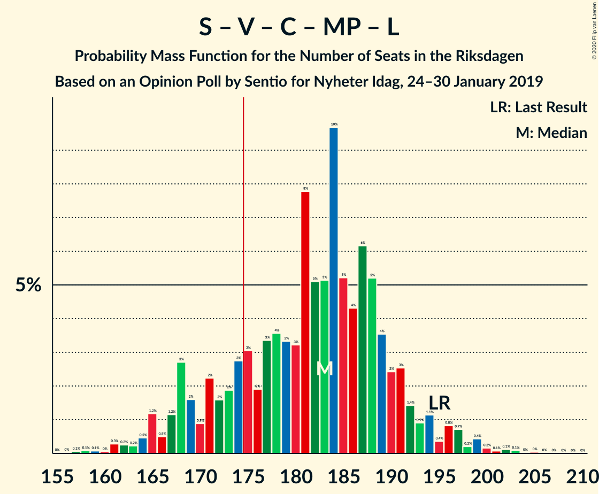
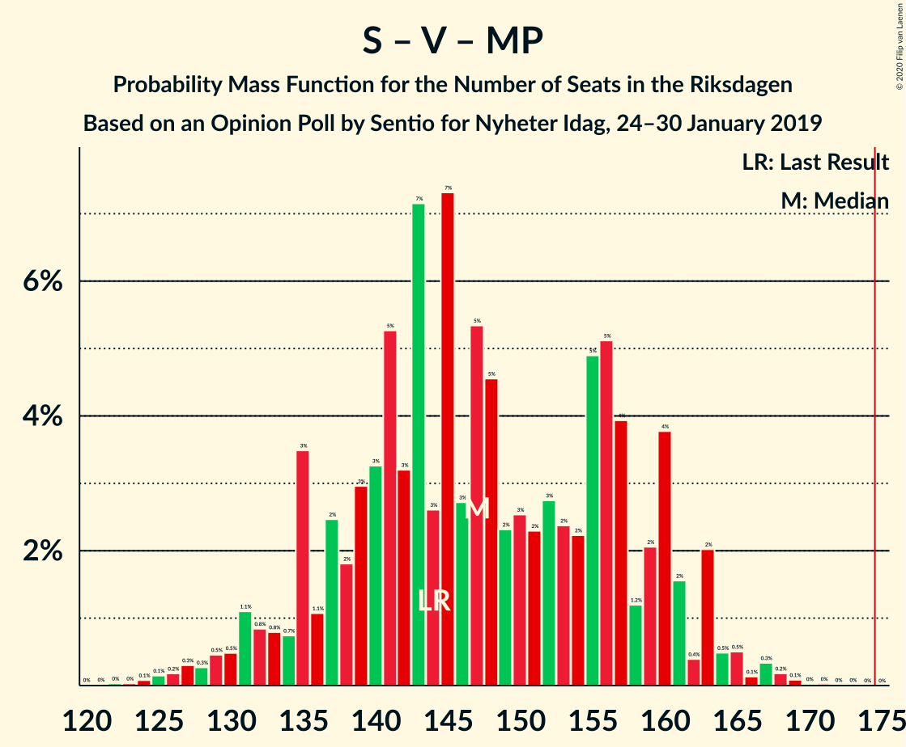
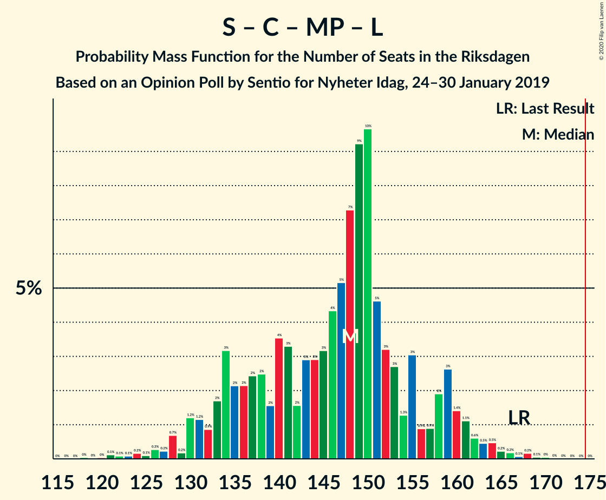

# Opinion Poll by Sentio for Nyheter Idag, 24–30 January 2019

<a href="#voting-intentions">Voting Intentions</a> | <a href="#seats">Seats</a> | <a href="#coalitions">Coalitions</a> | <a href="#technical-information">Technical Information</a>

## Voting Intentions

### Confidence Intervals

| Party | Last Result | Poll Result | 80% Confidence Interval | 90% Confidence Interval | 95% Confidence Interval | 99% Confidence Interval |
|:-----:|:-----------:|:-----------:|:-----------------------:|:-----------------------:|:-----------------------:|:-----------------------:|
| Sveriges socialdemokratiska arbetareparti | 28.3% | 27.8% | 26.0–29.6% |25.5–30.2% |25.1–30.6% |24.2–31.6% |
| Sverigedemokraterna | 17.5% | 20.4% | 18.8–22.1% |18.4–22.6% |18.0–23.0% |17.3–23.8% |
| Moderata samlingspartiet | 19.8% | 17.7% | 16.2–19.3% |15.8–19.8% |15.4–20.2% |14.8–21.0% |
| Vänsterpartiet | 8.0% | 9.5% | 8.4–10.8% |8.1–11.2% |7.8–11.5% |7.3–12.1% |
| Kristdemokraterna | 6.3% | 7.3% | 6.3–8.5% |6.1–8.8% |5.8–9.1% |5.4–9.7% |
| Centerpartiet | 8.6% | 7.1% | 6.1–8.2% |5.9–8.6% |5.7–8.9% |5.2–9.4% |
| Miljöpartiet de gröna | 4.4% | 4.0% | 3.3–4.9% |3.1–5.2% |2.9–5.4% |2.6–5.9% |
| Liberalerna | 5.5% | 3.9% | 3.2–4.8% |3.0–5.1% |2.9–5.3% |2.6–5.8% |

*Note:* The poll result column reflects the actual value used in the calculations. Published results may vary slightly, and in addition be rounded to fewer digits.

## Seats

### Confidence Intervals

| Party | Last Result | Median | 80% Confidence Interval | 90% Confidence Interval | 95% Confidence Interval | 99% Confidence Interval |
|:-----:|:-----------:|:------:|:-----------------------:|:-----------------------:|:-----------------------:|:-----------------------:|
| <a href="#sveriges-socialdemokratiska-arbetareparti">Sveriges socialdemokratiska arbetareparti</a> | 100 | 104 | 96–108 |92–112 |89–114 |88–120 |
| <a href="#sverigedemokraterna">Sverigedemokraterna</a> | 62 | 72 | 69–83 |67–86 |65–86 |63–91 |
| <a href="#moderata-samlingspartiet">Moderata samlingspartiet</a> | 70 | 65 | 61–71 |58–73 |57–75 |54–79 |
| <a href="#vänsterpartiet">Vänsterpartiet</a> | 28 | 36 | 30–40 |30–41 |28–43 |26–45 |
| <a href="#kristdemokraterna">Kristdemokraterna</a> | 22 | 27 | 24–32 |23–32 |21–34 |20–37 |
| <a href="#centerpartiet">Centerpartiet</a> | 31 | 27 | 23–30 |22–31 |21–33 |19–35 |
| <a href="#miljöpartiet-de-gröna">Miljöpartiet de gröna</a> | 16 | 15 | 0–18 |0–19 |0–20 |0–21 |
| <a href="#liberalerna">Liberalerna</a> | 20 | 0 | 0–18 |0–18 |0–18 |0–21 |

### Sveriges socialdemokratiska arbetareparti

*For a full overview of the results for this party, see the [Sveriges socialdemokratiska arbetareparti](party-sverigessocialdemokratiskaarbetareparti.html) page.*

| Number of Seats | Probability | Accumulated | Special Marks |
|:---------------:|:-----------:|:-----------:|:-------------:|
| 84 | 0% | 100% |  |
| 85 | 0% | 99.9% |  |
| 86 | 0% | 99.9% |  |
| 87 | 0.2% | 99.9% |  |
| 88 | 0.2% | 99.7% |  |
| 89 | 2% | 99.5% |  |
| 90 | 0.5% | 97% |  |
| 91 | 1.3% | 97% |  |
| 92 | 1.3% | 96% |  |
| 93 | 1.4% | 94% |  |
| 94 | 1.4% | 93% |  |
| 95 | 0.8% | 92% |  |
| 96 | 2% | 91% |  |
| 97 | 0.8% | 89% |  |
| 98 | 3% | 88% |  |
| 99 | 6% | 85% |  |
| 100 | 6% | 80% | Last Result |
| 101 | 4% | 74% |  |
| 102 | 14% | 70% |  |
| 103 | 4% | 56% |  |
| 104 | 28% | 51% | Median |
| 105 | 5% | 23% |  |
| 106 | 5% | 18% |  |
| 107 | 2% | 13% |  |
| 108 | 3% | 11% |  |
| 109 | 2% | 9% |  |
| 110 | 0.7% | 7% |  |
| 111 | 0.7% | 6% |  |
| 112 | 1.0% | 5% |  |
| 113 | 0.7% | 4% |  |
| 114 | 1.2% | 3% |  |
| 115 | 0.2% | 2% |  |
| 116 | 0.2% | 2% |  |
| 117 | 0.5% | 2% |  |
| 118 | 0.1% | 1.4% |  |
| 119 | 0.1% | 1.3% |  |
| 120 | 1.1% | 1.2% |  |
| 121 | 0% | 0.1% |  |
| 122 | 0.1% | 0.1% |  |
| 123 | 0% | 0% |  |

### Sverigedemokraterna

*For a full overview of the results for this party, see the [Sverigedemokraterna](party-sverigedemokraterna.html) page.*

| Number of Seats | Probability | Accumulated | Special Marks |
|:---------------:|:-----------:|:-----------:|:-------------:|
| 60 | 0.1% | 100% |  |
| 61 | 0.1% | 99.9% |  |
| 62 | 0.2% | 99.8% | Last Result |
| 63 | 0.2% | 99.6% |  |
| 64 | 0.6% | 99.4% |  |
| 65 | 2% | 98.8% |  |
| 66 | 1.2% | 97% |  |
| 67 | 0.5% | 95% |  |
| 68 | 2% | 95% |  |
| 69 | 11% | 93% |  |
| 70 | 3% | 82% |  |
| 71 | 3% | 80% |  |
| 72 | 29% | 77% | Median |
| 73 | 4% | 47% |  |
| 74 | 7% | 44% |  |
| 75 | 2% | 37% |  |
| 76 | 2% | 35% |  |
| 77 | 10% | 33% |  |
| 78 | 2% | 23% |  |
| 79 | 2% | 21% |  |
| 80 | 0.9% | 19% |  |
| 81 | 3% | 18% |  |
| 82 | 4% | 15% |  |
| 83 | 2% | 11% |  |
| 84 | 0.5% | 9% |  |
| 85 | 0.7% | 9% |  |
| 86 | 6% | 8% |  |
| 87 | 0.6% | 2% |  |
| 88 | 0.1% | 2% |  |
| 89 | 0% | 1.5% |  |
| 90 | 0.1% | 1.5% |  |
| 91 | 1.3% | 1.4% |  |
| 92 | 0.1% | 0.1% |  |
| 93 | 0% | 0% |  |

### Moderata samlingspartiet

*For a full overview of the results for this party, see the [Moderata samlingspartiet](party-moderatasamlingspartiet.html) page.*

| Number of Seats | Probability | Accumulated | Special Marks |
|:---------------:|:-----------:|:-----------:|:-------------:|
| 50 | 0% | 100% |  |
| 51 | 0% | 99.9% |  |
| 52 | 0.1% | 99.9% |  |
| 53 | 0.2% | 99.8% |  |
| 54 | 0.4% | 99.6% |  |
| 55 | 0.4% | 99.2% |  |
| 56 | 0.7% | 98.8% |  |
| 57 | 1.1% | 98% |  |
| 58 | 3% | 97% |  |
| 59 | 2% | 94% |  |
| 60 | 1.4% | 92% |  |
| 61 | 5% | 90% |  |
| 62 | 8% | 85% |  |
| 63 | 2% | 77% |  |
| 64 | 22% | 75% |  |
| 65 | 16% | 53% | Median |
| 66 | 11% | 37% |  |
| 67 | 3% | 27% |  |
| 68 | 3% | 23% |  |
| 69 | 4% | 20% |  |
| 70 | 4% | 16% | Last Result |
| 71 | 5% | 12% |  |
| 72 | 2% | 7% |  |
| 73 | 2% | 5% |  |
| 74 | 0.4% | 4% |  |
| 75 | 2% | 3% |  |
| 76 | 0.4% | 2% |  |
| 77 | 0.1% | 1.1% |  |
| 78 | 0.1% | 1.1% |  |
| 79 | 0.5% | 1.0% |  |
| 80 | 0.4% | 0.4% |  |
| 81 | 0% | 0.1% |  |
| 82 | 0% | 0% |  |

### Vänsterpartiet

*For a full overview of the results for this party, see the [Vänsterpartiet](party-vänsterpartiet.html) page.*

| Number of Seats | Probability | Accumulated | Special Marks |
|:---------------:|:-----------:|:-----------:|:-------------:|
| 26 | 0.5% | 100% |  |
| 27 | 0.3% | 99.5% |  |
| 28 | 2% | 99.2% | Last Result |
| 29 | 1.5% | 97% |  |
| 30 | 8% | 96% |  |
| 31 | 5% | 88% |  |
| 32 | 3% | 83% |  |
| 33 | 5% | 80% |  |
| 34 | 2% | 75% |  |
| 35 | 22% | 73% |  |
| 36 | 11% | 51% | Median |
| 37 | 3% | 41% |  |
| 38 | 2% | 38% |  |
| 39 | 8% | 36% |  |
| 40 | 22% | 28% |  |
| 41 | 3% | 6% |  |
| 42 | 0.6% | 3% |  |
| 43 | 0.5% | 3% |  |
| 44 | 2% | 2% |  |
| 45 | 0.4% | 0.6% |  |
| 46 | 0.1% | 0.2% |  |
| 47 | 0% | 0.1% |  |
| 48 | 0.1% | 0.1% |  |
| 49 | 0% | 0.1% |  |
| 50 | 0% | 0% |  |

### Kristdemokraterna

*For a full overview of the results for this party, see the [Kristdemokraterna](party-kristdemokraterna.html) page.*

| Number of Seats | Probability | Accumulated | Special Marks |
|:---------------:|:-----------:|:-----------:|:-------------:|
| 19 | 0.4% | 100% |  |
| 20 | 1.4% | 99.6% |  |
| 21 | 1.0% | 98% |  |
| 22 | 1.0% | 97% | Last Result |
| 23 | 4% | 96% |  |
| 24 | 5% | 92% |  |
| 25 | 8% | 88% |  |
| 26 | 24% | 79% |  |
| 27 | 20% | 55% | Median |
| 28 | 14% | 35% |  |
| 29 | 3% | 21% |  |
| 30 | 5% | 18% |  |
| 31 | 2% | 14% |  |
| 32 | 8% | 12% |  |
| 33 | 0.6% | 4% |  |
| 34 | 1.4% | 3% |  |
| 35 | 0.6% | 2% |  |
| 36 | 0.4% | 1.4% |  |
| 37 | 0.8% | 1.0% |  |
| 38 | 0.2% | 0.3% |  |
| 39 | 0.1% | 0.1% |  |
| 40 | 0% | 0% |  |

### Centerpartiet

*For a full overview of the results for this party, see the [Centerpartiet](party-centerpartiet.html) page.*

| Number of Seats | Probability | Accumulated | Special Marks |
|:---------------:|:-----------:|:-----------:|:-------------:|
| 17 | 0% | 100% |  |
| 18 | 0.3% | 99.9% |  |
| 19 | 0.4% | 99.6% |  |
| 20 | 0.4% | 99.2% |  |
| 21 | 2% | 98.8% |  |
| 22 | 4% | 97% |  |
| 23 | 7% | 93% |  |
| 24 | 2% | 86% |  |
| 25 | 4% | 84% |  |
| 26 | 19% | 80% |  |
| 27 | 27% | 61% | Median |
| 28 | 3% | 34% |  |
| 29 | 8% | 31% |  |
| 30 | 15% | 23% |  |
| 31 | 3% | 8% | Last Result |
| 32 | 1.3% | 5% |  |
| 33 | 1.4% | 3% |  |
| 34 | 1.3% | 2% |  |
| 35 | 0.4% | 0.6% |  |
| 36 | 0.1% | 0.3% |  |
| 37 | 0% | 0.2% |  |
| 38 | 0.1% | 0.2% |  |
| 39 | 0% | 0% |  |

### Miljöpartiet de gröna

*For a full overview of the results for this party, see the [Miljöpartiet de gröna](party-miljöpartietdegröna.html) page.*

| Number of Seats | Probability | Accumulated | Special Marks |
|:---------------:|:-----------:|:-----------:|:-------------:|
| 0 | 41% | 100% |  |
| 1 | 0% | 59% |  |
| 2 | 0% | 59% |  |
| 3 | 0% | 59% |  |
| 4 | 0% | 59% |  |
| 5 | 0% | 59% |  |
| 6 | 0% | 59% |  |
| 7 | 0% | 59% |  |
| 8 | 0% | 59% |  |
| 9 | 0% | 59% |  |
| 10 | 0% | 59% |  |
| 11 | 0% | 59% |  |
| 12 | 0% | 59% |  |
| 13 | 0% | 59% |  |
| 14 | 7% | 59% |  |
| 15 | 5% | 52% | Median |
| 16 | 27% | 48% | Last Result |
| 17 | 9% | 21% |  |
| 18 | 4% | 12% |  |
| 19 | 5% | 8% |  |
| 20 | 2% | 3% |  |
| 21 | 0.7% | 1.1% |  |
| 22 | 0.3% | 0.4% |  |
| 23 | 0% | 0.1% |  |
| 24 | 0% | 0.1% |  |
| 25 | 0% | 0.1% |  |
| 26 | 0% | 0% |  |

### Liberalerna

*For a full overview of the results for this party, see the [Liberalerna](party-liberalerna.html) page.*

| Number of Seats | Probability | Accumulated | Special Marks |
|:---------------:|:-----------:|:-----------:|:-------------:|
| 0 | 60% | 100% | Median |
| 1 | 0% | 40% |  |
| 2 | 0% | 40% |  |
| 3 | 0% | 40% |  |
| 4 | 0% | 40% |  |
| 5 | 0% | 40% |  |
| 6 | 0% | 40% |  |
| 7 | 0% | 40% |  |
| 8 | 0% | 40% |  |
| 9 | 0% | 40% |  |
| 10 | 0% | 40% |  |
| 11 | 0% | 40% |  |
| 12 | 0% | 40% |  |
| 13 | 0% | 40% |  |
| 14 | 0.6% | 40% |  |
| 15 | 10% | 40% |  |
| 16 | 11% | 29% |  |
| 17 | 4% | 18% |  |
| 18 | 11% | 14% |  |
| 19 | 0.8% | 2% |  |
| 20 | 0.7% | 2% | Last Result |
| 21 | 0.7% | 1.0% |  |
| 22 | 0.1% | 0.2% |  |
| 23 | 0.1% | 0.1% |  |
| 24 | 0% | 0% |  |

## Coalitions

### Confidence Intervals

| Coalition | Last Result | Median | Majority? | 80% Confidence Interval | 90% Confidence Interval | 95% Confidence Interval | 99% Confidence Interval |
|:---------:|:-----------:|:------:|:---------:|:-----------------------:|:-----------------------:|:-----------------------:|:-----------------------:|
| Sveriges socialdemokratiska arbetareparti – Moderata samlingspartiet – Centerpartiet | 201 | 195 | 99.6% | 187–203 | 184–207 | 181–211 | 175–215 |
| Sveriges socialdemokratiska arbetareparti – Vänsterpartiet – Centerpartiet – Miljöpartiet de gröna – Liberalerna | 195 | 184 | 82% | 169–190 | 165–192 | 165–196 | 162–200 |
| Sveriges socialdemokratiska arbetareparti – Moderata samlingspartiet | 170 | 168 | 15% | 159–177 | 157–181 | 154–184 | 150–189 |
| Sverigedemokraterna – Moderata samlingspartiet – Kristdemokraterna | 154 | 165 | 18% | 159–180 | 157–184 | 153–184 | 149–186 |
| Sveriges socialdemokratiska arbetareparti – Vänsterpartiet – Miljöpartiet de gröna | 144 | 147 | 0% | 137–160 | 136–160 | 131–162 | 127–165 |
| Sveriges socialdemokratiska arbetareparti – Centerpartiet – Miljöpartiet de gröna – Liberalerna | 167 | 147 | 0% | 132–158 | 130–158 | 129–161 | 126–165 |
| Sverigedemokraterna – Moderata samlingspartiet | 132 | 137 | 0% | 134–152 | 130–153 | 129–158 | 123–160 |
| Sveriges socialdemokratiska arbetareparti – Vänsterpartiet | 128 | 139 | 0% | 129–146 | 127–148 | 125–149 | 120–157 |
| Moderata samlingspartiet – Kristdemokraterna – Centerpartiet – Liberalerna | 143 | 124 | 0% | 117–140 | 116–140 | 114–141 | 109–146 |
| Moderata samlingspartiet – Kristdemokraterna – Centerpartiet | 123 | 118 | 0% | 113–127 | 110–129 | 108–132 | 103–136 |
| Sveriges socialdemokratiska arbetareparti – Miljöpartiet de gröna | 116 | 113 | 0% | 102–123 | 101–124 | 99–125 | 93–131 |
| Moderata samlingspartiet – Centerpartiet – Liberalerna | 121 | 97 | 0% | 90–113 | 88–113 | 88–113 | 83–118 |
| Moderata samlingspartiet – Centerpartiet | 101 | 91 | 0% | 88–97 | 84–100 | 82–103 | 76–110 |

### Sveriges socialdemokratiska arbetareparti – Moderata samlingspartiet – Centerpartiet

| Number of Seats | Probability | Accumulated | Special Marks |
|:---------------:|:-----------:|:-----------:|:-------------:|
| 171 | 0.1% | 100% |  |
| 172 | 0.1% | 99.9% |  |
| 173 | 0.2% | 99.8% |  |
| 174 | 0% | 99.6% |  |
| 175 | 0.3% | 99.6% | Majority |
| 176 | 0.2% | 99.3% |  |
| 177 | 0.5% | 99.1% |  |
| 178 | 0.6% | 98.7% |  |
| 179 | 0.3% | 98% |  |
| 180 | 0.2% | 98% |  |
| 181 | 0.8% | 98% |  |
| 182 | 0.3% | 97% |  |
| 183 | 1.0% | 97% |  |
| 184 | 1.0% | 96% |  |
| 185 | 1.2% | 95% |  |
| 186 | 3% | 93% |  |
| 187 | 2% | 90% |  |
| 188 | 3% | 88% |  |
| 189 | 2% | 85% |  |
| 190 | 6% | 83% |  |
| 191 | 5% | 77% |  |
| 192 | 2% | 72% |  |
| 193 | 6% | 69% |  |
| 194 | 4% | 63% |  |
| 195 | 20% | 59% |  |
| 196 | 8% | 40% | Median |
| 197 | 10% | 32% |  |
| 198 | 1.3% | 22% |  |
| 199 | 0.5% | 21% |  |
| 200 | 3% | 20% |  |
| 201 | 2% | 18% | Last Result |
| 202 | 0.7% | 16% |  |
| 203 | 6% | 15% |  |
| 204 | 2% | 9% |  |
| 205 | 0.8% | 7% |  |
| 206 | 0.3% | 6% |  |
| 207 | 2% | 6% |  |
| 208 | 0.6% | 4% |  |
| 209 | 0.1% | 3% |  |
| 210 | 0.2% | 3% |  |
| 211 | 0.3% | 3% |  |
| 212 | 0.7% | 2% |  |
| 213 | 0.4% | 2% |  |
| 214 | 0.7% | 1.4% |  |
| 215 | 0.4% | 0.7% |  |
| 216 | 0% | 0.3% |  |
| 217 | 0% | 0.3% |  |
| 218 | 0% | 0.3% |  |
| 219 | 0% | 0.3% |  |
| 220 | 0.2% | 0.3% |  |
| 221 | 0% | 0% |  |

### Sveriges socialdemokratiska arbetareparti – Vänsterpartiet – Centerpartiet – Miljöpartiet de gröna – Liberalerna

| Number of Seats | Probability | Accumulated | Special Marks |
|:---------------:|:-----------:|:-----------:|:-------------:|
| 156 | 0% | 100% |  |
| 157 | 0.2% | 99.9% |  |
| 158 | 0.1% | 99.7% |  |
| 159 | 0.1% | 99.7% |  |
| 160 | 0% | 99.6% |  |
| 161 | 0% | 99.6% |  |
| 162 | 0.2% | 99.6% |  |
| 163 | 0.2% | 99.4% |  |
| 164 | 2% | 99.3% |  |
| 165 | 6% | 98% |  |
| 166 | 0.1% | 92% |  |
| 167 | 1.4% | 92% |  |
| 168 | 0.1% | 90% |  |
| 169 | 0.4% | 90% |  |
| 170 | 0.7% | 90% |  |
| 171 | 1.3% | 89% |  |
| 172 | 2% | 88% |  |
| 173 | 3% | 85% |  |
| 174 | 0.6% | 82% |  |
| 175 | 0.9% | 82% | Majority |
| 176 | 2% | 81% |  |
| 177 | 0.9% | 79% |  |
| 178 | 1.4% | 78% |  |
| 179 | 2% | 77% |  |
| 180 | 5% | 74% |  |
| 181 | 4% | 69% |  |
| 182 | 11% | 65% | Median |
| 183 | 1.2% | 54% |  |
| 184 | 3% | 52% |  |
| 185 | 9% | 49% |  |
| 186 | 0.5% | 41% |  |
| 187 | 21% | 40% |  |
| 188 | 8% | 20% |  |
| 189 | 1.1% | 11% |  |
| 190 | 4% | 10% |  |
| 191 | 1.2% | 7% |  |
| 192 | 0.9% | 5% |  |
| 193 | 0.9% | 5% |  |
| 194 | 1.0% | 4% |  |
| 195 | 0.2% | 3% | Last Result |
| 196 | 1.3% | 3% |  |
| 197 | 0.3% | 1.3% |  |
| 198 | 0.2% | 1.0% |  |
| 199 | 0.2% | 0.8% |  |
| 200 | 0.2% | 0.6% |  |
| 201 | 0.1% | 0.4% |  |
| 202 | 0.1% | 0.2% |  |
| 203 | 0% | 0.1% |  |
| 204 | 0.1% | 0.1% |  |
| 205 | 0% | 0% |  |

### Sveriges socialdemokratiska arbetareparti – Moderata samlingspartiet

| Number of Seats | Probability | Accumulated | Special Marks |
|:---------------:|:-----------:|:-----------:|:-------------:|
| 145 | 0.1% | 100% |  |
| 146 | 0% | 99.9% |  |
| 147 | 0% | 99.9% |  |
| 148 | 0.1% | 99.9% |  |
| 149 | 0.3% | 99.8% |  |
| 150 | 0.1% | 99.5% |  |
| 151 | 0.5% | 99.4% |  |
| 152 | 0.5% | 98.9% |  |
| 153 | 0.3% | 98% |  |
| 154 | 0.7% | 98% |  |
| 155 | 0.8% | 97% |  |
| 156 | 0.7% | 97% |  |
| 157 | 1.1% | 96% |  |
| 158 | 3% | 95% |  |
| 159 | 2% | 92% |  |
| 160 | 2% | 90% |  |
| 161 | 2% | 88% |  |
| 162 | 2% | 85% |  |
| 163 | 2% | 83% |  |
| 164 | 13% | 81% |  |
| 165 | 2% | 68% |  |
| 166 | 3% | 66% |  |
| 167 | 9% | 63% |  |
| 168 | 19% | 54% |  |
| 169 | 1.1% | 35% | Median |
| 170 | 9% | 34% | Last Result |
| 171 | 3% | 25% |  |
| 172 | 3% | 22% |  |
| 173 | 2% | 19% |  |
| 174 | 1.5% | 17% |  |
| 175 | 0.7% | 15% | Majority |
| 176 | 2% | 15% |  |
| 177 | 6% | 13% |  |
| 178 | 0.8% | 7% |  |
| 179 | 0.1% | 6% |  |
| 180 | 0.4% | 6% |  |
| 181 | 0.7% | 5% |  |
| 182 | 2% | 5% |  |
| 183 | 0.4% | 3% |  |
| 184 | 1.1% | 3% |  |
| 185 | 0.6% | 1.5% |  |
| 186 | 0.3% | 0.9% |  |
| 187 | 0.1% | 0.6% |  |
| 188 | 0% | 0.5% |  |
| 189 | 0.3% | 0.5% |  |
| 190 | 0% | 0.2% |  |
| 191 | 0% | 0.2% |  |
| 192 | 0.1% | 0.2% |  |
| 193 | 0% | 0% |  |

### Sverigedemokraterna – Moderata samlingspartiet – Kristdemokraterna

| Number of Seats | Probability | Accumulated | Special Marks |
|:---------------:|:-----------:|:-----------:|:-------------:|
| 145 | 0.1% | 100% |  |
| 146 | 0% | 99.9% |  |
| 147 | 0.1% | 99.9% |  |
| 148 | 0.2% | 99.8% |  |
| 149 | 0.2% | 99.6% |  |
| 150 | 0.2% | 99.4% |  |
| 151 | 0.2% | 99.2% |  |
| 152 | 0.3% | 99.0% |  |
| 153 | 1.3% | 98.6% |  |
| 154 | 0.2% | 97% | Last Result |
| 155 | 1.1% | 97% |  |
| 156 | 0.9% | 96% |  |
| 157 | 0.9% | 95% |  |
| 158 | 1.2% | 94% |  |
| 159 | 4% | 93% |  |
| 160 | 1.1% | 89% |  |
| 161 | 8% | 88% |  |
| 162 | 21% | 80% |  |
| 163 | 0.5% | 60% |  |
| 164 | 9% | 59% | Median |
| 165 | 3% | 51% |  |
| 166 | 1.2% | 47% |  |
| 167 | 11% | 46% |  |
| 168 | 4% | 35% |  |
| 169 | 5% | 30% |  |
| 170 | 2% | 25% |  |
| 171 | 1.4% | 23% |  |
| 172 | 0.9% | 22% |  |
| 173 | 2% | 21% |  |
| 174 | 0.9% | 19% |  |
| 175 | 0.7% | 18% | Majority |
| 176 | 3% | 18% |  |
| 177 | 2% | 15% |  |
| 178 | 1.3% | 12% |  |
| 179 | 0.7% | 11% |  |
| 180 | 0.4% | 10% |  |
| 181 | 0.1% | 10% |  |
| 182 | 1.4% | 10% |  |
| 183 | 0.1% | 8% |  |
| 184 | 6% | 8% |  |
| 185 | 2% | 2% |  |
| 186 | 0.2% | 0.7% |  |
| 187 | 0.1% | 0.5% |  |
| 188 | 0% | 0.4% |  |
| 189 | 0% | 0.3% |  |
| 190 | 0.1% | 0.3% |  |
| 191 | 0% | 0.3% |  |
| 192 | 0.2% | 0.3% |  |
| 193 | 0% | 0% |  |

### Sveriges socialdemokratiska arbetareparti – Vänsterpartiet – Miljöpartiet de gröna

| Number of Seats | Probability | Accumulated | Special Marks |
|:---------------:|:-----------:|:-----------:|:-------------:|
| 122 | 0% | 100% |  |
| 123 | 0% | 99.9% |  |
| 124 | 0% | 99.9% |  |
| 125 | 0.1% | 99.9% |  |
| 126 | 0.2% | 99.8% |  |
| 127 | 0.2% | 99.6% |  |
| 128 | 0.1% | 99.4% |  |
| 129 | 0.3% | 99.3% |  |
| 130 | 0.3% | 99.0% |  |
| 131 | 2% | 98.7% |  |
| 132 | 0.9% | 97% |  |
| 133 | 0.3% | 96% |  |
| 134 | 0.4% | 96% |  |
| 135 | 0.2% | 96% |  |
| 136 | 0.5% | 95% |  |
| 137 | 8% | 95% |  |
| 138 | 2% | 87% |  |
| 139 | 7% | 85% |  |
| 140 | 2% | 78% |  |
| 141 | 8% | 76% |  |
| 142 | 2% | 68% |  |
| 143 | 6% | 66% |  |
| 144 | 2% | 60% | Last Result |
| 145 | 2% | 57% |  |
| 146 | 3% | 56% |  |
| 147 | 3% | 53% |  |
| 148 | 3% | 50% |  |
| 149 | 2% | 47% |  |
| 150 | 2% | 45% |  |
| 151 | 4% | 43% |  |
| 152 | 2% | 39% |  |
| 153 | 3% | 37% |  |
| 154 | 1.3% | 35% |  |
| 155 | 0.7% | 34% | Median |
| 156 | 6% | 33% |  |
| 157 | 0.6% | 27% |  |
| 158 | 2% | 26% |  |
| 159 | 1.0% | 24% |  |
| 160 | 19% | 23% |  |
| 161 | 2% | 4% |  |
| 162 | 0.2% | 3% |  |
| 163 | 1.2% | 2% |  |
| 164 | 0.1% | 1.3% |  |
| 165 | 0.9% | 1.2% |  |
| 166 | 0% | 0.4% |  |
| 167 | 0.1% | 0.3% |  |
| 168 | 0.1% | 0.2% |  |
| 169 | 0.1% | 0.2% |  |
| 170 | 0% | 0% |  |

### Sveriges socialdemokratiska arbetareparti – Centerpartiet – Miljöpartiet de gröna – Liberalerna

| Number of Seats | Probability | Accumulated | Special Marks |
|:---------------:|:-----------:|:-----------:|:-------------:|
| 119 | 0% | 100% |  |
| 120 | 0% | 99.9% |  |
| 121 | 0.2% | 99.9% |  |
| 122 | 0.1% | 99.7% |  |
| 123 | 0% | 99.7% |  |
| 124 | 0% | 99.7% |  |
| 125 | 0.1% | 99.6% |  |
| 126 | 0.1% | 99.5% |  |
| 127 | 0.2% | 99.4% |  |
| 128 | 2% | 99.3% |  |
| 129 | 0.5% | 98% |  |
| 130 | 6% | 97% |  |
| 131 | 0.6% | 91% |  |
| 132 | 2% | 90% |  |
| 133 | 1.3% | 88% |  |
| 134 | 0.4% | 87% |  |
| 135 | 0.7% | 87% |  |
| 136 | 0.9% | 86% |  |
| 137 | 1.0% | 85% |  |
| 138 | 0.4% | 84% |  |
| 139 | 2% | 84% |  |
| 140 | 1.3% | 82% |  |
| 141 | 0.6% | 81% |  |
| 142 | 2% | 80% |  |
| 143 | 6% | 78% |  |
| 144 | 4% | 72% |  |
| 145 | 3% | 68% |  |
| 146 | 5% | 64% | Median |
| 147 | 20% | 59% |  |
| 148 | 5% | 39% |  |
| 149 | 4% | 35% |  |
| 150 | 8% | 30% |  |
| 151 | 3% | 22% |  |
| 152 | 2% | 19% |  |
| 153 | 2% | 17% |  |
| 154 | 0.9% | 15% |  |
| 155 | 0.6% | 14% |  |
| 156 | 0.9% | 13% |  |
| 157 | 0.8% | 12% |  |
| 158 | 7% | 12% |  |
| 159 | 0.6% | 5% |  |
| 160 | 1.2% | 4% |  |
| 161 | 1.2% | 3% |  |
| 162 | 0.3% | 2% |  |
| 163 | 0.4% | 1.4% |  |
| 164 | 0.2% | 1.0% |  |
| 165 | 0.3% | 0.7% |  |
| 166 | 0.2% | 0.4% |  |
| 167 | 0% | 0.3% | Last Result |
| 168 | 0.2% | 0.3% |  |
| 169 | 0% | 0.1% |  |
| 170 | 0% | 0.1% |  |
| 171 | 0% | 0.1% |  |
| 172 | 0% | 0% |  |

### Sverigedemokraterna – Moderata samlingspartiet

| Number of Seats | Probability | Accumulated | Special Marks |
|:---------------:|:-----------:|:-----------:|:-------------:|
| 120 | 0.2% | 100% |  |
| 121 | 0% | 99.8% |  |
| 122 | 0.2% | 99.8% |  |
| 123 | 0.2% | 99.6% |  |
| 124 | 0.1% | 99.5% |  |
| 125 | 0.3% | 99.4% |  |
| 126 | 0.3% | 99.1% |  |
| 127 | 0.5% | 98.7% |  |
| 128 | 0.6% | 98% |  |
| 129 | 2% | 98% |  |
| 130 | 2% | 96% |  |
| 131 | 0.4% | 94% |  |
| 132 | 2% | 94% | Last Result |
| 133 | 0.7% | 92% |  |
| 134 | 9% | 91% |  |
| 135 | 2% | 82% |  |
| 136 | 22% | 80% |  |
| 137 | 9% | 58% | Median |
| 138 | 0.7% | 48% |  |
| 139 | 8% | 48% |  |
| 140 | 9% | 40% |  |
| 141 | 3% | 31% |  |
| 142 | 3% | 28% |  |
| 143 | 2% | 25% |  |
| 144 | 2% | 22% |  |
| 145 | 2% | 20% |  |
| 146 | 2% | 19% |  |
| 147 | 1.4% | 17% |  |
| 148 | 1.4% | 15% |  |
| 149 | 0.5% | 14% |  |
| 150 | 0.4% | 13% |  |
| 151 | 1.2% | 13% |  |
| 152 | 6% | 12% |  |
| 153 | 0.5% | 5% |  |
| 154 | 0.4% | 5% |  |
| 155 | 0.8% | 4% |  |
| 156 | 0.5% | 4% |  |
| 157 | 0.1% | 3% |  |
| 158 | 1.1% | 3% |  |
| 159 | 0.4% | 2% |  |
| 160 | 1.4% | 1.5% |  |
| 161 | 0% | 0.1% |  |
| 162 | 0% | 0.1% |  |
| 163 | 0% | 0.1% |  |
| 164 | 0.1% | 0.1% |  |
| 165 | 0% | 0% |  |

### Sveriges socialdemokratiska arbetareparti – Vänsterpartiet

| Number of Seats | Probability | Accumulated | Special Marks |
|:---------------:|:-----------:|:-----------:|:-------------:|
| 117 | 0% | 100% |  |
| 118 | 0.2% | 99.9% |  |
| 119 | 0.1% | 99.7% |  |
| 120 | 0.3% | 99.6% |  |
| 121 | 0.3% | 99.3% |  |
| 122 | 0.1% | 99.1% |  |
| 123 | 0.2% | 99.0% |  |
| 124 | 0.7% | 98.8% |  |
| 125 | 1.2% | 98% |  |
| 126 | 1.2% | 97% |  |
| 127 | 1.5% | 96% |  |
| 128 | 0.8% | 94% | Last Result |
| 129 | 6% | 93% |  |
| 130 | 2% | 87% |  |
| 131 | 3% | 85% |  |
| 132 | 2% | 82% |  |
| 133 | 2% | 80% |  |
| 134 | 2% | 77% |  |
| 135 | 4% | 76% |  |
| 136 | 1.1% | 71% |  |
| 137 | 10% | 70% |  |
| 138 | 2% | 60% |  |
| 139 | 12% | 58% |  |
| 140 | 2% | 47% | Median |
| 141 | 10% | 45% |  |
| 142 | 2% | 35% |  |
| 143 | 1.0% | 33% |  |
| 144 | 21% | 32% |  |
| 145 | 1.3% | 12% |  |
| 146 | 2% | 10% |  |
| 147 | 2% | 8% |  |
| 148 | 1.3% | 6% |  |
| 149 | 2% | 4% |  |
| 150 | 0.2% | 2% |  |
| 151 | 0.6% | 2% |  |
| 152 | 0.2% | 2% |  |
| 153 | 0.1% | 1.4% |  |
| 154 | 0.3% | 1.3% |  |
| 155 | 0% | 1.0% |  |
| 156 | 0.4% | 1.0% |  |
| 157 | 0.4% | 0.6% |  |
| 158 | 0.1% | 0.2% |  |
| 159 | 0% | 0.1% |  |
| 160 | 0% | 0.1% |  |
| 161 | 0% | 0.1% |  |
| 162 | 0% | 0.1% |  |
| 163 | 0.1% | 0.1% |  |
| 164 | 0% | 0% |  |

### Moderata samlingspartiet – Kristdemokraterna – Centerpartiet – Liberalerna

| Number of Seats | Probability | Accumulated | Special Marks |
|:---------------:|:-----------:|:-----------:|:-------------:|
| 104 | 0.1% | 100% |  |
| 105 | 0% | 99.9% |  |
| 106 | 0% | 99.9% |  |
| 107 | 0.1% | 99.9% |  |
| 108 | 0% | 99.7% |  |
| 109 | 0.4% | 99.7% |  |
| 110 | 0.3% | 99.3% |  |
| 111 | 0.2% | 99.1% |  |
| 112 | 0.3% | 98.9% |  |
| 113 | 0.5% | 98.6% |  |
| 114 | 3% | 98% |  |
| 115 | 0.3% | 96% |  |
| 116 | 4% | 95% |  |
| 117 | 22% | 92% |  |
| 118 | 0.6% | 69% |  |
| 119 | 0.8% | 69% | Median |
| 120 | 2% | 68% |  |
| 121 | 2% | 66% |  |
| 122 | 2% | 64% |  |
| 123 | 2% | 62% |  |
| 124 | 12% | 59% |  |
| 125 | 2% | 47% |  |
| 126 | 1.4% | 46% |  |
| 127 | 2% | 44% |  |
| 128 | 2% | 42% |  |
| 129 | 4% | 40% |  |
| 130 | 2% | 37% |  |
| 131 | 7% | 35% |  |
| 132 | 1.5% | 28% |  |
| 133 | 3% | 26% |  |
| 134 | 2% | 24% |  |
| 135 | 2% | 22% |  |
| 136 | 2% | 20% |  |
| 137 | 6% | 18% |  |
| 138 | 0.2% | 12% |  |
| 139 | 0.5% | 12% |  |
| 140 | 8% | 12% |  |
| 141 | 2% | 3% |  |
| 142 | 0.1% | 2% |  |
| 143 | 0.8% | 2% | Last Result |
| 144 | 0.2% | 1.0% |  |
| 145 | 0.2% | 0.9% |  |
| 146 | 0.4% | 0.7% |  |
| 147 | 0.1% | 0.3% |  |
| 148 | 0% | 0.3% |  |
| 149 | 0.1% | 0.2% |  |
| 150 | 0.1% | 0.2% |  |
| 151 | 0% | 0.1% |  |
| 152 | 0% | 0.1% |  |
| 153 | 0% | 0% |  |

### Moderata samlingspartiet – Kristdemokraterna – Centerpartiet

| Number of Seats | Probability | Accumulated | Special Marks |
|:---------------:|:-----------:|:-----------:|:-------------:|
| 98 | 0% | 100% |  |
| 99 | 0% | 99.9% |  |
| 100 | 0.1% | 99.9% |  |
| 101 | 0% | 99.8% |  |
| 102 | 0% | 99.8% |  |
| 103 | 0.3% | 99.7% |  |
| 104 | 0.2% | 99.5% |  |
| 105 | 0.2% | 99.3% |  |
| 106 | 0.7% | 99.0% |  |
| 107 | 0.2% | 98% |  |
| 108 | 1.3% | 98% |  |
| 109 | 2% | 97% |  |
| 110 | 0.4% | 95% |  |
| 111 | 2% | 95% |  |
| 112 | 1.1% | 93% |  |
| 113 | 2% | 92% |  |
| 114 | 4% | 90% |  |
| 115 | 2% | 86% |  |
| 116 | 10% | 84% |  |
| 117 | 23% | 74% |  |
| 118 | 2% | 50% |  |
| 119 | 1.0% | 48% | Median |
| 120 | 3% | 47% |  |
| 121 | 7% | 44% |  |
| 122 | 10% | 37% |  |
| 123 | 2% | 27% | Last Result |
| 124 | 13% | 25% |  |
| 125 | 1.2% | 12% |  |
| 126 | 0.3% | 11% |  |
| 127 | 3% | 10% |  |
| 128 | 2% | 8% |  |
| 129 | 2% | 6% |  |
| 130 | 1.0% | 4% |  |
| 131 | 0.4% | 3% |  |
| 132 | 1.0% | 3% |  |
| 133 | 0.3% | 2% |  |
| 134 | 0.6% | 2% |  |
| 135 | 0.3% | 1.1% |  |
| 136 | 0.5% | 0.9% |  |
| 137 | 0.1% | 0.3% |  |
| 138 | 0% | 0.3% |  |
| 139 | 0.1% | 0.3% |  |
| 140 | 0.2% | 0.2% |  |
| 141 | 0% | 0% |  |

### Sveriges socialdemokratiska arbetareparti – Miljöpartiet de gröna

| Number of Seats | Probability | Accumulated | Special Marks |
|:---------------:|:-----------:|:-----------:|:-------------:|
| 88 | 0.1% | 100% |  |
| 89 | 0% | 99.8% |  |
| 90 | 0.1% | 99.8% |  |
| 91 | 0% | 99.7% |  |
| 92 | 0% | 99.7% |  |
| 93 | 0.2% | 99.7% |  |
| 94 | 0.3% | 99.5% |  |
| 95 | 0.1% | 99.1% |  |
| 96 | 0.3% | 99.0% |  |
| 97 | 0.1% | 98.7% |  |
| 98 | 1.1% | 98.7% |  |
| 99 | 0.2% | 98% |  |
| 100 | 1.4% | 97% |  |
| 101 | 3% | 96% |  |
| 102 | 14% | 93% |  |
| 103 | 4% | 79% |  |
| 104 | 6% | 75% |  |
| 105 | 3% | 69% |  |
| 106 | 2% | 67% |  |
| 107 | 0.7% | 65% |  |
| 108 | 2% | 64% |  |
| 109 | 3% | 62% |  |
| 110 | 0.9% | 59% |  |
| 111 | 2% | 58% |  |
| 112 | 2% | 56% |  |
| 113 | 7% | 54% |  |
| 114 | 2% | 47% |  |
| 115 | 1.3% | 45% |  |
| 116 | 3% | 44% | Last Result |
| 117 | 2% | 41% |  |
| 118 | 1.1% | 39% |  |
| 119 | 0.7% | 38% | Median |
| 120 | 22% | 37% |  |
| 121 | 0.6% | 15% |  |
| 122 | 3% | 14% |  |
| 123 | 5% | 11% |  |
| 124 | 2% | 5% |  |
| 125 | 1.5% | 3% |  |
| 126 | 0.1% | 1.4% |  |
| 127 | 0.4% | 1.2% |  |
| 128 | 0.1% | 0.9% |  |
| 129 | 0.1% | 0.8% |  |
| 130 | 0.1% | 0.7% |  |
| 131 | 0.4% | 0.6% |  |
| 132 | 0% | 0.2% |  |
| 133 | 0.2% | 0.2% |  |
| 134 | 0% | 0% |  |

### Moderata samlingspartiet – Centerpartiet – Liberalerna

| Number of Seats | Probability | Accumulated | Special Marks |
|:---------------:|:-----------:|:-----------:|:-------------:|
| 80 | 0% | 100% |  |
| 81 | 0% | 99.9% |  |
| 82 | 0.3% | 99.9% |  |
| 83 | 0.3% | 99.6% |  |
| 84 | 0.4% | 99.3% |  |
| 85 | 0% | 98.9% |  |
| 86 | 0.2% | 98.9% |  |
| 87 | 1.1% | 98.7% |  |
| 88 | 4% | 98% |  |
| 89 | 3% | 93% |  |
| 90 | 2% | 90% |  |
| 91 | 20% | 88% |  |
| 92 | 7% | 68% | Median |
| 93 | 0.1% | 61% |  |
| 94 | 0.8% | 60% |  |
| 95 | 4% | 60% |  |
| 96 | 4% | 56% |  |
| 97 | 6% | 52% |  |
| 98 | 2% | 46% |  |
| 99 | 1.2% | 43% |  |
| 100 | 2% | 42% |  |
| 101 | 1.5% | 40% |  |
| 102 | 0.8% | 39% |  |
| 103 | 7% | 38% |  |
| 104 | 2% | 31% |  |
| 105 | 3% | 28% |  |
| 106 | 0.7% | 26% |  |
| 107 | 2% | 25% |  |
| 108 | 0.3% | 23% |  |
| 109 | 0.8% | 23% |  |
| 110 | 7% | 22% |  |
| 111 | 2% | 16% |  |
| 112 | 1.2% | 13% |  |
| 113 | 11% | 12% |  |
| 114 | 0.1% | 1.4% |  |
| 115 | 0.6% | 1.3% |  |
| 116 | 0.1% | 0.7% |  |
| 117 | 0.1% | 0.6% |  |
| 118 | 0.1% | 0.5% |  |
| 119 | 0.2% | 0.4% |  |
| 120 | 0% | 0.3% |  |
| 121 | 0.1% | 0.2% | Last Result |
| 122 | 0.1% | 0.1% |  |
| 123 | 0% | 0% |  |

### Moderata samlingspartiet – Centerpartiet

| Number of Seats | Probability | Accumulated | Special Marks |
|:---------------:|:-----------:|:-----------:|:-------------:|
| 74 | 0.1% | 100% |  |
| 75 | 0.2% | 99.9% |  |
| 76 | 0.2% | 99.7% |  |
| 77 | 0% | 99.5% |  |
| 78 | 0% | 99.4% |  |
| 79 | 0% | 99.4% |  |
| 80 | 0.3% | 99.4% |  |
| 81 | 1.5% | 99.1% |  |
| 82 | 1.2% | 98% |  |
| 83 | 0.6% | 96% |  |
| 84 | 1.0% | 96% |  |
| 85 | 0.2% | 95% |  |
| 86 | 2% | 95% |  |
| 87 | 2% | 93% |  |
| 88 | 13% | 90% |  |
| 89 | 4% | 77% |  |
| 90 | 3% | 74% |  |
| 91 | 21% | 71% |  |
| 92 | 8% | 50% | Median |
| 93 | 0.2% | 42% |  |
| 94 | 9% | 42% |  |
| 95 | 13% | 33% |  |
| 96 | 4% | 20% |  |
| 97 | 7% | 16% |  |
| 98 | 2% | 9% |  |
| 99 | 0.7% | 6% |  |
| 100 | 1.3% | 6% |  |
| 101 | 0.4% | 4% | Last Result |
| 102 | 0.7% | 4% |  |
| 103 | 0.9% | 3% |  |
| 104 | 0.2% | 2% |  |
| 105 | 1.0% | 2% |  |
| 106 | 0% | 1.1% |  |
| 107 | 0.2% | 1.1% |  |
| 108 | 0% | 0.8% |  |
| 109 | 0.1% | 0.8% |  |
| 110 | 0.4% | 0.7% |  |
| 111 | 0.2% | 0.3% |  |
| 112 | 0% | 0.1% |  |
| 113 | 0% | 0.1% |  |
| 114 | 0% | 0% |  |

## Technical Information

### Opinion Poll

+ **Polling firm:** Sentio
+ **Commissioner(s):** Nyheter Idag
+ **Fieldwork period:** 24–30 January 2019

### Calculations

+ **Sample size:** 1001
+ **Simulations done:** 131,072
+ **Error estimate:** 1.05%

