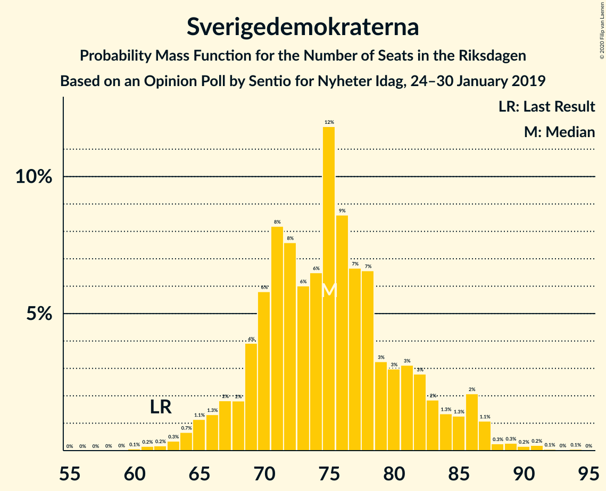
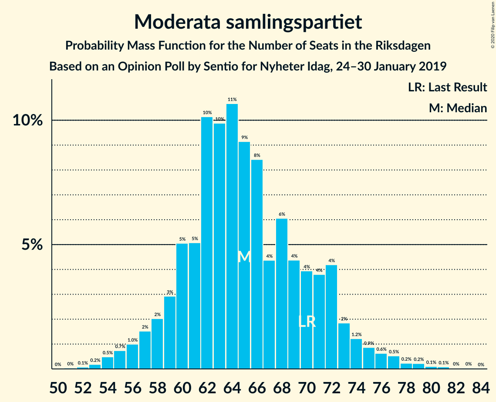
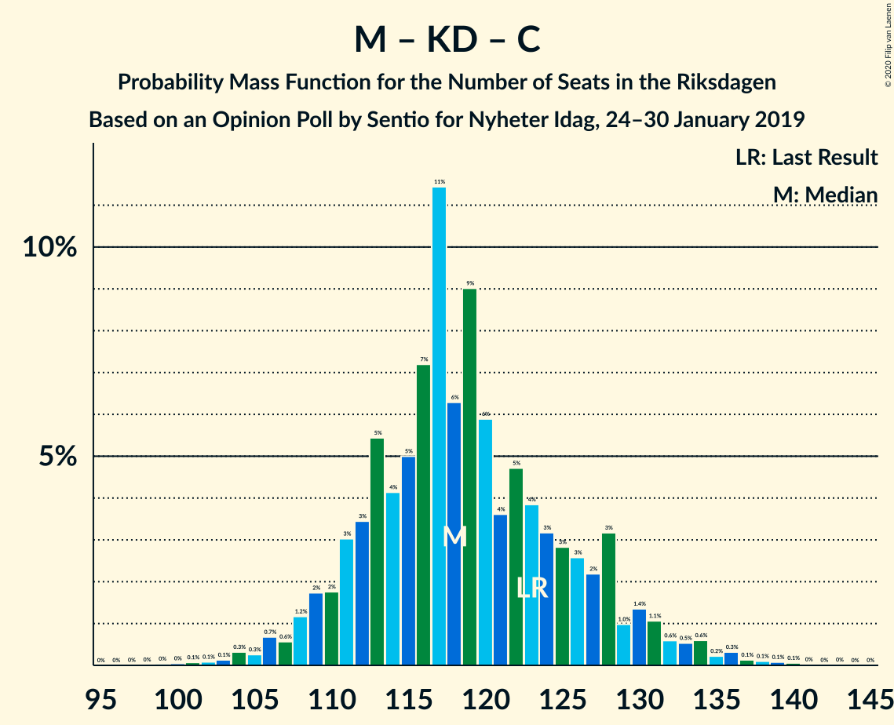

# Opinion Poll by Sentio for Nyheter Idag, 24–30 January 2019

<a href="#voting-intentions">Voting Intentions</a> | <a href="#seats">Seats</a> | <a href="#coalitions">Coalitions</a> | <a href="#technical-information">Technical Information</a>

## Voting Intentions

### Confidence Intervals

| Party | Last Result | Poll Result | 80% Confidence Interval | 90% Confidence Interval | 95% Confidence Interval | 99% Confidence Interval |
|:-----:|:-----------:|:-----------:|:-----------------------:|:-----------------------:|:-----------------------:|:-----------------------:|
| Sveriges socialdemokratiska arbetareparti | 28.3% | 27.8% | 26.0–29.6% |25.5–30.2% |25.1–30.6% |24.2–31.6% |
| Sverigedemokraterna | 17.5% | 20.4% | 18.8–22.1% |18.4–22.6% |18.0–23.0% |17.3–23.8% |
| Moderata samlingspartiet | 19.8% | 17.7% | 16.2–19.3% |15.8–19.8% |15.4–20.2% |14.8–21.0% |
| Vänsterpartiet | 8.0% | 9.5% | 8.4–10.8% |8.1–11.2% |7.8–11.5% |7.3–12.1% |
| Kristdemokraterna | 6.3% | 7.3% | 6.3–8.5% |6.1–8.8% |5.8–9.1% |5.4–9.7% |
| Centerpartiet | 8.6% | 7.1% | 6.1–8.2% |5.9–8.6% |5.7–8.9% |5.2–9.4% |
| Miljöpartiet de gröna | 4.4% | 4.0% | 3.3–4.9% |3.1–5.2% |2.9–5.4% |2.6–5.9% |
| Liberalerna | 5.5% | 3.9% | 3.2–4.8% |3.0–5.1% |2.9–5.3% |2.6–5.8% |

*Note:* The poll result column reflects the actual value used in the calculations. Published results may vary slightly, and in addition be rounded to fewer digits.

## Seats

### Confidence Intervals

| Party | Last Result | Median | 80% Confidence Interval | 90% Confidence Interval | 95% Confidence Interval | 99% Confidence Interval |
|:-----:|:-----------:|:------:|:-----------------------:|:-----------------------:|:-----------------------:|:-----------------------:|
| <a href="#sveriges-socialdemokratiska-arbetareparti">Sveriges socialdemokratiska arbetareparti</a> | 100 | 104 | 95–110 |92–112 |91–114 |88–119 |
| <a href="#sverigedemokraterna">Sverigedemokraterna</a> | 62 | 75 | 69–82 |67–85 |65–86 |63–90 |
| <a href="#moderata-samlingspartiet">Moderata samlingspartiet</a> | 70 | 65 | 60–72 |58–73 |56–75 |54–79 |
| <a href="#vänsterpartiet">Vänsterpartiet</a> | 28 | 35 | 30–40 |30–41 |29–42 |27–46 |
| <a href="#kristdemokraterna">Kristdemokraterna</a> | 22 | 27 | 24–31 |22–32 |21–33 |20–37 |
| <a href="#centerpartiet">Centerpartiet</a> | 31 | 26 | 23–30 |22–31 |21–33 |19–35 |
| <a href="#miljöpartiet-de-gröna">Miljöpartiet de gröna</a> | 16 | 15 | 0–18 |0–19 |0–20 |0–21 |
| <a href="#liberalerna">Liberalerna</a> | 20 | 0 | 0–17 |0–18 |0–19 |0–21 |

### Sveriges socialdemokratiska arbetareparti

*For a full overview of the results for this party, see the [Sveriges socialdemokratiska arbetareparti](party-sverigessocialdemokratiskaarbetareparti.html) page.*

| Number of Seats | Probability | Accumulated | Special Marks |
|:---------------:|:-----------:|:-----------:|:-------------:|
| 84 | 0% | 100% |  |
| 85 | 0% | 99.9% |  |
| 86 | 0.1% | 99.9% |  |
| 87 | 0.1% | 99.8% |  |
| 88 | 0.3% | 99.7% |  |
| 89 | 0.7% | 99.4% |  |
| 90 | 0.4% | 98.7% |  |
| 91 | 1.0% | 98% |  |
| 92 | 2% | 97% |  |
| 93 | 2% | 95% |  |
| 94 | 3% | 93% |  |
| 95 | 5% | 90% |  |
| 96 | 5% | 85% |  |
| 97 | 2% | 80% |  |
| 98 | 4% | 78% |  |
| 99 | 4% | 74% |  |
| 100 | 3% | 70% | Last Result |
| 101 | 3% | 67% |  |
| 102 | 7% | 64% |  |
| 103 | 3% | 56% |  |
| 104 | 10% | 53% | Median |
| 105 | 6% | 43% |  |
| 106 | 9% | 37% |  |
| 107 | 5% | 29% |  |
| 108 | 4% | 23% |  |
| 109 | 9% | 19% |  |
| 110 | 1.4% | 10% |  |
| 111 | 1.3% | 9% |  |
| 112 | 3% | 8% |  |
| 113 | 1.1% | 5% |  |
| 114 | 2% | 4% |  |
| 115 | 0.3% | 2% |  |
| 116 | 0.3% | 1.5% |  |
| 117 | 0.4% | 1.1% |  |
| 118 | 0.2% | 0.7% |  |
| 119 | 0.1% | 0.6% |  |
| 120 | 0.2% | 0.4% |  |
| 121 | 0% | 0.2% |  |
| 122 | 0.1% | 0.2% |  |
| 123 | 0% | 0.1% |  |
| 124 | 0% | 0% |  |

### Sverigedemokraterna

*For a full overview of the results for this party, see the [Sverigedemokraterna](party-sverigedemokraterna.html) page.*

| Number of Seats | Probability | Accumulated | Special Marks |
|:---------------:|:-----------:|:-----------:|:-------------:|
| 60 | 0.1% | 100% |  |
| 61 | 0.2% | 99.9% |  |
| 62 | 0.2% | 99.7% | Last Result |
| 63 | 0.3% | 99.6% |  |
| 64 | 0.7% | 99.2% |  |
| 65 | 1.1% | 98.5% |  |
| 66 | 1.3% | 97% |  |
| 67 | 2% | 96% |  |
| 68 | 2% | 94% |  |
| 69 | 4% | 92% |  |
| 70 | 6% | 89% |  |
| 71 | 8% | 83% |  |
| 72 | 8% | 75% |  |
| 73 | 6% | 67% |  |
| 74 | 6% | 61% |  |
| 75 | 12% | 54% | Median |
| 76 | 9% | 43% |  |
| 77 | 7% | 34% |  |
| 78 | 7% | 27% |  |
| 79 | 3% | 21% |  |
| 80 | 3% | 18% |  |
| 81 | 3% | 15% |  |
| 82 | 3% | 11% |  |
| 83 | 2% | 9% |  |
| 84 | 1.3% | 7% |  |
| 85 | 1.3% | 5% |  |
| 86 | 2% | 4% |  |
| 87 | 1.1% | 2% |  |
| 88 | 0.3% | 1.0% |  |
| 89 | 0.3% | 0.8% |  |
| 90 | 0.2% | 0.5% |  |
| 91 | 0.2% | 0.3% |  |
| 92 | 0.1% | 0.2% |  |
| 93 | 0% | 0.1% |  |
| 94 | 0.1% | 0.1% |  |
| 95 | 0% | 0% |  |

### Moderata samlingspartiet

*For a full overview of the results for this party, see the [Moderata samlingspartiet](party-moderatasamlingspartiet.html) page.*

| Number of Seats | Probability | Accumulated | Special Marks |
|:---------------:|:-----------:|:-----------:|:-------------:|
| 51 | 0% | 100% |  |
| 52 | 0.1% | 99.9% |  |
| 53 | 0.2% | 99.9% |  |
| 54 | 0.5% | 99.7% |  |
| 55 | 0.7% | 99.2% |  |
| 56 | 1.0% | 98% |  |
| 57 | 2% | 97% |  |
| 58 | 2% | 96% |  |
| 59 | 3% | 94% |  |
| 60 | 5% | 91% |  |
| 61 | 5% | 86% |  |
| 62 | 10% | 81% |  |
| 63 | 10% | 71% |  |
| 64 | 11% | 61% |  |
| 65 | 9% | 50% | Median |
| 66 | 8% | 41% |  |
| 67 | 4% | 33% |  |
| 68 | 6% | 28% |  |
| 69 | 4% | 22% |  |
| 70 | 4% | 18% | Last Result |
| 71 | 4% | 14% |  |
| 72 | 4% | 10% |  |
| 73 | 2% | 6% |  |
| 74 | 1.2% | 4% |  |
| 75 | 0.9% | 3% |  |
| 76 | 0.6% | 2% |  |
| 77 | 0.5% | 1.3% |  |
| 78 | 0.2% | 0.7% |  |
| 79 | 0.2% | 0.5% |  |
| 80 | 0.1% | 0.3% |  |
| 81 | 0.1% | 0.2% |  |
| 82 | 0% | 0.1% |  |
| 83 | 0% | 0.1% |  |
| 84 | 0% | 0% |  |

### Vänsterpartiet

*For a full overview of the results for this party, see the [Vänsterpartiet](party-vänsterpartiet.html) page.*

| Number of Seats | Probability | Accumulated | Special Marks |
|:---------------:|:-----------:|:-----------:|:-------------:|
| 25 | 0.2% | 100% |  |
| 26 | 0.2% | 99.8% |  |
| 27 | 0.5% | 99.6% |  |
| 28 | 1.3% | 99.1% | Last Result |
| 29 | 2% | 98% |  |
| 30 | 7% | 96% |  |
| 31 | 5% | 89% |  |
| 32 | 6% | 84% |  |
| 33 | 7% | 77% |  |
| 34 | 12% | 71% |  |
| 35 | 14% | 59% | Median |
| 36 | 11% | 44% |  |
| 37 | 9% | 33% |  |
| 38 | 4% | 25% |  |
| 39 | 5% | 21% |  |
| 40 | 8% | 16% |  |
| 41 | 3% | 7% |  |
| 42 | 1.5% | 4% |  |
| 43 | 0.8% | 2% |  |
| 44 | 0.6% | 2% |  |
| 45 | 0.6% | 1.1% |  |
| 46 | 0.4% | 0.5% |  |
| 47 | 0.1% | 0.2% |  |
| 48 | 0% | 0.1% |  |
| 49 | 0% | 0% |  |

### Kristdemokraterna

*For a full overview of the results for this party, see the [Kristdemokraterna](party-kristdemokraterna.html) page.*

| Number of Seats | Probability | Accumulated | Special Marks |
|:---------------:|:-----------:|:-----------:|:-------------:|
| 18 | 0.1% | 100% |  |
| 19 | 0.2% | 99.9% |  |
| 20 | 1.2% | 99.6% |  |
| 21 | 1.3% | 98% |  |
| 22 | 2% | 97% | Last Result |
| 23 | 4% | 95% |  |
| 24 | 6% | 91% |  |
| 25 | 7% | 85% |  |
| 26 | 18% | 78% |  |
| 27 | 22% | 61% | Median |
| 28 | 9% | 39% |  |
| 29 | 9% | 30% |  |
| 30 | 7% | 21% |  |
| 31 | 6% | 14% |  |
| 32 | 3% | 8% |  |
| 33 | 2% | 4% |  |
| 34 | 1.1% | 2% |  |
| 35 | 0.4% | 1.4% |  |
| 36 | 0.3% | 0.9% |  |
| 37 | 0.4% | 0.6% |  |
| 38 | 0.1% | 0.2% |  |
| 39 | 0.1% | 0.1% |  |
| 40 | 0% | 0% |  |

### Centerpartiet

*For a full overview of the results for this party, see the [Centerpartiet](party-centerpartiet.html) page.*

| Number of Seats | Probability | Accumulated | Special Marks |
|:---------------:|:-----------:|:-----------:|:-------------:|
| 17 | 0.1% | 100% |  |
| 18 | 0.1% | 99.9% |  |
| 19 | 0.4% | 99.8% |  |
| 20 | 0.8% | 99.4% |  |
| 21 | 2% | 98.6% |  |
| 22 | 4% | 96% |  |
| 23 | 6% | 92% |  |
| 24 | 9% | 86% |  |
| 25 | 20% | 77% |  |
| 26 | 9% | 57% | Median |
| 27 | 19% | 48% |  |
| 28 | 8% | 30% |  |
| 29 | 10% | 22% |  |
| 30 | 5% | 12% |  |
| 31 | 2% | 7% | Last Result |
| 32 | 2% | 5% |  |
| 33 | 1.2% | 3% |  |
| 34 | 0.7% | 2% |  |
| 35 | 0.4% | 0.9% |  |
| 36 | 0.2% | 0.5% |  |
| 37 | 0.1% | 0.2% |  |
| 38 | 0.1% | 0.1% |  |
| 39 | 0% | 0% |  |

### Miljöpartiet de gröna

*For a full overview of the results for this party, see the [Miljöpartiet de gröna](party-miljöpartietdegröna.html) page.*

| Number of Seats | Probability | Accumulated | Special Marks |
|:---------------:|:-----------:|:-----------:|:-------------:|
| 0 | 44% | 100% |  |
| 1 | 0% | 56% |  |
| 2 | 0% | 56% |  |
| 3 | 0% | 56% |  |
| 4 | 0% | 56% |  |
| 5 | 0% | 56% |  |
| 6 | 0% | 56% |  |
| 7 | 0% | 56% |  |
| 8 | 0% | 56% |  |
| 9 | 0% | 56% |  |
| 10 | 0% | 56% |  |
| 11 | 0% | 56% |  |
| 12 | 0% | 56% |  |
| 13 | 0% | 56% |  |
| 14 | 5% | 56% |  |
| 15 | 13% | 52% | Median |
| 16 | 14% | 38% | Last Result |
| 17 | 13% | 25% |  |
| 18 | 5% | 11% |  |
| 19 | 3% | 6% |  |
| 20 | 2% | 3% |  |
| 21 | 0.6% | 0.9% |  |
| 22 | 0.2% | 0.3% |  |
| 23 | 0.1% | 0.1% |  |
| 24 | 0% | 0% |  |

### Liberalerna

*For a full overview of the results for this party, see the [Liberalerna](party-liberalerna.html) page.*

| Number of Seats | Probability | Accumulated | Special Marks |
|:---------------:|:-----------:|:-----------:|:-------------:|
| 0 | 52% | 100% | Median |
| 1 | 0% | 48% |  |
| 2 | 0% | 48% |  |
| 3 | 0% | 48% |  |
| 4 | 0% | 48% |  |
| 5 | 0% | 48% |  |
| 6 | 0% | 48% |  |
| 7 | 0% | 48% |  |
| 8 | 0% | 48% |  |
| 9 | 0% | 48% |  |
| 10 | 0% | 48% |  |
| 11 | 0% | 48% |  |
| 12 | 0% | 48% |  |
| 13 | 0% | 48% |  |
| 14 | 4% | 48% |  |
| 15 | 16% | 44% |  |
| 16 | 12% | 29% |  |
| 17 | 8% | 17% |  |
| 18 | 5% | 9% |  |
| 19 | 2% | 4% |  |
| 20 | 0.9% | 2% | Last Result |
| 21 | 0.3% | 0.6% |  |
| 22 | 0.2% | 0.3% |  |
| 23 | 0.1% | 0.1% |  |
| 24 | 0% | 0% |  |

## Coalitions

### Confidence Intervals

| Coalition | Last Result | Median | Majority? | 80% Confidence Interval | 90% Confidence Interval | 95% Confidence Interval | 99% Confidence Interval |
|:---------:|:-----------:|:------:|:---------:|:-----------------------:|:-----------------------:|:-----------------------:|:-----------------------:|
| Sveriges socialdemokratiska arbetareparti – Moderata samlingspartiet – Centerpartiet | 201 | 195 | 99.5% | 185–205 | 182–207 | 179–210 | 175–215 |
| Sveriges socialdemokratiska arbetareparti – Vänsterpartiet – Centerpartiet – Miljöpartiet de gröna – Liberalerna | 195 | 183 | 82% | 171–190 | 168–193 | 165–196 | 161–200 |
| Sverigedemokraterna – Moderata samlingspartiet – Kristdemokraterna | 154 | 166 | 18% | 159–178 | 156–181 | 153–184 | 149–188 |
| Sveriges socialdemokratiska arbetareparti – Moderata samlingspartiet | 170 | 168 | 19% | 159–178 | 156–181 | 153–183 | 150–188 |
| Sveriges socialdemokratiska arbetareparti – Vänsterpartiet – Miljöpartiet de gröna | 144 | 147 | 0% | 136–159 | 134–161 | 131–163 | 126–167 |
| Sveriges socialdemokratiska arbetareparti – Centerpartiet – Miljöpartiet de gröna – Liberalerna | 167 | 148 | 0% | 134–157 | 132–159 | 130–161 | 124–166 |
| Sverigedemokraterna – Moderata samlingspartiet | 132 | 139 | 0% | 132–150 | 130–152 | 128–155 | 124–159 |
| Sveriges socialdemokratiska arbetareparti – Vänsterpartiet | 128 | 139 | 0% | 129–147 | 126–150 | 124–153 | 121–157 |
| Moderata samlingspartiet – Kristdemokraterna – Centerpartiet – Liberalerna | 143 | 127 | 0% | 116–137 | 113–140 | 111–142 | 108–147 |
| Moderata samlingspartiet – Kristdemokraterna – Centerpartiet | 123 | 118 | 0% | 112–127 | 109–130 | 108–132 | 104–136 |
| Sveriges socialdemokratiska arbetareparti – Miljöpartiet de gröna | 116 | 112 | 0% | 102–124 | 98–126 | 95–127 | 92–130 |
| Moderata samlingspartiet – Centerpartiet – Liberalerna | 121 | 100 | 0% | 88–110 | 86–113 | 85–115 | 82–118 |
| Moderata samlingspartiet – Centerpartiet | 101 | 91 | 0% | 86–98 | 84–101 | 82–104 | 78–108 |

### Sveriges socialdemokratiska arbetareparti – Moderata samlingspartiet – Centerpartiet

| Number of Seats | Probability | Accumulated | Special Marks |
|:---------------:|:-----------:|:-----------:|:-------------:|
| 170 | 0% | 100% |  |
| 171 | 0.1% | 99.9% |  |
| 172 | 0.1% | 99.9% |  |
| 173 | 0.1% | 99.8% |  |
| 174 | 0.1% | 99.7% |  |
| 175 | 0.1% | 99.5% | Majority |
| 176 | 0.3% | 99.4% |  |
| 177 | 0.6% | 99.1% |  |
| 178 | 0.8% | 98.5% |  |
| 179 | 0.7% | 98% |  |
| 180 | 0.7% | 97% |  |
| 181 | 0.7% | 96% |  |
| 182 | 0.8% | 96% |  |
| 183 | 1.1% | 95% |  |
| 184 | 1.2% | 94% |  |
| 185 | 5% | 93% |  |
| 186 | 5% | 88% |  |
| 187 | 4% | 83% |  |
| 188 | 3% | 79% |  |
| 189 | 2% | 76% |  |
| 190 | 2% | 74% |  |
| 191 | 4% | 72% |  |
| 192 | 3% | 68% |  |
| 193 | 7% | 64% |  |
| 194 | 5% | 57% |  |
| 195 | 11% | 52% | Median |
| 196 | 5% | 40% |  |
| 197 | 5% | 35% |  |
| 198 | 4% | 30% |  |
| 199 | 5% | 26% |  |
| 200 | 4% | 22% |  |
| 201 | 2% | 17% | Last Result |
| 202 | 1.3% | 15% |  |
| 203 | 2% | 14% |  |
| 204 | 1.5% | 12% |  |
| 205 | 2% | 11% |  |
| 206 | 3% | 9% |  |
| 207 | 2% | 6% |  |
| 208 | 0.5% | 4% |  |
| 209 | 0.6% | 4% |  |
| 210 | 0.5% | 3% |  |
| 211 | 0.4% | 2% |  |
| 212 | 0.5% | 2% |  |
| 213 | 0.4% | 2% |  |
| 214 | 0.4% | 1.2% |  |
| 215 | 0.3% | 0.8% |  |
| 216 | 0.1% | 0.5% |  |
| 217 | 0.1% | 0.4% |  |
| 218 | 0.1% | 0.3% |  |
| 219 | 0.1% | 0.2% |  |
| 220 | 0.1% | 0.1% |  |
| 221 | 0% | 0% |  |

### Sveriges socialdemokratiska arbetareparti – Vänsterpartiet – Centerpartiet – Miljöpartiet de gröna – Liberalerna

| Number of Seats | Probability | Accumulated | Special Marks |
|:---------------:|:-----------:|:-----------:|:-------------:|
| 156 | 0% | 100% |  |
| 157 | 0.1% | 99.9% |  |
| 158 | 0.1% | 99.9% |  |
| 159 | 0.1% | 99.8% |  |
| 160 | 0% | 99.7% |  |
| 161 | 0.3% | 99.7% |  |
| 162 | 0.2% | 99.4% |  |
| 163 | 0.2% | 99.1% |  |
| 164 | 0.5% | 98.9% |  |
| 165 | 1.2% | 98% |  |
| 166 | 0.5% | 97% |  |
| 167 | 1.2% | 97% |  |
| 168 | 3% | 96% |  |
| 169 | 2% | 93% |  |
| 170 | 0.9% | 91% |  |
| 171 | 2% | 90% |  |
| 172 | 2% | 88% |  |
| 173 | 2% | 87% |  |
| 174 | 3% | 85% |  |
| 175 | 3% | 82% | Majority |
| 176 | 2% | 79% |  |
| 177 | 3% | 77% |  |
| 178 | 4% | 74% |  |
| 179 | 3% | 70% |  |
| 180 | 3% | 67% | Median |
| 181 | 8% | 64% |  |
| 182 | 5% | 56% |  |
| 183 | 5% | 51% |  |
| 184 | 10% | 46% |  |
| 185 | 5% | 36% |  |
| 186 | 4% | 31% |  |
| 187 | 6% | 26% |  |
| 188 | 5% | 20% |  |
| 189 | 4% | 15% |  |
| 190 | 2% | 11% |  |
| 191 | 3% | 9% |  |
| 192 | 1.4% | 6% |  |
| 193 | 0.9% | 5% |  |
| 194 | 1.1% | 4% |  |
| 195 | 0.4% | 3% | Last Result |
| 196 | 0.8% | 3% |  |
| 197 | 0.7% | 2% |  |
| 198 | 0.2% | 1.1% |  |
| 199 | 0.4% | 0.9% |  |
| 200 | 0.2% | 0.5% |  |
| 201 | 0.1% | 0.3% |  |
| 202 | 0.1% | 0.3% |  |
| 203 | 0.1% | 0.2% |  |
| 204 | 0% | 0.1% |  |
| 205 | 0% | 0.1% |  |
| 206 | 0% | 0% |  |

### Sverigedemokraterna – Moderata samlingspartiet – Kristdemokraterna

| Number of Seats | Probability | Accumulated | Special Marks |
|:---------------:|:-----------:|:-----------:|:-------------:|
| 144 | 0% | 100% |  |
| 145 | 0% | 99.9% |  |
| 146 | 0.1% | 99.9% |  |
| 147 | 0.1% | 99.8% |  |
| 148 | 0.1% | 99.7% |  |
| 149 | 0.2% | 99.6% |  |
| 150 | 0.4% | 99.5% |  |
| 151 | 0.2% | 99.1% |  |
| 152 | 0.7% | 98.8% |  |
| 153 | 0.8% | 98% |  |
| 154 | 0.4% | 97% | Last Result |
| 155 | 1.2% | 97% |  |
| 156 | 0.9% | 96% |  |
| 157 | 1.5% | 95% |  |
| 158 | 3% | 93% |  |
| 159 | 2% | 91% |  |
| 160 | 4% | 88% |  |
| 161 | 5% | 85% |  |
| 162 | 6% | 80% |  |
| 163 | 4% | 73% |  |
| 164 | 5% | 69% |  |
| 165 | 10% | 64% |  |
| 166 | 5% | 54% |  |
| 167 | 5% | 49% | Median |
| 168 | 8% | 44% |  |
| 169 | 3% | 36% |  |
| 170 | 3% | 33% |  |
| 171 | 4% | 30% |  |
| 172 | 3% | 26% |  |
| 173 | 2% | 23% |  |
| 174 | 3% | 21% |  |
| 175 | 3% | 18% | Majority |
| 176 | 2% | 15% |  |
| 177 | 2% | 13% |  |
| 178 | 2% | 12% |  |
| 179 | 0.9% | 9% |  |
| 180 | 2% | 9% |  |
| 181 | 3% | 7% |  |
| 182 | 1.1% | 4% |  |
| 183 | 0.5% | 3% |  |
| 184 | 1.2% | 3% |  |
| 185 | 0.5% | 1.5% |  |
| 186 | 0.2% | 1.0% |  |
| 187 | 0.2% | 0.8% |  |
| 188 | 0.3% | 0.6% |  |
| 189 | 0% | 0.3% |  |
| 190 | 0.1% | 0.3% |  |
| 191 | 0.1% | 0.2% |  |
| 192 | 0.1% | 0.1% |  |
| 193 | 0% | 0.1% |  |
| 194 | 0% | 0% |  |

### Sveriges socialdemokratiska arbetareparti – Moderata samlingspartiet

| Number of Seats | Probability | Accumulated | Special Marks |
|:---------------:|:-----------:|:-----------:|:-------------:|
| 145 | 0% | 100% |  |
| 146 | 0% | 99.9% |  |
| 147 | 0.1% | 99.9% |  |
| 148 | 0.1% | 99.9% |  |
| 149 | 0.2% | 99.7% |  |
| 150 | 0.3% | 99.5% |  |
| 151 | 0.4% | 99.2% |  |
| 152 | 0.6% | 98.8% |  |
| 153 | 1.0% | 98% |  |
| 154 | 0.7% | 97% |  |
| 155 | 0.8% | 97% |  |
| 156 | 0.9% | 96% |  |
| 157 | 2% | 95% |  |
| 158 | 2% | 93% |  |
| 159 | 4% | 91% |  |
| 160 | 5% | 87% |  |
| 161 | 2% | 82% |  |
| 162 | 4% | 80% |  |
| 163 | 4% | 76% |  |
| 164 | 5% | 72% |  |
| 165 | 3% | 67% |  |
| 166 | 4% | 64% |  |
| 167 | 5% | 60% |  |
| 168 | 10% | 55% |  |
| 169 | 7% | 45% | Median |
| 170 | 6% | 38% | Last Result |
| 171 | 4% | 32% |  |
| 172 | 2% | 28% |  |
| 173 | 3% | 26% |  |
| 174 | 3% | 23% |  |
| 175 | 4% | 19% | Majority |
| 176 | 2% | 15% |  |
| 177 | 2% | 13% |  |
| 178 | 2% | 11% |  |
| 179 | 2% | 10% |  |
| 180 | 0.9% | 8% |  |
| 181 | 3% | 7% |  |
| 182 | 1.5% | 5% |  |
| 183 | 1.5% | 3% |  |
| 184 | 0.6% | 2% |  |
| 185 | 0.2% | 1.0% |  |
| 186 | 0.2% | 0.8% |  |
| 187 | 0.1% | 0.6% |  |
| 188 | 0.2% | 0.5% |  |
| 189 | 0.2% | 0.4% |  |
| 190 | 0.1% | 0.2% |  |
| 191 | 0% | 0.1% |  |
| 192 | 0% | 0.1% |  |
| 193 | 0% | 0% |  |

### Sveriges socialdemokratiska arbetareparti – Vänsterpartiet – Miljöpartiet de gröna

| Number of Seats | Probability | Accumulated | Special Marks |
|:---------------:|:-----------:|:-----------:|:-------------:|
| 122 | 0% | 100% |  |
| 123 | 0% | 99.9% |  |
| 124 | 0.1% | 99.9% |  |
| 125 | 0.1% | 99.8% |  |
| 126 | 0.2% | 99.7% |  |
| 127 | 0.3% | 99.5% |  |
| 128 | 0.3% | 99.2% |  |
| 129 | 0.5% | 98.9% |  |
| 130 | 0.5% | 98% |  |
| 131 | 1.1% | 98% |  |
| 132 | 0.8% | 97% |  |
| 133 | 0.8% | 96% |  |
| 134 | 0.7% | 95% |  |
| 135 | 3% | 95% |  |
| 136 | 1.1% | 91% |  |
| 137 | 2% | 90% |  |
| 138 | 2% | 87% |  |
| 139 | 3% | 86% |  |
| 140 | 3% | 83% |  |
| 141 | 5% | 79% |  |
| 142 | 3% | 74% |  |
| 143 | 7% | 71% |  |
| 144 | 3% | 64% | Last Result |
| 145 | 7% | 61% |  |
| 146 | 3% | 54% |  |
| 147 | 5% | 51% |  |
| 148 | 5% | 46% |  |
| 149 | 2% | 41% |  |
| 150 | 3% | 39% |  |
| 151 | 2% | 36% |  |
| 152 | 3% | 34% |  |
| 153 | 2% | 31% |  |
| 154 | 2% | 29% | Median |
| 155 | 5% | 27% |  |
| 156 | 5% | 22% |  |
| 157 | 4% | 17% |  |
| 158 | 1.2% | 13% |  |
| 159 | 2% | 12% |  |
| 160 | 4% | 10% |  |
| 161 | 2% | 6% |  |
| 162 | 0.4% | 4% |  |
| 163 | 2% | 4% |  |
| 164 | 0.5% | 2% |  |
| 165 | 0.5% | 1.3% |  |
| 166 | 0.1% | 0.8% |  |
| 167 | 0.3% | 0.7% |  |
| 168 | 0.2% | 0.4% |  |
| 169 | 0.1% | 0.2% |  |
| 170 | 0% | 0.1% |  |
| 171 | 0% | 0.1% |  |
| 172 | 0% | 0% |  |

### Sveriges socialdemokratiska arbetareparti – Centerpartiet – Miljöpartiet de gröna – Liberalerna

| Number of Seats | Probability | Accumulated | Special Marks |
|:---------------:|:-----------:|:-----------:|:-------------:|
| 118 | 0% | 100% |  |
| 119 | 0% | 99.9% |  |
| 120 | 0% | 99.9% |  |
| 121 | 0.1% | 99.9% |  |
| 122 | 0.1% | 99.8% |  |
| 123 | 0.1% | 99.7% |  |
| 124 | 0.2% | 99.6% |  |
| 125 | 0.1% | 99.4% |  |
| 126 | 0.3% | 99.3% |  |
| 127 | 0.2% | 99.1% |  |
| 128 | 0.7% | 98.8% |  |
| 129 | 0.2% | 98% |  |
| 130 | 1.2% | 98% |  |
| 131 | 1.2% | 97% |  |
| 132 | 0.9% | 96% |  |
| 133 | 2% | 95% |  |
| 134 | 3% | 93% |  |
| 135 | 2% | 90% |  |
| 136 | 2% | 88% |  |
| 137 | 2% | 86% |  |
| 138 | 2% | 83% |  |
| 139 | 2% | 81% |  |
| 140 | 4% | 79% |  |
| 141 | 3% | 76% |  |
| 142 | 2% | 72% |  |
| 143 | 3% | 71% |  |
| 144 | 3% | 68% |  |
| 145 | 3% | 65% | Median |
| 146 | 4% | 62% |  |
| 147 | 5% | 57% |  |
| 148 | 7% | 52% |  |
| 149 | 9% | 45% |  |
| 150 | 10% | 36% |  |
| 151 | 5% | 26% |  |
| 152 | 3% | 21% |  |
| 153 | 3% | 18% |  |
| 154 | 1.3% | 15% |  |
| 155 | 3% | 14% |  |
| 156 | 0.9% | 11% |  |
| 157 | 0.9% | 10% |  |
| 158 | 2% | 9% |  |
| 159 | 3% | 7% |  |
| 160 | 1.4% | 5% |  |
| 161 | 1.1% | 3% |  |
| 162 | 0.6% | 2% |  |
| 163 | 0.5% | 2% |  |
| 164 | 0.5% | 1.2% |  |
| 165 | 0.2% | 0.8% |  |
| 166 | 0.2% | 0.5% |  |
| 167 | 0.1% | 0.4% | Last Result |
| 168 | 0.2% | 0.3% |  |
| 169 | 0.1% | 0.1% |  |
| 170 | 0% | 0.1% |  |
| 171 | 0% | 0% |  |

### Sverigedemokraterna – Moderata samlingspartiet

| Number of Seats | Probability | Accumulated | Special Marks |
|:---------------:|:-----------:|:-----------:|:-------------:|
| 120 | 0.1% | 100% |  |
| 121 | 0.1% | 99.9% |  |
| 122 | 0.1% | 99.8% |  |
| 123 | 0.2% | 99.8% |  |
| 124 | 0.1% | 99.6% |  |
| 125 | 0.4% | 99.5% |  |
| 126 | 0.3% | 99.1% |  |
| 127 | 0.8% | 98.8% |  |
| 128 | 0.7% | 98% |  |
| 129 | 1.3% | 97% |  |
| 130 | 2% | 96% |  |
| 131 | 1.2% | 94% |  |
| 132 | 3% | 93% | Last Result |
| 133 | 1.4% | 90% |  |
| 134 | 6% | 88% |  |
| 135 | 3% | 82% |  |
| 136 | 9% | 79% |  |
| 137 | 8% | 69% |  |
| 138 | 9% | 61% |  |
| 139 | 7% | 53% |  |
| 140 | 5% | 46% | Median |
| 141 | 6% | 41% |  |
| 142 | 4% | 35% |  |
| 143 | 5% | 31% |  |
| 144 | 4% | 26% |  |
| 145 | 3% | 23% |  |
| 146 | 2% | 20% |  |
| 147 | 2% | 18% |  |
| 148 | 2% | 16% |  |
| 149 | 1.5% | 13% |  |
| 150 | 4% | 12% |  |
| 151 | 2% | 8% |  |
| 152 | 2% | 7% |  |
| 153 | 1.1% | 5% |  |
| 154 | 0.9% | 4% |  |
| 155 | 0.6% | 3% |  |
| 156 | 0.7% | 2% |  |
| 157 | 0.3% | 2% |  |
| 158 | 0.7% | 1.3% |  |
| 159 | 0.2% | 0.7% |  |
| 160 | 0.2% | 0.5% |  |
| 161 | 0.1% | 0.2% |  |
| 162 | 0.1% | 0.1% |  |
| 163 | 0% | 0.1% |  |
| 164 | 0% | 0% |  |

### Sveriges socialdemokratiska arbetareparti – Vänsterpartiet

| Number of Seats | Probability | Accumulated | Special Marks |
|:---------------:|:-----------:|:-----------:|:-------------:|
| 117 | 0% | 100% |  |
| 118 | 0.1% | 99.9% |  |
| 119 | 0.1% | 99.9% |  |
| 120 | 0.2% | 99.8% |  |
| 121 | 0.4% | 99.6% |  |
| 122 | 0.5% | 99.2% |  |
| 123 | 0.3% | 98.7% |  |
| 124 | 1.3% | 98% |  |
| 125 | 0.9% | 97% |  |
| 126 | 1.3% | 96% |  |
| 127 | 2% | 95% |  |
| 128 | 2% | 93% | Last Result |
| 129 | 2% | 91% |  |
| 130 | 2% | 88% |  |
| 131 | 6% | 86% |  |
| 132 | 6% | 80% |  |
| 133 | 3% | 74% |  |
| 134 | 3% | 72% |  |
| 135 | 6% | 69% |  |
| 136 | 2% | 63% |  |
| 137 | 4% | 61% |  |
| 138 | 5% | 58% |  |
| 139 | 4% | 52% | Median |
| 140 | 7% | 48% |  |
| 141 | 8% | 41% |  |
| 142 | 4% | 33% |  |
| 143 | 6% | 29% |  |
| 144 | 6% | 23% |  |
| 145 | 4% | 17% |  |
| 146 | 2% | 13% |  |
| 147 | 3% | 10% |  |
| 148 | 1.3% | 8% |  |
| 149 | 1.1% | 6% |  |
| 150 | 1.0% | 5% |  |
| 151 | 0.5% | 4% |  |
| 152 | 1.0% | 4% |  |
| 153 | 0.2% | 3% |  |
| 154 | 1.1% | 2% |  |
| 155 | 0.5% | 1.3% |  |
| 156 | 0.2% | 0.8% |  |
| 157 | 0.4% | 0.6% |  |
| 158 | 0% | 0.2% |  |
| 159 | 0% | 0.2% |  |
| 160 | 0% | 0.1% |  |
| 161 | 0% | 0.1% |  |
| 162 | 0% | 0% |  |

### Moderata samlingspartiet – Kristdemokraterna – Centerpartiet – Liberalerna

| Number of Seats | Probability | Accumulated | Special Marks |
|:---------------:|:-----------:|:-----------:|:-------------:|
| 104 | 0% | 100% |  |
| 105 | 0% | 99.9% |  |
| 106 | 0.1% | 99.9% |  |
| 107 | 0.2% | 99.8% |  |
| 108 | 0.3% | 99.6% |  |
| 109 | 0.5% | 99.3% |  |
| 110 | 0.5% | 98.8% |  |
| 111 | 1.4% | 98% |  |
| 112 | 0.8% | 97% |  |
| 113 | 2% | 96% |  |
| 114 | 2% | 94% |  |
| 115 | 0.9% | 91% |  |
| 116 | 5% | 90% |  |
| 117 | 5% | 86% |  |
| 118 | 4% | 80% | Median |
| 119 | 5% | 77% |  |
| 120 | 2% | 72% |  |
| 121 | 2% | 69% |  |
| 122 | 2% | 68% |  |
| 123 | 3% | 65% |  |
| 124 | 3% | 62% |  |
| 125 | 4% | 59% |  |
| 126 | 3% | 56% |  |
| 127 | 4% | 53% |  |
| 128 | 4% | 49% |  |
| 129 | 5% | 45% |  |
| 130 | 3% | 40% |  |
| 131 | 5% | 38% |  |
| 132 | 4% | 33% |  |
| 133 | 7% | 28% |  |
| 134 | 3% | 22% |  |
| 135 | 4% | 18% |  |
| 136 | 2% | 14% |  |
| 137 | 4% | 13% |  |
| 138 | 2% | 9% |  |
| 139 | 0.9% | 7% |  |
| 140 | 2% | 6% |  |
| 141 | 1.3% | 5% |  |
| 142 | 1.1% | 3% |  |
| 143 | 0.6% | 2% | Last Result |
| 144 | 0.4% | 2% |  |
| 145 | 0.3% | 1.2% |  |
| 146 | 0.3% | 0.9% |  |
| 147 | 0.2% | 0.6% |  |
| 148 | 0.1% | 0.3% |  |
| 149 | 0.1% | 0.2% |  |
| 150 | 0.1% | 0.2% |  |
| 151 | 0% | 0.1% |  |
| 152 | 0% | 0.1% |  |
| 153 | 0% | 0% |  |

### Moderata samlingspartiet – Kristdemokraterna – Centerpartiet

| Number of Seats | Probability | Accumulated | Special Marks |
|:---------------:|:-----------:|:-----------:|:-------------:|
| 99 | 0% | 100% |  |
| 100 | 0% | 99.9% |  |
| 101 | 0.1% | 99.9% |  |
| 102 | 0.1% | 99.8% |  |
| 103 | 0.1% | 99.7% |  |
| 104 | 0.3% | 99.6% |  |
| 105 | 0.3% | 99.3% |  |
| 106 | 0.7% | 99.0% |  |
| 107 | 0.6% | 98% |  |
| 108 | 1.2% | 98% |  |
| 109 | 2% | 97% |  |
| 110 | 2% | 95% |  |
| 111 | 3% | 93% |  |
| 112 | 3% | 90% |  |
| 113 | 5% | 87% |  |
| 114 | 4% | 81% |  |
| 115 | 5% | 77% |  |
| 116 | 7% | 72% |  |
| 117 | 11% | 65% |  |
| 118 | 6% | 53% | Median |
| 119 | 9% | 47% |  |
| 120 | 6% | 38% |  |
| 121 | 4% | 32% |  |
| 122 | 5% | 29% |  |
| 123 | 4% | 24% | Last Result |
| 124 | 3% | 20% |  |
| 125 | 3% | 17% |  |
| 126 | 3% | 14% |  |
| 127 | 2% | 11% |  |
| 128 | 3% | 9% |  |
| 129 | 1.0% | 6% |  |
| 130 | 1.4% | 5% |  |
| 131 | 1.1% | 4% |  |
| 132 | 0.6% | 3% |  |
| 133 | 0.5% | 2% |  |
| 134 | 0.6% | 2% |  |
| 135 | 0.2% | 1.0% |  |
| 136 | 0.3% | 0.7% |  |
| 137 | 0.1% | 0.4% |  |
| 138 | 0.1% | 0.3% |  |
| 139 | 0.1% | 0.2% |  |
| 140 | 0.1% | 0.1% |  |
| 141 | 0% | 0.1% |  |
| 142 | 0% | 0% |  |

### Sveriges socialdemokratiska arbetareparti – Miljöpartiet de gröna

| Number of Seats | Probability | Accumulated | Special Marks |
|:---------------:|:-----------:|:-----------:|:-------------:|
| 88 | 0% | 100% |  |
| 89 | 0% | 99.9% |  |
| 90 | 0.1% | 99.9% |  |
| 91 | 0.3% | 99.9% |  |
| 92 | 0.2% | 99.6% |  |
| 93 | 0.2% | 99.4% |  |
| 94 | 0.9% | 99.1% |  |
| 95 | 0.8% | 98% |  |
| 96 | 0.9% | 97% |  |
| 97 | 0.7% | 97% |  |
| 98 | 2% | 96% |  |
| 99 | 0.5% | 94% |  |
| 100 | 1.4% | 94% |  |
| 101 | 2% | 92% |  |
| 102 | 3% | 91% |  |
| 103 | 2% | 87% |  |
| 104 | 4% | 85% |  |
| 105 | 4% | 81% |  |
| 106 | 6% | 77% |  |
| 107 | 3% | 71% |  |
| 108 | 4% | 68% |  |
| 109 | 9% | 64% |  |
| 110 | 2% | 56% |  |
| 111 | 3% | 54% |  |
| 112 | 4% | 50% |  |
| 113 | 3% | 46% |  |
| 114 | 4% | 43% |  |
| 115 | 2% | 39% |  |
| 116 | 2% | 37% | Last Result |
| 117 | 4% | 34% |  |
| 118 | 3% | 30% |  |
| 119 | 2% | 27% | Median |
| 120 | 5% | 25% |  |
| 121 | 3% | 21% |  |
| 122 | 2% | 17% |  |
| 123 | 6% | 16% |  |
| 124 | 3% | 10% |  |
| 125 | 2% | 7% |  |
| 126 | 2% | 5% |  |
| 127 | 1.3% | 3% |  |
| 128 | 0.4% | 2% |  |
| 129 | 0.6% | 1.3% |  |
| 130 | 0.2% | 0.7% |  |
| 131 | 0.2% | 0.4% |  |
| 132 | 0% | 0.2% |  |
| 133 | 0.1% | 0.2% |  |
| 134 | 0% | 0.1% |  |
| 135 | 0% | 0% |  |

### Moderata samlingspartiet – Centerpartiet – Liberalerna

| Number of Seats | Probability | Accumulated | Special Marks |
|:---------------:|:-----------:|:-----------:|:-------------:|
| 79 | 0.1% | 100% |  |
| 80 | 0.1% | 99.9% |  |
| 81 | 0.2% | 99.8% |  |
| 82 | 0.2% | 99.6% |  |
| 83 | 0.3% | 99.5% |  |
| 84 | 1.1% | 99.1% |  |
| 85 | 1.5% | 98% |  |
| 86 | 2% | 97% |  |
| 87 | 3% | 95% |  |
| 88 | 3% | 91% |  |
| 89 | 5% | 88% |  |
| 90 | 2% | 83% |  |
| 91 | 7% | 81% | Median |
| 92 | 6% | 74% |  |
| 93 | 4% | 68% |  |
| 94 | 1.0% | 65% |  |
| 95 | 2% | 64% |  |
| 96 | 2% | 62% |  |
| 97 | 5% | 60% |  |
| 98 | 3% | 55% |  |
| 99 | 1.2% | 53% |  |
| 100 | 2% | 52% |  |
| 101 | 3% | 50% |  |
| 102 | 3% | 47% |  |
| 103 | 5% | 44% |  |
| 104 | 7% | 39% |  |
| 105 | 4% | 33% |  |
| 106 | 6% | 28% |  |
| 107 | 4% | 22% |  |
| 108 | 4% | 18% |  |
| 109 | 3% | 14% |  |
| 110 | 2% | 11% |  |
| 111 | 2% | 9% |  |
| 112 | 1.0% | 7% |  |
| 113 | 3% | 6% |  |
| 114 | 0.6% | 3% |  |
| 115 | 0.9% | 3% |  |
| 116 | 0.4% | 2% |  |
| 117 | 0.3% | 1.2% |  |
| 118 | 0.4% | 0.9% |  |
| 119 | 0.1% | 0.5% |  |
| 120 | 0.1% | 0.4% |  |
| 121 | 0.2% | 0.3% | Last Result |
| 122 | 0% | 0.1% |  |
| 123 | 0% | 0.1% |  |
| 124 | 0% | 0% |  |

### Moderata samlingspartiet – Centerpartiet

| Number of Seats | Probability | Accumulated | Special Marks |
|:---------------:|:-----------:|:-----------:|:-------------:|
| 74 | 0% | 100% |  |
| 75 | 0.1% | 99.9% |  |
| 76 | 0.1% | 99.9% |  |
| 77 | 0.2% | 99.7% |  |
| 78 | 0.2% | 99.6% |  |
| 79 | 0.4% | 99.4% |  |
| 80 | 0.4% | 99.0% |  |
| 81 | 0.8% | 98.5% |  |
| 82 | 0.9% | 98% |  |
| 83 | 1.4% | 97% |  |
| 84 | 2% | 95% |  |
| 85 | 2% | 93% |  |
| 86 | 4% | 91% |  |
| 87 | 7% | 87% |  |
| 88 | 7% | 80% |  |
| 89 | 9% | 73% |  |
| 90 | 8% | 65% |  |
| 91 | 13% | 56% | Median |
| 92 | 9% | 43% |  |
| 93 | 6% | 34% |  |
| 94 | 5% | 28% |  |
| 95 | 5% | 24% |  |
| 96 | 3% | 19% |  |
| 97 | 5% | 16% |  |
| 98 | 2% | 11% |  |
| 99 | 1.3% | 9% |  |
| 100 | 2% | 7% |  |
| 101 | 1.2% | 6% | Last Result |
| 102 | 1.0% | 4% |  |
| 103 | 0.8% | 3% |  |
| 104 | 0.9% | 3% |  |
| 105 | 0.5% | 2% |  |
| 106 | 0.5% | 1.3% |  |
| 107 | 0.2% | 0.8% |  |
| 108 | 0.3% | 0.6% |  |
| 109 | 0.1% | 0.4% |  |
| 110 | 0.1% | 0.3% |  |
| 111 | 0.1% | 0.1% |  |
| 112 | 0% | 0.1% |  |
| 113 | 0% | 0.1% |  |
| 114 | 0% | 0% |  |

## Technical Information

### Opinion Poll

+ **Polling firm:** Sentio
+ **Commissioner(s):** Nyheter Idag
+ **Fieldwork period:** 24–30 January 2019

### Calculations

+ **Sample size:** 1001
+ **Simulations done:** 1,048,576
+ **Error estimate:** 0.81%

