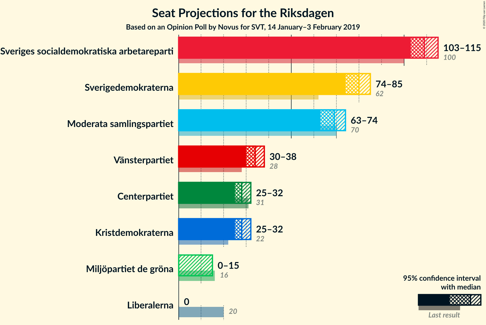
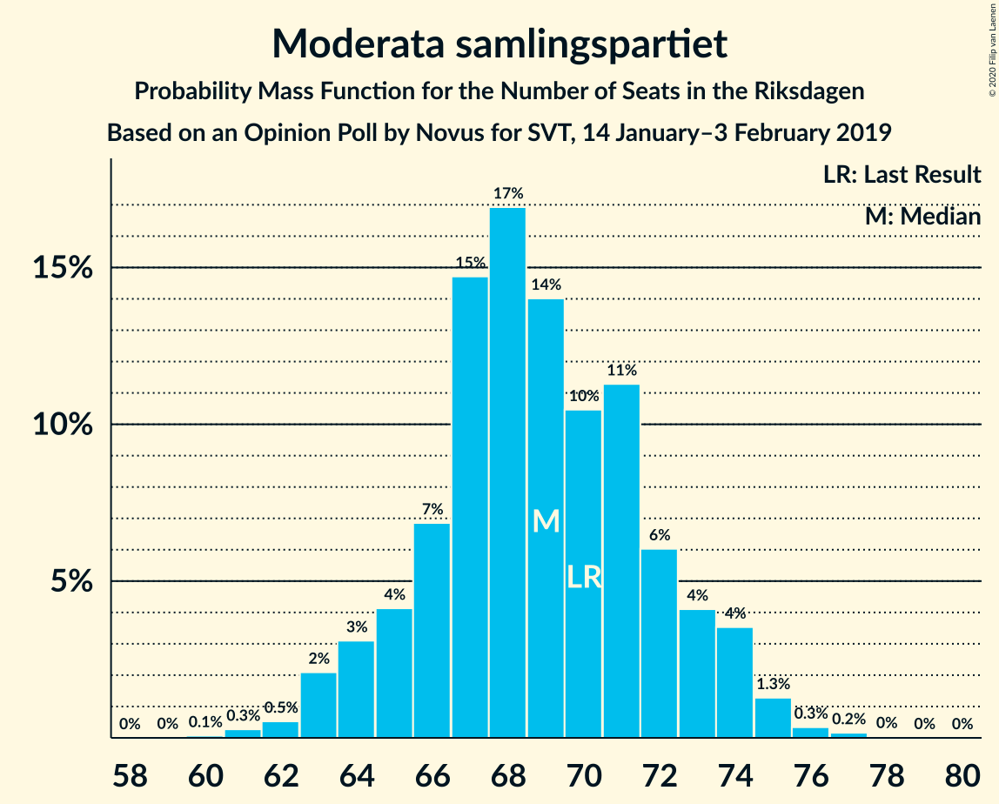
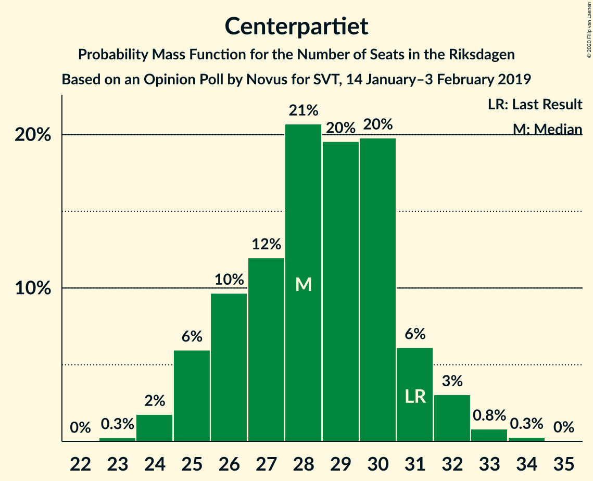

# Opinion Poll by Novus for SVT, 14 January–3 February 2019

<a href="#voting-intentions">Voting Intentions</a> | <a href="#seats">Seats</a> | <a href="#coalitions">Coalitions</a> | <a href="#technical-information">Technical Information</a>

## Voting Intentions

### Confidence Intervals

| Party | Last Result | Poll Result | 80% Confidence Interval | 90% Confidence Interval | 95% Confidence Interval | 99% Confidence Interval |
|:-----:|:-----------:|:-----------:|:-----------------------:|:-----------------------:|:-----------------------:|:-----------------------:|
| Sveriges socialdemokratiska arbetareparti | 28.3% | 29.0% | 28.0–30.1% |27.7–30.4% |27.4–30.7% |26.9–31.2% |
| Sverigedemokraterna | 17.5% | 21.2% | 20.3–22.2% |20.0–22.5% |19.8–22.7% |19.4–23.2% |
| Moderata samlingspartiet | 19.8% | 18.3% | 17.4–19.2% |17.2–19.5% |16.9–19.7% |16.5–20.2% |
| Vänsterpartiet | 8.0% | 9.1% | 8.5–9.8% |8.3–10.0% |8.1–10.2% |7.8–10.5% |
| Centerpartiet | 8.6% | 7.5% | 6.9–8.1% |6.7–8.3% |6.6–8.5% |6.3–8.8% |
| Kristdemokraterna | 6.3% | 7.4% | 6.8–8.0% |6.6–8.2% |6.5–8.4% |6.2–8.7% |
| Miljöpartiet de gröna | 4.4% | 3.4% | 3.0–3.9% |2.9–4.0% |2.8–4.1% |2.7–4.4% |
| Liberalerna | 5.5% | 2.7% | 2.3–3.1% |2.3–3.2% |2.2–3.3% |2.0–3.6% |

*Note:* The poll result column reflects the actual value used in the calculations. Published results may vary slightly, and in addition be rounded to fewer digits.

## Seats

### Confidence Intervals

| Party | Last Result | Median | 80% Confidence Interval | 90% Confidence Interval | 95% Confidence Interval | 99% Confidence Interval |
|:-----:|:-----------:|:------:|:-----------------------:|:-----------------------:|:-----------------------:|:-----------------------:|
| <a href="#sveriges-socialdemokratiska-arbetareparti">Sveriges socialdemokratiska arbetareparti</a> | 100 | 109 | 105–112 |104–112 |103–114 |101–116 |
| <a href="#sverigedemokraterna">Sverigedemokraterna</a> | 62 | 79 | 77–82 |77–83 |76–84 |73–86 |
| <a href="#moderata-samlingspartiet">Moderata samlingspartiet</a> | 70 | 68 | 66–71 |64–72 |63–73 |62–75 |
| <a href="#vänsterpartiet">Vänsterpartiet</a> | 28 | 35 | 33–36 |32–37 |32–38 |30–39 |
| <a href="#centerpartiet">Centerpartiet</a> | 31 | 29 | 26–31 |25–31 |25–32 |24–33 |
| <a href="#kristdemokraterna">Kristdemokraterna</a> | 22 | 29 | 27–30 |26–30 |26–32 |24–32 |
| <a href="#miljöpartiet-de-gröna">Miljöpartiet de gröna</a> | 16 | 0 | 0 |0 |0–15 |0–16 |
| <a href="#liberalerna">Liberalerna</a> | 20 | 0 | 0 |0 |0 |0 |

### Sveriges socialdemokratiska arbetareparti

*For a full overview of the results for this party, see the [Sveriges socialdemokratiska arbetareparti](party-sverigessocialdemokratiskaarbetareparti.html) page.*

| Number of Seats | Probability | Accumulated | Special Marks |
|:---------------:|:-----------:|:-----------:|:-------------:|
| 97 | 0.1% | 100% |  |
| 98 | 0.1% | 99.9% |  |
| 99 | 0.1% | 99.9% |  |
| 100 | 0.1% | 99.8% | Last Result |
| 101 | 1.2% | 99.6% |  |
| 102 | 0.5% | 98% |  |
| 103 | 0.5% | 98% |  |
| 104 | 7% | 97% |  |
| 105 | 8% | 91% |  |
| 106 | 2% | 83% |  |
| 107 | 4% | 81% |  |
| 108 | 20% | 77% |  |
| 109 | 27% | 56% | Median |
| 110 | 1.5% | 29% |  |
| 111 | 3% | 28% |  |
| 112 | 20% | 24% |  |
| 113 | 1.4% | 4% |  |
| 114 | 0.3% | 3% |  |
| 115 | 0.9% | 2% |  |
| 116 | 1.1% | 1.4% |  |
| 117 | 0.2% | 0.3% |  |
| 118 | 0.1% | 0.1% |  |
| 119 | 0.1% | 0.1% |  |
| 120 | 0% | 0% |  |

### Sverigedemokraterna

*For a full overview of the results for this party, see the [Sverigedemokraterna](party-sverigedemokraterna.html) page.*

| Number of Seats | Probability | Accumulated | Special Marks |
|:---------------:|:-----------:|:-----------:|:-------------:|
| 62 | 0% | 100% | Last Result |
| 63 | 0% | 100% |  |
| 64 | 0% | 100% |  |
| 65 | 0% | 100% |  |
| 66 | 0% | 100% |  |
| 67 | 0% | 100% |  |
| 68 | 0% | 100% |  |
| 69 | 0% | 100% |  |
| 70 | 0% | 100% |  |
| 71 | 0% | 100% |  |
| 72 | 0.1% | 99.9% |  |
| 73 | 0.4% | 99.9% |  |
| 74 | 0.8% | 99.5% |  |
| 75 | 0.2% | 98.7% |  |
| 76 | 2% | 98% |  |
| 77 | 11% | 97% |  |
| 78 | 13% | 86% |  |
| 79 | 24% | 72% | Median |
| 80 | 11% | 48% |  |
| 81 | 22% | 37% |  |
| 82 | 6% | 15% |  |
| 83 | 6% | 9% |  |
| 84 | 2% | 3% |  |
| 85 | 0.4% | 2% |  |
| 86 | 0.9% | 1.2% |  |
| 87 | 0% | 0.3% |  |
| 88 | 0.1% | 0.3% |  |
| 89 | 0.2% | 0.2% |  |
| 90 | 0% | 0% |  |

### Moderata samlingspartiet

*For a full overview of the results for this party, see the [Moderata samlingspartiet](party-moderatasamlingspartiet.html) page.*

| Number of Seats | Probability | Accumulated | Special Marks |
|:---------------:|:-----------:|:-----------:|:-------------:|
| 61 | 0.3% | 100% |  |
| 62 | 0.7% | 99.7% |  |
| 63 | 3% | 99.0% |  |
| 64 | 3% | 96% |  |
| 65 | 3% | 93% |  |
| 66 | 5% | 90% |  |
| 67 | 22% | 85% |  |
| 68 | 15% | 63% | Median |
| 69 | 25% | 48% |  |
| 70 | 11% | 22% | Last Result |
| 71 | 3% | 12% |  |
| 72 | 4% | 9% |  |
| 73 | 3% | 5% |  |
| 74 | 0.6% | 1.5% |  |
| 75 | 0.7% | 0.9% |  |
| 76 | 0.1% | 0.2% |  |
| 77 | 0% | 0% |  |

### Vänsterpartiet

*For a full overview of the results for this party, see the [Vänsterpartiet](party-vänsterpartiet.html) page.*

| Number of Seats | Probability | Accumulated | Special Marks |
|:---------------:|:-----------:|:-----------:|:-------------:|
| 28 | 0% | 100% | Last Result |
| 29 | 0.1% | 100% |  |
| 30 | 0.4% | 99.9% |  |
| 31 | 1.4% | 99.5% |  |
| 32 | 4% | 98% |  |
| 33 | 18% | 94% |  |
| 34 | 21% | 76% |  |
| 35 | 26% | 55% | Median |
| 36 | 20% | 30% |  |
| 37 | 6% | 10% |  |
| 38 | 2% | 4% |  |
| 39 | 1.3% | 2% |  |
| 40 | 0.3% | 0.4% |  |
| 41 | 0% | 0% |  |

### Centerpartiet

*For a full overview of the results for this party, see the [Centerpartiet](party-centerpartiet.html) page.*

| Number of Seats | Probability | Accumulated | Special Marks |
|:---------------:|:-----------:|:-----------:|:-------------:|
| 23 | 0.1% | 100% |  |
| 24 | 1.4% | 99.9% |  |
| 25 | 5% | 98.5% |  |
| 26 | 7% | 94% |  |
| 27 | 15% | 86% |  |
| 28 | 16% | 72% |  |
| 29 | 20% | 55% | Median |
| 30 | 23% | 35% |  |
| 31 | 9% | 13% | Last Result |
| 32 | 3% | 3% |  |
| 33 | 0.4% | 0.7% |  |
| 34 | 0.2% | 0.2% |  |
| 35 | 0% | 0% |  |

### Kristdemokraterna

*For a full overview of the results for this party, see the [Kristdemokraterna](party-kristdemokraterna.html) page.*

| Number of Seats | Probability | Accumulated | Special Marks |
|:---------------:|:-----------:|:-----------:|:-------------:|
| 22 | 0% | 100% | Last Result |
| 23 | 0.1% | 100% |  |
| 24 | 1.0% | 99.9% |  |
| 25 | 0.7% | 98.8% |  |
| 26 | 3% | 98% |  |
| 27 | 39% | 95% |  |
| 28 | 5% | 56% |  |
| 29 | 8% | 51% | Median |
| 30 | 39% | 43% |  |
| 31 | 0.4% | 4% |  |
| 32 | 3% | 4% |  |
| 33 | 0.4% | 0.5% |  |
| 34 | 0% | 0% |  |

### Miljöpartiet de gröna

*For a full overview of the results for this party, see the [Miljöpartiet de gröna](party-miljöpartietdegröna.html) page.*

| Number of Seats | Probability | Accumulated | Special Marks |
|:---------------:|:-----------:|:-----------:|:-------------:|
| 0 | 96% | 100% | Median |
| 1 | 0% | 4% |  |
| 2 | 0% | 4% |  |
| 3 | 0% | 4% |  |
| 4 | 0% | 4% |  |
| 5 | 0% | 4% |  |
| 6 | 0% | 4% |  |
| 7 | 0% | 4% |  |
| 8 | 0% | 4% |  |
| 9 | 0% | 4% |  |
| 10 | 0% | 4% |  |
| 11 | 0% | 4% |  |
| 12 | 0% | 4% |  |
| 13 | 0% | 4% |  |
| 14 | 0% | 4% |  |
| 15 | 3% | 4% |  |
| 16 | 1.5% | 2% | Last Result |
| 17 | 0.1% | 0.1% |  |
| 18 | 0% | 0% |  |

### Liberalerna

*For a full overview of the results for this party, see the [Liberalerna](party-liberalerna.html) page.*

| Number of Seats | Probability | Accumulated | Special Marks |
|:---------------:|:-----------:|:-----------:|:-------------:|
| 0 | 100% | 100% | Median |
| 1 | 0% | 0% |  |
| 2 | 0% | 0% |  |
| 3 | 0% | 0% |  |
| 4 | 0% | 0% |  |
| 5 | 0% | 0% |  |
| 6 | 0% | 0% |  |
| 7 | 0% | 0% |  |
| 8 | 0% | 0% |  |
| 9 | 0% | 0% |  |
| 10 | 0% | 0% |  |
| 11 | 0% | 0% |  |
| 12 | 0% | 0% |  |
| 13 | 0% | 0% |  |
| 14 | 0% | 0% |  |
| 15 | 0% | 0% |  |
| 16 | 0% | 0% |  |
| 17 | 0% | 0% |  |
| 18 | 0% | 0% |  |
| 19 | 0% | 0% |  |
| 20 | 0% | 0% | Last Result |

## Coalitions

### Confidence Intervals

| Coalition | Last Result | Median | Majority? | 80% Confidence Interval | 90% Confidence Interval | 95% Confidence Interval | 99% Confidence Interval |
|:---------:|:-----------:|:------:|:---------:|:-----------------------:|:-----------------------:|:-----------------------:|:-----------------------:|
| Sveriges socialdemokratiska arbetareparti – Moderata samlingspartiet – Centerpartiet | 201 | 207 | 100% | 201–208 | 199–208 | 197–210 | 193–214 |
| Sverigedemokraterna – Moderata samlingspartiet – Kristdemokraterna | 154 | 176 | 87% | 174–180 | 171–181 | 169–182 | 166–184 |
| Sveriges socialdemokratiska arbetareparti – Moderata samlingspartiet | 170 | 177 | 85% | 173–181 | 172–181 | 170–181 | 166–185 |
| Sveriges socialdemokratiska arbetareparti – Vänsterpartiet – Centerpartiet – Miljöpartiet de gröna – Liberalerna | 195 | 173 | 13% | 169–175 | 168–178 | 167–180 | 165–183 |
| Sverigedemokraterna – Moderata samlingspartiet | 132 | 148 | 0% | 145–151 | 144–152 | 142–153 | 140–156 |
| Sveriges socialdemokratiska arbetareparti – Vänsterpartiet – Miljöpartiet de gröna | 144 | 144 | 0% | 140–147 | 139–151 | 138–152 | 137–158 |
| Sveriges socialdemokratiska arbetareparti – Vänsterpartiet | 128 | 144 | 0% | 139–146 | 138–148 | 137–148 | 134–152 |
| Sveriges socialdemokratiska arbetareparti – Centerpartiet – Miljöpartiet de gröna – Liberalerna | 167 | 138 | 0% | 133–140 | 132–144 | 131–145 | 129–150 |
| Moderata samlingspartiet – Centerpartiet – Kristdemokraterna – Liberalerna | 143 | 125 | 0% | 122–130 | 120–130 | 117–132 | 114–133 |
| Moderata samlingspartiet – Centerpartiet – Kristdemokraterna | 123 | 125 | 0% | 122–130 | 120–130 | 117–132 | 114–133 |
| Sveriges socialdemokratiska arbetareparti – Miljöpartiet de gröna | 116 | 109 | 0% | 105–112 | 104–116 | 104–120 | 101–123 |
| Moderata samlingspartiet – Centerpartiet – Liberalerna | 121 | 97 | 0% | 93–100 | 91–102 | 91–102 | 88–104 |
| Moderata samlingspartiet – Centerpartiet | 101 | 97 | 0% | 93–100 | 91–102 | 91–102 | 88–104 |

### Sveriges socialdemokratiska arbetareparti – Moderata samlingspartiet – Centerpartiet

| Number of Seats | Probability | Accumulated | Special Marks |
|:---------------:|:-----------:|:-----------:|:-------------:|
| 191 | 0.1% | 100% |  |
| 192 | 0.1% | 99.9% |  |
| 193 | 0.4% | 99.8% |  |
| 194 | 0.3% | 99.4% |  |
| 195 | 0.3% | 99.2% |  |
| 196 | 1.1% | 98.8% |  |
| 197 | 1.1% | 98% |  |
| 198 | 0.5% | 97% |  |
| 199 | 1.2% | 96% |  |
| 200 | 4% | 95% |  |
| 201 | 3% | 91% | Last Result |
| 202 | 2% | 88% |  |
| 203 | 5% | 86% |  |
| 204 | 8% | 81% |  |
| 205 | 2% | 72% |  |
| 206 | 18% | 70% | Median |
| 207 | 32% | 52% |  |
| 208 | 17% | 20% |  |
| 209 | 0.6% | 3% |  |
| 210 | 1.1% | 3% |  |
| 211 | 0.9% | 2% |  |
| 212 | 0% | 0.6% |  |
| 213 | 0% | 0.6% |  |
| 214 | 0.1% | 0.5% |  |
| 215 | 0.1% | 0.4% |  |
| 216 | 0.1% | 0.3% |  |
| 217 | 0.1% | 0.2% |  |
| 218 | 0% | 0% |  |

### Sverigedemokraterna – Moderata samlingspartiet – Kristdemokraterna

| Number of Seats | Probability | Accumulated | Special Marks |
|:---------------:|:-----------:|:-----------:|:-------------:|
| 154 | 0% | 100% | Last Result |
| 155 | 0% | 100% |  |
| 156 | 0% | 100% |  |
| 157 | 0% | 100% |  |
| 158 | 0% | 100% |  |
| 159 | 0% | 100% |  |
| 160 | 0% | 100% |  |
| 161 | 0% | 100% |  |
| 162 | 0% | 100% |  |
| 163 | 0% | 100% |  |
| 164 | 0.2% | 100% |  |
| 165 | 0% | 99.8% |  |
| 166 | 0.8% | 99.7% |  |
| 167 | 0.1% | 99.0% |  |
| 168 | 0.5% | 98.9% |  |
| 169 | 1.4% | 98% |  |
| 170 | 1.4% | 97% |  |
| 171 | 1.0% | 96% |  |
| 172 | 0.7% | 95% |  |
| 173 | 3% | 94% |  |
| 174 | 4% | 91% |  |
| 175 | 30% | 87% | Majority |
| 176 | 18% | 57% | Median |
| 177 | 7% | 39% |  |
| 178 | 9% | 33% |  |
| 179 | 9% | 24% |  |
| 180 | 5% | 15% |  |
| 181 | 7% | 10% |  |
| 182 | 2% | 3% |  |
| 183 | 0.1% | 1.1% |  |
| 184 | 0.7% | 1.0% |  |
| 185 | 0.1% | 0.2% |  |
| 186 | 0% | 0.1% |  |
| 187 | 0.1% | 0.1% |  |
| 188 | 0% | 0% |  |

### Sveriges socialdemokratiska arbetareparti – Moderata samlingspartiet

| Number of Seats | Probability | Accumulated | Special Marks |
|:---------------:|:-----------:|:-----------:|:-------------:|
| 164 | 0.1% | 100% |  |
| 165 | 0% | 99.9% |  |
| 166 | 0.4% | 99.8% |  |
| 167 | 0.3% | 99.4% |  |
| 168 | 0.3% | 99.1% |  |
| 169 | 0.6% | 98.9% |  |
| 170 | 1.2% | 98% | Last Result |
| 171 | 2% | 97% |  |
| 172 | 4% | 95% |  |
| 173 | 3% | 91% |  |
| 174 | 3% | 88% |  |
| 175 | 8% | 85% | Majority |
| 176 | 24% | 77% |  |
| 177 | 4% | 54% | Median |
| 178 | 24% | 50% |  |
| 179 | 9% | 26% |  |
| 180 | 5% | 17% |  |
| 181 | 10% | 12% |  |
| 182 | 1.5% | 2% |  |
| 183 | 0.1% | 1.0% |  |
| 184 | 0.2% | 0.9% |  |
| 185 | 0.3% | 0.7% |  |
| 186 | 0.2% | 0.4% |  |
| 187 | 0% | 0.3% |  |
| 188 | 0.1% | 0.2% |  |
| 189 | 0% | 0.1% |  |
| 190 | 0.1% | 0.1% |  |
| 191 | 0% | 0% |  |

### Sveriges socialdemokratiska arbetareparti – Vänsterpartiet – Centerpartiet – Miljöpartiet de gröna – Liberalerna

| Number of Seats | Probability | Accumulated | Special Marks |
|:---------------:|:-----------:|:-----------:|:-------------:|
| 162 | 0.1% | 100% |  |
| 163 | 0% | 99.9% |  |
| 164 | 0.1% | 99.9% |  |
| 165 | 0.7% | 99.8% |  |
| 166 | 0.1% | 99.0% |  |
| 167 | 2% | 98.9% |  |
| 168 | 7% | 97% |  |
| 169 | 5% | 90% |  |
| 170 | 9% | 85% |  |
| 171 | 9% | 76% |  |
| 172 | 7% | 67% |  |
| 173 | 18% | 61% | Median |
| 174 | 30% | 43% |  |
| 175 | 4% | 13% | Majority |
| 176 | 3% | 9% |  |
| 177 | 0.7% | 6% |  |
| 178 | 1.0% | 5% |  |
| 179 | 1.4% | 4% |  |
| 180 | 1.4% | 3% |  |
| 181 | 0.5% | 2% |  |
| 182 | 0.1% | 1.1% |  |
| 183 | 0.8% | 1.0% |  |
| 184 | 0% | 0.3% |  |
| 185 | 0.2% | 0.2% |  |
| 186 | 0% | 0% |  |
| 187 | 0% | 0% |  |
| 188 | 0% | 0% |  |
| 189 | 0% | 0% |  |
| 190 | 0% | 0% |  |
| 191 | 0% | 0% |  |
| 192 | 0% | 0% |  |
| 193 | 0% | 0% |  |
| 194 | 0% | 0% |  |
| 195 | 0% | 0% | Last Result |

### Sverigedemokraterna – Moderata samlingspartiet

| Number of Seats | Probability | Accumulated | Special Marks |
|:---------------:|:-----------:|:-----------:|:-------------:|
| 132 | 0% | 100% | Last Result |
| 133 | 0% | 100% |  |
| 134 | 0% | 100% |  |
| 135 | 0% | 100% |  |
| 136 | 0% | 100% |  |
| 137 | 0.1% | 100% |  |
| 138 | 0% | 99.9% |  |
| 139 | 0.2% | 99.9% |  |
| 140 | 1.1% | 99.6% |  |
| 141 | 0.6% | 98% |  |
| 142 | 0.8% | 98% |  |
| 143 | 2% | 97% |  |
| 144 | 2% | 96% |  |
| 145 | 3% | 93% |  |
| 146 | 16% | 90% |  |
| 147 | 6% | 74% | Median |
| 148 | 39% | 67% |  |
| 149 | 7% | 28% |  |
| 150 | 7% | 20% |  |
| 151 | 5% | 13% |  |
| 152 | 3% | 8% |  |
| 153 | 3% | 5% |  |
| 154 | 0.8% | 2% |  |
| 155 | 0.2% | 0.8% |  |
| 156 | 0.3% | 0.5% |  |
| 157 | 0.1% | 0.2% |  |
| 158 | 0.1% | 0.2% |  |
| 159 | 0% | 0.1% |  |
| 160 | 0% | 0% |  |

### Sveriges socialdemokratiska arbetareparti – Vänsterpartiet – Miljöpartiet de gröna

| Number of Seats | Probability | Accumulated | Special Marks |
|:---------------:|:-----------:|:-----------:|:-------------:|
| 134 | 0% | 100% |  |
| 135 | 0.1% | 99.9% |  |
| 136 | 0.2% | 99.8% |  |
| 137 | 0.8% | 99.5% |  |
| 138 | 2% | 98.7% |  |
| 139 | 4% | 97% |  |
| 140 | 5% | 92% |  |
| 141 | 13% | 88% |  |
| 142 | 5% | 75% |  |
| 143 | 7% | 69% |  |
| 144 | 16% | 62% | Last Result, Median |
| 145 | 19% | 46% |  |
| 146 | 14% | 26% |  |
| 147 | 3% | 12% |  |
| 148 | 3% | 9% |  |
| 149 | 0.6% | 6% |  |
| 150 | 0.8% | 6% |  |
| 151 | 1.1% | 5% |  |
| 152 | 1.4% | 4% |  |
| 153 | 0.8% | 2% |  |
| 154 | 0.6% | 2% |  |
| 155 | 0% | 1.1% |  |
| 156 | 0.1% | 1.0% |  |
| 157 | 0.1% | 1.0% |  |
| 158 | 0.8% | 0.8% |  |
| 159 | 0% | 0% |  |

### Sveriges socialdemokratiska arbetareparti – Vänsterpartiet

| Number of Seats | Probability | Accumulated | Special Marks |
|:---------------:|:-----------:|:-----------:|:-------------:|
| 128 | 0% | 100% | Last Result |
| 129 | 0% | 100% |  |
| 130 | 0% | 100% |  |
| 131 | 0% | 100% |  |
| 132 | 0.1% | 99.9% |  |
| 133 | 0.1% | 99.8% |  |
| 134 | 0.4% | 99.8% |  |
| 135 | 0.6% | 99.4% |  |
| 136 | 0.7% | 98.8% |  |
| 137 | 2% | 98% |  |
| 138 | 2% | 96% |  |
| 139 | 5% | 94% |  |
| 140 | 5% | 89% |  |
| 141 | 13% | 85% |  |
| 142 | 6% | 71% |  |
| 143 | 8% | 66% |  |
| 144 | 16% | 58% | Median |
| 145 | 19% | 41% |  |
| 146 | 14% | 22% |  |
| 147 | 3% | 8% |  |
| 148 | 3% | 5% |  |
| 149 | 0.4% | 2% |  |
| 150 | 0.5% | 2% |  |
| 151 | 0.4% | 1.5% |  |
| 152 | 0.9% | 1.1% |  |
| 153 | 0.2% | 0.3% |  |
| 154 | 0% | 0% |  |

### Sveriges socialdemokratiska arbetareparti – Centerpartiet – Miljöpartiet de gröna – Liberalerna

| Number of Seats | Probability | Accumulated | Special Marks |
|:---------------:|:-----------:|:-----------:|:-------------:|
| 128 | 0.1% | 100% |  |
| 129 | 0.5% | 99.9% |  |
| 130 | 0.5% | 99.4% |  |
| 131 | 2% | 98.9% |  |
| 132 | 4% | 97% |  |
| 133 | 5% | 94% |  |
| 134 | 4% | 89% |  |
| 135 | 4% | 84% |  |
| 136 | 5% | 80% |  |
| 137 | 4% | 75% |  |
| 138 | 25% | 71% | Median |
| 139 | 28% | 46% |  |
| 140 | 8% | 18% |  |
| 141 | 1.2% | 10% |  |
| 142 | 3% | 9% |  |
| 143 | 0.5% | 6% |  |
| 144 | 1.2% | 5% |  |
| 145 | 2% | 4% |  |
| 146 | 0.5% | 2% |  |
| 147 | 0.4% | 2% |  |
| 148 | 0.8% | 2% |  |
| 149 | 0.1% | 0.7% |  |
| 150 | 0.3% | 0.6% |  |
| 151 | 0.2% | 0.3% |  |
| 152 | 0% | 0.1% |  |
| 153 | 0% | 0% |  |
| 154 | 0% | 0% |  |
| 155 | 0% | 0% |  |
| 156 | 0% | 0% |  |
| 157 | 0% | 0% |  |
| 158 | 0% | 0% |  |
| 159 | 0% | 0% |  |
| 160 | 0% | 0% |  |
| 161 | 0% | 0% |  |
| 162 | 0% | 0% |  |
| 163 | 0% | 0% |  |
| 164 | 0% | 0% |  |
| 165 | 0% | 0% |  |
| 166 | 0% | 0% |  |
| 167 | 0% | 0% | Last Result |

### Moderata samlingspartiet – Centerpartiet – Kristdemokraterna – Liberalerna

| Number of Seats | Probability | Accumulated | Special Marks |
|:---------------:|:-----------:|:-----------:|:-------------:|
| 113 | 0.1% | 100% |  |
| 114 | 0.8% | 99.9% |  |
| 115 | 0.1% | 99.1% |  |
| 116 | 0.4% | 99.0% |  |
| 117 | 2% | 98.6% |  |
| 118 | 0.6% | 97% |  |
| 119 | 0.3% | 96% |  |
| 120 | 3% | 96% |  |
| 121 | 3% | 93% |  |
| 122 | 6% | 90% |  |
| 123 | 3% | 84% |  |
| 124 | 17% | 81% |  |
| 125 | 20% | 64% |  |
| 126 | 18% | 44% | Median |
| 127 | 4% | 26% |  |
| 128 | 6% | 22% |  |
| 129 | 3% | 17% |  |
| 130 | 8% | 13% |  |
| 131 | 0.8% | 5% |  |
| 132 | 3% | 4% |  |
| 133 | 0.6% | 0.9% |  |
| 134 | 0.3% | 0.3% |  |
| 135 | 0% | 0.1% |  |
| 136 | 0% | 0.1% |  |
| 137 | 0% | 0% |  |
| 138 | 0% | 0% |  |
| 139 | 0% | 0% |  |
| 140 | 0% | 0% |  |
| 141 | 0% | 0% |  |
| 142 | 0% | 0% |  |
| 143 | 0% | 0% | Last Result |

### Moderata samlingspartiet – Centerpartiet – Kristdemokraterna

| Number of Seats | Probability | Accumulated | Special Marks |
|:---------------:|:-----------:|:-----------:|:-------------:|
| 113 | 0.1% | 100% |  |
| 114 | 0.8% | 99.9% |  |
| 115 | 0.1% | 99.1% |  |
| 116 | 0.4% | 99.0% |  |
| 117 | 2% | 98.6% |  |
| 118 | 0.6% | 97% |  |
| 119 | 0.3% | 96% |  |
| 120 | 3% | 96% |  |
| 121 | 3% | 93% |  |
| 122 | 6% | 90% |  |
| 123 | 3% | 84% | Last Result |
| 124 | 17% | 81% |  |
| 125 | 20% | 64% |  |
| 126 | 18% | 44% | Median |
| 127 | 4% | 26% |  |
| 128 | 6% | 22% |  |
| 129 | 3% | 17% |  |
| 130 | 8% | 13% |  |
| 131 | 0.8% | 5% |  |
| 132 | 3% | 4% |  |
| 133 | 0.6% | 0.9% |  |
| 134 | 0.3% | 0.3% |  |
| 135 | 0% | 0.1% |  |
| 136 | 0% | 0.1% |  |
| 137 | 0% | 0% |  |

### Sveriges socialdemokratiska arbetareparti – Miljöpartiet de gröna

| Number of Seats | Probability | Accumulated | Special Marks |
|:---------------:|:-----------:|:-----------:|:-------------:|
| 100 | 0.1% | 100% |  |
| 101 | 0.5% | 99.9% |  |
| 102 | 0.4% | 99.4% |  |
| 103 | 0.5% | 99.0% |  |
| 104 | 6% | 98.5% |  |
| 105 | 7% | 93% |  |
| 106 | 2% | 86% |  |
| 107 | 4% | 84% |  |
| 108 | 20% | 80% |  |
| 109 | 27% | 60% | Median |
| 110 | 1.5% | 33% |  |
| 111 | 3% | 32% |  |
| 112 | 20% | 28% |  |
| 113 | 1.4% | 8% |  |
| 114 | 0.4% | 7% |  |
| 115 | 1.0% | 6% |  |
| 116 | 1.2% | 5% | Last Result |
| 117 | 1.0% | 4% |  |
| 118 | 0.1% | 3% |  |
| 119 | 0.5% | 3% |  |
| 120 | 1.5% | 3% |  |
| 121 | 0.1% | 1.1% |  |
| 122 | 0% | 1.0% |  |
| 123 | 0.7% | 1.0% |  |
| 124 | 0.3% | 0.3% |  |
| 125 | 0% | 0.1% |  |
| 126 | 0% | 0% |  |

### Moderata samlingspartiet – Centerpartiet – Liberalerna

| Number of Seats | Probability | Accumulated | Special Marks |
|:---------------:|:-----------:|:-----------:|:-------------:|
| 87 | 0.1% | 100% |  |
| 88 | 0.8% | 99.8% |  |
| 89 | 0.6% | 99.0% |  |
| 90 | 0.7% | 98% |  |
| 91 | 3% | 98% |  |
| 92 | 4% | 95% |  |
| 93 | 3% | 91% |  |
| 94 | 6% | 88% |  |
| 95 | 10% | 82% |  |
| 96 | 14% | 71% |  |
| 97 | 14% | 57% | Median |
| 98 | 16% | 43% |  |
| 99 | 10% | 27% |  |
| 100 | 11% | 18% |  |
| 101 | 1.3% | 7% |  |
| 102 | 4% | 5% |  |
| 103 | 0.5% | 1.3% |  |
| 104 | 0.4% | 0.8% |  |
| 105 | 0.2% | 0.4% |  |
| 106 | 0.2% | 0.2% |  |
| 107 | 0% | 0% |  |
| 108 | 0% | 0% |  |
| 109 | 0% | 0% |  |
| 110 | 0% | 0% |  |
| 111 | 0% | 0% |  |
| 112 | 0% | 0% |  |
| 113 | 0% | 0% |  |
| 114 | 0% | 0% |  |
| 115 | 0% | 0% |  |
| 116 | 0% | 0% |  |
| 117 | 0% | 0% |  |
| 118 | 0% | 0% |  |
| 119 | 0% | 0% |  |
| 120 | 0% | 0% |  |
| 121 | 0% | 0% | Last Result |

### Moderata samlingspartiet – Centerpartiet

| Number of Seats | Probability | Accumulated | Special Marks |
|:---------------:|:-----------:|:-----------:|:-------------:|
| 87 | 0.1% | 100% |  |
| 88 | 0.8% | 99.8% |  |
| 89 | 0.6% | 99.0% |  |
| 90 | 0.7% | 98% |  |
| 91 | 3% | 98% |  |
| 92 | 4% | 95% |  |
| 93 | 3% | 91% |  |
| 94 | 6% | 88% |  |
| 95 | 10% | 82% |  |
| 96 | 14% | 71% |  |
| 97 | 14% | 57% | Median |
| 98 | 16% | 43% |  |
| 99 | 10% | 27% |  |
| 100 | 11% | 18% |  |
| 101 | 1.3% | 7% | Last Result |
| 102 | 4% | 5% |  |
| 103 | 0.5% | 1.3% |  |
| 104 | 0.4% | 0.8% |  |
| 105 | 0.2% | 0.4% |  |
| 106 | 0.2% | 0.2% |  |
| 107 | 0% | 0% |  |

## Technical Information

### Opinion Poll

+ **Polling firm:** Novus
+ **Commissioner(s):** SVT
+ **Fieldwork period:** 14 January–3 February 2019

### Calculations

+ **Sample size:** 3045
+ **Simulations done:** 131,072
+ **Error estimate:** 1.10%

