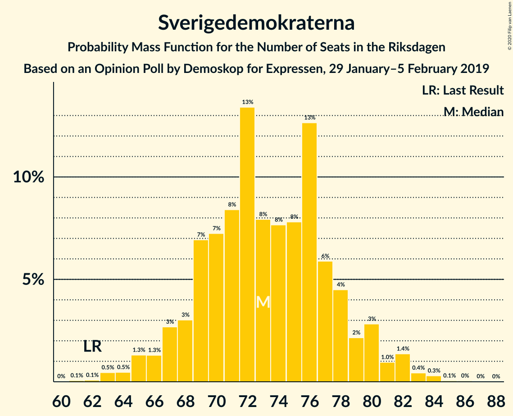
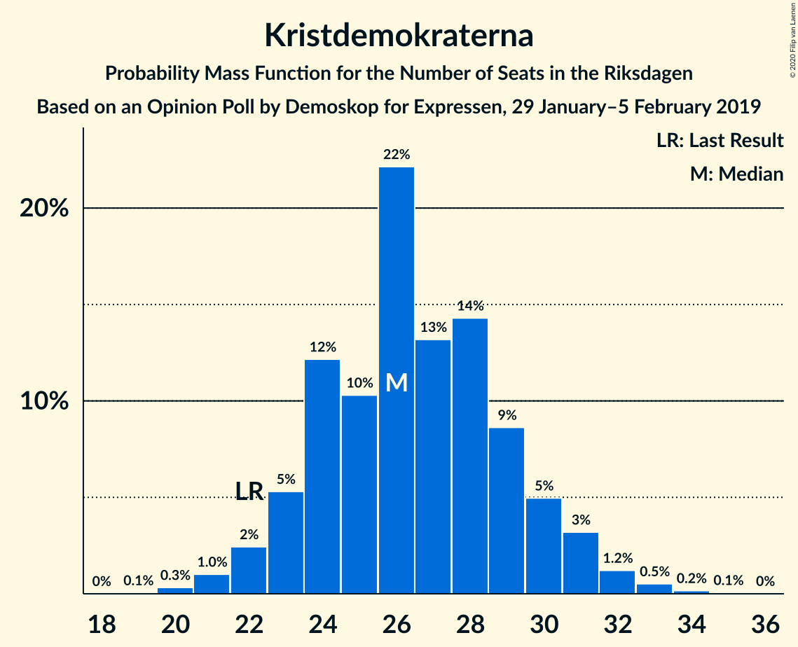
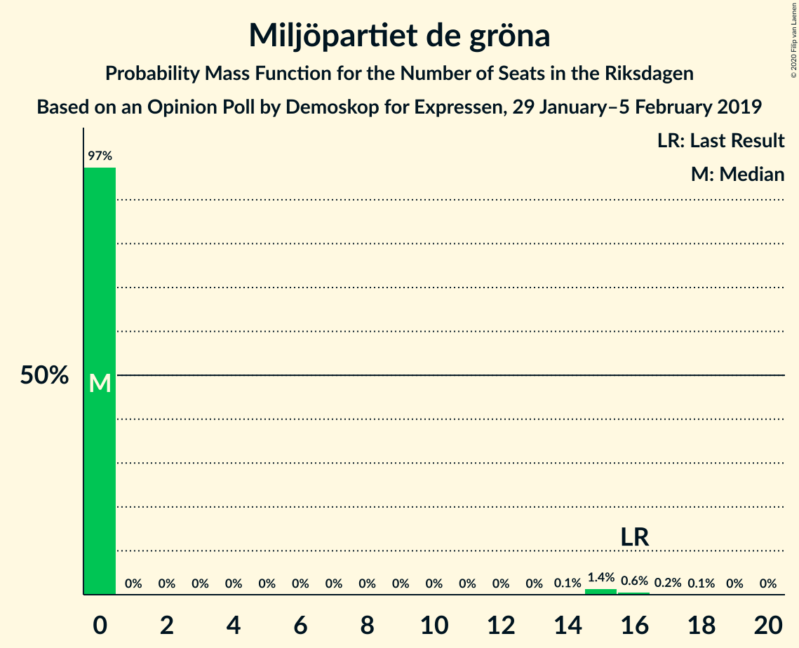
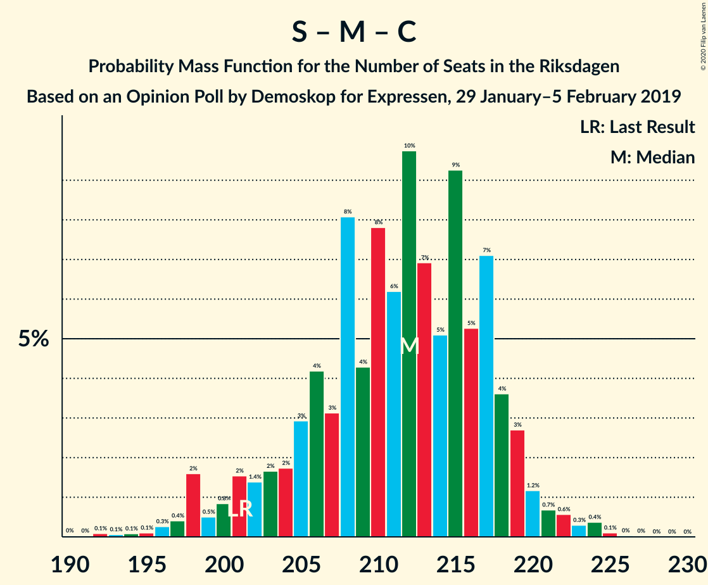
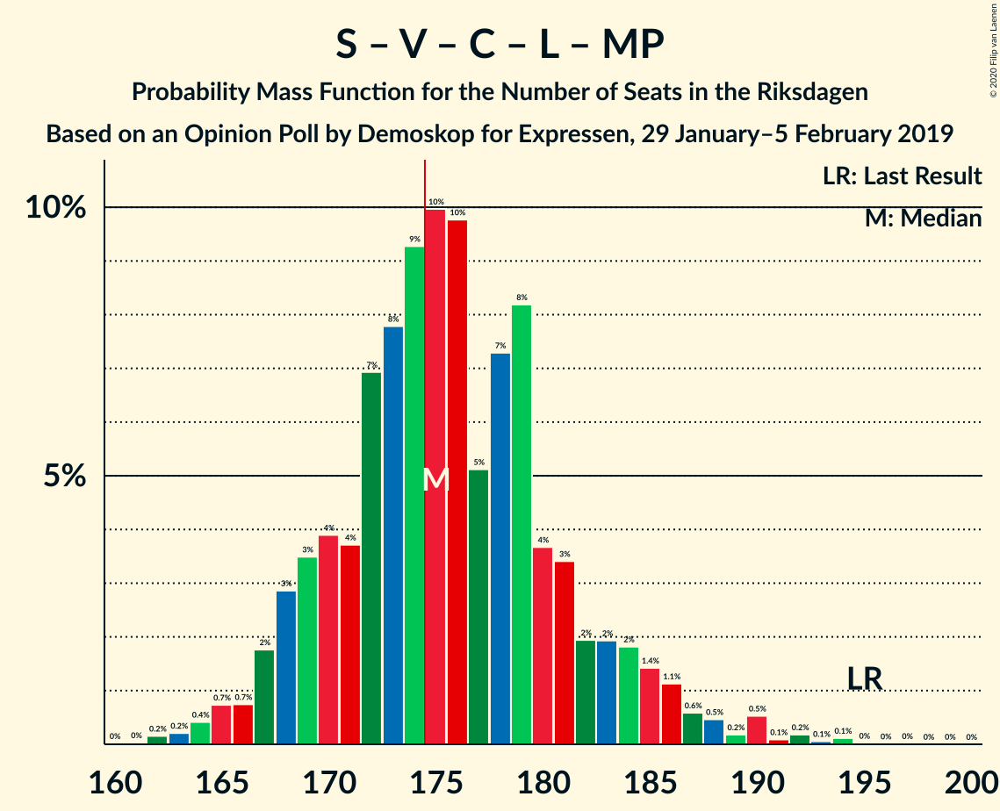
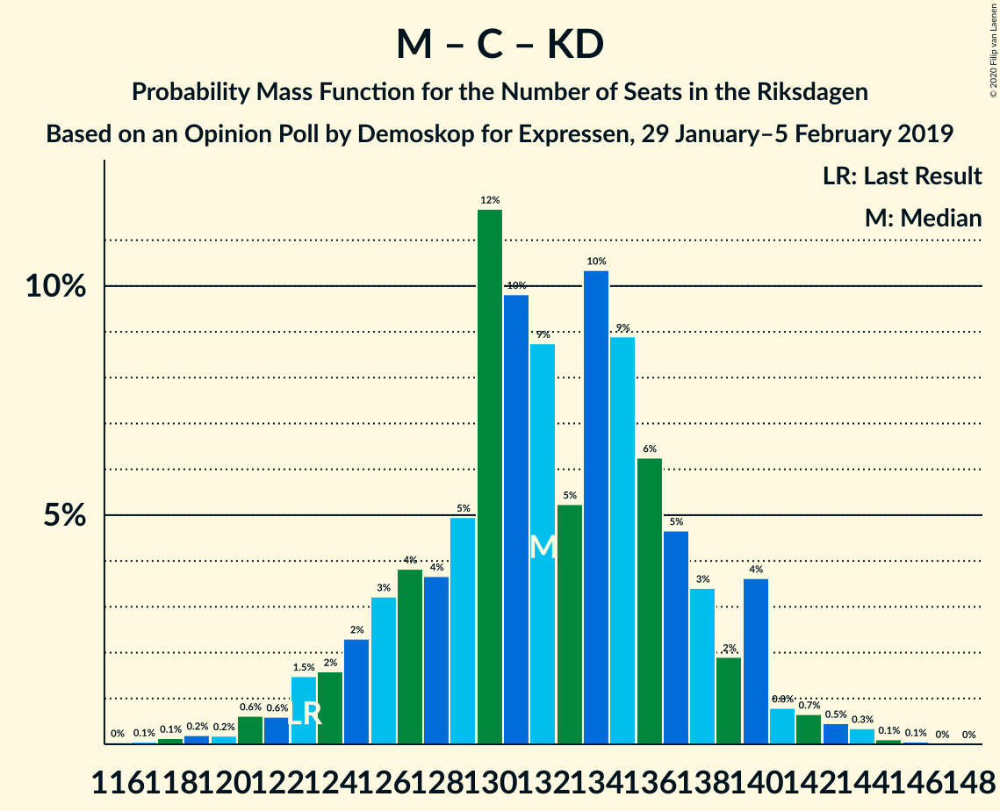
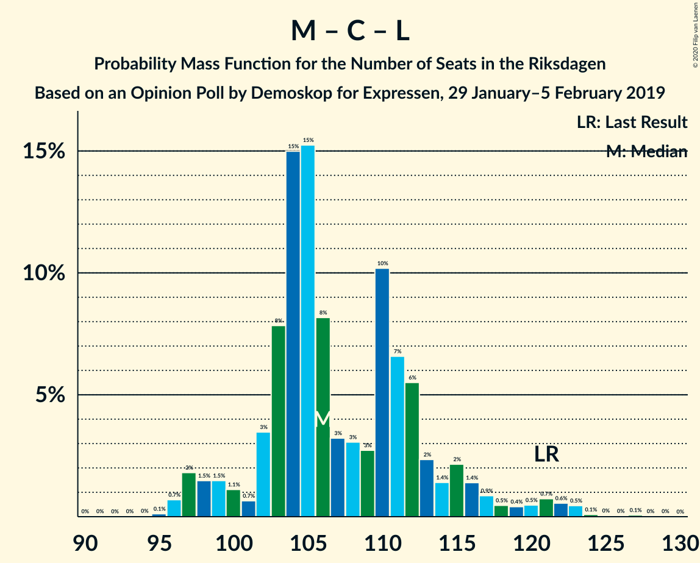

# Opinion Poll by Demoskop for Expressen, 29 January–5 February 2019

<a href="#voting-intentions">Voting Intentions</a> | <a href="#seats">Seats</a> | <a href="#coalitions">Coalitions</a> | <a href="#technical-information">Technical Information</a>

## Voting Intentions

### Confidence Intervals

| Party | Last Result | Poll Result | 80% Confidence Interval | 90% Confidence Interval | 95% Confidence Interval | 99% Confidence Interval |
|:-----:|:-----------:|:-----------:|:-----------------------:|:-----------------------:|:-----------------------:|:-----------------------:|
| Sveriges socialdemokratiska arbetareparti | 28.3% | 27.9% | 26.5–29.4% |26.1–29.8% |25.8–30.2% |25.1–30.9% |
| Moderata samlingspartiet | 19.8% | 19.5% | 18.3–20.8% |17.9–21.2% |17.6–21.5% |17.1–22.2% |
| Sverigedemokraterna | 17.5% | 19.4% | 18.2–20.7% |17.8–21.1% |17.5–21.4% |16.9–22.0% |
| Vänsterpartiet | 8.0% | 9.6% | 8.7–10.6% |8.5–10.9% |8.2–11.2% |7.8–11.6% |
| Centerpartiet | 8.6% | 8.5% | 7.6–9.4% |7.4–9.7% |7.2–10.0% |6.8–10.4% |
| Kristdemokraterna | 6.3% | 7.0% | 6.2–7.9% |6.0–8.1% |5.8–8.3% |5.5–8.8% |
| Liberalerna | 5.5% | 3.3% | 2.8–4.0% |2.7–4.1% |2.5–4.3% |2.3–4.6% |
| Miljöpartiet de gröna | 4.4% | 3.2% | 2.7–3.8% |2.5–4.0% |2.4–4.2% |2.2–4.5% |

*Note:* The poll result column reflects the actual value used in the calculations. Published results may vary slightly, and in addition be rounded to fewer digits.

## Seats

### Confidence Intervals

| Party | Last Result | Median | 80% Confidence Interval | 90% Confidence Interval | 95% Confidence Interval | 99% Confidence Interval |
|:-----:|:-----------:|:------:|:-----------------------:|:-----------------------:|:-----------------------:|:-----------------------:|
| <a href="#sveriges-socialdemokratiska-arbetareparti">Sveriges socialdemokratiska arbetareparti</a> | 100 | 106 | 100–111 |98–113 |97–114 |94–117 |
| <a href="#moderata-samlingspartiet">Moderata samlingspartiet</a> | 70 | 74 | 69–78 |68–80 |66–81 |64–83 |
| <a href="#sverigedemokraterna">Sverigedemokraterna</a> | 62 | 73 | 69–78 |67–80 |66–81 |63–83 |
| <a href="#vänsterpartiet">Vänsterpartiet</a> | 28 | 36 | 33–39 |33–40 |32–41 |30–44 |
| <a href="#centerpartiet">Centerpartiet</a> | 31 | 32 | 29–36 |28–37 |27–38 |26–39 |
| <a href="#kristdemokraterna">Kristdemokraterna</a> | 22 | 26 | 24–30 |23–31 |22–31 |21–33 |
| <a href="#liberalerna">Liberalerna</a> | 20 | 0 | 0 |0–15 |0–16 |0–17 |
| <a href="#miljöpartiet-de-gröna">Miljöpartiet de gröna</a> | 16 | 0 | 0 |0 |0–14 |0–16 |

### Sveriges socialdemokratiska arbetareparti

*For a full overview of the results for this party, see the [Sveriges socialdemokratiska arbetareparti](party-sverigessocialdemokratiskaarbetareparti.html) page.*

| Number of Seats | Probability | Accumulated | Special Marks |
|:---------------:|:-----------:|:-----------:|:-------------:|
| 90 | 0% | 100% |  |
| 91 | 0% | 99.9% |  |
| 92 | 0.1% | 99.9% |  |
| 93 | 0.1% | 99.8% |  |
| 94 | 0.4% | 99.6% |  |
| 95 | 0.7% | 99.3% |  |
| 96 | 0.9% | 98.6% |  |
| 97 | 1.4% | 98% |  |
| 98 | 4% | 96% |  |
| 99 | 3% | 93% |  |
| 100 | 4% | 90% | Last Result |
| 101 | 4% | 86% |  |
| 102 | 6% | 82% |  |
| 103 | 5% | 75% |  |
| 104 | 11% | 70% |  |
| 105 | 9% | 59% |  |
| 106 | 8% | 50% | Median |
| 107 | 10% | 42% |  |
| 108 | 6% | 32% |  |
| 109 | 8% | 27% |  |
| 110 | 3% | 19% |  |
| 111 | 7% | 16% |  |
| 112 | 3% | 8% |  |
| 113 | 3% | 6% |  |
| 114 | 1.2% | 3% |  |
| 115 | 0.7% | 2% |  |
| 116 | 0.5% | 1.0% |  |
| 117 | 0.2% | 0.6% |  |
| 118 | 0.2% | 0.3% |  |
| 119 | 0.1% | 0.2% |  |
| 120 | 0% | 0.1% |  |
| 121 | 0% | 0% |  |

### Moderata samlingspartiet

*For a full overview of the results for this party, see the [Moderata samlingspartiet](party-moderatasamlingspartiet.html) page.*

| Number of Seats | Probability | Accumulated | Special Marks |
|:---------------:|:-----------:|:-----------:|:-------------:|
| 61 | 0% | 100% |  |
| 62 | 0.1% | 99.9% |  |
| 63 | 0.1% | 99.9% |  |
| 64 | 0.5% | 99.7% |  |
| 65 | 0.7% | 99.3% |  |
| 66 | 1.4% | 98.5% |  |
| 67 | 2% | 97% |  |
| 68 | 3% | 95% |  |
| 69 | 4% | 92% |  |
| 70 | 7% | 88% | Last Result |
| 71 | 8% | 81% |  |
| 72 | 12% | 73% |  |
| 73 | 10% | 61% |  |
| 74 | 11% | 51% | Median |
| 75 | 10% | 40% |  |
| 76 | 9% | 30% |  |
| 77 | 6% | 21% |  |
| 78 | 5% | 15% |  |
| 79 | 4% | 10% |  |
| 80 | 2% | 6% |  |
| 81 | 1.4% | 3% |  |
| 82 | 1.1% | 2% |  |
| 83 | 0.5% | 0.8% |  |
| 84 | 0.2% | 0.3% |  |
| 85 | 0.1% | 0.2% |  |
| 86 | 0.1% | 0.1% |  |
| 87 | 0% | 0% |  |

### Sverigedemokraterna

*For a full overview of the results for this party, see the [Sverigedemokraterna](party-sverigedemokraterna.html) page.*

| Number of Seats | Probability | Accumulated | Special Marks |
|:---------------:|:-----------:|:-----------:|:-------------:|
| 61 | 0.1% | 100% |  |
| 62 | 0.1% | 99.9% | Last Result |
| 63 | 0.5% | 99.8% |  |
| 64 | 0.5% | 99.4% |  |
| 65 | 1.3% | 98.9% |  |
| 66 | 1.3% | 98% |  |
| 67 | 3% | 96% |  |
| 68 | 3% | 94% |  |
| 69 | 7% | 91% |  |
| 70 | 7% | 84% |  |
| 71 | 8% | 76% |  |
| 72 | 13% | 68% |  |
| 73 | 8% | 55% | Median |
| 74 | 8% | 47% |  |
| 75 | 8% | 39% |  |
| 76 | 13% | 31% |  |
| 77 | 6% | 19% |  |
| 78 | 4% | 13% |  |
| 79 | 2% | 8% |  |
| 80 | 3% | 6% |  |
| 81 | 1.0% | 3% |  |
| 82 | 1.4% | 2% |  |
| 83 | 0.4% | 0.9% |  |
| 84 | 0.3% | 0.4% |  |
| 85 | 0.1% | 0.1% |  |
| 86 | 0% | 0.1% |  |
| 87 | 0% | 0% |  |

### Vänsterpartiet

*For a full overview of the results for this party, see the [Vänsterpartiet](party-vänsterpartiet.html) page.*

| Number of Seats | Probability | Accumulated | Special Marks |
|:---------------:|:-----------:|:-----------:|:-------------:|
| 28 | 0.1% | 100% | Last Result |
| 29 | 0.1% | 99.9% |  |
| 30 | 0.5% | 99.7% |  |
| 31 | 1.2% | 99.2% |  |
| 32 | 3% | 98% |  |
| 33 | 7% | 95% |  |
| 34 | 8% | 88% |  |
| 35 | 15% | 80% |  |
| 36 | 20% | 65% | Median |
| 37 | 18% | 45% |  |
| 38 | 12% | 27% |  |
| 39 | 9% | 16% |  |
| 40 | 3% | 7% |  |
| 41 | 2% | 4% |  |
| 42 | 0.7% | 2% |  |
| 43 | 0.6% | 1.2% |  |
| 44 | 0.3% | 0.6% |  |
| 45 | 0.2% | 0.3% |  |
| 46 | 0% | 0.1% |  |
| 47 | 0% | 0% |  |

### Centerpartiet

*For a full overview of the results for this party, see the [Centerpartiet](party-centerpartiet.html) page.*

| Number of Seats | Probability | Accumulated | Special Marks |
|:---------------:|:-----------:|:-----------:|:-------------:|
| 24 | 0.1% | 100% |  |
| 25 | 0.3% | 99.9% |  |
| 26 | 1.0% | 99.6% |  |
| 27 | 2% | 98.6% |  |
| 28 | 5% | 96% |  |
| 29 | 8% | 92% |  |
| 30 | 11% | 84% |  |
| 31 | 16% | 73% | Last Result |
| 32 | 15% | 57% | Median |
| 33 | 16% | 43% |  |
| 34 | 7% | 27% |  |
| 35 | 8% | 20% |  |
| 36 | 6% | 12% |  |
| 37 | 3% | 5% |  |
| 38 | 2% | 3% |  |
| 39 | 0.7% | 1.1% |  |
| 40 | 0.3% | 0.5% |  |
| 41 | 0.1% | 0.1% |  |
| 42 | 0% | 0% |  |

### Kristdemokraterna

*For a full overview of the results for this party, see the [Kristdemokraterna](party-kristdemokraterna.html) page.*

| Number of Seats | Probability | Accumulated | Special Marks |
|:---------------:|:-----------:|:-----------:|:-------------:|
| 19 | 0.1% | 100% |  |
| 20 | 0.3% | 99.9% |  |
| 21 | 1.0% | 99.6% |  |
| 22 | 2% | 98.6% | Last Result |
| 23 | 5% | 96% |  |
| 24 | 12% | 91% |  |
| 25 | 10% | 79% |  |
| 26 | 22% | 68% | Median |
| 27 | 13% | 46% |  |
| 28 | 14% | 33% |  |
| 29 | 9% | 19% |  |
| 30 | 5% | 10% |  |
| 31 | 3% | 5% |  |
| 32 | 1.2% | 2% |  |
| 33 | 0.5% | 0.8% |  |
| 34 | 0.2% | 0.2% |  |
| 35 | 0.1% | 0.1% |  |
| 36 | 0% | 0% |  |

### Liberalerna

*For a full overview of the results for this party, see the [Liberalerna](party-liberalerna.html) page.*

| Number of Seats | Probability | Accumulated | Special Marks |
|:---------------:|:-----------:|:-----------:|:-------------:|
| 0 | 92% | 100% | Median |
| 1 | 0% | 8% |  |
| 2 | 0% | 8% |  |
| 3 | 0% | 8% |  |
| 4 | 0% | 8% |  |
| 5 | 0% | 8% |  |
| 6 | 0% | 8% |  |
| 7 | 0% | 8% |  |
| 8 | 0% | 8% |  |
| 9 | 0% | 8% |  |
| 10 | 0% | 8% |  |
| 11 | 0% | 8% |  |
| 12 | 0% | 8% |  |
| 13 | 0% | 8% |  |
| 14 | 0.1% | 8% |  |
| 15 | 5% | 8% |  |
| 16 | 2% | 3% |  |
| 17 | 0.7% | 0.9% |  |
| 18 | 0.2% | 0.2% |  |
| 19 | 0% | 0% |  |
| 20 | 0% | 0% | Last Result |

### Miljöpartiet de gröna

*For a full overview of the results for this party, see the [Miljöpartiet de gröna](party-miljöpartietdegröna.html) page.*

| Number of Seats | Probability | Accumulated | Special Marks |
|:---------------:|:-----------:|:-----------:|:-------------:|
| 0 | 97% | 100% | Median |
| 1 | 0% | 3% |  |
| 2 | 0% | 3% |  |
| 3 | 0% | 3% |  |
| 4 | 0% | 3% |  |
| 5 | 0% | 3% |  |
| 6 | 0% | 3% |  |
| 7 | 0% | 3% |  |
| 8 | 0% | 3% |  |
| 9 | 0% | 3% |  |
| 10 | 0% | 3% |  |
| 11 | 0% | 3% |  |
| 12 | 0% | 3% |  |
| 13 | 0% | 3% |  |
| 14 | 0.1% | 3% |  |
| 15 | 1.4% | 2% |  |
| 16 | 0.6% | 0.9% | Last Result |
| 17 | 0.2% | 0.3% |  |
| 18 | 0.1% | 0.1% |  |
| 19 | 0% | 0% |  |

## Coalitions

### Confidence Intervals

| Coalition | Last Result | Median | Majority? | 80% Confidence Interval | 90% Confidence Interval | 95% Confidence Interval | 99% Confidence Interval |
|:---------:|:-----------:|:------:|:---------:|:-----------------------:|:-----------------------:|:-----------------------:|:-----------------------:|
| Sveriges socialdemokratiska arbetareparti – Moderata samlingspartiet – Centerpartiet | 201 | 212 | 100% | 204–217 | 201–219 | 198–220 | 196–224 |
| Sveriges socialdemokratiska arbetareparti – Moderata samlingspartiet | 170 | 179 | 81% | 172–185 | 170–187 | 168–188 | 164–191 |
| Sveriges socialdemokratiska arbetareparti – Vänsterpartiet – Centerpartiet – Liberalerna – Miljöpartiet de gröna | 195 | 175 | 58% | 169–182 | 168–184 | 167–186 | 164–191 |
| Moderata samlingspartiet – Sverigedemokraterna – Kristdemokraterna | 154 | 174 | 42% | 167–180 | 165–181 | 163–182 | 158–185 |
| Moderata samlingspartiet – Sverigedemokraterna | 132 | 147 | 0% | 141–153 | 138–155 | 136–156 | 133–159 |
| Sveriges socialdemokratiska arbetareparti – Vänsterpartiet – Miljöpartiet de gröna | 144 | 142 | 0% | 136–148 | 134–150 | 133–151 | 129–156 |
| Sveriges socialdemokratiska arbetareparti – Centerpartiet – Liberalerna – Miljöpartiet de gröna | 167 | 139 | 0% | 133–146 | 131–149 | 130–151 | 127–156 |
| Sveriges socialdemokratiska arbetareparti – Vänsterpartiet | 128 | 142 | 0% | 135–147 | 134–149 | 132–150 | 128–153 |
| Moderata samlingspartiet – Centerpartiet – Kristdemokraterna – Liberalerna | 143 | 133 | 0% | 128–140 | 126–142 | 124–145 | 121–148 |
| Moderata samlingspartiet – Centerpartiet – Kristdemokraterna | 123 | 132 | 0% | 126–138 | 125–140 | 123–140 | 120–144 |
| Moderata samlingspartiet – Centerpartiet – Liberalerna | 121 | 106 | 0% | 102–113 | 99–116 | 97–120 | 96–123 |
| Sveriges socialdemokratiska arbetareparti – Miljöpartiet de gröna | 116 | 106 | 0% | 100–112 | 98–113 | 97–116 | 94–120 |
| Moderata samlingspartiet – Centerpartiet | 101 | 105 | 0% | 100–111 | 98–112 | 97–113 | 94–117 |

### Sveriges socialdemokratiska arbetareparti – Moderata samlingspartiet – Centerpartiet

| Number of Seats | Probability | Accumulated | Special Marks |
|:---------------:|:-----------:|:-----------:|:-------------:|
| 190 | 0% | 100% |  |
| 191 | 0% | 99.9% |  |
| 192 | 0.1% | 99.9% |  |
| 193 | 0.1% | 99.8% |  |
| 194 | 0.1% | 99.7% |  |
| 195 | 0.1% | 99.7% |  |
| 196 | 0.3% | 99.6% |  |
| 197 | 0.4% | 99.3% |  |
| 198 | 2% | 98.9% |  |
| 199 | 0.5% | 97% |  |
| 200 | 0.8% | 97% |  |
| 201 | 2% | 96% | Last Result |
| 202 | 1.4% | 94% |  |
| 203 | 2% | 93% |  |
| 204 | 2% | 91% |  |
| 205 | 3% | 90% |  |
| 206 | 4% | 87% |  |
| 207 | 3% | 82% |  |
| 208 | 8% | 79% |  |
| 209 | 4% | 71% |  |
| 210 | 8% | 67% |  |
| 211 | 6% | 59% |  |
| 212 | 10% | 53% | Median |
| 213 | 7% | 43% |  |
| 214 | 5% | 36% |  |
| 215 | 9% | 31% |  |
| 216 | 5% | 22% |  |
| 217 | 7% | 17% |  |
| 218 | 4% | 10% |  |
| 219 | 3% | 6% |  |
| 220 | 1.2% | 3% |  |
| 221 | 0.7% | 2% |  |
| 222 | 0.6% | 1.4% |  |
| 223 | 0.3% | 0.8% |  |
| 224 | 0.4% | 0.6% |  |
| 225 | 0.1% | 0.2% |  |
| 226 | 0% | 0.1% |  |
| 227 | 0% | 0% |  |

### Sveriges socialdemokratiska arbetareparti – Moderata samlingspartiet

| Number of Seats | Probability | Accumulated | Special Marks |
|:---------------:|:-----------:|:-----------:|:-------------:|
| 159 | 0% | 100% |  |
| 160 | 0.1% | 99.9% |  |
| 161 | 0.1% | 99.9% |  |
| 162 | 0.1% | 99.8% |  |
| 163 | 0.1% | 99.8% |  |
| 164 | 0.2% | 99.7% |  |
| 165 | 0.3% | 99.5% |  |
| 166 | 0.4% | 99.2% |  |
| 167 | 0.7% | 98.7% |  |
| 168 | 2% | 98% |  |
| 169 | 1.1% | 96% |  |
| 170 | 1.4% | 95% | Last Result |
| 171 | 2% | 94% |  |
| 172 | 2% | 92% |  |
| 173 | 3% | 89% |  |
| 174 | 5% | 86% |  |
| 175 | 4% | 81% | Majority |
| 176 | 7% | 78% |  |
| 177 | 7% | 71% |  |
| 178 | 6% | 64% |  |
| 179 | 8% | 58% |  |
| 180 | 6% | 50% | Median |
| 181 | 8% | 44% |  |
| 182 | 8% | 36% |  |
| 183 | 4% | 28% |  |
| 184 | 11% | 24% |  |
| 185 | 4% | 13% |  |
| 186 | 2% | 9% |  |
| 187 | 3% | 7% |  |
| 188 | 2% | 4% |  |
| 189 | 1.3% | 2% |  |
| 190 | 0.5% | 1.2% |  |
| 191 | 0.3% | 0.7% |  |
| 192 | 0.1% | 0.4% |  |
| 193 | 0.2% | 0.3% |  |
| 194 | 0% | 0.1% |  |
| 195 | 0% | 0% |  |

### Sveriges socialdemokratiska arbetareparti – Vänsterpartiet – Centerpartiet – Liberalerna – Miljöpartiet de gröna

| Number of Seats | Probability | Accumulated | Special Marks |
|:---------------:|:-----------:|:-----------:|:-------------:|
| 161 | 0% | 100% |  |
| 162 | 0.2% | 99.9% |  |
| 163 | 0.2% | 99.8% |  |
| 164 | 0.4% | 99.6% |  |
| 165 | 0.7% | 99.1% |  |
| 166 | 0.7% | 98% |  |
| 167 | 2% | 98% |  |
| 168 | 3% | 96% |  |
| 169 | 3% | 93% |  |
| 170 | 4% | 90% |  |
| 171 | 4% | 86% |  |
| 172 | 7% | 82% |  |
| 173 | 8% | 75% |  |
| 174 | 9% | 67% | Median |
| 175 | 10% | 58% | Majority |
| 176 | 10% | 48% |  |
| 177 | 5% | 38% |  |
| 178 | 7% | 33% |  |
| 179 | 8% | 26% |  |
| 180 | 4% | 18% |  |
| 181 | 3% | 14% |  |
| 182 | 2% | 11% |  |
| 183 | 2% | 9% |  |
| 184 | 2% | 7% |  |
| 185 | 1.4% | 5% |  |
| 186 | 1.1% | 3% |  |
| 187 | 0.6% | 2% |  |
| 188 | 0.5% | 2% |  |
| 189 | 0.2% | 1.2% |  |
| 190 | 0.5% | 1.0% |  |
| 191 | 0.1% | 0.5% |  |
| 192 | 0.2% | 0.4% |  |
| 193 | 0.1% | 0.2% |  |
| 194 | 0.1% | 0.2% |  |
| 195 | 0% | 0.1% | Last Result |
| 196 | 0% | 0% |  |

### Moderata samlingspartiet – Sverigedemokraterna – Kristdemokraterna

| Number of Seats | Probability | Accumulated | Special Marks |
|:---------------:|:-----------:|:-----------:|:-------------:|
| 154 | 0% | 100% | Last Result |
| 155 | 0.1% | 99.9% |  |
| 156 | 0.1% | 99.8% |  |
| 157 | 0.2% | 99.8% |  |
| 158 | 0.1% | 99.6% |  |
| 159 | 0.5% | 99.5% |  |
| 160 | 0.2% | 99.0% |  |
| 161 | 0.5% | 98.8% |  |
| 162 | 0.6% | 98% |  |
| 163 | 1.1% | 98% |  |
| 164 | 1.4% | 97% |  |
| 165 | 2% | 95% |  |
| 166 | 2% | 93% |  |
| 167 | 2% | 91% |  |
| 168 | 3% | 89% |  |
| 169 | 4% | 86% |  |
| 170 | 8% | 82% |  |
| 171 | 7% | 74% |  |
| 172 | 5% | 67% |  |
| 173 | 10% | 62% | Median |
| 174 | 10% | 52% |  |
| 175 | 9% | 42% | Majority |
| 176 | 8% | 33% |  |
| 177 | 7% | 25% |  |
| 178 | 4% | 18% |  |
| 179 | 4% | 14% |  |
| 180 | 3% | 10% |  |
| 181 | 3% | 7% |  |
| 182 | 2% | 4% |  |
| 183 | 0.7% | 2% |  |
| 184 | 0.7% | 2% |  |
| 185 | 0.4% | 0.9% |  |
| 186 | 0.2% | 0.4% |  |
| 187 | 0.2% | 0.2% |  |
| 188 | 0% | 0.1% |  |
| 189 | 0% | 0% |  |

### Moderata samlingspartiet – Sverigedemokraterna

| Number of Seats | Probability | Accumulated | Special Marks |
|:---------------:|:-----------:|:-----------:|:-------------:|
| 129 | 0% | 100% |  |
| 130 | 0% | 99.9% |  |
| 131 | 0.1% | 99.9% |  |
| 132 | 0.1% | 99.8% | Last Result |
| 133 | 0.3% | 99.7% |  |
| 134 | 0.4% | 99.4% |  |
| 135 | 0.6% | 99.0% |  |
| 136 | 1.1% | 98% |  |
| 137 | 0.7% | 97% |  |
| 138 | 2% | 97% |  |
| 139 | 1.2% | 94% |  |
| 140 | 3% | 93% |  |
| 141 | 3% | 91% |  |
| 142 | 5% | 88% |  |
| 143 | 5% | 83% |  |
| 144 | 4% | 78% |  |
| 145 | 11% | 74% |  |
| 146 | 9% | 63% |  |
| 147 | 6% | 54% | Median |
| 148 | 12% | 47% |  |
| 149 | 6% | 36% |  |
| 150 | 7% | 29% |  |
| 151 | 6% | 22% |  |
| 152 | 4% | 16% |  |
| 153 | 3% | 12% |  |
| 154 | 3% | 8% |  |
| 155 | 2% | 5% |  |
| 156 | 1.4% | 3% |  |
| 157 | 0.7% | 2% |  |
| 158 | 0.6% | 1.3% |  |
| 159 | 0.4% | 0.7% |  |
| 160 | 0.2% | 0.3% |  |
| 161 | 0.1% | 0.1% |  |
| 162 | 0% | 0.1% |  |
| 163 | 0% | 0% |  |

### Sveriges socialdemokratiska arbetareparti – Vänsterpartiet – Miljöpartiet de gröna

| Number of Seats | Probability | Accumulated | Special Marks |
|:---------------:|:-----------:|:-----------:|:-------------:|
| 126 | 0% | 100% |  |
| 127 | 0.1% | 99.9% |  |
| 128 | 0.2% | 99.8% |  |
| 129 | 0.2% | 99.6% |  |
| 130 | 0.4% | 99.5% |  |
| 131 | 0.4% | 99.1% |  |
| 132 | 0.7% | 98.8% |  |
| 133 | 1.5% | 98% |  |
| 134 | 2% | 97% |  |
| 135 | 3% | 94% |  |
| 136 | 3% | 91% |  |
| 137 | 3% | 88% |  |
| 138 | 5% | 85% |  |
| 139 | 7% | 80% |  |
| 140 | 6% | 73% |  |
| 141 | 9% | 67% |  |
| 142 | 12% | 58% | Median |
| 143 | 8% | 46% |  |
| 144 | 9% | 38% | Last Result |
| 145 | 7% | 29% |  |
| 146 | 5% | 23% |  |
| 147 | 7% | 18% |  |
| 148 | 3% | 11% |  |
| 149 | 2% | 8% |  |
| 150 | 2% | 5% |  |
| 151 | 1.1% | 4% |  |
| 152 | 0.5% | 2% |  |
| 153 | 0.5% | 2% |  |
| 154 | 0.3% | 1.4% |  |
| 155 | 0.4% | 1.2% |  |
| 156 | 0.2% | 0.7% |  |
| 157 | 0.1% | 0.5% |  |
| 158 | 0.1% | 0.4% |  |
| 159 | 0.1% | 0.3% |  |
| 160 | 0.1% | 0.2% |  |
| 161 | 0.1% | 0.1% |  |
| 162 | 0% | 0.1% |  |
| 163 | 0% | 0% |  |

### Sveriges socialdemokratiska arbetareparti – Centerpartiet – Liberalerna – Miljöpartiet de gröna

| Number of Seats | Probability | Accumulated | Special Marks |
|:---------------:|:-----------:|:-----------:|:-------------:|
| 124 | 0% | 100% |  |
| 125 | 0.1% | 99.9% |  |
| 126 | 0.3% | 99.9% |  |
| 127 | 0.5% | 99.6% |  |
| 128 | 0.5% | 99.1% |  |
| 129 | 0.9% | 98.6% |  |
| 130 | 1.1% | 98% |  |
| 131 | 3% | 97% |  |
| 132 | 2% | 93% |  |
| 133 | 4% | 91% |  |
| 134 | 5% | 87% |  |
| 135 | 4% | 82% |  |
| 136 | 9% | 78% |  |
| 137 | 11% | 69% |  |
| 138 | 5% | 58% | Median |
| 139 | 6% | 53% |  |
| 140 | 7% | 47% |  |
| 141 | 6% | 40% |  |
| 142 | 9% | 33% |  |
| 143 | 5% | 24% |  |
| 144 | 5% | 19% |  |
| 145 | 3% | 15% |  |
| 146 | 3% | 12% |  |
| 147 | 2% | 9% |  |
| 148 | 1.3% | 7% |  |
| 149 | 1.4% | 6% |  |
| 150 | 1.4% | 4% |  |
| 151 | 0.7% | 3% |  |
| 152 | 0.4% | 2% |  |
| 153 | 0.5% | 2% |  |
| 154 | 0.4% | 1.4% |  |
| 155 | 0.2% | 1.0% |  |
| 156 | 0.5% | 0.8% |  |
| 157 | 0.1% | 0.3% |  |
| 158 | 0% | 0.2% |  |
| 159 | 0.1% | 0.2% |  |
| 160 | 0% | 0.1% |  |
| 161 | 0% | 0% |  |
| 162 | 0% | 0% |  |
| 163 | 0% | 0% |  |
| 164 | 0% | 0% |  |
| 165 | 0% | 0% |  |
| 166 | 0% | 0% |  |
| 167 | 0% | 0% | Last Result |

### Sveriges socialdemokratiska arbetareparti – Vänsterpartiet

| Number of Seats | Probability | Accumulated | Special Marks |
|:---------------:|:-----------:|:-----------:|:-------------:|
| 125 | 0% | 100% |  |
| 126 | 0.1% | 99.9% |  |
| 127 | 0.1% | 99.8% |  |
| 128 | 0.2% | 99.7% | Last Result |
| 129 | 0.2% | 99.5% |  |
| 130 | 0.5% | 99.3% |  |
| 131 | 0.5% | 98.8% |  |
| 132 | 0.9% | 98% |  |
| 133 | 2% | 97% |  |
| 134 | 3% | 96% |  |
| 135 | 3% | 93% |  |
| 136 | 3% | 90% |  |
| 137 | 3% | 87% |  |
| 138 | 5% | 83% |  |
| 139 | 7% | 78% |  |
| 140 | 6% | 71% |  |
| 141 | 10% | 65% |  |
| 142 | 12% | 56% | Median |
| 143 | 8% | 44% |  |
| 144 | 9% | 36% |  |
| 145 | 7% | 27% |  |
| 146 | 5% | 21% |  |
| 147 | 7% | 16% |  |
| 148 | 3% | 9% |  |
| 149 | 2% | 6% |  |
| 150 | 2% | 4% |  |
| 151 | 1.1% | 2% |  |
| 152 | 0.4% | 1.2% |  |
| 153 | 0.4% | 0.7% |  |
| 154 | 0.1% | 0.4% |  |
| 155 | 0.2% | 0.3% |  |
| 156 | 0.1% | 0.1% |  |
| 157 | 0% | 0% |  |

### Moderata samlingspartiet – Centerpartiet – Kristdemokraterna – Liberalerna

| Number of Seats | Probability | Accumulated | Special Marks |
|:---------------:|:-----------:|:-----------:|:-------------:|
| 117 | 0% | 100% |  |
| 118 | 0% | 99.9% |  |
| 119 | 0.1% | 99.9% |  |
| 120 | 0.1% | 99.8% |  |
| 121 | 0.4% | 99.7% |  |
| 122 | 0.2% | 99.3% |  |
| 123 | 0.5% | 99.1% |  |
| 124 | 1.2% | 98.6% |  |
| 125 | 2% | 97% |  |
| 126 | 2% | 96% |  |
| 127 | 2% | 93% |  |
| 128 | 3% | 91% |  |
| 129 | 5% | 88% |  |
| 130 | 11% | 83% |  |
| 131 | 9% | 72% |  |
| 132 | 8% | 63% | Median |
| 133 | 5% | 55% |  |
| 134 | 10% | 49% |  |
| 135 | 9% | 39% |  |
| 136 | 6% | 30% |  |
| 137 | 5% | 24% |  |
| 138 | 4% | 19% |  |
| 139 | 2% | 15% |  |
| 140 | 4% | 12% |  |
| 141 | 1.3% | 8% |  |
| 142 | 2% | 7% |  |
| 143 | 0.7% | 4% | Last Result |
| 144 | 0.9% | 4% |  |
| 145 | 0.5% | 3% |  |
| 146 | 0.7% | 2% |  |
| 147 | 0.9% | 2% |  |
| 148 | 0.2% | 0.7% |  |
| 149 | 0.1% | 0.4% |  |
| 150 | 0.1% | 0.3% |  |
| 151 | 0.1% | 0.2% |  |
| 152 | 0% | 0.1% |  |
| 153 | 0% | 0.1% |  |
| 154 | 0% | 0% |  |

### Moderata samlingspartiet – Centerpartiet – Kristdemokraterna

| Number of Seats | Probability | Accumulated | Special Marks |
|:---------------:|:-----------:|:-----------:|:-------------:|
| 116 | 0% | 100% |  |
| 117 | 0.1% | 99.9% |  |
| 118 | 0.1% | 99.9% |  |
| 119 | 0.2% | 99.7% |  |
| 120 | 0.2% | 99.5% |  |
| 121 | 0.6% | 99.3% |  |
| 122 | 0.6% | 98.7% |  |
| 123 | 1.5% | 98% | Last Result |
| 124 | 2% | 97% |  |
| 125 | 2% | 95% |  |
| 126 | 3% | 93% |  |
| 127 | 4% | 90% |  |
| 128 | 4% | 86% |  |
| 129 | 5% | 82% |  |
| 130 | 12% | 77% |  |
| 131 | 10% | 65% |  |
| 132 | 9% | 56% | Median |
| 133 | 5% | 47% |  |
| 134 | 10% | 42% |  |
| 135 | 9% | 31% |  |
| 136 | 6% | 22% |  |
| 137 | 5% | 16% |  |
| 138 | 3% | 11% |  |
| 139 | 2% | 8% |  |
| 140 | 4% | 6% |  |
| 141 | 0.8% | 2% |  |
| 142 | 0.7% | 2% |  |
| 143 | 0.5% | 1.0% |  |
| 144 | 0.3% | 0.6% |  |
| 145 | 0.1% | 0.2% |  |
| 146 | 0.1% | 0.1% |  |
| 147 | 0% | 0% |  |

### Moderata samlingspartiet – Centerpartiet – Liberalerna

| Number of Seats | Probability | Accumulated | Special Marks |
|:---------------:|:-----------:|:-----------:|:-------------:|
| 92 | 0% | 100% |  |
| 93 | 0% | 99.9% |  |
| 94 | 0% | 99.9% |  |
| 95 | 0.1% | 99.9% |  |
| 96 | 0.7% | 99.8% |  |
| 97 | 2% | 99.1% |  |
| 98 | 1.5% | 97% |  |
| 99 | 1.5% | 96% |  |
| 100 | 1.1% | 94% |  |
| 101 | 0.7% | 93% |  |
| 102 | 3% | 93% |  |
| 103 | 8% | 89% |  |
| 104 | 15% | 81% |  |
| 105 | 15% | 66% |  |
| 106 | 8% | 51% | Median |
| 107 | 3% | 43% |  |
| 108 | 3% | 40% |  |
| 109 | 3% | 37% |  |
| 110 | 10% | 34% |  |
| 111 | 7% | 24% |  |
| 112 | 6% | 17% |  |
| 113 | 2% | 12% |  |
| 114 | 1.4% | 9% |  |
| 115 | 2% | 8% |  |
| 116 | 1.4% | 6% |  |
| 117 | 0.9% | 4% |  |
| 118 | 0.5% | 3% |  |
| 119 | 0.4% | 3% |  |
| 120 | 0.5% | 3% |  |
| 121 | 0.7% | 2% | Last Result |
| 122 | 0.6% | 1.3% |  |
| 123 | 0.5% | 0.7% |  |
| 124 | 0.1% | 0.3% |  |
| 125 | 0% | 0.2% |  |
| 126 | 0% | 0.1% |  |
| 127 | 0.1% | 0.1% |  |
| 128 | 0% | 0% |  |

### Sveriges socialdemokratiska arbetareparti – Miljöpartiet de gröna

| Number of Seats | Probability | Accumulated | Special Marks |
|:---------------:|:-----------:|:-----------:|:-------------:|
| 91 | 0% | 100% |  |
| 92 | 0.1% | 99.9% |  |
| 93 | 0.1% | 99.8% |  |
| 94 | 0.3% | 99.7% |  |
| 95 | 0.5% | 99.4% |  |
| 96 | 0.8% | 98.9% |  |
| 97 | 1.2% | 98% |  |
| 98 | 3% | 97% |  |
| 99 | 3% | 94% |  |
| 100 | 4% | 91% |  |
| 101 | 4% | 87% |  |
| 102 | 6% | 83% |  |
| 103 | 5% | 77% |  |
| 104 | 11% | 72% |  |
| 105 | 9% | 61% |  |
| 106 | 8% | 52% | Median |
| 107 | 10% | 44% |  |
| 108 | 6% | 35% |  |
| 109 | 8% | 29% |  |
| 110 | 3% | 21% |  |
| 111 | 7% | 18% |  |
| 112 | 3% | 10% |  |
| 113 | 3% | 8% |  |
| 114 | 1.3% | 5% |  |
| 115 | 0.8% | 3% |  |
| 116 | 0.7% | 3% | Last Result |
| 117 | 0.4% | 2% |  |
| 118 | 0.4% | 1.3% |  |
| 119 | 0.3% | 0.9% |  |
| 120 | 0.2% | 0.7% |  |
| 121 | 0.1% | 0.4% |  |
| 122 | 0.1% | 0.3% |  |
| 123 | 0.1% | 0.2% |  |
| 124 | 0.1% | 0.2% |  |
| 125 | 0.1% | 0.1% |  |
| 126 | 0% | 0% |  |

### Moderata samlingspartiet – Centerpartiet

| Number of Seats | Probability | Accumulated | Special Marks |
|:---------------:|:-----------:|:-----------:|:-------------:|
| 91 | 0% | 100% |  |
| 92 | 0.1% | 99.9% |  |
| 93 | 0.1% | 99.8% |  |
| 94 | 0.3% | 99.7% |  |
| 95 | 0.2% | 99.4% |  |
| 96 | 0.8% | 99.2% |  |
| 97 | 2% | 98% |  |
| 98 | 2% | 96% |  |
| 99 | 3% | 94% |  |
| 100 | 3% | 92% |  |
| 101 | 1.4% | 89% | Last Result |
| 102 | 4% | 87% |  |
| 103 | 8% | 83% |  |
| 104 | 15% | 76% |  |
| 105 | 16% | 60% |  |
| 106 | 9% | 44% | Median |
| 107 | 3% | 35% |  |
| 108 | 3% | 32% |  |
| 109 | 2% | 29% |  |
| 110 | 10% | 26% |  |
| 111 | 6% | 16% |  |
| 112 | 5% | 9% |  |
| 113 | 2% | 4% |  |
| 114 | 0.5% | 2% |  |
| 115 | 0.3% | 2% |  |
| 116 | 0.3% | 1.2% |  |
| 117 | 0.4% | 0.9% |  |
| 118 | 0.3% | 0.5% |  |
| 119 | 0.2% | 0.2% |  |
| 120 | 0% | 0% |  |

## Technical Information

### Opinion Poll

+ **Polling firm:** Demoskop
+ **Commissioner(s):** Expressen
+ **Fieldwork period:** 29 January–5 February 2019

### Calculations

+ **Sample size:** 1604
+ **Simulations done:** 1,048,576
+ **Error estimate:** 0.94%

