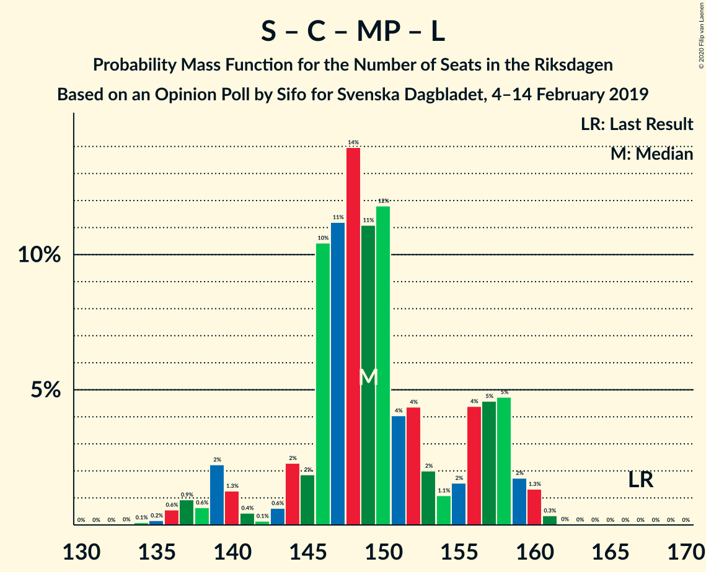
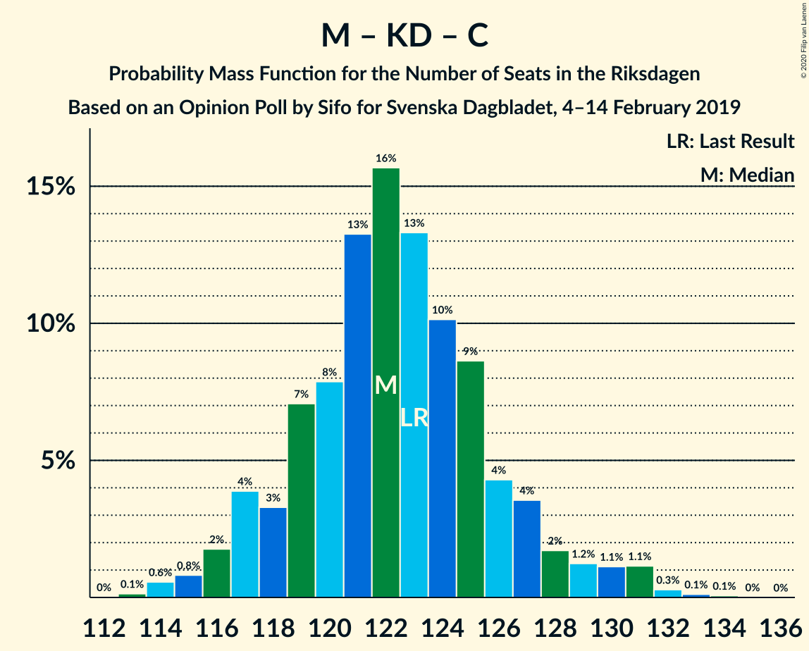

# Opinion Poll by Sifo for Svenska Dagbladet, 4–14 February 2019

<a href="#voting-intentions">Voting Intentions</a> | <a href="#seats">Seats</a> | <a href="#coalitions">Coalitions</a> | <a href="#technical-information">Technical Information</a>

## Voting Intentions

### Confidence Intervals

| Party | Last Result | Poll Result | 80% Confidence Interval | 90% Confidence Interval | 95% Confidence Interval | 99% Confidence Interval |
|:-----:|:-----------:|:-----------:|:-----------------------:|:-----------------------:|:-----------------------:|:-----------------------:|
| Sveriges socialdemokratiska arbetareparti | 28.3% | 28.4% | 27.8–29.1% |27.6–29.2% |27.4–29.4% |27.1–29.7% |
| Sverigedemokraterna | 17.5% | 19.2% | 18.6–19.8% |18.5–19.9% |18.4–20.1% |18.1–20.3% |
| Moderata samlingspartiet | 19.8% | 17.2% | 16.7–17.8% |16.5–17.9% |16.4–18.0% |16.1–18.3% |
| Vänsterpartiet | 8.0% | 9.6% | 9.2–10.0% |9.1–10.2% |9.0–10.3% |8.8–10.5% |
| Kristdemokraterna | 6.3% | 8.6% | 8.2–9.0% |8.1–9.1% |8.0–9.2% |7.8–9.4% |
| Centerpartiet | 8.6% | 7.7% | 7.3–8.1% |7.2–8.2% |7.1–8.3% |7.0–8.5% |
| Miljöpartiet de gröna | 4.4% | 4.3% | 4.0–4.6% |3.9–4.7% |3.9–4.8% |3.7–4.9% |
| Liberalerna | 5.5% | 3.8% | 3.5–4.1% |3.5–4.2% |3.4–4.2% |3.3–4.4% |

*Note:* The poll result column reflects the actual value used in the calculations. Published results may vary slightly, and in addition be rounded to fewer digits.

## Seats

### Confidence Intervals

| Party | Last Result | Median | 80% Confidence Interval | 90% Confidence Interval | 95% Confidence Interval | 99% Confidence Interval |
|:-----:|:-----------:|:------:|:-----------------------:|:-----------------------:|:-----------------------:|:-----------------------:|
| <a href="#sveriges-socialdemokratiska-arbetareparti">Sveriges socialdemokratiska arbetareparti</a> | 100 | 101 | 98–106 |98–106 |96–106 |96–107 |
| <a href="#sverigedemokraterna">Sverigedemokraterna</a> | 62 | 68 | 66–73 |65–73 |65–73 |65–74 |
| <a href="#moderata-samlingspartiet">Moderata samlingspartiet</a> | 70 | 63 | 62–63 |62–63 |61–68 |60–68 |
| <a href="#vänsterpartiet">Vänsterpartiet</a> | 28 | 36 | 34–36 |34–36 |34–36 |33–39 |
| <a href="#kristdemokraterna">Kristdemokraterna</a> | 22 | 33 | 29–34 |29–34 |29–34 |28–34 |
| <a href="#centerpartiet">Centerpartiet</a> | 31 | 27 | 26–28 |26–28 |25–28 |24–28 |
| <a href="#miljöpartiet-de-gröna">Miljöpartiet de gröna</a> | 16 | 16 | 16–17 |16–17 |15–17 |15–17 |
| <a href="#liberalerna">Liberalerna</a> | 20 | 0 | 0–15 |0–15 |0–15 |0–15 |

### Sveriges socialdemokratiska arbetareparti

*For a full overview of the results for this party, see the [Sveriges socialdemokratiska arbetareparti](party-sverigessocialdemokratiskaarbetareparti.html) page.*

| Number of Seats | Probability | Accumulated | Special Marks |
|:---------------:|:-----------:|:-----------:|:-------------:|
| 96 | 5% | 100% |  |
| 97 | 0.1% | 95% |  |
| 98 | 35% | 95% |  |
| 99 | 0.7% | 60% |  |
| 100 | 0.2% | 59% | Last Result |
| 101 | 22% | 59% | Median |
| 102 | 0.1% | 37% |  |
| 103 | 2% | 37% |  |
| 104 | 0.2% | 36% |  |
| 105 | 2% | 35% |  |
| 106 | 33% | 34% |  |
| 107 | 1.0% | 1.1% |  |
| 108 | 0% | 0.1% |  |
| 109 | 0% | 0.1% |  |
| 110 | 0% | 0.1% |  |
| 111 | 0.1% | 0.1% |  |
| 112 | 0% | 0% |  |

### Sverigedemokraterna

*For a full overview of the results for this party, see the [Sverigedemokraterna](party-sverigedemokraterna.html) page.*

| Number of Seats | Probability | Accumulated | Special Marks |
|:---------------:|:-----------:|:-----------:|:-------------:|
| 62 | 0% | 100% | Last Result |
| 63 | 0% | 100% |  |
| 64 | 0.2% | 100% |  |
| 65 | 5% | 99.8% |  |
| 66 | 34% | 95% |  |
| 67 | 0.1% | 61% |  |
| 68 | 34% | 60% | Median |
| 69 | 0.9% | 26% |  |
| 70 | 2% | 25% |  |
| 71 | 0.9% | 23% |  |
| 72 | 0.2% | 22% |  |
| 73 | 21% | 22% |  |
| 74 | 0.7% | 0.7% |  |
| 75 | 0.1% | 0.1% |  |
| 76 | 0% | 0% |  |

### Moderata samlingspartiet

*For a full overview of the results for this party, see the [Moderata samlingspartiet](party-moderatasamlingspartiet.html) page.*

| Number of Seats | Probability | Accumulated | Special Marks |
|:---------------:|:-----------:|:-----------:|:-------------:|
| 56 | 0.1% | 100% |  |
| 57 | 0% | 99.9% |  |
| 58 | 0% | 99.8% |  |
| 59 | 0.2% | 99.8% |  |
| 60 | 0.9% | 99.7% |  |
| 61 | 2% | 98.8% |  |
| 62 | 22% | 96% |  |
| 63 | 72% | 75% | Median |
| 64 | 0.2% | 3% |  |
| 65 | 0% | 3% |  |
| 66 | 0% | 3% |  |
| 67 | 0.1% | 3% |  |
| 68 | 3% | 3% |  |
| 69 | 0% | 0% |  |
| 70 | 0% | 0% | Last Result |

### Vänsterpartiet

*For a full overview of the results for this party, see the [Vänsterpartiet](party-vänsterpartiet.html) page.*

| Number of Seats | Probability | Accumulated | Special Marks |
|:---------------:|:-----------:|:-----------:|:-------------:|
| 28 | 0% | 100% | Last Result |
| 29 | 0% | 100% |  |
| 30 | 0% | 100% |  |
| 31 | 0% | 100% |  |
| 32 | 0% | 100% |  |
| 33 | 0.9% | 100% |  |
| 34 | 40% | 99.1% |  |
| 35 | 2% | 59% |  |
| 36 | 56% | 57% | Median |
| 37 | 0.1% | 0.8% |  |
| 38 | 0% | 0.7% |  |
| 39 | 0.7% | 0.7% |  |
| 40 | 0% | 0% |  |

### Kristdemokraterna

*For a full overview of the results for this party, see the [Kristdemokraterna](party-kristdemokraterna.html) page.*

| Number of Seats | Probability | Accumulated | Special Marks |
|:---------------:|:-----------:|:-----------:|:-------------:|
| 22 | 0% | 100% | Last Result |
| 23 | 0% | 100% |  |
| 24 | 0% | 100% |  |
| 25 | 0% | 100% |  |
| 26 | 0% | 100% |  |
| 27 | 0% | 100% |  |
| 28 | 2% | 100% |  |
| 29 | 36% | 98% |  |
| 30 | 0.8% | 62% |  |
| 31 | 0.4% | 61% |  |
| 32 | 6% | 61% |  |
| 33 | 22% | 54% | Median |
| 34 | 33% | 33% |  |
| 35 | 0% | 0% |  |

### Centerpartiet

*For a full overview of the results for this party, see the [Centerpartiet](party-centerpartiet.html) page.*

| Number of Seats | Probability | Accumulated | Special Marks |
|:---------------:|:-----------:|:-----------:|:-------------:|
| 24 | 0.9% | 100% |  |
| 25 | 2% | 99.1% |  |
| 26 | 35% | 97% |  |
| 27 | 24% | 62% | Median |
| 28 | 38% | 38% |  |
| 29 | 0.2% | 0.4% |  |
| 30 | 0.2% | 0.2% |  |
| 31 | 0% | 0% | Last Result |

### Miljöpartiet de gröna

*For a full overview of the results for this party, see the [Miljöpartiet de gröna](party-miljöpartietdegröna.html) page.*

| Number of Seats | Probability | Accumulated | Special Marks |
|:---------------:|:-----------:|:-----------:|:-------------:|
| 0 | 0.1% | 100% |  |
| 1 | 0% | 99.9% |  |
| 2 | 0% | 99.9% |  |
| 3 | 0% | 99.9% |  |
| 4 | 0% | 99.9% |  |
| 5 | 0% | 99.9% |  |
| 6 | 0% | 99.9% |  |
| 7 | 0% | 99.9% |  |
| 8 | 0% | 99.9% |  |
| 9 | 0% | 99.9% |  |
| 10 | 0% | 99.9% |  |
| 11 | 0% | 99.9% |  |
| 12 | 0% | 99.9% |  |
| 13 | 0% | 99.9% |  |
| 14 | 0.1% | 99.9% |  |
| 15 | 3% | 99.8% |  |
| 16 | 75% | 97% | Last Result, Median |
| 17 | 22% | 22% |  |
| 18 | 0% | 0.2% |  |
| 19 | 0.2% | 0.2% |  |
| 20 | 0% | 0% |  |

### Liberalerna

*For a full overview of the results for this party, see the [Liberalerna](party-liberalerna.html) page.*

| Number of Seats | Probability | Accumulated | Special Marks |
|:---------------:|:-----------:|:-----------:|:-------------:|
| 0 | 58% | 100% | Median |
| 1 | 0% | 42% |  |
| 2 | 0% | 42% |  |
| 3 | 0% | 42% |  |
| 4 | 0% | 42% |  |
| 5 | 0% | 42% |  |
| 6 | 0% | 42% |  |
| 7 | 0% | 42% |  |
| 8 | 0% | 42% |  |
| 9 | 0% | 42% |  |
| 10 | 0% | 42% |  |
| 11 | 0% | 42% |  |
| 12 | 0% | 42% |  |
| 13 | 0% | 42% |  |
| 14 | 2% | 42% |  |
| 15 | 40% | 40% |  |
| 16 | 0.1% | 0.1% |  |
| 17 | 0% | 0% |  |
| 18 | 0% | 0% |  |
| 19 | 0% | 0% |  |
| 20 | 0% | 0% | Last Result |

## Coalitions

### Confidence Intervals

| Coalition | Last Result | Median | Majority? | 80% Confidence Interval | 90% Confidence Interval | 95% Confidence Interval | 99% Confidence Interval |
|:---------:|:-----------:|:------:|:---------:|:-----------------------:|:-----------------------:|:-----------------------:|:-----------------------:|
| Sveriges socialdemokratiska arbetareparti – Moderata samlingspartiet – Centerpartiet | 201 | 190 | 100% | 187–197 | 187–197 | 187–200 | 182–201 |
| Sveriges socialdemokratiska arbetareparti – Vänsterpartiet – Centerpartiet – Miljöpartiet de gröna – Liberalerna | 195 | 186 | 99.9% | 181–189 | 181–189 | 181–189 | 181–193 |
| Sveriges socialdemokratiska arbetareparti – Moderata samlingspartiet | 170 | 163 | 0.8% | 161–169 | 159–169 | 159–173 | 158–175 |
| Sverigedemokraterna – Moderata samlingspartiet – Kristdemokraterna | 154 | 163 | 0.1% | 160–168 | 160–168 | 160–168 | 156–168 |
| Sveriges socialdemokratiska arbetareparti – Vänsterpartiet – Miljöpartiet de gröna | 144 | 154 | 0% | 148–158 | 147–158 | 146–158 | 146–158 |
| Sveriges socialdemokratiska arbetareparti – Centerpartiet – Miljöpartiet de gröna – Liberalerna | 167 | 150 | 0% | 145–155 | 145–155 | 145–155 | 143–158 |
| Sveriges socialdemokratiska arbetareparti – Vänsterpartiet | 128 | 137 | 0% | 132–142 | 132–142 | 130–142 | 130–142 |
| Moderata samlingspartiet – Kristdemokraterna – Centerpartiet – Liberalerna | 143 | 125 | 0% | 122–133 | 122–133 | 122–138 | 121–138 |
| Sverigedemokraterna – Moderata samlingspartiet | 132 | 131 | 0% | 129–135 | 128–135 | 128–137 | 127–138 |
| Moderata samlingspartiet – Kristdemokraterna – Centerpartiet | 123 | 122 | 0% | 118–125 | 118–125 | 116–125 | 115–125 |
| Sveriges socialdemokratiska arbetareparti – Miljöpartiet de gröna | 116 | 118 | 0% | 114–122 | 113–122 | 112–122 | 112–123 |
| Moderata samlingspartiet – Centerpartiet – Liberalerna | 121 | 91 | 0% | 89–104 | 89–104 | 89–106 | 89–106 |
| Moderata samlingspartiet – Centerpartiet | 101 | 89 | 0% | 89–91 | 89–91 | 86–94 | 84–95 |

### Sveriges socialdemokratiska arbetareparti – Moderata samlingspartiet – Centerpartiet

| Number of Seats | Probability | Accumulated | Special Marks |
|:---------------:|:-----------:|:-----------:|:-------------:|
| 182 | 0.9% | 100% |  |
| 183 | 0% | 99.1% |  |
| 184 | 0.2% | 99.1% |  |
| 185 | 0% | 99.0% |  |
| 186 | 0% | 99.0% |  |
| 187 | 39% | 99.0% |  |
| 188 | 0.9% | 60% |  |
| 189 | 2% | 59% |  |
| 190 | 21% | 57% |  |
| 191 | 0% | 36% | Median |
| 192 | 0% | 36% |  |
| 193 | 0% | 36% |  |
| 194 | 0% | 36% |  |
| 195 | 0.2% | 36% |  |
| 196 | 0% | 35% |  |
| 197 | 33% | 35% |  |
| 198 | 0% | 3% |  |
| 199 | 0.2% | 3% |  |
| 200 | 2% | 3% |  |
| 201 | 0.8% | 0.8% | Last Result |
| 202 | 0% | 0.1% |  |
| 203 | 0% | 0.1% |  |
| 204 | 0.1% | 0.1% |  |
| 205 | 0% | 0% |  |

### Sveriges socialdemokratiska arbetareparti – Vänsterpartiet – Centerpartiet – Miljöpartiet de gröna – Liberalerna

| Number of Seats | Probability | Accumulated | Special Marks |
|:---------------:|:-----------:|:-----------:|:-------------:|
| 174 | 0.1% | 100% |  |
| 175 | 0% | 99.9% | Majority |
| 176 | 0% | 99.9% |  |
| 177 | 0% | 99.9% |  |
| 178 | 0% | 99.9% |  |
| 179 | 0% | 99.9% |  |
| 180 | 0% | 99.9% | Median |
| 181 | 21% | 99.9% |  |
| 182 | 2% | 78% |  |
| 183 | 2% | 77% |  |
| 184 | 0% | 75% |  |
| 185 | 0.1% | 75% |  |
| 186 | 33% | 75% |  |
| 187 | 0% | 42% |  |
| 188 | 0.1% | 42% |  |
| 189 | 39% | 41% |  |
| 190 | 0.2% | 2% |  |
| 191 | 0.1% | 2% |  |
| 192 | 0% | 2% |  |
| 193 | 2% | 2% |  |
| 194 | 0% | 0.3% |  |
| 195 | 0% | 0.2% | Last Result |
| 196 | 0.1% | 0.2% |  |
| 197 | 0.1% | 0.1% |  |
| 198 | 0% | 0% |  |

### Sveriges socialdemokratiska arbetareparti – Moderata samlingspartiet

| Number of Seats | Probability | Accumulated | Special Marks |
|:---------------:|:-----------:|:-----------:|:-------------:|
| 157 | 0.1% | 100% |  |
| 158 | 0.9% | 99.9% |  |
| 159 | 5% | 99.0% |  |
| 160 | 0.7% | 94% |  |
| 161 | 34% | 93% |  |
| 162 | 0% | 59% |  |
| 163 | 21% | 59% |  |
| 164 | 2% | 37% | Median |
| 165 | 0% | 36% |  |
| 166 | 0% | 36% |  |
| 167 | 0% | 36% |  |
| 168 | 0.2% | 36% |  |
| 169 | 33% | 35% |  |
| 170 | 0% | 3% | Last Result |
| 171 | 0% | 3% |  |
| 172 | 0% | 3% |  |
| 173 | 2% | 3% |  |
| 174 | 0% | 0.8% |  |
| 175 | 0.8% | 0.8% | Majority |
| 176 | 0% | 0.1% |  |
| 177 | 0% | 0.1% |  |
| 178 | 0.1% | 0.1% |  |
| 179 | 0% | 0% |  |

### Sverigedemokraterna – Moderata samlingspartiet – Kristdemokraterna

| Number of Seats | Probability | Accumulated | Special Marks |
|:---------------:|:-----------:|:-----------:|:-------------:|
| 152 | 0.1% | 100% |  |
| 153 | 0.1% | 99.9% |  |
| 154 | 0% | 99.8% | Last Result |
| 155 | 0% | 99.8% |  |
| 156 | 2% | 99.7% |  |
| 157 | 0% | 98% |  |
| 158 | 0.1% | 98% |  |
| 159 | 0.2% | 98% |  |
| 160 | 39% | 98% |  |
| 161 | 0.1% | 59% |  |
| 162 | 0% | 58% |  |
| 163 | 33% | 58% |  |
| 164 | 0.1% | 25% | Median |
| 165 | 0% | 25% |  |
| 166 | 2% | 25% |  |
| 167 | 2% | 23% |  |
| 168 | 21% | 22% |  |
| 169 | 0% | 0.1% |  |
| 170 | 0% | 0.1% |  |
| 171 | 0% | 0.1% |  |
| 172 | 0% | 0.1% |  |
| 173 | 0% | 0.1% |  |
| 174 | 0% | 0.1% |  |
| 175 | 0.1% | 0.1% | Majority |
| 176 | 0% | 0% |  |

### Sveriges socialdemokratiska arbetareparti – Vänsterpartiet – Miljöpartiet de gröna

| Number of Seats | Probability | Accumulated | Special Marks |
|:---------------:|:-----------:|:-----------:|:-------------:|
| 144 | 0% | 100% | Last Result |
| 145 | 0% | 100% |  |
| 146 | 5% | 100% |  |
| 147 | 0.9% | 95% |  |
| 148 | 35% | 94% |  |
| 149 | 0% | 60% |  |
| 150 | 0% | 60% |  |
| 151 | 0% | 60% |  |
| 152 | 0% | 60% |  |
| 153 | 0.2% | 60% | Median |
| 154 | 24% | 59% |  |
| 155 | 0.3% | 36% |  |
| 156 | 3% | 35% |  |
| 157 | 0% | 33% |  |
| 158 | 33% | 33% |  |
| 159 | 0% | 0.2% |  |
| 160 | 0.2% | 0.2% |  |
| 161 | 0% | 0% |  |

### Sveriges socialdemokratiska arbetareparti – Centerpartiet – Miljöpartiet de gröna – Liberalerna

| Number of Seats | Probability | Accumulated | Special Marks |
|:---------------:|:-----------:|:-----------:|:-------------:|
| 137 | 0.1% | 100% |  |
| 138 | 0% | 99.9% |  |
| 139 | 0% | 99.9% |  |
| 140 | 0% | 99.9% |  |
| 141 | 0% | 99.9% |  |
| 142 | 0% | 99.9% |  |
| 143 | 0.7% | 99.9% |  |
| 144 | 0% | 99.3% | Median |
| 145 | 21% | 99.3% |  |
| 146 | 0.2% | 78% |  |
| 147 | 2% | 78% |  |
| 148 | 0% | 76% |  |
| 149 | 0.8% | 76% |  |
| 150 | 33% | 75% |  |
| 151 | 0% | 42% |  |
| 152 | 0.9% | 42% |  |
| 153 | 0% | 41% |  |
| 154 | 0% | 41% |  |
| 155 | 39% | 41% |  |
| 156 | 0.2% | 2% |  |
| 157 | 0% | 2% |  |
| 158 | 2% | 2% |  |
| 159 | 0% | 0.3% |  |
| 160 | 0.1% | 0.2% |  |
| 161 | 0.1% | 0.1% |  |
| 162 | 0% | 0% |  |
| 163 | 0% | 0% |  |
| 164 | 0% | 0% |  |
| 165 | 0% | 0% |  |
| 166 | 0% | 0% |  |
| 167 | 0% | 0% | Last Result |

### Sveriges socialdemokratiska arbetareparti – Vänsterpartiet

| Number of Seats | Probability | Accumulated | Special Marks |
|:---------------:|:-----------:|:-----------:|:-------------:|
| 128 | 0% | 100% | Last Result |
| 129 | 0% | 100% |  |
| 130 | 5% | 100% |  |
| 131 | 0% | 95% |  |
| 132 | 35% | 95% |  |
| 133 | 0.1% | 60% |  |
| 134 | 0% | 60% |  |
| 135 | 0% | 60% |  |
| 136 | 0.2% | 60% |  |
| 137 | 21% | 60% | Median |
| 138 | 2% | 38% |  |
| 139 | 0% | 36% |  |
| 140 | 0.9% | 36% |  |
| 141 | 2% | 35% |  |
| 142 | 33% | 33% |  |
| 143 | 0% | 0.1% |  |
| 144 | 0% | 0.1% |  |
| 145 | 0% | 0.1% |  |
| 146 | 0% | 0.1% |  |
| 147 | 0% | 0.1% |  |
| 148 | 0.1% | 0.1% |  |
| 149 | 0% | 0% |  |

### Moderata samlingspartiet – Kristdemokraterna – Centerpartiet – Liberalerna

| Number of Seats | Probability | Accumulated | Special Marks |
|:---------------:|:-----------:|:-----------:|:-------------:|
| 121 | 0.7% | 100% |  |
| 122 | 22% | 99.3% |  |
| 123 | 2% | 78% | Median |
| 124 | 0.8% | 76% |  |
| 125 | 33% | 75% |  |
| 126 | 0.1% | 42% |  |
| 127 | 0% | 42% |  |
| 128 | 0% | 42% |  |
| 129 | 2% | 42% |  |
| 130 | 0% | 40% |  |
| 131 | 0.9% | 40% |  |
| 132 | 0.2% | 40% |  |
| 133 | 34% | 39% |  |
| 134 | 0% | 5% |  |
| 135 | 0.1% | 5% |  |
| 136 | 0% | 5% |  |
| 137 | 0% | 5% |  |
| 138 | 5% | 5% |  |
| 139 | 0% | 0% |  |
| 140 | 0% | 0% |  |
| 141 | 0% | 0% |  |
| 142 | 0% | 0% |  |
| 143 | 0% | 0% | Last Result |

### Sverigedemokraterna – Moderata samlingspartiet

| Number of Seats | Probability | Accumulated | Special Marks |
|:---------------:|:-----------:|:-----------:|:-------------:|
| 123 | 0.2% | 100% |  |
| 124 | 0% | 99.8% |  |
| 125 | 0.1% | 99.8% |  |
| 126 | 0% | 99.7% |  |
| 127 | 2% | 99.7% |  |
| 128 | 5% | 98% |  |
| 129 | 33% | 93% |  |
| 130 | 0% | 60% |  |
| 131 | 35% | 60% | Median |
| 132 | 0% | 25% | Last Result |
| 133 | 0% | 25% |  |
| 134 | 0% | 25% |  |
| 135 | 22% | 25% |  |
| 136 | 0.2% | 3% |  |
| 137 | 0.8% | 3% |  |
| 138 | 2% | 2% |  |
| 139 | 0% | 0.1% |  |
| 140 | 0% | 0.1% |  |
| 141 | 0% | 0.1% |  |
| 142 | 0.1% | 0.1% |  |
| 143 | 0% | 0% |  |

### Moderata samlingspartiet – Kristdemokraterna – Centerpartiet

| Number of Seats | Probability | Accumulated | Special Marks |
|:---------------:|:-----------:|:-----------:|:-------------:|
| 110 | 0.1% | 100% |  |
| 111 | 0% | 99.9% |  |
| 112 | 0% | 99.9% |  |
| 113 | 0% | 99.9% |  |
| 114 | 0% | 99.9% |  |
| 115 | 2% | 99.9% |  |
| 116 | 0.8% | 98% |  |
| 117 | 0.2% | 97% |  |
| 118 | 34% | 97% |  |
| 119 | 0% | 63% |  |
| 120 | 0% | 63% |  |
| 121 | 0.7% | 63% |  |
| 122 | 22% | 62% |  |
| 123 | 7% | 40% | Last Result, Median |
| 124 | 0.8% | 33% |  |
| 125 | 33% | 33% |  |
| 126 | 0.1% | 0.1% |  |
| 127 | 0% | 0% |  |

### Sveriges socialdemokratiska arbetareparti – Miljöpartiet de gröna

| Number of Seats | Probability | Accumulated | Special Marks |
|:---------------:|:-----------:|:-----------:|:-------------:|
| 111 | 0.1% | 100% |  |
| 112 | 5% | 99.8% |  |
| 113 | 0.8% | 95% |  |
| 114 | 35% | 94% |  |
| 115 | 0.7% | 60% |  |
| 116 | 0% | 59% | Last Result |
| 117 | 0.2% | 59% | Median |
| 118 | 21% | 59% |  |
| 119 | 2% | 37% |  |
| 120 | 2% | 35% |  |
| 121 | 0% | 34% |  |
| 122 | 33% | 34% |  |
| 123 | 0.8% | 1.0% |  |
| 124 | 0% | 0.2% |  |
| 125 | 0% | 0.2% |  |
| 126 | 0.2% | 0.2% |  |
| 127 | 0% | 0% |  |

### Moderata samlingspartiet – Centerpartiet – Liberalerna

| Number of Seats | Probability | Accumulated | Special Marks |
|:---------------:|:-----------:|:-----------:|:-------------:|
| 89 | 22% | 100% |  |
| 90 | 0% | 78% | Median |
| 91 | 33% | 78% |  |
| 92 | 0.2% | 45% |  |
| 93 | 0.1% | 45% |  |
| 94 | 0.8% | 45% |  |
| 95 | 2% | 44% |  |
| 96 | 0% | 42% |  |
| 97 | 0.1% | 42% |  |
| 98 | 0% | 42% |  |
| 99 | 0.8% | 42% |  |
| 100 | 2% | 41% |  |
| 101 | 0.1% | 40% |  |
| 102 | 0.1% | 40% |  |
| 103 | 0.1% | 39% |  |
| 104 | 34% | 39% |  |
| 105 | 0% | 5% |  |
| 106 | 5% | 5% |  |
| 107 | 0% | 0% |  |
| 108 | 0% | 0% |  |
| 109 | 0% | 0% |  |
| 110 | 0% | 0% |  |
| 111 | 0% | 0% |  |
| 112 | 0% | 0% |  |
| 113 | 0% | 0% |  |
| 114 | 0% | 0% |  |
| 115 | 0% | 0% |  |
| 116 | 0% | 0% |  |
| 117 | 0% | 0% |  |
| 118 | 0% | 0% |  |
| 119 | 0% | 0% |  |
| 120 | 0% | 0% |  |
| 121 | 0% | 0% | Last Result |

### Moderata samlingspartiet – Centerpartiet

| Number of Seats | Probability | Accumulated | Special Marks |
|:---------------:|:-----------:|:-----------:|:-------------:|
| 82 | 0.1% | 100% |  |
| 83 | 0% | 99.9% |  |
| 84 | 0.8% | 99.8% |  |
| 85 | 0.1% | 99.0% |  |
| 86 | 2% | 99.0% |  |
| 87 | 0% | 97% |  |
| 88 | 0.2% | 97% |  |
| 89 | 57% | 97% |  |
| 90 | 0% | 40% | Median |
| 91 | 38% | 40% |  |
| 92 | 0.2% | 3% |  |
| 93 | 0.1% | 3% |  |
| 94 | 0.8% | 3% |  |
| 95 | 2% | 2% |  |
| 96 | 0% | 0% |  |
| 97 | 0% | 0% |  |
| 98 | 0% | 0% |  |
| 99 | 0% | 0% |  |
| 100 | 0% | 0% |  |
| 101 | 0% | 0% | Last Result |

## Technical Information

### Opinion Poll

+ **Polling firm:** Sifo
+ **Commissioner(s):** Svenska Dagbladet
+ **Fieldwork period:** 4–14 February 2019

### Calculations

+ **Sample size:** 8186
+ **Simulations done:** 1,024
+ **Error estimate:** 1.36%

