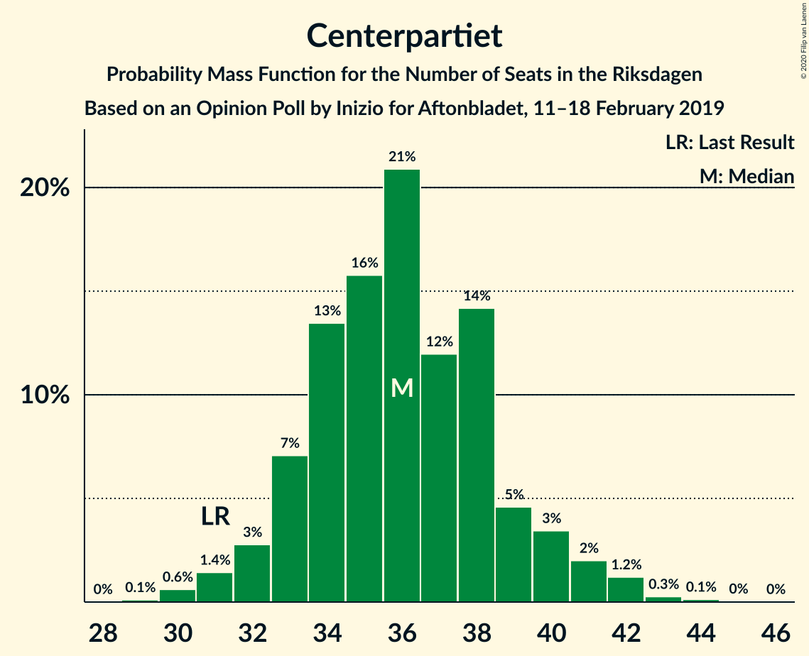

# Opinion Poll by Inizio for Aftonbladet, 11–18 February 2019

<a href="#voting-intentions">Voting Intentions</a> | <a href="#seats">Seats</a> | <a href="#coalitions">Coalitions</a> | <a href="#technical-information">Technical Information</a>

## Voting Intentions

### Confidence Intervals

| Party | Last Result | Poll Result | 80% Confidence Interval | 90% Confidence Interval | 95% Confidence Interval | 99% Confidence Interval |
|:-----:|:-----------:|:-----------:|:-----------------------:|:-----------------------:|:-----------------------:|:-----------------------:|
| Sveriges socialdemokratiska arbetareparti | 28.3% | 27.0% | 25.8–28.3% |25.5–28.7% |25.2–29.0% |24.6–29.6% |
| Sverigedemokraterna | 17.5% | 19.5% | 18.4–20.6% |18.1–20.9% |17.8–21.2% |17.3–21.8% |
| Moderata samlingspartiet | 19.8% | 17.6% | 16.6–18.7% |16.3–19.1% |16.1–19.3% |15.6–19.9% |
| Centerpartiet | 8.6% | 9.7% | 8.9–10.6% |8.7–10.8% |8.5–11.0% |8.1–11.4% |
| Vänsterpartiet | 8.0% | 9.2% | 8.4–10.0% |8.2–10.3% |8.0–10.5% |7.7–10.9% |
| Kristdemokraterna | 6.3% | 9.0% | 8.2–9.8% |8.0–10.1% |7.8–10.3% |7.5–10.7% |
| Miljöpartiet de gröna | 4.4% | 3.4% | 3.0–4.0% |2.8–4.1% |2.7–4.3% |2.5–4.6% |
| Liberalerna | 5.5% | 2.7% | 2.3–3.2% |2.2–3.4% |2.1–3.5% |1.9–3.8% |

*Note:* The poll result column reflects the actual value used in the calculations. Published results may vary slightly, and in addition be rounded to fewer digits.

## Seats

### Confidence Intervals

| Party | Last Result | Median | 80% Confidence Interval | 90% Confidence Interval | 95% Confidence Interval | 99% Confidence Interval |
|:-----:|:-----------:|:------:|:-----------------------:|:-----------------------:|:-----------------------:|:-----------------------:|
| <a href="#sveriges-socialdemokratiska-arbetareparti">Sveriges socialdemokratiska arbetareparti</a> | 100 | 104 | 100–108 |100–108 |98–108 |95–108 |
| <a href="#sverigedemokraterna">Sverigedemokraterna</a> | 62 | 74 | 65–78 |65–78 |65–80 |65–80 |
| <a href="#moderata-samlingspartiet">Moderata samlingspartiet</a> | 70 | 73 | 67–73 |67–73 |67–73 |67–73 |
| <a href="#centerpartiet">Centerpartiet</a> | 31 | 33 | 30–36 |30–36 |30–40 |30–41 |
| <a href="#vänsterpartiet">Vänsterpartiet</a> | 28 | 33 | 31–33 |31–34 |31–38 |30–42 |
| <a href="#kristdemokraterna">Kristdemokraterna</a> | 22 | 35 | 33–35 |28–35 |28–37 |27–38 |
| <a href="#miljöpartiet-de-gröna">Miljöpartiet de gröna</a> | 16 | 0 | 0–16 |0–16 |0–16 |0–16 |
| <a href="#liberalerna">Liberalerna</a> | 20 | 0 | 0 |0 |0 |0 |

### Sveriges socialdemokratiska arbetareparti

*For a full overview of the results for this party, see the [Sveriges socialdemokratiska arbetareparti](party-sverigessocialdemokratiskaarbetareparti.html) page.*

| Number of Seats | Probability | Accumulated | Special Marks |
|:---------------:|:-----------:|:-----------:|:-------------:|
| 90 | 0.1% | 100% |  |
| 91 | 0% | 99.9% |  |
| 92 | 0% | 99.9% |  |
| 93 | 0% | 99.9% |  |
| 94 | 0% | 99.9% |  |
| 95 | 2% | 99.9% |  |
| 96 | 0.5% | 98% |  |
| 97 | 0.1% | 98% |  |
| 98 | 0.6% | 98% |  |
| 99 | 1.0% | 97% |  |
| 100 | 36% | 96% | Last Result |
| 101 | 4% | 61% |  |
| 102 | 0.4% | 57% |  |
| 103 | 0% | 56% |  |
| 104 | 39% | 56% | Median |
| 105 | 1.2% | 17% |  |
| 106 | 0% | 16% |  |
| 107 | 0% | 16% |  |
| 108 | 16% | 16% |  |
| 109 | 0% | 0% |  |

### Sverigedemokraterna

*For a full overview of the results for this party, see the [Sverigedemokraterna](party-sverigedemokraterna.html) page.*

| Number of Seats | Probability | Accumulated | Special Marks |
|:---------------:|:-----------:|:-----------:|:-------------:|
| 62 | 0.3% | 100% | Last Result |
| 63 | 0% | 99.7% |  |
| 64 | 0% | 99.7% |  |
| 65 | 16% | 99.7% |  |
| 66 | 15% | 83% |  |
| 67 | 0.2% | 68% |  |
| 68 | 0.3% | 67% |  |
| 69 | 0.4% | 67% |  |
| 70 | 0% | 67% |  |
| 71 | 3% | 67% |  |
| 72 | 0% | 64% |  |
| 73 | 0% | 64% |  |
| 74 | 39% | 64% | Median |
| 75 | 0.2% | 25% |  |
| 76 | 0% | 25% |  |
| 77 | 0.5% | 25% |  |
| 78 | 21% | 24% |  |
| 79 | 0% | 4% |  |
| 80 | 4% | 4% |  |
| 81 | 0% | 0% |  |

### Moderata samlingspartiet

*For a full overview of the results for this party, see the [Moderata samlingspartiet](party-moderatasamlingspartiet.html) page.*

| Number of Seats | Probability | Accumulated | Special Marks |
|:---------------:|:-----------:|:-----------:|:-------------:|
| 64 | 0% | 100% |  |
| 65 | 0.1% | 99.9% |  |
| 66 | 0% | 99.9% |  |
| 67 | 17% | 99.9% |  |
| 68 | 2% | 83% |  |
| 69 | 0% | 81% |  |
| 70 | 0.8% | 81% | Last Result |
| 71 | 25% | 80% |  |
| 72 | 0% | 55% |  |
| 73 | 55% | 55% | Median |
| 74 | 0% | 0.2% |  |
| 75 | 0.2% | 0.2% |  |
| 76 | 0% | 0% |  |

### Centerpartiet

*For a full overview of the results for this party, see the [Centerpartiet](party-centerpartiet.html) page.*

| Number of Seats | Probability | Accumulated | Special Marks |
|:---------------:|:-----------:|:-----------:|:-------------:|
| 30 | 39% | 100% |  |
| 31 | 0.5% | 61% | Last Result |
| 32 | 0% | 61% |  |
| 33 | 20% | 61% | Median |
| 34 | 0.7% | 41% |  |
| 35 | 20% | 40% |  |
| 36 | 16% | 20% |  |
| 37 | 0.1% | 4% |  |
| 38 | 0.7% | 4% |  |
| 39 | 0% | 3% |  |
| 40 | 1.0% | 3% |  |
| 41 | 2% | 2% |  |
| 42 | 0% | 0.4% |  |
| 43 | 0% | 0.4% |  |
| 44 | 0% | 0.4% |  |
| 45 | 0.4% | 0.4% |  |
| 46 | 0% | 0% |  |

### Vänsterpartiet

*For a full overview of the results for this party, see the [Vänsterpartiet](party-vänsterpartiet.html) page.*

| Number of Seats | Probability | Accumulated | Special Marks |
|:---------------:|:-----------:|:-----------:|:-------------:|
| 28 | 0% | 100% | Last Result |
| 29 | 0.1% | 100% |  |
| 30 | 0.7% | 99.9% |  |
| 31 | 17% | 99.2% |  |
| 32 | 0% | 82% |  |
| 33 | 74% | 82% | Median |
| 34 | 5% | 8% |  |
| 35 | 0% | 3% |  |
| 36 | 0.2% | 3% |  |
| 37 | 0% | 3% |  |
| 38 | 0.3% | 3% |  |
| 39 | 0% | 2% |  |
| 40 | 0.1% | 2% |  |
| 41 | 2% | 2% |  |
| 42 | 0.8% | 0.8% |  |
| 43 | 0% | 0% |  |

### Kristdemokraterna

*For a full overview of the results for this party, see the [Kristdemokraterna](party-kristdemokraterna.html) page.*

| Number of Seats | Probability | Accumulated | Special Marks |
|:---------------:|:-----------:|:-----------:|:-------------:|
| 22 | 0% | 100% | Last Result |
| 23 | 0% | 100% |  |
| 24 | 0% | 100% |  |
| 25 | 0% | 100% |  |
| 26 | 0% | 100% |  |
| 27 | 1.2% | 100% |  |
| 28 | 4% | 98.8% |  |
| 29 | 0.7% | 95% |  |
| 30 | 0.2% | 94% |  |
| 31 | 1.0% | 94% |  |
| 32 | 0% | 93% |  |
| 33 | 16% | 93% |  |
| 34 | 20% | 77% |  |
| 35 | 55% | 58% | Median |
| 36 | 0% | 3% |  |
| 37 | 1.3% | 3% |  |
| 38 | 2% | 2% |  |
| 39 | 0% | 0% |  |

### Miljöpartiet de gröna

*For a full overview of the results for this party, see the [Miljöpartiet de gröna](party-miljöpartietdegröna.html) page.*

| Number of Seats | Probability | Accumulated | Special Marks |
|:---------------:|:-----------:|:-----------:|:-------------:|
| 0 | 84% | 100% | Median |
| 1 | 0% | 16% |  |
| 2 | 0% | 16% |  |
| 3 | 0% | 16% |  |
| 4 | 0% | 16% |  |
| 5 | 0% | 16% |  |
| 6 | 0% | 16% |  |
| 7 | 0% | 16% |  |
| 8 | 0% | 16% |  |
| 9 | 0% | 16% |  |
| 10 | 0% | 16% |  |
| 11 | 0% | 16% |  |
| 12 | 0% | 16% |  |
| 13 | 0% | 16% |  |
| 14 | 0% | 16% |  |
| 15 | 0.7% | 16% |  |
| 16 | 16% | 16% | Last Result |
| 17 | 0.1% | 0.1% |  |
| 18 | 0% | 0% |  |

### Liberalerna

*For a full overview of the results for this party, see the [Liberalerna](party-liberalerna.html) page.*

| Number of Seats | Probability | Accumulated | Special Marks |
|:---------------:|:-----------:|:-----------:|:-------------:|
| 0 | 100% | 100% | Median |
| 1 | 0% | 0% |  |
| 2 | 0% | 0% |  |
| 3 | 0% | 0% |  |
| 4 | 0% | 0% |  |
| 5 | 0% | 0% |  |
| 6 | 0% | 0% |  |
| 7 | 0% | 0% |  |
| 8 | 0% | 0% |  |
| 9 | 0% | 0% |  |
| 10 | 0% | 0% |  |
| 11 | 0% | 0% |  |
| 12 | 0% | 0% |  |
| 13 | 0% | 0% |  |
| 14 | 0% | 0% |  |
| 15 | 0% | 0% |  |
| 16 | 0% | 0% |  |
| 17 | 0% | 0% |  |
| 18 | 0% | 0% |  |
| 19 | 0% | 0% |  |
| 20 | 0% | 0% | Last Result |

## Coalitions

### Confidence Intervals

| Coalition | Last Result | Median | Majority? | 80% Confidence Interval | 90% Confidence Interval | 95% Confidence Interval | 99% Confidence Interval |
|:---------:|:-----------:|:------:|:---------:|:-----------------------:|:-----------------------:|:-----------------------:|:-----------------------:|
| Sveriges socialdemokratiska arbetareparti – Moderata samlingspartiet – Centerpartiet | 201 | 207 | 100% | 203–216 | 203–216 | 203–216 | 196–217 |
| Sveriges socialdemokratiska arbetareparti – Centerpartiet – Vänsterpartiet – Miljöpartiet de gröna – Liberalerna | 195 | 167 | 35% | 166–183 | 166–183 | 166–183 | 166–183 |
| Sverigedemokraterna – Moderata samlingspartiet – Kristdemokraterna | 154 | 182 | 65% | 166–183 | 166–183 | 166–183 | 166–183 |
| Sveriges socialdemokratiska arbetareparti – Moderata samlingspartiet | 170 | 177 | 56% | 167–181 | 167–181 | 167–181 | 163–181 |
| Sveriges socialdemokratiska arbetareparti – Centerpartiet – Miljöpartiet de gröna – Liberalerna | 167 | 134 | 0% | 133–152 | 133–152 | 133–152 | 129–152 |
| Sverigedemokraterna – Moderata samlingspartiet | 132 | 147 | 0% | 133–149 | 133–149 | 133–151 | 132–151 |
| Sveriges socialdemokratiska arbetareparti – Vänsterpartiet – Miljöpartiet de gröna | 144 | 137 | 0% | 133–147 | 133–147 | 133–147 | 126–147 |
| Moderata samlingspartiet – Centerpartiet – Kristdemokraterna – Liberalerna | 143 | 138 | 0% | 136–143 | 135–143 | 134–143 | 134–145 |
| Moderata samlingspartiet – Centerpartiet – Kristdemokraterna | 123 | 138 | 0% | 136–143 | 135–143 | 134–143 | 134–145 |
| Sveriges socialdemokratiska arbetareparti – Vänsterpartiet | 128 | 137 | 0% | 131–141 | 131–141 | 131–141 | 126–142 |
| Sveriges socialdemokratiska arbetareparti – Miljöpartiet de gröna | 116 | 104 | 0% | 100–116 | 100–116 | 98–116 | 95–116 |
| Moderata samlingspartiet – Centerpartiet – Liberalerna | 121 | 103 | 0% | 103–108 | 103–108 | 103–108 | 100–113 |
| Moderata samlingspartiet – Centerpartiet | 101 | 103 | 0% | 103–108 | 103–108 | 103–108 | 100–113 |

### Sveriges socialdemokratiska arbetareparti – Moderata samlingspartiet – Centerpartiet

| Number of Seats | Probability | Accumulated | Special Marks |
|:---------------:|:-----------:|:-----------:|:-------------:|
| 192 | 0.1% | 100% |  |
| 193 | 0% | 99.9% |  |
| 194 | 0% | 99.9% |  |
| 195 | 0% | 99.9% |  |
| 196 | 0.5% | 99.9% |  |
| 197 | 0% | 99.4% |  |
| 198 | 0% | 99.4% |  |
| 199 | 1.1% | 99.4% |  |
| 200 | 0% | 98% |  |
| 201 | 0% | 98% | Last Result |
| 202 | 0% | 98% |  |
| 203 | 16% | 98% |  |
| 204 | 20% | 82% |  |
| 205 | 0.3% | 62% |  |
| 206 | 0% | 61% |  |
| 207 | 43% | 61% |  |
| 208 | 0.6% | 19% |  |
| 209 | 0% | 18% |  |
| 210 | 0% | 18% | Median |
| 211 | 0% | 18% |  |
| 212 | 0.4% | 18% |  |
| 213 | 0% | 18% |  |
| 214 | 0.2% | 18% |  |
| 215 | 0% | 17% |  |
| 216 | 16% | 17% |  |
| 217 | 1.2% | 1.2% |  |
| 218 | 0% | 0% |  |

### Sveriges socialdemokratiska arbetareparti – Centerpartiet – Vänsterpartiet – Miljöpartiet de gröna – Liberalerna

| Number of Seats | Probability | Accumulated | Special Marks |
|:---------------:|:-----------:|:-----------:|:-------------:|
| 166 | 20% | 100% |  |
| 167 | 39% | 79% |  |
| 168 | 0% | 41% |  |
| 169 | 0% | 41% |  |
| 170 | 5% | 41% | Median |
| 171 | 0% | 36% |  |
| 172 | 0% | 36% |  |
| 173 | 0.6% | 36% |  |
| 174 | 0% | 35% |  |
| 175 | 0.4% | 35% | Majority |
| 176 | 16% | 35% |  |
| 177 | 0.3% | 19% |  |
| 178 | 0.7% | 18% |  |
| 179 | 0.5% | 18% |  |
| 180 | 1.3% | 17% |  |
| 181 | 0% | 16% |  |
| 182 | 0% | 16% |  |
| 183 | 16% | 16% |  |
| 184 | 0% | 0% |  |
| 185 | 0% | 0% |  |
| 186 | 0% | 0% |  |
| 187 | 0% | 0% |  |
| 188 | 0% | 0% |  |
| 189 | 0% | 0% |  |
| 190 | 0% | 0% |  |
| 191 | 0% | 0% |  |
| 192 | 0% | 0% |  |
| 193 | 0% | 0% |  |
| 194 | 0% | 0% |  |
| 195 | 0% | 0% | Last Result |

### Sverigedemokraterna – Moderata samlingspartiet – Kristdemokraterna

| Number of Seats | Probability | Accumulated | Special Marks |
|:---------------:|:-----------:|:-----------:|:-------------:|
| 154 | 0% | 100% | Last Result |
| 155 | 0% | 100% |  |
| 156 | 0% | 100% |  |
| 157 | 0% | 100% |  |
| 158 | 0% | 100% |  |
| 159 | 0% | 100% |  |
| 160 | 0% | 100% |  |
| 161 | 0% | 100% |  |
| 162 | 0% | 100% |  |
| 163 | 0% | 100% |  |
| 164 | 0% | 100% |  |
| 165 | 0% | 100% |  |
| 166 | 16% | 100% |  |
| 167 | 0% | 84% |  |
| 168 | 0% | 84% |  |
| 169 | 1.3% | 84% |  |
| 170 | 0.5% | 83% |  |
| 171 | 0.7% | 82% |  |
| 172 | 0.3% | 82% |  |
| 173 | 16% | 81% |  |
| 174 | 0.4% | 65% |  |
| 175 | 0% | 65% | Majority |
| 176 | 0.6% | 65% |  |
| 177 | 0% | 64% |  |
| 178 | 0% | 64% |  |
| 179 | 5% | 64% |  |
| 180 | 0% | 59% |  |
| 181 | 0% | 59% |  |
| 182 | 39% | 59% | Median |
| 183 | 20% | 21% |  |
| 184 | 0% | 0% |  |

### Sveriges socialdemokratiska arbetareparti – Moderata samlingspartiet

| Number of Seats | Probability | Accumulated | Special Marks |
|:---------------:|:-----------:|:-----------:|:-------------:|
| 155 | 0.1% | 100% |  |
| 156 | 0% | 99.9% |  |
| 157 | 0% | 99.9% |  |
| 158 | 0% | 99.9% |  |
| 159 | 0% | 99.9% |  |
| 160 | 0% | 99.9% |  |
| 161 | 0% | 99.9% |  |
| 162 | 0% | 99.9% |  |
| 163 | 2% | 99.9% |  |
| 164 | 0% | 98% |  |
| 165 | 0% | 98% |  |
| 166 | 0% | 98% |  |
| 167 | 16% | 98% |  |
| 168 | 0.6% | 81% |  |
| 169 | 0.2% | 81% |  |
| 170 | 0.6% | 81% | Last Result |
| 171 | 20% | 80% |  |
| 172 | 4% | 60% |  |
| 173 | 0% | 56% |  |
| 174 | 0% | 56% |  |
| 175 | 0% | 56% | Majority |
| 176 | 1.4% | 56% |  |
| 177 | 39% | 55% | Median |
| 178 | 0% | 16% |  |
| 179 | 0% | 16% |  |
| 180 | 0% | 16% |  |
| 181 | 16% | 16% |  |
| 182 | 0% | 0% |  |

### Sveriges socialdemokratiska arbetareparti – Centerpartiet – Miljöpartiet de gröna – Liberalerna

| Number of Seats | Probability | Accumulated | Special Marks |
|:---------------:|:-----------:|:-----------:|:-------------:|
| 129 | 1.0% | 100% |  |
| 130 | 0% | 99.0% |  |
| 131 | 0.5% | 99.0% |  |
| 132 | 0% | 98% |  |
| 133 | 20% | 98% |  |
| 134 | 39% | 79% |  |
| 135 | 1.0% | 40% |  |
| 136 | 4% | 39% |  |
| 137 | 0% | 35% | Median |
| 138 | 0.5% | 35% |  |
| 139 | 0.2% | 35% |  |
| 140 | 0.2% | 35% |  |
| 141 | 0.3% | 34% |  |
| 142 | 0.1% | 34% |  |
| 143 | 16% | 34% |  |
| 144 | 0.4% | 18% |  |
| 145 | 0% | 17% |  |
| 146 | 1.2% | 17% |  |
| 147 | 0% | 16% |  |
| 148 | 0.7% | 16% |  |
| 149 | 0% | 16% |  |
| 150 | 0% | 16% |  |
| 151 | 0% | 16% |  |
| 152 | 15% | 16% |  |
| 153 | 0% | 0% |  |
| 154 | 0% | 0% |  |
| 155 | 0% | 0% |  |
| 156 | 0% | 0% |  |
| 157 | 0% | 0% |  |
| 158 | 0% | 0% |  |
| 159 | 0% | 0% |  |
| 160 | 0% | 0% |  |
| 161 | 0% | 0% |  |
| 162 | 0% | 0% |  |
| 163 | 0% | 0% |  |
| 164 | 0% | 0% |  |
| 165 | 0% | 0% |  |
| 166 | 0% | 0% |  |
| 167 | 0% | 0% | Last Result |

### Sverigedemokraterna – Moderata samlingspartiet

| Number of Seats | Probability | Accumulated | Special Marks |
|:---------------:|:-----------:|:-----------:|:-------------:|
| 132 | 0.5% | 100% | Last Result |
| 133 | 16% | 99.5% |  |
| 134 | 0% | 84% |  |
| 135 | 0.3% | 84% |  |
| 136 | 0.1% | 84% |  |
| 137 | 0.4% | 84% |  |
| 138 | 16% | 83% |  |
| 139 | 0% | 67% |  |
| 140 | 0% | 67% |  |
| 141 | 1.0% | 67% |  |
| 142 | 2% | 66% |  |
| 143 | 0% | 64% |  |
| 144 | 0% | 64% |  |
| 145 | 0.5% | 64% |  |
| 146 | 1.0% | 63% |  |
| 147 | 39% | 62% | Median |
| 148 | 0% | 23% |  |
| 149 | 20% | 23% |  |
| 150 | 0% | 4% |  |
| 151 | 4% | 4% |  |
| 152 | 0% | 0% |  |

### Sveriges socialdemokratiska arbetareparti – Vänsterpartiet – Miljöpartiet de gröna

| Number of Seats | Probability | Accumulated | Special Marks |
|:---------------:|:-----------:|:-----------:|:-------------:|
| 124 | 0.1% | 100% |  |
| 125 | 0% | 99.9% |  |
| 126 | 1.0% | 99.9% |  |
| 127 | 0% | 99.0% |  |
| 128 | 0% | 99.0% |  |
| 129 | 0% | 99.0% |  |
| 130 | 0.4% | 99.0% |  |
| 131 | 0% | 98.6% |  |
| 132 | 0% | 98.6% |  |
| 133 | 20% | 98.6% |  |
| 134 | 0% | 79% |  |
| 135 | 4% | 79% |  |
| 136 | 0% | 75% |  |
| 137 | 40% | 75% | Median |
| 138 | 0.1% | 35% |  |
| 139 | 2% | 35% |  |
| 140 | 0% | 33% |  |
| 141 | 16% | 33% |  |
| 142 | 0.4% | 17% |  |
| 143 | 0.3% | 16% |  |
| 144 | 0.6% | 16% | Last Result |
| 145 | 0% | 16% |  |
| 146 | 0% | 16% |  |
| 147 | 15% | 16% |  |
| 148 | 0% | 0% |  |

### Moderata samlingspartiet – Centerpartiet – Kristdemokraterna – Liberalerna

| Number of Seats | Probability | Accumulated | Special Marks |
|:---------------:|:-----------:|:-----------:|:-------------:|
| 133 | 0% | 100% |  |
| 134 | 4% | 99.9% |  |
| 135 | 0.5% | 96% |  |
| 136 | 16% | 95% |  |
| 137 | 0% | 79% |  |
| 138 | 59% | 79% |  |
| 139 | 2% | 21% |  |
| 140 | 0% | 18% |  |
| 141 | 0.1% | 18% | Median |
| 142 | 0% | 18% |  |
| 143 | 17% | 18% | Last Result |
| 144 | 0.2% | 2% |  |
| 145 | 1.0% | 1.4% |  |
| 146 | 0% | 0.4% |  |
| 147 | 0% | 0.4% |  |
| 148 | 0% | 0.4% |  |
| 149 | 0% | 0.4% |  |
| 150 | 0.4% | 0.4% |  |
| 151 | 0% | 0% |  |

### Moderata samlingspartiet – Centerpartiet – Kristdemokraterna

| Number of Seats | Probability | Accumulated | Special Marks |
|:---------------:|:-----------:|:-----------:|:-------------:|
| 123 | 0% | 100% | Last Result |
| 124 | 0% | 100% |  |
| 125 | 0% | 100% |  |
| 126 | 0% | 100% |  |
| 127 | 0% | 100% |  |
| 128 | 0% | 100% |  |
| 129 | 0% | 100% |  |
| 130 | 0% | 100% |  |
| 131 | 0% | 100% |  |
| 132 | 0% | 100% |  |
| 133 | 0% | 100% |  |
| 134 | 4% | 99.9% |  |
| 135 | 0.5% | 96% |  |
| 136 | 16% | 95% |  |
| 137 | 0% | 79% |  |
| 138 | 59% | 79% |  |
| 139 | 2% | 21% |  |
| 140 | 0% | 18% |  |
| 141 | 0.1% | 18% | Median |
| 142 | 0% | 18% |  |
| 143 | 17% | 18% |  |
| 144 | 0.2% | 2% |  |
| 145 | 1.0% | 1.4% |  |
| 146 | 0% | 0.4% |  |
| 147 | 0% | 0.4% |  |
| 148 | 0% | 0.4% |  |
| 149 | 0% | 0.4% |  |
| 150 | 0.4% | 0.4% |  |
| 151 | 0% | 0% |  |

### Sveriges socialdemokratiska arbetareparti – Vänsterpartiet

| Number of Seats | Probability | Accumulated | Special Marks |
|:---------------:|:-----------:|:-----------:|:-------------:|
| 124 | 0.1% | 100% |  |
| 125 | 0% | 99.9% |  |
| 126 | 1.0% | 99.9% |  |
| 127 | 0% | 98.9% |  |
| 128 | 0.1% | 98.9% | Last Result |
| 129 | 0.6% | 98.8% |  |
| 130 | 0.4% | 98% |  |
| 131 | 15% | 98% |  |
| 132 | 0% | 82% |  |
| 133 | 20% | 82% |  |
| 134 | 0% | 63% |  |
| 135 | 4% | 63% |  |
| 136 | 0% | 59% |  |
| 137 | 40% | 59% | Median |
| 138 | 0.1% | 19% |  |
| 139 | 2% | 19% |  |
| 140 | 0% | 17% |  |
| 141 | 16% | 17% |  |
| 142 | 0.3% | 0.6% |  |
| 143 | 0.2% | 0.2% |  |
| 144 | 0% | 0% |  |

### Sveriges socialdemokratiska arbetareparti – Miljöpartiet de gröna

| Number of Seats | Probability | Accumulated | Special Marks |
|:---------------:|:-----------:|:-----------:|:-------------:|
| 95 | 2% | 100% |  |
| 96 | 0.5% | 98% |  |
| 97 | 0.1% | 98% |  |
| 98 | 0.6% | 98% |  |
| 99 | 0.4% | 97% |  |
| 100 | 20% | 97% |  |
| 101 | 4% | 77% |  |
| 102 | 0.4% | 73% |  |
| 103 | 0% | 72% |  |
| 104 | 39% | 72% | Median |
| 105 | 1.3% | 34% |  |
| 106 | 0% | 32% |  |
| 107 | 0% | 32% |  |
| 108 | 16% | 32% |  |
| 109 | 0% | 16% |  |
| 110 | 0% | 16% |  |
| 111 | 0% | 16% |  |
| 112 | 0.1% | 16% |  |
| 113 | 0% | 16% |  |
| 114 | 0.6% | 16% |  |
| 115 | 0% | 16% |  |
| 116 | 15% | 16% | Last Result |
| 117 | 0% | 0% |  |

### Moderata samlingspartiet – Centerpartiet – Liberalerna

| Number of Seats | Probability | Accumulated | Special Marks |
|:---------------:|:-----------:|:-----------:|:-------------:|
| 100 | 0.5% | 100% |  |
| 101 | 0.5% | 99.5% |  |
| 102 | 0.1% | 98.9% |  |
| 103 | 54% | 98.9% |  |
| 104 | 20% | 45% |  |
| 105 | 1.1% | 25% |  |
| 106 | 4% | 24% | Median |
| 107 | 0.1% | 20% |  |
| 108 | 17% | 19% |  |
| 109 | 0% | 2% |  |
| 110 | 0% | 2% |  |
| 111 | 0% | 2% |  |
| 112 | 1.2% | 2% |  |
| 113 | 0.6% | 0.6% |  |
| 114 | 0% | 0% |  |
| 115 | 0% | 0% |  |
| 116 | 0% | 0% |  |
| 117 | 0% | 0% |  |
| 118 | 0% | 0% |  |
| 119 | 0% | 0% |  |
| 120 | 0% | 0% |  |
| 121 | 0% | 0% | Last Result |

### Moderata samlingspartiet – Centerpartiet

| Number of Seats | Probability | Accumulated | Special Marks |
|:---------------:|:-----------:|:-----------:|:-------------:|
| 100 | 0.5% | 100% |  |
| 101 | 0.5% | 99.5% | Last Result |
| 102 | 0.1% | 98.9% |  |
| 103 | 54% | 98.9% |  |
| 104 | 20% | 45% |  |
| 105 | 1.1% | 25% |  |
| 106 | 4% | 24% | Median |
| 107 | 0.1% | 20% |  |
| 108 | 17% | 19% |  |
| 109 | 0% | 2% |  |
| 110 | 0% | 2% |  |
| 111 | 0% | 2% |  |
| 112 | 1.2% | 2% |  |
| 113 | 0.6% | 0.6% |  |
| 114 | 0% | 0% |  |

## Technical Information

### Opinion Poll

+ **Polling firm:** Inizio
+ **Commissioner(s):** Aftonbladet
+ **Fieldwork period:** 11–18 February 2019

### Calculations

+ **Sample size:** 2137
+ **Simulations done:** 1,024
+ **Error estimate:** 2.41%

