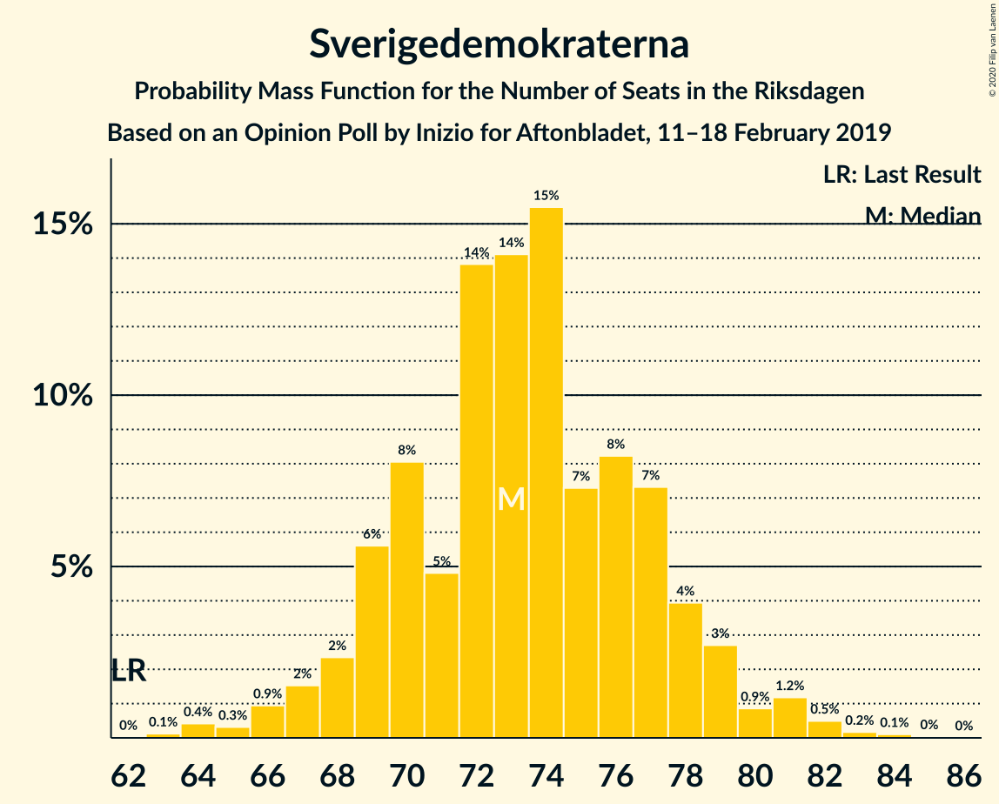
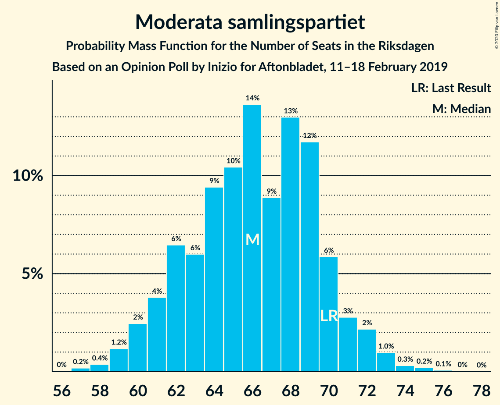
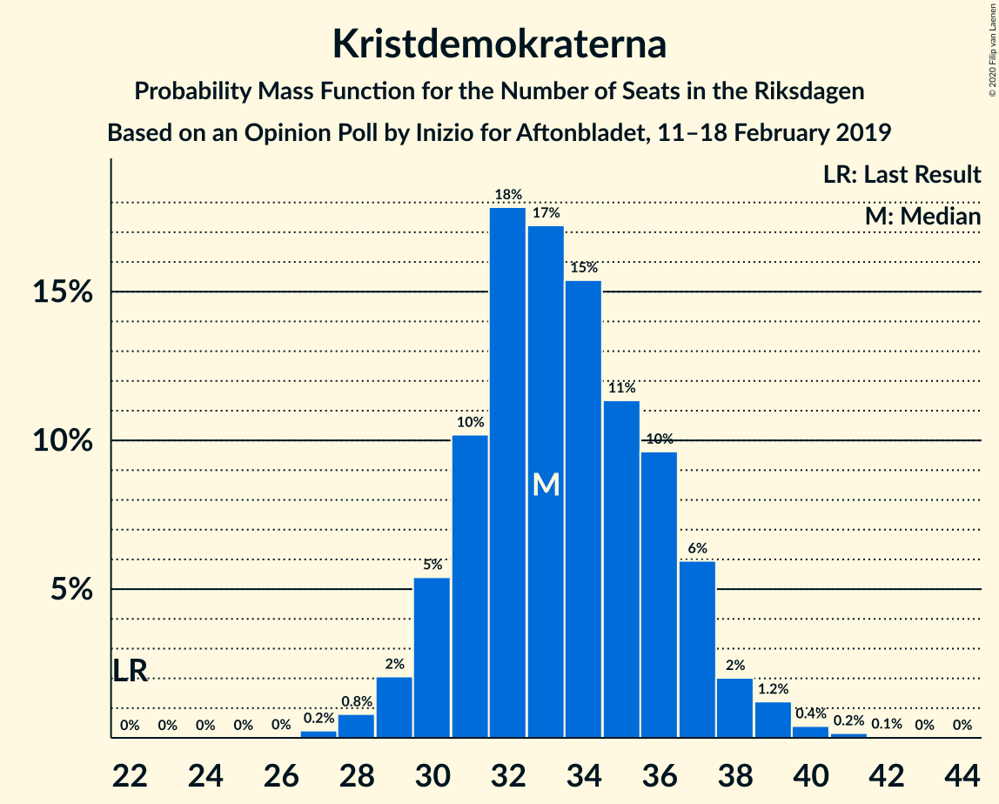
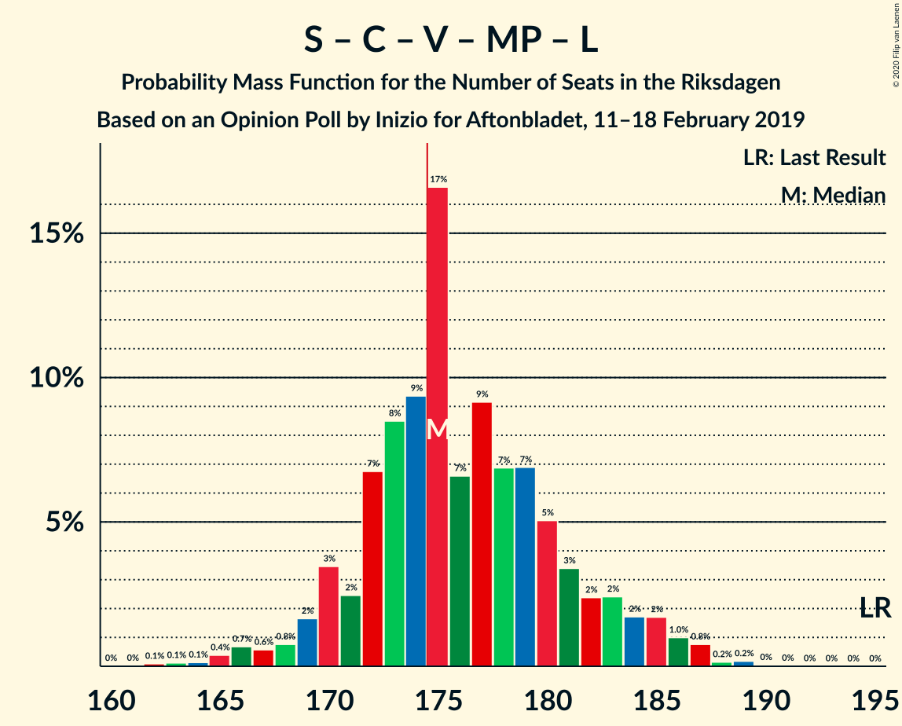
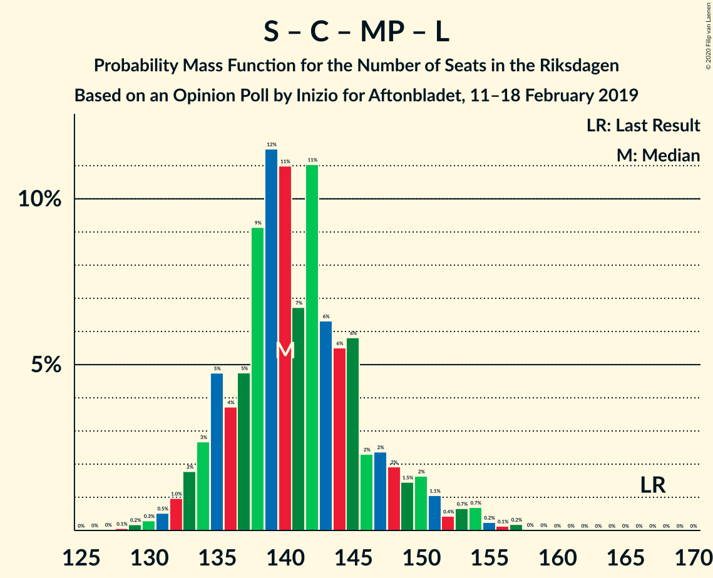
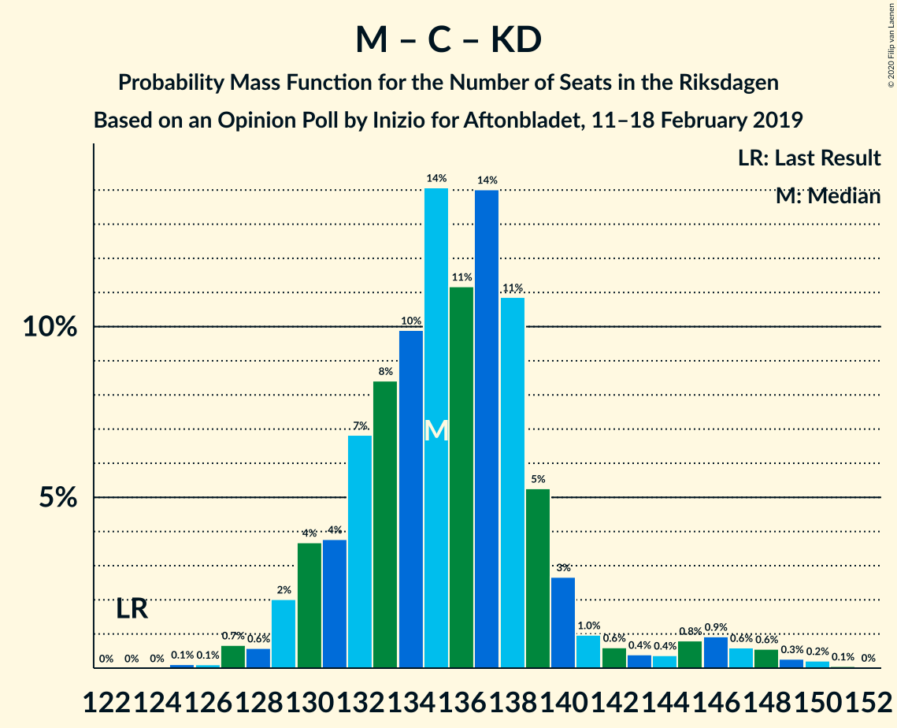

# Opinion Poll by Inizio for Aftonbladet, 11–18 February 2019

<a href="#voting-intentions">Voting Intentions</a> | <a href="#seats">Seats</a> | <a href="#coalitions">Coalitions</a> | <a href="#technical-information">Technical Information</a>

## Voting Intentions

### Confidence Intervals

| Party | Last Result | Poll Result | 80% Confidence Interval | 90% Confidence Interval | 95% Confidence Interval | 99% Confidence Interval |
|:-----:|:-----------:|:-----------:|:-----------------------:|:-----------------------:|:-----------------------:|:-----------------------:|
| Sveriges socialdemokratiska arbetareparti | 28.3% | 27.0% | 25.8–28.3% |25.5–28.7% |25.2–29.0% |24.6–29.6% |
| Sverigedemokraterna | 17.5% | 19.5% | 18.4–20.6% |18.1–20.9% |17.8–21.2% |17.3–21.8% |
| Moderata samlingspartiet | 19.8% | 17.6% | 16.6–18.7% |16.3–19.1% |16.1–19.3% |15.6–19.9% |
| Centerpartiet | 8.6% | 9.7% | 8.9–10.6% |8.7–10.8% |8.5–11.0% |8.1–11.4% |
| Vänsterpartiet | 8.0% | 9.2% | 8.4–10.0% |8.2–10.3% |8.0–10.5% |7.7–10.9% |
| Kristdemokraterna | 6.3% | 9.0% | 8.2–9.8% |8.0–10.1% |7.8–10.3% |7.5–10.7% |
| Miljöpartiet de gröna | 4.4% | 3.4% | 3.0–4.0% |2.8–4.1% |2.7–4.3% |2.5–4.6% |
| Liberalerna | 5.5% | 2.7% | 2.3–3.2% |2.2–3.4% |2.1–3.5% |1.9–3.8% |

*Note:* The poll result column reflects the actual value used in the calculations. Published results may vary slightly, and in addition be rounded to fewer digits.

## Seats

### Confidence Intervals

| Party | Last Result | Median | 80% Confidence Interval | 90% Confidence Interval | 95% Confidence Interval | 99% Confidence Interval |
|:-----:|:-----------:|:------:|:-----------------------:|:-----------------------:|:-----------------------:|:-----------------------:|
| <a href="#sveriges-socialdemokratiska-arbetareparti">Sveriges socialdemokratiska arbetareparti</a> | 100 | 102 | 99–106 |98–108 |96–109 |92–110 |
| <a href="#sverigedemokraterna">Sverigedemokraterna</a> | 62 | 74 | 70–77 |68–79 |67–79 |64–82 |
| <a href="#moderata-samlingspartiet">Moderata samlingspartiet</a> | 70 | 68 | 63–70 |62–71 |61–72 |59–73 |
| <a href="#centerpartiet">Centerpartiet</a> | 31 | 37 | 34–39 |33–39 |32–40 |30–42 |
| <a href="#vänsterpartiet">Vänsterpartiet</a> | 28 | 35 | 32–37 |31–38 |31–39 |30–40 |
| <a href="#kristdemokraterna">Kristdemokraterna</a> | 22 | 33 | 32–36 |31–37 |30–39 |28–40 |
| <a href="#miljöpartiet-de-gröna">Miljöpartiet de gröna</a> | 16 | 0 | 0 |0–15 |0–15 |0–16 |
| <a href="#liberalerna">Liberalerna</a> | 20 | 0 | 0 |0 |0 |0 |

### Sveriges socialdemokratiska arbetareparti

*For a full overview of the results for this party, see the [Sveriges socialdemokratiska arbetareparti](party-sverigessocialdemokratiskaarbetareparti.html) page.*

| Number of Seats | Probability | Accumulated | Special Marks |
|:---------------:|:-----------:|:-----------:|:-------------:|
| 91 | 0.1% | 100% |  |
| 92 | 0.4% | 99.8% |  |
| 93 | 0.4% | 99.4% |  |
| 94 | 0.4% | 99.0% |  |
| 95 | 0.4% | 98.7% |  |
| 96 | 1.0% | 98% |  |
| 97 | 2% | 97% |  |
| 98 | 3% | 96% |  |
| 99 | 11% | 93% |  |
| 100 | 6% | 82% | Last Result |
| 101 | 2% | 76% |  |
| 102 | 30% | 74% | Median |
| 103 | 8% | 44% |  |
| 104 | 10% | 36% |  |
| 105 | 6% | 26% |  |
| 106 | 12% | 20% |  |
| 107 | 2% | 8% |  |
| 108 | 4% | 6% |  |
| 109 | 2% | 3% |  |
| 110 | 0.7% | 1.0% |  |
| 111 | 0.1% | 0.2% |  |
| 112 | 0.1% | 0.1% |  |
| 113 | 0% | 0% |  |

### Sverigedemokraterna

*For a full overview of the results for this party, see the [Sverigedemokraterna](party-sverigedemokraterna.html) page.*

| Number of Seats | Probability | Accumulated | Special Marks |
|:---------------:|:-----------:|:-----------:|:-------------:|
| 62 | 0% | 100% | Last Result |
| 63 | 0.1% | 100% |  |
| 64 | 0.4% | 99.8% |  |
| 65 | 0.1% | 99.4% |  |
| 66 | 0.9% | 99.3% |  |
| 67 | 1.4% | 98% |  |
| 68 | 2% | 97% |  |
| 69 | 2% | 95% |  |
| 70 | 6% | 93% |  |
| 71 | 3% | 86% |  |
| 72 | 11% | 84% |  |
| 73 | 18% | 73% |  |
| 74 | 25% | 55% | Median |
| 75 | 5% | 30% |  |
| 76 | 8% | 25% |  |
| 77 | 10% | 17% |  |
| 78 | 2% | 8% |  |
| 79 | 4% | 6% |  |
| 80 | 0.5% | 2% |  |
| 81 | 0.9% | 2% |  |
| 82 | 0.5% | 0.8% |  |
| 83 | 0.2% | 0.3% |  |
| 84 | 0% | 0.1% |  |
| 85 | 0% | 0% |  |

### Moderata samlingspartiet

*For a full overview of the results for this party, see the [Moderata samlingspartiet](party-moderatasamlingspartiet.html) page.*

| Number of Seats | Probability | Accumulated | Special Marks |
|:---------------:|:-----------:|:-----------:|:-------------:|
| 57 | 0.1% | 100% |  |
| 58 | 0.2% | 99.9% |  |
| 59 | 0.3% | 99.7% |  |
| 60 | 0.8% | 99.4% |  |
| 61 | 2% | 98.7% |  |
| 62 | 4% | 97% |  |
| 63 | 5% | 93% |  |
| 64 | 5% | 88% |  |
| 65 | 18% | 84% |  |
| 66 | 8% | 66% |  |
| 67 | 5% | 58% |  |
| 68 | 30% | 53% | Median |
| 69 | 10% | 23% |  |
| 70 | 8% | 13% | Last Result |
| 71 | 2% | 5% |  |
| 72 | 2% | 3% |  |
| 73 | 0.5% | 0.8% |  |
| 74 | 0.1% | 0.3% |  |
| 75 | 0.2% | 0.2% |  |
| 76 | 0% | 0.1% |  |
| 77 | 0% | 0% |  |

### Centerpartiet

*For a full overview of the results for this party, see the [Centerpartiet](party-centerpartiet.html) page.*

| Number of Seats | Probability | Accumulated | Special Marks |
|:---------------:|:-----------:|:-----------:|:-------------:|
| 30 | 0.6% | 100% |  |
| 31 | 0.4% | 99.4% | Last Result |
| 32 | 2% | 99.0% |  |
| 33 | 6% | 97% |  |
| 34 | 6% | 91% |  |
| 35 | 10% | 85% |  |
| 36 | 24% | 75% |  |
| 37 | 11% | 52% | Median |
| 38 | 31% | 41% |  |
| 39 | 5% | 10% |  |
| 40 | 3% | 5% |  |
| 41 | 0.7% | 2% |  |
| 42 | 0.9% | 1.3% |  |
| 43 | 0.3% | 0.5% |  |
| 44 | 0.1% | 0.2% |  |
| 45 | 0% | 0% |  |

### Vänsterpartiet

*For a full overview of the results for this party, see the [Vänsterpartiet](party-vänsterpartiet.html) page.*

| Number of Seats | Probability | Accumulated | Special Marks |
|:---------------:|:-----------:|:-----------:|:-------------:|
| 28 | 0.1% | 100% | Last Result |
| 29 | 0.3% | 99.9% |  |
| 30 | 0.9% | 99.6% |  |
| 31 | 4% | 98.6% |  |
| 32 | 6% | 94% |  |
| 33 | 20% | 89% |  |
| 34 | 9% | 68% |  |
| 35 | 32% | 60% | Median |
| 36 | 12% | 28% |  |
| 37 | 10% | 16% |  |
| 38 | 3% | 7% |  |
| 39 | 2% | 3% |  |
| 40 | 0.7% | 1.1% |  |
| 41 | 0.3% | 0.4% |  |
| 42 | 0.1% | 0.1% |  |
| 43 | 0% | 0.1% |  |
| 44 | 0% | 0% |  |

### Kristdemokraterna

*For a full overview of the results for this party, see the [Kristdemokraterna](party-kristdemokraterna.html) page.*

| Number of Seats | Probability | Accumulated | Special Marks |
|:---------------:|:-----------:|:-----------:|:-------------:|
| 22 | 0% | 100% | Last Result |
| 23 | 0% | 100% |  |
| 24 | 0% | 100% |  |
| 25 | 0% | 100% |  |
| 26 | 0% | 100% |  |
| 27 | 0.1% | 100% |  |
| 28 | 0.6% | 99.9% |  |
| 29 | 1.3% | 99.3% |  |
| 30 | 1.4% | 98% |  |
| 31 | 2% | 97% |  |
| 32 | 40% | 95% |  |
| 33 | 8% | 54% | Median |
| 34 | 0.6% | 46% |  |
| 35 | 12% | 45% |  |
| 36 | 28% | 33% |  |
| 37 | 2% | 5% |  |
| 38 | 0.1% | 4% |  |
| 39 | 3% | 4% |  |
| 40 | 0.9% | 0.9% |  |
| 41 | 0% | 0% |  |

### Miljöpartiet de gröna

*For a full overview of the results for this party, see the [Miljöpartiet de gröna](party-miljöpartietdegröna.html) page.*

| Number of Seats | Probability | Accumulated | Special Marks |
|:---------------:|:-----------:|:-----------:|:-------------:|
| 0 | 95% | 100% | Median |
| 1 | 0% | 5% |  |
| 2 | 0% | 5% |  |
| 3 | 0% | 5% |  |
| 4 | 0% | 5% |  |
| 5 | 0% | 5% |  |
| 6 | 0% | 5% |  |
| 7 | 0% | 5% |  |
| 8 | 0% | 5% |  |
| 9 | 0% | 5% |  |
| 10 | 0% | 5% |  |
| 11 | 0% | 5% |  |
| 12 | 0% | 5% |  |
| 13 | 0% | 5% |  |
| 14 | 0% | 5% |  |
| 15 | 4% | 5% |  |
| 16 | 1.2% | 1.4% | Last Result |
| 17 | 0.1% | 0.2% |  |
| 18 | 0.1% | 0.1% |  |
| 19 | 0% | 0% |  |

### Liberalerna

*For a full overview of the results for this party, see the [Liberalerna](party-liberalerna.html) page.*

| Number of Seats | Probability | Accumulated | Special Marks |
|:---------------:|:-----------:|:-----------:|:-------------:|
| 0 | 99.9% | 100% | Median |
| 1 | 0% | 0.1% |  |
| 2 | 0% | 0.1% |  |
| 3 | 0% | 0.1% |  |
| 4 | 0% | 0.1% |  |
| 5 | 0% | 0.1% |  |
| 6 | 0% | 0.1% |  |
| 7 | 0% | 0.1% |  |
| 8 | 0% | 0.1% |  |
| 9 | 0% | 0.1% |  |
| 10 | 0% | 0.1% |  |
| 11 | 0% | 0.1% |  |
| 12 | 0% | 0.1% |  |
| 13 | 0% | 0.1% |  |
| 14 | 0% | 0.1% |  |
| 15 | 0.1% | 0.1% |  |
| 16 | 0% | 0% |  |
| 17 | 0% | 0% |  |
| 18 | 0% | 0% |  |
| 19 | 0% | 0% |  |
| 20 | 0% | 0% | Last Result |

## Coalitions

### Confidence Intervals

| Coalition | Last Result | Median | Majority? | 80% Confidence Interval | 90% Confidence Interval | 95% Confidence Interval | 99% Confidence Interval |
|:---------:|:-----------:|:------:|:---------:|:-----------------------:|:-----------------------:|:-----------------------:|:-----------------------:|
| Sveriges socialdemokratiska arbetareparti – Moderata samlingspartiet – Centerpartiet | 201 | 207 | 100% | 201–209 | 200–212 | 196–213 | 192–214 |
| Sveriges socialdemokratiska arbetareparti – Centerpartiet – Vänsterpartiet – Miljöpartiet de gröna – Liberalerna | 195 | 175 | 70% | 170–179 | 170–181 | 169–184 | 166–186 |
| Sverigedemokraterna – Moderata samlingspartiet – Kristdemokraterna | 154 | 174 | 30% | 170–179 | 168–179 | 165–180 | 163–183 |
| Sveriges socialdemokratiska arbetareparti – Moderata samlingspartiet | 170 | 170 | 4% | 163–173 | 162–174 | 160–175 | 156–179 |
| Sveriges socialdemokratiska arbetareparti – Centerpartiet – Miljöpartiet de gröna – Liberalerna | 167 | 140 | 0% | 135–145 | 134–148 | 133–151 | 130–154 |
| Sverigedemokraterna – Moderata samlingspartiet | 132 | 142 | 0% | 137–143 | 133–146 | 133–148 | 129–151 |
| Sveriges socialdemokratiska arbetareparti – Vänsterpartiet – Miljöpartiet de gröna | 144 | 137 | 0% | 136–141 | 135–143 | 134–146 | 133–148 |
| Sveriges socialdemokratiska arbetareparti – Vänsterpartiet | 128 | 137 | 0% | 135–140 | 132–141 | 131–142 | 127–143 |
| Moderata samlingspartiet – Centerpartiet – Kristdemokraterna – Liberalerna | 143 | 138 | 0% | 135–140 | 134–140 | 133–140 | 131–142 |
| Moderata samlingspartiet – Centerpartiet – Kristdemokraterna | 123 | 138 | 0% | 135–140 | 134–140 | 133–140 | 131–142 |
| Sveriges socialdemokratiska arbetareparti – Miljöpartiet de gröna | 116 | 102 | 0% | 99–108 | 99–110 | 98–113 | 96–116 |
| Moderata samlingspartiet – Centerpartiet – Liberalerna | 121 | 103 | 0% | 100–107 | 98–107 | 98–107 | 96–110 |
| Moderata samlingspartiet – Centerpartiet | 101 | 103 | 0% | 100–107 | 98–107 | 98–107 | 96–110 |

### Sveriges socialdemokratiska arbetareparti – Moderata samlingspartiet – Centerpartiet

| Number of Seats | Probability | Accumulated | Special Marks |
|:---------------:|:-----------:|:-----------:|:-------------:|
| 188 | 0.1% | 100% |  |
| 189 | 0.1% | 99.9% |  |
| 190 | 0% | 99.8% |  |
| 191 | 0% | 99.7% |  |
| 192 | 0.3% | 99.7% |  |
| 193 | 0.4% | 99.4% |  |
| 194 | 0.1% | 99.0% |  |
| 195 | 0.8% | 98.9% |  |
| 196 | 1.5% | 98% |  |
| 197 | 0.3% | 97% |  |
| 198 | 0.5% | 96% |  |
| 199 | 0.9% | 96% |  |
| 200 | 3% | 95% |  |
| 201 | 2% | 92% | Last Result |
| 202 | 4% | 90% |  |
| 203 | 4% | 86% |  |
| 204 | 14% | 82% |  |
| 205 | 4% | 68% |  |
| 206 | 5% | 64% |  |
| 207 | 17% | 59% | Median |
| 208 | 27% | 43% |  |
| 209 | 8% | 16% |  |
| 210 | 0.6% | 8% |  |
| 211 | 0.9% | 7% |  |
| 212 | 3% | 6% |  |
| 213 | 2% | 3% |  |
| 214 | 0.4% | 0.9% |  |
| 215 | 0.1% | 0.5% |  |
| 216 | 0.2% | 0.4% |  |
| 217 | 0% | 0.2% |  |
| 218 | 0.1% | 0.1% |  |
| 219 | 0% | 0% |  |

### Sveriges socialdemokratiska arbetareparti – Centerpartiet – Vänsterpartiet – Miljöpartiet de gröna – Liberalerna

| Number of Seats | Probability | Accumulated | Special Marks |
|:---------------:|:-----------:|:-----------:|:-------------:|
| 164 | 0% | 100% |  |
| 165 | 0.3% | 99.9% |  |
| 166 | 0.7% | 99.7% |  |
| 167 | 0.5% | 99.0% |  |
| 168 | 0.1% | 98% |  |
| 169 | 3% | 98% |  |
| 170 | 7% | 95% |  |
| 171 | 3% | 88% |  |
| 172 | 11% | 85% |  |
| 173 | 2% | 74% |  |
| 174 | 2% | 72% | Median |
| 175 | 50% | 70% | Majority |
| 176 | 5% | 19% |  |
| 177 | 2% | 15% |  |
| 178 | 2% | 13% |  |
| 179 | 5% | 11% |  |
| 180 | 1.3% | 7% |  |
| 181 | 1.0% | 5% |  |
| 182 | 0.6% | 4% |  |
| 183 | 0.9% | 4% |  |
| 184 | 2% | 3% |  |
| 185 | 0.2% | 1.3% |  |
| 186 | 0.8% | 1.1% |  |
| 187 | 0.2% | 0.3% |  |
| 188 | 0% | 0.1% |  |
| 189 | 0% | 0% |  |
| 190 | 0% | 0% |  |
| 191 | 0% | 0% |  |
| 192 | 0% | 0% |  |
| 193 | 0% | 0% |  |
| 194 | 0% | 0% |  |
| 195 | 0% | 0% | Last Result |

### Sverigedemokraterna – Moderata samlingspartiet – Kristdemokraterna

| Number of Seats | Probability | Accumulated | Special Marks |
|:---------------:|:-----------:|:-----------:|:-------------:|
| 154 | 0% | 100% | Last Result |
| 155 | 0% | 100% |  |
| 156 | 0% | 100% |  |
| 157 | 0% | 100% |  |
| 158 | 0% | 100% |  |
| 159 | 0% | 100% |  |
| 160 | 0% | 100% |  |
| 161 | 0% | 100% |  |
| 162 | 0.2% | 99.9% |  |
| 163 | 0.8% | 99.7% |  |
| 164 | 0.2% | 98.9% |  |
| 165 | 2% | 98.7% |  |
| 166 | 0.9% | 97% |  |
| 167 | 0.6% | 96% |  |
| 168 | 1.0% | 96% |  |
| 169 | 1.3% | 95% |  |
| 170 | 5% | 93% |  |
| 171 | 2% | 89% |  |
| 172 | 2% | 87% |  |
| 173 | 5% | 85% |  |
| 174 | 50% | 81% |  |
| 175 | 2% | 30% | Median, Majority |
| 176 | 2% | 28% |  |
| 177 | 11% | 26% |  |
| 178 | 3% | 15% |  |
| 179 | 7% | 12% |  |
| 180 | 3% | 5% |  |
| 181 | 0.1% | 2% |  |
| 182 | 0.5% | 2% |  |
| 183 | 0.7% | 1.0% |  |
| 184 | 0.3% | 0.3% |  |
| 185 | 0% | 0.1% |  |
| 186 | 0% | 0% |  |

### Sveriges socialdemokratiska arbetareparti – Moderata samlingspartiet

| Number of Seats | Probability | Accumulated | Special Marks |
|:---------------:|:-----------:|:-----------:|:-------------:|
| 152 | 0.1% | 100% |  |
| 153 | 0.1% | 99.8% |  |
| 154 | 0.1% | 99.8% |  |
| 155 | 0.1% | 99.7% |  |
| 156 | 0.1% | 99.6% |  |
| 157 | 0.1% | 99.5% |  |
| 158 | 0.2% | 99.4% |  |
| 159 | 0.7% | 99.2% |  |
| 160 | 2% | 98% |  |
| 161 | 0.7% | 97% |  |
| 162 | 3% | 96% |  |
| 163 | 4% | 93% |  |
| 164 | 1.1% | 89% |  |
| 165 | 0.7% | 88% |  |
| 166 | 2% | 87% |  |
| 167 | 2% | 86% |  |
| 168 | 9% | 84% |  |
| 169 | 12% | 76% |  |
| 170 | 26% | 64% | Last Result, Median |
| 171 | 16% | 38% |  |
| 172 | 9% | 22% |  |
| 173 | 7% | 14% |  |
| 174 | 2% | 6% |  |
| 175 | 2% | 4% | Majority |
| 176 | 0.1% | 2% |  |
| 177 | 0.6% | 2% |  |
| 178 | 0.2% | 1.0% |  |
| 179 | 0.5% | 0.9% |  |
| 180 | 0.1% | 0.4% |  |
| 181 | 0.2% | 0.3% |  |
| 182 | 0% | 0.1% |  |
| 183 | 0.1% | 0.1% |  |
| 184 | 0% | 0% |  |

### Sveriges socialdemokratiska arbetareparti – Centerpartiet – Miljöpartiet de gröna – Liberalerna

| Number of Seats | Probability | Accumulated | Special Marks |
|:---------------:|:-----------:|:-----------:|:-------------:|
| 128 | 0.1% | 100% |  |
| 129 | 0.3% | 99.9% |  |
| 130 | 0.1% | 99.5% |  |
| 131 | 0.3% | 99.4% |  |
| 132 | 0.5% | 99.1% |  |
| 133 | 2% | 98.6% |  |
| 134 | 4% | 96% |  |
| 135 | 8% | 93% |  |
| 136 | 7% | 85% |  |
| 137 | 3% | 79% |  |
| 138 | 6% | 76% |  |
| 139 | 8% | 70% | Median |
| 140 | 27% | 62% |  |
| 141 | 2% | 34% |  |
| 142 | 17% | 33% |  |
| 143 | 1.3% | 15% |  |
| 144 | 4% | 14% |  |
| 145 | 2% | 10% |  |
| 146 | 2% | 8% |  |
| 147 | 1.3% | 6% |  |
| 148 | 0.7% | 5% |  |
| 149 | 0.9% | 4% |  |
| 150 | 0.3% | 3% |  |
| 151 | 2% | 3% |  |
| 152 | 0.3% | 1.5% |  |
| 153 | 0.3% | 1.2% |  |
| 154 | 0.8% | 0.8% |  |
| 155 | 0% | 0% |  |
| 156 | 0% | 0% |  |
| 157 | 0% | 0% |  |
| 158 | 0% | 0% |  |
| 159 | 0% | 0% |  |
| 160 | 0% | 0% |  |
| 161 | 0% | 0% |  |
| 162 | 0% | 0% |  |
| 163 | 0% | 0% |  |
| 164 | 0% | 0% |  |
| 165 | 0% | 0% |  |
| 166 | 0% | 0% |  |
| 167 | 0% | 0% | Last Result |

### Sverigedemokraterna – Moderata samlingspartiet

| Number of Seats | Probability | Accumulated | Special Marks |
|:---------------:|:-----------:|:-----------:|:-------------:|
| 127 | 0.1% | 100% |  |
| 128 | 0.4% | 99.9% |  |
| 129 | 0.1% | 99.5% |  |
| 130 | 0% | 99.5% |  |
| 131 | 0.1% | 99.5% |  |
| 132 | 2% | 99.3% | Last Result |
| 133 | 3% | 98% |  |
| 134 | 1.2% | 94% |  |
| 135 | 0.1% | 93% |  |
| 136 | 0.6% | 93% |  |
| 137 | 6% | 92% |  |
| 138 | 22% | 87% |  |
| 139 | 0.6% | 65% |  |
| 140 | 0.2% | 64% |  |
| 141 | 3% | 64% |  |
| 142 | 45% | 61% | Median |
| 143 | 9% | 16% |  |
| 144 | 0.1% | 7% |  |
| 145 | 0.1% | 7% |  |
| 146 | 2% | 7% |  |
| 147 | 1.3% | 5% |  |
| 148 | 3% | 4% |  |
| 149 | 0.1% | 0.7% |  |
| 150 | 0% | 0.6% |  |
| 151 | 0.3% | 0.6% |  |
| 152 | 0.3% | 0.3% |  |
| 153 | 0% | 0% |  |

### Sveriges socialdemokratiska arbetareparti – Vänsterpartiet – Miljöpartiet de gröna

| Number of Seats | Probability | Accumulated | Special Marks |
|:---------------:|:-----------:|:-----------:|:-------------:|
| 127 | 0.1% | 100% |  |
| 128 | 0% | 99.9% |  |
| 129 | 0% | 99.9% |  |
| 130 | 0% | 99.9% |  |
| 131 | 0% | 99.8% |  |
| 132 | 0.2% | 99.8% |  |
| 133 | 2% | 99.6% |  |
| 134 | 2% | 98% |  |
| 135 | 1.5% | 96% |  |
| 136 | 15% | 95% |  |
| 137 | 35% | 80% | Median |
| 138 | 13% | 45% |  |
| 139 | 14% | 32% |  |
| 140 | 7% | 18% |  |
| 141 | 3% | 12% |  |
| 142 | 3% | 9% |  |
| 143 | 1.5% | 6% |  |
| 144 | 0.5% | 5% | Last Result |
| 145 | 0.5% | 4% |  |
| 146 | 2% | 3% |  |
| 147 | 1.0% | 2% |  |
| 148 | 0.4% | 0.6% |  |
| 149 | 0.1% | 0.1% |  |
| 150 | 0% | 0.1% |  |
| 151 | 0% | 0% |  |

### Sveriges socialdemokratiska arbetareparti – Vänsterpartiet

| Number of Seats | Probability | Accumulated | Special Marks |
|:---------------:|:-----------:|:-----------:|:-------------:|
| 124 | 0% | 100% |  |
| 125 | 0.2% | 99.9% |  |
| 126 | 0.1% | 99.8% |  |
| 127 | 0.4% | 99.7% |  |
| 128 | 0.4% | 99.2% | Last Result |
| 129 | 0.6% | 98.9% |  |
| 130 | 0.8% | 98% |  |
| 131 | 2% | 98% |  |
| 132 | 1.0% | 96% |  |
| 133 | 2% | 95% |  |
| 134 | 2% | 93% |  |
| 135 | 1.5% | 91% |  |
| 136 | 15% | 89% |  |
| 137 | 35% | 75% | Median |
| 138 | 13% | 40% |  |
| 139 | 14% | 27% |  |
| 140 | 7% | 13% |  |
| 141 | 3% | 7% |  |
| 142 | 2% | 4% |  |
| 143 | 1.1% | 1.4% |  |
| 144 | 0.1% | 0.3% |  |
| 145 | 0.1% | 0.2% |  |
| 146 | 0% | 0% |  |

### Moderata samlingspartiet – Centerpartiet – Kristdemokraterna – Liberalerna

| Number of Seats | Probability | Accumulated | Special Marks |
|:---------------:|:-----------:|:-----------:|:-------------:|
| 129 | 0% | 100% |  |
| 130 | 0.1% | 99.9% |  |
| 131 | 0.4% | 99.9% |  |
| 132 | 0.8% | 99.5% |  |
| 133 | 2% | 98.7% |  |
| 134 | 6% | 97% |  |
| 135 | 14% | 90% |  |
| 136 | 6% | 77% |  |
| 137 | 19% | 71% |  |
| 138 | 25% | 52% | Median |
| 139 | 16% | 26% |  |
| 140 | 8% | 10% |  |
| 141 | 0.8% | 2% |  |
| 142 | 0.9% | 1.2% |  |
| 143 | 0.1% | 0.3% | Last Result |
| 144 | 0% | 0.2% |  |
| 145 | 0% | 0.2% |  |
| 146 | 0% | 0.2% |  |
| 147 | 0% | 0.2% |  |
| 148 | 0% | 0.1% |  |
| 149 | 0% | 0.1% |  |
| 150 | 0% | 0.1% |  |
| 151 | 0% | 0.1% |  |
| 152 | 0% | 0% |  |

### Moderata samlingspartiet – Centerpartiet – Kristdemokraterna

| Number of Seats | Probability | Accumulated | Special Marks |
|:---------------:|:-----------:|:-----------:|:-------------:|
| 123 | 0% | 100% | Last Result |
| 124 | 0% | 100% |  |
| 125 | 0% | 100% |  |
| 126 | 0% | 100% |  |
| 127 | 0% | 100% |  |
| 128 | 0% | 100% |  |
| 129 | 0.1% | 100% |  |
| 130 | 0.1% | 99.9% |  |
| 131 | 0.4% | 99.8% |  |
| 132 | 0.8% | 99.4% |  |
| 133 | 2% | 98.6% |  |
| 134 | 6% | 96% |  |
| 135 | 14% | 90% |  |
| 136 | 6% | 77% |  |
| 137 | 19% | 71% |  |
| 138 | 25% | 52% | Median |
| 139 | 16% | 26% |  |
| 140 | 8% | 10% |  |
| 141 | 0.8% | 2% |  |
| 142 | 0.9% | 1.1% |  |
| 143 | 0.1% | 0.2% |  |
| 144 | 0% | 0.2% |  |
| 145 | 0% | 0.2% |  |
| 146 | 0% | 0.2% |  |
| 147 | 0% | 0.2% |  |
| 148 | 0% | 0.1% |  |
| 149 | 0% | 0.1% |  |
| 150 | 0% | 0.1% |  |
| 151 | 0% | 0.1% |  |
| 152 | 0% | 0% |  |

### Sveriges socialdemokratiska arbetareparti – Miljöpartiet de gröna

| Number of Seats | Probability | Accumulated | Special Marks |
|:---------------:|:-----------:|:-----------:|:-------------:|
| 93 | 0.1% | 100% |  |
| 94 | 0.1% | 99.8% |  |
| 95 | 0.1% | 99.8% |  |
| 96 | 0.4% | 99.6% |  |
| 97 | 2% | 99.2% |  |
| 98 | 1.4% | 98% |  |
| 99 | 10% | 96% |  |
| 100 | 5% | 86% |  |
| 101 | 2% | 81% |  |
| 102 | 29% | 79% | Median |
| 103 | 8% | 49% |  |
| 104 | 10% | 42% |  |
| 105 | 6% | 31% |  |
| 106 | 12% | 25% |  |
| 107 | 3% | 14% |  |
| 108 | 4% | 11% |  |
| 109 | 2% | 7% |  |
| 110 | 1.0% | 5% |  |
| 111 | 0.2% | 4% |  |
| 112 | 0.7% | 4% |  |
| 113 | 1.3% | 3% |  |
| 114 | 0.3% | 2% |  |
| 115 | 1.1% | 2% |  |
| 116 | 0.4% | 0.6% | Last Result |
| 117 | 0.2% | 0.2% |  |
| 118 | 0% | 0% |  |

### Moderata samlingspartiet – Centerpartiet – Liberalerna

| Number of Seats | Probability | Accumulated | Special Marks |
|:---------------:|:-----------:|:-----------:|:-------------:|
| 93 | 0% | 100% |  |
| 94 | 0.1% | 99.9% |  |
| 95 | 0.2% | 99.8% |  |
| 96 | 0.6% | 99.7% |  |
| 97 | 1.3% | 99.1% |  |
| 98 | 3% | 98% |  |
| 99 | 3% | 95% |  |
| 100 | 5% | 92% |  |
| 101 | 16% | 87% |  |
| 102 | 7% | 70% |  |
| 103 | 16% | 63% |  |
| 104 | 3% | 47% |  |
| 105 | 11% | 44% | Median |
| 106 | 22% | 34% |  |
| 107 | 10% | 12% |  |
| 108 | 1.1% | 2% |  |
| 109 | 0.2% | 0.9% |  |
| 110 | 0.4% | 0.6% |  |
| 111 | 0.1% | 0.3% |  |
| 112 | 0% | 0.2% |  |
| 113 | 0% | 0.1% |  |
| 114 | 0% | 0.1% |  |
| 115 | 0% | 0.1% |  |
| 116 | 0% | 0% |  |
| 117 | 0% | 0% |  |
| 118 | 0% | 0% |  |
| 119 | 0% | 0% |  |
| 120 | 0% | 0% |  |
| 121 | 0% | 0% | Last Result |

### Moderata samlingspartiet – Centerpartiet

| Number of Seats | Probability | Accumulated | Special Marks |
|:---------------:|:-----------:|:-----------:|:-------------:|
| 93 | 0% | 100% |  |
| 94 | 0.1% | 99.9% |  |
| 95 | 0.2% | 99.8% |  |
| 96 | 0.6% | 99.6% |  |
| 97 | 1.3% | 99.1% |  |
| 98 | 3% | 98% |  |
| 99 | 3% | 95% |  |
| 100 | 6% | 92% |  |
| 101 | 16% | 86% | Last Result |
| 102 | 7% | 70% |  |
| 103 | 16% | 63% |  |
| 104 | 3% | 47% |  |
| 105 | 11% | 44% | Median |
| 106 | 22% | 34% |  |
| 107 | 10% | 12% |  |
| 108 | 1.1% | 2% |  |
| 109 | 0.2% | 0.8% |  |
| 110 | 0.3% | 0.6% |  |
| 111 | 0.1% | 0.2% |  |
| 112 | 0% | 0.1% |  |
| 113 | 0% | 0.1% |  |
| 114 | 0% | 0.1% |  |
| 115 | 0% | 0% |  |

## Technical Information

### Opinion Poll

+ **Polling firm:** Inizio
+ **Commissioner(s):** Aftonbladet
+ **Fieldwork period:** 11–18 February 2019

### Calculations

+ **Sample size:** 2137
+ **Simulations done:** 131,072
+ **Error estimate:** 0.81%

