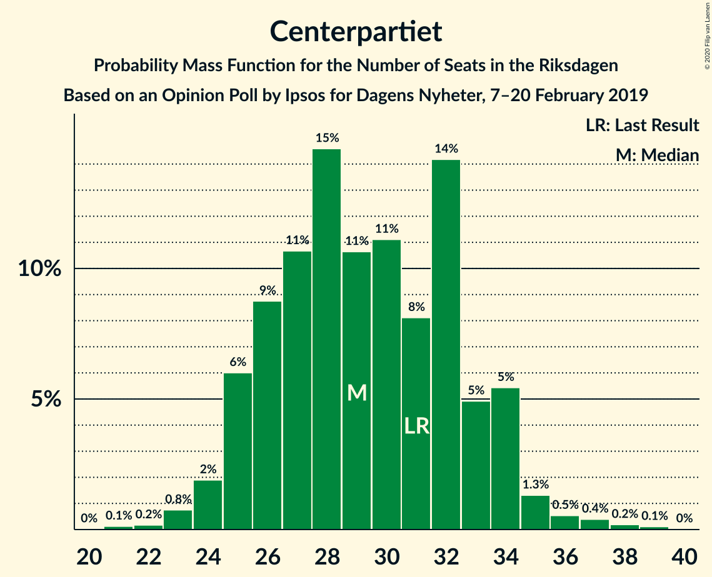
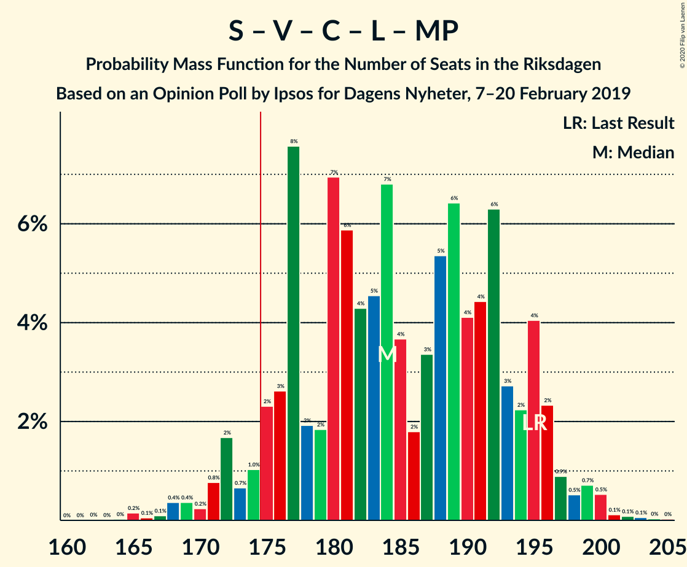
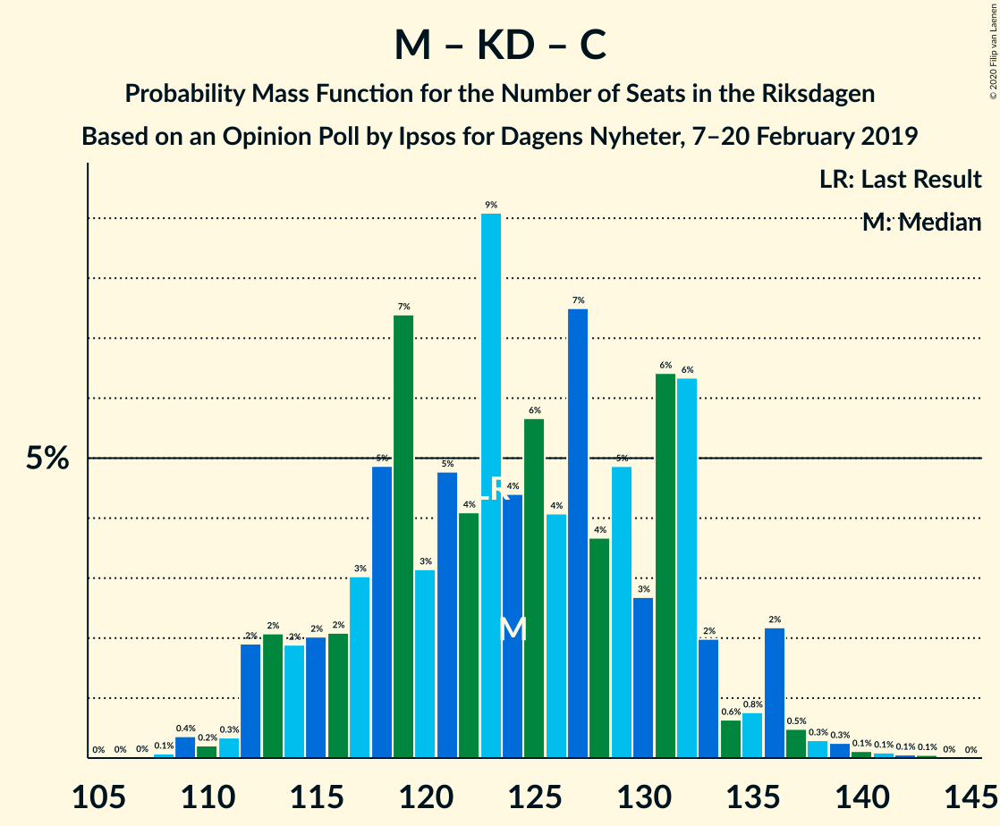

# Opinion Poll by Ipsos for Dagens Nyheter, 7–20 February 2019

<a href="#voting-intentions">Voting Intentions</a> | <a href="#seats">Seats</a> | <a href="#coalitions">Coalitions</a> | <a href="#technical-information">Technical Information</a>

## Voting Intentions

### Confidence Intervals

| Party | Last Result | Poll Result | 80% Confidence Interval | 90% Confidence Interval | 95% Confidence Interval | 99% Confidence Interval |
|:-----:|:-----------:|:-----------:|:-----------------------:|:-----------------------:|:-----------------------:|:-----------------------:|
| Sveriges socialdemokratiska arbetareparti | 28.3% | 28.0% | 26.5–29.5% |26.1–29.9% |25.8–30.3% |25.1–31.1% |
| Sverigedemokraterna | 17.5% | 19.0% | 17.8–20.4% |17.4–20.8% |17.1–21.1% |16.5–21.7% |
| Moderata samlingspartiet | 19.8% | 17.0% | 15.8–18.3% |15.5–18.7% |15.2–19.0% |14.6–19.6% |
| Vänsterpartiet | 8.0% | 10.0% | 9.0–11.0% |8.8–11.3% |8.6–11.6% |8.1–12.1% |
| Kristdemokraterna | 6.3% | 9.0% | 8.1–10.0% |7.8–10.3% |7.6–10.5% |7.2–11.0% |
| Centerpartiet | 8.6% | 8.0% | 7.1–8.9% |6.9–9.2% |6.7–9.5% |6.3–10.0% |
| Liberalerna | 5.5% | 4.0% | 3.4–4.7% |3.2–4.9% |3.1–5.1% |2.9–5.5% |
| Miljöpartiet de gröna | 4.4% | 4.0% | 3.4–4.7% |3.2–4.9% |3.1–5.1% |2.9–5.5% |

*Note:* The poll result column reflects the actual value used in the calculations. Published results may vary slightly, and in addition be rounded to fewer digits.

## Seats

### Confidence Intervals

| Party | Last Result | Median | 80% Confidence Interval | 90% Confidence Interval | 95% Confidence Interval | 99% Confidence Interval |
|:-----:|:-----------:|:------:|:-----------------------:|:-----------------------:|:-----------------------:|:-----------------------:|
| <a href="#sveriges-socialdemokratiska-arbetareparti">Sveriges socialdemokratiska arbetareparti</a> | 100 | 104 | 104 |104–109 |93–114 |93–114 |
| <a href="#sverigedemokraterna">Sverigedemokraterna</a> | 62 | 67 | 67 |67–72 |66–72 |59–72 |
| <a href="#moderata-samlingspartiet">Moderata samlingspartiet</a> | 70 | 63 | 63 |60–63 |60–65 |58–70 |
| <a href="#vänsterpartiet">Vänsterpartiet</a> | 28 | 39 | 39 |34–39 |31–39 |31–40 |
| <a href="#kristdemokraterna">Kristdemokraterna</a> | 22 | 38 | 38 |34–38 |28–38 |26–44 |
| <a href="#centerpartiet">Centerpartiet</a> | 31 | 38 | 38 |32–38 |31–38 |23–38 |
| <a href="#liberalerna">Liberalerna</a> | 20 | 0 | 0 |0 |0–16 |0–16 |
| <a href="#miljöpartiet-de-gröna">Miljöpartiet de gröna</a> | 16 | 0 | 0 |0 |0–15 |0–17 |

### Sveriges socialdemokratiska arbetareparti

*For a full overview of the results for this party, see the [Sveriges socialdemokratiska arbetareparti](party-sverigessocialdemokratiskaarbetareparti.html) page.*

| Number of Seats | Probability | Accumulated | Special Marks |
|:---------------:|:-----------:|:-----------:|:-------------:|
| 87 | 0.1% | 100% |  |
| 88 | 0% | 99.9% |  |
| 89 | 0.1% | 99.9% |  |
| 90 | 0% | 99.7% |  |
| 91 | 0% | 99.7% |  |
| 92 | 0% | 99.7% |  |
| 93 | 2% | 99.7% |  |
| 94 | 0.1% | 97% |  |
| 95 | 0% | 97% |  |
| 96 | 0% | 97% |  |
| 97 | 0% | 97% |  |
| 98 | 0.2% | 97% |  |
| 99 | 2% | 97% |  |
| 100 | 0% | 96% | Last Result |
| 101 | 0% | 96% |  |
| 102 | 0% | 96% |  |
| 103 | 0% | 96% |  |
| 104 | 90% | 96% | Median |
| 105 | 0% | 6% |  |
| 106 | 0.2% | 6% |  |
| 107 | 0% | 6% |  |
| 108 | 0% | 6% |  |
| 109 | 2% | 6% |  |
| 110 | 0% | 3% |  |
| 111 | 0% | 3% |  |
| 112 | 0% | 3% |  |
| 113 | 0% | 3% |  |
| 114 | 3% | 3% |  |
| 115 | 0% | 0% |  |

### Sverigedemokraterna

*For a full overview of the results for this party, see the [Sverigedemokraterna](party-sverigedemokraterna.html) page.*

| Number of Seats | Probability | Accumulated | Special Marks |
|:---------------:|:-----------:|:-----------:|:-------------:|
| 59 | 2% | 100% |  |
| 60 | 0.1% | 98% |  |
| 61 | 0% | 98% |  |
| 62 | 0% | 98% | Last Result |
| 63 | 0% | 98% |  |
| 64 | 0% | 98% |  |
| 65 | 0% | 98% |  |
| 66 | 2% | 98% |  |
| 67 | 90% | 96% | Median |
| 68 | 0.1% | 6% |  |
| 69 | 0% | 6% |  |
| 70 | 0% | 6% |  |
| 71 | 0.2% | 6% |  |
| 72 | 6% | 6% |  |
| 73 | 0% | 0.4% |  |
| 74 | 0.1% | 0.4% |  |
| 75 | 0.2% | 0.3% |  |
| 76 | 0% | 0.2% |  |
| 77 | 0% | 0.1% |  |
| 78 | 0% | 0.1% |  |
| 79 | 0.1% | 0.1% |  |
| 80 | 0% | 0% |  |

### Moderata samlingspartiet

*For a full overview of the results for this party, see the [Moderata samlingspartiet](party-moderatasamlingspartiet.html) page.*

| Number of Seats | Probability | Accumulated | Special Marks |
|:---------------:|:-----------:|:-----------:|:-------------:|
| 47 | 0.1% | 100% |  |
| 48 | 0% | 99.9% |  |
| 49 | 0% | 99.9% |  |
| 50 | 0% | 99.9% |  |
| 51 | 0% | 99.9% |  |
| 52 | 0% | 99.9% |  |
| 53 | 0% | 99.9% |  |
| 54 | 0.2% | 99.9% |  |
| 55 | 0% | 99.7% |  |
| 56 | 0.1% | 99.7% |  |
| 57 | 0% | 99.6% |  |
| 58 | 2% | 99.6% |  |
| 59 | 0% | 98% |  |
| 60 | 3% | 98% |  |
| 61 | 2% | 95% |  |
| 62 | 0% | 93% |  |
| 63 | 90% | 93% | Median |
| 64 | 0% | 3% |  |
| 65 | 0.2% | 3% |  |
| 66 | 0% | 2% |  |
| 67 | 0% | 2% |  |
| 68 | 0.1% | 2% |  |
| 69 | 0% | 2% |  |
| 70 | 2% | 2% | Last Result |
| 71 | 0% | 0% |  |

### Vänsterpartiet

*For a full overview of the results for this party, see the [Vänsterpartiet](party-vänsterpartiet.html) page.*

| Number of Seats | Probability | Accumulated | Special Marks |
|:---------------:|:-----------:|:-----------:|:-------------:|
| 28 | 0% | 100% | Last Result |
| 29 | 0% | 100% |  |
| 30 | 0% | 100% |  |
| 31 | 3% | 100% |  |
| 32 | 0.4% | 97% |  |
| 33 | 0% | 96% |  |
| 34 | 2% | 96% |  |
| 35 | 0% | 95% |  |
| 36 | 2% | 95% |  |
| 37 | 0% | 93% |  |
| 38 | 0.3% | 93% |  |
| 39 | 90% | 92% | Median |
| 40 | 2% | 2% |  |
| 41 | 0% | 0.2% |  |
| 42 | 0.2% | 0.2% |  |
| 43 | 0% | 0% |  |

### Kristdemokraterna

*For a full overview of the results for this party, see the [Kristdemokraterna](party-kristdemokraterna.html) page.*

| Number of Seats | Probability | Accumulated | Special Marks |
|:---------------:|:-----------:|:-----------:|:-------------:|
| 22 | 0% | 100% | Last Result |
| 23 | 0% | 100% |  |
| 24 | 0% | 100% |  |
| 25 | 0% | 100% |  |
| 26 | 2% | 100% |  |
| 27 | 0.1% | 98% |  |
| 28 | 0.1% | 98% |  |
| 29 | 0% | 97% |  |
| 30 | 0% | 97% |  |
| 31 | 0.1% | 97% |  |
| 32 | 2% | 97% |  |
| 33 | 0.1% | 95% |  |
| 34 | 3% | 95% |  |
| 35 | 0.1% | 92% |  |
| 36 | 0% | 91% |  |
| 37 | 0% | 91% |  |
| 38 | 90% | 91% | Median |
| 39 | 0% | 2% |  |
| 40 | 0% | 2% |  |
| 41 | 0% | 2% |  |
| 42 | 0% | 2% |  |
| 43 | 0% | 2% |  |
| 44 | 2% | 2% |  |
| 45 | 0% | 0% |  |

### Centerpartiet

*For a full overview of the results for this party, see the [Centerpartiet](party-centerpartiet.html) page.*

| Number of Seats | Probability | Accumulated | Special Marks |
|:---------------:|:-----------:|:-----------:|:-------------:|
| 23 | 2% | 100% |  |
| 24 | 0% | 98% |  |
| 25 | 0% | 98% |  |
| 26 | 0.2% | 98% |  |
| 27 | 0% | 98% |  |
| 28 | 0% | 98% |  |
| 29 | 0.1% | 98% |  |
| 30 | 0% | 98% |  |
| 31 | 2% | 98% | Last Result |
| 32 | 2% | 96% |  |
| 33 | 0.2% | 93% |  |
| 34 | 0% | 93% |  |
| 35 | 0% | 93% |  |
| 36 | 0% | 93% |  |
| 37 | 0% | 93% |  |
| 38 | 93% | 93% | Median |
| 39 | 0% | 0% |  |

### Liberalerna

*For a full overview of the results for this party, see the [Liberalerna](party-liberalerna.html) page.*

| Number of Seats | Probability | Accumulated | Special Marks |
|:---------------:|:-----------:|:-----------:|:-------------:|
| 0 | 95% | 100% | Median |
| 1 | 0% | 5% |  |
| 2 | 0% | 5% |  |
| 3 | 0% | 5% |  |
| 4 | 0% | 5% |  |
| 5 | 0% | 5% |  |
| 6 | 0% | 5% |  |
| 7 | 0% | 5% |  |
| 8 | 0% | 5% |  |
| 9 | 0% | 5% |  |
| 10 | 0% | 5% |  |
| 11 | 0% | 5% |  |
| 12 | 0% | 5% |  |
| 13 | 0% | 5% |  |
| 14 | 2% | 5% |  |
| 15 | 0.1% | 3% |  |
| 16 | 2% | 3% |  |
| 17 | 0% | 0.3% |  |
| 18 | 0.2% | 0.3% |  |
| 19 | 0% | 0% |  |
| 20 | 0% | 0% | Last Result |

### Miljöpartiet de gröna

*For a full overview of the results for this party, see the [Miljöpartiet de gröna](party-miljöpartietdegröna.html) page.*

| Number of Seats | Probability | Accumulated | Special Marks |
|:---------------:|:-----------:|:-----------:|:-------------:|
| 0 | 96% | 100% | Median |
| 1 | 0% | 4% |  |
| 2 | 0% | 4% |  |
| 3 | 0% | 4% |  |
| 4 | 0% | 4% |  |
| 5 | 0% | 4% |  |
| 6 | 0% | 4% |  |
| 7 | 0% | 4% |  |
| 8 | 0% | 4% |  |
| 9 | 0% | 4% |  |
| 10 | 0% | 4% |  |
| 11 | 0% | 4% |  |
| 12 | 0% | 4% |  |
| 13 | 0% | 4% |  |
| 14 | 0% | 4% |  |
| 15 | 2% | 4% |  |
| 16 | 0.1% | 2% | Last Result |
| 17 | 2% | 2% |  |
| 18 | 0.1% | 0.4% |  |
| 19 | 0% | 0.3% |  |
| 20 | 0% | 0.3% |  |
| 21 | 0.2% | 0.3% |  |
| 22 | 0% | 0% |  |

## Coalitions

### Confidence Intervals

| Coalition | Last Result | Median | Majority? | 80% Confidence Interval | 90% Confidence Interval | 95% Confidence Interval | 99% Confidence Interval |
|:---------:|:-----------:|:------:|:---------:|:-----------------------:|:-----------------------:|:-----------------------:|:-----------------------:|
| Sveriges socialdemokratiska arbetareparti – Moderata samlingspartiet – Centerpartiet | 201 | 205 | 100% | 205 | 195–205 | 193–212 | 186–212 |
| Sveriges socialdemokratiska arbetareparti – Vänsterpartiet – Centerpartiet – Liberalerna – Miljöpartiet de gröna | 195 | 181 | 99.8% | 181 | 181–183 | 181–192 | 181–197 |
| Sveriges socialdemokratiska arbetareparti – Moderata samlingspartiet | 170 | 167 | 0% | 167 | 167–170 | 163–174 | 156–174 |
| Sverigedemokraterna – Moderata samlingspartiet – Kristdemokraterna | 154 | 168 | 0.2% | 168 | 166–168 | 157–168 | 152–168 |
| Sveriges socialdemokratiska arbetareparti – Centerpartiet – Liberalerna – Miljöpartiet de gröna | 167 | 142 | 0% | 142 | 142–152 | 141–156 | 141–161 |
| Sveriges socialdemokratiska arbetareparti – Vänsterpartiet – Miljöpartiet de gröna | 144 | 143 | 0% | 143 | 143–145 | 143–150 | 133–160 |
| Sveriges socialdemokratiska arbetareparti – Vänsterpartiet | 128 | 143 | 0% | 143 | 143–145 | 133–145 | 130–145 |
| Sverigedemokraterna – Moderata samlingspartiet | 132 | 130 | 0% | 130 | 130–132 | 124–140 | 120–142 |
| Moderata samlingspartiet – Kristdemokraterna – Centerpartiet – Liberalerna | 143 | 139 | 0% | 139 | 132–139 | 130–139 | 130–144 |
| Moderata samlingspartiet – Kristdemokraterna – Centerpartiet | 123 | 139 | 0% | 134–139 | 128–139 | 120–139 | 116–139 |
| Sveriges socialdemokratiska arbetareparti – Miljöpartiet de gröna | 116 | 104 | 0% | 104 | 104–114 | 104–116 | 93–124 |
| Moderata samlingspartiet – Centerpartiet – Liberalerna | 121 | 101 | 0% | 101 | 98–101 | 98–103 | 89–118 |
| Moderata samlingspartiet – Centerpartiet | 101 | 101 | 0% | 101 | 98–101 | 89–101 | 84–102 |

### Sveriges socialdemokratiska arbetareparti – Moderata samlingspartiet – Centerpartiet

| Number of Seats | Probability | Accumulated | Special Marks |
|:---------------:|:-----------:|:-----------:|:-------------:|
| 176 | 0.1% | 100% |  |
| 177 | 0% | 99.9% |  |
| 178 | 0.1% | 99.9% |  |
| 179 | 0% | 99.7% |  |
| 180 | 0% | 99.7% |  |
| 181 | 0% | 99.7% |  |
| 182 | 0% | 99.7% |  |
| 183 | 0% | 99.7% |  |
| 184 | 0% | 99.7% |  |
| 185 | 0.1% | 99.7% |  |
| 186 | 0.1% | 99.6% |  |
| 187 | 0% | 99.5% |  |
| 188 | 2% | 99.5% |  |
| 189 | 0% | 98% |  |
| 190 | 0% | 98% |  |
| 191 | 0% | 98% |  |
| 192 | 0% | 98% |  |
| 193 | 2% | 98% |  |
| 194 | 0% | 96% |  |
| 195 | 2% | 96% |  |
| 196 | 0% | 93% |  |
| 197 | 0% | 93% |  |
| 198 | 0% | 93% |  |
| 199 | 0% | 93% |  |
| 200 | 0.2% | 93% |  |
| 201 | 0% | 93% | Last Result |
| 202 | 0% | 93% |  |
| 203 | 0% | 93% |  |
| 204 | 0% | 93% |  |
| 205 | 90% | 93% | Median |
| 206 | 0% | 3% |  |
| 207 | 0% | 3% |  |
| 208 | 0% | 3% |  |
| 209 | 0% | 3% |  |
| 210 | 0% | 3% |  |
| 211 | 0% | 3% |  |
| 212 | 3% | 3% |  |
| 213 | 0% | 0% |  |

### Sveriges socialdemokratiska arbetareparti – Vänsterpartiet – Centerpartiet – Liberalerna – Miljöpartiet de gröna

| Number of Seats | Probability | Accumulated | Special Marks |
|:---------------:|:-----------:|:-----------:|:-------------:|
| 167 | 0.1% | 100% |  |
| 168 | 0% | 99.9% |  |
| 169 | 0% | 99.9% |  |
| 170 | 0% | 99.9% |  |
| 171 | 0% | 99.9% |  |
| 172 | 0% | 99.9% |  |
| 173 | 0% | 99.9% |  |
| 174 | 0% | 99.9% |  |
| 175 | 0% | 99.8% | Majority |
| 176 | 0% | 99.8% |  |
| 177 | 0.2% | 99.8% |  |
| 178 | 0% | 99.7% |  |
| 179 | 0% | 99.7% |  |
| 180 | 0% | 99.7% |  |
| 181 | 94% | 99.7% | Median |
| 182 | 0% | 6% |  |
| 183 | 3% | 6% |  |
| 184 | 0% | 3% |  |
| 185 | 0% | 3% |  |
| 186 | 0% | 3% |  |
| 187 | 0% | 3% |  |
| 188 | 0% | 3% |  |
| 189 | 0% | 3% |  |
| 190 | 0% | 3% |  |
| 191 | 0.1% | 3% |  |
| 192 | 0.2% | 3% |  |
| 193 | 0% | 2% |  |
| 194 | 0% | 2% |  |
| 195 | 0% | 2% | Last Result |
| 196 | 0% | 2% |  |
| 197 | 2% | 2% |  |
| 198 | 0.2% | 0.2% |  |
| 199 | 0% | 0% |  |

### Sveriges socialdemokratiska arbetareparti – Moderata samlingspartiet

| Number of Seats | Probability | Accumulated | Special Marks |
|:---------------:|:-----------:|:-----------:|:-------------:|
| 145 | 0.1% | 100% |  |
| 146 | 0% | 99.9% |  |
| 147 | 0.1% | 99.9% |  |
| 148 | 0% | 99.7% |  |
| 149 | 0% | 99.7% |  |
| 150 | 0% | 99.7% |  |
| 151 | 0% | 99.7% |  |
| 152 | 0% | 99.7% |  |
| 153 | 0% | 99.7% |  |
| 154 | 0.1% | 99.7% |  |
| 155 | 0.1% | 99.7% |  |
| 156 | 0% | 99.5% |  |
| 157 | 2% | 99.5% |  |
| 158 | 0% | 98% |  |
| 159 | 0% | 98% |  |
| 160 | 0.2% | 98% |  |
| 161 | 0% | 98% |  |
| 162 | 0% | 98% |  |
| 163 | 2% | 98% |  |
| 164 | 0.1% | 96% |  |
| 165 | 0% | 96% |  |
| 166 | 0% | 96% |  |
| 167 | 90% | 96% | Median |
| 168 | 0% | 6% |  |
| 169 | 0% | 6% |  |
| 170 | 2% | 6% | Last Result |
| 171 | 0% | 4% |  |
| 172 | 0% | 4% |  |
| 173 | 0% | 4% |  |
| 174 | 4% | 4% |  |
| 175 | 0% | 0% | Majority |

### Sverigedemokraterna – Moderata samlingspartiet – Kristdemokraterna

| Number of Seats | Probability | Accumulated | Special Marks |
|:---------------:|:-----------:|:-----------:|:-------------:|
| 151 | 0.2% | 100% |  |
| 152 | 2% | 99.8% |  |
| 153 | 0% | 98% |  |
| 154 | 0% | 98% | Last Result |
| 155 | 0% | 98% |  |
| 156 | 0% | 98% |  |
| 157 | 0.2% | 98% |  |
| 158 | 0.1% | 97% |  |
| 159 | 0% | 97% |  |
| 160 | 0% | 97% |  |
| 161 | 0% | 97% |  |
| 162 | 0% | 97% |  |
| 163 | 0% | 97% |  |
| 164 | 0% | 97% |  |
| 165 | 0% | 97% |  |
| 166 | 3% | 97% |  |
| 167 | 0% | 94% |  |
| 168 | 94% | 94% | Median |
| 169 | 0% | 0.3% |  |
| 170 | 0% | 0.3% |  |
| 171 | 0% | 0.3% |  |
| 172 | 0.2% | 0.3% |  |
| 173 | 0% | 0.2% |  |
| 174 | 0% | 0.2% |  |
| 175 | 0% | 0.2% | Majority |
| 176 | 0% | 0.1% |  |
| 177 | 0% | 0.1% |  |
| 178 | 0% | 0.1% |  |
| 179 | 0% | 0.1% |  |
| 180 | 0% | 0.1% |  |
| 181 | 0% | 0.1% |  |
| 182 | 0.1% | 0.1% |  |
| 183 | 0% | 0% |  |

### Sveriges socialdemokratiska arbetareparti – Centerpartiet – Liberalerna – Miljöpartiet de gröna

| Number of Seats | Probability | Accumulated | Special Marks |
|:---------------:|:-----------:|:-----------:|:-------------:|
| 135 | 0.3% | 100% |  |
| 136 | 0% | 99.7% |  |
| 137 | 0% | 99.7% |  |
| 138 | 0% | 99.7% |  |
| 139 | 0% | 99.7% |  |
| 140 | 0% | 99.7% |  |
| 141 | 2% | 99.7% |  |
| 142 | 90% | 97% | Median |
| 143 | 0% | 8% |  |
| 144 | 0% | 8% |  |
| 145 | 0% | 8% |  |
| 146 | 0% | 8% |  |
| 147 | 2% | 8% |  |
| 148 | 0% | 6% |  |
| 149 | 0% | 6% |  |
| 150 | 0% | 6% |  |
| 151 | 0% | 6% |  |
| 152 | 3% | 6% |  |
| 153 | 0% | 3% |  |
| 154 | 0.1% | 3% |  |
| 155 | 0% | 3% |  |
| 156 | 0% | 3% |  |
| 157 | 0% | 2% |  |
| 158 | 0% | 2% |  |
| 159 | 0.1% | 2% |  |
| 160 | 0.2% | 2% |  |
| 161 | 2% | 2% |  |
| 162 | 0% | 0.1% |  |
| 163 | 0% | 0.1% |  |
| 164 | 0% | 0.1% |  |
| 165 | 0.1% | 0.1% |  |
| 166 | 0% | 0% |  |
| 167 | 0% | 0% | Last Result |

### Sveriges socialdemokratiska arbetareparti – Vänsterpartiet – Miljöpartiet de gröna

| Number of Seats | Probability | Accumulated | Special Marks |
|:---------------:|:-----------:|:-----------:|:-------------:|
| 133 | 2% | 100% |  |
| 134 | 0% | 98% |  |
| 135 | 0% | 98% |  |
| 136 | 0.1% | 98% |  |
| 137 | 0% | 98% |  |
| 138 | 0% | 98% |  |
| 139 | 0% | 98% |  |
| 140 | 0% | 98% |  |
| 141 | 0% | 98% |  |
| 142 | 0% | 98% |  |
| 143 | 90% | 98% | Median |
| 144 | 0% | 8% | Last Result |
| 145 | 3% | 8% |  |
| 146 | 0% | 4% |  |
| 147 | 0.1% | 4% |  |
| 148 | 0.1% | 4% |  |
| 149 | 0% | 4% |  |
| 150 | 2% | 4% |  |
| 151 | 0.2% | 2% |  |
| 152 | 0% | 2% |  |
| 153 | 0% | 2% |  |
| 154 | 0% | 2% |  |
| 155 | 0% | 2% |  |
| 156 | 0% | 2% |  |
| 157 | 0% | 2% |  |
| 158 | 0% | 2% |  |
| 159 | 0% | 2% |  |
| 160 | 2% | 2% |  |
| 161 | 0% | 0.2% |  |
| 162 | 0% | 0.2% |  |
| 163 | 0% | 0.2% |  |
| 164 | 0% | 0.2% |  |
| 165 | 0.2% | 0.2% |  |
| 166 | 0% | 0% |  |

### Sveriges socialdemokratiska arbetareparti – Vänsterpartiet

| Number of Seats | Probability | Accumulated | Special Marks |
|:---------------:|:-----------:|:-----------:|:-------------:|
| 119 | 0.1% | 100% |  |
| 120 | 0% | 99.9% |  |
| 121 | 0% | 99.9% |  |
| 122 | 0% | 99.9% |  |
| 123 | 0% | 99.8% |  |
| 124 | 0% | 99.8% |  |
| 125 | 0% | 99.8% |  |
| 126 | 0.1% | 99.8% |  |
| 127 | 0.1% | 99.8% |  |
| 128 | 0% | 99.7% | Last Result |
| 129 | 0% | 99.6% |  |
| 130 | 0.2% | 99.6% |  |
| 131 | 0% | 99.5% |  |
| 132 | 0% | 99.5% |  |
| 133 | 4% | 99.5% |  |
| 134 | 0% | 96% |  |
| 135 | 0% | 96% |  |
| 136 | 0% | 96% |  |
| 137 | 0% | 96% |  |
| 138 | 0% | 96% |  |
| 139 | 0% | 96% |  |
| 140 | 0% | 96% |  |
| 141 | 0% | 96% |  |
| 142 | 0% | 96% |  |
| 143 | 90% | 96% | Median |
| 144 | 0.2% | 6% |  |
| 145 | 5% | 6% |  |
| 146 | 0% | 0.2% |  |
| 147 | 0% | 0.2% |  |
| 148 | 0% | 0.2% |  |
| 149 | 0% | 0.2% |  |
| 150 | 0% | 0.2% |  |
| 151 | 0.2% | 0.2% |  |
| 152 | 0% | 0% |  |

### Sverigedemokraterna – Moderata samlingspartiet

| Number of Seats | Probability | Accumulated | Special Marks |
|:---------------:|:-----------:|:-----------:|:-------------:|
| 119 | 0.1% | 100% |  |
| 120 | 2% | 99.9% |  |
| 121 | 0% | 98% |  |
| 122 | 0% | 98% |  |
| 123 | 0% | 98% |  |
| 124 | 2% | 98% |  |
| 125 | 0.2% | 96% |  |
| 126 | 0.1% | 96% |  |
| 127 | 0% | 96% |  |
| 128 | 0% | 96% |  |
| 129 | 0% | 96% |  |
| 130 | 90% | 96% | Median |
| 131 | 0% | 6% |  |
| 132 | 3% | 6% | Last Result |
| 133 | 0% | 3% |  |
| 134 | 0% | 3% |  |
| 135 | 0% | 3% |  |
| 136 | 0% | 3% |  |
| 137 | 0% | 3% |  |
| 138 | 0% | 3% |  |
| 139 | 0% | 3% |  |
| 140 | 0.2% | 3% |  |
| 141 | 0% | 2% |  |
| 142 | 2% | 2% |  |
| 143 | 0% | 0.1% |  |
| 144 | 0% | 0.1% |  |
| 145 | 0% | 0.1% |  |
| 146 | 0% | 0.1% |  |
| 147 | 0.1% | 0.1% |  |
| 148 | 0% | 0% |  |

### Moderata samlingspartiet – Kristdemokraterna – Centerpartiet – Liberalerna

| Number of Seats | Probability | Accumulated | Special Marks |
|:---------------:|:-----------:|:-----------:|:-------------:|
| 113 | 0.2% | 100% |  |
| 114 | 0% | 99.8% |  |
| 115 | 0% | 99.8% |  |
| 116 | 0% | 99.8% |  |
| 117 | 0% | 99.8% |  |
| 118 | 0% | 99.8% |  |
| 119 | 0% | 99.8% |  |
| 120 | 0% | 99.8% |  |
| 121 | 0% | 99.8% |  |
| 122 | 0% | 99.8% |  |
| 123 | 0.2% | 99.8% |  |
| 124 | 0% | 99.7% |  |
| 125 | 0% | 99.7% |  |
| 126 | 0% | 99.7% |  |
| 127 | 0% | 99.7% |  |
| 128 | 0% | 99.7% |  |
| 129 | 0.1% | 99.6% |  |
| 130 | 2% | 99.5% |  |
| 131 | 0% | 97% |  |
| 132 | 3% | 97% |  |
| 133 | 2% | 94% |  |
| 134 | 0.1% | 92% |  |
| 135 | 0% | 92% |  |
| 136 | 0% | 92% |  |
| 137 | 0% | 92% |  |
| 138 | 0.1% | 92% |  |
| 139 | 90% | 92% | Median |
| 140 | 0% | 2% |  |
| 141 | 0% | 2% |  |
| 142 | 0.1% | 2% |  |
| 143 | 0% | 2% | Last Result |
| 144 | 2% | 2% |  |
| 145 | 0% | 0% |  |

### Moderata samlingspartiet – Kristdemokraterna – Centerpartiet

| Number of Seats | Probability | Accumulated | Special Marks |
|:---------------:|:-----------:|:-----------:|:-------------:|
| 111 | 0.1% | 100% |  |
| 112 | 0% | 99.9% |  |
| 113 | 0.2% | 99.9% |  |
| 114 | 0.1% | 99.7% |  |
| 115 | 0% | 99.6% |  |
| 116 | 2% | 99.6% |  |
| 117 | 0% | 98% |  |
| 118 | 0% | 98% |  |
| 119 | 0% | 98% |  |
| 120 | 0.1% | 98% |  |
| 121 | 0% | 97% |  |
| 122 | 0% | 97% |  |
| 123 | 0.2% | 97% | Last Result |
| 124 | 0% | 97% |  |
| 125 | 0% | 97% |  |
| 126 | 0% | 97% |  |
| 127 | 0.1% | 97% |  |
| 128 | 2% | 97% |  |
| 129 | 0% | 95% |  |
| 130 | 0% | 95% |  |
| 131 | 0% | 95% |  |
| 132 | 3% | 95% |  |
| 133 | 2% | 92% |  |
| 134 | 0.1% | 90% |  |
| 135 | 0% | 90% |  |
| 136 | 0% | 90% |  |
| 137 | 0% | 90% |  |
| 138 | 0% | 90% |  |
| 139 | 90% | 90% | Median |
| 140 | 0% | 0% |  |

### Sveriges socialdemokratiska arbetareparti – Miljöpartiet de gröna

| Number of Seats | Probability | Accumulated | Special Marks |
|:---------------:|:-----------:|:-----------:|:-------------:|
| 93 | 2% | 100% |  |
| 94 | 0% | 98% |  |
| 95 | 0% | 98% |  |
| 96 | 0% | 98% |  |
| 97 | 0% | 98% |  |
| 98 | 0% | 98% |  |
| 99 | 0% | 98% |  |
| 100 | 0% | 98% |  |
| 101 | 0% | 98% |  |
| 102 | 0% | 98% |  |
| 103 | 0% | 98% |  |
| 104 | 90% | 98% | Median |
| 105 | 0.1% | 8% |  |
| 106 | 0% | 8% |  |
| 107 | 0% | 8% |  |
| 108 | 0% | 8% |  |
| 109 | 0.2% | 8% |  |
| 110 | 0% | 7% |  |
| 111 | 0% | 7% |  |
| 112 | 0% | 7% |  |
| 113 | 0.1% | 7% |  |
| 114 | 3% | 7% |  |
| 115 | 0.1% | 4% |  |
| 116 | 2% | 4% | Last Result |
| 117 | 0% | 2% |  |
| 118 | 0% | 2% |  |
| 119 | 0% | 2% |  |
| 120 | 0% | 2% |  |
| 121 | 0% | 2% |  |
| 122 | 0% | 2% |  |
| 123 | 0% | 2% |  |
| 124 | 2% | 2% |  |
| 125 | 0% | 0.2% |  |
| 126 | 0% | 0.2% |  |
| 127 | 0.2% | 0.2% |  |
| 128 | 0% | 0% |  |

### Moderata samlingspartiet – Centerpartiet – Liberalerna

| Number of Seats | Probability | Accumulated | Special Marks |
|:---------------:|:-----------:|:-----------:|:-------------:|
| 87 | 0.2% | 100% |  |
| 88 | 0% | 99.8% |  |
| 89 | 2% | 99.8% |  |
| 90 | 0% | 98% |  |
| 91 | 0.2% | 98% |  |
| 92 | 0% | 98% |  |
| 93 | 0% | 98% |  |
| 94 | 0% | 98% |  |
| 95 | 0% | 98% |  |
| 96 | 0.1% | 98% |  |
| 97 | 0% | 98% |  |
| 98 | 5% | 98% |  |
| 99 | 0.1% | 93% |  |
| 100 | 0% | 92% |  |
| 101 | 90% | 92% | Median |
| 102 | 0% | 3% |  |
| 103 | 0.1% | 3% |  |
| 104 | 0% | 2% |  |
| 105 | 0% | 2% |  |
| 106 | 0% | 2% |  |
| 107 | 0.1% | 2% |  |
| 108 | 0% | 2% |  |
| 109 | 0% | 2% |  |
| 110 | 0% | 2% |  |
| 111 | 0% | 2% |  |
| 112 | 0% | 2% |  |
| 113 | 0% | 2% |  |
| 114 | 0.1% | 2% |  |
| 115 | 0% | 2% |  |
| 116 | 0% | 2% |  |
| 117 | 0% | 2% |  |
| 118 | 2% | 2% |  |
| 119 | 0% | 0% |  |
| 120 | 0% | 0% |  |
| 121 | 0% | 0% | Last Result |

### Moderata samlingspartiet – Centerpartiet

| Number of Seats | Probability | Accumulated | Special Marks |
|:---------------:|:-----------:|:-----------:|:-------------:|
| 78 | 0.1% | 100% |  |
| 79 | 0% | 99.9% |  |
| 80 | 0% | 99.9% |  |
| 81 | 0% | 99.9% |  |
| 82 | 0% | 99.9% |  |
| 83 | 0% | 99.9% |  |
| 84 | 2% | 99.9% |  |
| 85 | 0% | 98% |  |
| 86 | 0% | 98% |  |
| 87 | 0.2% | 98% |  |
| 88 | 0% | 98% |  |
| 89 | 2% | 98% |  |
| 90 | 0% | 96% |  |
| 91 | 0.2% | 96% |  |
| 92 | 0% | 96% |  |
| 93 | 0% | 96% |  |
| 94 | 0% | 96% |  |
| 95 | 0% | 96% |  |
| 96 | 0% | 96% |  |
| 97 | 0% | 96% |  |
| 98 | 3% | 96% |  |
| 99 | 0.2% | 92% |  |
| 100 | 0% | 92% |  |
| 101 | 90% | 92% | Last Result, Median |
| 102 | 2% | 2% |  |
| 103 | 0% | 0% |  |

## Technical Information

### Opinion Poll

+ **Polling firm:** Ipsos
+ **Commissioner(s):** Dagens Nyheter
+ **Fieldwork period:** 7–20 February 2019

### Calculations

+ **Sample size:** 1504
+ **Simulations done:** 1,024
+ **Error estimate:** 2.67%

