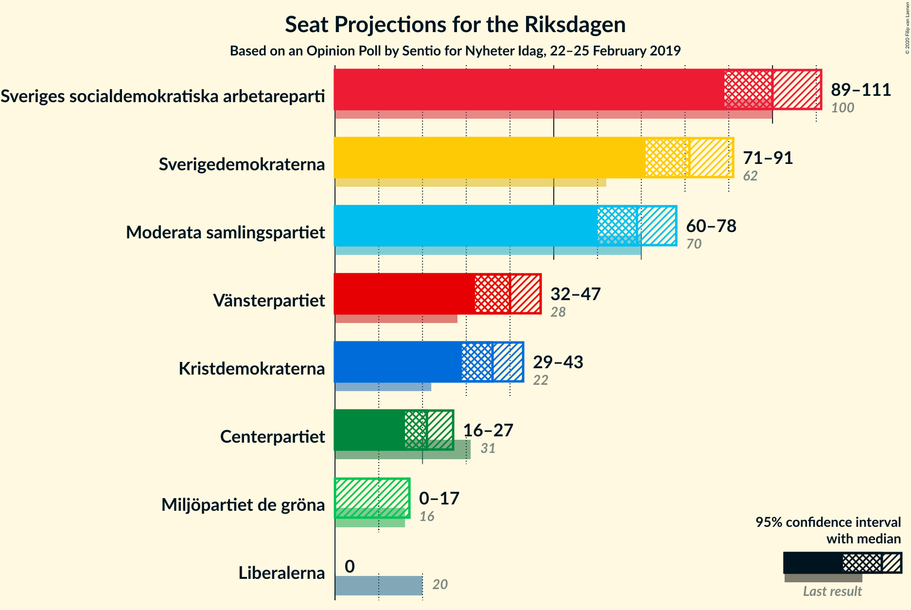
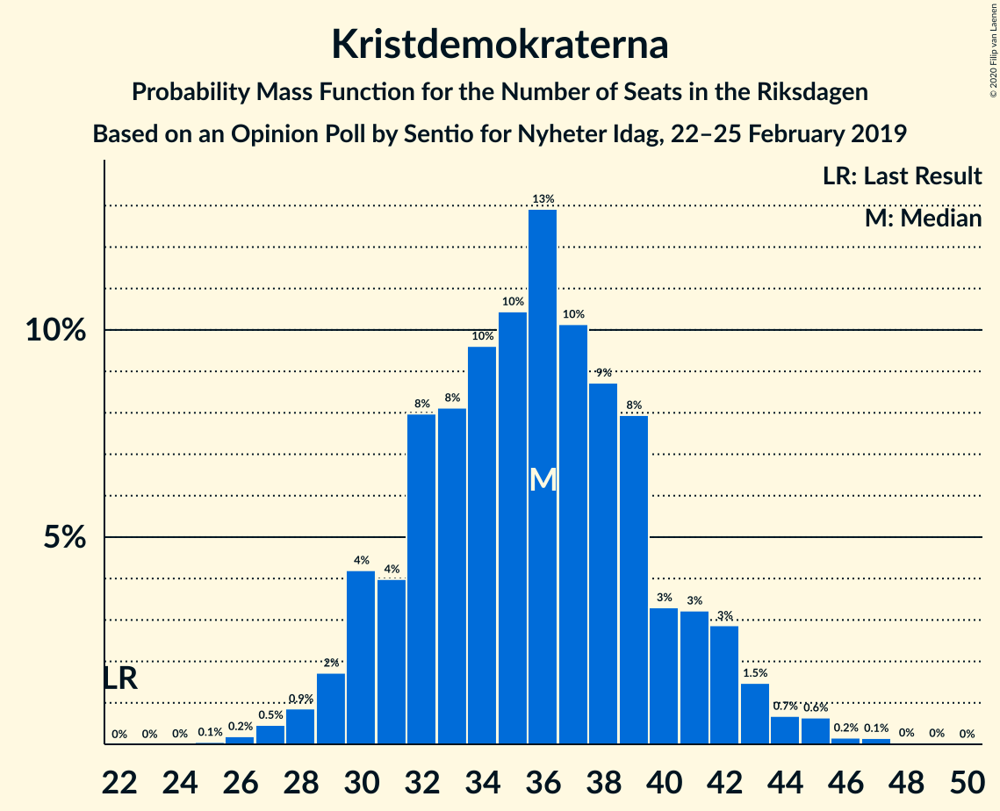
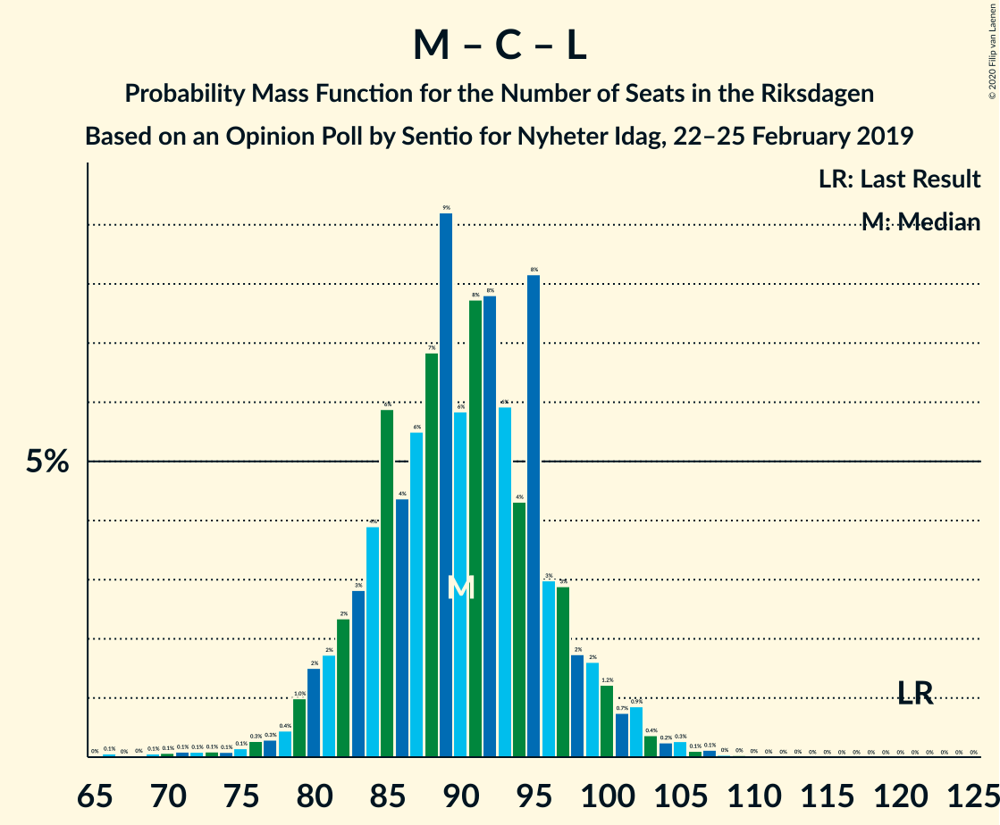

# Opinion Poll by Sentio for Nyheter Idag, 22–25 February 2019

<a href="#voting-intentions">Voting Intentions</a> | <a href="#seats">Seats</a> | <a href="#coalitions">Coalitions</a> | <a href="#technical-information">Technical Information</a>

## Voting Intentions

### Confidence Intervals

| Party | Last Result | Poll Result | 80% Confidence Interval | 90% Confidence Interval | 95% Confidence Interval | 99% Confidence Interval |
|:-----:|:-----------:|:-----------:|:-----------------------:|:-----------------------:|:-----------------------:|:-----------------------:|
| Sveriges socialdemokratiska arbetareparti | 28.3% | 26.5% | 24.8–28.3% |24.3–28.9% |23.9–29.3% |23.0–30.2% |
| Sverigedemokraterna | 17.5% | 21.4% | 19.8–23.1% |19.4–23.6% |19.0–24.1% |18.2–24.9% |
| Moderata samlingspartiet | 19.8% | 18.3% | 16.8–20.0% |16.4–20.4% |16.0–20.8% |15.3–21.6% |
| Vänsterpartiet | 8.0% | 10.5% | 9.3–11.8% |9.0–12.2% |8.7–12.6% |8.2–13.2% |
| Kristdemokraterna | 6.3% | 9.4% | 8.3–10.7% |8.0–11.1% |7.7–11.4% |7.2–12.0% |
| Centerpartiet | 8.6% | 5.5% | 4.7–6.5% |4.4–6.8% |4.3–7.1% |3.9–7.6% |
| Miljöpartiet de gröna | 4.4% | 3.4% | 2.8–4.3% |2.6–4.5% |2.4–4.7% |2.2–5.2% |
| Liberalerna | 5.5% | 2.6% | 2.1–3.4% |1.9–3.6% |1.8–3.8% |1.6–4.2% |

*Note:* The poll result column reflects the actual value used in the calculations. Published results may vary slightly, and in addition be rounded to fewer digits.

## Seats

### Confidence Intervals

| Party | Last Result | Median | 80% Confidence Interval | 90% Confidence Interval | 95% Confidence Interval | 99% Confidence Interval |
|:-----:|:-----------:|:------:|:-----------------------:|:-----------------------:|:-----------------------:|:-----------------------:|
| <a href="#sveriges-socialdemokratiska-arbetareparti">Sveriges socialdemokratiska arbetareparti</a> | 100 | 100 | 93–107 |91–109 |89–111 |86–114 |
| <a href="#sverigedemokraterna">Sverigedemokraterna</a> | 62 | 81 | 74–88 |72–90 |71–91 |68–94 |
| <a href="#moderata-samlingspartiet">Moderata samlingspartiet</a> | 70 | 69 | 63–75 |61–77 |60–78 |57–82 |
| <a href="#vänsterpartiet">Vänsterpartiet</a> | 28 | 40 | 35–44 |34–46 |32–47 |31–50 |
| <a href="#kristdemokraterna">Kristdemokraterna</a> | 22 | 36 | 31–40 |30–42 |29–43 |27–45 |
| <a href="#centerpartiet">Centerpartiet</a> | 31 | 21 | 18–25 |17–26 |16–27 |0–29 |
| <a href="#miljöpartiet-de-gröna">Miljöpartiet de gröna</a> | 16 | 0 | 0–16 |0–16 |0–17 |0–19 |
| <a href="#liberalerna">Liberalerna</a> | 20 | 0 | 0 |0 |0 |0–15 |

### Sveriges socialdemokratiska arbetareparti

*For a full overview of the results for this party, see the [Sveriges socialdemokratiska arbetareparti](party-sverigessocialdemokratiskaarbetareparti.html) page.*

| Number of Seats | Probability | Accumulated | Special Marks |
|:---------------:|:-----------:|:-----------:|:-------------:|
| 82 | 0% | 100% |  |
| 83 | 0.1% | 99.9% |  |
| 84 | 0.1% | 99.9% |  |
| 85 | 0.2% | 99.7% |  |
| 86 | 0.3% | 99.6% |  |
| 87 | 0.4% | 99.2% |  |
| 88 | 0.8% | 98.8% |  |
| 89 | 0.8% | 98% |  |
| 90 | 2% | 97% |  |
| 91 | 2% | 95% |  |
| 92 | 3% | 93% |  |
| 93 | 4% | 90% |  |
| 94 | 5% | 86% |  |
| 95 | 5% | 81% |  |
| 96 | 5% | 76% |  |
| 97 | 4% | 71% |  |
| 98 | 8% | 67% |  |
| 99 | 7% | 60% |  |
| 100 | 7% | 52% | Last Result, Median |
| 101 | 7% | 45% |  |
| 102 | 6% | 38% |  |
| 103 | 8% | 33% |  |
| 104 | 5% | 25% |  |
| 105 | 5% | 21% |  |
| 106 | 4% | 16% |  |
| 107 | 2% | 12% |  |
| 108 | 4% | 10% |  |
| 109 | 2% | 5% |  |
| 110 | 1.1% | 4% |  |
| 111 | 0.8% | 3% |  |
| 112 | 0.5% | 2% |  |
| 113 | 0.5% | 1.3% |  |
| 114 | 0.5% | 0.9% |  |
| 115 | 0.1% | 0.4% |  |
| 116 | 0.1% | 0.3% |  |
| 117 | 0.1% | 0.2% |  |
| 118 | 0% | 0.1% |  |
| 119 | 0% | 0.1% |  |
| 120 | 0% | 0% |  |

### Sverigedemokraterna

*For a full overview of the results for this party, see the [Sverigedemokraterna](party-sverigedemokraterna.html) page.*

| Number of Seats | Probability | Accumulated | Special Marks |
|:---------------:|:-----------:|:-----------:|:-------------:|
| 62 | 0% | 100% | Last Result |
| 63 | 0% | 100% |  |
| 64 | 0% | 100% |  |
| 65 | 0.1% | 99.9% |  |
| 66 | 0.1% | 99.9% |  |
| 67 | 0.2% | 99.8% |  |
| 68 | 0.3% | 99.7% |  |
| 69 | 0.5% | 99.4% |  |
| 70 | 0.9% | 98.9% |  |
| 71 | 1.3% | 98% |  |
| 72 | 2% | 97% |  |
| 73 | 3% | 95% |  |
| 74 | 3% | 92% |  |
| 75 | 4% | 89% |  |
| 76 | 6% | 85% |  |
| 77 | 5% | 79% |  |
| 78 | 8% | 74% |  |
| 79 | 9% | 66% |  |
| 80 | 7% | 57% |  |
| 81 | 10% | 50% | Median |
| 82 | 9% | 40% |  |
| 83 | 4% | 31% |  |
| 84 | 6% | 27% |  |
| 85 | 4% | 21% |  |
| 86 | 3% | 17% |  |
| 87 | 3% | 14% |  |
| 88 | 3% | 11% |  |
| 89 | 3% | 8% |  |
| 90 | 2% | 5% |  |
| 91 | 1.4% | 3% |  |
| 92 | 1.3% | 2% |  |
| 93 | 0.3% | 0.8% |  |
| 94 | 0.2% | 0.5% |  |
| 95 | 0.1% | 0.3% |  |
| 96 | 0.1% | 0.2% |  |
| 97 | 0% | 0.1% |  |
| 98 | 0% | 0.1% |  |
| 99 | 0% | 0% |  |

### Moderata samlingspartiet

*For a full overview of the results for this party, see the [Moderata samlingspartiet](party-moderatasamlingspartiet.html) page.*

| Number of Seats | Probability | Accumulated | Special Marks |
|:---------------:|:-----------:|:-----------:|:-------------:|
| 54 | 0% | 100% |  |
| 55 | 0.1% | 99.9% |  |
| 56 | 0.2% | 99.9% |  |
| 57 | 0.2% | 99.7% |  |
| 58 | 0.4% | 99.5% |  |
| 59 | 1.2% | 99.1% |  |
| 60 | 1.4% | 98% |  |
| 61 | 2% | 96% |  |
| 62 | 4% | 94% |  |
| 63 | 3% | 91% |  |
| 64 | 5% | 88% |  |
| 65 | 7% | 83% |  |
| 66 | 7% | 76% |  |
| 67 | 5% | 69% |  |
| 68 | 10% | 64% |  |
| 69 | 8% | 54% | Median |
| 70 | 8% | 46% | Last Result |
| 71 | 8% | 38% |  |
| 72 | 8% | 30% |  |
| 73 | 4% | 22% |  |
| 74 | 6% | 18% |  |
| 75 | 3% | 11% |  |
| 76 | 2% | 8% |  |
| 77 | 2% | 6% |  |
| 78 | 1.4% | 3% |  |
| 79 | 0.6% | 2% |  |
| 80 | 0.6% | 2% |  |
| 81 | 0.3% | 0.9% |  |
| 82 | 0.2% | 0.6% |  |
| 83 | 0.2% | 0.3% |  |
| 84 | 0.1% | 0.2% |  |
| 85 | 0% | 0.1% |  |
| 86 | 0% | 0% |  |

### Vänsterpartiet

*For a full overview of the results for this party, see the [Vänsterpartiet](party-vänsterpartiet.html) page.*

| Number of Seats | Probability | Accumulated | Special Marks |
|:---------------:|:-----------:|:-----------:|:-------------:|
| 28 | 0% | 100% | Last Result |
| 29 | 0.1% | 100% |  |
| 30 | 0.2% | 99.9% |  |
| 31 | 0.5% | 99.7% |  |
| 32 | 2% | 99.2% |  |
| 33 | 2% | 97% |  |
| 34 | 3% | 96% |  |
| 35 | 4% | 93% |  |
| 36 | 5% | 88% |  |
| 37 | 10% | 84% |  |
| 38 | 10% | 73% |  |
| 39 | 11% | 64% |  |
| 40 | 11% | 53% | Median |
| 41 | 10% | 42% |  |
| 42 | 11% | 32% |  |
| 43 | 6% | 21% |  |
| 44 | 6% | 15% |  |
| 45 | 3% | 9% |  |
| 46 | 2% | 6% |  |
| 47 | 2% | 4% |  |
| 48 | 1.1% | 2% |  |
| 49 | 0.5% | 1.3% |  |
| 50 | 0.4% | 0.8% |  |
| 51 | 0.1% | 0.3% |  |
| 52 | 0.1% | 0.2% |  |
| 53 | 0% | 0.1% |  |
| 54 | 0% | 0% |  |

### Kristdemokraterna

*For a full overview of the results for this party, see the [Kristdemokraterna](party-kristdemokraterna.html) page.*

| Number of Seats | Probability | Accumulated | Special Marks |
|:---------------:|:-----------:|:-----------:|:-------------:|
| 22 | 0% | 100% | Last Result |
| 23 | 0% | 100% |  |
| 24 | 0% | 100% |  |
| 25 | 0.1% | 100% |  |
| 26 | 0.2% | 99.9% |  |
| 27 | 0.5% | 99.7% |  |
| 28 | 0.9% | 99.3% |  |
| 29 | 2% | 98% |  |
| 30 | 4% | 97% |  |
| 31 | 4% | 92% |  |
| 32 | 8% | 88% |  |
| 33 | 8% | 81% |  |
| 34 | 10% | 72% |  |
| 35 | 10% | 63% |  |
| 36 | 13% | 52% | Median |
| 37 | 10% | 39% |  |
| 38 | 9% | 29% |  |
| 39 | 8% | 21% |  |
| 40 | 3% | 13% |  |
| 41 | 3% | 9% |  |
| 42 | 3% | 6% |  |
| 43 | 1.5% | 3% |  |
| 44 | 0.7% | 2% |  |
| 45 | 0.6% | 1.0% |  |
| 46 | 0.2% | 0.4% |  |
| 47 | 0.1% | 0.2% |  |
| 48 | 0% | 0.1% |  |
| 49 | 0% | 0% |  |

### Centerpartiet

*For a full overview of the results for this party, see the [Centerpartiet](party-centerpartiet.html) page.*

| Number of Seats | Probability | Accumulated | Special Marks |
|:---------------:|:-----------:|:-----------:|:-------------:|
| 0 | 0.9% | 100% |  |
| 1 | 0% | 99.1% |  |
| 2 | 0% | 99.1% |  |
| 3 | 0% | 99.1% |  |
| 4 | 0% | 99.1% |  |
| 5 | 0% | 99.1% |  |
| 6 | 0% | 99.1% |  |
| 7 | 0% | 99.1% |  |
| 8 | 0% | 99.1% |  |
| 9 | 0% | 99.1% |  |
| 10 | 0% | 99.1% |  |
| 11 | 0% | 99.1% |  |
| 12 | 0% | 99.1% |  |
| 13 | 0% | 99.1% |  |
| 14 | 0% | 99.1% |  |
| 15 | 0.5% | 99.1% |  |
| 16 | 3% | 98.6% |  |
| 17 | 5% | 96% |  |
| 18 | 7% | 91% |  |
| 19 | 13% | 84% |  |
| 20 | 18% | 71% |  |
| 21 | 14% | 53% | Median |
| 22 | 11% | 39% |  |
| 23 | 11% | 28% |  |
| 24 | 6% | 17% |  |
| 25 | 5% | 11% |  |
| 26 | 3% | 6% |  |
| 27 | 2% | 3% |  |
| 28 | 0.7% | 1.3% |  |
| 29 | 0.3% | 0.6% |  |
| 30 | 0.1% | 0.2% |  |
| 31 | 0.1% | 0.1% | Last Result |
| 32 | 0% | 0% |  |

### Miljöpartiet de gröna

*For a full overview of the results for this party, see the [Miljöpartiet de gröna](party-miljöpartietdegröna.html) page.*

| Number of Seats | Probability | Accumulated | Special Marks |
|:---------------:|:-----------:|:-----------:|:-------------:|
| 0 | 81% | 100% | Median |
| 1 | 0% | 19% |  |
| 2 | 0% | 19% |  |
| 3 | 0% | 19% |  |
| 4 | 0% | 19% |  |
| 5 | 0% | 19% |  |
| 6 | 0% | 19% |  |
| 7 | 0% | 19% |  |
| 8 | 0% | 19% |  |
| 9 | 0% | 19% |  |
| 10 | 0% | 19% |  |
| 11 | 0% | 19% |  |
| 12 | 0% | 19% |  |
| 13 | 0% | 19% |  |
| 14 | 0.1% | 19% |  |
| 15 | 9% | 19% |  |
| 16 | 6% | 11% | Last Result |
| 17 | 3% | 5% |  |
| 18 | 1.3% | 2% |  |
| 19 | 0.4% | 0.6% |  |
| 20 | 0.2% | 0.2% |  |
| 21 | 0% | 0.1% |  |
| 22 | 0% | 0% |  |

### Liberalerna

*For a full overview of the results for this party, see the [Liberalerna](party-liberalerna.html) page.*

| Number of Seats | Probability | Accumulated | Special Marks |
|:---------------:|:-----------:|:-----------:|:-------------:|
| 0 | 99.1% | 100% | Median |
| 1 | 0% | 0.9% |  |
| 2 | 0% | 0.9% |  |
| 3 | 0% | 0.9% |  |
| 4 | 0% | 0.9% |  |
| 5 | 0% | 0.9% |  |
| 6 | 0% | 0.9% |  |
| 7 | 0% | 0.9% |  |
| 8 | 0% | 0.9% |  |
| 9 | 0% | 0.9% |  |
| 10 | 0% | 0.9% |  |
| 11 | 0% | 0.9% |  |
| 12 | 0% | 0.9% |  |
| 13 | 0% | 0.9% |  |
| 14 | 0% | 0.9% |  |
| 15 | 0.5% | 0.9% |  |
| 16 | 0.3% | 0.4% |  |
| 17 | 0.1% | 0.1% |  |
| 18 | 0% | 0% |  |
| 19 | 0% | 0% |  |
| 20 | 0% | 0% | Last Result |

## Coalitions

### Confidence Intervals

| Coalition | Last Result | Median | Majority? | 80% Confidence Interval | 90% Confidence Interval | 95% Confidence Interval | 99% Confidence Interval |
|:---------:|:-----------:|:------:|:---------:|:-----------------------:|:-----------------------:|:-----------------------:|:-----------------------:|
| Sveriges socialdemokratiska arbetareparti – Moderata samlingspartiet – Centerpartiet | 201 | 190 | 98% | 181–198 | 178–200 | 175–202 | 171–206 |
| Sverigedemokraterna – Moderata samlingspartiet – Kristdemokraterna | 154 | 185 | 93% | 176–194 | 173–196 | 172–197 | 167–202 |
| Sveriges socialdemokratiska arbetareparti – Moderata samlingspartiet | 170 | 169 | 19% | 160–177 | 158–180 | 155–182 | 152–186 |
| Sveriges socialdemokratiska arbetareparti – Vänsterpartiet – Centerpartiet – Miljöpartiet de gröna – Liberalerna | 195 | 164 | 7% | 155–173 | 153–176 | 152–177 | 147–181 |
| Sverigedemokraterna – Moderata samlingspartiet | 132 | 150 | 0% | 141–157 | 139–160 | 137–162 | 133–166 |
| Sveriges socialdemokratiska arbetareparti – Vänsterpartiet – Miljöpartiet de gröna | 144 | 143 | 0% | 134–152 | 133–155 | 131–157 | 126–162 |
| Sveriges socialdemokratiska arbetareparti – Vänsterpartiet | 128 | 140 | 0% | 132–146 | 130–150 | 127–152 | 123–155 |
| Moderata samlingspartiet – Kristdemokraterna – Centerpartiet – Liberalerna | 143 | 126 | 0% | 118–134 | 115–135 | 114–138 | 108–142 |
| Sveriges socialdemokratiska arbetareparti – Centerpartiet – Miljöpartiet de gröna – Liberalerna | 167 | 123 | 0% | 115–134 | 113–136 | 111–138 | 107–143 |
| Moderata samlingspartiet – Kristdemokraterna – Centerpartiet | 123 | 126 | 0% | 118–133 | 115–135 | 113–137 | 108–141 |
| Sveriges socialdemokratiska arbetareparti – Miljöpartiet de gröna | 116 | 102 | 0% | 94–113 | 93–115 | 91–118 | 88–121 |
| Moderata samlingspartiet – Centerpartiet – Liberalerna | 121 | 90 | 0% | 83–97 | 81–99 | 79–101 | 73–105 |
| Moderata samlingspartiet – Centerpartiet | 101 | 90 | 0% | 83–96 | 81–99 | 79–100 | 73–104 |

### Sveriges socialdemokratiska arbetareparti – Moderata samlingspartiet – Centerpartiet

| Number of Seats | Probability | Accumulated | Special Marks |
|:---------------:|:-----------:|:-----------:|:-------------:|
| 166 | 0% | 100% |  |
| 167 | 0% | 99.9% |  |
| 168 | 0% | 99.9% |  |
| 169 | 0.1% | 99.9% |  |
| 170 | 0.1% | 99.8% |  |
| 171 | 0.3% | 99.7% |  |
| 172 | 0.2% | 99.4% |  |
| 173 | 0.5% | 99.2% |  |
| 174 | 0.9% | 98.7% |  |
| 175 | 0.8% | 98% | Majority |
| 176 | 0.9% | 97% |  |
| 177 | 0.7% | 96% |  |
| 178 | 1.1% | 95% |  |
| 179 | 1.1% | 94% |  |
| 180 | 1.1% | 93% |  |
| 181 | 2% | 92% |  |
| 182 | 3% | 90% |  |
| 183 | 6% | 87% |  |
| 184 | 3% | 81% |  |
| 185 | 5% | 78% |  |
| 186 | 5% | 73% |  |
| 187 | 7% | 69% |  |
| 188 | 6% | 62% |  |
| 189 | 6% | 57% |  |
| 190 | 5% | 51% | Median |
| 191 | 5% | 46% |  |
| 192 | 8% | 41% |  |
| 193 | 4% | 34% |  |
| 194 | 4% | 30% |  |
| 195 | 6% | 26% |  |
| 196 | 3% | 19% |  |
| 197 | 4% | 16% |  |
| 198 | 3% | 12% |  |
| 199 | 3% | 9% |  |
| 200 | 2% | 6% |  |
| 201 | 2% | 5% | Last Result |
| 202 | 0.6% | 3% |  |
| 203 | 0.6% | 2% |  |
| 204 | 0.4% | 1.4% |  |
| 205 | 0.4% | 1.0% |  |
| 206 | 0.3% | 0.6% |  |
| 207 | 0.1% | 0.3% |  |
| 208 | 0.1% | 0.2% |  |
| 209 | 0% | 0.1% |  |
| 210 | 0% | 0.1% |  |
| 211 | 0% | 0% |  |

### Sverigedemokraterna – Moderata samlingspartiet – Kristdemokraterna

| Number of Seats | Probability | Accumulated | Special Marks |
|:---------------:|:-----------:|:-----------:|:-------------:|
| 154 | 0% | 100% | Last Result |
| 155 | 0% | 100% |  |
| 156 | 0% | 100% |  |
| 157 | 0% | 100% |  |
| 158 | 0% | 100% |  |
| 159 | 0% | 100% |  |
| 160 | 0% | 100% |  |
| 161 | 0% | 100% |  |
| 162 | 0% | 100% |  |
| 163 | 0% | 100% |  |
| 164 | 0.1% | 99.9% |  |
| 165 | 0.1% | 99.9% |  |
| 166 | 0.1% | 99.8% |  |
| 167 | 0.2% | 99.7% |  |
| 168 | 0.3% | 99.5% |  |
| 169 | 0.4% | 99.1% |  |
| 170 | 0.5% | 98.7% |  |
| 171 | 0.7% | 98% |  |
| 172 | 1.3% | 98% |  |
| 173 | 2% | 96% |  |
| 174 | 2% | 95% |  |
| 175 | 2% | 93% | Majority |
| 176 | 2% | 92% |  |
| 177 | 2% | 90% |  |
| 178 | 3% | 88% |  |
| 179 | 3% | 85% |  |
| 180 | 4% | 82% |  |
| 181 | 4% | 77% |  |
| 182 | 5% | 73% |  |
| 183 | 5% | 68% |  |
| 184 | 7% | 63% |  |
| 185 | 7% | 56% |  |
| 186 | 7% | 49% | Median |
| 187 | 6% | 42% |  |
| 188 | 3% | 36% |  |
| 189 | 4% | 32% |  |
| 190 | 6% | 28% |  |
| 191 | 5% | 22% |  |
| 192 | 2% | 17% |  |
| 193 | 4% | 15% |  |
| 194 | 3% | 11% |  |
| 195 | 3% | 8% |  |
| 196 | 2% | 5% |  |
| 197 | 2% | 4% |  |
| 198 | 0.4% | 2% |  |
| 199 | 0.5% | 2% |  |
| 200 | 0.4% | 1.4% |  |
| 201 | 0.3% | 1.0% |  |
| 202 | 0.3% | 0.6% |  |
| 203 | 0.1% | 0.4% |  |
| 204 | 0.1% | 0.2% |  |
| 205 | 0.1% | 0.2% |  |
| 206 | 0% | 0.1% |  |
| 207 | 0% | 0.1% |  |
| 208 | 0% | 0.1% |  |
| 209 | 0% | 0% |  |

### Sveriges socialdemokratiska arbetareparti – Moderata samlingspartiet

| Number of Seats | Probability | Accumulated | Special Marks |
|:---------------:|:-----------:|:-----------:|:-------------:|
| 147 | 0% | 100% |  |
| 148 | 0% | 99.9% |  |
| 149 | 0.2% | 99.9% |  |
| 150 | 0.1% | 99.7% |  |
| 151 | 0.2% | 99.7% |  |
| 152 | 0.2% | 99.5% |  |
| 153 | 0.5% | 99.3% |  |
| 154 | 0.9% | 98.8% |  |
| 155 | 0.8% | 98% |  |
| 156 | 0.9% | 97% |  |
| 157 | 0.8% | 96% |  |
| 158 | 1.4% | 95% |  |
| 159 | 1.3% | 94% |  |
| 160 | 3% | 93% |  |
| 161 | 2% | 90% |  |
| 162 | 5% | 87% |  |
| 163 | 5% | 82% |  |
| 164 | 4% | 77% |  |
| 165 | 4% | 73% |  |
| 166 | 5% | 69% |  |
| 167 | 7% | 65% |  |
| 168 | 4% | 57% |  |
| 169 | 8% | 53% | Median |
| 170 | 3% | 45% | Last Result |
| 171 | 6% | 42% |  |
| 172 | 6% | 37% |  |
| 173 | 5% | 31% |  |
| 174 | 7% | 25% |  |
| 175 | 5% | 19% | Majority |
| 176 | 2% | 14% |  |
| 177 | 3% | 12% |  |
| 178 | 2% | 8% |  |
| 179 | 1.3% | 6% |  |
| 180 | 1.4% | 5% |  |
| 181 | 0.6% | 4% |  |
| 182 | 2% | 3% |  |
| 183 | 0.3% | 1.4% |  |
| 184 | 0.4% | 1.1% |  |
| 185 | 0.2% | 0.7% |  |
| 186 | 0.2% | 0.5% |  |
| 187 | 0.1% | 0.4% |  |
| 188 | 0.1% | 0.3% |  |
| 189 | 0% | 0.2% |  |
| 190 | 0% | 0.1% |  |
| 191 | 0% | 0.1% |  |
| 192 | 0% | 0% |  |

### Sveriges socialdemokratiska arbetareparti – Vänsterpartiet – Centerpartiet – Miljöpartiet de gröna – Liberalerna

| Number of Seats | Probability | Accumulated | Special Marks |
|:---------------:|:-----------:|:-----------:|:-------------:|
| 141 | 0% | 100% |  |
| 142 | 0% | 99.9% |  |
| 143 | 0% | 99.9% |  |
| 144 | 0.1% | 99.9% |  |
| 145 | 0.1% | 99.8% |  |
| 146 | 0.1% | 99.7% |  |
| 147 | 0.3% | 99.6% |  |
| 148 | 0.3% | 99.3% |  |
| 149 | 0.5% | 99.0% |  |
| 150 | 0.5% | 98.5% |  |
| 151 | 0.4% | 98% |  |
| 152 | 2% | 98% |  |
| 153 | 2% | 96% |  |
| 154 | 3% | 94% |  |
| 155 | 3% | 92% |  |
| 156 | 4% | 89% |  |
| 157 | 2% | 85% |  |
| 158 | 5% | 83% |  |
| 159 | 6% | 78% |  |
| 160 | 4% | 72% |  |
| 161 | 3% | 68% | Median |
| 162 | 6% | 64% |  |
| 163 | 7% | 58% |  |
| 164 | 7% | 50% |  |
| 165 | 7% | 44% |  |
| 166 | 5% | 37% |  |
| 167 | 5% | 32% |  |
| 168 | 4% | 27% |  |
| 169 | 4% | 22% |  |
| 170 | 3% | 18% |  |
| 171 | 3% | 15% |  |
| 172 | 2% | 12% |  |
| 173 | 2% | 10% |  |
| 174 | 1.5% | 8% |  |
| 175 | 1.5% | 7% | Majority |
| 176 | 1.5% | 5% |  |
| 177 | 1.3% | 4% |  |
| 178 | 0.7% | 2% |  |
| 179 | 0.5% | 2% |  |
| 180 | 0.4% | 1.3% |  |
| 181 | 0.3% | 0.8% |  |
| 182 | 0.2% | 0.5% |  |
| 183 | 0.1% | 0.3% |  |
| 184 | 0% | 0.2% |  |
| 185 | 0% | 0.1% |  |
| 186 | 0% | 0.1% |  |
| 187 | 0% | 0% |  |
| 188 | 0% | 0% |  |
| 189 | 0% | 0% |  |
| 190 | 0% | 0% |  |
| 191 | 0% | 0% |  |
| 192 | 0% | 0% |  |
| 193 | 0% | 0% |  |
| 194 | 0% | 0% |  |
| 195 | 0% | 0% | Last Result |

### Sverigedemokraterna – Moderata samlingspartiet

| Number of Seats | Probability | Accumulated | Special Marks |
|:---------------:|:-----------:|:-----------:|:-------------:|
| 129 | 0% | 100% |  |
| 130 | 0.1% | 99.9% |  |
| 131 | 0.2% | 99.9% |  |
| 132 | 0.1% | 99.7% | Last Result |
| 133 | 0.1% | 99.6% |  |
| 134 | 0.4% | 99.5% |  |
| 135 | 0.5% | 99.1% |  |
| 136 | 1.1% | 98.6% |  |
| 137 | 1.0% | 98% |  |
| 138 | 0.8% | 97% |  |
| 139 | 1.4% | 96% |  |
| 140 | 2% | 94% |  |
| 141 | 3% | 92% |  |
| 142 | 2% | 89% |  |
| 143 | 3% | 87% |  |
| 144 | 5% | 84% |  |
| 145 | 4% | 79% |  |
| 146 | 6% | 75% |  |
| 147 | 4% | 69% |  |
| 148 | 7% | 65% |  |
| 149 | 6% | 58% |  |
| 150 | 8% | 51% | Median |
| 151 | 7% | 43% |  |
| 152 | 4% | 36% |  |
| 153 | 4% | 33% |  |
| 154 | 6% | 29% |  |
| 155 | 6% | 22% |  |
| 156 | 4% | 17% |  |
| 157 | 2% | 12% |  |
| 158 | 1.2% | 10% |  |
| 159 | 1.4% | 9% |  |
| 160 | 3% | 7% |  |
| 161 | 1.4% | 4% |  |
| 162 | 0.8% | 3% |  |
| 163 | 0.4% | 2% |  |
| 164 | 0.5% | 1.5% |  |
| 165 | 0.5% | 1.0% |  |
| 166 | 0.2% | 0.5% |  |
| 167 | 0.1% | 0.3% |  |
| 168 | 0.1% | 0.2% |  |
| 169 | 0% | 0.1% |  |
| 170 | 0% | 0.1% |  |
| 171 | 0% | 0.1% |  |
| 172 | 0% | 0% |  |

### Sveriges socialdemokratiska arbetareparti – Vänsterpartiet – Miljöpartiet de gröna

| Number of Seats | Probability | Accumulated | Special Marks |
|:---------------:|:-----------:|:-----------:|:-------------:|
| 123 | 0% | 100% |  |
| 124 | 0.1% | 99.9% |  |
| 125 | 0.1% | 99.9% |  |
| 126 | 0.3% | 99.7% |  |
| 127 | 0.4% | 99.4% |  |
| 128 | 0.6% | 99.0% |  |
| 129 | 0.4% | 98% |  |
| 130 | 0.4% | 98% |  |
| 131 | 0.7% | 98% |  |
| 132 | 1.3% | 97% |  |
| 133 | 2% | 96% |  |
| 134 | 5% | 93% |  |
| 135 | 4% | 88% |  |
| 136 | 5% | 84% |  |
| 137 | 5% | 79% |  |
| 138 | 3% | 74% |  |
| 139 | 3% | 71% |  |
| 140 | 3% | 68% | Median |
| 141 | 5% | 66% |  |
| 142 | 7% | 61% |  |
| 143 | 8% | 54% |  |
| 144 | 8% | 45% | Last Result |
| 145 | 9% | 37% |  |
| 146 | 4% | 28% |  |
| 147 | 3% | 24% |  |
| 148 | 3% | 20% |  |
| 149 | 2% | 18% |  |
| 150 | 3% | 15% |  |
| 151 | 2% | 13% |  |
| 152 | 2% | 11% |  |
| 153 | 1.2% | 9% |  |
| 154 | 2% | 8% |  |
| 155 | 1.1% | 6% |  |
| 156 | 2% | 5% |  |
| 157 | 0.9% | 3% |  |
| 158 | 0.6% | 2% |  |
| 159 | 0.6% | 1.4% |  |
| 160 | 0.2% | 0.9% |  |
| 161 | 0.1% | 0.7% |  |
| 162 | 0.2% | 0.5% |  |
| 163 | 0.1% | 0.3% |  |
| 164 | 0.1% | 0.2% |  |
| 165 | 0% | 0.1% |  |
| 166 | 0% | 0.1% |  |
| 167 | 0% | 0% |  |

### Sveriges socialdemokratiska arbetareparti – Vänsterpartiet

| Number of Seats | Probability | Accumulated | Special Marks |
|:---------------:|:-----------:|:-----------:|:-------------:|
| 120 | 0% | 100% |  |
| 121 | 0.1% | 99.9% |  |
| 122 | 0.1% | 99.8% |  |
| 123 | 0.3% | 99.8% |  |
| 124 | 0.5% | 99.4% |  |
| 125 | 0.5% | 98.9% |  |
| 126 | 0.7% | 98% |  |
| 127 | 0.6% | 98% |  |
| 128 | 0.7% | 97% | Last Result |
| 129 | 0.6% | 96% |  |
| 130 | 3% | 96% |  |
| 131 | 2% | 93% |  |
| 132 | 3% | 91% |  |
| 133 | 5% | 87% |  |
| 134 | 6% | 82% |  |
| 135 | 5% | 77% |  |
| 136 | 5% | 72% |  |
| 137 | 5% | 67% |  |
| 138 | 4% | 61% |  |
| 139 | 4% | 58% |  |
| 140 | 4% | 54% | Median |
| 141 | 6% | 50% |  |
| 142 | 8% | 44% |  |
| 143 | 8% | 36% |  |
| 144 | 8% | 28% |  |
| 145 | 8% | 20% |  |
| 146 | 2% | 12% |  |
| 147 | 2% | 10% |  |
| 148 | 0.9% | 8% |  |
| 149 | 1.1% | 7% |  |
| 150 | 1.5% | 6% |  |
| 151 | 2% | 5% |  |
| 152 | 1.3% | 3% |  |
| 153 | 0.6% | 2% |  |
| 154 | 0.7% | 1.3% |  |
| 155 | 0.2% | 0.6% |  |
| 156 | 0.1% | 0.4% |  |
| 157 | 0.1% | 0.3% |  |
| 158 | 0.1% | 0.2% |  |
| 159 | 0% | 0.1% |  |
| 160 | 0% | 0.1% |  |
| 161 | 0% | 0% |  |

### Moderata samlingspartiet – Kristdemokraterna – Centerpartiet – Liberalerna

| Number of Seats | Probability | Accumulated | Special Marks |
|:---------------:|:-----------:|:-----------:|:-------------:|
| 101 | 0% | 100% |  |
| 102 | 0% | 99.9% |  |
| 103 | 0% | 99.9% |  |
| 104 | 0% | 99.9% |  |
| 105 | 0% | 99.8% |  |
| 106 | 0.1% | 99.8% |  |
| 107 | 0.1% | 99.7% |  |
| 108 | 0.1% | 99.6% |  |
| 109 | 0.2% | 99.5% |  |
| 110 | 0.1% | 99.3% |  |
| 111 | 0.3% | 99.2% |  |
| 112 | 0.8% | 98.9% |  |
| 113 | 0.6% | 98% |  |
| 114 | 1.1% | 98% |  |
| 115 | 2% | 96% |  |
| 116 | 2% | 95% |  |
| 117 | 3% | 93% |  |
| 118 | 3% | 90% |  |
| 119 | 3% | 88% |  |
| 120 | 4% | 85% |  |
| 121 | 6% | 81% |  |
| 122 | 6% | 76% |  |
| 123 | 7% | 69% |  |
| 124 | 3% | 62% |  |
| 125 | 6% | 59% |  |
| 126 | 10% | 53% | Median |
| 127 | 4% | 43% |  |
| 128 | 6% | 39% |  |
| 129 | 6% | 32% |  |
| 130 | 4% | 26% |  |
| 131 | 5% | 22% |  |
| 132 | 3% | 17% |  |
| 133 | 3% | 13% |  |
| 134 | 4% | 10% |  |
| 135 | 2% | 6% |  |
| 136 | 0.9% | 5% |  |
| 137 | 0.9% | 4% |  |
| 138 | 1.2% | 3% |  |
| 139 | 0.4% | 2% |  |
| 140 | 0.4% | 1.2% |  |
| 141 | 0.3% | 0.8% |  |
| 142 | 0.2% | 0.5% |  |
| 143 | 0.1% | 0.3% | Last Result |
| 144 | 0.1% | 0.2% |  |
| 145 | 0% | 0.1% |  |
| 146 | 0% | 0.1% |  |
| 147 | 0% | 0.1% |  |
| 148 | 0% | 0% |  |

### Sveriges socialdemokratiska arbetareparti – Centerpartiet – Miljöpartiet de gröna – Liberalerna

| Number of Seats | Probability | Accumulated | Special Marks |
|:---------------:|:-----------:|:-----------:|:-------------:|
| 99 | 0% | 100% |  |
| 100 | 0% | 99.9% |  |
| 101 | 0% | 99.9% |  |
| 102 | 0% | 99.9% |  |
| 103 | 0.1% | 99.9% |  |
| 104 | 0.1% | 99.8% |  |
| 105 | 0.1% | 99.8% |  |
| 106 | 0.1% | 99.7% |  |
| 107 | 0.2% | 99.6% |  |
| 108 | 0.1% | 99.4% |  |
| 109 | 0.4% | 99.2% |  |
| 110 | 0.3% | 98.8% |  |
| 111 | 1.0% | 98% |  |
| 112 | 1.3% | 97% |  |
| 113 | 1.3% | 96% |  |
| 114 | 3% | 95% |  |
| 115 | 3% | 92% |  |
| 116 | 3% | 89% |  |
| 117 | 3% | 86% |  |
| 118 | 7% | 83% |  |
| 119 | 3% | 76% |  |
| 120 | 5% | 73% |  |
| 121 | 9% | 68% | Median |
| 122 | 5% | 59% |  |
| 123 | 5% | 54% |  |
| 124 | 4% | 49% |  |
| 125 | 5% | 45% |  |
| 126 | 5% | 40% |  |
| 127 | 6% | 35% |  |
| 128 | 3% | 29% |  |
| 129 | 6% | 26% |  |
| 130 | 3% | 20% |  |
| 131 | 2% | 17% |  |
| 132 | 3% | 15% |  |
| 133 | 1.4% | 12% |  |
| 134 | 3% | 10% |  |
| 135 | 2% | 7% |  |
| 136 | 2% | 6% |  |
| 137 | 0.7% | 4% |  |
| 138 | 0.9% | 3% |  |
| 139 | 0.4% | 2% |  |
| 140 | 0.4% | 2% |  |
| 141 | 0.3% | 1.3% |  |
| 142 | 0.4% | 1.0% |  |
| 143 | 0.2% | 0.6% |  |
| 144 | 0.1% | 0.4% |  |
| 145 | 0.1% | 0.3% |  |
| 146 | 0.1% | 0.2% |  |
| 147 | 0.1% | 0.1% |  |
| 148 | 0% | 0.1% |  |
| 149 | 0% | 0% |  |
| 150 | 0% | 0% |  |
| 151 | 0% | 0% |  |
| 152 | 0% | 0% |  |
| 153 | 0% | 0% |  |
| 154 | 0% | 0% |  |
| 155 | 0% | 0% |  |
| 156 | 0% | 0% |  |
| 157 | 0% | 0% |  |
| 158 | 0% | 0% |  |
| 159 | 0% | 0% |  |
| 160 | 0% | 0% |  |
| 161 | 0% | 0% |  |
| 162 | 0% | 0% |  |
| 163 | 0% | 0% |  |
| 164 | 0% | 0% |  |
| 165 | 0% | 0% |  |
| 166 | 0% | 0% |  |
| 167 | 0% | 0% | Last Result |

### Moderata samlingspartiet – Kristdemokraterna – Centerpartiet

| Number of Seats | Probability | Accumulated | Special Marks |
|:---------------:|:-----------:|:-----------:|:-------------:|
| 101 | 0% | 100% |  |
| 102 | 0% | 99.9% |  |
| 103 | 0% | 99.9% |  |
| 104 | 0% | 99.9% |  |
| 105 | 0% | 99.8% |  |
| 106 | 0.1% | 99.8% |  |
| 107 | 0.1% | 99.7% |  |
| 108 | 0.1% | 99.6% |  |
| 109 | 0.2% | 99.5% |  |
| 110 | 0.1% | 99.3% |  |
| 111 | 0.3% | 99.1% |  |
| 112 | 0.8% | 98.9% |  |
| 113 | 0.6% | 98% |  |
| 114 | 1.2% | 97% |  |
| 115 | 2% | 96% |  |
| 116 | 2% | 95% |  |
| 117 | 3% | 93% |  |
| 118 | 3% | 90% |  |
| 119 | 3% | 87% |  |
| 120 | 4% | 85% |  |
| 121 | 6% | 81% |  |
| 122 | 6% | 75% |  |
| 123 | 7% | 69% | Last Result |
| 124 | 3% | 62% |  |
| 125 | 6% | 58% |  |
| 126 | 10% | 53% | Median |
| 127 | 4% | 42% |  |
| 128 | 6% | 38% |  |
| 129 | 6% | 32% |  |
| 130 | 4% | 26% |  |
| 131 | 5% | 21% |  |
| 132 | 3% | 16% |  |
| 133 | 3% | 12% |  |
| 134 | 4% | 10% |  |
| 135 | 2% | 6% |  |
| 136 | 0.9% | 4% |  |
| 137 | 0.8% | 3% |  |
| 138 | 1.1% | 2% |  |
| 139 | 0.4% | 1.3% |  |
| 140 | 0.4% | 1.0% |  |
| 141 | 0.2% | 0.6% |  |
| 142 | 0.2% | 0.4% |  |
| 143 | 0.1% | 0.2% |  |
| 144 | 0% | 0.1% |  |
| 145 | 0% | 0.1% |  |
| 146 | 0% | 0% |  |

### Sveriges socialdemokratiska arbetareparti – Miljöpartiet de gröna

| Number of Seats | Probability | Accumulated | Special Marks |
|:---------------:|:-----------:|:-----------:|:-------------:|
| 84 | 0% | 100% |  |
| 85 | 0.1% | 99.9% |  |
| 86 | 0.1% | 99.9% |  |
| 87 | 0.2% | 99.8% |  |
| 88 | 0.3% | 99.6% |  |
| 89 | 0.4% | 99.3% |  |
| 90 | 0.7% | 98.9% |  |
| 91 | 0.9% | 98% |  |
| 92 | 2% | 97% |  |
| 93 | 3% | 95% |  |
| 94 | 3% | 92% |  |
| 95 | 4% | 90% |  |
| 96 | 4% | 86% |  |
| 97 | 3% | 82% |  |
| 98 | 5% | 79% |  |
| 99 | 6% | 74% |  |
| 100 | 7% | 67% | Median |
| 101 | 6% | 61% |  |
| 102 | 5% | 55% |  |
| 103 | 8% | 50% |  |
| 104 | 4% | 42% |  |
| 105 | 5% | 38% |  |
| 106 | 5% | 33% |  |
| 107 | 3% | 27% |  |
| 108 | 6% | 25% |  |
| 109 | 3% | 19% |  |
| 110 | 2% | 15% |  |
| 111 | 2% | 14% |  |
| 112 | 2% | 12% |  |
| 113 | 2% | 10% |  |
| 114 | 2% | 8% |  |
| 115 | 2% | 6% |  |
| 116 | 1.1% | 4% | Last Result |
| 117 | 0.3% | 3% |  |
| 118 | 0.9% | 3% |  |
| 119 | 0.7% | 2% |  |
| 120 | 0.3% | 1.4% |  |
| 121 | 0.6% | 1.0% |  |
| 122 | 0.1% | 0.4% |  |
| 123 | 0.1% | 0.4% |  |
| 124 | 0.1% | 0.3% |  |
| 125 | 0% | 0.2% |  |
| 126 | 0.1% | 0.1% |  |
| 127 | 0.1% | 0.1% |  |
| 128 | 0% | 0% |  |

### Moderata samlingspartiet – Centerpartiet – Liberalerna

| Number of Seats | Probability | Accumulated | Special Marks |
|:---------------:|:-----------:|:-----------:|:-------------:|
| 66 | 0.1% | 100% |  |
| 67 | 0% | 99.9% |  |
| 68 | 0% | 99.9% |  |
| 69 | 0.1% | 99.9% |  |
| 70 | 0.1% | 99.8% |  |
| 71 | 0.1% | 99.7% |  |
| 72 | 0.1% | 99.6% |  |
| 73 | 0.1% | 99.5% |  |
| 74 | 0.1% | 99.4% |  |
| 75 | 0.1% | 99.4% |  |
| 76 | 0.3% | 99.2% |  |
| 77 | 0.3% | 98.9% |  |
| 78 | 0.4% | 98.6% |  |
| 79 | 1.0% | 98% |  |
| 80 | 2% | 97% |  |
| 81 | 2% | 96% |  |
| 82 | 2% | 94% |  |
| 83 | 3% | 92% |  |
| 84 | 4% | 89% |  |
| 85 | 6% | 85% |  |
| 86 | 4% | 79% |  |
| 87 | 6% | 75% |  |
| 88 | 7% | 69% |  |
| 89 | 9% | 62% |  |
| 90 | 6% | 53% | Median |
| 91 | 8% | 47% |  |
| 92 | 8% | 40% |  |
| 93 | 6% | 32% |  |
| 94 | 4% | 26% |  |
| 95 | 8% | 21% |  |
| 96 | 3% | 13% |  |
| 97 | 3% | 10% |  |
| 98 | 2% | 7% |  |
| 99 | 2% | 6% |  |
| 100 | 1.2% | 4% |  |
| 101 | 0.7% | 3% |  |
| 102 | 0.9% | 2% |  |
| 103 | 0.4% | 1.2% |  |
| 104 | 0.2% | 0.9% |  |
| 105 | 0.3% | 0.6% |  |
| 106 | 0.1% | 0.4% |  |
| 107 | 0.1% | 0.3% |  |
| 108 | 0% | 0.1% |  |
| 109 | 0% | 0.1% |  |
| 110 | 0% | 0.1% |  |
| 111 | 0% | 0% |  |
| 112 | 0% | 0% |  |
| 113 | 0% | 0% |  |
| 114 | 0% | 0% |  |
| 115 | 0% | 0% |  |
| 116 | 0% | 0% |  |
| 117 | 0% | 0% |  |
| 118 | 0% | 0% |  |
| 119 | 0% | 0% |  |
| 120 | 0% | 0% |  |
| 121 | 0% | 0% | Last Result |

### Moderata samlingspartiet – Centerpartiet

| Number of Seats | Probability | Accumulated | Special Marks |
|:---------------:|:-----------:|:-----------:|:-------------:|
| 66 | 0.1% | 100% |  |
| 67 | 0% | 99.9% |  |
| 68 | 0% | 99.9% |  |
| 69 | 0.1% | 99.9% |  |
| 70 | 0.1% | 99.8% |  |
| 71 | 0.1% | 99.7% |  |
| 72 | 0.1% | 99.6% |  |
| 73 | 0.1% | 99.5% |  |
| 74 | 0.1% | 99.4% |  |
| 75 | 0.2% | 99.3% |  |
| 76 | 0.3% | 99.2% |  |
| 77 | 0.3% | 98.9% |  |
| 78 | 0.5% | 98.6% |  |
| 79 | 1.0% | 98% |  |
| 80 | 2% | 97% |  |
| 81 | 2% | 96% |  |
| 82 | 2% | 94% |  |
| 83 | 3% | 91% |  |
| 84 | 4% | 89% |  |
| 85 | 6% | 85% |  |
| 86 | 4% | 79% |  |
| 87 | 6% | 74% |  |
| 88 | 7% | 69% |  |
| 89 | 9% | 62% |  |
| 90 | 6% | 52% | Median |
| 91 | 8% | 47% |  |
| 92 | 8% | 39% |  |
| 93 | 6% | 31% |  |
| 94 | 4% | 25% |  |
| 95 | 8% | 21% |  |
| 96 | 3% | 13% |  |
| 97 | 3% | 10% |  |
| 98 | 2% | 7% |  |
| 99 | 2% | 5% |  |
| 100 | 1.2% | 3% |  |
| 101 | 0.7% | 2% | Last Result |
| 102 | 0.7% | 2% |  |
| 103 | 0.3% | 0.9% |  |
| 104 | 0.2% | 0.6% |  |
| 105 | 0.2% | 0.4% |  |
| 106 | 0.1% | 0.2% |  |
| 107 | 0.1% | 0.1% |  |
| 108 | 0% | 0.1% |  |
| 109 | 0% | 0% |  |

## Technical Information

### Opinion Poll

+ **Polling firm:** Sentio
+ **Commissioner(s):** Nyheter Idag
+ **Fieldwork period:** 22–25 February 2019

### Calculations

+ **Sample size:** 1000
+ **Simulations done:** 1,048,576
+ **Error estimate:** 1.89%

