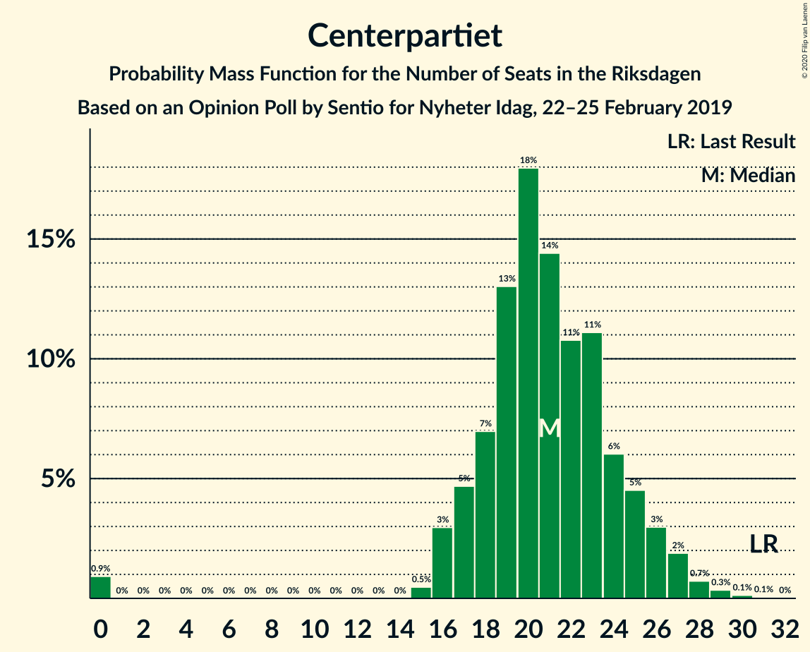
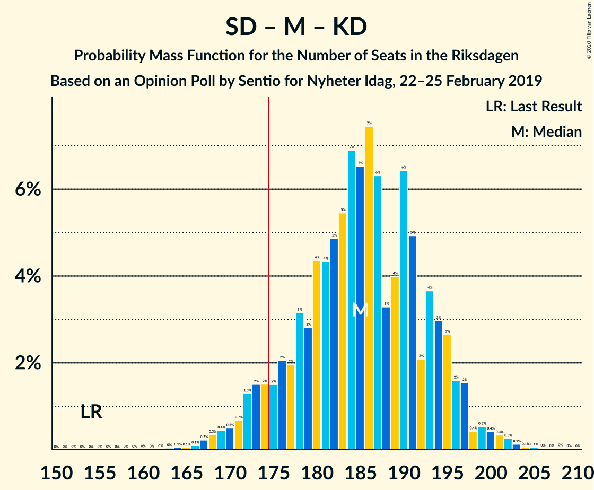
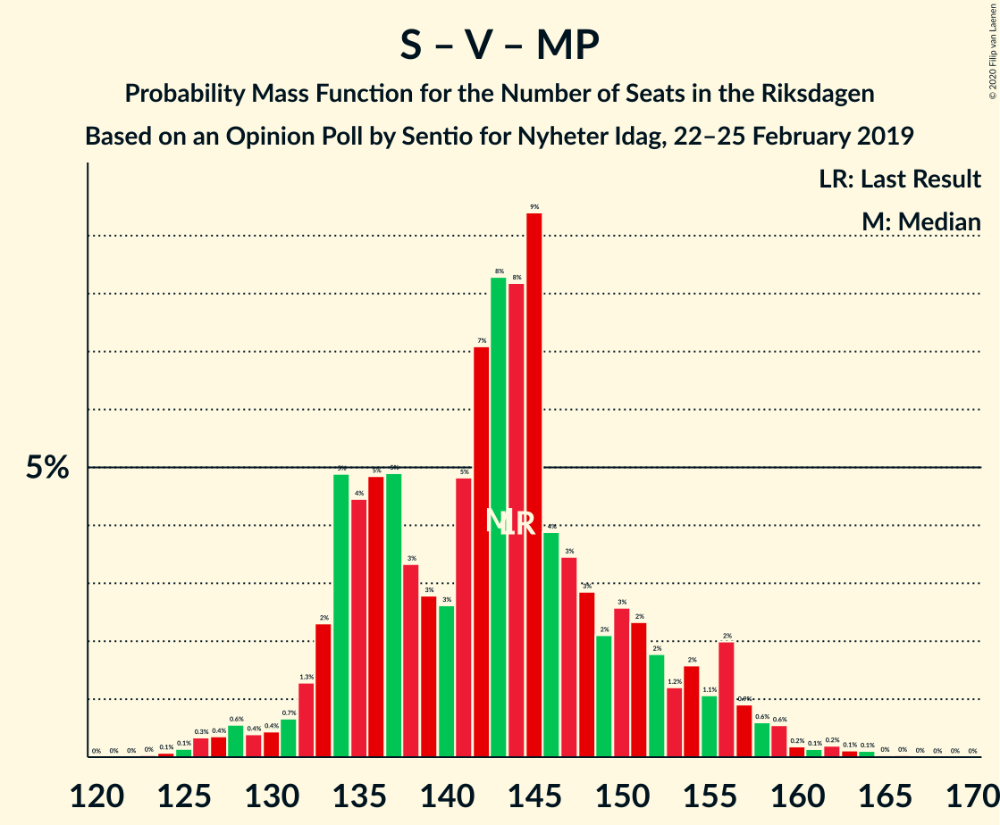
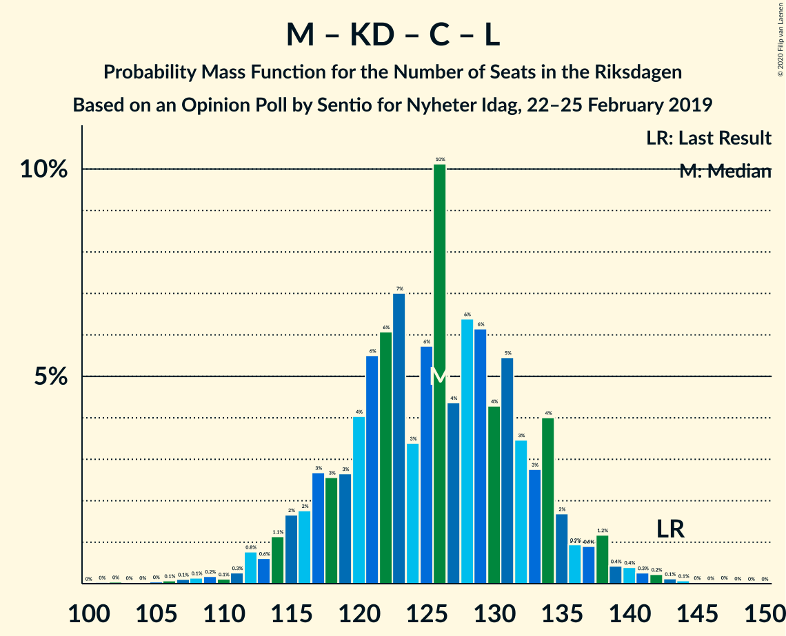

# Opinion Poll by Sentio for Nyheter Idag, 22–25 February 2019

<a href="#voting-intentions">Voting Intentions</a> | <a href="#seats">Seats</a> | <a href="#coalitions">Coalitions</a> | <a href="#technical-information">Technical Information</a>

## Voting Intentions

### Confidence Intervals

| Party | Last Result | Poll Result | 80% Confidence Interval | 90% Confidence Interval | 95% Confidence Interval | 99% Confidence Interval |
|:-----:|:-----------:|:-----------:|:-----------------------:|:-----------------------:|:-----------------------:|:-----------------------:|
| Sveriges socialdemokratiska arbetareparti | 28.3% | 26.5% | 24.8–28.3% |24.3–28.9% |23.9–29.3% |23.0–30.2% |
| Sverigedemokraterna | 17.5% | 21.4% | 19.8–23.1% |19.4–23.6% |19.0–24.1% |18.2–24.9% |
| Moderata samlingspartiet | 19.8% | 18.3% | 16.8–20.0% |16.4–20.4% |16.0–20.8% |15.3–21.6% |
| Vänsterpartiet | 8.0% | 10.5% | 9.3–11.8% |9.0–12.2% |8.7–12.6% |8.2–13.2% |
| Kristdemokraterna | 6.3% | 9.4% | 8.3–10.7% |8.0–11.1% |7.7–11.4% |7.2–12.0% |
| Centerpartiet | 8.6% | 5.5% | 4.7–6.5% |4.4–6.8% |4.3–7.1% |3.9–7.6% |
| Miljöpartiet de gröna | 4.4% | 3.4% | 2.8–4.3% |2.6–4.5% |2.4–4.7% |2.2–5.2% |
| Liberalerna | 5.5% | 2.6% | 2.1–3.4% |1.9–3.6% |1.8–3.8% |1.6–4.2% |

*Note:* The poll result column reflects the actual value used in the calculations. Published results may vary slightly, and in addition be rounded to fewer digits.

## Seats

### Confidence Intervals

| Party | Last Result | Median | 80% Confidence Interval | 90% Confidence Interval | 95% Confidence Interval | 99% Confidence Interval |
|:-----:|:-----------:|:------:|:-----------------------:|:-----------------------:|:-----------------------:|:-----------------------:|
| <a href="#sveriges-socialdemokratiska-arbetareparti">Sveriges socialdemokratiska arbetareparti</a> | 100 | 99 | 91–108 |91–108 |89–109 |86–113 |
| <a href="#sverigedemokraterna">Sverigedemokraterna</a> | 62 | 81 | 74–89 |73–89 |71–90 |69–94 |
| <a href="#moderata-samlingspartiet">Moderata samlingspartiet</a> | 70 | 70 | 63–76 |62–77 |61–80 |58–81 |
| <a href="#vänsterpartiet">Vänsterpartiet</a> | 28 | 38 | 36–45 |34–46 |33–48 |31–49 |
| <a href="#kristdemokraterna">Kristdemokraterna</a> | 22 | 36 | 32–39 |30–41 |29–42 |27–45 |
| <a href="#centerpartiet">Centerpartiet</a> | 31 | 21 | 18–24 |17–26 |16–27 |0–29 |
| <a href="#miljöpartiet-de-gröna">Miljöpartiet de gröna</a> | 16 | 0 | 0–15 |0–17 |0–17 |0–19 |
| <a href="#liberalerna">Liberalerna</a> | 20 | 0 | 0 |0 |0 |0–16 |

### Sveriges socialdemokratiska arbetareparti

*For a full overview of the results for this party, see the [Sveriges socialdemokratiska arbetareparti](party-sverigessocialdemokratiskaarbetareparti.html) page.*

| Number of Seats | Probability | Accumulated | Special Marks |
|:---------------:|:-----------:|:-----------:|:-------------:|
| 82 | 0.1% | 100% |  |
| 83 | 0% | 99.9% |  |
| 84 | 0.1% | 99.8% |  |
| 85 | 0.1% | 99.7% |  |
| 86 | 0.1% | 99.6% |  |
| 87 | 0.9% | 99.5% |  |
| 88 | 0.3% | 98.6% |  |
| 89 | 0.8% | 98% |  |
| 90 | 0.6% | 97% |  |
| 91 | 7% | 97% |  |
| 92 | 1.4% | 90% |  |
| 93 | 1.2% | 88% |  |
| 94 | 3% | 87% |  |
| 95 | 6% | 84% |  |
| 96 | 10% | 78% |  |
| 97 | 7% | 69% |  |
| 98 | 10% | 62% |  |
| 99 | 10% | 52% | Median |
| 100 | 6% | 42% | Last Result |
| 101 | 3% | 36% |  |
| 102 | 3% | 33% |  |
| 103 | 4% | 30% |  |
| 104 | 2% | 26% |  |
| 105 | 2% | 24% |  |
| 106 | 12% | 23% |  |
| 107 | 0.7% | 11% |  |
| 108 | 5% | 10% |  |
| 109 | 2% | 5% |  |
| 110 | 0.3% | 2% |  |
| 111 | 0.9% | 2% |  |
| 112 | 0.5% | 1.3% |  |
| 113 | 0.4% | 0.8% |  |
| 114 | 0% | 0.4% |  |
| 115 | 0.2% | 0.4% |  |
| 116 | 0.1% | 0.2% |  |
| 117 | 0% | 0.1% |  |
| 118 | 0% | 0.1% |  |
| 119 | 0% | 0% |  |

### Sverigedemokraterna

*For a full overview of the results for this party, see the [Sverigedemokraterna](party-sverigedemokraterna.html) page.*

| Number of Seats | Probability | Accumulated | Special Marks |
|:---------------:|:-----------:|:-----------:|:-------------:|
| 62 | 0% | 100% | Last Result |
| 63 | 0% | 100% |  |
| 64 | 0% | 100% |  |
| 65 | 0% | 100% |  |
| 66 | 0.1% | 99.9% |  |
| 67 | 0.2% | 99.9% |  |
| 68 | 0.1% | 99.7% |  |
| 69 | 0.4% | 99.6% |  |
| 70 | 0.4% | 99.1% |  |
| 71 | 2% | 98.7% |  |
| 72 | 1.0% | 97% |  |
| 73 | 4% | 96% |  |
| 74 | 2% | 92% |  |
| 75 | 3% | 90% |  |
| 76 | 7% | 86% |  |
| 77 | 5% | 80% |  |
| 78 | 3% | 75% |  |
| 79 | 7% | 72% |  |
| 80 | 5% | 65% |  |
| 81 | 25% | 60% | Median |
| 82 | 8% | 35% |  |
| 83 | 2% | 27% |  |
| 84 | 4% | 25% |  |
| 85 | 0.7% | 21% |  |
| 86 | 1.5% | 21% |  |
| 87 | 6% | 19% |  |
| 88 | 1.1% | 13% |  |
| 89 | 9% | 12% |  |
| 90 | 1.2% | 3% |  |
| 91 | 0.3% | 1.5% |  |
| 92 | 0.3% | 1.2% |  |
| 93 | 0.3% | 0.9% |  |
| 94 | 0.2% | 0.6% |  |
| 95 | 0.3% | 0.4% |  |
| 96 | 0.1% | 0.1% |  |
| 97 | 0% | 0.1% |  |
| 98 | 0% | 0% |  |

### Moderata samlingspartiet

*For a full overview of the results for this party, see the [Moderata samlingspartiet](party-moderatasamlingspartiet.html) page.*

| Number of Seats | Probability | Accumulated | Special Marks |
|:---------------:|:-----------:|:-----------:|:-------------:|
| 54 | 0% | 100% |  |
| 55 | 0% | 99.9% |  |
| 56 | 0.1% | 99.9% |  |
| 57 | 0.1% | 99.8% |  |
| 58 | 0.4% | 99.7% |  |
| 59 | 0.5% | 99.3% |  |
| 60 | 1.1% | 98.8% |  |
| 61 | 0.8% | 98% |  |
| 62 | 6% | 97% |  |
| 63 | 5% | 91% |  |
| 64 | 1.3% | 86% |  |
| 65 | 5% | 84% |  |
| 66 | 3% | 79% |  |
| 67 | 5% | 76% |  |
| 68 | 16% | 72% |  |
| 69 | 4% | 56% |  |
| 70 | 4% | 52% | Last Result, Median |
| 71 | 18% | 48% |  |
| 72 | 2% | 30% |  |
| 73 | 11% | 28% |  |
| 74 | 2% | 17% |  |
| 75 | 5% | 15% |  |
| 76 | 4% | 10% |  |
| 77 | 3% | 6% |  |
| 78 | 0.5% | 3% |  |
| 79 | 0.3% | 3% |  |
| 80 | 2% | 3% |  |
| 81 | 0.4% | 0.9% |  |
| 82 | 0.3% | 0.5% |  |
| 83 | 0.1% | 0.1% |  |
| 84 | 0% | 0.1% |  |
| 85 | 0% | 0% |  |

### Vänsterpartiet

*For a full overview of the results for this party, see the [Vänsterpartiet](party-vänsterpartiet.html) page.*

| Number of Seats | Probability | Accumulated | Special Marks |
|:---------------:|:-----------:|:-----------:|:-------------:|
| 28 | 0.1% | 100% | Last Result |
| 29 | 0% | 99.9% |  |
| 30 | 0% | 99.9% |  |
| 31 | 0.4% | 99.8% |  |
| 32 | 0.5% | 99.4% |  |
| 33 | 4% | 99.0% |  |
| 34 | 2% | 95% |  |
| 35 | 3% | 93% |  |
| 36 | 7% | 91% |  |
| 37 | 14% | 83% |  |
| 38 | 23% | 69% | Median |
| 39 | 16% | 46% |  |
| 40 | 4% | 30% |  |
| 41 | 2% | 26% |  |
| 42 | 5% | 24% |  |
| 43 | 6% | 19% |  |
| 44 | 3% | 13% |  |
| 45 | 3% | 10% |  |
| 46 | 3% | 7% |  |
| 47 | 2% | 5% |  |
| 48 | 1.2% | 3% |  |
| 49 | 2% | 2% |  |
| 50 | 0.2% | 0.3% |  |
| 51 | 0.1% | 0.2% |  |
| 52 | 0% | 0.1% |  |
| 53 | 0% | 0% |  |

### Kristdemokraterna

*For a full overview of the results for this party, see the [Kristdemokraterna](party-kristdemokraterna.html) page.*

| Number of Seats | Probability | Accumulated | Special Marks |
|:---------------:|:-----------:|:-----------:|:-------------:|
| 22 | 0% | 100% | Last Result |
| 23 | 0% | 100% |  |
| 24 | 0% | 100% |  |
| 25 | 0.1% | 100% |  |
| 26 | 0.4% | 99.9% |  |
| 27 | 0.4% | 99.5% |  |
| 28 | 1.1% | 99.1% |  |
| 29 | 2% | 98% |  |
| 30 | 2% | 96% |  |
| 31 | 3% | 94% |  |
| 32 | 6% | 91% |  |
| 33 | 2% | 85% |  |
| 34 | 6% | 83% |  |
| 35 | 13% | 77% |  |
| 36 | 32% | 64% | Median |
| 37 | 7% | 32% |  |
| 38 | 4% | 25% |  |
| 39 | 11% | 20% |  |
| 40 | 3% | 9% |  |
| 41 | 3% | 6% |  |
| 42 | 2% | 3% |  |
| 43 | 0.4% | 1.4% |  |
| 44 | 0.2% | 1.0% |  |
| 45 | 0.4% | 0.8% |  |
| 46 | 0.1% | 0.4% |  |
| 47 | 0.2% | 0.3% |  |
| 48 | 0.1% | 0.1% |  |
| 49 | 0% | 0% |  |

### Centerpartiet

*For a full overview of the results for this party, see the [Centerpartiet](party-centerpartiet.html) page.*

| Number of Seats | Probability | Accumulated | Special Marks |
|:---------------:|:-----------:|:-----------:|:-------------:|
| 0 | 1.0% | 100% |  |
| 1 | 0% | 99.0% |  |
| 2 | 0% | 99.0% |  |
| 3 | 0% | 99.0% |  |
| 4 | 0% | 99.0% |  |
| 5 | 0% | 99.0% |  |
| 6 | 0% | 99.0% |  |
| 7 | 0% | 99.0% |  |
| 8 | 0% | 99.0% |  |
| 9 | 0% | 99.0% |  |
| 10 | 0% | 99.0% |  |
| 11 | 0% | 99.0% |  |
| 12 | 0% | 99.0% |  |
| 13 | 0% | 99.0% |  |
| 14 | 0% | 99.0% |  |
| 15 | 0.4% | 99.0% |  |
| 16 | 2% | 98.6% |  |
| 17 | 4% | 96% |  |
| 18 | 3% | 92% |  |
| 19 | 13% | 88% |  |
| 20 | 22% | 75% |  |
| 21 | 27% | 53% | Median |
| 22 | 8% | 27% |  |
| 23 | 7% | 19% |  |
| 24 | 4% | 12% |  |
| 25 | 1.4% | 8% |  |
| 26 | 4% | 7% |  |
| 27 | 2% | 3% |  |
| 28 | 0.6% | 1.3% |  |
| 29 | 0.6% | 0.7% |  |
| 30 | 0.1% | 0.2% |  |
| 31 | 0% | 0% | Last Result |

### Miljöpartiet de gröna

*For a full overview of the results for this party, see the [Miljöpartiet de gröna](party-miljöpartietdegröna.html) page.*

| Number of Seats | Probability | Accumulated | Special Marks |
|:---------------:|:-----------:|:-----------:|:-------------:|
| 0 | 80% | 100% | Median |
| 1 | 0% | 20% |  |
| 2 | 0% | 20% |  |
| 3 | 0% | 20% |  |
| 4 | 0% | 20% |  |
| 5 | 0% | 20% |  |
| 6 | 0% | 20% |  |
| 7 | 0% | 20% |  |
| 8 | 0% | 20% |  |
| 9 | 0% | 20% |  |
| 10 | 0% | 20% |  |
| 11 | 0% | 20% |  |
| 12 | 0% | 20% |  |
| 13 | 0% | 20% |  |
| 14 | 0% | 20% |  |
| 15 | 10% | 20% |  |
| 16 | 4% | 10% | Last Result |
| 17 | 4% | 6% |  |
| 18 | 0.9% | 1.5% |  |
| 19 | 0.5% | 0.6% |  |
| 20 | 0.1% | 0.2% |  |
| 21 | 0% | 0.1% |  |
| 22 | 0% | 0% |  |

### Liberalerna

*For a full overview of the results for this party, see the [Liberalerna](party-liberalerna.html) page.*

| Number of Seats | Probability | Accumulated | Special Marks |
|:---------------:|:-----------:|:-----------:|:-------------:|
| 0 | 99.1% | 100% | Median |
| 1 | 0% | 0.9% |  |
| 2 | 0% | 0.9% |  |
| 3 | 0% | 0.9% |  |
| 4 | 0% | 0.9% |  |
| 5 | 0% | 0.9% |  |
| 6 | 0% | 0.9% |  |
| 7 | 0% | 0.9% |  |
| 8 | 0% | 0.9% |  |
| 9 | 0% | 0.9% |  |
| 10 | 0% | 0.9% |  |
| 11 | 0% | 0.9% |  |
| 12 | 0% | 0.9% |  |
| 13 | 0% | 0.9% |  |
| 14 | 0% | 0.9% |  |
| 15 | 0.4% | 0.9% |  |
| 16 | 0.4% | 0.5% |  |
| 17 | 0.1% | 0.1% |  |
| 18 | 0% | 0% |  |
| 19 | 0% | 0% |  |
| 20 | 0% | 0% | Last Result |

## Coalitions

### Confidence Intervals

| Coalition | Last Result | Median | Majority? | 80% Confidence Interval | 90% Confidence Interval | 95% Confidence Interval | 99% Confidence Interval |
|:---------:|:-----------:|:------:|:---------:|:-----------------------:|:-----------------------:|:-----------------------:|:-----------------------:|
| Sveriges socialdemokratiska arbetareparti – Moderata samlingspartiet – Centerpartiet | 201 | 191 | 98% | 182–198 | 180–199 | 176–202 | 171–206 |
| Sverigedemokraterna – Moderata samlingspartiet – Kristdemokraterna | 154 | 186 | 96% | 177–195 | 176–196 | 172–197 | 168–201 |
| Sveriges socialdemokratiska arbetareparti – Moderata samlingspartiet | 170 | 171 | 16% | 161–176 | 160–180 | 156–180 | 152–184 |
| Sveriges socialdemokratiska arbetareparti – Vänsterpartiet – Centerpartiet – Miljöpartiet de gröna – Liberalerna | 195 | 163 | 4% | 154–172 | 153–173 | 152–177 | 148–181 |
| Sverigedemokraterna – Moderata samlingspartiet | 132 | 150 | 0% | 142–160 | 140–160 | 138–161 | 134–165 |
| Sveriges socialdemokratiska arbetareparti – Vänsterpartiet – Miljöpartiet de gröna | 144 | 142 | 0% | 134–151 | 133–154 | 132–157 | 127–161 |
| Sveriges socialdemokratiska arbetareparti – Vänsterpartiet | 128 | 138 | 0% | 130–147 | 130–150 | 127–151 | 124–156 |
| Moderata samlingspartiet – Kristdemokraterna – Centerpartiet – Liberalerna | 143 | 126 | 0% | 120–134 | 117–136 | 114–138 | 104–142 |
| Moderata samlingspartiet – Kristdemokraterna – Centerpartiet | 123 | 126 | 0% | 119–133 | 117–135 | 114–138 | 103–141 |
| Sveriges socialdemokratiska arbetareparti – Centerpartiet – Miljöpartiet de gröna – Liberalerna | 167 | 123 | 0% | 116–134 | 114–135 | 111–136 | 108–143 |
| Sveriges socialdemokratiska arbetareparti – Miljöpartiet de gröna | 116 | 102 | 0% | 96–112 | 94–113 | 91–117 | 87–121 |
| Moderata samlingspartiet – Centerpartiet – Liberalerna | 121 | 91 | 0% | 84–97 | 82–99 | 79–100 | 69–104 |
| Moderata samlingspartiet – Centerpartiet | 101 | 91 | 0% | 84–97 | 82–99 | 79–100 | 69–103 |

### Sveriges socialdemokratiska arbetareparti – Moderata samlingspartiet – Centerpartiet

| Number of Seats | Probability | Accumulated | Special Marks |
|:---------------:|:-----------:|:-----------:|:-------------:|
| 167 | 0% | 100% |  |
| 168 | 0% | 99.9% |  |
| 169 | 0.1% | 99.9% |  |
| 170 | 0.1% | 99.8% |  |
| 171 | 0.5% | 99.7% |  |
| 172 | 0.1% | 99.3% |  |
| 173 | 0.5% | 99.2% |  |
| 174 | 0.4% | 98.6% |  |
| 175 | 0.7% | 98% | Majority |
| 176 | 0.4% | 98% |  |
| 177 | 0.5% | 97% |  |
| 178 | 0.7% | 97% |  |
| 179 | 0.5% | 96% |  |
| 180 | 0.9% | 95% |  |
| 181 | 3% | 94% |  |
| 182 | 1.2% | 91% |  |
| 183 | 13% | 90% |  |
| 184 | 4% | 77% |  |
| 185 | 3% | 73% |  |
| 186 | 2% | 70% |  |
| 187 | 10% | 68% |  |
| 188 | 2% | 58% |  |
| 189 | 2% | 56% |  |
| 190 | 1.0% | 54% | Median |
| 191 | 12% | 53% |  |
| 192 | 5% | 41% |  |
| 193 | 2% | 36% |  |
| 194 | 0.8% | 34% |  |
| 195 | 19% | 33% |  |
| 196 | 3% | 14% |  |
| 197 | 1.1% | 12% |  |
| 198 | 0.9% | 11% |  |
| 199 | 5% | 10% |  |
| 200 | 0.8% | 4% |  |
| 201 | 0.8% | 4% | Last Result |
| 202 | 0.7% | 3% |  |
| 203 | 0.9% | 2% |  |
| 204 | 0.2% | 1.2% |  |
| 205 | 0.4% | 1.0% |  |
| 206 | 0.5% | 0.6% |  |
| 207 | 0% | 0.2% |  |
| 208 | 0.1% | 0.1% |  |
| 209 | 0% | 0.1% |  |
| 210 | 0% | 0% |  |

### Sverigedemokraterna – Moderata samlingspartiet – Kristdemokraterna

| Number of Seats | Probability | Accumulated | Special Marks |
|:---------------:|:-----------:|:-----------:|:-------------:|
| 154 | 0% | 100% | Last Result |
| 155 | 0% | 100% |  |
| 156 | 0% | 100% |  |
| 157 | 0% | 100% |  |
| 158 | 0% | 100% |  |
| 159 | 0% | 100% |  |
| 160 | 0% | 100% |  |
| 161 | 0% | 100% |  |
| 162 | 0% | 99.9% |  |
| 163 | 0% | 99.9% |  |
| 164 | 0% | 99.9% |  |
| 165 | 0.1% | 99.9% |  |
| 166 | 0% | 99.8% |  |
| 167 | 0.3% | 99.8% |  |
| 168 | 0.2% | 99.5% |  |
| 169 | 1.0% | 99.4% |  |
| 170 | 0.2% | 98% |  |
| 171 | 0.6% | 98% |  |
| 172 | 1.0% | 98% |  |
| 173 | 0.2% | 97% |  |
| 174 | 0.3% | 96% |  |
| 175 | 0.8% | 96% | Majority |
| 176 | 4% | 95% |  |
| 177 | 2% | 91% |  |
| 178 | 5% | 90% |  |
| 179 | 0.8% | 84% |  |
| 180 | 3% | 84% |  |
| 181 | 0.7% | 81% |  |
| 182 | 7% | 80% |  |
| 183 | 9% | 73% |  |
| 184 | 0.3% | 64% |  |
| 185 | 13% | 64% |  |
| 186 | 1.3% | 51% |  |
| 187 | 6% | 49% | Median |
| 188 | 7% | 43% |  |
| 189 | 0.9% | 36% |  |
| 190 | 7% | 35% |  |
| 191 | 0.9% | 29% |  |
| 192 | 0.9% | 28% |  |
| 193 | 13% | 27% |  |
| 194 | 0.1% | 14% |  |
| 195 | 9% | 14% |  |
| 196 | 0.6% | 5% |  |
| 197 | 3% | 5% |  |
| 198 | 0.6% | 2% |  |
| 199 | 0.4% | 1.3% |  |
| 200 | 0.1% | 0.9% |  |
| 201 | 0.3% | 0.8% |  |
| 202 | 0% | 0.5% |  |
| 203 | 0.4% | 0.5% |  |
| 204 | 0% | 0.1% |  |
| 205 | 0% | 0.1% |  |
| 206 | 0% | 0.1% |  |
| 207 | 0% | 0% |  |

### Sveriges socialdemokratiska arbetareparti – Moderata samlingspartiet

| Number of Seats | Probability | Accumulated | Special Marks |
|:---------------:|:-----------:|:-----------:|:-------------:|
| 147 | 0% | 100% |  |
| 148 | 0% | 99.9% |  |
| 149 | 0% | 99.9% |  |
| 150 | 0% | 99.9% |  |
| 151 | 0.1% | 99.9% |  |
| 152 | 0.5% | 99.8% |  |
| 153 | 0.7% | 99.3% |  |
| 154 | 0.3% | 98.6% |  |
| 155 | 0.4% | 98% |  |
| 156 | 0.9% | 98% |  |
| 157 | 0.5% | 97% |  |
| 158 | 0.5% | 97% |  |
| 159 | 1.1% | 96% |  |
| 160 | 5% | 95% |  |
| 161 | 0.9% | 91% |  |
| 162 | 10% | 90% |  |
| 163 | 8% | 80% |  |
| 164 | 1.1% | 72% |  |
| 165 | 2% | 71% |  |
| 166 | 0.5% | 69% |  |
| 167 | 12% | 68% |  |
| 168 | 2% | 57% |  |
| 169 | 1.2% | 54% | Median |
| 170 | 3% | 53% | Last Result |
| 171 | 6% | 50% |  |
| 172 | 12% | 44% |  |
| 173 | 3% | 33% |  |
| 174 | 14% | 30% |  |
| 175 | 6% | 16% | Majority |
| 176 | 0.7% | 10% |  |
| 177 | 2% | 10% |  |
| 178 | 0.8% | 7% |  |
| 179 | 1.4% | 7% |  |
| 180 | 3% | 5% |  |
| 181 | 0.4% | 2% |  |
| 182 | 0.8% | 2% |  |
| 183 | 0.5% | 1.2% |  |
| 184 | 0.3% | 0.7% |  |
| 185 | 0.1% | 0.4% |  |
| 186 | 0% | 0.3% |  |
| 187 | 0% | 0.3% |  |
| 188 | 0.1% | 0.2% |  |
| 189 | 0.1% | 0.1% |  |
| 190 | 0% | 0.1% |  |
| 191 | 0% | 0% |  |

### Sveriges socialdemokratiska arbetareparti – Vänsterpartiet – Centerpartiet – Miljöpartiet de gröna – Liberalerna

| Number of Seats | Probability | Accumulated | Special Marks |
|:---------------:|:-----------:|:-----------:|:-------------:|
| 143 | 0% | 100% |  |
| 144 | 0% | 99.9% |  |
| 145 | 0% | 99.9% |  |
| 146 | 0.4% | 99.9% |  |
| 147 | 0% | 99.5% |  |
| 148 | 0.4% | 99.5% |  |
| 149 | 0.1% | 99.2% |  |
| 150 | 0.4% | 99.1% |  |
| 151 | 0.6% | 98.7% |  |
| 152 | 3% | 98% |  |
| 153 | 0.6% | 95% |  |
| 154 | 9% | 95% |  |
| 155 | 0.1% | 86% |  |
| 156 | 13% | 86% |  |
| 157 | 0.9% | 73% |  |
| 158 | 1.0% | 72% | Median |
| 159 | 7% | 71% |  |
| 160 | 0.9% | 65% |  |
| 161 | 7% | 64% |  |
| 162 | 6% | 57% |  |
| 163 | 1.3% | 51% |  |
| 164 | 13% | 49% |  |
| 165 | 0.3% | 36% |  |
| 166 | 9% | 36% |  |
| 167 | 7% | 26% |  |
| 168 | 0.7% | 20% |  |
| 169 | 3% | 19% |  |
| 170 | 0.8% | 16% |  |
| 171 | 5% | 16% |  |
| 172 | 2% | 10% |  |
| 173 | 4% | 9% |  |
| 174 | 0.8% | 5% |  |
| 175 | 0.3% | 4% | Majority |
| 176 | 0.2% | 4% |  |
| 177 | 1.0% | 3% |  |
| 178 | 0.6% | 2% |  |
| 179 | 0.2% | 2% |  |
| 180 | 1.0% | 2% |  |
| 181 | 0.1% | 0.6% |  |
| 182 | 0.3% | 0.5% |  |
| 183 | 0% | 0.2% |  |
| 184 | 0.1% | 0.2% |  |
| 185 | 0% | 0.1% |  |
| 186 | 0% | 0.1% |  |
| 187 | 0% | 0.1% |  |
| 188 | 0% | 0.1% |  |
| 189 | 0% | 0% |  |
| 190 | 0% | 0% |  |
| 191 | 0% | 0% |  |
| 192 | 0% | 0% |  |
| 193 | 0% | 0% |  |
| 194 | 0% | 0% |  |
| 195 | 0% | 0% | Last Result |

### Sverigedemokraterna – Moderata samlingspartiet

| Number of Seats | Probability | Accumulated | Special Marks |
|:---------------:|:-----------:|:-----------:|:-------------:|
| 128 | 0% | 100% |  |
| 129 | 0% | 99.9% |  |
| 130 | 0% | 99.9% |  |
| 131 | 0.1% | 99.9% |  |
| 132 | 0.1% | 99.8% | Last Result |
| 133 | 0.1% | 99.7% |  |
| 134 | 0.3% | 99.6% |  |
| 135 | 0.5% | 99.4% |  |
| 136 | 0.3% | 98.8% |  |
| 137 | 1.0% | 98.5% |  |
| 138 | 0.7% | 98% |  |
| 139 | 0.8% | 97% |  |
| 140 | 2% | 96% |  |
| 141 | 2% | 94% |  |
| 142 | 5% | 92% |  |
| 143 | 1.0% | 87% |  |
| 144 | 6% | 86% |  |
| 145 | 1.5% | 80% |  |
| 146 | 4% | 79% |  |
| 147 | 7% | 75% |  |
| 148 | 4% | 67% |  |
| 149 | 13% | 64% |  |
| 150 | 5% | 51% |  |
| 151 | 2% | 45% | Median |
| 152 | 7% | 43% |  |
| 153 | 1.3% | 36% |  |
| 154 | 9% | 35% |  |
| 155 | 1.4% | 26% |  |
| 156 | 6% | 24% |  |
| 157 | 0.7% | 18% |  |
| 158 | 3% | 17% |  |
| 159 | 1.1% | 14% |  |
| 160 | 9% | 13% |  |
| 161 | 2% | 4% |  |
| 162 | 0.4% | 2% |  |
| 163 | 0.1% | 2% |  |
| 164 | 0.4% | 1.4% |  |
| 165 | 0.7% | 1.0% |  |
| 166 | 0% | 0.3% |  |
| 167 | 0.2% | 0.3% |  |
| 168 | 0% | 0.1% |  |
| 169 | 0% | 0.1% |  |
| 170 | 0% | 0.1% |  |
| 171 | 0% | 0% |  |

### Sveriges socialdemokratiska arbetareparti – Vänsterpartiet – Miljöpartiet de gröna

| Number of Seats | Probability | Accumulated | Special Marks |
|:---------------:|:-----------:|:-----------:|:-------------:|
| 123 | 0% | 100% |  |
| 124 | 0% | 99.9% |  |
| 125 | 0.2% | 99.9% |  |
| 126 | 0.1% | 99.7% |  |
| 127 | 0.8% | 99.6% |  |
| 128 | 0.2% | 98.8% |  |
| 129 | 0.4% | 98.6% |  |
| 130 | 0.2% | 98% |  |
| 131 | 0.2% | 98% |  |
| 132 | 1.0% | 98% |  |
| 133 | 5% | 97% |  |
| 134 | 9% | 92% |  |
| 135 | 3% | 83% |  |
| 136 | 3% | 80% |  |
| 137 | 10% | 78% | Median |
| 138 | 2% | 68% |  |
| 139 | 5% | 66% |  |
| 140 | 2% | 61% |  |
| 141 | 7% | 59% |  |
| 142 | 2% | 52% |  |
| 143 | 14% | 50% |  |
| 144 | 3% | 36% | Last Result |
| 145 | 7% | 33% |  |
| 146 | 6% | 26% |  |
| 147 | 2% | 20% |  |
| 148 | 0.9% | 18% |  |
| 149 | 1.0% | 17% |  |
| 150 | 5% | 16% |  |
| 151 | 4% | 11% |  |
| 152 | 0.6% | 7% |  |
| 153 | 0.7% | 6% |  |
| 154 | 1.2% | 6% |  |
| 155 | 0.7% | 4% |  |
| 156 | 0.9% | 4% |  |
| 157 | 0.5% | 3% |  |
| 158 | 0.9% | 2% |  |
| 159 | 0.2% | 1.2% |  |
| 160 | 0.5% | 1.0% |  |
| 161 | 0.2% | 0.5% |  |
| 162 | 0.1% | 0.3% |  |
| 163 | 0.1% | 0.3% |  |
| 164 | 0.1% | 0.2% |  |
| 165 | 0% | 0.1% |  |
| 166 | 0% | 0.1% |  |
| 167 | 0% | 0% |  |

### Sveriges socialdemokratiska arbetareparti – Vänsterpartiet

| Number of Seats | Probability | Accumulated | Special Marks |
|:---------------:|:-----------:|:-----------:|:-------------:|
| 120 | 0% | 100% |  |
| 121 | 0.1% | 99.9% |  |
| 122 | 0.1% | 99.8% |  |
| 123 | 0.2% | 99.8% |  |
| 124 | 0.8% | 99.6% |  |
| 125 | 0.3% | 98.8% |  |
| 126 | 0.4% | 98% |  |
| 127 | 0.9% | 98% |  |
| 128 | 0.3% | 97% | Last Result |
| 129 | 0.6% | 97% |  |
| 130 | 6% | 96% |  |
| 131 | 4% | 90% |  |
| 132 | 1.1% | 86% |  |
| 133 | 5% | 85% |  |
| 134 | 13% | 80% |  |
| 135 | 3% | 67% |  |
| 136 | 3% | 64% |  |
| 137 | 10% | 62% | Median |
| 138 | 3% | 52% |  |
| 139 | 5% | 49% |  |
| 140 | 3% | 44% |  |
| 141 | 7% | 41% |  |
| 142 | 2% | 34% |  |
| 143 | 14% | 32% |  |
| 144 | 4% | 18% |  |
| 145 | 1.3% | 15% |  |
| 146 | 3% | 13% |  |
| 147 | 2% | 11% |  |
| 148 | 0.5% | 9% |  |
| 149 | 0.5% | 8% |  |
| 150 | 4% | 8% |  |
| 151 | 2% | 3% |  |
| 152 | 0.1% | 2% |  |
| 153 | 0.2% | 2% |  |
| 154 | 0.8% | 2% |  |
| 155 | 0.1% | 0.7% |  |
| 156 | 0.3% | 0.7% |  |
| 157 | 0% | 0.4% |  |
| 158 | 0.2% | 0.3% |  |
| 159 | 0% | 0.1% |  |
| 160 | 0% | 0.1% |  |
| 161 | 0% | 0.1% |  |
| 162 | 0% | 0% |  |

### Moderata samlingspartiet – Kristdemokraterna – Centerpartiet – Liberalerna

| Number of Seats | Probability | Accumulated | Special Marks |
|:---------------:|:-----------:|:-----------:|:-------------:|
| 101 | 0.2% | 100% |  |
| 102 | 0.2% | 99.8% |  |
| 103 | 0% | 99.5% |  |
| 104 | 0% | 99.5% |  |
| 105 | 0% | 99.5% |  |
| 106 | 0% | 99.5% |  |
| 107 | 0.1% | 99.4% |  |
| 108 | 0% | 99.3% |  |
| 109 | 0.1% | 99.3% |  |
| 110 | 0.1% | 99.2% |  |
| 111 | 0.2% | 99.1% |  |
| 112 | 0.5% | 98.9% |  |
| 113 | 0.6% | 98% |  |
| 114 | 0.3% | 98% |  |
| 115 | 1.1% | 97% |  |
| 116 | 1.1% | 96% |  |
| 117 | 0.3% | 95% |  |
| 118 | 1.0% | 95% |  |
| 119 | 4% | 94% |  |
| 120 | 6% | 90% |  |
| 121 | 8% | 84% |  |
| 122 | 2% | 76% |  |
| 123 | 6% | 74% |  |
| 124 | 2% | 69% |  |
| 125 | 12% | 67% |  |
| 126 | 10% | 55% |  |
| 127 | 1.0% | 45% | Median |
| 128 | 11% | 44% |  |
| 129 | 5% | 33% |  |
| 130 | 2% | 28% |  |
| 131 | 10% | 26% |  |
| 132 | 1.4% | 16% |  |
| 133 | 4% | 15% |  |
| 134 | 4% | 10% |  |
| 135 | 1.0% | 6% |  |
| 136 | 0.8% | 5% |  |
| 137 | 1.0% | 4% |  |
| 138 | 2% | 3% |  |
| 139 | 0.1% | 1.4% |  |
| 140 | 0.4% | 1.3% |  |
| 141 | 0.3% | 0.9% |  |
| 142 | 0.3% | 0.6% |  |
| 143 | 0.1% | 0.3% | Last Result |
| 144 | 0% | 0.1% |  |
| 145 | 0% | 0.1% |  |
| 146 | 0% | 0.1% |  |
| 147 | 0% | 0% |  |

### Moderata samlingspartiet – Kristdemokraterna – Centerpartiet

| Number of Seats | Probability | Accumulated | Special Marks |
|:---------------:|:-----------:|:-----------:|:-------------:|
| 99 | 0% | 100% |  |
| 100 | 0% | 99.9% |  |
| 101 | 0.2% | 99.9% |  |
| 102 | 0.2% | 99.8% |  |
| 103 | 0% | 99.5% |  |
| 104 | 0% | 99.5% |  |
| 105 | 0% | 99.5% |  |
| 106 | 0% | 99.4% |  |
| 107 | 0.1% | 99.4% |  |
| 108 | 0% | 99.3% |  |
| 109 | 0.1% | 99.2% |  |
| 110 | 0.1% | 99.1% |  |
| 111 | 0.2% | 99.0% |  |
| 112 | 0.6% | 98.9% |  |
| 113 | 0.7% | 98% |  |
| 114 | 0.4% | 98% |  |
| 115 | 1.1% | 97% |  |
| 116 | 1.1% | 96% |  |
| 117 | 0.3% | 95% |  |
| 118 | 1.1% | 95% |  |
| 119 | 4% | 94% |  |
| 120 | 6% | 90% |  |
| 121 | 8% | 83% |  |
| 122 | 2% | 76% |  |
| 123 | 6% | 74% | Last Result |
| 124 | 2% | 68% |  |
| 125 | 12% | 67% |  |
| 126 | 11% | 54% |  |
| 127 | 1.0% | 44% | Median |
| 128 | 11% | 43% |  |
| 129 | 5% | 32% |  |
| 130 | 2% | 27% |  |
| 131 | 10% | 25% |  |
| 132 | 1.4% | 15% |  |
| 133 | 4% | 14% |  |
| 134 | 4% | 10% |  |
| 135 | 0.9% | 5% |  |
| 136 | 0.8% | 5% |  |
| 137 | 0.8% | 4% |  |
| 138 | 2% | 3% |  |
| 139 | 0.1% | 1.1% |  |
| 140 | 0.4% | 1.0% |  |
| 141 | 0.1% | 0.6% |  |
| 142 | 0.3% | 0.5% |  |
| 143 | 0.1% | 0.2% |  |
| 144 | 0% | 0.1% |  |
| 145 | 0% | 0% |  |

### Sveriges socialdemokratiska arbetareparti – Centerpartiet – Miljöpartiet de gröna – Liberalerna

| Number of Seats | Probability | Accumulated | Special Marks |
|:---------------:|:-----------:|:-----------:|:-------------:|
| 98 | 0.1% | 100% |  |
| 99 | 0% | 99.9% |  |
| 100 | 0% | 99.9% |  |
| 101 | 0% | 99.9% |  |
| 102 | 0% | 99.9% |  |
| 103 | 0% | 99.9% |  |
| 104 | 0% | 99.9% |  |
| 105 | 0% | 99.8% |  |
| 106 | 0.1% | 99.8% |  |
| 107 | 0.1% | 99.8% |  |
| 108 | 0.3% | 99.6% |  |
| 109 | 0.2% | 99.3% |  |
| 110 | 0.6% | 99.1% |  |
| 111 | 2% | 98.6% |  |
| 112 | 1.3% | 97% |  |
| 113 | 0.5% | 96% |  |
| 114 | 1.0% | 95% |  |
| 115 | 3% | 94% |  |
| 116 | 10% | 91% |  |
| 117 | 0.3% | 82% |  |
| 118 | 14% | 81% |  |
| 119 | 0.4% | 67% |  |
| 120 | 8% | 67% | Median |
| 121 | 2% | 59% |  |
| 122 | 3% | 56% |  |
| 123 | 4% | 53% |  |
| 124 | 0.8% | 49% |  |
| 125 | 1.1% | 48% |  |
| 126 | 3% | 47% |  |
| 127 | 21% | 43% |  |
| 128 | 2% | 22% |  |
| 129 | 6% | 21% |  |
| 130 | 0.9% | 15% |  |
| 131 | 0.7% | 14% |  |
| 132 | 0.9% | 14% |  |
| 133 | 1.2% | 13% |  |
| 134 | 6% | 12% |  |
| 135 | 2% | 5% |  |
| 136 | 1.4% | 3% |  |
| 137 | 0.1% | 2% |  |
| 138 | 0.3% | 2% |  |
| 139 | 0.3% | 2% |  |
| 140 | 0.4% | 1.4% |  |
| 141 | 0.2% | 1.0% |  |
| 142 | 0.1% | 0.8% |  |
| 143 | 0.3% | 0.7% |  |
| 144 | 0.2% | 0.4% |  |
| 145 | 0.1% | 0.2% |  |
| 146 | 0% | 0.1% |  |
| 147 | 0% | 0.1% |  |
| 148 | 0% | 0.1% |  |
| 149 | 0.1% | 0.1% |  |
| 150 | 0% | 0% |  |
| 151 | 0% | 0% |  |
| 152 | 0% | 0% |  |
| 153 | 0% | 0% |  |
| 154 | 0% | 0% |  |
| 155 | 0% | 0% |  |
| 156 | 0% | 0% |  |
| 157 | 0% | 0% |  |
| 158 | 0% | 0% |  |
| 159 | 0% | 0% |  |
| 160 | 0% | 0% |  |
| 161 | 0% | 0% |  |
| 162 | 0% | 0% |  |
| 163 | 0% | 0% |  |
| 164 | 0% | 0% |  |
| 165 | 0% | 0% |  |
| 166 | 0% | 0% |  |
| 167 | 0% | 0% | Last Result |

### Sveriges socialdemokratiska arbetareparti – Miljöpartiet de gröna

| Number of Seats | Probability | Accumulated | Special Marks |
|:---------------:|:-----------:|:-----------:|:-------------:|
| 84 | 0% | 100% |  |
| 85 | 0% | 99.9% |  |
| 86 | 0.1% | 99.9% |  |
| 87 | 0.4% | 99.8% |  |
| 88 | 0.2% | 99.4% |  |
| 89 | 0.5% | 99.2% |  |
| 90 | 0.4% | 98.7% |  |
| 91 | 0.9% | 98% |  |
| 92 | 1.0% | 97% |  |
| 93 | 0.7% | 96% |  |
| 94 | 2% | 96% |  |
| 95 | 3% | 93% |  |
| 96 | 9% | 90% |  |
| 97 | 6% | 81% |  |
| 98 | 6% | 75% |  |
| 99 | 10% | 69% | Median |
| 100 | 6% | 59% |  |
| 101 | 3% | 54% |  |
| 102 | 2% | 51% |  |
| 103 | 3% | 48% |  |
| 104 | 2% | 45% |  |
| 105 | 2% | 43% |  |
| 106 | 18% | 42% |  |
| 107 | 0.8% | 23% |  |
| 108 | 6% | 23% |  |
| 109 | 2% | 17% |  |
| 110 | 0.8% | 14% |  |
| 111 | 1.4% | 14% |  |
| 112 | 4% | 12% |  |
| 113 | 4% | 9% |  |
| 114 | 0.8% | 5% |  |
| 115 | 0.7% | 4% |  |
| 116 | 0.8% | 3% | Last Result |
| 117 | 0.3% | 3% |  |
| 118 | 0.9% | 2% |  |
| 119 | 0.4% | 1.5% |  |
| 120 | 0.1% | 1.1% |  |
| 121 | 0.6% | 1.0% |  |
| 122 | 0% | 0.5% |  |
| 123 | 0.1% | 0.4% |  |
| 124 | 0.1% | 0.3% |  |
| 125 | 0% | 0.1% |  |
| 126 | 0.1% | 0.1% |  |
| 127 | 0% | 0% |  |

### Moderata samlingspartiet – Centerpartiet – Liberalerna

| Number of Seats | Probability | Accumulated | Special Marks |
|:---------------:|:-----------:|:-----------:|:-------------:|
| 66 | 0.2% | 100% |  |
| 67 | 0% | 99.8% |  |
| 68 | 0% | 99.8% |  |
| 69 | 0.3% | 99.8% |  |
| 70 | 0% | 99.5% |  |
| 71 | 0.1% | 99.4% |  |
| 72 | 0.1% | 99.3% |  |
| 73 | 0% | 99.3% |  |
| 74 | 0% | 99.2% |  |
| 75 | 0.2% | 99.2% |  |
| 76 | 0.3% | 98.9% |  |
| 77 | 0.2% | 98.6% |  |
| 78 | 0.4% | 98% |  |
| 79 | 0.6% | 98% |  |
| 80 | 0.4% | 97% |  |
| 81 | 0.5% | 97% |  |
| 82 | 2% | 96% |  |
| 83 | 3% | 95% |  |
| 84 | 6% | 91% |  |
| 85 | 5% | 85% |  |
| 86 | 4% | 80% |  |
| 87 | 0.9% | 76% |  |
| 88 | 4% | 75% |  |
| 89 | 16% | 71% |  |
| 90 | 1.4% | 55% |  |
| 91 | 11% | 54% | Median |
| 92 | 17% | 42% |  |
| 93 | 2% | 26% |  |
| 94 | 2% | 24% |  |
| 95 | 5% | 22% |  |
| 96 | 4% | 18% |  |
| 97 | 5% | 13% |  |
| 98 | 0.8% | 8% |  |
| 99 | 4% | 7% |  |
| 100 | 1.3% | 4% |  |
| 101 | 0.3% | 2% |  |
| 102 | 1.1% | 2% |  |
| 103 | 0.5% | 1.0% |  |
| 104 | 0.1% | 0.6% |  |
| 105 | 0.1% | 0.5% |  |
| 106 | 0.2% | 0.3% |  |
| 107 | 0% | 0.1% |  |
| 108 | 0% | 0.1% |  |
| 109 | 0% | 0.1% |  |
| 110 | 0% | 0.1% |  |
| 111 | 0% | 0% |  |
| 112 | 0% | 0% |  |
| 113 | 0% | 0% |  |
| 114 | 0% | 0% |  |
| 115 | 0% | 0% |  |
| 116 | 0% | 0% |  |
| 117 | 0% | 0% |  |
| 118 | 0% | 0% |  |
| 119 | 0% | 0% |  |
| 120 | 0% | 0% |  |
| 121 | 0% | 0% | Last Result |

### Moderata samlingspartiet – Centerpartiet

| Number of Seats | Probability | Accumulated | Special Marks |
|:---------------:|:-----------:|:-----------:|:-------------:|
| 63 | 0% | 100% |  |
| 64 | 0% | 99.9% |  |
| 65 | 0% | 99.9% |  |
| 66 | 0.2% | 99.9% |  |
| 67 | 0% | 99.7% |  |
| 68 | 0% | 99.7% |  |
| 69 | 0.3% | 99.7% |  |
| 70 | 0% | 99.5% |  |
| 71 | 0.1% | 99.4% |  |
| 72 | 0.1% | 99.3% |  |
| 73 | 0% | 99.2% |  |
| 74 | 0% | 99.2% |  |
| 75 | 0.2% | 99.1% |  |
| 76 | 0.3% | 98.9% |  |
| 77 | 0.2% | 98.6% |  |
| 78 | 0.4% | 98% |  |
| 79 | 0.6% | 98% |  |
| 80 | 0.4% | 97% |  |
| 81 | 0.7% | 97% |  |
| 82 | 2% | 96% |  |
| 83 | 3% | 95% |  |
| 84 | 6% | 91% |  |
| 85 | 5% | 85% |  |
| 86 | 4% | 80% |  |
| 87 | 1.1% | 76% |  |
| 88 | 4% | 75% |  |
| 89 | 16% | 70% |  |
| 90 | 1.4% | 54% |  |
| 91 | 11% | 53% | Median |
| 92 | 17% | 42% |  |
| 93 | 1.5% | 25% |  |
| 94 | 2% | 23% |  |
| 95 | 5% | 22% |  |
| 96 | 4% | 17% |  |
| 97 | 5% | 12% |  |
| 98 | 0.8% | 8% |  |
| 99 | 4% | 7% |  |
| 100 | 1.3% | 3% |  |
| 101 | 0.1% | 2% | Last Result |
| 102 | 0.9% | 2% |  |
| 103 | 0.4% | 0.7% |  |
| 104 | 0.1% | 0.4% |  |
| 105 | 0.1% | 0.3% |  |
| 106 | 0.2% | 0.2% |  |
| 107 | 0% | 0% |  |

## Technical Information

### Opinion Poll

+ **Polling firm:** Sentio
+ **Commissioner(s):** Nyheter Idag
+ **Fieldwork period:** 22–25 February 2019

### Calculations

+ **Sample size:** 1000
+ **Simulations done:** 131,072
+ **Error estimate:** 1.80%

