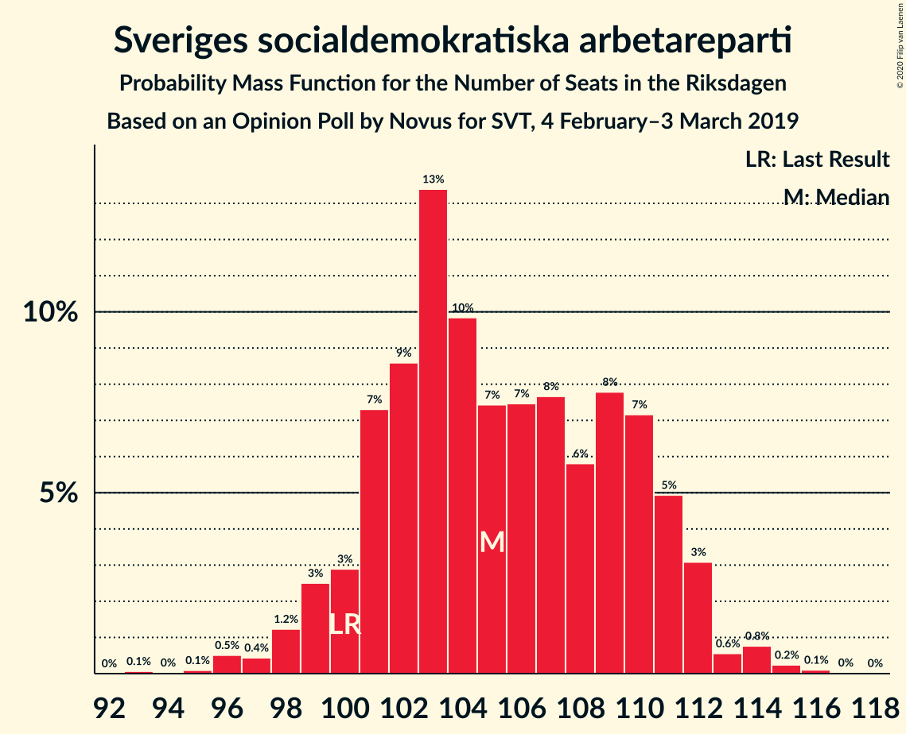
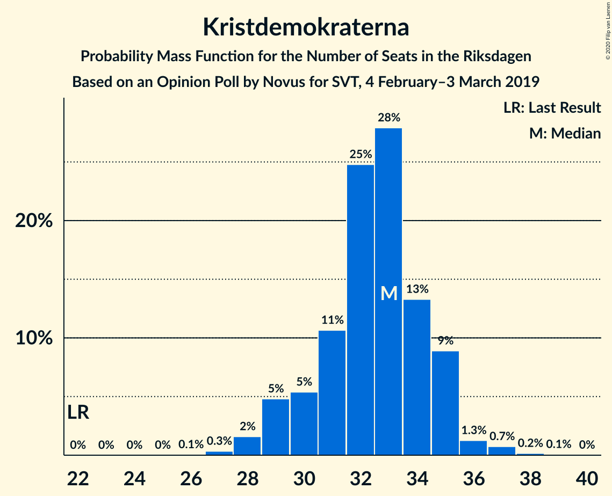
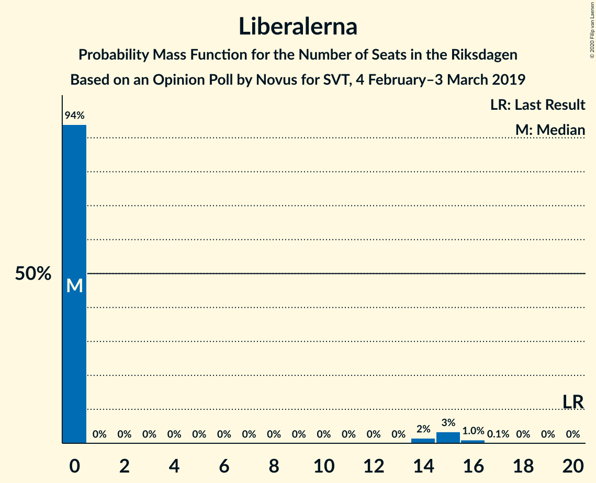
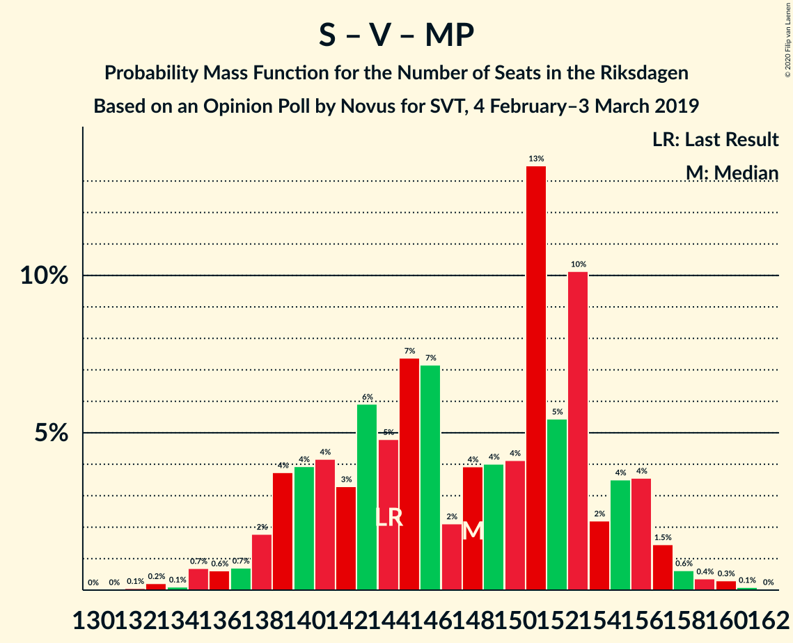
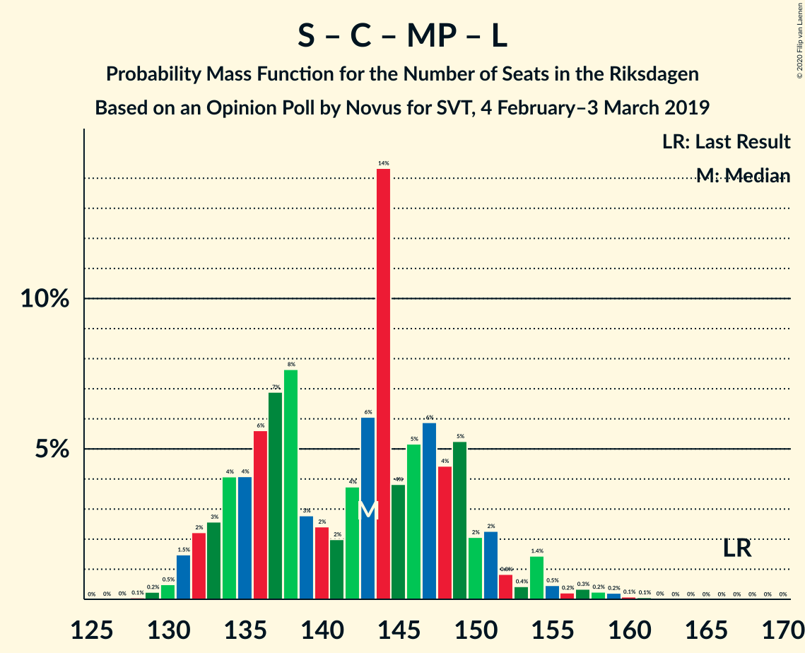
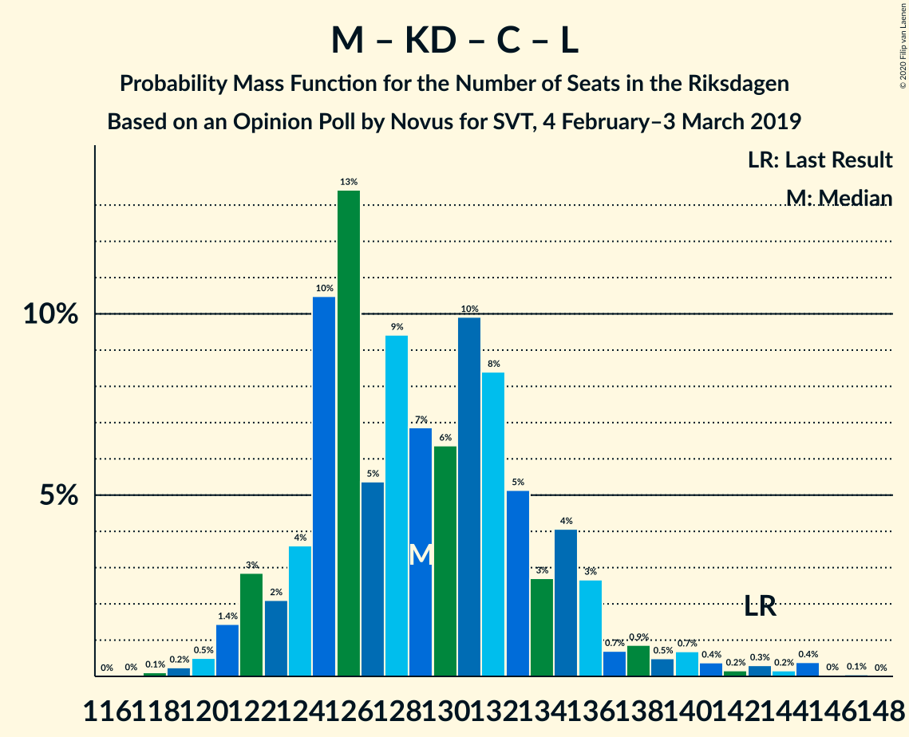
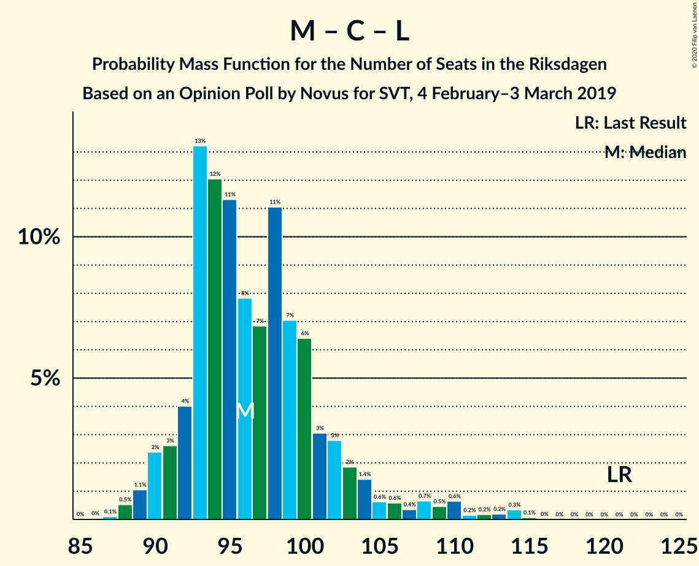

# Opinion Poll by Novus for SVT, 4 February–3 March 2019

<a href="#voting-intentions">Voting Intentions</a> | <a href="#seats">Seats</a> | <a href="#coalitions">Coalitions</a> | <a href="#technical-information">Technical Information</a>

## Voting Intentions

### Confidence Intervals

| Party | Last Result | Poll Result | 80% Confidence Interval | 90% Confidence Interval | 95% Confidence Interval | 99% Confidence Interval |
|:-----:|:-----------:|:-----------:|:-----------------------:|:-----------------------:|:-----------------------:|:-----------------------:|
| Sveriges socialdemokratiska arbetareparti | 28.3% | 28.2% | 27.3–29.2% |27.0–29.4% |26.8–29.7% |26.3–30.1% |
| Sverigedemokraterna | 17.5% | 19.3% | 18.5–20.1% |18.2–20.4% |18.0–20.6% |17.7–21.0% |
| Moderata samlingspartiet | 19.8% | 18.3% | 17.5–19.1% |17.3–19.4% |17.1–19.6% |16.7–20.0% |
| Vänsterpartiet | 8.0% | 9.1% | 8.5–9.7% |8.3–9.9% |8.2–10.1% |7.9–10.4% |
| Kristdemokraterna | 6.3% | 8.6% | 8.0–9.2% |7.9–9.4% |7.7–9.6% |7.5–9.9% |
| Centerpartiet | 8.6% | 7.3% | 6.8–7.9% |6.6–8.1% |6.5–8.2% |6.3–8.5% |
| Miljöpartiet de gröna | 4.4% | 4.0% | 3.6–4.4% |3.5–4.6% |3.4–4.7% |3.2–4.9% |
| Liberalerna | 5.5% | 3.5% | 3.1–3.9% |3.0–4.1% |3.0–4.2% |2.8–4.4% |

*Note:* The poll result column reflects the actual value used in the calculations. Published results may vary slightly, and in addition be rounded to fewer digits.

## Seats

### Confidence Intervals

| Party | Last Result | Median | 80% Confidence Interval | 90% Confidence Interval | 95% Confidence Interval | 99% Confidence Interval |
|:-----:|:-----------:|:------:|:-----------------------:|:-----------------------:|:-----------------------:|:-----------------------:|
| <a href="#sveriges-socialdemokratiska-arbetareparti">Sveriges socialdemokratiska arbetareparti</a> | 100 | 101 | 98–111 |95–113 |95–117 |95–117 |
| <a href="#sverigedemokraterna">Sverigedemokraterna</a> | 62 | 72 | 68–78 |68–78 |68–78 |68–78 |
| <a href="#moderata-samlingspartiet">Moderata samlingspartiet</a> | 70 | 65 | 60–69 |60–69 |60–69 |60–74 |
| <a href="#vänsterpartiet">Vänsterpartiet</a> | 28 | 35 | 31–36 |31–36 |30–36 |30–38 |
| <a href="#kristdemokraterna">Kristdemokraterna</a> | 22 | 32 | 27–38 |27–38 |27–38 |27–38 |
| <a href="#centerpartiet">Centerpartiet</a> | 31 | 26 | 25–32 |24–32 |24–34 |21–34 |
| <a href="#miljöpartiet-de-gröna">Miljöpartiet de gröna</a> | 16 | 16 | 0–19 |0–19 |0–19 |0–19 |
| <a href="#liberalerna">Liberalerna</a> | 20 | 0 | 0–15 |0–15 |0–15 |0–17 |

### Sveriges socialdemokratiska arbetareparti

*For a full overview of the results for this party, see the [Sveriges socialdemokratiska arbetareparti](party-sverigessocialdemokratiskaarbetareparti.html) page.*

| Number of Seats | Probability | Accumulated | Special Marks |
|:---------------:|:-----------:|:-----------:|:-------------:|
| 95 | 7% | 100% |  |
| 96 | 0% | 93% |  |
| 97 | 0.3% | 93% |  |
| 98 | 24% | 93% |  |
| 99 | 0.2% | 68% |  |
| 100 | 0% | 68% | Last Result |
| 101 | 19% | 68% | Median |
| 102 | 0% | 50% |  |
| 103 | 0% | 50% |  |
| 104 | 2% | 50% |  |
| 105 | 0.4% | 48% |  |
| 106 | 0% | 48% |  |
| 107 | 13% | 48% |  |
| 108 | 0.4% | 35% |  |
| 109 | 15% | 34% |  |
| 110 | 0.4% | 20% |  |
| 111 | 11% | 19% |  |
| 112 | 0% | 8% |  |
| 113 | 5% | 8% |  |
| 114 | 0.3% | 3% |  |
| 115 | 0% | 3% |  |
| 116 | 0% | 3% |  |
| 117 | 3% | 3% |  |
| 118 | 0% | 0% |  |

### Sverigedemokraterna

*For a full overview of the results for this party, see the [Sverigedemokraterna](party-sverigedemokraterna.html) page.*

| Number of Seats | Probability | Accumulated | Special Marks |
|:---------------:|:-----------:|:-----------:|:-------------:|
| 62 | 0% | 100% | Last Result |
| 63 | 0% | 100% |  |
| 64 | 0% | 100% |  |
| 65 | 0.4% | 100% |  |
| 66 | 0% | 99.6% |  |
| 67 | 0% | 99.6% |  |
| 68 | 16% | 99.6% |  |
| 69 | 13% | 84% |  |
| 70 | 7% | 70% |  |
| 71 | 3% | 63% |  |
| 72 | 11% | 60% | Median |
| 73 | 1.0% | 49% |  |
| 74 | 0% | 48% |  |
| 75 | 0.4% | 48% |  |
| 76 | 31% | 48% |  |
| 77 | 1.2% | 17% |  |
| 78 | 15% | 15% |  |
| 79 | 0% | 0% |  |

### Moderata samlingspartiet

*For a full overview of the results for this party, see the [Moderata samlingspartiet](party-moderatasamlingspartiet.html) page.*

| Number of Seats | Probability | Accumulated | Special Marks |
|:---------------:|:-----------:|:-----------:|:-------------:|
| 58 | 0.2% | 100% |  |
| 59 | 0.1% | 99.8% |  |
| 60 | 15% | 99.7% |  |
| 61 | 11% | 85% |  |
| 62 | 0.3% | 74% |  |
| 63 | 18% | 73% |  |
| 64 | 0.5% | 55% |  |
| 65 | 28% | 55% | Median |
| 66 | 0% | 26% |  |
| 67 | 4% | 26% |  |
| 68 | 0% | 23% |  |
| 69 | 20% | 23% |  |
| 70 | 0% | 2% | Last Result |
| 71 | 0.1% | 2% |  |
| 72 | 1.3% | 2% |  |
| 73 | 0% | 0.8% |  |
| 74 | 0.3% | 0.8% |  |
| 75 | 0% | 0.5% |  |
| 76 | 0.4% | 0.4% |  |
| 77 | 0% | 0% |  |

### Vänsterpartiet

*For a full overview of the results for this party, see the [Vänsterpartiet](party-vänsterpartiet.html) page.*

| Number of Seats | Probability | Accumulated | Special Marks |
|:---------------:|:-----------:|:-----------:|:-------------:|
| 28 | 0% | 100% | Last Result |
| 29 | 0% | 99.9% |  |
| 30 | 3% | 99.9% |  |
| 31 | 12% | 97% |  |
| 32 | 5% | 85% |  |
| 33 | 0.7% | 80% |  |
| 34 | 7% | 79% |  |
| 35 | 42% | 72% | Median |
| 36 | 28% | 30% |  |
| 37 | 1.4% | 2% |  |
| 38 | 0.9% | 0.9% |  |
| 39 | 0% | 0% |  |

### Kristdemokraterna

*For a full overview of the results for this party, see the [Kristdemokraterna](party-kristdemokraterna.html) page.*

| Number of Seats | Probability | Accumulated | Special Marks |
|:---------------:|:-----------:|:-----------:|:-------------:|
| 22 | 0% | 100% | Last Result |
| 23 | 0% | 100% |  |
| 24 | 0% | 100% |  |
| 25 | 0% | 100% |  |
| 26 | 0.3% | 100% |  |
| 27 | 13% | 99.7% |  |
| 28 | 0.6% | 87% |  |
| 29 | 7% | 86% |  |
| 30 | 11% | 80% |  |
| 31 | 15% | 68% |  |
| 32 | 8% | 54% | Median |
| 33 | 28% | 46% |  |
| 34 | 0% | 18% |  |
| 35 | 0% | 18% |  |
| 36 | 0% | 18% |  |
| 37 | 3% | 18% |  |
| 38 | 15% | 15% |  |
| 39 | 0.4% | 0.4% |  |
| 40 | 0% | 0% |  |

### Centerpartiet

*For a full overview of the results for this party, see the [Centerpartiet](party-centerpartiet.html) page.*

| Number of Seats | Probability | Accumulated | Special Marks |
|:---------------:|:-----------:|:-----------:|:-------------:|
| 20 | 0.4% | 100% |  |
| 21 | 0.2% | 99.6% |  |
| 22 | 0.4% | 99.4% |  |
| 23 | 0% | 99.0% |  |
| 24 | 5% | 99.0% |  |
| 25 | 13% | 94% |  |
| 26 | 40% | 81% | Median |
| 27 | 8% | 41% |  |
| 28 | 0.1% | 34% |  |
| 29 | 0.1% | 34% |  |
| 30 | 15% | 34% |  |
| 31 | 3% | 19% | Last Result |
| 32 | 13% | 16% |  |
| 33 | 0.4% | 3% |  |
| 34 | 3% | 3% |  |
| 35 | 0% | 0% |  |

### Miljöpartiet de gröna

*For a full overview of the results for this party, see the [Miljöpartiet de gröna](party-miljöpartietdegröna.html) page.*

| Number of Seats | Probability | Accumulated | Special Marks |
|:---------------:|:-----------:|:-----------:|:-------------:|
| 0 | 35% | 100% |  |
| 1 | 0% | 65% |  |
| 2 | 0% | 65% |  |
| 3 | 0% | 65% |  |
| 4 | 0% | 65% |  |
| 5 | 0% | 65% |  |
| 6 | 0% | 65% |  |
| 7 | 0% | 65% |  |
| 8 | 0% | 65% |  |
| 9 | 0% | 65% |  |
| 10 | 0% | 65% |  |
| 11 | 0% | 65% |  |
| 12 | 0% | 65% |  |
| 13 | 0% | 65% |  |
| 14 | 0% | 65% |  |
| 15 | 7% | 65% |  |
| 16 | 33% | 58% | Last Result, Median |
| 17 | 14% | 25% |  |
| 18 | 0% | 11% |  |
| 19 | 11% | 11% |  |
| 20 | 0.2% | 0.2% |  |
| 21 | 0% | 0% |  |

### Liberalerna

*For a full overview of the results for this party, see the [Liberalerna](party-liberalerna.html) page.*

| Number of Seats | Probability | Accumulated | Special Marks |
|:---------------:|:-----------:|:-----------:|:-------------:|
| 0 | 83% | 100% | Median |
| 1 | 0% | 17% |  |
| 2 | 0% | 17% |  |
| 3 | 0% | 17% |  |
| 4 | 0% | 17% |  |
| 5 | 0% | 17% |  |
| 6 | 0% | 17% |  |
| 7 | 0% | 17% |  |
| 8 | 0% | 17% |  |
| 9 | 0% | 17% |  |
| 10 | 0% | 17% |  |
| 11 | 0% | 17% |  |
| 12 | 0% | 17% |  |
| 13 | 0% | 17% |  |
| 14 | 0% | 17% |  |
| 15 | 15% | 17% |  |
| 16 | 0.1% | 1.5% |  |
| 17 | 1.4% | 1.4% |  |
| 18 | 0% | 0% |  |
| 19 | 0% | 0% |  |
| 20 | 0% | 0% | Last Result |

## Coalitions

### Confidence Intervals

| Coalition | Last Result | Median | Majority? | 80% Confidence Interval | 90% Confidence Interval | 95% Confidence Interval | 99% Confidence Interval |
|:---------:|:-----------:|:------:|:---------:|:-----------------------:|:-----------------------:|:-----------------------:|:-----------------------:|
| Sveriges socialdemokratiska arbetareparti – Moderata samlingspartiet – Centerpartiet | 201 | 197 | 100% | 189–208 | 189–208 | 189–213 | 189–213 |
| Sveriges socialdemokratiska arbetareparti – Vänsterpartiet – Centerpartiet – Miljöpartiet de gröna – Liberalerna | 195 | 179 | 89% | 172–190 | 172–190 | 167–190 | 167–190 |
| Sveriges socialdemokratiska arbetareparti – Moderata samlingspartiet | 170 | 169 | 22% | 163–176 | 163–176 | 163–182 | 162–182 |
| Sverigedemokraterna – Moderata samlingspartiet – Kristdemokraterna | 154 | 170 | 11% | 159–177 | 159–177 | 159–182 | 159–182 |
| Sveriges socialdemokratiska arbetareparti – Vänsterpartiet – Miljöpartiet de gröna | 144 | 149 | 0% | 143–161 | 143–163 | 133–163 | 133–163 |
| Sveriges socialdemokratiska arbetareparti – Centerpartiet – Miljöpartiet de gröna – Liberalerna | 167 | 144 | 0% | 138–155 | 138–155 | 135–155 | 135–155 |
| Sveriges socialdemokratiska arbetareparti – Vänsterpartiet | 128 | 136 | 0% | 133–145 | 129–148 | 129–149 | 129–149 |
| Sverigedemokraterna – Moderata samlingspartiet | 132 | 140 | 0% | 128–147 | 128–147 | 128–147 | 128–147 |
| Moderata samlingspartiet – Kristdemokraterna – Centerpartiet – Liberalerna | 143 | 127 | 0% | 116–136 | 116–136 | 116–138 | 116–143 |
| Moderata samlingspartiet – Kristdemokraterna – Centerpartiet | 123 | 124 | 0% | 116–128 | 116–129 | 116–138 | 116–138 |
| Sveriges socialdemokratiska arbetareparti – Miljöpartiet de gröna | 116 | 114 | 0% | 107–130 | 107–130 | 101–130 | 101–130 |
| Moderata samlingspartiet – Centerpartiet – Liberalerna | 121 | 91 | 0% | 86–105 | 86–105 | 86–105 | 86–114 |
| Moderata samlingspartiet – Centerpartiet | 101 | 91 | 0% | 86–101 | 86–101 | 86–101 | 86–102 |

### Sveriges socialdemokratiska arbetareparti – Moderata samlingspartiet – Centerpartiet

| Number of Seats | Probability | Accumulated | Special Marks |
|:---------------:|:-----------:|:-----------:|:-------------:|
| 188 | 0.2% | 100% |  |
| 189 | 24% | 99.7% |  |
| 190 | 14% | 76% |  |
| 191 | 7% | 62% |  |
| 192 | 0% | 55% | Median |
| 193 | 0.9% | 55% |  |
| 194 | 1.0% | 54% |  |
| 195 | 1.4% | 53% |  |
| 196 | 0% | 52% |  |
| 197 | 11% | 52% |  |
| 198 | 1.3% | 40% |  |
| 199 | 15% | 39% |  |
| 200 | 5% | 24% |  |
| 201 | 0% | 19% | Last Result |
| 202 | 3% | 19% |  |
| 203 | 0.5% | 16% |  |
| 204 | 0% | 16% |  |
| 205 | 0.4% | 16% |  |
| 206 | 0% | 16% |  |
| 207 | 0% | 16% |  |
| 208 | 13% | 16% |  |
| 209 | 0% | 3% |  |
| 210 | 0% | 3% |  |
| 211 | 0% | 3% |  |
| 212 | 0% | 3% |  |
| 213 | 3% | 3% |  |
| 214 | 0% | 0.4% |  |
| 215 | 0% | 0.4% |  |
| 216 | 0.3% | 0.4% |  |
| 217 | 0% | 0% |  |

### Sveriges socialdemokratiska arbetareparti – Vänsterpartiet – Centerpartiet – Miljöpartiet de gröna – Liberalerna

| Number of Seats | Probability | Accumulated | Special Marks |
|:---------------:|:-----------:|:-----------:|:-------------:|
| 160 | 0.4% | 100% |  |
| 161 | 0% | 99.6% |  |
| 162 | 0% | 99.6% |  |
| 163 | 0% | 99.6% |  |
| 164 | 0% | 99.6% |  |
| 165 | 0% | 99.6% |  |
| 166 | 0% | 99.6% |  |
| 167 | 3% | 99.6% |  |
| 168 | 0% | 97% |  |
| 169 | 0% | 97% |  |
| 170 | 0.1% | 97% |  |
| 171 | 0% | 97% |  |
| 172 | 8% | 97% |  |
| 173 | 0% | 89% |  |
| 174 | 0.3% | 89% |  |
| 175 | 36% | 89% | Majority |
| 176 | 2% | 52% |  |
| 177 | 0% | 51% |  |
| 178 | 0.4% | 51% | Median |
| 179 | 14% | 50% |  |
| 180 | 4% | 36% |  |
| 181 | 0.2% | 32% |  |
| 182 | 0.5% | 32% |  |
| 183 | 0.4% | 32% |  |
| 184 | 0% | 31% |  |
| 185 | 0% | 31% |  |
| 186 | 11% | 31% |  |
| 187 | 5% | 20% |  |
| 188 | 0.3% | 15% |  |
| 189 | 0% | 15% |  |
| 190 | 15% | 15% |  |
| 191 | 0.2% | 0.2% |  |
| 192 | 0% | 0% |  |
| 193 | 0% | 0% |  |
| 194 | 0% | 0% |  |
| 195 | 0% | 0% | Last Result |

### Sveriges socialdemokratiska arbetareparti – Moderata samlingspartiet

| Number of Seats | Probability | Accumulated | Special Marks |
|:---------------:|:-----------:|:-----------:|:-------------:|
| 157 | 0.2% | 100% |  |
| 158 | 0% | 99.8% |  |
| 159 | 0.3% | 99.8% |  |
| 160 | 0% | 99.5% |  |
| 161 | 0% | 99.5% |  |
| 162 | 0.1% | 99.5% |  |
| 163 | 24% | 99.4% |  |
| 164 | 20% | 76% |  |
| 165 | 0% | 55% |  |
| 166 | 0.5% | 55% | Median |
| 167 | 0% | 55% |  |
| 168 | 4% | 55% |  |
| 169 | 16% | 51% |  |
| 170 | 0.1% | 35% | Last Result |
| 171 | 0% | 35% |  |
| 172 | 11% | 35% |  |
| 173 | 1.3% | 23% |  |
| 174 | 0.4% | 22% |  |
| 175 | 0.1% | 22% | Majority |
| 176 | 18% | 22% |  |
| 177 | 0.4% | 4% |  |
| 178 | 0.3% | 4% |  |
| 179 | 0% | 3% |  |
| 180 | 0% | 3% |  |
| 181 | 0.4% | 3% |  |
| 182 | 3% | 3% |  |
| 183 | 0.3% | 0.4% |  |
| 184 | 0% | 0.1% |  |
| 185 | 0% | 0.1% |  |
| 186 | 0% | 0.1% |  |
| 187 | 0% | 0.1% |  |
| 188 | 0% | 0% |  |

### Sverigedemokraterna – Moderata samlingspartiet – Kristdemokraterna

| Number of Seats | Probability | Accumulated | Special Marks |
|:---------------:|:-----------:|:-----------:|:-------------:|
| 154 | 0% | 100% | Last Result |
| 155 | 0% | 100% |  |
| 156 | 0% | 100% |  |
| 157 | 0% | 100% |  |
| 158 | 0.2% | 100% |  |
| 159 | 15% | 99.8% |  |
| 160 | 0% | 85% |  |
| 161 | 0.3% | 85% |  |
| 162 | 5% | 85% |  |
| 163 | 11% | 80% |  |
| 164 | 0% | 69% |  |
| 165 | 0% | 69% |  |
| 166 | 0.4% | 69% |  |
| 167 | 0.5% | 68% |  |
| 168 | 0.2% | 68% |  |
| 169 | 4% | 68% | Median |
| 170 | 14% | 64% |  |
| 171 | 0.4% | 50% |  |
| 172 | 0% | 49% |  |
| 173 | 2% | 49% |  |
| 174 | 36% | 48% |  |
| 175 | 0.3% | 11% | Majority |
| 176 | 0% | 11% |  |
| 177 | 8% | 11% |  |
| 178 | 0% | 3% |  |
| 179 | 0.1% | 3% |  |
| 180 | 0% | 3% |  |
| 181 | 0% | 3% |  |
| 182 | 3% | 3% |  |
| 183 | 0% | 0.4% |  |
| 184 | 0% | 0.4% |  |
| 185 | 0% | 0.4% |  |
| 186 | 0% | 0.4% |  |
| 187 | 0% | 0.4% |  |
| 188 | 0% | 0.4% |  |
| 189 | 0.4% | 0.4% |  |
| 190 | 0% | 0% |  |

### Sveriges socialdemokratiska arbetareparti – Vänsterpartiet – Miljöpartiet de gröna

| Number of Seats | Probability | Accumulated | Special Marks |
|:---------------:|:-----------:|:-----------:|:-------------:|
| 133 | 3% | 100% |  |
| 134 | 0% | 97% |  |
| 135 | 0.1% | 97% |  |
| 136 | 0% | 97% |  |
| 137 | 0% | 97% |  |
| 138 | 2% | 97% |  |
| 139 | 0% | 95% |  |
| 140 | 0% | 95% |  |
| 141 | 0% | 95% |  |
| 142 | 0.3% | 95% |  |
| 143 | 13% | 95% |  |
| 144 | 0% | 83% | Last Result |
| 145 | 22% | 83% |  |
| 146 | 1.1% | 61% |  |
| 147 | 0% | 60% |  |
| 148 | 0.4% | 60% |  |
| 149 | 26% | 59% |  |
| 150 | 2% | 33% |  |
| 151 | 0% | 31% |  |
| 152 | 0.1% | 31% | Median |
| 153 | 13% | 31% |  |
| 154 | 0.4% | 17% |  |
| 155 | 0.5% | 17% |  |
| 156 | 0% | 17% |  |
| 157 | 0% | 17% |  |
| 158 | 0.4% | 17% |  |
| 159 | 0% | 16% |  |
| 160 | 0% | 16% |  |
| 161 | 11% | 16% |  |
| 162 | 0% | 5% |  |
| 163 | 5% | 5% |  |
| 164 | 0% | 0.1% |  |
| 165 | 0% | 0% |  |

### Sveriges socialdemokratiska arbetareparti – Centerpartiet – Miljöpartiet de gröna – Liberalerna

| Number of Seats | Probability | Accumulated | Special Marks |
|:---------------:|:-----------:|:-----------:|:-------------:|
| 127 | 0.4% | 100% |  |
| 128 | 0% | 99.6% |  |
| 129 | 0% | 99.6% |  |
| 130 | 0% | 99.6% |  |
| 131 | 0% | 99.6% |  |
| 132 | 0.1% | 99.6% |  |
| 133 | 0% | 99.6% |  |
| 134 | 0% | 99.5% |  |
| 135 | 3% | 99.5% |  |
| 136 | 0% | 97% |  |
| 137 | 0% | 97% |  |
| 138 | 7% | 97% |  |
| 139 | 13% | 90% |  |
| 140 | 24% | 77% |  |
| 141 | 0.4% | 53% |  |
| 142 | 1.3% | 53% |  |
| 143 | 1.3% | 52% | Median |
| 144 | 14% | 50% |  |
| 145 | 0.5% | 37% |  |
| 146 | 1.4% | 36% |  |
| 147 | 0.4% | 35% |  |
| 148 | 3% | 34% |  |
| 149 | 0% | 31% |  |
| 150 | 0.1% | 31% |  |
| 151 | 0% | 31% |  |
| 152 | 5% | 31% |  |
| 153 | 0.1% | 26% |  |
| 154 | 15% | 26% |  |
| 155 | 11% | 12% |  |
| 156 | 0% | 0.5% |  |
| 157 | 0% | 0.5% |  |
| 158 | 0.3% | 0.4% |  |
| 159 | 0% | 0.2% |  |
| 160 | 0.2% | 0.2% |  |
| 161 | 0% | 0% |  |
| 162 | 0% | 0% |  |
| 163 | 0% | 0% |  |
| 164 | 0% | 0% |  |
| 165 | 0% | 0% |  |
| 166 | 0% | 0% |  |
| 167 | 0% | 0% | Last Result |

### Sveriges socialdemokratiska arbetareparti – Vänsterpartiet

| Number of Seats | Probability | Accumulated | Special Marks |
|:---------------:|:-----------:|:-----------:|:-------------:|
| 127 | 0.3% | 100% |  |
| 128 | 0% | 99.7% | Last Result |
| 129 | 7% | 99.7% |  |
| 130 | 0.2% | 93% |  |
| 131 | 1.1% | 92% |  |
| 132 | 0.1% | 91% |  |
| 133 | 26% | 91% |  |
| 134 | 1.4% | 65% |  |
| 135 | 0.1% | 63% |  |
| 136 | 14% | 63% | Median |
| 137 | 0% | 50% |  |
| 138 | 2% | 50% |  |
| 139 | 0.5% | 48% |  |
| 140 | 0% | 47% |  |
| 141 | 0.5% | 47% |  |
| 142 | 11% | 47% |  |
| 143 | 13% | 36% |  |
| 144 | 0% | 23% |  |
| 145 | 15% | 23% |  |
| 146 | 0% | 8% |  |
| 147 | 0% | 8% |  |
| 148 | 5% | 8% |  |
| 149 | 3% | 3% |  |
| 150 | 0.3% | 0.3% |  |
| 151 | 0% | 0% |  |

### Sverigedemokraterna – Moderata samlingspartiet

| Number of Seats | Probability | Accumulated | Special Marks |
|:---------------:|:-----------:|:-----------:|:-------------:|
| 128 | 15% | 100% |  |
| 129 | 0% | 85% |  |
| 130 | 0% | 85% |  |
| 131 | 0.6% | 85% |  |
| 132 | 13% | 85% | Last Result |
| 133 | 16% | 71% |  |
| 134 | 0.3% | 55% |  |
| 135 | 2% | 55% |  |
| 136 | 3% | 53% |  |
| 137 | 0% | 50% | Median |
| 138 | 0% | 50% |  |
| 139 | 0% | 50% |  |
| 140 | 1.3% | 50% |  |
| 141 | 24% | 49% |  |
| 142 | 0.8% | 25% |  |
| 143 | 0.1% | 24% |  |
| 144 | 1.2% | 24% |  |
| 145 | 10% | 23% |  |
| 146 | 0% | 13% |  |
| 147 | 13% | 13% |  |
| 148 | 0% | 0.4% |  |
| 149 | 0% | 0.4% |  |
| 150 | 0% | 0.4% |  |
| 151 | 0.4% | 0.4% |  |
| 152 | 0% | 0% |  |

### Moderata samlingspartiet – Kristdemokraterna – Centerpartiet – Liberalerna

| Number of Seats | Probability | Accumulated | Special Marks |
|:---------------:|:-----------:|:-----------:|:-------------:|
| 114 | 0% | 100% |  |
| 115 | 0% | 99.9% |  |
| 116 | 16% | 99.9% |  |
| 117 | 0% | 84% |  |
| 118 | 0.4% | 84% |  |
| 119 | 0% | 83% |  |
| 120 | 0% | 83% |  |
| 121 | 0% | 83% |  |
| 122 | 0.1% | 83% |  |
| 123 | 0.6% | 83% | Median |
| 124 | 24% | 83% |  |
| 125 | 0.4% | 59% |  |
| 126 | 1.2% | 58% |  |
| 127 | 13% | 57% |  |
| 128 | 20% | 44% |  |
| 129 | 4% | 24% |  |
| 130 | 0% | 20% |  |
| 131 | 0.2% | 20% |  |
| 132 | 0% | 20% |  |
| 133 | 0% | 20% |  |
| 134 | 0.6% | 20% |  |
| 135 | 0% | 19% |  |
| 136 | 15% | 19% |  |
| 137 | 0% | 4% |  |
| 138 | 3% | 4% |  |
| 139 | 0% | 2% |  |
| 140 | 0% | 2% |  |
| 141 | 0% | 2% |  |
| 142 | 0% | 2% |  |
| 143 | 1.3% | 2% | Last Result |
| 144 | 0% | 0.2% |  |
| 145 | 0.1% | 0.2% |  |
| 146 | 0% | 0.1% |  |
| 147 | 0% | 0.1% |  |
| 148 | 0.1% | 0.1% |  |
| 149 | 0% | 0% |  |

### Moderata samlingspartiet – Kristdemokraterna – Centerpartiet

| Number of Seats | Probability | Accumulated | Special Marks |
|:---------------:|:-----------:|:-----------:|:-------------:|
| 114 | 0% | 100% |  |
| 115 | 0% | 99.9% |  |
| 116 | 16% | 99.9% |  |
| 117 | 0% | 84% |  |
| 118 | 0.4% | 84% |  |
| 119 | 0.3% | 83% |  |
| 120 | 0% | 83% |  |
| 121 | 15% | 83% |  |
| 122 | 0.1% | 68% |  |
| 123 | 0.6% | 68% | Last Result, Median |
| 124 | 24% | 68% |  |
| 125 | 0.4% | 43% |  |
| 126 | 2% | 43% |  |
| 127 | 13% | 41% |  |
| 128 | 20% | 27% |  |
| 129 | 4% | 8% |  |
| 130 | 0% | 4% |  |
| 131 | 0.1% | 3% |  |
| 132 | 0% | 3% |  |
| 133 | 0% | 3% |  |
| 134 | 0.3% | 3% |  |
| 135 | 0% | 3% |  |
| 136 | 0.5% | 3% |  |
| 137 | 0% | 3% |  |
| 138 | 3% | 3% |  |
| 139 | 0% | 0.1% |  |
| 140 | 0% | 0.1% |  |
| 141 | 0% | 0.1% |  |
| 142 | 0% | 0.1% |  |
| 143 | 0% | 0.1% |  |
| 144 | 0% | 0% |  |

### Sveriges socialdemokratiska arbetareparti – Miljöpartiet de gröna

| Number of Seats | Probability | Accumulated | Special Marks |
|:---------------:|:-----------:|:-----------:|:-------------:|
| 98 | 0.2% | 100% |  |
| 99 | 0% | 99.8% |  |
| 100 | 0% | 99.8% |  |
| 101 | 4% | 99.8% |  |
| 102 | 0% | 96% |  |
| 103 | 0% | 96% |  |
| 104 | 0.1% | 96% |  |
| 105 | 0.4% | 96% |  |
| 106 | 0% | 96% |  |
| 107 | 13% | 96% |  |
| 108 | 0% | 83% |  |
| 109 | 15% | 83% |  |
| 110 | 0.4% | 68% |  |
| 111 | 7% | 68% |  |
| 112 | 0.3% | 61% |  |
| 113 | 0% | 61% |  |
| 114 | 24% | 61% |  |
| 115 | 0% | 36% |  |
| 116 | 1.0% | 36% | Last Result |
| 117 | 3% | 35% | Median |
| 118 | 13% | 32% |  |
| 119 | 0% | 19% |  |
| 120 | 1.4% | 19% |  |
| 121 | 0.3% | 17% |  |
| 122 | 0% | 17% |  |
| 123 | 0.4% | 17% |  |
| 124 | 0% | 17% |  |
| 125 | 0.4% | 17% |  |
| 126 | 0% | 16% |  |
| 127 | 0% | 16% |  |
| 128 | 5% | 16% |  |
| 129 | 0% | 11% |  |
| 130 | 11% | 11% |  |
| 131 | 0% | 0% |  |

### Moderata samlingspartiet – Centerpartiet – Liberalerna

| Number of Seats | Probability | Accumulated | Special Marks |
|:---------------:|:-----------:|:-----------:|:-------------:|
| 84 | 0.1% | 100% |  |
| 85 | 0% | 99.9% |  |
| 86 | 11% | 99.9% |  |
| 87 | 5% | 88% |  |
| 88 | 0% | 83% |  |
| 89 | 14% | 83% |  |
| 90 | 0% | 70% |  |
| 91 | 25% | 70% | Median |
| 92 | 0.5% | 45% |  |
| 93 | 1.1% | 44% |  |
| 94 | 0% | 43% |  |
| 95 | 0.6% | 43% |  |
| 96 | 10% | 42% |  |
| 97 | 0% | 33% |  |
| 98 | 0.4% | 33% |  |
| 99 | 0.1% | 32% |  |
| 100 | 0% | 32% |  |
| 101 | 15% | 32% |  |
| 102 | 0.3% | 17% |  |
| 103 | 0% | 17% |  |
| 104 | 0.2% | 17% |  |
| 105 | 15% | 16% |  |
| 106 | 0% | 2% |  |
| 107 | 0% | 2% |  |
| 108 | 0.3% | 2% |  |
| 109 | 0% | 2% |  |
| 110 | 0% | 1.5% |  |
| 111 | 0% | 1.5% |  |
| 112 | 0% | 1.5% |  |
| 113 | 0% | 1.5% |  |
| 114 | 1.3% | 1.5% |  |
| 115 | 0.1% | 0.2% |  |
| 116 | 0% | 0.1% |  |
| 117 | 0% | 0.1% |  |
| 118 | 0% | 0.1% |  |
| 119 | 0.1% | 0.1% |  |
| 120 | 0% | 0% |  |
| 121 | 0% | 0% | Last Result |

### Moderata samlingspartiet – Centerpartiet

| Number of Seats | Probability | Accumulated | Special Marks |
|:---------------:|:-----------:|:-----------:|:-------------:|
| 84 | 0.1% | 100% |  |
| 85 | 0% | 99.9% |  |
| 86 | 11% | 99.9% |  |
| 87 | 5% | 88% |  |
| 88 | 0% | 83% |  |
| 89 | 14% | 83% |  |
| 90 | 15% | 70% |  |
| 91 | 25% | 55% | Median |
| 92 | 0.5% | 30% |  |
| 93 | 1.4% | 29% |  |
| 94 | 0% | 28% |  |
| 95 | 0.6% | 28% |  |
| 96 | 10% | 27% |  |
| 97 | 1.3% | 17% |  |
| 98 | 0.4% | 16% |  |
| 99 | 0.1% | 16% |  |
| 100 | 0% | 16% |  |
| 101 | 15% | 16% | Last Result |
| 102 | 0.4% | 0.5% |  |
| 103 | 0% | 0.1% |  |
| 104 | 0% | 0.1% |  |
| 105 | 0% | 0.1% |  |
| 106 | 0% | 0.1% |  |
| 107 | 0% | 0% |  |

## Technical Information

### Opinion Poll

+ **Polling firm:** Novus
+ **Commissioner(s):** SVT
+ **Fieldwork period:** 4 February–3 March 2019

### Calculations

+ **Sample size:** 3707
+ **Simulations done:** 1,024
+ **Error estimate:** 2.56%

