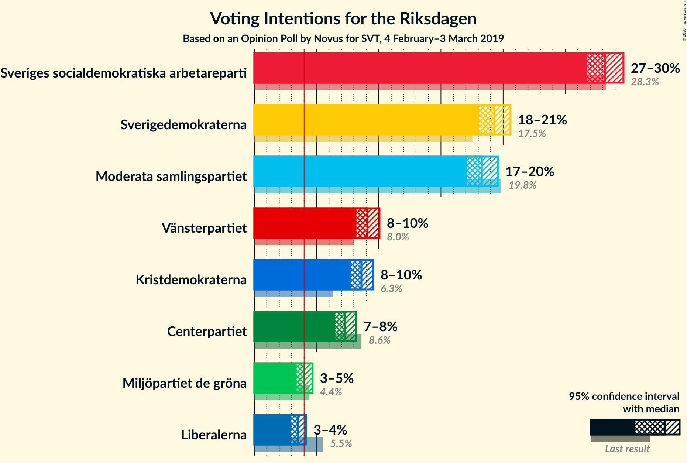
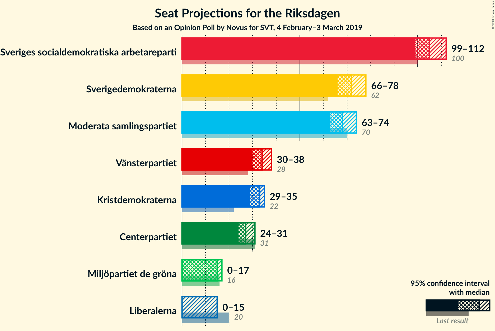
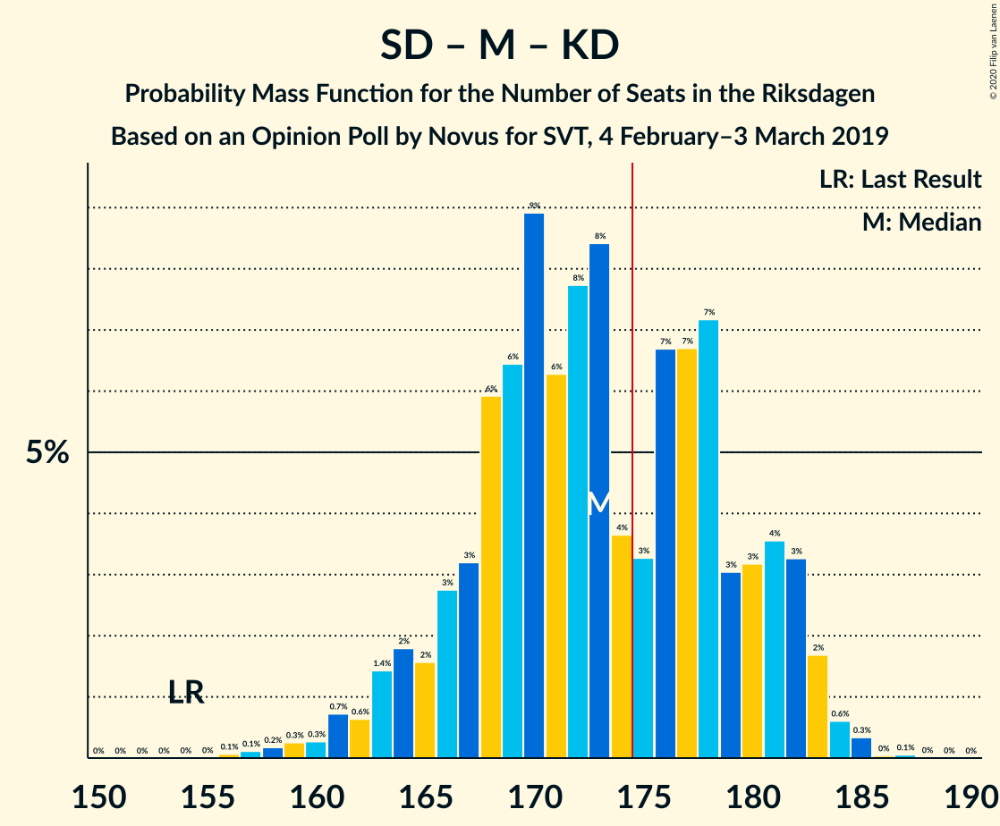

# Opinion Poll by Novus for SVT, 4 February–3 March 2019

<a href="#voting-intentions">Voting Intentions</a> | <a href="#seats">Seats</a> | <a href="#coalitions">Coalitions</a> | <a href="#technical-information">Technical Information</a>

## Voting Intentions

### Confidence Intervals

| Party | Last Result | Poll Result | 80% Confidence Interval | 90% Confidence Interval | 95% Confidence Interval | 99% Confidence Interval |
|:-----:|:-----------:|:-----------:|:-----------------------:|:-----------------------:|:-----------------------:|:-----------------------:|
| Sveriges socialdemokratiska arbetareparti | 28.3% | 28.2% | 27.3–29.2% |27.0–29.4% |26.8–29.7% |26.3–30.1% |
| Sverigedemokraterna | 17.5% | 19.3% | 18.5–20.1% |18.2–20.4% |18.0–20.6% |17.7–21.0% |
| Moderata samlingspartiet | 19.8% | 18.3% | 17.5–19.1% |17.3–19.4% |17.1–19.6% |16.7–20.0% |
| Vänsterpartiet | 8.0% | 9.1% | 8.5–9.7% |8.3–9.9% |8.2–10.1% |7.9–10.4% |
| Kristdemokraterna | 6.3% | 8.6% | 8.0–9.2% |7.9–9.4% |7.7–9.6% |7.5–9.9% |
| Centerpartiet | 8.6% | 7.3% | 6.8–7.9% |6.6–8.1% |6.5–8.2% |6.3–8.5% |
| Miljöpartiet de gröna | 4.4% | 4.0% | 3.6–4.4% |3.5–4.6% |3.4–4.7% |3.2–4.9% |
| Liberalerna | 5.5% | 3.5% | 3.1–3.9% |3.0–4.1% |3.0–4.2% |2.8–4.4% |

*Note:* The poll result column reflects the actual value used in the calculations. Published results may vary slightly, and in addition be rounded to fewer digits.

## Seats

### Confidence Intervals

| Party | Last Result | Median | 80% Confidence Interval | 90% Confidence Interval | 95% Confidence Interval | 99% Confidence Interval |
|:-----:|:-----------:|:------:|:-----------------------:|:-----------------------:|:-----------------------:|:-----------------------:|
| <a href="#sveriges-socialdemokratiska-arbetareparti">Sveriges socialdemokratiska arbetareparti</a> | 100 | 107 | 100–111 |99–111 |98–112 |96–114 |
| <a href="#sverigedemokraterna">Sverigedemokraterna</a> | 62 | 72 | 70–75 |67–77 |67–77 |65–80 |
| <a href="#moderata-samlingspartiet">Moderata samlingspartiet</a> | 70 | 69 | 65–72 |63–74 |62–74 |60–76 |
| <a href="#vänsterpartiet">Vänsterpartiet</a> | 28 | 34 | 32–36 |31–37 |30–37 |29–39 |
| <a href="#kristdemokraterna">Kristdemokraterna</a> | 22 | 33 | 30–33 |29–34 |29–35 |28–37 |
| <a href="#centerpartiet">Centerpartiet</a> | 31 | 27 | 25–30 |25–30 |24–31 |23–32 |
| <a href="#miljöpartiet-de-gröna">Miljöpartiet de gröna</a> | 16 | 0 | 0–16 |0–16 |0–17 |0–18 |
| <a href="#liberalerna">Liberalerna</a> | 20 | 0 | 0 |0–14 |0–15 |0–15 |

### Sveriges socialdemokratiska arbetareparti

*For a full overview of the results for this party, see the [Sveriges socialdemokratiska arbetareparti](party-sverigessocialdemokratiskaarbetareparti.html) page.*

| Number of Seats | Probability | Accumulated | Special Marks |
|:---------------:|:-----------:|:-----------:|:-------------:|
| 93 | 0.1% | 100% |  |
| 94 | 0.1% | 99.9% |  |
| 95 | 0.1% | 99.8% |  |
| 96 | 1.1% | 99.8% |  |
| 97 | 0.4% | 98.7% |  |
| 98 | 0.8% | 98% |  |
| 99 | 4% | 97% |  |
| 100 | 6% | 93% | Last Result |
| 101 | 11% | 87% |  |
| 102 | 2% | 75% |  |
| 103 | 6% | 73% |  |
| 104 | 5% | 67% |  |
| 105 | 6% | 62% |  |
| 106 | 2% | 56% |  |
| 107 | 6% | 54% | Median |
| 108 | 8% | 48% |  |
| 109 | 18% | 40% |  |
| 110 | 2% | 23% |  |
| 111 | 18% | 20% |  |
| 112 | 0.7% | 3% |  |
| 113 | 0.3% | 2% |  |
| 114 | 1.3% | 2% |  |
| 115 | 0.2% | 0.4% |  |
| 116 | 0.1% | 0.2% |  |
| 117 | 0% | 0.1% |  |
| 118 | 0% | 0% |  |

### Sverigedemokraterna

*For a full overview of the results for this party, see the [Sverigedemokraterna](party-sverigedemokraterna.html) page.*

| Number of Seats | Probability | Accumulated | Special Marks |
|:---------------:|:-----------:|:-----------:|:-------------:|
| 62 | 0% | 100% | Last Result |
| 63 | 0.1% | 100% |  |
| 64 | 0% | 99.9% |  |
| 65 | 0.8% | 99.9% |  |
| 66 | 0.9% | 99.0% |  |
| 67 | 3% | 98% |  |
| 68 | 3% | 95% |  |
| 69 | 2% | 92% |  |
| 70 | 7% | 91% |  |
| 71 | 19% | 83% |  |
| 72 | 24% | 64% | Median |
| 73 | 3% | 41% |  |
| 74 | 24% | 38% |  |
| 75 | 5% | 14% |  |
| 76 | 1.3% | 10% |  |
| 77 | 7% | 8% |  |
| 78 | 0.5% | 2% |  |
| 79 | 0.5% | 1.4% |  |
| 80 | 0.8% | 0.9% |  |
| 81 | 0% | 0.1% |  |
| 82 | 0% | 0% |  |

### Moderata samlingspartiet

*For a full overview of the results for this party, see the [Moderata samlingspartiet](party-moderatasamlingspartiet.html) page.*

| Number of Seats | Probability | Accumulated | Special Marks |
|:---------------:|:-----------:|:-----------:|:-------------:|
| 59 | 0% | 100% |  |
| 60 | 0.5% | 99.9% |  |
| 61 | 0.4% | 99.5% |  |
| 62 | 3% | 99.1% |  |
| 63 | 2% | 96% |  |
| 64 | 3% | 94% |  |
| 65 | 2% | 91% |  |
| 66 | 5% | 90% |  |
| 67 | 9% | 85% |  |
| 68 | 10% | 76% |  |
| 69 | 21% | 66% | Median |
| 70 | 12% | 45% | Last Result |
| 71 | 6% | 32% |  |
| 72 | 21% | 27% |  |
| 73 | 0.8% | 6% |  |
| 74 | 3% | 5% |  |
| 75 | 0.2% | 2% |  |
| 76 | 2% | 2% |  |
| 77 | 0.1% | 0.1% |  |
| 78 | 0.1% | 0.1% |  |
| 79 | 0% | 0% |  |

### Vänsterpartiet

*For a full overview of the results for this party, see the [Vänsterpartiet](party-vänsterpartiet.html) page.*

| Number of Seats | Probability | Accumulated | Special Marks |
|:---------------:|:-----------:|:-----------:|:-------------:|
| 28 | 0.1% | 100% | Last Result |
| 29 | 1.0% | 99.9% |  |
| 30 | 2% | 99.0% |  |
| 31 | 6% | 97% |  |
| 32 | 17% | 91% |  |
| 33 | 8% | 74% |  |
| 34 | 24% | 66% | Median |
| 35 | 27% | 42% |  |
| 36 | 9% | 16% |  |
| 37 | 5% | 7% |  |
| 38 | 1.2% | 2% |  |
| 39 | 0.4% | 0.5% |  |
| 40 | 0.1% | 0.1% |  |
| 41 | 0% | 0% |  |

### Kristdemokraterna

*For a full overview of the results for this party, see the [Kristdemokraterna](party-kristdemokraterna.html) page.*

| Number of Seats | Probability | Accumulated | Special Marks |
|:---------------:|:-----------:|:-----------:|:-------------:|
| 22 | 0% | 100% | Last Result |
| 23 | 0% | 100% |  |
| 24 | 0% | 100% |  |
| 25 | 0% | 100% |  |
| 26 | 0.1% | 100% |  |
| 27 | 0.1% | 99.9% |  |
| 28 | 0.5% | 99.7% |  |
| 29 | 6% | 99.3% |  |
| 30 | 12% | 93% |  |
| 31 | 6% | 81% |  |
| 32 | 19% | 75% |  |
| 33 | 47% | 55% | Median |
| 34 | 5% | 8% |  |
| 35 | 1.4% | 3% |  |
| 36 | 1.0% | 2% |  |
| 37 | 0.3% | 0.7% |  |
| 38 | 0.3% | 0.4% |  |
| 39 | 0.1% | 0.1% |  |
| 40 | 0% | 0% |  |

### Centerpartiet

*For a full overview of the results for this party, see the [Centerpartiet](party-centerpartiet.html) page.*

| Number of Seats | Probability | Accumulated | Special Marks |
|:---------------:|:-----------:|:-----------:|:-------------:|
| 22 | 0.1% | 100% |  |
| 23 | 0.8% | 99.9% |  |
| 24 | 3% | 99.1% |  |
| 25 | 11% | 96% |  |
| 26 | 11% | 85% |  |
| 27 | 25% | 74% | Median |
| 28 | 20% | 49% |  |
| 29 | 17% | 28% |  |
| 30 | 8% | 11% |  |
| 31 | 2% | 3% | Last Result |
| 32 | 0.7% | 0.8% |  |
| 33 | 0.1% | 0.1% |  |
| 34 | 0% | 0% |  |

### Miljöpartiet de gröna

*For a full overview of the results for this party, see the [Miljöpartiet de gröna](party-miljöpartietdegröna.html) page.*

| Number of Seats | Probability | Accumulated | Special Marks |
|:---------------:|:-----------:|:-----------:|:-------------:|
| 0 | 56% | 100% | Median |
| 1 | 0% | 44% |  |
| 2 | 0% | 44% |  |
| 3 | 0% | 44% |  |
| 4 | 0% | 44% |  |
| 5 | 0% | 44% |  |
| 6 | 0% | 44% |  |
| 7 | 0% | 44% |  |
| 8 | 0% | 44% |  |
| 9 | 0% | 44% |  |
| 10 | 0% | 44% |  |
| 11 | 0% | 44% |  |
| 12 | 0% | 44% |  |
| 13 | 0% | 44% |  |
| 14 | 0.7% | 44% |  |
| 15 | 30% | 43% |  |
| 16 | 8% | 13% | Last Result |
| 17 | 3% | 5% |  |
| 18 | 1.4% | 2% |  |
| 19 | 0.1% | 0.1% |  |
| 20 | 0% | 0% |  |

### Liberalerna

*For a full overview of the results for this party, see the [Liberalerna](party-liberalerna.html) page.*

| Number of Seats | Probability | Accumulated | Special Marks |
|:---------------:|:-----------:|:-----------:|:-------------:|
| 0 | 92% | 100% | Median |
| 1 | 0% | 8% |  |
| 2 | 0% | 8% |  |
| 3 | 0% | 8% |  |
| 4 | 0% | 8% |  |
| 5 | 0% | 8% |  |
| 6 | 0% | 8% |  |
| 7 | 0% | 8% |  |
| 8 | 0% | 8% |  |
| 9 | 0% | 8% |  |
| 10 | 0% | 8% |  |
| 11 | 0% | 8% |  |
| 12 | 0% | 8% |  |
| 13 | 0% | 8% |  |
| 14 | 4% | 8% |  |
| 15 | 3% | 4% |  |
| 16 | 0.4% | 0.4% |  |
| 17 | 0% | 0% |  |
| 18 | 0% | 0% |  |
| 19 | 0% | 0% |  |
| 20 | 0% | 0% | Last Result |

## Coalitions

### Confidence Intervals

| Coalition | Last Result | Median | Majority? | 80% Confidence Interval | 90% Confidence Interval | 95% Confidence Interval | 99% Confidence Interval |
|:---------:|:-----------:|:------:|:---------:|:-----------------------:|:-----------------------:|:-----------------------:|:-----------------------:|
| Sveriges socialdemokratiska arbetareparti – Moderata samlingspartiet – Centerpartiet | 201 | 203 | 100% | 193–210 | 190–210 | 187–212 | 186–213 |
| Sveriges socialdemokratiska arbetareparti – Vänsterpartiet – Centerpartiet – Miljöpartiet de gröna – Liberalerna | 195 | 173 | 48% | 170–183 | 167–185 | 167–188 | 166–192 |
| Sveriges socialdemokratiska arbetareparti – Moderata samlingspartiet | 170 | 176 | 60% | 168–183 | 164–183 | 161–183 | 161–185 |
| Sverigedemokraterna – Moderata samlingspartiet – Kristdemokraterna | 154 | 176 | 52% | 166–179 | 164–182 | 161–182 | 157–183 |
| Sveriges socialdemokratiska arbetareparti – Vänsterpartiet – Miljöpartiet de gröna | 144 | 145 | 0% | 141–154 | 139–156 | 137–156 | 133–159 |
| Sveriges socialdemokratiska arbetareparti – Centerpartiet – Miljöpartiet de gröna – Liberalerna | 167 | 138 | 0% | 134–150 | 132–152 | 131–154 | 130–158 |
| Sverigedemokraterna – Moderata samlingspartiet | 132 | 143 | 0% | 136–146 | 132–149 | 132–149 | 127–149 |
| Sveriges socialdemokratiska arbetareparti – Vänsterpartiet | 128 | 141 | 0% | 133–145 | 133–146 | 131–147 | 128–150 |
| Moderata samlingspartiet – Kristdemokraterna – Centerpartiet – Liberalerna | 143 | 131 | 0% | 125–133 | 122–136 | 122–139 | 120–144 |
| Moderata samlingspartiet – Kristdemokraterna – Centerpartiet | 123 | 130 | 0% | 122–132 | 120–133 | 117–136 | 116–137 |
| Sveriges socialdemokratiska arbetareparti – Miljöpartiet de gröna | 116 | 111 | 0% | 107–120 | 104–124 | 103–124 | 101–125 |
| Moderata samlingspartiet – Centerpartiet – Liberalerna | 121 | 98 | 0% | 93–102 | 92–104 | 91–106 | 88–110 |
| Moderata samlingspartiet – Centerpartiet | 101 | 98 | 0% | 92–99 | 89–101 | 88–103 | 87–105 |

### Sveriges socialdemokratiska arbetareparti – Moderata samlingspartiet – Centerpartiet

| Number of Seats | Probability | Accumulated | Special Marks |
|:---------------:|:-----------:|:-----------:|:-------------:|
| 184 | 0.2% | 100% |  |
| 185 | 0.1% | 99.8% |  |
| 186 | 0.2% | 99.6% |  |
| 187 | 3% | 99.5% |  |
| 188 | 1.0% | 97% |  |
| 189 | 0.4% | 96% |  |
| 190 | 0.6% | 95% |  |
| 191 | 0.4% | 95% |  |
| 192 | 1.4% | 94% |  |
| 193 | 6% | 93% |  |
| 194 | 1.3% | 87% |  |
| 195 | 0.7% | 85% |  |
| 196 | 3% | 85% |  |
| 197 | 2% | 82% |  |
| 198 | 2% | 80% |  |
| 199 | 12% | 78% |  |
| 200 | 2% | 66% |  |
| 201 | 6% | 65% | Last Result |
| 202 | 6% | 58% |  |
| 203 | 3% | 52% | Median |
| 204 | 3% | 49% |  |
| 205 | 0.9% | 46% |  |
| 206 | 3% | 45% |  |
| 207 | 19% | 42% |  |
| 208 | 2% | 23% |  |
| 209 | 0.7% | 21% |  |
| 210 | 17% | 21% |  |
| 211 | 0.5% | 3% |  |
| 212 | 2% | 3% |  |
| 213 | 0.4% | 0.7% |  |
| 214 | 0% | 0.4% |  |
| 215 | 0.1% | 0.3% |  |
| 216 | 0.2% | 0.3% |  |
| 217 | 0% | 0% |  |

### Sveriges socialdemokratiska arbetareparti – Vänsterpartiet – Centerpartiet – Miljöpartiet de gröna – Liberalerna

| Number of Seats | Probability | Accumulated | Special Marks |
|:---------------:|:-----------:|:-----------:|:-------------:|
| 163 | 0% | 100% |  |
| 164 | 0% | 99.9% |  |
| 165 | 0.2% | 99.9% |  |
| 166 | 0.9% | 99.7% |  |
| 167 | 4% | 98.8% |  |
| 168 | 0.6% | 94% | Median |
| 169 | 3% | 94% |  |
| 170 | 0.9% | 91% |  |
| 171 | 4% | 90% |  |
| 172 | 18% | 85% |  |
| 173 | 18% | 67% |  |
| 174 | 1.0% | 49% |  |
| 175 | 6% | 48% | Majority |
| 176 | 10% | 42% |  |
| 177 | 7% | 32% |  |
| 178 | 3% | 25% |  |
| 179 | 2% | 23% |  |
| 180 | 3% | 21% |  |
| 181 | 4% | 18% |  |
| 182 | 4% | 14% |  |
| 183 | 3% | 10% |  |
| 184 | 2% | 7% |  |
| 185 | 0.6% | 5% |  |
| 186 | 0.3% | 5% |  |
| 187 | 0.1% | 4% |  |
| 188 | 3% | 4% |  |
| 189 | 0.4% | 0.9% |  |
| 190 | 0% | 0.6% |  |
| 191 | 0% | 0.5% |  |
| 192 | 0.1% | 0.5% |  |
| 193 | 0.4% | 0.4% |  |
| 194 | 0% | 0% |  |
| 195 | 0% | 0% | Last Result |

### Sveriges socialdemokratiska arbetareparti – Moderata samlingspartiet

| Number of Seats | Probability | Accumulated | Special Marks |
|:---------------:|:-----------:|:-----------:|:-------------:|
| 159 | 0% | 100% |  |
| 160 | 0.3% | 99.9% |  |
| 161 | 3% | 99.6% |  |
| 162 | 1.2% | 97% |  |
| 163 | 0.3% | 96% |  |
| 164 | 1.1% | 95% |  |
| 165 | 1.2% | 94% |  |
| 166 | 2% | 93% |  |
| 167 | 0.6% | 91% |  |
| 168 | 7% | 90% |  |
| 169 | 0.7% | 83% |  |
| 170 | 3% | 82% | Last Result |
| 171 | 14% | 79% |  |
| 172 | 3% | 65% |  |
| 173 | 0.8% | 62% |  |
| 174 | 2% | 61% |  |
| 175 | 5% | 60% | Majority |
| 176 | 7% | 55% | Median |
| 177 | 6% | 48% |  |
| 178 | 14% | 42% |  |
| 179 | 0.7% | 28% |  |
| 180 | 3% | 27% |  |
| 181 | 5% | 24% |  |
| 182 | 0.3% | 20% |  |
| 183 | 17% | 19% |  |
| 184 | 2% | 2% |  |
| 185 | 0.3% | 0.7% |  |
| 186 | 0.1% | 0.3% |  |
| 187 | 0.2% | 0.2% |  |
| 188 | 0% | 0% |  |

### Sverigedemokraterna – Moderata samlingspartiet – Kristdemokraterna

| Number of Seats | Probability | Accumulated | Special Marks |
|:---------------:|:-----------:|:-----------:|:-------------:|
| 154 | 0% | 100% | Last Result |
| 155 | 0% | 100% |  |
| 156 | 0.4% | 100% |  |
| 157 | 0.1% | 99.6% |  |
| 158 | 0% | 99.5% |  |
| 159 | 0% | 99.5% |  |
| 160 | 0.4% | 99.4% |  |
| 161 | 3% | 99.1% |  |
| 162 | 0.1% | 96% |  |
| 163 | 0.3% | 96% |  |
| 164 | 0.6% | 95% |  |
| 165 | 2% | 95% |  |
| 166 | 3% | 93% |  |
| 167 | 4% | 90% |  |
| 168 | 4% | 86% |  |
| 169 | 3% | 82% |  |
| 170 | 2% | 79% |  |
| 171 | 3% | 77% |  |
| 172 | 7% | 75% |  |
| 173 | 10% | 68% |  |
| 174 | 6% | 58% | Median |
| 175 | 1.0% | 52% | Majority |
| 176 | 18% | 51% |  |
| 177 | 18% | 33% |  |
| 178 | 4% | 15% |  |
| 179 | 0.9% | 10% |  |
| 180 | 3% | 9% |  |
| 181 | 0.6% | 6% |  |
| 182 | 4% | 6% |  |
| 183 | 0.9% | 1.2% |  |
| 184 | 0.2% | 0.3% |  |
| 185 | 0% | 0.1% |  |
| 186 | 0% | 0.1% |  |
| 187 | 0% | 0% |  |

### Sveriges socialdemokratiska arbetareparti – Vänsterpartiet – Miljöpartiet de gröna

| Number of Seats | Probability | Accumulated | Special Marks |
|:---------------:|:-----------:|:-----------:|:-------------:|
| 130 | 0.1% | 100% |  |
| 131 | 0% | 99.9% |  |
| 132 | 0% | 99.9% |  |
| 133 | 0.8% | 99.9% |  |
| 134 | 0.1% | 99.1% |  |
| 135 | 0.1% | 99.0% |  |
| 136 | 0.1% | 98.9% |  |
| 137 | 2% | 98.9% |  |
| 138 | 1.2% | 97% |  |
| 139 | 3% | 96% |  |
| 140 | 0.9% | 93% |  |
| 141 | 3% | 93% | Median |
| 142 | 3% | 90% |  |
| 143 | 6% | 87% |  |
| 144 | 17% | 81% | Last Result |
| 145 | 17% | 64% |  |
| 146 | 2% | 47% |  |
| 147 | 3% | 45% |  |
| 148 | 13% | 43% |  |
| 149 | 2% | 30% |  |
| 150 | 8% | 28% |  |
| 151 | 4% | 21% |  |
| 152 | 5% | 16% |  |
| 153 | 0.8% | 11% |  |
| 154 | 2% | 11% |  |
| 155 | 2% | 8% |  |
| 156 | 4% | 6% |  |
| 157 | 1.0% | 2% |  |
| 158 | 0.4% | 1.0% |  |
| 159 | 0.2% | 0.5% |  |
| 160 | 0.1% | 0.3% |  |
| 161 | 0.2% | 0.3% |  |
| 162 | 0% | 0% |  |

### Sveriges socialdemokratiska arbetareparti – Centerpartiet – Miljöpartiet de gröna – Liberalerna

| Number of Seats | Probability | Accumulated | Special Marks |
|:---------------:|:-----------:|:-----------:|:-------------:|
| 128 | 0.1% | 100% |  |
| 129 | 0% | 99.9% |  |
| 130 | 0.7% | 99.9% |  |
| 131 | 3% | 99.2% |  |
| 132 | 2% | 96% |  |
| 133 | 1.1% | 94% |  |
| 134 | 4% | 93% | Median |
| 135 | 0.5% | 90% |  |
| 136 | 3% | 89% |  |
| 137 | 1.2% | 86% |  |
| 138 | 36% | 85% |  |
| 139 | 0.5% | 49% |  |
| 140 | 5% | 49% |  |
| 141 | 2% | 44% |  |
| 142 | 2% | 42% |  |
| 143 | 1.4% | 40% |  |
| 144 | 13% | 39% |  |
| 145 | 1.2% | 26% |  |
| 146 | 6% | 25% |  |
| 147 | 2% | 19% |  |
| 148 | 1.1% | 17% |  |
| 149 | 6% | 16% |  |
| 150 | 2% | 10% |  |
| 151 | 2% | 8% |  |
| 152 | 2% | 6% |  |
| 153 | 0.3% | 5% |  |
| 154 | 3% | 4% |  |
| 155 | 0.4% | 1.1% |  |
| 156 | 0.1% | 0.7% |  |
| 157 | 0.2% | 0.7% |  |
| 158 | 0% | 0.5% |  |
| 159 | 0% | 0.5% |  |
| 160 | 0.4% | 0.5% |  |
| 161 | 0% | 0% |  |
| 162 | 0% | 0% |  |
| 163 | 0% | 0% |  |
| 164 | 0% | 0% |  |
| 165 | 0% | 0% |  |
| 166 | 0% | 0% |  |
| 167 | 0% | 0% | Last Result |

### Sverigedemokraterna – Moderata samlingspartiet

| Number of Seats | Probability | Accumulated | Special Marks |
|:---------------:|:-----------:|:-----------:|:-------------:|
| 127 | 0.5% | 100% |  |
| 128 | 0.1% | 99.5% |  |
| 129 | 0.1% | 99.4% |  |
| 130 | 0.1% | 99.3% |  |
| 131 | 2% | 99.1% |  |
| 132 | 3% | 98% | Last Result |
| 133 | 0.6% | 94% |  |
| 134 | 1.3% | 94% |  |
| 135 | 2% | 92% |  |
| 136 | 5% | 91% |  |
| 137 | 4% | 86% |  |
| 138 | 5% | 82% |  |
| 139 | 3% | 77% |  |
| 140 | 3% | 74% |  |
| 141 | 12% | 72% | Median |
| 142 | 8% | 60% |  |
| 143 | 19% | 52% |  |
| 144 | 18% | 32% |  |
| 145 | 4% | 15% |  |
| 146 | 0.9% | 11% |  |
| 147 | 1.2% | 10% |  |
| 148 | 2% | 9% |  |
| 149 | 6% | 6% |  |
| 150 | 0.1% | 0.4% |  |
| 151 | 0.1% | 0.3% |  |
| 152 | 0% | 0.2% |  |
| 153 | 0.1% | 0.1% |  |
| 154 | 0% | 0% |  |

### Sveriges socialdemokratiska arbetareparti – Vänsterpartiet

| Number of Seats | Probability | Accumulated | Special Marks |
|:---------------:|:-----------:|:-----------:|:-------------:|
| 125 | 0.1% | 100% |  |
| 126 | 0% | 99.8% |  |
| 127 | 0.1% | 99.8% |  |
| 128 | 1.0% | 99.7% | Last Result |
| 129 | 0.4% | 98.8% |  |
| 130 | 0.5% | 98% |  |
| 131 | 0.7% | 98% |  |
| 132 | 0.9% | 97% |  |
| 133 | 13% | 96% |  |
| 134 | 3% | 83% |  |
| 135 | 6% | 80% |  |
| 136 | 5% | 75% |  |
| 137 | 6% | 70% |  |
| 138 | 4% | 64% |  |
| 139 | 3% | 60% |  |
| 140 | 3% | 56% |  |
| 141 | 6% | 54% | Median |
| 142 | 4% | 48% |  |
| 143 | 6% | 44% |  |
| 144 | 16% | 38% |  |
| 145 | 17% | 22% |  |
| 146 | 1.0% | 5% |  |
| 147 | 2% | 4% |  |
| 148 | 0.1% | 2% |  |
| 149 | 0.4% | 2% |  |
| 150 | 1.2% | 1.3% |  |
| 151 | 0% | 0.1% |  |
| 152 | 0% | 0.1% |  |
| 153 | 0% | 0% |  |

### Moderata samlingspartiet – Kristdemokraterna – Centerpartiet – Liberalerna

| Number of Seats | Probability | Accumulated | Special Marks |
|:---------------:|:-----------:|:-----------:|:-------------:|
| 118 | 0.1% | 100% |  |
| 119 | 0.1% | 99.9% |  |
| 120 | 1.0% | 99.8% |  |
| 121 | 0.5% | 98.8% |  |
| 122 | 4% | 98% |  |
| 123 | 0.3% | 94% |  |
| 124 | 0.8% | 94% |  |
| 125 | 7% | 93% |  |
| 126 | 3% | 86% |  |
| 127 | 11% | 83% |  |
| 128 | 4% | 72% |  |
| 129 | 2% | 68% | Median |
| 130 | 12% | 66% |  |
| 131 | 19% | 54% |  |
| 132 | 24% | 36% |  |
| 133 | 3% | 12% |  |
| 134 | 0.8% | 9% |  |
| 135 | 2% | 8% |  |
| 136 | 2% | 6% |  |
| 137 | 0.7% | 3% |  |
| 138 | 0.1% | 3% |  |
| 139 | 0.4% | 3% |  |
| 140 | 0.3% | 2% |  |
| 141 | 0.6% | 2% |  |
| 142 | 0.1% | 1.2% |  |
| 143 | 0.2% | 1.1% | Last Result |
| 144 | 0.8% | 1.0% |  |
| 145 | 0% | 0.2% |  |
| 146 | 0.1% | 0.2% |  |
| 147 | 0.1% | 0.1% |  |
| 148 | 0% | 0% |  |

### Moderata samlingspartiet – Kristdemokraterna – Centerpartiet

| Number of Seats | Probability | Accumulated | Special Marks |
|:---------------:|:-----------:|:-----------:|:-------------:|
| 115 | 0.1% | 100% |  |
| 116 | 0.4% | 99.9% |  |
| 117 | 3% | 99.4% |  |
| 118 | 0.1% | 96% |  |
| 119 | 0.4% | 96% |  |
| 120 | 1.4% | 96% |  |
| 121 | 2% | 94% |  |
| 122 | 5% | 93% |  |
| 123 | 0.4% | 88% | Last Result |
| 124 | 1.2% | 88% |  |
| 125 | 7% | 87% |  |
| 126 | 3% | 80% |  |
| 127 | 11% | 76% |  |
| 128 | 4% | 66% |  |
| 129 | 3% | 61% | Median |
| 130 | 12% | 59% |  |
| 131 | 16% | 47% |  |
| 132 | 24% | 31% |  |
| 133 | 3% | 8% |  |
| 134 | 0.5% | 4% |  |
| 135 | 0.8% | 4% |  |
| 136 | 2% | 3% |  |
| 137 | 0.6% | 0.9% |  |
| 138 | 0.1% | 0.3% |  |
| 139 | 0.1% | 0.2% |  |
| 140 | 0.1% | 0.1% |  |
| 141 | 0% | 0% |  |

### Sveriges socialdemokratiska arbetareparti – Miljöpartiet de gröna

| Number of Seats | Probability | Accumulated | Special Marks |
|:---------------:|:-----------:|:-----------:|:-------------:|
| 96 | 0.1% | 100% |  |
| 97 | 0% | 99.9% |  |
| 98 | 0% | 99.9% |  |
| 99 | 0.1% | 99.9% |  |
| 100 | 0.2% | 99.9% |  |
| 101 | 1.1% | 99.7% |  |
| 102 | 0.2% | 98.6% |  |
| 103 | 3% | 98% |  |
| 104 | 0.9% | 95% |  |
| 105 | 1.1% | 94% |  |
| 106 | 1.1% | 93% |  |
| 107 | 5% | 92% | Median |
| 108 | 7% | 87% |  |
| 109 | 15% | 80% |  |
| 110 | 2% | 66% |  |
| 111 | 17% | 63% |  |
| 112 | 2% | 46% |  |
| 113 | 0.6% | 44% |  |
| 114 | 5% | 43% |  |
| 115 | 6% | 38% |  |
| 116 | 11% | 32% | Last Result |
| 117 | 0.5% | 22% |  |
| 118 | 3% | 21% |  |
| 119 | 5% | 18% |  |
| 120 | 4% | 13% |  |
| 121 | 0.4% | 8% |  |
| 122 | 2% | 8% |  |
| 123 | 0.9% | 6% |  |
| 124 | 4% | 5% |  |
| 125 | 0.2% | 0.7% |  |
| 126 | 0.1% | 0.5% |  |
| 127 | 0.3% | 0.4% |  |
| 128 | 0% | 0% |  |

### Moderata samlingspartiet – Centerpartiet – Liberalerna

| Number of Seats | Probability | Accumulated | Special Marks |
|:---------------:|:-----------:|:-----------:|:-------------:|
| 86 | 0% | 100% |  |
| 87 | 0.1% | 99.9% |  |
| 88 | 0.8% | 99.9% |  |
| 89 | 0.7% | 99.1% |  |
| 90 | 0.3% | 98% |  |
| 91 | 1.0% | 98% |  |
| 92 | 4% | 97% |  |
| 93 | 6% | 93% |  |
| 94 | 7% | 87% |  |
| 95 | 4% | 80% |  |
| 96 | 2% | 75% | Median |
| 97 | 7% | 73% |  |
| 98 | 26% | 66% |  |
| 99 | 24% | 40% |  |
| 100 | 3% | 16% |  |
| 101 | 2% | 13% |  |
| 102 | 4% | 11% |  |
| 103 | 1.0% | 7% |  |
| 104 | 2% | 6% |  |
| 105 | 1.2% | 5% |  |
| 106 | 1.1% | 3% |  |
| 107 | 0.2% | 2% |  |
| 108 | 0.3% | 2% |  |
| 109 | 0.3% | 2% |  |
| 110 | 1.2% | 1.4% |  |
| 111 | 0% | 0.3% |  |
| 112 | 0.1% | 0.2% |  |
| 113 | 0.1% | 0.1% |  |
| 114 | 0% | 0.1% |  |
| 115 | 0% | 0.1% |  |
| 116 | 0% | 0% |  |
| 117 | 0% | 0% |  |
| 118 | 0% | 0% |  |
| 119 | 0% | 0% |  |
| 120 | 0% | 0% |  |
| 121 | 0% | 0% | Last Result |

### Moderata samlingspartiet – Centerpartiet

| Number of Seats | Probability | Accumulated | Special Marks |
|:---------------:|:-----------:|:-----------:|:-------------:|
| 85 | 0.1% | 100% |  |
| 86 | 0.3% | 99.9% |  |
| 87 | 0.5% | 99.6% |  |
| 88 | 4% | 99.1% |  |
| 89 | 0.9% | 95% |  |
| 90 | 0.9% | 94% |  |
| 91 | 1.2% | 93% |  |
| 92 | 5% | 92% |  |
| 93 | 6% | 87% |  |
| 94 | 8% | 81% |  |
| 95 | 6% | 73% |  |
| 96 | 2% | 68% | Median |
| 97 | 7% | 65% |  |
| 98 | 26% | 58% |  |
| 99 | 24% | 32% |  |
| 100 | 3% | 8% |  |
| 101 | 1.3% | 5% | Last Result |
| 102 | 0.5% | 4% |  |
| 103 | 0.9% | 3% |  |
| 104 | 2% | 2% |  |
| 105 | 0.5% | 0.7% |  |
| 106 | 0% | 0.2% |  |
| 107 | 0.1% | 0.1% |  |
| 108 | 0% | 0.1% |  |
| 109 | 0% | 0% |  |

## Technical Information

### Opinion Poll

+ **Polling firm:** Novus
+ **Commissioner(s):** SVT
+ **Fieldwork period:** 4 February–3 March 2019

### Calculations

+ **Sample size:** 3707
+ **Simulations done:** 131,072
+ **Error estimate:** 0.82%

