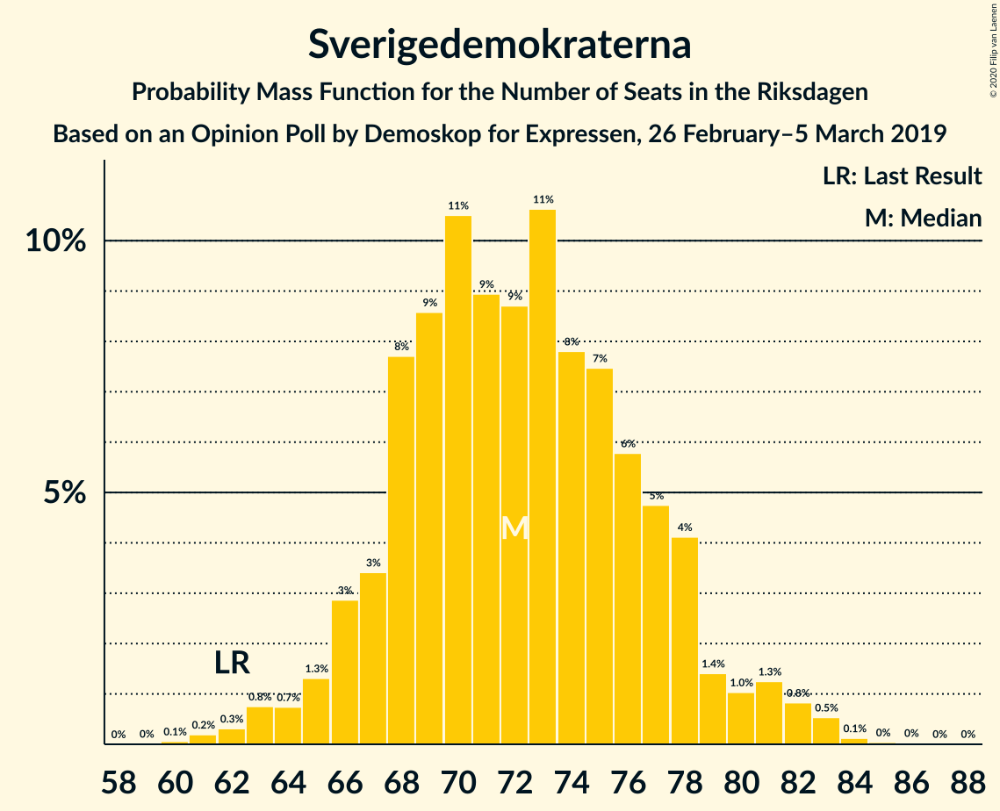
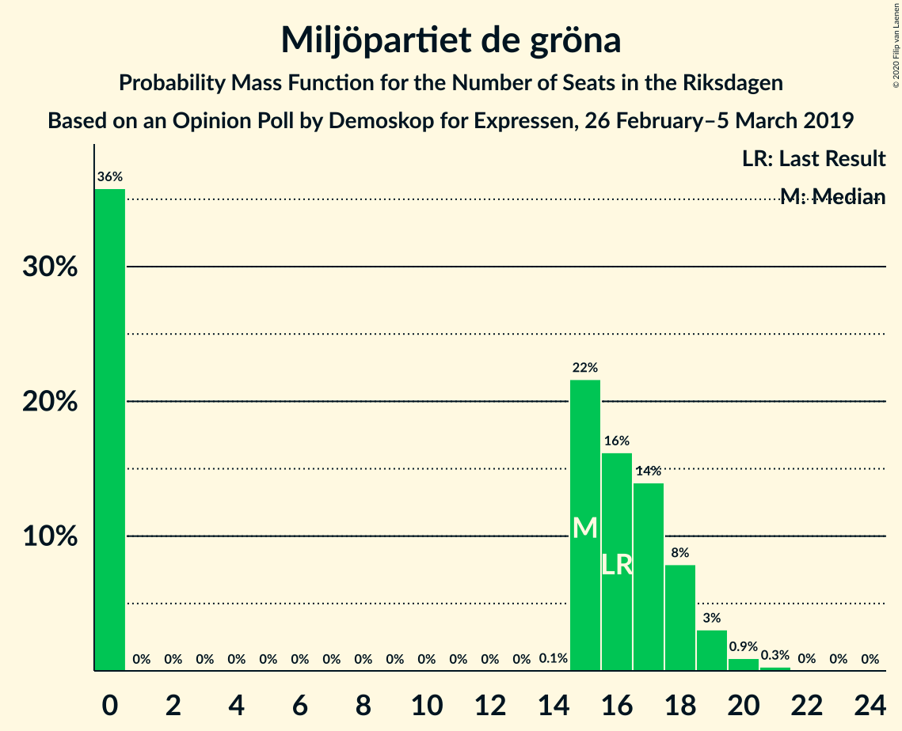
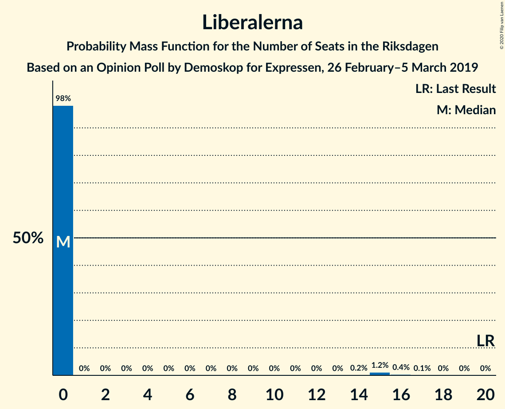
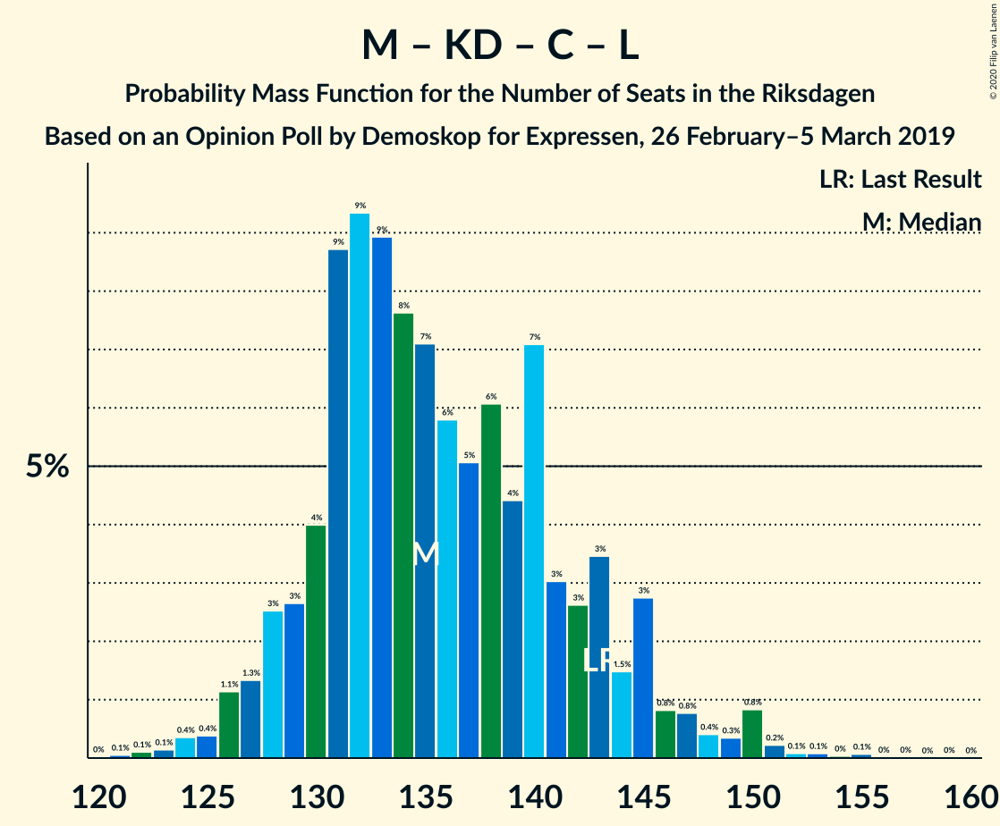

# Opinion Poll by Demoskop for Expressen, 26 February–5 March 2019

<a href="#voting-intentions">Voting Intentions</a> | <a href="#seats">Seats</a> | <a href="#coalitions">Coalitions</a> | <a href="#technical-information">Technical Information</a>

## Voting Intentions

### Confidence Intervals

| Party | Last Result | Poll Result | 80% Confidence Interval | 90% Confidence Interval | 95% Confidence Interval | 99% Confidence Interval |
|:-----:|:-----------:|:-----------:|:-----------------------:|:-----------------------:|:-----------------------:|:-----------------------:|
| Sveriges socialdemokratiska arbetareparti | 28.3% | 25.8% | 24.4–27.3% |24.1–27.7% |23.7–28.0% |23.1–28.7% |
| Sverigedemokraterna | 17.5% | 19.4% | 18.2–20.7% |17.9–21.1% |17.6–21.4% |17.0–22.1% |
| Moderata samlingspartiet | 19.8% | 18.4% | 17.2–19.7% |16.8–20.0% |16.6–20.3% |16.0–21.0% |
| Kristdemokraterna | 6.3% | 10.6% | 9.7–11.7% |9.4–12.0% |9.2–12.2% |8.8–12.7% |
| Vänsterpartiet | 8.0% | 9.3% | 8.4–10.3% |8.2–10.6% |8.0–10.8% |7.6–11.3% |
| Centerpartiet | 8.6% | 7.5% | 6.7–8.4% |6.5–8.7% |6.3–8.9% |6.0–9.4% |
| Miljöpartiet de gröna | 4.4% | 4.1% | 3.5–4.8% |3.4–5.0% |3.2–5.2% |3.0–5.5% |
| Liberalerna | 5.5% | 3.0% | 2.5–3.6% |2.4–3.8% |2.3–3.9% |2.0–4.3% |

*Note:* The poll result column reflects the actual value used in the calculations. Published results may vary slightly, and in addition be rounded to fewer digits.

## Seats

### Confidence Intervals

| Party | Last Result | Median | 80% Confidence Interval | 90% Confidence Interval | 95% Confidence Interval | 99% Confidence Interval |
|:-----:|:-----------:|:------:|:-----------------------:|:-----------------------:|:-----------------------:|:-----------------------:|
| <a href="#sveriges-socialdemokratiska-arbetareparti">Sveriges socialdemokratiska arbetareparti</a> | 100 | 93 | 89–95 |89–95 |89–96 |89–100 |
| <a href="#sverigedemokraterna">Sverigedemokraterna</a> | 62 | 77 | 71–77 |71–77 |71–77 |65–77 |
| <a href="#moderata-samlingspartiet">Moderata samlingspartiet</a> | 70 | 72 | 64–73 |64–73 |64–82 |64–82 |
| <a href="#kristdemokraterna">Kristdemokraterna</a> | 22 | 40 | 36–45 |36–45 |36–45 |36–45 |
| <a href="#vänsterpartiet">Vänsterpartiet</a> | 28 | 31 | 27–31 |27–31 |27–38 |27–38 |
| <a href="#centerpartiet">Centerpartiet</a> | 31 | 36 | 28–36 |26–36 |26–36 |26–36 |
| <a href="#miljöpartiet-de-gröna">Miljöpartiet de gröna</a> | 16 | 0 | 0–17 |0–17 |0–17 |0–20 |
| <a href="#liberalerna">Liberalerna</a> | 20 | 0 | 0 |0 |0 |0 |

### Sveriges socialdemokratiska arbetareparti

*For a full overview of the results for this party, see the [Sveriges socialdemokratiska arbetareparti](party-sverigessocialdemokratiskaarbetareparti.html) page.*

| Number of Seats | Probability | Accumulated | Special Marks |
|:---------------:|:-----------:|:-----------:|:-------------:|
| 84 | 0.1% | 100% |  |
| 85 | 0% | 99.9% |  |
| 86 | 0% | 99.9% |  |
| 87 | 0% | 99.9% |  |
| 88 | 0% | 99.9% |  |
| 89 | 18% | 99.9% |  |
| 90 | 0% | 82% |  |
| 91 | 0% | 82% |  |
| 92 | 0% | 82% |  |
| 93 | 53% | 82% | Median |
| 94 | 1.4% | 28% |  |
| 95 | 22% | 27% |  |
| 96 | 4% | 5% |  |
| 97 | 0% | 1.0% |  |
| 98 | 0.4% | 1.0% |  |
| 99 | 0% | 0.6% |  |
| 100 | 0.5% | 0.6% | Last Result |
| 101 | 0.1% | 0.1% |  |
| 102 | 0% | 0.1% |  |
| 103 | 0% | 0.1% |  |
| 104 | 0% | 0% |  |

### Sverigedemokraterna

*For a full overview of the results for this party, see the [Sverigedemokraterna](party-sverigedemokraterna.html) page.*

| Number of Seats | Probability | Accumulated | Special Marks |
|:---------------:|:-----------:|:-----------:|:-------------:|
| 62 | 0.1% | 100% | Last Result |
| 63 | 0% | 99.9% |  |
| 64 | 0% | 99.9% |  |
| 65 | 0.8% | 99.9% |  |
| 66 | 0% | 99.1% |  |
| 67 | 0% | 99.1% |  |
| 68 | 0% | 99.1% |  |
| 69 | 0% | 99.1% |  |
| 70 | 0% | 99.1% |  |
| 71 | 24% | 99.1% |  |
| 72 | 0% | 76% |  |
| 73 | 0% | 76% |  |
| 74 | 22% | 76% |  |
| 75 | 0% | 54% |  |
| 76 | 0% | 54% |  |
| 77 | 53% | 54% | Median |
| 78 | 0% | 0.1% |  |
| 79 | 0% | 0.1% |  |
| 80 | 0% | 0.1% |  |
| 81 | 0% | 0.1% |  |
| 82 | 0% | 0.1% |  |
| 83 | 0% | 0.1% |  |
| 84 | 0% | 0% |  |

### Moderata samlingspartiet

*For a full overview of the results for this party, see the [Moderata samlingspartiet](party-moderatasamlingspartiet.html) page.*

| Number of Seats | Probability | Accumulated | Special Marks |
|:---------------:|:-----------:|:-----------:|:-------------:|
| 60 | 0.4% | 100% |  |
| 61 | 0% | 99.6% |  |
| 62 | 0% | 99.6% |  |
| 63 | 0% | 99.6% |  |
| 64 | 22% | 99.6% |  |
| 65 | 0% | 78% |  |
| 66 | 0.1% | 78% |  |
| 67 | 0% | 78% |  |
| 68 | 1.4% | 78% |  |
| 69 | 0.5% | 76% |  |
| 70 | 0% | 76% | Last Result |
| 71 | 0% | 76% |  |
| 72 | 53% | 76% | Median |
| 73 | 18% | 22% |  |
| 74 | 0% | 4% |  |
| 75 | 0% | 4% |  |
| 76 | 0% | 4% |  |
| 77 | 0% | 4% |  |
| 78 | 0% | 4% |  |
| 79 | 0% | 4% |  |
| 80 | 0% | 4% |  |
| 81 | 0% | 4% |  |
| 82 | 4% | 4% |  |
| 83 | 0% | 0% |  |

### Kristdemokraterna

*For a full overview of the results for this party, see the [Kristdemokraterna](party-kristdemokraterna.html) page.*

| Number of Seats | Probability | Accumulated | Special Marks |
|:---------------:|:-----------:|:-----------:|:-------------:|
| 22 | 0% | 100% | Last Result |
| 23 | 0% | 100% |  |
| 24 | 0% | 100% |  |
| 25 | 0% | 100% |  |
| 26 | 0% | 100% |  |
| 27 | 0% | 100% |  |
| 28 | 0% | 100% |  |
| 29 | 0% | 100% |  |
| 30 | 0% | 100% |  |
| 31 | 0% | 100% |  |
| 32 | 0% | 100% |  |
| 33 | 0.4% | 100% |  |
| 34 | 0% | 99.6% |  |
| 35 | 0% | 99.6% |  |
| 36 | 22% | 99.6% |  |
| 37 | 0.3% | 78% |  |
| 38 | 0% | 77% |  |
| 39 | 0.5% | 77% |  |
| 40 | 53% | 77% | Median |
| 41 | 0% | 24% |  |
| 42 | 0% | 23% |  |
| 43 | 1.4% | 23% |  |
| 44 | 0% | 22% |  |
| 45 | 22% | 22% |  |
| 46 | 0% | 0.1% |  |
| 47 | 0% | 0% |  |

### Vänsterpartiet

*For a full overview of the results for this party, see the [Vänsterpartiet](party-vänsterpartiet.html) page.*

| Number of Seats | Probability | Accumulated | Special Marks |
|:---------------:|:-----------:|:-----------:|:-------------:|
| 27 | 23% | 100% |  |
| 28 | 0% | 77% | Last Result |
| 29 | 0% | 77% |  |
| 30 | 0.2% | 77% |  |
| 31 | 72% | 76% | Median |
| 32 | 0.9% | 5% |  |
| 33 | 0% | 4% |  |
| 34 | 0% | 4% |  |
| 35 | 0% | 4% |  |
| 36 | 0% | 4% |  |
| 37 | 0% | 4% |  |
| 38 | 4% | 4% |  |
| 39 | 0% | 0.1% |  |
| 40 | 0% | 0.1% |  |
| 41 | 0% | 0% |  |

### Centerpartiet

*For a full overview of the results for this party, see the [Centerpartiet](party-centerpartiet.html) page.*

| Number of Seats | Probability | Accumulated | Special Marks |
|:---------------:|:-----------:|:-----------:|:-------------:|
| 23 | 0.1% | 100% |  |
| 24 | 0% | 99.9% |  |
| 25 | 0% | 99.9% |  |
| 26 | 5% | 99.8% |  |
| 27 | 0.4% | 95% |  |
| 28 | 22% | 94% |  |
| 29 | 0.5% | 72% |  |
| 30 | 0% | 72% |  |
| 31 | 0.1% | 72% | Last Result |
| 32 | 18% | 72% |  |
| 33 | 0% | 53% |  |
| 34 | 0% | 53% |  |
| 35 | 0% | 53% |  |
| 36 | 53% | 53% | Median |
| 37 | 0% | 0% |  |

### Miljöpartiet de gröna

*For a full overview of the results for this party, see the [Miljöpartiet de gröna](party-miljöpartietdegröna.html) page.*

| Number of Seats | Probability | Accumulated | Special Marks |
|:---------------:|:-----------:|:-----------:|:-------------:|
| 0 | 57% | 100% | Median |
| 1 | 0% | 43% |  |
| 2 | 0% | 43% |  |
| 3 | 0% | 43% |  |
| 4 | 0% | 43% |  |
| 5 | 0% | 43% |  |
| 6 | 0% | 43% |  |
| 7 | 0% | 43% |  |
| 8 | 0% | 43% |  |
| 9 | 0% | 43% |  |
| 10 | 0% | 43% |  |
| 11 | 0% | 43% |  |
| 12 | 0% | 43% |  |
| 13 | 0% | 43% |  |
| 14 | 0% | 43% |  |
| 15 | 0.5% | 43% |  |
| 16 | 22% | 42% | Last Result |
| 17 | 18% | 20% |  |
| 18 | 0% | 2% |  |
| 19 | 0.4% | 2% |  |
| 20 | 1.4% | 1.4% |  |
| 21 | 0% | 0% |  |

### Liberalerna

*For a full overview of the results for this party, see the [Liberalerna](party-liberalerna.html) page.*

| Number of Seats | Probability | Accumulated | Special Marks |
|:---------------:|:-----------:|:-----------:|:-------------:|
| 0 | 99.6% | 100% | Median |
| 1 | 0% | 0.4% |  |
| 2 | 0% | 0.4% |  |
| 3 | 0% | 0.4% |  |
| 4 | 0% | 0.4% |  |
| 5 | 0% | 0.4% |  |
| 6 | 0% | 0.4% |  |
| 7 | 0% | 0.4% |  |
| 8 | 0% | 0.4% |  |
| 9 | 0% | 0.4% |  |
| 10 | 0% | 0.4% |  |
| 11 | 0% | 0.4% |  |
| 12 | 0% | 0.4% |  |
| 13 | 0% | 0.4% |  |
| 14 | 0% | 0.4% |  |
| 15 | 0.4% | 0.4% |  |
| 16 | 0% | 0% |  |
| 17 | 0% | 0% |  |
| 18 | 0% | 0% |  |
| 19 | 0% | 0% |  |
| 20 | 0% | 0% | Last Result |

## Coalitions

### Confidence Intervals

| Coalition | Last Result | Median | Majority? | 80% Confidence Interval | 90% Confidence Interval | 95% Confidence Interval | 99% Confidence Interval |
|:---------:|:-----------:|:------:|:---------:|:-----------------------:|:-----------------------:|:-----------------------:|:-----------------------:|
| Sveriges socialdemokratiska arbetareparti – Moderata samlingspartiet – Centerpartiet | 201 | 201 | 100% | 187–201 | 187–201 | 187–204 | 185–204 |
| Sverigedemokraterna – Moderata samlingspartiet – Kristdemokraterna | 154 | 189 | 99.1% | 180–189 | 180–189 | 180–189 | 173–189 |
| Sveriges socialdemokratiska arbetareparti – Moderata samlingspartiet | 170 | 165 | 4% | 159–165 | 159–165 | 159–178 | 158–178 |
| Sveriges socialdemokratiska arbetareparti – Vänsterpartiet – Centerpartiet – Miljöpartiet de gröna – Liberalerna | 195 | 160 | 0.9% | 160–169 | 160–169 | 160–169 | 160–176 |
| Sverigedemokraterna – Moderata samlingspartiet | 132 | 149 | 0% | 138–149 | 138–149 | 138–153 | 134–153 |
| Moderata samlingspartiet – Kristdemokraterna – Centerpartiet – Liberalerna | 143 | 148 | 0% | 137–148 | 137–148 | 137–148 | 135–148 |
| Moderata samlingspartiet – Kristdemokraterna – Centerpartiet | 123 | 148 | 0% | 137–148 | 137–148 | 137–148 | 133–148 |
| Sveriges socialdemokratiska arbetareparti – Centerpartiet – Miljöpartiet de gröna – Liberalerna | 167 | 129 | 0% | 129–139 | 129–139 | 122–139 | 122–144 |
| Sveriges socialdemokratiska arbetareparti – Vänsterpartiet – Miljöpartiet de gröna | 144 | 124 | 0% | 124–138 | 124–138 | 124–138 | 124–147 |
| Sveriges socialdemokratiska arbetareparti – Vänsterpartiet | 128 | 124 | 0% | 120–124 | 120–124 | 120–134 | 120–134 |
| Sveriges socialdemokratiska arbetareparti – Miljöpartiet de gröna | 116 | 93 | 0% | 93–111 | 93–111 | 93–111 | 93–115 |
| Moderata samlingspartiet – Centerpartiet – Liberalerna | 121 | 108 | 0% | 92–108 | 92–108 | 92–108 | 92–108 |
| Moderata samlingspartiet – Centerpartiet | 101 | 108 | 0% | 92–108 | 92–108 | 92–108 | 92–108 |

### Sveriges socialdemokratiska arbetareparti – Moderata samlingspartiet – Centerpartiet

| Number of Seats | Probability | Accumulated | Special Marks |
|:---------------:|:-----------:|:-----------:|:-------------:|
| 178 | 0% | 100% |  |
| 179 | 0% | 99.9% |  |
| 180 | 0% | 99.9% |  |
| 181 | 0% | 99.9% |  |
| 182 | 0% | 99.9% |  |
| 183 | 0% | 99.9% |  |
| 184 | 0% | 99.9% |  |
| 185 | 0.4% | 99.9% |  |
| 186 | 0% | 99.5% |  |
| 187 | 22% | 99.5% |  |
| 188 | 1.4% | 78% |  |
| 189 | 0% | 76% |  |
| 190 | 0% | 76% |  |
| 191 | 0% | 76% |  |
| 192 | 0% | 76% |  |
| 193 | 0% | 76% |  |
| 194 | 18% | 76% |  |
| 195 | 0% | 58% |  |
| 196 | 0% | 58% |  |
| 197 | 0% | 58% |  |
| 198 | 0.5% | 58% |  |
| 199 | 0% | 57% |  |
| 200 | 0% | 57% |  |
| 201 | 53% | 57% | Last Result, Median |
| 202 | 0% | 4% |  |
| 203 | 0% | 4% |  |
| 204 | 4% | 4% |  |
| 205 | 0% | 0.1% |  |
| 206 | 0% | 0.1% |  |
| 207 | 0% | 0.1% |  |
| 208 | 0% | 0.1% |  |
| 209 | 0% | 0.1% |  |
| 210 | 0% | 0.1% |  |
| 211 | 0% | 0% |  |

### Sverigedemokraterna – Moderata samlingspartiet – Kristdemokraterna

| Number of Seats | Probability | Accumulated | Special Marks |
|:---------------:|:-----------:|:-----------:|:-------------:|
| 154 | 0% | 100% | Last Result |
| 155 | 0% | 100% |  |
| 156 | 0% | 100% |  |
| 157 | 0% | 100% |  |
| 158 | 0.3% | 100% |  |
| 159 | 0% | 99.7% |  |
| 160 | 0% | 99.6% |  |
| 161 | 0% | 99.6% |  |
| 162 | 0% | 99.6% |  |
| 163 | 0% | 99.6% |  |
| 164 | 0% | 99.6% |  |
| 165 | 0% | 99.6% |  |
| 166 | 0% | 99.6% |  |
| 167 | 0% | 99.6% |  |
| 168 | 0% | 99.6% |  |
| 169 | 0% | 99.6% |  |
| 170 | 0% | 99.6% |  |
| 171 | 0% | 99.6% |  |
| 172 | 0% | 99.6% |  |
| 173 | 0.5% | 99.6% |  |
| 174 | 0% | 99.1% |  |
| 175 | 0% | 99.1% | Majority |
| 176 | 0% | 99.1% |  |
| 177 | 0% | 99.1% |  |
| 178 | 0% | 99.1% |  |
| 179 | 0% | 99.0% |  |
| 180 | 18% | 99.0% |  |
| 181 | 0.2% | 81% |  |
| 182 | 1.4% | 81% |  |
| 183 | 22% | 79% |  |
| 184 | 0% | 57% |  |
| 185 | 0% | 57% |  |
| 186 | 0% | 57% |  |
| 187 | 0% | 57% |  |
| 188 | 0% | 57% |  |
| 189 | 57% | 57% | Median |
| 190 | 0% | 0.1% |  |
| 191 | 0% | 0.1% |  |
| 192 | 0% | 0.1% |  |
| 193 | 0% | 0% |  |

### Sveriges socialdemokratiska arbetareparti – Moderata samlingspartiet

| Number of Seats | Probability | Accumulated | Special Marks |
|:---------------:|:-----------:|:-----------:|:-------------:|
| 154 | 0.1% | 100% |  |
| 155 | 0% | 99.9% |  |
| 156 | 0% | 99.9% |  |
| 157 | 0% | 99.9% |  |
| 158 | 0.4% | 99.9% |  |
| 159 | 22% | 99.5% |  |
| 160 | 0% | 78% |  |
| 161 | 0% | 78% |  |
| 162 | 20% | 78% |  |
| 163 | 0% | 58% |  |
| 164 | 0% | 58% |  |
| 165 | 53% | 58% | Median |
| 166 | 0% | 4% |  |
| 167 | 0% | 4% |  |
| 168 | 0% | 4% |  |
| 169 | 0.5% | 4% |  |
| 170 | 0% | 4% | Last Result |
| 171 | 0% | 4% |  |
| 172 | 0% | 4% |  |
| 173 | 0% | 4% |  |
| 174 | 0% | 4% |  |
| 175 | 0% | 4% | Majority |
| 176 | 0% | 4% |  |
| 177 | 0% | 4% |  |
| 178 | 4% | 4% |  |
| 179 | 0% | 0.1% |  |
| 180 | 0% | 0% |  |

### Sveriges socialdemokratiska arbetareparti – Vänsterpartiet – Centerpartiet – Miljöpartiet de gröna – Liberalerna

| Number of Seats | Probability | Accumulated | Special Marks |
|:---------------:|:-----------:|:-----------:|:-------------:|
| 157 | 0% | 100% |  |
| 158 | 0% | 99.9% |  |
| 159 | 0% | 99.9% |  |
| 160 | 57% | 99.9% | Median |
| 161 | 0% | 43% |  |
| 162 | 0% | 43% |  |
| 163 | 0% | 43% |  |
| 164 | 0% | 43% |  |
| 165 | 0% | 43% |  |
| 166 | 22% | 43% |  |
| 167 | 1.4% | 21% |  |
| 168 | 0.2% | 19% |  |
| 169 | 18% | 19% |  |
| 170 | 0% | 1.0% |  |
| 171 | 0% | 1.0% |  |
| 172 | 0% | 0.9% |  |
| 173 | 0% | 0.9% |  |
| 174 | 0% | 0.9% |  |
| 175 | 0% | 0.9% | Majority |
| 176 | 0.5% | 0.9% |  |
| 177 | 0% | 0.4% |  |
| 178 | 0% | 0.4% |  |
| 179 | 0% | 0.4% |  |
| 180 | 0% | 0.4% |  |
| 181 | 0% | 0.4% |  |
| 182 | 0% | 0.4% |  |
| 183 | 0% | 0.4% |  |
| 184 | 0% | 0.4% |  |
| 185 | 0% | 0.4% |  |
| 186 | 0% | 0.4% |  |
| 187 | 0% | 0.4% |  |
| 188 | 0% | 0.4% |  |
| 189 | 0% | 0.4% |  |
| 190 | 0% | 0.4% |  |
| 191 | 0.3% | 0.3% |  |
| 192 | 0% | 0% |  |
| 193 | 0% | 0% |  |
| 194 | 0% | 0% |  |
| 195 | 0% | 0% | Last Result |

### Sverigedemokraterna – Moderata samlingspartiet

| Number of Seats | Probability | Accumulated | Special Marks |
|:---------------:|:-----------:|:-----------:|:-------------:|
| 125 | 0.3% | 100% |  |
| 126 | 0% | 99.6% |  |
| 127 | 0% | 99.6% |  |
| 128 | 0% | 99.6% |  |
| 129 | 0% | 99.6% |  |
| 130 | 0% | 99.6% |  |
| 131 | 0% | 99.6% |  |
| 132 | 0% | 99.6% | Last Result |
| 133 | 0% | 99.6% |  |
| 134 | 0.5% | 99.6% |  |
| 135 | 0% | 99.1% |  |
| 136 | 0% | 99.1% |  |
| 137 | 0% | 99.1% |  |
| 138 | 22% | 99.1% |  |
| 139 | 1.4% | 77% |  |
| 140 | 0.1% | 76% |  |
| 141 | 0% | 76% |  |
| 142 | 0% | 76% |  |
| 143 | 0% | 76% |  |
| 144 | 18% | 76% |  |
| 145 | 0% | 57% |  |
| 146 | 0% | 57% |  |
| 147 | 0% | 57% |  |
| 148 | 0% | 57% |  |
| 149 | 53% | 57% | Median |
| 150 | 0% | 4% |  |
| 151 | 0% | 4% |  |
| 152 | 0% | 4% |  |
| 153 | 4% | 4% |  |
| 154 | 0% | 0% |  |

### Moderata samlingspartiet – Kristdemokraterna – Centerpartiet – Liberalerna

| Number of Seats | Probability | Accumulated | Special Marks |
|:---------------:|:-----------:|:-----------:|:-------------:|
| 128 | 0% | 100% |  |
| 129 | 0% | 99.9% |  |
| 130 | 0% | 99.9% |  |
| 131 | 0% | 99.9% |  |
| 132 | 0% | 99.9% |  |
| 133 | 0% | 99.9% |  |
| 134 | 0% | 99.9% |  |
| 135 | 0.4% | 99.9% |  |
| 136 | 0% | 99.5% |  |
| 137 | 24% | 99.5% |  |
| 138 | 0% | 76% |  |
| 139 | 0% | 76% |  |
| 140 | 0% | 76% |  |
| 141 | 18% | 76% |  |
| 142 | 0.3% | 58% |  |
| 143 | 0% | 57% | Last Result |
| 144 | 4% | 57% |  |
| 145 | 0% | 54% |  |
| 146 | 0% | 54% |  |
| 147 | 0% | 54% |  |
| 148 | 53% | 54% | Median |
| 149 | 0% | 0.1% |  |
| 150 | 0% | 0.1% |  |
| 151 | 0% | 0.1% |  |
| 152 | 0% | 0.1% |  |
| 153 | 0% | 0.1% |  |
| 154 | 0% | 0.1% |  |
| 155 | 0% | 0% |  |

### Moderata samlingspartiet – Kristdemokraterna – Centerpartiet

| Number of Seats | Probability | Accumulated | Special Marks |
|:---------------:|:-----------:|:-----------:|:-------------:|
| 120 | 0.4% | 100% |  |
| 121 | 0% | 99.6% |  |
| 122 | 0% | 99.6% |  |
| 123 | 0% | 99.6% | Last Result |
| 124 | 0% | 99.6% |  |
| 125 | 0% | 99.6% |  |
| 126 | 0% | 99.6% |  |
| 127 | 0% | 99.6% |  |
| 128 | 0% | 99.6% |  |
| 129 | 0% | 99.6% |  |
| 130 | 0% | 99.6% |  |
| 131 | 0% | 99.5% |  |
| 132 | 0% | 99.5% |  |
| 133 | 0% | 99.5% |  |
| 134 | 0% | 99.5% |  |
| 135 | 0% | 99.5% |  |
| 136 | 0% | 99.4% |  |
| 137 | 24% | 99.4% |  |
| 138 | 0% | 76% |  |
| 139 | 0% | 76% |  |
| 140 | 0% | 76% |  |
| 141 | 18% | 76% |  |
| 142 | 0.2% | 58% |  |
| 143 | 0% | 57% |  |
| 144 | 4% | 57% |  |
| 145 | 0% | 54% |  |
| 146 | 0% | 54% |  |
| 147 | 0% | 54% |  |
| 148 | 53% | 54% | Median |
| 149 | 0% | 0.1% |  |
| 150 | 0% | 0.1% |  |
| 151 | 0% | 0.1% |  |
| 152 | 0% | 0.1% |  |
| 153 | 0% | 0.1% |  |
| 154 | 0% | 0.1% |  |
| 155 | 0% | 0% |  |

### Sveriges socialdemokratiska arbetareparti – Centerpartiet – Miljöpartiet de gröna – Liberalerna

| Number of Seats | Probability | Accumulated | Special Marks |
|:---------------:|:-----------:|:-----------:|:-------------:|
| 120 | 0% | 100% |  |
| 121 | 0% | 99.9% |  |
| 122 | 4% | 99.9% |  |
| 123 | 0% | 96% |  |
| 124 | 0% | 96% |  |
| 125 | 0% | 96% |  |
| 126 | 0% | 96% |  |
| 127 | 0% | 96% |  |
| 128 | 0% | 96% |  |
| 129 | 53% | 96% | Median |
| 130 | 0% | 43% |  |
| 131 | 0% | 43% |  |
| 132 | 0.1% | 43% |  |
| 133 | 0% | 43% |  |
| 134 | 0% | 43% |  |
| 135 | 0% | 43% |  |
| 136 | 0% | 43% |  |
| 137 | 0% | 43% |  |
| 138 | 18% | 43% |  |
| 139 | 22% | 24% |  |
| 140 | 1.4% | 2% |  |
| 141 | 0% | 0.9% |  |
| 142 | 0% | 0.9% |  |
| 143 | 0% | 0.9% |  |
| 144 | 0.5% | 0.9% |  |
| 145 | 0% | 0.4% |  |
| 146 | 0% | 0.4% |  |
| 147 | 0% | 0.4% |  |
| 148 | 0% | 0.4% |  |
| 149 | 0% | 0.4% |  |
| 150 | 0% | 0.4% |  |
| 151 | 0% | 0.4% |  |
| 152 | 0% | 0.4% |  |
| 153 | 0% | 0.4% |  |
| 154 | 0% | 0.4% |  |
| 155 | 0% | 0.4% |  |
| 156 | 0% | 0.4% |  |
| 157 | 0% | 0.4% |  |
| 158 | 0% | 0.4% |  |
| 159 | 0.3% | 0.3% |  |
| 160 | 0% | 0% |  |
| 161 | 0% | 0% |  |
| 162 | 0% | 0% |  |
| 163 | 0% | 0% |  |
| 164 | 0% | 0% |  |
| 165 | 0% | 0% |  |
| 166 | 0% | 0% |  |
| 167 | 0% | 0% | Last Result |

### Sveriges socialdemokratiska arbetareparti – Vänsterpartiet – Miljöpartiet de gröna

| Number of Seats | Probability | Accumulated | Special Marks |
|:---------------:|:-----------:|:-----------:|:-------------:|
| 124 | 53% | 100% | Median |
| 125 | 0% | 47% |  |
| 126 | 0% | 47% |  |
| 127 | 0% | 47% |  |
| 128 | 0% | 47% |  |
| 129 | 0% | 47% |  |
| 130 | 0% | 47% |  |
| 131 | 0% | 47% |  |
| 132 | 0% | 47% |  |
| 133 | 0.1% | 47% |  |
| 134 | 4% | 46% |  |
| 135 | 0% | 43% |  |
| 136 | 0.3% | 43% |  |
| 137 | 18% | 42% |  |
| 138 | 22% | 24% |  |
| 139 | 0% | 2% |  |
| 140 | 0% | 2% |  |
| 141 | 1.4% | 2% |  |
| 142 | 0% | 0.9% |  |
| 143 | 0% | 0.9% |  |
| 144 | 0% | 0.9% | Last Result |
| 145 | 0% | 0.9% |  |
| 146 | 0% | 0.9% |  |
| 147 | 0.5% | 0.9% |  |
| 148 | 0% | 0.4% |  |
| 149 | 0.4% | 0.4% |  |
| 150 | 0% | 0.1% |  |
| 151 | 0% | 0% |  |

### Sveriges socialdemokratiska arbetareparti – Vänsterpartiet

| Number of Seats | Probability | Accumulated | Special Marks |
|:---------------:|:-----------:|:-----------:|:-------------:|
| 119 | 0.2% | 100% |  |
| 120 | 18% | 99.8% |  |
| 121 | 1.4% | 82% |  |
| 122 | 22% | 80% |  |
| 123 | 0% | 58% |  |
| 124 | 53% | 58% | Median |
| 125 | 0% | 5% |  |
| 126 | 0% | 5% |  |
| 127 | 0% | 5% |  |
| 128 | 0% | 5% | Last Result |
| 129 | 0% | 5% |  |
| 130 | 0.4% | 5% |  |
| 131 | 0% | 4% |  |
| 132 | 0.5% | 4% |  |
| 133 | 0.1% | 4% |  |
| 134 | 4% | 4% |  |
| 135 | 0% | 0.1% |  |
| 136 | 0% | 0.1% |  |
| 137 | 0% | 0.1% |  |
| 138 | 0% | 0% |  |

### Sveriges socialdemokratiska arbetareparti – Miljöpartiet de gröna

| Number of Seats | Probability | Accumulated | Special Marks |
|:---------------:|:-----------:|:-----------:|:-------------:|
| 93 | 53% | 100% | Median |
| 94 | 0% | 46% |  |
| 95 | 0% | 46% |  |
| 96 | 4% | 46% |  |
| 97 | 0% | 43% |  |
| 98 | 0% | 43% |  |
| 99 | 0% | 43% |  |
| 100 | 0% | 43% |  |
| 101 | 0.1% | 43% |  |
| 102 | 0% | 43% |  |
| 103 | 0% | 43% |  |
| 104 | 0% | 43% |  |
| 105 | 0% | 43% |  |
| 106 | 18% | 43% |  |
| 107 | 0% | 24% |  |
| 108 | 0% | 24% |  |
| 109 | 0% | 24% |  |
| 110 | 0% | 24% |  |
| 111 | 22% | 24% |  |
| 112 | 0% | 2% |  |
| 113 | 0% | 2% |  |
| 114 | 1.4% | 2% |  |
| 115 | 0.5% | 0.9% |  |
| 116 | 0% | 0.4% | Last Result |
| 117 | 0.4% | 0.4% |  |
| 118 | 0% | 0% |  |

### Moderata samlingspartiet – Centerpartiet – Liberalerna

| Number of Seats | Probability | Accumulated | Special Marks |
|:---------------:|:-----------:|:-----------:|:-------------:|
| 87 | 0% | 100% |  |
| 88 | 0% | 99.9% |  |
| 89 | 0% | 99.9% |  |
| 90 | 0% | 99.9% |  |
| 91 | 0% | 99.9% |  |
| 92 | 22% | 99.9% |  |
| 93 | 0% | 78% |  |
| 94 | 1.4% | 78% |  |
| 95 | 0% | 77% |  |
| 96 | 0% | 77% |  |
| 97 | 0% | 77% |  |
| 98 | 0.5% | 77% |  |
| 99 | 0% | 76% |  |
| 100 | 0% | 76% |  |
| 101 | 0% | 76% |  |
| 102 | 0.4% | 76% |  |
| 103 | 0% | 76% |  |
| 104 | 0% | 76% |  |
| 105 | 18% | 76% |  |
| 106 | 0% | 57% |  |
| 107 | 0% | 57% |  |
| 108 | 57% | 57% | Median |
| 109 | 0.1% | 0.1% |  |
| 110 | 0% | 0% |  |
| 111 | 0% | 0% |  |
| 112 | 0% | 0% |  |
| 113 | 0% | 0% |  |
| 114 | 0% | 0% |  |
| 115 | 0% | 0% |  |
| 116 | 0% | 0% |  |
| 117 | 0% | 0% |  |
| 118 | 0% | 0% |  |
| 119 | 0% | 0% |  |
| 120 | 0% | 0% |  |
| 121 | 0% | 0% | Last Result |

### Moderata samlingspartiet – Centerpartiet

| Number of Seats | Probability | Accumulated | Special Marks |
|:---------------:|:-----------:|:-----------:|:-------------:|
| 85 | 0% | 100% |  |
| 86 | 0% | 99.9% |  |
| 87 | 0.4% | 99.9% |  |
| 88 | 0% | 99.5% |  |
| 89 | 0% | 99.5% |  |
| 90 | 0% | 99.5% |  |
| 91 | 0% | 99.5% |  |
| 92 | 22% | 99.5% |  |
| 93 | 0% | 78% |  |
| 94 | 1.4% | 78% |  |
| 95 | 0% | 76% |  |
| 96 | 0% | 76% |  |
| 97 | 0% | 76% |  |
| 98 | 0.5% | 76% |  |
| 99 | 0% | 76% |  |
| 100 | 0% | 76% |  |
| 101 | 0% | 76% | Last Result |
| 102 | 0% | 76% |  |
| 103 | 0% | 76% |  |
| 104 | 0% | 76% |  |
| 105 | 18% | 76% |  |
| 106 | 0% | 57% |  |
| 107 | 0% | 57% |  |
| 108 | 57% | 57% | Median |
| 109 | 0.1% | 0.1% |  |
| 110 | 0% | 0% |  |

## Technical Information

### Opinion Poll

+ **Polling firm:** Demoskop
+ **Commissioner(s):** Expressen
+ **Fieldwork period:** 26 February–5 March 2019

### Calculations

+ **Sample size:** 1611
+ **Simulations done:** 1,024
+ **Error estimate:** 1.17%

