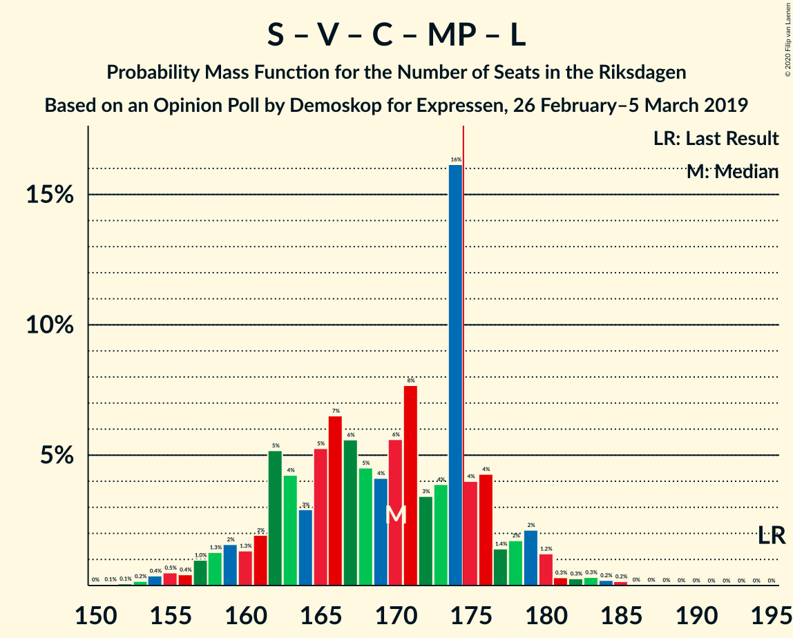
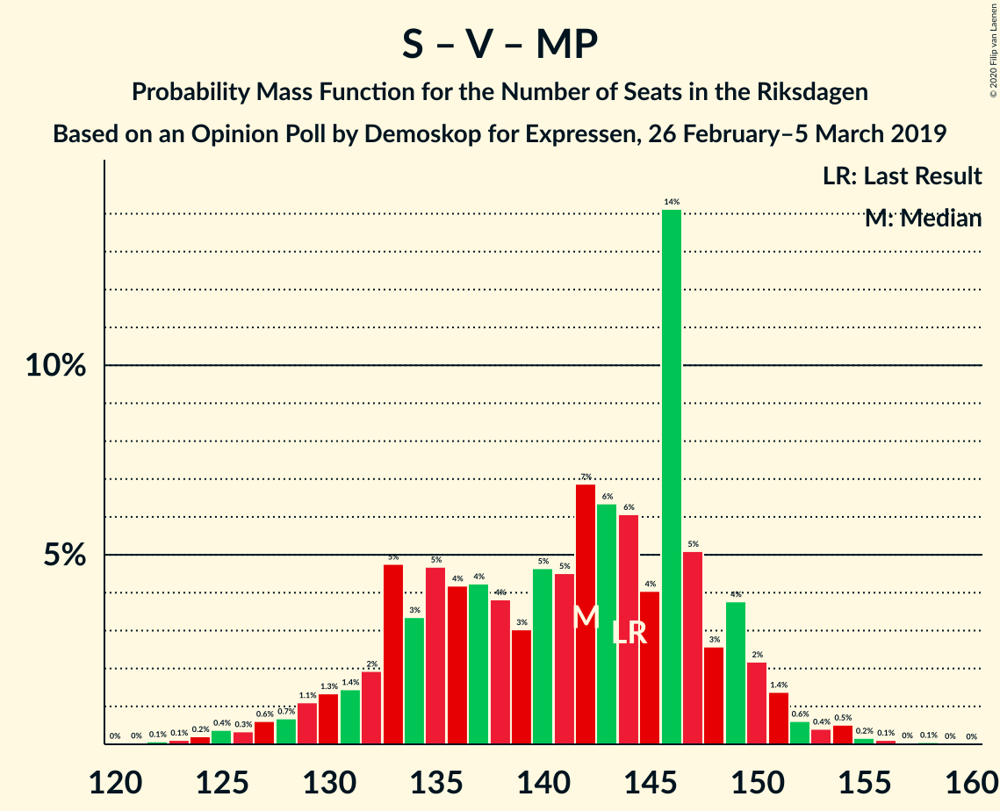
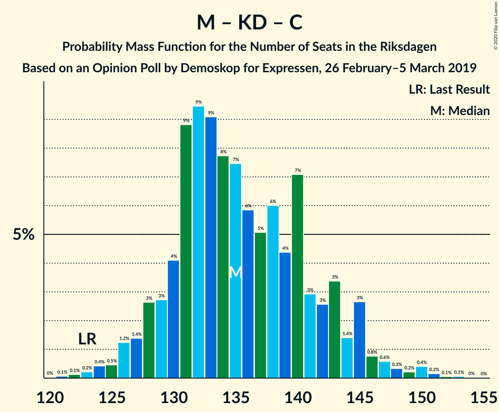
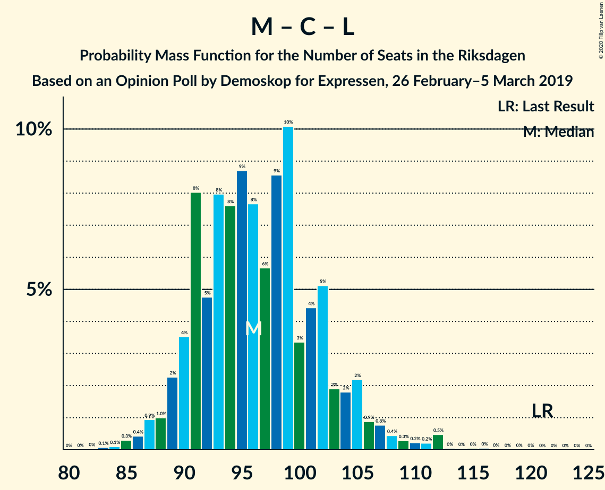

# Opinion Poll by Demoskop for Expressen, 26 February–5 March 2019

<a href="#voting-intentions">Voting Intentions</a> | <a href="#seats">Seats</a> | <a href="#coalitions">Coalitions</a> | <a href="#technical-information">Technical Information</a>

## Voting Intentions

### Confidence Intervals

| Party | Last Result | Poll Result | 80% Confidence Interval | 90% Confidence Interval | 95% Confidence Interval | 99% Confidence Interval |
|:-----:|:-----------:|:-----------:|:-----------------------:|:-----------------------:|:-----------------------:|:-----------------------:|
| Sveriges socialdemokratiska arbetareparti | 28.3% | 25.8% | 24.4–27.3% |24.1–27.7% |23.7–28.0% |23.1–28.7% |
| Sverigedemokraterna | 17.5% | 19.4% | 18.2–20.7% |17.9–21.1% |17.6–21.4% |17.0–22.1% |
| Moderata samlingspartiet | 19.8% | 18.4% | 17.2–19.7% |16.8–20.0% |16.6–20.3% |16.0–21.0% |
| Kristdemokraterna | 6.3% | 10.6% | 9.7–11.7% |9.4–12.0% |9.2–12.2% |8.8–12.7% |
| Vänsterpartiet | 8.0% | 9.3% | 8.4–10.3% |8.2–10.6% |8.0–10.8% |7.6–11.3% |
| Centerpartiet | 8.6% | 7.5% | 6.7–8.4% |6.5–8.7% |6.3–8.9% |6.0–9.4% |
| Miljöpartiet de gröna | 4.4% | 4.1% | 3.5–4.8% |3.4–5.0% |3.2–5.2% |3.0–5.5% |
| Liberalerna | 5.5% | 3.0% | 2.5–3.6% |2.4–3.8% |2.3–3.9% |2.0–4.3% |

*Note:* The poll result column reflects the actual value used in the calculations. Published results may vary slightly, and in addition be rounded to fewer digits.

## Seats

### Confidence Intervals

| Party | Last Result | Median | 80% Confidence Interval | 90% Confidence Interval | 95% Confidence Interval | 99% Confidence Interval |
|:-----:|:-----------:|:------:|:-----------------------:|:-----------------------:|:-----------------------:|:-----------------------:|
| <a href="#sveriges-socialdemokratiska-arbetareparti">Sveriges socialdemokratiska arbetareparti</a> | 100 | 96 | 90–101 |89–103 |88–105 |85–108 |
| <a href="#sverigedemokraterna">Sverigedemokraterna</a> | 62 | 72 | 68–77 |66–79 |65–81 |62–83 |
| <a href="#moderata-samlingspartiet">Moderata samlingspartiet</a> | 70 | 68 | 63–73 |62–75 |61–76 |59–79 |
| <a href="#kristdemokraterna">Kristdemokraterna</a> | 22 | 39 | 36–43 |35–44 |34–45 |33–48 |
| <a href="#vänsterpartiet">Vänsterpartiet</a> | 28 | 34 | 31–38 |30–39 |30–40 |28–42 |
| <a href="#centerpartiet">Centerpartiet</a> | 31 | 28 | 25–31 |24–32 |23–33 |22–35 |
| <a href="#miljöpartiet-de-gröna">Miljöpartiet de gröna</a> | 16 | 15 | 0–18 |0–18 |0–19 |0–20 |
| <a href="#liberalerna">Liberalerna</a> | 20 | 0 | 0 |0 |0 |0–15 |

### Sveriges socialdemokratiska arbetareparti

*For a full overview of the results for this party, see the [Sveriges socialdemokratiska arbetareparti](party-sverigessocialdemokratiskaarbetareparti.html) page.*

| Number of Seats | Probability | Accumulated | Special Marks |
|:---------------:|:-----------:|:-----------:|:-------------:|
| 82 | 0% | 100% |  |
| 83 | 0.1% | 99.9% |  |
| 84 | 0.2% | 99.9% |  |
| 85 | 0.3% | 99.6% |  |
| 86 | 0.7% | 99.4% |  |
| 87 | 0.8% | 98.7% |  |
| 88 | 1.3% | 98% |  |
| 89 | 4% | 97% |  |
| 90 | 3% | 93% |  |
| 91 | 6% | 90% |  |
| 92 | 5% | 84% |  |
| 93 | 6% | 78% |  |
| 94 | 7% | 72% |  |
| 95 | 9% | 65% |  |
| 96 | 9% | 56% | Median |
| 97 | 9% | 47% |  |
| 98 | 10% | 38% |  |
| 99 | 7% | 28% |  |
| 100 | 7% | 22% | Last Result |
| 101 | 5% | 15% |  |
| 102 | 2% | 10% |  |
| 103 | 3% | 8% |  |
| 104 | 2% | 5% |  |
| 105 | 1.2% | 3% |  |
| 106 | 0.9% | 2% |  |
| 107 | 0.3% | 1.2% |  |
| 108 | 0.5% | 0.8% |  |
| 109 | 0.1% | 0.3% |  |
| 110 | 0.1% | 0.2% |  |
| 111 | 0.1% | 0.1% |  |
| 112 | 0% | 0% |  |

### Sverigedemokraterna

*For a full overview of the results for this party, see the [Sverigedemokraterna](party-sverigedemokraterna.html) page.*

| Number of Seats | Probability | Accumulated | Special Marks |
|:---------------:|:-----------:|:-----------:|:-------------:|
| 60 | 0.1% | 100% |  |
| 61 | 0.2% | 99.9% |  |
| 62 | 0.3% | 99.7% | Last Result |
| 63 | 0.8% | 99.4% |  |
| 64 | 0.7% | 98.6% |  |
| 65 | 1.3% | 98% |  |
| 66 | 3% | 97% |  |
| 67 | 3% | 94% |  |
| 68 | 8% | 90% |  |
| 69 | 9% | 83% |  |
| 70 | 11% | 74% |  |
| 71 | 9% | 64% |  |
| 72 | 9% | 55% | Median |
| 73 | 11% | 46% |  |
| 74 | 8% | 35% |  |
| 75 | 7% | 27% |  |
| 76 | 6% | 20% |  |
| 77 | 5% | 14% |  |
| 78 | 4% | 9% |  |
| 79 | 1.4% | 5% |  |
| 80 | 1.0% | 4% |  |
| 81 | 1.3% | 3% |  |
| 82 | 0.8% | 2% |  |
| 83 | 0.5% | 0.8% |  |
| 84 | 0.1% | 0.2% |  |
| 85 | 0% | 0.1% |  |
| 86 | 0% | 0.1% |  |
| 87 | 0% | 0% |  |

### Moderata samlingspartiet

*For a full overview of the results for this party, see the [Moderata samlingspartiet](party-moderatasamlingspartiet.html) page.*

| Number of Seats | Probability | Accumulated | Special Marks |
|:---------------:|:-----------:|:-----------:|:-------------:|
| 57 | 0.1% | 100% |  |
| 58 | 0.3% | 99.9% |  |
| 59 | 0.4% | 99.5% |  |
| 60 | 0.6% | 99.1% |  |
| 61 | 2% | 98.5% |  |
| 62 | 3% | 97% |  |
| 63 | 6% | 94% |  |
| 64 | 4% | 88% |  |
| 65 | 10% | 84% |  |
| 66 | 15% | 74% |  |
| 67 | 5% | 60% |  |
| 68 | 6% | 55% | Median |
| 69 | 12% | 48% |  |
| 70 | 11% | 37% | Last Result |
| 71 | 5% | 26% |  |
| 72 | 6% | 21% |  |
| 73 | 7% | 15% |  |
| 74 | 2% | 8% |  |
| 75 | 1.5% | 6% |  |
| 76 | 3% | 4% |  |
| 77 | 1.0% | 2% |  |
| 78 | 0.2% | 0.8% |  |
| 79 | 0.3% | 0.6% |  |
| 80 | 0.1% | 0.3% |  |
| 81 | 0.1% | 0.2% |  |
| 82 | 0% | 0% |  |

### Kristdemokraterna

*For a full overview of the results for this party, see the [Kristdemokraterna](party-kristdemokraterna.html) page.*

| Number of Seats | Probability | Accumulated | Special Marks |
|:---------------:|:-----------:|:-----------:|:-------------:|
| 22 | 0% | 100% | Last Result |
| 23 | 0% | 100% |  |
| 24 | 0% | 100% |  |
| 25 | 0% | 100% |  |
| 26 | 0% | 100% |  |
| 27 | 0% | 100% |  |
| 28 | 0% | 100% |  |
| 29 | 0% | 100% |  |
| 30 | 0% | 100% |  |
| 31 | 0.1% | 99.9% |  |
| 32 | 0.2% | 99.9% |  |
| 33 | 0.7% | 99.6% |  |
| 34 | 2% | 98.9% |  |
| 35 | 5% | 97% |  |
| 36 | 7% | 92% |  |
| 37 | 10% | 84% |  |
| 38 | 13% | 74% |  |
| 39 | 16% | 62% | Median |
| 40 | 15% | 46% |  |
| 41 | 12% | 31% |  |
| 42 | 8% | 19% |  |
| 43 | 5% | 11% |  |
| 44 | 3% | 6% |  |
| 45 | 1.2% | 3% |  |
| 46 | 0.9% | 2% |  |
| 47 | 0.7% | 1.2% |  |
| 48 | 0.3% | 0.5% |  |
| 49 | 0.1% | 0.2% |  |
| 50 | 0.1% | 0.1% |  |
| 51 | 0% | 0% |  |

### Vänsterpartiet

*For a full overview of the results for this party, see the [Vänsterpartiet](party-vänsterpartiet.html) page.*

| Number of Seats | Probability | Accumulated | Special Marks |
|:---------------:|:-----------:|:-----------:|:-------------:|
| 26 | 0.1% | 100% |  |
| 27 | 0.2% | 99.9% |  |
| 28 | 0.5% | 99.8% | Last Result |
| 29 | 2% | 99.3% |  |
| 30 | 5% | 98% |  |
| 31 | 6% | 93% |  |
| 32 | 10% | 87% |  |
| 33 | 15% | 78% |  |
| 34 | 16% | 63% | Median |
| 35 | 12% | 47% |  |
| 36 | 10% | 34% |  |
| 37 | 10% | 24% |  |
| 38 | 6% | 15% |  |
| 39 | 3% | 8% |  |
| 40 | 3% | 5% |  |
| 41 | 0.8% | 2% |  |
| 42 | 0.6% | 1.0% |  |
| 43 | 0.3% | 0.4% |  |
| 44 | 0.1% | 0.1% |  |
| 45 | 0% | 0.1% |  |
| 46 | 0% | 0% |  |

### Centerpartiet

*For a full overview of the results for this party, see the [Centerpartiet](party-centerpartiet.html) page.*

| Number of Seats | Probability | Accumulated | Special Marks |
|:---------------:|:-----------:|:-----------:|:-------------:|
| 21 | 0.1% | 100% |  |
| 22 | 0.6% | 99.9% |  |
| 23 | 3% | 99.3% |  |
| 24 | 5% | 97% |  |
| 25 | 7% | 92% |  |
| 26 | 13% | 85% |  |
| 27 | 13% | 72% |  |
| 28 | 18% | 59% | Median |
| 29 | 18% | 41% |  |
| 30 | 10% | 23% |  |
| 31 | 6% | 13% | Last Result |
| 32 | 3% | 7% |  |
| 33 | 2% | 4% |  |
| 34 | 1.2% | 2% |  |
| 35 | 0.3% | 0.5% |  |
| 36 | 0.1% | 0.2% |  |
| 37 | 0.1% | 0.1% |  |
| 38 | 0% | 0% |  |

### Miljöpartiet de gröna

*For a full overview of the results for this party, see the [Miljöpartiet de gröna](party-miljöpartietdegröna.html) page.*

| Number of Seats | Probability | Accumulated | Special Marks |
|:---------------:|:-----------:|:-----------:|:-------------:|
| 0 | 36% | 100% |  |
| 1 | 0% | 64% |  |
| 2 | 0% | 64% |  |
| 3 | 0% | 64% |  |
| 4 | 0% | 64% |  |
| 5 | 0% | 64% |  |
| 6 | 0% | 64% |  |
| 7 | 0% | 64% |  |
| 8 | 0% | 64% |  |
| 9 | 0% | 64% |  |
| 10 | 0% | 64% |  |
| 11 | 0% | 64% |  |
| 12 | 0% | 64% |  |
| 13 | 0% | 64% |  |
| 14 | 0.1% | 64% |  |
| 15 | 22% | 64% | Median |
| 16 | 16% | 42% | Last Result |
| 17 | 14% | 26% |  |
| 18 | 8% | 12% |  |
| 19 | 3% | 4% |  |
| 20 | 0.9% | 1.3% |  |
| 21 | 0.3% | 0.4% |  |
| 22 | 0% | 0.1% |  |
| 23 | 0% | 0% |  |

### Liberalerna

*For a full overview of the results for this party, see the [Liberalerna](party-liberalerna.html) page.*

| Number of Seats | Probability | Accumulated | Special Marks |
|:---------------:|:-----------:|:-----------:|:-------------:|
| 0 | 98% | 100% | Median |
| 1 | 0% | 2% |  |
| 2 | 0% | 2% |  |
| 3 | 0% | 2% |  |
| 4 | 0% | 2% |  |
| 5 | 0% | 2% |  |
| 6 | 0% | 2% |  |
| 7 | 0% | 2% |  |
| 8 | 0% | 2% |  |
| 9 | 0% | 2% |  |
| 10 | 0% | 2% |  |
| 11 | 0% | 2% |  |
| 12 | 0% | 2% |  |
| 13 | 0% | 2% |  |
| 14 | 0.2% | 2% |  |
| 15 | 1.2% | 2% |  |
| 16 | 0.4% | 0.5% |  |
| 17 | 0.1% | 0.1% |  |
| 18 | 0% | 0% |  |
| 19 | 0% | 0% |  |
| 20 | 0% | 0% | Last Result |

## Coalitions

### Confidence Intervals

| Coalition | Last Result | Median | Majority? | 80% Confidence Interval | 90% Confidence Interval | 95% Confidence Interval | 99% Confidence Interval |
|:---------:|:-----------:|:------:|:---------:|:-----------------------:|:-----------------------:|:-----------------------:|:-----------------------:|
| Sveriges socialdemokratiska arbetareparti – Moderata samlingspartiet – Centerpartiet | 201 | 192 | 99.9% | 185–201 | 183–204 | 181–205 | 178–208 |
| Sverigedemokraterna – Moderata samlingspartiet – Kristdemokraterna | 154 | 179 | 84% | 173–187 | 171–190 | 169–192 | 166–195 |
| Sveriges socialdemokratiska arbetareparti – Vänsterpartiet – Centerpartiet – Miljöpartiet de gröna – Liberalerna | 195 | 170 | 16% | 162–176 | 159–178 | 157–180 | 154–183 |
| Sveriges socialdemokratiska arbetareparti – Moderata samlingspartiet | 170 | 164 | 6% | 157–172 | 156–175 | 154–176 | 151–179 |
| Sverigedemokraterna – Moderata samlingspartiet | 132 | 140 | 0% | 134–147 | 132–149 | 130–151 | 127–155 |
| Sveriges socialdemokratiska arbetareparti – Vänsterpartiet – Miljöpartiet de gröna | 144 | 142 | 0% | 133–148 | 131–150 | 129–151 | 125–154 |
| Moderata samlingspartiet – Kristdemokraterna – Centerpartiet – Liberalerna | 143 | 135 | 0% | 130–143 | 128–145 | 127–147 | 124–151 |
| Moderata samlingspartiet – Kristdemokraterna – Centerpartiet | 123 | 135 | 0% | 130–143 | 128–145 | 126–146 | 124–150 |
| Sveriges socialdemokratiska arbetareparti – Centerpartiet – Miljöpartiet de gröna – Liberalerna | 167 | 135 | 0% | 125–143 | 123–145 | 122–146 | 119–150 |
| Sveriges socialdemokratiska arbetareparti – Vänsterpartiet | 128 | 130 | 0% | 125–137 | 123–139 | 122–141 | 118–144 |
| Sveriges socialdemokratiska arbetareparti – Miljöpartiet de gröna | 116 | 108 | 0% | 97–114 | 95–116 | 93–117 | 90–120 |
| Moderata samlingspartiet – Centerpartiet – Liberalerna | 121 | 96 | 0% | 91–102 | 89–105 | 88–107 | 85–112 |
| Moderata samlingspartiet – Centerpartiet | 101 | 96 | 0% | 91–102 | 89–104 | 88–105 | 85–108 |

### Sveriges socialdemokratiska arbetareparti – Moderata samlingspartiet – Centerpartiet

| Number of Seats | Probability | Accumulated | Special Marks |
|:---------------:|:-----------:|:-----------:|:-------------:|
| 174 | 0% | 100% |  |
| 175 | 0.1% | 99.9% | Majority |
| 176 | 0.1% | 99.9% |  |
| 177 | 0.1% | 99.7% |  |
| 178 | 0.4% | 99.6% |  |
| 179 | 0.6% | 99.2% |  |
| 180 | 0.6% | 98.6% |  |
| 181 | 1.3% | 98% |  |
| 182 | 1.2% | 97% |  |
| 183 | 3% | 96% |  |
| 184 | 2% | 93% |  |
| 185 | 4% | 90% |  |
| 186 | 5% | 87% |  |
| 187 | 4% | 81% |  |
| 188 | 9% | 77% |  |
| 189 | 5% | 68% |  |
| 190 | 6% | 63% |  |
| 191 | 4% | 57% |  |
| 192 | 9% | 53% | Median |
| 193 | 5% | 45% |  |
| 194 | 5% | 39% |  |
| 195 | 6% | 35% |  |
| 196 | 4% | 28% |  |
| 197 | 4% | 25% |  |
| 198 | 2% | 21% |  |
| 199 | 2% | 19% |  |
| 200 | 3% | 16% |  |
| 201 | 4% | 13% | Last Result |
| 202 | 2% | 9% |  |
| 203 | 1.2% | 6% |  |
| 204 | 2% | 5% |  |
| 205 | 2% | 3% |  |
| 206 | 0.4% | 2% |  |
| 207 | 0.5% | 1.1% |  |
| 208 | 0.3% | 0.6% |  |
| 209 | 0.2% | 0.4% |  |
| 210 | 0.1% | 0.2% |  |
| 211 | 0.1% | 0.1% |  |
| 212 | 0% | 0.1% |  |
| 213 | 0% | 0% |  |

### Sverigedemokraterna – Moderata samlingspartiet – Kristdemokraterna

| Number of Seats | Probability | Accumulated | Special Marks |
|:---------------:|:-----------:|:-----------:|:-------------:|
| 154 | 0% | 100% | Last Result |
| 155 | 0% | 100% |  |
| 156 | 0% | 100% |  |
| 157 | 0% | 100% |  |
| 158 | 0% | 100% |  |
| 159 | 0% | 100% |  |
| 160 | 0% | 100% |  |
| 161 | 0% | 100% |  |
| 162 | 0% | 100% |  |
| 163 | 0% | 99.9% |  |
| 164 | 0.2% | 99.9% |  |
| 165 | 0.2% | 99.7% |  |
| 166 | 0.3% | 99.5% |  |
| 167 | 0.3% | 99.2% |  |
| 168 | 0.3% | 98.9% |  |
| 169 | 1.2% | 98.6% |  |
| 170 | 2% | 97% |  |
| 171 | 2% | 95% |  |
| 172 | 1.4% | 94% |  |
| 173 | 4% | 92% |  |
| 174 | 4% | 88% |  |
| 175 | 16% | 84% | Majority |
| 176 | 4% | 68% |  |
| 177 | 3% | 64% |  |
| 178 | 8% | 60% |  |
| 179 | 6% | 53% | Median |
| 180 | 4% | 47% |  |
| 181 | 5% | 43% |  |
| 182 | 6% | 38% |  |
| 183 | 7% | 33% |  |
| 184 | 5% | 26% |  |
| 185 | 3% | 21% |  |
| 186 | 4% | 18% |  |
| 187 | 5% | 14% |  |
| 188 | 2% | 9% |  |
| 189 | 1.3% | 7% |  |
| 190 | 2% | 5% |  |
| 191 | 1.3% | 4% |  |
| 192 | 1.0% | 3% |  |
| 193 | 0.4% | 2% |  |
| 194 | 0.5% | 1.2% |  |
| 195 | 0.4% | 0.7% |  |
| 196 | 0.2% | 0.4% |  |
| 197 | 0.1% | 0.2% |  |
| 198 | 0.1% | 0.1% |  |
| 199 | 0% | 0.1% |  |
| 200 | 0% | 0% |  |

### Sveriges socialdemokratiska arbetareparti – Vänsterpartiet – Centerpartiet – Miljöpartiet de gröna – Liberalerna

| Number of Seats | Probability | Accumulated | Special Marks |
|:---------------:|:-----------:|:-----------:|:-------------:|
| 150 | 0% | 100% |  |
| 151 | 0.1% | 99.9% |  |
| 152 | 0.1% | 99.9% |  |
| 153 | 0.2% | 99.8% |  |
| 154 | 0.4% | 99.6% |  |
| 155 | 0.5% | 99.3% |  |
| 156 | 0.4% | 98.8% |  |
| 157 | 1.0% | 98% |  |
| 158 | 1.3% | 97% |  |
| 159 | 2% | 96% |  |
| 160 | 1.3% | 95% |  |
| 161 | 2% | 93% |  |
| 162 | 5% | 91% |  |
| 163 | 4% | 86% |  |
| 164 | 3% | 82% |  |
| 165 | 5% | 79% |  |
| 166 | 7% | 74% |  |
| 167 | 6% | 67% |  |
| 168 | 5% | 62% |  |
| 169 | 4% | 57% |  |
| 170 | 6% | 53% |  |
| 171 | 8% | 47% |  |
| 172 | 3% | 40% |  |
| 173 | 4% | 36% | Median |
| 174 | 16% | 32% |  |
| 175 | 4% | 16% | Majority |
| 176 | 4% | 12% |  |
| 177 | 1.4% | 8% |  |
| 178 | 2% | 6% |  |
| 179 | 2% | 5% |  |
| 180 | 1.2% | 3% |  |
| 181 | 0.3% | 1.4% |  |
| 182 | 0.3% | 1.1% |  |
| 183 | 0.3% | 0.8% |  |
| 184 | 0.2% | 0.5% |  |
| 185 | 0.2% | 0.3% |  |
| 186 | 0% | 0.1% |  |
| 187 | 0% | 0.1% |  |
| 188 | 0% | 0% |  |
| 189 | 0% | 0% |  |
| 190 | 0% | 0% |  |
| 191 | 0% | 0% |  |
| 192 | 0% | 0% |  |
| 193 | 0% | 0% |  |
| 194 | 0% | 0% |  |
| 195 | 0% | 0% | Last Result |

### Sveriges socialdemokratiska arbetareparti – Moderata samlingspartiet

| Number of Seats | Probability | Accumulated | Special Marks |
|:---------------:|:-----------:|:-----------:|:-------------:|
| 147 | 0% | 100% |  |
| 148 | 0.1% | 99.9% |  |
| 149 | 0.1% | 99.9% |  |
| 150 | 0.2% | 99.8% |  |
| 151 | 0.4% | 99.6% |  |
| 152 | 0.8% | 99.2% |  |
| 153 | 0.8% | 98% |  |
| 154 | 0.9% | 98% |  |
| 155 | 1.2% | 97% |  |
| 156 | 1.4% | 95% |  |
| 157 | 6% | 94% |  |
| 158 | 5% | 88% |  |
| 159 | 5% | 84% |  |
| 160 | 8% | 78% |  |
| 161 | 4% | 71% |  |
| 162 | 6% | 67% |  |
| 163 | 6% | 61% |  |
| 164 | 12% | 55% | Median |
| 165 | 5% | 43% |  |
| 166 | 6% | 38% |  |
| 167 | 5% | 33% |  |
| 168 | 4% | 28% |  |
| 169 | 3% | 24% |  |
| 170 | 3% | 20% | Last Result |
| 171 | 5% | 17% |  |
| 172 | 4% | 13% |  |
| 173 | 2% | 9% |  |
| 174 | 1.5% | 7% |  |
| 175 | 2% | 6% | Majority |
| 176 | 2% | 4% |  |
| 177 | 1.1% | 2% |  |
| 178 | 0.2% | 0.8% |  |
| 179 | 0.2% | 0.6% |  |
| 180 | 0.1% | 0.4% |  |
| 181 | 0.1% | 0.3% |  |
| 182 | 0.1% | 0.2% |  |
| 183 | 0% | 0.1% |  |
| 184 | 0% | 0% |  |

### Sverigedemokraterna – Moderata samlingspartiet

| Number of Seats | Probability | Accumulated | Special Marks |
|:---------------:|:-----------:|:-----------:|:-------------:|
| 124 | 0% | 100% |  |
| 125 | 0.1% | 99.9% |  |
| 126 | 0.1% | 99.8% |  |
| 127 | 0.2% | 99.7% |  |
| 128 | 0.3% | 99.5% |  |
| 129 | 0.5% | 99.2% |  |
| 130 | 1.3% | 98.7% |  |
| 131 | 1.4% | 97% |  |
| 132 | 1.4% | 96% | Last Result |
| 133 | 4% | 95% |  |
| 134 | 3% | 90% |  |
| 135 | 5% | 88% |  |
| 136 | 12% | 82% |  |
| 137 | 4% | 70% |  |
| 138 | 5% | 66% |  |
| 139 | 6% | 61% |  |
| 140 | 6% | 55% | Median |
| 141 | 7% | 49% |  |
| 142 | 6% | 42% |  |
| 143 | 8% | 36% |  |
| 144 | 6% | 29% |  |
| 145 | 4% | 22% |  |
| 146 | 6% | 18% |  |
| 147 | 4% | 13% |  |
| 148 | 2% | 9% |  |
| 149 | 2% | 6% |  |
| 150 | 1.0% | 4% |  |
| 151 | 1.1% | 3% |  |
| 152 | 0.9% | 2% |  |
| 153 | 0.5% | 2% |  |
| 154 | 0.4% | 1.0% |  |
| 155 | 0.3% | 0.7% |  |
| 156 | 0.3% | 0.4% |  |
| 157 | 0% | 0.1% |  |
| 158 | 0.1% | 0.1% |  |
| 159 | 0% | 0% |  |

### Sveriges socialdemokratiska arbetareparti – Vänsterpartiet – Miljöpartiet de gröna

| Number of Seats | Probability | Accumulated | Special Marks |
|:---------------:|:-----------:|:-----------:|:-------------:|
| 120 | 0% | 100% |  |
| 121 | 0% | 99.9% |  |
| 122 | 0.1% | 99.9% |  |
| 123 | 0.1% | 99.8% |  |
| 124 | 0.2% | 99.7% |  |
| 125 | 0.4% | 99.5% |  |
| 126 | 0.3% | 99.1% |  |
| 127 | 0.6% | 98.8% |  |
| 128 | 0.7% | 98% |  |
| 129 | 1.1% | 98% |  |
| 130 | 1.3% | 96% |  |
| 131 | 1.4% | 95% |  |
| 132 | 2% | 94% |  |
| 133 | 5% | 92% |  |
| 134 | 3% | 87% |  |
| 135 | 5% | 84% |  |
| 136 | 4% | 79% |  |
| 137 | 4% | 75% |  |
| 138 | 4% | 70% |  |
| 139 | 3% | 67% |  |
| 140 | 5% | 64% |  |
| 141 | 5% | 59% |  |
| 142 | 7% | 54% |  |
| 143 | 6% | 48% |  |
| 144 | 6% | 41% | Last Result |
| 145 | 4% | 35% | Median |
| 146 | 14% | 31% |  |
| 147 | 5% | 17% |  |
| 148 | 3% | 12% |  |
| 149 | 4% | 9% |  |
| 150 | 2% | 6% |  |
| 151 | 1.4% | 3% |  |
| 152 | 0.6% | 2% |  |
| 153 | 0.4% | 1.4% |  |
| 154 | 0.5% | 0.9% |  |
| 155 | 0.2% | 0.4% |  |
| 156 | 0.1% | 0.3% |  |
| 157 | 0% | 0.1% |  |
| 158 | 0.1% | 0.1% |  |
| 159 | 0% | 0.1% |  |
| 160 | 0% | 0% |  |

### Moderata samlingspartiet – Kristdemokraterna – Centerpartiet – Liberalerna

| Number of Seats | Probability | Accumulated | Special Marks |
|:---------------:|:-----------:|:-----------:|:-------------:|
| 120 | 0% | 100% |  |
| 121 | 0.1% | 99.9% |  |
| 122 | 0.1% | 99.9% |  |
| 123 | 0.1% | 99.8% |  |
| 124 | 0.4% | 99.6% |  |
| 125 | 0.4% | 99.3% |  |
| 126 | 1.1% | 98.9% |  |
| 127 | 1.3% | 98% |  |
| 128 | 3% | 96% |  |
| 129 | 3% | 94% |  |
| 130 | 4% | 91% |  |
| 131 | 9% | 87% |  |
| 132 | 9% | 79% |  |
| 133 | 9% | 69% |  |
| 134 | 8% | 60% |  |
| 135 | 7% | 53% | Median |
| 136 | 6% | 46% |  |
| 137 | 5% | 40% |  |
| 138 | 6% | 35% |  |
| 139 | 4% | 29% |  |
| 140 | 7% | 24% |  |
| 141 | 3% | 17% |  |
| 142 | 3% | 14% |  |
| 143 | 3% | 11% | Last Result |
| 144 | 1.5% | 8% |  |
| 145 | 3% | 6% |  |
| 146 | 0.8% | 4% |  |
| 147 | 0.8% | 3% |  |
| 148 | 0.4% | 2% |  |
| 149 | 0.3% | 2% |  |
| 150 | 0.8% | 1.4% |  |
| 151 | 0.2% | 0.6% |  |
| 152 | 0.1% | 0.3% |  |
| 153 | 0.1% | 0.2% |  |
| 154 | 0% | 0.2% |  |
| 155 | 0.1% | 0.1% |  |
| 156 | 0% | 0.1% |  |
| 157 | 0% | 0% |  |

### Moderata samlingspartiet – Kristdemokraterna – Centerpartiet

| Number of Seats | Probability | Accumulated | Special Marks |
|:---------------:|:-----------:|:-----------:|:-------------:|
| 120 | 0% | 100% |  |
| 121 | 0.1% | 99.9% |  |
| 122 | 0.1% | 99.9% |  |
| 123 | 0.2% | 99.7% | Last Result |
| 124 | 0.4% | 99.5% |  |
| 125 | 0.5% | 99.1% |  |
| 126 | 1.2% | 98.6% |  |
| 127 | 1.4% | 97% |  |
| 128 | 3% | 96% |  |
| 129 | 3% | 93% |  |
| 130 | 4% | 91% |  |
| 131 | 9% | 87% |  |
| 132 | 9% | 78% |  |
| 133 | 9% | 68% |  |
| 134 | 8% | 59% |  |
| 135 | 7% | 51% | Median |
| 136 | 6% | 44% |  |
| 137 | 5% | 38% |  |
| 138 | 6% | 33% |  |
| 139 | 4% | 27% |  |
| 140 | 7% | 23% |  |
| 141 | 3% | 16% |  |
| 142 | 3% | 13% |  |
| 143 | 3% | 10% |  |
| 144 | 1.4% | 7% |  |
| 145 | 3% | 5% |  |
| 146 | 0.8% | 3% |  |
| 147 | 0.6% | 2% |  |
| 148 | 0.3% | 1.3% |  |
| 149 | 0.2% | 0.9% |  |
| 150 | 0.4% | 0.7% |  |
| 151 | 0.2% | 0.3% |  |
| 152 | 0.1% | 0.2% |  |
| 153 | 0.1% | 0.1% |  |
| 154 | 0% | 0% |  |

### Sveriges socialdemokratiska arbetareparti – Centerpartiet – Miljöpartiet de gröna – Liberalerna

| Number of Seats | Probability | Accumulated | Special Marks |
|:---------------:|:-----------:|:-----------:|:-------------:|
| 115 | 0% | 100% |  |
| 116 | 0.1% | 99.9% |  |
| 117 | 0.1% | 99.9% |  |
| 118 | 0.2% | 99.8% |  |
| 119 | 0.4% | 99.5% |  |
| 120 | 0.6% | 99.1% |  |
| 121 | 0.7% | 98.5% |  |
| 122 | 1.4% | 98% |  |
| 123 | 2% | 96% |  |
| 124 | 1.2% | 94% |  |
| 125 | 3% | 93% |  |
| 126 | 1.3% | 90% |  |
| 127 | 4% | 88% |  |
| 128 | 5% | 85% |  |
| 129 | 3% | 80% |  |
| 130 | 5% | 77% |  |
| 131 | 4% | 72% |  |
| 132 | 5% | 69% |  |
| 133 | 3% | 64% |  |
| 134 | 6% | 61% |  |
| 135 | 5% | 55% |  |
| 136 | 6% | 49% |  |
| 137 | 3% | 43% |  |
| 138 | 7% | 40% |  |
| 139 | 4% | 33% | Median |
| 140 | 8% | 30% |  |
| 141 | 8% | 22% |  |
| 142 | 3% | 14% |  |
| 143 | 3% | 11% |  |
| 144 | 2% | 8% |  |
| 145 | 2% | 5% |  |
| 146 | 0.7% | 3% |  |
| 147 | 0.9% | 2% |  |
| 148 | 0.3% | 1.1% |  |
| 149 | 0.2% | 0.7% |  |
| 150 | 0.2% | 0.5% |  |
| 151 | 0.1% | 0.3% |  |
| 152 | 0.1% | 0.2% |  |
| 153 | 0.1% | 0.1% |  |
| 154 | 0% | 0.1% |  |
| 155 | 0% | 0% |  |
| 156 | 0% | 0% |  |
| 157 | 0% | 0% |  |
| 158 | 0% | 0% |  |
| 159 | 0% | 0% |  |
| 160 | 0% | 0% |  |
| 161 | 0% | 0% |  |
| 162 | 0% | 0% |  |
| 163 | 0% | 0% |  |
| 164 | 0% | 0% |  |
| 165 | 0% | 0% |  |
| 166 | 0% | 0% |  |
| 167 | 0% | 0% | Last Result |

### Sveriges socialdemokratiska arbetareparti – Vänsterpartiet

| Number of Seats | Probability | Accumulated | Special Marks |
|:---------------:|:-----------:|:-----------:|:-------------:|
| 115 | 0.1% | 100% |  |
| 116 | 0.1% | 99.9% |  |
| 117 | 0.1% | 99.8% |  |
| 118 | 0.3% | 99.7% |  |
| 119 | 0.3% | 99.4% |  |
| 120 | 0.6% | 99.0% |  |
| 121 | 0.8% | 98% |  |
| 122 | 1.4% | 98% |  |
| 123 | 2% | 96% |  |
| 124 | 3% | 94% |  |
| 125 | 5% | 91% |  |
| 126 | 8% | 86% |  |
| 127 | 5% | 78% |  |
| 128 | 6% | 73% | Last Result |
| 129 | 10% | 67% |  |
| 130 | 8% | 57% | Median |
| 131 | 9% | 49% |  |
| 132 | 4% | 40% |  |
| 133 | 7% | 35% |  |
| 134 | 5% | 28% |  |
| 135 | 5% | 22% |  |
| 136 | 5% | 17% |  |
| 137 | 4% | 13% |  |
| 138 | 3% | 9% |  |
| 139 | 2% | 6% |  |
| 140 | 1.1% | 4% |  |
| 141 | 1.0% | 3% |  |
| 142 | 0.9% | 2% |  |
| 143 | 0.4% | 1.0% |  |
| 144 | 0.3% | 0.6% |  |
| 145 | 0.1% | 0.3% |  |
| 146 | 0.1% | 0.2% |  |
| 147 | 0% | 0.1% |  |
| 148 | 0% | 0.1% |  |
| 149 | 0% | 0% |  |

### Sveriges socialdemokratiska arbetareparti – Miljöpartiet de gröna

| Number of Seats | Probability | Accumulated | Special Marks |
|:---------------:|:-----------:|:-----------:|:-------------:|
| 87 | 0.1% | 100% |  |
| 88 | 0.1% | 99.9% |  |
| 89 | 0.3% | 99.8% |  |
| 90 | 0.3% | 99.6% |  |
| 91 | 0.3% | 99.3% |  |
| 92 | 1.0% | 98.9% |  |
| 93 | 0.9% | 98% |  |
| 94 | 0.9% | 97% |  |
| 95 | 2% | 96% |  |
| 96 | 3% | 94% |  |
| 97 | 3% | 91% |  |
| 98 | 4% | 88% |  |
| 99 | 4% | 84% |  |
| 100 | 4% | 80% |  |
| 101 | 4% | 76% |  |
| 102 | 2% | 72% |  |
| 103 | 3% | 70% |  |
| 104 | 3% | 67% |  |
| 105 | 4% | 64% |  |
| 106 | 5% | 60% |  |
| 107 | 3% | 55% |  |
| 108 | 4% | 52% |  |
| 109 | 7% | 48% |  |
| 110 | 5% | 41% |  |
| 111 | 4% | 36% | Median |
| 112 | 10% | 32% |  |
| 113 | 9% | 22% |  |
| 114 | 3% | 13% |  |
| 115 | 3% | 10% |  |
| 116 | 3% | 7% | Last Result |
| 117 | 3% | 5% |  |
| 118 | 0.8% | 2% |  |
| 119 | 0.5% | 1.1% |  |
| 120 | 0.3% | 0.6% |  |
| 121 | 0.1% | 0.3% |  |
| 122 | 0.1% | 0.1% |  |
| 123 | 0% | 0.1% |  |
| 124 | 0% | 0% |  |

### Moderata samlingspartiet – Centerpartiet – Liberalerna

| Number of Seats | Probability | Accumulated | Special Marks |
|:---------------:|:-----------:|:-----------:|:-------------:|
| 83 | 0.1% | 100% |  |
| 84 | 0.1% | 99.9% |  |
| 85 | 0.3% | 99.8% |  |
| 86 | 0.4% | 99.5% |  |
| 87 | 0.9% | 99.1% |  |
| 88 | 1.0% | 98% |  |
| 89 | 2% | 97% |  |
| 90 | 4% | 95% |  |
| 91 | 8% | 91% |  |
| 92 | 5% | 83% |  |
| 93 | 8% | 79% |  |
| 94 | 8% | 71% |  |
| 95 | 9% | 63% |  |
| 96 | 8% | 54% | Median |
| 97 | 6% | 47% |  |
| 98 | 9% | 41% |  |
| 99 | 10% | 32% |  |
| 100 | 3% | 22% |  |
| 101 | 4% | 19% |  |
| 102 | 5% | 14% |  |
| 103 | 2% | 9% |  |
| 104 | 2% | 7% |  |
| 105 | 2% | 6% |  |
| 106 | 0.9% | 3% |  |
| 107 | 0.8% | 3% |  |
| 108 | 0.4% | 2% |  |
| 109 | 0.3% | 1.4% |  |
| 110 | 0.2% | 1.1% |  |
| 111 | 0.2% | 0.9% |  |
| 112 | 0.5% | 0.7% |  |
| 113 | 0% | 0.2% |  |
| 114 | 0% | 0.2% |  |
| 115 | 0% | 0.1% |  |
| 116 | 0% | 0.1% |  |
| 117 | 0% | 0% |  |
| 118 | 0% | 0% |  |
| 119 | 0% | 0% |  |
| 120 | 0% | 0% |  |
| 121 | 0% | 0% | Last Result |

### Moderata samlingspartiet – Centerpartiet

| Number of Seats | Probability | Accumulated | Special Marks |
|:---------------:|:-----------:|:-----------:|:-------------:|
| 82 | 0% | 100% |  |
| 83 | 0.1% | 99.9% |  |
| 84 | 0.1% | 99.9% |  |
| 85 | 0.3% | 99.7% |  |
| 86 | 0.5% | 99.4% |  |
| 87 | 1.0% | 99.0% |  |
| 88 | 1.1% | 98% |  |
| 89 | 2% | 97% |  |
| 90 | 4% | 95% |  |
| 91 | 8% | 91% |  |
| 92 | 5% | 83% |  |
| 93 | 8% | 78% |  |
| 94 | 8% | 70% |  |
| 95 | 9% | 62% |  |
| 96 | 8% | 53% | Median |
| 97 | 6% | 45% |  |
| 98 | 9% | 39% |  |
| 99 | 10% | 31% |  |
| 100 | 3% | 21% |  |
| 101 | 4% | 17% | Last Result |
| 102 | 5% | 13% |  |
| 103 | 2% | 8% |  |
| 104 | 2% | 6% |  |
| 105 | 2% | 4% |  |
| 106 | 0.8% | 2% |  |
| 107 | 0.7% | 1.3% |  |
| 108 | 0.3% | 0.7% |  |
| 109 | 0.1% | 0.3% |  |
| 110 | 0.1% | 0.2% |  |
| 111 | 0.1% | 0.1% |  |
| 112 | 0% | 0.1% |  |
| 113 | 0% | 0% |  |

## Technical Information

### Opinion Poll

+ **Polling firm:** Demoskop
+ **Commissioner(s):** Expressen
+ **Fieldwork period:** 26 February–5 March 2019

### Calculations

+ **Sample size:** 1611
+ **Simulations done:** 1,048,576
+ **Error estimate:** 0.79%

