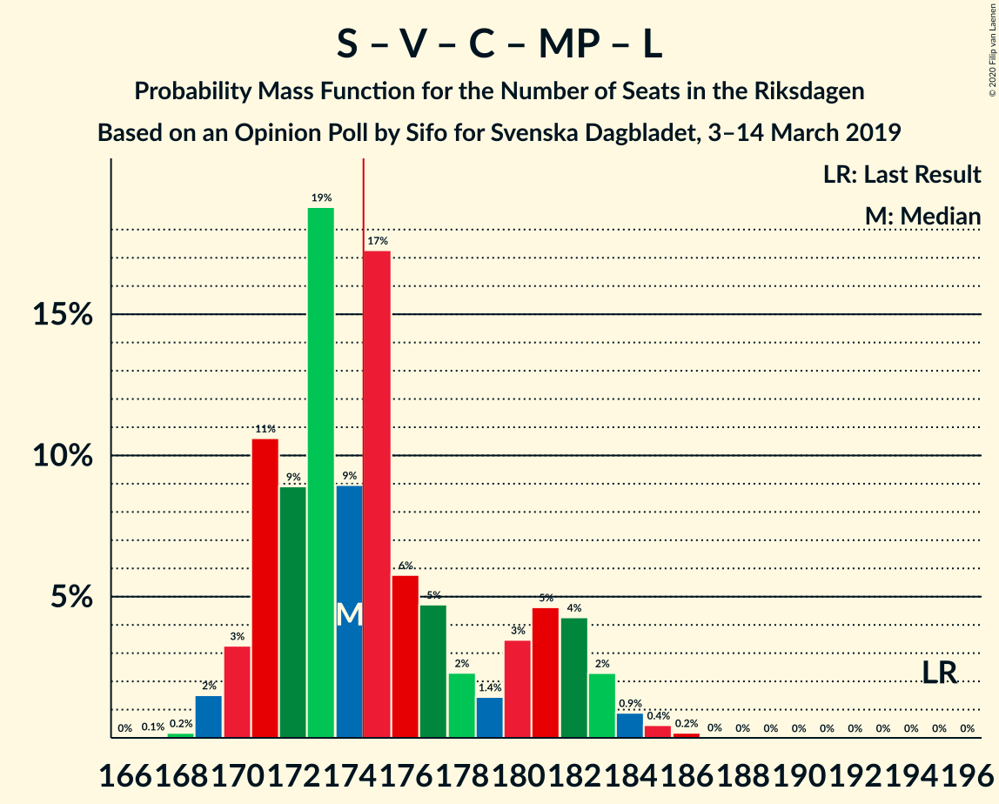
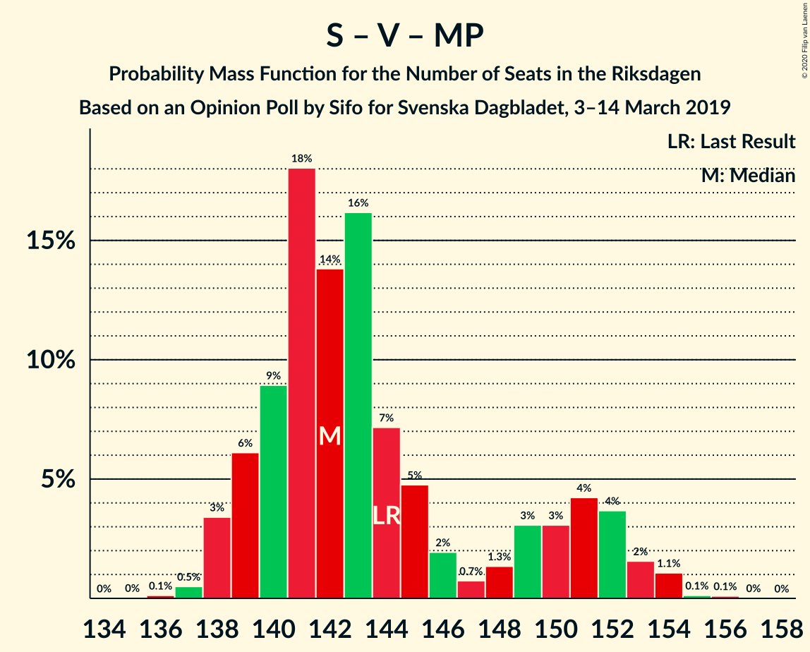
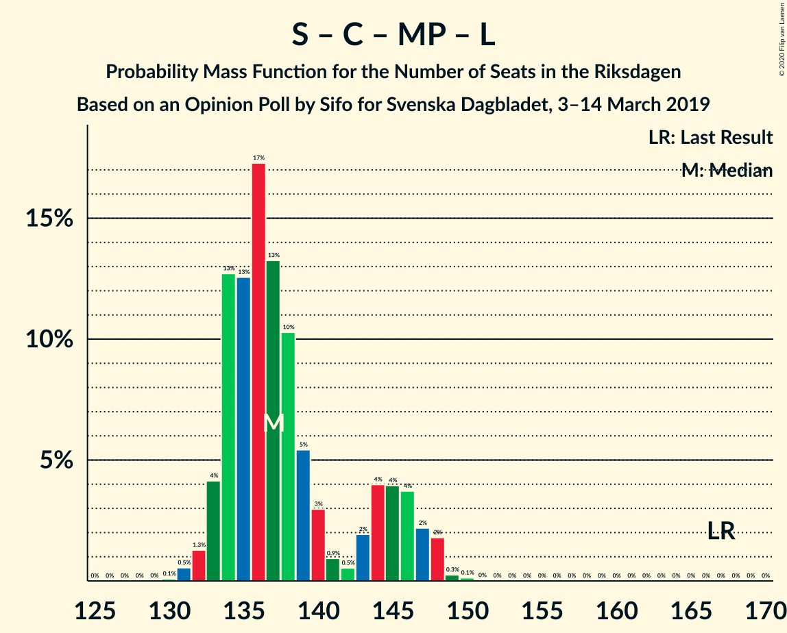
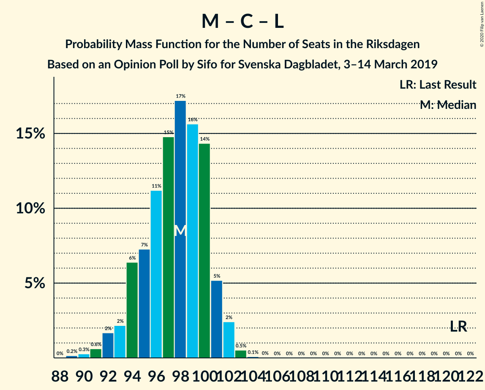

# Opinion Poll by Sifo for Svenska Dagbladet, 3–14 March 2019

<a href="#voting-intentions">Voting Intentions</a> | <a href="#seats">Seats</a> | <a href="#coalitions">Coalitions</a> | <a href="#technical-information">Technical Information</a>

## Voting Intentions

### Confidence Intervals

| Party | Last Result | Poll Result | 80% Confidence Interval | 90% Confidence Interval | 95% Confidence Interval | 99% Confidence Interval |
|:-----:|:-----------:|:-----------:|:-----------------------:|:-----------------------:|:-----------------------:|:-----------------------:|
| Sveriges socialdemokratiska arbetareparti | 28.3% | 27.4% | 26.8–28.0% |26.6–28.2% |26.5–28.3% |26.2–28.6% |
| Sverigedemokraterna | 17.5% | 19.1% | 18.6–19.6% |18.4–19.8% |18.3–19.9% |18.0–20.2% |
| Moderata samlingspartiet | 19.8% | 17.5% | 17.0–18.0% |16.8–18.2% |16.7–18.3% |16.5–18.5% |
| Vänsterpartiet | 8.0% | 9.8% | 9.4–10.2% |9.3–10.3% |9.2–10.4% |9.0–10.6% |
| Kristdemokraterna | 6.3% | 9.4% | 9.0–9.8% |8.9–9.9% |8.8–10.0% |8.6–10.2% |
| Centerpartiet | 8.6% | 8.3% | 7.9–8.7% |7.8–8.8% |7.7–8.9% |7.6–9.1% |
| Miljöpartiet de gröna | 4.4% | 3.8% | 3.6–4.1% |3.5–4.1% |3.4–4.2% |3.3–4.4% |
| Liberalerna | 5.5% | 3.3% | 3.1–3.6% |3.0–3.6% |2.9–3.7% |2.8–3.8% |

*Note:* The poll result column reflects the actual value used in the calculations. Published results may vary slightly, and in addition be rounded to fewer digits.

## Seats

### Confidence Intervals

| Party | Last Result | Median | 80% Confidence Interval | 90% Confidence Interval | 95% Confidence Interval | 99% Confidence Interval |
|:-----:|:-----------:|:------:|:-----------------------:|:-----------------------:|:-----------------------:|:-----------------------:|
| <a href="#sveriges-socialdemokratiska-arbetareparti">Sveriges socialdemokratiska arbetareparti</a> | 100 | 104 | 100–106 |98–107 |98–107 |97–109 |
| <a href="#sverigedemokraterna">Sverigedemokraterna</a> | 62 | 73 | 69–75 |68–75 |68–75 |66–76 |
| <a href="#moderata-samlingspartiet">Moderata samlingspartiet</a> | 70 | 67 | 64–68 |63–68 |62–69 |61–70 |
| <a href="#vänsterpartiet">Vänsterpartiet</a> | 28 | 37 | 36–39 |35–40 |34–40 |34–41 |
| <a href="#kristdemokraterna">Kristdemokraterna</a> | 22 | 36 | 34–37 |33–37 |33–38 |32–39 |
| <a href="#centerpartiet">Centerpartiet</a> | 31 | 32 | 30–33 |29–34 |29–34 |28–34 |
| <a href="#miljöpartiet-de-gröna">Miljöpartiet de gröna</a> | 16 | 0 | 0–15 |0–15 |0–15 |0–16 |
| <a href="#liberalerna">Liberalerna</a> | 20 | 0 | 0 |0 |0 |0 |

### Sveriges socialdemokratiska arbetareparti

*For a full overview of the results for this party, see the [Sveriges socialdemokratiska arbetareparti](party-sverigessocialdemokratiskaarbetareparti.html) page.*

| Number of Seats | Probability | Accumulated | Special Marks |
|:---------------:|:-----------:|:-----------:|:-------------:|
| 96 | 0.1% | 100% |  |
| 97 | 1.1% | 99.9% |  |
| 98 | 5% | 98.8% |  |
| 99 | 1.2% | 93% |  |
| 100 | 3% | 92% | Last Result |
| 101 | 6% | 89% |  |
| 102 | 3% | 83% |  |
| 103 | 11% | 80% |  |
| 104 | 44% | 69% | Median |
| 105 | 8% | 25% |  |
| 106 | 9% | 17% |  |
| 107 | 5% | 7% |  |
| 108 | 0.9% | 2% |  |
| 109 | 0.8% | 0.9% |  |
| 110 | 0.1% | 0.1% |  |
| 111 | 0% | 0% |  |

### Sverigedemokraterna

*For a full overview of the results for this party, see the [Sverigedemokraterna](party-sverigedemokraterna.html) page.*

| Number of Seats | Probability | Accumulated | Special Marks |
|:---------------:|:-----------:|:-----------:|:-------------:|
| 62 | 0% | 100% | Last Result |
| 63 | 0% | 100% |  |
| 64 | 0% | 100% |  |
| 65 | 0% | 100% |  |
| 66 | 1.4% | 100% |  |
| 67 | 0.3% | 98.6% |  |
| 68 | 3% | 98% |  |
| 69 | 7% | 95% |  |
| 70 | 4% | 88% |  |
| 71 | 22% | 84% |  |
| 72 | 7% | 63% |  |
| 73 | 28% | 56% | Median |
| 74 | 5% | 27% |  |
| 75 | 21% | 22% |  |
| 76 | 0.8% | 1.2% |  |
| 77 | 0.4% | 0.4% |  |
| 78 | 0.1% | 0.1% |  |
| 79 | 0% | 0% |  |

### Moderata samlingspartiet

*For a full overview of the results for this party, see the [Moderata samlingspartiet](party-moderatasamlingspartiet.html) page.*

| Number of Seats | Probability | Accumulated | Special Marks |
|:---------------:|:-----------:|:-----------:|:-------------:|
| 60 | 0.2% | 100% |  |
| 61 | 0.7% | 99.8% |  |
| 62 | 4% | 99.2% |  |
| 63 | 2% | 95% |  |
| 64 | 10% | 93% |  |
| 65 | 13% | 83% |  |
| 66 | 14% | 70% |  |
| 67 | 44% | 56% | Median |
| 68 | 8% | 12% |  |
| 69 | 3% | 4% |  |
| 70 | 2% | 2% | Last Result |
| 71 | 0.2% | 0.3% |  |
| 72 | 0.1% | 0.1% |  |
| 73 | 0% | 0% |  |

### Vänsterpartiet

*For a full overview of the results for this party, see the [Vänsterpartiet](party-vänsterpartiet.html) page.*

| Number of Seats | Probability | Accumulated | Special Marks |
|:---------------:|:-----------:|:-----------:|:-------------:|
| 28 | 0% | 100% | Last Result |
| 29 | 0% | 100% |  |
| 30 | 0% | 100% |  |
| 31 | 0% | 100% |  |
| 32 | 0% | 100% |  |
| 33 | 0.4% | 100% |  |
| 34 | 3% | 99.6% |  |
| 35 | 4% | 97% |  |
| 36 | 6% | 93% |  |
| 37 | 45% | 86% | Median |
| 38 | 25% | 41% |  |
| 39 | 9% | 16% |  |
| 40 | 6% | 7% |  |
| 41 | 1.3% | 1.3% |  |
| 42 | 0% | 0% |  |

### Kristdemokraterna

*For a full overview of the results for this party, see the [Kristdemokraterna](party-kristdemokraterna.html) page.*

| Number of Seats | Probability | Accumulated | Special Marks |
|:---------------:|:-----------:|:-----------:|:-------------:|
| 22 | 0% | 100% | Last Result |
| 23 | 0% | 100% |  |
| 24 | 0% | 100% |  |
| 25 | 0% | 100% |  |
| 26 | 0% | 100% |  |
| 27 | 0% | 100% |  |
| 28 | 0% | 100% |  |
| 29 | 0% | 100% |  |
| 30 | 0% | 100% |  |
| 31 | 0.1% | 100% |  |
| 32 | 0.6% | 99.9% |  |
| 33 | 7% | 99.3% |  |
| 34 | 8% | 92% |  |
| 35 | 30% | 84% |  |
| 36 | 41% | 55% | Median |
| 37 | 10% | 13% |  |
| 38 | 2% | 3% |  |
| 39 | 0.6% | 0.7% |  |
| 40 | 0% | 0% |  |

### Centerpartiet

*For a full overview of the results for this party, see the [Centerpartiet](party-centerpartiet.html) page.*

| Number of Seats | Probability | Accumulated | Special Marks |
|:---------------:|:-----------:|:-----------:|:-------------:|
| 28 | 0.6% | 100% |  |
| 29 | 6% | 99.4% |  |
| 30 | 21% | 94% |  |
| 31 | 18% | 73% | Last Result |
| 32 | 21% | 55% | Median |
| 33 | 25% | 34% |  |
| 34 | 9% | 10% |  |
| 35 | 0.5% | 0.5% |  |
| 36 | 0% | 0% |  |

### Miljöpartiet de gröna

*For a full overview of the results for this party, see the [Miljöpartiet de gröna](party-miljöpartietdegröna.html) page.*

| Number of Seats | Probability | Accumulated | Special Marks |
|:---------------:|:-----------:|:-----------:|:-------------:|
| 0 | 84% | 100% | Median |
| 1 | 0% | 16% |  |
| 2 | 0% | 16% |  |
| 3 | 0% | 16% |  |
| 4 | 0% | 16% |  |
| 5 | 0% | 16% |  |
| 6 | 0% | 16% |  |
| 7 | 0% | 16% |  |
| 8 | 0% | 16% |  |
| 9 | 0% | 16% |  |
| 10 | 0% | 16% |  |
| 11 | 0% | 16% |  |
| 12 | 0% | 16% |  |
| 13 | 0% | 16% |  |
| 14 | 0% | 16% |  |
| 15 | 14% | 16% |  |
| 16 | 2% | 2% | Last Result |
| 17 | 0% | 0% |  |

### Liberalerna

*For a full overview of the results for this party, see the [Liberalerna](party-liberalerna.html) page.*

| Number of Seats | Probability | Accumulated | Special Marks |
|:---------------:|:-----------:|:-----------:|:-------------:|
| 0 | 100% | 100% | Median |
| 1 | 0% | 0% |  |
| 2 | 0% | 0% |  |
| 3 | 0% | 0% |  |
| 4 | 0% | 0% |  |
| 5 | 0% | 0% |  |
| 6 | 0% | 0% |  |
| 7 | 0% | 0% |  |
| 8 | 0% | 0% |  |
| 9 | 0% | 0% |  |
| 10 | 0% | 0% |  |
| 11 | 0% | 0% |  |
| 12 | 0% | 0% |  |
| 13 | 0% | 0% |  |
| 14 | 0% | 0% |  |
| 15 | 0% | 0% |  |
| 16 | 0% | 0% |  |
| 17 | 0% | 0% |  |
| 18 | 0% | 0% |  |
| 19 | 0% | 0% |  |
| 20 | 0% | 0% | Last Result |

## Coalitions

### Confidence Intervals

| Coalition | Last Result | Median | Majority? | 80% Confidence Interval | 90% Confidence Interval | 95% Confidence Interval | 99% Confidence Interval |
|:---------:|:-----------:|:------:|:---------:|:-----------------------:|:-----------------------:|:-----------------------:|:-----------------------:|
| Sveriges socialdemokratiska arbetareparti – Moderata samlingspartiet – Centerpartiet | 201 | 202 | 100% | 195–204 | 194–205 | 193–206 | 191–207 |
| Sveriges socialdemokratiska arbetareparti – Vänsterpartiet – Centerpartiet – Miljöpartiet de gröna – Liberalerna | 195 | 175 | 52% | 171–181 | 171–182 | 171–184 | 169–185 |
| Sverigedemokraterna – Moderata samlingspartiet – Kristdemokraterna | 154 | 174 | 48% | 168–178 | 167–178 | 165–178 | 164–180 |
| Sveriges socialdemokratiska arbetareparti – Moderata samlingspartiet | 170 | 171 | 5% | 164–172 | 163–174 | 162–175 | 161–176 |
| Sveriges socialdemokratiska arbetareparti – Vänsterpartiet – Miljöpartiet de gröna | 144 | 142 | 0% | 140–150 | 140–152 | 139–153 | 137–153 |
| Sveriges socialdemokratiska arbetareparti – Centerpartiet – Miljöpartiet de gröna – Liberalerna | 167 | 136 | 0% | 134–144 | 134–147 | 134–148 | 132–148 |
| Sveriges socialdemokratiska arbetareparti – Vänsterpartiet | 128 | 142 | 0% | 136–144 | 135–144 | 135–145 | 133–146 |
| Sverigedemokraterna – Moderata samlingspartiet | 132 | 138 | 0% | 135–142 | 132–142 | 131–142 | 130–144 |
| Moderata samlingspartiet – Kristdemokraterna – Centerpartiet – Liberalerna | 143 | 133 | 0% | 130–136 | 128–137 | 127–138 | 125–138 |
| Moderata samlingspartiet – Kristdemokraterna – Centerpartiet | 123 | 133 | 0% | 130–136 | 128–137 | 127–138 | 125–138 |
| Sveriges socialdemokratiska arbetareparti – Miljöpartiet de gröna | 116 | 104 | 0% | 103–113 | 103–116 | 102–116 | 100–118 |
| Moderata samlingspartiet – Centerpartiet – Liberalerna | 121 | 97 | 0% | 95–100 | 94–101 | 92–102 | 91–103 |
| Moderata samlingspartiet – Centerpartiet | 101 | 97 | 0% | 95–100 | 94–101 | 92–102 | 91–103 |

### Sveriges socialdemokratiska arbetareparti – Moderata samlingspartiet – Centerpartiet

| Number of Seats | Probability | Accumulated | Special Marks |
|:---------------:|:-----------:|:-----------:|:-------------:|
| 190 | 0.2% | 100% |  |
| 191 | 2% | 99.8% |  |
| 192 | 0.5% | 98% |  |
| 193 | 2% | 98% |  |
| 194 | 1.1% | 96% |  |
| 195 | 7% | 95% |  |
| 196 | 2% | 88% |  |
| 197 | 0.3% | 86% |  |
| 198 | 2% | 86% |  |
| 199 | 0.9% | 84% |  |
| 200 | 1.3% | 83% |  |
| 201 | 27% | 82% | Last Result |
| 202 | 15% | 54% |  |
| 203 | 3% | 39% | Median |
| 204 | 29% | 36% |  |
| 205 | 3% | 7% |  |
| 206 | 3% | 5% |  |
| 207 | 1.2% | 1.4% |  |
| 208 | 0.1% | 0.2% |  |
| 209 | 0% | 0% |  |

### Sveriges socialdemokratiska arbetareparti – Vänsterpartiet – Centerpartiet – Miljöpartiet de gröna – Liberalerna

| Number of Seats | Probability | Accumulated | Special Marks |
|:---------------:|:-----------:|:-----------:|:-------------:|
| 167 | 0.1% | 100% |  |
| 168 | 0.2% | 99.9% |  |
| 169 | 0.4% | 99.8% |  |
| 170 | 2% | 99.4% |  |
| 171 | 18% | 98% |  |
| 172 | 3% | 80% |  |
| 173 | 14% | 77% | Median |
| 174 | 10% | 62% |  |
| 175 | 20% | 52% | Majority |
| 176 | 7% | 32% |  |
| 177 | 7% | 25% |  |
| 178 | 2% | 18% |  |
| 179 | 0.6% | 15% |  |
| 180 | 0.9% | 15% |  |
| 181 | 8% | 14% |  |
| 182 | 2% | 6% |  |
| 183 | 0.7% | 4% |  |
| 184 | 2% | 4% |  |
| 185 | 2% | 2% |  |
| 186 | 0.1% | 0.1% |  |
| 187 | 0% | 0% |  |
| 188 | 0% | 0% |  |
| 189 | 0% | 0% |  |
| 190 | 0% | 0% |  |
| 191 | 0% | 0% |  |
| 192 | 0% | 0% |  |
| 193 | 0% | 0% |  |
| 194 | 0% | 0% |  |
| 195 | 0% | 0% | Last Result |

### Sverigedemokraterna – Moderata samlingspartiet – Kristdemokraterna

| Number of Seats | Probability | Accumulated | Special Marks |
|:---------------:|:-----------:|:-----------:|:-------------:|
| 154 | 0% | 100% | Last Result |
| 155 | 0% | 100% |  |
| 156 | 0% | 100% |  |
| 157 | 0% | 100% |  |
| 158 | 0% | 100% |  |
| 159 | 0% | 100% |  |
| 160 | 0% | 100% |  |
| 161 | 0% | 100% |  |
| 162 | 0% | 100% |  |
| 163 | 0.1% | 100% |  |
| 164 | 2% | 99.9% |  |
| 165 | 2% | 98% |  |
| 166 | 0.7% | 96% |  |
| 167 | 2% | 96% |  |
| 168 | 8% | 94% |  |
| 169 | 0.9% | 86% |  |
| 170 | 0.6% | 85% |  |
| 171 | 2% | 85% |  |
| 172 | 7% | 82% |  |
| 173 | 7% | 75% |  |
| 174 | 20% | 68% |  |
| 175 | 10% | 48% | Majority |
| 176 | 14% | 38% | Median |
| 177 | 3% | 23% |  |
| 178 | 18% | 20% |  |
| 179 | 2% | 2% |  |
| 180 | 0.4% | 0.6% |  |
| 181 | 0.2% | 0.2% |  |
| 182 | 0.1% | 0.1% |  |
| 183 | 0% | 0% |  |

### Sveriges socialdemokratiska arbetareparti – Moderata samlingspartiet

| Number of Seats | Probability | Accumulated | Special Marks |
|:---------------:|:-----------:|:-----------:|:-------------:|
| 158 | 0.1% | 100% |  |
| 159 | 0.1% | 99.9% |  |
| 160 | 0.1% | 99.8% |  |
| 161 | 0.8% | 99.7% |  |
| 162 | 3% | 98.9% |  |
| 163 | 2% | 96% |  |
| 164 | 6% | 94% |  |
| 165 | 2% | 88% |  |
| 166 | 2% | 86% |  |
| 167 | 1.0% | 84% |  |
| 168 | 1.1% | 83% |  |
| 169 | 9% | 82% |  |
| 170 | 18% | 73% | Last Result |
| 171 | 43% | 55% | Median |
| 172 | 3% | 12% |  |
| 173 | 4% | 9% |  |
| 174 | 0.8% | 6% |  |
| 175 | 3% | 5% | Majority |
| 176 | 1.1% | 1.2% |  |
| 177 | 0.1% | 0.2% |  |
| 178 | 0% | 0% |  |

### Sveriges socialdemokratiska arbetareparti – Vänsterpartiet – Miljöpartiet de gröna

| Number of Seats | Probability | Accumulated | Special Marks |
|:---------------:|:-----------:|:-----------:|:-------------:|
| 135 | 0% | 100% |  |
| 136 | 0.1% | 99.9% |  |
| 137 | 0.6% | 99.8% |  |
| 138 | 2% | 99.3% |  |
| 139 | 2% | 98% |  |
| 140 | 7% | 96% |  |
| 141 | 17% | 89% | Median |
| 142 | 33% | 72% |  |
| 143 | 8% | 39% |  |
| 144 | 12% | 31% | Last Result |
| 145 | 1.3% | 19% |  |
| 146 | 2% | 18% |  |
| 147 | 0.4% | 16% |  |
| 148 | 1.3% | 16% |  |
| 149 | 0.6% | 14% |  |
| 150 | 6% | 14% |  |
| 151 | 2% | 7% |  |
| 152 | 3% | 6% |  |
| 153 | 2% | 3% |  |
| 154 | 0.3% | 0.4% |  |
| 155 | 0.1% | 0.2% |  |
| 156 | 0% | 0% |  |

### Sveriges socialdemokratiska arbetareparti – Centerpartiet – Miljöpartiet de gröna – Liberalerna

| Number of Seats | Probability | Accumulated | Special Marks |
|:---------------:|:-----------:|:-----------:|:-------------:|
| 130 | 0.1% | 100% |  |
| 131 | 0.2% | 99.9% |  |
| 132 | 0.9% | 99.7% |  |
| 133 | 1.0% | 98.8% |  |
| 134 | 20% | 98% |  |
| 135 | 8% | 77% |  |
| 136 | 19% | 69% | Median |
| 137 | 21% | 50% |  |
| 138 | 3% | 29% |  |
| 139 | 3% | 27% |  |
| 140 | 7% | 23% |  |
| 141 | 0.4% | 16% |  |
| 142 | 0.5% | 16% |  |
| 143 | 0.5% | 15% |  |
| 144 | 7% | 15% |  |
| 145 | 1.4% | 8% |  |
| 146 | 0.8% | 7% |  |
| 147 | 1.4% | 6% |  |
| 148 | 4% | 5% |  |
| 149 | 0.1% | 0.3% |  |
| 150 | 0.1% | 0.2% |  |
| 151 | 0% | 0% |  |
| 152 | 0% | 0% |  |
| 153 | 0% | 0% |  |
| 154 | 0% | 0% |  |
| 155 | 0% | 0% |  |
| 156 | 0% | 0% |  |
| 157 | 0% | 0% |  |
| 158 | 0% | 0% |  |
| 159 | 0% | 0% |  |
| 160 | 0% | 0% |  |
| 161 | 0% | 0% |  |
| 162 | 0% | 0% |  |
| 163 | 0% | 0% |  |
| 164 | 0% | 0% |  |
| 165 | 0% | 0% |  |
| 166 | 0% | 0% |  |
| 167 | 0% | 0% | Last Result |

### Sveriges socialdemokratiska arbetareparti – Vänsterpartiet

| Number of Seats | Probability | Accumulated | Special Marks |
|:---------------:|:-----------:|:-----------:|:-------------:|
| 128 | 0% | 100% | Last Result |
| 129 | 0% | 100% |  |
| 130 | 0% | 100% |  |
| 131 | 0.1% | 100% |  |
| 132 | 0.2% | 99.9% |  |
| 133 | 1.3% | 99.7% |  |
| 134 | 0.7% | 98% |  |
| 135 | 7% | 98% |  |
| 136 | 0.5% | 90% |  |
| 137 | 4% | 90% |  |
| 138 | 4% | 86% |  |
| 139 | 2% | 82% |  |
| 140 | 7% | 80% |  |
| 141 | 17% | 74% | Median |
| 142 | 33% | 57% |  |
| 143 | 8% | 23% |  |
| 144 | 12% | 15% |  |
| 145 | 1.2% | 3% |  |
| 146 | 2% | 2% |  |
| 147 | 0.2% | 0.2% |  |
| 148 | 0% | 0% |  |

### Sverigedemokraterna – Moderata samlingspartiet

| Number of Seats | Probability | Accumulated | Special Marks |
|:---------------:|:-----------:|:-----------:|:-------------:|
| 129 | 0% | 100% |  |
| 130 | 2% | 99.9% |  |
| 131 | 2% | 98% |  |
| 132 | 2% | 96% | Last Result |
| 133 | 2% | 94% |  |
| 134 | 2% | 93% |  |
| 135 | 7% | 91% |  |
| 136 | 2% | 84% |  |
| 137 | 7% | 82% |  |
| 138 | 29% | 75% |  |
| 139 | 8% | 46% |  |
| 140 | 8% | 39% | Median |
| 141 | 11% | 30% |  |
| 142 | 17% | 19% |  |
| 143 | 1.2% | 2% |  |
| 144 | 0.9% | 1.1% |  |
| 145 | 0.2% | 0.2% |  |
| 146 | 0% | 0.1% |  |
| 147 | 0% | 0% |  |

### Moderata samlingspartiet – Kristdemokraterna – Centerpartiet – Liberalerna

| Number of Seats | Probability | Accumulated | Special Marks |
|:---------------:|:-----------:|:-----------:|:-------------:|
| 124 | 0.1% | 100% |  |
| 125 | 2% | 99.9% |  |
| 126 | 0.1% | 98% |  |
| 127 | 1.2% | 98% |  |
| 128 | 3% | 97% |  |
| 129 | 0.8% | 94% |  |
| 130 | 7% | 93% |  |
| 131 | 3% | 86% |  |
| 132 | 11% | 83% |  |
| 133 | 28% | 72% |  |
| 134 | 15% | 44% |  |
| 135 | 3% | 29% | Median |
| 136 | 20% | 26% |  |
| 137 | 2% | 5% |  |
| 138 | 3% | 4% |  |
| 139 | 0.3% | 0.5% |  |
| 140 | 0.1% | 0.2% |  |
| 141 | 0% | 0% |  |
| 142 | 0% | 0% |  |
| 143 | 0% | 0% | Last Result |

### Moderata samlingspartiet – Kristdemokraterna – Centerpartiet

| Number of Seats | Probability | Accumulated | Special Marks |
|:---------------:|:-----------:|:-----------:|:-------------:|
| 123 | 0% | 100% | Last Result |
| 124 | 0.1% | 100% |  |
| 125 | 2% | 99.9% |  |
| 126 | 0.1% | 98% |  |
| 127 | 1.2% | 98% |  |
| 128 | 3% | 97% |  |
| 129 | 0.8% | 94% |  |
| 130 | 7% | 93% |  |
| 131 | 3% | 86% |  |
| 132 | 11% | 83% |  |
| 133 | 28% | 72% |  |
| 134 | 15% | 44% |  |
| 135 | 3% | 29% | Median |
| 136 | 20% | 26% |  |
| 137 | 2% | 5% |  |
| 138 | 3% | 4% |  |
| 139 | 0.3% | 0.5% |  |
| 140 | 0.1% | 0.2% |  |
| 141 | 0% | 0% |  |

### Sveriges socialdemokratiska arbetareparti – Miljöpartiet de gröna

| Number of Seats | Probability | Accumulated | Special Marks |
|:---------------:|:-----------:|:-----------:|:-------------:|
| 99 | 0.1% | 100% |  |
| 100 | 1.4% | 99.9% |  |
| 101 | 0.7% | 98% |  |
| 102 | 2% | 98% |  |
| 103 | 11% | 95% |  |
| 104 | 44% | 84% | Median |
| 105 | 8% | 40% |  |
| 106 | 9% | 32% |  |
| 107 | 5% | 23% |  |
| 108 | 0.9% | 18% |  |
| 109 | 0.8% | 17% |  |
| 110 | 0.1% | 16% |  |
| 111 | 0.1% | 16% |  |
| 112 | 1.1% | 16% |  |
| 113 | 5% | 15% |  |
| 114 | 0.6% | 9% |  |
| 115 | 2% | 9% |  |
| 116 | 4% | 6% | Last Result |
| 117 | 1.3% | 2% |  |
| 118 | 0.5% | 0.7% |  |
| 119 | 0.1% | 0.2% |  |
| 120 | 0.1% | 0.1% |  |
| 121 | 0% | 0% |  |

### Moderata samlingspartiet – Centerpartiet – Liberalerna

| Number of Seats | Probability | Accumulated | Special Marks |
|:---------------:|:-----------:|:-----------:|:-------------:|
| 89 | 0.1% | 100% |  |
| 90 | 0% | 99.9% |  |
| 91 | 1.4% | 99.9% |  |
| 92 | 2% | 98% |  |
| 93 | 0.5% | 97% |  |
| 94 | 4% | 96% |  |
| 95 | 3% | 93% |  |
| 96 | 6% | 90% |  |
| 97 | 36% | 83% |  |
| 98 | 8% | 47% |  |
| 99 | 12% | 39% | Median |
| 100 | 21% | 27% |  |
| 101 | 3% | 6% |  |
| 102 | 2% | 3% |  |
| 103 | 1.2% | 1.4% |  |
| 104 | 0.1% | 0.1% |  |
| 105 | 0% | 0.1% |  |
| 106 | 0% | 0% |  |
| 107 | 0% | 0% |  |
| 108 | 0% | 0% |  |
| 109 | 0% | 0% |  |
| 110 | 0% | 0% |  |
| 111 | 0% | 0% |  |
| 112 | 0% | 0% |  |
| 113 | 0% | 0% |  |
| 114 | 0% | 0% |  |
| 115 | 0% | 0% |  |
| 116 | 0% | 0% |  |
| 117 | 0% | 0% |  |
| 118 | 0% | 0% |  |
| 119 | 0% | 0% |  |
| 120 | 0% | 0% |  |
| 121 | 0% | 0% | Last Result |

### Moderata samlingspartiet – Centerpartiet

| Number of Seats | Probability | Accumulated | Special Marks |
|:---------------:|:-----------:|:-----------:|:-------------:|
| 89 | 0.1% | 100% |  |
| 90 | 0% | 99.9% |  |
| 91 | 1.4% | 99.9% |  |
| 92 | 2% | 98% |  |
| 93 | 0.5% | 97% |  |
| 94 | 4% | 96% |  |
| 95 | 3% | 93% |  |
| 96 | 6% | 90% |  |
| 97 | 37% | 83% |  |
| 98 | 8% | 47% |  |
| 99 | 12% | 39% | Median |
| 100 | 21% | 27% |  |
| 101 | 3% | 6% | Last Result |
| 102 | 2% | 3% |  |
| 103 | 1.2% | 1.3% |  |
| 104 | 0.1% | 0.1% |  |
| 105 | 0% | 0% |  |

## Technical Information

### Opinion Poll

+ **Polling firm:** Sifo
+ **Commissioner(s):** Svenska Dagbladet
+ **Fieldwork period:** 3–14 March 2019

### Calculations

+ **Sample size:** 9059
+ **Simulations done:** 131,072
+ **Error estimate:** 1.10%

