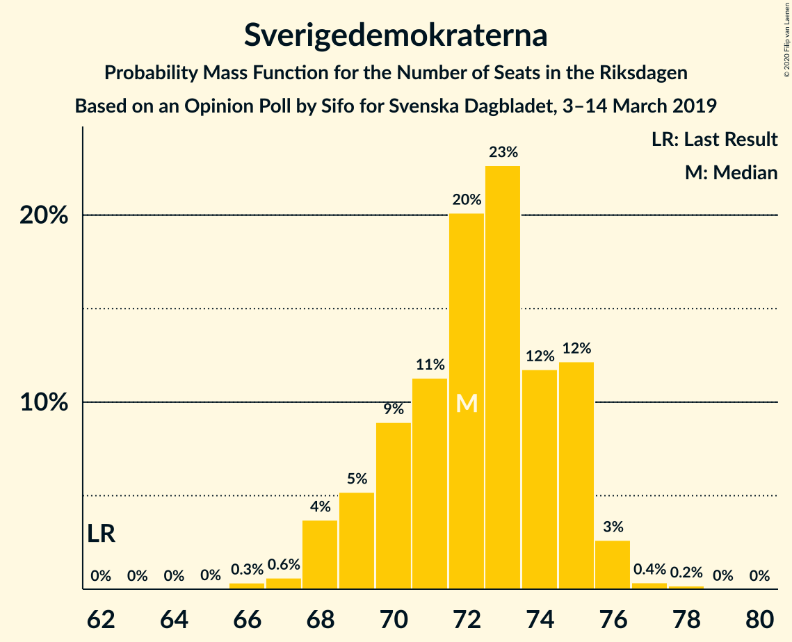
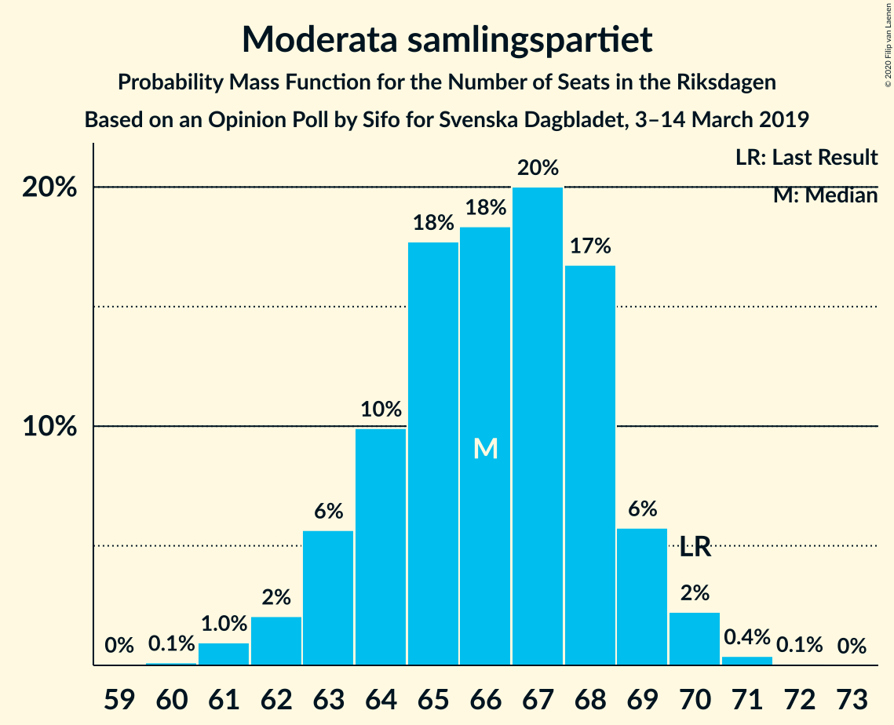
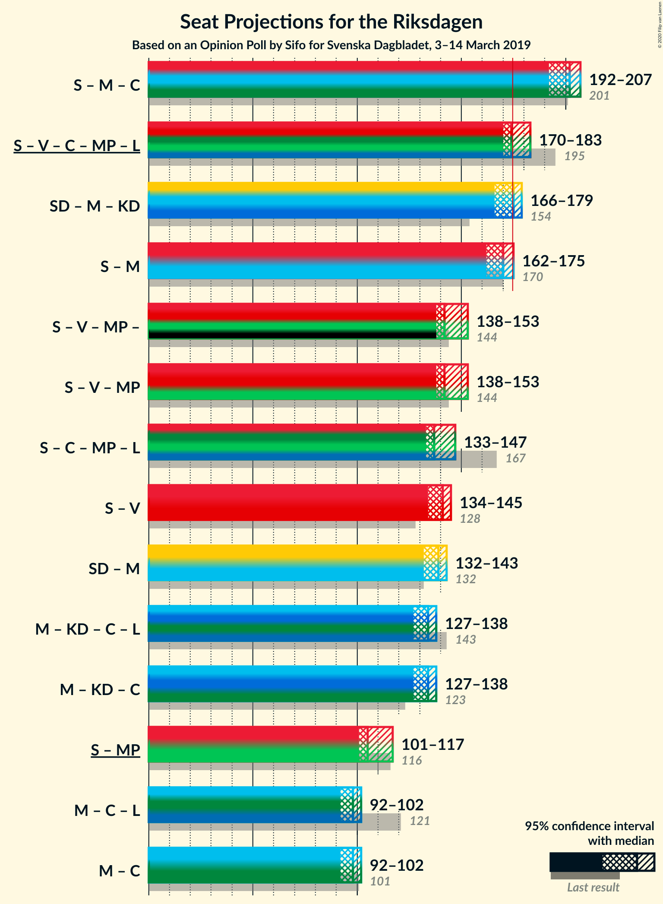
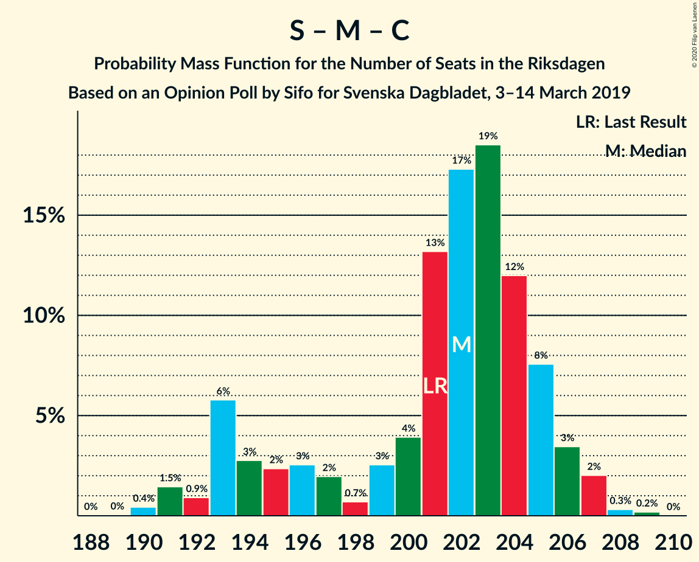
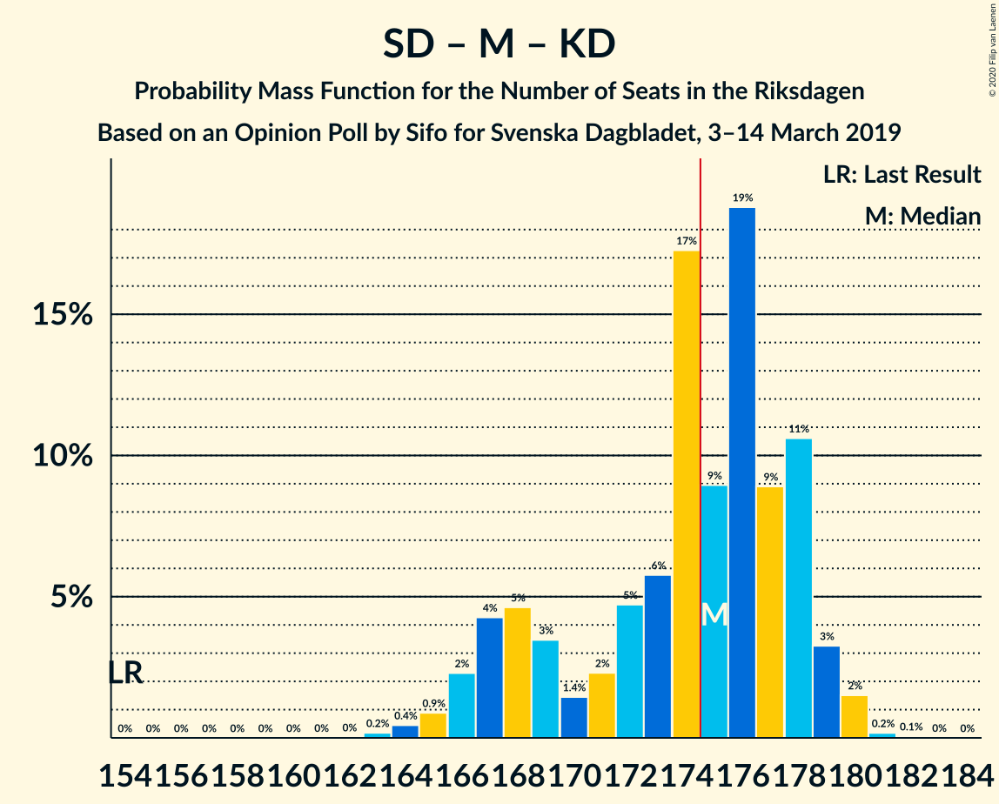
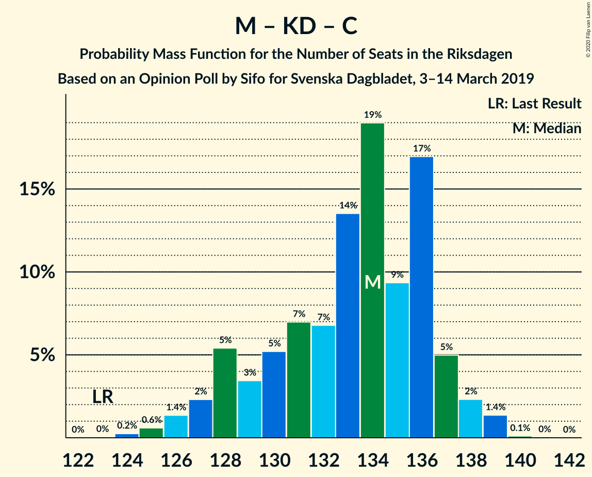

# Opinion Poll by Sifo for Svenska Dagbladet, 3–14 March 2019

<a href="#voting-intentions">Voting Intentions</a> | <a href="#seats">Seats</a> | <a href="#coalitions">Coalitions</a> | <a href="#technical-information">Technical Information</a>

## Voting Intentions

### Confidence Intervals

| Party | Last Result | Poll Result | 80% Confidence Interval | 90% Confidence Interval | 95% Confidence Interval | 99% Confidence Interval |
|:-----:|:-----------:|:-----------:|:-----------------------:|:-----------------------:|:-----------------------:|:-----------------------:|
| Sveriges socialdemokratiska arbetareparti | 28.3% | 27.4% | 26.8–28.0% |26.6–28.2% |26.5–28.3% |26.2–28.6% |
| Sverigedemokraterna | 17.5% | 19.1% | 18.6–19.6% |18.4–19.8% |18.3–19.9% |18.0–20.2% |
| Moderata samlingspartiet | 19.8% | 17.5% | 17.0–18.0% |16.8–18.2% |16.7–18.3% |16.5–18.5% |
| Vänsterpartiet | 8.0% | 9.8% | 9.4–10.2% |9.3–10.3% |9.2–10.4% |9.0–10.6% |
| Kristdemokraterna | 6.3% | 9.4% | 9.0–9.8% |8.9–9.9% |8.8–10.0% |8.6–10.2% |
| Centerpartiet | 8.6% | 8.3% | 7.9–8.7% |7.8–8.8% |7.7–8.9% |7.6–9.1% |
| Miljöpartiet de gröna | 4.4% | 3.8% | 3.6–4.1% |3.5–4.1% |3.4–4.2% |3.3–4.4% |
| Liberalerna | 5.5% | 3.3% | 3.1–3.6% |3.0–3.6% |2.9–3.7% |2.8–3.8% |

*Note:* The poll result column reflects the actual value used in the calculations. Published results may vary slightly, and in addition be rounded to fewer digits.

## Seats

### Confidence Intervals

| Party | Last Result | Median | 80% Confidence Interval | 90% Confidence Interval | 95% Confidence Interval | 99% Confidence Interval |
|:-----:|:-----------:|:------:|:-----------------------:|:-----------------------:|:-----------------------:|:-----------------------:|
| <a href="#sveriges-socialdemokratiska-arbetareparti">Sveriges socialdemokratiska arbetareparti</a> | 100 | 104 | 100–106 |98–107 |98–108 |97–109 |
| <a href="#sverigedemokraterna">Sverigedemokraterna</a> | 62 | 72 | 70–75 |69–75 |68–76 |67–77 |
| <a href="#moderata-samlingspartiet">Moderata samlingspartiet</a> | 70 | 66 | 64–68 |63–69 |62–70 |61–70 |
| <a href="#vänsterpartiet">Vänsterpartiet</a> | 28 | 37 | 35–39 |35–39 |34–40 |34–40 |
| <a href="#kristdemokraterna">Kristdemokraterna</a> | 22 | 36 | 34–37 |33–38 |33–38 |32–39 |
| <a href="#centerpartiet">Centerpartiet</a> | 31 | 32 | 30–33 |29–34 |29–34 |28–35 |
| <a href="#miljöpartiet-de-gröna">Miljöpartiet de gröna</a> | 16 | 0 | 0–15 |0–15 |0–15 |0–16 |
| <a href="#liberalerna">Liberalerna</a> | 20 | 0 | 0 |0 |0 |0 |

### Sveriges socialdemokratiska arbetareparti

*For a full overview of the results for this party, see the [Sveriges socialdemokratiska arbetareparti](party-sverigessocialdemokratiskaarbetareparti.html) page.*

| Number of Seats | Probability | Accumulated | Special Marks |
|:---------------:|:-----------:|:-----------:|:-------------:|
| 95 | 0.1% | 100% |  |
| 96 | 0.2% | 99.9% |  |
| 97 | 0.6% | 99.8% |  |
| 98 | 4% | 99.1% |  |
| 99 | 4% | 95% |  |
| 100 | 3% | 91% | Last Result |
| 101 | 6% | 87% |  |
| 102 | 12% | 81% |  |
| 103 | 11% | 70% |  |
| 104 | 21% | 59% | Median |
| 105 | 18% | 38% |  |
| 106 | 10% | 20% |  |
| 107 | 6% | 10% |  |
| 108 | 3% | 4% |  |
| 109 | 0.7% | 0.9% |  |
| 110 | 0.1% | 0.2% |  |
| 111 | 0% | 0% |  |

### Sverigedemokraterna

*For a full overview of the results for this party, see the [Sverigedemokraterna](party-sverigedemokraterna.html) page.*

| Number of Seats | Probability | Accumulated | Special Marks |
|:---------------:|:-----------:|:-----------:|:-------------:|
| 62 | 0% | 100% | Last Result |
| 63 | 0% | 100% |  |
| 64 | 0% | 100% |  |
| 65 | 0% | 100% |  |
| 66 | 0.3% | 100% |  |
| 67 | 0.6% | 99.6% |  |
| 68 | 4% | 99.0% |  |
| 69 | 5% | 95% |  |
| 70 | 9% | 90% |  |
| 71 | 11% | 81% |  |
| 72 | 20% | 70% | Median |
| 73 | 23% | 50% |  |
| 74 | 12% | 27% |  |
| 75 | 12% | 15% |  |
| 76 | 3% | 3% |  |
| 77 | 0.4% | 0.6% |  |
| 78 | 0.2% | 0.2% |  |
| 79 | 0% | 0% |  |

### Moderata samlingspartiet

*For a full overview of the results for this party, see the [Moderata samlingspartiet](party-moderatasamlingspartiet.html) page.*

| Number of Seats | Probability | Accumulated | Special Marks |
|:---------------:|:-----------:|:-----------:|:-------------:|
| 60 | 0.1% | 100% |  |
| 61 | 1.0% | 99.8% |  |
| 62 | 2% | 98.9% |  |
| 63 | 6% | 97% |  |
| 64 | 10% | 91% |  |
| 65 | 18% | 81% |  |
| 66 | 18% | 64% | Median |
| 67 | 20% | 45% |  |
| 68 | 17% | 25% |  |
| 69 | 6% | 8% |  |
| 70 | 2% | 3% | Last Result |
| 71 | 0.4% | 0.5% |  |
| 72 | 0.1% | 0.1% |  |
| 73 | 0% | 0% |  |

### Vänsterpartiet

*For a full overview of the results for this party, see the [Vänsterpartiet](party-vänsterpartiet.html) page.*

| Number of Seats | Probability | Accumulated | Special Marks |
|:---------------:|:-----------:|:-----------:|:-------------:|
| 28 | 0% | 100% | Last Result |
| 29 | 0% | 100% |  |
| 30 | 0% | 100% |  |
| 31 | 0% | 100% |  |
| 32 | 0% | 100% |  |
| 33 | 0.3% | 100% |  |
| 34 | 3% | 99.7% |  |
| 35 | 7% | 97% |  |
| 36 | 16% | 90% |  |
| 37 | 40% | 74% | Median |
| 38 | 19% | 33% |  |
| 39 | 10% | 15% |  |
| 40 | 4% | 4% |  |
| 41 | 0.5% | 0.5% |  |
| 42 | 0% | 0% |  |

### Kristdemokraterna

*For a full overview of the results for this party, see the [Kristdemokraterna](party-kristdemokraterna.html) page.*

| Number of Seats | Probability | Accumulated | Special Marks |
|:---------------:|:-----------:|:-----------:|:-------------:|
| 22 | 0% | 100% | Last Result |
| 23 | 0% | 100% |  |
| 24 | 0% | 100% |  |
| 25 | 0% | 100% |  |
| 26 | 0% | 100% |  |
| 27 | 0% | 100% |  |
| 28 | 0% | 100% |  |
| 29 | 0% | 100% |  |
| 30 | 0% | 100% |  |
| 31 | 0.1% | 100% |  |
| 32 | 0.7% | 99.9% |  |
| 33 | 6% | 99.2% |  |
| 34 | 15% | 93% |  |
| 35 | 21% | 78% |  |
| 36 | 34% | 58% | Median |
| 37 | 17% | 24% |  |
| 38 | 7% | 8% |  |
| 39 | 1.0% | 1.1% |  |
| 40 | 0.1% | 0.1% |  |
| 41 | 0% | 0% |  |

### Centerpartiet

*For a full overview of the results for this party, see the [Centerpartiet](party-centerpartiet.html) page.*

| Number of Seats | Probability | Accumulated | Special Marks |
|:---------------:|:-----------:|:-----------:|:-------------:|
| 27 | 0.1% | 100% |  |
| 28 | 0.5% | 99.9% |  |
| 29 | 6% | 99.4% |  |
| 30 | 18% | 94% |  |
| 31 | 25% | 75% | Last Result |
| 32 | 29% | 50% | Median |
| 33 | 16% | 21% |  |
| 34 | 4% | 5% |  |
| 35 | 0.7% | 0.8% |  |
| 36 | 0% | 0% |  |

### Miljöpartiet de gröna

*For a full overview of the results for this party, see the [Miljöpartiet de gröna](party-miljöpartietdegröna.html) page.*

| Number of Seats | Probability | Accumulated | Special Marks |
|:---------------:|:-----------:|:-----------:|:-------------:|
| 0 | 81% | 100% | Median |
| 1 | 0% | 19% |  |
| 2 | 0% | 19% |  |
| 3 | 0% | 19% |  |
| 4 | 0% | 19% |  |
| 5 | 0% | 19% |  |
| 6 | 0% | 19% |  |
| 7 | 0% | 19% |  |
| 8 | 0% | 19% |  |
| 9 | 0% | 19% |  |
| 10 | 0% | 19% |  |
| 11 | 0% | 19% |  |
| 12 | 0% | 19% |  |
| 13 | 0% | 19% |  |
| 14 | 0% | 19% |  |
| 15 | 17% | 19% |  |
| 16 | 2% | 2% | Last Result |
| 17 | 0% | 0% |  |

### Liberalerna

*For a full overview of the results for this party, see the [Liberalerna](party-liberalerna.html) page.*

| Number of Seats | Probability | Accumulated | Special Marks |
|:---------------:|:-----------:|:-----------:|:-------------:|
| 0 | 100% | 100% | Median |
| 1 | 0% | 0% |  |
| 2 | 0% | 0% |  |
| 3 | 0% | 0% |  |
| 4 | 0% | 0% |  |
| 5 | 0% | 0% |  |
| 6 | 0% | 0% |  |
| 7 | 0% | 0% |  |
| 8 | 0% | 0% |  |
| 9 | 0% | 0% |  |
| 10 | 0% | 0% |  |
| 11 | 0% | 0% |  |
| 12 | 0% | 0% |  |
| 13 | 0% | 0% |  |
| 14 | 0% | 0% |  |
| 15 | 0% | 0% |  |
| 16 | 0% | 0% |  |
| 17 | 0% | 0% |  |
| 18 | 0% | 0% |  |
| 19 | 0% | 0% |  |
| 20 | 0% | 0% | Last Result |

## Coalitions

### Confidence Intervals

| Coalition | Last Result | Median | Majority? | 80% Confidence Interval | 90% Confidence Interval | 95% Confidence Interval | 99% Confidence Interval |
|:---------:|:-----------:|:------:|:---------:|:-----------------------:|:-----------------------:|:-----------------------:|:-----------------------:|
| Sveriges socialdemokratiska arbetareparti – Moderata samlingspartiet – Centerpartiet | 201 | 202 | 100% | 194–205 | 193–206 | 192–207 | 190–208 |
| Sveriges socialdemokratiska arbetareparti – Vänsterpartiet – Centerpartiet – Miljöpartiet de gröna – Liberalerna | 195 | 174 | 48% | 171–181 | 170–182 | 170–183 | 169–185 |
| Sverigedemokraterna – Moderata samlingspartiet – Kristdemokraterna | 154 | 175 | 52% | 168–178 | 167–179 | 166–179 | 164–180 |
| Sveriges socialdemokratiska arbetareparti – Moderata samlingspartiet | 170 | 170 | 4% | 164–173 | 162–174 | 162–175 | 160–176 |
| Sveriges socialdemokratiska arbetareparti – Vänsterpartiet – Miljöpartiet de gröna | 144 | 142 | 0% | 139–151 | 139–152 | 138–153 | 137–154 |
| Sveriges socialdemokratiska arbetareparti – Centerpartiet – Miljöpartiet de gröna – Liberalerna | 167 | 137 | 0% | 134–145 | 133–146 | 133–147 | 131–148 |
| Sveriges socialdemokratiska arbetareparti – Vänsterpartiet | 128 | 141 | 0% | 136–144 | 135–145 | 134–145 | 133–147 |
| Sverigedemokraterna – Moderata samlingspartiet | 132 | 139 | 0% | 134–142 | 132–143 | 132–143 | 130–144 |
| Moderata samlingspartiet – Kristdemokraterna – Centerpartiet – Liberalerna | 143 | 134 | 0% | 129–136 | 128–137 | 127–138 | 125–139 |
| Moderata samlingspartiet – Kristdemokraterna – Centerpartiet | 123 | 134 | 0% | 129–136 | 128–137 | 127–138 | 125–139 |
| Sveriges socialdemokratiska arbetareparti – Miljöpartiet de gröna | 116 | 105 | 0% | 102–114 | 102–116 | 101–117 | 100–118 |
| Moderata samlingspartiet – Centerpartiet – Liberalerna | 121 | 98 | 0% | 94–100 | 94–101 | 92–102 | 91–103 |
| Moderata samlingspartiet – Centerpartiet | 101 | 98 | 0% | 94–100 | 94–101 | 92–102 | 91–103 |

### Sveriges socialdemokratiska arbetareparti – Moderata samlingspartiet – Centerpartiet

| Number of Seats | Probability | Accumulated | Special Marks |
|:---------------:|:-----------:|:-----------:|:-------------:|
| 189 | 0% | 100% |  |
| 190 | 0.4% | 99.9% |  |
| 191 | 1.5% | 99.5% |  |
| 192 | 0.9% | 98% |  |
| 193 | 6% | 97% |  |
| 194 | 3% | 91% |  |
| 195 | 2% | 89% |  |
| 196 | 3% | 86% |  |
| 197 | 2% | 84% |  |
| 198 | 0.7% | 82% |  |
| 199 | 3% | 81% |  |
| 200 | 4% | 78% |  |
| 201 | 13% | 75% | Last Result |
| 202 | 17% | 61% | Median |
| 203 | 19% | 44% |  |
| 204 | 12% | 26% |  |
| 205 | 8% | 14% |  |
| 206 | 3% | 6% |  |
| 207 | 2% | 3% |  |
| 208 | 0.3% | 0.5% |  |
| 209 | 0.2% | 0.2% |  |
| 210 | 0% | 0% |  |

### Sveriges socialdemokratiska arbetareparti – Vänsterpartiet – Centerpartiet – Miljöpartiet de gröna – Liberalerna

| Number of Seats | Probability | Accumulated | Special Marks |
|:---------------:|:-----------:|:-----------:|:-------------:|
| 167 | 0.1% | 100% |  |
| 168 | 0.2% | 99.9% |  |
| 169 | 2% | 99.8% |  |
| 170 | 3% | 98% |  |
| 171 | 11% | 95% |  |
| 172 | 9% | 84% |  |
| 173 | 19% | 75% | Median |
| 174 | 9% | 57% |  |
| 175 | 17% | 48% | Majority |
| 176 | 6% | 30% |  |
| 177 | 5% | 25% |  |
| 178 | 2% | 20% |  |
| 179 | 1.4% | 18% |  |
| 180 | 3% | 16% |  |
| 181 | 5% | 13% |  |
| 182 | 4% | 8% |  |
| 183 | 2% | 4% |  |
| 184 | 0.9% | 2% |  |
| 185 | 0.4% | 0.7% |  |
| 186 | 0.2% | 0.2% |  |
| 187 | 0% | 0% |  |
| 188 | 0% | 0% |  |
| 189 | 0% | 0% |  |
| 190 | 0% | 0% |  |
| 191 | 0% | 0% |  |
| 192 | 0% | 0% |  |
| 193 | 0% | 0% |  |
| 194 | 0% | 0% |  |
| 195 | 0% | 0% | Last Result |

### Sverigedemokraterna – Moderata samlingspartiet – Kristdemokraterna

| Number of Seats | Probability | Accumulated | Special Marks |
|:---------------:|:-----------:|:-----------:|:-------------:|
| 154 | 0% | 100% | Last Result |
| 155 | 0% | 100% |  |
| 156 | 0% | 100% |  |
| 157 | 0% | 100% |  |
| 158 | 0% | 100% |  |
| 159 | 0% | 100% |  |
| 160 | 0% | 100% |  |
| 161 | 0% | 100% |  |
| 162 | 0% | 100% |  |
| 163 | 0.2% | 100% |  |
| 164 | 0.4% | 99.8% |  |
| 165 | 0.9% | 99.3% |  |
| 166 | 2% | 98% |  |
| 167 | 4% | 96% |  |
| 168 | 5% | 92% |  |
| 169 | 3% | 87% |  |
| 170 | 1.4% | 84% |  |
| 171 | 2% | 82% |  |
| 172 | 5% | 80% |  |
| 173 | 6% | 75% |  |
| 174 | 17% | 70% | Median |
| 175 | 9% | 52% | Majority |
| 176 | 19% | 43% |  |
| 177 | 9% | 25% |  |
| 178 | 11% | 16% |  |
| 179 | 3% | 5% |  |
| 180 | 2% | 2% |  |
| 181 | 0.2% | 0.2% |  |
| 182 | 0.1% | 0.1% |  |
| 183 | 0% | 0% |  |

### Sveriges socialdemokratiska arbetareparti – Moderata samlingspartiet

| Number of Seats | Probability | Accumulated | Special Marks |
|:---------------:|:-----------:|:-----------:|:-------------:|
| 159 | 0.1% | 100% |  |
| 160 | 0.5% | 99.8% |  |
| 161 | 1.4% | 99.3% |  |
| 162 | 5% | 98% |  |
| 163 | 3% | 93% |  |
| 164 | 3% | 90% |  |
| 165 | 3% | 88% |  |
| 166 | 1.1% | 85% |  |
| 167 | 3% | 84% |  |
| 168 | 4% | 80% |  |
| 169 | 10% | 76% |  |
| 170 | 18% | 66% | Last Result, Median |
| 171 | 20% | 49% |  |
| 172 | 10% | 29% |  |
| 173 | 10% | 18% |  |
| 174 | 5% | 8% |  |
| 175 | 2% | 4% | Majority |
| 176 | 1.1% | 1.3% |  |
| 177 | 0.2% | 0.3% |  |
| 178 | 0% | 0% |  |

### Sveriges socialdemokratiska arbetareparti – Vänsterpartiet – Miljöpartiet de gröna

| Number of Seats | Probability | Accumulated | Special Marks |
|:---------------:|:-----------:|:-----------:|:-------------:|
| 136 | 0.1% | 100% |  |
| 137 | 0.5% | 99.8% |  |
| 138 | 3% | 99.3% |  |
| 139 | 6% | 96% |  |
| 140 | 9% | 90% |  |
| 141 | 18% | 81% | Median |
| 142 | 14% | 63% |  |
| 143 | 16% | 49% |  |
| 144 | 7% | 33% | Last Result |
| 145 | 5% | 26% |  |
| 146 | 2% | 21% |  |
| 147 | 0.7% | 19% |  |
| 148 | 1.3% | 18% |  |
| 149 | 3% | 17% |  |
| 150 | 3% | 14% |  |
| 151 | 4% | 11% |  |
| 152 | 4% | 7% |  |
| 153 | 2% | 3% |  |
| 154 | 1.1% | 1.3% |  |
| 155 | 0.1% | 0.2% |  |
| 156 | 0.1% | 0.1% |  |
| 157 | 0% | 0% |  |

### Sveriges socialdemokratiska arbetareparti – Centerpartiet – Miljöpartiet de gröna – Liberalerna

| Number of Seats | Probability | Accumulated | Special Marks |
|:---------------:|:-----------:|:-----------:|:-------------:|
| 130 | 0.1% | 100% |  |
| 131 | 0.5% | 99.9% |  |
| 132 | 1.3% | 99.4% |  |
| 133 | 4% | 98% |  |
| 134 | 13% | 94% |  |
| 135 | 13% | 81% |  |
| 136 | 17% | 69% | Median |
| 137 | 13% | 51% |  |
| 138 | 10% | 38% |  |
| 139 | 5% | 28% |  |
| 140 | 3% | 22% |  |
| 141 | 0.9% | 19% |  |
| 142 | 0.5% | 19% |  |
| 143 | 2% | 18% |  |
| 144 | 4% | 16% |  |
| 145 | 4% | 12% |  |
| 146 | 4% | 8% |  |
| 147 | 2% | 4% |  |
| 148 | 2% | 2% |  |
| 149 | 0.3% | 0.4% |  |
| 150 | 0.1% | 0.2% |  |
| 151 | 0% | 0% |  |
| 152 | 0% | 0% |  |
| 153 | 0% | 0% |  |
| 154 | 0% | 0% |  |
| 155 | 0% | 0% |  |
| 156 | 0% | 0% |  |
| 157 | 0% | 0% |  |
| 158 | 0% | 0% |  |
| 159 | 0% | 0% |  |
| 160 | 0% | 0% |  |
| 161 | 0% | 0% |  |
| 162 | 0% | 0% |  |
| 163 | 0% | 0% |  |
| 164 | 0% | 0% |  |
| 165 | 0% | 0% |  |
| 166 | 0% | 0% |  |
| 167 | 0% | 0% | Last Result |

### Sveriges socialdemokratiska arbetareparti – Vänsterpartiet

| Number of Seats | Probability | Accumulated | Special Marks |
|:---------------:|:-----------:|:-----------:|:-------------:|
| 128 | 0% | 100% | Last Result |
| 129 | 0% | 100% |  |
| 130 | 0% | 100% |  |
| 131 | 0.1% | 100% |  |
| 132 | 0.3% | 99.8% |  |
| 133 | 1.3% | 99.5% |  |
| 134 | 3% | 98% |  |
| 135 | 3% | 95% |  |
| 136 | 4% | 92% |  |
| 137 | 4% | 88% |  |
| 138 | 5% | 83% |  |
| 139 | 7% | 79% |  |
| 140 | 9% | 72% |  |
| 141 | 18% | 62% | Median |
| 142 | 14% | 44% |  |
| 143 | 16% | 31% |  |
| 144 | 7% | 14% |  |
| 145 | 5% | 7% |  |
| 146 | 2% | 2% |  |
| 147 | 0.5% | 0.6% |  |
| 148 | 0.1% | 0.1% |  |
| 149 | 0% | 0% |  |

### Sverigedemokraterna – Moderata samlingspartiet

| Number of Seats | Probability | Accumulated | Special Marks |
|:---------------:|:-----------:|:-----------:|:-------------:|
| 128 | 0% | 100% |  |
| 129 | 0.4% | 99.9% |  |
| 130 | 0.6% | 99.6% |  |
| 131 | 1.3% | 99.0% |  |
| 132 | 3% | 98% | Last Result |
| 133 | 4% | 95% |  |
| 134 | 3% | 90% |  |
| 135 | 4% | 88% |  |
| 136 | 5% | 83% |  |
| 137 | 8% | 78% |  |
| 138 | 16% | 70% | Median |
| 139 | 11% | 54% |  |
| 140 | 19% | 43% |  |
| 141 | 10% | 25% |  |
| 142 | 9% | 15% |  |
| 143 | 4% | 6% |  |
| 144 | 1.0% | 1.3% |  |
| 145 | 0.3% | 0.3% |  |
| 146 | 0.1% | 0.1% |  |
| 147 | 0% | 0% |  |

### Moderata samlingspartiet – Kristdemokraterna – Centerpartiet – Liberalerna

| Number of Seats | Probability | Accumulated | Special Marks |
|:---------------:|:-----------:|:-----------:|:-------------:|
| 123 | 0% | 100% |  |
| 124 | 0.2% | 99.9% |  |
| 125 | 0.6% | 99.7% |  |
| 126 | 1.4% | 99.1% |  |
| 127 | 2% | 98% |  |
| 128 | 5% | 95% |  |
| 129 | 3% | 90% |  |
| 130 | 5% | 87% |  |
| 131 | 7% | 81% |  |
| 132 | 7% | 74% |  |
| 133 | 14% | 68% |  |
| 134 | 19% | 54% | Median |
| 135 | 9% | 35% |  |
| 136 | 17% | 26% |  |
| 137 | 5% | 9% |  |
| 138 | 2% | 4% |  |
| 139 | 1.4% | 2% |  |
| 140 | 0.1% | 0.2% |  |
| 141 | 0% | 0.1% |  |
| 142 | 0% | 0% |  |
| 143 | 0% | 0% | Last Result |

### Moderata samlingspartiet – Kristdemokraterna – Centerpartiet

| Number of Seats | Probability | Accumulated | Special Marks |
|:---------------:|:-----------:|:-----------:|:-------------:|
| 123 | 0% | 100% | Last Result |
| 124 | 0.2% | 99.9% |  |
| 125 | 0.6% | 99.7% |  |
| 126 | 1.4% | 99.1% |  |
| 127 | 2% | 98% |  |
| 128 | 5% | 95% |  |
| 129 | 3% | 90% |  |
| 130 | 5% | 87% |  |
| 131 | 7% | 81% |  |
| 132 | 7% | 74% |  |
| 133 | 14% | 68% |  |
| 134 | 19% | 54% | Median |
| 135 | 9% | 35% |  |
| 136 | 17% | 26% |  |
| 137 | 5% | 9% |  |
| 138 | 2% | 4% |  |
| 139 | 1.4% | 2% |  |
| 140 | 0.1% | 0.1% |  |
| 141 | 0% | 0% |  |

### Sveriges socialdemokratiska arbetareparti – Miljöpartiet de gröna

| Number of Seats | Probability | Accumulated | Special Marks |
|:---------------:|:-----------:|:-----------:|:-------------:|
| 99 | 0.1% | 100% |  |
| 100 | 1.1% | 99.9% |  |
| 101 | 2% | 98.7% |  |
| 102 | 9% | 97% |  |
| 103 | 11% | 87% |  |
| 104 | 20% | 77% | Median |
| 105 | 18% | 56% |  |
| 106 | 10% | 39% |  |
| 107 | 6% | 28% |  |
| 108 | 3% | 23% |  |
| 109 | 0.7% | 19% |  |
| 110 | 0.2% | 19% |  |
| 111 | 0.2% | 18% |  |
| 112 | 0.6% | 18% |  |
| 113 | 4% | 18% |  |
| 114 | 4% | 14% |  |
| 115 | 2% | 10% |  |
| 116 | 3% | 7% | Last Result |
| 117 | 3% | 4% |  |
| 118 | 0.7% | 1.0% |  |
| 119 | 0.1% | 0.2% |  |
| 120 | 0.1% | 0.1% |  |
| 121 | 0% | 0% |  |

### Moderata samlingspartiet – Centerpartiet – Liberalerna

| Number of Seats | Probability | Accumulated | Special Marks |
|:---------------:|:-----------:|:-----------:|:-------------:|
| 89 | 0.2% | 100% |  |
| 90 | 0.3% | 99.8% |  |
| 91 | 0.6% | 99.6% |  |
| 92 | 2% | 98.9% |  |
| 93 | 2% | 97% |  |
| 94 | 6% | 95% |  |
| 95 | 7% | 89% |  |
| 96 | 11% | 81% |  |
| 97 | 15% | 70% |  |
| 98 | 17% | 55% | Median |
| 99 | 16% | 38% |  |
| 100 | 14% | 23% |  |
| 101 | 5% | 8% |  |
| 102 | 2% | 3% |  |
| 103 | 0.5% | 0.7% |  |
| 104 | 0.1% | 0.1% |  |
| 105 | 0% | 0.1% |  |
| 106 | 0% | 0% |  |
| 107 | 0% | 0% |  |
| 108 | 0% | 0% |  |
| 109 | 0% | 0% |  |
| 110 | 0% | 0% |  |
| 111 | 0% | 0% |  |
| 112 | 0% | 0% |  |
| 113 | 0% | 0% |  |
| 114 | 0% | 0% |  |
| 115 | 0% | 0% |  |
| 116 | 0% | 0% |  |
| 117 | 0% | 0% |  |
| 118 | 0% | 0% |  |
| 119 | 0% | 0% |  |
| 120 | 0% | 0% |  |
| 121 | 0% | 0% | Last Result |

### Moderata samlingspartiet – Centerpartiet

| Number of Seats | Probability | Accumulated | Special Marks |
|:---------------:|:-----------:|:-----------:|:-------------:|
| 89 | 0.2% | 100% |  |
| 90 | 0.3% | 99.8% |  |
| 91 | 0.6% | 99.6% |  |
| 92 | 2% | 98.9% |  |
| 93 | 2% | 97% |  |
| 94 | 6% | 95% |  |
| 95 | 7% | 89% |  |
| 96 | 11% | 81% |  |
| 97 | 15% | 70% |  |
| 98 | 17% | 55% | Median |
| 99 | 16% | 38% |  |
| 100 | 14% | 23% |  |
| 101 | 5% | 8% | Last Result |
| 102 | 2% | 3% |  |
| 103 | 0.5% | 0.6% |  |
| 104 | 0.1% | 0.1% |  |
| 105 | 0% | 0% |  |

## Technical Information

### Opinion Poll

+ **Polling firm:** Sifo
+ **Commissioner(s):** Svenska Dagbladet
+ **Fieldwork period:** 3–14 March 2019

### Calculations

+ **Sample size:** 9059
+ **Simulations done:** 1,048,576
+ **Error estimate:** 0.34%

