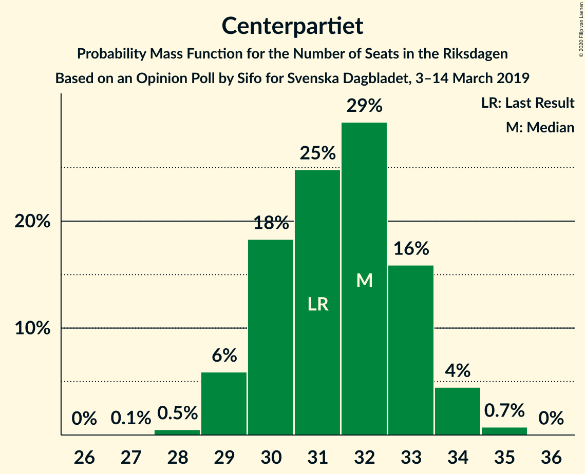
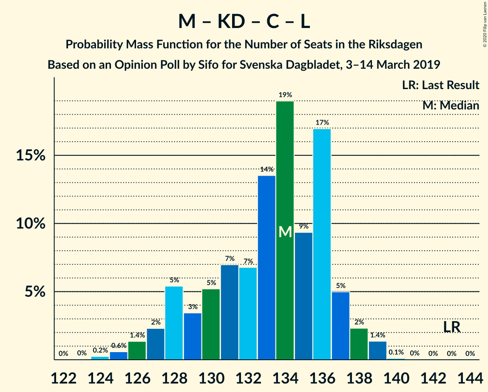

# Opinion Poll by Sifo for Svenska Dagbladet, 3–14 March 2019

<a href="#voting-intentions">Voting Intentions</a> | <a href="#seats">Seats</a> | <a href="#coalitions">Coalitions</a> | <a href="#technical-information">Technical Information</a>

## Voting Intentions

### Confidence Intervals

| Party | Last Result | Poll Result | 80% Confidence Interval | 90% Confidence Interval | 95% Confidence Interval | 99% Confidence Interval |
|:-----:|:-----------:|:-----------:|:-----------------------:|:-----------------------:|:-----------------------:|:-----------------------:|
| Sveriges socialdemokratiska arbetareparti | 28.3% | 27.4% | 26.8–28.0% |26.6–28.2% |26.5–28.3% |26.2–28.6% |
| Sverigedemokraterna | 17.5% | 19.1% | 18.6–19.6% |18.4–19.8% |18.3–19.9% |18.0–20.2% |
| Moderata samlingspartiet | 19.8% | 17.5% | 17.0–18.0% |16.8–18.2% |16.7–18.3% |16.5–18.5% |
| Vänsterpartiet | 8.0% | 9.8% | 9.4–10.2% |9.3–10.3% |9.2–10.4% |9.0–10.6% |
| Kristdemokraterna | 6.3% | 9.4% | 9.0–9.8% |8.9–9.9% |8.8–10.0% |8.6–10.2% |
| Centerpartiet | 8.6% | 8.3% | 7.9–8.7% |7.8–8.8% |7.7–8.9% |7.6–9.1% |
| Miljöpartiet de gröna | 4.4% | 3.8% | 3.6–4.1% |3.5–4.1% |3.4–4.2% |3.3–4.4% |
| Liberalerna | 5.5% | 3.3% | 3.1–3.6% |3.0–3.6% |2.9–3.7% |2.8–3.8% |

*Note:* The poll result column reflects the actual value used in the calculations. Published results may vary slightly, and in addition be rounded to fewer digits.

## Seats

### Confidence Intervals

| Party | Last Result | Median | 80% Confidence Interval | 90% Confidence Interval | 95% Confidence Interval | 99% Confidence Interval |
|:-----:|:-----------:|:------:|:-----------------------:|:-----------------------:|:-----------------------:|:-----------------------:|
| <a href="#sveriges-socialdemokratiska-arbetareparti">Sveriges socialdemokratiska arbetareparti</a> | 100 | 101 | 101 |101 |101–105 |101–106 |
| <a href="#sverigedemokraterna">Sverigedemokraterna</a> | 62 | 68 | 68 |68 |68–70 |67–70 |
| <a href="#moderata-samlingspartiet">Moderata samlingspartiet</a> | 70 | 64 | 64 |64 |64–66 |60–66 |
| <a href="#vänsterpartiet">Vänsterpartiet</a> | 28 | 34 | 34 |34–35 |34–39 |34–39 |
| <a href="#kristdemokraterna">Kristdemokraterna</a> | 22 | 35 | 35 |35 |34–35 |32–36 |
| <a href="#centerpartiet">Centerpartiet</a> | 31 | 31 | 31 |31 |31–33 |30–34 |
| <a href="#miljöpartiet-de-gröna">Miljöpartiet de gröna</a> | 16 | 16 | 16 |16 |0–16 |0–16 |
| <a href="#liberalerna">Liberalerna</a> | 20 | 0 | 0 |0 |0 |0 |

### Sveriges socialdemokratiska arbetareparti

*For a full overview of the results for this party, see the [Sveriges socialdemokratiska arbetareparti](party-sverigessocialdemokratiskaarbetareparti.html) page.*

| Number of Seats | Probability | Accumulated | Special Marks |
|:---------------:|:-----------:|:-----------:|:-------------:|
| 100 | 0% | 100% | Last Result |
| 101 | 96% | 100% | Median |
| 102 | 2% | 4% |  |
| 103 | 0% | 3% |  |
| 104 | 0% | 3% |  |
| 105 | 0.3% | 3% |  |
| 106 | 2% | 2% |  |
| 107 | 0% | 0.1% |  |
| 108 | 0% | 0.1% |  |
| 109 | 0.1% | 0.1% |  |
| 110 | 0% | 0% |  |

### Sverigedemokraterna

*For a full overview of the results for this party, see the [Sverigedemokraterna](party-sverigedemokraterna.html) page.*

| Number of Seats | Probability | Accumulated | Special Marks |
|:---------------:|:-----------:|:-----------:|:-------------:|
| 62 | 0% | 100% | Last Result |
| 63 | 0% | 100% |  |
| 64 | 0% | 100% |  |
| 65 | 0% | 100% |  |
| 66 | 0% | 100% |  |
| 67 | 2% | 100% |  |
| 68 | 95% | 98% | Median |
| 69 | 1.1% | 4% |  |
| 70 | 2% | 3% |  |
| 71 | 0% | 0.3% |  |
| 72 | 0% | 0.3% |  |
| 73 | 0.3% | 0.3% |  |
| 74 | 0% | 0% |  |

### Moderata samlingspartiet

*For a full overview of the results for this party, see the [Moderata samlingspartiet](party-moderatasamlingspartiet.html) page.*

| Number of Seats | Probability | Accumulated | Special Marks |
|:---------------:|:-----------:|:-----------:|:-------------:|
| 60 | 0.5% | 100% |  |
| 61 | 0% | 99.5% |  |
| 62 | 0% | 99.5% |  |
| 63 | 1.3% | 99.5% |  |
| 64 | 95% | 98% | Median |
| 65 | 0% | 3% |  |
| 66 | 3% | 3% |  |
| 67 | 0.2% | 0.3% |  |
| 68 | 0% | 0% |  |
| 69 | 0% | 0% |  |
| 70 | 0% | 0% | Last Result |

### Vänsterpartiet

*For a full overview of the results for this party, see the [Vänsterpartiet](party-vänsterpartiet.html) page.*

| Number of Seats | Probability | Accumulated | Special Marks |
|:---------------:|:-----------:|:-----------:|:-------------:|
| 28 | 0% | 100% | Last Result |
| 29 | 0% | 100% |  |
| 30 | 0% | 100% |  |
| 31 | 0% | 100% |  |
| 32 | 0% | 100% |  |
| 33 | 0% | 100% |  |
| 34 | 94% | 100% | Median |
| 35 | 1.1% | 6% |  |
| 36 | 0.2% | 4% |  |
| 37 | 0.5% | 4% |  |
| 38 | 0.3% | 4% |  |
| 39 | 4% | 4% |  |
| 40 | 0% | 0% |  |

### Kristdemokraterna

*For a full overview of the results for this party, see the [Kristdemokraterna](party-kristdemokraterna.html) page.*

| Number of Seats | Probability | Accumulated | Special Marks |
|:---------------:|:-----------:|:-----------:|:-------------:|
| 22 | 0% | 100% | Last Result |
| 23 | 0% | 100% |  |
| 24 | 0% | 100% |  |
| 25 | 0% | 100% |  |
| 26 | 0% | 100% |  |
| 27 | 0% | 100% |  |
| 28 | 0% | 100% |  |
| 29 | 0% | 100% |  |
| 30 | 0% | 100% |  |
| 31 | 0.2% | 100% |  |
| 32 | 1.3% | 99.8% |  |
| 33 | 0% | 98% |  |
| 34 | 3% | 98% |  |
| 35 | 94% | 95% | Median |
| 36 | 0.7% | 0.8% |  |
| 37 | 0% | 0.1% |  |
| 38 | 0.1% | 0.1% |  |
| 39 | 0% | 0% |  |

### Centerpartiet

*For a full overview of the results for this party, see the [Centerpartiet](party-centerpartiet.html) page.*

| Number of Seats | Probability | Accumulated | Special Marks |
|:---------------:|:-----------:|:-----------:|:-------------:|
| 29 | 0.2% | 100% |  |
| 30 | 1.1% | 99.8% |  |
| 31 | 96% | 98.7% | Last Result, Median |
| 32 | 0% | 3% |  |
| 33 | 0.5% | 3% |  |
| 34 | 2% | 2% |  |
| 35 | 0% | 0% |  |

### Miljöpartiet de gröna

*For a full overview of the results for this party, see the [Miljöpartiet de gröna](party-miljöpartietdegröna.html) page.*

| Number of Seats | Probability | Accumulated | Special Marks |
|:---------------:|:-----------:|:-----------:|:-------------:|
| 0 | 3% | 100% |  |
| 1 | 0% | 97% |  |
| 2 | 0% | 97% |  |
| 3 | 0% | 97% |  |
| 4 | 0% | 97% |  |
| 5 | 0% | 97% |  |
| 6 | 0% | 97% |  |
| 7 | 0% | 97% |  |
| 8 | 0% | 97% |  |
| 9 | 0% | 97% |  |
| 10 | 0% | 97% |  |
| 11 | 0% | 97% |  |
| 12 | 0% | 97% |  |
| 13 | 0% | 97% |  |
| 14 | 0% | 97% |  |
| 15 | 2% | 97% |  |
| 16 | 96% | 96% | Last Result, Median |
| 17 | 0% | 0% |  |

### Liberalerna

*For a full overview of the results for this party, see the [Liberalerna](party-liberalerna.html) page.*

| Number of Seats | Probability | Accumulated | Special Marks |
|:---------------:|:-----------:|:-----------:|:-------------:|
| 0 | 100% | 100% | Median |
| 1 | 0% | 0% |  |
| 2 | 0% | 0% |  |
| 3 | 0% | 0% |  |
| 4 | 0% | 0% |  |
| 5 | 0% | 0% |  |
| 6 | 0% | 0% |  |
| 7 | 0% | 0% |  |
| 8 | 0% | 0% |  |
| 9 | 0% | 0% |  |
| 10 | 0% | 0% |  |
| 11 | 0% | 0% |  |
| 12 | 0% | 0% |  |
| 13 | 0% | 0% |  |
| 14 | 0% | 0% |  |
| 15 | 0% | 0% |  |
| 16 | 0% | 0% |  |
| 17 | 0% | 0% |  |
| 18 | 0% | 0% |  |
| 19 | 0% | 0% |  |
| 20 | 0% | 0% | Last Result |

## Coalitions

### Confidence Intervals

| Coalition | Last Result | Median | Majority? | 80% Confidence Interval | 90% Confidence Interval | 95% Confidence Interval | 99% Confidence Interval |
|:---------:|:-----------:|:------:|:---------:|:-----------------------:|:-----------------------:|:-----------------------:|:-----------------------:|
| Sveriges socialdemokratiska arbetareparti – Moderata samlingspartiet – Centerpartiet | 201 | 196 | 100% | 196 | 196 | 196–202 | 194–206 |
| Sveriges socialdemokratiska arbetareparti – Vänsterpartiet – Centerpartiet – Miljöpartiet de gröna – Liberalerna | 195 | 182 | 99.7% | 182 | 182 | 179–182 | 179–187 |
| Sveriges socialdemokratiska arbetareparti – Moderata samlingspartiet | 170 | 165 | 0.1% | 165 | 165 | 165–171 | 161–172 |
| Sverigedemokraterna – Moderata samlingspartiet – Kristdemokraterna | 154 | 167 | 0.3% | 167 | 167 | 167–170 | 162–170 |
| Sveriges socialdemokratiska arbetareparti – Vänsterpartiet – Miljöpartiet de gröna | 144 | 151 | 0% | 151 | 151 | 145–152 | 145–156 |
| Sveriges socialdemokratiska arbetareparti – Centerpartiet – Miljöpartiet de gröna – Liberalerna | 167 | 148 | 0% | 148 | 148 | 141–148 | 140–148 |
| Sveriges socialdemokratiska arbetareparti – Vänsterpartiet | 128 | 135 | 0% | 135 | 135–136 | 135–143 | 135–145 |
| Sverigedemokraterna – Moderata samlingspartiet | 132 | 132 | 0% | 132 | 132 | 132–136 | 130–136 |
| Moderata samlingspartiet – Kristdemokraterna – Centerpartiet – Liberalerna | 143 | 130 | 0% | 130 | 130 | 128–133 | 126–134 |
| Moderata samlingspartiet – Kristdemokraterna – Centerpartiet | 123 | 130 | 0% | 130 | 130 | 128–133 | 126–134 |
| Sveriges socialdemokratiska arbetareparti – Miljöpartiet de gröna | 116 | 117 | 0% | 117 | 117 | 109–117 | 106–117 |
| Moderata samlingspartiet – Centerpartiet – Liberalerna | 121 | 95 | 0% | 95 | 95 | 94–97 | 93–100 |
| Moderata samlingspartiet – Centerpartiet | 101 | 95 | 0% | 95 | 95 | 94–97 | 93–100 |

### Sveriges socialdemokratiska arbetareparti – Moderata samlingspartiet – Centerpartiet

| Number of Seats | Probability | Accumulated | Special Marks |
|:---------------:|:-----------:|:-----------:|:-------------:|
| 194 | 0.5% | 100% |  |
| 195 | 1.0% | 99.5% |  |
| 196 | 96% | 98% | Median |
| 197 | 0% | 3% |  |
| 198 | 0.2% | 3% |  |
| 199 | 0% | 3% |  |
| 200 | 0% | 3% |  |
| 201 | 0% | 3% | Last Result |
| 202 | 0.3% | 3% |  |
| 203 | 0% | 2% |  |
| 204 | 0% | 2% |  |
| 205 | 0% | 2% |  |
| 206 | 2% | 2% |  |
| 207 | 0% | 0.1% |  |
| 208 | 0% | 0.1% |  |
| 209 | 0% | 0% |  |

### Sveriges socialdemokratiska arbetareparti – Vänsterpartiet – Centerpartiet – Miljöpartiet de gröna – Liberalerna

| Number of Seats | Probability | Accumulated | Special Marks |
|:---------------:|:-----------:|:-----------:|:-------------:|
| 174 | 0.3% | 100% |  |
| 175 | 0% | 99.7% | Majority |
| 176 | 0.1% | 99.7% |  |
| 177 | 0% | 99.7% |  |
| 178 | 0% | 99.7% |  |
| 179 | 2% | 99.7% |  |
| 180 | 0% | 97% |  |
| 181 | 0% | 97% |  |
| 182 | 95% | 97% | Median |
| 183 | 0.2% | 2% |  |
| 184 | 0% | 2% |  |
| 185 | 0% | 2% |  |
| 186 | 0.5% | 2% |  |
| 187 | 1.3% | 1.3% |  |
| 188 | 0% | 0% |  |
| 189 | 0% | 0% |  |
| 190 | 0% | 0% |  |
| 191 | 0% | 0% |  |
| 192 | 0% | 0% |  |
| 193 | 0% | 0% |  |
| 194 | 0% | 0% |  |
| 195 | 0% | 0% | Last Result |

### Sveriges socialdemokratiska arbetareparti – Moderata samlingspartiet

| Number of Seats | Probability | Accumulated | Special Marks |
|:---------------:|:-----------:|:-----------:|:-------------:|
| 161 | 0.5% | 100% |  |
| 162 | 0% | 99.5% |  |
| 163 | 0% | 99.5% |  |
| 164 | 0% | 99.5% |  |
| 165 | 97% | 99.5% | Median |
| 166 | 0% | 3% |  |
| 167 | 0% | 3% |  |
| 168 | 0% | 3% |  |
| 169 | 0.2% | 3% |  |
| 170 | 0% | 3% | Last Result |
| 171 | 0.3% | 3% |  |
| 172 | 2% | 2% |  |
| 173 | 0% | 0.1% |  |
| 174 | 0% | 0.1% |  |
| 175 | 0% | 0.1% | Majority |
| 176 | 0% | 0% |  |

### Sverigedemokraterna – Moderata samlingspartiet – Kristdemokraterna

| Number of Seats | Probability | Accumulated | Special Marks |
|:---------------:|:-----------:|:-----------:|:-------------:|
| 154 | 0% | 100% | Last Result |
| 155 | 0% | 100% |  |
| 156 | 0% | 100% |  |
| 157 | 0% | 100% |  |
| 158 | 0% | 100% |  |
| 159 | 0% | 100% |  |
| 160 | 0% | 100% |  |
| 161 | 0% | 100% |  |
| 162 | 1.3% | 100% |  |
| 163 | 0.5% | 98.7% |  |
| 164 | 0% | 98% |  |
| 165 | 0% | 98% |  |
| 166 | 0.2% | 98% |  |
| 167 | 95% | 98% | Median |
| 168 | 0% | 3% |  |
| 169 | 0% | 3% |  |
| 170 | 2% | 3% |  |
| 171 | 0% | 0.3% |  |
| 172 | 0% | 0.3% |  |
| 173 | 0.1% | 0.3% |  |
| 174 | 0% | 0.3% |  |
| 175 | 0.3% | 0.3% | Majority |
| 176 | 0% | 0% |  |

### Sveriges socialdemokratiska arbetareparti – Vänsterpartiet – Miljöpartiet de gröna

| Number of Seats | Probability | Accumulated | Special Marks |
|:---------------:|:-----------:|:-----------:|:-------------:|
| 143 | 0.3% | 100% |  |
| 144 | 0% | 99.7% | Last Result |
| 145 | 2% | 99.7% |  |
| 146 | 0% | 97% |  |
| 147 | 0% | 97% |  |
| 148 | 0% | 97% |  |
| 149 | 0% | 97% |  |
| 150 | 0% | 97% |  |
| 151 | 94% | 97% | Median |
| 152 | 1.1% | 3% |  |
| 153 | 0.5% | 2% |  |
| 154 | 0.2% | 1.5% |  |
| 155 | 0% | 1.3% |  |
| 156 | 1.3% | 1.3% |  |
| 157 | 0% | 0% |  |

### Sveriges socialdemokratiska arbetareparti – Centerpartiet – Miljöpartiet de gröna – Liberalerna

| Number of Seats | Probability | Accumulated | Special Marks |
|:---------------:|:-----------:|:-----------:|:-------------:|
| 136 | 0.3% | 100% |  |
| 137 | 0% | 99.7% |  |
| 138 | 0% | 99.7% |  |
| 139 | 0% | 99.7% |  |
| 140 | 2% | 99.7% |  |
| 141 | 0% | 98% |  |
| 142 | 0% | 97% |  |
| 143 | 0% | 97% |  |
| 144 | 0% | 97% |  |
| 145 | 0% | 97% |  |
| 146 | 0% | 97% |  |
| 147 | 1.3% | 97% |  |
| 148 | 96% | 96% | Median |
| 149 | 0.5% | 0.5% |  |
| 150 | 0% | 0% |  |
| 151 | 0% | 0% |  |
| 152 | 0% | 0% |  |
| 153 | 0% | 0% |  |
| 154 | 0% | 0% |  |
| 155 | 0% | 0% |  |
| 156 | 0% | 0% |  |
| 157 | 0% | 0% |  |
| 158 | 0% | 0% |  |
| 159 | 0% | 0% |  |
| 160 | 0% | 0% |  |
| 161 | 0% | 0% |  |
| 162 | 0% | 0% |  |
| 163 | 0% | 0% |  |
| 164 | 0% | 0% |  |
| 165 | 0% | 0% |  |
| 166 | 0% | 0% |  |
| 167 | 0% | 0% | Last Result |

### Sveriges socialdemokratiska arbetareparti – Vänsterpartiet

| Number of Seats | Probability | Accumulated | Special Marks |
|:---------------:|:-----------:|:-----------:|:-------------:|
| 128 | 0% | 100% | Last Result |
| 129 | 0% | 100% |  |
| 130 | 0% | 100% |  |
| 131 | 0% | 100% |  |
| 132 | 0% | 100% |  |
| 133 | 0% | 100% |  |
| 134 | 0% | 100% |  |
| 135 | 94% | 100% | Median |
| 136 | 1.0% | 6% |  |
| 137 | 0% | 5% |  |
| 138 | 0.7% | 5% |  |
| 139 | 0% | 4% |  |
| 140 | 0% | 4% |  |
| 141 | 1.3% | 4% |  |
| 142 | 0% | 3% |  |
| 143 | 0.3% | 3% |  |
| 144 | 0% | 2% |  |
| 145 | 2% | 2% |  |
| 146 | 0% | 0% |  |

### Sverigedemokraterna – Moderata samlingspartiet

| Number of Seats | Probability | Accumulated | Special Marks |
|:---------------:|:-----------:|:-----------:|:-------------:|
| 127 | 0.5% | 100% |  |
| 128 | 0% | 99.5% |  |
| 129 | 0% | 99.5% |  |
| 130 | 1.3% | 99.5% |  |
| 131 | 0% | 98% |  |
| 132 | 94% | 98% | Last Result, Median |
| 133 | 1.0% | 4% |  |
| 134 | 0% | 3% |  |
| 135 | 0.3% | 3% |  |
| 136 | 2% | 3% |  |
| 137 | 0% | 0.3% |  |
| 138 | 0% | 0.3% |  |
| 139 | 0.3% | 0.3% |  |
| 140 | 0% | 0% |  |

### Moderata samlingspartiet – Kristdemokraterna – Centerpartiet – Liberalerna

| Number of Seats | Probability | Accumulated | Special Marks |
|:---------------:|:-----------:|:-----------:|:-------------:|
| 126 | 1.3% | 100% |  |
| 127 | 0.2% | 98.7% |  |
| 128 | 1.0% | 98.5% |  |
| 129 | 0.5% | 97% |  |
| 130 | 94% | 97% | Median |
| 131 | 0% | 3% |  |
| 132 | 0% | 3% |  |
| 133 | 0.3% | 3% |  |
| 134 | 2% | 2% |  |
| 135 | 0% | 0.1% |  |
| 136 | 0% | 0.1% |  |
| 137 | 0.1% | 0.1% |  |
| 138 | 0% | 0% |  |
| 139 | 0% | 0% |  |
| 140 | 0% | 0% |  |
| 141 | 0% | 0% |  |
| 142 | 0% | 0% |  |
| 143 | 0% | 0% | Last Result |

### Moderata samlingspartiet – Kristdemokraterna – Centerpartiet

| Number of Seats | Probability | Accumulated | Special Marks |
|:---------------:|:-----------:|:-----------:|:-------------:|
| 123 | 0% | 100% | Last Result |
| 124 | 0% | 100% |  |
| 125 | 0% | 100% |  |
| 126 | 1.3% | 100% |  |
| 127 | 0.2% | 98.7% |  |
| 128 | 1.0% | 98.5% |  |
| 129 | 0.5% | 97% |  |
| 130 | 94% | 97% | Median |
| 131 | 0% | 3% |  |
| 132 | 0% | 3% |  |
| 133 | 0.3% | 3% |  |
| 134 | 2% | 2% |  |
| 135 | 0% | 0.1% |  |
| 136 | 0% | 0.1% |  |
| 137 | 0.1% | 0.1% |  |
| 138 | 0% | 0% |  |

### Sveriges socialdemokratiska arbetareparti – Miljöpartiet de gröna

| Number of Seats | Probability | Accumulated | Special Marks |
|:---------------:|:-----------:|:-----------:|:-------------:|
| 105 | 0.3% | 100% |  |
| 106 | 2% | 99.7% |  |
| 107 | 0% | 98% |  |
| 108 | 0% | 98% |  |
| 109 | 0.1% | 98% |  |
| 110 | 0% | 97% |  |
| 111 | 0% | 97% |  |
| 112 | 0% | 97% |  |
| 113 | 0% | 97% |  |
| 114 | 0% | 97% |  |
| 115 | 0% | 97% |  |
| 116 | 0.5% | 97% | Last Result |
| 117 | 97% | 97% | Median |
| 118 | 0.2% | 0.2% |  |
| 119 | 0% | 0% |  |

### Moderata samlingspartiet – Centerpartiet – Liberalerna

| Number of Seats | Probability | Accumulated | Special Marks |
|:---------------:|:-----------:|:-----------:|:-------------:|
| 93 | 0.5% | 100% |  |
| 94 | 2% | 99.5% |  |
| 95 | 94% | 97% | Median |
| 96 | 0.2% | 3% |  |
| 97 | 0.3% | 3% |  |
| 98 | 0% | 2% |  |
| 99 | 0% | 2% |  |
| 100 | 2% | 2% |  |
| 101 | 0% | 0% |  |
| 102 | 0% | 0% |  |
| 103 | 0% | 0% |  |
| 104 | 0% | 0% |  |
| 105 | 0% | 0% |  |
| 106 | 0% | 0% |  |
| 107 | 0% | 0% |  |
| 108 | 0% | 0% |  |
| 109 | 0% | 0% |  |
| 110 | 0% | 0% |  |
| 111 | 0% | 0% |  |
| 112 | 0% | 0% |  |
| 113 | 0% | 0% |  |
| 114 | 0% | 0% |  |
| 115 | 0% | 0% |  |
| 116 | 0% | 0% |  |
| 117 | 0% | 0% |  |
| 118 | 0% | 0% |  |
| 119 | 0% | 0% |  |
| 120 | 0% | 0% |  |
| 121 | 0% | 0% | Last Result |

### Moderata samlingspartiet – Centerpartiet

| Number of Seats | Probability | Accumulated | Special Marks |
|:---------------:|:-----------:|:-----------:|:-------------:|
| 93 | 0.5% | 100% |  |
| 94 | 2% | 99.5% |  |
| 95 | 94% | 97% | Median |
| 96 | 0.2% | 3% |  |
| 97 | 0.3% | 3% |  |
| 98 | 0% | 2% |  |
| 99 | 0% | 2% |  |
| 100 | 2% | 2% |  |
| 101 | 0% | 0% | Last Result |

## Technical Information

### Opinion Poll

+ **Polling firm:** Sifo
+ **Commissioner(s):** Svenska Dagbladet
+ **Fieldwork period:** 3–14 March 2019

### Calculations

+ **Sample size:** 9059
+ **Simulations done:** 1,024
+ **Error estimate:** 0.75%

