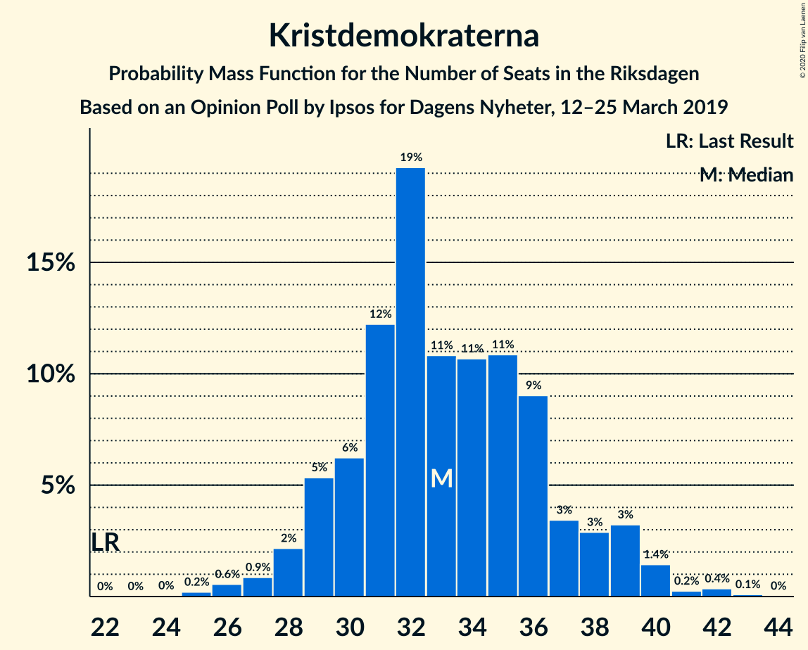

# Opinion Poll by Ipsos for Dagens Nyheter, 12–25 March 2019

<a href="#voting-intentions">Voting Intentions</a> | <a href="#seats">Seats</a> | <a href="#coalitions">Coalitions</a> | <a href="#technical-information">Technical Information</a>

## Voting Intentions

### Confidence Intervals

| Party | Last Result | Poll Result | 80% Confidence Interval | 90% Confidence Interval | 95% Confidence Interval | 99% Confidence Interval |
|:-----:|:-----------:|:-----------:|:-----------------------:|:-----------------------:|:-----------------------:|:-----------------------:|
| Sveriges socialdemokratiska arbetareparti | 28.3% | 27.0% | 25.6–28.5% |25.2–28.9% |24.8–29.3% |24.2–30.0% |
| Sverigedemokraterna | 17.5% | 19.0% | 17.8–20.4% |17.4–20.8% |17.1–21.1% |16.6–21.7% |
| Moderata samlingspartiet | 19.8% | 18.0% | 16.8–19.3% |16.4–19.7% |16.1–20.0% |15.6–20.6% |
| Vänsterpartiet | 8.0% | 10.0% | 9.1–11.1% |8.8–11.4% |8.6–11.6% |8.2–12.1% |
| Kristdemokraterna | 6.3% | 9.0% | 8.1–10.0% |7.9–10.3% |7.7–10.6% |7.3–11.1% |
| Centerpartiet | 8.6% | 8.0% | 7.1–8.9% |6.9–9.2% |6.7–9.4% |6.3–9.9% |
| Liberalerna | 5.5% | 4.0% | 3.4–4.7% |3.2–4.9% |3.1–5.1% |2.9–5.5% |
| Miljöpartiet de gröna | 4.4% | 4.0% | 3.4–4.7% |3.2–4.9% |3.1–5.1% |2.9–5.5% |

*Note:* The poll result column reflects the actual value used in the calculations. Published results may vary slightly, and in addition be rounded to fewer digits.

## Seats

### Confidence Intervals

| Party | Last Result | Median | 80% Confidence Interval | 90% Confidence Interval | 95% Confidence Interval | 99% Confidence Interval |
|:-----:|:-----------:|:------:|:-----------------------:|:-----------------------:|:-----------------------:|:-----------------------:|
| <a href="#sveriges-socialdemokratiska-arbetareparti">Sveriges socialdemokratiska arbetareparti</a> | 100 | 104 | 101–104 |99–104 |96–107 |86–111 |
| <a href="#sverigedemokraterna">Sverigedemokraterna</a> | 62 | 73 | 71–73 |65–73 |64–75 |59–78 |
| <a href="#moderata-samlingspartiet">Moderata samlingspartiet</a> | 70 | 66 | 64–66 |64–69 |64–69 |59–79 |
| <a href="#vänsterpartiet">Vänsterpartiet</a> | 28 | 34 | 34–45 |34–45 |33–45 |32–45 |
| <a href="#kristdemokraterna">Kristdemokraterna</a> | 22 | 39 | 33–39 |29–39 |26–39 |25–39 |
| <a href="#centerpartiet">Centerpartiet</a> | 31 | 33 | 33–35 |33–36 |32–37 |23–37 |
| <a href="#liberalerna">Liberalerna</a> | 20 | 0 | 0 |0 |0–16 |0–16 |
| <a href="#miljöpartiet-de-gröna">Miljöpartiet de gröna</a> | 16 | 0 | 0 |0 |0–17 |0–18 |

### Sveriges socialdemokratiska arbetareparti

*For a full overview of the results for this party, see the [Sveriges socialdemokratiska arbetareparti](party-sverigessocialdemokratiskaarbetareparti.html) page.*

| Number of Seats | Probability | Accumulated | Special Marks |
|:---------------:|:-----------:|:-----------:|:-------------:|
| 86 | 0.6% | 100% |  |
| 87 | 0% | 99.4% |  |
| 88 | 0% | 99.4% |  |
| 89 | 0% | 99.4% |  |
| 90 | 0.1% | 99.4% |  |
| 91 | 0% | 99.2% |  |
| 92 | 0.2% | 99.2% |  |
| 93 | 0.2% | 99.1% |  |
| 94 | 0% | 98.9% |  |
| 95 | 0.1% | 98.9% |  |
| 96 | 3% | 98.8% |  |
| 97 | 0% | 96% |  |
| 98 | 0% | 96% |  |
| 99 | 4% | 96% |  |
| 100 | 0% | 92% | Last Result |
| 101 | 29% | 92% |  |
| 102 | 0.3% | 62% |  |
| 103 | 0% | 62% |  |
| 104 | 59% | 62% | Median |
| 105 | 0.1% | 3% |  |
| 106 | 0% | 3% |  |
| 107 | 0.2% | 3% |  |
| 108 | 1.4% | 2% |  |
| 109 | 0% | 0.9% |  |
| 110 | 0% | 0.9% |  |
| 111 | 0.9% | 0.9% |  |
| 112 | 0% | 0.1% |  |
| 113 | 0% | 0.1% |  |
| 114 | 0.1% | 0.1% |  |
| 115 | 0% | 0% |  |

### Sverigedemokraterna

*For a full overview of the results for this party, see the [Sverigedemokraterna](party-sverigedemokraterna.html) page.*

| Number of Seats | Probability | Accumulated | Special Marks |
|:---------------:|:-----------:|:-----------:|:-------------:|
| 57 | 0.1% | 100% |  |
| 58 | 0% | 99.9% |  |
| 59 | 1.1% | 99.9% |  |
| 60 | 0% | 98.7% |  |
| 61 | 0.2% | 98.7% |  |
| 62 | 0% | 98.6% | Last Result |
| 63 | 0% | 98.6% |  |
| 64 | 3% | 98.5% |  |
| 65 | 1.3% | 95% |  |
| 66 | 0.2% | 94% |  |
| 67 | 0.3% | 94% |  |
| 68 | 0.1% | 94% |  |
| 69 | 0% | 93% |  |
| 70 | 0.4% | 93% |  |
| 71 | 29% | 93% |  |
| 72 | 0.2% | 64% |  |
| 73 | 59% | 63% | Median |
| 74 | 0% | 4% |  |
| 75 | 3% | 4% |  |
| 76 | 0.1% | 2% |  |
| 77 | 0% | 2% |  |
| 78 | 2% | 2% |  |
| 79 | 0% | 0.2% |  |
| 80 | 0% | 0.2% |  |
| 81 | 0% | 0.2% |  |
| 82 | 0.1% | 0.2% |  |
| 83 | 0% | 0.1% |  |
| 84 | 0% | 0% |  |

### Moderata samlingspartiet

*For a full overview of the results for this party, see the [Moderata samlingspartiet](party-moderatasamlingspartiet.html) page.*

| Number of Seats | Probability | Accumulated | Special Marks |
|:---------------:|:-----------:|:-----------:|:-------------:|
| 58 | 0% | 100% |  |
| 59 | 0.9% | 99.9% |  |
| 60 | 0.1% | 99.0% |  |
| 61 | 0.1% | 99.0% |  |
| 62 | 0.1% | 98.9% |  |
| 63 | 0.1% | 98.8% |  |
| 64 | 31% | 98.7% |  |
| 65 | 0.3% | 68% |  |
| 66 | 59% | 68% | Median |
| 67 | 3% | 9% |  |
| 68 | 0.1% | 6% |  |
| 69 | 4% | 6% |  |
| 70 | 0% | 2% | Last Result |
| 71 | 0.3% | 2% |  |
| 72 | 0.1% | 2% |  |
| 73 | 0% | 1.4% |  |
| 74 | 0% | 1.4% |  |
| 75 | 0.2% | 1.4% |  |
| 76 | 0% | 1.2% |  |
| 77 | 0% | 1.2% |  |
| 78 | 0% | 1.2% |  |
| 79 | 1.2% | 1.2% |  |
| 80 | 0% | 0% |  |

### Vänsterpartiet

*For a full overview of the results for this party, see the [Vänsterpartiet](party-vänsterpartiet.html) page.*

| Number of Seats | Probability | Accumulated | Special Marks |
|:---------------:|:-----------:|:-----------:|:-------------:|
| 26 | 0.1% | 100% |  |
| 27 | 0% | 99.9% |  |
| 28 | 0.2% | 99.9% | Last Result |
| 29 | 0% | 99.7% |  |
| 30 | 0% | 99.7% |  |
| 31 | 0.2% | 99.7% |  |
| 32 | 0% | 99.5% |  |
| 33 | 3% | 99.5% |  |
| 34 | 61% | 96% | Median |
| 35 | 2% | 35% |  |
| 36 | 0.8% | 33% |  |
| 37 | 0.3% | 33% |  |
| 38 | 1.4% | 32% |  |
| 39 | 0.3% | 31% |  |
| 40 | 0% | 31% |  |
| 41 | 0.3% | 31% |  |
| 42 | 0.1% | 30% |  |
| 43 | 0.9% | 30% |  |
| 44 | 0% | 29% |  |
| 45 | 29% | 29% |  |
| 46 | 0% | 0.1% |  |
| 47 | 0.1% | 0.1% |  |
| 48 | 0% | 0% |  |

### Kristdemokraterna

*For a full overview of the results for this party, see the [Kristdemokraterna](party-kristdemokraterna.html) page.*

| Number of Seats | Probability | Accumulated | Special Marks |
|:---------------:|:-----------:|:-----------:|:-------------:|
| 22 | 0% | 100% | Last Result |
| 23 | 0% | 100% |  |
| 24 | 0% | 100% |  |
| 25 | 1.4% | 100% |  |
| 26 | 3% | 98.6% |  |
| 27 | 0% | 96% |  |
| 28 | 0% | 96% |  |
| 29 | 1.0% | 96% |  |
| 30 | 3% | 95% |  |
| 31 | 0.2% | 91% |  |
| 32 | 0.2% | 91% |  |
| 33 | 29% | 91% |  |
| 34 | 0.7% | 62% |  |
| 35 | 0% | 61% |  |
| 36 | 0.2% | 61% |  |
| 37 | 1.2% | 61% |  |
| 38 | 1.0% | 60% |  |
| 39 | 58% | 58% | Median |
| 40 | 0% | 0.2% |  |
| 41 | 0.1% | 0.2% |  |
| 42 | 0.1% | 0.2% |  |
| 43 | 0% | 0.1% |  |
| 44 | 0.1% | 0.1% |  |
| 45 | 0% | 0% |  |

### Centerpartiet

*For a full overview of the results for this party, see the [Centerpartiet](party-centerpartiet.html) page.*

| Number of Seats | Probability | Accumulated | Special Marks |
|:---------------:|:-----------:|:-----------:|:-------------:|
| 20 | 0.1% | 100% |  |
| 21 | 0% | 99.9% |  |
| 22 | 0% | 99.9% |  |
| 23 | 0.4% | 99.9% |  |
| 24 | 0% | 99.5% |  |
| 25 | 0% | 99.4% |  |
| 26 | 0% | 99.4% |  |
| 27 | 0% | 99.4% |  |
| 28 | 0% | 99.4% |  |
| 29 | 1.2% | 99.4% |  |
| 30 | 0% | 98% |  |
| 31 | 0.2% | 98% | Last Result |
| 32 | 1.0% | 98% |  |
| 33 | 58% | 97% | Median |
| 34 | 1.3% | 39% |  |
| 35 | 32% | 37% |  |
| 36 | 1.4% | 5% |  |
| 37 | 3% | 4% |  |
| 38 | 0.3% | 0.5% |  |
| 39 | 0.2% | 0.2% |  |
| 40 | 0% | 0% |  |

### Liberalerna

*For a full overview of the results for this party, see the [Liberalerna](party-liberalerna.html) page.*

| Number of Seats | Probability | Accumulated | Special Marks |
|:---------------:|:-----------:|:-----------:|:-------------:|
| 0 | 95% | 100% | Median |
| 1 | 0% | 5% |  |
| 2 | 0% | 5% |  |
| 3 | 0% | 5% |  |
| 4 | 0% | 5% |  |
| 5 | 0% | 5% |  |
| 6 | 0% | 5% |  |
| 7 | 0% | 5% |  |
| 8 | 0% | 5% |  |
| 9 | 0% | 5% |  |
| 10 | 0% | 5% |  |
| 11 | 0% | 5% |  |
| 12 | 0% | 5% |  |
| 13 | 0% | 5% |  |
| 14 | 0% | 5% |  |
| 15 | 0% | 5% |  |
| 16 | 5% | 5% |  |
| 17 | 0% | 0.2% |  |
| 18 | 0.2% | 0.2% |  |
| 19 | 0% | 0% |  |
| 20 | 0% | 0% | Last Result |

### Miljöpartiet de gröna

*For a full overview of the results for this party, see the [Miljöpartiet de gröna](party-miljöpartietdegröna.html) page.*

| Number of Seats | Probability | Accumulated | Special Marks |
|:---------------:|:-----------:|:-----------:|:-------------:|
| 0 | 96% | 100% | Median |
| 1 | 0% | 4% |  |
| 2 | 0% | 4% |  |
| 3 | 0% | 4% |  |
| 4 | 0% | 4% |  |
| 5 | 0% | 4% |  |
| 6 | 0% | 4% |  |
| 7 | 0% | 4% |  |
| 8 | 0% | 4% |  |
| 9 | 0% | 4% |  |
| 10 | 0% | 4% |  |
| 11 | 0% | 4% |  |
| 12 | 0% | 4% |  |
| 13 | 0% | 4% |  |
| 14 | 0% | 4% |  |
| 15 | 0.1% | 4% |  |
| 16 | 0.5% | 4% | Last Result |
| 17 | 3% | 4% |  |
| 18 | 0.1% | 0.6% |  |
| 19 | 0.4% | 0.5% |  |
| 20 | 0% | 0.1% |  |
| 21 | 0% | 0.1% |  |
| 22 | 0% | 0% |  |

## Coalitions

### Confidence Intervals

| Coalition | Last Result | Median | Majority? | 80% Confidence Interval | 90% Confidence Interval | 95% Confidence Interval | 99% Confidence Interval |
|:---------:|:-----------:|:------:|:---------:|:-----------------------:|:-----------------------:|:-----------------------:|:-----------------------:|
| Sveriges socialdemokratiska arbetareparti – Moderata samlingspartiet – Centerpartiet | 201 | 203 | 99.9% | 200–203 | 200–205 | 198–208 | 177–212 |
| Sveriges socialdemokratiska arbetareparti – Vänsterpartiet – Centerpartiet – Liberalerna – Miljöpartiet de gröna | 195 | 171 | 40% | 171–181 | 171–185 | 171–186 | 168–192 |
| Sverigedemokraterna – Moderata samlingspartiet – Kristdemokraterna | 154 | 178 | 60% | 168–178 | 164–178 | 163–178 | 157–181 |
| Sveriges socialdemokratiska arbetareparti – Moderata samlingspartiet | 170 | 170 | 2% | 165–170 | 165–170 | 163–172 | 153–183 |
| Sveriges socialdemokratiska arbetareparti – Centerpartiet – Liberalerna – Miljöpartiet de gröna | 167 | 137 | 0% | 136–143 | 136–147 | 136–153 | 133–153 |
| Sveriges socialdemokratiska arbetareparti – Vänsterpartiet – Miljöpartiet de gröna | 144 | 138 | 0% | 138–146 | 138–146 | 130–149 | 130–151 |
| Sveriges socialdemokratiska arbetareparti – Vänsterpartiet | 128 | 138 | 0% | 138–146 | 132–146 | 130–146 | 121–147 |
| Moderata samlingspartiet – Kristdemokraterna – Centerpartiet – Liberalerna | 143 | 138 | 0% | 132–138 | 132–144 | 129–145 | 125–151 |
| Sverigedemokraterna – Moderata samlingspartiet | 132 | 139 | 0% | 135–139 | 133–142 | 132–142 | 128–144 |
| Moderata samlingspartiet – Kristdemokraterna – Centerpartiet | 123 | 138 | 0% | 132–138 | 128–138 | 128–138 | 123–145 |
| Moderata samlingspartiet – Centerpartiet – Liberalerna | 121 | 99 | 0% | 99–100 | 99–108 | 99–118 | 91–119 |
| Sveriges socialdemokratiska arbetareparti – Miljöpartiet de gröna | 116 | 104 | 0% | 101–104 | 101–108 | 96–116 | 96–116 |
| Moderata samlingspartiet – Centerpartiet | 101 | 99 | 0% | 99–100 | 99–106 | 99–106 | 89–108 |

### Sveriges socialdemokratiska arbetareparti – Moderata samlingspartiet – Centerpartiet

| Number of Seats | Probability | Accumulated | Special Marks |
|:---------------:|:-----------:|:-----------:|:-------------:|
| 172 | 0.1% | 100% |  |
| 173 | 0% | 99.9% |  |
| 174 | 0% | 99.9% |  |
| 175 | 0.4% | 99.9% | Majority |
| 176 | 0% | 99.5% |  |
| 177 | 0% | 99.5% |  |
| 178 | 0% | 99.5% |  |
| 179 | 0% | 99.5% |  |
| 180 | 0% | 99.5% |  |
| 181 | 0% | 99.5% |  |
| 182 | 0% | 99.5% |  |
| 183 | 0% | 99.5% |  |
| 184 | 0% | 99.5% |  |
| 185 | 0% | 99.5% |  |
| 186 | 0% | 99.4% |  |
| 187 | 0.1% | 99.4% |  |
| 188 | 0% | 99.3% |  |
| 189 | 0% | 99.3% |  |
| 190 | 0% | 99.3% |  |
| 191 | 0.1% | 99.3% |  |
| 192 | 0.1% | 99.2% |  |
| 193 | 0% | 99.1% |  |
| 194 | 0.3% | 99.1% |  |
| 195 | 0% | 98.7% |  |
| 196 | 0% | 98.7% |  |
| 197 | 0.1% | 98.7% |  |
| 198 | 3% | 98.6% |  |
| 199 | 0% | 96% |  |
| 200 | 29% | 96% |  |
| 201 | 0.3% | 67% | Last Result |
| 202 | 2% | 66% |  |
| 203 | 58% | 65% | Median |
| 204 | 0% | 6% |  |
| 205 | 3% | 6% |  |
| 206 | 0% | 3% |  |
| 207 | 0% | 3% |  |
| 208 | 1.4% | 3% |  |
| 209 | 0% | 2% |  |
| 210 | 0% | 2% |  |
| 211 | 0% | 2% |  |
| 212 | 1.3% | 2% |  |
| 213 | 0% | 0.2% |  |
| 214 | 0% | 0.2% |  |
| 215 | 0.2% | 0.2% |  |
| 216 | 0% | 0% |  |

### Sveriges socialdemokratiska arbetareparti – Vänsterpartiet – Centerpartiet – Liberalerna – Miljöpartiet de gröna

| Number of Seats | Probability | Accumulated | Special Marks |
|:---------------:|:-----------:|:-----------:|:-------------:|
| 162 | 0% | 100% |  |
| 163 | 0% | 99.9% |  |
| 164 | 0% | 99.9% |  |
| 165 | 0% | 99.9% |  |
| 166 | 0.1% | 99.9% |  |
| 167 | 0% | 99.8% |  |
| 168 | 1.2% | 99.8% |  |
| 169 | 0.1% | 98.6% |  |
| 170 | 0% | 98% |  |
| 171 | 58% | 98% | Median |
| 172 | 0% | 40% |  |
| 173 | 0% | 40% |  |
| 174 | 0.2% | 40% |  |
| 175 | 0.2% | 40% | Majority |
| 176 | 0% | 40% |  |
| 177 | 0.2% | 40% |  |
| 178 | 0% | 40% |  |
| 179 | 1.3% | 40% |  |
| 180 | 0% | 38% |  |
| 181 | 32% | 38% |  |
| 182 | 1.4% | 6% |  |
| 183 | 0% | 5% |  |
| 184 | 0.1% | 5% |  |
| 185 | 0.2% | 5% |  |
| 186 | 3% | 5% |  |
| 187 | 0.2% | 2% |  |
| 188 | 0% | 1.4% |  |
| 189 | 0.1% | 1.4% |  |
| 190 | 0% | 1.3% |  |
| 191 | 0.3% | 1.3% |  |
| 192 | 1.0% | 1.1% |  |
| 193 | 0.1% | 0.1% |  |
| 194 | 0% | 0% |  |
| 195 | 0% | 0% | Last Result |

### Sverigedemokraterna – Moderata samlingspartiet – Kristdemokraterna

| Number of Seats | Probability | Accumulated | Special Marks |
|:---------------:|:-----------:|:-----------:|:-------------:|
| 154 | 0% | 100% | Last Result |
| 155 | 0% | 100% |  |
| 156 | 0.1% | 100% |  |
| 157 | 1.0% | 99.9% |  |
| 158 | 0.3% | 98.9% |  |
| 159 | 0% | 98.7% |  |
| 160 | 0.1% | 98.7% |  |
| 161 | 0% | 98.6% |  |
| 162 | 0.2% | 98.6% |  |
| 163 | 3% | 98% |  |
| 164 | 0.2% | 95% |  |
| 165 | 0.1% | 95% |  |
| 166 | 0% | 95% |  |
| 167 | 1.4% | 95% |  |
| 168 | 32% | 94% |  |
| 169 | 0% | 62% |  |
| 170 | 1.3% | 62% |  |
| 171 | 0% | 60% |  |
| 172 | 0.2% | 60% |  |
| 173 | 0% | 60% |  |
| 174 | 0.2% | 60% |  |
| 175 | 0.2% | 60% | Majority |
| 176 | 0% | 60% |  |
| 177 | 0% | 60% |  |
| 178 | 58% | 60% | Median |
| 179 | 0% | 2% |  |
| 180 | 0.1% | 2% |  |
| 181 | 1.2% | 1.4% |  |
| 182 | 0% | 0.2% |  |
| 183 | 0.1% | 0.2% |  |
| 184 | 0% | 0.1% |  |
| 185 | 0% | 0.1% |  |
| 186 | 0% | 0.1% |  |
| 187 | 0% | 0.1% |  |
| 188 | 0% | 0% |  |

### Sveriges socialdemokratiska arbetareparti – Moderata samlingspartiet

| Number of Seats | Probability | Accumulated | Special Marks |
|:---------------:|:-----------:|:-----------:|:-------------:|
| 152 | 0.5% | 100% |  |
| 153 | 0.1% | 99.5% |  |
| 154 | 0% | 99.4% |  |
| 155 | 0% | 99.4% |  |
| 156 | 0% | 99.4% |  |
| 157 | 0.2% | 99.4% |  |
| 158 | 0.1% | 99.2% |  |
| 159 | 0% | 99.1% |  |
| 160 | 0.1% | 99.1% |  |
| 161 | 0% | 99.0% |  |
| 162 | 0.2% | 98.9% |  |
| 163 | 3% | 98.8% |  |
| 164 | 0.2% | 96% |  |
| 165 | 29% | 96% |  |
| 166 | 0.1% | 67% |  |
| 167 | 0.4% | 67% |  |
| 168 | 4% | 66% |  |
| 169 | 0% | 62% |  |
| 170 | 59% | 62% | Last Result, Median |
| 171 | 0% | 3% |  |
| 172 | 1.4% | 3% |  |
| 173 | 0% | 2% |  |
| 174 | 0% | 2% |  |
| 175 | 0% | 2% | Majority |
| 176 | 0.2% | 2% |  |
| 177 | 0.1% | 1.3% |  |
| 178 | 0% | 1.3% |  |
| 179 | 0% | 1.3% |  |
| 180 | 0% | 1.3% |  |
| 181 | 0% | 1.3% |  |
| 182 | 0% | 1.2% |  |
| 183 | 1.2% | 1.2% |  |
| 184 | 0% | 0% |  |

### Sveriges socialdemokratiska arbetareparti – Centerpartiet – Liberalerna – Miljöpartiet de gröna

| Number of Seats | Probability | Accumulated | Special Marks |
|:---------------:|:-----------:|:-----------:|:-------------:|
| 126 | 0% | 100% |  |
| 127 | 0% | 99.9% |  |
| 128 | 0% | 99.9% |  |
| 129 | 0% | 99.9% |  |
| 130 | 0% | 99.9% |  |
| 131 | 0% | 99.9% |  |
| 132 | 0% | 99.9% |  |
| 133 | 1.3% | 99.9% |  |
| 134 | 0% | 98.6% |  |
| 135 | 0% | 98.6% |  |
| 136 | 29% | 98.6% |  |
| 137 | 58% | 69% | Median |
| 138 | 0% | 11% |  |
| 139 | 0.2% | 11% |  |
| 140 | 0% | 11% |  |
| 141 | 0% | 11% |  |
| 142 | 0.1% | 11% |  |
| 143 | 0.9% | 11% |  |
| 144 | 2% | 10% |  |
| 145 | 0% | 8% |  |
| 146 | 0.4% | 8% |  |
| 147 | 3% | 8% |  |
| 148 | 0% | 5% |  |
| 149 | 1.0% | 5% |  |
| 150 | 0% | 4% |  |
| 151 | 0.1% | 4% |  |
| 152 | 0.4% | 4% |  |
| 153 | 3% | 3% |  |
| 154 | 0% | 0% |  |
| 155 | 0% | 0% |  |
| 156 | 0% | 0% |  |
| 157 | 0% | 0% |  |
| 158 | 0% | 0% |  |
| 159 | 0% | 0% |  |
| 160 | 0% | 0% |  |
| 161 | 0% | 0% |  |
| 162 | 0% | 0% |  |
| 163 | 0% | 0% |  |
| 164 | 0% | 0% |  |
| 165 | 0% | 0% |  |
| 166 | 0% | 0% |  |
| 167 | 0% | 0% | Last Result |

### Sveriges socialdemokratiska arbetareparti – Vänsterpartiet – Miljöpartiet de gröna

| Number of Seats | Probability | Accumulated | Special Marks |
|:---------------:|:-----------:|:-----------:|:-------------:|
| 121 | 0.3% | 100% |  |
| 122 | 0% | 99.7% |  |
| 123 | 0% | 99.7% |  |
| 124 | 0% | 99.7% |  |
| 125 | 0% | 99.6% |  |
| 126 | 0% | 99.6% |  |
| 127 | 0.1% | 99.6% |  |
| 128 | 0% | 99.6% |  |
| 129 | 0% | 99.6% |  |
| 130 | 3% | 99.6% |  |
| 131 | 0% | 97% |  |
| 132 | 0% | 97% |  |
| 133 | 0.1% | 97% |  |
| 134 | 0.1% | 97% |  |
| 135 | 0% | 97% |  |
| 136 | 0% | 97% |  |
| 137 | 0.1% | 97% |  |
| 138 | 58% | 96% | Median |
| 139 | 1.3% | 38% |  |
| 140 | 0.5% | 37% |  |
| 141 | 0% | 36% |  |
| 142 | 0.9% | 36% |  |
| 143 | 0% | 35% |  |
| 144 | 0% | 35% | Last Result |
| 145 | 0% | 35% |  |
| 146 | 31% | 35% |  |
| 147 | 0.8% | 5% |  |
| 148 | 0.2% | 4% |  |
| 149 | 3% | 4% |  |
| 150 | 0% | 0.5% |  |
| 151 | 0% | 0.5% |  |
| 152 | 0% | 0.5% |  |
| 153 | 0% | 0.5% |  |
| 154 | 0% | 0.5% |  |
| 155 | 0% | 0.5% |  |
| 156 | 0% | 0.5% |  |
| 157 | 0.3% | 0.5% |  |
| 158 | 0.2% | 0.2% |  |
| 159 | 0% | 0% |  |

### Sveriges socialdemokratiska arbetareparti – Vänsterpartiet

| Number of Seats | Probability | Accumulated | Special Marks |
|:---------------:|:-----------:|:-----------:|:-------------:|
| 121 | 0.7% | 100% |  |
| 122 | 0.1% | 99.3% |  |
| 123 | 0.1% | 99.1% |  |
| 124 | 0.1% | 99.0% |  |
| 125 | 0% | 98.9% |  |
| 126 | 0% | 98.9% |  |
| 127 | 0.1% | 98.9% |  |
| 128 | 0% | 98.8% | Last Result |
| 129 | 0% | 98.8% |  |
| 130 | 3% | 98.8% |  |
| 131 | 0.1% | 96% |  |
| 132 | 3% | 96% |  |
| 133 | 0.1% | 93% |  |
| 134 | 0.1% | 93% |  |
| 135 | 0% | 93% |  |
| 136 | 0% | 93% |  |
| 137 | 0% | 93% |  |
| 138 | 58% | 93% | Median |
| 139 | 1.2% | 34% |  |
| 140 | 0% | 33% |  |
| 141 | 0.3% | 33% |  |
| 142 | 1.0% | 33% |  |
| 143 | 0% | 32% |  |
| 144 | 0% | 32% |  |
| 145 | 0% | 32% |  |
| 146 | 31% | 32% |  |
| 147 | 0.8% | 1.1% |  |
| 148 | 0.2% | 0.4% |  |
| 149 | 0% | 0.2% |  |
| 150 | 0% | 0.1% |  |
| 151 | 0% | 0.1% |  |
| 152 | 0% | 0.1% |  |
| 153 | 0% | 0.1% |  |
| 154 | 0% | 0.1% |  |
| 155 | 0% | 0.1% |  |
| 156 | 0% | 0.1% |  |
| 157 | 0% | 0.1% |  |
| 158 | 0.1% | 0.1% |  |
| 159 | 0% | 0% |  |

### Moderata samlingspartiet – Kristdemokraterna – Centerpartiet – Liberalerna

| Number of Seats | Probability | Accumulated | Special Marks |
|:---------------:|:-----------:|:-----------:|:-------------:|
| 122 | 0% | 100% |  |
| 123 | 0% | 99.9% |  |
| 124 | 0% | 99.9% |  |
| 125 | 2% | 99.9% |  |
| 126 | 0% | 98% |  |
| 127 | 0% | 98% |  |
| 128 | 0.1% | 98% |  |
| 129 | 0.8% | 98% |  |
| 130 | 0.2% | 97% |  |
| 131 | 0% | 97% |  |
| 132 | 29% | 97% |  |
| 133 | 0.1% | 68% |  |
| 134 | 0.2% | 68% |  |
| 135 | 0.1% | 68% |  |
| 136 | 3% | 68% |  |
| 137 | 0% | 65% |  |
| 138 | 58% | 65% | Median |
| 139 | 0.4% | 6% |  |
| 140 | 0% | 6% |  |
| 141 | 0% | 6% |  |
| 142 | 0.3% | 6% |  |
| 143 | 0% | 6% | Last Result |
| 144 | 3% | 6% |  |
| 145 | 1.3% | 3% |  |
| 146 | 0.1% | 2% |  |
| 147 | 0% | 1.5% |  |
| 148 | 0.9% | 1.5% |  |
| 149 | 0% | 0.5% |  |
| 150 | 0% | 0.5% |  |
| 151 | 0% | 0.5% |  |
| 152 | 0% | 0.5% |  |
| 153 | 0% | 0.5% |  |
| 154 | 0% | 0.5% |  |
| 155 | 0.1% | 0.5% |  |
| 156 | 0.1% | 0.4% |  |
| 157 | 0% | 0.3% |  |
| 158 | 0% | 0.3% |  |
| 159 | 0.1% | 0.3% |  |
| 160 | 0% | 0.2% |  |
| 161 | 0% | 0.2% |  |
| 162 | 0.2% | 0.2% |  |
| 163 | 0% | 0% |  |

### Sverigedemokraterna – Moderata samlingspartiet

| Number of Seats | Probability | Accumulated | Special Marks |
|:---------------:|:-----------:|:-----------:|:-------------:|
| 122 | 0.1% | 100% |  |
| 123 | 0% | 99.9% |  |
| 124 | 0% | 99.9% |  |
| 125 | 0% | 99.9% |  |
| 126 | 0% | 99.9% |  |
| 127 | 0.1% | 99.9% |  |
| 128 | 1.1% | 99.8% |  |
| 129 | 0.1% | 98.7% |  |
| 130 | 0.1% | 98.5% |  |
| 131 | 0.1% | 98% |  |
| 132 | 1.1% | 98% | Last Result |
| 133 | 3% | 97% |  |
| 134 | 0.1% | 94% |  |
| 135 | 29% | 94% |  |
| 136 | 0.5% | 65% |  |
| 137 | 0.2% | 64% |  |
| 138 | 0% | 64% |  |
| 139 | 58% | 64% | Median |
| 140 | 0.1% | 6% |  |
| 141 | 0.1% | 6% |  |
| 142 | 4% | 6% |  |
| 143 | 0.2% | 2% |  |
| 144 | 1.3% | 1.4% |  |
| 145 | 0% | 0.1% |  |
| 146 | 0% | 0.1% |  |
| 147 | 0% | 0.1% |  |
| 148 | 0% | 0.1% |  |
| 149 | 0% | 0% |  |

### Moderata samlingspartiet – Kristdemokraterna – Centerpartiet

| Number of Seats | Probability | Accumulated | Special Marks |
|:---------------:|:-----------:|:-----------:|:-------------:|
| 112 | 0.1% | 100% |  |
| 113 | 0% | 99.9% |  |
| 114 | 0% | 99.9% |  |
| 115 | 0% | 99.9% |  |
| 116 | 0% | 99.9% |  |
| 117 | 0% | 99.9% |  |
| 118 | 0% | 99.9% |  |
| 119 | 0% | 99.9% |  |
| 120 | 0% | 99.9% |  |
| 121 | 0% | 99.9% |  |
| 122 | 0% | 99.8% |  |
| 123 | 0.4% | 99.8% | Last Result |
| 124 | 0% | 99.4% |  |
| 125 | 2% | 99.4% |  |
| 126 | 0% | 98% |  |
| 127 | 0% | 98% |  |
| 128 | 3% | 98% |  |
| 129 | 0.8% | 95% |  |
| 130 | 0.2% | 94% |  |
| 131 | 0% | 94% |  |
| 132 | 30% | 94% |  |
| 133 | 0.1% | 64% |  |
| 134 | 0.1% | 64% |  |
| 135 | 0.1% | 64% |  |
| 136 | 3% | 63% |  |
| 137 | 0.1% | 60% |  |
| 138 | 58% | 60% | Median |
| 139 | 0% | 2% |  |
| 140 | 0.1% | 2% |  |
| 141 | 0% | 2% |  |
| 142 | 0.3% | 2% |  |
| 143 | 0.1% | 2% |  |
| 144 | 0% | 2% |  |
| 145 | 1.3% | 2% |  |
| 146 | 0.2% | 0.2% |  |
| 147 | 0% | 0% |  |

### Moderata samlingspartiet – Centerpartiet – Liberalerna

| Number of Seats | Probability | Accumulated | Special Marks |
|:---------------:|:-----------:|:-----------:|:-------------:|
| 89 | 0% | 100% |  |
| 90 | 0% | 99.9% |  |
| 91 | 1.0% | 99.9% |  |
| 92 | 0.1% | 99.0% |  |
| 93 | 0% | 98.9% |  |
| 94 | 0% | 98.9% |  |
| 95 | 0% | 98.9% |  |
| 96 | 0% | 98.9% |  |
| 97 | 0% | 98.9% |  |
| 98 | 0.3% | 98.9% |  |
| 99 | 88% | 98.6% | Median |
| 100 | 1.4% | 11% |  |
| 101 | 0.1% | 9% |  |
| 102 | 0% | 9% |  |
| 103 | 0% | 9% |  |
| 104 | 0% | 9% |  |
| 105 | 0.4% | 9% |  |
| 106 | 3% | 9% |  |
| 107 | 0% | 6% |  |
| 108 | 1.4% | 6% |  |
| 109 | 0% | 4% |  |
| 110 | 0% | 4% |  |
| 111 | 0% | 4% |  |
| 112 | 0% | 4% |  |
| 113 | 0.1% | 4% |  |
| 114 | 0% | 4% |  |
| 115 | 0.1% | 4% |  |
| 116 | 0% | 4% |  |
| 117 | 0% | 4% |  |
| 118 | 3% | 4% |  |
| 119 | 0.9% | 1.4% |  |
| 120 | 0% | 0.5% |  |
| 121 | 0% | 0.5% | Last Result |
| 122 | 0% | 0.5% |  |
| 123 | 0.1% | 0.5% |  |
| 124 | 0.2% | 0.4% |  |
| 125 | 0.3% | 0.3% |  |
| 126 | 0% | 0% |  |

### Sveriges socialdemokratiska arbetareparti – Miljöpartiet de gröna

| Number of Seats | Probability | Accumulated | Special Marks |
|:---------------:|:-----------:|:-----------:|:-------------:|
| 86 | 0.2% | 100% |  |
| 87 | 0% | 99.8% |  |
| 88 | 0% | 99.8% |  |
| 89 | 0% | 99.8% |  |
| 90 | 0.1% | 99.8% |  |
| 91 | 0% | 99.7% |  |
| 92 | 0% | 99.7% |  |
| 93 | 0.2% | 99.7% |  |
| 94 | 0% | 99.5% |  |
| 95 | 0% | 99.5% |  |
| 96 | 3% | 99.5% |  |
| 97 | 0% | 97% |  |
| 98 | 0% | 97% |  |
| 99 | 0.9% | 97% |  |
| 100 | 0% | 96% |  |
| 101 | 29% | 96% |  |
| 102 | 0% | 66% |  |
| 103 | 0% | 66% |  |
| 104 | 59% | 66% | Median |
| 105 | 0.4% | 7% |  |
| 106 | 0% | 6% |  |
| 107 | 0.2% | 6% |  |
| 108 | 2% | 6% |  |
| 109 | 0% | 5% |  |
| 110 | 0% | 5% |  |
| 111 | 1.0% | 5% |  |
| 112 | 0% | 4% |  |
| 113 | 0% | 4% |  |
| 114 | 0.1% | 4% |  |
| 115 | 0% | 3% |  |
| 116 | 3% | 3% | Last Result |
| 117 | 0% | 0.4% |  |
| 118 | 0.3% | 0.4% |  |
| 119 | 0% | 0.1% |  |
| 120 | 0% | 0.1% |  |
| 121 | 0.1% | 0.1% |  |
| 122 | 0% | 0% |  |

### Moderata samlingspartiet – Centerpartiet

| Number of Seats | Probability | Accumulated | Special Marks |
|:---------------:|:-----------:|:-----------:|:-------------:|
| 82 | 0.1% | 100% |  |
| 83 | 0% | 99.9% |  |
| 84 | 0% | 99.9% |  |
| 85 | 0% | 99.9% |  |
| 86 | 0% | 99.9% |  |
| 87 | 0% | 99.9% |  |
| 88 | 0% | 99.9% |  |
| 89 | 0.4% | 99.9% |  |
| 90 | 0% | 99.4% |  |
| 91 | 1.0% | 99.4% |  |
| 92 | 0.1% | 98% |  |
| 93 | 0% | 98% |  |
| 94 | 0% | 98% |  |
| 95 | 0% | 98% |  |
| 96 | 0% | 98% |  |
| 97 | 0.1% | 98% |  |
| 98 | 0.2% | 98% |  |
| 99 | 88% | 98% | Median |
| 100 | 1.4% | 10% |  |
| 101 | 0.1% | 9% | Last Result |
| 102 | 3% | 9% |  |
| 103 | 0.9% | 6% |  |
| 104 | 0% | 5% |  |
| 105 | 0.1% | 5% |  |
| 106 | 3% | 5% |  |
| 107 | 0% | 2% |  |
| 108 | 2% | 2% |  |
| 109 | 0.3% | 0.4% |  |
| 110 | 0% | 0.2% |  |
| 111 | 0% | 0.2% |  |
| 112 | 0% | 0.2% |  |
| 113 | 0.1% | 0.1% |  |
| 114 | 0% | 0% |  |

## Technical Information

### Opinion Poll

+ **Polling firm:** Ipsos
+ **Commissioner(s):** Dagens Nyheter
+ **Fieldwork period:** 12–25 March 2019

### Calculations

+ **Sample size:** 1529
+ **Simulations done:** 2,048
+ **Error estimate:** 2.91%

