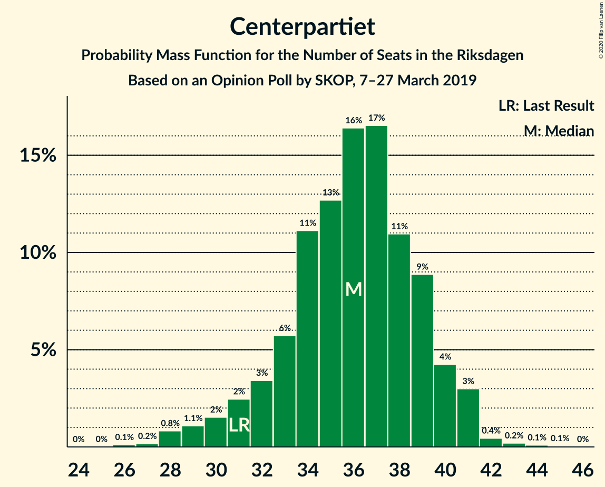
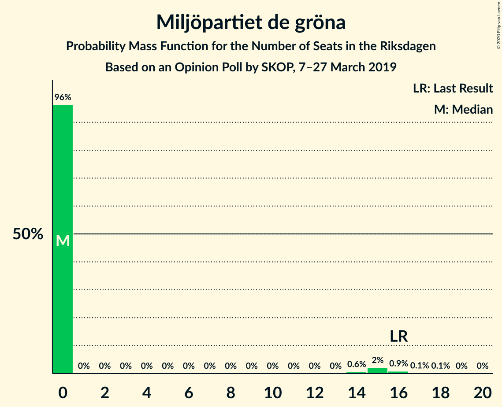

# Opinion Poll by SKOP, 7–27 March 2019

<a href="#voting-intentions">Voting Intentions</a> | <a href="#seats">Seats</a> | <a href="#coalitions">Coalitions</a> | <a href="#technical-information">Technical Information</a>

## Voting Intentions

### Confidence Intervals

| Party | Last Result | Poll Result | 80% Confidence Interval | 90% Confidence Interval | 95% Confidence Interval | 99% Confidence Interval |
|:-----:|:-----------:|:-----------:|:-----------------------:|:-----------------------:|:-----------------------:|:-----------------------:|
| Sveriges socialdemokratiska arbetareparti | 28.3% | 28.7% | 27.2–30.2% |26.8–30.6% |26.4–31.0% |25.8–31.8% |
| Moderata samlingspartiet | 19.8% | 18.0% | 16.8–19.3% |16.4–19.7% |16.2–20.0% |15.6–20.7% |
| Sverigedemokraterna | 17.5% | 16.5% | 15.3–17.8% |15.0–18.1% |14.7–18.5% |14.1–19.1% |
| Kristdemokraterna | 6.3% | 10.1% | 9.1–11.1% |8.9–11.4% |8.6–11.7% |8.2–12.2% |
| Centerpartiet | 8.6% | 9.5% | 8.6–10.5% |8.3–10.8% |8.1–11.1% |7.7–11.6% |
| Vänsterpartiet | 8.0% | 8.8% | 7.9–9.8% |7.7–10.1% |7.5–10.3% |7.1–10.9% |
| Liberalerna | 5.5% | 4.2% | 3.6–4.9% |3.4–5.1% |3.3–5.3% |3.0–5.7% |
| Miljöpartiet de gröna | 4.4% | 3.1% | 2.6–3.8% |2.5–4.0% |2.3–4.1% |2.1–4.5% |

*Note:* The poll result column reflects the actual value used in the calculations. Published results may vary slightly, and in addition be rounded to fewer digits.

## Seats

### Confidence Intervals

| Party | Last Result | Median | 80% Confidence Interval | 90% Confidence Interval | 95% Confidence Interval | 99% Confidence Interval |
|:-----:|:-----------:|:------:|:-----------------------:|:-----------------------:|:-----------------------:|:-----------------------:|
| <a href="#sveriges-socialdemokratiska-arbetareparti">Sveriges socialdemokratiska arbetareparti</a> | 100 | 104 | 99–114 |97–115 |96–116 |94–118 |
| <a href="#moderata-samlingspartiet">Moderata samlingspartiet</a> | 70 | 65 | 62–70 |61–72 |59–73 |57–75 |
| <a href="#sverigedemokraterna">Sverigedemokraterna</a> | 62 | 61 | 55–66 |54–68 |53–70 |52–71 |
| <a href="#kristdemokraterna">Kristdemokraterna</a> | 22 | 37 | 34–41 |33–41 |32–43 |30–45 |
| <a href="#centerpartiet">Centerpartiet</a> | 31 | 35 | 33–37 |32–38 |32–39 |30–41 |
| <a href="#vänsterpartiet">Vänsterpartiet</a> | 28 | 33 | 28–37 |28–38 |27–39 |26–40 |
| <a href="#liberalerna">Liberalerna</a> | 20 | 15 | 0–18 |0–18 |0–19 |0–20 |
| <a href="#miljöpartiet-de-gröna">Miljöpartiet de gröna</a> | 16 | 0 | 0 |0 |0–15 |0–15 |

### Sveriges socialdemokratiska arbetareparti

*For a full overview of the results for this party, see the [Sveriges socialdemokratiska arbetareparti](party-sverigessocialdemokratiskaarbetareparti.html) page.*

| Number of Seats | Probability | Accumulated | Special Marks |
|:---------------:|:-----------:|:-----------:|:-------------:|
| 91 | 0% | 100% |  |
| 92 | 0% | 99.9% |  |
| 93 | 0.4% | 99.9% |  |
| 94 | 0.7% | 99.5% |  |
| 95 | 1.1% | 98.8% |  |
| 96 | 0.7% | 98% |  |
| 97 | 4% | 97% |  |
| 98 | 1.1% | 93% |  |
| 99 | 7% | 92% |  |
| 100 | 3% | 84% | Last Result |
| 101 | 4% | 81% |  |
| 102 | 20% | 77% |  |
| 103 | 4% | 57% |  |
| 104 | 3% | 53% | Median |
| 105 | 7% | 50% |  |
| 106 | 6% | 43% |  |
| 107 | 10% | 37% |  |
| 108 | 4% | 28% |  |
| 109 | 0.8% | 23% |  |
| 110 | 1.1% | 23% |  |
| 111 | 9% | 21% |  |
| 112 | 1.4% | 12% |  |
| 113 | 0.7% | 11% |  |
| 114 | 4% | 10% |  |
| 115 | 4% | 7% |  |
| 116 | 1.3% | 3% |  |
| 117 | 0.1% | 1.2% |  |
| 118 | 0.8% | 1.1% |  |
| 119 | 0.2% | 0.3% |  |
| 120 | 0% | 0.1% |  |
| 121 | 0.1% | 0.1% |  |
| 122 | 0% | 0% |  |

### Moderata samlingspartiet

*For a full overview of the results for this party, see the [Moderata samlingspartiet](party-moderatasamlingspartiet.html) page.*

| Number of Seats | Probability | Accumulated | Special Marks |
|:---------------:|:-----------:|:-----------:|:-------------:|
| 55 | 0.1% | 100% |  |
| 56 | 0.1% | 99.8% |  |
| 57 | 0.3% | 99.8% |  |
| 58 | 0.8% | 99.5% |  |
| 59 | 1.2% | 98.7% |  |
| 60 | 2% | 97% |  |
| 61 | 4% | 96% |  |
| 62 | 2% | 92% |  |
| 63 | 12% | 90% |  |
| 64 | 15% | 78% |  |
| 65 | 16% | 63% | Median |
| 66 | 5% | 47% |  |
| 67 | 7% | 42% |  |
| 68 | 12% | 36% |  |
| 69 | 6% | 24% |  |
| 70 | 9% | 19% | Last Result |
| 71 | 4% | 9% |  |
| 72 | 1.3% | 5% |  |
| 73 | 2% | 4% |  |
| 74 | 0.9% | 2% |  |
| 75 | 0.6% | 1.0% |  |
| 76 | 0.1% | 0.5% |  |
| 77 | 0.2% | 0.3% |  |
| 78 | 0.1% | 0.2% |  |
| 79 | 0% | 0.1% |  |
| 80 | 0% | 0% |  |

### Sverigedemokraterna

*For a full overview of the results for this party, see the [Sverigedemokraterna](party-sverigedemokraterna.html) page.*

| Number of Seats | Probability | Accumulated | Special Marks |
|:---------------:|:-----------:|:-----------:|:-------------:|
| 50 | 0.2% | 100% |  |
| 51 | 0.1% | 99.8% |  |
| 52 | 1.4% | 99.7% |  |
| 53 | 1.1% | 98% |  |
| 54 | 6% | 97% |  |
| 55 | 4% | 91% |  |
| 56 | 4% | 87% |  |
| 57 | 4% | 83% |  |
| 58 | 13% | 78% |  |
| 59 | 6% | 66% |  |
| 60 | 2% | 60% |  |
| 61 | 13% | 58% | Median |
| 62 | 11% | 44% | Last Result |
| 63 | 3% | 33% |  |
| 64 | 7% | 30% |  |
| 65 | 3% | 23% |  |
| 66 | 12% | 20% |  |
| 67 | 1.0% | 8% |  |
| 68 | 4% | 7% |  |
| 69 | 0.9% | 3% |  |
| 70 | 0.2% | 3% |  |
| 71 | 2% | 2% |  |
| 72 | 0% | 0.4% |  |
| 73 | 0.3% | 0.3% |  |
| 74 | 0% | 0% |  |

### Kristdemokraterna

*For a full overview of the results for this party, see the [Kristdemokraterna](party-kristdemokraterna.html) page.*

| Number of Seats | Probability | Accumulated | Special Marks |
|:---------------:|:-----------:|:-----------:|:-------------:|
| 22 | 0% | 100% | Last Result |
| 23 | 0% | 100% |  |
| 24 | 0% | 100% |  |
| 25 | 0% | 100% |  |
| 26 | 0% | 100% |  |
| 27 | 0% | 100% |  |
| 28 | 0% | 100% |  |
| 29 | 0.3% | 100% |  |
| 30 | 0.4% | 99.6% |  |
| 31 | 1.0% | 99.2% |  |
| 32 | 0.9% | 98% |  |
| 33 | 6% | 97% |  |
| 34 | 7% | 91% |  |
| 35 | 9% | 84% |  |
| 36 | 10% | 75% |  |
| 37 | 19% | 65% | Median |
| 38 | 8% | 46% |  |
| 39 | 15% | 39% |  |
| 40 | 11% | 24% |  |
| 41 | 9% | 13% |  |
| 42 | 0.8% | 4% |  |
| 43 | 2% | 3% |  |
| 44 | 0.5% | 1.3% |  |
| 45 | 0.5% | 0.8% |  |
| 46 | 0.3% | 0.3% |  |
| 47 | 0% | 0.1% |  |
| 48 | 0% | 0% |  |

### Centerpartiet

*For a full overview of the results for this party, see the [Centerpartiet](party-centerpartiet.html) page.*

| Number of Seats | Probability | Accumulated | Special Marks |
|:---------------:|:-----------:|:-----------:|:-------------:|
| 27 | 0.1% | 100% |  |
| 28 | 0.1% | 99.9% |  |
| 29 | 0.2% | 99.8% |  |
| 30 | 0.8% | 99.6% |  |
| 31 | 1.1% | 98.8% | Last Result |
| 32 | 4% | 98% |  |
| 33 | 15% | 94% |  |
| 34 | 13% | 79% |  |
| 35 | 38% | 66% | Median |
| 36 | 10% | 28% |  |
| 37 | 11% | 18% |  |
| 38 | 4% | 7% |  |
| 39 | 1.4% | 3% |  |
| 40 | 0.8% | 1.4% |  |
| 41 | 0.2% | 0.6% |  |
| 42 | 0.1% | 0.4% |  |
| 43 | 0.1% | 0.3% |  |
| 44 | 0.1% | 0.2% |  |
| 45 | 0.1% | 0.1% |  |
| 46 | 0% | 0% |  |

### Vänsterpartiet

*For a full overview of the results for this party, see the [Vänsterpartiet](party-vänsterpartiet.html) page.*

| Number of Seats | Probability | Accumulated | Special Marks |
|:---------------:|:-----------:|:-----------:|:-------------:|
| 25 | 0.2% | 100% |  |
| 26 | 2% | 99.7% |  |
| 27 | 2% | 98% |  |
| 28 | 7% | 96% | Last Result |
| 29 | 9% | 89% |  |
| 30 | 4% | 81% |  |
| 31 | 14% | 76% |  |
| 32 | 8% | 62% |  |
| 33 | 8% | 55% | Median |
| 34 | 16% | 47% |  |
| 35 | 5% | 31% |  |
| 36 | 15% | 26% |  |
| 37 | 1.1% | 11% |  |
| 38 | 7% | 10% |  |
| 39 | 2% | 3% |  |
| 40 | 0.5% | 0.8% |  |
| 41 | 0.2% | 0.3% |  |
| 42 | 0% | 0.1% |  |
| 43 | 0% | 0% |  |

### Liberalerna

*For a full overview of the results for this party, see the [Liberalerna](party-liberalerna.html) page.*

| Number of Seats | Probability | Accumulated | Special Marks |
|:---------------:|:-----------:|:-----------:|:-------------:|
| 0 | 29% | 100% |  |
| 1 | 0% | 71% |  |
| 2 | 0% | 71% |  |
| 3 | 0% | 71% |  |
| 4 | 0% | 71% |  |
| 5 | 0% | 71% |  |
| 6 | 0% | 71% |  |
| 7 | 0% | 71% |  |
| 8 | 0% | 71% |  |
| 9 | 0% | 71% |  |
| 10 | 0% | 71% |  |
| 11 | 0% | 71% |  |
| 12 | 0% | 71% |  |
| 13 | 0% | 71% |  |
| 14 | 0.8% | 71% |  |
| 15 | 45% | 70% | Median |
| 16 | 3% | 25% |  |
| 17 | 7% | 22% |  |
| 18 | 12% | 15% |  |
| 19 | 2% | 3% |  |
| 20 | 0.8% | 1.0% | Last Result |
| 21 | 0.1% | 0.3% |  |
| 22 | 0.1% | 0.1% |  |
| 23 | 0% | 0% |  |

### Miljöpartiet de gröna

*For a full overview of the results for this party, see the [Miljöpartiet de gröna](party-miljöpartietdegröna.html) page.*

| Number of Seats | Probability | Accumulated | Special Marks |
|:---------------:|:-----------:|:-----------:|:-------------:|
| 0 | 96% | 100% | Median |
| 1 | 0% | 4% |  |
| 2 | 0% | 4% |  |
| 3 | 0% | 4% |  |
| 4 | 0% | 4% |  |
| 5 | 0% | 4% |  |
| 6 | 0% | 4% |  |
| 7 | 0% | 4% |  |
| 8 | 0% | 4% |  |
| 9 | 0% | 4% |  |
| 10 | 0% | 4% |  |
| 11 | 0% | 4% |  |
| 12 | 0% | 4% |  |
| 13 | 0% | 4% |  |
| 14 | 0.8% | 4% |  |
| 15 | 3% | 3% |  |
| 16 | 0.1% | 0.3% | Last Result |
| 17 | 0.1% | 0.2% |  |
| 18 | 0.1% | 0.1% |  |
| 19 | 0% | 0% |  |

## Coalitions

### Confidence Intervals

| Coalition | Last Result | Median | Majority? | 80% Confidence Interval | 90% Confidence Interval | 95% Confidence Interval | 99% Confidence Interval |
|:---------:|:-----------:|:------:|:---------:|:-----------------------:|:-----------------------:|:-----------------------:|:-----------------------:|
| Sveriges socialdemokratiska arbetareparti – Moderata samlingspartiet – Centerpartiet | 201 | 205 | 100% | 199–217 | 197–218 | 195–218 | 190–223 |
| Sveriges socialdemokratiska arbetareparti – Centerpartiet – Vänsterpartiet – Liberalerna – Miljöpartiet de gröna | 195 | 186 | 98% | 178–191 | 176–194 | 175–195 | 172–199 |
| Sveriges socialdemokratiska arbetareparti – Moderata samlingspartiet | 170 | 170 | 36% | 163–183 | 162–184 | 159–185 | 158–189 |
| Moderata samlingspartiet – Sverigedemokraterna – Kristdemokraterna | 154 | 163 | 2% | 158–171 | 155–173 | 154–174 | 150–177 |
| Sveriges socialdemokratiska arbetareparti – Centerpartiet – Liberalerna – Miljöpartiet de gröna | 167 | 152 | 0% | 144–158 | 140–161 | 140–162 | 138–166 |
| Moderata samlingspartiet – Kristdemokraterna – Centerpartiet – Liberalerna | 143 | 152 | 0% | 137–157 | 136–159 | 136–161 | 133–163 |
| Sveriges socialdemokratiska arbetareparti – Vänsterpartiet – Miljöpartiet de gröna | 144 | 138 | 0% | 131–147 | 130–148 | 130–150 | 126–153 |
| Sveriges socialdemokratiska arbetareparti – Vänsterpartiet | 128 | 137 | 0% | 131–147 | 130–147 | 127–149 | 124–151 |
| Moderata samlingspartiet – Kristdemokraterna – Centerpartiet | 123 | 138 | 0% | 134–144 | 131–145 | 128–148 | 125–152 |
| Moderata samlingspartiet – Sverigedemokraterna | 132 | 127 | 0% | 121–134 | 119–135 | 118–138 | 116–141 |
| Moderata samlingspartiet – Centerpartiet – Liberalerna | 121 | 115 | 0% | 100–120 | 97–123 | 97–124 | 95–127 |
| Sveriges socialdemokratiska arbetareparti – Miljöpartiet de gröna | 116 | 105 | 0% | 99–114 | 97–115 | 97–116 | 95–120 |
| Moderata samlingspartiet – Centerpartiet | 101 | 101 | 0% | 97–105 | 95–107 | 93–109 | 90–112 |

### Sveriges socialdemokratiska arbetareparti – Moderata samlingspartiet – Centerpartiet

| Number of Seats | Probability | Accumulated | Special Marks |
|:---------------:|:-----------:|:-----------:|:-------------:|
| 189 | 0% | 100% |  |
| 190 | 0.4% | 99.9% |  |
| 191 | 0.1% | 99.5% |  |
| 192 | 0.3% | 99.4% |  |
| 193 | 0.2% | 99.1% |  |
| 194 | 0.8% | 98.9% |  |
| 195 | 1.4% | 98% |  |
| 196 | 0.9% | 97% |  |
| 197 | 2% | 96% |  |
| 198 | 1.0% | 94% |  |
| 199 | 4% | 93% |  |
| 200 | 13% | 89% |  |
| 201 | 6% | 76% | Last Result |
| 202 | 13% | 71% |  |
| 203 | 2% | 58% |  |
| 204 | 4% | 56% | Median |
| 205 | 3% | 51% |  |
| 206 | 2% | 48% |  |
| 207 | 3% | 46% |  |
| 208 | 9% | 43% |  |
| 209 | 3% | 34% |  |
| 210 | 8% | 31% |  |
| 211 | 5% | 23% |  |
| 212 | 2% | 18% |  |
| 213 | 4% | 17% |  |
| 214 | 0.4% | 12% |  |
| 215 | 2% | 12% |  |
| 216 | 0.2% | 10% |  |
| 217 | 1.4% | 10% |  |
| 218 | 7% | 9% |  |
| 219 | 0.6% | 2% |  |
| 220 | 0.3% | 1.2% |  |
| 221 | 0.1% | 0.9% |  |
| 222 | 0.2% | 0.9% |  |
| 223 | 0.4% | 0.7% |  |
| 224 | 0.1% | 0.3% |  |
| 225 | 0.1% | 0.2% |  |
| 226 | 0% | 0.1% |  |
| 227 | 0% | 0.1% |  |
| 228 | 0% | 0% |  |

### Sveriges socialdemokratiska arbetareparti – Centerpartiet – Vänsterpartiet – Liberalerna – Miljöpartiet de gröna

| Number of Seats | Probability | Accumulated | Special Marks |
|:---------------:|:-----------:|:-----------:|:-------------:|
| 168 | 0.1% | 100% |  |
| 169 | 0% | 99.9% |  |
| 170 | 0.2% | 99.8% |  |
| 171 | 0.1% | 99.7% |  |
| 172 | 0.4% | 99.6% |  |
| 173 | 0.7% | 99.2% |  |
| 174 | 0.4% | 98% |  |
| 175 | 2% | 98% | Majority |
| 176 | 2% | 96% |  |
| 177 | 3% | 94% |  |
| 178 | 4% | 91% |  |
| 179 | 5% | 87% |  |
| 180 | 7% | 82% |  |
| 181 | 7% | 75% |  |
| 182 | 1.1% | 68% |  |
| 183 | 3% | 66% |  |
| 184 | 3% | 63% |  |
| 185 | 6% | 60% |  |
| 186 | 21% | 54% |  |
| 187 | 3% | 33% | Median |
| 188 | 14% | 30% |  |
| 189 | 3% | 16% |  |
| 190 | 3% | 14% |  |
| 191 | 1.1% | 11% |  |
| 192 | 2% | 10% |  |
| 193 | 1.3% | 7% |  |
| 194 | 3% | 6% |  |
| 195 | 2% | 3% | Last Result |
| 196 | 0.4% | 2% |  |
| 197 | 0.4% | 1.2% |  |
| 198 | 0.3% | 0.8% |  |
| 199 | 0.2% | 0.5% |  |
| 200 | 0.2% | 0.3% |  |
| 201 | 0% | 0.1% |  |
| 202 | 0% | 0.1% |  |
| 203 | 0% | 0% |  |

### Sveriges socialdemokratiska arbetareparti – Moderata samlingspartiet

| Number of Seats | Probability | Accumulated | Special Marks |
|:---------------:|:-----------:|:-----------:|:-------------:|
| 153 | 0.3% | 100% |  |
| 154 | 0% | 99.7% |  |
| 155 | 0% | 99.7% |  |
| 156 | 0% | 99.7% |  |
| 157 | 0.1% | 99.6% |  |
| 158 | 0.7% | 99.5% |  |
| 159 | 2% | 98.8% |  |
| 160 | 0.7% | 97% |  |
| 161 | 0.8% | 96% |  |
| 162 | 2% | 96% |  |
| 163 | 6% | 94% |  |
| 164 | 2% | 88% |  |
| 165 | 15% | 86% |  |
| 166 | 2% | 72% |  |
| 167 | 16% | 70% |  |
| 168 | 3% | 55% |  |
| 169 | 1.2% | 52% | Median |
| 170 | 3% | 50% | Last Result |
| 171 | 0.8% | 48% |  |
| 172 | 2% | 47% |  |
| 173 | 3% | 45% |  |
| 174 | 5% | 42% |  |
| 175 | 14% | 36% | Majority |
| 176 | 4% | 22% |  |
| 177 | 0.8% | 18% |  |
| 178 | 1.0% | 17% |  |
| 179 | 3% | 16% |  |
| 180 | 1.1% | 12% |  |
| 181 | 0.3% | 11% |  |
| 182 | 0.6% | 11% |  |
| 183 | 4% | 10% |  |
| 184 | 2% | 6% |  |
| 185 | 3% | 4% |  |
| 186 | 0.1% | 0.9% |  |
| 187 | 0% | 0.8% |  |
| 188 | 0.1% | 0.8% |  |
| 189 | 0.2% | 0.7% |  |
| 190 | 0.4% | 0.5% |  |
| 191 | 0% | 0% |  |

### Moderata samlingspartiet – Sverigedemokraterna – Kristdemokraterna

| Number of Seats | Probability | Accumulated | Special Marks |
|:---------------:|:-----------:|:-----------:|:-------------:|
| 147 | 0% | 100% |  |
| 148 | 0% | 99.9% |  |
| 149 | 0.2% | 99.9% |  |
| 150 | 0.2% | 99.7% |  |
| 151 | 0.3% | 99.5% |  |
| 152 | 0.4% | 99.2% |  |
| 153 | 0.4% | 98.8% |  |
| 154 | 2% | 98% | Last Result |
| 155 | 3% | 97% |  |
| 156 | 1.3% | 94% |  |
| 157 | 2% | 93% |  |
| 158 | 1.1% | 90% |  |
| 159 | 3% | 89% |  |
| 160 | 3% | 86% |  |
| 161 | 14% | 84% |  |
| 162 | 3% | 70% |  |
| 163 | 21% | 67% | Median |
| 164 | 6% | 46% |  |
| 165 | 3% | 40% |  |
| 166 | 3% | 37% |  |
| 167 | 1.1% | 34% |  |
| 168 | 7% | 32% |  |
| 169 | 7% | 25% |  |
| 170 | 5% | 18% |  |
| 171 | 4% | 13% |  |
| 172 | 3% | 9% |  |
| 173 | 2% | 6% |  |
| 174 | 2% | 4% |  |
| 175 | 0.4% | 2% | Majority |
| 176 | 0.7% | 2% |  |
| 177 | 0.4% | 0.8% |  |
| 178 | 0.1% | 0.4% |  |
| 179 | 0.2% | 0.3% |  |
| 180 | 0% | 0.2% |  |
| 181 | 0.1% | 0.1% |  |
| 182 | 0% | 0% |  |

### Sveriges socialdemokratiska arbetareparti – Centerpartiet – Liberalerna – Miljöpartiet de gröna

| Number of Seats | Probability | Accumulated | Special Marks |
|:---------------:|:-----------:|:-----------:|:-------------:|
| 135 | 0.1% | 100% |  |
| 136 | 0% | 99.9% |  |
| 137 | 0.2% | 99.9% |  |
| 138 | 0.3% | 99.7% |  |
| 139 | 0.5% | 99.5% |  |
| 140 | 5% | 99.0% |  |
| 141 | 3% | 94% |  |
| 142 | 0.5% | 91% |  |
| 143 | 0.3% | 91% |  |
| 144 | 6% | 90% |  |
| 145 | 1.1% | 84% |  |
| 146 | 1.2% | 83% |  |
| 147 | 0.6% | 82% |  |
| 148 | 8% | 81% |  |
| 149 | 6% | 73% |  |
| 150 | 4% | 67% |  |
| 151 | 0.2% | 64% |  |
| 152 | 21% | 64% |  |
| 153 | 5% | 43% |  |
| 154 | 6% | 38% | Median |
| 155 | 1.1% | 32% |  |
| 156 | 5% | 30% |  |
| 157 | 11% | 25% |  |
| 158 | 5% | 15% |  |
| 159 | 2% | 9% |  |
| 160 | 2% | 8% |  |
| 161 | 2% | 6% |  |
| 162 | 2% | 4% |  |
| 163 | 0.7% | 2% |  |
| 164 | 0.3% | 1.2% |  |
| 165 | 0.2% | 0.9% |  |
| 166 | 0.3% | 0.7% |  |
| 167 | 0% | 0.4% | Last Result |
| 168 | 0.1% | 0.4% |  |
| 169 | 0% | 0.3% |  |
| 170 | 0.2% | 0.2% |  |
| 171 | 0% | 0% |  |

### Moderata samlingspartiet – Kristdemokraterna – Centerpartiet – Liberalerna

| Number of Seats | Probability | Accumulated | Special Marks |
|:---------------:|:-----------:|:-----------:|:-------------:|
| 130 | 0% | 100% |  |
| 131 | 0% | 99.9% |  |
| 132 | 0% | 99.9% |  |
| 133 | 0.6% | 99.9% |  |
| 134 | 0.5% | 99.2% |  |
| 135 | 0% | 98.7% |  |
| 136 | 8% | 98.7% |  |
| 137 | 2% | 91% |  |
| 138 | 0.4% | 89% |  |
| 139 | 0.1% | 88% |  |
| 140 | 0.8% | 88% |  |
| 141 | 7% | 87% |  |
| 142 | 1.3% | 80% |  |
| 143 | 0.3% | 79% | Last Result |
| 144 | 3% | 78% |  |
| 145 | 5% | 76% |  |
| 146 | 1.4% | 71% |  |
| 147 | 0.6% | 70% |  |
| 148 | 1.0% | 69% |  |
| 149 | 7% | 68% |  |
| 150 | 3% | 61% |  |
| 151 | 2% | 59% |  |
| 152 | 12% | 57% | Median |
| 153 | 15% | 45% |  |
| 154 | 7% | 30% |  |
| 155 | 1.5% | 23% |  |
| 156 | 6% | 22% |  |
| 157 | 7% | 16% |  |
| 158 | 3% | 9% |  |
| 159 | 1.3% | 5% |  |
| 160 | 1.4% | 4% |  |
| 161 | 0.7% | 3% |  |
| 162 | 0.8% | 2% |  |
| 163 | 0.8% | 1.1% |  |
| 164 | 0.1% | 0.3% |  |
| 165 | 0.2% | 0.2% |  |
| 166 | 0% | 0% |  |

### Sveriges socialdemokratiska arbetareparti – Vänsterpartiet – Miljöpartiet de gröna

| Number of Seats | Probability | Accumulated | Special Marks |
|:---------------:|:-----------:|:-----------:|:-------------:|
| 125 | 0.1% | 100% |  |
| 126 | 1.0% | 99.9% |  |
| 127 | 0.6% | 98.9% |  |
| 128 | 0.1% | 98% |  |
| 129 | 0.4% | 98% |  |
| 130 | 5% | 98% |  |
| 131 | 7% | 93% |  |
| 132 | 4% | 85% |  |
| 133 | 2% | 81% |  |
| 134 | 3% | 79% |  |
| 135 | 6% | 76% |  |
| 136 | 12% | 70% |  |
| 137 | 6% | 58% | Median |
| 138 | 15% | 53% |  |
| 139 | 3% | 37% |  |
| 140 | 0.7% | 35% |  |
| 141 | 1.5% | 34% |  |
| 142 | 6% | 33% |  |
| 143 | 5% | 27% |  |
| 144 | 3% | 21% | Last Result |
| 145 | 0.7% | 18% |  |
| 146 | 4% | 17% |  |
| 147 | 7% | 14% |  |
| 148 | 2% | 6% |  |
| 149 | 1.2% | 4% |  |
| 150 | 2% | 3% |  |
| 151 | 0.4% | 1.0% |  |
| 152 | 0.1% | 0.6% |  |
| 153 | 0.1% | 0.6% |  |
| 154 | 0.2% | 0.5% |  |
| 155 | 0.1% | 0.2% |  |
| 156 | 0% | 0.1% |  |
| 157 | 0% | 0.1% |  |
| 158 | 0% | 0.1% |  |
| 159 | 0% | 0.1% |  |
| 160 | 0% | 0% |  |

### Sveriges socialdemokratiska arbetareparti – Vänsterpartiet

| Number of Seats | Probability | Accumulated | Special Marks |
|:---------------:|:-----------:|:-----------:|:-------------:|
| 123 | 0.1% | 100% |  |
| 124 | 0.4% | 99.8% |  |
| 125 | 0.5% | 99.4% |  |
| 126 | 1.0% | 98.9% |  |
| 127 | 0.7% | 98% |  |
| 128 | 0.1% | 97% | Last Result |
| 129 | 0.7% | 97% |  |
| 130 | 5% | 96% |  |
| 131 | 7% | 91% |  |
| 132 | 4% | 84% |  |
| 133 | 2% | 80% |  |
| 134 | 4% | 78% |  |
| 135 | 6% | 73% |  |
| 136 | 12% | 67% |  |
| 137 | 6% | 55% | Median |
| 138 | 15% | 49% |  |
| 139 | 2% | 34% |  |
| 140 | 0.4% | 32% |  |
| 141 | 1.5% | 31% |  |
| 142 | 6% | 30% |  |
| 143 | 5% | 24% |  |
| 144 | 3% | 18% |  |
| 145 | 0.7% | 16% |  |
| 146 | 4% | 15% |  |
| 147 | 7% | 11% |  |
| 148 | 1.2% | 4% |  |
| 149 | 0.4% | 3% |  |
| 150 | 2% | 2% |  |
| 151 | 0.3% | 0.5% |  |
| 152 | 0.1% | 0.3% |  |
| 153 | 0.1% | 0.2% |  |
| 154 | 0.1% | 0.1% |  |
| 155 | 0% | 0.1% |  |
| 156 | 0% | 0% |  |

### Moderata samlingspartiet – Kristdemokraterna – Centerpartiet

| Number of Seats | Probability | Accumulated | Special Marks |
|:---------------:|:-----------:|:-----------:|:-------------:|
| 122 | 0.2% | 100% |  |
| 123 | 0.1% | 99.8% | Last Result |
| 124 | 0.1% | 99.7% |  |
| 125 | 0.5% | 99.7% |  |
| 126 | 0.3% | 99.2% |  |
| 127 | 0.4% | 98.9% |  |
| 128 | 2% | 98.5% |  |
| 129 | 1.0% | 97% |  |
| 130 | 0.4% | 96% |  |
| 131 | 0.6% | 96% |  |
| 132 | 2% | 95% |  |
| 133 | 3% | 93% |  |
| 134 | 8% | 91% |  |
| 135 | 0.5% | 83% |  |
| 136 | 13% | 83% |  |
| 137 | 17% | 70% | Median |
| 138 | 14% | 53% |  |
| 139 | 0.5% | 39% |  |
| 140 | 4% | 39% |  |
| 141 | 14% | 35% |  |
| 142 | 7% | 21% |  |
| 143 | 0.9% | 14% |  |
| 144 | 4% | 13% |  |
| 145 | 6% | 9% |  |
| 146 | 0.6% | 4% |  |
| 147 | 0.3% | 3% |  |
| 148 | 1.3% | 3% |  |
| 149 | 0.7% | 2% |  |
| 150 | 0.2% | 0.9% |  |
| 151 | 0.2% | 0.7% |  |
| 152 | 0.2% | 0.5% |  |
| 153 | 0.1% | 0.3% |  |
| 154 | 0.1% | 0.2% |  |
| 155 | 0% | 0.2% |  |
| 156 | 0% | 0.1% |  |
| 157 | 0.1% | 0.1% |  |
| 158 | 0% | 0% |  |

### Moderata samlingspartiet – Sverigedemokraterna

| Number of Seats | Probability | Accumulated | Special Marks |
|:---------------:|:-----------:|:-----------:|:-------------:|
| 112 | 0.1% | 100% |  |
| 113 | 0% | 99.9% |  |
| 114 | 0% | 99.8% |  |
| 115 | 0.1% | 99.8% |  |
| 116 | 0.5% | 99.7% |  |
| 117 | 0.5% | 99.2% |  |
| 118 | 3% | 98.7% |  |
| 119 | 0.8% | 96% |  |
| 120 | 4% | 95% |  |
| 121 | 8% | 91% |  |
| 122 | 12% | 83% |  |
| 123 | 2% | 71% |  |
| 124 | 3% | 69% |  |
| 125 | 1.0% | 66% |  |
| 126 | 14% | 65% | Median |
| 127 | 1.1% | 51% |  |
| 128 | 11% | 50% |  |
| 129 | 3% | 39% |  |
| 130 | 12% | 36% |  |
| 131 | 5% | 24% |  |
| 132 | 8% | 19% | Last Result |
| 133 | 1.1% | 11% |  |
| 134 | 5% | 10% |  |
| 135 | 1.0% | 5% |  |
| 136 | 0.6% | 4% |  |
| 137 | 0.1% | 4% |  |
| 138 | 2% | 4% |  |
| 139 | 0.1% | 2% |  |
| 140 | 0.6% | 2% |  |
| 141 | 0.7% | 1.0% |  |
| 142 | 0.2% | 0.3% |  |
| 143 | 0% | 0.1% |  |
| 144 | 0% | 0% |  |

### Moderata samlingspartiet – Centerpartiet – Liberalerna

| Number of Seats | Probability | Accumulated | Special Marks |
|:---------------:|:-----------:|:-----------:|:-------------:|
| 92 | 0.2% | 100% |  |
| 93 | 0.1% | 99.7% |  |
| 94 | 0.1% | 99.7% |  |
| 95 | 0.3% | 99.6% |  |
| 96 | 0.9% | 99.3% |  |
| 97 | 7% | 98% |  |
| 98 | 0.3% | 91% |  |
| 99 | 0.4% | 91% |  |
| 100 | 2% | 91% |  |
| 101 | 3% | 88% |  |
| 102 | 0.8% | 85% |  |
| 103 | 3% | 84% |  |
| 104 | 4% | 81% |  |
| 105 | 2% | 77% |  |
| 106 | 0.9% | 75% |  |
| 107 | 2% | 74% |  |
| 108 | 0.7% | 72% |  |
| 109 | 3% | 71% |  |
| 110 | 1.1% | 69% |  |
| 111 | 1.1% | 68% |  |
| 112 | 2% | 66% |  |
| 113 | 10% | 64% |  |
| 114 | 2% | 54% |  |
| 115 | 13% | 52% | Median |
| 116 | 4% | 40% |  |
| 117 | 2% | 35% |  |
| 118 | 7% | 34% |  |
| 119 | 13% | 27% |  |
| 120 | 8% | 14% |  |
| 121 | 1.3% | 7% | Last Result |
| 122 | 0.3% | 5% |  |
| 123 | 0.4% | 5% |  |
| 124 | 3% | 5% |  |
| 125 | 0.9% | 2% |  |
| 126 | 0.2% | 0.8% |  |
| 127 | 0.5% | 0.7% |  |
| 128 | 0% | 0.1% |  |
| 129 | 0% | 0.1% |  |
| 130 | 0.1% | 0.1% |  |
| 131 | 0% | 0% |  |

### Sveriges socialdemokratiska arbetareparti – Miljöpartiet de gröna

| Number of Seats | Probability | Accumulated | Special Marks |
|:---------------:|:-----------:|:-----------:|:-------------:|
| 92 | 0% | 100% |  |
| 93 | 0.1% | 99.9% |  |
| 94 | 0.3% | 99.8% |  |
| 95 | 0.8% | 99.6% |  |
| 96 | 0.5% | 98.8% |  |
| 97 | 4% | 98% |  |
| 98 | 0.9% | 94% |  |
| 99 | 7% | 93% |  |
| 100 | 3% | 87% |  |
| 101 | 4% | 84% |  |
| 102 | 20% | 80% |  |
| 103 | 4% | 60% |  |
| 104 | 3% | 56% | Median |
| 105 | 7% | 53% |  |
| 106 | 5% | 46% |  |
| 107 | 9% | 41% |  |
| 108 | 5% | 31% |  |
| 109 | 1.3% | 27% |  |
| 110 | 1.4% | 26% |  |
| 111 | 9% | 24% |  |
| 112 | 1.5% | 15% |  |
| 113 | 2% | 14% |  |
| 114 | 4% | 12% |  |
| 115 | 5% | 8% |  |
| 116 | 2% | 3% | Last Result |
| 117 | 0.2% | 2% |  |
| 118 | 0.8% | 2% |  |
| 119 | 0.2% | 0.9% |  |
| 120 | 0.2% | 0.7% |  |
| 121 | 0.2% | 0.5% |  |
| 122 | 0.2% | 0.3% |  |
| 123 | 0% | 0.2% |  |
| 124 | 0% | 0.1% |  |
| 125 | 0% | 0.1% |  |
| 126 | 0% | 0.1% |  |
| 127 | 0% | 0.1% |  |
| 128 | 0% | 0% |  |

### Moderata samlingspartiet – Centerpartiet

| Number of Seats | Probability | Accumulated | Special Marks |
|:---------------:|:-----------:|:-----------:|:-------------:|
| 87 | 0% | 100% |  |
| 88 | 0.1% | 99.9% |  |
| 89 | 0.3% | 99.8% |  |
| 90 | 0.2% | 99.5% |  |
| 91 | 0.6% | 99.3% |  |
| 92 | 0.7% | 98.7% |  |
| 93 | 0.6% | 98% |  |
| 94 | 2% | 97% |  |
| 95 | 2% | 95% |  |
| 96 | 3% | 93% |  |
| 97 | 11% | 90% |  |
| 98 | 10% | 80% |  |
| 99 | 3% | 69% |  |
| 100 | 15% | 67% | Median |
| 101 | 10% | 52% | Last Result |
| 102 | 3% | 42% |  |
| 103 | 9% | 38% |  |
| 104 | 12% | 29% |  |
| 105 | 8% | 18% |  |
| 106 | 2% | 10% |  |
| 107 | 2% | 7% |  |
| 108 | 0.8% | 5% |  |
| 109 | 2% | 4% |  |
| 110 | 0.6% | 2% |  |
| 111 | 0.9% | 2% |  |
| 112 | 0.3% | 0.7% |  |
| 113 | 0.1% | 0.4% |  |
| 114 | 0.1% | 0.2% |  |
| 115 | 0% | 0.2% |  |
| 116 | 0% | 0.1% |  |
| 117 | 0% | 0.1% |  |
| 118 | 0.1% | 0.1% |  |
| 119 | 0% | 0% |  |

## Technical Information

### Opinion Poll

+ **Polling firm:** SKOP
+ **Commissioner(s):** —
+ **Fieldwork period:** 7–27 March 2019

### Calculations

+ **Sample size:** 1510
+ **Simulations done:** 131,072
+ **Error estimate:** 1.78%

