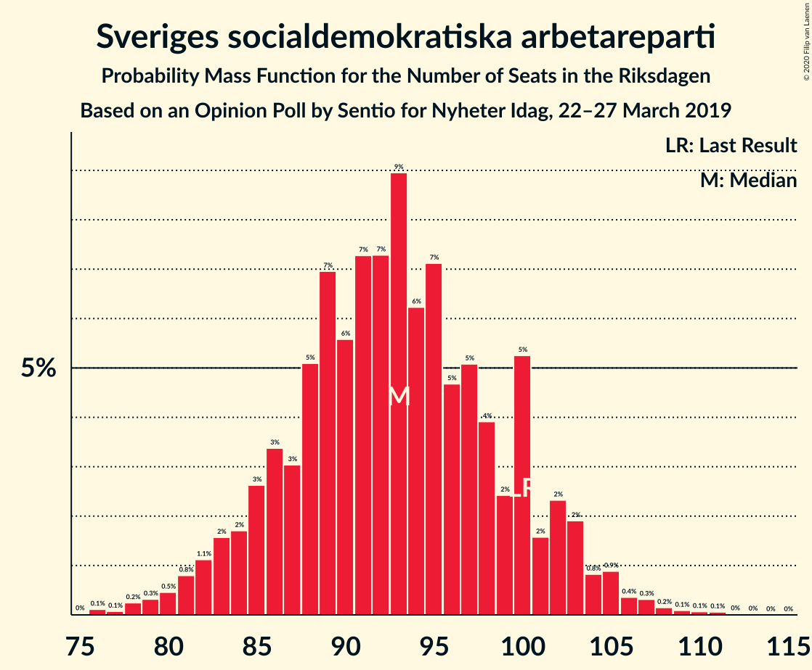
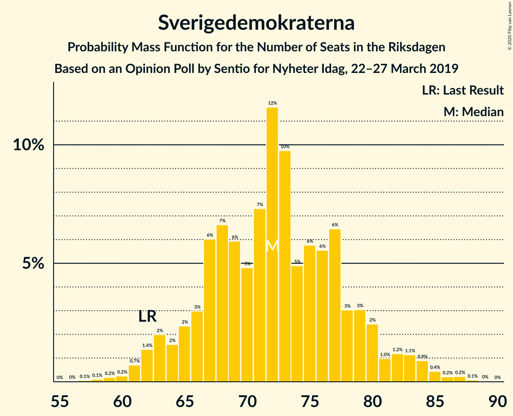
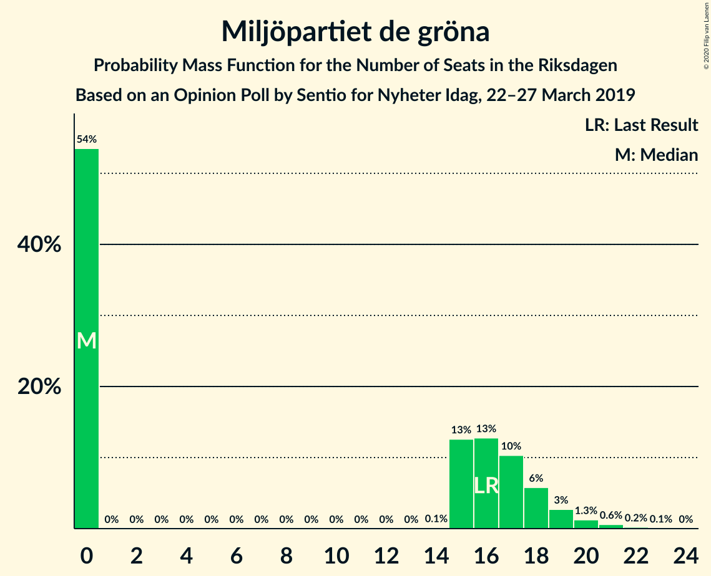
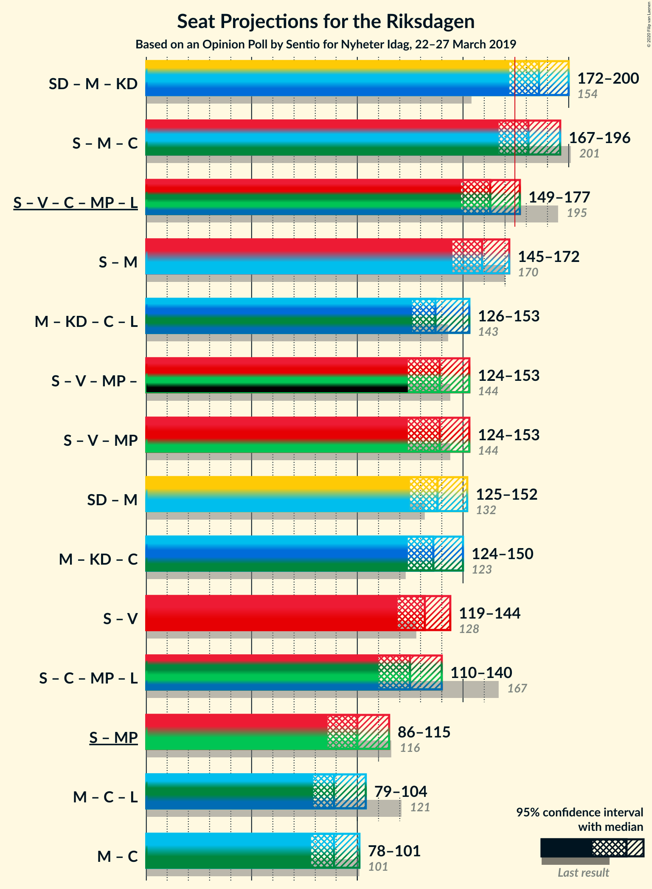
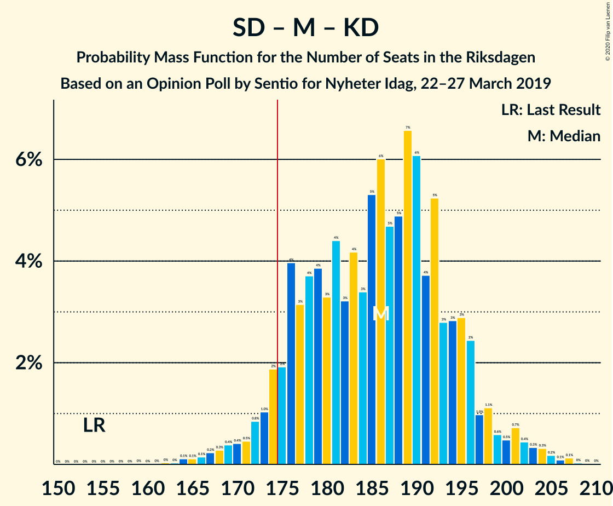
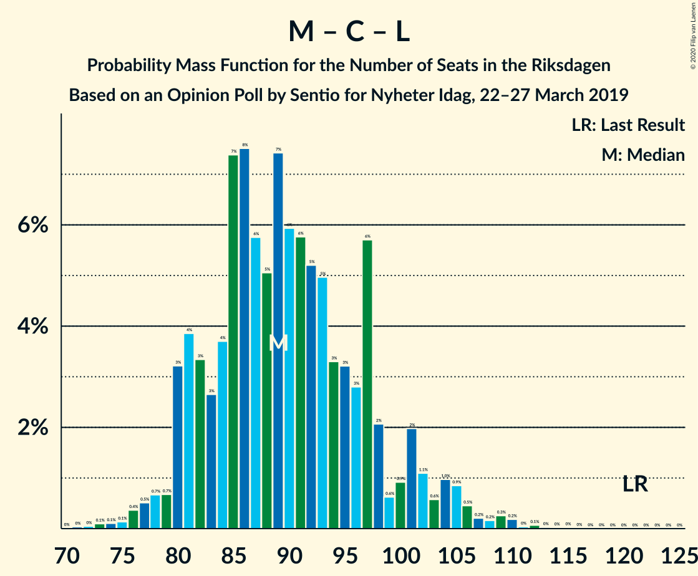

# Opinion Poll by Sentio for Nyheter Idag, 22–27 March 2019

<a href="#voting-intentions">Voting Intentions</a> | <a href="#seats">Seats</a> | <a href="#coalitions">Coalitions</a> | <a href="#technical-information">Technical Information</a>

## Voting Intentions

### Confidence Intervals

| Party | Last Result | Poll Result | 80% Confidence Interval | 90% Confidence Interval | 95% Confidence Interval | 99% Confidence Interval |
|:-----:|:-----------:|:-----------:|:-----------------------:|:-----------------------:|:-----------------------:|:-----------------------:|
| Sveriges socialdemokratiska arbetareparti | 28.3% | 24.8% | 23.1–26.6% |22.6–27.1% |22.2–27.5% |21.4–28.4% |
| Sverigedemokraterna | 17.5% | 19.3% | 17.7–20.9% |17.3–21.4% |16.9–21.8% |16.2–22.6% |
| Moderata samlingspartiet | 19.8% | 17.5% | 16.0–19.1% |15.6–19.5% |15.2–20.0% |14.6–20.7% |
| Kristdemokraterna | 6.3% | 12.8% | 11.5–14.2% |11.1–14.6% |10.8–15.0% |10.3–15.7% |
| Vänsterpartiet | 8.0% | 10.2% | 9.0–11.5% |8.7–11.9% |8.5–12.2% |7.9–12.9% |
| Centerpartiet | 8.6% | 6.1% | 5.2–7.2% |5.0–7.5% |4.8–7.8% |4.4–8.3% |
| Miljöpartiet de gröna | 4.4% | 3.9% | 3.2–4.8% |3.0–5.1% |2.9–5.3% |2.6–5.7% |
| Liberalerna | 5.5% | 3.1% | 2.5–3.9% |2.3–4.2% |2.2–4.4% |1.9–4.8% |

*Note:* The poll result column reflects the actual value used in the calculations. Published results may vary slightly, and in addition be rounded to fewer digits.

## Seats

### Confidence Intervals

| Party | Last Result | Median | 80% Confidence Interval | 90% Confidence Interval | 95% Confidence Interval | 99% Confidence Interval |
|:-----:|:-----------:|:------:|:-----------------------:|:-----------------------:|:-----------------------:|:-----------------------:|
| <a href="#sveriges-socialdemokratiska-arbetareparti">Sveriges socialdemokratiska arbetareparti</a> | 100 | 93 | 84–100 |82–102 |82–102 |78–106 |
| <a href="#sverigedemokraterna">Sverigedemokraterna</a> | 62 | 74 | 64–80 |63–81 |63–82 |61–84 |
| <a href="#moderata-samlingspartiet">Moderata samlingspartiet</a> | 70 | 65 | 59–74 |57–75 |56–75 |52–79 |
| <a href="#kristdemokraterna">Kristdemokraterna</a> | 22 | 48 | 43–54 |42–55 |41–56 |38–60 |
| <a href="#vänsterpartiet">Vänsterpartiet</a> | 28 | 38 | 33–43 |33–45 |32–47 |30–48 |
| <a href="#centerpartiet">Centerpartiet</a> | 31 | 22 | 19–26 |18–28 |18–29 |16–32 |
| <a href="#miljöpartiet-de-gröna">Miljöpartiet de gröna</a> | 16 | 0 | 0–18 |0–18 |0–19 |0–22 |
| <a href="#liberalerna">Liberalerna</a> | 20 | 0 | 0 |0–15 |0–15 |0–17 |

### Sveriges socialdemokratiska arbetareparti

*For a full overview of the results for this party, see the [Sveriges socialdemokratiska arbetareparti](party-sverigessocialdemokratiskaarbetareparti.html) page.*

| Number of Seats | Probability | Accumulated | Special Marks |
|:---------------:|:-----------:|:-----------:|:-------------:|
| 75 | 0% | 100% |  |
| 76 | 0.2% | 99.9% |  |
| 77 | 0% | 99.8% |  |
| 78 | 0.4% | 99.7% |  |
| 79 | 0.3% | 99.4% |  |
| 80 | 0.4% | 99.0% |  |
| 81 | 0.7% | 98.6% |  |
| 82 | 4% | 98% |  |
| 83 | 2% | 94% |  |
| 84 | 2% | 92% |  |
| 85 | 1.4% | 89% |  |
| 86 | 1.4% | 88% |  |
| 87 | 3% | 87% |  |
| 88 | 9% | 83% |  |
| 89 | 7% | 74% |  |
| 90 | 3% | 67% |  |
| 91 | 10% | 64% |  |
| 92 | 1.0% | 54% |  |
| 93 | 10% | 53% | Median |
| 94 | 5% | 43% |  |
| 95 | 5% | 38% |  |
| 96 | 10% | 33% |  |
| 97 | 2% | 23% |  |
| 98 | 3% | 21% |  |
| 99 | 4% | 18% |  |
| 100 | 6% | 14% | Last Result |
| 101 | 2% | 8% |  |
| 102 | 5% | 6% |  |
| 103 | 0.5% | 2% |  |
| 104 | 0.1% | 1.1% |  |
| 105 | 0.2% | 1.0% |  |
| 106 | 0.3% | 0.8% |  |
| 107 | 0% | 0.5% |  |
| 108 | 0.1% | 0.5% |  |
| 109 | 0.1% | 0.4% |  |
| 110 | 0% | 0.2% |  |
| 111 | 0% | 0.2% |  |
| 112 | 0.1% | 0.2% |  |
| 113 | 0.1% | 0.1% |  |
| 114 | 0% | 0.1% |  |
| 115 | 0% | 0% |  |

### Sverigedemokraterna

*For a full overview of the results for this party, see the [Sverigedemokraterna](party-sverigedemokraterna.html) page.*

| Number of Seats | Probability | Accumulated | Special Marks |
|:---------------:|:-----------:|:-----------:|:-------------:|
| 56 | 0% | 100% |  |
| 57 | 0% | 99.9% |  |
| 58 | 0% | 99.9% |  |
| 59 | 0.1% | 99.9% |  |
| 60 | 0.2% | 99.8% |  |
| 61 | 0.2% | 99.6% |  |
| 62 | 0.7% | 99.4% | Last Result |
| 63 | 6% | 98.8% |  |
| 64 | 3% | 93% |  |
| 65 | 6% | 90% |  |
| 66 | 3% | 84% |  |
| 67 | 6% | 81% |  |
| 68 | 3% | 75% |  |
| 69 | 7% | 72% |  |
| 70 | 3% | 65% |  |
| 71 | 2% | 62% |  |
| 72 | 3% | 61% |  |
| 73 | 5% | 58% |  |
| 74 | 2% | 52% | Median |
| 75 | 10% | 50% |  |
| 76 | 6% | 40% |  |
| 77 | 6% | 34% |  |
| 78 | 9% | 27% |  |
| 79 | 5% | 18% |  |
| 80 | 7% | 12% |  |
| 81 | 3% | 6% |  |
| 82 | 0.8% | 3% |  |
| 83 | 0.2% | 2% |  |
| 84 | 2% | 2% |  |
| 85 | 0% | 0.4% |  |
| 86 | 0.1% | 0.4% |  |
| 87 | 0.1% | 0.2% |  |
| 88 | 0% | 0.1% |  |
| 89 | 0% | 0.1% |  |
| 90 | 0% | 0.1% |  |
| 91 | 0% | 0.1% |  |
| 92 | 0% | 0% |  |

### Moderata samlingspartiet

*For a full overview of the results for this party, see the [Moderata samlingspartiet](party-moderatasamlingspartiet.html) page.*

| Number of Seats | Probability | Accumulated | Special Marks |
|:---------------:|:-----------:|:-----------:|:-------------:|
| 51 | 0.3% | 100% |  |
| 52 | 0.2% | 99.7% |  |
| 53 | 0.1% | 99.5% |  |
| 54 | 0.6% | 99.4% |  |
| 55 | 0.6% | 98.8% |  |
| 56 | 1.0% | 98% |  |
| 57 | 3% | 97% |  |
| 58 | 2% | 94% |  |
| 59 | 3% | 91% |  |
| 60 | 4% | 89% |  |
| 61 | 9% | 84% |  |
| 62 | 8% | 75% |  |
| 63 | 7% | 67% |  |
| 64 | 6% | 60% |  |
| 65 | 7% | 54% | Median |
| 66 | 3% | 47% |  |
| 67 | 3% | 43% |  |
| 68 | 9% | 40% |  |
| 69 | 4% | 31% |  |
| 70 | 9% | 27% | Last Result |
| 71 | 2% | 18% |  |
| 72 | 2% | 16% |  |
| 73 | 2% | 14% |  |
| 74 | 5% | 12% |  |
| 75 | 6% | 7% |  |
| 76 | 0.3% | 1.4% |  |
| 77 | 0.2% | 1.1% |  |
| 78 | 0.1% | 0.9% |  |
| 79 | 0.5% | 0.7% |  |
| 80 | 0.1% | 0.2% |  |
| 81 | 0.1% | 0.2% |  |
| 82 | 0.1% | 0.1% |  |
| 83 | 0% | 0% |  |

### Kristdemokraterna

*For a full overview of the results for this party, see the [Kristdemokraterna](party-kristdemokraterna.html) page.*

| Number of Seats | Probability | Accumulated | Special Marks |
|:---------------:|:-----------:|:-----------:|:-------------:|
| 22 | 0% | 100% | Last Result |
| 23 | 0% | 100% |  |
| 24 | 0% | 100% |  |
| 25 | 0% | 100% |  |
| 26 | 0% | 100% |  |
| 27 | 0% | 100% |  |
| 28 | 0% | 100% |  |
| 29 | 0% | 100% |  |
| 30 | 0% | 100% |  |
| 31 | 0% | 100% |  |
| 32 | 0% | 100% |  |
| 33 | 0% | 100% |  |
| 34 | 0% | 100% |  |
| 35 | 0% | 100% |  |
| 36 | 0.1% | 99.9% |  |
| 37 | 0.1% | 99.8% |  |
| 38 | 0.5% | 99.8% |  |
| 39 | 0.8% | 99.2% |  |
| 40 | 0.6% | 98% |  |
| 41 | 0.9% | 98% |  |
| 42 | 3% | 97% |  |
| 43 | 8% | 94% |  |
| 44 | 6% | 86% |  |
| 45 | 4% | 80% |  |
| 46 | 12% | 76% |  |
| 47 | 7% | 64% |  |
| 48 | 10% | 57% | Median |
| 49 | 3% | 48% |  |
| 50 | 8% | 45% |  |
| 51 | 20% | 37% |  |
| 52 | 4% | 17% |  |
| 53 | 2% | 13% |  |
| 54 | 6% | 12% |  |
| 55 | 1.3% | 6% |  |
| 56 | 2% | 5% |  |
| 57 | 0.2% | 2% |  |
| 58 | 0.3% | 2% |  |
| 59 | 0.8% | 2% |  |
| 60 | 0.5% | 0.8% |  |
| 61 | 0.2% | 0.3% |  |
| 62 | 0% | 0.1% |  |
| 63 | 0% | 0.1% |  |
| 64 | 0.1% | 0.1% |  |
| 65 | 0% | 0% |  |

### Vänsterpartiet

*For a full overview of the results for this party, see the [Vänsterpartiet](party-vänsterpartiet.html) page.*

| Number of Seats | Probability | Accumulated | Special Marks |
|:---------------:|:-----------:|:-----------:|:-------------:|
| 27 | 0.1% | 100% |  |
| 28 | 0.1% | 99.9% | Last Result |
| 29 | 0.2% | 99.8% |  |
| 30 | 0.3% | 99.6% |  |
| 31 | 2% | 99.3% |  |
| 32 | 2% | 98% |  |
| 33 | 6% | 95% |  |
| 34 | 2% | 89% |  |
| 35 | 10% | 87% |  |
| 36 | 5% | 77% |  |
| 37 | 7% | 72% |  |
| 38 | 22% | 65% | Median |
| 39 | 8% | 43% |  |
| 40 | 4% | 35% |  |
| 41 | 4% | 31% |  |
| 42 | 9% | 27% |  |
| 43 | 10% | 18% |  |
| 44 | 2% | 8% |  |
| 45 | 2% | 6% |  |
| 46 | 2% | 4% |  |
| 47 | 0.9% | 3% |  |
| 48 | 1.3% | 2% |  |
| 49 | 0.2% | 0.4% |  |
| 50 | 0.1% | 0.2% |  |
| 51 | 0.1% | 0.1% |  |
| 52 | 0% | 0.1% |  |
| 53 | 0% | 0% |  |

### Centerpartiet

*For a full overview of the results for this party, see the [Centerpartiet](party-centerpartiet.html) page.*

| Number of Seats | Probability | Accumulated | Special Marks |
|:---------------:|:-----------:|:-----------:|:-------------:|
| 0 | 0.1% | 100% |  |
| 1 | 0% | 99.9% |  |
| 2 | 0% | 99.9% |  |
| 3 | 0% | 99.9% |  |
| 4 | 0% | 99.9% |  |
| 5 | 0% | 99.9% |  |
| 6 | 0% | 99.9% |  |
| 7 | 0% | 99.9% |  |
| 8 | 0% | 99.9% |  |
| 9 | 0% | 99.9% |  |
| 10 | 0% | 99.9% |  |
| 11 | 0% | 99.9% |  |
| 12 | 0% | 99.9% |  |
| 13 | 0% | 99.9% |  |
| 14 | 0% | 99.9% |  |
| 15 | 0.1% | 99.9% |  |
| 16 | 0.4% | 99.9% |  |
| 17 | 1.1% | 99.5% |  |
| 18 | 4% | 98% |  |
| 19 | 10% | 94% |  |
| 20 | 8% | 85% |  |
| 21 | 19% | 77% |  |
| 22 | 10% | 59% | Median |
| 23 | 23% | 49% |  |
| 24 | 7% | 25% |  |
| 25 | 5% | 18% |  |
| 26 | 3% | 13% |  |
| 27 | 2% | 10% |  |
| 28 | 3% | 8% |  |
| 29 | 3% | 5% |  |
| 30 | 0.8% | 2% |  |
| 31 | 0.3% | 0.8% | Last Result |
| 32 | 0.2% | 0.5% |  |
| 33 | 0.1% | 0.4% |  |
| 34 | 0.2% | 0.3% |  |
| 35 | 0.1% | 0.1% |  |
| 36 | 0% | 0% |  |

### Miljöpartiet de gröna

*For a full overview of the results for this party, see the [Miljöpartiet de gröna](party-miljöpartietdegröna.html) page.*

| Number of Seats | Probability | Accumulated | Special Marks |
|:---------------:|:-----------:|:-----------:|:-------------:|
| 0 | 54% | 100% | Median |
| 1 | 0% | 46% |  |
| 2 | 0% | 46% |  |
| 3 | 0% | 46% |  |
| 4 | 0% | 46% |  |
| 5 | 0% | 46% |  |
| 6 | 0% | 46% |  |
| 7 | 0% | 46% |  |
| 8 | 0% | 46% |  |
| 9 | 0% | 46% |  |
| 10 | 0% | 46% |  |
| 11 | 0% | 46% |  |
| 12 | 0% | 46% |  |
| 13 | 0% | 46% |  |
| 14 | 0.3% | 46% |  |
| 15 | 18% | 46% |  |
| 16 | 7% | 28% | Last Result |
| 17 | 5% | 21% |  |
| 18 | 12% | 16% |  |
| 19 | 3% | 4% |  |
| 20 | 0.7% | 2% |  |
| 21 | 0.5% | 1.0% |  |
| 22 | 0.4% | 0.5% |  |
| 23 | 0.1% | 0.1% |  |
| 24 | 0% | 0% |  |

### Liberalerna

*For a full overview of the results for this party, see the [Liberalerna](party-liberalerna.html) page.*

| Number of Seats | Probability | Accumulated | Special Marks |
|:---------------:|:-----------:|:-----------:|:-------------:|
| 0 | 94% | 100% | Median |
| 1 | 0% | 6% |  |
| 2 | 0% | 6% |  |
| 3 | 0% | 6% |  |
| 4 | 0% | 6% |  |
| 5 | 0% | 6% |  |
| 6 | 0% | 6% |  |
| 7 | 0% | 6% |  |
| 8 | 0% | 6% |  |
| 9 | 0% | 6% |  |
| 10 | 0% | 6% |  |
| 11 | 0% | 6% |  |
| 12 | 0% | 6% |  |
| 13 | 0% | 6% |  |
| 14 | 0% | 6% |  |
| 15 | 3% | 6% |  |
| 16 | 1.3% | 2% |  |
| 17 | 0.6% | 1.0% |  |
| 18 | 0.3% | 0.4% |  |
| 19 | 0% | 0.1% |  |
| 20 | 0.1% | 0.1% | Last Result |
| 21 | 0% | 0% |  |

## Coalitions

### Confidence Intervals

| Coalition | Last Result | Median | Majority? | 80% Confidence Interval | 90% Confidence Interval | 95% Confidence Interval | 99% Confidence Interval |
|:---------:|:-----------:|:------:|:---------:|:-----------------------:|:-----------------------:|:-----------------------:|:-----------------------:|
| Sverigedemokraterna – Moderata samlingspartiet – Kristdemokraterna | 154 | 189 | 93% | 176–196 | 174–197 | 170–198 | 165–203 |
| Sveriges socialdemokratiska arbetareparti – Moderata samlingspartiet – Centerpartiet | 201 | 180 | 84% | 171–190 | 168–192 | 167–195 | 161–200 |
| Sveriges socialdemokratiska arbetareparti – Vänsterpartiet – Centerpartiet – Miljöpartiet de gröna – Liberalerna | 195 | 160 | 6% | 153–173 | 152–175 | 151–179 | 145–184 |
| Sveriges socialdemokratiska arbetareparti – Moderata samlingspartiet | 170 | 158 | 0.7% | 149–167 | 146–170 | 144–170 | 140–177 |
| Moderata samlingspartiet – Kristdemokraterna – Centerpartiet – Liberalerna | 143 | 137 | 0% | 133–144 | 128–149 | 125–152 | 121–160 |
| Sveriges socialdemokratiska arbetareparti – Vänsterpartiet – Miljöpartiet de gröna | 144 | 139 | 0% | 131–147 | 127–152 | 125–152 | 118–158 |
| Sverigedemokraterna – Moderata samlingspartiet | 132 | 139 | 0% | 127–150 | 126–152 | 124–152 | 121–154 |
| Moderata samlingspartiet – Kristdemokraterna – Centerpartiet | 123 | 136 | 0% | 131–142 | 126–146 | 123–150 | 119–154 |
| Sveriges socialdemokratiska arbetareparti – Vänsterpartiet | 128 | 132 | 0% | 123–140 | 121–145 | 118–145 | 113–148 |
| Sveriges socialdemokratiska arbetareparti – Centerpartiet – Miljöpartiet de gröna – Liberalerna | 167 | 122 | 0% | 113–136 | 110–140 | 110–142 | 107–148 |
| Sveriges socialdemokratiska arbetareparti – Miljöpartiet de gröna | 116 | 99 | 0% | 89–111 | 89–115 | 86–115 | 83–120 |
| Moderata samlingspartiet – Centerpartiet – Liberalerna | 121 | 88 | 0% | 83–96 | 80–99 | 78–103 | 76–109 |
| Moderata samlingspartiet – Centerpartiet | 101 | 87 | 0% | 82–95 | 80–97 | 78–99 | 74–102 |

### Sverigedemokraterna – Moderata samlingspartiet – Kristdemokraterna

| Number of Seats | Probability | Accumulated | Special Marks |
|:---------------:|:-----------:|:-----------:|:-------------:|
| 154 | 0% | 100% | Last Result |
| 155 | 0% | 100% |  |
| 156 | 0% | 100% |  |
| 157 | 0% | 100% |  |
| 158 | 0% | 100% |  |
| 159 | 0% | 100% |  |
| 160 | 0% | 100% |  |
| 161 | 0% | 100% |  |
| 162 | 0% | 100% |  |
| 163 | 0% | 99.9% |  |
| 164 | 0.2% | 99.9% |  |
| 165 | 0.3% | 99.7% |  |
| 166 | 0.4% | 99.4% |  |
| 167 | 0.6% | 99.0% |  |
| 168 | 0.2% | 98% |  |
| 169 | 0.5% | 98% |  |
| 170 | 0.6% | 98% |  |
| 171 | 0.9% | 97% |  |
| 172 | 0.4% | 96% |  |
| 173 | 0.5% | 96% |  |
| 174 | 2% | 95% |  |
| 175 | 0.8% | 93% | Majority |
| 176 | 5% | 93% |  |
| 177 | 1.5% | 88% |  |
| 178 | 2% | 86% |  |
| 179 | 2% | 85% |  |
| 180 | 3% | 82% |  |
| 181 | 6% | 79% |  |
| 182 | 8% | 74% |  |
| 183 | 3% | 66% |  |
| 184 | 2% | 63% |  |
| 185 | 3% | 61% |  |
| 186 | 1.3% | 58% |  |
| 187 | 2% | 57% | Median |
| 188 | 1.4% | 54% |  |
| 189 | 8% | 53% |  |
| 190 | 4% | 45% |  |
| 191 | 7% | 41% |  |
| 192 | 8% | 34% |  |
| 193 | 5% | 27% |  |
| 194 | 3% | 22% |  |
| 195 | 2% | 19% |  |
| 196 | 11% | 17% |  |
| 197 | 2% | 6% |  |
| 198 | 2% | 4% |  |
| 199 | 0.4% | 2% |  |
| 200 | 0.2% | 2% |  |
| 201 | 0.7% | 2% |  |
| 202 | 0.2% | 0.8% |  |
| 203 | 0.2% | 0.7% |  |
| 204 | 0.1% | 0.5% |  |
| 205 | 0.2% | 0.4% |  |
| 206 | 0% | 0.2% |  |
| 207 | 0.1% | 0.2% |  |
| 208 | 0% | 0% |  |

### Sveriges socialdemokratiska arbetareparti – Moderata samlingspartiet – Centerpartiet

| Number of Seats | Probability | Accumulated | Special Marks |
|:---------------:|:-----------:|:-----------:|:-------------:|
| 157 | 0.1% | 100% |  |
| 158 | 0% | 99.9% |  |
| 159 | 0.1% | 99.8% |  |
| 160 | 0% | 99.8% |  |
| 161 | 0.2% | 99.7% |  |
| 162 | 0.1% | 99.5% |  |
| 163 | 0.2% | 99.4% |  |
| 164 | 0.5% | 99.2% |  |
| 165 | 0.4% | 98.7% |  |
| 166 | 0.8% | 98% |  |
| 167 | 0.8% | 98% |  |
| 168 | 4% | 97% |  |
| 169 | 2% | 93% |  |
| 170 | 0.4% | 91% |  |
| 171 | 2% | 91% |  |
| 172 | 1.0% | 89% |  |
| 173 | 3% | 88% |  |
| 174 | 2% | 86% |  |
| 175 | 9% | 84% | Majority |
| 176 | 7% | 75% |  |
| 177 | 7% | 69% |  |
| 178 | 3% | 62% |  |
| 179 | 1.4% | 59% |  |
| 180 | 12% | 57% | Median |
| 181 | 4% | 45% |  |
| 182 | 1.1% | 41% |  |
| 183 | 4% | 40% |  |
| 184 | 6% | 37% |  |
| 185 | 2% | 30% |  |
| 186 | 2% | 28% |  |
| 187 | 5% | 26% |  |
| 188 | 6% | 21% |  |
| 189 | 0.8% | 16% |  |
| 190 | 9% | 15% |  |
| 191 | 0.7% | 6% |  |
| 192 | 1.3% | 5% |  |
| 193 | 0.7% | 4% |  |
| 194 | 0.8% | 3% |  |
| 195 | 0.7% | 3% |  |
| 196 | 0.1% | 2% |  |
| 197 | 0.9% | 2% |  |
| 198 | 0.2% | 0.8% |  |
| 199 | 0.1% | 0.6% |  |
| 200 | 0.3% | 0.6% |  |
| 201 | 0.1% | 0.3% | Last Result |
| 202 | 0.1% | 0.2% |  |
| 203 | 0% | 0.1% |  |
| 204 | 0.1% | 0.1% |  |
| 205 | 0% | 0% |  |

### Sveriges socialdemokratiska arbetareparti – Vänsterpartiet – Centerpartiet – Miljöpartiet de gröna – Liberalerna

| Number of Seats | Probability | Accumulated | Special Marks |
|:---------------:|:-----------:|:-----------:|:-------------:|
| 142 | 0.1% | 100% |  |
| 143 | 0% | 99.8% |  |
| 144 | 0.2% | 99.8% |  |
| 145 | 0.1% | 99.6% |  |
| 146 | 0.2% | 99.5% |  |
| 147 | 0.2% | 99.3% |  |
| 148 | 0.7% | 99.1% |  |
| 149 | 0.2% | 98% |  |
| 150 | 0.4% | 98% |  |
| 151 | 2% | 98% |  |
| 152 | 2% | 96% |  |
| 153 | 11% | 94% | Median |
| 154 | 2% | 83% |  |
| 155 | 3% | 80% |  |
| 156 | 5% | 78% |  |
| 157 | 8% | 73% |  |
| 158 | 7% | 66% |  |
| 159 | 4% | 59% |  |
| 160 | 8% | 55% |  |
| 161 | 1.3% | 47% |  |
| 162 | 2% | 46% |  |
| 163 | 1.3% | 43% |  |
| 164 | 3% | 42% |  |
| 165 | 2% | 39% |  |
| 166 | 3% | 37% |  |
| 167 | 8% | 34% |  |
| 168 | 6% | 26% |  |
| 169 | 3% | 21% |  |
| 170 | 2% | 18% |  |
| 171 | 2% | 15% |  |
| 172 | 1.5% | 14% |  |
| 173 | 5% | 12% |  |
| 174 | 0.8% | 7% |  |
| 175 | 2% | 6% | Majority |
| 176 | 0.5% | 5% |  |
| 177 | 0.4% | 4% |  |
| 178 | 0.9% | 4% |  |
| 179 | 0.6% | 3% |  |
| 180 | 0.5% | 2% |  |
| 181 | 0.2% | 2% |  |
| 182 | 0.6% | 2% |  |
| 183 | 0.4% | 1.0% |  |
| 184 | 0.3% | 0.6% |  |
| 185 | 0.2% | 0.3% |  |
| 186 | 0% | 0.1% |  |
| 187 | 0% | 0.1% |  |
| 188 | 0% | 0% |  |
| 189 | 0% | 0% |  |
| 190 | 0% | 0% |  |
| 191 | 0% | 0% |  |
| 192 | 0% | 0% |  |
| 193 | 0% | 0% |  |
| 194 | 0% | 0% |  |
| 195 | 0% | 0% | Last Result |

### Sveriges socialdemokratiska arbetareparti – Moderata samlingspartiet

| Number of Seats | Probability | Accumulated | Special Marks |
|:---------------:|:-----------:|:-----------:|:-------------:|
| 135 | 0% | 100% |  |
| 136 | 0% | 99.9% |  |
| 137 | 0.1% | 99.9% |  |
| 138 | 0.1% | 99.8% |  |
| 139 | 0.2% | 99.7% |  |
| 140 | 0.1% | 99.5% |  |
| 141 | 0.2% | 99.5% |  |
| 142 | 0.8% | 99.3% |  |
| 143 | 0.3% | 98% |  |
| 144 | 0.7% | 98% |  |
| 145 | 0.7% | 97% |  |
| 146 | 5% | 97% |  |
| 147 | 0.8% | 92% |  |
| 148 | 0.7% | 91% |  |
| 149 | 2% | 91% |  |
| 150 | 2% | 89% |  |
| 151 | 1.4% | 86% |  |
| 152 | 2% | 85% |  |
| 153 | 7% | 83% |  |
| 154 | 6% | 76% |  |
| 155 | 2% | 70% |  |
| 156 | 9% | 68% |  |
| 157 | 8% | 58% |  |
| 158 | 2% | 50% | Median |
| 159 | 11% | 48% |  |
| 160 | 0.8% | 38% |  |
| 161 | 5% | 37% |  |
| 162 | 4% | 32% |  |
| 163 | 6% | 28% |  |
| 164 | 3% | 23% |  |
| 165 | 2% | 20% |  |
| 166 | 1.4% | 18% |  |
| 167 | 8% | 17% |  |
| 168 | 2% | 9% |  |
| 169 | 0.7% | 7% |  |
| 170 | 5% | 7% | Last Result |
| 171 | 0.5% | 2% |  |
| 172 | 0.5% | 2% |  |
| 173 | 0.1% | 1.0% |  |
| 174 | 0.2% | 0.9% |  |
| 175 | 0.1% | 0.7% | Majority |
| 176 | 0.1% | 0.6% |  |
| 177 | 0.4% | 0.6% |  |
| 178 | 0% | 0.2% |  |
| 179 | 0% | 0.1% |  |
| 180 | 0.1% | 0.1% |  |
| 181 | 0% | 0% |  |

### Moderata samlingspartiet – Kristdemokraterna – Centerpartiet – Liberalerna

| Number of Seats | Probability | Accumulated | Special Marks |
|:---------------:|:-----------:|:-----------:|:-------------:|
| 118 | 0.1% | 100% |  |
| 119 | 0.1% | 99.9% |  |
| 120 | 0.1% | 99.8% |  |
| 121 | 0.9% | 99.8% |  |
| 122 | 0.2% | 98.8% |  |
| 123 | 0.3% | 98.6% |  |
| 124 | 0.7% | 98% |  |
| 125 | 0.8% | 98% |  |
| 126 | 1.0% | 97% |  |
| 127 | 0.3% | 96% |  |
| 128 | 2% | 95% |  |
| 129 | 0.3% | 93% |  |
| 130 | 0.5% | 93% |  |
| 131 | 1.2% | 93% |  |
| 132 | 1.4% | 92% |  |
| 133 | 8% | 90% |  |
| 134 | 10% | 82% |  |
| 135 | 9% | 72% | Median |
| 136 | 10% | 63% |  |
| 137 | 5% | 52% |  |
| 138 | 4% | 47% |  |
| 139 | 21% | 43% |  |
| 140 | 5% | 22% |  |
| 141 | 2% | 17% |  |
| 142 | 3% | 15% |  |
| 143 | 1.1% | 12% | Last Result |
| 144 | 0.7% | 11% |  |
| 145 | 0.8% | 10% |  |
| 146 | 1.4% | 9% |  |
| 147 | 1.1% | 8% |  |
| 148 | 0.8% | 6% |  |
| 149 | 2% | 6% |  |
| 150 | 0.9% | 4% |  |
| 151 | 0.4% | 3% |  |
| 152 | 0.3% | 3% |  |
| 153 | 0.7% | 2% |  |
| 154 | 0.3% | 2% |  |
| 155 | 0.2% | 1.4% |  |
| 156 | 0.1% | 1.2% |  |
| 157 | 0.1% | 1.1% |  |
| 158 | 0.1% | 1.1% |  |
| 159 | 0.2% | 0.9% |  |
| 160 | 0.5% | 0.7% |  |
| 161 | 0.1% | 0.2% |  |
| 162 | 0% | 0% |  |

### Sveriges socialdemokratiska arbetareparti – Vänsterpartiet – Miljöpartiet de gröna

| Number of Seats | Probability | Accumulated | Special Marks |
|:---------------:|:-----------:|:-----------:|:-------------:|
| 116 | 0.4% | 100% |  |
| 117 | 0.1% | 99.6% |  |
| 118 | 0.4% | 99.5% |  |
| 119 | 0.2% | 99.1% |  |
| 120 | 0.4% | 98.9% |  |
| 121 | 0.2% | 98.6% |  |
| 122 | 0.1% | 98% |  |
| 123 | 0.1% | 98% |  |
| 124 | 0.4% | 98% |  |
| 125 | 0.5% | 98% |  |
| 126 | 2% | 97% |  |
| 127 | 0.5% | 95% |  |
| 128 | 2% | 95% |  |
| 129 | 1.1% | 93% |  |
| 130 | 2% | 92% |  |
| 131 | 2% | 90% | Median |
| 132 | 8% | 89% |  |
| 133 | 6% | 80% |  |
| 134 | 7% | 74% |  |
| 135 | 6% | 67% |  |
| 136 | 7% | 62% |  |
| 137 | 1.3% | 54% |  |
| 138 | 2% | 53% |  |
| 139 | 0.9% | 51% |  |
| 140 | 4% | 50% |  |
| 141 | 9% | 46% |  |
| 142 | 4% | 36% |  |
| 143 | 3% | 32% |  |
| 144 | 8% | 29% | Last Result |
| 145 | 6% | 21% |  |
| 146 | 4% | 15% |  |
| 147 | 1.2% | 11% |  |
| 148 | 0.3% | 10% |  |
| 149 | 1.0% | 10% |  |
| 150 | 0.9% | 9% |  |
| 151 | 0.7% | 8% |  |
| 152 | 5% | 7% |  |
| 153 | 0.2% | 2% |  |
| 154 | 0.1% | 2% |  |
| 155 | 0.4% | 2% |  |
| 156 | 0.4% | 2% |  |
| 157 | 0.3% | 1.1% |  |
| 158 | 0.4% | 0.8% |  |
| 159 | 0.2% | 0.4% |  |
| 160 | 0.1% | 0.2% |  |
| 161 | 0% | 0.1% |  |
| 162 | 0% | 0.1% |  |
| 163 | 0% | 0.1% |  |
| 164 | 0% | 0% |  |

### Sverigedemokraterna – Moderata samlingspartiet

| Number of Seats | Probability | Accumulated | Special Marks |
|:---------------:|:-----------:|:-----------:|:-------------:|
| 118 | 0% | 100% |  |
| 119 | 0% | 99.9% |  |
| 120 | 0.2% | 99.9% |  |
| 121 | 0.5% | 99.6% |  |
| 122 | 0.5% | 99.1% |  |
| 123 | 0.6% | 98.6% |  |
| 124 | 0.6% | 98% |  |
| 125 | 0.3% | 97% |  |
| 126 | 6% | 97% |  |
| 127 | 1.1% | 91% |  |
| 128 | 2% | 90% |  |
| 129 | 2% | 87% |  |
| 130 | 6% | 86% |  |
| 131 | 8% | 80% |  |
| 132 | 2% | 72% | Last Result |
| 133 | 3% | 70% |  |
| 134 | 0.9% | 67% |  |
| 135 | 2% | 66% |  |
| 136 | 2% | 64% |  |
| 137 | 7% | 62% |  |
| 138 | 2% | 55% |  |
| 139 | 6% | 53% | Median |
| 140 | 2% | 47% |  |
| 141 | 8% | 45% |  |
| 142 | 1.2% | 37% |  |
| 143 | 9% | 36% |  |
| 144 | 2% | 26% |  |
| 145 | 1.3% | 24% |  |
| 146 | 1.0% | 23% |  |
| 147 | 3% | 22% |  |
| 148 | 6% | 19% |  |
| 149 | 1.5% | 13% |  |
| 150 | 5% | 12% |  |
| 151 | 0.2% | 7% |  |
| 152 | 4% | 7% |  |
| 153 | 2% | 2% |  |
| 154 | 0% | 0.5% |  |
| 155 | 0.2% | 0.5% |  |
| 156 | 0.1% | 0.2% |  |
| 157 | 0.1% | 0.2% |  |
| 158 | 0% | 0% |  |

### Moderata samlingspartiet – Kristdemokraterna – Centerpartiet

| Number of Seats | Probability | Accumulated | Special Marks |
|:---------------:|:-----------:|:-----------:|:-------------:|
| 115 | 0% | 100% |  |
| 116 | 0% | 99.9% |  |
| 117 | 0.2% | 99.9% |  |
| 118 | 0.1% | 99.7% |  |
| 119 | 0.2% | 99.6% |  |
| 120 | 0.1% | 99.4% |  |
| 121 | 1.0% | 99.3% |  |
| 122 | 0.3% | 98% |  |
| 123 | 1.2% | 98% | Last Result |
| 124 | 0.8% | 97% |  |
| 125 | 1.0% | 96% |  |
| 126 | 1.1% | 95% |  |
| 127 | 0.4% | 94% |  |
| 128 | 2% | 94% |  |
| 129 | 0.5% | 91% |  |
| 130 | 0.9% | 91% |  |
| 131 | 1.3% | 90% |  |
| 132 | 1.3% | 89% |  |
| 133 | 9% | 88% |  |
| 134 | 11% | 79% |  |
| 135 | 9% | 68% | Median |
| 136 | 10% | 59% |  |
| 137 | 5% | 48% |  |
| 138 | 4% | 43% |  |
| 139 | 21% | 39% |  |
| 140 | 5% | 19% |  |
| 141 | 2% | 14% |  |
| 142 | 3% | 12% |  |
| 143 | 1.2% | 9% |  |
| 144 | 0.6% | 7% |  |
| 145 | 0.9% | 7% |  |
| 146 | 1.4% | 6% |  |
| 147 | 1.0% | 5% |  |
| 148 | 0.7% | 4% |  |
| 149 | 0.3% | 3% |  |
| 150 | 0.9% | 3% |  |
| 151 | 0.4% | 2% |  |
| 152 | 0.2% | 1.3% |  |
| 153 | 0.5% | 1.1% |  |
| 154 | 0.2% | 0.6% |  |
| 155 | 0.1% | 0.4% |  |
| 156 | 0% | 0.3% |  |
| 157 | 0% | 0.3% |  |
| 158 | 0.1% | 0.3% |  |
| 159 | 0.1% | 0.1% |  |
| 160 | 0% | 0% |  |

### Sveriges socialdemokratiska arbetareparti – Vänsterpartiet

| Number of Seats | Probability | Accumulated | Special Marks |
|:---------------:|:-----------:|:-----------:|:-------------:|
| 110 | 0% | 100% |  |
| 111 | 0.2% | 99.9% |  |
| 112 | 0.3% | 99.8% |  |
| 113 | 0.1% | 99.5% |  |
| 114 | 0.4% | 99.4% |  |
| 115 | 0.2% | 99.0% |  |
| 116 | 0.6% | 98.7% |  |
| 117 | 0.2% | 98% |  |
| 118 | 0.6% | 98% |  |
| 119 | 0.5% | 97% |  |
| 120 | 0.5% | 97% |  |
| 121 | 4% | 96% |  |
| 122 | 0.7% | 92% |  |
| 123 | 2% | 91% |  |
| 124 | 3% | 90% |  |
| 125 | 4% | 87% |  |
| 126 | 17% | 83% |  |
| 127 | 3% | 66% |  |
| 128 | 2% | 63% | Last Result |
| 129 | 3% | 61% |  |
| 130 | 3% | 58% |  |
| 131 | 2% | 55% | Median |
| 132 | 9% | 52% |  |
| 133 | 7% | 44% |  |
| 134 | 7% | 37% |  |
| 135 | 6% | 30% |  |
| 136 | 4% | 24% |  |
| 137 | 6% | 20% |  |
| 138 | 2% | 14% |  |
| 139 | 0.8% | 12% |  |
| 140 | 2% | 11% |  |
| 141 | 1.0% | 9% |  |
| 142 | 2% | 7% |  |
| 143 | 0.4% | 6% |  |
| 144 | 0.3% | 5% |  |
| 145 | 4% | 5% |  |
| 146 | 0.6% | 1.3% |  |
| 147 | 0.2% | 0.7% |  |
| 148 | 0% | 0.5% |  |
| 149 | 0.3% | 0.5% |  |
| 150 | 0% | 0.2% |  |
| 151 | 0.1% | 0.2% |  |
| 152 | 0% | 0.1% |  |
| 153 | 0.1% | 0.1% |  |
| 154 | 0% | 0% |  |

### Sveriges socialdemokratiska arbetareparti – Centerpartiet – Miljöpartiet de gröna – Liberalerna

| Number of Seats | Probability | Accumulated | Special Marks |
|:---------------:|:-----------:|:-----------:|:-------------:|
| 102 | 0% | 100% |  |
| 103 | 0% | 99.9% |  |
| 104 | 0% | 99.9% |  |
| 105 | 0.1% | 99.9% |  |
| 106 | 0% | 99.8% |  |
| 107 | 0.9% | 99.8% |  |
| 108 | 0.9% | 98.9% |  |
| 109 | 0.1% | 98% |  |
| 110 | 5% | 98% |  |
| 111 | 1.2% | 92% |  |
| 112 | 0.8% | 91% |  |
| 113 | 0.8% | 90% |  |
| 114 | 5% | 90% |  |
| 115 | 6% | 84% | Median |
| 116 | 2% | 78% |  |
| 117 | 3% | 76% |  |
| 118 | 3% | 73% |  |
| 119 | 10% | 70% |  |
| 120 | 1.5% | 59% |  |
| 121 | 3% | 58% |  |
| 122 | 8% | 55% |  |
| 123 | 3% | 47% |  |
| 124 | 1.1% | 45% |  |
| 125 | 6% | 44% |  |
| 126 | 3% | 37% |  |
| 127 | 2% | 34% |  |
| 128 | 3% | 31% |  |
| 129 | 2% | 28% |  |
| 130 | 2% | 26% |  |
| 131 | 2% | 25% |  |
| 132 | 6% | 23% |  |
| 133 | 2% | 16% |  |
| 134 | 2% | 15% |  |
| 135 | 0.7% | 13% |  |
| 136 | 5% | 12% |  |
| 137 | 0.5% | 7% |  |
| 138 | 0.4% | 7% |  |
| 139 | 0.9% | 6% |  |
| 140 | 2% | 5% |  |
| 141 | 0.5% | 3% |  |
| 142 | 0.6% | 3% |  |
| 143 | 0.4% | 2% |  |
| 144 | 0.4% | 2% |  |
| 145 | 0.2% | 1.3% |  |
| 146 | 0.1% | 1.1% |  |
| 147 | 0.4% | 0.9% |  |
| 148 | 0.2% | 0.6% |  |
| 149 | 0.1% | 0.4% |  |
| 150 | 0.3% | 0.3% |  |
| 151 | 0% | 0% |  |
| 152 | 0% | 0% |  |
| 153 | 0% | 0% |  |
| 154 | 0% | 0% |  |
| 155 | 0% | 0% |  |
| 156 | 0% | 0% |  |
| 157 | 0% | 0% |  |
| 158 | 0% | 0% |  |
| 159 | 0% | 0% |  |
| 160 | 0% | 0% |  |
| 161 | 0% | 0% |  |
| 162 | 0% | 0% |  |
| 163 | 0% | 0% |  |
| 164 | 0% | 0% |  |
| 165 | 0% | 0% |  |
| 166 | 0% | 0% |  |
| 167 | 0% | 0% | Last Result |

### Sveriges socialdemokratiska arbetareparti – Miljöpartiet de gröna

| Number of Seats | Probability | Accumulated | Special Marks |
|:---------------:|:-----------:|:-----------:|:-------------:|
| 79 | 0% | 100% |  |
| 80 | 0.2% | 99.9% |  |
| 81 | 0% | 99.7% |  |
| 82 | 0.1% | 99.7% |  |
| 83 | 2% | 99.6% |  |
| 84 | 0.1% | 98% |  |
| 85 | 0.3% | 98% |  |
| 86 | 0.8% | 98% |  |
| 87 | 0.7% | 97% |  |
| 88 | 0.1% | 96% |  |
| 89 | 7% | 96% |  |
| 90 | 1.0% | 89% |  |
| 91 | 0.7% | 88% |  |
| 92 | 0.9% | 87% |  |
| 93 | 8% | 86% | Median |
| 94 | 3% | 79% |  |
| 95 | 5% | 75% |  |
| 96 | 9% | 70% |  |
| 97 | 5% | 61% |  |
| 98 | 3% | 56% |  |
| 99 | 4% | 53% |  |
| 100 | 2% | 48% |  |
| 101 | 3% | 47% |  |
| 102 | 6% | 44% |  |
| 103 | 7% | 38% |  |
| 104 | 0.9% | 30% |  |
| 105 | 2% | 29% |  |
| 106 | 2% | 27% |  |
| 107 | 3% | 25% |  |
| 108 | 2% | 22% |  |
| 109 | 7% | 20% |  |
| 110 | 2% | 13% |  |
| 111 | 2% | 11% |  |
| 112 | 0.8% | 9% |  |
| 113 | 0.5% | 8% |  |
| 114 | 1.0% | 8% |  |
| 115 | 5% | 6% |  |
| 116 | 0.5% | 2% | Last Result |
| 117 | 0.4% | 1.3% |  |
| 118 | 0.1% | 0.9% |  |
| 119 | 0.1% | 0.8% |  |
| 120 | 0.4% | 0.7% |  |
| 121 | 0% | 0.3% |  |
| 122 | 0% | 0.2% |  |
| 123 | 0.1% | 0.2% |  |
| 124 | 0% | 0.1% |  |
| 125 | 0% | 0% |  |

### Moderata samlingspartiet – Centerpartiet – Liberalerna

| Number of Seats | Probability | Accumulated | Special Marks |
|:---------------:|:-----------:|:-----------:|:-------------:|
| 72 | 0% | 100% |  |
| 73 | 0.1% | 99.9% |  |
| 74 | 0.2% | 99.9% |  |
| 75 | 0% | 99.6% |  |
| 76 | 0.2% | 99.6% |  |
| 77 | 0.3% | 99.4% |  |
| 78 | 2% | 99.1% |  |
| 79 | 0.3% | 97% |  |
| 80 | 3% | 97% |  |
| 81 | 2% | 94% |  |
| 82 | 2% | 92% |  |
| 83 | 4% | 90% |  |
| 84 | 12% | 86% |  |
| 85 | 7% | 74% |  |
| 86 | 6% | 67% |  |
| 87 | 9% | 61% | Median |
| 88 | 8% | 52% |  |
| 89 | 2% | 44% |  |
| 90 | 4% | 43% |  |
| 91 | 8% | 38% |  |
| 92 | 4% | 30% |  |
| 93 | 2% | 26% |  |
| 94 | 3% | 25% |  |
| 95 | 9% | 21% |  |
| 96 | 3% | 12% |  |
| 97 | 0.6% | 9% |  |
| 98 | 2% | 9% |  |
| 99 | 1.5% | 6% |  |
| 100 | 0.2% | 5% |  |
| 101 | 0.4% | 5% |  |
| 102 | 0.8% | 4% |  |
| 103 | 1.2% | 4% |  |
| 104 | 0.5% | 2% |  |
| 105 | 0.5% | 2% |  |
| 106 | 0.2% | 1.3% |  |
| 107 | 0.1% | 1.1% |  |
| 108 | 0.1% | 1.0% |  |
| 109 | 0.6% | 0.9% |  |
| 110 | 0% | 0.3% |  |
| 111 | 0% | 0.3% |  |
| 112 | 0.1% | 0.3% |  |
| 113 | 0.1% | 0.2% |  |
| 114 | 0.1% | 0.1% |  |
| 115 | 0% | 0% |  |
| 116 | 0% | 0% |  |
| 117 | 0% | 0% |  |
| 118 | 0% | 0% |  |
| 119 | 0% | 0% |  |
| 120 | 0% | 0% |  |
| 121 | 0% | 0% | Last Result |

### Moderata samlingspartiet – Centerpartiet

| Number of Seats | Probability | Accumulated | Special Marks |
|:---------------:|:-----------:|:-----------:|:-------------:|
| 71 | 0% | 100% |  |
| 72 | 0% | 99.9% |  |
| 73 | 0.4% | 99.9% |  |
| 74 | 0.3% | 99.5% |  |
| 75 | 0.1% | 99.3% |  |
| 76 | 0.5% | 99.1% |  |
| 77 | 0.6% | 98.7% |  |
| 78 | 2% | 98% |  |
| 79 | 0.4% | 96% |  |
| 80 | 3% | 96% |  |
| 81 | 3% | 93% |  |
| 82 | 2% | 90% |  |
| 83 | 4% | 88% |  |
| 84 | 12% | 84% |  |
| 85 | 7% | 71% |  |
| 86 | 7% | 65% |  |
| 87 | 9% | 58% | Median |
| 88 | 9% | 49% |  |
| 89 | 2% | 40% |  |
| 90 | 5% | 39% |  |
| 91 | 8% | 34% |  |
| 92 | 4% | 26% |  |
| 93 | 2% | 22% |  |
| 94 | 4% | 21% |  |
| 95 | 9% | 17% |  |
| 96 | 3% | 8% |  |
| 97 | 0.4% | 5% |  |
| 98 | 2% | 5% |  |
| 99 | 1.3% | 3% |  |
| 100 | 0.1% | 2% |  |
| 101 | 0.2% | 1.4% | Last Result |
| 102 | 0.8% | 1.2% |  |
| 103 | 0.1% | 0.4% |  |
| 104 | 0% | 0.4% |  |
| 105 | 0.1% | 0.3% |  |
| 106 | 0.1% | 0.2% |  |
| 107 | 0% | 0.1% |  |
| 108 | 0% | 0% |  |

## Technical Information

### Opinion Poll

+ **Polling firm:** Sentio
+ **Commissioner(s):** Nyheter Idag
+ **Fieldwork period:** 22–27 March 2019

### Calculations

+ **Sample size:** 1002
+ **Simulations done:** 131,072
+ **Error estimate:** 3.41%

