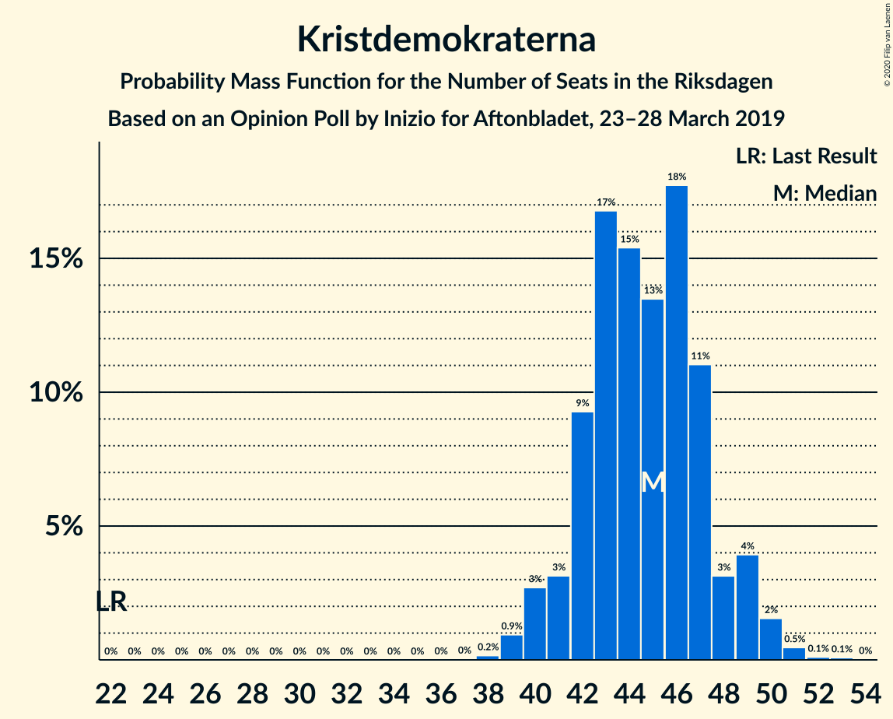
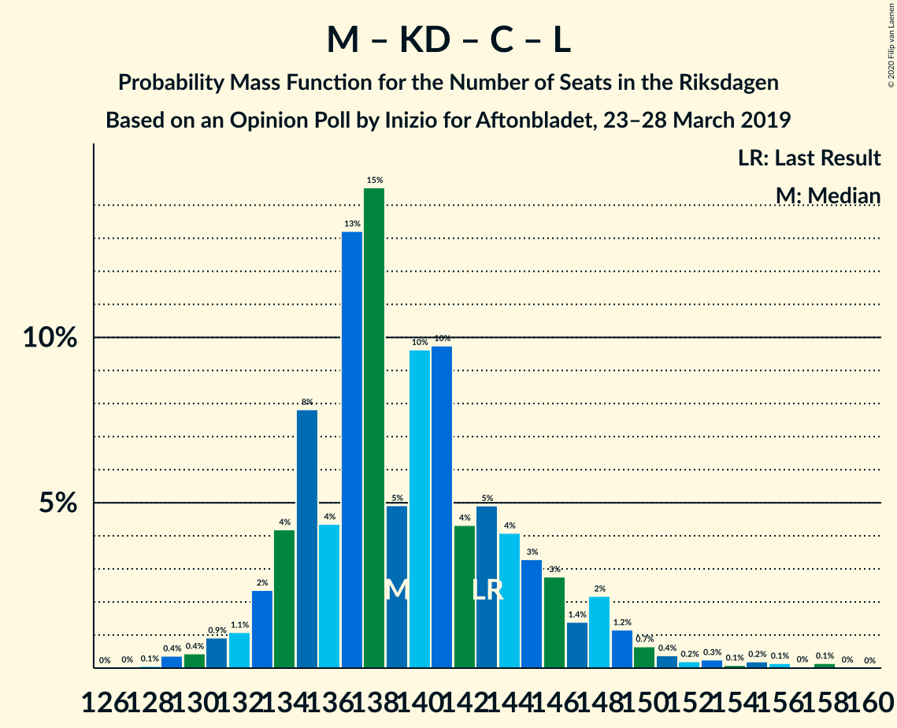

# Opinion Poll by Inizio for Aftonbladet, 23–28 March 2019

<a href="#voting-intentions">Voting Intentions</a> | <a href="#seats">Seats</a> | <a href="#coalitions">Coalitions</a> | <a href="#technical-information">Technical Information</a>

## Voting Intentions

### Confidence Intervals

| Party | Last Result | Poll Result | 80% Confidence Interval | 90% Confidence Interval | 95% Confidence Interval | 99% Confidence Interval |
|:-----:|:-----------:|:-----------:|:-----------------------:|:-----------------------:|:-----------------------:|:-----------------------:|
| Sveriges socialdemokratiska arbetareparti | 28.3% | 26.5% | 25.5–27.6% |25.2–27.9% |25.0–28.1% |24.5–28.6% |
| Sverigedemokraterna | 17.5% | 18.2% | 17.3–19.2% |17.1–19.4% |16.9–19.7% |16.5–20.1% |
| Moderata samlingspartiet | 19.8% | 16.5% | 15.7–17.4% |15.4–17.7% |15.2–17.9% |14.8–18.3% |
| Kristdemokraterna | 6.3% | 12.1% | 11.4–12.9% |11.2–13.1% |11.0–13.3% |10.6–13.7% |
| Centerpartiet | 8.6% | 9.1% | 8.4–9.8% |8.3–10.0% |8.1–10.2% |7.8–10.5% |
| Vänsterpartiet | 8.0% | 8.6% | 8.0–9.3% |7.8–9.5% |7.7–9.7% |7.4–10.0% |
| Miljöpartiet de gröna | 4.4% | 4.2% | 3.7–4.7% |3.6–4.9% |3.5–5.0% |3.3–5.2% |
| Liberalerna | 5.5% | 3.3% | 2.9–3.7% |2.8–3.9% |2.7–4.0% |2.5–4.2% |

*Note:* The poll result column reflects the actual value used in the calculations. Published results may vary slightly, and in addition be rounded to fewer digits.

## Seats

### Confidence Intervals

| Party | Last Result | Median | 80% Confidence Interval | 90% Confidence Interval | 95% Confidence Interval | 99% Confidence Interval |
|:-----:|:-----------:|:------:|:-----------------------:|:-----------------------:|:-----------------------:|:-----------------------:|
| <a href="#sveriges-socialdemokratiska-arbetareparti">Sveriges socialdemokratiska arbetareparti</a> | 100 | 97 | 94–102 |93–103 |92–105 |89–107 |
| <a href="#sverigedemokraterna">Sverigedemokraterna</a> | 62 | 67 | 65–71 |65–71 |63–72 |62–74 |
| <a href="#moderata-samlingspartiet">Moderata samlingspartiet</a> | 70 | 61 | 57–65 |56–65 |55–66 |55–68 |
| <a href="#kristdemokraterna">Kristdemokraterna</a> | 22 | 45 | 42–47 |41–49 |40–49 |39–51 |
| <a href="#centerpartiet">Centerpartiet</a> | 31 | 34 | 33–35 |31–35 |30–36 |28–39 |
| <a href="#vänsterpartiet">Vänsterpartiet</a> | 28 | 31 | 29–34 |29–35 |28–35 |28–36 |
| <a href="#miljöpartiet-de-gröna">Miljöpartiet de gröna</a> | 16 | 15 | 0–17 |0–18 |0–18 |0–18 |
| <a href="#liberalerna">Liberalerna</a> | 20 | 0 | 0 |0 |0 |0–15 |

### Sveriges socialdemokratiska arbetareparti

*For a full overview of the results for this party, see the [Sveriges socialdemokratiska arbetareparti](party-sverigessocialdemokratiskaarbetareparti.html) page.*

| Number of Seats | Probability | Accumulated | Special Marks |
|:---------------:|:-----------:|:-----------:|:-------------:|
| 88 | 0.1% | 100% |  |
| 89 | 0.5% | 99.9% |  |
| 90 | 0.5% | 99.4% |  |
| 91 | 0.4% | 98.9% |  |
| 92 | 2% | 98% |  |
| 93 | 3% | 97% |  |
| 94 | 18% | 94% |  |
| 95 | 13% | 76% |  |
| 96 | 4% | 64% |  |
| 97 | 22% | 59% | Median |
| 98 | 10% | 37% |  |
| 99 | 4% | 27% |  |
| 100 | 5% | 23% | Last Result |
| 101 | 8% | 18% |  |
| 102 | 3% | 10% |  |
| 103 | 3% | 8% |  |
| 104 | 2% | 5% |  |
| 105 | 0.4% | 3% |  |
| 106 | 1.3% | 2% |  |
| 107 | 0.7% | 0.9% |  |
| 108 | 0.1% | 0.2% |  |
| 109 | 0.1% | 0.1% |  |
| 110 | 0% | 0% |  |

### Sverigedemokraterna

*For a full overview of the results for this party, see the [Sverigedemokraterna](party-sverigedemokraterna.html) page.*

| Number of Seats | Probability | Accumulated | Special Marks |
|:---------------:|:-----------:|:-----------:|:-------------:|
| 59 | 0% | 100% |  |
| 60 | 0.1% | 99.9% |  |
| 61 | 0.1% | 99.9% |  |
| 62 | 0.7% | 99.7% | Last Result |
| 63 | 2% | 99.1% |  |
| 64 | 1.4% | 97% |  |
| 65 | 29% | 96% |  |
| 66 | 11% | 67% |  |
| 67 | 18% | 56% | Median |
| 68 | 11% | 39% |  |
| 69 | 7% | 28% |  |
| 70 | 8% | 21% |  |
| 71 | 9% | 13% |  |
| 72 | 2% | 4% |  |
| 73 | 0.3% | 2% |  |
| 74 | 1.5% | 2% |  |
| 75 | 0.1% | 0.3% |  |
| 76 | 0.2% | 0.3% |  |
| 77 | 0% | 0% |  |

### Moderata samlingspartiet

*For a full overview of the results for this party, see the [Moderata samlingspartiet](party-moderatasamlingspartiet.html) page.*

| Number of Seats | Probability | Accumulated | Special Marks |
|:---------------:|:-----------:|:-----------:|:-------------:|
| 53 | 0.1% | 100% |  |
| 54 | 0.3% | 99.9% |  |
| 55 | 2% | 99.6% |  |
| 56 | 6% | 97% |  |
| 57 | 2% | 91% |  |
| 58 | 4% | 89% |  |
| 59 | 7% | 85% |  |
| 60 | 17% | 78% |  |
| 61 | 24% | 61% | Median |
| 62 | 12% | 37% |  |
| 63 | 8% | 25% |  |
| 64 | 5% | 17% |  |
| 65 | 7% | 12% |  |
| 66 | 3% | 4% |  |
| 67 | 0.4% | 2% |  |
| 68 | 1.3% | 2% |  |
| 69 | 0.2% | 0.3% |  |
| 70 | 0% | 0.1% | Last Result |
| 71 | 0% | 0% |  |

### Kristdemokraterna

*For a full overview of the results for this party, see the [Kristdemokraterna](party-kristdemokraterna.html) page.*

| Number of Seats | Probability | Accumulated | Special Marks |
|:---------------:|:-----------:|:-----------:|:-------------:|
| 22 | 0% | 100% | Last Result |
| 23 | 0% | 100% |  |
| 24 | 0% | 100% |  |
| 25 | 0% | 100% |  |
| 26 | 0% | 100% |  |
| 27 | 0% | 100% |  |
| 28 | 0% | 100% |  |
| 29 | 0% | 100% |  |
| 30 | 0% | 100% |  |
| 31 | 0% | 100% |  |
| 32 | 0% | 100% |  |
| 33 | 0% | 100% |  |
| 34 | 0% | 100% |  |
| 35 | 0% | 100% |  |
| 36 | 0% | 100% |  |
| 37 | 0% | 100% |  |
| 38 | 0.1% | 100% |  |
| 39 | 0.9% | 99.9% |  |
| 40 | 3% | 99.0% |  |
| 41 | 3% | 96% |  |
| 42 | 5% | 93% |  |
| 43 | 8% | 88% |  |
| 44 | 17% | 81% |  |
| 45 | 17% | 63% | Median |
| 46 | 26% | 47% |  |
| 47 | 12% | 21% |  |
| 48 | 1.1% | 9% |  |
| 49 | 6% | 8% |  |
| 50 | 1.2% | 2% |  |
| 51 | 0.6% | 0.7% |  |
| 52 | 0.1% | 0.1% |  |
| 53 | 0% | 0.1% |  |
| 54 | 0% | 0% |  |

### Centerpartiet

*For a full overview of the results for this party, see the [Centerpartiet](party-centerpartiet.html) page.*

| Number of Seats | Probability | Accumulated | Special Marks |
|:---------------:|:-----------:|:-----------:|:-------------:|
| 28 | 0.8% | 100% |  |
| 29 | 2% | 99.2% |  |
| 30 | 2% | 98% |  |
| 31 | 2% | 96% | Last Result |
| 32 | 2% | 93% |  |
| 33 | 22% | 91% |  |
| 34 | 50% | 70% | Median |
| 35 | 16% | 20% |  |
| 36 | 3% | 4% |  |
| 37 | 0.2% | 1.2% |  |
| 38 | 0.4% | 0.9% |  |
| 39 | 0.3% | 0.5% |  |
| 40 | 0.2% | 0.2% |  |
| 41 | 0% | 0% |  |

### Vänsterpartiet

*For a full overview of the results for this party, see the [Vänsterpartiet](party-vänsterpartiet.html) page.*

| Number of Seats | Probability | Accumulated | Special Marks |
|:---------------:|:-----------:|:-----------:|:-------------:|
| 26 | 0.1% | 100% |  |
| 27 | 0.2% | 99.8% |  |
| 28 | 2% | 99.7% | Last Result |
| 29 | 13% | 97% |  |
| 30 | 7% | 84% |  |
| 31 | 32% | 77% | Median |
| 32 | 9% | 45% |  |
| 33 | 10% | 35% |  |
| 34 | 20% | 26% |  |
| 35 | 4% | 6% |  |
| 36 | 1.2% | 2% |  |
| 37 | 0.4% | 0.5% |  |
| 38 | 0.1% | 0.1% |  |
| 39 | 0% | 0% |  |

### Miljöpartiet de gröna

*For a full overview of the results for this party, see the [Miljöpartiet de gröna](party-miljöpartietdegröna.html) page.*

| Number of Seats | Probability | Accumulated | Special Marks |
|:---------------:|:-----------:|:-----------:|:-------------:|
| 0 | 20% | 100% |  |
| 1 | 0% | 80% |  |
| 2 | 0% | 80% |  |
| 3 | 0% | 80% |  |
| 4 | 0% | 80% |  |
| 5 | 0% | 80% |  |
| 6 | 0% | 80% |  |
| 7 | 0% | 80% |  |
| 8 | 0% | 80% |  |
| 9 | 0% | 80% |  |
| 10 | 0% | 80% |  |
| 11 | 0% | 80% |  |
| 12 | 0% | 80% |  |
| 13 | 0% | 80% |  |
| 14 | 1.1% | 80% |  |
| 15 | 32% | 79% | Median |
| 16 | 28% | 47% | Last Result |
| 17 | 9% | 19% |  |
| 18 | 9% | 10% |  |
| 19 | 0.3% | 0.4% |  |
| 20 | 0.1% | 0.1% |  |
| 21 | 0% | 0% |  |

### Liberalerna

*For a full overview of the results for this party, see the [Liberalerna](party-liberalerna.html) page.*

| Number of Seats | Probability | Accumulated | Special Marks |
|:---------------:|:-----------:|:-----------:|:-------------:|
| 0 | 98% | 100% | Median |
| 1 | 0% | 2% |  |
| 2 | 0% | 2% |  |
| 3 | 0% | 2% |  |
| 4 | 0% | 2% |  |
| 5 | 0% | 2% |  |
| 6 | 0% | 2% |  |
| 7 | 0% | 2% |  |
| 8 | 0% | 2% |  |
| 9 | 0% | 2% |  |
| 10 | 0% | 2% |  |
| 11 | 0% | 2% |  |
| 12 | 0% | 2% |  |
| 13 | 0% | 2% |  |
| 14 | 0.1% | 2% |  |
| 15 | 2% | 2% |  |
| 16 | 0.2% | 0.2% |  |
| 17 | 0% | 0% |  |
| 18 | 0% | 0% |  |
| 19 | 0% | 0% |  |
| 20 | 0% | 0% | Last Result |

## Coalitions

### Confidence Intervals

| Coalition | Last Result | Median | Majority? | 80% Confidence Interval | 90% Confidence Interval | 95% Confidence Interval | 99% Confidence Interval |
|:---------:|:-----------:|:------:|:---------:|:-----------------------:|:-----------------------:|:-----------------------:|:-----------------------:|
| Sveriges socialdemokratiska arbetareparti – Moderata samlingspartiet – Centerpartiet | 201 | 192 | 100% | 187–199 | 186–201 | 184–203 | 182–205 |
| Sverigedemokraterna – Moderata samlingspartiet – Kristdemokraterna | 154 | 172 | 31% | 169–180 | 167–183 | 166–184 | 164–185 |
| Sveriges socialdemokratiska arbetareparti – Centerpartiet – Vänsterpartiet – Miljöpartiet de gröna – Liberalerna | 195 | 177 | 69% | 169–180 | 166–182 | 165–183 | 164–185 |
| Sveriges socialdemokratiska arbetareparti – Moderata samlingspartiet | 170 | 158 | 0% | 153–165 | 151–167 | 151–169 | 149–172 |
| Sveriges socialdemokratiska arbetareparti – Centerpartiet – Miljöpartiet de gröna – Liberalerna | 167 | 146 | 0% | 136–150 | 133–151 | 132–152 | 131–155 |
| Sveriges socialdemokratiska arbetareparti – Vänsterpartiet – Miljöpartiet de gröna | 144 | 143 | 0% | 135–147 | 131–148 | 129–150 | 128–151 |
| Moderata samlingspartiet – Kristdemokraterna – Centerpartiet – Liberalerna | 143 | 140 | 0% | 136–146 | 134–147 | 132–149 | 130–152 |
| Moderata samlingspartiet – Kristdemokraterna – Centerpartiet | 123 | 140 | 0% | 135–144 | 133–147 | 131–148 | 130–150 |
| Sveriges socialdemokratiska arbetareparti – Vänsterpartiet | 128 | 128 | 0% | 125–135 | 124–136 | 124–138 | 121–140 |
| Sverigedemokraterna – Moderata samlingspartiet | 132 | 127 | 0% | 124–133 | 124–136 | 122–137 | 120–138 |
| Sveriges socialdemokratiska arbetareparti – Miljöpartiet de gröna | 116 | 111 | 0% | 101–116 | 100–116 | 96–118 | 96–120 |
| Moderata samlingspartiet – Centerpartiet – Liberalerna | 121 | 95 | 0% | 91–98 | 90–100 | 89–101 | 86–107 |
| Moderata samlingspartiet – Centerpartiet | 101 | 95 | 0% | 91–98 | 90–100 | 88–100 | 86–102 |

### Sveriges socialdemokratiska arbetareparti – Moderata samlingspartiet – Centerpartiet

| Number of Seats | Probability | Accumulated | Special Marks |
|:---------------:|:-----------:|:-----------:|:-------------:|
| 179 | 0% | 100% |  |
| 180 | 0% | 99.9% |  |
| 181 | 0% | 99.9% |  |
| 182 | 0.4% | 99.9% |  |
| 183 | 2% | 99.5% |  |
| 184 | 0.8% | 98% |  |
| 185 | 0.8% | 97% |  |
| 186 | 5% | 96% |  |
| 187 | 2% | 91% |  |
| 188 | 15% | 89% |  |
| 189 | 6% | 74% |  |
| 190 | 5% | 68% |  |
| 191 | 10% | 63% |  |
| 192 | 22% | 54% | Median |
| 193 | 5% | 31% |  |
| 194 | 4% | 27% |  |
| 195 | 2% | 22% |  |
| 196 | 4% | 21% |  |
| 197 | 1.3% | 17% |  |
| 198 | 5% | 15% |  |
| 199 | 4% | 10% |  |
| 200 | 0.6% | 6% |  |
| 201 | 2% | 6% | Last Result |
| 202 | 0.3% | 4% |  |
| 203 | 2% | 3% |  |
| 204 | 0.2% | 1.1% |  |
| 205 | 0.7% | 0.9% |  |
| 206 | 0.1% | 0.2% |  |
| 207 | 0.1% | 0.1% |  |
| 208 | 0% | 0.1% |  |
| 209 | 0% | 0% |  |

### Sverigedemokraterna – Moderata samlingspartiet – Kristdemokraterna

| Number of Seats | Probability | Accumulated | Special Marks |
|:---------------:|:-----------:|:-----------:|:-------------:|
| 154 | 0% | 100% | Last Result |
| 155 | 0% | 100% |  |
| 156 | 0% | 100% |  |
| 157 | 0% | 100% |  |
| 158 | 0% | 100% |  |
| 159 | 0% | 99.9% |  |
| 160 | 0% | 99.9% |  |
| 161 | 0% | 99.9% |  |
| 162 | 0.1% | 99.9% |  |
| 163 | 0% | 99.7% |  |
| 164 | 1.3% | 99.7% |  |
| 165 | 0.5% | 98% |  |
| 166 | 0.7% | 98% |  |
| 167 | 3% | 97% |  |
| 168 | 2% | 95% |  |
| 169 | 4% | 93% |  |
| 170 | 10% | 88% |  |
| 171 | 18% | 79% |  |
| 172 | 25% | 61% |  |
| 173 | 1.3% | 36% | Median |
| 174 | 4% | 35% |  |
| 175 | 3% | 31% | Majority |
| 176 | 10% | 28% |  |
| 177 | 0.6% | 18% |  |
| 178 | 1.2% | 18% |  |
| 179 | 6% | 17% |  |
| 180 | 2% | 10% |  |
| 181 | 0.7% | 8% |  |
| 182 | 0.3% | 8% |  |
| 183 | 3% | 7% |  |
| 184 | 3% | 5% |  |
| 185 | 2% | 2% |  |
| 186 | 0.1% | 0.2% |  |
| 187 | 0% | 0.1% |  |
| 188 | 0.1% | 0.1% |  |
| 189 | 0% | 0% |  |

### Sveriges socialdemokratiska arbetareparti – Centerpartiet – Vänsterpartiet – Miljöpartiet de gröna – Liberalerna

| Number of Seats | Probability | Accumulated | Special Marks |
|:---------------:|:-----------:|:-----------:|:-------------:|
| 161 | 0.1% | 100% |  |
| 162 | 0% | 99.9% |  |
| 163 | 0.1% | 99.9% |  |
| 164 | 2% | 99.8% |  |
| 165 | 3% | 98% |  |
| 166 | 3% | 95% |  |
| 167 | 0.3% | 93% |  |
| 168 | 0.7% | 92% |  |
| 169 | 2% | 92% |  |
| 170 | 6% | 90% |  |
| 171 | 1.2% | 83% |  |
| 172 | 0.6% | 82% |  |
| 173 | 10% | 82% |  |
| 174 | 3% | 72% |  |
| 175 | 4% | 69% | Majority |
| 176 | 1.3% | 65% |  |
| 177 | 25% | 64% | Median |
| 178 | 18% | 39% |  |
| 179 | 10% | 21% |  |
| 180 | 4% | 12% |  |
| 181 | 2% | 7% |  |
| 182 | 3% | 5% |  |
| 183 | 0.7% | 3% |  |
| 184 | 0.5% | 2% |  |
| 185 | 1.3% | 2% |  |
| 186 | 0% | 0.3% |  |
| 187 | 0.1% | 0.3% |  |
| 188 | 0% | 0.1% |  |
| 189 | 0% | 0.1% |  |
| 190 | 0% | 0.1% |  |
| 191 | 0% | 0.1% |  |
| 192 | 0% | 0% |  |
| 193 | 0% | 0% |  |
| 194 | 0% | 0% |  |
| 195 | 0% | 0% | Last Result |

### Sveriges socialdemokratiska arbetareparti – Moderata samlingspartiet

| Number of Seats | Probability | Accumulated | Special Marks |
|:---------------:|:-----------:|:-----------:|:-------------:|
| 147 | 0.2% | 100% |  |
| 148 | 0.2% | 99.7% |  |
| 149 | 0.1% | 99.6% |  |
| 150 | 0.7% | 99.5% |  |
| 151 | 5% | 98.7% |  |
| 152 | 2% | 94% |  |
| 153 | 1.3% | 91% |  |
| 154 | 14% | 90% |  |
| 155 | 3% | 76% |  |
| 156 | 5% | 72% |  |
| 157 | 11% | 67% |  |
| 158 | 21% | 56% | Median |
| 159 | 2% | 35% |  |
| 160 | 6% | 33% |  |
| 161 | 6% | 27% |  |
| 162 | 3% | 21% |  |
| 163 | 6% | 18% |  |
| 164 | 2% | 12% |  |
| 165 | 5% | 11% |  |
| 166 | 0.8% | 6% |  |
| 167 | 0.3% | 5% |  |
| 168 | 2% | 5% |  |
| 169 | 2% | 3% |  |
| 170 | 0.3% | 1.0% | Last Result |
| 171 | 0.1% | 0.7% |  |
| 172 | 0.5% | 0.6% |  |
| 173 | 0.1% | 0.1% |  |
| 174 | 0% | 0% |  |

### Sveriges socialdemokratiska arbetareparti – Centerpartiet – Miljöpartiet de gröna – Liberalerna

| Number of Seats | Probability | Accumulated | Special Marks |
|:---------------:|:-----------:|:-----------:|:-------------:|
| 127 | 0% | 100% |  |
| 128 | 0% | 99.9% |  |
| 129 | 0.1% | 99.9% |  |
| 130 | 0% | 99.8% |  |
| 131 | 2% | 99.8% |  |
| 132 | 1.3% | 98% |  |
| 133 | 2% | 97% |  |
| 134 | 0.2% | 95% |  |
| 135 | 4% | 95% |  |
| 136 | 4% | 91% |  |
| 137 | 1.4% | 86% |  |
| 138 | 1.4% | 85% |  |
| 139 | 2% | 83% |  |
| 140 | 2% | 82% |  |
| 141 | 0.8% | 79% |  |
| 142 | 6% | 78% |  |
| 143 | 3% | 73% |  |
| 144 | 18% | 69% |  |
| 145 | 0.9% | 52% |  |
| 146 | 30% | 51% | Median |
| 147 | 1.3% | 20% |  |
| 148 | 3% | 19% |  |
| 149 | 4% | 16% |  |
| 150 | 6% | 12% |  |
| 151 | 3% | 6% |  |
| 152 | 1.2% | 3% |  |
| 153 | 0.1% | 2% |  |
| 154 | 0.7% | 2% |  |
| 155 | 1.2% | 1.4% |  |
| 156 | 0.1% | 0.2% |  |
| 157 | 0% | 0.1% |  |
| 158 | 0% | 0.1% |  |
| 159 | 0% | 0.1% |  |
| 160 | 0.1% | 0.1% |  |
| 161 | 0% | 0% |  |
| 162 | 0% | 0% |  |
| 163 | 0% | 0% |  |
| 164 | 0% | 0% |  |
| 165 | 0% | 0% |  |
| 166 | 0% | 0% |  |
| 167 | 0% | 0% | Last Result |

### Sveriges socialdemokratiska arbetareparti – Vänsterpartiet – Miljöpartiet de gröna

| Number of Seats | Probability | Accumulated | Special Marks |
|:---------------:|:-----------:|:-----------:|:-------------:|
| 124 | 0% | 100% |  |
| 125 | 0.1% | 99.9% |  |
| 126 | 0.1% | 99.9% |  |
| 127 | 0.2% | 99.8% |  |
| 128 | 0.1% | 99.6% |  |
| 129 | 2% | 99.4% |  |
| 130 | 0.3% | 97% |  |
| 131 | 3% | 97% |  |
| 132 | 0.5% | 95% |  |
| 133 | 3% | 94% |  |
| 134 | 1.4% | 92% |  |
| 135 | 4% | 90% |  |
| 136 | 2% | 86% |  |
| 137 | 2% | 84% |  |
| 138 | 1.1% | 82% |  |
| 139 | 3% | 81% |  |
| 140 | 10% | 78% |  |
| 141 | 0.7% | 68% |  |
| 142 | 4% | 67% |  |
| 143 | 28% | 63% | Median |
| 144 | 15% | 35% | Last Result |
| 145 | 9% | 20% |  |
| 146 | 0.8% | 12% |  |
| 147 | 6% | 11% |  |
| 148 | 0.8% | 5% |  |
| 149 | 2% | 4% |  |
| 150 | 1.0% | 3% |  |
| 151 | 1.4% | 2% |  |
| 152 | 0.1% | 0.3% |  |
| 153 | 0.1% | 0.2% |  |
| 154 | 0.1% | 0.1% |  |
| 155 | 0% | 0% |  |

### Moderata samlingspartiet – Kristdemokraterna – Centerpartiet – Liberalerna

| Number of Seats | Probability | Accumulated | Special Marks |
|:---------------:|:-----------:|:-----------:|:-------------:|
| 128 | 0.1% | 100% |  |
| 129 | 0.2% | 99.9% |  |
| 130 | 0.3% | 99.7% |  |
| 131 | 0.7% | 99.4% |  |
| 132 | 2% | 98.7% |  |
| 133 | 1.0% | 96% |  |
| 134 | 3% | 95% |  |
| 135 | 3% | 93% |  |
| 136 | 2% | 90% |  |
| 137 | 5% | 89% |  |
| 138 | 24% | 83% |  |
| 139 | 5% | 60% |  |
| 140 | 6% | 55% | Median |
| 141 | 23% | 48% |  |
| 142 | 2% | 25% |  |
| 143 | 7% | 23% | Last Result |
| 144 | 5% | 16% |  |
| 145 | 2% | 12% |  |
| 146 | 3% | 10% |  |
| 147 | 3% | 7% |  |
| 148 | 0.7% | 4% |  |
| 149 | 2% | 3% |  |
| 150 | 0.4% | 1.2% |  |
| 151 | 0.2% | 0.7% |  |
| 152 | 0.1% | 0.6% |  |
| 153 | 0.3% | 0.5% |  |
| 154 | 0% | 0.2% |  |
| 155 | 0% | 0.2% |  |
| 156 | 0% | 0.1% |  |
| 157 | 0% | 0.1% |  |
| 158 | 0% | 0.1% |  |
| 159 | 0.1% | 0.1% |  |
| 160 | 0% | 0% |  |

### Moderata samlingspartiet – Kristdemokraterna – Centerpartiet

| Number of Seats | Probability | Accumulated | Special Marks |
|:---------------:|:-----------:|:-----------:|:-------------:|
| 123 | 0% | 100% | Last Result |
| 124 | 0% | 100% |  |
| 125 | 0% | 100% |  |
| 126 | 0% | 100% |  |
| 127 | 0% | 100% |  |
| 128 | 0.1% | 100% |  |
| 129 | 0.3% | 99.8% |  |
| 130 | 1.4% | 99.6% |  |
| 131 | 0.7% | 98% |  |
| 132 | 2% | 97% |  |
| 133 | 1.1% | 95% |  |
| 134 | 3% | 94% |  |
| 135 | 3% | 92% |  |
| 136 | 2% | 89% |  |
| 137 | 5% | 87% |  |
| 138 | 24% | 82% |  |
| 139 | 5% | 58% |  |
| 140 | 6% | 53% | Median |
| 141 | 23% | 46% |  |
| 142 | 2% | 24% |  |
| 143 | 7% | 21% |  |
| 144 | 5% | 15% |  |
| 145 | 0.6% | 10% |  |
| 146 | 3% | 9% |  |
| 147 | 3% | 6% |  |
| 148 | 0.7% | 3% |  |
| 149 | 2% | 2% |  |
| 150 | 0.2% | 0.5% |  |
| 151 | 0.1% | 0.3% |  |
| 152 | 0% | 0.2% |  |
| 153 | 0.1% | 0.1% |  |
| 154 | 0% | 0% |  |

### Sveriges socialdemokratiska arbetareparti – Vänsterpartiet

| Number of Seats | Probability | Accumulated | Special Marks |
|:---------------:|:-----------:|:-----------:|:-------------:|
| 118 | 0% | 100% |  |
| 119 | 0.1% | 99.9% |  |
| 120 | 0.2% | 99.8% |  |
| 121 | 0.6% | 99.6% |  |
| 122 | 0.2% | 99.0% |  |
| 123 | 0.7% | 98.8% |  |
| 124 | 6% | 98% |  |
| 125 | 9% | 92% |  |
| 126 | 2% | 84% |  |
| 127 | 11% | 82% |  |
| 128 | 38% | 71% | Last Result, Median |
| 129 | 7% | 33% |  |
| 130 | 2% | 26% |  |
| 131 | 4% | 25% |  |
| 132 | 3% | 21% |  |
| 133 | 4% | 18% |  |
| 134 | 2% | 14% |  |
| 135 | 5% | 12% |  |
| 136 | 2% | 7% |  |
| 137 | 2% | 5% |  |
| 138 | 0.7% | 3% |  |
| 139 | 1.3% | 2% |  |
| 140 | 0.8% | 1.1% |  |
| 141 | 0.2% | 0.3% |  |
| 142 | 0% | 0.1% |  |
| 143 | 0.1% | 0.1% |  |
| 144 | 0% | 0% |  |

### Sverigedemokraterna – Moderata samlingspartiet

| Number of Seats | Probability | Accumulated | Special Marks |
|:---------------:|:-----------:|:-----------:|:-------------:|
| 116 | 0% | 100% |  |
| 117 | 0% | 99.9% |  |
| 118 | 0% | 99.9% |  |
| 119 | 0.3% | 99.8% |  |
| 120 | 1.5% | 99.5% |  |
| 121 | 0.4% | 98% |  |
| 122 | 2% | 98% |  |
| 123 | 0.7% | 96% |  |
| 124 | 7% | 95% |  |
| 125 | 7% | 88% |  |
| 126 | 22% | 81% |  |
| 127 | 16% | 59% |  |
| 128 | 4% | 42% | Median |
| 129 | 3% | 38% |  |
| 130 | 3% | 35% |  |
| 131 | 9% | 32% |  |
| 132 | 11% | 23% | Last Result |
| 133 | 2% | 12% |  |
| 134 | 0.3% | 9% |  |
| 135 | 3% | 9% |  |
| 136 | 3% | 6% |  |
| 137 | 2% | 3% |  |
| 138 | 1.3% | 2% |  |
| 139 | 0.1% | 0.2% |  |
| 140 | 0% | 0.2% |  |
| 141 | 0.1% | 0.1% |  |
| 142 | 0% | 0.1% |  |
| 143 | 0% | 0.1% |  |
| 144 | 0% | 0% |  |

### Sveriges socialdemokratiska arbetareparti – Miljöpartiet de gröna

| Number of Seats | Probability | Accumulated | Special Marks |
|:---------------:|:-----------:|:-----------:|:-------------:|
| 92 | 0% | 100% |  |
| 93 | 0.1% | 99.9% |  |
| 94 | 0.1% | 99.9% |  |
| 95 | 0.3% | 99.8% |  |
| 96 | 2% | 99.5% |  |
| 97 | 0.2% | 97% |  |
| 98 | 0.5% | 97% |  |
| 99 | 1.4% | 97% |  |
| 100 | 2% | 95% |  |
| 101 | 6% | 94% |  |
| 102 | 2% | 87% |  |
| 103 | 2% | 86% |  |
| 104 | 2% | 84% |  |
| 105 | 0.6% | 82% |  |
| 106 | 2% | 81% |  |
| 107 | 1.3% | 80% |  |
| 108 | 1.3% | 78% |  |
| 109 | 6% | 77% |  |
| 110 | 15% | 71% |  |
| 111 | 9% | 56% |  |
| 112 | 23% | 47% | Median |
| 113 | 4% | 24% |  |
| 114 | 4% | 19% |  |
| 115 | 0.7% | 16% |  |
| 116 | 10% | 15% | Last Result |
| 117 | 2% | 5% |  |
| 118 | 0.8% | 3% |  |
| 119 | 1.0% | 2% |  |
| 120 | 0.5% | 0.9% |  |
| 121 | 0.4% | 0.4% |  |
| 122 | 0% | 0.1% |  |
| 123 | 0% | 0% |  |

### Moderata samlingspartiet – Centerpartiet – Liberalerna

| Number of Seats | Probability | Accumulated | Special Marks |
|:---------------:|:-----------:|:-----------:|:-------------:|
| 85 | 0.3% | 100% |  |
| 86 | 0.2% | 99.7% |  |
| 87 | 0.6% | 99.5% |  |
| 88 | 0.8% | 98.9% |  |
| 89 | 1.0% | 98% |  |
| 90 | 3% | 97% |  |
| 91 | 6% | 94% |  |
| 92 | 4% | 88% |  |
| 93 | 7% | 85% |  |
| 94 | 16% | 77% |  |
| 95 | 28% | 61% | Median |
| 96 | 7% | 33% |  |
| 97 | 8% | 26% |  |
| 98 | 8% | 17% |  |
| 99 | 1.0% | 9% |  |
| 100 | 4% | 8% |  |
| 101 | 2% | 4% |  |
| 102 | 0.2% | 2% |  |
| 103 | 1.3% | 2% |  |
| 104 | 0.3% | 1.0% |  |
| 105 | 0.1% | 0.7% |  |
| 106 | 0.1% | 0.6% |  |
| 107 | 0.1% | 0.5% |  |
| 108 | 0.2% | 0.4% |  |
| 109 | 0% | 0.2% |  |
| 110 | 0% | 0.2% |  |
| 111 | 0.1% | 0.2% |  |
| 112 | 0.1% | 0.1% |  |
| 113 | 0% | 0% |  |
| 114 | 0% | 0% |  |
| 115 | 0% | 0% |  |
| 116 | 0% | 0% |  |
| 117 | 0% | 0% |  |
| 118 | 0% | 0% |  |
| 119 | 0% | 0% |  |
| 120 | 0% | 0% |  |
| 121 | 0% | 0% | Last Result |

### Moderata samlingspartiet – Centerpartiet

| Number of Seats | Probability | Accumulated | Special Marks |
|:---------------:|:-----------:|:-----------:|:-------------:|
| 85 | 0.3% | 100% |  |
| 86 | 0.2% | 99.7% |  |
| 87 | 0.6% | 99.4% |  |
| 88 | 2% | 98.8% |  |
| 89 | 1.2% | 97% |  |
| 90 | 4% | 96% |  |
| 91 | 6% | 92% |  |
| 92 | 4% | 87% |  |
| 93 | 8% | 83% |  |
| 94 | 16% | 75% |  |
| 95 | 28% | 59% | Median |
| 96 | 7% | 31% |  |
| 97 | 8% | 24% |  |
| 98 | 8% | 15% |  |
| 99 | 1.0% | 7% |  |
| 100 | 4% | 6% |  |
| 101 | 2% | 2% | Last Result |
| 102 | 0.1% | 0.5% |  |
| 103 | 0.1% | 0.4% |  |
| 104 | 0.1% | 0.3% |  |
| 105 | 0.1% | 0.1% |  |
| 106 | 0% | 0.1% |  |
| 107 | 0.1% | 0.1% |  |
| 108 | 0% | 0% |  |

## Technical Information

### Opinion Poll

+ **Polling firm:** Inizio
+ **Commissioner(s):** Aftonbladet
+ **Fieldwork period:** 23–28 March 2019

### Calculations

+ **Sample size:** 2980
+ **Simulations done:** 131,072
+ **Error estimate:** 0.64%

