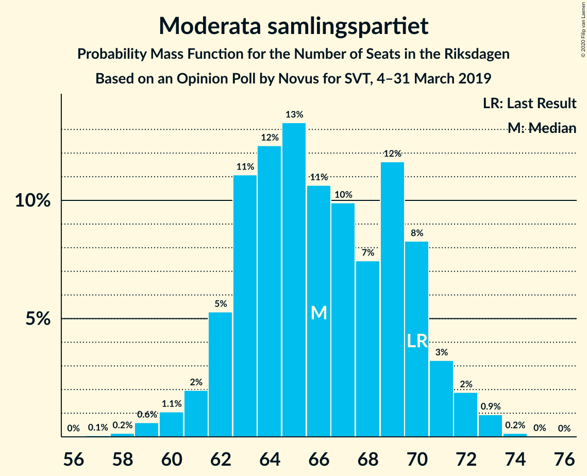
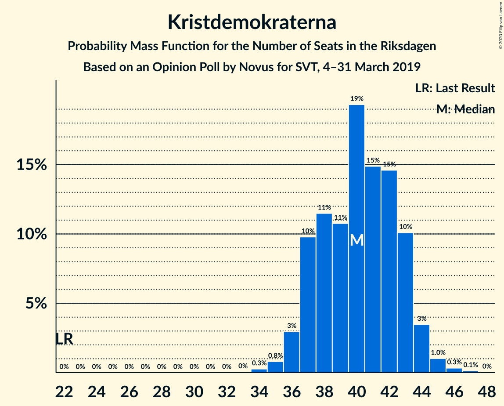
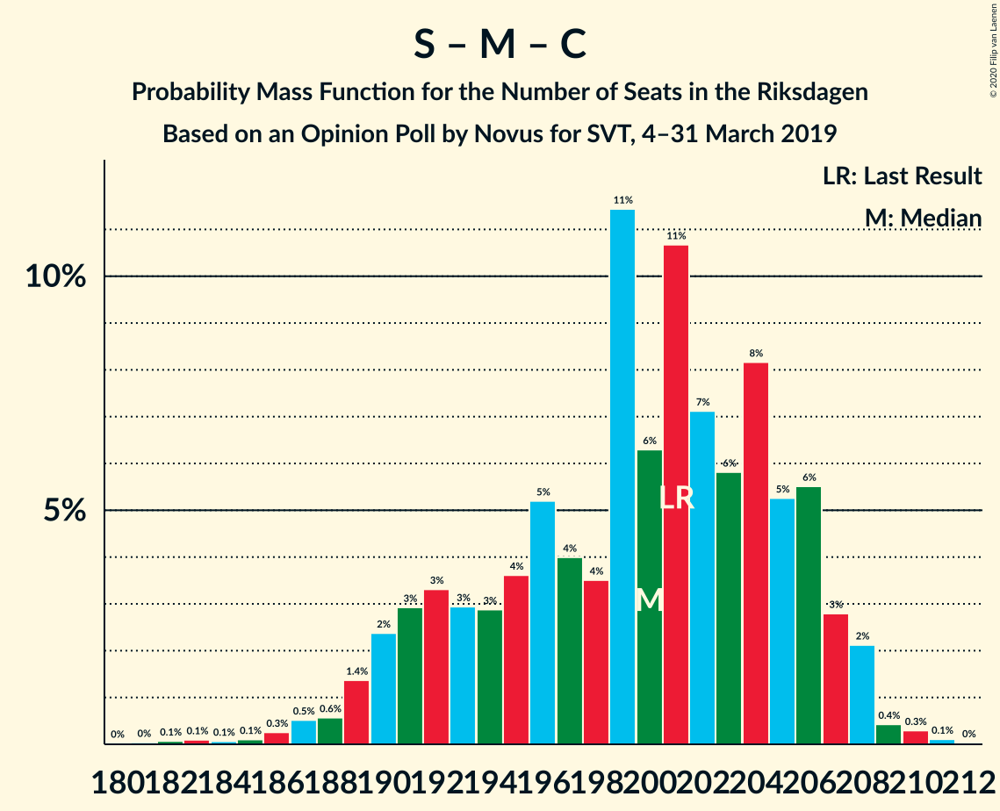
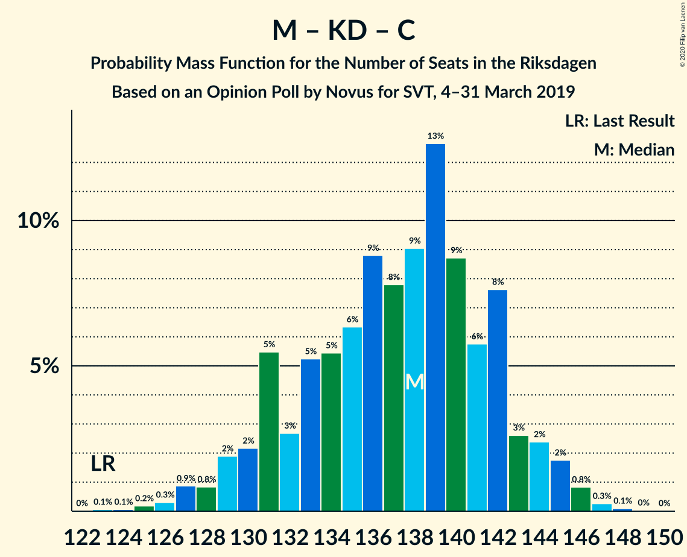

# Opinion Poll by Novus for SVT, 4–31 March 2019

<a href="#voting-intentions">Voting Intentions</a> | <a href="#seats">Seats</a> | <a href="#coalitions">Coalitions</a> | <a href="#technical-information">Technical Information</a>

## Voting Intentions

### Confidence Intervals

| Party | Last Result | Poll Result | 80% Confidence Interval | 90% Confidence Interval | 95% Confidence Interval | 99% Confidence Interval |
|:-----:|:-----------:|:-----------:|:-----------------------:|:-----------------------:|:-----------------------:|:-----------------------:|
| Sveriges socialdemokratiska arbetareparti | 28.3% | 27.2% | 26.3–28.2% |26.0–28.4% |25.8–28.7% |25.3–29.1% |
| Sverigedemokraterna | 17.5% | 18.1% | 17.3–18.9% |17.1–19.2% |16.9–19.4% |16.5–19.8% |
| Moderata samlingspartiet | 19.8% | 17.5% | 16.7–18.3% |16.5–18.6% |16.3–18.8% |15.9–19.2% |
| Kristdemokraterna | 6.3% | 10.6% | 10.0–11.3% |9.8–11.5% |9.6–11.6% |9.3–12.0% |
| Vänsterpartiet | 8.0% | 9.7% | 9.1–10.4% |8.9–10.5% |8.8–10.7% |8.5–11.0% |
| Centerpartiet | 8.6% | 8.2% | 7.7–8.8% |7.5–9.0% |7.4–9.1% |7.1–9.4% |
| Liberalerna | 5.5% | 3.7% | 3.3–4.1% |3.2–4.3% |3.1–4.4% |3.0–4.6% |
| Miljöpartiet de gröna | 4.4% | 3.5% | 3.1–3.9% |3.0–4.0% |2.9–4.1% |2.8–4.4% |

*Note:* The poll result column reflects the actual value used in the calculations. Published results may vary slightly, and in addition be rounded to fewer digits.

## Seats

### Confidence Intervals

| Party | Last Result | Median | 80% Confidence Interval | 90% Confidence Interval | 95% Confidence Interval | 99% Confidence Interval |
|:-----:|:-----------:|:------:|:-----------------------:|:-----------------------:|:-----------------------:|:-----------------------:|
| <a href="#sveriges-socialdemokratiska-arbetareparti">Sveriges socialdemokratiska arbetareparti</a> | 100 | 102 | 98–107 |97–108 |95–109 |93–110 |
| <a href="#sverigedemokraterna">Sverigedemokraterna</a> | 62 | 69 | 65–72 |64–73 |63–74 |61–75 |
| <a href="#moderata-samlingspartiet">Moderata samlingspartiet</a> | 70 | 66 | 62–70 |62–70 |61–71 |59–73 |
| <a href="#kristdemokraterna">Kristdemokraterna</a> | 22 | 40 | 37–43 |36–44 |36–44 |35–46 |
| <a href="#vänsterpartiet">Vänsterpartiet</a> | 28 | 36 | 34–39 |34–40 |33–41 |31–42 |
| <a href="#centerpartiet">Centerpartiet</a> | 31 | 31 | 28–33 |28–34 |27–35 |26–36 |
| <a href="#liberalerna">Liberalerna</a> | 20 | 0 | 0–15 |0–16 |0–16 |0–17 |
| <a href="#miljöpartiet-de-gröna">Miljöpartiet de gröna</a> | 16 | 0 | 0 |0–15 |0–15 |0–16 |

### Sveriges socialdemokratiska arbetareparti

*For a full overview of the results for this party, see the [Sveriges socialdemokratiska arbetareparti](party-sverigessocialdemokratiskaarbetareparti.html) page.*

| Number of Seats | Probability | Accumulated | Special Marks |
|:---------------:|:-----------:|:-----------:|:-------------:|
| 91 | 0.1% | 100% |  |
| 92 | 0.1% | 99.9% |  |
| 93 | 1.4% | 99.9% |  |
| 94 | 0.8% | 98% |  |
| 95 | 1.0% | 98% |  |
| 96 | 1.4% | 97% |  |
| 97 | 3% | 95% |  |
| 98 | 5% | 92% |  |
| 99 | 5% | 88% |  |
| 100 | 5% | 82% | Last Result |
| 101 | 24% | 77% |  |
| 102 | 4% | 54% | Median |
| 103 | 9% | 49% |  |
| 104 | 10% | 41% |  |
| 105 | 11% | 31% |  |
| 106 | 6% | 21% |  |
| 107 | 4% | 14% |  |
| 108 | 5% | 10% |  |
| 109 | 3% | 5% |  |
| 110 | 1.2% | 2% |  |
| 111 | 0.2% | 0.5% |  |
| 112 | 0.2% | 0.2% |  |
| 113 | 0.1% | 0.1% |  |
| 114 | 0% | 0% |  |

### Sverigedemokraterna

*For a full overview of the results for this party, see the [Sverigedemokraterna](party-sverigedemokraterna.html) page.*

| Number of Seats | Probability | Accumulated | Special Marks |
|:---------------:|:-----------:|:-----------:|:-------------:|
| 59 | 0.2% | 100% |  |
| 60 | 0.2% | 99.8% |  |
| 61 | 0.3% | 99.6% |  |
| 62 | 0.6% | 99.3% | Last Result |
| 63 | 3% | 98.6% |  |
| 64 | 2% | 96% |  |
| 65 | 6% | 93% |  |
| 66 | 8% | 88% |  |
| 67 | 11% | 80% |  |
| 68 | 15% | 68% |  |
| 69 | 16% | 53% | Median |
| 70 | 18% | 38% |  |
| 71 | 8% | 20% |  |
| 72 | 6% | 12% |  |
| 73 | 4% | 6% |  |
| 74 | 2% | 3% |  |
| 75 | 0.7% | 1.0% |  |
| 76 | 0.1% | 0.2% |  |
| 77 | 0.1% | 0.1% |  |
| 78 | 0% | 0% |  |

### Moderata samlingspartiet

*For a full overview of the results for this party, see the [Moderata samlingspartiet](party-moderatasamlingspartiet.html) page.*

| Number of Seats | Probability | Accumulated | Special Marks |
|:---------------:|:-----------:|:-----------:|:-------------:|
| 57 | 0% | 100% |  |
| 58 | 0.1% | 99.9% |  |
| 59 | 0.7% | 99.8% |  |
| 60 | 1.4% | 99.1% |  |
| 61 | 3% | 98% |  |
| 62 | 7% | 95% |  |
| 63 | 7% | 88% |  |
| 64 | 9% | 81% |  |
| 65 | 11% | 73% |  |
| 66 | 13% | 62% | Median |
| 67 | 10% | 49% |  |
| 68 | 9% | 38% |  |
| 69 | 15% | 29% |  |
| 70 | 9% | 13% | Last Result |
| 71 | 3% | 5% |  |
| 72 | 1.1% | 2% |  |
| 73 | 0.7% | 0.8% |  |
| 74 | 0.1% | 0.2% |  |
| 75 | 0% | 0.1% |  |
| 76 | 0% | 0% |  |

### Kristdemokraterna

*For a full overview of the results for this party, see the [Kristdemokraterna](party-kristdemokraterna.html) page.*

| Number of Seats | Probability | Accumulated | Special Marks |
|:---------------:|:-----------:|:-----------:|:-------------:|
| 22 | 0% | 100% | Last Result |
| 23 | 0% | 100% |  |
| 24 | 0% | 100% |  |
| 25 | 0% | 100% |  |
| 26 | 0% | 100% |  |
| 27 | 0% | 100% |  |
| 28 | 0% | 100% |  |
| 29 | 0% | 100% |  |
| 30 | 0% | 100% |  |
| 31 | 0% | 100% |  |
| 32 | 0% | 100% |  |
| 33 | 0.1% | 100% |  |
| 34 | 0.2% | 99.9% |  |
| 35 | 1.1% | 99.7% |  |
| 36 | 4% | 98.6% |  |
| 37 | 7% | 95% |  |
| 38 | 12% | 87% |  |
| 39 | 12% | 75% |  |
| 40 | 17% | 62% | Median |
| 41 | 15% | 45% |  |
| 42 | 13% | 30% |  |
| 43 | 11% | 17% |  |
| 44 | 4% | 6% |  |
| 45 | 1.1% | 2% |  |
| 46 | 0.4% | 0.6% |  |
| 47 | 0.2% | 0.2% |  |
| 48 | 0% | 0% |  |

### Vänsterpartiet

*For a full overview of the results for this party, see the [Vänsterpartiet](party-vänsterpartiet.html) page.*

| Number of Seats | Probability | Accumulated | Special Marks |
|:---------------:|:-----------:|:-----------:|:-------------:|
| 28 | 0% | 100% | Last Result |
| 29 | 0% | 100% |  |
| 30 | 0.1% | 100% |  |
| 31 | 0.6% | 99.9% |  |
| 32 | 2% | 99.3% |  |
| 33 | 2% | 98% |  |
| 34 | 9% | 95% |  |
| 35 | 16% | 86% |  |
| 36 | 24% | 70% | Median |
| 37 | 15% | 46% |  |
| 38 | 11% | 31% |  |
| 39 | 13% | 20% |  |
| 40 | 4% | 7% |  |
| 41 | 2% | 3% |  |
| 42 | 0.7% | 0.9% |  |
| 43 | 0.2% | 0.2% |  |
| 44 | 0% | 0% |  |

### Centerpartiet

*For a full overview of the results for this party, see the [Centerpartiet](party-centerpartiet.html) page.*

| Number of Seats | Probability | Accumulated | Special Marks |
|:---------------:|:-----------:|:-----------:|:-------------:|
| 25 | 0.1% | 100% |  |
| 26 | 0.5% | 99.9% |  |
| 27 | 3% | 99.5% |  |
| 28 | 8% | 96% |  |
| 29 | 12% | 89% |  |
| 30 | 13% | 76% |  |
| 31 | 25% | 63% | Last Result, Median |
| 32 | 20% | 38% |  |
| 33 | 12% | 18% |  |
| 34 | 4% | 7% |  |
| 35 | 2% | 3% |  |
| 36 | 1.0% | 1.2% |  |
| 37 | 0.2% | 0.2% |  |
| 38 | 0% | 0% |  |

### Liberalerna

*For a full overview of the results for this party, see the [Liberalerna](party-liberalerna.html) page.*

| Number of Seats | Probability | Accumulated | Special Marks |
|:---------------:|:-----------:|:-----------:|:-------------:|
| 0 | 82% | 100% | Median |
| 1 | 0% | 18% |  |
| 2 | 0% | 18% |  |
| 3 | 0% | 18% |  |
| 4 | 0% | 18% |  |
| 5 | 0% | 18% |  |
| 6 | 0% | 18% |  |
| 7 | 0% | 18% |  |
| 8 | 0% | 18% |  |
| 9 | 0% | 18% |  |
| 10 | 0% | 18% |  |
| 11 | 0% | 18% |  |
| 12 | 0% | 18% |  |
| 13 | 0% | 18% |  |
| 14 | 0.9% | 18% |  |
| 15 | 12% | 17% |  |
| 16 | 4% | 5% |  |
| 17 | 1.1% | 1.1% |  |
| 18 | 0.1% | 0.1% |  |
| 19 | 0% | 0% |  |
| 20 | 0% | 0% | Last Result |

### Miljöpartiet de gröna

*For a full overview of the results for this party, see the [Miljöpartiet de gröna](party-miljöpartietdegröna.html) page.*

| Number of Seats | Probability | Accumulated | Special Marks |
|:---------------:|:-----------:|:-----------:|:-------------:|
| 0 | 92% | 100% | Median |
| 1 | 0% | 8% |  |
| 2 | 0% | 8% |  |
| 3 | 0% | 8% |  |
| 4 | 0% | 8% |  |
| 5 | 0% | 8% |  |
| 6 | 0% | 8% |  |
| 7 | 0% | 8% |  |
| 8 | 0% | 8% |  |
| 9 | 0% | 8% |  |
| 10 | 0% | 8% |  |
| 11 | 0% | 8% |  |
| 12 | 0% | 8% |  |
| 13 | 0% | 8% |  |
| 14 | 1.1% | 8% |  |
| 15 | 6% | 7% |  |
| 16 | 1.0% | 1.2% | Last Result |
| 17 | 0.2% | 0.2% |  |
| 18 | 0% | 0% |  |

## Coalitions

### Confidence Intervals

| Coalition | Last Result | Median | Majority? | 80% Confidence Interval | 90% Confidence Interval | 95% Confidence Interval | 99% Confidence Interval |
|:---------:|:-----------:|:------:|:---------:|:-----------------------:|:-----------------------:|:-----------------------:|:-----------------------:|
| Sveriges socialdemokratiska arbetareparti – Moderata samlingspartiet – Centerpartiet | 201 | 201 | 100% | 192–206 | 190–207 | 189–208 | 185–209 |
| Sveriges socialdemokratiska arbetareparti – Vänsterpartiet – Centerpartiet – Liberalerna – Miljöpartiet de gröna | 195 | 173 | 40% | 168–181 | 168–184 | 167–184 | 166–187 |
| Sverigedemokraterna – Moderata samlingspartiet – Kristdemokraterna | 154 | 176 | 60% | 168–181 | 165–181 | 165–182 | 162–183 |
| Sveriges socialdemokratiska arbetareparti – Moderata samlingspartiet | 170 | 169 | 10% | 162–175 | 160–175 | 159–177 | 156–178 |
| Moderata samlingspartiet – Kristdemokraterna – Centerpartiet – Liberalerna | 143 | 139 | 0% | 134–147 | 133–150 | 132–152 | 128–154 |
| Sveriges socialdemokratiska arbetareparti – Vänsterpartiet – Miljöpartiet de gröna | 144 | 140 | 0% | 134–146 | 133–148 | 131–150 | 129–154 |
| Sveriges socialdemokratiska arbetareparti – Centerpartiet – Liberalerna – Miljöpartiet de gröna | 167 | 137 | 0% | 132–145 | 131–147 | 130–149 | 128–155 |
| Sveriges socialdemokratiska arbetareparti – Vänsterpartiet | 128 | 140 | 0% | 134–145 | 131–145 | 130–146 | 127–148 |
| Moderata samlingspartiet – Kristdemokraterna – Centerpartiet | 123 | 138 | 0% | 131–142 | 129–144 | 128–145 | 126–147 |
| Sverigedemokraterna – Moderata samlingspartiet | 132 | 136 | 0% | 129–139 | 127–140 | 125–142 | 124–143 |
| Sveriges socialdemokratiska arbetareparti – Miljöpartiet de gröna | 116 | 103 | 0% | 99–109 | 97–113 | 96–115 | 93–117 |
| Moderata samlingspartiet – Centerpartiet – Liberalerna | 121 | 99 | 0% | 95–108 | 93–111 | 92–112 | 90–115 |
| Moderata samlingspartiet – Centerpartiet | 101 | 98 | 0% | 93–101 | 91–102 | 90–103 | 88–105 |

### Sveriges socialdemokratiska arbetareparti – Moderata samlingspartiet – Centerpartiet

| Number of Seats | Probability | Accumulated | Special Marks |
|:---------------:|:-----------:|:-----------:|:-------------:|
| 180 | 0% | 100% |  |
| 181 | 0% | 99.9% |  |
| 182 | 0.1% | 99.9% |  |
| 183 | 0.1% | 99.8% |  |
| 184 | 0.1% | 99.6% |  |
| 185 | 0.1% | 99.6% |  |
| 186 | 0.2% | 99.5% |  |
| 187 | 0.5% | 99.2% |  |
| 188 | 0.7% | 98.8% |  |
| 189 | 2% | 98% |  |
| 190 | 3% | 96% |  |
| 191 | 2% | 93% |  |
| 192 | 5% | 92% |  |
| 193 | 2% | 87% |  |
| 194 | 4% | 85% |  |
| 195 | 3% | 81% |  |
| 196 | 3% | 78% |  |
| 197 | 5% | 76% |  |
| 198 | 3% | 71% |  |
| 199 | 8% | 67% | Median |
| 200 | 6% | 60% |  |
| 201 | 12% | 54% | Last Result |
| 202 | 8% | 42% |  |
| 203 | 4% | 34% |  |
| 204 | 12% | 30% |  |
| 205 | 5% | 18% |  |
| 206 | 7% | 13% |  |
| 207 | 3% | 6% |  |
| 208 | 2% | 3% |  |
| 209 | 0.3% | 0.8% |  |
| 210 | 0.3% | 0.5% |  |
| 211 | 0.1% | 0.2% |  |
| 212 | 0% | 0.1% |  |
| 213 | 0% | 0% |  |

### Sveriges socialdemokratiska arbetareparti – Vänsterpartiet – Centerpartiet – Liberalerna – Miljöpartiet de gröna

| Number of Seats | Probability | Accumulated | Special Marks |
|:---------------:|:-----------:|:-----------:|:-------------:|
| 163 | 0% | 100% |  |
| 164 | 0.1% | 99.9% |  |
| 165 | 0.2% | 99.8% |  |
| 166 | 0.8% | 99.7% |  |
| 167 | 4% | 98.9% |  |
| 168 | 7% | 95% |  |
| 169 | 6% | 88% | Median |
| 170 | 13% | 83% |  |
| 171 | 8% | 69% |  |
| 172 | 8% | 61% |  |
| 173 | 5% | 53% |  |
| 174 | 9% | 49% |  |
| 175 | 5% | 40% | Majority |
| 176 | 5% | 35% |  |
| 177 | 7% | 30% |  |
| 178 | 3% | 23% |  |
| 179 | 5% | 19% |  |
| 180 | 4% | 15% |  |
| 181 | 2% | 10% |  |
| 182 | 2% | 8% |  |
| 183 | 1.5% | 7% |  |
| 184 | 3% | 5% |  |
| 185 | 1.0% | 2% |  |
| 186 | 0.2% | 1.5% |  |
| 187 | 0.9% | 1.3% |  |
| 188 | 0.1% | 0.4% |  |
| 189 | 0% | 0.2% |  |
| 190 | 0% | 0.2% |  |
| 191 | 0% | 0.2% |  |
| 192 | 0.1% | 0.2% |  |
| 193 | 0% | 0% |  |
| 194 | 0% | 0% |  |
| 195 | 0% | 0% | Last Result |

### Sverigedemokraterna – Moderata samlingspartiet – Kristdemokraterna

| Number of Seats | Probability | Accumulated | Special Marks |
|:---------------:|:-----------:|:-----------:|:-------------:|
| 154 | 0% | 100% | Last Result |
| 155 | 0% | 100% |  |
| 156 | 0% | 100% |  |
| 157 | 0.1% | 100% |  |
| 158 | 0% | 99.8% |  |
| 159 | 0% | 99.8% |  |
| 160 | 0% | 99.8% |  |
| 161 | 0.1% | 99.8% |  |
| 162 | 0.9% | 99.6% |  |
| 163 | 0.2% | 98.7% |  |
| 164 | 1.0% | 98.5% |  |
| 165 | 3% | 98% |  |
| 166 | 1.5% | 95% |  |
| 167 | 2% | 93% |  |
| 168 | 2% | 92% |  |
| 169 | 4% | 90% |  |
| 170 | 5% | 85% |  |
| 171 | 3% | 81% |  |
| 172 | 7% | 77% |  |
| 173 | 5% | 70% |  |
| 174 | 5% | 65% |  |
| 175 | 9% | 60% | Median, Majority |
| 176 | 5% | 51% |  |
| 177 | 8% | 47% |  |
| 178 | 8% | 39% |  |
| 179 | 13% | 31% |  |
| 180 | 6% | 17% |  |
| 181 | 7% | 12% |  |
| 182 | 4% | 5% |  |
| 183 | 0.8% | 1.1% |  |
| 184 | 0.2% | 0.3% |  |
| 185 | 0.1% | 0.2% |  |
| 186 | 0% | 0.1% |  |
| 187 | 0% | 0% |  |

### Sveriges socialdemokratiska arbetareparti – Moderata samlingspartiet

| Number of Seats | Probability | Accumulated | Special Marks |
|:---------------:|:-----------:|:-----------:|:-------------:|
| 151 | 0% | 100% |  |
| 152 | 0% | 99.9% |  |
| 153 | 0.1% | 99.9% |  |
| 154 | 0.1% | 99.8% |  |
| 155 | 0.2% | 99.7% |  |
| 156 | 0.2% | 99.5% |  |
| 157 | 0.3% | 99.4% |  |
| 158 | 1.1% | 99.0% |  |
| 159 | 1.3% | 98% |  |
| 160 | 3% | 97% |  |
| 161 | 3% | 94% |  |
| 162 | 2% | 90% |  |
| 163 | 5% | 88% |  |
| 164 | 3% | 84% |  |
| 165 | 4% | 81% |  |
| 166 | 7% | 76% |  |
| 167 | 4% | 70% |  |
| 168 | 5% | 66% | Median |
| 169 | 11% | 61% |  |
| 170 | 10% | 50% | Last Result |
| 171 | 7% | 40% |  |
| 172 | 6% | 33% |  |
| 173 | 9% | 27% |  |
| 174 | 8% | 18% |  |
| 175 | 6% | 10% | Majority |
| 176 | 2% | 5% |  |
| 177 | 2% | 3% |  |
| 178 | 0.4% | 0.7% |  |
| 179 | 0.1% | 0.3% |  |
| 180 | 0.1% | 0.2% |  |
| 181 | 0% | 0% |  |

### Moderata samlingspartiet – Kristdemokraterna – Centerpartiet – Liberalerna

| Number of Seats | Probability | Accumulated | Special Marks |
|:---------------:|:-----------:|:-----------:|:-------------:|
| 125 | 0% | 100% |  |
| 126 | 0% | 99.9% |  |
| 127 | 0.1% | 99.9% |  |
| 128 | 0.4% | 99.8% |  |
| 129 | 0.2% | 99.4% |  |
| 130 | 1.0% | 99.2% |  |
| 131 | 0.6% | 98% |  |
| 132 | 2% | 98% |  |
| 133 | 1.5% | 96% |  |
| 134 | 5% | 94% |  |
| 135 | 5% | 90% |  |
| 136 | 5% | 85% |  |
| 137 | 9% | 80% | Median |
| 138 | 7% | 71% |  |
| 139 | 14% | 63% |  |
| 140 | 7% | 50% |  |
| 141 | 8% | 42% |  |
| 142 | 9% | 34% |  |
| 143 | 3% | 25% | Last Result |
| 144 | 6% | 22% |  |
| 145 | 2% | 16% |  |
| 146 | 4% | 14% |  |
| 147 | 2% | 11% |  |
| 148 | 1.4% | 9% |  |
| 149 | 2% | 7% |  |
| 150 | 1.1% | 5% |  |
| 151 | 2% | 4% |  |
| 152 | 2% | 3% |  |
| 153 | 0.5% | 1.2% |  |
| 154 | 0.4% | 0.6% |  |
| 155 | 0.1% | 0.2% |  |
| 156 | 0.1% | 0.1% |  |
| 157 | 0% | 0% |  |

### Sveriges socialdemokratiska arbetareparti – Vänsterpartiet – Miljöpartiet de gröna

| Number of Seats | Probability | Accumulated | Special Marks |
|:---------------:|:-----------:|:-----------:|:-------------:|
| 127 | 0.3% | 100% |  |
| 128 | 0.1% | 99.7% |  |
| 129 | 1.0% | 99.6% |  |
| 130 | 0.9% | 98.6% |  |
| 131 | 0.9% | 98% |  |
| 132 | 1.2% | 97% |  |
| 133 | 0.8% | 96% |  |
| 134 | 5% | 95% |  |
| 135 | 3% | 90% |  |
| 136 | 3% | 87% |  |
| 137 | 12% | 84% |  |
| 138 | 9% | 72% | Median |
| 139 | 5% | 63% |  |
| 140 | 10% | 58% |  |
| 141 | 12% | 49% |  |
| 142 | 7% | 37% |  |
| 143 | 8% | 29% |  |
| 144 | 3% | 21% | Last Result |
| 145 | 8% | 18% |  |
| 146 | 3% | 11% |  |
| 147 | 2% | 8% |  |
| 148 | 1.2% | 6% |  |
| 149 | 2% | 5% |  |
| 150 | 1.2% | 3% |  |
| 151 | 0.5% | 2% |  |
| 152 | 0.6% | 1.3% |  |
| 153 | 0.2% | 0.8% |  |
| 154 | 0.4% | 0.6% |  |
| 155 | 0.1% | 0.2% |  |
| 156 | 0% | 0.1% |  |
| 157 | 0% | 0.1% |  |
| 158 | 0% | 0% |  |

### Sveriges socialdemokratiska arbetareparti – Centerpartiet – Liberalerna – Miljöpartiet de gröna

| Number of Seats | Probability | Accumulated | Special Marks |
|:---------------:|:-----------:|:-----------:|:-------------:|
| 126 | 0.1% | 100% |  |
| 127 | 0.1% | 99.9% |  |
| 128 | 0.6% | 99.8% |  |
| 129 | 0.9% | 99.2% |  |
| 130 | 2% | 98% |  |
| 131 | 6% | 97% |  |
| 132 | 11% | 91% |  |
| 133 | 7% | 80% | Median |
| 134 | 9% | 73% |  |
| 135 | 9% | 64% |  |
| 136 | 5% | 55% |  |
| 137 | 10% | 50% |  |
| 138 | 5% | 40% |  |
| 139 | 4% | 35% |  |
| 140 | 6% | 31% |  |
| 141 | 3% | 25% |  |
| 142 | 3% | 22% |  |
| 143 | 2% | 19% |  |
| 144 | 2% | 17% |  |
| 145 | 6% | 15% |  |
| 146 | 2% | 9% |  |
| 147 | 3% | 7% |  |
| 148 | 1.4% | 4% |  |
| 149 | 0.7% | 3% |  |
| 150 | 0.3% | 2% |  |
| 151 | 0.2% | 2% |  |
| 152 | 0.2% | 1.4% |  |
| 153 | 0.2% | 1.2% |  |
| 154 | 0.1% | 1.0% |  |
| 155 | 0.7% | 0.9% |  |
| 156 | 0% | 0.2% |  |
| 157 | 0.1% | 0.2% |  |
| 158 | 0% | 0% |  |
| 159 | 0% | 0% |  |
| 160 | 0% | 0% |  |
| 161 | 0% | 0% |  |
| 162 | 0% | 0% |  |
| 163 | 0% | 0% |  |
| 164 | 0% | 0% |  |
| 165 | 0% | 0% |  |
| 166 | 0% | 0% |  |
| 167 | 0% | 0% | Last Result |

### Sveriges socialdemokratiska arbetareparti – Vänsterpartiet

| Number of Seats | Probability | Accumulated | Special Marks |
|:---------------:|:-----------:|:-----------:|:-------------:|
| 125 | 0.1% | 100% |  |
| 126 | 0.1% | 99.9% |  |
| 127 | 0.7% | 99.8% |  |
| 128 | 0.1% | 99.2% | Last Result |
| 129 | 1.3% | 99.1% |  |
| 130 | 1.1% | 98% |  |
| 131 | 2% | 97% |  |
| 132 | 2% | 95% |  |
| 133 | 1.3% | 93% |  |
| 134 | 6% | 91% |  |
| 135 | 4% | 85% |  |
| 136 | 4% | 81% |  |
| 137 | 13% | 78% |  |
| 138 | 9% | 65% | Median |
| 139 | 5% | 55% |  |
| 140 | 10% | 51% |  |
| 141 | 12% | 41% |  |
| 142 | 7% | 29% |  |
| 143 | 8% | 22% |  |
| 144 | 3% | 14% |  |
| 145 | 7% | 11% |  |
| 146 | 2% | 4% |  |
| 147 | 1.0% | 2% |  |
| 148 | 0.5% | 1.0% |  |
| 149 | 0.2% | 0.5% |  |
| 150 | 0.2% | 0.3% |  |
| 151 | 0.1% | 0.1% |  |
| 152 | 0% | 0% |  |

### Moderata samlingspartiet – Kristdemokraterna – Centerpartiet

| Number of Seats | Probability | Accumulated | Special Marks |
|:---------------:|:-----------:|:-----------:|:-------------:|
| 123 | 0.1% | 100% | Last Result |
| 124 | 0.1% | 99.9% |  |
| 125 | 0.2% | 99.8% |  |
| 126 | 0.3% | 99.7% |  |
| 127 | 1.4% | 99.4% |  |
| 128 | 1.1% | 98% |  |
| 129 | 2% | 97% |  |
| 130 | 3% | 94% |  |
| 131 | 3% | 92% |  |
| 132 | 3% | 88% |  |
| 133 | 3% | 86% |  |
| 134 | 6% | 83% |  |
| 135 | 6% | 77% |  |
| 136 | 6% | 70% |  |
| 137 | 10% | 64% | Median |
| 138 | 8% | 53% |  |
| 139 | 14% | 46% |  |
| 140 | 8% | 32% |  |
| 141 | 7% | 25% |  |
| 142 | 9% | 17% |  |
| 143 | 2% | 8% |  |
| 144 | 3% | 7% |  |
| 145 | 1.4% | 3% |  |
| 146 | 1.2% | 2% |  |
| 147 | 0.4% | 0.5% |  |
| 148 | 0.1% | 0.2% |  |
| 149 | 0% | 0% |  |

### Sverigedemokraterna – Moderata samlingspartiet

| Number of Seats | Probability | Accumulated | Special Marks |
|:---------------:|:-----------:|:-----------:|:-------------:|
| 119 | 0.1% | 100% |  |
| 120 | 0% | 99.9% |  |
| 121 | 0% | 99.8% |  |
| 122 | 0.1% | 99.8% |  |
| 123 | 0.2% | 99.7% |  |
| 124 | 0.9% | 99.5% |  |
| 125 | 1.1% | 98.6% |  |
| 126 | 1.1% | 97% |  |
| 127 | 2% | 96% |  |
| 128 | 2% | 95% |  |
| 129 | 5% | 93% |  |
| 130 | 3% | 88% |  |
| 131 | 6% | 85% |  |
| 132 | 5% | 79% | Last Result |
| 133 | 6% | 75% |  |
| 134 | 10% | 69% |  |
| 135 | 8% | 59% | Median |
| 136 | 10% | 51% |  |
| 137 | 15% | 42% |  |
| 138 | 7% | 26% |  |
| 139 | 13% | 19% |  |
| 140 | 3% | 6% |  |
| 141 | 0.7% | 3% |  |
| 142 | 2% | 3% |  |
| 143 | 0.6% | 1.0% |  |
| 144 | 0.3% | 0.4% |  |
| 145 | 0.1% | 0.2% |  |
| 146 | 0% | 0.1% |  |
| 147 | 0% | 0% |  |

### Sveriges socialdemokratiska arbetareparti – Miljöpartiet de gröna

| Number of Seats | Probability | Accumulated | Special Marks |
|:---------------:|:-----------:|:-----------:|:-------------:|
| 92 | 0% | 100% |  |
| 93 | 0.9% | 99.9% |  |
| 94 | 0.5% | 99.0% |  |
| 95 | 0.6% | 98.5% |  |
| 96 | 1.1% | 98% |  |
| 97 | 2% | 97% |  |
| 98 | 3% | 95% |  |
| 99 | 5% | 92% |  |
| 100 | 5% | 88% |  |
| 101 | 22% | 83% |  |
| 102 | 4% | 61% | Median |
| 103 | 8% | 57% |  |
| 104 | 10% | 49% |  |
| 105 | 11% | 39% |  |
| 106 | 6% | 28% |  |
| 107 | 5% | 22% |  |
| 108 | 5% | 17% |  |
| 109 | 3% | 12% |  |
| 110 | 1.5% | 9% |  |
| 111 | 0.7% | 7% |  |
| 112 | 0.9% | 7% |  |
| 113 | 2% | 6% |  |
| 114 | 0.3% | 3% |  |
| 115 | 0.4% | 3% |  |
| 116 | 1.4% | 2% | Last Result |
| 117 | 0.6% | 1.1% |  |
| 118 | 0.2% | 0.4% |  |
| 119 | 0.1% | 0.3% |  |
| 120 | 0.1% | 0.1% |  |
| 121 | 0% | 0% |  |

### Moderata samlingspartiet – Centerpartiet – Liberalerna

| Number of Seats | Probability | Accumulated | Special Marks |
|:---------------:|:-----------:|:-----------:|:-------------:|
| 88 | 0% | 100% |  |
| 89 | 0.4% | 99.9% |  |
| 90 | 0.5% | 99.5% |  |
| 91 | 1.4% | 99.0% |  |
| 92 | 0.7% | 98% |  |
| 93 | 3% | 97% |  |
| 94 | 4% | 94% |  |
| 95 | 6% | 90% |  |
| 96 | 8% | 84% |  |
| 97 | 6% | 76% | Median |
| 98 | 13% | 70% |  |
| 99 | 13% | 57% |  |
| 100 | 12% | 44% |  |
| 101 | 7% | 32% |  |
| 102 | 3% | 25% |  |
| 103 | 3% | 23% |  |
| 104 | 2% | 20% |  |
| 105 | 2% | 17% |  |
| 106 | 1.0% | 16% |  |
| 107 | 1.5% | 15% |  |
| 108 | 5% | 13% |  |
| 109 | 1.0% | 8% |  |
| 110 | 0.9% | 7% |  |
| 111 | 2% | 6% |  |
| 112 | 2% | 4% |  |
| 113 | 1.0% | 2% |  |
| 114 | 0.4% | 0.9% |  |
| 115 | 0.3% | 0.5% |  |
| 116 | 0.2% | 0.2% |  |
| 117 | 0% | 0% |  |
| 118 | 0% | 0% |  |
| 119 | 0% | 0% |  |
| 120 | 0% | 0% |  |
| 121 | 0% | 0% | Last Result |

### Moderata samlingspartiet – Centerpartiet

| Number of Seats | Probability | Accumulated | Special Marks |
|:---------------:|:-----------:|:-----------:|:-------------:|
| 85 | 0.1% | 100% |  |
| 86 | 0% | 99.9% |  |
| 87 | 0.1% | 99.9% |  |
| 88 | 0.4% | 99.7% |  |
| 89 | 1.3% | 99.4% |  |
| 90 | 2% | 98% |  |
| 91 | 3% | 96% |  |
| 92 | 2% | 93% |  |
| 93 | 7% | 91% |  |
| 94 | 5% | 84% |  |
| 95 | 7% | 79% |  |
| 96 | 10% | 72% |  |
| 97 | 8% | 62% | Median |
| 98 | 14% | 54% |  |
| 99 | 14% | 40% |  |
| 100 | 12% | 26% |  |
| 101 | 7% | 14% | Last Result |
| 102 | 3% | 8% |  |
| 103 | 3% | 5% |  |
| 104 | 1.2% | 2% |  |
| 105 | 0.8% | 1.2% |  |
| 106 | 0.3% | 0.4% |  |
| 107 | 0.1% | 0.1% |  |
| 108 | 0% | 0% |  |

## Technical Information

### Opinion Poll

+ **Polling firm:** Novus
+ **Commissioner(s):** SVT
+ **Fieldwork period:** 4–31 March 2019

### Calculations

+ **Sample size:** 3668
+ **Simulations done:** 524,288
+ **Error estimate:** 0.85%

