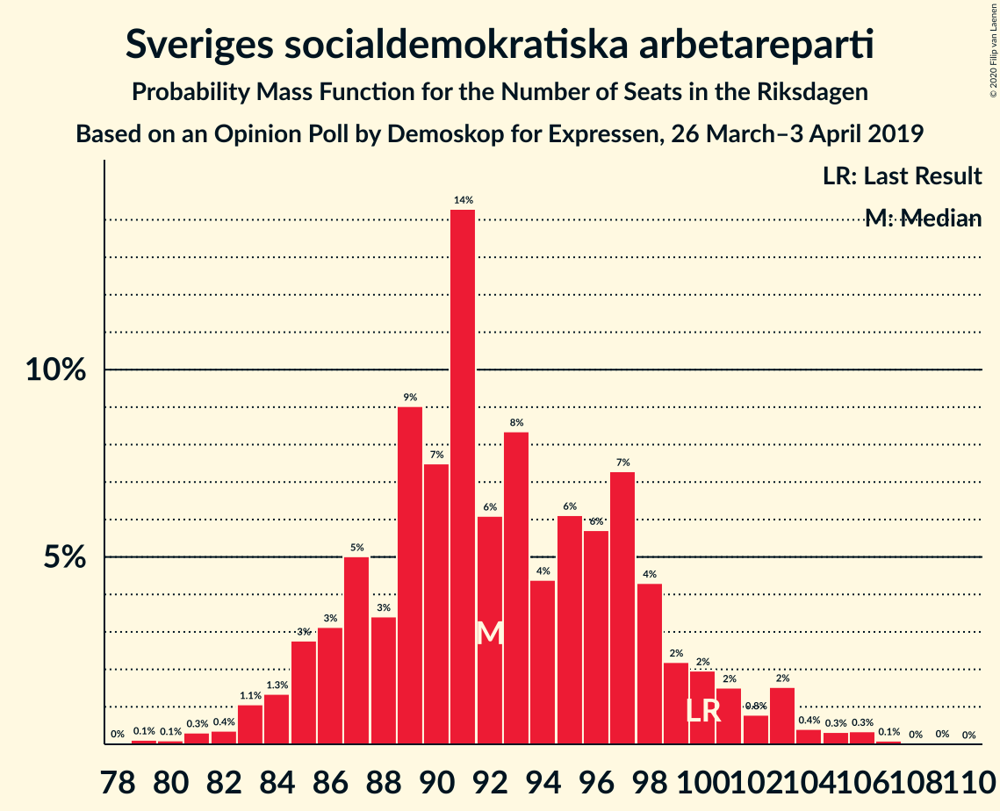
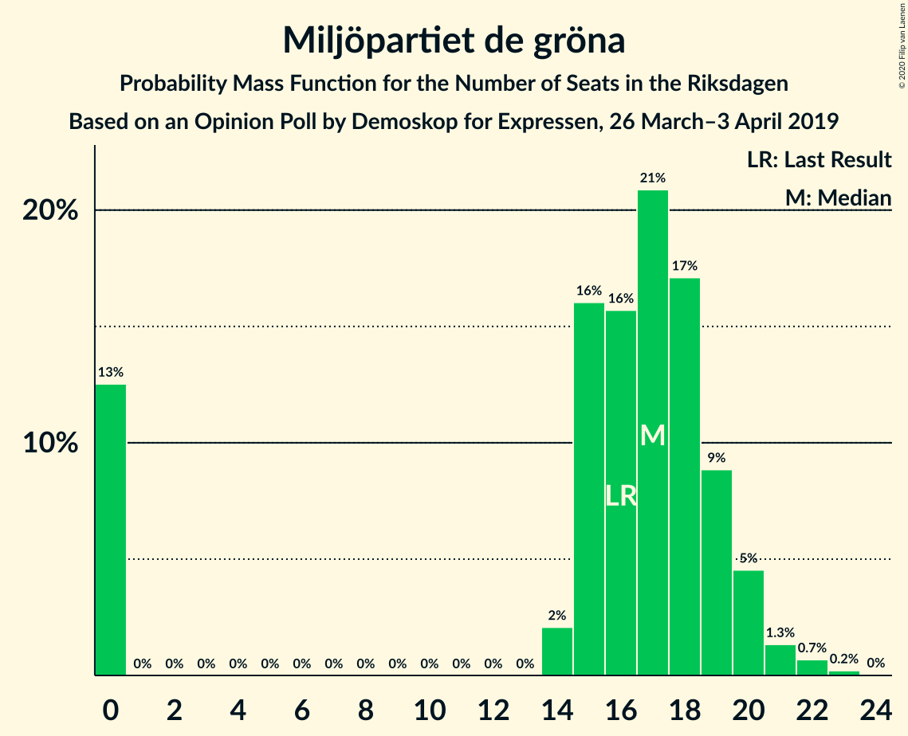
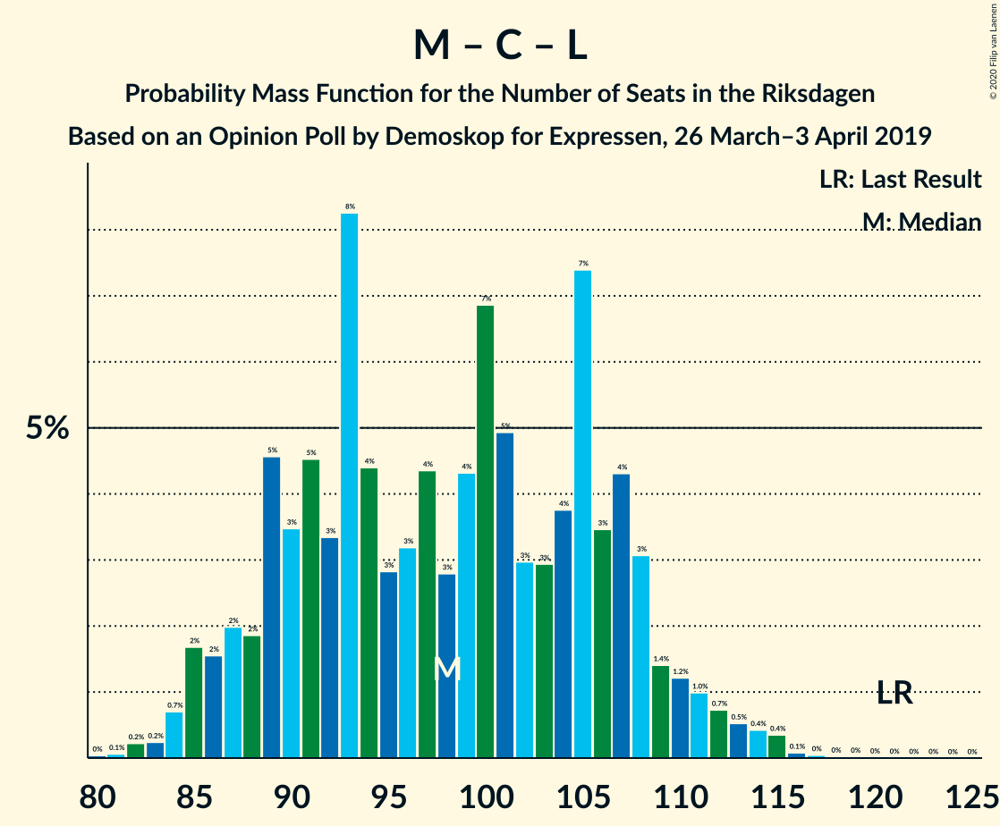

# Opinion Poll by Demoskop for Expressen, 26 March–3 April 2019

<a href="#voting-intentions">Voting Intentions</a> | <a href="#seats">Seats</a> | <a href="#coalitions">Coalitions</a> | <a href="#technical-information">Technical Information</a>

## Voting Intentions

### Confidence Intervals

| Party | Last Result | Poll Result | 80% Confidence Interval | 90% Confidence Interval | 95% Confidence Interval | 99% Confidence Interval |
|:-----:|:-----------:|:-----------:|:-----------------------:|:-----------------------:|:-----------------------:|:-----------------------:|
| Sveriges socialdemokratiska arbetareparti | 28.3% | 25.4% | 24.0–26.8% |23.6–27.2% |23.3–27.6% |22.7–28.3% |
| Sverigedemokraterna | 17.5% | 18.0% | 16.8–19.3% |16.5–19.6% |16.2–20.0% |15.7–20.6% |
| Moderata samlingspartiet | 19.8% | 16.6% | 15.4–17.8% |15.1–18.2% |14.8–18.5% |14.3–19.1% |
| Kristdemokraterna | 6.3% | 11.7% | 10.7–12.8% |10.4–13.1% |10.2–13.4% |9.8–13.9% |
| Vänsterpartiet | 8.0% | 9.6% | 8.7–10.6% |8.5–10.9% |8.2–11.1% |7.8–11.6% |
| Centerpartiet | 8.6% | 8.2% | 7.4–9.2% |7.2–9.4% |7.0–9.7% |6.6–10.2% |
| Miljöpartiet de gröna | 4.4% | 4.5% | 3.9–5.3% |3.7–5.5% |3.6–5.7% |3.3–6.0% |
| Liberalerna | 5.5% | 3.9% | 3.3–4.6% |3.2–4.8% |3.0–5.0% |2.8–5.3% |

*Note:* The poll result column reflects the actual value used in the calculations. Published results may vary slightly, and in addition be rounded to fewer digits.

## Seats

### Confidence Intervals

| Party | Last Result | Median | 80% Confidence Interval | 90% Confidence Interval | 95% Confidence Interval | 99% Confidence Interval |
|:-----:|:-----------:|:------:|:-----------------------:|:-----------------------:|:-----------------------:|:-----------------------:|
| <a href="#sveriges-socialdemokratiska-arbetareparti">Sveriges socialdemokratiska arbetareparti</a> | 100 | 92 | 87–98 |85–101 |84–103 |81–106 |
| <a href="#sverigedemokraterna">Sverigedemokraterna</a> | 62 | 65 | 61–71 |60–72 |59–74 |56–76 |
| <a href="#moderata-samlingspartiet">Moderata samlingspartiet</a> | 70 | 60 | 56–66 |55–67 |54–68 |52–71 |
| <a href="#kristdemokraterna">Kristdemokraterna</a> | 22 | 43 | 39–47 |38–48 |37–49 |35–51 |
| <a href="#vänsterpartiet">Vänsterpartiet</a> | 28 | 35 | 32–39 |31–40 |30–41 |28–43 |
| <a href="#centerpartiet">Centerpartiet</a> | 31 | 30 | 27–34 |26–35 |25–36 |24–37 |
| <a href="#miljöpartiet-de-gröna">Miljöpartiet de gröna</a> | 16 | 17 | 0–19 |0–20 |0–20 |0–22 |
| <a href="#liberalerna">Liberalerna</a> | 20 | 0 | 0–16 |0–17 |0–18 |0–19 |

### Sveriges socialdemokratiska arbetareparti

*For a full overview of the results for this party, see the [Sveriges socialdemokratiska arbetareparti](party-sverigessocialdemokratiskaarbetareparti.html) page.*

| Number of Seats | Probability | Accumulated | Special Marks |
|:---------------:|:-----------:|:-----------:|:-------------:|
| 79 | 0.1% | 100% |  |
| 80 | 0.1% | 99.8% |  |
| 81 | 0.3% | 99.7% |  |
| 82 | 0.4% | 99.4% |  |
| 83 | 1.1% | 99.1% |  |
| 84 | 1.3% | 98% |  |
| 85 | 3% | 97% |  |
| 86 | 3% | 94% |  |
| 87 | 5% | 91% |  |
| 88 | 3% | 86% |  |
| 89 | 9% | 82% |  |
| 90 | 7% | 73% |  |
| 91 | 14% | 66% |  |
| 92 | 6% | 52% | Median |
| 93 | 8% | 45% |  |
| 94 | 4% | 37% |  |
| 95 | 6% | 33% |  |
| 96 | 6% | 27% |  |
| 97 | 7% | 21% |  |
| 98 | 4% | 14% |  |
| 99 | 2% | 9% |  |
| 100 | 2% | 7% | Last Result |
| 101 | 2% | 5% |  |
| 102 | 0.8% | 4% |  |
| 103 | 2% | 3% |  |
| 104 | 0.4% | 1.3% |  |
| 105 | 0.3% | 0.9% |  |
| 106 | 0.3% | 0.5% |  |
| 107 | 0.1% | 0.2% |  |
| 108 | 0% | 0.1% |  |
| 109 | 0% | 0.1% |  |
| 110 | 0% | 0% |  |

### Sverigedemokraterna

*For a full overview of the results for this party, see the [Sverigedemokraterna](party-sverigedemokraterna.html) page.*

| Number of Seats | Probability | Accumulated | Special Marks |
|:---------------:|:-----------:|:-----------:|:-------------:|
| 54 | 0.1% | 100% |  |
| 55 | 0.2% | 99.9% |  |
| 56 | 0.3% | 99.7% |  |
| 57 | 0.6% | 99.4% |  |
| 58 | 1.2% | 98.8% |  |
| 59 | 2% | 98% |  |
| 60 | 4% | 95% |  |
| 61 | 5% | 92% |  |
| 62 | 10% | 86% | Last Result |
| 63 | 7% | 77% |  |
| 64 | 9% | 69% |  |
| 65 | 11% | 60% | Median |
| 66 | 7% | 49% |  |
| 67 | 11% | 42% |  |
| 68 | 7% | 31% |  |
| 69 | 6% | 24% |  |
| 70 | 5% | 17% |  |
| 71 | 4% | 13% |  |
| 72 | 4% | 9% |  |
| 73 | 2% | 5% |  |
| 74 | 1.5% | 3% |  |
| 75 | 0.6% | 1.3% |  |
| 76 | 0.3% | 0.8% |  |
| 77 | 0.2% | 0.4% |  |
| 78 | 0.1% | 0.3% |  |
| 79 | 0% | 0.2% |  |
| 80 | 0.1% | 0.1% |  |
| 81 | 0% | 0% |  |

### Moderata samlingspartiet

*For a full overview of the results for this party, see the [Moderata samlingspartiet](party-moderatasamlingspartiet.html) page.*

| Number of Seats | Probability | Accumulated | Special Marks |
|:---------------:|:-----------:|:-----------:|:-------------:|
| 49 | 0% | 100% |  |
| 50 | 0.1% | 99.9% |  |
| 51 | 0.4% | 99.9% |  |
| 52 | 0.7% | 99.5% |  |
| 53 | 1.1% | 98.9% |  |
| 54 | 1.2% | 98% |  |
| 55 | 6% | 97% |  |
| 56 | 5% | 90% |  |
| 57 | 5% | 85% |  |
| 58 | 11% | 80% |  |
| 59 | 12% | 69% |  |
| 60 | 9% | 57% | Median |
| 61 | 6% | 48% |  |
| 62 | 9% | 42% |  |
| 63 | 12% | 33% |  |
| 64 | 4% | 20% |  |
| 65 | 6% | 16% |  |
| 66 | 3% | 10% |  |
| 67 | 3% | 7% |  |
| 68 | 2% | 4% |  |
| 69 | 1.1% | 2% |  |
| 70 | 0.8% | 1.4% | Last Result |
| 71 | 0.3% | 0.6% |  |
| 72 | 0.1% | 0.3% |  |
| 73 | 0.1% | 0.2% |  |
| 74 | 0% | 0.1% |  |
| 75 | 0% | 0% |  |

### Kristdemokraterna

*For a full overview of the results for this party, see the [Kristdemokraterna](party-kristdemokraterna.html) page.*

| Number of Seats | Probability | Accumulated | Special Marks |
|:---------------:|:-----------:|:-----------:|:-------------:|
| 22 | 0% | 100% | Last Result |
| 23 | 0% | 100% |  |
| 24 | 0% | 100% |  |
| 25 | 0% | 100% |  |
| 26 | 0% | 100% |  |
| 27 | 0% | 100% |  |
| 28 | 0% | 100% |  |
| 29 | 0% | 100% |  |
| 30 | 0% | 100% |  |
| 31 | 0% | 100% |  |
| 32 | 0% | 100% |  |
| 33 | 0% | 100% |  |
| 34 | 0.2% | 99.9% |  |
| 35 | 0.4% | 99.8% |  |
| 36 | 1.0% | 99.4% |  |
| 37 | 2% | 98% |  |
| 38 | 5% | 97% |  |
| 39 | 7% | 92% |  |
| 40 | 6% | 85% |  |
| 41 | 18% | 79% |  |
| 42 | 11% | 61% |  |
| 43 | 13% | 50% | Median |
| 44 | 7% | 37% |  |
| 45 | 11% | 30% |  |
| 46 | 6% | 19% |  |
| 47 | 6% | 13% |  |
| 48 | 3% | 7% |  |
| 49 | 1.4% | 4% |  |
| 50 | 2% | 2% |  |
| 51 | 0.4% | 0.8% |  |
| 52 | 0.2% | 0.4% |  |
| 53 | 0.1% | 0.2% |  |
| 54 | 0.1% | 0.1% |  |
| 55 | 0% | 0% |  |

### Vänsterpartiet

*For a full overview of the results for this party, see the [Vänsterpartiet](party-vänsterpartiet.html) page.*

| Number of Seats | Probability | Accumulated | Special Marks |
|:---------------:|:-----------:|:-----------:|:-------------:|
| 26 | 0% | 100% |  |
| 27 | 0.1% | 99.9% |  |
| 28 | 0.4% | 99.8% | Last Result |
| 29 | 2% | 99.4% |  |
| 30 | 2% | 98% |  |
| 31 | 5% | 95% |  |
| 32 | 8% | 91% |  |
| 33 | 14% | 83% |  |
| 34 | 15% | 69% |  |
| 35 | 10% | 54% | Median |
| 36 | 11% | 43% |  |
| 37 | 12% | 33% |  |
| 38 | 8% | 21% |  |
| 39 | 6% | 13% |  |
| 40 | 3% | 7% |  |
| 41 | 2% | 4% |  |
| 42 | 1.2% | 2% |  |
| 43 | 0.3% | 0.6% |  |
| 44 | 0.1% | 0.2% |  |
| 45 | 0.1% | 0.1% |  |
| 46 | 0% | 0% |  |

### Centerpartiet

*For a full overview of the results for this party, see the [Centerpartiet](party-centerpartiet.html) page.*

| Number of Seats | Probability | Accumulated | Special Marks |
|:---------------:|:-----------:|:-----------:|:-------------:|
| 22 | 0.1% | 100% |  |
| 23 | 0.2% | 99.9% |  |
| 24 | 0.7% | 99.7% |  |
| 25 | 2% | 99.0% |  |
| 26 | 5% | 97% |  |
| 27 | 8% | 92% |  |
| 28 | 10% | 84% |  |
| 29 | 14% | 74% |  |
| 30 | 14% | 60% | Median |
| 31 | 15% | 46% | Last Result |
| 32 | 10% | 31% |  |
| 33 | 10% | 21% |  |
| 34 | 5% | 10% |  |
| 35 | 2% | 5% |  |
| 36 | 2% | 3% |  |
| 37 | 0.7% | 1.1% |  |
| 38 | 0.3% | 0.4% |  |
| 39 | 0.1% | 0.2% |  |
| 40 | 0% | 0.1% |  |
| 41 | 0% | 0% |  |

### Miljöpartiet de gröna

*For a full overview of the results for this party, see the [Miljöpartiet de gröna](party-miljöpartietdegröna.html) page.*

| Number of Seats | Probability | Accumulated | Special Marks |
|:---------------:|:-----------:|:-----------:|:-------------:|
| 0 | 13% | 100% |  |
| 1 | 0% | 87% |  |
| 2 | 0% | 87% |  |
| 3 | 0% | 87% |  |
| 4 | 0% | 87% |  |
| 5 | 0% | 87% |  |
| 6 | 0% | 87% |  |
| 7 | 0% | 87% |  |
| 8 | 0% | 87% |  |
| 9 | 0% | 87% |  |
| 10 | 0% | 87% |  |
| 11 | 0% | 87% |  |
| 12 | 0% | 87% |  |
| 13 | 0% | 87% |  |
| 14 | 2% | 87% |  |
| 15 | 16% | 85% |  |
| 16 | 16% | 69% | Last Result |
| 17 | 21% | 54% | Median |
| 18 | 17% | 33% |  |
| 19 | 9% | 16% |  |
| 20 | 5% | 7% |  |
| 21 | 1.3% | 2% |  |
| 22 | 0.7% | 0.9% |  |
| 23 | 0.2% | 0.3% |  |
| 24 | 0% | 0% |  |

### Liberalerna

*For a full overview of the results for this party, see the [Liberalerna](party-liberalerna.html) page.*

| Number of Seats | Probability | Accumulated | Special Marks |
|:---------------:|:-----------:|:-----------:|:-------------:|
| 0 | 54% | 100% | Median |
| 1 | 0% | 46% |  |
| 2 | 0% | 46% |  |
| 3 | 0% | 46% |  |
| 4 | 0% | 46% |  |
| 5 | 0% | 46% |  |
| 6 | 0% | 46% |  |
| 7 | 0% | 46% |  |
| 8 | 0% | 46% |  |
| 9 | 0% | 46% |  |
| 10 | 0% | 46% |  |
| 11 | 0% | 46% |  |
| 12 | 0% | 46% |  |
| 13 | 0% | 46% |  |
| 14 | 5% | 46% |  |
| 15 | 19% | 41% |  |
| 16 | 13% | 22% |  |
| 17 | 6% | 9% |  |
| 18 | 2% | 3% |  |
| 19 | 0.9% | 1.1% |  |
| 20 | 0.2% | 0.3% | Last Result |
| 21 | 0% | 0.1% |  |
| 22 | 0% | 0% |  |

## Coalitions

### Confidence Intervals

| Coalition | Last Result | Median | Majority? | 80% Confidence Interval | 90% Confidence Interval | 95% Confidence Interval | 99% Confidence Interval |
|:---------:|:-----------:|:------:|:---------:|:-----------------------:|:-----------------------:|:-----------------------:|:-----------------------:|
| Sveriges socialdemokratiska arbetareparti – Moderata samlingspartiet – Centerpartiet | 201 | 183 | 91% | 175–192 | 173–195 | 171–197 | 168–203 |
| Sveriges socialdemokratiska arbetareparti – Vänsterpartiet – Centerpartiet – Miljöpartiet de gröna – Liberalerna | 195 | 180 | 81% | 171–188 | 168–190 | 167–192 | 161–195 |
| Sverigedemokraterna – Moderata samlingspartiet – Kristdemokraterna | 154 | 169 | 19% | 161–178 | 159–181 | 157–182 | 154–188 |
| Sveriges socialdemokratiska arbetareparti – Moderata samlingspartiet | 170 | 153 | 0% | 145–161 | 144–163 | 142–166 | 139–171 |
| Sveriges socialdemokratiska arbetareparti – Centerpartiet – Miljöpartiet de gröna – Liberalerna | 167 | 145 | 0% | 135–154 | 132–157 | 128–157 | 125–161 |
| Sveriges socialdemokratiska arbetareparti – Vänsterpartiet – Miljöpartiet de gröna | 144 | 143 | 0% | 135–151 | 132–153 | 129–154 | 123–158 |
| Moderata samlingspartiet – Kristdemokraterna – Centerpartiet – Liberalerna | 143 | 141 | 0% | 131–149 | 129–152 | 128–154 | 126–157 |
| Moderata samlingspartiet – Kristdemokraterna – Centerpartiet | 123 | 133 | 0% | 127–141 | 125–143 | 123–146 | 121–150 |
| Sveriges socialdemokratiska arbetareparti – Vänsterpartiet | 128 | 127 | 0% | 120–135 | 119–137 | 117–139 | 115–142 |
| Sverigedemokraterna – Moderata samlingspartiet | 132 | 126 | 0% | 119–134 | 118–136 | 116–138 | 113–141 |
| Sveriges socialdemokratiska arbetareparti – Miljöpartiet de gröna | 116 | 108 | 0% | 99–115 | 95–117 | 94–118 | 89–121 |
| Moderata samlingspartiet – Centerpartiet – Liberalerna | 121 | 98 | 0% | 89–107 | 87–109 | 85–111 | 83–115 |
| Moderata samlingspartiet – Centerpartiet | 101 | 91 | 0% | 85–97 | 84–99 | 82–100 | 79–103 |

### Sveriges socialdemokratiska arbetareparti – Moderata samlingspartiet – Centerpartiet

| Number of Seats | Probability | Accumulated | Special Marks |
|:---------------:|:-----------:|:-----------:|:-------------:|
| 165 | 0% | 100% |  |
| 166 | 0.1% | 99.9% |  |
| 167 | 0.1% | 99.8% |  |
| 168 | 0.4% | 99.7% |  |
| 169 | 0.5% | 99.3% |  |
| 170 | 0.9% | 98.9% |  |
| 171 | 1.0% | 98% |  |
| 172 | 1.0% | 97% |  |
| 173 | 3% | 96% |  |
| 174 | 2% | 93% |  |
| 175 | 2% | 91% | Majority |
| 176 | 5% | 89% |  |
| 177 | 3% | 84% |  |
| 178 | 7% | 81% |  |
| 179 | 5% | 74% |  |
| 180 | 4% | 69% |  |
| 181 | 6% | 65% |  |
| 182 | 6% | 58% | Median |
| 183 | 6% | 53% |  |
| 184 | 7% | 46% |  |
| 185 | 5% | 39% |  |
| 186 | 4% | 34% |  |
| 187 | 6% | 30% |  |
| 188 | 2% | 24% |  |
| 189 | 3% | 22% |  |
| 190 | 3% | 19% |  |
| 191 | 4% | 16% |  |
| 192 | 2% | 12% |  |
| 193 | 2% | 9% |  |
| 194 | 2% | 8% |  |
| 195 | 1.3% | 5% |  |
| 196 | 1.2% | 4% |  |
| 197 | 0.9% | 3% |  |
| 198 | 0.3% | 2% |  |
| 199 | 0.1% | 2% |  |
| 200 | 0.2% | 2% |  |
| 201 | 0.2% | 1.4% | Last Result |
| 202 | 0.5% | 1.1% |  |
| 203 | 0.3% | 0.7% |  |
| 204 | 0.2% | 0.4% |  |
| 205 | 0.1% | 0.2% |  |
| 206 | 0% | 0.1% |  |
| 207 | 0.1% | 0.1% |  |
| 208 | 0% | 0% |  |

### Sveriges socialdemokratiska arbetareparti – Vänsterpartiet – Centerpartiet – Miljöpartiet de gröna – Liberalerna

| Number of Seats | Probability | Accumulated | Special Marks |
|:---------------:|:-----------:|:-----------:|:-------------:|
| 157 | 0% | 100% |  |
| 158 | 0% | 99.9% |  |
| 159 | 0.1% | 99.9% |  |
| 160 | 0.1% | 99.8% |  |
| 161 | 0.3% | 99.7% |  |
| 162 | 0.1% | 99.4% |  |
| 163 | 0.4% | 99.3% |  |
| 164 | 0.7% | 98.9% |  |
| 165 | 0.3% | 98% |  |
| 166 | 0.3% | 98% |  |
| 167 | 0.3% | 98% |  |
| 168 | 3% | 97% |  |
| 169 | 2% | 94% |  |
| 170 | 1.1% | 92% |  |
| 171 | 2% | 91% |  |
| 172 | 3% | 89% |  |
| 173 | 3% | 86% |  |
| 174 | 3% | 84% | Median |
| 175 | 3% | 81% | Majority |
| 176 | 6% | 78% |  |
| 177 | 8% | 73% |  |
| 178 | 7% | 65% |  |
| 179 | 5% | 58% |  |
| 180 | 6% | 54% |  |
| 181 | 5% | 48% |  |
| 182 | 4% | 43% |  |
| 183 | 7% | 39% |  |
| 184 | 8% | 32% |  |
| 185 | 4% | 24% |  |
| 186 | 5% | 20% |  |
| 187 | 2% | 15% |  |
| 188 | 3% | 13% |  |
| 189 | 2% | 10% |  |
| 190 | 3% | 7% |  |
| 191 | 1.2% | 4% |  |
| 192 | 1.3% | 3% |  |
| 193 | 0.9% | 2% |  |
| 194 | 0.3% | 0.8% |  |
| 195 | 0.3% | 0.5% | Last Result |
| 196 | 0.1% | 0.3% |  |
| 197 | 0.1% | 0.2% |  |
| 198 | 0% | 0.1% |  |
| 199 | 0% | 0% |  |

### Sverigedemokraterna – Moderata samlingspartiet – Kristdemokraterna

| Number of Seats | Probability | Accumulated | Special Marks |
|:---------------:|:-----------:|:-----------:|:-------------:|
| 151 | 0% | 100% |  |
| 152 | 0.1% | 99.9% |  |
| 153 | 0.1% | 99.8% |  |
| 154 | 0.3% | 99.7% | Last Result |
| 155 | 0.3% | 99.5% |  |
| 156 | 0.9% | 99.2% |  |
| 157 | 1.3% | 98% |  |
| 158 | 1.2% | 97% |  |
| 159 | 3% | 96% |  |
| 160 | 2% | 93% |  |
| 161 | 3% | 90% |  |
| 162 | 2% | 87% |  |
| 163 | 5% | 85% |  |
| 164 | 4% | 80% |  |
| 165 | 8% | 76% |  |
| 166 | 7% | 68% |  |
| 167 | 4% | 61% |  |
| 168 | 5% | 57% | Median |
| 169 | 6% | 52% |  |
| 170 | 5% | 46% |  |
| 171 | 7% | 42% |  |
| 172 | 8% | 35% |  |
| 173 | 6% | 27% |  |
| 174 | 3% | 22% |  |
| 175 | 3% | 19% | Majority |
| 176 | 3% | 16% |  |
| 177 | 3% | 14% |  |
| 178 | 2% | 11% |  |
| 179 | 1.1% | 9% |  |
| 180 | 2% | 8% |  |
| 181 | 3% | 6% |  |
| 182 | 0.3% | 3% |  |
| 183 | 0.3% | 2% |  |
| 184 | 0.3% | 2% |  |
| 185 | 0.7% | 2% |  |
| 186 | 0.4% | 1.1% |  |
| 187 | 0.1% | 0.7% |  |
| 188 | 0.3% | 0.6% |  |
| 189 | 0.1% | 0.3% |  |
| 190 | 0.1% | 0.2% |  |
| 191 | 0% | 0.1% |  |
| 192 | 0% | 0.1% |  |
| 193 | 0% | 0% |  |

### Sveriges socialdemokratiska arbetareparti – Moderata samlingspartiet

| Number of Seats | Probability | Accumulated | Special Marks |
|:---------------:|:-----------:|:-----------:|:-------------:|
| 136 | 0% | 100% |  |
| 137 | 0.1% | 99.9% |  |
| 138 | 0.2% | 99.9% |  |
| 139 | 0.4% | 99.6% |  |
| 140 | 0.5% | 99.3% |  |
| 141 | 0.6% | 98.7% |  |
| 142 | 1.5% | 98% |  |
| 143 | 2% | 97% |  |
| 144 | 3% | 95% |  |
| 145 | 3% | 92% |  |
| 146 | 3% | 89% |  |
| 147 | 3% | 86% |  |
| 148 | 8% | 83% |  |
| 149 | 6% | 75% |  |
| 150 | 5% | 69% |  |
| 151 | 7% | 64% |  |
| 152 | 6% | 58% | Median |
| 153 | 6% | 52% |  |
| 154 | 9% | 46% |  |
| 155 | 6% | 38% |  |
| 156 | 4% | 32% |  |
| 157 | 4% | 27% |  |
| 158 | 4% | 23% |  |
| 159 | 5% | 19% |  |
| 160 | 3% | 14% |  |
| 161 | 2% | 11% |  |
| 162 | 2% | 9% |  |
| 163 | 2% | 7% |  |
| 164 | 1.3% | 5% |  |
| 165 | 0.8% | 4% |  |
| 166 | 0.7% | 3% |  |
| 167 | 0.5% | 2% |  |
| 168 | 0.4% | 2% |  |
| 169 | 0.6% | 1.3% |  |
| 170 | 0.2% | 0.7% | Last Result |
| 171 | 0.1% | 0.5% |  |
| 172 | 0% | 0.4% |  |
| 173 | 0.3% | 0.3% |  |
| 174 | 0% | 0.1% |  |
| 175 | 0% | 0% | Majority |

### Sveriges socialdemokratiska arbetareparti – Centerpartiet – Miljöpartiet de gröna – Liberalerna

| Number of Seats | Probability | Accumulated | Special Marks |
|:---------------:|:-----------:|:-----------:|:-------------:|
| 120 | 0.1% | 100% |  |
| 121 | 0% | 99.9% |  |
| 122 | 0% | 99.9% |  |
| 123 | 0.2% | 99.8% |  |
| 124 | 0.1% | 99.7% |  |
| 125 | 0.1% | 99.5% |  |
| 126 | 0.8% | 99.5% |  |
| 127 | 0.7% | 98.6% |  |
| 128 | 0.5% | 98% |  |
| 129 | 0.8% | 97% |  |
| 130 | 0.4% | 97% |  |
| 131 | 1.2% | 96% |  |
| 132 | 1.0% | 95% |  |
| 133 | 0.7% | 94% |  |
| 134 | 2% | 93% |  |
| 135 | 2% | 91% |  |
| 136 | 3% | 90% |  |
| 137 | 2% | 87% |  |
| 138 | 3% | 84% |  |
| 139 | 5% | 82% | Median |
| 140 | 3% | 77% |  |
| 141 | 6% | 74% |  |
| 142 | 5% | 68% |  |
| 143 | 6% | 63% |  |
| 144 | 5% | 57% |  |
| 145 | 5% | 52% |  |
| 146 | 3% | 47% |  |
| 147 | 4% | 44% |  |
| 148 | 6% | 40% |  |
| 149 | 3% | 35% |  |
| 150 | 9% | 32% |  |
| 151 | 6% | 23% |  |
| 152 | 2% | 17% |  |
| 153 | 3% | 15% |  |
| 154 | 2% | 11% |  |
| 155 | 2% | 9% |  |
| 156 | 2% | 7% |  |
| 157 | 3% | 5% |  |
| 158 | 1.2% | 2% |  |
| 159 | 0.6% | 1.3% |  |
| 160 | 0.2% | 0.7% |  |
| 161 | 0.3% | 0.5% |  |
| 162 | 0.1% | 0.3% |  |
| 163 | 0.1% | 0.2% |  |
| 164 | 0.1% | 0.1% |  |
| 165 | 0% | 0% |  |
| 166 | 0% | 0% |  |
| 167 | 0% | 0% | Last Result |

### Sveriges socialdemokratiska arbetareparti – Vänsterpartiet – Miljöpartiet de gröna

| Number of Seats | Probability | Accumulated | Special Marks |
|:---------------:|:-----------:|:-----------:|:-------------:|
| 120 | 0% | 100% |  |
| 121 | 0.1% | 99.9% |  |
| 122 | 0.1% | 99.9% |  |
| 123 | 0.4% | 99.8% |  |
| 124 | 0.1% | 99.4% |  |
| 125 | 0.3% | 99.3% |  |
| 126 | 0.5% | 99.0% |  |
| 127 | 0.3% | 98.6% |  |
| 128 | 0.3% | 98% |  |
| 129 | 0.8% | 98% |  |
| 130 | 0.6% | 97% |  |
| 131 | 1.4% | 97% |  |
| 132 | 2% | 95% |  |
| 133 | 2% | 94% |  |
| 134 | 1.1% | 91% |  |
| 135 | 2% | 90% |  |
| 136 | 4% | 88% |  |
| 137 | 3% | 83% |  |
| 138 | 7% | 81% |  |
| 139 | 7% | 74% |  |
| 140 | 6% | 67% |  |
| 141 | 4% | 61% |  |
| 142 | 5% | 57% |  |
| 143 | 5% | 53% |  |
| 144 | 12% | 48% | Last Result, Median |
| 145 | 5% | 35% |  |
| 146 | 3% | 30% |  |
| 147 | 5% | 27% |  |
| 148 | 4% | 22% |  |
| 149 | 4% | 19% |  |
| 150 | 4% | 15% |  |
| 151 | 3% | 10% |  |
| 152 | 2% | 7% |  |
| 153 | 2% | 5% |  |
| 154 | 1.0% | 3% |  |
| 155 | 0.7% | 2% |  |
| 156 | 0.9% | 2% |  |
| 157 | 0.2% | 0.7% |  |
| 158 | 0.4% | 0.5% |  |
| 159 | 0% | 0.1% |  |
| 160 | 0% | 0.1% |  |
| 161 | 0% | 0.1% |  |
| 162 | 0% | 0% |  |

### Moderata samlingspartiet – Kristdemokraterna – Centerpartiet – Liberalerna

| Number of Seats | Probability | Accumulated | Special Marks |
|:---------------:|:-----------:|:-----------:|:-------------:|
| 122 | 0% | 100% |  |
| 123 | 0.1% | 99.9% |  |
| 124 | 0.1% | 99.8% |  |
| 125 | 0.2% | 99.7% |  |
| 126 | 0.8% | 99.5% |  |
| 127 | 0.3% | 98.7% |  |
| 128 | 2% | 98% |  |
| 129 | 2% | 96% |  |
| 130 | 2% | 95% |  |
| 131 | 4% | 93% |  |
| 132 | 2% | 89% |  |
| 133 | 2% | 87% | Median |
| 134 | 3% | 84% |  |
| 135 | 5% | 81% |  |
| 136 | 4% | 76% |  |
| 137 | 3% | 72% |  |
| 138 | 7% | 69% |  |
| 139 | 5% | 61% |  |
| 140 | 4% | 56% |  |
| 141 | 3% | 52% |  |
| 142 | 5% | 49% |  |
| 143 | 7% | 44% | Last Result |
| 144 | 5% | 37% |  |
| 145 | 5% | 32% |  |
| 146 | 6% | 28% |  |
| 147 | 4% | 21% |  |
| 148 | 5% | 18% |  |
| 149 | 3% | 12% |  |
| 150 | 2% | 9% |  |
| 151 | 2% | 8% |  |
| 152 | 2% | 6% |  |
| 153 | 0.8% | 4% |  |
| 154 | 1.1% | 3% |  |
| 155 | 0.7% | 2% |  |
| 156 | 0.8% | 2% |  |
| 157 | 0.3% | 0.8% |  |
| 158 | 0.1% | 0.5% |  |
| 159 | 0.1% | 0.3% |  |
| 160 | 0.1% | 0.2% |  |
| 161 | 0.1% | 0.2% |  |
| 162 | 0% | 0.1% |  |
| 163 | 0% | 0.1% |  |
| 164 | 0% | 0% |  |

### Moderata samlingspartiet – Kristdemokraterna – Centerpartiet

| Number of Seats | Probability | Accumulated | Special Marks |
|:---------------:|:-----------:|:-----------:|:-------------:|
| 117 | 0% | 100% |  |
| 118 | 0.1% | 99.9% |  |
| 119 | 0.2% | 99.9% |  |
| 120 | 0.2% | 99.7% |  |
| 121 | 0.5% | 99.5% |  |
| 122 | 1.0% | 99.1% |  |
| 123 | 0.8% | 98% | Last Result |
| 124 | 2% | 97% |  |
| 125 | 2% | 96% |  |
| 126 | 2% | 94% |  |
| 127 | 4% | 92% |  |
| 128 | 7% | 87% |  |
| 129 | 5% | 80% |  |
| 130 | 8% | 75% |  |
| 131 | 8% | 67% |  |
| 132 | 5% | 60% |  |
| 133 | 6% | 55% | Median |
| 134 | 5% | 48% |  |
| 135 | 7% | 43% |  |
| 136 | 5% | 36% |  |
| 137 | 5% | 31% |  |
| 138 | 7% | 26% |  |
| 139 | 4% | 19% |  |
| 140 | 4% | 15% |  |
| 141 | 2% | 11% |  |
| 142 | 2% | 9% |  |
| 143 | 2% | 6% |  |
| 144 | 0.9% | 4% |  |
| 145 | 0.8% | 3% |  |
| 146 | 0.5% | 3% |  |
| 147 | 1.0% | 2% |  |
| 148 | 0.2% | 1.2% |  |
| 149 | 0.5% | 1.0% |  |
| 150 | 0.1% | 0.6% |  |
| 151 | 0.2% | 0.4% |  |
| 152 | 0.1% | 0.2% |  |
| 153 | 0% | 0.1% |  |
| 154 | 0% | 0.1% |  |
| 155 | 0% | 0% |  |

### Sveriges socialdemokratiska arbetareparti – Vänsterpartiet

| Number of Seats | Probability | Accumulated | Special Marks |
|:---------------:|:-----------:|:-----------:|:-------------:|
| 112 | 0.1% | 100% |  |
| 113 | 0.1% | 99.9% |  |
| 114 | 0.2% | 99.8% |  |
| 115 | 0.4% | 99.6% |  |
| 116 | 0.7% | 99.2% |  |
| 117 | 1.0% | 98% |  |
| 118 | 2% | 97% |  |
| 119 | 2% | 96% |  |
| 120 | 4% | 94% |  |
| 121 | 3% | 89% |  |
| 122 | 4% | 87% |  |
| 123 | 7% | 83% |  |
| 124 | 6% | 75% |  |
| 125 | 5% | 69% |  |
| 126 | 9% | 64% |  |
| 127 | 10% | 54% | Median |
| 128 | 4% | 44% | Last Result |
| 129 | 5% | 40% |  |
| 130 | 6% | 35% |  |
| 131 | 5% | 29% |  |
| 132 | 3% | 24% |  |
| 133 | 5% | 21% |  |
| 134 | 4% | 16% |  |
| 135 | 3% | 12% |  |
| 136 | 2% | 9% |  |
| 137 | 2% | 7% |  |
| 138 | 1.5% | 5% |  |
| 139 | 0.7% | 3% |  |
| 140 | 0.7% | 2% |  |
| 141 | 0.7% | 2% |  |
| 142 | 0.6% | 1.0% |  |
| 143 | 0.2% | 0.5% |  |
| 144 | 0.1% | 0.3% |  |
| 145 | 0.1% | 0.2% |  |
| 146 | 0% | 0.1% |  |
| 147 | 0% | 0.1% |  |
| 148 | 0% | 0% |  |

### Sverigedemokraterna – Moderata samlingspartiet

| Number of Seats | Probability | Accumulated | Special Marks |
|:---------------:|:-----------:|:-----------:|:-------------:|
| 110 | 0% | 100% |  |
| 111 | 0.1% | 99.9% |  |
| 112 | 0.1% | 99.9% |  |
| 113 | 0.2% | 99.7% |  |
| 114 | 0.6% | 99.5% |  |
| 115 | 0.5% | 98.9% |  |
| 116 | 1.3% | 98% |  |
| 117 | 1.3% | 97% |  |
| 118 | 4% | 96% |  |
| 119 | 3% | 92% |  |
| 120 | 6% | 89% |  |
| 121 | 4% | 83% |  |
| 122 | 4% | 79% |  |
| 123 | 7% | 75% |  |
| 124 | 8% | 68% |  |
| 125 | 9% | 60% | Median |
| 126 | 4% | 52% |  |
| 127 | 9% | 47% |  |
| 128 | 7% | 38% |  |
| 129 | 4% | 32% |  |
| 130 | 5% | 27% |  |
| 131 | 3% | 23% |  |
| 132 | 5% | 19% | Last Result |
| 133 | 2% | 14% |  |
| 134 | 2% | 12% |  |
| 135 | 3% | 9% |  |
| 136 | 2% | 7% |  |
| 137 | 1.4% | 5% |  |
| 138 | 2% | 4% |  |
| 139 | 0.9% | 2% |  |
| 140 | 0.5% | 1.0% |  |
| 141 | 0.1% | 0.5% |  |
| 142 | 0.1% | 0.4% |  |
| 143 | 0.1% | 0.3% |  |
| 144 | 0% | 0.2% |  |
| 145 | 0.1% | 0.2% |  |
| 146 | 0.1% | 0.1% |  |
| 147 | 0% | 0% |  |

### Sveriges socialdemokratiska arbetareparti – Miljöpartiet de gröna

| Number of Seats | Probability | Accumulated | Special Marks |
|:---------------:|:-----------:|:-----------:|:-------------:|
| 85 | 0% | 100% |  |
| 86 | 0% | 99.9% |  |
| 87 | 0.2% | 99.9% |  |
| 88 | 0.2% | 99.7% |  |
| 89 | 0.7% | 99.6% |  |
| 90 | 0.2% | 98.9% |  |
| 91 | 0.4% | 98.7% |  |
| 92 | 0.4% | 98% |  |
| 93 | 0.4% | 98% |  |
| 94 | 1.3% | 98% |  |
| 95 | 1.3% | 96% |  |
| 96 | 1.0% | 95% |  |
| 97 | 2% | 94% |  |
| 98 | 0.9% | 92% |  |
| 99 | 2% | 91% |  |
| 100 | 2% | 89% |  |
| 101 | 3% | 87% |  |
| 102 | 2% | 84% |  |
| 103 | 4% | 82% |  |
| 104 | 8% | 78% |  |
| 105 | 3% | 70% |  |
| 106 | 7% | 67% |  |
| 107 | 8% | 60% |  |
| 108 | 6% | 52% |  |
| 109 | 7% | 45% | Median |
| 110 | 6% | 38% |  |
| 111 | 6% | 33% |  |
| 112 | 8% | 26% |  |
| 113 | 5% | 19% |  |
| 114 | 3% | 14% |  |
| 115 | 5% | 11% |  |
| 116 | 1.3% | 6% | Last Result |
| 117 | 2% | 5% |  |
| 118 | 0.7% | 3% |  |
| 119 | 0.7% | 2% |  |
| 120 | 0.8% | 2% |  |
| 121 | 0.5% | 0.8% |  |
| 122 | 0.2% | 0.3% |  |
| 123 | 0.1% | 0.1% |  |
| 124 | 0% | 0.1% |  |
| 125 | 0% | 0% |  |

### Moderata samlingspartiet – Centerpartiet – Liberalerna

| Number of Seats | Probability | Accumulated | Special Marks |
|:---------------:|:-----------:|:-----------:|:-------------:|
| 80 | 0% | 100% |  |
| 81 | 0.1% | 99.9% |  |
| 82 | 0.2% | 99.9% |  |
| 83 | 0.2% | 99.6% |  |
| 84 | 0.7% | 99.4% |  |
| 85 | 2% | 98.7% |  |
| 86 | 2% | 97% |  |
| 87 | 2% | 95% |  |
| 88 | 2% | 93% |  |
| 89 | 5% | 92% |  |
| 90 | 3% | 87% | Median |
| 91 | 5% | 84% |  |
| 92 | 3% | 79% |  |
| 93 | 8% | 76% |  |
| 94 | 4% | 67% |  |
| 95 | 3% | 63% |  |
| 96 | 3% | 60% |  |
| 97 | 4% | 57% |  |
| 98 | 3% | 53% |  |
| 99 | 4% | 50% |  |
| 100 | 7% | 46% |  |
| 101 | 5% | 39% |  |
| 102 | 3% | 34% |  |
| 103 | 3% | 31% |  |
| 104 | 4% | 28% |  |
| 105 | 7% | 24% |  |
| 106 | 3% | 17% |  |
| 107 | 4% | 13% |  |
| 108 | 3% | 9% |  |
| 109 | 1.4% | 6% |  |
| 110 | 1.2% | 4% |  |
| 111 | 1.0% | 3% |  |
| 112 | 0.7% | 2% |  |
| 113 | 0.5% | 1.5% |  |
| 114 | 0.4% | 1.0% |  |
| 115 | 0.4% | 0.5% |  |
| 116 | 0.1% | 0.2% |  |
| 117 | 0% | 0.1% |  |
| 118 | 0% | 0.1% |  |
| 119 | 0% | 0% |  |
| 120 | 0% | 0% |  |
| 121 | 0% | 0% | Last Result |

### Moderata samlingspartiet – Centerpartiet

| Number of Seats | Probability | Accumulated | Special Marks |
|:---------------:|:-----------:|:-----------:|:-------------:|
| 77 | 0.1% | 100% |  |
| 78 | 0.1% | 99.9% |  |
| 79 | 0.3% | 99.8% |  |
| 80 | 0.4% | 99.5% |  |
| 81 | 0.5% | 99.1% |  |
| 82 | 1.1% | 98.6% |  |
| 83 | 2% | 97% |  |
| 84 | 3% | 96% |  |
| 85 | 6% | 93% |  |
| 86 | 7% | 87% |  |
| 87 | 6% | 80% |  |
| 88 | 4% | 74% |  |
| 89 | 12% | 70% |  |
| 90 | 7% | 58% | Median |
| 91 | 6% | 51% |  |
| 92 | 8% | 45% |  |
| 93 | 10% | 36% |  |
| 94 | 6% | 26% |  |
| 95 | 4% | 20% |  |
| 96 | 3% | 16% |  |
| 97 | 5% | 13% |  |
| 98 | 2% | 8% |  |
| 99 | 3% | 6% |  |
| 100 | 1.0% | 3% |  |
| 101 | 1.1% | 2% | Last Result |
| 102 | 0.7% | 1.4% |  |
| 103 | 0.2% | 0.7% |  |
| 104 | 0.1% | 0.5% |  |
| 105 | 0.2% | 0.4% |  |
| 106 | 0% | 0.2% |  |
| 107 | 0% | 0.1% |  |
| 108 | 0% | 0.1% |  |
| 109 | 0% | 0% |  |

## Technical Information

### Opinion Poll

+ **Polling firm:** Demoskop
+ **Commissioner(s):** Expressen
+ **Fieldwork period:** 26 March–3 April 2019

### Calculations

+ **Sample size:** 1616
+ **Simulations done:** 1,048,576
+ **Error estimate:** 0.72%

