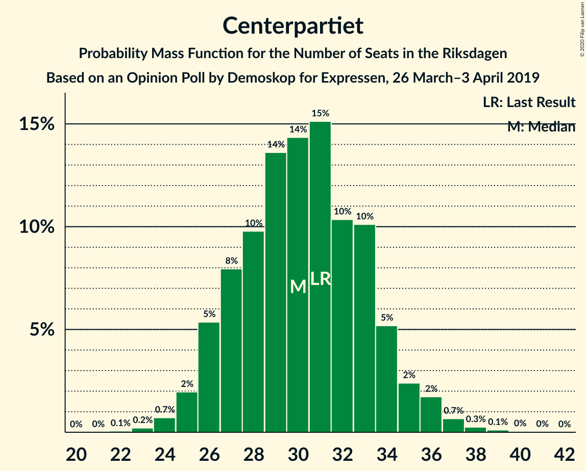
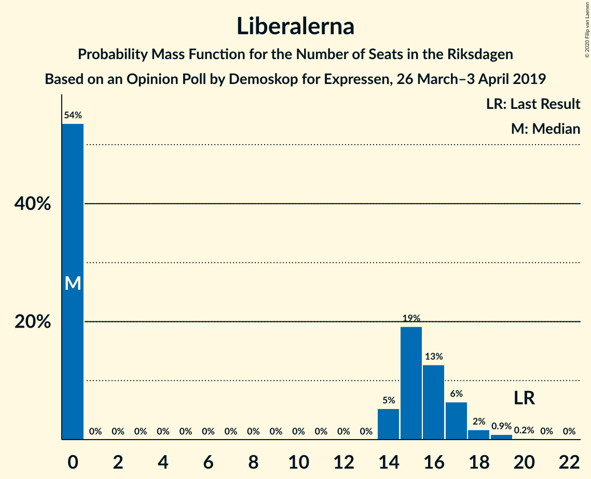
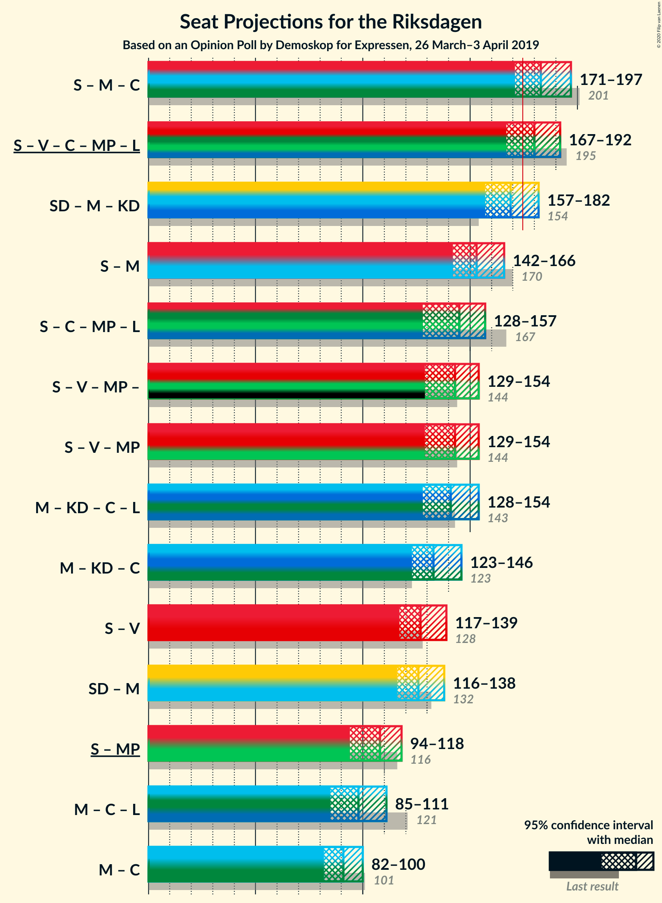
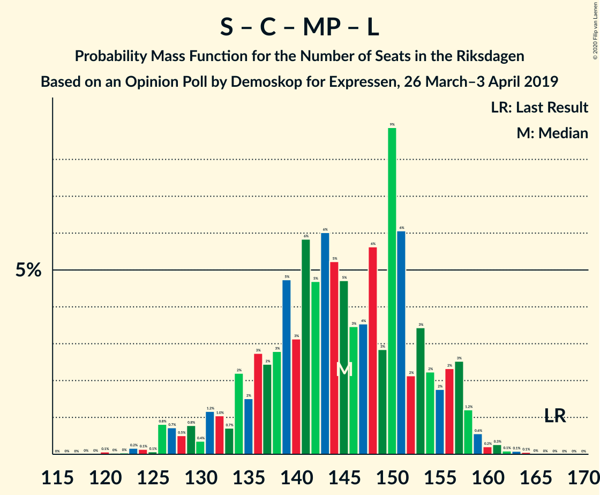
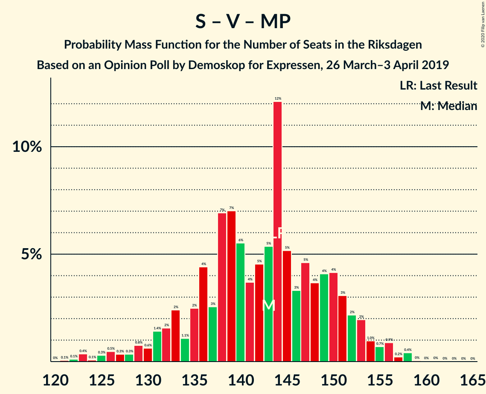

# Opinion Poll by Demoskop for Expressen, 26 March–3 April 2019

<a href="#voting-intentions">Voting Intentions</a> | <a href="#seats">Seats</a> | <a href="#coalitions">Coalitions</a> | <a href="#technical-information">Technical Information</a>

## Voting Intentions

### Confidence Intervals

| Party | Last Result | Poll Result | 80% Confidence Interval | 90% Confidence Interval | 95% Confidence Interval | 99% Confidence Interval |
|:-----:|:-----------:|:-----------:|:-----------------------:|:-----------------------:|:-----------------------:|:-----------------------:|
| Sveriges socialdemokratiska arbetareparti | 28.3% | 25.4% | 24.0–26.8% |23.6–27.2% |23.3–27.6% |22.7–28.3% |
| Sverigedemokraterna | 17.5% | 18.0% | 16.8–19.3% |16.5–19.6% |16.2–20.0% |15.7–20.6% |
| Moderata samlingspartiet | 19.8% | 16.6% | 15.4–17.8% |15.1–18.2% |14.8–18.5% |14.3–19.1% |
| Kristdemokraterna | 6.3% | 11.7% | 10.7–12.8% |10.4–13.1% |10.2–13.4% |9.8–13.9% |
| Vänsterpartiet | 8.0% | 9.6% | 8.7–10.6% |8.5–10.9% |8.2–11.1% |7.8–11.6% |
| Centerpartiet | 8.6% | 8.2% | 7.4–9.2% |7.2–9.4% |7.0–9.7% |6.6–10.2% |
| Miljöpartiet de gröna | 4.4% | 4.5% | 3.9–5.3% |3.7–5.5% |3.6–5.7% |3.3–6.0% |
| Liberalerna | 5.5% | 3.9% | 3.3–4.6% |3.2–4.8% |3.0–5.0% |2.8–5.3% |

*Note:* The poll result column reflects the actual value used in the calculations. Published results may vary slightly, and in addition be rounded to fewer digits.

## Seats

### Confidence Intervals

| Party | Last Result | Median | 80% Confidence Interval | 90% Confidence Interval | 95% Confidence Interval | 99% Confidence Interval |
|:-----:|:-----------:|:------:|:-----------------------:|:-----------------------:|:-----------------------:|:-----------------------:|
| <a href="#sveriges-socialdemokratiska-arbetareparti">Sveriges socialdemokratiska arbetareparti</a> | 100 | 91 | 87–98 |85–100 |84–103 |81–106 |
| <a href="#sverigedemokraterna">Sverigedemokraterna</a> | 62 | 66 | 61–71 |59–72 |59–72 |55–77 |
| <a href="#moderata-samlingspartiet">Moderata samlingspartiet</a> | 70 | 60 | 56–65 |55–67 |54–68 |52–71 |
| <a href="#kristdemokraterna">Kristdemokraterna</a> | 22 | 43 | 39–47 |38–47 |37–48 |35–53 |
| <a href="#vänsterpartiet">Vänsterpartiet</a> | 28 | 36 | 31–38 |31–40 |30–40 |28–42 |
| <a href="#centerpartiet">Centerpartiet</a> | 31 | 31 | 26–33 |26–34 |26–35 |24–37 |
| <a href="#miljöpartiet-de-gröna">Miljöpartiet de gröna</a> | 16 | 17 | 0–19 |0–19 |0–20 |0–22 |
| <a href="#liberalerna">Liberalerna</a> | 20 | 0 | 0–17 |0–17 |0–17 |0–19 |

### Sveriges socialdemokratiska arbetareparti

*For a full overview of the results for this party, see the [Sveriges socialdemokratiska arbetareparti](party-sverigessocialdemokratiskaarbetareparti.html) page.*

| Number of Seats | Probability | Accumulated | Special Marks |
|:---------------:|:-----------:|:-----------:|:-------------:|
| 78 | 0% | 100% |  |
| 79 | 0.4% | 99.9% |  |
| 80 | 0.1% | 99.6% |  |
| 81 | 0.1% | 99.5% |  |
| 82 | 0.2% | 99.4% |  |
| 83 | 0.8% | 99.2% |  |
| 84 | 2% | 98% |  |
| 85 | 2% | 96% |  |
| 86 | 1.4% | 94% |  |
| 87 | 7% | 92% |  |
| 88 | 3% | 85% |  |
| 89 | 7% | 82% |  |
| 90 | 11% | 75% |  |
| 91 | 21% | 64% | Median |
| 92 | 4% | 43% |  |
| 93 | 11% | 39% |  |
| 94 | 2% | 28% |  |
| 95 | 5% | 26% |  |
| 96 | 4% | 21% |  |
| 97 | 6% | 17% |  |
| 98 | 1.4% | 11% |  |
| 99 | 2% | 10% |  |
| 100 | 4% | 8% | Last Result |
| 101 | 0.2% | 3% |  |
| 102 | 0.3% | 3% |  |
| 103 | 0.7% | 3% |  |
| 104 | 0.3% | 2% |  |
| 105 | 0% | 2% |  |
| 106 | 2% | 2% |  |
| 107 | 0% | 0.1% |  |
| 108 | 0% | 0.1% |  |
| 109 | 0% | 0.1% |  |
| 110 | 0% | 0% |  |

### Sverigedemokraterna

*For a full overview of the results for this party, see the [Sverigedemokraterna](party-sverigedemokraterna.html) page.*

| Number of Seats | Probability | Accumulated | Special Marks |
|:---------------:|:-----------:|:-----------:|:-------------:|
| 55 | 0.5% | 100% |  |
| 56 | 0.2% | 99.4% |  |
| 57 | 0.4% | 99.2% |  |
| 58 | 0.2% | 98.8% |  |
| 59 | 5% | 98.6% |  |
| 60 | 2% | 94% |  |
| 61 | 5% | 92% |  |
| 62 | 6% | 87% | Last Result |
| 63 | 8% | 81% |  |
| 64 | 20% | 74% |  |
| 65 | 3% | 53% |  |
| 66 | 3% | 50% | Median |
| 67 | 22% | 47% |  |
| 68 | 6% | 25% |  |
| 69 | 5% | 19% |  |
| 70 | 1.1% | 14% |  |
| 71 | 5% | 13% |  |
| 72 | 6% | 8% |  |
| 73 | 1.0% | 2% |  |
| 74 | 0.1% | 1.0% |  |
| 75 | 0.2% | 0.9% |  |
| 76 | 0.2% | 0.7% |  |
| 77 | 0.4% | 0.5% |  |
| 78 | 0% | 0.2% |  |
| 79 | 0% | 0.1% |  |
| 80 | 0% | 0.1% |  |
| 81 | 0.1% | 0.1% |  |
| 82 | 0% | 0% |  |

### Moderata samlingspartiet

*For a full overview of the results for this party, see the [Moderata samlingspartiet](party-moderatasamlingspartiet.html) page.*

| Number of Seats | Probability | Accumulated | Special Marks |
|:---------------:|:-----------:|:-----------:|:-------------:|
| 50 | 0% | 100% |  |
| 51 | 0.1% | 99.9% |  |
| 52 | 0.7% | 99.8% |  |
| 53 | 1.4% | 99.1% |  |
| 54 | 0.9% | 98% |  |
| 55 | 5% | 97% |  |
| 56 | 3% | 92% |  |
| 57 | 6% | 88% |  |
| 58 | 3% | 82% |  |
| 59 | 12% | 79% |  |
| 60 | 21% | 68% | Median |
| 61 | 5% | 47% |  |
| 62 | 6% | 42% |  |
| 63 | 20% | 36% |  |
| 64 | 5% | 16% |  |
| 65 | 2% | 11% |  |
| 66 | 0.7% | 9% |  |
| 67 | 5% | 8% |  |
| 68 | 0.9% | 3% |  |
| 69 | 0.5% | 2% |  |
| 70 | 0.5% | 1.3% | Last Result |
| 71 | 0.4% | 0.7% |  |
| 72 | 0.3% | 0.4% |  |
| 73 | 0.1% | 0.1% |  |
| 74 | 0% | 0.1% |  |
| 75 | 0% | 0% |  |

### Kristdemokraterna

*For a full overview of the results for this party, see the [Kristdemokraterna](party-kristdemokraterna.html) page.*

| Number of Seats | Probability | Accumulated | Special Marks |
|:---------------:|:-----------:|:-----------:|:-------------:|
| 22 | 0% | 100% | Last Result |
| 23 | 0% | 100% |  |
| 24 | 0% | 100% |  |
| 25 | 0% | 100% |  |
| 26 | 0% | 100% |  |
| 27 | 0% | 100% |  |
| 28 | 0% | 100% |  |
| 29 | 0% | 100% |  |
| 30 | 0% | 100% |  |
| 31 | 0% | 100% |  |
| 32 | 0% | 100% |  |
| 33 | 0% | 100% |  |
| 34 | 0.2% | 100% |  |
| 35 | 0.6% | 99.8% |  |
| 36 | 0.8% | 99.2% |  |
| 37 | 1.2% | 98% |  |
| 38 | 5% | 97% |  |
| 39 | 6% | 93% |  |
| 40 | 5% | 87% |  |
| 41 | 12% | 82% |  |
| 42 | 12% | 70% |  |
| 43 | 10% | 58% | Median |
| 44 | 6% | 48% |  |
| 45 | 21% | 42% |  |
| 46 | 8% | 21% |  |
| 47 | 10% | 13% |  |
| 48 | 1.3% | 3% |  |
| 49 | 0.8% | 2% |  |
| 50 | 0.4% | 1.3% |  |
| 51 | 0.1% | 0.9% |  |
| 52 | 0.3% | 0.8% |  |
| 53 | 0.2% | 0.5% |  |
| 54 | 0.3% | 0.3% |  |
| 55 | 0% | 0% |  |

### Vänsterpartiet

*For a full overview of the results for this party, see the [Vänsterpartiet](party-vänsterpartiet.html) page.*

| Number of Seats | Probability | Accumulated | Special Marks |
|:---------------:|:-----------:|:-----------:|:-------------:|
| 26 | 0.1% | 100% |  |
| 27 | 0.1% | 99.9% |  |
| 28 | 0.6% | 99.9% | Last Result |
| 29 | 1.3% | 99.2% |  |
| 30 | 2% | 98% |  |
| 31 | 9% | 96% |  |
| 32 | 12% | 88% |  |
| 33 | 8% | 76% |  |
| 34 | 9% | 68% |  |
| 35 | 7% | 58% |  |
| 36 | 24% | 51% | Median |
| 37 | 16% | 28% |  |
| 38 | 3% | 12% |  |
| 39 | 3% | 9% |  |
| 40 | 4% | 6% |  |
| 41 | 0.7% | 2% |  |
| 42 | 0.9% | 1.2% |  |
| 43 | 0.1% | 0.3% |  |
| 44 | 0.1% | 0.2% |  |
| 45 | 0.1% | 0.1% |  |
| 46 | 0% | 0% |  |

### Centerpartiet

*For a full overview of the results for this party, see the [Centerpartiet](party-centerpartiet.html) page.*

| Number of Seats | Probability | Accumulated | Special Marks |
|:---------------:|:-----------:|:-----------:|:-------------:|
| 22 | 0.1% | 100% |  |
| 23 | 0.2% | 99.9% |  |
| 24 | 0.3% | 99.7% |  |
| 25 | 1.2% | 99.5% |  |
| 26 | 11% | 98% |  |
| 27 | 8% | 87% |  |
| 28 | 8% | 79% |  |
| 29 | 9% | 72% |  |
| 30 | 12% | 63% |  |
| 31 | 13% | 51% | Last Result, Median |
| 32 | 7% | 37% |  |
| 33 | 24% | 30% |  |
| 34 | 3% | 7% |  |
| 35 | 2% | 4% |  |
| 36 | 0.7% | 2% |  |
| 37 | 0.6% | 1.0% |  |
| 38 | 0.1% | 0.4% |  |
| 39 | 0.2% | 0.2% |  |
| 40 | 0% | 0.1% |  |
| 41 | 0% | 0% |  |

### Miljöpartiet de gröna

*For a full overview of the results for this party, see the [Miljöpartiet de gröna](party-miljöpartietdegröna.html) page.*

| Number of Seats | Probability | Accumulated | Special Marks |
|:---------------:|:-----------:|:-----------:|:-------------:|
| 0 | 11% | 100% |  |
| 1 | 0% | 89% |  |
| 2 | 0% | 89% |  |
| 3 | 0% | 89% |  |
| 4 | 0% | 89% |  |
| 5 | 0% | 89% |  |
| 6 | 0% | 89% |  |
| 7 | 0% | 89% |  |
| 8 | 0% | 89% |  |
| 9 | 0% | 89% |  |
| 10 | 0% | 89% |  |
| 11 | 0% | 89% |  |
| 12 | 0% | 89% |  |
| 13 | 0% | 89% |  |
| 14 | 3% | 89% |  |
| 15 | 10% | 86% |  |
| 16 | 15% | 76% | Last Result |
| 17 | 34% | 61% | Median |
| 18 | 14% | 27% |  |
| 19 | 9% | 13% |  |
| 20 | 2% | 4% |  |
| 21 | 2% | 2% |  |
| 22 | 0.3% | 0.6% |  |
| 23 | 0.2% | 0.2% |  |
| 24 | 0% | 0% |  |

### Liberalerna

*For a full overview of the results for this party, see the [Liberalerna](party-liberalerna.html) page.*

| Number of Seats | Probability | Accumulated | Special Marks |
|:---------------:|:-----------:|:-----------:|:-------------:|
| 0 | 55% | 100% | Median |
| 1 | 0% | 45% |  |
| 2 | 0% | 45% |  |
| 3 | 0% | 45% |  |
| 4 | 0% | 45% |  |
| 5 | 0% | 45% |  |
| 6 | 0% | 45% |  |
| 7 | 0% | 45% |  |
| 8 | 0% | 45% |  |
| 9 | 0% | 45% |  |
| 10 | 0% | 45% |  |
| 11 | 0% | 45% |  |
| 12 | 0% | 45% |  |
| 13 | 0% | 45% |  |
| 14 | 5% | 45% |  |
| 15 | 19% | 40% |  |
| 16 | 8% | 20% |  |
| 17 | 11% | 13% |  |
| 18 | 0.9% | 2% |  |
| 19 | 0.5% | 0.7% |  |
| 20 | 0.2% | 0.2% | Last Result |
| 21 | 0% | 0% |  |

## Coalitions

### Confidence Intervals

| Coalition | Last Result | Median | Majority? | 80% Confidence Interval | 90% Confidence Interval | 95% Confidence Interval | 99% Confidence Interval |
|:---------:|:-----------:|:------:|:---------:|:-----------------------:|:-----------------------:|:-----------------------:|:-----------------------:|
| Sveriges socialdemokratiska arbetareparti – Moderata samlingspartiet – Centerpartiet | 201 | 184 | 94% | 176–192 | 172–194 | 171–198 | 168–203 |
| Sveriges socialdemokratiska arbetareparti – Vänsterpartiet – Centerpartiet – Miljöpartiet de gröna – Liberalerna | 195 | 179 | 85% | 172–188 | 168–190 | 168–193 | 162–195 |
| Sverigedemokraterna – Moderata samlingspartiet – Kristdemokraterna | 154 | 170 | 15% | 161–177 | 159–181 | 156–181 | 154–187 |
| Sveriges socialdemokratiska arbetareparti – Moderata samlingspartiet | 170 | 152 | 0% | 145–161 | 144–163 | 144–166 | 138–173 |
| Sveriges socialdemokratiska arbetareparti – Centerpartiet – Miljöpartiet de gröna – Liberalerna | 167 | 143 | 0% | 135–154 | 131–156 | 131–156 | 126–161 |
| Sveriges socialdemokratiska arbetareparti – Vänsterpartiet – Miljöpartiet de gröna | 144 | 143 | 0% | 135–149 | 133–151 | 131–153 | 127–154 |
| Moderata samlingspartiet – Kristdemokraterna – Centerpartiet – Liberalerna | 143 | 140 | 0% | 133–149 | 129–152 | 129–152 | 126–157 |
| Moderata samlingspartiet – Kristdemokraterna – Centerpartiet | 123 | 135 | 0% | 128–140 | 124–142 | 124–143 | 121–149 |
| Sveriges socialdemokratiska arbetareparti – Vänsterpartiet | 128 | 127 | 0% | 120–135 | 119–137 | 117–139 | 114–141 |
| Sverigedemokraterna – Moderata samlingspartiet | 132 | 127 | 0% | 118–133 | 118–135 | 116–137 | 113–142 |
| Sveriges socialdemokratiska arbetareparti – Miljöpartiet de gröna | 116 | 108 | 0% | 100–114 | 98–115 | 95–116 | 91–119 |
| Moderata samlingspartiet – Centerpartiet – Liberalerna | 121 | 97 | 0% | 89–107 | 89–110 | 86–111 | 83–114 |
| Moderata samlingspartiet – Centerpartiet | 101 | 92 | 0% | 86–96 | 84–97 | 82–99 | 80–105 |

### Sveriges socialdemokratiska arbetareparti – Moderata samlingspartiet – Centerpartiet

| Number of Seats | Probability | Accumulated | Special Marks |
|:---------------:|:-----------:|:-----------:|:-------------:|
| 166 | 0.1% | 100% |  |
| 167 | 0% | 99.9% |  |
| 168 | 0.5% | 99.9% |  |
| 169 | 0.2% | 99.4% |  |
| 170 | 0.9% | 99.2% |  |
| 171 | 3% | 98% |  |
| 172 | 0.5% | 95% |  |
| 173 | 0.2% | 95% |  |
| 174 | 0.6% | 95% |  |
| 175 | 0.4% | 94% | Majority |
| 176 | 6% | 94% |  |
| 177 | 2% | 88% |  |
| 178 | 7% | 86% |  |
| 179 | 10% | 79% |  |
| 180 | 2% | 68% |  |
| 181 | 7% | 67% |  |
| 182 | 7% | 60% | Median |
| 183 | 2% | 53% |  |
| 184 | 18% | 50% |  |
| 185 | 6% | 32% |  |
| 186 | 6% | 26% |  |
| 187 | 2% | 19% |  |
| 188 | 0.5% | 17% |  |
| 189 | 1.1% | 17% |  |
| 190 | 1.0% | 16% |  |
| 191 | 4% | 15% |  |
| 192 | 1.4% | 11% |  |
| 193 | 1.0% | 10% |  |
| 194 | 5% | 9% |  |
| 195 | 0.5% | 4% |  |
| 196 | 0.2% | 3% |  |
| 197 | 0.3% | 3% |  |
| 198 | 0.2% | 3% |  |
| 199 | 0.3% | 2% |  |
| 200 | 0.2% | 2% |  |
| 201 | 0.2% | 2% | Last Result |
| 202 | 0.1% | 2% |  |
| 203 | 1.3% | 2% |  |
| 204 | 0.1% | 0.2% |  |
| 205 | 0.2% | 0.2% |  |
| 206 | 0% | 0% |  |

### Sveriges socialdemokratiska arbetareparti – Vänsterpartiet – Centerpartiet – Miljöpartiet de gröna – Liberalerna

| Number of Seats | Probability | Accumulated | Special Marks |
|:---------------:|:-----------:|:-----------:|:-------------:|
| 159 | 0% | 100% |  |
| 160 | 0.1% | 99.9% |  |
| 161 | 0.2% | 99.8% |  |
| 162 | 0.2% | 99.6% |  |
| 163 | 0.1% | 99.4% |  |
| 164 | 0.2% | 99.3% |  |
| 165 | 0.3% | 99.1% |  |
| 166 | 0.5% | 98.8% |  |
| 167 | 0.4% | 98% |  |
| 168 | 4% | 98% |  |
| 169 | 1.3% | 93% |  |
| 170 | 0.3% | 92% |  |
| 171 | 2% | 92% |  |
| 172 | 4% | 90% |  |
| 173 | 0.8% | 86% |  |
| 174 | 0.7% | 85% |  |
| 175 | 1.4% | 85% | Median, Majority |
| 176 | 6% | 83% |  |
| 177 | 20% | 77% |  |
| 178 | 5% | 58% |  |
| 179 | 7% | 53% |  |
| 180 | 10% | 45% |  |
| 181 | 5% | 35% |  |
| 182 | 3% | 30% |  |
| 183 | 4% | 27% |  |
| 184 | 3% | 23% |  |
| 185 | 2% | 20% |  |
| 186 | 3% | 18% |  |
| 187 | 4% | 16% |  |
| 188 | 1.4% | 11% |  |
| 189 | 2% | 10% |  |
| 190 | 3% | 8% |  |
| 191 | 0.7% | 5% |  |
| 192 | 0.2% | 4% |  |
| 193 | 3% | 4% |  |
| 194 | 0.2% | 1.0% |  |
| 195 | 0.5% | 0.8% | Last Result |
| 196 | 0.1% | 0.3% |  |
| 197 | 0.1% | 0.2% |  |
| 198 | 0.1% | 0.1% |  |
| 199 | 0% | 0% |  |

### Sverigedemokraterna – Moderata samlingspartiet – Kristdemokraterna

| Number of Seats | Probability | Accumulated | Special Marks |
|:---------------:|:-----------:|:-----------:|:-------------:|
| 151 | 0.1% | 100% |  |
| 152 | 0.1% | 99.9% |  |
| 153 | 0.1% | 99.8% |  |
| 154 | 0.5% | 99.7% | Last Result |
| 155 | 0.2% | 99.2% |  |
| 156 | 3% | 99.0% |  |
| 157 | 0.2% | 96% |  |
| 158 | 0.7% | 96% |  |
| 159 | 3% | 95% |  |
| 160 | 2% | 92% |  |
| 161 | 1.4% | 90% |  |
| 162 | 4% | 89% |  |
| 163 | 3% | 84% |  |
| 164 | 2% | 82% |  |
| 165 | 3% | 80% |  |
| 166 | 4% | 77% |  |
| 167 | 3% | 73% |  |
| 168 | 5% | 70% |  |
| 169 | 10% | 65% | Median |
| 170 | 7% | 55% |  |
| 171 | 5% | 47% |  |
| 172 | 20% | 42% |  |
| 173 | 6% | 23% |  |
| 174 | 1.4% | 17% |  |
| 175 | 0.7% | 15% | Majority |
| 176 | 0.8% | 15% |  |
| 177 | 4% | 14% |  |
| 178 | 2% | 10% |  |
| 179 | 0.3% | 8% |  |
| 180 | 1.3% | 8% |  |
| 181 | 4% | 7% |  |
| 182 | 0.4% | 2% |  |
| 183 | 0.5% | 2% |  |
| 184 | 0.3% | 1.2% |  |
| 185 | 0.2% | 0.9% |  |
| 186 | 0.1% | 0.7% |  |
| 187 | 0.2% | 0.6% |  |
| 188 | 0.2% | 0.4% |  |
| 189 | 0.1% | 0.2% |  |
| 190 | 0% | 0.1% |  |
| 191 | 0% | 0% |  |

### Sveriges socialdemokratiska arbetareparti – Moderata samlingspartiet

| Number of Seats | Probability | Accumulated | Special Marks |
|:---------------:|:-----------:|:-----------:|:-------------:|
| 136 | 0% | 100% |  |
| 137 | 0.1% | 99.9% |  |
| 138 | 0.4% | 99.8% |  |
| 139 | 0.1% | 99.5% |  |
| 140 | 0.2% | 99.4% |  |
| 141 | 0.1% | 99.2% |  |
| 142 | 0.5% | 99.1% |  |
| 143 | 0.9% | 98.6% |  |
| 144 | 8% | 98% |  |
| 145 | 1.3% | 90% |  |
| 146 | 2% | 89% |  |
| 147 | 2% | 87% |  |
| 148 | 0.7% | 85% |  |
| 149 | 4% | 84% |  |
| 150 | 8% | 79% |  |
| 151 | 19% | 72% | Median |
| 152 | 13% | 53% |  |
| 153 | 11% | 40% |  |
| 154 | 1.0% | 29% |  |
| 155 | 1.4% | 28% |  |
| 156 | 0.8% | 27% |  |
| 157 | 3% | 26% |  |
| 158 | 6% | 23% |  |
| 159 | 5% | 17% |  |
| 160 | 2% | 12% |  |
| 161 | 1.2% | 10% |  |
| 162 | 0.6% | 9% |  |
| 163 | 5% | 8% |  |
| 164 | 0.4% | 4% |  |
| 165 | 0.6% | 3% |  |
| 166 | 0.6% | 3% |  |
| 167 | 0% | 2% |  |
| 168 | 0.1% | 2% |  |
| 169 | 0.2% | 2% |  |
| 170 | 0.1% | 2% | Last Result |
| 171 | 0.3% | 2% |  |
| 172 | 0% | 1.4% |  |
| 173 | 1.3% | 1.4% |  |
| 174 | 0% | 0% |  |

### Sveriges socialdemokratiska arbetareparti – Centerpartiet – Miljöpartiet de gröna – Liberalerna

| Number of Seats | Probability | Accumulated | Special Marks |
|:---------------:|:-----------:|:-----------:|:-------------:|
| 122 | 0% | 100% |  |
| 123 | 0.1% | 99.9% |  |
| 124 | 0% | 99.9% |  |
| 125 | 0.1% | 99.9% |  |
| 126 | 0.4% | 99.7% |  |
| 127 | 0% | 99.3% |  |
| 128 | 0.2% | 99.3% |  |
| 129 | 0.3% | 99.0% |  |
| 130 | 0.5% | 98.7% |  |
| 131 | 4% | 98% |  |
| 132 | 0.3% | 94% |  |
| 133 | 0.3% | 94% |  |
| 134 | 0.8% | 93% |  |
| 135 | 3% | 92% |  |
| 136 | 3% | 89% |  |
| 137 | 1.3% | 86% |  |
| 138 | 1.4% | 84% |  |
| 139 | 0.2% | 83% | Median |
| 140 | 1.3% | 83% |  |
| 141 | 17% | 81% |  |
| 142 | 12% | 64% |  |
| 143 | 4% | 52% |  |
| 144 | 1.5% | 48% |  |
| 145 | 2% | 47% |  |
| 146 | 5% | 44% |  |
| 147 | 1.4% | 39% |  |
| 148 | 10% | 38% |  |
| 149 | 2% | 28% |  |
| 150 | 4% | 27% |  |
| 151 | 3% | 22% |  |
| 152 | 2% | 19% |  |
| 153 | 6% | 16% |  |
| 154 | 0.8% | 10% |  |
| 155 | 0.5% | 9% |  |
| 156 | 7% | 9% |  |
| 157 | 0.3% | 2% |  |
| 158 | 0.7% | 2% |  |
| 159 | 0.4% | 1.2% |  |
| 160 | 0.1% | 0.8% |  |
| 161 | 0.4% | 0.7% |  |
| 162 | 0.1% | 0.3% |  |
| 163 | 0.1% | 0.2% |  |
| 164 | 0.1% | 0.1% |  |
| 165 | 0% | 0% |  |
| 166 | 0% | 0% |  |
| 167 | 0% | 0% | Last Result |

### Sveriges socialdemokratiska arbetareparti – Vänsterpartiet – Miljöpartiet de gröna

| Number of Seats | Probability | Accumulated | Special Marks |
|:---------------:|:-----------:|:-----------:|:-------------:|
| 122 | 0.1% | 100% |  |
| 123 | 0.1% | 99.8% |  |
| 124 | 0% | 99.8% |  |
| 125 | 0.1% | 99.7% |  |
| 126 | 0.1% | 99.7% |  |
| 127 | 0.3% | 99.5% |  |
| 128 | 0.2% | 99.3% |  |
| 129 | 0.2% | 99.0% |  |
| 130 | 0.5% | 98.8% |  |
| 131 | 1.4% | 98% |  |
| 132 | 0.4% | 97% |  |
| 133 | 5% | 96% |  |
| 134 | 0.6% | 91% |  |
| 135 | 5% | 91% |  |
| 136 | 0.5% | 86% |  |
| 137 | 5% | 85% |  |
| 138 | 3% | 80% |  |
| 139 | 11% | 77% |  |
| 140 | 6% | 66% |  |
| 141 | 8% | 60% |  |
| 142 | 0.8% | 53% |  |
| 143 | 5% | 52% |  |
| 144 | 21% | 47% | Last Result, Median |
| 145 | 2% | 26% |  |
| 146 | 2% | 24% |  |
| 147 | 0.7% | 22% |  |
| 148 | 3% | 21% |  |
| 149 | 11% | 19% |  |
| 150 | 0.5% | 8% |  |
| 151 | 3% | 7% |  |
| 152 | 0.6% | 4% |  |
| 153 | 2% | 3% |  |
| 154 | 0.6% | 1.1% |  |
| 155 | 0% | 0.5% |  |
| 156 | 0.1% | 0.4% |  |
| 157 | 0.2% | 0.4% |  |
| 158 | 0% | 0.2% |  |
| 159 | 0% | 0.1% |  |
| 160 | 0% | 0.1% |  |
| 161 | 0% | 0% |  |

### Moderata samlingspartiet – Kristdemokraterna – Centerpartiet – Liberalerna

| Number of Seats | Probability | Accumulated | Special Marks |
|:---------------:|:-----------:|:-----------:|:-------------:|
| 122 | 0.1% | 100% |  |
| 123 | 0% | 99.9% |  |
| 124 | 0.2% | 99.9% |  |
| 125 | 0.1% | 99.7% |  |
| 126 | 0.2% | 99.6% |  |
| 127 | 0.1% | 99.5% |  |
| 128 | 2% | 99.4% |  |
| 129 | 4% | 98% |  |
| 130 | 0.6% | 94% |  |
| 131 | 0.6% | 93% |  |
| 132 | 1.1% | 92% |  |
| 133 | 2% | 91% |  |
| 134 | 1.5% | 90% | Median |
| 135 | 0.6% | 88% |  |
| 136 | 7% | 88% |  |
| 137 | 2% | 81% |  |
| 138 | 17% | 79% |  |
| 139 | 7% | 62% |  |
| 140 | 6% | 55% |  |
| 141 | 1.3% | 49% |  |
| 142 | 6% | 48% |  |
| 143 | 2% | 42% | Last Result |
| 144 | 3% | 39% |  |
| 145 | 11% | 37% |  |
| 146 | 9% | 26% |  |
| 147 | 1.0% | 17% |  |
| 148 | 0.8% | 16% |  |
| 149 | 6% | 15% |  |
| 150 | 1.4% | 9% |  |
| 151 | 0.3% | 7% |  |
| 152 | 5% | 7% |  |
| 153 | 0.4% | 2% |  |
| 154 | 0.5% | 2% |  |
| 155 | 0.5% | 1.4% |  |
| 156 | 0.3% | 0.9% |  |
| 157 | 0.2% | 0.6% |  |
| 158 | 0.2% | 0.4% |  |
| 159 | 0.1% | 0.1% |  |
| 160 | 0% | 0.1% |  |
| 161 | 0% | 0.1% |  |
| 162 | 0% | 0% |  |

### Moderata samlingspartiet – Kristdemokraterna – Centerpartiet

| Number of Seats | Probability | Accumulated | Special Marks |
|:---------------:|:-----------:|:-----------:|:-------------:|
| 117 | 0% | 100% |  |
| 118 | 0% | 99.9% |  |
| 119 | 0.1% | 99.9% |  |
| 120 | 0.1% | 99.9% |  |
| 121 | 0.9% | 99.7% |  |
| 122 | 0.3% | 98.9% |  |
| 123 | 0.4% | 98.6% | Last Result |
| 124 | 3% | 98% |  |
| 125 | 0.6% | 95% |  |
| 126 | 0.3% | 94% |  |
| 127 | 3% | 94% |  |
| 128 | 5% | 91% |  |
| 129 | 9% | 86% |  |
| 130 | 1.4% | 77% |  |
| 131 | 13% | 75% |  |
| 132 | 4% | 63% |  |
| 133 | 2% | 59% |  |
| 134 | 4% | 56% | Median |
| 135 | 6% | 52% |  |
| 136 | 8% | 46% |  |
| 137 | 2% | 39% |  |
| 138 | 17% | 37% |  |
| 139 | 4% | 20% |  |
| 140 | 6% | 16% |  |
| 141 | 0.6% | 9% |  |
| 142 | 5% | 9% |  |
| 143 | 2% | 4% |  |
| 144 | 0.6% | 2% |  |
| 145 | 0.2% | 2% |  |
| 146 | 0.3% | 2% |  |
| 147 | 0.2% | 1.3% |  |
| 148 | 0.1% | 1.1% |  |
| 149 | 0.5% | 0.9% |  |
| 150 | 0% | 0.4% |  |
| 151 | 0.1% | 0.4% |  |
| 152 | 0% | 0.3% |  |
| 153 | 0.1% | 0.3% |  |
| 154 | 0.2% | 0.2% |  |
| 155 | 0% | 0.1% |  |
| 156 | 0% | 0.1% |  |
| 157 | 0% | 0.1% |  |
| 158 | 0.1% | 0.1% |  |
| 159 | 0% | 0% |  |

### Sveriges socialdemokratiska arbetareparti – Vänsterpartiet

| Number of Seats | Probability | Accumulated | Special Marks |
|:---------------:|:-----------:|:-----------:|:-------------:|
| 112 | 0% | 100% |  |
| 113 | 0.1% | 99.9% |  |
| 114 | 0.5% | 99.9% |  |
| 115 | 0.5% | 99.4% |  |
| 116 | 0.7% | 98.9% |  |
| 117 | 1.0% | 98% |  |
| 118 | 2% | 97% |  |
| 119 | 3% | 95% |  |
| 120 | 5% | 92% |  |
| 121 | 2% | 87% |  |
| 122 | 9% | 85% |  |
| 123 | 5% | 75% |  |
| 124 | 9% | 70% |  |
| 125 | 0.6% | 62% |  |
| 126 | 2% | 61% |  |
| 127 | 21% | 60% | Median |
| 128 | 5% | 39% | Last Result |
| 129 | 2% | 34% |  |
| 130 | 8% | 32% |  |
| 131 | 2% | 24% |  |
| 132 | 5% | 21% |  |
| 133 | 5% | 17% |  |
| 134 | 0.6% | 11% |  |
| 135 | 3% | 11% |  |
| 136 | 0.4% | 8% |  |
| 137 | 5% | 8% |  |
| 138 | 0.2% | 3% |  |
| 139 | 0.3% | 3% |  |
| 140 | 0.4% | 2% |  |
| 141 | 2% | 2% |  |
| 142 | 0.1% | 0.3% |  |
| 143 | 0% | 0.2% |  |
| 144 | 0.1% | 0.2% |  |
| 145 | 0% | 0.1% |  |
| 146 | 0% | 0.1% |  |
| 147 | 0% | 0% |  |

### Sverigedemokraterna – Moderata samlingspartiet

| Number of Seats | Probability | Accumulated | Special Marks |
|:---------------:|:-----------:|:-----------:|:-------------:|
| 110 | 0.1% | 100% |  |
| 111 | 0% | 99.9% |  |
| 112 | 0.1% | 99.8% |  |
| 113 | 0.4% | 99.8% |  |
| 114 | 0.2% | 99.4% |  |
| 115 | 0.6% | 99.2% |  |
| 116 | 2% | 98.5% |  |
| 117 | 0.8% | 97% |  |
| 118 | 6% | 96% |  |
| 119 | 2% | 90% |  |
| 120 | 3% | 88% |  |
| 121 | 1.2% | 85% |  |
| 122 | 2% | 84% |  |
| 123 | 11% | 82% |  |
| 124 | 5% | 72% |  |
| 125 | 5% | 66% |  |
| 126 | 3% | 61% | Median |
| 127 | 27% | 58% |  |
| 128 | 2% | 31% |  |
| 129 | 2% | 29% |  |
| 130 | 7% | 27% |  |
| 131 | 7% | 21% |  |
| 132 | 3% | 13% | Last Result |
| 133 | 2% | 11% |  |
| 134 | 0.4% | 9% |  |
| 135 | 5% | 9% |  |
| 136 | 0.5% | 3% |  |
| 137 | 1.4% | 3% |  |
| 138 | 0.4% | 1.4% |  |
| 139 | 0.2% | 0.9% |  |
| 140 | 0% | 0.7% |  |
| 141 | 0% | 0.7% |  |
| 142 | 0.3% | 0.6% |  |
| 143 | 0.1% | 0.3% |  |
| 144 | 0% | 0.2% |  |
| 145 | 0% | 0.2% |  |
| 146 | 0.1% | 0.2% |  |
| 147 | 0% | 0% |  |

### Sveriges socialdemokratiska arbetareparti – Miljöpartiet de gröna

| Number of Seats | Probability | Accumulated | Special Marks |
|:---------------:|:-----------:|:-----------:|:-------------:|
| 86 | 0% | 100% |  |
| 87 | 0% | 99.9% |  |
| 88 | 0.1% | 99.9% |  |
| 89 | 0% | 99.8% |  |
| 90 | 0.2% | 99.8% |  |
| 91 | 0.2% | 99.6% |  |
| 92 | 0.5% | 99.4% |  |
| 93 | 0.1% | 98.9% |  |
| 94 | 0.4% | 98.8% |  |
| 95 | 1.3% | 98% |  |
| 96 | 0.7% | 97% |  |
| 97 | 0.5% | 96% |  |
| 98 | 1.2% | 96% |  |
| 99 | 3% | 95% |  |
| 100 | 5% | 92% |  |
| 101 | 0.8% | 88% |  |
| 102 | 8% | 87% |  |
| 103 | 2% | 79% |  |
| 104 | 2% | 77% |  |
| 105 | 2% | 75% |  |
| 106 | 5% | 73% |  |
| 107 | 15% | 68% |  |
| 108 | 19% | 53% | Median |
| 109 | 8% | 35% |  |
| 110 | 3% | 27% |  |
| 111 | 3% | 24% |  |
| 112 | 7% | 21% |  |
| 113 | 3% | 14% |  |
| 114 | 3% | 11% |  |
| 115 | 6% | 8% |  |
| 116 | 0.6% | 3% | Last Result |
| 117 | 0.7% | 2% |  |
| 118 | 0.2% | 1.4% |  |
| 119 | 0.7% | 1.2% |  |
| 120 | 0.1% | 0.5% |  |
| 121 | 0.1% | 0.4% |  |
| 122 | 0% | 0.3% |  |
| 123 | 0.1% | 0.2% |  |
| 124 | 0% | 0.1% |  |
| 125 | 0.1% | 0.1% |  |
| 126 | 0% | 0% |  |

### Moderata samlingspartiet – Centerpartiet – Liberalerna

| Number of Seats | Probability | Accumulated | Special Marks |
|:---------------:|:-----------:|:-----------:|:-------------:|
| 80 | 0% | 100% |  |
| 81 | 0% | 99.9% |  |
| 82 | 0.3% | 99.9% |  |
| 83 | 0.3% | 99.7% |  |
| 84 | 0.4% | 99.4% |  |
| 85 | 1.2% | 99.0% |  |
| 86 | 0.8% | 98% |  |
| 87 | 0.6% | 97% |  |
| 88 | 0.1% | 96% |  |
| 89 | 11% | 96% |  |
| 90 | 1.2% | 86% |  |
| 91 | 0.8% | 84% | Median |
| 92 | 0.5% | 84% |  |
| 93 | 19% | 83% |  |
| 94 | 6% | 64% |  |
| 95 | 4% | 58% |  |
| 96 | 3% | 54% |  |
| 97 | 3% | 51% |  |
| 98 | 1.3% | 48% |  |
| 99 | 3% | 47% |  |
| 100 | 2% | 44% |  |
| 101 | 6% | 41% |  |
| 102 | 0.7% | 36% |  |
| 103 | 3% | 35% |  |
| 104 | 12% | 32% |  |
| 105 | 2% | 20% |  |
| 106 | 7% | 18% |  |
| 107 | 1.0% | 11% |  |
| 108 | 4% | 10% |  |
| 109 | 0.9% | 6% |  |
| 110 | 0.2% | 5% |  |
| 111 | 4% | 5% |  |
| 112 | 0.6% | 1.4% |  |
| 113 | 0.2% | 0.8% |  |
| 114 | 0.4% | 0.7% |  |
| 115 | 0.1% | 0.2% |  |
| 116 | 0% | 0.1% |  |
| 117 | 0.1% | 0.1% |  |
| 118 | 0% | 0% |  |
| 119 | 0% | 0% |  |
| 120 | 0% | 0% |  |
| 121 | 0% | 0% | Last Result |

### Moderata samlingspartiet – Centerpartiet

| Number of Seats | Probability | Accumulated | Special Marks |
|:---------------:|:-----------:|:-----------:|:-------------:|
| 77 | 0% | 100% |  |
| 78 | 0.1% | 99.9% |  |
| 79 | 0.1% | 99.8% |  |
| 80 | 0.6% | 99.7% |  |
| 81 | 0.1% | 99.2% |  |
| 82 | 2% | 99.0% |  |
| 83 | 0.4% | 97% |  |
| 84 | 3% | 97% |  |
| 85 | 2% | 94% |  |
| 86 | 6% | 92% |  |
| 87 | 6% | 86% |  |
| 88 | 0.9% | 80% |  |
| 89 | 22% | 79% |  |
| 90 | 2% | 58% |  |
| 91 | 3% | 55% | Median |
| 92 | 6% | 52% |  |
| 93 | 21% | 46% |  |
| 94 | 10% | 25% |  |
| 95 | 4% | 15% |  |
| 96 | 3% | 11% |  |
| 97 | 3% | 8% |  |
| 98 | 1.1% | 5% |  |
| 99 | 2% | 4% |  |
| 100 | 0.2% | 2% |  |
| 101 | 0.8% | 2% | Last Result |
| 102 | 0.1% | 1.0% |  |
| 103 | 0.2% | 0.9% |  |
| 104 | 0.1% | 0.7% |  |
| 105 | 0.3% | 0.5% |  |
| 106 | 0% | 0.3% |  |
| 107 | 0.1% | 0.3% |  |
| 108 | 0.1% | 0.1% |  |
| 109 | 0% | 0% |  |

## Technical Information

### Opinion Poll

+ **Polling firm:** Demoskop
+ **Commissioner(s):** Expressen
+ **Fieldwork period:** 26 March–3 April 2019

### Calculations

+ **Sample size:** 1616
+ **Simulations done:** 131,072
+ **Error estimate:** 1.57%

