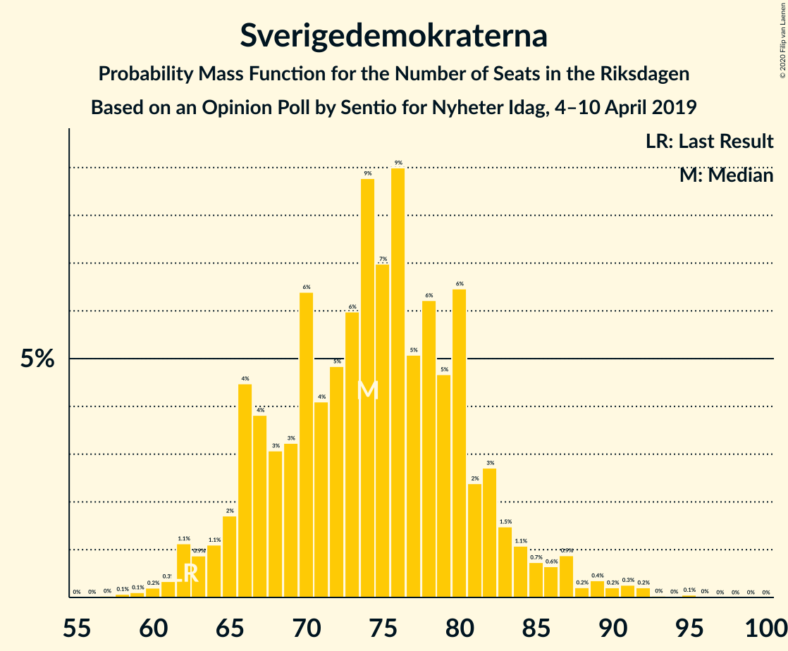
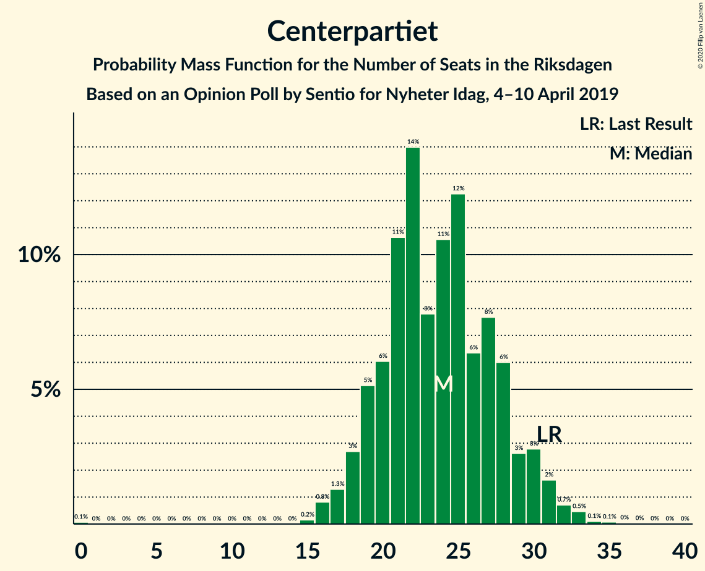
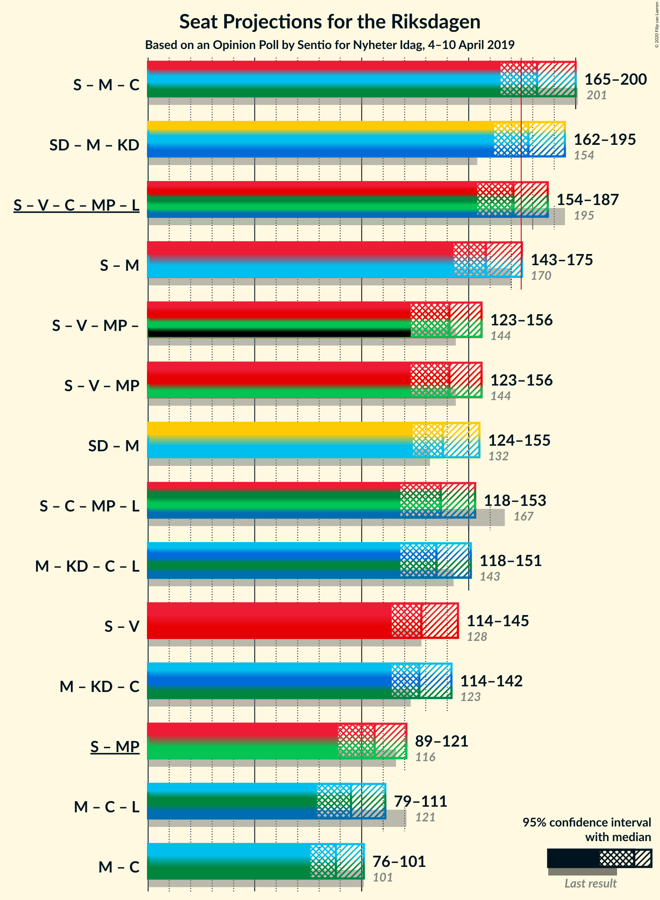
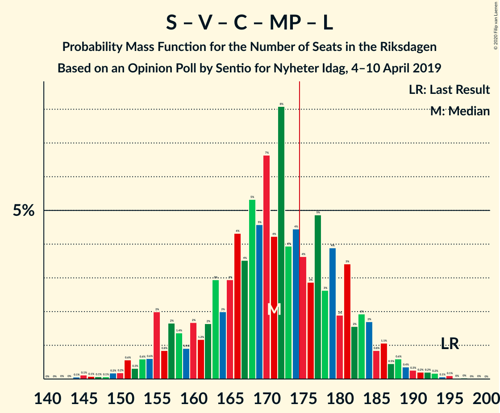
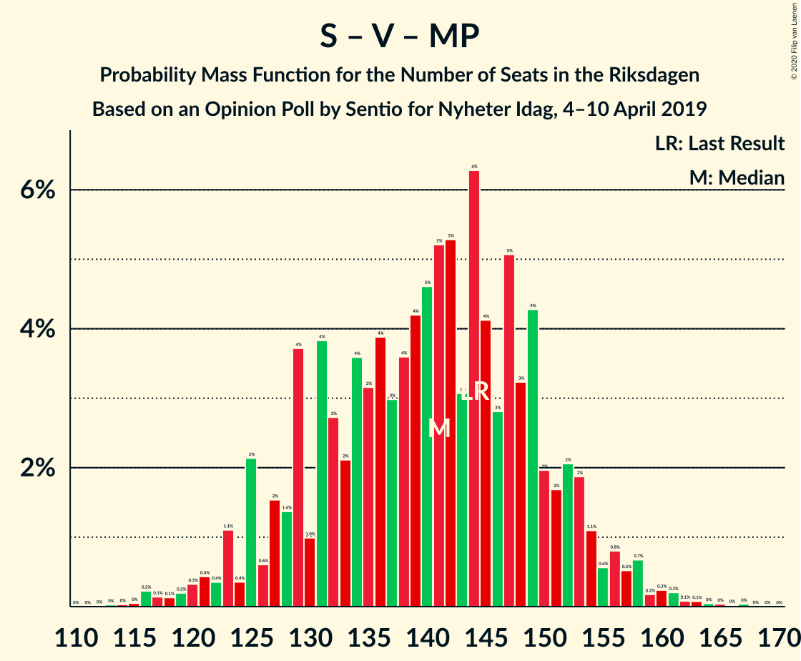

# Opinion Poll by Sentio for Nyheter Idag, 4–10 April 2019

<a href="#voting-intentions">Voting Intentions</a> | <a href="#seats">Seats</a> | <a href="#coalitions">Coalitions</a> | <a href="#technical-information">Technical Information</a>

## Voting Intentions

### Confidence Intervals

| Party | Last Result | Poll Result | 80% Confidence Interval | 90% Confidence Interval | 95% Confidence Interval | 99% Confidence Interval |
|:-----:|:-----------:|:-----------:|:-----------------------:|:-----------------------:|:-----------------------:|:-----------------------:|
| Sveriges socialdemokratiska arbetareparti | 28.3% | 25.6% | 23.7–27.7% |23.1–28.3% |22.7–28.8% |21.8–29.8% |
| Sverigedemokraterna | 17.5% | 20.2% | 18.4–22.1% |17.9–22.6% |17.5–23.1% |16.7–24.1% |
| Moderata samlingspartiet | 19.8% | 17.5% | 15.9–19.3% |15.4–19.8% |15.0–20.3% |14.2–21.2% |
| Kristdemokraterna | 6.3% | 10.6% | 9.3–12.2% |9.0–12.6% |8.7–13.0% |8.1–13.8% |
| Vänsterpartiet | 8.0% | 9.3% | 8.0–10.7% |7.7–11.1% |7.4–11.5% |6.9–12.2% |
| Centerpartiet | 8.6% | 6.3% | 5.3–7.6% |5.1–8.0% |4.8–8.3% |4.4–8.9% |
| Miljöpartiet de gröna | 4.4% | 4.3% | 3.5–5.4% |3.3–5.7% |3.1–6.0% |2.8–6.5% |
| Liberalerna | 5.5% | 3.8% | 3.1–4.8% |2.9–5.1% |2.7–5.4% |2.4–5.9% |

*Note:* The poll result column reflects the actual value used in the calculations. Published results may vary slightly, and in addition be rounded to fewer digits.

## Seats

### Confidence Intervals

| Party | Last Result | Median | 80% Confidence Interval | 90% Confidence Interval | 95% Confidence Interval | 99% Confidence Interval |
|:-----:|:-----------:|:------:|:-----------------------:|:-----------------------:|:-----------------------:|:-----------------------:|
| <a href="#sveriges-socialdemokratiska-arbetareparti">Sveriges socialdemokratiska arbetareparti</a> | 100 | 92 | 86–103 |83–105 |82–107 |79–112 |
| <a href="#sverigedemokraterna">Sverigedemokraterna</a> | 62 | 74 | 67–80 |66–84 |63–86 |60–91 |
| <a href="#moderata-samlingspartiet">Moderata samlingspartiet</a> | 70 | 64 | 59–73 |56–74 |54–75 |52–80 |
| <a href="#kristdemokraterna">Kristdemokraterna</a> | 22 | 40 | 34–45 |33–47 |32–48 |30–52 |
| <a href="#vänsterpartiet">Vänsterpartiet</a> | 28 | 34 | 30–39 |28–41 |27–42 |25–45 |
| <a href="#centerpartiet">Centerpartiet</a> | 31 | 24 | 19–28 |18–28 |17–30 |16–33 |
| <a href="#miljöpartiet-de-gröna">Miljöpartiet de gröna</a> | 16 | 16 | 0–20 |0–22 |0–23 |0–24 |
| <a href="#liberalerna">Liberalerna</a> | 20 | 0 | 0–18 |0–19 |0–20 |0–22 |

### Sveriges socialdemokratiska arbetareparti

*For a full overview of the results for this party, see the [Sveriges socialdemokratiska arbetareparti](party-sverigessocialdemokratiskaarbetareparti.html) page.*

| Number of Seats | Probability | Accumulated | Special Marks |
|:---------------:|:-----------:|:-----------:|:-------------:|
| 74 | 0% | 100% |  |
| 75 | 0.1% | 99.9% |  |
| 76 | 0% | 99.9% |  |
| 77 | 0.1% | 99.8% |  |
| 78 | 0.2% | 99.7% |  |
| 79 | 0.4% | 99.5% |  |
| 80 | 0.2% | 99.2% |  |
| 81 | 0.5% | 99.0% |  |
| 82 | 3% | 98% |  |
| 83 | 1.0% | 96% |  |
| 84 | 2% | 95% |  |
| 85 | 1.4% | 92% |  |
| 86 | 3% | 91% |  |
| 87 | 5% | 88% |  |
| 88 | 9% | 84% |  |
| 89 | 5% | 75% |  |
| 90 | 2% | 70% |  |
| 91 | 8% | 68% |  |
| 92 | 13% | 60% | Median |
| 93 | 4% | 46% |  |
| 94 | 0.8% | 42% |  |
| 95 | 5% | 42% |  |
| 96 | 8% | 37% |  |
| 97 | 3% | 28% |  |
| 98 | 4% | 26% |  |
| 99 | 1.1% | 21% |  |
| 100 | 1.4% | 20% | Last Result |
| 101 | 4% | 19% |  |
| 102 | 4% | 15% |  |
| 103 | 3% | 11% |  |
| 104 | 3% | 8% |  |
| 105 | 2% | 5% |  |
| 106 | 0.2% | 3% |  |
| 107 | 0.9% | 3% |  |
| 108 | 0.5% | 2% |  |
| 109 | 0.1% | 1.4% |  |
| 110 | 0.4% | 1.3% |  |
| 111 | 0.1% | 0.9% |  |
| 112 | 0.7% | 0.8% |  |
| 113 | 0% | 0.1% |  |
| 114 | 0% | 0.1% |  |
| 115 | 0% | 0.1% |  |
| 116 | 0% | 0% |  |

### Sverigedemokraterna

*For a full overview of the results for this party, see the [Sverigedemokraterna](party-sverigedemokraterna.html) page.*

| Number of Seats | Probability | Accumulated | Special Marks |
|:---------------:|:-----------:|:-----------:|:-------------:|
| 58 | 0.1% | 100% |  |
| 59 | 0.3% | 99.9% |  |
| 60 | 0.2% | 99.6% |  |
| 61 | 0.1% | 99.4% |  |
| 62 | 1.3% | 99.3% | Last Result |
| 63 | 0.7% | 98% |  |
| 64 | 2% | 97% |  |
| 65 | 0.3% | 96% |  |
| 66 | 5% | 95% |  |
| 67 | 4% | 91% |  |
| 68 | 3% | 86% |  |
| 69 | 1.3% | 84% |  |
| 70 | 12% | 82% |  |
| 71 | 8% | 71% |  |
| 72 | 2% | 63% |  |
| 73 | 3% | 61% |  |
| 74 | 10% | 59% | Median |
| 75 | 21% | 49% |  |
| 76 | 6% | 28% |  |
| 77 | 0.6% | 22% |  |
| 78 | 2% | 21% |  |
| 79 | 5% | 19% |  |
| 80 | 5% | 15% |  |
| 81 | 0.1% | 10% |  |
| 82 | 2% | 10% |  |
| 83 | 2% | 8% |  |
| 84 | 3% | 6% |  |
| 85 | 0% | 3% |  |
| 86 | 1.1% | 3% |  |
| 87 | 0.7% | 2% |  |
| 88 | 0.3% | 0.9% |  |
| 89 | 0% | 0.7% |  |
| 90 | 0% | 0.7% |  |
| 91 | 0.2% | 0.6% |  |
| 92 | 0.3% | 0.4% |  |
| 93 | 0% | 0.1% |  |
| 94 | 0% | 0.1% |  |
| 95 | 0% | 0.1% |  |
| 96 | 0.1% | 0.1% |  |
| 97 | 0% | 0% |  |

### Moderata samlingspartiet

*For a full overview of the results for this party, see the [Moderata samlingspartiet](party-moderatasamlingspartiet.html) page.*

| Number of Seats | Probability | Accumulated | Special Marks |
|:---------------:|:-----------:|:-----------:|:-------------:|
| 48 | 0% | 100% |  |
| 49 | 0.2% | 99.9% |  |
| 50 | 0.2% | 99.8% |  |
| 51 | 0.1% | 99.6% |  |
| 52 | 0.2% | 99.5% |  |
| 53 | 1.3% | 99.4% |  |
| 54 | 1.4% | 98% |  |
| 55 | 2% | 97% |  |
| 56 | 1.0% | 95% |  |
| 57 | 1.3% | 94% |  |
| 58 | 2% | 93% |  |
| 59 | 2% | 90% |  |
| 60 | 7% | 89% |  |
| 61 | 5% | 81% |  |
| 62 | 15% | 76% |  |
| 63 | 5% | 61% |  |
| 64 | 11% | 56% | Median |
| 65 | 2% | 45% |  |
| 66 | 5% | 43% |  |
| 67 | 10% | 38% |  |
| 68 | 6% | 28% |  |
| 69 | 2% | 22% |  |
| 70 | 4% | 20% | Last Result |
| 71 | 1.5% | 16% |  |
| 72 | 4% | 15% |  |
| 73 | 2% | 11% |  |
| 74 | 5% | 9% |  |
| 75 | 2% | 3% |  |
| 76 | 0.7% | 1.4% |  |
| 77 | 0.1% | 0.8% |  |
| 78 | 0% | 0.6% |  |
| 79 | 0% | 0.6% |  |
| 80 | 0.1% | 0.6% |  |
| 81 | 0.3% | 0.5% |  |
| 82 | 0% | 0.1% |  |
| 83 | 0% | 0.1% |  |
| 84 | 0% | 0% |  |

### Kristdemokraterna

*For a full overview of the results for this party, see the [Kristdemokraterna](party-kristdemokraterna.html) page.*

| Number of Seats | Probability | Accumulated | Special Marks |
|:---------------:|:-----------:|:-----------:|:-------------:|
| 22 | 0% | 100% | Last Result |
| 23 | 0% | 100% |  |
| 24 | 0% | 100% |  |
| 25 | 0% | 100% |  |
| 26 | 0% | 100% |  |
| 27 | 0.2% | 100% |  |
| 28 | 0.1% | 99.8% |  |
| 29 | 0.1% | 99.7% |  |
| 30 | 0.8% | 99.6% |  |
| 31 | 1.2% | 98.8% |  |
| 32 | 0.8% | 98% |  |
| 33 | 5% | 97% |  |
| 34 | 2% | 92% |  |
| 35 | 8% | 89% |  |
| 36 | 8% | 81% |  |
| 37 | 6% | 73% |  |
| 38 | 9% | 67% |  |
| 39 | 6% | 58% |  |
| 40 | 10% | 52% | Median |
| 41 | 8% | 42% |  |
| 42 | 12% | 35% |  |
| 43 | 4% | 23% |  |
| 44 | 1.2% | 19% |  |
| 45 | 11% | 18% |  |
| 46 | 2% | 7% |  |
| 47 | 1.1% | 5% |  |
| 48 | 2% | 4% |  |
| 49 | 0.7% | 2% |  |
| 50 | 0.2% | 2% |  |
| 51 | 0.5% | 1.5% |  |
| 52 | 0.8% | 1.0% |  |
| 53 | 0% | 0.2% |  |
| 54 | 0.1% | 0.1% |  |
| 55 | 0% | 0.1% |  |
| 56 | 0% | 0% |  |

### Vänsterpartiet

*For a full overview of the results for this party, see the [Vänsterpartiet](party-vänsterpartiet.html) page.*

| Number of Seats | Probability | Accumulated | Special Marks |
|:---------------:|:-----------:|:-----------:|:-------------:|
| 23 | 0.2% | 100% |  |
| 24 | 0.1% | 99.8% |  |
| 25 | 0.9% | 99.7% |  |
| 26 | 1.1% | 98.8% |  |
| 27 | 1.4% | 98% |  |
| 28 | 2% | 96% | Last Result |
| 29 | 4% | 94% |  |
| 30 | 10% | 90% |  |
| 31 | 8% | 80% |  |
| 32 | 6% | 72% |  |
| 33 | 12% | 66% |  |
| 34 | 12% | 54% | Median |
| 35 | 5% | 42% |  |
| 36 | 9% | 37% |  |
| 37 | 11% | 28% |  |
| 38 | 6% | 17% |  |
| 39 | 5% | 11% |  |
| 40 | 1.4% | 6% |  |
| 41 | 2% | 5% |  |
| 42 | 1.1% | 3% |  |
| 43 | 0.8% | 2% |  |
| 44 | 0.6% | 1.3% |  |
| 45 | 0.3% | 0.7% |  |
| 46 | 0.1% | 0.4% |  |
| 47 | 0.2% | 0.4% |  |
| 48 | 0.1% | 0.1% |  |
| 49 | 0% | 0% |  |

### Centerpartiet

*For a full overview of the results for this party, see the [Centerpartiet](party-centerpartiet.html) page.*

| Number of Seats | Probability | Accumulated | Special Marks |
|:---------------:|:-----------:|:-----------:|:-------------:|
| 0 | 0.1% | 100% |  |
| 1 | 0% | 99.9% |  |
| 2 | 0% | 99.9% |  |
| 3 | 0% | 99.9% |  |
| 4 | 0% | 99.9% |  |
| 5 | 0% | 99.9% |  |
| 6 | 0% | 99.9% |  |
| 7 | 0% | 99.9% |  |
| 8 | 0% | 99.9% |  |
| 9 | 0% | 99.9% |  |
| 10 | 0% | 99.9% |  |
| 11 | 0% | 99.9% |  |
| 12 | 0% | 99.9% |  |
| 13 | 0% | 99.9% |  |
| 14 | 0% | 99.9% |  |
| 15 | 0.3% | 99.9% |  |
| 16 | 1.3% | 99.7% |  |
| 17 | 3% | 98% |  |
| 18 | 4% | 95% |  |
| 19 | 8% | 91% |  |
| 20 | 6% | 84% |  |
| 21 | 5% | 78% |  |
| 22 | 4% | 73% |  |
| 23 | 7% | 69% |  |
| 24 | 13% | 62% | Median |
| 25 | 12% | 49% |  |
| 26 | 13% | 37% |  |
| 27 | 12% | 24% |  |
| 28 | 7% | 12% |  |
| 29 | 1.4% | 5% |  |
| 30 | 1.4% | 3% |  |
| 31 | 0.4% | 2% | Last Result |
| 32 | 0.6% | 1.5% |  |
| 33 | 0.4% | 0.9% |  |
| 34 | 0.1% | 0.4% |  |
| 35 | 0.2% | 0.4% |  |
| 36 | 0.1% | 0.2% |  |
| 37 | 0.1% | 0.1% |  |
| 38 | 0% | 0% |  |

### Miljöpartiet de gröna

*For a full overview of the results for this party, see the [Miljöpartiet de gröna](party-miljöpartietdegröna.html) page.*

| Number of Seats | Probability | Accumulated | Special Marks |
|:---------------:|:-----------:|:-----------:|:-------------:|
| 0 | 34% | 100% |  |
| 1 | 0% | 66% |  |
| 2 | 0% | 66% |  |
| 3 | 0% | 66% |  |
| 4 | 0% | 66% |  |
| 5 | 0% | 66% |  |
| 6 | 0% | 66% |  |
| 7 | 0% | 66% |  |
| 8 | 0% | 66% |  |
| 9 | 0% | 66% |  |
| 10 | 0% | 66% |  |
| 11 | 0% | 66% |  |
| 12 | 0% | 66% |  |
| 13 | 0% | 66% |  |
| 14 | 2% | 66% |  |
| 15 | 13% | 65% |  |
| 16 | 10% | 51% | Last Result, Median |
| 17 | 6% | 41% |  |
| 18 | 9% | 35% |  |
| 19 | 15% | 26% |  |
| 20 | 1.5% | 11% |  |
| 21 | 3% | 10% |  |
| 22 | 4% | 7% |  |
| 23 | 2% | 3% |  |
| 24 | 0.4% | 0.8% |  |
| 25 | 0.3% | 0.5% |  |
| 26 | 0.2% | 0.2% |  |
| 27 | 0% | 0% |  |

### Liberalerna

*For a full overview of the results for this party, see the [Liberalerna](party-liberalerna.html) page.*

| Number of Seats | Probability | Accumulated | Special Marks |
|:---------------:|:-----------:|:-----------:|:-------------:|
| 0 | 55% | 100% | Median |
| 1 | 0% | 45% |  |
| 2 | 0% | 45% |  |
| 3 | 0% | 45% |  |
| 4 | 0% | 45% |  |
| 5 | 0% | 45% |  |
| 6 | 0% | 45% |  |
| 7 | 0% | 45% |  |
| 8 | 0% | 45% |  |
| 9 | 0% | 45% |  |
| 10 | 0% | 45% |  |
| 11 | 0% | 45% |  |
| 12 | 0% | 45% |  |
| 13 | 0% | 45% |  |
| 14 | 0.7% | 45% |  |
| 15 | 9% | 44% |  |
| 16 | 16% | 35% |  |
| 17 | 6% | 19% |  |
| 18 | 7% | 13% |  |
| 19 | 3% | 6% |  |
| 20 | 1.1% | 3% | Last Result |
| 21 | 0.7% | 2% |  |
| 22 | 0.9% | 1.0% |  |
| 23 | 0.1% | 0.1% |  |
| 24 | 0% | 0.1% |  |
| 25 | 0% | 0% |  |

## Coalitions

### Confidence Intervals

| Coalition | Last Result | Median | Majority? | 80% Confidence Interval | 90% Confidence Interval | 95% Confidence Interval | 99% Confidence Interval |
|:---------:|:-----------:|:------:|:---------:|:-----------------------:|:-----------------------:|:-----------------------:|:-----------------------:|
| Sveriges socialdemokratiska arbetareparti – Moderata samlingspartiet – Centerpartiet | 201 | 181 | 81% | 172–194 | 169–197 | 165–201 | 161–205 |
| Sverigedemokraterna – Moderata samlingspartiet – Kristdemokraterna | 154 | 179 | 69% | 167–187 | 165–189 | 163–195 | 156–200 |
| Sveriges socialdemokratiska arbetareparti – Vänsterpartiet – Centerpartiet – Miljöpartiet de gröna – Liberalerna | 195 | 170 | 31% | 162–182 | 160–184 | 154–186 | 149–193 |
| Sveriges socialdemokratiska arbetareparti – Moderata samlingspartiet | 170 | 157 | 3% | 148–170 | 145–173 | 144–176 | 138–179 |
| Sveriges socialdemokratiska arbetareparti – Vänsterpartiet – Miljöpartiet de gröna | 144 | 141 | 0% | 125–153 | 125–153 | 125–158 | 118–162 |
| Sveriges socialdemokratiska arbetareparti – Centerpartiet – Miljöpartiet de gröna – Liberalerna | 167 | 136 | 0% | 126–148 | 124–150 | 118–155 | 114–159 |
| Sverigedemokraterna – Moderata samlingspartiet | 132 | 139 | 0% | 129–148 | 126–151 | 123–153 | 118–160 |
| Moderata samlingspartiet – Kristdemokraterna – Centerpartiet – Liberalerna | 143 | 136 | 0% | 120–149 | 116–150 | 116–151 | 113–156 |
| Sveriges socialdemokratiska arbetareparti – Vänsterpartiet | 128 | 126 | 0% | 119–138 | 117–142 | 115–142 | 111–149 |
| Moderata samlingspartiet – Kristdemokraterna – Centerpartiet | 123 | 129 | 0% | 117–137 | 115–139 | 114–141 | 109–145 |
| Sveriges socialdemokratiska arbetareparti – Miljöpartiet de gröna | 116 | 106 | 0% | 92–117 | 92–119 | 92–122 | 85–126 |
| Moderata samlingspartiet – Centerpartiet – Liberalerna | 121 | 97 | 0% | 82–107 | 79–110 | 78–112 | 74–114 |
| Moderata samlingspartiet – Centerpartiet | 101 | 89 | 0% | 79–97 | 78–99 | 76–100 | 73–105 |

### Sveriges socialdemokratiska arbetareparti – Moderata samlingspartiet – Centerpartiet

| Number of Seats | Probability | Accumulated | Special Marks |
|:---------------:|:-----------:|:-----------:|:-------------:|
| 157 | 0.1% | 100% |  |
| 158 | 0% | 99.8% |  |
| 159 | 0.1% | 99.8% |  |
| 160 | 0.1% | 99.7% |  |
| 161 | 0.2% | 99.7% |  |
| 162 | 0% | 99.4% |  |
| 163 | 0.4% | 99.4% |  |
| 164 | 0.2% | 99.0% |  |
| 165 | 2% | 98.9% |  |
| 166 | 0.1% | 97% |  |
| 167 | 0.4% | 97% |  |
| 168 | 0.4% | 97% |  |
| 169 | 3% | 96% |  |
| 170 | 2% | 93% |  |
| 171 | 0.6% | 91% |  |
| 172 | 4% | 91% |  |
| 173 | 2% | 87% |  |
| 174 | 4% | 85% |  |
| 175 | 2% | 81% | Majority |
| 176 | 2% | 79% |  |
| 177 | 2% | 77% |  |
| 178 | 6% | 75% |  |
| 179 | 2% | 69% |  |
| 180 | 10% | 66% | Median |
| 181 | 8% | 56% |  |
| 182 | 5% | 48% |  |
| 183 | 4% | 43% |  |
| 184 | 1.0% | 39% |  |
| 185 | 12% | 38% |  |
| 186 | 0.6% | 26% |  |
| 187 | 2% | 26% |  |
| 188 | 0.8% | 24% |  |
| 189 | 3% | 23% |  |
| 190 | 1.4% | 20% |  |
| 191 | 5% | 18% |  |
| 192 | 1.2% | 13% |  |
| 193 | 2% | 12% |  |
| 194 | 3% | 10% |  |
| 195 | 0.9% | 8% |  |
| 196 | 0.9% | 7% |  |
| 197 | 2% | 6% |  |
| 198 | 0.4% | 4% |  |
| 199 | 0.6% | 4% |  |
| 200 | 0.2% | 3% |  |
| 201 | 2% | 3% | Last Result |
| 202 | 0.2% | 1.0% |  |
| 203 | 0% | 0.9% |  |
| 204 | 0.1% | 0.8% |  |
| 205 | 0.5% | 0.7% |  |
| 206 | 0% | 0.2% |  |
| 207 | 0.1% | 0.2% |  |
| 208 | 0% | 0.1% |  |
| 209 | 0% | 0.1% |  |
| 210 | 0% | 0% |  |

### Sverigedemokraterna – Moderata samlingspartiet – Kristdemokraterna

| Number of Seats | Probability | Accumulated | Special Marks |
|:---------------:|:-----------:|:-----------:|:-------------:|
| 154 | 0.1% | 100% | Last Result |
| 155 | 0.1% | 99.9% |  |
| 156 | 0.5% | 99.9% |  |
| 157 | 0.1% | 99.4% |  |
| 158 | 0.4% | 99.3% |  |
| 159 | 0.1% | 98.9% |  |
| 160 | 0.3% | 98.7% |  |
| 161 | 0.7% | 98% |  |
| 162 | 0.1% | 98% |  |
| 163 | 1.2% | 98% |  |
| 164 | 0.8% | 96% |  |
| 165 | 4% | 96% |  |
| 166 | 0.6% | 92% |  |
| 167 | 2% | 91% |  |
| 168 | 0.7% | 90% |  |
| 169 | 3% | 89% |  |
| 170 | 2% | 86% |  |
| 171 | 1.2% | 84% |  |
| 172 | 4% | 82% |  |
| 173 | 2% | 78% |  |
| 174 | 7% | 76% |  |
| 175 | 2% | 69% | Majority |
| 176 | 5% | 67% |  |
| 177 | 9% | 63% |  |
| 178 | 2% | 54% | Median |
| 179 | 13% | 52% |  |
| 180 | 1.4% | 40% |  |
| 181 | 4% | 39% |  |
| 182 | 1.2% | 34% |  |
| 183 | 2% | 33% |  |
| 184 | 12% | 31% |  |
| 185 | 6% | 19% |  |
| 186 | 0.6% | 13% |  |
| 187 | 4% | 13% |  |
| 188 | 0.9% | 9% |  |
| 189 | 3% | 8% |  |
| 190 | 0.3% | 5% |  |
| 191 | 0.1% | 4% |  |
| 192 | 0.3% | 4% |  |
| 193 | 0.2% | 4% |  |
| 194 | 0.4% | 4% |  |
| 195 | 1.2% | 3% |  |
| 196 | 0.1% | 2% |  |
| 197 | 0.1% | 2% |  |
| 198 | 0.8% | 2% |  |
| 199 | 0.2% | 1.1% |  |
| 200 | 0.6% | 0.9% |  |
| 201 | 0% | 0.3% |  |
| 202 | 0% | 0.3% |  |
| 203 | 0% | 0.3% |  |
| 204 | 0.1% | 0.2% |  |
| 205 | 0% | 0.1% |  |
| 206 | 0% | 0.1% |  |
| 207 | 0% | 0.1% |  |
| 208 | 0% | 0.1% |  |
| 209 | 0% | 0% |  |

### Sveriges socialdemokratiska arbetareparti – Vänsterpartiet – Centerpartiet – Miljöpartiet de gröna – Liberalerna

| Number of Seats | Probability | Accumulated | Special Marks |
|:---------------:|:-----------:|:-----------:|:-------------:|
| 141 | 0% | 100% |  |
| 142 | 0% | 99.9% |  |
| 143 | 0% | 99.9% |  |
| 144 | 0% | 99.9% |  |
| 145 | 0.1% | 99.9% |  |
| 146 | 0% | 99.8% |  |
| 147 | 0% | 99.7% |  |
| 148 | 0% | 99.7% |  |
| 149 | 0.6% | 99.7% |  |
| 150 | 0.2% | 99.1% |  |
| 151 | 0.8% | 98.9% |  |
| 152 | 0.1% | 98% |  |
| 153 | 0.1% | 98% |  |
| 154 | 1.2% | 98% |  |
| 155 | 0.4% | 97% |  |
| 156 | 0.2% | 96% |  |
| 157 | 0.4% | 96% |  |
| 158 | 0.1% | 96% |  |
| 159 | 0.3% | 96% |  |
| 160 | 3% | 95% |  |
| 161 | 0.9% | 92% |  |
| 162 | 4% | 91% |  |
| 163 | 0.7% | 87% |  |
| 164 | 6% | 86% |  |
| 165 | 12% | 80% |  |
| 166 | 2% | 69% | Median |
| 167 | 1.2% | 67% |  |
| 168 | 4% | 66% |  |
| 169 | 1.3% | 61% |  |
| 170 | 13% | 60% |  |
| 171 | 2% | 47% |  |
| 172 | 8% | 45% |  |
| 173 | 5% | 37% |  |
| 174 | 2% | 32% |  |
| 175 | 7% | 31% | Majority |
| 176 | 2% | 24% |  |
| 177 | 4% | 21% |  |
| 178 | 1.1% | 17% |  |
| 179 | 2% | 16% |  |
| 180 | 3% | 14% |  |
| 181 | 0.7% | 11% |  |
| 182 | 2% | 10% |  |
| 183 | 0.6% | 8% |  |
| 184 | 4% | 8% |  |
| 185 | 0.8% | 4% |  |
| 186 | 1.2% | 3% |  |
| 187 | 0.1% | 2% |  |
| 188 | 0.6% | 2% |  |
| 189 | 0.3% | 1.5% |  |
| 190 | 0.1% | 1.2% |  |
| 191 | 0.4% | 1.1% |  |
| 192 | 0.1% | 0.7% |  |
| 193 | 0.5% | 0.6% |  |
| 194 | 0% | 0.1% |  |
| 195 | 0.1% | 0.1% | Last Result |
| 196 | 0% | 0% |  |

### Sveriges socialdemokratiska arbetareparti – Moderata samlingspartiet

| Number of Seats | Probability | Accumulated | Special Marks |
|:---------------:|:-----------:|:-----------:|:-------------:|
| 132 | 0% | 100% |  |
| 133 | 0% | 99.9% |  |
| 134 | 0% | 99.9% |  |
| 135 | 0% | 99.9% |  |
| 136 | 0% | 99.9% |  |
| 137 | 0.1% | 99.8% |  |
| 138 | 0.3% | 99.8% |  |
| 139 | 0.1% | 99.5% |  |
| 140 | 0.3% | 99.4% |  |
| 141 | 0.2% | 99.1% |  |
| 142 | 0.3% | 98.9% |  |
| 143 | 0.2% | 98.6% |  |
| 144 | 3% | 98% |  |
| 145 | 1.2% | 96% |  |
| 146 | 2% | 94% |  |
| 147 | 1.3% | 93% |  |
| 148 | 3% | 91% |  |
| 149 | 0.8% | 89% |  |
| 150 | 2% | 88% |  |
| 151 | 4% | 85% |  |
| 152 | 2% | 81% |  |
| 153 | 2% | 79% |  |
| 154 | 3% | 77% |  |
| 155 | 7% | 74% |  |
| 156 | 13% | 66% | Median |
| 157 | 6% | 53% |  |
| 158 | 9% | 47% |  |
| 159 | 3% | 38% |  |
| 160 | 6% | 35% |  |
| 161 | 1.0% | 29% |  |
| 162 | 2% | 28% |  |
| 163 | 1.0% | 26% |  |
| 164 | 1.1% | 25% |  |
| 165 | 2% | 24% |  |
| 166 | 5% | 22% |  |
| 167 | 1.4% | 17% |  |
| 168 | 3% | 16% |  |
| 169 | 0.7% | 12% |  |
| 170 | 4% | 12% | Last Result |
| 171 | 2% | 8% |  |
| 172 | 0.5% | 6% |  |
| 173 | 2% | 5% |  |
| 174 | 0.3% | 3% |  |
| 175 | 0.3% | 3% | Majority |
| 176 | 0.6% | 3% |  |
| 177 | 0.1% | 2% |  |
| 178 | 0.1% | 2% |  |
| 179 | 2% | 2% |  |
| 180 | 0% | 0.2% |  |
| 181 | 0% | 0.2% |  |
| 182 | 0% | 0.1% |  |
| 183 | 0% | 0.1% |  |
| 184 | 0% | 0.1% |  |
| 185 | 0% | 0.1% |  |
| 186 | 0% | 0% |  |

### Sveriges socialdemokratiska arbetareparti – Vänsterpartiet – Miljöpartiet de gröna

| Number of Seats | Probability | Accumulated | Special Marks |
|:---------------:|:-----------:|:-----------:|:-------------:|
| 114 | 0% | 100% |  |
| 115 | 0% | 99.9% |  |
| 116 | 0.1% | 99.9% |  |
| 117 | 0% | 99.8% |  |
| 118 | 0.3% | 99.7% |  |
| 119 | 0.1% | 99.5% |  |
| 120 | 0.3% | 99.4% |  |
| 121 | 0.4% | 99.1% |  |
| 122 | 0.3% | 98.7% |  |
| 123 | 0.2% | 98% |  |
| 124 | 0.2% | 98% |  |
| 125 | 9% | 98% |  |
| 126 | 2% | 89% |  |
| 127 | 5% | 87% |  |
| 128 | 1.1% | 82% |  |
| 129 | 2% | 81% |  |
| 130 | 1.5% | 79% |  |
| 131 | 3% | 78% |  |
| 132 | 2% | 75% |  |
| 133 | 2% | 74% |  |
| 134 | 5% | 71% |  |
| 135 | 3% | 67% |  |
| 136 | 1.3% | 63% |  |
| 137 | 5% | 62% |  |
| 138 | 1.3% | 57% |  |
| 139 | 4% | 56% |  |
| 140 | 1.3% | 52% |  |
| 141 | 3% | 51% |  |
| 142 | 6% | 48% | Median |
| 143 | 6% | 42% |  |
| 144 | 8% | 36% | Last Result |
| 145 | 3% | 28% |  |
| 146 | 1.4% | 25% |  |
| 147 | 5% | 23% |  |
| 148 | 1.1% | 19% |  |
| 149 | 3% | 18% |  |
| 150 | 0.7% | 14% |  |
| 151 | 3% | 14% |  |
| 152 | 0.7% | 11% |  |
| 153 | 6% | 10% |  |
| 154 | 0.1% | 4% |  |
| 155 | 0.7% | 4% |  |
| 156 | 0.2% | 3% |  |
| 157 | 0.4% | 3% |  |
| 158 | 0.5% | 3% |  |
| 159 | 0.1% | 2% |  |
| 160 | 0.4% | 2% |  |
| 161 | 1.1% | 2% |  |
| 162 | 0.1% | 0.5% |  |
| 163 | 0.3% | 0.5% |  |
| 164 | 0% | 0.2% |  |
| 165 | 0% | 0.2% |  |
| 166 | 0% | 0.2% |  |
| 167 | 0.2% | 0.2% |  |
| 168 | 0% | 0% |  |

### Sveriges socialdemokratiska arbetareparti – Centerpartiet – Miljöpartiet de gröna – Liberalerna

| Number of Seats | Probability | Accumulated | Special Marks |
|:---------------:|:-----------:|:-----------:|:-------------:|
| 109 | 0.1% | 100% |  |
| 110 | 0% | 99.9% |  |
| 111 | 0.1% | 99.9% |  |
| 112 | 0.2% | 99.8% |  |
| 113 | 0% | 99.6% |  |
| 114 | 0.4% | 99.6% |  |
| 115 | 1.0% | 99.3% |  |
| 116 | 0.1% | 98% |  |
| 117 | 0.2% | 98% |  |
| 118 | 0.8% | 98% |  |
| 119 | 0.3% | 97% |  |
| 120 | 0.2% | 97% |  |
| 121 | 0.3% | 97% |  |
| 122 | 0.6% | 96% |  |
| 123 | 0.4% | 96% |  |
| 124 | 2% | 95% |  |
| 125 | 0.3% | 94% |  |
| 126 | 5% | 94% |  |
| 127 | 0.9% | 89% |  |
| 128 | 1.2% | 88% |  |
| 129 | 2% | 86% |  |
| 130 | 0.4% | 85% |  |
| 131 | 6% | 84% |  |
| 132 | 11% | 78% | Median |
| 133 | 7% | 67% |  |
| 134 | 6% | 61% |  |
| 135 | 0.9% | 55% |  |
| 136 | 6% | 54% |  |
| 137 | 2% | 47% |  |
| 138 | 5% | 45% |  |
| 139 | 4% | 40% |  |
| 140 | 6% | 37% |  |
| 141 | 8% | 31% |  |
| 142 | 1.1% | 23% |  |
| 143 | 3% | 22% |  |
| 144 | 3% | 19% |  |
| 145 | 3% | 15% |  |
| 146 | 0.9% | 13% |  |
| 147 | 2% | 12% |  |
| 148 | 0.6% | 10% |  |
| 149 | 2% | 10% |  |
| 150 | 4% | 8% |  |
| 151 | 0.2% | 4% |  |
| 152 | 0.7% | 4% |  |
| 153 | 0.3% | 3% |  |
| 154 | 0.4% | 3% |  |
| 155 | 1.2% | 3% |  |
| 156 | 0.1% | 1.5% |  |
| 157 | 0.5% | 1.3% |  |
| 158 | 0% | 0.8% |  |
| 159 | 0.4% | 0.8% |  |
| 160 | 0.2% | 0.3% |  |
| 161 | 0% | 0.1% |  |
| 162 | 0% | 0.1% |  |
| 163 | 0% | 0.1% |  |
| 164 | 0% | 0.1% |  |
| 165 | 0% | 0% |  |
| 166 | 0% | 0% |  |
| 167 | 0% | 0% | Last Result |

### Sverigedemokraterna – Moderata samlingspartiet

| Number of Seats | Probability | Accumulated | Special Marks |
|:---------------:|:-----------:|:-----------:|:-------------:|
| 116 | 0.1% | 100% |  |
| 117 | 0% | 99.9% |  |
| 118 | 0.5% | 99.9% |  |
| 119 | 0.2% | 99.3% |  |
| 120 | 0% | 99.1% |  |
| 121 | 1.2% | 99.1% |  |
| 122 | 0.3% | 98% |  |
| 123 | 0.9% | 98% |  |
| 124 | 0.3% | 97% |  |
| 125 | 0.9% | 96% |  |
| 126 | 0.6% | 96% |  |
| 127 | 2% | 95% |  |
| 128 | 0.2% | 93% |  |
| 129 | 4% | 93% |  |
| 130 | 1.2% | 89% |  |
| 131 | 1.0% | 88% |  |
| 132 | 3% | 87% | Last Result |
| 133 | 2% | 84% |  |
| 134 | 4% | 82% |  |
| 135 | 2% | 77% |  |
| 136 | 4% | 75% |  |
| 137 | 16% | 71% |  |
| 138 | 1.1% | 55% | Median |
| 139 | 12% | 54% |  |
| 140 | 11% | 42% |  |
| 141 | 3% | 31% |  |
| 142 | 2% | 28% |  |
| 143 | 2% | 26% |  |
| 144 | 8% | 23% |  |
| 145 | 1.2% | 15% |  |
| 146 | 2% | 14% |  |
| 147 | 1.2% | 12% |  |
| 148 | 3% | 11% |  |
| 149 | 2% | 8% |  |
| 150 | 0.5% | 6% |  |
| 151 | 2% | 5% |  |
| 152 | 0.5% | 3% |  |
| 153 | 1.1% | 3% |  |
| 154 | 0.2% | 2% |  |
| 155 | 0.2% | 2% |  |
| 156 | 0.3% | 1.3% |  |
| 157 | 0.1% | 1.1% |  |
| 158 | 0% | 1.0% |  |
| 159 | 0.4% | 0.9% |  |
| 160 | 0.1% | 0.6% |  |
| 161 | 0.1% | 0.5% |  |
| 162 | 0.2% | 0.4% |  |
| 163 | 0% | 0.2% |  |
| 164 | 0% | 0.2% |  |
| 165 | 0.1% | 0.1% |  |
| 166 | 0% | 0% |  |

### Moderata samlingspartiet – Kristdemokraterna – Centerpartiet – Liberalerna

| Number of Seats | Probability | Accumulated | Special Marks |
|:---------------:|:-----------:|:-----------:|:-------------:|
| 111 | 0.1% | 100% |  |
| 112 | 0% | 99.9% |  |
| 113 | 0.3% | 99.8% |  |
| 114 | 2% | 99.5% |  |
| 115 | 0.3% | 98% |  |
| 116 | 3% | 98% |  |
| 117 | 1.3% | 95% |  |
| 118 | 2% | 93% |  |
| 119 | 0.6% | 91% |  |
| 120 | 4% | 90% |  |
| 121 | 0.4% | 87% |  |
| 122 | 1.2% | 86% |  |
| 123 | 0.5% | 85% |  |
| 124 | 1.3% | 84% |  |
| 125 | 2% | 83% |  |
| 126 | 1.4% | 82% |  |
| 127 | 0.7% | 80% |  |
| 128 | 2% | 79% | Median |
| 129 | 0.6% | 78% |  |
| 130 | 2% | 77% |  |
| 131 | 0.7% | 76% |  |
| 132 | 6% | 75% |  |
| 133 | 3% | 68% |  |
| 134 | 4% | 66% |  |
| 135 | 10% | 62% |  |
| 136 | 2% | 52% |  |
| 137 | 4% | 50% |  |
| 138 | 3% | 46% |  |
| 139 | 3% | 43% |  |
| 140 | 8% | 40% |  |
| 141 | 3% | 32% |  |
| 142 | 4% | 29% |  |
| 143 | 2% | 25% | Last Result |
| 144 | 0.7% | 23% |  |
| 145 | 1.2% | 23% |  |
| 146 | 0.8% | 22% |  |
| 147 | 4% | 21% |  |
| 148 | 1.3% | 16% |  |
| 149 | 10% | 15% |  |
| 150 | 2% | 5% |  |
| 151 | 0.9% | 3% |  |
| 152 | 2% | 2% |  |
| 153 | 0.1% | 0.7% |  |
| 154 | 0.1% | 0.7% |  |
| 155 | 0% | 0.6% |  |
| 156 | 0.1% | 0.5% |  |
| 157 | 0.1% | 0.5% |  |
| 158 | 0.3% | 0.4% |  |
| 159 | 0% | 0.1% |  |
| 160 | 0% | 0.1% |  |
| 161 | 0% | 0.1% |  |
| 162 | 0% | 0% |  |

### Sveriges socialdemokratiska arbetareparti – Vänsterpartiet

| Number of Seats | Probability | Accumulated | Special Marks |
|:---------------:|:-----------:|:-----------:|:-------------:|
| 106 | 0% | 100% |  |
| 107 | 0% | 99.9% |  |
| 108 | 0% | 99.9% |  |
| 109 | 0.2% | 99.9% |  |
| 110 | 0.1% | 99.7% |  |
| 111 | 0.2% | 99.6% |  |
| 112 | 0.2% | 99.4% |  |
| 113 | 0.5% | 99.2% |  |
| 114 | 1.3% | 98.8% |  |
| 115 | 1.1% | 98% |  |
| 116 | 1.3% | 96% |  |
| 117 | 2% | 95% |  |
| 118 | 2% | 93% |  |
| 119 | 3% | 91% |  |
| 120 | 0.9% | 87% |  |
| 121 | 5% | 87% |  |
| 122 | 6% | 81% |  |
| 123 | 5% | 76% |  |
| 124 | 2% | 71% |  |
| 125 | 17% | 68% |  |
| 126 | 6% | 52% | Median |
| 127 | 6% | 46% |  |
| 128 | 2% | 40% | Last Result |
| 129 | 4% | 38% |  |
| 130 | 4% | 34% |  |
| 131 | 3% | 29% |  |
| 132 | 2% | 27% |  |
| 133 | 4% | 25% |  |
| 134 | 4% | 21% |  |
| 135 | 2% | 18% |  |
| 136 | 0.6% | 16% |  |
| 137 | 4% | 15% |  |
| 138 | 4% | 11% |  |
| 139 | 0.7% | 7% |  |
| 140 | 0.8% | 7% |  |
| 141 | 0.2% | 6% |  |
| 142 | 4% | 6% |  |
| 143 | 0.4% | 2% |  |
| 144 | 0.1% | 2% |  |
| 145 | 0.1% | 2% |  |
| 146 | 1.0% | 2% |  |
| 147 | 0% | 0.8% |  |
| 148 | 0.1% | 0.7% |  |
| 149 | 0.2% | 0.6% |  |
| 150 | 0.1% | 0.4% |  |
| 151 | 0.1% | 0.2% |  |
| 152 | 0% | 0.2% |  |
| 153 | 0.1% | 0.1% |  |
| 154 | 0% | 0% |  |

### Moderata samlingspartiet – Kristdemokraterna – Centerpartiet

| Number of Seats | Probability | Accumulated | Special Marks |
|:---------------:|:-----------:|:-----------:|:-------------:|
| 104 | 0.1% | 100% |  |
| 105 | 0% | 99.9% |  |
| 106 | 0.1% | 99.9% |  |
| 107 | 0.2% | 99.8% |  |
| 108 | 0.1% | 99.6% |  |
| 109 | 0.3% | 99.5% |  |
| 110 | 0.2% | 99.2% |  |
| 111 | 0.5% | 99.0% |  |
| 112 | 0.2% | 98% |  |
| 113 | 0.5% | 98% |  |
| 114 | 3% | 98% |  |
| 115 | 0.5% | 95% |  |
| 116 | 4% | 95% |  |
| 117 | 2% | 91% |  |
| 118 | 4% | 89% |  |
| 119 | 2% | 85% |  |
| 120 | 4% | 84% |  |
| 121 | 1.3% | 79% |  |
| 122 | 4% | 78% |  |
| 123 | 2% | 74% | Last Result |
| 124 | 2% | 72% |  |
| 125 | 7% | 70% |  |
| 126 | 5% | 63% |  |
| 127 | 1.1% | 59% |  |
| 128 | 2% | 58% | Median |
| 129 | 5% | 55% |  |
| 130 | 2% | 50% |  |
| 131 | 2% | 48% |  |
| 132 | 5% | 46% |  |
| 133 | 14% | 41% |  |
| 134 | 3% | 27% |  |
| 135 | 9% | 24% |  |
| 136 | 2% | 15% |  |
| 137 | 5% | 13% |  |
| 138 | 3% | 8% |  |
| 139 | 2% | 6% |  |
| 140 | 1.3% | 4% |  |
| 141 | 0.3% | 3% |  |
| 142 | 0.2% | 2% |  |
| 143 | 1.1% | 2% |  |
| 144 | 0.4% | 0.9% |  |
| 145 | 0.1% | 0.5% |  |
| 146 | 0.1% | 0.5% |  |
| 147 | 0.2% | 0.4% |  |
| 148 | 0% | 0.2% |  |
| 149 | 0% | 0.1% |  |
| 150 | 0% | 0.1% |  |
| 151 | 0.1% | 0.1% |  |
| 152 | 0% | 0% |  |

### Sveriges socialdemokratiska arbetareparti – Miljöpartiet de gröna

| Number of Seats | Probability | Accumulated | Special Marks |
|:---------------:|:-----------:|:-----------:|:-------------:|
| 81 | 0% | 100% |  |
| 82 | 0.1% | 99.9% |  |
| 83 | 0.1% | 99.9% |  |
| 84 | 0.1% | 99.8% |  |
| 85 | 0.3% | 99.7% |  |
| 86 | 0.1% | 99.4% |  |
| 87 | 0.4% | 99.3% |  |
| 88 | 0.6% | 98.9% |  |
| 89 | 0.2% | 98% |  |
| 90 | 0.2% | 98% |  |
| 91 | 0.3% | 98% |  |
| 92 | 11% | 98% |  |
| 93 | 1.5% | 87% |  |
| 94 | 0.7% | 85% |  |
| 95 | 0.4% | 85% |  |
| 96 | 6% | 84% |  |
| 97 | 4% | 78% |  |
| 98 | 1.4% | 74% |  |
| 99 | 0.5% | 73% |  |
| 100 | 0.5% | 72% |  |
| 101 | 5% | 72% |  |
| 102 | 4% | 67% |  |
| 103 | 4% | 62% |  |
| 104 | 3% | 58% |  |
| 105 | 2% | 55% |  |
| 106 | 3% | 53% |  |
| 107 | 10% | 50% |  |
| 108 | 6% | 40% | Median |
| 109 | 0.5% | 34% |  |
| 110 | 0.7% | 33% |  |
| 111 | 5% | 33% |  |
| 112 | 2% | 28% |  |
| 113 | 8% | 26% |  |
| 114 | 3% | 17% |  |
| 115 | 0.9% | 14% |  |
| 116 | 1.2% | 13% | Last Result |
| 117 | 4% | 12% |  |
| 118 | 2% | 8% |  |
| 119 | 2% | 6% |  |
| 120 | 0.6% | 4% |  |
| 121 | 0.4% | 4% |  |
| 122 | 0.7% | 3% |  |
| 123 | 0.4% | 2% |  |
| 124 | 1.3% | 2% |  |
| 125 | 0.1% | 0.7% |  |
| 126 | 0.4% | 0.7% |  |
| 127 | 0% | 0.3% |  |
| 128 | 0.2% | 0.3% |  |
| 129 | 0% | 0.1% |  |
| 130 | 0% | 0% |  |

### Moderata samlingspartiet – Centerpartiet – Liberalerna

| Number of Seats | Probability | Accumulated | Special Marks |
|:---------------:|:-----------:|:-----------:|:-------------:|
| 71 | 0.1% | 100% |  |
| 72 | 0.1% | 99.9% |  |
| 73 | 0.3% | 99.9% |  |
| 74 | 0.1% | 99.5% |  |
| 75 | 0.1% | 99.5% |  |
| 76 | 0.1% | 99.4% |  |
| 77 | 0.1% | 99.2% |  |
| 78 | 3% | 99.2% |  |
| 79 | 1.0% | 96% |  |
| 80 | 4% | 95% |  |
| 81 | 0.8% | 91% |  |
| 82 | 0.6% | 90% |  |
| 83 | 0.6% | 89% |  |
| 84 | 0.4% | 89% |  |
| 85 | 2% | 88% |  |
| 86 | 3% | 86% |  |
| 87 | 3% | 84% |  |
| 88 | 1.1% | 80% | Median |
| 89 | 0.8% | 79% |  |
| 90 | 4% | 78% |  |
| 91 | 6% | 74% |  |
| 92 | 2% | 68% |  |
| 93 | 8% | 66% |  |
| 94 | 3% | 58% |  |
| 95 | 2% | 55% |  |
| 96 | 0.5% | 54% |  |
| 97 | 7% | 53% |  |
| 98 | 2% | 46% |  |
| 99 | 4% | 45% |  |
| 100 | 4% | 40% |  |
| 101 | 3% | 37% |  |
| 102 | 0.3% | 33% |  |
| 103 | 2% | 33% |  |
| 104 | 13% | 31% |  |
| 105 | 3% | 19% |  |
| 106 | 1.0% | 15% |  |
| 107 | 7% | 14% |  |
| 108 | 2% | 8% |  |
| 109 | 0.8% | 6% |  |
| 110 | 2% | 5% |  |
| 111 | 0.4% | 3% |  |
| 112 | 0.3% | 3% |  |
| 113 | 2% | 2% |  |
| 114 | 0.4% | 0.7% |  |
| 115 | 0.1% | 0.4% |  |
| 116 | 0% | 0.3% |  |
| 117 | 0.1% | 0.2% |  |
| 118 | 0% | 0.2% |  |
| 119 | 0% | 0.2% |  |
| 120 | 0% | 0.1% |  |
| 121 | 0% | 0.1% | Last Result |
| 122 | 0.1% | 0.1% |  |
| 123 | 0% | 0% |  |

### Moderata samlingspartiet – Centerpartiet

| Number of Seats | Probability | Accumulated | Special Marks |
|:---------------:|:-----------:|:-----------:|:-------------:|
| 68 | 0.1% | 100% |  |
| 69 | 0% | 99.9% |  |
| 70 | 0.1% | 99.9% |  |
| 71 | 0.1% | 99.7% |  |
| 72 | 0.1% | 99.6% |  |
| 73 | 0.4% | 99.5% |  |
| 74 | 0.2% | 99.1% |  |
| 75 | 0.2% | 99.0% |  |
| 76 | 1.5% | 98.8% |  |
| 77 | 0.6% | 97% |  |
| 78 | 4% | 97% |  |
| 79 | 3% | 92% |  |
| 80 | 5% | 90% |  |
| 81 | 1.3% | 84% |  |
| 82 | 3% | 83% |  |
| 83 | 3% | 80% |  |
| 84 | 1.4% | 77% |  |
| 85 | 2% | 76% |  |
| 86 | 4% | 73% |  |
| 87 | 5% | 70% |  |
| 88 | 11% | 65% | Median |
| 89 | 8% | 54% |  |
| 90 | 8% | 46% |  |
| 91 | 9% | 38% |  |
| 92 | 2% | 29% |  |
| 93 | 8% | 27% |  |
| 94 | 1.4% | 19% |  |
| 95 | 3% | 18% |  |
| 96 | 2% | 15% |  |
| 97 | 6% | 14% |  |
| 98 | 0.8% | 8% |  |
| 99 | 4% | 7% |  |
| 100 | 2% | 3% |  |
| 101 | 0.5% | 2% | Last Result |
| 102 | 0.2% | 1.0% |  |
| 103 | 0.1% | 0.8% |  |
| 104 | 0.2% | 0.8% |  |
| 105 | 0.4% | 0.6% |  |
| 106 | 0.1% | 0.2% |  |
| 107 | 0% | 0.1% |  |
| 108 | 0% | 0.1% |  |
| 109 | 0% | 0.1% |  |
| 110 | 0% | 0.1% |  |
| 111 | 0% | 0% |  |

## Technical Information

### Opinion Poll

+ **Polling firm:** Sentio
+ **Commissioner(s):** Nyheter Idag
+ **Fieldwork period:** 4–10 April 2019

### Calculations

+ **Sample size:** 789
+ **Simulations done:** 131,072
+ **Error estimate:** 1.72%

