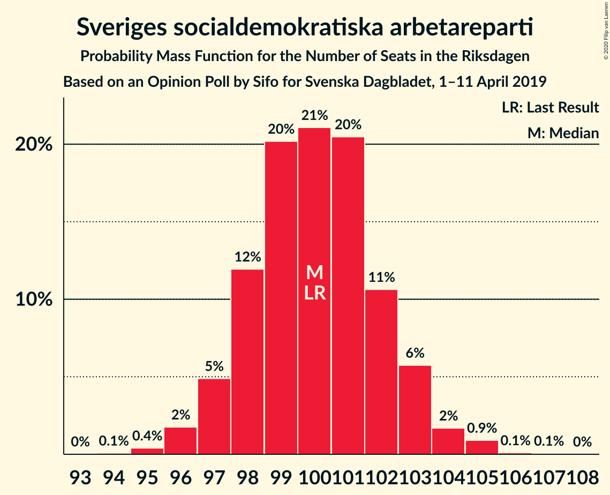
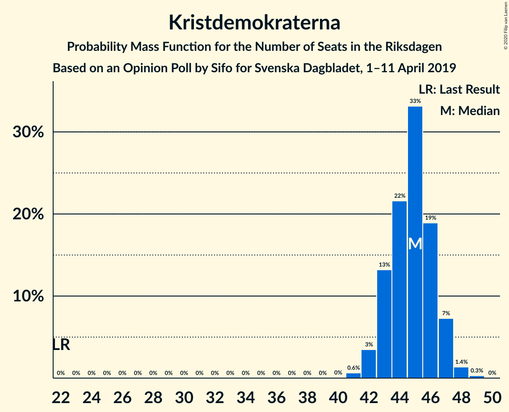
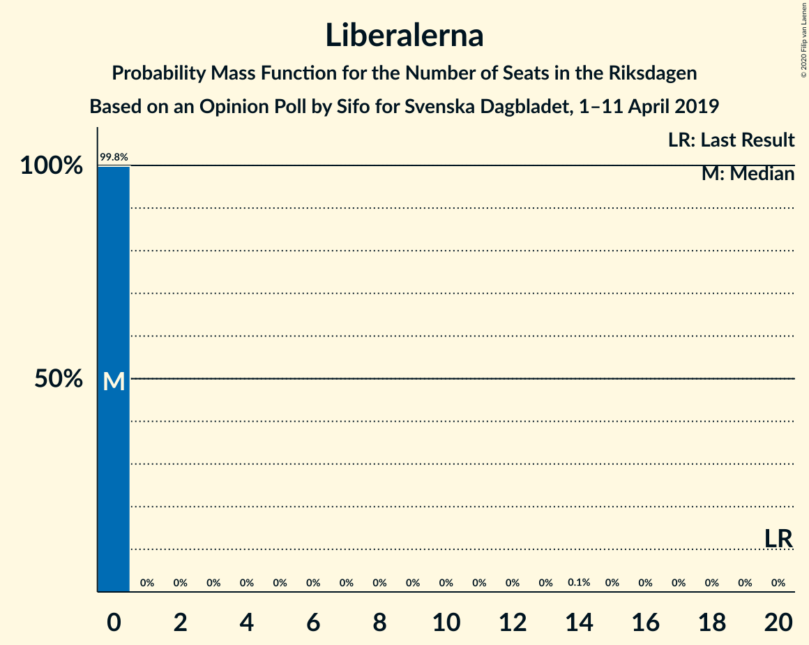
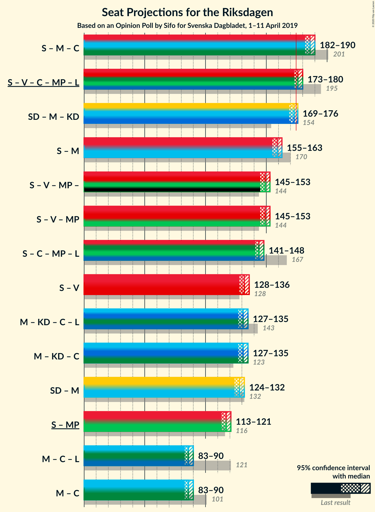
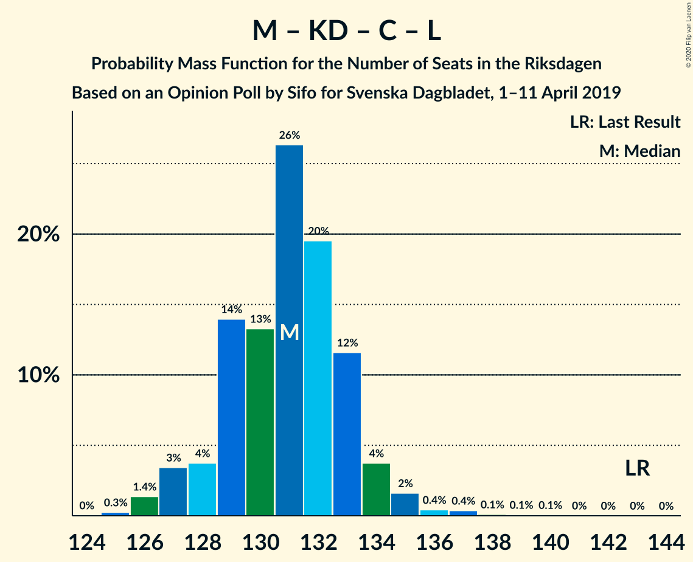
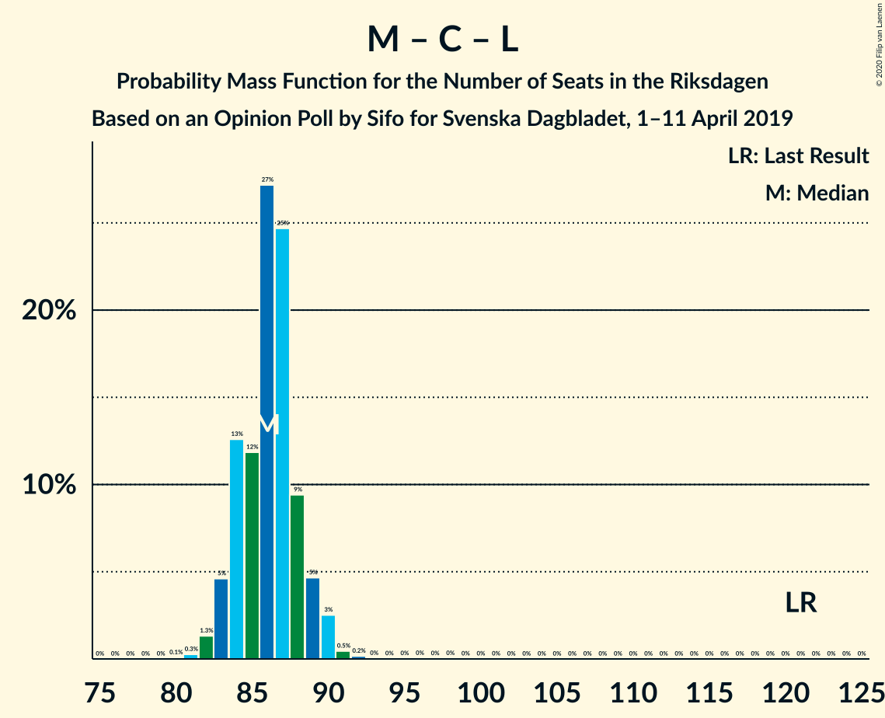

# Opinion Poll by Sifo for Svenska Dagbladet, 1–11 April 2019

<a href="#voting-intentions">Voting Intentions</a> | <a href="#seats">Seats</a> | <a href="#coalitions">Coalitions</a> | <a href="#technical-information">Technical Information</a>

## Voting Intentions

### Confidence Intervals

| Party | Last Result | Poll Result | 80% Confidence Interval | 90% Confidence Interval | 95% Confidence Interval | 99% Confidence Interval |
|:-----:|:-----------:|:-----------:|:-----------------------:|:-----------------------:|:-----------------------:|:-----------------------:|
| Sveriges socialdemokratiska arbetareparti | 28.3% | 27.3% | 26.7–27.9% |26.5–28.1% |26.4–28.3% |26.0–28.6% |
| Sverigedemokraterna | 17.5% | 18.9% | 18.4–19.5% |18.2–19.6% |18.1–19.8% |17.8–20.0% |
| Moderata samlingspartiet | 19.8% | 16.0% | 15.5–16.5% |15.3–16.7% |15.2–16.8% |15.0–17.1% |
| Kristdemokraterna | 6.3% | 12.2% | 11.8–12.7% |11.6–12.8% |11.5–12.9% |11.3–13.2% |
| Vänsterpartiet | 8.0% | 8.7% | 8.3–9.1% |8.2–9.2% |8.1–9.3% |7.9–9.5% |
| Centerpartiet | 8.6% | 7.5% | 7.1–7.9% |7.0–8.0% |7.0–8.1% |6.8–8.3% |
| Miljöpartiet de gröna | 4.4% | 4.6% | 4.3–4.9% |4.2–5.0% |4.2–5.1% |4.0–5.2% |
| Liberalerna | 5.5% | 3.4% | 3.1–3.7% |3.1–3.7% |3.0–3.8% |2.9–3.9% |

*Note:* The poll result column reflects the actual value used in the calculations. Published results may vary slightly, and in addition be rounded to fewer digits.

## Seats

### Confidence Intervals

| Party | Last Result | Median | 80% Confidence Interval | 90% Confidence Interval | 95% Confidence Interval | 99% Confidence Interval |
|:-----:|:-----------:|:------:|:-----------------------:|:-----------------------:|:-----------------------:|:-----------------------:|
| <a href="#sveriges-socialdemokratiska-arbetareparti">Sveriges socialdemokratiska arbetareparti</a> | 100 | 100 | 99–104 |98–104 |98–104 |97–104 |
| <a href="#sverigedemokraterna">Sverigedemokraterna</a> | 62 | 69 | 69–71 |68–74 |68–74 |67–74 |
| <a href="#moderata-samlingspartiet">Moderata samlingspartiet</a> | 70 | 55 | 55–62 |55–62 |54–62 |54–64 |
| <a href="#kristdemokraterna">Kristdemokraterna</a> | 22 | 47 | 45–48 |45–48 |44–48 |41–48 |
| <a href="#vänsterpartiet">Vänsterpartiet</a> | 28 | 32 | 29–33 |29–34 |29–34 |29–34 |
| <a href="#centerpartiet">Centerpartiet</a> | 31 | 27 | 25–29 |25–32 |25–32 |25–32 |
| <a href="#miljöpartiet-de-gröna">Miljöpartiet de gröna</a> | 16 | 18 | 17–19 |0–19 |0–19 |0–19 |
| <a href="#liberalerna">Liberalerna</a> | 20 | 0 | 0 |0 |0 |0 |

### Sveriges socialdemokratiska arbetareparti

*For a full overview of the results for this party, see the [Sveriges socialdemokratiska arbetareparti](party-sverigessocialdemokratiskaarbetareparti.html) page.*

| Number of Seats | Probability | Accumulated | Special Marks |
|:---------------:|:-----------:|:-----------:|:-------------:|
| 94 | 0.1% | 100% |  |
| 95 | 0% | 99.9% |  |
| 96 | 0% | 99.9% |  |
| 97 | 1.2% | 99.9% |  |
| 98 | 5% | 98.8% |  |
| 99 | 35% | 93% |  |
| 100 | 41% | 59% | Last Result, Median |
| 101 | 0.2% | 17% |  |
| 102 | 0% | 17% |  |
| 103 | 5% | 17% |  |
| 104 | 13% | 13% |  |
| 105 | 0% | 0.1% |  |
| 106 | 0.1% | 0.1% |  |
| 107 | 0% | 0% |  |

### Sverigedemokraterna

*For a full overview of the results for this party, see the [Sverigedemokraterna](party-sverigedemokraterna.html) page.*

| Number of Seats | Probability | Accumulated | Special Marks |
|:---------------:|:-----------:|:-----------:|:-------------:|
| 62 | 0.2% | 100% | Last Result |
| 63 | 0% | 99.8% |  |
| 64 | 0% | 99.8% |  |
| 65 | 0% | 99.8% |  |
| 66 | 0% | 99.7% |  |
| 67 | 0.7% | 99.7% |  |
| 68 | 6% | 99.0% |  |
| 69 | 73% | 93% | Median |
| 70 | 0% | 20% |  |
| 71 | 13% | 20% |  |
| 72 | 0.2% | 7% |  |
| 73 | 0.1% | 7% |  |
| 74 | 7% | 7% |  |
| 75 | 0% | 0% |  |

### Moderata samlingspartiet

*For a full overview of the results for this party, see the [Moderata samlingspartiet](party-moderatasamlingspartiet.html) page.*

| Number of Seats | Probability | Accumulated | Special Marks |
|:---------------:|:-----------:|:-----------:|:-------------:|
| 54 | 4% | 100% |  |
| 55 | 49% | 96% | Median |
| 56 | 0.1% | 46% |  |
| 57 | 3% | 46% |  |
| 58 | 0.3% | 43% |  |
| 59 | 0.5% | 43% |  |
| 60 | 0% | 42% |  |
| 61 | 7% | 42% |  |
| 62 | 35% | 35% |  |
| 63 | 0% | 0.7% |  |
| 64 | 0.7% | 0.7% |  |
| 65 | 0% | 0% |  |
| 66 | 0% | 0% |  |
| 67 | 0% | 0% |  |
| 68 | 0% | 0% |  |
| 69 | 0% | 0% |  |
| 70 | 0% | 0% | Last Result |

### Kristdemokraterna

*For a full overview of the results for this party, see the [Kristdemokraterna](party-kristdemokraterna.html) page.*

| Number of Seats | Probability | Accumulated | Special Marks |
|:---------------:|:-----------:|:-----------:|:-------------:|
| 22 | 0% | 100% | Last Result |
| 23 | 0% | 100% |  |
| 24 | 0% | 100% |  |
| 25 | 0% | 100% |  |
| 26 | 0% | 100% |  |
| 27 | 0% | 100% |  |
| 28 | 0% | 100% |  |
| 29 | 0% | 100% |  |
| 30 | 0% | 100% |  |
| 31 | 0% | 100% |  |
| 32 | 0% | 100% |  |
| 33 | 0% | 100% |  |
| 34 | 0% | 100% |  |
| 35 | 0% | 100% |  |
| 36 | 0% | 100% |  |
| 37 | 0% | 100% |  |
| 38 | 0% | 100% |  |
| 39 | 0% | 100% |  |
| 40 | 0.3% | 100% |  |
| 41 | 0.2% | 99.7% |  |
| 42 | 0% | 99.4% |  |
| 43 | 0.3% | 99.4% |  |
| 44 | 3% | 99.2% |  |
| 45 | 12% | 96% |  |
| 46 | 0.7% | 84% |  |
| 47 | 73% | 84% | Median |
| 48 | 11% | 11% |  |
| 49 | 0% | 0% |  |

### Vänsterpartiet

*For a full overview of the results for this party, see the [Vänsterpartiet](party-vänsterpartiet.html) page.*

| Number of Seats | Probability | Accumulated | Special Marks |
|:---------------:|:-----------:|:-----------:|:-------------:|
| 28 | 0% | 100% | Last Result |
| 29 | 34% | 100% |  |
| 30 | 10% | 66% |  |
| 31 | 0.3% | 56% |  |
| 32 | 39% | 56% | Median |
| 33 | 12% | 17% |  |
| 34 | 5% | 5% |  |
| 35 | 0% | 0% |  |

### Centerpartiet

*For a full overview of the results for this party, see the [Centerpartiet](party-centerpartiet.html) page.*

| Number of Seats | Probability | Accumulated | Special Marks |
|:---------------:|:-----------:|:-----------:|:-------------:|
| 24 | 0.2% | 100% |  |
| 25 | 39% | 99.8% |  |
| 26 | 5% | 61% |  |
| 27 | 45% | 56% | Median |
| 28 | 0.1% | 11% |  |
| 29 | 3% | 11% |  |
| 30 | 0.2% | 7% |  |
| 31 | 0% | 7% | Last Result |
| 32 | 7% | 7% |  |
| 33 | 0% | 0% |  |

### Miljöpartiet de gröna

*For a full overview of the results for this party, see the [Miljöpartiet de gröna](party-miljöpartietdegröna.html) page.*

| Number of Seats | Probability | Accumulated | Special Marks |
|:---------------:|:-----------:|:-----------:|:-------------:|
| 0 | 7% | 100% |  |
| 1 | 0% | 93% |  |
| 2 | 0% | 93% |  |
| 3 | 0% | 93% |  |
| 4 | 0% | 93% |  |
| 5 | 0% | 93% |  |
| 6 | 0% | 93% |  |
| 7 | 0% | 93% |  |
| 8 | 0% | 93% |  |
| 9 | 0% | 93% |  |
| 10 | 0% | 93% |  |
| 11 | 0% | 93% |  |
| 12 | 0% | 93% |  |
| 13 | 0% | 93% |  |
| 14 | 0% | 93% |  |
| 15 | 0.4% | 93% |  |
| 16 | 0.2% | 93% | Last Result |
| 17 | 11% | 92% |  |
| 18 | 43% | 81% | Median |
| 19 | 38% | 38% |  |
| 20 | 0% | 0% |  |

### Liberalerna

*For a full overview of the results for this party, see the [Liberalerna](party-liberalerna.html) page.*

| Number of Seats | Probability | Accumulated | Special Marks |
|:---------------:|:-----------:|:-----------:|:-------------:|
| 0 | 99.7% | 100% | Median |
| 1 | 0% | 0.3% |  |
| 2 | 0% | 0.3% |  |
| 3 | 0% | 0.3% |  |
| 4 | 0% | 0.3% |  |
| 5 | 0% | 0.3% |  |
| 6 | 0% | 0.3% |  |
| 7 | 0% | 0.3% |  |
| 8 | 0% | 0.3% |  |
| 9 | 0% | 0.3% |  |
| 10 | 0% | 0.3% |  |
| 11 | 0% | 0.3% |  |
| 12 | 0% | 0.3% |  |
| 13 | 0% | 0.3% |  |
| 14 | 0% | 0.3% |  |
| 15 | 0.2% | 0.3% |  |
| 16 | 0% | 0% |  |
| 17 | 0% | 0% |  |
| 18 | 0% | 0% |  |
| 19 | 0% | 0% |  |
| 20 | 0% | 0% | Last Result |

## Coalitions

### Confidence Intervals

| Coalition | Last Result | Median | Majority? | 80% Confidence Interval | 90% Confidence Interval | 95% Confidence Interval | 99% Confidence Interval |
|:---------:|:-----------:|:------:|:---------:|:-----------------------:|:-----------------------:|:-----------------------:|:-----------------------:|
| Sveriges socialdemokratiska arbetareparti – Moderata samlingspartiet – Centerpartiet | 201 | 186 | 100% | 182–186 | 179–197 | 179–197 | 179–197 |
| Sverigedemokraterna – Moderata samlingspartiet – Kristdemokraterna | 154 | 172 | 42% | 171–178 | 171–180 | 170–180 | 170–180 |
| Sveriges socialdemokratiska arbetareparti – Vänsterpartiet – Centerpartiet – Miljöpartiet de gröna – Liberalerna | 195 | 177 | 58% | 171–178 | 169–178 | 169–179 | 169–179 |
| Sveriges socialdemokratiska arbetareparti – Moderata samlingspartiet | 170 | 157 | 0% | 155–161 | 153–165 | 153–165 | 153–165 |
| Sveriges socialdemokratiska arbetareparti – Vänsterpartiet – Miljöpartiet de gröna | 144 | 149 | 0% | 146–151 | 137–151 | 137–154 | 137–154 |
| Sveriges socialdemokratiska arbetareparti – Centerpartiet – Miljöpartiet de gröna – Liberalerna | 167 | 146 | 0% | 141–146 | 136–148 | 136–148 | 136–148 |
| Moderata samlingspartiet – Kristdemokraterna – Centerpartiet – Liberalerna | 143 | 130 | 0% | 129–134 | 129–138 | 124–138 | 124–138 |
| Moderata samlingspartiet – Kristdemokraterna – Centerpartiet | 123 | 130 | 0% | 129–134 | 128–138 | 124–138 | 124–138 |
| Sveriges socialdemokratiska arbetareparti – Vänsterpartiet | 128 | 132 | 0% | 128–136 | 128–137 | 128–137 | 127–137 |
| Sverigedemokraterna – Moderata samlingspartiet | 132 | 126 | 0% | 124–131 | 123–135 | 123–135 | 123–135 |
| Sveriges socialdemokratiska arbetareparti – Miljöpartiet de gröna | 116 | 118 | 0% | 115–121 | 104–121 | 104–121 | 104–121 |
| Moderata samlingspartiet – Centerpartiet – Liberalerna | 121 | 82 | 0% | 82–87 | 81–93 | 79–93 | 79–93 |
| Moderata samlingspartiet – Centerpartiet | 101 | 82 | 0% | 82–87 | 81–93 | 79–93 | 79–93 |

### Sveriges socialdemokratiska arbetareparti – Moderata samlingspartiet – Centerpartiet

| Number of Seats | Probability | Accumulated | Special Marks |
|:---------------:|:-----------:|:-----------:|:-------------:|
| 179 | 5% | 100% |  |
| 180 | 0% | 95% |  |
| 181 | 0% | 95% |  |
| 182 | 43% | 95% | Median |
| 183 | 0.2% | 52% |  |
| 184 | 0% | 52% |  |
| 185 | 0.2% | 52% |  |
| 186 | 43% | 51% |  |
| 187 | 0.1% | 8% |  |
| 188 | 1.0% | 8% |  |
| 189 | 0.1% | 7% |  |
| 190 | 0% | 7% |  |
| 191 | 0% | 7% |  |
| 192 | 0% | 7% |  |
| 193 | 0.1% | 7% |  |
| 194 | 0% | 7% |  |
| 195 | 0% | 7% |  |
| 196 | 0% | 7% |  |
| 197 | 7% | 7% |  |
| 198 | 0% | 0% |  |
| 199 | 0% | 0% |  |
| 200 | 0% | 0% |  |
| 201 | 0% | 0% | Last Result |

### Sverigedemokraterna – Moderata samlingspartiet – Kristdemokraterna

| Number of Seats | Probability | Accumulated | Special Marks |
|:---------------:|:-----------:|:-----------:|:-------------:|
| 154 | 0% | 100% | Last Result |
| 155 | 0% | 100% |  |
| 156 | 0% | 100% |  |
| 157 | 0% | 100% |  |
| 158 | 0% | 100% |  |
| 159 | 0% | 100% |  |
| 160 | 0% | 100% |  |
| 161 | 0% | 100% |  |
| 162 | 0.2% | 100% |  |
| 163 | 0% | 99.8% |  |
| 164 | 0% | 99.8% |  |
| 165 | 0% | 99.8% |  |
| 166 | 0% | 99.8% |  |
| 167 | 0.1% | 99.8% |  |
| 168 | 0% | 99.7% |  |
| 169 | 0.1% | 99.7% |  |
| 170 | 5% | 99.5% |  |
| 171 | 44% | 95% | Median |
| 172 | 3% | 51% |  |
| 173 | 0% | 48% |  |
| 174 | 5% | 48% |  |
| 175 | 0% | 42% | Majority |
| 176 | 0% | 42% |  |
| 177 | 0.7% | 42% |  |
| 178 | 35% | 42% |  |
| 179 | 0% | 7% |  |
| 180 | 7% | 7% |  |
| 181 | 0% | 0% |  |

### Sveriges socialdemokratiska arbetareparti – Vänsterpartiet – Centerpartiet – Miljöpartiet de gröna – Liberalerna

| Number of Seats | Probability | Accumulated | Special Marks |
|:---------------:|:-----------:|:-----------:|:-------------:|
| 169 | 7% | 100% |  |
| 170 | 0% | 93% |  |
| 171 | 35% | 93% |  |
| 172 | 0.7% | 58% |  |
| 173 | 0% | 58% |  |
| 174 | 0% | 58% |  |
| 175 | 5% | 58% | Majority |
| 176 | 0% | 52% |  |
| 177 | 3% | 52% | Median |
| 178 | 44% | 49% |  |
| 179 | 5% | 5% |  |
| 180 | 0.1% | 0.5% |  |
| 181 | 0% | 0.3% |  |
| 182 | 0.1% | 0.3% |  |
| 183 | 0% | 0.2% |  |
| 184 | 0% | 0.2% |  |
| 185 | 0% | 0.2% |  |
| 186 | 0% | 0.2% |  |
| 187 | 0.2% | 0.2% |  |
| 188 | 0% | 0% |  |
| 189 | 0% | 0% |  |
| 190 | 0% | 0% |  |
| 191 | 0% | 0% |  |
| 192 | 0% | 0% |  |
| 193 | 0% | 0% |  |
| 194 | 0% | 0% |  |
| 195 | 0% | 0% | Last Result |

### Sveriges socialdemokratiska arbetareparti – Moderata samlingspartiet

| Number of Seats | Probability | Accumulated | Special Marks |
|:---------------:|:-----------:|:-----------:|:-------------:|
| 153 | 5% | 100% |  |
| 154 | 0% | 95% |  |
| 155 | 38% | 95% | Median |
| 156 | 0.4% | 56% |  |
| 157 | 8% | 56% |  |
| 158 | 0.2% | 48% |  |
| 159 | 6% | 48% |  |
| 160 | 0% | 42% |  |
| 161 | 35% | 42% |  |
| 162 | 0% | 7% |  |
| 163 | 0% | 7% |  |
| 164 | 0.1% | 7% |  |
| 165 | 7% | 7% |  |
| 166 | 0% | 0% |  |
| 167 | 0% | 0% |  |
| 168 | 0% | 0% |  |
| 169 | 0% | 0% |  |
| 170 | 0% | 0% | Last Result |

### Sveriges socialdemokratiska arbetareparti – Vänsterpartiet – Miljöpartiet de gröna

| Number of Seats | Probability | Accumulated | Special Marks |
|:---------------:|:-----------:|:-----------:|:-------------:|
| 137 | 7% | 100% |  |
| 138 | 0% | 93% |  |
| 139 | 0% | 93% |  |
| 140 | 0% | 93% |  |
| 141 | 0% | 93% |  |
| 142 | 0% | 93% |  |
| 143 | 0% | 93% |  |
| 144 | 0% | 93% | Last Result |
| 145 | 1.0% | 93% |  |
| 146 | 35% | 92% |  |
| 147 | 0.2% | 57% |  |
| 148 | 3% | 57% |  |
| 149 | 5% | 54% |  |
| 150 | 0.1% | 49% | Median |
| 151 | 44% | 49% |  |
| 152 | 0% | 5% |  |
| 153 | 0% | 5% |  |
| 154 | 4% | 4% |  |
| 155 | 0% | 0% |  |

### Sveriges socialdemokratiska arbetareparti – Centerpartiet – Miljöpartiet de gröna – Liberalerna

| Number of Seats | Probability | Accumulated | Special Marks |
|:---------------:|:-----------:|:-----------:|:-------------:|
| 136 | 7% | 100% |  |
| 137 | 0% | 93% |  |
| 138 | 0.2% | 93% |  |
| 139 | 0% | 93% |  |
| 140 | 0% | 93% |  |
| 141 | 5% | 93% |  |
| 142 | 35% | 87% |  |
| 143 | 0% | 52% |  |
| 144 | 0.1% | 52% |  |
| 145 | 0% | 52% | Median |
| 146 | 43% | 52% |  |
| 147 | 3% | 9% |  |
| 148 | 6% | 6% |  |
| 149 | 0% | 0.4% |  |
| 150 | 0.1% | 0.4% |  |
| 151 | 0% | 0.3% |  |
| 152 | 0% | 0.3% |  |
| 153 | 0% | 0.3% |  |
| 154 | 0% | 0.2% |  |
| 155 | 0.2% | 0.2% |  |
| 156 | 0% | 0% |  |
| 157 | 0% | 0% |  |
| 158 | 0% | 0% |  |
| 159 | 0% | 0% |  |
| 160 | 0% | 0% |  |
| 161 | 0% | 0% |  |
| 162 | 0% | 0% |  |
| 163 | 0% | 0% |  |
| 164 | 0% | 0% |  |
| 165 | 0% | 0% |  |
| 166 | 0% | 0% |  |
| 167 | 0% | 0% | Last Result |

### Moderata samlingspartiet – Kristdemokraterna – Centerpartiet – Liberalerna

| Number of Seats | Probability | Accumulated | Special Marks |
|:---------------:|:-----------:|:-----------:|:-------------:|
| 124 | 4% | 100% |  |
| 125 | 0% | 96% |  |
| 126 | 0% | 96% |  |
| 127 | 0.2% | 96% |  |
| 128 | 0.1% | 95% |  |
| 129 | 44% | 95% | Median |
| 130 | 9% | 52% |  |
| 131 | 0% | 43% |  |
| 132 | 0% | 43% |  |
| 133 | 0% | 43% |  |
| 134 | 35% | 43% |  |
| 135 | 0% | 8% |  |
| 136 | 0% | 8% |  |
| 137 | 0.7% | 8% |  |
| 138 | 7% | 7% |  |
| 139 | 0% | 0.3% |  |
| 140 | 0% | 0.3% |  |
| 141 | 0% | 0.3% |  |
| 142 | 0.2% | 0.3% |  |
| 143 | 0% | 0% | Last Result |

### Moderata samlingspartiet – Kristdemokraterna – Centerpartiet

| Number of Seats | Probability | Accumulated | Special Marks |
|:---------------:|:-----------:|:-----------:|:-------------:|
| 123 | 0% | 100% | Last Result |
| 124 | 4% | 100% |  |
| 125 | 0% | 96% |  |
| 126 | 0% | 95% |  |
| 127 | 0.4% | 95% |  |
| 128 | 0.1% | 95% |  |
| 129 | 44% | 95% | Median |
| 130 | 9% | 51% |  |
| 131 | 0% | 43% |  |
| 132 | 0% | 42% |  |
| 133 | 0% | 42% |  |
| 134 | 35% | 42% |  |
| 135 | 0% | 8% |  |
| 136 | 0% | 8% |  |
| 137 | 0.7% | 8% |  |
| 138 | 7% | 7% |  |
| 139 | 0% | 0% |  |

### Sveriges socialdemokratiska arbetareparti – Vänsterpartiet

| Number of Seats | Probability | Accumulated | Special Marks |
|:---------------:|:-----------:|:-----------:|:-------------:|
| 127 | 0.8% | 100% |  |
| 128 | 35% | 99.2% | Last Result |
| 129 | 0.2% | 65% |  |
| 130 | 3% | 64% |  |
| 131 | 0% | 61% |  |
| 132 | 44% | 61% | Median |
| 133 | 0.1% | 18% |  |
| 134 | 6% | 17% |  |
| 135 | 0% | 12% |  |
| 136 | 5% | 12% |  |
| 137 | 7% | 7% |  |
| 138 | 0% | 0% |  |

### Sverigedemokraterna – Moderata samlingspartiet

| Number of Seats | Probability | Accumulated | Special Marks |
|:---------------:|:-----------:|:-----------:|:-------------:|
| 121 | 0.2% | 100% |  |
| 122 | 0% | 99.8% |  |
| 123 | 6% | 99.8% |  |
| 124 | 38% | 94% | Median |
| 125 | 5% | 56% |  |
| 126 | 5% | 51% |  |
| 127 | 0% | 46% |  |
| 128 | 3% | 46% |  |
| 129 | 0.1% | 43% |  |
| 130 | 0% | 42% |  |
| 131 | 35% | 42% |  |
| 132 | 0% | 7% | Last Result |
| 133 | 0% | 7% |  |
| 134 | 0.2% | 7% |  |
| 135 | 7% | 7% |  |
| 136 | 0% | 0% |  |

### Sveriges socialdemokratiska arbetareparti – Miljöpartiet de gröna

| Number of Seats | Probability | Accumulated | Special Marks |
|:---------------:|:-----------:|:-----------:|:-------------:|
| 104 | 7% | 100% |  |
| 105 | 0% | 93% |  |
| 106 | 0% | 93% |  |
| 107 | 0% | 93% |  |
| 108 | 0% | 93% |  |
| 109 | 0% | 93% |  |
| 110 | 0% | 93% |  |
| 111 | 0% | 93% |  |
| 112 | 0% | 93% |  |
| 113 | 0.2% | 93% |  |
| 114 | 0.2% | 93% |  |
| 115 | 6% | 92% |  |
| 116 | 0% | 86% | Last Result |
| 117 | 34% | 86% |  |
| 118 | 3% | 52% | Median |
| 119 | 38% | 49% |  |
| 120 | 0% | 10% |  |
| 121 | 10% | 10% |  |
| 122 | 0% | 0.1% |  |
| 123 | 0% | 0% |  |

### Moderata samlingspartiet – Centerpartiet – Liberalerna

| Number of Seats | Probability | Accumulated | Special Marks |
|:---------------:|:-----------:|:-----------:|:-------------:|
| 79 | 4% | 100% |  |
| 80 | 0% | 96% |  |
| 81 | 5% | 96% |  |
| 82 | 44% | 90% | Median |
| 83 | 0% | 46% |  |
| 84 | 0% | 46% |  |
| 85 | 0% | 46% |  |
| 86 | 3% | 46% |  |
| 87 | 35% | 43% |  |
| 88 | 0.1% | 8% |  |
| 89 | 0.1% | 8% |  |
| 90 | 0% | 8% |  |
| 91 | 1.0% | 8% |  |
| 92 | 0% | 7% |  |
| 93 | 7% | 7% |  |
| 94 | 0% | 0.3% |  |
| 95 | 0% | 0.3% |  |
| 96 | 0% | 0.3% |  |
| 97 | 0% | 0.3% |  |
| 98 | 0% | 0.3% |  |
| 99 | 0% | 0.3% |  |
| 100 | 0% | 0.3% |  |
| 101 | 0.3% | 0.3% |  |
| 102 | 0% | 0% |  |
| 103 | 0% | 0% |  |
| 104 | 0% | 0% |  |
| 105 | 0% | 0% |  |
| 106 | 0% | 0% |  |
| 107 | 0% | 0% |  |
| 108 | 0% | 0% |  |
| 109 | 0% | 0% |  |
| 110 | 0% | 0% |  |
| 111 | 0% | 0% |  |
| 112 | 0% | 0% |  |
| 113 | 0% | 0% |  |
| 114 | 0% | 0% |  |
| 115 | 0% | 0% |  |
| 116 | 0% | 0% |  |
| 117 | 0% | 0% |  |
| 118 | 0% | 0% |  |
| 119 | 0% | 0% |  |
| 120 | 0% | 0% |  |
| 121 | 0% | 0% | Last Result |

### Moderata samlingspartiet – Centerpartiet

| Number of Seats | Probability | Accumulated | Special Marks |
|:---------------:|:-----------:|:-----------:|:-------------:|
| 79 | 4% | 100% |  |
| 80 | 0% | 96% |  |
| 81 | 5% | 96% |  |
| 82 | 44% | 90% | Median |
| 83 | 0% | 46% |  |
| 84 | 0% | 46% |  |
| 85 | 0.1% | 46% |  |
| 86 | 3% | 46% |  |
| 87 | 35% | 43% |  |
| 88 | 0.1% | 8% |  |
| 89 | 0.1% | 8% |  |
| 90 | 0% | 8% |  |
| 91 | 1.0% | 8% |  |
| 92 | 0% | 7% |  |
| 93 | 7% | 7% |  |
| 94 | 0% | 0% |  |
| 95 | 0% | 0% |  |
| 96 | 0% | 0% |  |
| 97 | 0% | 0% |  |
| 98 | 0% | 0% |  |
| 99 | 0% | 0% |  |
| 100 | 0% | 0% |  |
| 101 | 0% | 0% | Last Result |

## Technical Information

### Opinion Poll

+ **Polling firm:** Sifo
+ **Commissioner(s):** Svenska Dagbladet
+ **Fieldwork period:** 1–11 April 2019

### Calculations

+ **Sample size:** 8278
+ **Simulations done:** 1,024
+ **Error estimate:** 0.84%

