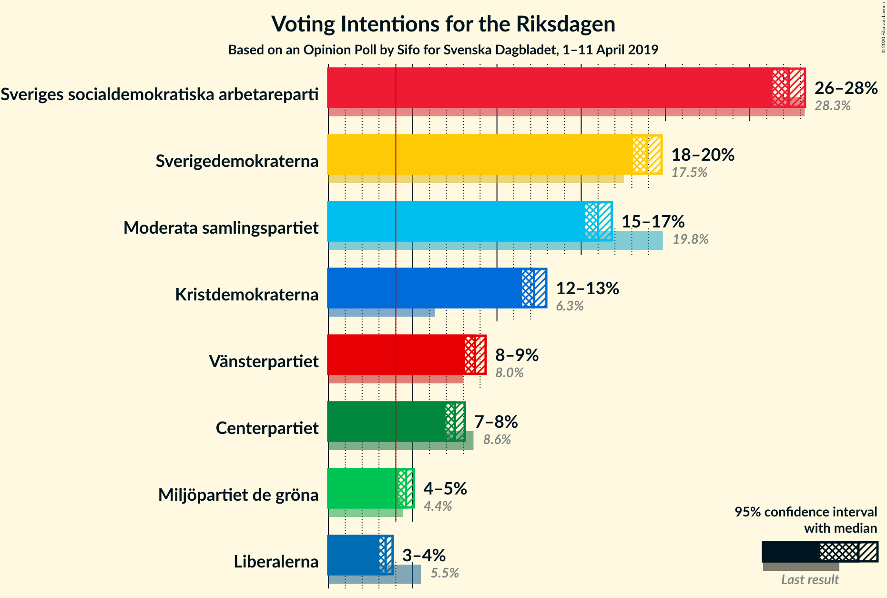
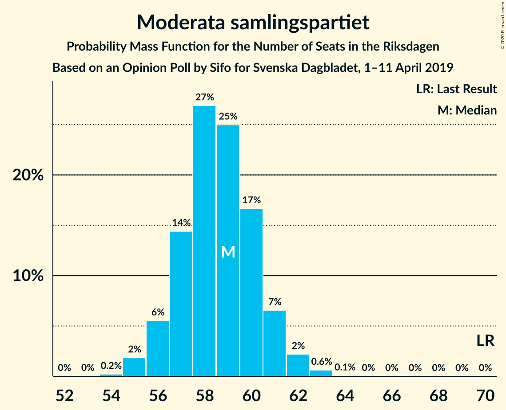
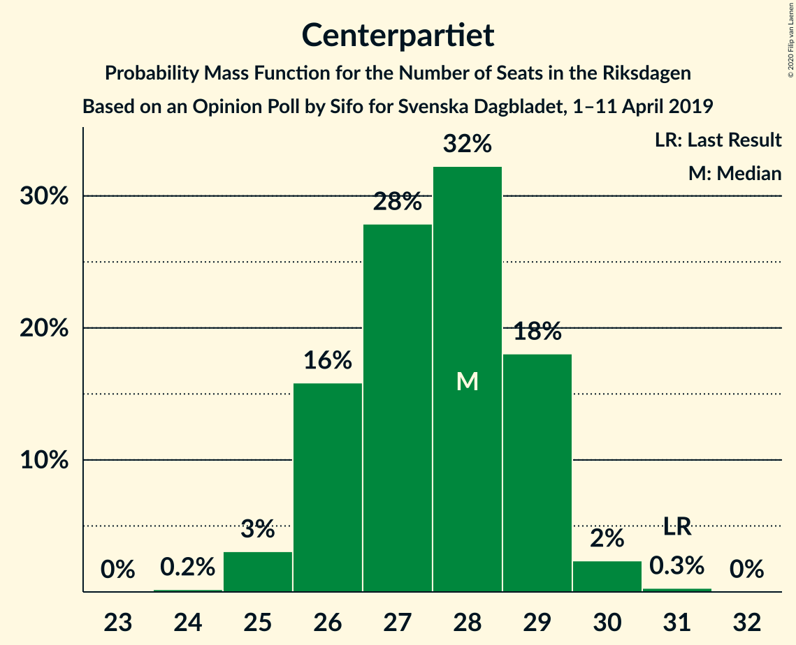
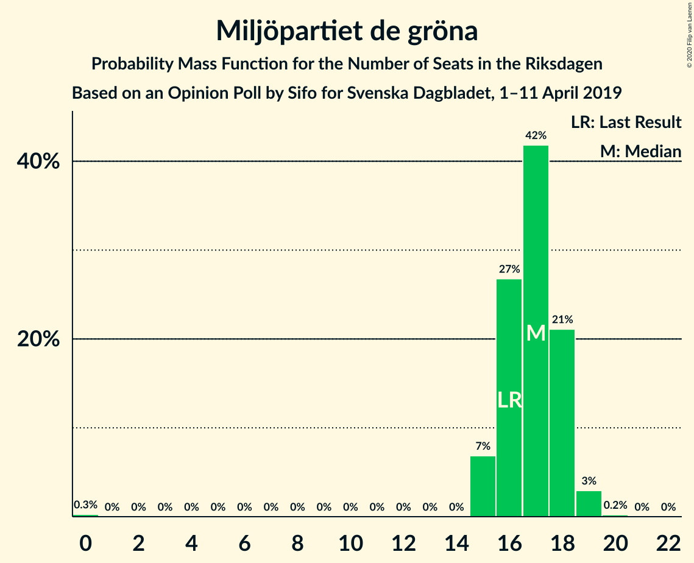
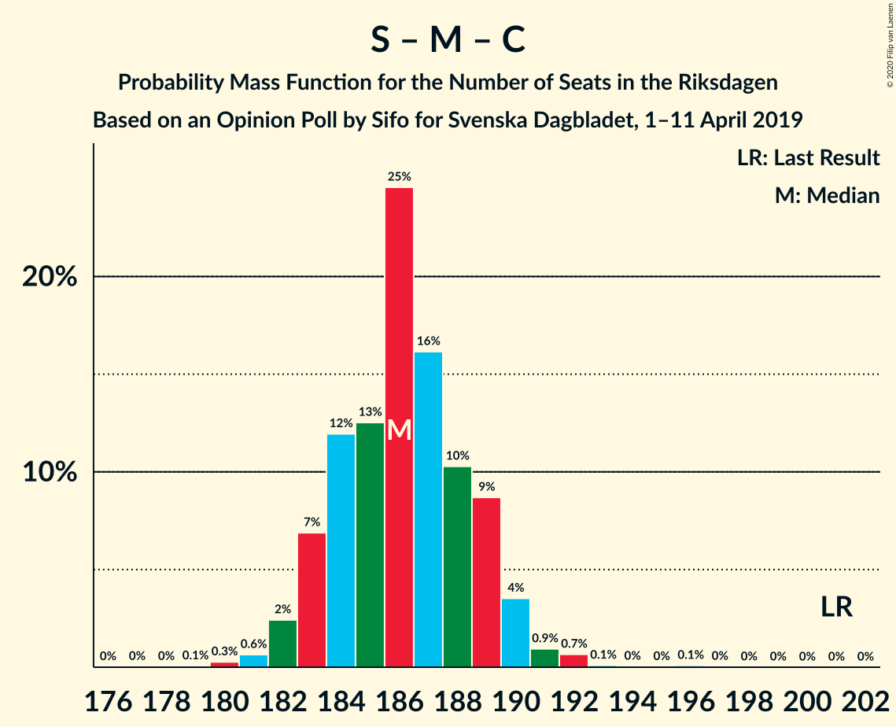

# Opinion Poll by Sifo for Svenska Dagbladet, 1–11 April 2019

<a href="#voting-intentions">Voting Intentions</a> | <a href="#seats">Seats</a> | <a href="#coalitions">Coalitions</a> | <a href="#technical-information">Technical Information</a>

## Voting Intentions

### Confidence Intervals

| Party | Last Result | Poll Result | 80% Confidence Interval | 90% Confidence Interval | 95% Confidence Interval | 99% Confidence Interval |
|:-----:|:-----------:|:-----------:|:-----------------------:|:-----------------------:|:-----------------------:|:-----------------------:|
| Sveriges socialdemokratiska arbetareparti | 28.3% | 27.3% | 26.7–27.9% |26.5–28.1% |26.4–28.3% |26.0–28.6% |
| Sverigedemokraterna | 17.5% | 18.9% | 18.4–19.5% |18.2–19.6% |18.1–19.8% |17.8–20.0% |
| Moderata samlingspartiet | 19.8% | 16.0% | 15.5–16.5% |15.3–16.7% |15.2–16.8% |15.0–17.1% |
| Kristdemokraterna | 6.3% | 12.2% | 11.8–12.7% |11.6–12.8% |11.5–12.9% |11.3–13.2% |
| Vänsterpartiet | 8.0% | 8.7% | 8.3–9.1% |8.2–9.2% |8.1–9.3% |7.9–9.5% |
| Centerpartiet | 8.6% | 7.5% | 7.1–7.9% |7.0–8.0% |7.0–8.1% |6.8–8.3% |
| Miljöpartiet de gröna | 4.4% | 4.6% | 4.3–4.9% |4.2–5.0% |4.2–5.1% |4.0–5.2% |
| Liberalerna | 5.5% | 3.4% | 3.1–3.7% |3.1–3.7% |3.0–3.8% |2.9–3.9% |

*Note:* The poll result column reflects the actual value used in the calculations. Published results may vary slightly, and in addition be rounded to fewer digits.

## Seats

### Confidence Intervals

| Party | Last Result | Median | 80% Confidence Interval | 90% Confidence Interval | 95% Confidence Interval | 99% Confidence Interval |
|:-----:|:-----------:|:------:|:-----------------------:|:-----------------------:|:-----------------------:|:-----------------------:|
| <a href="#sveriges-socialdemokratiska-arbetareparti">Sveriges socialdemokratiska arbetareparti</a> | 100 | 100 | 98–102 |97–103 |97–104 |96–105 |
| <a href="#sverigedemokraterna">Sverigedemokraterna</a> | 62 | 69 | 67–72 |67–72 |67–72 |65–74 |
| <a href="#moderata-samlingspartiet">Moderata samlingspartiet</a> | 70 | 58 | 56–60 |56–61 |56–61 |55–63 |
| <a href="#kristdemokraterna">Kristdemokraterna</a> | 22 | 44 | 43–47 |43–47 |42–47 |42–48 |
| <a href="#vänsterpartiet">Vänsterpartiet</a> | 28 | 32 | 30–33 |30–34 |30–34 |29–35 |
| <a href="#centerpartiet">Centerpartiet</a> | 31 | 28 | 26–29 |25–29 |25–29 |25–30 |
| <a href="#miljöpartiet-de-gröna">Miljöpartiet de gröna</a> | 16 | 17 | 16–18 |15–18 |15–18 |15–19 |
| <a href="#liberalerna">Liberalerna</a> | 20 | 0 | 0 |0 |0 |0 |

### Sveriges socialdemokratiska arbetareparti

*For a full overview of the results for this party, see the [Sveriges socialdemokratiska arbetareparti](party-sverigessocialdemokratiskaarbetareparti.html) page.*

| Number of Seats | Probability | Accumulated | Special Marks |
|:---------------:|:-----------:|:-----------:|:-------------:|
| 94 | 0.1% | 100% |  |
| 95 | 0.4% | 99.9% |  |
| 96 | 2% | 99.5% |  |
| 97 | 6% | 98% |  |
| 98 | 15% | 92% |  |
| 99 | 16% | 77% |  |
| 100 | 27% | 61% | Last Result, Median |
| 101 | 17% | 34% |  |
| 102 | 10% | 16% |  |
| 103 | 3% | 6% |  |
| 104 | 1.4% | 3% |  |
| 105 | 1.4% | 2% |  |
| 106 | 0.1% | 0.2% |  |
| 107 | 0.1% | 0.1% |  |
| 108 | 0.1% | 0.1% |  |
| 109 | 0% | 0% |  |

### Sverigedemokraterna

*For a full overview of the results for this party, see the [Sverigedemokraterna](party-sverigedemokraterna.html) page.*

| Number of Seats | Probability | Accumulated | Special Marks |
|:---------------:|:-----------:|:-----------:|:-------------:|
| 62 | 0% | 100% | Last Result |
| 63 | 0% | 100% |  |
| 64 | 0.1% | 100% |  |
| 65 | 0.7% | 99.9% |  |
| 66 | 2% | 99.1% |  |
| 67 | 11% | 98% |  |
| 68 | 13% | 86% |  |
| 69 | 34% | 74% | Median |
| 70 | 6% | 39% |  |
| 71 | 8% | 33% |  |
| 72 | 23% | 25% |  |
| 73 | 1.2% | 2% |  |
| 74 | 0.6% | 0.8% |  |
| 75 | 0.1% | 0.1% |  |
| 76 | 0% | 0% |  |

### Moderata samlingspartiet

*For a full overview of the results for this party, see the [Moderata samlingspartiet](party-moderatasamlingspartiet.html) page.*

| Number of Seats | Probability | Accumulated | Special Marks |
|:---------------:|:-----------:|:-----------:|:-------------:|
| 54 | 0.2% | 100% |  |
| 55 | 2% | 99.8% |  |
| 56 | 9% | 98% |  |
| 57 | 13% | 89% |  |
| 58 | 26% | 75% | Median |
| 59 | 14% | 49% |  |
| 60 | 27% | 36% |  |
| 61 | 6% | 8% |  |
| 62 | 1.0% | 2% |  |
| 63 | 0.9% | 0.9% |  |
| 64 | 0.1% | 0.1% |  |
| 65 | 0% | 0% |  |
| 66 | 0% | 0% |  |
| 67 | 0% | 0% |  |
| 68 | 0% | 0% |  |
| 69 | 0% | 0% |  |
| 70 | 0% | 0% | Last Result |

### Kristdemokraterna

*For a full overview of the results for this party, see the [Kristdemokraterna](party-kristdemokraterna.html) page.*

| Number of Seats | Probability | Accumulated | Special Marks |
|:---------------:|:-----------:|:-----------:|:-------------:|
| 22 | 0% | 100% | Last Result |
| 23 | 0% | 100% |  |
| 24 | 0% | 100% |  |
| 25 | 0% | 100% |  |
| 26 | 0% | 100% |  |
| 27 | 0% | 100% |  |
| 28 | 0% | 100% |  |
| 29 | 0% | 100% |  |
| 30 | 0% | 100% |  |
| 31 | 0% | 100% |  |
| 32 | 0% | 100% |  |
| 33 | 0% | 100% |  |
| 34 | 0% | 100% |  |
| 35 | 0% | 100% |  |
| 36 | 0% | 100% |  |
| 37 | 0% | 100% |  |
| 38 | 0% | 100% |  |
| 39 | 0% | 100% |  |
| 40 | 0% | 100% |  |
| 41 | 0.3% | 100% |  |
| 42 | 3% | 99.6% |  |
| 43 | 13% | 97% |  |
| 44 | 38% | 83% | Median |
| 45 | 15% | 45% |  |
| 46 | 18% | 30% |  |
| 47 | 11% | 13% |  |
| 48 | 0.8% | 1.2% |  |
| 49 | 0.3% | 0.4% |  |
| 50 | 0% | 0% |  |

### Vänsterpartiet

*For a full overview of the results for this party, see the [Vänsterpartiet](party-vänsterpartiet.html) page.*

| Number of Seats | Probability | Accumulated | Special Marks |
|:---------------:|:-----------:|:-----------:|:-------------:|
| 28 | 0.1% | 100% | Last Result |
| 29 | 0.7% | 99.9% |  |
| 30 | 14% | 99.2% |  |
| 31 | 20% | 85% |  |
| 32 | 39% | 65% | Median |
| 33 | 19% | 26% |  |
| 34 | 6% | 7% |  |
| 35 | 0.9% | 1.2% |  |
| 36 | 0.2% | 0.2% |  |
| 37 | 0% | 0% |  |

### Centerpartiet

*For a full overview of the results for this party, see the [Centerpartiet](party-centerpartiet.html) page.*

| Number of Seats | Probability | Accumulated | Special Marks |
|:---------------:|:-----------:|:-----------:|:-------------:|
| 24 | 0.3% | 100% |  |
| 25 | 6% | 99.7% |  |
| 26 | 12% | 94% |  |
| 27 | 28% | 82% |  |
| 28 | 40% | 54% | Median |
| 29 | 12% | 14% |  |
| 30 | 0.9% | 1.2% |  |
| 31 | 0.3% | 0.3% | Last Result |
| 32 | 0% | 0% |  |

### Miljöpartiet de gröna

*For a full overview of the results for this party, see the [Miljöpartiet de gröna](party-miljöpartietdegröna.html) page.*

| Number of Seats | Probability | Accumulated | Special Marks |
|:---------------:|:-----------:|:-----------:|:-------------:|
| 0 | 0.2% | 100% |  |
| 1 | 0% | 99.8% |  |
| 2 | 0% | 99.8% |  |
| 3 | 0% | 99.8% |  |
| 4 | 0% | 99.8% |  |
| 5 | 0% | 99.8% |  |
| 6 | 0% | 99.8% |  |
| 7 | 0% | 99.8% |  |
| 8 | 0% | 99.8% |  |
| 9 | 0% | 99.8% |  |
| 10 | 0% | 99.8% |  |
| 11 | 0% | 99.8% |  |
| 12 | 0% | 99.8% |  |
| 13 | 0% | 99.8% |  |
| 14 | 0% | 99.8% |  |
| 15 | 6% | 99.8% |  |
| 16 | 16% | 94% | Last Result |
| 17 | 51% | 78% | Median |
| 18 | 25% | 27% |  |
| 19 | 2% | 2% |  |
| 20 | 0.1% | 0.1% |  |
| 21 | 0% | 0% |  |

### Liberalerna

*For a full overview of the results for this party, see the [Liberalerna](party-liberalerna.html) page.*

| Number of Seats | Probability | Accumulated | Special Marks |
|:---------------:|:-----------:|:-----------:|:-------------:|
| 0 | 99.9% | 100% | Median |
| 1 | 0% | 0.1% |  |
| 2 | 0% | 0.1% |  |
| 3 | 0% | 0.1% |  |
| 4 | 0% | 0.1% |  |
| 5 | 0% | 0.1% |  |
| 6 | 0% | 0.1% |  |
| 7 | 0% | 0.1% |  |
| 8 | 0% | 0.1% |  |
| 9 | 0% | 0.1% |  |
| 10 | 0% | 0.1% |  |
| 11 | 0% | 0.1% |  |
| 12 | 0% | 0.1% |  |
| 13 | 0% | 0.1% |  |
| 14 | 0.1% | 0.1% |  |
| 15 | 0% | 0% |  |
| 16 | 0% | 0% |  |
| 17 | 0% | 0% |  |
| 18 | 0% | 0% |  |
| 19 | 0% | 0% |  |
| 20 | 0% | 0% | Last Result |

## Coalitions

### Confidence Intervals

| Coalition | Last Result | Median | Majority? | 80% Confidence Interval | 90% Confidence Interval | 95% Confidence Interval | 99% Confidence Interval |
|:---------:|:-----------:|:------:|:---------:|:-----------------------:|:-----------------------:|:-----------------------:|:-----------------------:|
| Sveriges socialdemokratiska arbetareparti – Moderata samlingspartiet – Centerpartiet | 201 | 186 | 100% | 184–188 | 183–190 | 182–191 | 181–192 |
| Sveriges socialdemokratiska arbetareparti – Vänsterpartiet – Centerpartiet – Miljöpartiet de gröna – Liberalerna | 195 | 176 | 86% | 174–179 | 173–180 | 171–181 | 171–182 |
| Sverigedemokraterna – Moderata samlingspartiet – Kristdemokraterna | 154 | 173 | 14% | 170–175 | 169–176 | 168–178 | 167–178 |
| Sveriges socialdemokratiska arbetareparti – Moderata samlingspartiet | 170 | 159 | 0% | 156–161 | 155–162 | 155–163 | 153–164 |
| Sveriges socialdemokratiska arbetareparti – Vänsterpartiet – Miljöpartiet de gröna | 144 | 148 | 0% | 147–151 | 146–152 | 145–153 | 144–155 |
| Sveriges socialdemokratiska arbetareparti – Centerpartiet – Miljöpartiet de gröna – Liberalerna | 167 | 144 | 0% | 142–147 | 141–147 | 140–149 | 139–150 |
| Sveriges socialdemokratiska arbetareparti – Vänsterpartiet | 128 | 131 | 0% | 130–134 | 129–135 | 128–135 | 127–138 |
| Moderata samlingspartiet – Kristdemokraterna – Centerpartiet – Liberalerna | 143 | 131 | 0% | 129–134 | 128–134 | 127–135 | 126–137 |
| Moderata samlingspartiet – Kristdemokraterna – Centerpartiet | 123 | 131 | 0% | 129–134 | 128–134 | 127–134 | 126–137 |
| Sverigedemokraterna – Moderata samlingspartiet | 132 | 129 | 0% | 125–130 | 125–132 | 124–132 | 123–133 |
| Sveriges socialdemokratiska arbetareparti – Miljöpartiet de gröna | 116 | 117 | 0% | 114–119 | 114–120 | 113–121 | 112–122 |
| Moderata samlingspartiet – Centerpartiet – Liberalerna | 121 | 86 | 0% | 84–88 | 84–88 | 83–90 | 82–91 |
| Moderata samlingspartiet – Centerpartiet | 101 | 86 | 0% | 84–88 | 84–88 | 83–90 | 82–91 |

### Sveriges socialdemokratiska arbetareparti – Moderata samlingspartiet – Centerpartiet

| Number of Seats | Probability | Accumulated | Special Marks |
|:---------------:|:-----------:|:-----------:|:-------------:|
| 178 | 0.1% | 100% |  |
| 179 | 0.1% | 99.9% |  |
| 180 | 0.3% | 99.9% |  |
| 181 | 0.1% | 99.5% |  |
| 182 | 4% | 99.4% |  |
| 183 | 2% | 96% |  |
| 184 | 15% | 94% |  |
| 185 | 17% | 80% |  |
| 186 | 38% | 63% | Median |
| 187 | 11% | 25% |  |
| 188 | 5% | 13% |  |
| 189 | 2% | 9% |  |
| 190 | 4% | 7% |  |
| 191 | 1.0% | 3% |  |
| 192 | 1.3% | 2% |  |
| 193 | 0.1% | 0.3% |  |
| 194 | 0.1% | 0.2% |  |
| 195 | 0% | 0.2% |  |
| 196 | 0.1% | 0.1% |  |
| 197 | 0% | 0% |  |
| 198 | 0% | 0% |  |
| 199 | 0% | 0% |  |
| 200 | 0% | 0% |  |
| 201 | 0% | 0% | Last Result |

### Sveriges socialdemokratiska arbetareparti – Vänsterpartiet – Centerpartiet – Miljöpartiet de gröna – Liberalerna

| Number of Seats | Probability | Accumulated | Special Marks |
|:---------------:|:-----------:|:-----------:|:-------------:|
| 165 | 0% | 100% |  |
| 166 | 0% | 99.9% |  |
| 167 | 0% | 99.9% |  |
| 168 | 0% | 99.9% |  |
| 169 | 0% | 99.9% |  |
| 170 | 0.1% | 99.9% |  |
| 171 | 2% | 99.8% |  |
| 172 | 2% | 97% |  |
| 173 | 4% | 96% |  |
| 174 | 6% | 92% |  |
| 175 | 13% | 86% | Majority |
| 176 | 43% | 74% |  |
| 177 | 10% | 30% | Median |
| 178 | 8% | 20% |  |
| 179 | 6% | 12% |  |
| 180 | 4% | 6% |  |
| 181 | 2% | 3% |  |
| 182 | 0.7% | 0.8% |  |
| 183 | 0% | 0.1% |  |
| 184 | 0% | 0.1% |  |
| 185 | 0% | 0.1% |  |
| 186 | 0% | 0.1% |  |
| 187 | 0% | 0% |  |
| 188 | 0% | 0% |  |
| 189 | 0% | 0% |  |
| 190 | 0% | 0% |  |
| 191 | 0% | 0% |  |
| 192 | 0% | 0% |  |
| 193 | 0% | 0% |  |
| 194 | 0% | 0% |  |
| 195 | 0% | 0% | Last Result |

### Sverigedemokraterna – Moderata samlingspartiet – Kristdemokraterna

| Number of Seats | Probability | Accumulated | Special Marks |
|:---------------:|:-----------:|:-----------:|:-------------:|
| 154 | 0% | 100% | Last Result |
| 155 | 0% | 100% |  |
| 156 | 0% | 100% |  |
| 157 | 0% | 100% |  |
| 158 | 0% | 100% |  |
| 159 | 0% | 100% |  |
| 160 | 0% | 100% |  |
| 161 | 0% | 100% |  |
| 162 | 0% | 100% |  |
| 163 | 0% | 100% |  |
| 164 | 0% | 99.9% |  |
| 165 | 0% | 99.9% |  |
| 166 | 0% | 99.9% |  |
| 167 | 0.7% | 99.9% |  |
| 168 | 2% | 99.2% |  |
| 169 | 4% | 97% |  |
| 170 | 6% | 94% |  |
| 171 | 8% | 88% | Median |
| 172 | 10% | 80% |  |
| 173 | 43% | 70% |  |
| 174 | 13% | 26% |  |
| 175 | 6% | 14% | Majority |
| 176 | 4% | 8% |  |
| 177 | 2% | 4% |  |
| 178 | 2% | 3% |  |
| 179 | 0.1% | 0.2% |  |
| 180 | 0% | 0.1% |  |
| 181 | 0% | 0.1% |  |
| 182 | 0% | 0.1% |  |
| 183 | 0% | 0.1% |  |
| 184 | 0% | 0.1% |  |
| 185 | 0% | 0% |  |

### Sveriges socialdemokratiska arbetareparti – Moderata samlingspartiet

| Number of Seats | Probability | Accumulated | Special Marks |
|:---------------:|:-----------:|:-----------:|:-------------:|
| 151 | 0.1% | 100% |  |
| 152 | 0% | 99.9% |  |
| 153 | 0.6% | 99.9% |  |
| 154 | 0.8% | 99.3% |  |
| 155 | 5% | 98.5% |  |
| 156 | 10% | 93% |  |
| 157 | 18% | 84% |  |
| 158 | 15% | 66% | Median |
| 159 | 24% | 50% |  |
| 160 | 11% | 27% |  |
| 161 | 9% | 15% |  |
| 162 | 3% | 7% |  |
| 163 | 3% | 4% |  |
| 164 | 0.5% | 0.8% |  |
| 165 | 0.1% | 0.3% |  |
| 166 | 0.1% | 0.2% |  |
| 167 | 0% | 0.1% |  |
| 168 | 0.1% | 0.1% |  |
| 169 | 0% | 0% |  |
| 170 | 0% | 0% | Last Result |

### Sveriges socialdemokratiska arbetareparti – Vänsterpartiet – Miljöpartiet de gröna

| Number of Seats | Probability | Accumulated | Special Marks |
|:---------------:|:-----------:|:-----------:|:-------------:|
| 137 | 0% | 100% |  |
| 138 | 0% | 99.9% |  |
| 139 | 0% | 99.9% |  |
| 140 | 0% | 99.9% |  |
| 141 | 0% | 99.9% |  |
| 142 | 0.1% | 99.8% |  |
| 143 | 0.1% | 99.7% |  |
| 144 | 2% | 99.6% | Last Result |
| 145 | 3% | 98% |  |
| 146 | 3% | 95% |  |
| 147 | 10% | 92% |  |
| 148 | 36% | 83% |  |
| 149 | 17% | 46% | Median |
| 150 | 13% | 29% |  |
| 151 | 10% | 17% |  |
| 152 | 4% | 7% |  |
| 153 | 1.5% | 3% |  |
| 154 | 0.4% | 1.1% |  |
| 155 | 0.7% | 0.7% |  |
| 156 | 0% | 0% |  |

### Sveriges socialdemokratiska arbetareparti – Centerpartiet – Miljöpartiet de gröna – Liberalerna

| Number of Seats | Probability | Accumulated | Special Marks |
|:---------------:|:-----------:|:-----------:|:-------------:|
| 133 | 0% | 100% |  |
| 134 | 0% | 99.9% |  |
| 135 | 0% | 99.9% |  |
| 136 | 0.1% | 99.9% |  |
| 137 | 0% | 99.8% |  |
| 138 | 0.1% | 99.8% |  |
| 139 | 0.5% | 99.7% |  |
| 140 | 4% | 99.2% |  |
| 141 | 6% | 96% |  |
| 142 | 5% | 90% |  |
| 143 | 12% | 85% |  |
| 144 | 24% | 74% |  |
| 145 | 33% | 50% | Median |
| 146 | 6% | 17% |  |
| 147 | 7% | 12% |  |
| 148 | 2% | 5% |  |
| 149 | 1.2% | 3% |  |
| 150 | 2% | 2% |  |
| 151 | 0% | 0.1% |  |
| 152 | 0% | 0.1% |  |
| 153 | 0% | 0.1% |  |
| 154 | 0% | 0.1% |  |
| 155 | 0% | 0.1% |  |
| 156 | 0% | 0% |  |
| 157 | 0% | 0% |  |
| 158 | 0% | 0% |  |
| 159 | 0% | 0% |  |
| 160 | 0% | 0% |  |
| 161 | 0% | 0% |  |
| 162 | 0% | 0% |  |
| 163 | 0% | 0% |  |
| 164 | 0% | 0% |  |
| 165 | 0% | 0% |  |
| 166 | 0% | 0% |  |
| 167 | 0% | 0% | Last Result |

### Sveriges socialdemokratiska arbetareparti – Vänsterpartiet

| Number of Seats | Probability | Accumulated | Special Marks |
|:---------------:|:-----------:|:-----------:|:-------------:|
| 125 | 0% | 100% |  |
| 126 | 0.1% | 99.9% |  |
| 127 | 2% | 99.9% |  |
| 128 | 2% | 98% | Last Result |
| 129 | 5% | 96% |  |
| 130 | 6% | 91% |  |
| 131 | 36% | 85% |  |
| 132 | 21% | 49% | Median |
| 133 | 13% | 28% |  |
| 134 | 8% | 15% |  |
| 135 | 4% | 6% |  |
| 136 | 1.0% | 2% |  |
| 137 | 0.6% | 1.3% |  |
| 138 | 0.6% | 0.7% |  |
| 139 | 0% | 0.1% |  |
| 140 | 0% | 0.1% |  |
| 141 | 0% | 0.1% |  |
| 142 | 0.1% | 0.1% |  |
| 143 | 0% | 0% |  |

### Moderata samlingspartiet – Kristdemokraterna – Centerpartiet – Liberalerna

| Number of Seats | Probability | Accumulated | Special Marks |
|:---------------:|:-----------:|:-----------:|:-------------:|
| 125 | 0.3% | 100% |  |
| 126 | 2% | 99.7% |  |
| 127 | 1.2% | 98% |  |
| 128 | 3% | 97% |  |
| 129 | 31% | 94% |  |
| 130 | 7% | 62% | Median |
| 131 | 22% | 55% |  |
| 132 | 17% | 34% |  |
| 133 | 5% | 16% |  |
| 134 | 9% | 12% |  |
| 135 | 1.4% | 3% |  |
| 136 | 0.3% | 1.1% |  |
| 137 | 0.7% | 0.8% |  |
| 138 | 0% | 0.1% |  |
| 139 | 0% | 0.1% |  |
| 140 | 0% | 0.1% |  |
| 141 | 0% | 0% |  |
| 142 | 0% | 0% |  |
| 143 | 0% | 0% | Last Result |

### Moderata samlingspartiet – Kristdemokraterna – Centerpartiet

| Number of Seats | Probability | Accumulated | Special Marks |
|:---------------:|:-----------:|:-----------:|:-------------:|
| 123 | 0% | 100% | Last Result |
| 124 | 0% | 99.9% |  |
| 125 | 0.3% | 99.9% |  |
| 126 | 2% | 99.6% |  |
| 127 | 1.2% | 98% |  |
| 128 | 3% | 97% |  |
| 129 | 31% | 94% |  |
| 130 | 7% | 62% | Median |
| 131 | 22% | 55% |  |
| 132 | 17% | 33% |  |
| 133 | 5% | 16% |  |
| 134 | 9% | 12% |  |
| 135 | 1.4% | 2% |  |
| 136 | 0.3% | 1.0% |  |
| 137 | 0.7% | 0.7% |  |
| 138 | 0% | 0.1% |  |
| 139 | 0% | 0.1% |  |
| 140 | 0% | 0% |  |

### Sverigedemokraterna – Moderata samlingspartiet

| Number of Seats | Probability | Accumulated | Special Marks |
|:---------------:|:-----------:|:-----------:|:-------------:|
| 121 | 0.1% | 100% |  |
| 122 | 0.2% | 99.9% |  |
| 123 | 0.3% | 99.7% |  |
| 124 | 2% | 99.4% |  |
| 125 | 12% | 97% |  |
| 126 | 9% | 85% |  |
| 127 | 10% | 76% | Median |
| 128 | 16% | 66% |  |
| 129 | 25% | 50% |  |
| 130 | 18% | 25% |  |
| 131 | 2% | 7% |  |
| 132 | 4% | 6% | Last Result |
| 133 | 0.9% | 1.2% |  |
| 134 | 0.1% | 0.2% |  |
| 135 | 0% | 0.1% |  |
| 136 | 0% | 0.1% |  |
| 137 | 0% | 0.1% |  |
| 138 | 0% | 0% |  |

### Sveriges socialdemokratiska arbetareparti – Miljöpartiet de gröna

| Number of Seats | Probability | Accumulated | Special Marks |
|:---------------:|:-----------:|:-----------:|:-------------:|
| 104 | 0% | 100% |  |
| 105 | 0% | 99.9% |  |
| 106 | 0% | 99.9% |  |
| 107 | 0% | 99.9% |  |
| 108 | 0.1% | 99.9% |  |
| 109 | 0% | 99.8% |  |
| 110 | 0% | 99.8% |  |
| 111 | 0.1% | 99.7% |  |
| 112 | 0.7% | 99.6% |  |
| 113 | 2% | 98.9% |  |
| 114 | 8% | 97% |  |
| 115 | 12% | 89% |  |
| 116 | 20% | 76% | Last Result |
| 117 | 15% | 57% | Median |
| 118 | 25% | 42% |  |
| 119 | 12% | 17% |  |
| 120 | 1.3% | 5% |  |
| 121 | 3% | 4% |  |
| 122 | 0.9% | 1.1% |  |
| 123 | 0.2% | 0.2% |  |
| 124 | 0% | 0% |  |

### Moderata samlingspartiet – Centerpartiet – Liberalerna

| Number of Seats | Probability | Accumulated | Special Marks |
|:---------------:|:-----------:|:-----------:|:-------------:|
| 81 | 0.3% | 100% |  |
| 82 | 1.3% | 99.7% |  |
| 83 | 3% | 98% |  |
| 84 | 14% | 96% |  |
| 85 | 21% | 82% |  |
| 86 | 28% | 61% | Median |
| 87 | 7% | 33% |  |
| 88 | 21% | 26% |  |
| 89 | 2% | 5% |  |
| 90 | 2% | 3% |  |
| 91 | 0.8% | 1.0% |  |
| 92 | 0.1% | 0.2% |  |
| 93 | 0% | 0.1% |  |
| 94 | 0% | 0.1% |  |
| 95 | 0% | 0.1% |  |
| 96 | 0% | 0.1% |  |
| 97 | 0% | 0% |  |
| 98 | 0% | 0% |  |
| 99 | 0% | 0% |  |
| 100 | 0% | 0% |  |
| 101 | 0% | 0% |  |
| 102 | 0% | 0% |  |
| 103 | 0% | 0% |  |
| 104 | 0% | 0% |  |
| 105 | 0% | 0% |  |
| 106 | 0% | 0% |  |
| 107 | 0% | 0% |  |
| 108 | 0% | 0% |  |
| 109 | 0% | 0% |  |
| 110 | 0% | 0% |  |
| 111 | 0% | 0% |  |
| 112 | 0% | 0% |  |
| 113 | 0% | 0% |  |
| 114 | 0% | 0% |  |
| 115 | 0% | 0% |  |
| 116 | 0% | 0% |  |
| 117 | 0% | 0% |  |
| 118 | 0% | 0% |  |
| 119 | 0% | 0% |  |
| 120 | 0% | 0% |  |
| 121 | 0% | 0% | Last Result |

### Moderata samlingspartiet – Centerpartiet

| Number of Seats | Probability | Accumulated | Special Marks |
|:---------------:|:-----------:|:-----------:|:-------------:|
| 81 | 0.4% | 100% |  |
| 82 | 1.4% | 99.6% |  |
| 83 | 3% | 98% |  |
| 84 | 14% | 96% |  |
| 85 | 21% | 82% |  |
| 86 | 28% | 61% | Median |
| 87 | 7% | 33% |  |
| 88 | 21% | 25% |  |
| 89 | 2% | 5% |  |
| 90 | 2% | 3% |  |
| 91 | 0.8% | 0.9% |  |
| 92 | 0.1% | 0.1% |  |
| 93 | 0% | 0% |  |
| 94 | 0% | 0% |  |
| 95 | 0% | 0% |  |
| 96 | 0% | 0% |  |
| 97 | 0% | 0% |  |
| 98 | 0% | 0% |  |
| 99 | 0% | 0% |  |
| 100 | 0% | 0% |  |
| 101 | 0% | 0% | Last Result |

## Technical Information

### Opinion Poll

+ **Polling firm:** Sifo
+ **Commissioner(s):** Svenska Dagbladet
+ **Fieldwork period:** 1–11 April 2019

### Calculations

+ **Sample size:** 8278
+ **Simulations done:** 131,072
+ **Error estimate:** 0.70%

