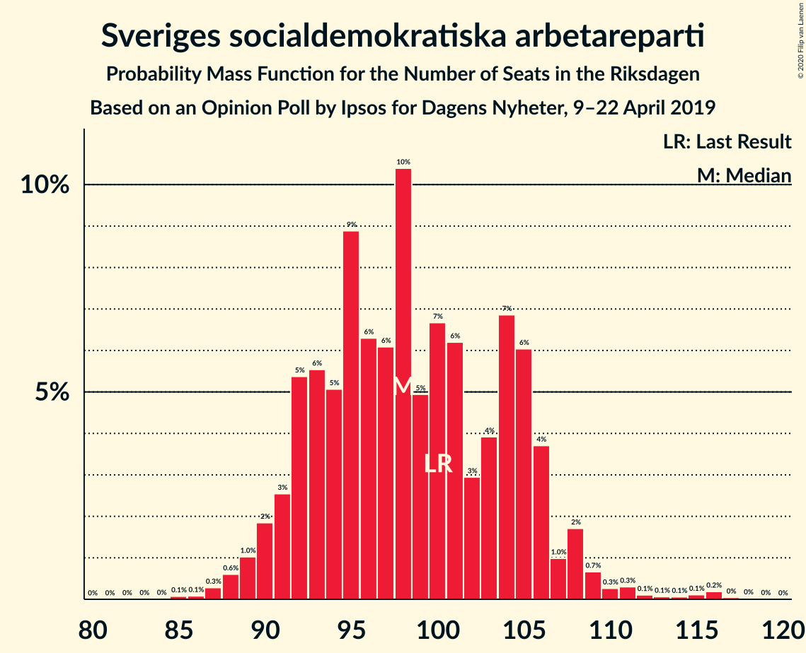
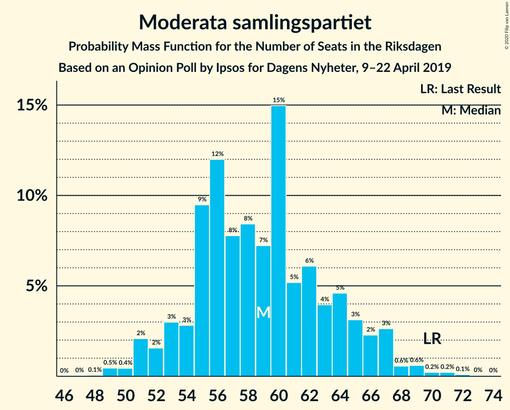
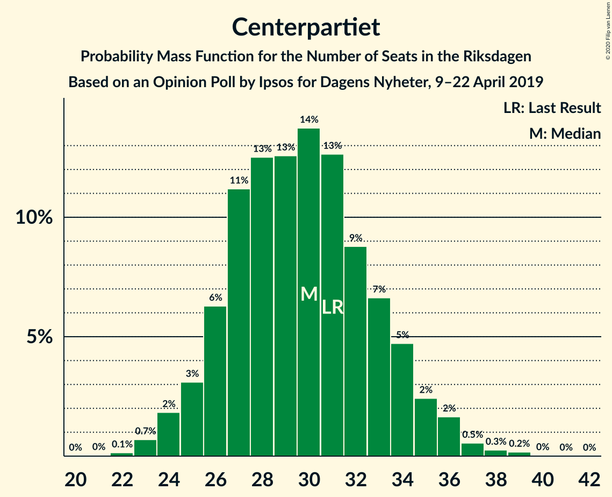
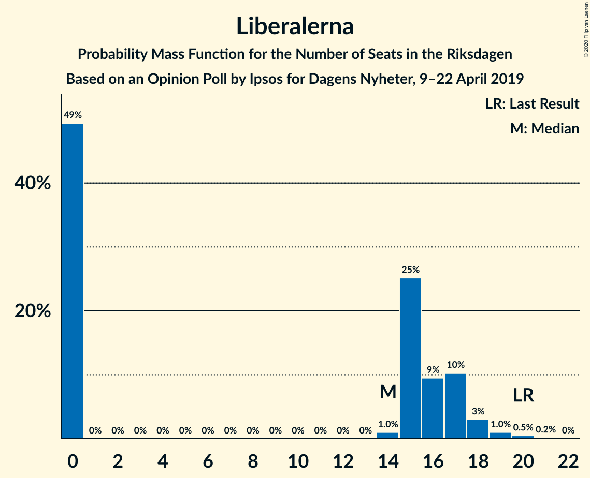
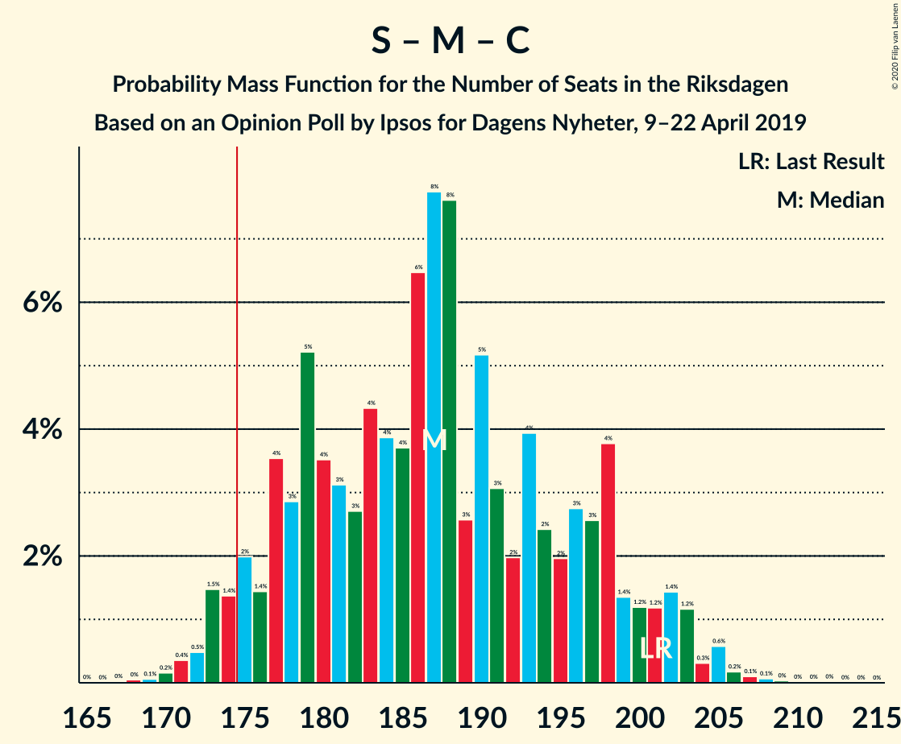
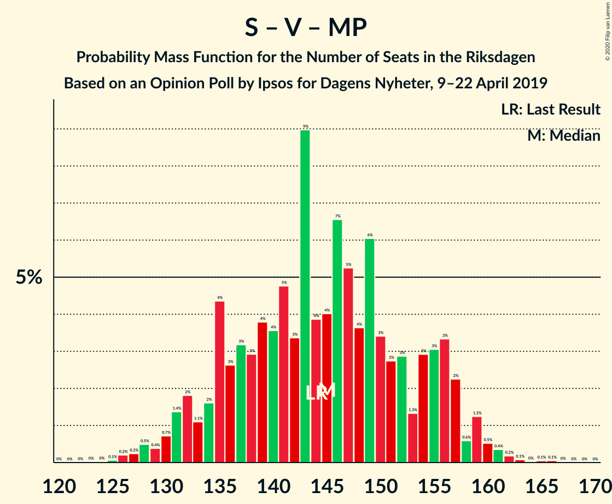
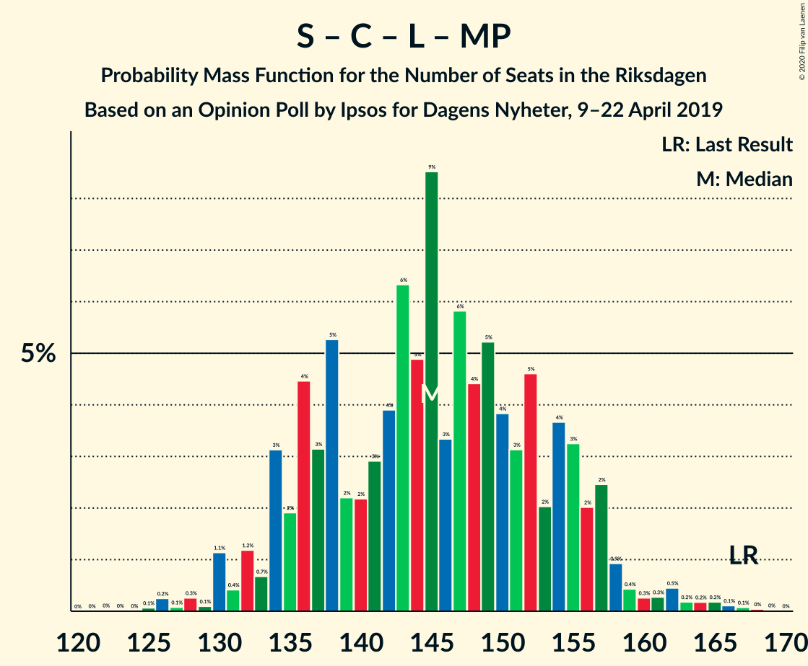
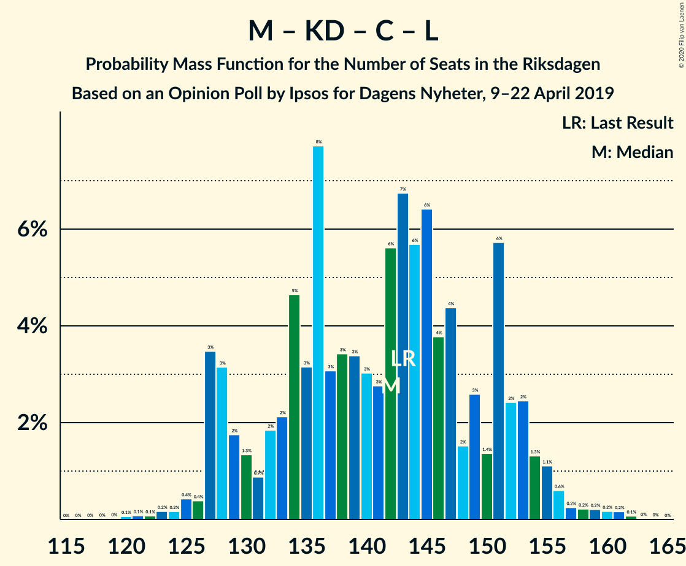
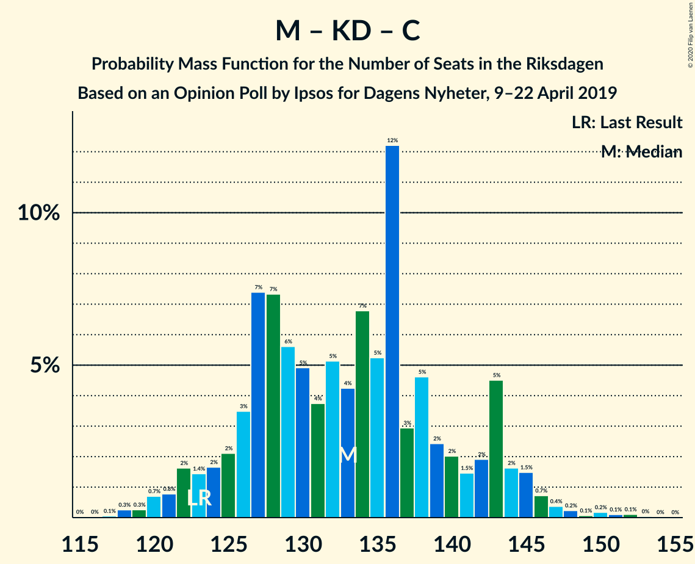

# Opinion Poll by Ipsos for Dagens Nyheter, 9–22 April 2019

<a href="#voting-intentions">Voting Intentions</a> | <a href="#seats">Seats</a> | <a href="#coalitions">Coalitions</a> | <a href="#technical-information">Technical Information</a>

## Voting Intentions

### Confidence Intervals

| Party | Last Result | Poll Result | 80% Confidence Interval | 90% Confidence Interval | 95% Confidence Interval | 99% Confidence Interval |
|:-----:|:-----------:|:-----------:|:-----------------------:|:-----------------------:|:-----------------------:|:-----------------------:|
| Sveriges socialdemokratiska arbetareparti | 28.3% | 27.3% | 25.8–28.8% |25.4–29.2% |25.0–29.6% |24.4–30.3% |
| Sverigedemokraterna | 17.5% | 17.2% | 16.0–18.5% |15.6–18.8% |15.3–19.2% |14.8–19.8% |
| Moderata samlingspartiet | 19.8% | 16.2% | 15.0–17.4% |14.6–17.8% |14.4–18.1% |13.8–18.7% |
| Kristdemokraterna | 6.3% | 12.1% | 11.1–13.3% |10.8–13.6% |10.5–13.9% |10.1–14.4% |
| Vänsterpartiet | 8.0% | 10.1% | 9.1–11.2% |8.9–11.5% |8.7–11.7% |8.2–12.3% |
| Centerpartiet | 8.6% | 8.1% | 7.2–9.1% |7.0–9.3% |6.8–9.6% |6.4–10.1% |
| Liberalerna | 5.5% | 4.0% | 3.4–4.8% |3.3–5.0% |3.1–5.2% |2.9–5.5% |
| Miljöpartiet de gröna | 4.4% | 4.0% | 3.4–4.8% |3.3–5.0% |3.1–5.2% |2.9–5.5% |

*Note:* The poll result column reflects the actual value used in the calculations. Published results may vary slightly, and in addition be rounded to fewer digits.

## Seats

### Confidence Intervals

| Party | Last Result | Median | 80% Confidence Interval | 90% Confidence Interval | 95% Confidence Interval | 99% Confidence Interval |
|:-----:|:-----------:|:------:|:-----------------------:|:-----------------------:|:-----------------------:|:-----------------------:|
| <a href="#sveriges-socialdemokratiska-arbetareparti">Sveriges socialdemokratiska arbetareparti</a> | 100 | 98 | 92–105 |91–106 |90–108 |88–113 |
| <a href="#sverigedemokraterna">Sverigedemokraterna</a> | 62 | 63 | 58–68 |57–69 |56–71 |53–73 |
| <a href="#moderata-samlingspartiet">Moderata samlingspartiet</a> | 70 | 59 | 54–64 |53–66 |51–67 |49–70 |
| <a href="#kristdemokraterna">Kristdemokraterna</a> | 22 | 44 | 40–49 |39–50 |38–52 |36–54 |
| <a href="#vänsterpartiet">Vänsterpartiet</a> | 28 | 37 | 34–41 |32–42 |31–43 |30–46 |
| <a href="#centerpartiet">Centerpartiet</a> | 31 | 30 | 26–33 |25–35 |24–36 |23–37 |
| <a href="#liberalerna">Liberalerna</a> | 20 | 14 | 0–17 |0–17 |0–18 |0–20 |
| <a href="#miljöpartiet-de-gröna">Miljöpartiet de gröna</a> | 16 | 15 | 0–17 |0–18 |0–19 |0–20 |

### Sveriges socialdemokratiska arbetareparti

*For a full overview of the results for this party, see the [Sveriges socialdemokratiska arbetareparti](party-sverigessocialdemokratiskaarbetareparti.html) page.*

| Number of Seats | Probability | Accumulated | Special Marks |
|:---------------:|:-----------:|:-----------:|:-------------:|
| 85 | 0.1% | 100% |  |
| 86 | 0.1% | 99.9% |  |
| 87 | 0.3% | 99.8% |  |
| 88 | 0.6% | 99.5% |  |
| 89 | 1.0% | 98.9% |  |
| 90 | 2% | 98% |  |
| 91 | 3% | 96% |  |
| 92 | 5% | 94% |  |
| 93 | 6% | 88% |  |
| 94 | 5% | 83% |  |
| 95 | 9% | 78% |  |
| 96 | 6% | 69% |  |
| 97 | 6% | 62% |  |
| 98 | 10% | 56% | Median |
| 99 | 5% | 46% |  |
| 100 | 7% | 41% | Last Result |
| 101 | 6% | 34% |  |
| 102 | 3% | 28% |  |
| 103 | 4% | 25% |  |
| 104 | 7% | 21% |  |
| 105 | 6% | 14% |  |
| 106 | 4% | 8% |  |
| 107 | 1.0% | 5% |  |
| 108 | 2% | 4% |  |
| 109 | 0.7% | 2% |  |
| 110 | 0.3% | 1.2% |  |
| 111 | 0.3% | 0.9% |  |
| 112 | 0.1% | 0.6% |  |
| 113 | 0.1% | 0.5% |  |
| 114 | 0.1% | 0.4% |  |
| 115 | 0.1% | 0.4% |  |
| 116 | 0.2% | 0.3% |  |
| 117 | 0% | 0.1% |  |
| 118 | 0% | 0% |  |

### Sverigedemokraterna

*For a full overview of the results for this party, see the [Sverigedemokraterna](party-sverigedemokraterna.html) page.*

| Number of Seats | Probability | Accumulated | Special Marks |
|:---------------:|:-----------:|:-----------:|:-------------:|
| 50 | 0% | 100% |  |
| 51 | 0.1% | 99.9% |  |
| 52 | 0.2% | 99.9% |  |
| 53 | 0.4% | 99.7% |  |
| 54 | 0.6% | 99.3% |  |
| 55 | 0.9% | 98.8% |  |
| 56 | 1.4% | 98% |  |
| 57 | 2% | 97% |  |
| 58 | 5% | 94% |  |
| 59 | 6% | 89% |  |
| 60 | 8% | 83% |  |
| 61 | 9% | 75% |  |
| 62 | 8% | 66% | Last Result |
| 63 | 11% | 58% | Median |
| 64 | 10% | 46% |  |
| 65 | 9% | 37% |  |
| 66 | 9% | 28% |  |
| 67 | 6% | 19% |  |
| 68 | 5% | 13% |  |
| 69 | 4% | 8% |  |
| 70 | 1.3% | 4% |  |
| 71 | 1.0% | 3% |  |
| 72 | 1.0% | 2% |  |
| 73 | 0.5% | 1.0% |  |
| 74 | 0.3% | 0.5% |  |
| 75 | 0.1% | 0.2% |  |
| 76 | 0% | 0.1% |  |
| 77 | 0% | 0.1% |  |
| 78 | 0% | 0% |  |

### Moderata samlingspartiet

*For a full overview of the results for this party, see the [Moderata samlingspartiet](party-moderatasamlingspartiet.html) page.*

| Number of Seats | Probability | Accumulated | Special Marks |
|:---------------:|:-----------:|:-----------:|:-------------:|
| 48 | 0.1% | 100% |  |
| 49 | 0.5% | 99.9% |  |
| 50 | 0.4% | 99.4% |  |
| 51 | 2% | 99.0% |  |
| 52 | 2% | 97% |  |
| 53 | 3% | 95% |  |
| 54 | 3% | 92% |  |
| 55 | 9% | 90% |  |
| 56 | 12% | 80% |  |
| 57 | 8% | 68% |  |
| 58 | 8% | 60% |  |
| 59 | 7% | 52% | Median |
| 60 | 15% | 45% |  |
| 61 | 5% | 30% |  |
| 62 | 6% | 24% |  |
| 63 | 4% | 18% |  |
| 64 | 5% | 14% |  |
| 65 | 3% | 10% |  |
| 66 | 2% | 7% |  |
| 67 | 3% | 4% |  |
| 68 | 0.6% | 2% |  |
| 69 | 0.6% | 1.2% |  |
| 70 | 0.2% | 0.6% | Last Result |
| 71 | 0.2% | 0.4% |  |
| 72 | 0.1% | 0.2% |  |
| 73 | 0% | 0.1% |  |
| 74 | 0% | 0% |  |

### Kristdemokraterna

*For a full overview of the results for this party, see the [Kristdemokraterna](party-kristdemokraterna.html) page.*

| Number of Seats | Probability | Accumulated | Special Marks |
|:---------------:|:-----------:|:-----------:|:-------------:|
| 22 | 0% | 100% | Last Result |
| 23 | 0% | 100% |  |
| 24 | 0% | 100% |  |
| 25 | 0% | 100% |  |
| 26 | 0% | 100% |  |
| 27 | 0% | 100% |  |
| 28 | 0% | 100% |  |
| 29 | 0% | 100% |  |
| 30 | 0% | 100% |  |
| 31 | 0% | 100% |  |
| 32 | 0% | 100% |  |
| 33 | 0% | 100% |  |
| 34 | 0.1% | 100% |  |
| 35 | 0.2% | 99.9% |  |
| 36 | 0.7% | 99.7% |  |
| 37 | 0.7% | 99.0% |  |
| 38 | 2% | 98% |  |
| 39 | 3% | 97% |  |
| 40 | 4% | 94% |  |
| 41 | 7% | 89% |  |
| 42 | 10% | 82% |  |
| 43 | 12% | 72% |  |
| 44 | 12% | 60% | Median |
| 45 | 11% | 48% |  |
| 46 | 11% | 37% |  |
| 47 | 7% | 26% |  |
| 48 | 6% | 20% |  |
| 49 | 7% | 13% |  |
| 50 | 2% | 6% |  |
| 51 | 1.4% | 4% |  |
| 52 | 1.4% | 3% |  |
| 53 | 0.4% | 1.1% |  |
| 54 | 0.4% | 0.7% |  |
| 55 | 0.1% | 0.3% |  |
| 56 | 0.1% | 0.2% |  |
| 57 | 0% | 0% |  |

### Vänsterpartiet

*For a full overview of the results for this party, see the [Vänsterpartiet](party-vänsterpartiet.html) page.*

| Number of Seats | Probability | Accumulated | Special Marks |
|:---------------:|:-----------:|:-----------:|:-------------:|
| 28 | 0% | 100% | Last Result |
| 29 | 0.4% | 99.9% |  |
| 30 | 0.6% | 99.5% |  |
| 31 | 2% | 98.9% |  |
| 32 | 4% | 97% |  |
| 33 | 3% | 93% |  |
| 34 | 7% | 91% |  |
| 35 | 15% | 84% |  |
| 36 | 10% | 69% |  |
| 37 | 14% | 59% | Median |
| 38 | 12% | 45% |  |
| 39 | 11% | 33% |  |
| 40 | 8% | 22% |  |
| 41 | 6% | 14% |  |
| 42 | 4% | 8% |  |
| 43 | 3% | 5% |  |
| 44 | 0.9% | 2% |  |
| 45 | 0.8% | 1.3% |  |
| 46 | 0.3% | 0.5% |  |
| 47 | 0% | 0.2% |  |
| 48 | 0.2% | 0.2% |  |
| 49 | 0% | 0% |  |

### Centerpartiet

*For a full overview of the results for this party, see the [Centerpartiet](party-centerpartiet.html) page.*

| Number of Seats | Probability | Accumulated | Special Marks |
|:---------------:|:-----------:|:-----------:|:-------------:|
| 22 | 0.1% | 100% |  |
| 23 | 0.7% | 99.8% |  |
| 24 | 2% | 99.1% |  |
| 25 | 3% | 97% |  |
| 26 | 6% | 94% |  |
| 27 | 11% | 88% |  |
| 28 | 13% | 77% |  |
| 29 | 13% | 64% |  |
| 30 | 14% | 52% | Median |
| 31 | 13% | 38% | Last Result |
| 32 | 9% | 25% |  |
| 33 | 7% | 16% |  |
| 34 | 5% | 10% |  |
| 35 | 2% | 5% |  |
| 36 | 2% | 3% |  |
| 37 | 0.5% | 1.0% |  |
| 38 | 0.3% | 0.5% |  |
| 39 | 0.2% | 0.2% |  |
| 40 | 0% | 0.1% |  |
| 41 | 0% | 0% |  |

### Liberalerna

*For a full overview of the results for this party, see the [Liberalerna](party-liberalerna.html) page.*

| Number of Seats | Probability | Accumulated | Special Marks |
|:---------------:|:-----------:|:-----------:|:-------------:|
| 0 | 49% | 100% |  |
| 1 | 0% | 51% |  |
| 2 | 0% | 51% |  |
| 3 | 0% | 51% |  |
| 4 | 0% | 51% |  |
| 5 | 0% | 51% |  |
| 6 | 0% | 51% |  |
| 7 | 0% | 51% |  |
| 8 | 0% | 51% |  |
| 9 | 0% | 51% |  |
| 10 | 0% | 51% |  |
| 11 | 0% | 51% |  |
| 12 | 0% | 51% |  |
| 13 | 0% | 51% |  |
| 14 | 1.0% | 51% | Median |
| 15 | 25% | 50% |  |
| 16 | 9% | 24% |  |
| 17 | 10% | 15% |  |
| 18 | 3% | 5% |  |
| 19 | 1.0% | 2% |  |
| 20 | 0.5% | 0.7% | Last Result |
| 21 | 0.2% | 0.2% |  |
| 22 | 0% | 0% |  |

### Miljöpartiet de gröna

*For a full overview of the results for this party, see the [Miljöpartiet de gröna](party-miljöpartietdegröna.html) page.*

| Number of Seats | Probability | Accumulated | Special Marks |
|:---------------:|:-----------:|:-----------:|:-------------:|
| 0 | 45% | 100% |  |
| 1 | 0% | 55% |  |
| 2 | 0% | 55% |  |
| 3 | 0% | 55% |  |
| 4 | 0% | 55% |  |
| 5 | 0% | 55% |  |
| 6 | 0% | 55% |  |
| 7 | 0% | 55% |  |
| 8 | 0% | 55% |  |
| 9 | 0% | 55% |  |
| 10 | 0% | 55% |  |
| 11 | 0% | 55% |  |
| 12 | 0% | 55% |  |
| 13 | 0% | 55% |  |
| 14 | 5% | 55% |  |
| 15 | 15% | 50% | Median |
| 16 | 17% | 36% | Last Result |
| 17 | 12% | 19% |  |
| 18 | 4% | 7% |  |
| 19 | 2% | 3% |  |
| 20 | 0.8% | 1.1% |  |
| 21 | 0.2% | 0.3% |  |
| 22 | 0% | 0.1% |  |
| 23 | 0% | 0% |  |

## Coalitions

### Confidence Intervals

| Coalition | Last Result | Median | Majority? | 80% Confidence Interval | 90% Confidence Interval | 95% Confidence Interval | 99% Confidence Interval |
|:---------:|:-----------:|:------:|:---------:|:-----------------------:|:-----------------------:|:-----------------------:|:-----------------------:|
| Sveriges socialdemokratiska arbetareparti – Moderata samlingspartiet – Centerpartiet | 201 | 187 | 96% | 177–198 | 175–201 | 173–202 | 171–205 |
| Sveriges socialdemokratiska arbetareparti – Vänsterpartiet – Centerpartiet – Liberalerna – Miljöpartiet de gröna | 195 | 182 | 88% | 174–191 | 172–193 | 170–195 | 165–198 |
| Sverigedemokraterna – Moderata samlingspartiet – Kristdemokraterna | 154 | 167 | 12% | 158–175 | 156–177 | 154–179 | 151–184 |
| Sveriges socialdemokratiska arbetareparti – Moderata samlingspartiet | 170 | 157 | 0.6% | 149–166 | 147–170 | 145–172 | 143–175 |
| Sveriges socialdemokratiska arbetareparti – Vänsterpartiet – Miljöpartiet de gröna | 144 | 145 | 0% | 135–155 | 132–157 | 131–159 | 127–161 |
| Sveriges socialdemokratiska arbetareparti – Centerpartiet – Liberalerna – Miljöpartiet de gröna | 167 | 145 | 0% | 136–155 | 134–157 | 132–158 | 128–164 |
| Moderata samlingspartiet – Kristdemokraterna – Centerpartiet – Liberalerna | 143 | 142 | 0% | 130–151 | 128–153 | 127–155 | 124–159 |
| Sveriges socialdemokratiska arbetareparti – Vänsterpartiet | 128 | 135 | 0% | 128–144 | 126–146 | 125–148 | 121–153 |
| Moderata samlingspartiet – Kristdemokraterna – Centerpartiet | 123 | 133 | 0% | 126–142 | 123–143 | 122–145 | 119–149 |
| Sverigedemokraterna – Moderata samlingspartiet | 132 | 122 | 0% | 115–130 | 114–131 | 112–133 | 108–138 |
| Sveriges socialdemokratiska arbetareparti – Miljöpartiet de gröna | 116 | 107 | 0% | 97–117 | 95–120 | 94–120 | 92–123 |
| Moderata samlingspartiet – Centerpartiet – Liberalerna | 121 | 97 | 0% | 86–107 | 85–109 | 83–111 | 81–114 |
| Moderata samlingspartiet – Centerpartiet | 101 | 88 | 0% | 82–95 | 81–98 | 80–99 | 77–102 |

### Sveriges socialdemokratiska arbetareparti – Moderata samlingspartiet – Centerpartiet

| Number of Seats | Probability | Accumulated | Special Marks |
|:---------------:|:-----------:|:-----------:|:-------------:|
| 168 | 0% | 100% |  |
| 169 | 0.1% | 99.9% |  |
| 170 | 0.2% | 99.8% |  |
| 171 | 0.4% | 99.7% |  |
| 172 | 0.5% | 99.3% |  |
| 173 | 1.5% | 98.8% |  |
| 174 | 1.4% | 97% |  |
| 175 | 2% | 96% | Majority |
| 176 | 1.4% | 94% |  |
| 177 | 4% | 93% |  |
| 178 | 3% | 89% |  |
| 179 | 5% | 86% |  |
| 180 | 4% | 81% |  |
| 181 | 3% | 77% |  |
| 182 | 3% | 74% |  |
| 183 | 4% | 72% |  |
| 184 | 4% | 67% |  |
| 185 | 4% | 63% |  |
| 186 | 6% | 60% |  |
| 187 | 8% | 53% | Median |
| 188 | 8% | 45% |  |
| 189 | 3% | 38% |  |
| 190 | 5% | 35% |  |
| 191 | 3% | 30% |  |
| 192 | 2% | 27% |  |
| 193 | 4% | 25% |  |
| 194 | 2% | 21% |  |
| 195 | 2% | 19% |  |
| 196 | 3% | 17% |  |
| 197 | 3% | 14% |  |
| 198 | 4% | 11% |  |
| 199 | 1.4% | 8% |  |
| 200 | 1.2% | 6% |  |
| 201 | 1.2% | 5% | Last Result |
| 202 | 1.4% | 4% |  |
| 203 | 1.2% | 2% |  |
| 204 | 0.3% | 1.3% |  |
| 205 | 0.6% | 1.0% |  |
| 206 | 0.2% | 0.4% |  |
| 207 | 0.1% | 0.3% |  |
| 208 | 0.1% | 0.2% |  |
| 209 | 0% | 0.1% |  |
| 210 | 0% | 0.1% |  |
| 211 | 0% | 0% |  |

### Sveriges socialdemokratiska arbetareparti – Vänsterpartiet – Centerpartiet – Liberalerna – Miljöpartiet de gröna

| Number of Seats | Probability | Accumulated | Special Marks |
|:---------------:|:-----------:|:-----------:|:-------------:|
| 162 | 0% | 100% |  |
| 163 | 0.1% | 99.9% |  |
| 164 | 0.2% | 99.9% |  |
| 165 | 0.5% | 99.7% |  |
| 166 | 0.2% | 99.2% |  |
| 167 | 0.3% | 99.1% |  |
| 168 | 0.2% | 98.8% |  |
| 169 | 1.0% | 98.6% |  |
| 170 | 0.8% | 98% |  |
| 171 | 1.1% | 97% |  |
| 172 | 2% | 96% |  |
| 173 | 2% | 94% |  |
| 174 | 4% | 92% |  |
| 175 | 4% | 88% | Majority |
| 176 | 2% | 84% |  |
| 177 | 6% | 82% |  |
| 178 | 5% | 77% |  |
| 179 | 4% | 72% |  |
| 180 | 8% | 68% |  |
| 181 | 5% | 60% |  |
| 182 | 5% | 54% |  |
| 183 | 5% | 50% |  |
| 184 | 7% | 45% |  |
| 185 | 6% | 38% |  |
| 186 | 4% | 32% |  |
| 187 | 4% | 28% |  |
| 188 | 5% | 24% |  |
| 189 | 6% | 20% |  |
| 190 | 3% | 14% |  |
| 191 | 3% | 11% |  |
| 192 | 3% | 8% |  |
| 193 | 1.3% | 5% |  |
| 194 | 0.5% | 4% | Median |
| 195 | 1.0% | 3% | Last Result |
| 196 | 0.6% | 2% |  |
| 197 | 0.9% | 2% |  |
| 198 | 0.3% | 0.7% |  |
| 199 | 0.2% | 0.5% |  |
| 200 | 0.1% | 0.3% |  |
| 201 | 0.1% | 0.2% |  |
| 202 | 0% | 0.1% |  |
| 203 | 0% | 0% |  |

### Sverigedemokraterna – Moderata samlingspartiet – Kristdemokraterna

| Number of Seats | Probability | Accumulated | Special Marks |
|:---------------:|:-----------:|:-----------:|:-------------:|
| 147 | 0% | 100% |  |
| 148 | 0.1% | 99.9% |  |
| 149 | 0.1% | 99.8% |  |
| 150 | 0.2% | 99.7% |  |
| 151 | 0.3% | 99.5% |  |
| 152 | 0.9% | 99.3% |  |
| 153 | 0.6% | 98% |  |
| 154 | 1.0% | 98% | Last Result |
| 155 | 0.5% | 97% |  |
| 156 | 1.3% | 96% |  |
| 157 | 3% | 95% |  |
| 158 | 3% | 92% |  |
| 159 | 3% | 89% |  |
| 160 | 6% | 86% |  |
| 161 | 5% | 80% |  |
| 162 | 4% | 76% |  |
| 163 | 4% | 72% |  |
| 164 | 6% | 68% |  |
| 165 | 7% | 62% |  |
| 166 | 5% | 55% | Median |
| 167 | 5% | 50% |  |
| 168 | 5% | 46% |  |
| 169 | 8% | 40% |  |
| 170 | 4% | 32% |  |
| 171 | 5% | 28% |  |
| 172 | 6% | 23% |  |
| 173 | 2% | 18% |  |
| 174 | 4% | 16% |  |
| 175 | 4% | 12% | Majority |
| 176 | 2% | 8% |  |
| 177 | 2% | 6% |  |
| 178 | 1.1% | 4% |  |
| 179 | 0.8% | 3% |  |
| 180 | 1.0% | 2% |  |
| 181 | 0.2% | 1.4% |  |
| 182 | 0.3% | 1.2% |  |
| 183 | 0.2% | 0.9% |  |
| 184 | 0.5% | 0.8% |  |
| 185 | 0.2% | 0.3% |  |
| 186 | 0.1% | 0.1% |  |
| 187 | 0% | 0.1% |  |
| 188 | 0% | 0% |  |

### Sveriges socialdemokratiska arbetareparti – Moderata samlingspartiet

| Number of Seats | Probability | Accumulated | Special Marks |
|:---------------:|:-----------:|:-----------:|:-------------:|
| 139 | 0% | 100% |  |
| 140 | 0% | 99.9% |  |
| 141 | 0.1% | 99.9% |  |
| 142 | 0.3% | 99.8% |  |
| 143 | 0.3% | 99.5% |  |
| 144 | 1.1% | 99.2% |  |
| 145 | 1.4% | 98% |  |
| 146 | 1.5% | 97% |  |
| 147 | 2% | 95% |  |
| 148 | 2% | 93% |  |
| 149 | 4% | 91% |  |
| 150 | 4% | 88% |  |
| 151 | 5% | 84% |  |
| 152 | 4% | 79% |  |
| 153 | 5% | 75% |  |
| 154 | 4% | 70% |  |
| 155 | 5% | 66% |  |
| 156 | 5% | 61% |  |
| 157 | 8% | 56% | Median |
| 158 | 6% | 48% |  |
| 159 | 6% | 41% |  |
| 160 | 5% | 36% |  |
| 161 | 6% | 31% |  |
| 162 | 2% | 25% |  |
| 163 | 3% | 23% |  |
| 164 | 5% | 20% |  |
| 165 | 3% | 15% |  |
| 166 | 2% | 12% |  |
| 167 | 2% | 10% |  |
| 168 | 1.3% | 8% |  |
| 169 | 1.3% | 7% |  |
| 170 | 0.7% | 5% | Last Result |
| 171 | 1.4% | 5% |  |
| 172 | 2% | 3% |  |
| 173 | 0.4% | 1.1% |  |
| 174 | 0.2% | 0.7% |  |
| 175 | 0.4% | 0.6% | Majority |
| 176 | 0.1% | 0.2% |  |
| 177 | 0% | 0.1% |  |
| 178 | 0% | 0.1% |  |
| 179 | 0% | 0.1% |  |
| 180 | 0% | 0% |  |

### Sveriges socialdemokratiska arbetareparti – Vänsterpartiet – Miljöpartiet de gröna

| Number of Seats | Probability | Accumulated | Special Marks |
|:---------------:|:-----------:|:-----------:|:-------------:|
| 124 | 0% | 100% |  |
| 125 | 0.1% | 99.9% |  |
| 126 | 0.2% | 99.9% |  |
| 127 | 0.2% | 99.7% |  |
| 128 | 0.5% | 99.4% |  |
| 129 | 0.4% | 98.9% |  |
| 130 | 0.7% | 98.6% |  |
| 131 | 1.4% | 98% |  |
| 132 | 2% | 96% |  |
| 133 | 1.1% | 95% |  |
| 134 | 2% | 94% |  |
| 135 | 4% | 92% |  |
| 136 | 3% | 88% |  |
| 137 | 3% | 85% |  |
| 138 | 3% | 82% |  |
| 139 | 4% | 79% |  |
| 140 | 4% | 75% |  |
| 141 | 5% | 72% |  |
| 142 | 3% | 67% |  |
| 143 | 9% | 63% |  |
| 144 | 4% | 54% | Last Result |
| 145 | 4% | 51% |  |
| 146 | 7% | 47% |  |
| 147 | 5% | 40% |  |
| 148 | 4% | 35% |  |
| 149 | 6% | 31% |  |
| 150 | 3% | 25% | Median |
| 151 | 3% | 22% |  |
| 152 | 3% | 19% |  |
| 153 | 1.3% | 16% |  |
| 154 | 3% | 15% |  |
| 155 | 3% | 12% |  |
| 156 | 3% | 9% |  |
| 157 | 2% | 5% |  |
| 158 | 0.6% | 3% |  |
| 159 | 1.2% | 3% |  |
| 160 | 0.5% | 1.3% |  |
| 161 | 0.4% | 0.8% |  |
| 162 | 0.2% | 0.4% |  |
| 163 | 0.1% | 0.2% |  |
| 164 | 0% | 0.2% |  |
| 165 | 0.1% | 0.1% |  |
| 166 | 0.1% | 0.1% |  |
| 167 | 0% | 0% |  |

### Sveriges socialdemokratiska arbetareparti – Centerpartiet – Liberalerna – Miljöpartiet de gröna

| Number of Seats | Probability | Accumulated | Special Marks |
|:---------------:|:-----------:|:-----------:|:-------------:|
| 124 | 0% | 100% |  |
| 125 | 0.1% | 99.9% |  |
| 126 | 0.2% | 99.9% |  |
| 127 | 0.1% | 99.6% |  |
| 128 | 0.3% | 99.6% |  |
| 129 | 0.1% | 99.3% |  |
| 130 | 1.1% | 99.2% |  |
| 131 | 0.4% | 98% |  |
| 132 | 1.2% | 98% |  |
| 133 | 0.7% | 96% |  |
| 134 | 3% | 96% |  |
| 135 | 2% | 93% |  |
| 136 | 4% | 91% |  |
| 137 | 3% | 86% |  |
| 138 | 5% | 83% |  |
| 139 | 2% | 78% |  |
| 140 | 2% | 76% |  |
| 141 | 3% | 73% |  |
| 142 | 4% | 71% |  |
| 143 | 6% | 67% |  |
| 144 | 5% | 60% |  |
| 145 | 9% | 55% |  |
| 146 | 3% | 47% |  |
| 147 | 6% | 44% |  |
| 148 | 4% | 38% |  |
| 149 | 5% | 33% |  |
| 150 | 4% | 28% |  |
| 151 | 3% | 24% |  |
| 152 | 5% | 21% |  |
| 153 | 2% | 17% |  |
| 154 | 4% | 15% |  |
| 155 | 3% | 11% |  |
| 156 | 2% | 8% |  |
| 157 | 2% | 6% | Median |
| 158 | 0.9% | 3% |  |
| 159 | 0.4% | 2% |  |
| 160 | 0.3% | 2% |  |
| 161 | 0.3% | 2% |  |
| 162 | 0.5% | 1.2% |  |
| 163 | 0.2% | 0.8% |  |
| 164 | 0.2% | 0.6% |  |
| 165 | 0.2% | 0.4% |  |
| 166 | 0.1% | 0.3% |  |
| 167 | 0.1% | 0.1% | Last Result |
| 168 | 0% | 0.1% |  |
| 169 | 0% | 0% |  |

### Moderata samlingspartiet – Kristdemokraterna – Centerpartiet – Liberalerna

| Number of Seats | Probability | Accumulated | Special Marks |
|:---------------:|:-----------:|:-----------:|:-------------:|
| 120 | 0.1% | 100% |  |
| 121 | 0.1% | 99.9% |  |
| 122 | 0.1% | 99.8% |  |
| 123 | 0.2% | 99.8% |  |
| 124 | 0.2% | 99.6% |  |
| 125 | 0.4% | 99.4% |  |
| 126 | 0.4% | 99.0% |  |
| 127 | 3% | 98.6% |  |
| 128 | 3% | 95% |  |
| 129 | 2% | 92% |  |
| 130 | 1.3% | 90% |  |
| 131 | 0.9% | 89% |  |
| 132 | 2% | 88% |  |
| 133 | 2% | 86% |  |
| 134 | 5% | 84% |  |
| 135 | 3% | 79% |  |
| 136 | 8% | 76% |  |
| 137 | 3% | 69% |  |
| 138 | 3% | 65% |  |
| 139 | 3% | 62% |  |
| 140 | 3% | 59% |  |
| 141 | 3% | 56% |  |
| 142 | 6% | 53% |  |
| 143 | 7% | 47% | Last Result |
| 144 | 6% | 40% |  |
| 145 | 6% | 35% |  |
| 146 | 4% | 28% |  |
| 147 | 4% | 25% | Median |
| 148 | 2% | 20% |  |
| 149 | 3% | 19% |  |
| 150 | 1.4% | 16% |  |
| 151 | 6% | 15% |  |
| 152 | 2% | 9% |  |
| 153 | 2% | 7% |  |
| 154 | 1.3% | 4% |  |
| 155 | 1.1% | 3% |  |
| 156 | 0.6% | 2% |  |
| 157 | 0.2% | 1.1% |  |
| 158 | 0.2% | 0.9% |  |
| 159 | 0.2% | 0.7% |  |
| 160 | 0.2% | 0.4% |  |
| 161 | 0.2% | 0.3% |  |
| 162 | 0.1% | 0.1% |  |
| 163 | 0% | 0% |  |

### Sveriges socialdemokratiska arbetareparti – Vänsterpartiet

| Number of Seats | Probability | Accumulated | Special Marks |
|:---------------:|:-----------:|:-----------:|:-------------:|
| 118 | 0% | 100% |  |
| 119 | 0.1% | 99.9% |  |
| 120 | 0.1% | 99.8% |  |
| 121 | 0.4% | 99.7% |  |
| 122 | 0.2% | 99.3% |  |
| 123 | 0.8% | 99.1% |  |
| 124 | 0.7% | 98% |  |
| 125 | 2% | 98% |  |
| 126 | 2% | 95% |  |
| 127 | 3% | 93% |  |
| 128 | 4% | 90% | Last Result |
| 129 | 3% | 86% |  |
| 130 | 6% | 83% |  |
| 131 | 6% | 77% |  |
| 132 | 5% | 71% |  |
| 133 | 5% | 66% |  |
| 134 | 6% | 61% |  |
| 135 | 6% | 56% | Median |
| 136 | 5% | 49% |  |
| 137 | 5% | 44% |  |
| 138 | 5% | 40% |  |
| 139 | 6% | 35% |  |
| 140 | 5% | 29% |  |
| 141 | 4% | 24% |  |
| 142 | 3% | 20% |  |
| 143 | 5% | 17% |  |
| 144 | 3% | 12% |  |
| 145 | 2% | 10% |  |
| 146 | 3% | 7% |  |
| 147 | 1.1% | 4% |  |
| 148 | 0.8% | 3% |  |
| 149 | 0.5% | 2% |  |
| 150 | 0.4% | 2% |  |
| 151 | 0.2% | 1.3% |  |
| 152 | 0.5% | 1.0% |  |
| 153 | 0.2% | 0.5% |  |
| 154 | 0.1% | 0.3% |  |
| 155 | 0.1% | 0.2% |  |
| 156 | 0% | 0.1% |  |
| 157 | 0% | 0% |  |

### Moderata samlingspartiet – Kristdemokraterna – Centerpartiet

| Number of Seats | Probability | Accumulated | Special Marks |
|:---------------:|:-----------:|:-----------:|:-------------:|
| 115 | 0% | 100% |  |
| 116 | 0% | 99.9% |  |
| 117 | 0.1% | 99.9% |  |
| 118 | 0.3% | 99.8% |  |
| 119 | 0.3% | 99.6% |  |
| 120 | 0.7% | 99.3% |  |
| 121 | 0.8% | 98.6% |  |
| 122 | 2% | 98% |  |
| 123 | 1.4% | 96% | Last Result |
| 124 | 2% | 95% |  |
| 125 | 2% | 93% |  |
| 126 | 3% | 91% |  |
| 127 | 7% | 88% |  |
| 128 | 7% | 80% |  |
| 129 | 6% | 73% |  |
| 130 | 5% | 67% |  |
| 131 | 4% | 62% |  |
| 132 | 5% | 59% |  |
| 133 | 4% | 53% | Median |
| 134 | 7% | 49% |  |
| 135 | 5% | 42% |  |
| 136 | 12% | 37% |  |
| 137 | 3% | 25% |  |
| 138 | 5% | 22% |  |
| 139 | 2% | 17% |  |
| 140 | 2% | 15% |  |
| 141 | 1.5% | 13% |  |
| 142 | 2% | 11% |  |
| 143 | 5% | 9% |  |
| 144 | 2% | 5% |  |
| 145 | 1.5% | 3% |  |
| 146 | 0.7% | 2% |  |
| 147 | 0.4% | 1.1% |  |
| 148 | 0.2% | 0.8% |  |
| 149 | 0.1% | 0.5% |  |
| 150 | 0.2% | 0.5% |  |
| 151 | 0.1% | 0.3% |  |
| 152 | 0.1% | 0.2% |  |
| 153 | 0% | 0.1% |  |
| 154 | 0% | 0% |  |

### Sverigedemokraterna – Moderata samlingspartiet

| Number of Seats | Probability | Accumulated | Special Marks |
|:---------------:|:-----------:|:-----------:|:-------------:|
| 105 | 0% | 100% |  |
| 106 | 0.1% | 99.9% |  |
| 107 | 0.2% | 99.8% |  |
| 108 | 0.4% | 99.6% |  |
| 109 | 0.3% | 99.2% |  |
| 110 | 0.3% | 98.8% |  |
| 111 | 0.6% | 98.6% |  |
| 112 | 0.6% | 98% |  |
| 113 | 1.4% | 97% |  |
| 114 | 5% | 96% |  |
| 115 | 6% | 91% |  |
| 116 | 2% | 86% |  |
| 117 | 5% | 84% |  |
| 118 | 7% | 79% |  |
| 119 | 3% | 72% |  |
| 120 | 10% | 69% |  |
| 121 | 3% | 59% |  |
| 122 | 8% | 56% | Median |
| 123 | 10% | 47% |  |
| 124 | 5% | 38% |  |
| 125 | 9% | 32% |  |
| 126 | 3% | 23% |  |
| 127 | 3% | 20% |  |
| 128 | 3% | 17% |  |
| 129 | 2% | 14% |  |
| 130 | 5% | 12% |  |
| 131 | 3% | 7% |  |
| 132 | 1.1% | 4% | Last Result |
| 133 | 1.1% | 3% |  |
| 134 | 0.3% | 2% |  |
| 135 | 0.4% | 2% |  |
| 136 | 0.3% | 1.2% |  |
| 137 | 0.4% | 0.9% |  |
| 138 | 0.2% | 0.5% |  |
| 139 | 0.2% | 0.4% |  |
| 140 | 0.1% | 0.1% |  |
| 141 | 0% | 0% |  |

### Sveriges socialdemokratiska arbetareparti – Miljöpartiet de gröna

| Number of Seats | Probability | Accumulated | Special Marks |
|:---------------:|:-----------:|:-----------:|:-------------:|
| 89 | 0% | 100% |  |
| 90 | 0.1% | 99.9% |  |
| 91 | 0.2% | 99.8% |  |
| 92 | 0.3% | 99.6% |  |
| 93 | 1.2% | 99.3% |  |
| 94 | 1.3% | 98% |  |
| 95 | 2% | 97% |  |
| 96 | 2% | 95% |  |
| 97 | 3% | 93% |  |
| 98 | 3% | 90% |  |
| 99 | 2% | 87% |  |
| 100 | 5% | 85% |  |
| 101 | 4% | 79% |  |
| 102 | 2% | 75% |  |
| 103 | 2% | 73% |  |
| 104 | 6% | 71% |  |
| 105 | 4% | 65% |  |
| 106 | 8% | 60% |  |
| 107 | 4% | 53% |  |
| 108 | 4% | 49% |  |
| 109 | 6% | 45% |  |
| 110 | 3% | 39% |  |
| 111 | 2% | 37% |  |
| 112 | 6% | 35% |  |
| 113 | 6% | 29% | Median |
| 114 | 8% | 23% |  |
| 115 | 1.0% | 15% |  |
| 116 | 2% | 14% | Last Result |
| 117 | 3% | 12% |  |
| 118 | 2% | 10% |  |
| 119 | 2% | 8% |  |
| 120 | 4% | 6% |  |
| 121 | 0.6% | 2% |  |
| 122 | 0.2% | 1.2% |  |
| 123 | 0.4% | 0.9% |  |
| 124 | 0.3% | 0.5% |  |
| 125 | 0.1% | 0.2% |  |
| 126 | 0% | 0.2% |  |
| 127 | 0% | 0.1% |  |
| 128 | 0.1% | 0.1% |  |
| 129 | 0% | 0% |  |

### Moderata samlingspartiet – Centerpartiet – Liberalerna

| Number of Seats | Probability | Accumulated | Special Marks |
|:---------------:|:-----------:|:-----------:|:-------------:|
| 77 | 0% | 100% |  |
| 78 | 0% | 99.9% |  |
| 79 | 0.1% | 99.9% |  |
| 80 | 0.3% | 99.8% |  |
| 81 | 0.2% | 99.5% |  |
| 82 | 1.0% | 99.3% |  |
| 83 | 0.9% | 98% |  |
| 84 | 2% | 97% |  |
| 85 | 4% | 96% |  |
| 86 | 2% | 92% |  |
| 87 | 4% | 90% |  |
| 88 | 4% | 86% |  |
| 89 | 4% | 82% |  |
| 90 | 5% | 78% |  |
| 91 | 2% | 74% |  |
| 92 | 5% | 72% |  |
| 93 | 5% | 68% |  |
| 94 | 4% | 63% |  |
| 95 | 4% | 59% |  |
| 96 | 4% | 55% |  |
| 97 | 3% | 51% |  |
| 98 | 4% | 48% |  |
| 99 | 4% | 44% |  |
| 100 | 5% | 40% |  |
| 101 | 6% | 35% |  |
| 102 | 5% | 29% |  |
| 103 | 4% | 24% | Median |
| 104 | 5% | 20% |  |
| 105 | 2% | 15% |  |
| 106 | 3% | 14% |  |
| 107 | 3% | 11% |  |
| 108 | 1.5% | 7% |  |
| 109 | 1.3% | 6% |  |
| 110 | 2% | 4% |  |
| 111 | 1.2% | 3% |  |
| 112 | 0.3% | 1.5% |  |
| 113 | 0.6% | 1.2% |  |
| 114 | 0.3% | 0.6% |  |
| 115 | 0.1% | 0.3% |  |
| 116 | 0.1% | 0.2% |  |
| 117 | 0.1% | 0.1% |  |
| 118 | 0% | 0% |  |
| 119 | 0% | 0% |  |
| 120 | 0% | 0% |  |
| 121 | 0% | 0% | Last Result |

### Moderata samlingspartiet – Centerpartiet

| Number of Seats | Probability | Accumulated | Special Marks |
|:---------------:|:-----------:|:-----------:|:-------------:|
| 74 | 0.1% | 100% |  |
| 75 | 0.1% | 99.9% |  |
| 76 | 0.2% | 99.8% |  |
| 77 | 0.4% | 99.6% |  |
| 78 | 0.6% | 99.2% |  |
| 79 | 1.0% | 98.6% |  |
| 80 | 2% | 98% |  |
| 81 | 2% | 96% |  |
| 82 | 5% | 94% |  |
| 83 | 4% | 89% |  |
| 84 | 6% | 85% |  |
| 85 | 6% | 79% |  |
| 86 | 8% | 73% |  |
| 87 | 10% | 64% |  |
| 88 | 9% | 55% |  |
| 89 | 5% | 46% | Median |
| 90 | 8% | 41% |  |
| 91 | 3% | 33% |  |
| 92 | 7% | 29% |  |
| 93 | 6% | 23% |  |
| 94 | 5% | 17% |  |
| 95 | 3% | 12% |  |
| 96 | 3% | 9% |  |
| 97 | 1.0% | 6% |  |
| 98 | 1.3% | 5% |  |
| 99 | 2% | 4% |  |
| 100 | 0.9% | 2% |  |
| 101 | 0.3% | 0.9% | Last Result |
| 102 | 0.2% | 0.6% |  |
| 103 | 0.3% | 0.4% |  |
| 104 | 0.1% | 0.2% |  |
| 105 | 0% | 0.1% |  |
| 106 | 0% | 0.1% |  |
| 107 | 0% | 0% |  |

## Technical Information

### Opinion Poll

+ **Polling firm:** Ipsos
+ **Commissioner(s):** Dagens Nyheter
+ **Fieldwork period:** 9–22 April 2019

### Calculations

+ **Sample size:** 1486
+ **Simulations done:** 1,048,576
+ **Error estimate:** 0.78%

