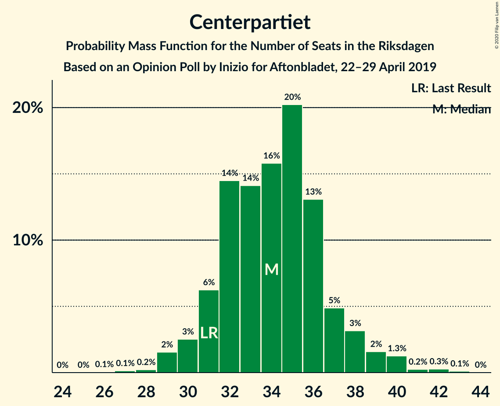
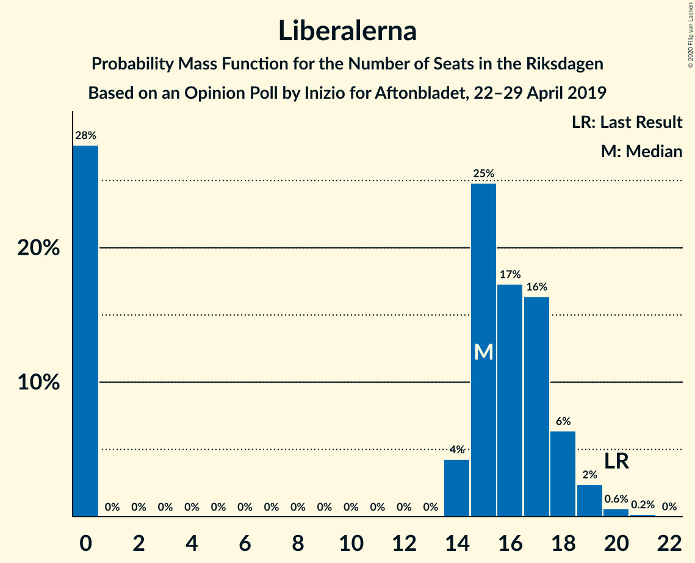
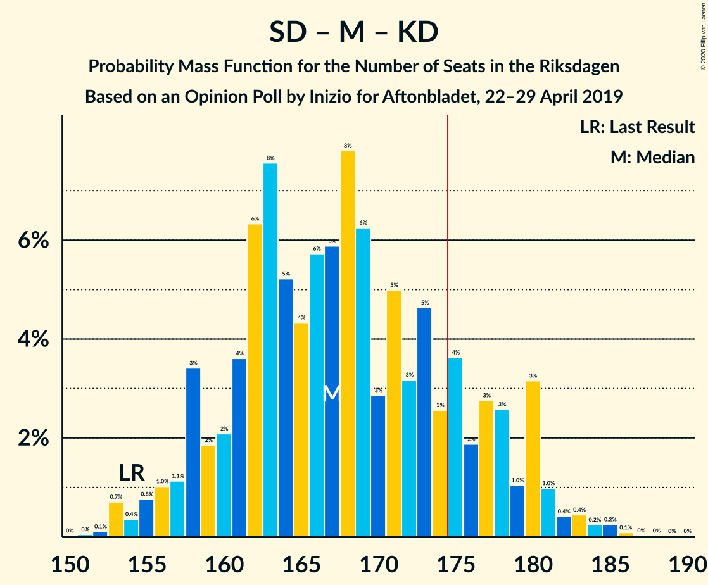

# Opinion Poll by Inizio for Aftonbladet, 22–29 April 2019

<a href="#voting-intentions">Voting Intentions</a> | <a href="#seats">Seats</a> | <a href="#coalitions">Coalitions</a> | <a href="#technical-information">Technical Information</a>

## Voting Intentions

### Confidence Intervals

| Party | Last Result | Poll Result | 80% Confidence Interval | 90% Confidence Interval | 95% Confidence Interval | 99% Confidence Interval |
|:-----:|:-----------:|:-----------:|:-----------------------:|:-----------------------:|:-----------------------:|:-----------------------:|
| Sveriges socialdemokratiska arbetareparti | 28.3% | 25.6% | 24.4–26.8% |24.1–27.2% |23.8–27.5% |23.2–28.1% |
| Sverigedemokraterna | 17.5% | 18.6% | 17.6–19.8% |17.3–20.1% |17.0–20.3% |16.5–20.9% |
| Moderata samlingspartiet | 19.8% | 15.7% | 14.7–16.7% |14.4–17.0% |14.2–17.3% |13.7–17.8% |
| Kristdemokraterna | 6.3% | 11.4% | 10.6–12.4% |10.3–12.6% |10.1–12.8% |9.7–13.3% |
| Vänsterpartiet | 8.0% | 9.5% | 8.7–10.4% |8.5–10.6% |8.3–10.9% |8.0–11.3% |
| Centerpartiet | 8.6% | 9.3% | 8.5–10.2% |8.3–10.4% |8.1–10.6% |7.8–11.0% |
| Liberalerna | 5.5% | 4.2% | 3.7–4.8% |3.6–5.0% |3.4–5.2% |3.2–5.5% |
| Miljöpartiet de gröna | 4.4% | 3.9% | 3.4–4.5% |3.2–4.6% |3.1–4.8% |2.9–5.1% |

*Note:* The poll result column reflects the actual value used in the calculations. Published results may vary slightly, and in addition be rounded to fewer digits.

## Seats

### Confidence Intervals

| Party | Last Result | Median | 80% Confidence Interval | 90% Confidence Interval | 95% Confidence Interval | 99% Confidence Interval |
|:-----:|:-----------:|:------:|:-----------------------:|:-----------------------:|:-----------------------:|:-----------------------:|
| <a href="#sveriges-socialdemokratiska-arbetareparti">Sveriges socialdemokratiska arbetareparti</a> | 100 | 93 | 90–100 |88–100 |86–100 |84–104 |
| <a href="#sverigedemokraterna">Sverigedemokraterna</a> | 62 | 70 | 64–76 |63–76 |62–76 |58–80 |
| <a href="#moderata-samlingspartiet">Moderata samlingspartiet</a> | 70 | 58 | 54–62 |52–64 |51–65 |50–68 |
| <a href="#kristdemokraterna">Kristdemokraterna</a> | 22 | 41 | 39–45 |38–46 |37–48 |36–50 |
| <a href="#vänsterpartiet">Vänsterpartiet</a> | 28 | 35 | 32–38 |31–39 |30–39 |28–41 |
| <a href="#centerpartiet">Centerpartiet</a> | 31 | 35 | 30–38 |30–38 |29–39 |28–40 |
| <a href="#liberalerna">Liberalerna</a> | 20 | 15 | 0–17 |0–18 |0–19 |0–20 |
| <a href="#miljöpartiet-de-gröna">Miljöpartiet de gröna</a> | 16 | 0 | 0–16 |0–16 |0–17 |0–18 |

### Sveriges socialdemokratiska arbetareparti

*For a full overview of the results for this party, see the [Sveriges socialdemokratiska arbetareparti](party-sverigessocialdemokratiskaarbetareparti.html) page.*

| Number of Seats | Probability | Accumulated | Special Marks |
|:---------------:|:-----------:|:-----------:|:-------------:|
| 80 | 0% | 100% |  |
| 81 | 0.1% | 99.9% |  |
| 82 | 0% | 99.8% |  |
| 83 | 0.1% | 99.8% |  |
| 84 | 0.5% | 99.7% |  |
| 85 | 2% | 99.1% |  |
| 86 | 0.5% | 98% |  |
| 87 | 1.4% | 97% |  |
| 88 | 2% | 96% |  |
| 89 | 2% | 94% |  |
| 90 | 4% | 92% |  |
| 91 | 14% | 88% |  |
| 92 | 20% | 74% |  |
| 93 | 6% | 54% | Median |
| 94 | 7% | 48% |  |
| 95 | 4% | 41% |  |
| 96 | 6% | 36% |  |
| 97 | 10% | 30% |  |
| 98 | 4% | 20% |  |
| 99 | 1.0% | 16% |  |
| 100 | 13% | 15% | Last Result |
| 101 | 0.4% | 2% |  |
| 102 | 0.4% | 2% |  |
| 103 | 0.5% | 1.4% |  |
| 104 | 0.5% | 0.9% |  |
| 105 | 0% | 0.5% |  |
| 106 | 0.3% | 0.4% |  |
| 107 | 0.1% | 0.1% |  |
| 108 | 0% | 0% |  |

### Sverigedemokraterna

*For a full overview of the results for this party, see the [Sverigedemokraterna](party-sverigedemokraterna.html) page.*

| Number of Seats | Probability | Accumulated | Special Marks |
|:---------------:|:-----------:|:-----------:|:-------------:|
| 58 | 0.5% | 100% |  |
| 59 | 0.5% | 99.5% |  |
| 60 | 0.5% | 99.0% |  |
| 61 | 0.5% | 98% |  |
| 62 | 1.5% | 98% | Last Result |
| 63 | 2% | 96% |  |
| 64 | 4% | 94% |  |
| 65 | 1.2% | 90% |  |
| 66 | 18% | 89% |  |
| 67 | 4% | 70% |  |
| 68 | 6% | 67% |  |
| 69 | 10% | 61% |  |
| 70 | 6% | 51% | Median |
| 71 | 2% | 45% |  |
| 72 | 4% | 43% |  |
| 73 | 20% | 39% |  |
| 74 | 4% | 19% |  |
| 75 | 3% | 16% |  |
| 76 | 11% | 12% |  |
| 77 | 0.6% | 1.4% |  |
| 78 | 0.1% | 0.8% |  |
| 79 | 0.1% | 0.7% |  |
| 80 | 0.4% | 0.5% |  |
| 81 | 0.1% | 0.1% |  |
| 82 | 0% | 0% |  |

### Moderata samlingspartiet

*For a full overview of the results for this party, see the [Moderata samlingspartiet](party-moderatasamlingspartiet.html) page.*

| Number of Seats | Probability | Accumulated | Special Marks |
|:---------------:|:-----------:|:-----------:|:-------------:|
| 48 | 0% | 100% |  |
| 49 | 0.1% | 99.9% |  |
| 50 | 0.4% | 99.8% |  |
| 51 | 4% | 99.3% |  |
| 52 | 3% | 95% |  |
| 53 | 2% | 92% |  |
| 54 | 2% | 90% |  |
| 55 | 8% | 88% |  |
| 56 | 3% | 80% |  |
| 57 | 16% | 77% |  |
| 58 | 18% | 61% | Median |
| 59 | 25% | 43% |  |
| 60 | 3% | 18% |  |
| 61 | 2% | 15% |  |
| 62 | 5% | 12% |  |
| 63 | 0.7% | 8% |  |
| 64 | 4% | 7% |  |
| 65 | 2% | 3% |  |
| 66 | 0.2% | 1.3% |  |
| 67 | 0.2% | 1.0% |  |
| 68 | 0.7% | 0.8% |  |
| 69 | 0% | 0.1% |  |
| 70 | 0% | 0% | Last Result |

### Kristdemokraterna

*For a full overview of the results for this party, see the [Kristdemokraterna](party-kristdemokraterna.html) page.*

| Number of Seats | Probability | Accumulated | Special Marks |
|:---------------:|:-----------:|:-----------:|:-------------:|
| 22 | 0% | 100% | Last Result |
| 23 | 0% | 100% |  |
| 24 | 0% | 100% |  |
| 25 | 0% | 100% |  |
| 26 | 0% | 100% |  |
| 27 | 0% | 100% |  |
| 28 | 0% | 100% |  |
| 29 | 0% | 100% |  |
| 30 | 0% | 100% |  |
| 31 | 0% | 100% |  |
| 32 | 0% | 100% |  |
| 33 | 0% | 100% |  |
| 34 | 0.2% | 100% |  |
| 35 | 0.2% | 99.8% |  |
| 36 | 0.5% | 99.6% |  |
| 37 | 2% | 99.0% |  |
| 38 | 5% | 97% |  |
| 39 | 15% | 92% |  |
| 40 | 10% | 78% |  |
| 41 | 25% | 68% | Median |
| 42 | 8% | 43% |  |
| 43 | 6% | 35% |  |
| 44 | 18% | 30% |  |
| 45 | 5% | 12% |  |
| 46 | 3% | 7% |  |
| 47 | 0.9% | 4% |  |
| 48 | 0.8% | 3% |  |
| 49 | 1.2% | 2% |  |
| 50 | 0.5% | 0.6% |  |
| 51 | 0.2% | 0.2% |  |
| 52 | 0% | 0% |  |

### Vänsterpartiet

*For a full overview of the results for this party, see the [Vänsterpartiet](party-vänsterpartiet.html) page.*

| Number of Seats | Probability | Accumulated | Special Marks |
|:---------------:|:-----------:|:-----------:|:-------------:|
| 28 | 0.5% | 100% | Last Result |
| 29 | 2% | 99.5% |  |
| 30 | 0.9% | 98% |  |
| 31 | 4% | 97% |  |
| 32 | 17% | 93% |  |
| 33 | 5% | 77% |  |
| 34 | 8% | 71% |  |
| 35 | 35% | 63% | Median |
| 36 | 7% | 28% |  |
| 37 | 9% | 21% |  |
| 38 | 7% | 12% |  |
| 39 | 3% | 5% |  |
| 40 | 1.4% | 2% |  |
| 41 | 0.4% | 0.7% |  |
| 42 | 0.1% | 0.3% |  |
| 43 | 0.1% | 0.2% |  |
| 44 | 0% | 0% |  |

### Centerpartiet

*For a full overview of the results for this party, see the [Centerpartiet](party-centerpartiet.html) page.*

| Number of Seats | Probability | Accumulated | Special Marks |
|:---------------:|:-----------:|:-----------:|:-------------:|
| 26 | 0.1% | 100% |  |
| 27 | 0.2% | 99.9% |  |
| 28 | 0.4% | 99.7% |  |
| 29 | 3% | 99.3% |  |
| 30 | 8% | 97% |  |
| 31 | 5% | 89% | Last Result |
| 32 | 3% | 84% |  |
| 33 | 3% | 81% |  |
| 34 | 20% | 78% |  |
| 35 | 10% | 58% | Median |
| 36 | 27% | 48% |  |
| 37 | 7% | 21% |  |
| 38 | 11% | 14% |  |
| 39 | 2% | 3% |  |
| 40 | 0.8% | 1.1% |  |
| 41 | 0.2% | 0.3% |  |
| 42 | 0.1% | 0.1% |  |
| 43 | 0% | 0% |  |

### Liberalerna

*For a full overview of the results for this party, see the [Liberalerna](party-liberalerna.html) page.*

| Number of Seats | Probability | Accumulated | Special Marks |
|:---------------:|:-----------:|:-----------:|:-------------:|
| 0 | 27% | 100% |  |
| 1 | 0% | 73% |  |
| 2 | 0% | 73% |  |
| 3 | 0% | 73% |  |
| 4 | 0% | 73% |  |
| 5 | 0% | 73% |  |
| 6 | 0% | 73% |  |
| 7 | 0% | 73% |  |
| 8 | 0% | 73% |  |
| 9 | 0% | 73% |  |
| 10 | 0% | 73% |  |
| 11 | 0% | 73% |  |
| 12 | 0% | 73% |  |
| 13 | 0% | 73% |  |
| 14 | 10% | 73% |  |
| 15 | 26% | 63% | Median |
| 16 | 17% | 37% |  |
| 17 | 12% | 20% |  |
| 18 | 5% | 8% |  |
| 19 | 2% | 3% |  |
| 20 | 1.0% | 1.1% | Last Result |
| 21 | 0.1% | 0.2% |  |
| 22 | 0% | 0% |  |

### Miljöpartiet de gröna

*For a full overview of the results for this party, see the [Miljöpartiet de gröna](party-miljöpartietdegröna.html) page.*

| Number of Seats | Probability | Accumulated | Special Marks |
|:---------------:|:-----------:|:-----------:|:-------------:|
| 0 | 71% | 100% | Median |
| 1 | 0% | 29% |  |
| 2 | 0% | 29% |  |
| 3 | 0% | 29% |  |
| 4 | 0% | 29% |  |
| 5 | 0% | 29% |  |
| 6 | 0% | 29% |  |
| 7 | 0% | 29% |  |
| 8 | 0% | 29% |  |
| 9 | 0% | 29% |  |
| 10 | 0% | 29% |  |
| 11 | 0% | 29% |  |
| 12 | 0% | 29% |  |
| 13 | 0% | 29% |  |
| 14 | 10% | 29% |  |
| 15 | 7% | 19% |  |
| 16 | 8% | 12% | Last Result |
| 17 | 2% | 4% |  |
| 18 | 2% | 2% |  |
| 19 | 0.2% | 0.2% |  |
| 20 | 0% | 0% |  |

## Coalitions

### Confidence Intervals

| Coalition | Last Result | Median | Majority? | 80% Confidence Interval | 90% Confidence Interval | 95% Confidence Interval | 99% Confidence Interval |
|:---------:|:-----------:|:------:|:---------:|:-----------------------:|:-----------------------:|:-----------------------:|:-----------------------:|
| Sveriges socialdemokratiska arbetareparti – Moderata samlingspartiet – Centerpartiet | 201 | 185 | 98% | 178–194 | 176–196 | 176–201 | 172–202 |
| Sveriges socialdemokratiska arbetareparti – Vänsterpartiet – Centerpartiet – Liberalerna – Miljöpartiet de gröna | 195 | 179 | 79% | 171–188 | 169–191 | 167–194 | 165–195 |
| Sverigedemokraterna – Moderata samlingspartiet – Kristdemokraterna | 154 | 170 | 21% | 161–178 | 158–180 | 155–182 | 154–184 |
| Sveriges socialdemokratiska arbetareparti – Moderata samlingspartiet | 170 | 151 | 0% | 146–158 | 143–160 | 141–164 | 137–166 |
| Sveriges socialdemokratiska arbetareparti – Centerpartiet – Liberalerna – Miljöpartiet de gröna | 167 | 143 | 0% | 136–155 | 133–156 | 131–158 | 129–162 |
| Moderata samlingspartiet – Kristdemokraterna – Centerpartiet – Liberalerna | 143 | 148 | 0% | 138–153 | 136–155 | 132–157 | 128–159 |
| Sveriges socialdemokratiska arbetareparti – Vänsterpartiet – Miljöpartiet de gröna | 144 | 134 | 0% | 127–143 | 126–146 | 123–147 | 122–153 |
| Moderata samlingspartiet – Kristdemokraterna – Centerpartiet | 123 | 134 | 0% | 128–141 | 124–143 | 122–145 | 122–149 |
| Sveriges socialdemokratiska arbetareparti – Vänsterpartiet | 128 | 128 | 0% | 123–135 | 122–135 | 120–138 | 116–141 |
| Sverigedemokraterna – Moderata samlingspartiet | 132 | 128 | 0% | 121–134 | 117–137 | 115–138 | 112–139 |
| Moderata samlingspartiet – Centerpartiet – Liberalerna | 121 | 107 | 0% | 94–112 | 93–114 | 91–116 | 88–116 |
| Sveriges socialdemokratiska arbetareparti – Miljöpartiet de gröna | 116 | 97 | 0% | 92–108 | 91–111 | 90–112 | 85–116 |
| Moderata samlingspartiet – Centerpartiet | 101 | 93 | 0% | 87–98 | 84–100 | 82–102 | 81–104 |

### Sveriges socialdemokratiska arbetareparti – Moderata samlingspartiet – Centerpartiet

| Number of Seats | Probability | Accumulated | Special Marks |
|:---------------:|:-----------:|:-----------:|:-------------:|
| 169 | 0.1% | 100% |  |
| 170 | 0.1% | 99.9% |  |
| 171 | 0.1% | 99.8% |  |
| 172 | 0.6% | 99.7% |  |
| 173 | 0.3% | 99.1% |  |
| 174 | 0.7% | 98.7% |  |
| 175 | 0.3% | 98% | Majority |
| 176 | 4% | 98% |  |
| 177 | 3% | 94% |  |
| 178 | 2% | 91% |  |
| 179 | 2% | 90% |  |
| 180 | 2% | 88% |  |
| 181 | 1.2% | 86% |  |
| 182 | 1.5% | 85% |  |
| 183 | 2% | 83% |  |
| 184 | 13% | 81% |  |
| 185 | 21% | 68% |  |
| 186 | 7% | 46% | Median |
| 187 | 2% | 40% |  |
| 188 | 2% | 38% |  |
| 189 | 6% | 36% |  |
| 190 | 6% | 30% |  |
| 191 | 1.0% | 24% |  |
| 192 | 2% | 23% |  |
| 193 | 0.4% | 21% |  |
| 194 | 13% | 21% |  |
| 195 | 0.8% | 8% |  |
| 196 | 3% | 7% |  |
| 197 | 0.2% | 4% |  |
| 198 | 0.1% | 3% |  |
| 199 | 0.4% | 3% |  |
| 200 | 0% | 3% |  |
| 201 | 0.5% | 3% | Last Result |
| 202 | 2% | 2% |  |
| 203 | 0.1% | 0.2% |  |
| 204 | 0.1% | 0.1% |  |
| 205 | 0% | 0% |  |

### Sveriges socialdemokratiska arbetareparti – Vänsterpartiet – Centerpartiet – Liberalerna – Miljöpartiet de gröna

| Number of Seats | Probability | Accumulated | Special Marks |
|:---------------:|:-----------:|:-----------:|:-------------:|
| 159 | 0.1% | 100% |  |
| 160 | 0% | 99.9% |  |
| 161 | 0% | 99.9% |  |
| 162 | 0% | 99.9% |  |
| 163 | 0.1% | 99.9% |  |
| 164 | 0.2% | 99.8% |  |
| 165 | 0.2% | 99.6% |  |
| 166 | 2% | 99.4% |  |
| 167 | 0.8% | 98% |  |
| 168 | 0.3% | 97% |  |
| 169 | 2% | 96% |  |
| 170 | 1.0% | 94% |  |
| 171 | 10% | 93% |  |
| 172 | 2% | 83% |  |
| 173 | 1.4% | 81% |  |
| 174 | 0.6% | 80% |  |
| 175 | 3% | 79% | Majority |
| 176 | 19% | 76% |  |
| 177 | 4% | 58% |  |
| 178 | 2% | 54% | Median |
| 179 | 3% | 52% |  |
| 180 | 9% | 49% |  |
| 181 | 3% | 40% |  |
| 182 | 1.2% | 37% |  |
| 183 | 6% | 36% |  |
| 184 | 5% | 30% |  |
| 185 | 2% | 25% |  |
| 186 | 1.4% | 23% |  |
| 187 | 10% | 22% |  |
| 188 | 3% | 11% |  |
| 189 | 1.4% | 8% |  |
| 190 | 1.1% | 7% |  |
| 191 | 1.5% | 6% |  |
| 192 | 0.4% | 4% |  |
| 193 | 0.5% | 4% |  |
| 194 | 3% | 4% |  |
| 195 | 0.6% | 0.8% | Last Result |
| 196 | 0.1% | 0.2% |  |
| 197 | 0% | 0.2% |  |
| 198 | 0.1% | 0.1% |  |
| 199 | 0% | 0% |  |

### Sverigedemokraterna – Moderata samlingspartiet – Kristdemokraterna

| Number of Seats | Probability | Accumulated | Special Marks |
|:---------------:|:-----------:|:-----------:|:-------------:|
| 151 | 0.1% | 100% |  |
| 152 | 0% | 99.9% |  |
| 153 | 0.1% | 99.8% |  |
| 154 | 0.6% | 99.8% | Last Result |
| 155 | 3% | 99.2% |  |
| 156 | 0.5% | 96% |  |
| 157 | 0.4% | 96% |  |
| 158 | 1.5% | 96% |  |
| 159 | 1.1% | 94% |  |
| 160 | 1.4% | 93% |  |
| 161 | 3% | 92% |  |
| 162 | 10% | 89% |  |
| 163 | 1.4% | 78% |  |
| 164 | 2% | 77% |  |
| 165 | 5% | 75% |  |
| 166 | 6% | 70% |  |
| 167 | 1.2% | 64% |  |
| 168 | 3% | 63% |  |
| 169 | 9% | 60% | Median |
| 170 | 3% | 51% |  |
| 171 | 2% | 48% |  |
| 172 | 4% | 46% |  |
| 173 | 19% | 42% |  |
| 174 | 3% | 24% |  |
| 175 | 0.6% | 21% | Majority |
| 176 | 1.4% | 20% |  |
| 177 | 2% | 19% |  |
| 178 | 10% | 17% |  |
| 179 | 1.0% | 7% |  |
| 180 | 2% | 6% |  |
| 181 | 0.3% | 4% |  |
| 182 | 0.8% | 3% |  |
| 183 | 2% | 2% |  |
| 184 | 0.2% | 0.6% |  |
| 185 | 0.2% | 0.4% |  |
| 186 | 0.1% | 0.2% |  |
| 187 | 0% | 0.1% |  |
| 188 | 0% | 0.1% |  |
| 189 | 0% | 0.1% |  |
| 190 | 0.1% | 0.1% |  |
| 191 | 0% | 0% |  |

### Sveriges socialdemokratiska arbetareparti – Moderata samlingspartiet

| Number of Seats | Probability | Accumulated | Special Marks |
|:---------------:|:-----------:|:-----------:|:-------------:|
| 135 | 0% | 100% |  |
| 136 | 0% | 99.9% |  |
| 137 | 0.4% | 99.9% |  |
| 138 | 0.3% | 99.5% |  |
| 139 | 0.6% | 99.2% |  |
| 140 | 0.2% | 98.7% |  |
| 141 | 1.2% | 98% |  |
| 142 | 0.4% | 97% |  |
| 143 | 2% | 97% |  |
| 144 | 0.8% | 95% |  |
| 145 | 3% | 94% |  |
| 146 | 3% | 90% |  |
| 147 | 2% | 87% |  |
| 148 | 12% | 85% |  |
| 149 | 3% | 73% |  |
| 150 | 3% | 69% |  |
| 151 | 24% | 67% | Median |
| 152 | 5% | 42% |  |
| 153 | 3% | 37% |  |
| 154 | 3% | 35% |  |
| 155 | 3% | 32% |  |
| 156 | 6% | 29% |  |
| 157 | 3% | 23% |  |
| 158 | 11% | 20% |  |
| 159 | 2% | 9% |  |
| 160 | 2% | 6% |  |
| 161 | 0.4% | 4% |  |
| 162 | 0.5% | 4% |  |
| 163 | 0.4% | 3% |  |
| 164 | 2% | 3% |  |
| 165 | 0.2% | 1.1% |  |
| 166 | 0.8% | 0.9% |  |
| 167 | 0% | 0.1% |  |
| 168 | 0% | 0.1% |  |
| 169 | 0% | 0.1% |  |
| 170 | 0% | 0% | Last Result |

### Sveriges socialdemokratiska arbetareparti – Centerpartiet – Liberalerna – Miljöpartiet de gröna

| Number of Seats | Probability | Accumulated | Special Marks |
|:---------------:|:-----------:|:-----------:|:-------------:|
| 126 | 0.1% | 100% |  |
| 127 | 0% | 99.9% |  |
| 128 | 0.1% | 99.8% |  |
| 129 | 0.6% | 99.7% |  |
| 130 | 0.1% | 99.1% |  |
| 131 | 2% | 99.0% |  |
| 132 | 2% | 97% |  |
| 133 | 0.3% | 95% |  |
| 134 | 1.0% | 95% |  |
| 135 | 0.5% | 94% |  |
| 136 | 12% | 94% |  |
| 137 | 0.7% | 82% |  |
| 138 | 2% | 81% |  |
| 139 | 0.2% | 79% |  |
| 140 | 2% | 79% |  |
| 141 | 19% | 77% |  |
| 142 | 2% | 58% |  |
| 143 | 7% | 56% | Median |
| 144 | 4% | 48% |  |
| 145 | 3% | 44% |  |
| 146 | 2% | 41% |  |
| 147 | 3% | 39% |  |
| 148 | 5% | 36% |  |
| 149 | 0.7% | 31% |  |
| 150 | 1.0% | 30% |  |
| 151 | 6% | 29% |  |
| 152 | 1.4% | 23% |  |
| 153 | 2% | 21% |  |
| 154 | 1.3% | 19% |  |
| 155 | 11% | 18% |  |
| 156 | 3% | 7% |  |
| 157 | 1.3% | 4% |  |
| 158 | 0.6% | 3% |  |
| 159 | 0.4% | 2% |  |
| 160 | 0.1% | 2% |  |
| 161 | 1.0% | 2% |  |
| 162 | 0.4% | 0.5% |  |
| 163 | 0.1% | 0.2% |  |
| 164 | 0% | 0.1% |  |
| 165 | 0% | 0.1% |  |
| 166 | 0% | 0% |  |
| 167 | 0% | 0% | Last Result |

### Moderata samlingspartiet – Kristdemokraterna – Centerpartiet – Liberalerna

| Number of Seats | Probability | Accumulated | Special Marks |
|:---------------:|:-----------:|:-----------:|:-------------:|
| 124 | 0% | 100% |  |
| 125 | 0.1% | 99.9% |  |
| 126 | 0% | 99.9% |  |
| 127 | 0% | 99.9% |  |
| 128 | 0.8% | 99.8% |  |
| 129 | 0.1% | 99.0% |  |
| 130 | 1.0% | 98.9% |  |
| 131 | 0.1% | 98% |  |
| 132 | 0.8% | 98% |  |
| 133 | 0.3% | 97% |  |
| 134 | 0.2% | 97% |  |
| 135 | 0.6% | 97% |  |
| 136 | 2% | 96% |  |
| 137 | 0.3% | 94% |  |
| 138 | 14% | 94% |  |
| 139 | 2% | 80% |  |
| 140 | 2% | 79% |  |
| 141 | 2% | 77% |  |
| 142 | 3% | 75% |  |
| 143 | 3% | 72% | Last Result |
| 144 | 1.2% | 68% |  |
| 145 | 3% | 67% |  |
| 146 | 12% | 64% |  |
| 147 | 2% | 52% |  |
| 148 | 2% | 51% |  |
| 149 | 26% | 49% | Median |
| 150 | 4% | 22% |  |
| 151 | 0.4% | 18% |  |
| 152 | 7% | 18% |  |
| 153 | 0.9% | 11% |  |
| 154 | 4% | 10% |  |
| 155 | 3% | 6% |  |
| 156 | 0.8% | 3% |  |
| 157 | 2% | 3% |  |
| 158 | 0.1% | 0.7% |  |
| 159 | 0.2% | 0.6% |  |
| 160 | 0.2% | 0.4% |  |
| 161 | 0.1% | 0.1% |  |
| 162 | 0% | 0.1% |  |
| 163 | 0% | 0.1% |  |
| 164 | 0% | 0% |  |

### Sveriges socialdemokratiska arbetareparti – Vänsterpartiet – Miljöpartiet de gröna

| Number of Seats | Probability | Accumulated | Special Marks |
|:---------------:|:-----------:|:-----------:|:-------------:|
| 119 | 0.1% | 100% |  |
| 120 | 0.1% | 99.9% |  |
| 121 | 0.2% | 99.8% |  |
| 122 | 1.5% | 99.6% |  |
| 123 | 2% | 98% |  |
| 124 | 0.9% | 97% |  |
| 125 | 0.4% | 96% |  |
| 126 | 3% | 95% |  |
| 127 | 21% | 92% |  |
| 128 | 6% | 71% | Median |
| 129 | 3% | 65% |  |
| 130 | 3% | 62% |  |
| 131 | 4% | 59% |  |
| 132 | 0.3% | 55% |  |
| 133 | 4% | 54% |  |
| 134 | 8% | 50% |  |
| 135 | 12% | 42% |  |
| 136 | 0.9% | 30% |  |
| 137 | 11% | 29% |  |
| 138 | 2% | 19% |  |
| 139 | 2% | 17% |  |
| 140 | 2% | 15% |  |
| 141 | 2% | 13% |  |
| 142 | 0.5% | 12% |  |
| 143 | 2% | 11% |  |
| 144 | 2% | 9% | Last Result |
| 145 | 2% | 8% |  |
| 146 | 0.4% | 5% |  |
| 147 | 3% | 5% |  |
| 148 | 0.3% | 2% |  |
| 149 | 0.1% | 2% |  |
| 150 | 0.2% | 2% |  |
| 151 | 0.1% | 1.4% |  |
| 152 | 0.1% | 1.3% |  |
| 153 | 0.8% | 1.2% |  |
| 154 | 0.2% | 0.5% |  |
| 155 | 0% | 0.2% |  |
| 156 | 0.2% | 0.2% |  |
| 157 | 0% | 0.1% |  |
| 158 | 0% | 0% |  |

### Moderata samlingspartiet – Kristdemokraterna – Centerpartiet

| Number of Seats | Probability | Accumulated | Special Marks |
|:---------------:|:-----------:|:-----------:|:-------------:|
| 118 | 0% | 100% |  |
| 119 | 0.1% | 99.9% |  |
| 120 | 0% | 99.8% |  |
| 121 | 0.1% | 99.8% |  |
| 122 | 3% | 99.7% |  |
| 123 | 0.6% | 97% | Last Result |
| 124 | 2% | 96% |  |
| 125 | 0.9% | 94% |  |
| 126 | 1.4% | 93% |  |
| 127 | 0.6% | 92% |  |
| 128 | 2% | 91% |  |
| 129 | 2% | 89% |  |
| 130 | 3% | 87% |  |
| 131 | 3% | 84% |  |
| 132 | 12% | 81% |  |
| 133 | 5% | 68% |  |
| 134 | 23% | 63% | Median |
| 135 | 6% | 40% |  |
| 136 | 2% | 34% |  |
| 137 | 3% | 32% |  |
| 138 | 13% | 28% |  |
| 139 | 3% | 15% |  |
| 140 | 2% | 13% |  |
| 141 | 2% | 11% |  |
| 142 | 2% | 9% |  |
| 143 | 3% | 7% |  |
| 144 | 0.7% | 4% |  |
| 145 | 1.3% | 3% |  |
| 146 | 0.6% | 2% |  |
| 147 | 0.1% | 1.3% |  |
| 148 | 0.2% | 1.2% |  |
| 149 | 0.9% | 1.1% |  |
| 150 | 0% | 0.2% |  |
| 151 | 0% | 0.1% |  |
| 152 | 0% | 0.1% |  |
| 153 | 0.1% | 0.1% |  |
| 154 | 0% | 0% |  |

### Sveriges socialdemokratiska arbetareparti – Vänsterpartiet

| Number of Seats | Probability | Accumulated | Special Marks |
|:---------------:|:-----------:|:-----------:|:-------------:|
| 113 | 0.1% | 100% |  |
| 114 | 0% | 99.9% |  |
| 115 | 0.1% | 99.8% |  |
| 116 | 0.8% | 99.7% |  |
| 117 | 0.1% | 99.0% |  |
| 118 | 0.6% | 98.9% |  |
| 119 | 0.8% | 98% |  |
| 120 | 0.5% | 98% |  |
| 121 | 0.9% | 97% |  |
| 122 | 2% | 96% |  |
| 123 | 12% | 94% |  |
| 124 | 2% | 81% |  |
| 125 | 2% | 79% |  |
| 126 | 3% | 77% |  |
| 127 | 22% | 74% |  |
| 128 | 8% | 51% | Last Result, Median |
| 129 | 5% | 43% |  |
| 130 | 4% | 38% |  |
| 131 | 4% | 34% |  |
| 132 | 3% | 31% |  |
| 133 | 5% | 28% |  |
| 134 | 8% | 24% |  |
| 135 | 12% | 16% |  |
| 136 | 0.4% | 4% |  |
| 137 | 0.7% | 3% |  |
| 138 | 0.5% | 3% |  |
| 139 | 1.1% | 2% |  |
| 140 | 0.2% | 1.2% |  |
| 141 | 0.5% | 0.9% |  |
| 142 | 0.3% | 0.4% |  |
| 143 | 0% | 0.1% |  |
| 144 | 0% | 0.1% |  |
| 145 | 0% | 0.1% |  |
| 146 | 0% | 0.1% |  |
| 147 | 0% | 0.1% |  |
| 148 | 0% | 0.1% |  |
| 149 | 0% | 0% |  |

### Sverigedemokraterna – Moderata samlingspartiet

| Number of Seats | Probability | Accumulated | Special Marks |
|:---------------:|:-----------:|:-----------:|:-------------:|
| 111 | 0% | 100% |  |
| 112 | 0.5% | 99.9% |  |
| 113 | 0% | 99.4% |  |
| 114 | 0.3% | 99.4% |  |
| 115 | 3% | 99.1% |  |
| 116 | 0.9% | 96% |  |
| 117 | 0.4% | 95% |  |
| 118 | 3% | 95% |  |
| 119 | 0.8% | 92% |  |
| 120 | 1.0% | 92% |  |
| 121 | 3% | 90% |  |
| 122 | 0.6% | 88% |  |
| 123 | 13% | 87% |  |
| 124 | 7% | 75% |  |
| 125 | 8% | 67% |  |
| 126 | 1.4% | 59% |  |
| 127 | 7% | 58% |  |
| 128 | 1.0% | 51% | Median |
| 129 | 3% | 50% |  |
| 130 | 3% | 46% |  |
| 131 | 2% | 43% |  |
| 132 | 22% | 40% | Last Result |
| 133 | 0.6% | 18% |  |
| 134 | 12% | 18% |  |
| 135 | 0.3% | 6% |  |
| 136 | 0.2% | 6% |  |
| 137 | 3% | 6% |  |
| 138 | 0.5% | 3% |  |
| 139 | 2% | 2% |  |
| 140 | 0.1% | 0.3% |  |
| 141 | 0.1% | 0.2% |  |
| 142 | 0% | 0.1% |  |
| 143 | 0% | 0.1% |  |
| 144 | 0.1% | 0.1% |  |
| 145 | 0% | 0% |  |

### Moderata samlingspartiet – Centerpartiet – Liberalerna

| Number of Seats | Probability | Accumulated | Special Marks |
|:---------------:|:-----------:|:-----------:|:-------------:|
| 84 | 0% | 100% |  |
| 85 | 0.1% | 99.9% |  |
| 86 | 0.1% | 99.8% |  |
| 87 | 0.1% | 99.7% |  |
| 88 | 1.1% | 99.6% |  |
| 89 | 0.1% | 98.6% |  |
| 90 | 0.1% | 98% |  |
| 91 | 2% | 98% |  |
| 92 | 1.5% | 97% |  |
| 93 | 0.6% | 95% |  |
| 94 | 11% | 95% |  |
| 95 | 0.9% | 83% |  |
| 96 | 1.0% | 82% |  |
| 97 | 3% | 81% |  |
| 98 | 4% | 79% |  |
| 99 | 0.4% | 74% |  |
| 100 | 1.0% | 74% |  |
| 101 | 3% | 73% |  |
| 102 | 3% | 70% |  |
| 103 | 3% | 67% |  |
| 104 | 3% | 64% |  |
| 105 | 6% | 61% |  |
| 106 | 2% | 55% |  |
| 107 | 12% | 54% |  |
| 108 | 20% | 42% | Median |
| 109 | 3% | 21% |  |
| 110 | 6% | 18% |  |
| 111 | 1.3% | 12% |  |
| 112 | 5% | 11% |  |
| 113 | 0.6% | 6% |  |
| 114 | 2% | 6% |  |
| 115 | 0.1% | 3% |  |
| 116 | 3% | 3% |  |
| 117 | 0.1% | 0.4% |  |
| 118 | 0.2% | 0.4% |  |
| 119 | 0% | 0.2% |  |
| 120 | 0.2% | 0.2% |  |
| 121 | 0% | 0% | Last Result |

### Sveriges socialdemokratiska arbetareparti – Miljöpartiet de gröna

| Number of Seats | Probability | Accumulated | Special Marks |
|:---------------:|:-----------:|:-----------:|:-------------:|
| 85 | 0.8% | 100% |  |
| 86 | 0.2% | 99.2% |  |
| 87 | 0.4% | 99.0% |  |
| 88 | 0.4% | 98.7% |  |
| 89 | 0.2% | 98% |  |
| 90 | 1.5% | 98% |  |
| 91 | 4% | 97% |  |
| 92 | 20% | 93% |  |
| 93 | 4% | 73% | Median |
| 94 | 4% | 69% |  |
| 95 | 3% | 65% |  |
| 96 | 6% | 62% |  |
| 97 | 9% | 56% |  |
| 98 | 3% | 47% |  |
| 99 | 1.0% | 44% |  |
| 100 | 14% | 43% |  |
| 101 | 0.7% | 30% |  |
| 102 | 1.4% | 29% |  |
| 103 | 0.6% | 28% |  |
| 104 | 2% | 27% |  |
| 105 | 11% | 25% |  |
| 106 | 2% | 14% |  |
| 107 | 2% | 12% |  |
| 108 | 0.3% | 10% |  |
| 109 | 3% | 10% |  |
| 110 | 0.7% | 6% |  |
| 111 | 2% | 6% |  |
| 112 | 1.2% | 3% |  |
| 113 | 0.3% | 2% |  |
| 114 | 0.2% | 2% |  |
| 115 | 0.4% | 2% |  |
| 116 | 0.8% | 1.2% | Last Result |
| 117 | 0.2% | 0.4% |  |
| 118 | 0% | 0.1% |  |
| 119 | 0% | 0.1% |  |
| 120 | 0% | 0% |  |

### Moderata samlingspartiet – Centerpartiet

| Number of Seats | Probability | Accumulated | Special Marks |
|:---------------:|:-----------:|:-----------:|:-------------:|
| 80 | 0.3% | 100% |  |
| 81 | 0.2% | 99.7% |  |
| 82 | 3% | 99.4% |  |
| 83 | 1.0% | 96% |  |
| 84 | 0.4% | 95% |  |
| 85 | 1.0% | 95% |  |
| 86 | 3% | 94% |  |
| 87 | 3% | 91% |  |
| 88 | 2% | 88% |  |
| 89 | 8% | 86% |  |
| 90 | 2% | 78% |  |
| 91 | 3% | 76% |  |
| 92 | 3% | 73% |  |
| 93 | 35% | 70% | Median |
| 94 | 14% | 35% |  |
| 95 | 2% | 21% |  |
| 96 | 5% | 19% |  |
| 97 | 3% | 14% |  |
| 98 | 1.2% | 11% |  |
| 99 | 4% | 10% |  |
| 100 | 0.7% | 6% |  |
| 101 | 2% | 5% | Last Result |
| 102 | 1.5% | 3% |  |
| 103 | 0.3% | 1.3% |  |
| 104 | 0.7% | 0.9% |  |
| 105 | 0.1% | 0.2% |  |
| 106 | 0% | 0.1% |  |
| 107 | 0% | 0.1% |  |
| 108 | 0.1% | 0.1% |  |
| 109 | 0% | 0% |  |

## Technical Information

### Opinion Poll

+ **Polling firm:** Inizio
+ **Commissioner(s):** Aftonbladet
+ **Fieldwork period:** 22–29 April 2019

### Calculations

+ **Sample size:** 2111
+ **Simulations done:** 131,072
+ **Error estimate:** 1.01%

