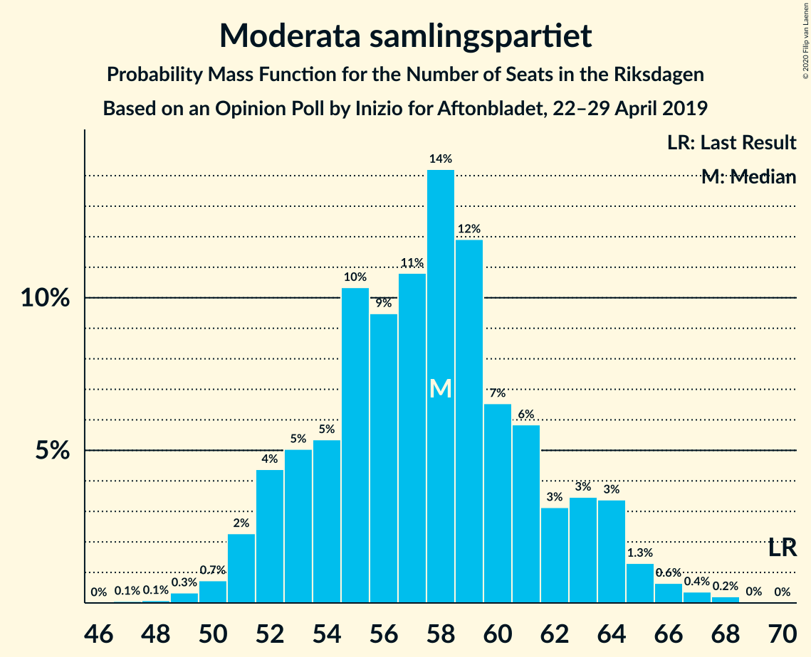
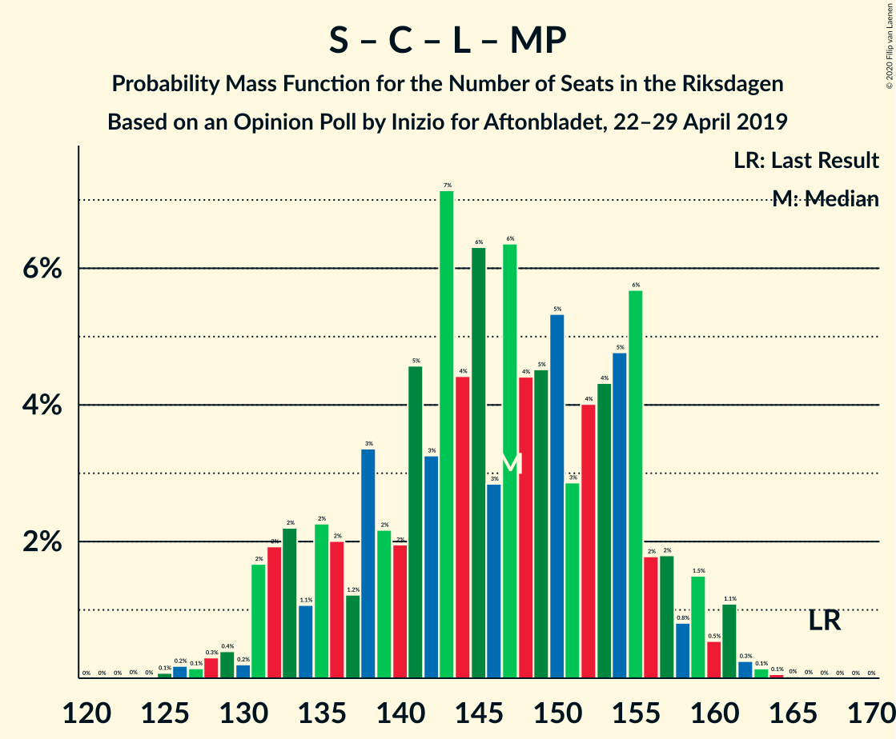
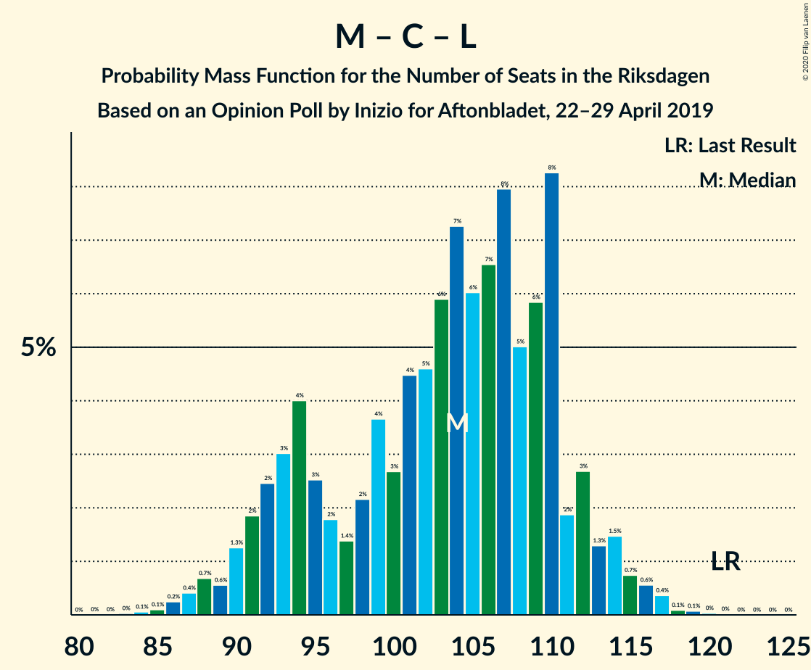

# Opinion Poll by Inizio for Aftonbladet, 22–29 April 2019

<a href="#voting-intentions">Voting Intentions</a> | <a href="#seats">Seats</a> | <a href="#coalitions">Coalitions</a> | <a href="#technical-information">Technical Information</a>

## Voting Intentions

### Confidence Intervals

| Party | Last Result | Poll Result | 80% Confidence Interval | 90% Confidence Interval | 95% Confidence Interval | 99% Confidence Interval |
|:-----:|:-----------:|:-----------:|:-----------------------:|:-----------------------:|:-----------------------:|:-----------------------:|
| Sveriges socialdemokratiska arbetareparti | 28.3% | 25.6% | 24.4–26.8% |24.1–27.2% |23.8–27.5% |23.2–28.1% |
| Sverigedemokraterna | 17.5% | 18.6% | 17.6–19.8% |17.3–20.1% |17.0–20.3% |16.5–20.9% |
| Moderata samlingspartiet | 19.8% | 15.7% | 14.7–16.7% |14.4–17.0% |14.2–17.3% |13.7–17.8% |
| Kristdemokraterna | 6.3% | 11.4% | 10.6–12.4% |10.3–12.6% |10.1–12.8% |9.7–13.3% |
| Vänsterpartiet | 8.0% | 9.5% | 8.7–10.4% |8.5–10.6% |8.3–10.9% |8.0–11.3% |
| Centerpartiet | 8.6% | 9.3% | 8.5–10.2% |8.3–10.4% |8.1–10.6% |7.8–11.0% |
| Liberalerna | 5.5% | 4.2% | 3.7–4.8% |3.6–5.0% |3.4–5.2% |3.2–5.5% |
| Miljöpartiet de gröna | 4.4% | 3.9% | 3.4–4.5% |3.2–4.6% |3.1–4.8% |2.9–5.1% |

*Note:* The poll result column reflects the actual value used in the calculations. Published results may vary slightly, and in addition be rounded to fewer digits.

## Seats

### Confidence Intervals

| Party | Last Result | Median | 80% Confidence Interval | 90% Confidence Interval | 95% Confidence Interval | 99% Confidence Interval |
|:-----:|:-----------:|:------:|:-----------------------:|:-----------------------:|:-----------------------:|:-----------------------:|
| <a href="#sveriges-socialdemokratiska-arbetareparti">Sveriges socialdemokratiska arbetareparti</a> | 100 | 94 | 88–100 |87–102 |86–103 |83–105 |
| <a href="#sverigedemokraterna">Sverigedemokraterna</a> | 62 | 68 | 64–73 |63–75 |62–76 |60–78 |
| <a href="#moderata-samlingspartiet">Moderata samlingspartiet</a> | 70 | 58 | 53–62 |52–64 |51–65 |50–67 |
| <a href="#kristdemokraterna">Kristdemokraterna</a> | 22 | 42 | 39–46 |38–47 |37–48 |35–49 |
| <a href="#vänsterpartiet">Vänsterpartiet</a> | 28 | 35 | 32–39 |31–39 |30–40 |29–42 |
| <a href="#centerpartiet">Centerpartiet</a> | 31 | 34 | 31–37 |31–38 |30–39 |29–41 |
| <a href="#liberalerna">Liberalerna</a> | 20 | 15 | 0–17 |0–18 |0–19 |0–20 |
| <a href="#miljöpartiet-de-gröna">Miljöpartiet de gröna</a> | 16 | 0 | 0–16 |0–17 |0–17 |0–19 |

### Sveriges socialdemokratiska arbetareparti

*For a full overview of the results for this party, see the [Sveriges socialdemokratiska arbetareparti](party-sverigessocialdemokratiskaarbetareparti.html) page.*

| Number of Seats | Probability | Accumulated | Special Marks |
|:---------------:|:-----------:|:-----------:|:-------------:|
| 81 | 0.1% | 100% |  |
| 82 | 0.1% | 99.9% |  |
| 83 | 0.4% | 99.7% |  |
| 84 | 0.6% | 99.3% |  |
| 85 | 1.1% | 98.7% |  |
| 86 | 2% | 98% |  |
| 87 | 4% | 96% |  |
| 88 | 5% | 92% |  |
| 89 | 8% | 88% |  |
| 90 | 4% | 80% |  |
| 91 | 11% | 76% |  |
| 92 | 9% | 66% |  |
| 93 | 5% | 57% |  |
| 94 | 9% | 52% | Median |
| 95 | 6% | 43% |  |
| 96 | 6% | 36% |  |
| 97 | 8% | 30% |  |
| 98 | 5% | 22% |  |
| 99 | 5% | 17% |  |
| 100 | 4% | 12% | Last Result |
| 101 | 2% | 8% |  |
| 102 | 3% | 5% |  |
| 103 | 0.9% | 3% |  |
| 104 | 0.9% | 2% |  |
| 105 | 0.5% | 0.9% |  |
| 106 | 0.1% | 0.4% |  |
| 107 | 0.2% | 0.3% |  |
| 108 | 0% | 0.1% |  |
| 109 | 0.1% | 0.1% |  |
| 110 | 0% | 0% |  |

### Sverigedemokraterna

*For a full overview of the results for this party, see the [Sverigedemokraterna](party-sverigedemokraterna.html) page.*

| Number of Seats | Probability | Accumulated | Special Marks |
|:---------------:|:-----------:|:-----------:|:-------------:|
| 58 | 0.1% | 100% |  |
| 59 | 0.3% | 99.8% |  |
| 60 | 0.8% | 99.5% |  |
| 61 | 0.8% | 98.7% |  |
| 62 | 3% | 98% | Last Result |
| 63 | 2% | 95% |  |
| 64 | 11% | 93% |  |
| 65 | 7% | 82% |  |
| 66 | 7% | 75% |  |
| 67 | 9% | 67% |  |
| 68 | 12% | 59% | Median |
| 69 | 12% | 47% |  |
| 70 | 8% | 35% |  |
| 71 | 7% | 27% |  |
| 72 | 4% | 20% |  |
| 73 | 7% | 16% |  |
| 74 | 3% | 8% |  |
| 75 | 2% | 5% |  |
| 76 | 2% | 3% |  |
| 77 | 0.6% | 2% |  |
| 78 | 0.4% | 0.9% |  |
| 79 | 0.3% | 0.5% |  |
| 80 | 0.1% | 0.2% |  |
| 81 | 0.1% | 0.1% |  |
| 82 | 0% | 0% |  |

### Moderata samlingspartiet

*For a full overview of the results for this party, see the [Moderata samlingspartiet](party-moderatasamlingspartiet.html) page.*

| Number of Seats | Probability | Accumulated | Special Marks |
|:---------------:|:-----------:|:-----------:|:-------------:|
| 47 | 0.1% | 100% |  |
| 48 | 0.1% | 99.9% |  |
| 49 | 0.3% | 99.8% |  |
| 50 | 0.7% | 99.5% |  |
| 51 | 2% | 98.8% |  |
| 52 | 4% | 96% |  |
| 53 | 5% | 92% |  |
| 54 | 5% | 87% |  |
| 55 | 10% | 82% |  |
| 56 | 9% | 71% |  |
| 57 | 11% | 62% |  |
| 58 | 14% | 51% | Median |
| 59 | 12% | 37% |  |
| 60 | 7% | 25% |  |
| 61 | 6% | 18% |  |
| 62 | 3% | 13% |  |
| 63 | 3% | 9% |  |
| 64 | 3% | 6% |  |
| 65 | 1.3% | 3% |  |
| 66 | 0.6% | 1.3% |  |
| 67 | 0.4% | 0.6% |  |
| 68 | 0.2% | 0.3% |  |
| 69 | 0% | 0.1% |  |
| 70 | 0% | 0% | Last Result |

### Kristdemokraterna

*For a full overview of the results for this party, see the [Kristdemokraterna](party-kristdemokraterna.html) page.*

| Number of Seats | Probability | Accumulated | Special Marks |
|:---------------:|:-----------:|:-----------:|:-------------:|
| 22 | 0% | 100% | Last Result |
| 23 | 0% | 100% |  |
| 24 | 0% | 100% |  |
| 25 | 0% | 100% |  |
| 26 | 0% | 100% |  |
| 27 | 0% | 100% |  |
| 28 | 0% | 100% |  |
| 29 | 0% | 100% |  |
| 30 | 0% | 100% |  |
| 31 | 0% | 100% |  |
| 32 | 0% | 100% |  |
| 33 | 0.1% | 100% |  |
| 34 | 0.3% | 99.9% |  |
| 35 | 0.4% | 99.7% |  |
| 36 | 0.8% | 99.2% |  |
| 37 | 2% | 98% |  |
| 38 | 4% | 96% |  |
| 39 | 12% | 92% |  |
| 40 | 13% | 80% |  |
| 41 | 16% | 67% |  |
| 42 | 13% | 50% | Median |
| 43 | 9% | 37% |  |
| 44 | 7% | 28% |  |
| 45 | 6% | 21% |  |
| 46 | 5% | 15% |  |
| 47 | 6% | 10% |  |
| 48 | 3% | 4% |  |
| 49 | 0.9% | 1.3% |  |
| 50 | 0.3% | 0.4% |  |
| 51 | 0.1% | 0.1% |  |
| 52 | 0% | 0.1% |  |
| 53 | 0% | 0% |  |

### Vänsterpartiet

*For a full overview of the results for this party, see the [Vänsterpartiet](party-vänsterpartiet.html) page.*

| Number of Seats | Probability | Accumulated | Special Marks |
|:---------------:|:-----------:|:-----------:|:-------------:|
| 27 | 0.1% | 100% |  |
| 28 | 0.2% | 99.9% | Last Result |
| 29 | 0.9% | 99.7% |  |
| 30 | 2% | 98.8% |  |
| 31 | 3% | 96% |  |
| 32 | 11% | 93% |  |
| 33 | 10% | 82% |  |
| 34 | 12% | 72% |  |
| 35 | 18% | 59% | Median |
| 36 | 11% | 42% |  |
| 37 | 11% | 31% |  |
| 38 | 8% | 19% |  |
| 39 | 7% | 11% |  |
| 40 | 2% | 4% |  |
| 41 | 0.7% | 2% |  |
| 42 | 0.6% | 0.9% |  |
| 43 | 0.2% | 0.3% |  |
| 44 | 0.1% | 0.1% |  |
| 45 | 0% | 0% |  |

### Centerpartiet

*For a full overview of the results for this party, see the [Centerpartiet](party-centerpartiet.html) page.*

| Number of Seats | Probability | Accumulated | Special Marks |
|:---------------:|:-----------:|:-----------:|:-------------:|
| 26 | 0.1% | 100% |  |
| 27 | 0.1% | 99.9% |  |
| 28 | 0.2% | 99.8% |  |
| 29 | 2% | 99.6% |  |
| 30 | 3% | 98% |  |
| 31 | 6% | 95% | Last Result |
| 32 | 14% | 89% |  |
| 33 | 14% | 75% |  |
| 34 | 16% | 61% | Median |
| 35 | 20% | 45% |  |
| 36 | 13% | 25% |  |
| 37 | 5% | 12% |  |
| 38 | 3% | 7% |  |
| 39 | 2% | 3% |  |
| 40 | 1.3% | 2% |  |
| 41 | 0.2% | 0.7% |  |
| 42 | 0.3% | 0.4% |  |
| 43 | 0.1% | 0.1% |  |
| 44 | 0% | 0% |  |

### Liberalerna

*For a full overview of the results for this party, see the [Liberalerna](party-liberalerna.html) page.*

| Number of Seats | Probability | Accumulated | Special Marks |
|:---------------:|:-----------:|:-----------:|:-------------:|
| 0 | 28% | 100% |  |
| 1 | 0% | 72% |  |
| 2 | 0% | 72% |  |
| 3 | 0% | 72% |  |
| 4 | 0% | 72% |  |
| 5 | 0% | 72% |  |
| 6 | 0% | 72% |  |
| 7 | 0% | 72% |  |
| 8 | 0% | 72% |  |
| 9 | 0% | 72% |  |
| 10 | 0% | 72% |  |
| 11 | 0% | 72% |  |
| 12 | 0% | 72% |  |
| 13 | 0% | 72% |  |
| 14 | 4% | 72% |  |
| 15 | 25% | 68% | Median |
| 16 | 17% | 43% |  |
| 17 | 16% | 26% |  |
| 18 | 6% | 10% |  |
| 19 | 2% | 3% |  |
| 20 | 0.6% | 0.8% | Last Result |
| 21 | 0.2% | 0.2% |  |
| 22 | 0% | 0% |  |

### Miljöpartiet de gröna

*For a full overview of the results for this party, see the [Miljöpartiet de gröna](party-miljöpartietdegröna.html) page.*

| Number of Seats | Probability | Accumulated | Special Marks |
|:---------------:|:-----------:|:-----------:|:-------------:|
| 0 | 58% | 100% | Median |
| 1 | 0% | 42% |  |
| 2 | 0% | 42% |  |
| 3 | 0% | 42% |  |
| 4 | 0% | 42% |  |
| 5 | 0% | 42% |  |
| 6 | 0% | 42% |  |
| 7 | 0% | 42% |  |
| 8 | 0% | 42% |  |
| 9 | 0% | 42% |  |
| 10 | 0% | 42% |  |
| 11 | 0% | 42% |  |
| 12 | 0% | 42% |  |
| 13 | 0% | 42% |  |
| 14 | 7% | 42% |  |
| 15 | 19% | 35% |  |
| 16 | 10% | 16% | Last Result |
| 17 | 4% | 6% |  |
| 18 | 2% | 2% |  |
| 19 | 0.4% | 0.5% |  |
| 20 | 0.1% | 0.1% |  |
| 21 | 0% | 0% |  |

## Coalitions

### Confidence Intervals

| Coalition | Last Result | Median | Majority? | 80% Confidence Interval | 90% Confidence Interval | 95% Confidence Interval | 99% Confidence Interval |
|:---------:|:-----------:|:------:|:---------:|:-----------------------:|:-----------------------:|:-----------------------:|:-----------------------:|
| Sveriges socialdemokratiska arbetareparti – Moderata samlingspartiet – Centerpartiet | 201 | 185 | 96% | 176–195 | 175–197 | 173–200 | 171–203 |
| Sveriges socialdemokratiska arbetareparti – Vänsterpartiet – Centerpartiet – Liberalerna – Miljöpartiet de gröna | 195 | 182 | 82% | 172–189 | 169–191 | 169–193 | 165–196 |
| Sverigedemokraterna – Moderata samlingspartiet – Kristdemokraterna | 154 | 167 | 18% | 160–177 | 158–180 | 156–180 | 153–184 |
| Sveriges socialdemokratiska arbetareparti – Moderata samlingspartiet | 170 | 151 | 0% | 144–160 | 142–162 | 140–164 | 137–168 |
| Sveriges socialdemokratiska arbetareparti – Centerpartiet – Liberalerna – Miljöpartiet de gröna | 167 | 147 | 0% | 135–155 | 133–157 | 131–159 | 128–161 |
| Moderata samlingspartiet – Kristdemokraterna – Centerpartiet – Liberalerna | 143 | 146 | 0% | 137–153 | 134–155 | 132–156 | 129–160 |
| Sveriges socialdemokratiska arbetareparti – Vänsterpartiet – Miljöpartiet de gröna | 144 | 135 | 0% | 127–144 | 126–146 | 124–149 | 122–152 |
| Moderata samlingspartiet – Kristdemokraterna – Centerpartiet | 123 | 133 | 0% | 127–141 | 125–143 | 124–146 | 122–148 |
| Sveriges socialdemokratiska arbetareparti – Vänsterpartiet | 128 | 129 | 0% | 122–136 | 120–138 | 119–140 | 116–142 |
| Sverigedemokraterna – Moderata samlingspartiet | 132 | 125 | 0% | 119–133 | 117–135 | 116–137 | 114–140 |
| Moderata samlingspartiet – Centerpartiet – Liberalerna | 121 | 104 | 0% | 93–110 | 91–112 | 90–114 | 87–117 |
| Sveriges socialdemokratiska arbetareparti – Miljöpartiet de gröna | 116 | 100 | 0% | 92–109 | 90–112 | 89–114 | 87–117 |
| Moderata samlingspartiet – Centerpartiet | 101 | 92 | 0% | 86–98 | 85–99 | 84–101 | 81–103 |

### Sveriges socialdemokratiska arbetareparti – Moderata samlingspartiet – Centerpartiet

| Number of Seats | Probability | Accumulated | Special Marks |
|:---------------:|:-----------:|:-----------:|:-------------:|
| 167 | 0% | 100% |  |
| 168 | 0% | 99.9% |  |
| 169 | 0.1% | 99.9% |  |
| 170 | 0.2% | 99.7% |  |
| 171 | 0.4% | 99.5% |  |
| 172 | 1.2% | 99.1% |  |
| 173 | 0.5% | 98% |  |
| 174 | 2% | 97% |  |
| 175 | 4% | 96% | Majority |
| 176 | 3% | 92% |  |
| 177 | 3% | 89% |  |
| 178 | 3% | 86% |  |
| 179 | 6% | 83% |  |
| 180 | 3% | 77% |  |
| 181 | 6% | 74% |  |
| 182 | 4% | 69% |  |
| 183 | 4% | 65% |  |
| 184 | 7% | 60% |  |
| 185 | 6% | 53% |  |
| 186 | 7% | 48% | Median |
| 187 | 4% | 41% |  |
| 188 | 5% | 37% |  |
| 189 | 5% | 32% |  |
| 190 | 4% | 27% |  |
| 191 | 3% | 24% |  |
| 192 | 4% | 21% |  |
| 193 | 3% | 16% |  |
| 194 | 3% | 13% |  |
| 195 | 1.3% | 11% |  |
| 196 | 3% | 10% |  |
| 197 | 2% | 7% |  |
| 198 | 0.6% | 5% |  |
| 199 | 1.1% | 4% |  |
| 200 | 1.2% | 3% |  |
| 201 | 0.3% | 2% | Last Result |
| 202 | 0.4% | 2% |  |
| 203 | 1.0% | 1.5% |  |
| 204 | 0.1% | 0.4% |  |
| 205 | 0% | 0.3% |  |
| 206 | 0.3% | 0.3% |  |
| 207 | 0% | 0% |  |

### Sveriges socialdemokratiska arbetareparti – Vänsterpartiet – Centerpartiet – Liberalerna – Miljöpartiet de gröna

| Number of Seats | Probability | Accumulated | Special Marks |
|:---------------:|:-----------:|:-----------:|:-------------:|
| 161 | 0% | 100% |  |
| 162 | 0% | 99.9% |  |
| 163 | 0.1% | 99.9% |  |
| 164 | 0.2% | 99.8% |  |
| 165 | 0.2% | 99.6% |  |
| 166 | 0.4% | 99.3% |  |
| 167 | 0.4% | 98.9% |  |
| 168 | 1.0% | 98% |  |
| 169 | 3% | 98% |  |
| 170 | 1.0% | 94% |  |
| 171 | 3% | 93% |  |
| 172 | 3% | 91% |  |
| 173 | 2% | 88% |  |
| 174 | 4% | 86% |  |
| 175 | 3% | 82% | Majority |
| 176 | 5% | 80% |  |
| 177 | 3% | 75% |  |
| 178 | 5% | 72% | Median |
| 179 | 3% | 67% |  |
| 180 | 6% | 64% |  |
| 181 | 8% | 58% |  |
| 182 | 6% | 50% |  |
| 183 | 6% | 44% |  |
| 184 | 4% | 39% |  |
| 185 | 5% | 34% |  |
| 186 | 8% | 29% |  |
| 187 | 6% | 21% |  |
| 188 | 4% | 15% |  |
| 189 | 2% | 12% |  |
| 190 | 2% | 9% |  |
| 191 | 3% | 8% |  |
| 192 | 1.1% | 4% |  |
| 193 | 1.0% | 3% |  |
| 194 | 0.8% | 2% |  |
| 195 | 0.4% | 1.3% | Last Result |
| 196 | 0.7% | 0.9% |  |
| 197 | 0.1% | 0.2% |  |
| 198 | 0% | 0.1% |  |
| 199 | 0% | 0% |  |

### Sverigedemokraterna – Moderata samlingspartiet – Kristdemokraterna

| Number of Seats | Probability | Accumulated | Special Marks |
|:---------------:|:-----------:|:-----------:|:-------------:|
| 151 | 0% | 100% |  |
| 152 | 0.1% | 99.9% |  |
| 153 | 0.7% | 99.8% |  |
| 154 | 0.4% | 99.1% | Last Result |
| 155 | 0.8% | 98.7% |  |
| 156 | 1.0% | 98% |  |
| 157 | 1.1% | 97% |  |
| 158 | 3% | 96% |  |
| 159 | 2% | 92% |  |
| 160 | 2% | 91% |  |
| 161 | 4% | 88% |  |
| 162 | 6% | 85% |  |
| 163 | 8% | 79% |  |
| 164 | 5% | 71% |  |
| 165 | 4% | 66% |  |
| 166 | 6% | 61% |  |
| 167 | 6% | 56% |  |
| 168 | 8% | 50% | Median |
| 169 | 6% | 42% |  |
| 170 | 3% | 36% |  |
| 171 | 5% | 33% |  |
| 172 | 3% | 28% |  |
| 173 | 5% | 25% |  |
| 174 | 3% | 20% |  |
| 175 | 4% | 18% | Majority |
| 176 | 2% | 14% |  |
| 177 | 3% | 12% |  |
| 178 | 3% | 9% |  |
| 179 | 1.0% | 7% |  |
| 180 | 3% | 6% |  |
| 181 | 1.0% | 2% |  |
| 182 | 0.4% | 2% |  |
| 183 | 0.4% | 1.1% |  |
| 184 | 0.2% | 0.7% |  |
| 185 | 0.2% | 0.4% |  |
| 186 | 0.1% | 0.2% |  |
| 187 | 0% | 0.1% |  |
| 188 | 0% | 0.1% |  |
| 189 | 0% | 0% |  |

### Sveriges socialdemokratiska arbetareparti – Moderata samlingspartiet

| Number of Seats | Probability | Accumulated | Special Marks |
|:---------------:|:-----------:|:-----------:|:-------------:|
| 135 | 0% | 100% |  |
| 136 | 0.1% | 99.9% |  |
| 137 | 0.5% | 99.8% |  |
| 138 | 0.2% | 99.4% |  |
| 139 | 0.6% | 99.2% |  |
| 140 | 2% | 98.5% |  |
| 141 | 1.4% | 96% |  |
| 142 | 2% | 95% |  |
| 143 | 3% | 93% |  |
| 144 | 8% | 91% |  |
| 145 | 4% | 83% |  |
| 146 | 4% | 79% |  |
| 147 | 5% | 75% |  |
| 148 | 5% | 71% |  |
| 149 | 7% | 66% |  |
| 150 | 4% | 59% |  |
| 151 | 6% | 55% |  |
| 152 | 6% | 48% | Median |
| 153 | 7% | 42% |  |
| 154 | 6% | 35% |  |
| 155 | 4% | 29% |  |
| 156 | 3% | 25% |  |
| 157 | 3% | 21% |  |
| 158 | 4% | 19% |  |
| 159 | 4% | 14% |  |
| 160 | 1.2% | 11% |  |
| 161 | 4% | 9% |  |
| 162 | 0.9% | 6% |  |
| 163 | 2% | 5% |  |
| 164 | 1.4% | 3% |  |
| 165 | 0.6% | 2% |  |
| 166 | 0.3% | 1.3% |  |
| 167 | 0.5% | 1.0% |  |
| 168 | 0.3% | 0.5% |  |
| 169 | 0.2% | 0.3% |  |
| 170 | 0.1% | 0.1% | Last Result |
| 171 | 0% | 0% |  |

### Sveriges socialdemokratiska arbetareparti – Centerpartiet – Liberalerna – Miljöpartiet de gröna

| Number of Seats | Probability | Accumulated | Special Marks |
|:---------------:|:-----------:|:-----------:|:-------------:|
| 125 | 0.1% | 100% |  |
| 126 | 0.2% | 99.9% |  |
| 127 | 0.1% | 99.7% |  |
| 128 | 0.3% | 99.6% |  |
| 129 | 0.4% | 99.3% |  |
| 130 | 0.2% | 98.9% |  |
| 131 | 2% | 98.7% |  |
| 132 | 2% | 97% |  |
| 133 | 2% | 95% |  |
| 134 | 1.1% | 93% |  |
| 135 | 2% | 92% |  |
| 136 | 2% | 90% |  |
| 137 | 1.2% | 88% |  |
| 138 | 3% | 86% |  |
| 139 | 2% | 83% |  |
| 140 | 2% | 81% |  |
| 141 | 5% | 79% |  |
| 142 | 3% | 74% |  |
| 143 | 7% | 71% | Median |
| 144 | 4% | 64% |  |
| 145 | 6% | 59% |  |
| 146 | 3% | 53% |  |
| 147 | 6% | 50% |  |
| 148 | 4% | 44% |  |
| 149 | 5% | 40% |  |
| 150 | 5% | 35% |  |
| 151 | 3% | 30% |  |
| 152 | 4% | 27% |  |
| 153 | 4% | 23% |  |
| 154 | 5% | 18% |  |
| 155 | 6% | 14% |  |
| 156 | 2% | 8% |  |
| 157 | 2% | 6% |  |
| 158 | 0.8% | 4% |  |
| 159 | 1.5% | 4% |  |
| 160 | 0.5% | 2% |  |
| 161 | 1.1% | 2% |  |
| 162 | 0.3% | 0.5% |  |
| 163 | 0.1% | 0.2% |  |
| 164 | 0.1% | 0.1% |  |
| 165 | 0% | 0% |  |
| 166 | 0% | 0% |  |
| 167 | 0% | 0% | Last Result |

### Moderata samlingspartiet – Kristdemokraterna – Centerpartiet – Liberalerna

| Number of Seats | Probability | Accumulated | Special Marks |
|:---------------:|:-----------:|:-----------:|:-------------:|
| 124 | 0% | 100% |  |
| 125 | 0% | 99.9% |  |
| 126 | 0.1% | 99.9% |  |
| 127 | 0.1% | 99.8% |  |
| 128 | 0.2% | 99.8% |  |
| 129 | 0.7% | 99.6% |  |
| 130 | 0.7% | 98.9% |  |
| 131 | 0.2% | 98% |  |
| 132 | 0.9% | 98% |  |
| 133 | 2% | 97% |  |
| 134 | 0.9% | 95% |  |
| 135 | 1.4% | 95% |  |
| 136 | 2% | 93% |  |
| 137 | 1.3% | 91% |  |
| 138 | 4% | 90% |  |
| 139 | 2% | 86% |  |
| 140 | 8% | 84% |  |
| 141 | 1.2% | 75% |  |
| 142 | 5% | 74% |  |
| 143 | 5% | 69% | Last Result |
| 144 | 6% | 64% |  |
| 145 | 5% | 58% |  |
| 146 | 12% | 54% |  |
| 147 | 4% | 42% |  |
| 148 | 6% | 38% |  |
| 149 | 9% | 32% | Median |
| 150 | 2% | 22% |  |
| 151 | 4% | 20% |  |
| 152 | 3% | 16% |  |
| 153 | 3% | 13% |  |
| 154 | 3% | 9% |  |
| 155 | 2% | 6% |  |
| 156 | 1.5% | 4% |  |
| 157 | 0.8% | 2% |  |
| 158 | 0.4% | 2% |  |
| 159 | 0.5% | 1.2% |  |
| 160 | 0.5% | 0.8% |  |
| 161 | 0.2% | 0.2% |  |
| 162 | 0% | 0.1% |  |
| 163 | 0% | 0% |  |

### Sveriges socialdemokratiska arbetareparti – Vänsterpartiet – Miljöpartiet de gröna

| Number of Seats | Probability | Accumulated | Special Marks |
|:---------------:|:-----------:|:-----------:|:-------------:|
| 119 | 0.1% | 100% |  |
| 120 | 0.1% | 99.9% |  |
| 121 | 0.3% | 99.8% |  |
| 122 | 0.7% | 99.5% |  |
| 123 | 0.6% | 98.9% |  |
| 124 | 0.8% | 98% |  |
| 125 | 2% | 97% |  |
| 126 | 2% | 96% |  |
| 127 | 6% | 94% |  |
| 128 | 3% | 87% |  |
| 129 | 3% | 84% | Median |
| 130 | 5% | 81% |  |
| 131 | 4% | 76% |  |
| 132 | 5% | 71% |  |
| 133 | 4% | 66% |  |
| 134 | 7% | 62% |  |
| 135 | 6% | 55% |  |
| 136 | 4% | 49% |  |
| 137 | 7% | 45% |  |
| 138 | 7% | 38% |  |
| 139 | 7% | 31% |  |
| 140 | 3% | 24% |  |
| 141 | 7% | 21% |  |
| 142 | 2% | 14% |  |
| 143 | 1.1% | 11% |  |
| 144 | 1.4% | 10% | Last Result |
| 145 | 2% | 9% |  |
| 146 | 2% | 7% |  |
| 147 | 0.8% | 5% |  |
| 148 | 0.9% | 4% |  |
| 149 | 1.1% | 3% |  |
| 150 | 0.9% | 2% |  |
| 151 | 0.3% | 1.2% |  |
| 152 | 0.5% | 0.8% |  |
| 153 | 0.1% | 0.3% |  |
| 154 | 0% | 0.2% |  |
| 155 | 0.1% | 0.1% |  |
| 156 | 0% | 0.1% |  |
| 157 | 0% | 0% |  |

### Moderata samlingspartiet – Kristdemokraterna – Centerpartiet

| Number of Seats | Probability | Accumulated | Special Marks |
|:---------------:|:-----------:|:-----------:|:-------------:|
| 118 | 0% | 100% |  |
| 119 | 0.1% | 99.9% |  |
| 120 | 0.1% | 99.9% |  |
| 121 | 0.1% | 99.7% |  |
| 122 | 0.8% | 99.6% |  |
| 123 | 1.2% | 98.9% | Last Result |
| 124 | 0.4% | 98% |  |
| 125 | 4% | 97% |  |
| 126 | 3% | 93% |  |
| 127 | 0.9% | 90% |  |
| 128 | 6% | 89% |  |
| 129 | 8% | 83% |  |
| 130 | 1.4% | 76% |  |
| 131 | 13% | 74% |  |
| 132 | 8% | 61% |  |
| 133 | 4% | 53% |  |
| 134 | 12% | 50% | Median |
| 135 | 4% | 38% |  |
| 136 | 3% | 33% |  |
| 137 | 6% | 31% |  |
| 138 | 7% | 25% |  |
| 139 | 2% | 18% |  |
| 140 | 5% | 16% |  |
| 141 | 2% | 11% |  |
| 142 | 2% | 9% |  |
| 143 | 3% | 7% |  |
| 144 | 0.6% | 4% |  |
| 145 | 0.8% | 4% |  |
| 146 | 2% | 3% |  |
| 147 | 0.2% | 0.9% |  |
| 148 | 0.3% | 0.6% |  |
| 149 | 0.2% | 0.4% |  |
| 150 | 0.1% | 0.2% |  |
| 151 | 0% | 0.1% |  |
| 152 | 0.1% | 0.1% |  |
| 153 | 0% | 0% |  |

### Sveriges socialdemokratiska arbetareparti – Vänsterpartiet

| Number of Seats | Probability | Accumulated | Special Marks |
|:---------------:|:-----------:|:-----------:|:-------------:|
| 113 | 0% | 100% |  |
| 114 | 0% | 99.9% |  |
| 115 | 0.1% | 99.9% |  |
| 116 | 0.3% | 99.8% |  |
| 117 | 0.5% | 99.5% |  |
| 118 | 0.7% | 99.0% |  |
| 119 | 2% | 98% |  |
| 120 | 2% | 96% |  |
| 121 | 3% | 95% |  |
| 122 | 4% | 92% |  |
| 123 | 6% | 88% |  |
| 124 | 6% | 82% |  |
| 125 | 3% | 76% |  |
| 126 | 7% | 72% |  |
| 127 | 10% | 66% |  |
| 128 | 4% | 55% | Last Result |
| 129 | 5% | 51% | Median |
| 130 | 7% | 46% |  |
| 131 | 5% | 39% |  |
| 132 | 6% | 34% |  |
| 133 | 5% | 28% |  |
| 134 | 7% | 23% |  |
| 135 | 5% | 16% |  |
| 136 | 2% | 11% |  |
| 137 | 2% | 9% |  |
| 138 | 3% | 7% |  |
| 139 | 0.9% | 3% |  |
| 140 | 1.1% | 3% |  |
| 141 | 0.7% | 1.4% |  |
| 142 | 0.2% | 0.7% |  |
| 143 | 0.1% | 0.5% |  |
| 144 | 0.1% | 0.3% |  |
| 145 | 0.2% | 0.2% |  |
| 146 | 0% | 0.1% |  |
| 147 | 0% | 0% |  |

### Sverigedemokraterna – Moderata samlingspartiet

| Number of Seats | Probability | Accumulated | Special Marks |
|:---------------:|:-----------:|:-----------:|:-------------:|
| 111 | 0.1% | 100% |  |
| 112 | 0.1% | 99.9% |  |
| 113 | 0.1% | 99.7% |  |
| 114 | 0.9% | 99.7% |  |
| 115 | 0.8% | 98.8% |  |
| 116 | 1.3% | 98% |  |
| 117 | 4% | 97% |  |
| 118 | 2% | 93% |  |
| 119 | 4% | 92% |  |
| 120 | 3% | 87% |  |
| 121 | 8% | 84% |  |
| 122 | 4% | 77% |  |
| 123 | 9% | 73% |  |
| 124 | 7% | 64% |  |
| 125 | 7% | 57% |  |
| 126 | 6% | 49% | Median |
| 127 | 7% | 44% |  |
| 128 | 4% | 36% |  |
| 129 | 6% | 32% |  |
| 130 | 4% | 26% |  |
| 131 | 5% | 22% |  |
| 132 | 6% | 17% | Last Result |
| 133 | 3% | 11% |  |
| 134 | 2% | 8% |  |
| 135 | 2% | 6% |  |
| 136 | 0.9% | 4% |  |
| 137 | 0.8% | 3% |  |
| 138 | 1.2% | 2% |  |
| 139 | 0.6% | 1.2% |  |
| 140 | 0.4% | 0.6% |  |
| 141 | 0.1% | 0.2% |  |
| 142 | 0% | 0.1% |  |
| 143 | 0% | 0.1% |  |
| 144 | 0% | 0% |  |

### Moderata samlingspartiet – Centerpartiet – Liberalerna

| Number of Seats | Probability | Accumulated | Special Marks |
|:---------------:|:-----------:|:-----------:|:-------------:|
| 84 | 0.1% | 100% |  |
| 85 | 0.1% | 99.9% |  |
| 86 | 0.2% | 99.8% |  |
| 87 | 0.4% | 99.5% |  |
| 88 | 0.7% | 99.1% |  |
| 89 | 0.6% | 98% |  |
| 90 | 1.3% | 98% |  |
| 91 | 2% | 97% |  |
| 92 | 2% | 95% |  |
| 93 | 3% | 92% |  |
| 94 | 4% | 89% |  |
| 95 | 3% | 85% |  |
| 96 | 2% | 83% |  |
| 97 | 1.4% | 81% |  |
| 98 | 2% | 80% |  |
| 99 | 4% | 77% |  |
| 100 | 3% | 74% |  |
| 101 | 4% | 71% |  |
| 102 | 5% | 67% |  |
| 103 | 6% | 62% |  |
| 104 | 7% | 56% |  |
| 105 | 6% | 49% |  |
| 106 | 7% | 43% |  |
| 107 | 8% | 36% | Median |
| 108 | 5% | 28% |  |
| 109 | 6% | 23% |  |
| 110 | 8% | 17% |  |
| 111 | 2% | 9% |  |
| 112 | 3% | 7% |  |
| 113 | 1.3% | 5% |  |
| 114 | 1.5% | 3% |  |
| 115 | 0.7% | 2% |  |
| 116 | 0.6% | 1.1% |  |
| 117 | 0.4% | 0.6% |  |
| 118 | 0.1% | 0.2% |  |
| 119 | 0.1% | 0.1% |  |
| 120 | 0% | 0.1% |  |
| 121 | 0% | 0% | Last Result |

### Sveriges socialdemokratiska arbetareparti – Miljöpartiet de gröna

| Number of Seats | Probability | Accumulated | Special Marks |
|:---------------:|:-----------:|:-----------:|:-------------:|
| 84 | 0% | 100% |  |
| 85 | 0.1% | 99.9% |  |
| 86 | 0.1% | 99.8% |  |
| 87 | 0.8% | 99.7% |  |
| 88 | 0.4% | 98.9% |  |
| 89 | 2% | 98% |  |
| 90 | 1.4% | 96% |  |
| 91 | 4% | 95% |  |
| 92 | 4% | 91% |  |
| 93 | 3% | 87% |  |
| 94 | 7% | 85% | Median |
| 95 | 5% | 78% |  |
| 96 | 5% | 73% |  |
| 97 | 8% | 69% |  |
| 98 | 4% | 61% |  |
| 99 | 4% | 56% |  |
| 100 | 5% | 52% |  |
| 101 | 4% | 48% |  |
| 102 | 4% | 44% |  |
| 103 | 6% | 40% |  |
| 104 | 4% | 33% |  |
| 105 | 7% | 29% |  |
| 106 | 4% | 22% |  |
| 107 | 4% | 18% |  |
| 108 | 3% | 14% |  |
| 109 | 3% | 11% |  |
| 110 | 2% | 9% |  |
| 111 | 2% | 7% |  |
| 112 | 1.4% | 5% |  |
| 113 | 1.0% | 4% |  |
| 114 | 1.3% | 3% |  |
| 115 | 0.3% | 1.4% |  |
| 116 | 0.4% | 1.1% | Last Result |
| 117 | 0.4% | 0.6% |  |
| 118 | 0.1% | 0.2% |  |
| 119 | 0.1% | 0.1% |  |
| 120 | 0% | 0% |  |

### Moderata samlingspartiet – Centerpartiet

| Number of Seats | Probability | Accumulated | Special Marks |
|:---------------:|:-----------:|:-----------:|:-------------:|
| 79 | 0% | 100% |  |
| 80 | 0.1% | 99.9% |  |
| 81 | 0.3% | 99.8% |  |
| 82 | 0.7% | 99.5% |  |
| 83 | 1.0% | 98.8% |  |
| 84 | 1.1% | 98% |  |
| 85 | 3% | 97% |  |
| 86 | 5% | 94% |  |
| 87 | 6% | 89% |  |
| 88 | 8% | 83% |  |
| 89 | 8% | 75% |  |
| 90 | 7% | 68% |  |
| 91 | 7% | 61% |  |
| 92 | 11% | 53% | Median |
| 93 | 12% | 43% |  |
| 94 | 10% | 30% |  |
| 95 | 5% | 20% |  |
| 96 | 4% | 16% |  |
| 97 | 2% | 12% |  |
| 98 | 2% | 10% |  |
| 99 | 3% | 8% |  |
| 100 | 1.0% | 4% |  |
| 101 | 1.2% | 3% | Last Result |
| 102 | 1.4% | 2% |  |
| 103 | 0.2% | 0.7% |  |
| 104 | 0.2% | 0.5% |  |
| 105 | 0.2% | 0.3% |  |
| 106 | 0.1% | 0.1% |  |
| 107 | 0% | 0% |  |

## Technical Information

### Opinion Poll

+ **Polling firm:** Inizio
+ **Commissioner(s):** Aftonbladet
+ **Fieldwork period:** 22–29 April 2019

### Calculations

+ **Sample size:** 2111
+ **Simulations done:** 1,048,576
+ **Error estimate:** 1.91%

