# Opinion Poll by Novus for SVT, 8 April–5 May 2019

<a href="#voting-intentions">Voting Intentions</a> | <a href="#seats">Seats</a> | <a href="#coalitions">Coalitions</a> | <a href="#technical-information">Technical Information</a>

## Voting Intentions

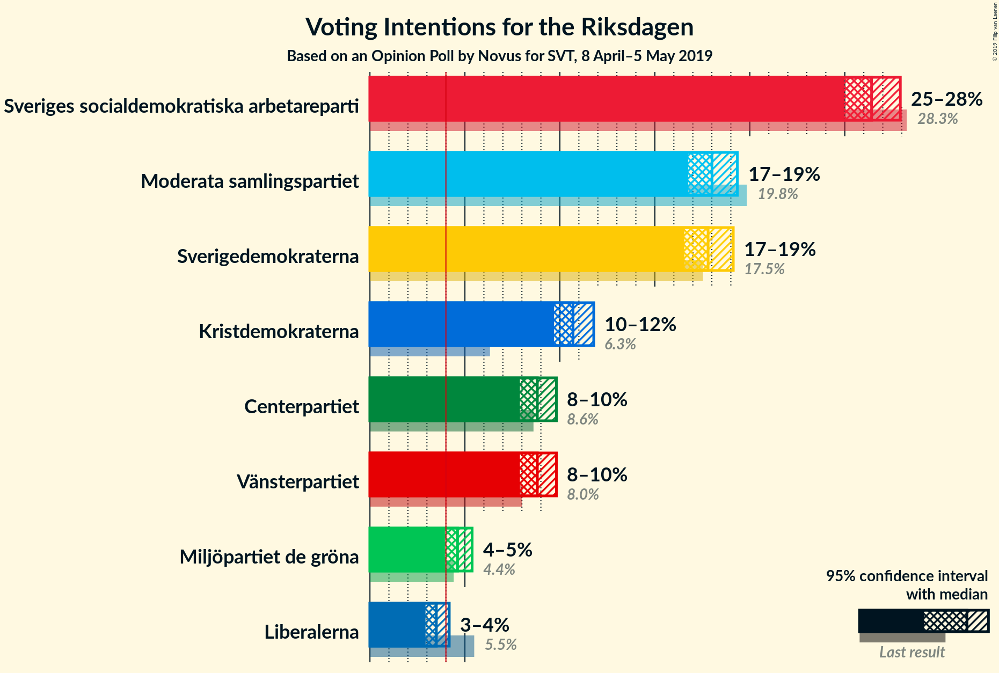

### Confidence Intervals

| Party | Last Result | Poll Result | 80% Confidence Interval | 90% Confidence Interval | 95% Confidence Interval | 99% Confidence Interval |
|:-----:|:-----------:|:-----------:|:-----------------------:|:-----------------------:|:-----------------------:|:-----------------------:|
| Sveriges socialdemokratiska arbetareparti | 28.3% | 26.4% | 25.5–27.4% |25.2–27.7% |25.0–27.9% |24.5–28.4% |
| Moderata samlingspartiet | 19.8% | 18.0% | 17.2–18.9% |16.9–19.1% |16.8–19.3% |16.4–19.8% |
| Sverigedemokraterna | 17.5% | 17.8% | 17.0–18.7% |16.8–18.9% |16.6–19.1% |16.2–19.6% |
| Kristdemokraterna | 6.3% | 10.7% | 10.0–11.4% |9.8–11.6% |9.7–11.8% |9.4–12.1% |
| Centerpartiet | 8.6% | 8.8% | 8.2–9.5% |8.0–9.7% |7.9–9.8% |7.6–10.1% |
| Vänsterpartiet | 8.0% | 8.8% | 8.2–9.5% |8.0–9.7% |7.9–9.8% |7.6–10.1% |
| Miljöpartiet de gröna | 4.4% | 4.6% | 4.2–5.1% |4.1–5.3% |3.9–5.4% |3.7–5.6% |
| Liberalerna | 5.5% | 3.5% | 3.1–3.9% |3.0–4.1% |2.9–4.2% |2.8–4.4% |

*Note:* The poll result column reflects the actual value used in the calculations. Published results may vary slightly, and in addition be rounded to fewer digits.

## Seats

### Confidence Intervals

| Party | Last Result | Median | 80% Confidence Interval | 90% Confidence Interval | 95% Confidence Interval | 99% Confidence Interval |
|:-----:|:-----------:|:------:|:-----------------------:|:-----------------------:|:-----------------------:|:-----------------------:|
| <a href="#sveriges-socialdemokratiska-arbetareparti">Sveriges socialdemokratiska arbetareparti</a> | 100 | 97 | 94–100 |92–101 |91–102 |89–105 |
| <a href="#moderata-samlingspartiet">Moderata samlingspartiet</a> | 70 | 65 | 63–69 |62–70 |62–71 |59–73 |
| <a href="#sverigedemokraterna">Sverigedemokraterna</a> | 62 | 65 | 62–68 |62–70 |60–71 |59–71 |
| <a href="#kristdemokraterna">Kristdemokraterna</a> | 22 | 40 | 36–42 |36–42 |35–43 |35–45 |
| <a href="#centerpartiet">Centerpartiet</a> | 31 | 33 | 31–34 |30–35 |30–36 |28–37 |
| <a href="#vänsterpartiet">Vänsterpartiet</a> | 28 | 32 | 30–34 |30–35 |29–36 |28–38 |
| <a href="#miljöpartiet-de-gröna">Miljöpartiet de gröna</a> | 16 | 16 | 15–19 |0–19 |0–19 |0–20 |
| <a href="#liberalerna">Liberalerna</a> | 20 | 0 | 0 |0–14 |0–14 |0–16 |

### Sveriges socialdemokratiska arbetareparti

*For a full overview of the results for this party, see the [Sveriges socialdemokratiska arbetareparti](party-sverigessocialdemokratiskaarbetareparti.html) page.*

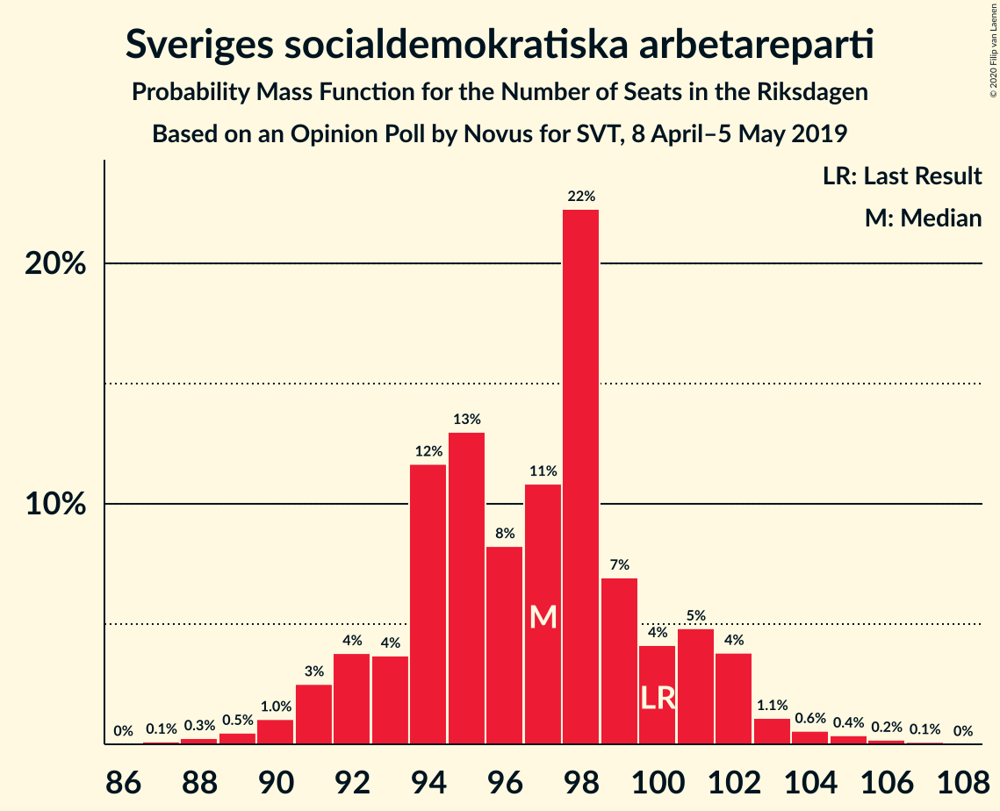

| Number of Seats | Probability | Accumulated | Special Marks |
|:---------------:|:-----------:|:-----------:|:-------------:|
| 87 | 0.2% | 100% |  |
| 88 | 0.2% | 99.8% |  |
| 89 | 0.6% | 99.6% |  |
| 90 | 0.9% | 99.0% |  |
| 91 | 2% | 98% |  |
| 92 | 2% | 96% |  |
| 93 | 3% | 94% |  |
| 94 | 12% | 91% |  |
| 95 | 8% | 79% |  |
| 96 | 3% | 71% |  |
| 97 | 22% | 67% | Median |
| 98 | 27% | 45% |  |
| 99 | 3% | 18% |  |
| 100 | 8% | 16% | Last Result |
| 101 | 4% | 7% |  |
| 102 | 2% | 4% |  |
| 103 | 0.7% | 2% |  |
| 104 | 0.3% | 0.9% |  |
| 105 | 0.2% | 0.6% |  |
| 106 | 0.3% | 0.4% |  |
| 107 | 0% | 0.2% |  |
| 108 | 0.1% | 0.1% |  |
| 109 | 0% | 0.1% |  |
| 110 | 0% | 0% |  |

### Moderata samlingspartiet

*For a full overview of the results for this party, see the [Moderata samlingspartiet](party-moderatasamlingspartiet.html) page.*

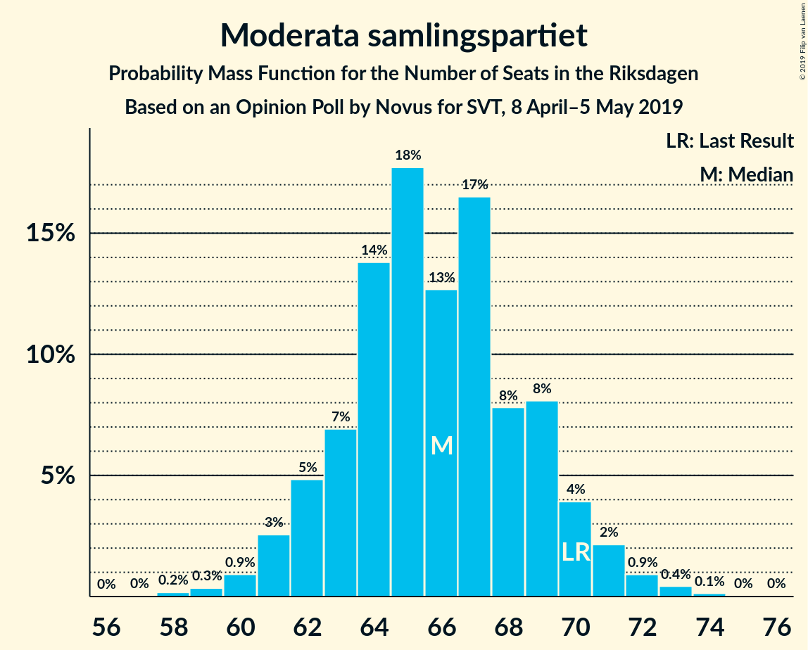

| Number of Seats | Probability | Accumulated | Special Marks |
|:---------------:|:-----------:|:-----------:|:-------------:|
| 57 | 0.1% | 100% |  |
| 58 | 0.1% | 99.9% |  |
| 59 | 0.4% | 99.9% |  |
| 60 | 0.5% | 99.5% |  |
| 61 | 1.0% | 99.0% |  |
| 62 | 8% | 98% |  |
| 63 | 8% | 90% |  |
| 64 | 23% | 82% |  |
| 65 | 31% | 59% | Median |
| 66 | 8% | 27% |  |
| 67 | 6% | 19% |  |
| 68 | 3% | 14% |  |
| 69 | 3% | 10% |  |
| 70 | 3% | 7% | Last Result |
| 71 | 3% | 4% |  |
| 72 | 0.5% | 1.1% |  |
| 73 | 0.4% | 0.6% |  |
| 74 | 0.1% | 0.2% |  |
| 75 | 0% | 0.1% |  |
| 76 | 0% | 0% |  |

### Sverigedemokraterna

*For a full overview of the results for this party, see the [Sverigedemokraterna](party-sverigedemokraterna.html) page.*

| Number of Seats | Probability | Accumulated | Special Marks |
|:---------------:|:-----------:|:-----------:|:-------------:|
| 57 | 0.1% | 100% |  |
| 58 | 0.1% | 99.9% |  |
| 59 | 1.1% | 99.9% |  |
| 60 | 2% | 98.8% |  |
| 61 | 0.5% | 97% |  |
| 62 | 11% | 97% | Last Result |
| 63 | 14% | 85% |  |
| 64 | 3% | 71% |  |
| 65 | 28% | 68% | Median |
| 66 | 3% | 41% |  |
| 67 | 9% | 38% |  |
| 68 | 21% | 29% |  |
| 69 | 0.5% | 7% |  |
| 70 | 2% | 7% |  |
| 71 | 4% | 5% |  |
| 72 | 0.1% | 0.4% |  |
| 73 | 0.2% | 0.3% |  |
| 74 | 0% | 0.1% |  |
| 75 | 0% | 0% |  |

### Kristdemokraterna

*For a full overview of the results for this party, see the [Kristdemokraterna](party-kristdemokraterna.html) page.*

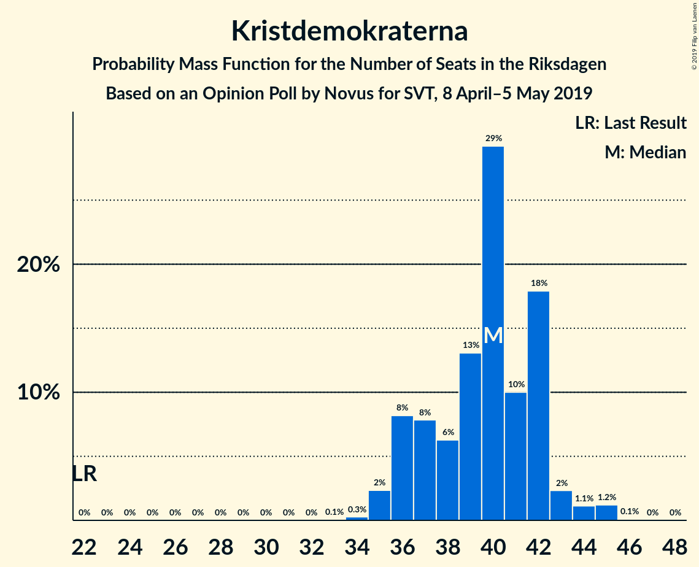

| Number of Seats | Probability | Accumulated | Special Marks |
|:---------------:|:-----------:|:-----------:|:-------------:|
| 22 | 0% | 100% | Last Result |
| 23 | 0% | 100% |  |
| 24 | 0% | 100% |  |
| 25 | 0% | 100% |  |
| 26 | 0% | 100% |  |
| 27 | 0% | 100% |  |
| 28 | 0% | 100% |  |
| 29 | 0% | 100% |  |
| 30 | 0% | 100% |  |
| 31 | 0% | 100% |  |
| 32 | 0% | 100% |  |
| 33 | 0.1% | 100% |  |
| 34 | 0.3% | 99.9% |  |
| 35 | 2% | 99.6% |  |
| 36 | 8% | 97% |  |
| 37 | 8% | 89% |  |
| 38 | 6% | 81% |  |
| 39 | 13% | 75% |  |
| 40 | 29% | 62% | Median |
| 41 | 10% | 33% |  |
| 42 | 18% | 23% |  |
| 43 | 2% | 5% |  |
| 44 | 1.1% | 2% |  |
| 45 | 1.2% | 1.3% |  |
| 46 | 0.1% | 0.1% |  |
| 47 | 0% | 0% |  |

### Centerpartiet

*For a full overview of the results for this party, see the [Centerpartiet](party-centerpartiet.html) page.*

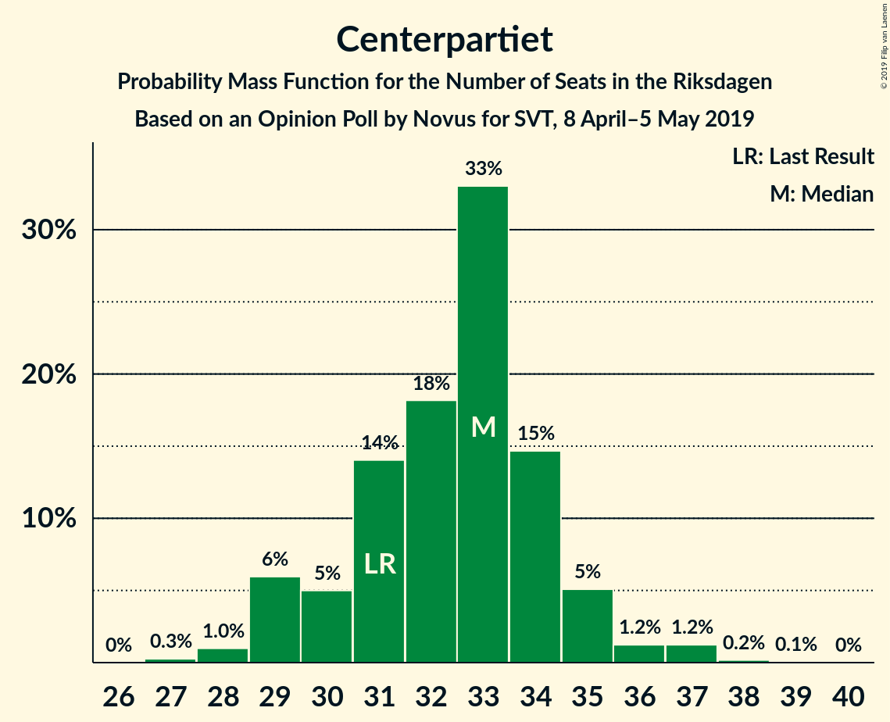

| Number of Seats | Probability | Accumulated | Special Marks |
|:---------------:|:-----------:|:-----------:|:-------------:|
| 26 | 0.1% | 100% |  |
| 27 | 0.3% | 99.9% |  |
| 28 | 0.8% | 99.7% |  |
| 29 | 1.2% | 98.9% |  |
| 30 | 4% | 98% |  |
| 31 | 17% | 94% | Last Result |
| 32 | 14% | 76% |  |
| 33 | 44% | 62% | Median |
| 34 | 8% | 18% |  |
| 35 | 5% | 10% |  |
| 36 | 2% | 4% |  |
| 37 | 2% | 2% |  |
| 38 | 0.2% | 0.3% |  |
| 39 | 0% | 0.1% |  |
| 40 | 0% | 0% |  |

### Vänsterpartiet

*For a full overview of the results for this party, see the [Vänsterpartiet](party-vänsterpartiet.html) page.*

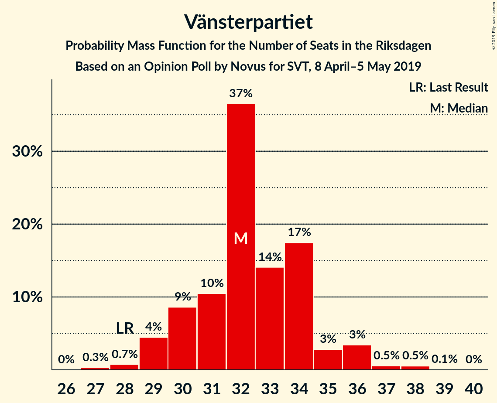

| Number of Seats | Probability | Accumulated | Special Marks |
|:---------------:|:-----------:|:-----------:|:-------------:|
| 27 | 0.3% | 100% |  |
| 28 | 0.9% | 99.7% | Last Result |
| 29 | 3% | 98.8% |  |
| 30 | 10% | 96% |  |
| 31 | 13% | 86% |  |
| 32 | 30% | 73% | Median |
| 33 | 22% | 43% |  |
| 34 | 12% | 21% |  |
| 35 | 5% | 10% |  |
| 36 | 3% | 4% |  |
| 37 | 0.7% | 1.2% |  |
| 38 | 0.4% | 0.6% |  |
| 39 | 0.1% | 0.1% |  |
| 40 | 0% | 0% |  |

### Miljöpartiet de gröna

*For a full overview of the results for this party, see the [Miljöpartiet de gröna](party-miljöpartietdegröna.html) page.*

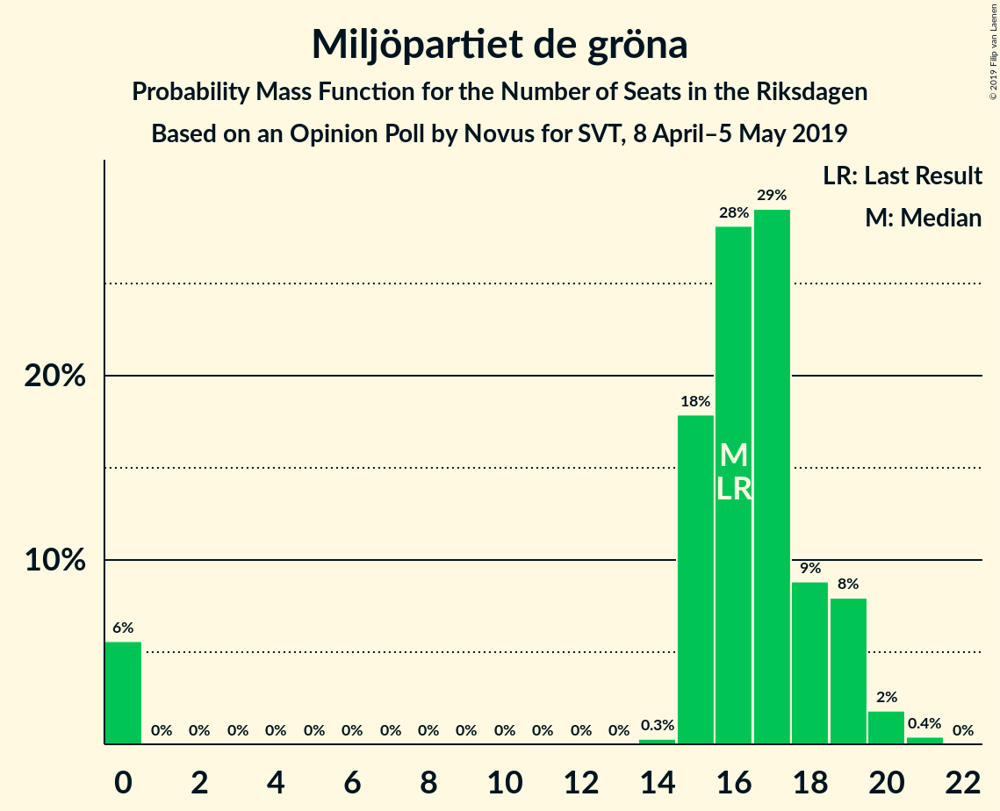

| Number of Seats | Probability | Accumulated | Special Marks |
|:---------------:|:-----------:|:-----------:|:-------------:|
| 0 | 6% | 100% |  |
| 1 | 0% | 94% |  |
| 2 | 0% | 94% |  |
| 3 | 0% | 94% |  |
| 4 | 0% | 94% |  |
| 5 | 0% | 94% |  |
| 6 | 0% | 94% |  |
| 7 | 0% | 94% |  |
| 8 | 0% | 94% |  |
| 9 | 0% | 94% |  |
| 10 | 0% | 94% |  |
| 11 | 0% | 94% |  |
| 12 | 0% | 94% |  |
| 13 | 0% | 94% |  |
| 14 | 0.3% | 94% |  |
| 15 | 18% | 94% |  |
| 16 | 28% | 76% | Last Result, Median |
| 17 | 29% | 48% |  |
| 18 | 9% | 19% |  |
| 19 | 8% | 10% |  |
| 20 | 2% | 2% |  |
| 21 | 0.4% | 0.4% |  |
| 22 | 0% | 0% |  |

### Liberalerna

*For a full overview of the results for this party, see the [Liberalerna](party-liberalerna.html) page.*

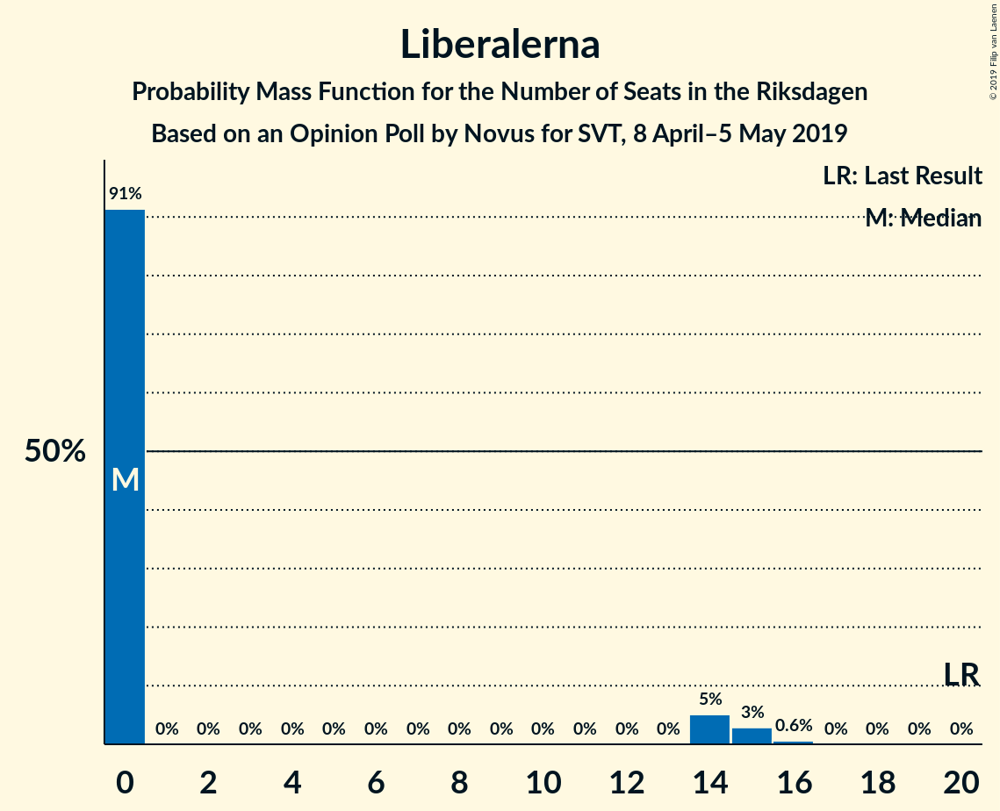

| Number of Seats | Probability | Accumulated | Special Marks |
|:---------------:|:-----------:|:-----------:|:-------------:|
| 0 | 92% | 100% | Median |
| 1 | 0% | 8% |  |
| 2 | 0% | 8% |  |
| 3 | 0% | 8% |  |
| 4 | 0% | 8% |  |
| 5 | 0% | 8% |  |
| 6 | 0% | 8% |  |
| 7 | 0% | 8% |  |
| 8 | 0% | 8% |  |
| 9 | 0% | 8% |  |
| 10 | 0% | 8% |  |
| 11 | 0% | 8% |  |
| 12 | 0% | 8% |  |
| 13 | 0% | 8% |  |
| 14 | 6% | 8% |  |
| 15 | 2% | 2% |  |
| 16 | 0.5% | 0.5% |  |
| 17 | 0% | 0% |  |
| 18 | 0% | 0% |  |
| 19 | 0% | 0% |  |
| 20 | 0% | 0% | Last Result |

## Coalitions

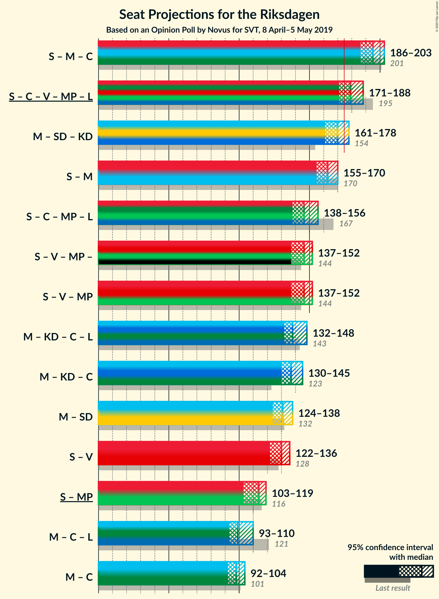

### Confidence Intervals

| Coalition | Last Result | Median | Majority? | 80% Confidence Interval | 90% Confidence Interval | 95% Confidence Interval | 99% Confidence Interval |
|:---------:|:-----------:|:------:|:---------:|:-----------------------:|:-----------------------:|:-----------------------:|:-----------------------:|
| Sveriges socialdemokratiska arbetareparti – Moderata samlingspartiet – Centerpartiet | 201 | 194 | 100% | 189–199 | 189–203 | 187–207 | 183–209 |
| Sveriges socialdemokratiska arbetareparti – Centerpartiet – Vänsterpartiet – Miljöpartiet de gröna – Liberalerna | 195 | 179 | 89% | 174–184 | 172–189 | 170–189 | 167–189 |
| Moderata samlingspartiet – Sverigedemokraterna – Kristdemokraterna | 154 | 170 | 11% | 165–175 | 160–177 | 160–179 | 160–182 |
| Sveriges socialdemokratiska arbetareparti – Moderata samlingspartiet | 170 | 162 | 0.4% | 157–167 | 156–170 | 155–171 | 151–174 |
| Sveriges socialdemokratiska arbetareparti – Centerpartiet – Miljöpartiet de gröna – Liberalerna | 167 | 147 | 0% | 141–152 | 137–158 | 136–158 | 131–158 |
| Sveriges socialdemokratiska arbetareparti – Vänsterpartiet – Miljöpartiet de gröna | 144 | 146 | 0% | 140–148 | 136–149 | 135–151 | 134–153 |
| Moderata samlingspartiet – Kristdemokraterna – Centerpartiet – Liberalerna | 143 | 138 | 0% | 134–145 | 133–146 | 132–148 | 131–150 |
| Moderata samlingspartiet – Kristdemokraterna – Centerpartiet | 123 | 137 | 0% | 133–141 | 131–145 | 131–146 | 128–148 |
| Moderata samlingspartiet – Sverigedemokraterna | 132 | 130 | 0% | 126–135 | 124–138 | 124–138 | 122–139 |
| Sveriges socialdemokratiska arbetareparti – Vänsterpartiet | 128 | 130 | 0% | 125–131 | 123–134 | 122–136 | 121–138 |
| Sveriges socialdemokratiska arbetareparti – Miljöpartiet de gröna | 116 | 113 | 0% | 108–117 | 103–118 | 100–119 | 99–121 |
| Moderata samlingspartiet – Centerpartiet – Liberalerna | 121 | 98 | 0% | 96–107 | 95–109 | 93–109 | 91–112 |
| Moderata samlingspartiet – Centerpartiet | 101 | 97 | 0% | 95–101 | 94–103 | 93–107 | 90–108 |

### Sveriges socialdemokratiska arbetareparti – Moderata samlingspartiet – Centerpartiet

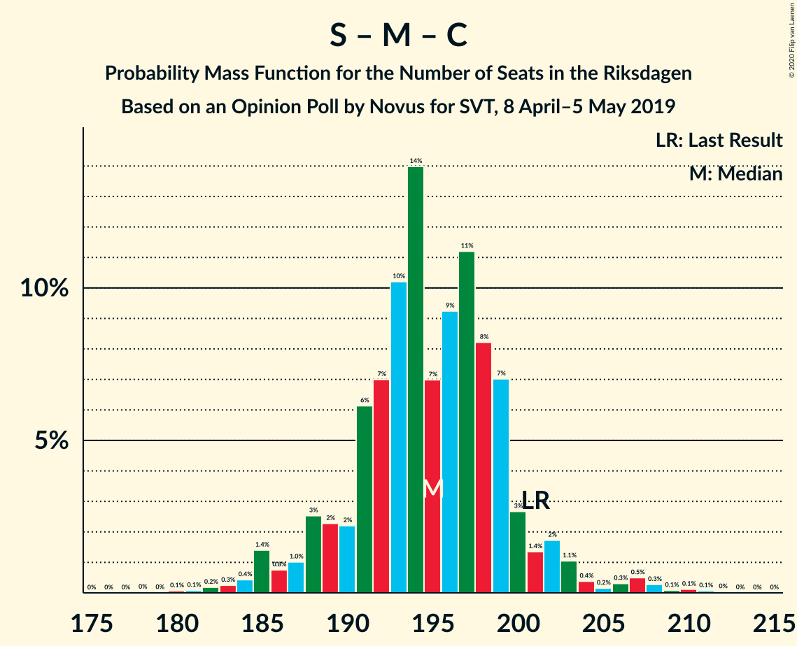

| Number of Seats | Probability | Accumulated | Special Marks |
|:---------------:|:-----------:|:-----------:|:-------------:|
| 180 | 0.2% | 100% |  |
| 181 | 0.1% | 99.8% |  |
| 182 | 0.1% | 99.7% |  |
| 183 | 0.4% | 99.6% |  |
| 184 | 0% | 99.2% |  |
| 185 | 0.2% | 99.2% |  |
| 186 | 1.1% | 98.9% |  |
| 187 | 0.4% | 98% |  |
| 188 | 2% | 97% |  |
| 189 | 6% | 96% |  |
| 190 | 5% | 89% |  |
| 191 | 1.1% | 84% |  |
| 192 | 8% | 83% |  |
| 193 | 4% | 75% |  |
| 194 | 30% | 71% |  |
| 195 | 3% | 41% | Median |
| 196 | 18% | 38% |  |
| 197 | 4% | 20% |  |
| 198 | 4% | 17% |  |
| 199 | 3% | 12% |  |
| 200 | 2% | 9% |  |
| 201 | 1.1% | 7% | Last Result |
| 202 | 0.4% | 6% |  |
| 203 | 0.5% | 5% |  |
| 204 | 1.5% | 5% |  |
| 205 | 0.1% | 3% |  |
| 206 | 0.1% | 3% |  |
| 207 | 2% | 3% |  |
| 208 | 0.1% | 0.7% |  |
| 209 | 0.3% | 0.6% |  |
| 210 | 0% | 0.3% |  |
| 211 | 0.3% | 0.3% |  |
| 212 | 0% | 0% |  |

### Sveriges socialdemokratiska arbetareparti – Centerpartiet – Vänsterpartiet – Miljöpartiet de gröna – Liberalerna

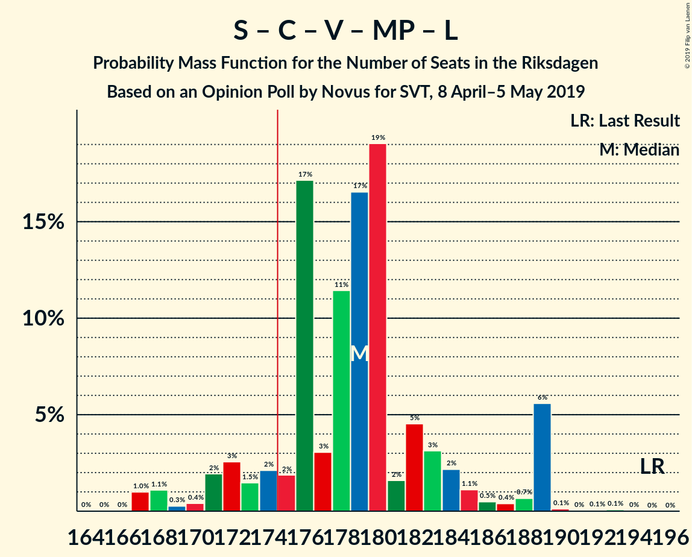

| Number of Seats | Probability | Accumulated | Special Marks |
|:---------------:|:-----------:|:-----------:|:-------------:|
| 164 | 0% | 100% |  |
| 165 | 0% | 99.9% |  |
| 166 | 0% | 99.9% |  |
| 167 | 1.0% | 99.9% |  |
| 168 | 1.1% | 98.9% |  |
| 169 | 0.3% | 98% |  |
| 170 | 0.4% | 98% |  |
| 171 | 2% | 97% |  |
| 172 | 3% | 95% |  |
| 173 | 1.5% | 93% |  |
| 174 | 2% | 91% |  |
| 175 | 2% | 89% | Majority |
| 176 | 17% | 87% |  |
| 177 | 3% | 70% |  |
| 178 | 11% | 67% | Median |
| 179 | 17% | 56% |  |
| 180 | 19% | 39% |  |
| 181 | 2% | 20% |  |
| 182 | 5% | 18% |  |
| 183 | 3% | 14% |  |
| 184 | 2% | 11% |  |
| 185 | 1.1% | 9% |  |
| 186 | 0.5% | 7% |  |
| 187 | 0.4% | 7% |  |
| 188 | 0.7% | 7% |  |
| 189 | 6% | 6% |  |
| 190 | 0.1% | 0.3% |  |
| 191 | 0% | 0.2% |  |
| 192 | 0.1% | 0.1% |  |
| 193 | 0.1% | 0.1% |  |
| 194 | 0% | 0% |  |
| 195 | 0% | 0% | Last Result |

### Moderata samlingspartiet – Sverigedemokraterna – Kristdemokraterna

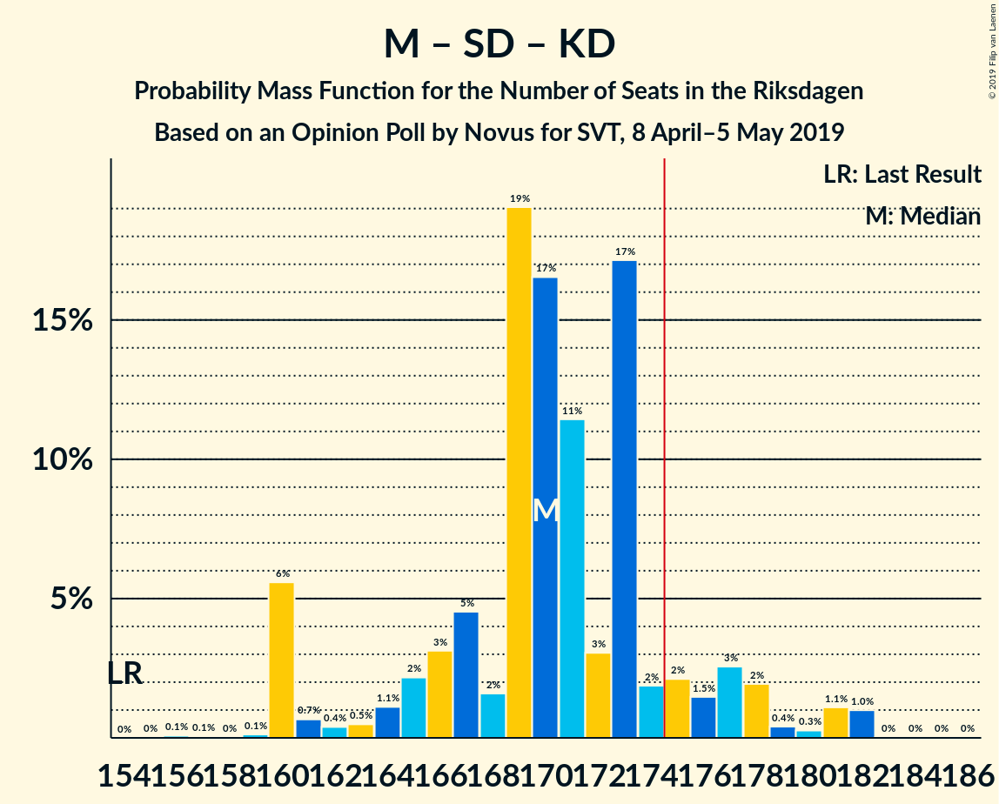

| Number of Seats | Probability | Accumulated | Special Marks |
|:---------------:|:-----------:|:-----------:|:-------------:|
| 154 | 0% | 100% | Last Result |
| 155 | 0% | 100% |  |
| 156 | 0.1% | 100% |  |
| 157 | 0.1% | 99.9% |  |
| 158 | 0% | 99.9% |  |
| 159 | 0.1% | 99.8% |  |
| 160 | 6% | 99.7% |  |
| 161 | 0.7% | 94% |  |
| 162 | 0.4% | 93% |  |
| 163 | 0.5% | 93% |  |
| 164 | 1.1% | 93% |  |
| 165 | 2% | 91% |  |
| 166 | 3% | 89% |  |
| 167 | 5% | 86% |  |
| 168 | 2% | 82% |  |
| 169 | 19% | 80% |  |
| 170 | 17% | 61% | Median |
| 171 | 11% | 44% |  |
| 172 | 3% | 33% |  |
| 173 | 17% | 30% |  |
| 174 | 2% | 13% |  |
| 175 | 2% | 11% | Majority |
| 176 | 1.5% | 9% |  |
| 177 | 3% | 7% |  |
| 178 | 2% | 5% |  |
| 179 | 0.4% | 3% |  |
| 180 | 0.3% | 2% |  |
| 181 | 1.1% | 2% |  |
| 182 | 1.0% | 1.1% |  |
| 183 | 0% | 0.1% |  |
| 184 | 0% | 0.1% |  |
| 185 | 0% | 0.1% |  |
| 186 | 0% | 0% |  |

### Sveriges socialdemokratiska arbetareparti – Moderata samlingspartiet

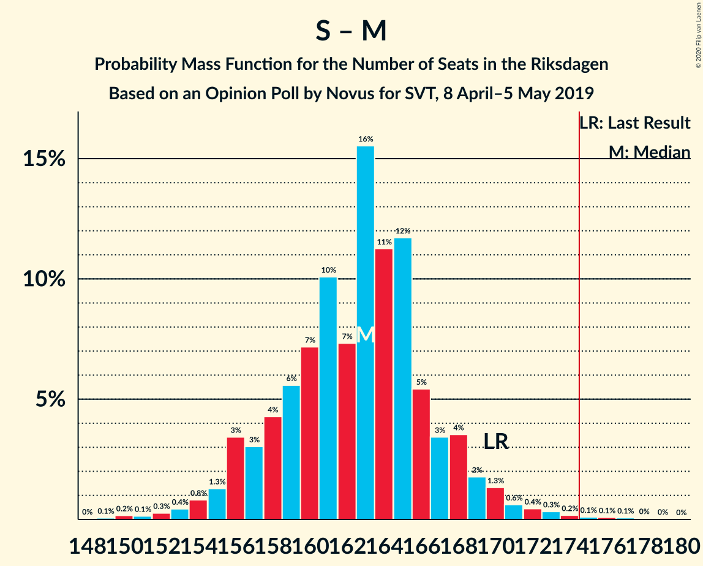

| Number of Seats | Probability | Accumulated | Special Marks |
|:---------------:|:-----------:|:-----------:|:-------------:|
| 149 | 0.1% | 100% |  |
| 150 | 0.1% | 99.8% |  |
| 151 | 0.3% | 99.8% |  |
| 152 | 0.1% | 99.4% |  |
| 153 | 0.4% | 99.3% |  |
| 154 | 0.9% | 98.9% |  |
| 155 | 0.6% | 98% |  |
| 156 | 7% | 97% |  |
| 157 | 0.8% | 91% |  |
| 158 | 4% | 90% |  |
| 159 | 4% | 86% |  |
| 160 | 9% | 82% |  |
| 161 | 22% | 73% |  |
| 162 | 3% | 51% | Median |
| 163 | 27% | 48% |  |
| 164 | 6% | 21% |  |
| 165 | 2% | 15% |  |
| 166 | 2% | 13% |  |
| 167 | 4% | 11% |  |
| 168 | 1.0% | 8% |  |
| 169 | 1.1% | 7% |  |
| 170 | 2% | 5% | Last Result |
| 171 | 2% | 4% |  |
| 172 | 1.3% | 2% |  |
| 173 | 0.3% | 1.0% |  |
| 174 | 0.3% | 0.7% |  |
| 175 | 0.2% | 0.4% | Majority |
| 176 | 0.1% | 0.1% |  |
| 177 | 0% | 0.1% |  |
| 178 | 0% | 0% |  |

### Sveriges socialdemokratiska arbetareparti – Centerpartiet – Miljöpartiet de gröna – Liberalerna

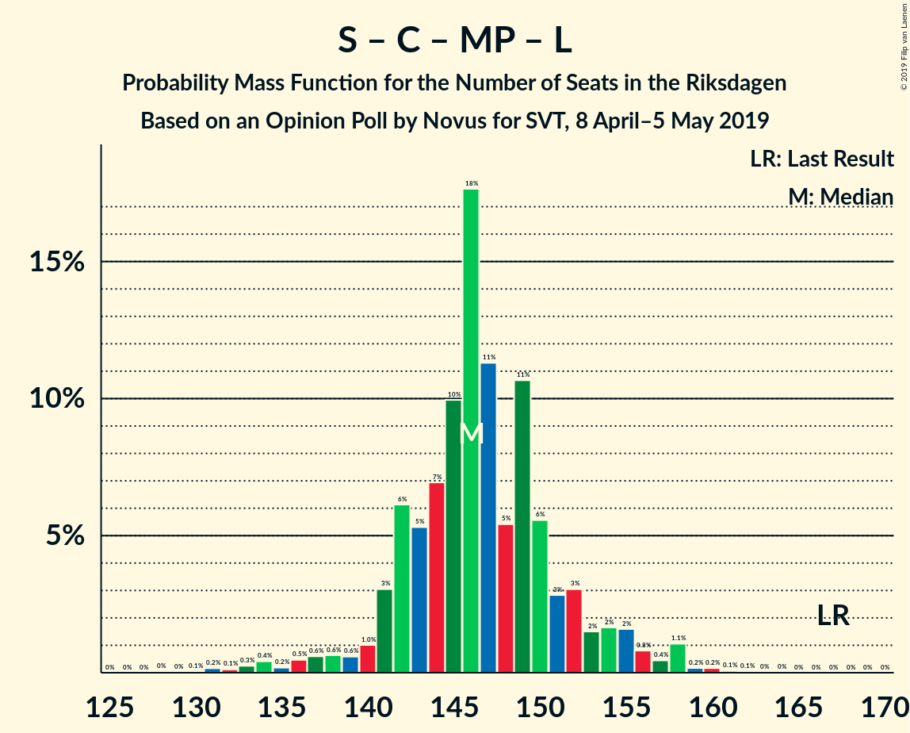

| Number of Seats | Probability | Accumulated | Special Marks |
|:---------------:|:-----------:|:-----------:|:-------------:|
| 131 | 0.6% | 100% |  |
| 132 | 0% | 99.4% |  |
| 133 | 0% | 99.3% |  |
| 134 | 1.0% | 99.3% |  |
| 135 | 0.6% | 98% |  |
| 136 | 1.2% | 98% |  |
| 137 | 2% | 97% |  |
| 138 | 0.3% | 95% |  |
| 139 | 0.2% | 95% |  |
| 140 | 1.1% | 94% |  |
| 141 | 4% | 93% |  |
| 142 | 1.2% | 89% |  |
| 143 | 1.4% | 88% |  |
| 144 | 19% | 86% |  |
| 145 | 11% | 67% |  |
| 146 | 2% | 56% | Median |
| 147 | 29% | 54% |  |
| 148 | 3% | 25% |  |
| 149 | 3% | 22% |  |
| 150 | 4% | 19% |  |
| 151 | 1.2% | 15% |  |
| 152 | 4% | 14% |  |
| 153 | 2% | 9% |  |
| 154 | 0.5% | 8% |  |
| 155 | 0.7% | 7% |  |
| 156 | 0.4% | 6% |  |
| 157 | 0.1% | 6% |  |
| 158 | 5% | 6% |  |
| 159 | 0% | 0.3% |  |
| 160 | 0.2% | 0.3% |  |
| 161 | 0% | 0.1% |  |
| 162 | 0% | 0% |  |
| 163 | 0% | 0% |  |
| 164 | 0% | 0% |  |
| 165 | 0% | 0% |  |
| 166 | 0% | 0% |  |
| 167 | 0% | 0% | Last Result |

### Sveriges socialdemokratiska arbetareparti – Vänsterpartiet – Miljöpartiet de gröna

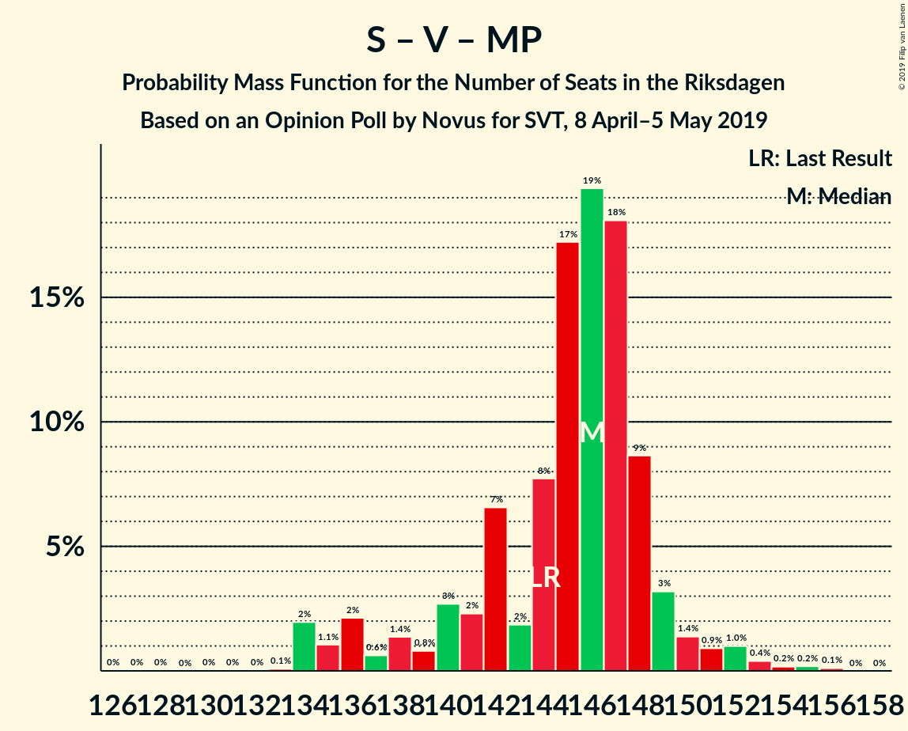

| Number of Seats | Probability | Accumulated | Special Marks |
|:---------------:|:-----------:|:-----------:|:-------------:|
| 127 | 0% | 100% |  |
| 128 | 0% | 99.9% |  |
| 129 | 0% | 99.9% |  |
| 130 | 0% | 99.9% |  |
| 131 | 0% | 99.9% |  |
| 132 | 0% | 99.8% |  |
| 133 | 0.1% | 99.8% |  |
| 134 | 2% | 99.7% |  |
| 135 | 1.1% | 98% |  |
| 136 | 2% | 97% |  |
| 137 | 0.6% | 95% |  |
| 138 | 1.4% | 94% |  |
| 139 | 0.8% | 93% |  |
| 140 | 3% | 92% |  |
| 141 | 2% | 89% |  |
| 142 | 7% | 87% |  |
| 143 | 2% | 80% |  |
| 144 | 8% | 78% | Last Result |
| 145 | 17% | 71% | Median |
| 146 | 19% | 53% |  |
| 147 | 18% | 34% |  |
| 148 | 9% | 16% |  |
| 149 | 3% | 7% |  |
| 150 | 1.4% | 4% |  |
| 151 | 0.9% | 3% |  |
| 152 | 1.0% | 2% |  |
| 153 | 0.4% | 0.9% |  |
| 154 | 0.2% | 0.5% |  |
| 155 | 0.2% | 0.3% |  |
| 156 | 0.1% | 0.1% |  |
| 157 | 0% | 0% |  |

### Moderata samlingspartiet – Kristdemokraterna – Centerpartiet – Liberalerna

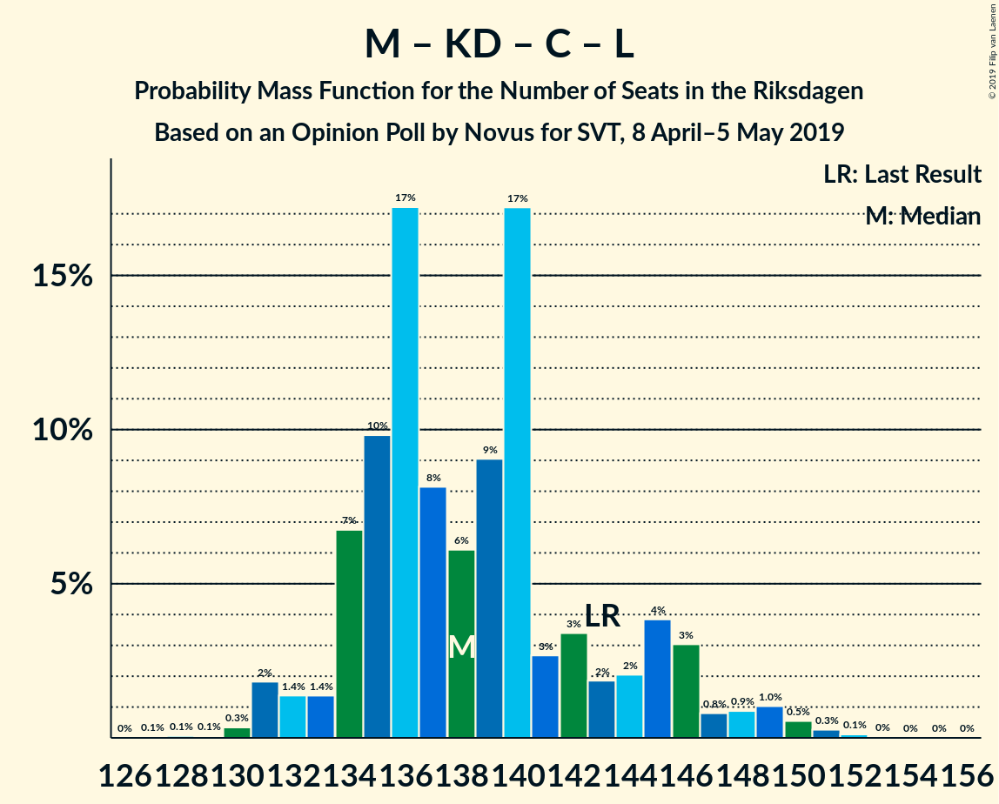

| Number of Seats | Probability | Accumulated | Special Marks |
|:---------------:|:-----------:|:-----------:|:-------------:|
| 127 | 0.1% | 100% |  |
| 128 | 0% | 99.9% |  |
| 129 | 0.1% | 99.9% |  |
| 130 | 0.2% | 99.9% |  |
| 131 | 0.7% | 99.6% |  |
| 132 | 2% | 98.9% |  |
| 133 | 2% | 97% |  |
| 134 | 5% | 95% |  |
| 135 | 6% | 89% |  |
| 136 | 17% | 84% |  |
| 137 | 15% | 67% |  |
| 138 | 8% | 52% | Median |
| 139 | 7% | 44% |  |
| 140 | 16% | 36% |  |
| 141 | 3% | 21% |  |
| 142 | 1.5% | 17% |  |
| 143 | 1.0% | 16% | Last Result |
| 144 | 2% | 15% |  |
| 145 | 7% | 13% |  |
| 146 | 2% | 7% |  |
| 147 | 1.2% | 5% |  |
| 148 | 2% | 3% |  |
| 149 | 0.8% | 2% |  |
| 150 | 0.6% | 1.0% |  |
| 151 | 0.3% | 0.5% |  |
| 152 | 0% | 0.2% |  |
| 153 | 0% | 0.1% |  |
| 154 | 0% | 0.1% |  |
| 155 | 0% | 0.1% |  |
| 156 | 0% | 0% |  |

### Moderata samlingspartiet – Kristdemokraterna – Centerpartiet

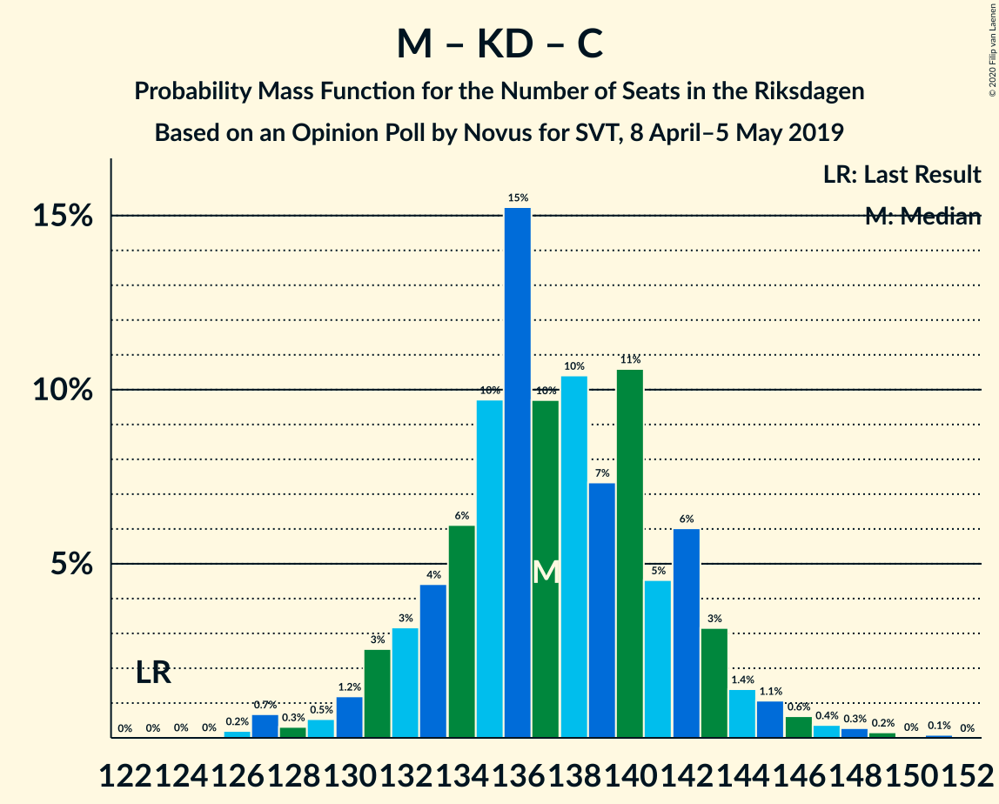

| Number of Seats | Probability | Accumulated | Special Marks |
|:---------------:|:-----------:|:-----------:|:-------------:|
| 123 | 0% | 100% | Last Result |
| 124 | 0% | 100% |  |
| 125 | 0% | 100% |  |
| 126 | 0% | 99.9% |  |
| 127 | 0.3% | 99.9% |  |
| 128 | 0.1% | 99.6% |  |
| 129 | 0.1% | 99.5% |  |
| 130 | 0.5% | 99.3% |  |
| 131 | 6% | 98.8% |  |
| 132 | 2% | 93% |  |
| 133 | 3% | 90% |  |
| 134 | 6% | 88% |  |
| 135 | 6% | 82% |  |
| 136 | 17% | 76% |  |
| 137 | 15% | 59% |  |
| 138 | 8% | 44% | Median |
| 139 | 7% | 35% |  |
| 140 | 16% | 28% |  |
| 141 | 3% | 12% |  |
| 142 | 1.5% | 9% |  |
| 143 | 0.9% | 8% |  |
| 144 | 2% | 7% |  |
| 145 | 1.1% | 5% |  |
| 146 | 2% | 4% |  |
| 147 | 0.8% | 2% |  |
| 148 | 1.4% | 2% |  |
| 149 | 0% | 0.2% |  |
| 150 | 0% | 0.2% |  |
| 151 | 0.2% | 0.2% |  |
| 152 | 0% | 0% |  |

### Moderata samlingspartiet – Sverigedemokraterna

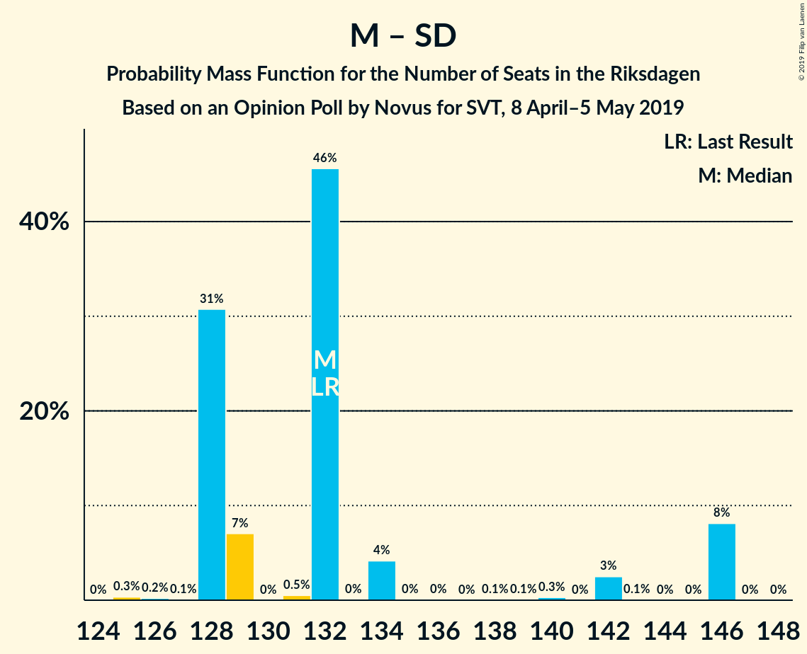

| Number of Seats | Probability | Accumulated | Special Marks |
|:---------------:|:-----------:|:-----------:|:-------------:|
| 118 | 0.1% | 100% |  |
| 119 | 0.1% | 99.9% |  |
| 120 | 0% | 99.8% |  |
| 121 | 0.1% | 99.8% |  |
| 122 | 0.6% | 99.7% |  |
| 123 | 0.5% | 99.1% |  |
| 124 | 6% | 98.6% |  |
| 125 | 1.2% | 92% |  |
| 126 | 2% | 91% |  |
| 127 | 1.4% | 89% |  |
| 128 | 18% | 88% |  |
| 129 | 19% | 70% |  |
| 130 | 5% | 51% | Median |
| 131 | 3% | 46% |  |
| 132 | 8% | 44% | Last Result |
| 133 | 19% | 36% |  |
| 134 | 6% | 16% |  |
| 135 | 2% | 11% |  |
| 136 | 0.3% | 9% |  |
| 137 | 3% | 8% |  |
| 138 | 4% | 5% |  |
| 139 | 0.7% | 0.9% |  |
| 140 | 0% | 0.2% |  |
| 141 | 0% | 0.1% |  |
| 142 | 0.1% | 0.1% |  |
| 143 | 0% | 0.1% |  |
| 144 | 0% | 0.1% |  |
| 145 | 0% | 0% |  |

### Sveriges socialdemokratiska arbetareparti – Vänsterpartiet

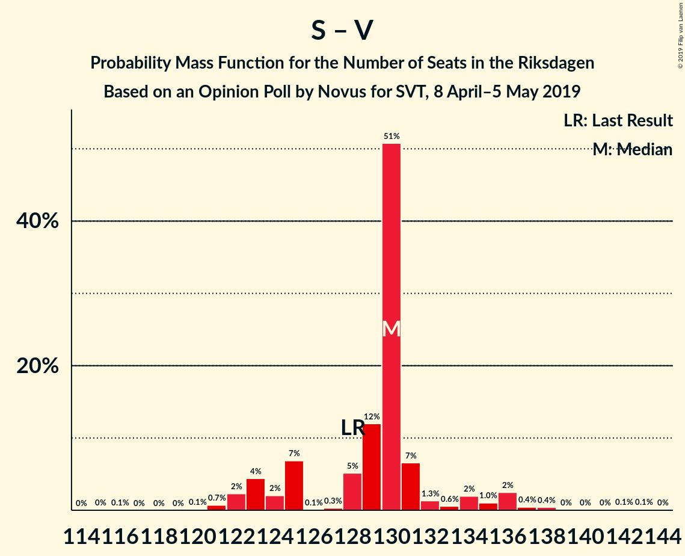

| Number of Seats | Probability | Accumulated | Special Marks |
|:---------------:|:-----------:|:-----------:|:-------------:|
| 116 | 0.1% | 100% |  |
| 117 | 0% | 99.9% |  |
| 118 | 0% | 99.9% |  |
| 119 | 0% | 99.9% |  |
| 120 | 0.1% | 99.9% |  |
| 121 | 0.7% | 99.8% |  |
| 122 | 2% | 99.1% |  |
| 123 | 4% | 97% |  |
| 124 | 2% | 92% |  |
| 125 | 7% | 90% |  |
| 126 | 0.1% | 83% |  |
| 127 | 0.3% | 83% |  |
| 128 | 5% | 83% | Last Result |
| 129 | 12% | 78% | Median |
| 130 | 51% | 66% |  |
| 131 | 7% | 15% |  |
| 132 | 1.3% | 9% |  |
| 133 | 0.6% | 7% |  |
| 134 | 2% | 7% |  |
| 135 | 1.0% | 5% |  |
| 136 | 2% | 4% |  |
| 137 | 0.4% | 1.2% |  |
| 138 | 0.4% | 0.8% |  |
| 139 | 0% | 0.4% |  |
| 140 | 0% | 0.3% |  |
| 141 | 0% | 0.3% |  |
| 142 | 0.1% | 0.3% |  |
| 143 | 0.1% | 0.1% |  |
| 144 | 0% | 0% |  |

### Sveriges socialdemokratiska arbetareparti – Miljöpartiet de gröna

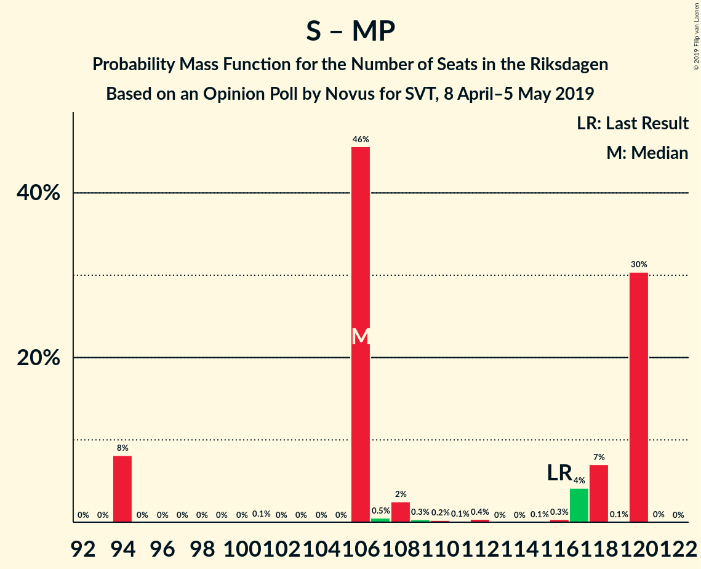

| Number of Seats | Probability | Accumulated | Special Marks |
|:---------------:|:-----------:|:-----------:|:-------------:|
| 96 | 0% | 100% |  |
| 97 | 0% | 99.9% |  |
| 98 | 0% | 99.9% |  |
| 99 | 0.6% | 99.9% |  |
| 100 | 3% | 99.2% |  |
| 101 | 0% | 97% |  |
| 102 | 1.4% | 97% |  |
| 103 | 0.6% | 95% |  |
| 104 | 0.3% | 95% |  |
| 105 | 0.1% | 94% |  |
| 106 | 0.8% | 94% |  |
| 107 | 0.9% | 94% |  |
| 108 | 3% | 93% |  |
| 109 | 2% | 90% |  |
| 110 | 5% | 87% |  |
| 111 | 11% | 82% |  |
| 112 | 3% | 71% |  |
| 113 | 20% | 67% | Median |
| 114 | 28% | 47% |  |
| 115 | 5% | 20% |  |
| 116 | 4% | 15% | Last Result |
| 117 | 5% | 12% |  |
| 118 | 4% | 7% |  |
| 119 | 0.5% | 3% |  |
| 120 | 1.4% | 2% |  |
| 121 | 0.4% | 0.7% |  |
| 122 | 0.3% | 0.3% |  |
| 123 | 0% | 0% |  |

### Moderata samlingspartiet – Centerpartiet – Liberalerna

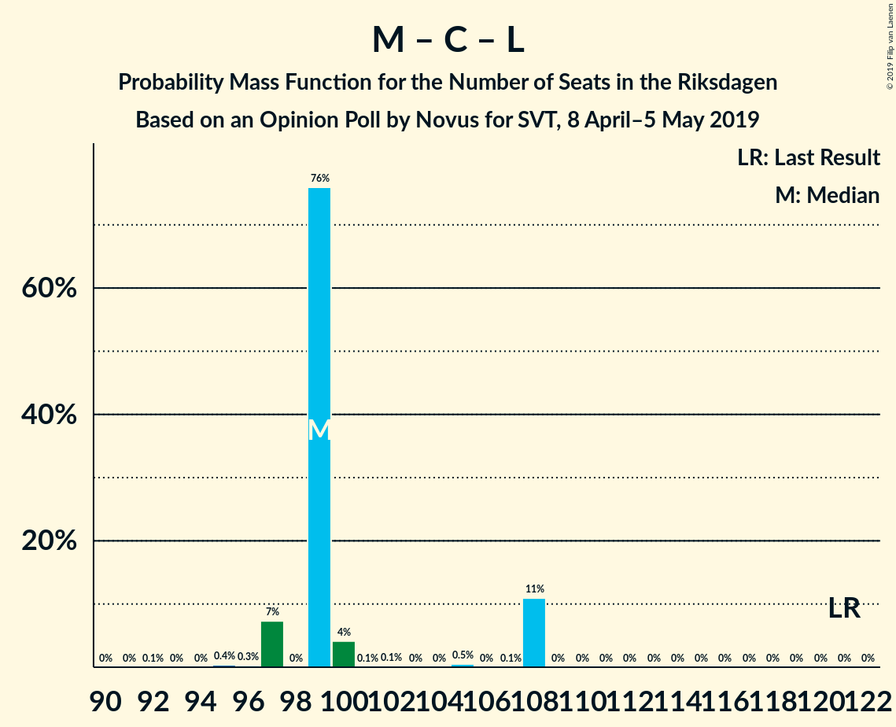

| Number of Seats | Probability | Accumulated | Special Marks |
|:---------------:|:-----------:|:-----------:|:-------------:|
| 89 | 0.1% | 100% |  |
| 90 | 0.2% | 99.9% |  |
| 91 | 0.4% | 99.7% |  |
| 92 | 0.4% | 99.3% |  |
| 93 | 2% | 98.8% |  |
| 94 | 1.1% | 97% |  |
| 95 | 5% | 95% |  |
| 96 | 15% | 90% |  |
| 97 | 20% | 76% |  |
| 98 | 21% | 56% | Median |
| 99 | 6% | 34% |  |
| 100 | 5% | 28% |  |
| 101 | 5% | 23% |  |
| 102 | 4% | 18% |  |
| 103 | 1.2% | 14% |  |
| 104 | 0.9% | 13% |  |
| 105 | 0.6% | 12% |  |
| 106 | 0.5% | 11% |  |
| 107 | 3% | 11% |  |
| 108 | 0.6% | 8% |  |
| 109 | 6% | 7% |  |
| 110 | 0.6% | 2% |  |
| 111 | 0.5% | 1.1% |  |
| 112 | 0.3% | 0.6% |  |
| 113 | 0.2% | 0.3% |  |
| 114 | 0% | 0.1% |  |
| 115 | 0.1% | 0.1% |  |
| 116 | 0% | 0.1% |  |
| 117 | 0% | 0% |  |
| 118 | 0% | 0% |  |
| 119 | 0% | 0% |  |
| 120 | 0% | 0% |  |
| 121 | 0% | 0% | Last Result |

### Moderata samlingspartiet – Centerpartiet

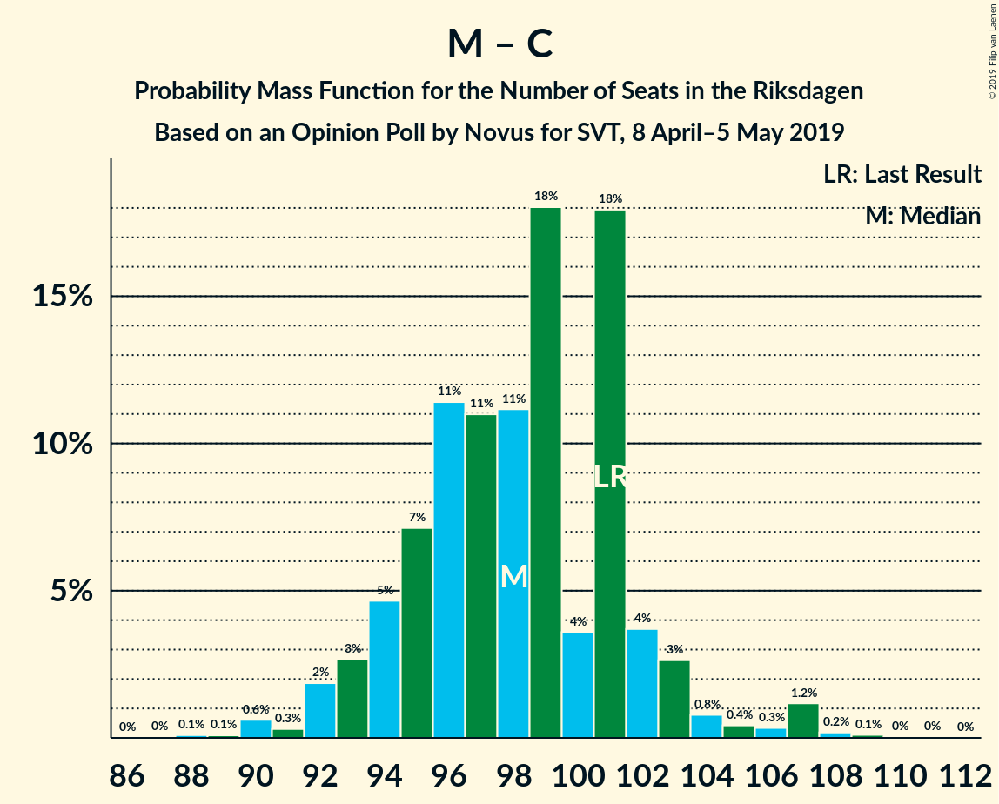

| Number of Seats | Probability | Accumulated | Special Marks |
|:---------------:|:-----------:|:-----------:|:-------------:|
| 88 | 0.2% | 100% |  |
| 89 | 0.1% | 99.8% |  |
| 90 | 0.4% | 99.7% |  |
| 91 | 0.5% | 99.3% |  |
| 92 | 0.9% | 98.8% |  |
| 93 | 3% | 98% |  |
| 94 | 1.3% | 95% |  |
| 95 | 11% | 94% |  |
| 96 | 15% | 83% |  |
| 97 | 21% | 68% |  |
| 98 | 22% | 47% | Median |
| 99 | 6% | 26% |  |
| 100 | 5% | 20% |  |
| 101 | 5% | 15% | Last Result |
| 102 | 4% | 9% |  |
| 103 | 1.1% | 6% |  |
| 104 | 0.7% | 5% |  |
| 105 | 0.6% | 4% |  |
| 106 | 0.4% | 3% |  |
| 107 | 2% | 3% |  |
| 108 | 0.3% | 0.5% |  |
| 109 | 0.2% | 0.2% |  |
| 110 | 0% | 0% |  |

## Technical Information

### Opinion Poll

+ **Polling firm:** Novus
+ **Commissioner(s):** SVT
+ **Fieldwork period:** 8 April–5 May 2019

### Calculations

+ **Sample size:** 3404
+ **Simulations done:** 131,072
+ **Error estimate:** 0.70%

