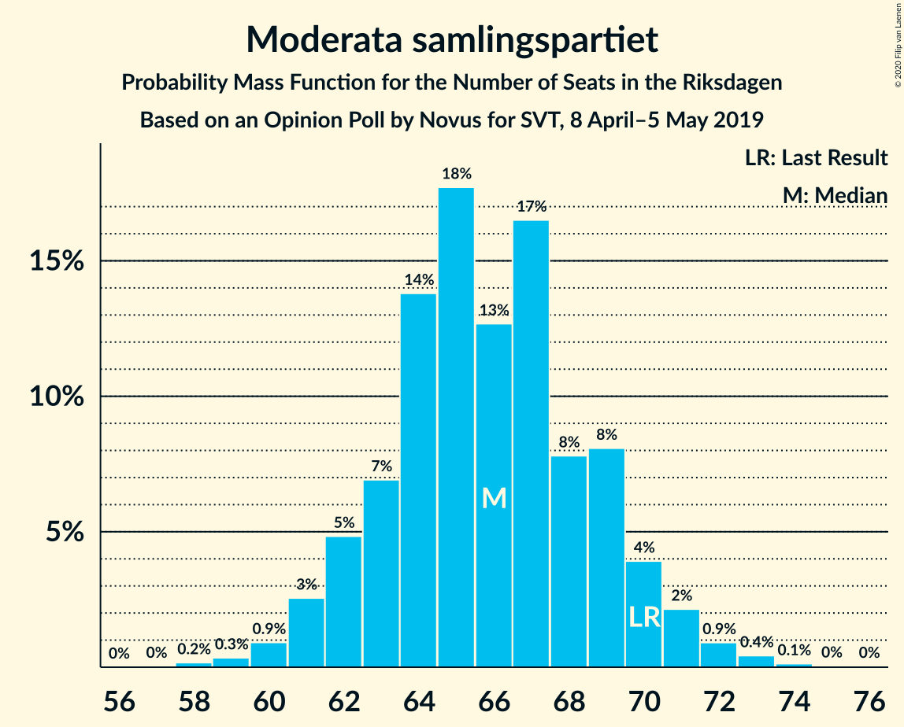
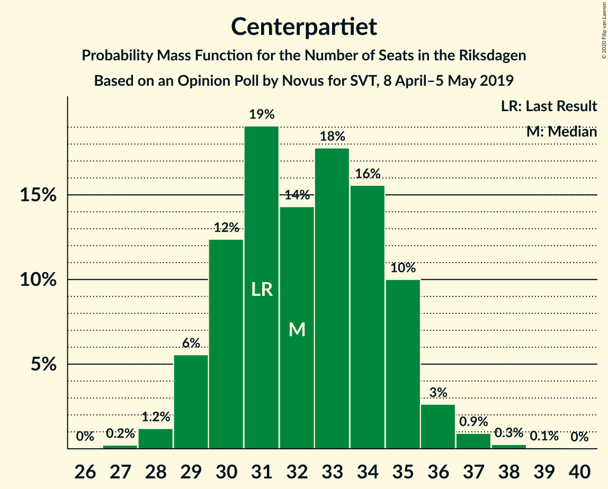
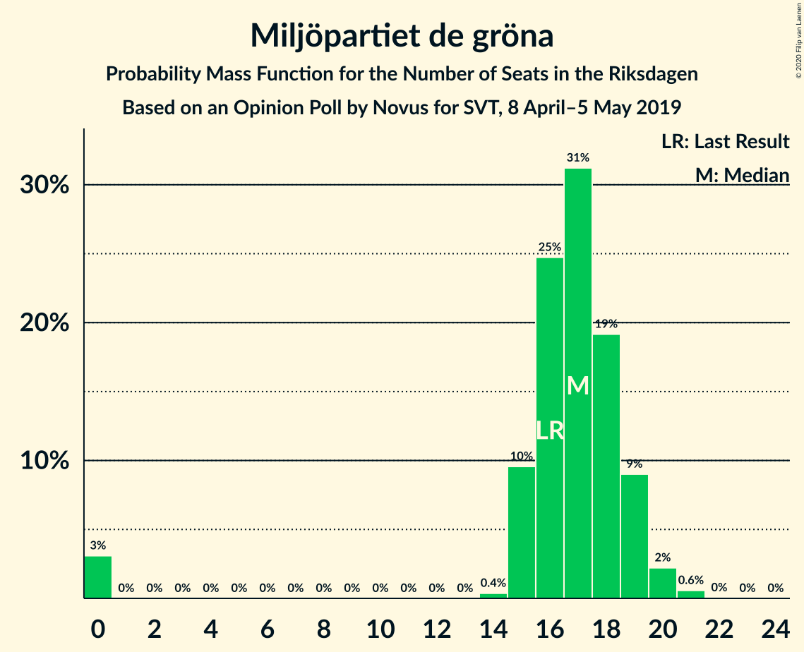
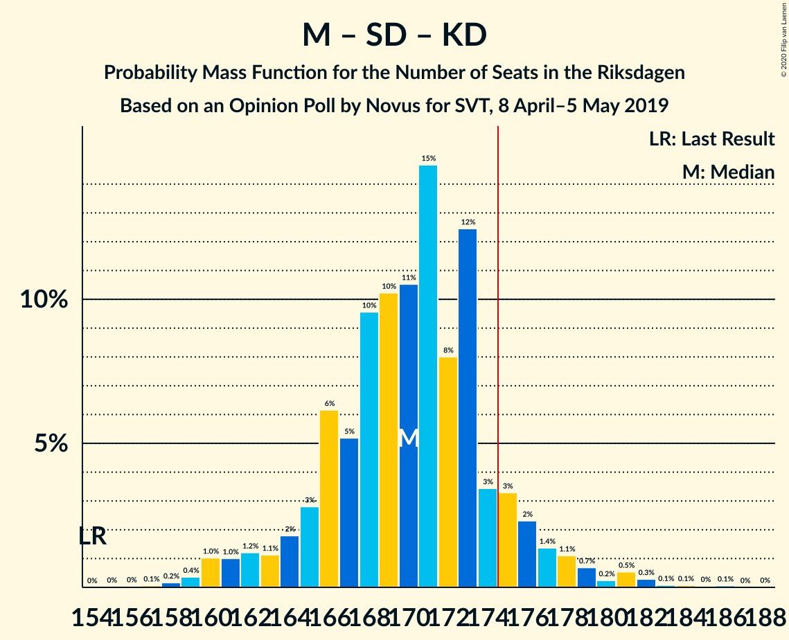
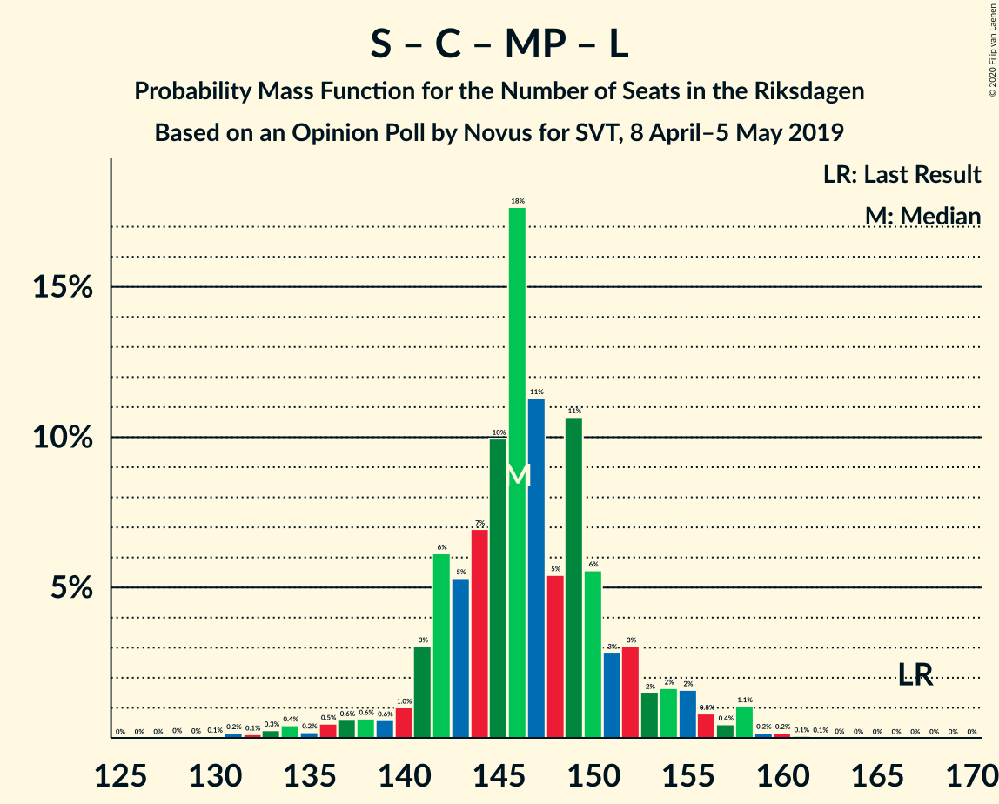

# Opinion Poll by Novus for SVT, 8 April–5 May 2019

<a href="#voting-intentions">Voting Intentions</a> | <a href="#seats">Seats</a> | <a href="#coalitions">Coalitions</a> | <a href="#technical-information">Technical Information</a>

## Voting Intentions

### Confidence Intervals

| Party | Last Result | Poll Result | 80% Confidence Interval | 90% Confidence Interval | 95% Confidence Interval | 99% Confidence Interval |
|:-----:|:-----------:|:-----------:|:-----------------------:|:-----------------------:|:-----------------------:|:-----------------------:|
| Sveriges socialdemokratiska arbetareparti | 28.3% | 26.4% | 25.5–27.4% |25.2–27.7% |25.0–27.9% |24.5–28.4% |
| Moderata samlingspartiet | 19.8% | 18.0% | 17.2–18.9% |16.9–19.1% |16.8–19.3% |16.4–19.8% |
| Sverigedemokraterna | 17.5% | 17.8% | 17.0–18.7% |16.8–18.9% |16.6–19.1% |16.2–19.6% |
| Kristdemokraterna | 6.3% | 10.7% | 10.0–11.4% |9.8–11.6% |9.7–11.8% |9.4–12.1% |
| Centerpartiet | 8.6% | 8.8% | 8.2–9.5% |8.0–9.7% |7.9–9.8% |7.6–10.1% |
| Vänsterpartiet | 8.0% | 8.8% | 8.2–9.5% |8.0–9.7% |7.9–9.8% |7.6–10.1% |
| Miljöpartiet de gröna | 4.4% | 4.6% | 4.2–5.1% |4.1–5.3% |3.9–5.4% |3.7–5.6% |
| Liberalerna | 5.5% | 3.5% | 3.1–3.9% |3.0–4.1% |2.9–4.2% |2.8–4.4% |

*Note:* The poll result column reflects the actual value used in the calculations. Published results may vary slightly, and in addition be rounded to fewer digits.

## Seats

### Confidence Intervals

| Party | Last Result | Median | 80% Confidence Interval | 90% Confidence Interval | 95% Confidence Interval | 99% Confidence Interval |
|:-----:|:-----------:|:------:|:-----------------------:|:-----------------------:|:-----------------------:|:-----------------------:|
| <a href="#sveriges-socialdemokratiska-arbetareparti">Sveriges socialdemokratiska arbetareparti</a> | 100 | 97 | 93–101 |92–102 |91–102 |89–105 |
| <a href="#moderata-samlingspartiet">Moderata samlingspartiet</a> | 70 | 66 | 63–69 |62–70 |61–71 |59–73 |
| <a href="#sverigedemokraterna">Sverigedemokraterna</a> | 62 | 65 | 62–68 |61–70 |60–70 |59–72 |
| <a href="#kristdemokraterna">Kristdemokraterna</a> | 22 | 39 | 36–42 |36–42 |35–43 |34–45 |
| <a href="#centerpartiet">Centerpartiet</a> | 31 | 32 | 30–35 |29–35 |29–36 |28–37 |
| <a href="#vänsterpartiet">Vänsterpartiet</a> | 28 | 32 | 30–34 |29–35 |29–36 |28–37 |
| <a href="#miljöpartiet-de-gröna">Miljöpartiet de gröna</a> | 16 | 17 | 15–19 |15–19 |0–20 |0–21 |
| <a href="#liberalerna">Liberalerna</a> | 20 | 0 | 0 |0–14 |0–15 |0–16 |

### Sveriges socialdemokratiska arbetareparti

*For a full overview of the results for this party, see the [Sveriges socialdemokratiska arbetareparti](party-sverigessocialdemokratiskaarbetareparti.html) page.*

| Number of Seats | Probability | Accumulated | Special Marks |
|:---------------:|:-----------:|:-----------:|:-------------:|
| 87 | 0.1% | 100% |  |
| 88 | 0.3% | 99.8% |  |
| 89 | 0.5% | 99.6% |  |
| 90 | 1.0% | 99.1% |  |
| 91 | 3% | 98% |  |
| 92 | 4% | 96% |  |
| 93 | 4% | 92% |  |
| 94 | 12% | 88% |  |
| 95 | 13% | 76% |  |
| 96 | 8% | 63% |  |
| 97 | 11% | 55% | Median |
| 98 | 22% | 44% |  |
| 99 | 7% | 22% |  |
| 100 | 4% | 15% | Last Result |
| 101 | 5% | 11% |  |
| 102 | 4% | 6% |  |
| 103 | 1.1% | 2% |  |
| 104 | 0.6% | 1.3% |  |
| 105 | 0.4% | 0.7% |  |
| 106 | 0.2% | 0.3% |  |
| 107 | 0.1% | 0.1% |  |
| 108 | 0% | 0% |  |

### Moderata samlingspartiet

*For a full overview of the results for this party, see the [Moderata samlingspartiet](party-moderatasamlingspartiet.html) page.*

| Number of Seats | Probability | Accumulated | Special Marks |
|:---------------:|:-----------:|:-----------:|:-------------:|
| 58 | 0.2% | 100% |  |
| 59 | 0.3% | 99.8% |  |
| 60 | 0.9% | 99.4% |  |
| 61 | 3% | 98.5% |  |
| 62 | 5% | 96% |  |
| 63 | 7% | 91% |  |
| 64 | 14% | 84% |  |
| 65 | 18% | 70% |  |
| 66 | 13% | 53% | Median |
| 67 | 17% | 40% |  |
| 68 | 8% | 24% |  |
| 69 | 8% | 16% |  |
| 70 | 4% | 8% | Last Result |
| 71 | 2% | 4% |  |
| 72 | 0.9% | 2% |  |
| 73 | 0.4% | 0.6% |  |
| 74 | 0.1% | 0.2% |  |
| 75 | 0% | 0.1% |  |
| 76 | 0% | 0% |  |

### Sverigedemokraterna

*For a full overview of the results for this party, see the [Sverigedemokraterna](party-sverigedemokraterna.html) page.*

| Number of Seats | Probability | Accumulated | Special Marks |
|:---------------:|:-----------:|:-----------:|:-------------:|
| 57 | 0.1% | 100% |  |
| 58 | 0.3% | 99.9% |  |
| 59 | 1.0% | 99.5% |  |
| 60 | 2% | 98% |  |
| 61 | 4% | 97% |  |
| 62 | 8% | 92% | Last Result |
| 63 | 13% | 85% |  |
| 64 | 13% | 72% |  |
| 65 | 14% | 59% | Median |
| 66 | 16% | 45% |  |
| 67 | 11% | 29% |  |
| 68 | 8% | 18% |  |
| 69 | 4% | 9% |  |
| 70 | 3% | 6% |  |
| 71 | 1.4% | 2% |  |
| 72 | 0.5% | 0.8% |  |
| 73 | 0.1% | 0.3% |  |
| 74 | 0.1% | 0.1% |  |
| 75 | 0% | 0% |  |

### Kristdemokraterna

*For a full overview of the results for this party, see the [Kristdemokraterna](party-kristdemokraterna.html) page.*

| Number of Seats | Probability | Accumulated | Special Marks |
|:---------------:|:-----------:|:-----------:|:-------------:|
| 22 | 0% | 100% | Last Result |
| 23 | 0% | 100% |  |
| 24 | 0% | 100% |  |
| 25 | 0% | 100% |  |
| 26 | 0% | 100% |  |
| 27 | 0% | 100% |  |
| 28 | 0% | 100% |  |
| 29 | 0% | 100% |  |
| 30 | 0% | 100% |  |
| 31 | 0% | 100% |  |
| 32 | 0% | 100% |  |
| 33 | 0.1% | 100% |  |
| 34 | 0.9% | 99.9% |  |
| 35 | 2% | 99.0% |  |
| 36 | 7% | 97% |  |
| 37 | 12% | 90% |  |
| 38 | 12% | 77% |  |
| 39 | 20% | 65% | Median |
| 40 | 22% | 45% |  |
| 41 | 10% | 24% |  |
| 42 | 9% | 13% |  |
| 43 | 3% | 5% |  |
| 44 | 0.8% | 2% |  |
| 45 | 0.6% | 0.7% |  |
| 46 | 0.1% | 0.1% |  |
| 47 | 0% | 0% |  |

### Centerpartiet

*For a full overview of the results for this party, see the [Centerpartiet](party-centerpartiet.html) page.*

| Number of Seats | Probability | Accumulated | Special Marks |
|:---------------:|:-----------:|:-----------:|:-------------:|
| 26 | 0% | 100% |  |
| 27 | 0.2% | 99.9% |  |
| 28 | 1.2% | 99.7% |  |
| 29 | 6% | 98.5% |  |
| 30 | 12% | 93% |  |
| 31 | 19% | 81% | Last Result |
| 32 | 14% | 62% | Median |
| 33 | 18% | 47% |  |
| 34 | 16% | 29% |  |
| 35 | 10% | 14% |  |
| 36 | 3% | 4% |  |
| 37 | 0.9% | 1.2% |  |
| 38 | 0.3% | 0.3% |  |
| 39 | 0.1% | 0.1% |  |
| 40 | 0% | 0% |  |

### Vänsterpartiet

*For a full overview of the results for this party, see the [Vänsterpartiet](party-vänsterpartiet.html) page.*

| Number of Seats | Probability | Accumulated | Special Marks |
|:---------------:|:-----------:|:-----------:|:-------------:|
| 27 | 0.3% | 100% |  |
| 28 | 1.0% | 99.7% | Last Result |
| 29 | 5% | 98.7% |  |
| 30 | 9% | 94% |  |
| 31 | 17% | 85% |  |
| 32 | 29% | 68% | Median |
| 33 | 13% | 39% |  |
| 34 | 17% | 27% |  |
| 35 | 5% | 10% |  |
| 36 | 3% | 5% |  |
| 37 | 1.2% | 2% |  |
| 38 | 0.3% | 0.4% |  |
| 39 | 0.1% | 0.1% |  |
| 40 | 0% | 0% |  |

### Miljöpartiet de gröna

*For a full overview of the results for this party, see the [Miljöpartiet de gröna](party-miljöpartietdegröna.html) page.*

| Number of Seats | Probability | Accumulated | Special Marks |
|:---------------:|:-----------:|:-----------:|:-------------:|
| 0 | 3% | 100% |  |
| 1 | 0% | 97% |  |
| 2 | 0% | 97% |  |
| 3 | 0% | 97% |  |
| 4 | 0% | 97% |  |
| 5 | 0% | 97% |  |
| 6 | 0% | 97% |  |
| 7 | 0% | 97% |  |
| 8 | 0% | 97% |  |
| 9 | 0% | 97% |  |
| 10 | 0% | 97% |  |
| 11 | 0% | 97% |  |
| 12 | 0% | 97% |  |
| 13 | 0% | 97% |  |
| 14 | 0.4% | 97% |  |
| 15 | 10% | 97% |  |
| 16 | 25% | 87% | Last Result |
| 17 | 31% | 62% | Median |
| 18 | 19% | 31% |  |
| 19 | 9% | 12% |  |
| 20 | 2% | 3% |  |
| 21 | 0.6% | 0.6% |  |
| 22 | 0% | 0.1% |  |
| 23 | 0% | 0% |  |

### Liberalerna

*For a full overview of the results for this party, see the [Liberalerna](party-liberalerna.html) page.*

| Number of Seats | Probability | Accumulated | Special Marks |
|:---------------:|:-----------:|:-----------:|:-------------:|
| 0 | 93% | 100% | Median |
| 1 | 0% | 7% |  |
| 2 | 0% | 7% |  |
| 3 | 0% | 7% |  |
| 4 | 0% | 7% |  |
| 5 | 0% | 7% |  |
| 6 | 0% | 7% |  |
| 7 | 0% | 7% |  |
| 8 | 0% | 7% |  |
| 9 | 0% | 7% |  |
| 10 | 0% | 7% |  |
| 11 | 0% | 7% |  |
| 12 | 0% | 7% |  |
| 13 | 0% | 7% |  |
| 14 | 4% | 7% |  |
| 15 | 3% | 4% |  |
| 16 | 0.7% | 0.7% |  |
| 17 | 0% | 0% |  |
| 18 | 0% | 0% |  |
| 19 | 0% | 0% |  |
| 20 | 0% | 0% | Last Result |

## Coalitions

### Confidence Intervals

| Coalition | Last Result | Median | Majority? | 80% Confidence Interval | 90% Confidence Interval | 95% Confidence Interval | 99% Confidence Interval |
|:---------:|:-----------:|:------:|:---------:|:-----------------------:|:-----------------------:|:-----------------------:|:-----------------------:|
| Sveriges socialdemokratiska arbetareparti – Moderata samlingspartiet – Centerpartiet | 201 | 195 | 100% | 190–199 | 188–201 | 186–203 | 183–208 |
| Sveriges socialdemokratiska arbetareparti – Centerpartiet – Vänsterpartiet – Miljöpartiet de gröna – Liberalerna | 195 | 179 | 90% | 174–183 | 173–186 | 171–188 | 167–190 |
| Moderata samlingspartiet – Sverigedemokraterna – Kristdemokraterna | 154 | 170 | 10% | 166–175 | 163–176 | 161–178 | 159–182 |
| Sveriges socialdemokratiska arbetareparti – Moderata samlingspartiet | 170 | 163 | 0.3% | 158–167 | 156–168 | 155–170 | 152–174 |
| Sveriges socialdemokratiska arbetareparti – Centerpartiet – Miljöpartiet de gröna – Liberalerna | 167 | 146 | 0% | 142–152 | 141–154 | 138–156 | 133–158 |
| Sveriges socialdemokratiska arbetareparti – Vänsterpartiet – Miljöpartiet de gröna | 144 | 146 | 0% | 141–150 | 138–151 | 137–152 | 133–154 |
| Moderata samlingspartiet – Kristdemokraterna – Centerpartiet – Liberalerna | 143 | 138 | 0% | 134–144 | 133–146 | 132–148 | 130–151 |
| Moderata samlingspartiet – Kristdemokraterna – Centerpartiet | 123 | 137 | 0% | 133–142 | 131–143 | 130–145 | 127–148 |
| Moderata samlingspartiet – Sverigedemokraterna | 132 | 131 | 0% | 127–135 | 125–137 | 124–138 | 122–141 |
| Sveriges socialdemokratiska arbetareparti – Vänsterpartiet | 128 | 130 | 0% | 125–133 | 123–134 | 122–136 | 120–138 |
| Sveriges socialdemokratiska arbetareparti – Miljöpartiet de gröna | 116 | 114 | 0% | 109–118 | 107–118 | 103–119 | 99–121 |
| Moderata samlingspartiet – Centerpartiet – Liberalerna | 121 | 99 | 0% | 95–104 | 94–108 | 93–110 | 91–113 |
| Moderata samlingspartiet – Centerpartiet | 101 | 98 | 0% | 94–102 | 93–103 | 92–104 | 90–107 |

### Sveriges socialdemokratiska arbetareparti – Moderata samlingspartiet – Centerpartiet

| Number of Seats | Probability | Accumulated | Special Marks |
|:---------------:|:-----------:|:-----------:|:-------------:|
| 180 | 0.1% | 100% |  |
| 181 | 0.1% | 99.9% |  |
| 182 | 0.2% | 99.8% |  |
| 183 | 0.3% | 99.6% |  |
| 184 | 0.4% | 99.4% |  |
| 185 | 1.4% | 98.9% |  |
| 186 | 0.8% | 98% |  |
| 187 | 1.0% | 97% |  |
| 188 | 3% | 96% |  |
| 189 | 2% | 93% |  |
| 190 | 2% | 91% |  |
| 191 | 6% | 89% |  |
| 192 | 7% | 83% |  |
| 193 | 10% | 76% |  |
| 194 | 14% | 65% |  |
| 195 | 7% | 51% | Median |
| 196 | 9% | 44% |  |
| 197 | 11% | 35% |  |
| 198 | 8% | 24% |  |
| 199 | 7% | 16% |  |
| 200 | 3% | 9% |  |
| 201 | 1.4% | 6% | Last Result |
| 202 | 2% | 5% |  |
| 203 | 1.1% | 3% |  |
| 204 | 0.4% | 2% |  |
| 205 | 0.2% | 2% |  |
| 206 | 0.3% | 1.4% |  |
| 207 | 0.5% | 1.1% |  |
| 208 | 0.3% | 0.6% |  |
| 209 | 0.1% | 0.3% |  |
| 210 | 0.1% | 0.2% |  |
| 211 | 0.1% | 0.1% |  |
| 212 | 0% | 0.1% |  |
| 213 | 0% | 0% |  |

### Sveriges socialdemokratiska arbetareparti – Centerpartiet – Vänsterpartiet – Miljöpartiet de gröna – Liberalerna

| Number of Seats | Probability | Accumulated | Special Marks |
|:---------------:|:-----------:|:-----------:|:-------------:|
| 163 | 0.1% | 100% |  |
| 164 | 0% | 99.9% |  |
| 165 | 0.1% | 99.9% |  |
| 166 | 0.1% | 99.8% |  |
| 167 | 0.3% | 99.7% |  |
| 168 | 0.5% | 99.4% |  |
| 169 | 0.2% | 98.9% |  |
| 170 | 0.7% | 98.6% |  |
| 171 | 1.1% | 98% |  |
| 172 | 1.4% | 97% |  |
| 173 | 2% | 95% |  |
| 174 | 3% | 93% |  |
| 175 | 3% | 90% | Majority |
| 176 | 12% | 86% |  |
| 177 | 8% | 74% |  |
| 178 | 15% | 66% | Median |
| 179 | 11% | 51% |  |
| 180 | 10% | 41% |  |
| 181 | 10% | 31% |  |
| 182 | 5% | 21% |  |
| 183 | 6% | 16% |  |
| 184 | 3% | 10% |  |
| 185 | 2% | 7% |  |
| 186 | 1.1% | 5% |  |
| 187 | 1.2% | 4% |  |
| 188 | 1.0% | 3% |  |
| 189 | 1.0% | 2% |  |
| 190 | 0.4% | 0.7% |  |
| 191 | 0.2% | 0.3% |  |
| 192 | 0.1% | 0.1% |  |
| 193 | 0% | 0.1% |  |
| 194 | 0% | 0% |  |
| 195 | 0% | 0% | Last Result |

### Moderata samlingspartiet – Sverigedemokraterna – Kristdemokraterna

| Number of Seats | Probability | Accumulated | Special Marks |
|:---------------:|:-----------:|:-----------:|:-------------:|
| 154 | 0% | 100% | Last Result |
| 155 | 0% | 100% |  |
| 156 | 0% | 100% |  |
| 157 | 0.1% | 99.9% |  |
| 158 | 0.2% | 99.9% |  |
| 159 | 0.4% | 99.7% |  |
| 160 | 1.0% | 99.3% |  |
| 161 | 1.0% | 98% |  |
| 162 | 1.2% | 97% |  |
| 163 | 1.1% | 96% |  |
| 164 | 2% | 95% |  |
| 165 | 3% | 93% |  |
| 166 | 6% | 90% |  |
| 167 | 5% | 84% |  |
| 168 | 10% | 79% |  |
| 169 | 10% | 69% |  |
| 170 | 11% | 59% | Median |
| 171 | 15% | 49% |  |
| 172 | 8% | 34% |  |
| 173 | 12% | 26% |  |
| 174 | 3% | 14% |  |
| 175 | 3% | 10% | Majority |
| 176 | 2% | 7% |  |
| 177 | 1.4% | 5% |  |
| 178 | 1.1% | 3% |  |
| 179 | 0.7% | 2% |  |
| 180 | 0.2% | 1.4% |  |
| 181 | 0.5% | 1.1% |  |
| 182 | 0.3% | 0.6% |  |
| 183 | 0.1% | 0.3% |  |
| 184 | 0.1% | 0.2% |  |
| 185 | 0% | 0.1% |  |
| 186 | 0.1% | 0.1% |  |
| 187 | 0% | 0% |  |

### Sveriges socialdemokratiska arbetareparti – Moderata samlingspartiet

| Number of Seats | Probability | Accumulated | Special Marks |
|:---------------:|:-----------:|:-----------:|:-------------:|
| 149 | 0.1% | 100% |  |
| 150 | 0.2% | 99.9% |  |
| 151 | 0.1% | 99.7% |  |
| 152 | 0.3% | 99.6% |  |
| 153 | 0.4% | 99.3% |  |
| 154 | 0.8% | 98.9% |  |
| 155 | 1.3% | 98% |  |
| 156 | 3% | 97% |  |
| 157 | 3% | 93% |  |
| 158 | 4% | 90% |  |
| 159 | 6% | 86% |  |
| 160 | 7% | 80% |  |
| 161 | 10% | 73% |  |
| 162 | 7% | 63% |  |
| 163 | 16% | 56% | Median |
| 164 | 11% | 40% |  |
| 165 | 12% | 29% |  |
| 166 | 5% | 17% |  |
| 167 | 3% | 12% |  |
| 168 | 4% | 9% |  |
| 169 | 2% | 5% |  |
| 170 | 1.3% | 3% | Last Result |
| 171 | 0.6% | 2% |  |
| 172 | 0.4% | 1.3% |  |
| 173 | 0.3% | 0.8% |  |
| 174 | 0.2% | 0.5% |  |
| 175 | 0.1% | 0.3% | Majority |
| 176 | 0.1% | 0.2% |  |
| 177 | 0.1% | 0.1% |  |
| 178 | 0% | 0.1% |  |
| 179 | 0% | 0% |  |

### Sveriges socialdemokratiska arbetareparti – Centerpartiet – Miljöpartiet de gröna – Liberalerna

| Number of Seats | Probability | Accumulated | Special Marks |
|:---------------:|:-----------:|:-----------:|:-------------:|
| 129 | 0% | 100% |  |
| 130 | 0.1% | 99.9% |  |
| 131 | 0.2% | 99.9% |  |
| 132 | 0.1% | 99.7% |  |
| 133 | 0.3% | 99.6% |  |
| 134 | 0.4% | 99.3% |  |
| 135 | 0.2% | 98.9% |  |
| 136 | 0.5% | 98.7% |  |
| 137 | 0.6% | 98% |  |
| 138 | 0.6% | 98% |  |
| 139 | 0.6% | 97% |  |
| 140 | 1.0% | 96% |  |
| 141 | 3% | 95% |  |
| 142 | 6% | 92% |  |
| 143 | 5% | 86% |  |
| 144 | 7% | 81% |  |
| 145 | 10% | 74% |  |
| 146 | 18% | 64% | Median |
| 147 | 11% | 46% |  |
| 148 | 5% | 35% |  |
| 149 | 11% | 30% |  |
| 150 | 6% | 19% |  |
| 151 | 3% | 13% |  |
| 152 | 3% | 11% |  |
| 153 | 2% | 8% |  |
| 154 | 2% | 6% |  |
| 155 | 2% | 4% |  |
| 156 | 0.8% | 3% |  |
| 157 | 0.4% | 2% |  |
| 158 | 1.1% | 2% |  |
| 159 | 0.2% | 0.5% |  |
| 160 | 0.2% | 0.3% |  |
| 161 | 0.1% | 0.1% |  |
| 162 | 0.1% | 0.1% |  |
| 163 | 0% | 0% |  |
| 164 | 0% | 0% |  |
| 165 | 0% | 0% |  |
| 166 | 0% | 0% |  |
| 167 | 0% | 0% | Last Result |

### Sveriges socialdemokratiska arbetareparti – Vänsterpartiet – Miljöpartiet de gröna

| Number of Seats | Probability | Accumulated | Special Marks |
|:---------------:|:-----------:|:-----------:|:-------------:|
| 127 | 0% | 100% |  |
| 128 | 0.1% | 99.9% |  |
| 129 | 0.1% | 99.9% |  |
| 130 | 0.1% | 99.8% |  |
| 131 | 0.1% | 99.7% |  |
| 132 | 0.1% | 99.6% |  |
| 133 | 0.3% | 99.5% |  |
| 134 | 0.5% | 99.2% |  |
| 135 | 0.5% | 98.7% |  |
| 136 | 0.7% | 98% |  |
| 137 | 0.7% | 98% |  |
| 138 | 2% | 97% |  |
| 139 | 2% | 95% |  |
| 140 | 3% | 93% |  |
| 141 | 3% | 90% |  |
| 142 | 7% | 88% |  |
| 143 | 5% | 81% |  |
| 144 | 10% | 76% | Last Result |
| 145 | 8% | 66% |  |
| 146 | 15% | 57% | Median |
| 147 | 14% | 42% |  |
| 148 | 9% | 28% |  |
| 149 | 6% | 19% |  |
| 150 | 8% | 13% |  |
| 151 | 2% | 5% |  |
| 152 | 2% | 3% |  |
| 153 | 0.8% | 1.3% |  |
| 154 | 0.3% | 0.5% |  |
| 155 | 0.2% | 0.3% |  |
| 156 | 0.1% | 0.1% |  |
| 157 | 0% | 0% |  |

### Moderata samlingspartiet – Kristdemokraterna – Centerpartiet – Liberalerna

| Number of Seats | Probability | Accumulated | Special Marks |
|:---------------:|:-----------:|:-----------:|:-------------:|
| 128 | 0.1% | 100% |  |
| 129 | 0.1% | 99.9% |  |
| 130 | 0.5% | 99.8% |  |
| 131 | 1.3% | 99.2% |  |
| 132 | 2% | 98% |  |
| 133 | 3% | 96% |  |
| 134 | 6% | 93% |  |
| 135 | 9% | 87% |  |
| 136 | 15% | 78% |  |
| 137 | 10% | 63% | Median |
| 138 | 10% | 53% |  |
| 139 | 7% | 43% |  |
| 140 | 11% | 36% |  |
| 141 | 5% | 25% |  |
| 142 | 6% | 20% |  |
| 143 | 3% | 14% | Last Result |
| 144 | 2% | 10% |  |
| 145 | 3% | 8% |  |
| 146 | 2% | 6% |  |
| 147 | 0.8% | 4% |  |
| 148 | 1.4% | 3% |  |
| 149 | 0.9% | 2% |  |
| 150 | 0.3% | 1.1% |  |
| 151 | 0.3% | 0.7% |  |
| 152 | 0.2% | 0.5% |  |
| 153 | 0.1% | 0.3% |  |
| 154 | 0.1% | 0.2% |  |
| 155 | 0% | 0.1% |  |
| 156 | 0% | 0.1% |  |
| 157 | 0% | 0% |  |

### Moderata samlingspartiet – Kristdemokraterna – Centerpartiet

| Number of Seats | Probability | Accumulated | Special Marks |
|:---------------:|:-----------:|:-----------:|:-------------:|
| 123 | 0% | 100% | Last Result |
| 124 | 0% | 100% |  |
| 125 | 0% | 100% |  |
| 126 | 0.2% | 99.9% |  |
| 127 | 0.7% | 99.7% |  |
| 128 | 0.3% | 99.1% |  |
| 129 | 0.5% | 98.7% |  |
| 130 | 1.2% | 98% |  |
| 131 | 3% | 97% |  |
| 132 | 3% | 94% |  |
| 133 | 4% | 91% |  |
| 134 | 6% | 87% |  |
| 135 | 10% | 81% |  |
| 136 | 15% | 71% |  |
| 137 | 10% | 56% | Median |
| 138 | 10% | 46% |  |
| 139 | 7% | 36% |  |
| 140 | 11% | 28% |  |
| 141 | 5% | 18% |  |
| 142 | 6% | 13% |  |
| 143 | 3% | 7% |  |
| 144 | 1.4% | 4% |  |
| 145 | 1.1% | 3% |  |
| 146 | 0.6% | 2% |  |
| 147 | 0.4% | 1.0% |  |
| 148 | 0.3% | 0.6% |  |
| 149 | 0.2% | 0.3% |  |
| 150 | 0% | 0.1% |  |
| 151 | 0.1% | 0.1% |  |
| 152 | 0% | 0% |  |

### Moderata samlingspartiet – Sverigedemokraterna

| Number of Seats | Probability | Accumulated | Special Marks |
|:---------------:|:-----------:|:-----------:|:-------------:|
| 119 | 0% | 100% |  |
| 120 | 0.1% | 99.9% |  |
| 121 | 0.2% | 99.8% |  |
| 122 | 0.4% | 99.6% |  |
| 123 | 1.0% | 99.1% |  |
| 124 | 2% | 98% |  |
| 125 | 3% | 97% |  |
| 126 | 3% | 94% |  |
| 127 | 4% | 91% |  |
| 128 | 7% | 87% |  |
| 129 | 13% | 80% |  |
| 130 | 10% | 66% |  |
| 131 | 12% | 56% | Median |
| 132 | 11% | 44% | Last Result |
| 133 | 12% | 33% |  |
| 134 | 8% | 20% |  |
| 135 | 4% | 12% |  |
| 136 | 2% | 8% |  |
| 137 | 2% | 6% |  |
| 138 | 2% | 4% |  |
| 139 | 0.8% | 2% |  |
| 140 | 0.4% | 1.0% |  |
| 141 | 0.3% | 0.6% |  |
| 142 | 0.2% | 0.3% |  |
| 143 | 0.1% | 0.1% |  |
| 144 | 0% | 0.1% |  |
| 145 | 0% | 0% |  |

### Sveriges socialdemokratiska arbetareparti – Vänsterpartiet

| Number of Seats | Probability | Accumulated | Special Marks |
|:---------------:|:-----------:|:-----------:|:-------------:|
| 116 | 0.1% | 100% |  |
| 117 | 0% | 99.9% |  |
| 118 | 0.1% | 99.9% |  |
| 119 | 0.2% | 99.8% |  |
| 120 | 0.4% | 99.6% |  |
| 121 | 0.5% | 99.3% |  |
| 122 | 2% | 98.7% |  |
| 123 | 3% | 97% |  |
| 124 | 3% | 94% |  |
| 125 | 8% | 91% |  |
| 126 | 6% | 83% |  |
| 127 | 8% | 77% |  |
| 128 | 7% | 68% | Last Result |
| 129 | 9% | 61% | Median |
| 130 | 24% | 52% |  |
| 131 | 8% | 28% |  |
| 132 | 9% | 21% |  |
| 133 | 5% | 12% |  |
| 134 | 3% | 7% |  |
| 135 | 1.3% | 4% |  |
| 136 | 1.1% | 3% |  |
| 137 | 0.7% | 2% |  |
| 138 | 0.6% | 1.0% |  |
| 139 | 0.2% | 0.5% |  |
| 140 | 0.1% | 0.3% |  |
| 141 | 0.1% | 0.2% |  |
| 142 | 0% | 0.1% |  |
| 143 | 0% | 0% |  |

### Sveriges socialdemokratiska arbetareparti – Miljöpartiet de gröna

| Number of Seats | Probability | Accumulated | Special Marks |
|:---------------:|:-----------:|:-----------:|:-------------:|
| 95 | 0.1% | 100% |  |
| 96 | 0.1% | 99.9% |  |
| 97 | 0.1% | 99.8% |  |
| 98 | 0.1% | 99.7% |  |
| 99 | 0.4% | 99.6% |  |
| 100 | 0.7% | 99.2% |  |
| 101 | 0.2% | 98.6% |  |
| 102 | 0.4% | 98% |  |
| 103 | 0.6% | 98% |  |
| 104 | 0.4% | 97% |  |
| 105 | 0.4% | 97% |  |
| 106 | 0.7% | 97% |  |
| 107 | 2% | 96% |  |
| 108 | 2% | 94% |  |
| 109 | 4% | 92% |  |
| 110 | 4% | 87% |  |
| 111 | 8% | 83% |  |
| 112 | 14% | 75% |  |
| 113 | 9% | 61% |  |
| 114 | 13% | 52% | Median |
| 115 | 15% | 39% |  |
| 116 | 8% | 23% | Last Result |
| 117 | 4% | 15% |  |
| 118 | 7% | 11% |  |
| 119 | 2% | 5% |  |
| 120 | 1.1% | 2% |  |
| 121 | 0.6% | 0.9% |  |
| 122 | 0.2% | 0.3% |  |
| 123 | 0.1% | 0.1% |  |
| 124 | 0% | 0% |  |

### Moderata samlingspartiet – Centerpartiet – Liberalerna

| Number of Seats | Probability | Accumulated | Special Marks |
|:---------------:|:-----------:|:-----------:|:-------------:|
| 90 | 0.1% | 100% |  |
| 91 | 0.3% | 99.8% |  |
| 92 | 1.1% | 99.5% |  |
| 93 | 1.2% | 98% |  |
| 94 | 4% | 97% |  |
| 95 | 6% | 93% |  |
| 96 | 14% | 87% |  |
| 97 | 13% | 73% |  |
| 98 | 9% | 60% | Median |
| 99 | 12% | 52% |  |
| 100 | 7% | 40% |  |
| 101 | 10% | 33% |  |
| 102 | 5% | 22% |  |
| 103 | 6% | 17% |  |
| 104 | 2% | 11% |  |
| 105 | 0.9% | 9% |  |
| 106 | 0.7% | 8% |  |
| 107 | 1.1% | 7% |  |
| 108 | 2% | 6% |  |
| 109 | 1.2% | 4% |  |
| 110 | 2% | 3% |  |
| 111 | 0.8% | 2% |  |
| 112 | 0.3% | 0.9% |  |
| 113 | 0.3% | 0.6% |  |
| 114 | 0.1% | 0.4% |  |
| 115 | 0.1% | 0.3% |  |
| 116 | 0.1% | 0.1% |  |
| 117 | 0% | 0% |  |
| 118 | 0% | 0% |  |
| 119 | 0% | 0% |  |
| 120 | 0% | 0% |  |
| 121 | 0% | 0% | Last Result |

### Moderata samlingspartiet – Centerpartiet

| Number of Seats | Probability | Accumulated | Special Marks |
|:---------------:|:-----------:|:-----------:|:-------------:|
| 88 | 0.1% | 100% |  |
| 89 | 0.1% | 99.8% |  |
| 90 | 0.9% | 99.7% |  |
| 91 | 0.5% | 98.9% |  |
| 92 | 2% | 98% |  |
| 93 | 2% | 97% |  |
| 94 | 5% | 94% |  |
| 95 | 7% | 89% |  |
| 96 | 15% | 82% |  |
| 97 | 13% | 67% |  |
| 98 | 9% | 54% | Median |
| 99 | 12% | 44% |  |
| 100 | 7% | 32% |  |
| 101 | 10% | 25% | Last Result |
| 102 | 5% | 15% |  |
| 103 | 6% | 10% |  |
| 104 | 2% | 4% |  |
| 105 | 0.7% | 2% |  |
| 106 | 0.5% | 1.4% |  |
| 107 | 0.6% | 0.9% |  |
| 108 | 0.1% | 0.3% |  |
| 109 | 0.1% | 0.1% |  |
| 110 | 0.1% | 0.1% |  |
| 111 | 0% | 0% |  |

## Technical Information

### Opinion Poll

+ **Polling firm:** Novus
+ **Commissioner(s):** SVT
+ **Fieldwork period:** 8 April–5 May 2019

### Calculations

+ **Sample size:** 3404
+ **Simulations done:** 1,048,576
+ **Error estimate:** 1.14%

