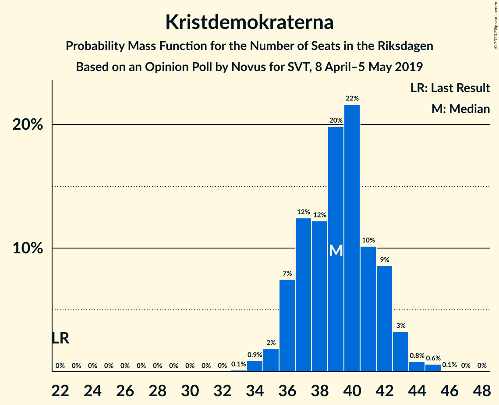
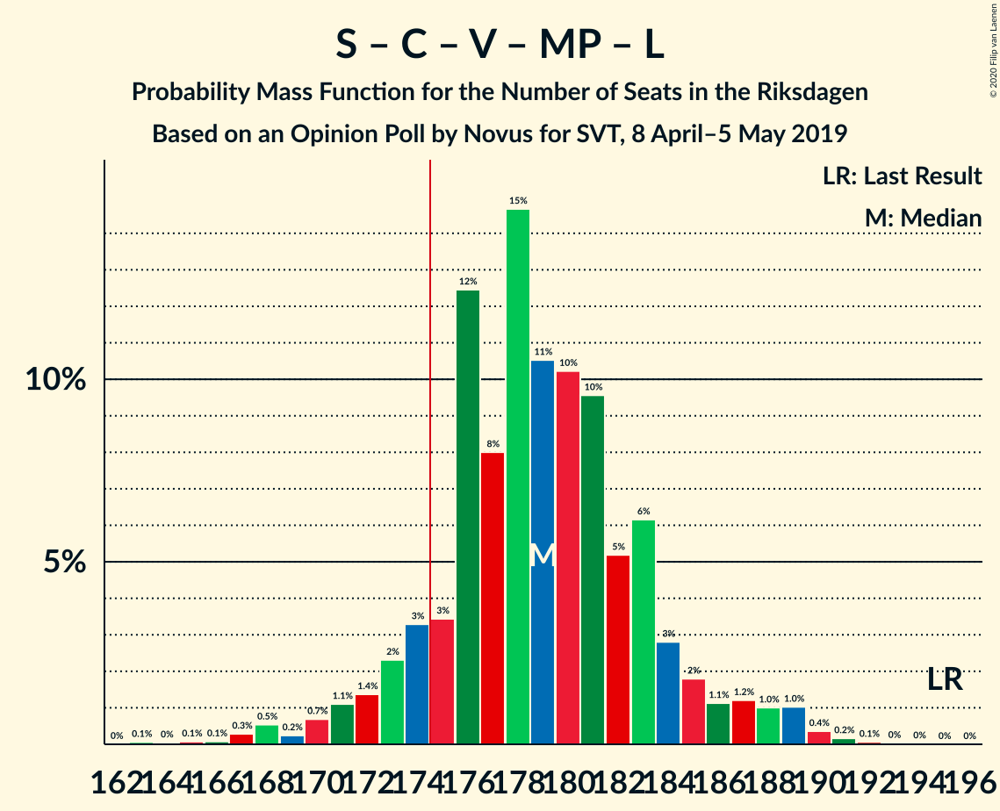

# Opinion Poll by Novus for SVT, 8 April–5 May 2019

<a href="#voting-intentions">Voting Intentions</a> | <a href="#seats">Seats</a> | <a href="#coalitions">Coalitions</a> | <a href="#technical-information">Technical Information</a>

## Voting Intentions

### Confidence Intervals

| Party | Last Result | Poll Result | 80% Confidence Interval | 90% Confidence Interval | 95% Confidence Interval | 99% Confidence Interval |
|:-----:|:-----------:|:-----------:|:-----------------------:|:-----------------------:|:-----------------------:|:-----------------------:|
| Sveriges socialdemokratiska arbetareparti | 28.3% | 26.4% | 25.5–27.4% |25.2–27.7% |25.0–27.9% |24.5–28.4% |
| Moderata samlingspartiet | 19.8% | 18.0% | 17.2–18.9% |16.9–19.1% |16.8–19.3% |16.4–19.8% |
| Sverigedemokraterna | 17.5% | 17.8% | 17.0–18.7% |16.8–18.9% |16.6–19.1% |16.2–19.6% |
| Kristdemokraterna | 6.3% | 10.7% | 10.0–11.4% |9.8–11.6% |9.7–11.8% |9.4–12.1% |
| Centerpartiet | 8.6% | 8.8% | 8.2–9.5% |8.0–9.7% |7.9–9.8% |7.6–10.1% |
| Vänsterpartiet | 8.0% | 8.8% | 8.2–9.5% |8.0–9.7% |7.9–9.8% |7.6–10.1% |
| Miljöpartiet de gröna | 4.4% | 4.6% | 4.2–5.1% |4.1–5.3% |3.9–5.4% |3.7–5.6% |
| Liberalerna | 5.5% | 3.5% | 3.1–3.9% |3.0–4.1% |2.9–4.2% |2.8–4.4% |

*Note:* The poll result column reflects the actual value used in the calculations. Published results may vary slightly, and in addition be rounded to fewer digits.

## Seats

### Confidence Intervals

| Party | Last Result | Median | 80% Confidence Interval | 90% Confidence Interval | 95% Confidence Interval | 99% Confidence Interval |
|:-----:|:-----------:|:------:|:-----------------------:|:-----------------------:|:-----------------------:|:-----------------------:|
| <a href="#sveriges-socialdemokratiska-arbetareparti">Sveriges socialdemokratiska arbetareparti</a> | 100 | 104 | 94–106 |94–106 |92–106 |90–106 |
| <a href="#moderata-samlingspartiet">Moderata samlingspartiet</a> | 70 | 66 | 66–73 |62–73 |62–75 |62–75 |
| <a href="#sverigedemokraterna">Sverigedemokraterna</a> | 62 | 66 | 60–67 |60–73 |60–73 |60–73 |
| <a href="#kristdemokraterna">Kristdemokraterna</a> | 22 | 42 | 34–43 |34–43 |32–43 |32–43 |
| <a href="#centerpartiet">Centerpartiet</a> | 31 | 33 | 31–35 |31–35 |31–35 |25–35 |
| <a href="#vänsterpartiet">Vänsterpartiet</a> | 28 | 33 | 32–35 |32–35 |30–35 |28–36 |
| <a href="#miljöpartiet-de-gröna">Miljöpartiet de gröna</a> | 16 | 0 | 0–20 |0–20 |0–20 |0–20 |
| <a href="#liberalerna">Liberalerna</a> | 20 | 0 | 0 |0 |0 |0–15 |

### Sveriges socialdemokratiska arbetareparti

*For a full overview of the results for this party, see the [Sveriges socialdemokratiska arbetareparti](party-sverigessocialdemokratiskaarbetareparti.html) page.*

| Number of Seats | Probability | Accumulated | Special Marks |
|:---------------:|:-----------:|:-----------:|:-------------:|
| 89 | 0% | 100% |  |
| 90 | 0.7% | 99.9% |  |
| 91 | 0.4% | 99.2% |  |
| 92 | 3% | 98.8% |  |
| 93 | 0% | 96% |  |
| 94 | 8% | 96% |  |
| 95 | 0% | 88% |  |
| 96 | 0.4% | 88% |  |
| 97 | 4% | 87% |  |
| 98 | 7% | 83% |  |
| 99 | 0% | 76% |  |
| 100 | 0% | 76% | Last Result |
| 101 | 0.1% | 76% |  |
| 102 | 0% | 76% |  |
| 103 | 0% | 76% |  |
| 104 | 30% | 76% | Median |
| 105 | 0% | 46% |  |
| 106 | 46% | 46% |  |
| 107 | 0% | 0% |  |

### Moderata samlingspartiet

*For a full overview of the results for this party, see the [Moderata samlingspartiet](party-moderatasamlingspartiet.html) page.*

| Number of Seats | Probability | Accumulated | Special Marks |
|:---------------:|:-----------:|:-----------:|:-------------:|
| 61 | 0.2% | 100% |  |
| 62 | 7% | 99.8% |  |
| 63 | 0% | 93% |  |
| 64 | 0.5% | 93% |  |
| 65 | 0.9% | 92% |  |
| 66 | 46% | 91% | Median |
| 67 | 4% | 46% |  |
| 68 | 30% | 41% |  |
| 69 | 0.1% | 11% |  |
| 70 | 0% | 11% | Last Result |
| 71 | 0% | 11% |  |
| 72 | 0% | 11% |  |
| 73 | 8% | 11% |  |
| 74 | 0% | 3% |  |
| 75 | 2% | 3% |  |
| 76 | 0% | 0% |  |

### Sverigedemokraterna

*For a full overview of the results for this party, see the [Sverigedemokraterna](party-sverigedemokraterna.html) page.*

| Number of Seats | Probability | Accumulated | Special Marks |
|:---------------:|:-----------:|:-----------:|:-------------:|
| 58 | 0.1% | 100% |  |
| 59 | 0% | 99.9% |  |
| 60 | 31% | 99.9% |  |
| 61 | 0% | 69% |  |
| 62 | 0% | 69% | Last Result |
| 63 | 0.1% | 69% |  |
| 64 | 0.4% | 69% |  |
| 65 | 0.2% | 69% |  |
| 66 | 46% | 69% | Median |
| 67 | 14% | 22% |  |
| 68 | 0% | 9% |  |
| 69 | 0.1% | 9% |  |
| 70 | 0% | 9% |  |
| 71 | 0% | 9% |  |
| 72 | 0% | 9% |  |
| 73 | 8% | 8% |  |
| 74 | 0% | 0.1% |  |
| 75 | 0% | 0.1% |  |
| 76 | 0.1% | 0.1% |  |
| 77 | 0% | 0% |  |

### Kristdemokraterna

*For a full overview of the results for this party, see the [Kristdemokraterna](party-kristdemokraterna.html) page.*

| Number of Seats | Probability | Accumulated | Special Marks |
|:---------------:|:-----------:|:-----------:|:-------------:|
| 22 | 0% | 100% | Last Result |
| 23 | 0% | 100% |  |
| 24 | 0% | 100% |  |
| 25 | 0% | 100% |  |
| 26 | 0% | 100% |  |
| 27 | 0% | 100% |  |
| 28 | 0% | 100% |  |
| 29 | 0% | 100% |  |
| 30 | 0% | 100% |  |
| 31 | 0% | 100% |  |
| 32 | 4% | 100% |  |
| 33 | 0% | 96% |  |
| 34 | 7% | 96% |  |
| 35 | 0.1% | 89% |  |
| 36 | 3% | 88% |  |
| 37 | 31% | 86% |  |
| 38 | 0% | 55% |  |
| 39 | 0.8% | 55% |  |
| 40 | 0% | 54% |  |
| 41 | 0.2% | 54% |  |
| 42 | 8% | 54% | Median |
| 43 | 46% | 46% |  |
| 44 | 0% | 0.5% |  |
| 45 | 0% | 0.5% |  |
| 46 | 0% | 0.4% |  |
| 47 | 0% | 0.4% |  |
| 48 | 0.4% | 0.4% |  |
| 49 | 0% | 0% |  |

### Centerpartiet

*For a full overview of the results for this party, see the [Centerpartiet](party-centerpartiet.html) page.*

| Number of Seats | Probability | Accumulated | Special Marks |
|:---------------:|:-----------:|:-----------:|:-------------:|
| 25 | 0.5% | 100% |  |
| 26 | 0% | 99.5% |  |
| 27 | 0.1% | 99.5% |  |
| 28 | 0.4% | 99.4% |  |
| 29 | 0% | 99.0% |  |
| 30 | 0.4% | 99.0% |  |
| 31 | 31% | 98.6% | Last Result |
| 32 | 0% | 68% |  |
| 33 | 52% | 68% | Median |
| 34 | 0.1% | 16% |  |
| 35 | 15% | 16% |  |
| 36 | 0% | 0.2% |  |
| 37 | 0.1% | 0.2% |  |
| 38 | 0.1% | 0.1% |  |
| 39 | 0% | 0% |  |

### Vänsterpartiet

*For a full overview of the results for this party, see the [Vänsterpartiet](party-vänsterpartiet.html) page.*

| Number of Seats | Probability | Accumulated | Special Marks |
|:---------------:|:-----------:|:-----------:|:-------------:|
| 27 | 0% | 100% |  |
| 28 | 0.5% | 99.9% | Last Result |
| 29 | 0% | 99.4% |  |
| 30 | 3% | 99.4% |  |
| 31 | 0.1% | 97% |  |
| 32 | 9% | 96% |  |
| 33 | 42% | 88% | Median |
| 34 | 0% | 46% |  |
| 35 | 46% | 46% |  |
| 36 | 0.3% | 0.6% |  |
| 37 | 0% | 0.2% |  |
| 38 | 0% | 0.2% |  |
| 39 | 0.2% | 0.2% |  |
| 40 | 0% | 0% |  |

### Miljöpartiet de gröna

*For a full overview of the results for this party, see the [Miljöpartiet de gröna](party-miljöpartietdegröna.html) page.*

| Number of Seats | Probability | Accumulated | Special Marks |
|:---------------:|:-----------:|:-----------:|:-------------:|
| 0 | 54% | 100% | Median |
| 1 | 0% | 46% |  |
| 2 | 0% | 46% |  |
| 3 | 0% | 46% |  |
| 4 | 0% | 46% |  |
| 5 | 0% | 46% |  |
| 6 | 0% | 46% |  |
| 7 | 0% | 46% |  |
| 8 | 0% | 46% |  |
| 9 | 0% | 46% |  |
| 10 | 0% | 46% |  |
| 11 | 0% | 46% |  |
| 12 | 0% | 46% |  |
| 13 | 0% | 46% |  |
| 14 | 0% | 46% |  |
| 15 | 0.1% | 46% |  |
| 16 | 33% | 46% | Last Result |
| 17 | 0.6% | 13% |  |
| 18 | 0.3% | 13% |  |
| 19 | 0.2% | 12% |  |
| 20 | 12% | 12% |  |
| 21 | 0% | 0% |  |

### Liberalerna

*For a full overview of the results for this party, see the [Liberalerna](party-liberalerna.html) page.*

| Number of Seats | Probability | Accumulated | Special Marks |
|:---------------:|:-----------:|:-----------:|:-------------:|
| 0 | 99.1% | 100% | Median |
| 1 | 0% | 0.9% |  |
| 2 | 0% | 0.9% |  |
| 3 | 0% | 0.9% |  |
| 4 | 0% | 0.9% |  |
| 5 | 0% | 0.9% |  |
| 6 | 0% | 0.9% |  |
| 7 | 0% | 0.9% |  |
| 8 | 0% | 0.9% |  |
| 9 | 0% | 0.9% |  |
| 10 | 0% | 0.9% |  |
| 11 | 0% | 0.9% |  |
| 12 | 0% | 0.9% |  |
| 13 | 0% | 0.9% |  |
| 14 | 0% | 0.9% |  |
| 15 | 0.8% | 0.9% |  |
| 16 | 0% | 0.1% |  |
| 17 | 0% | 0% |  |
| 18 | 0% | 0% |  |
| 19 | 0% | 0% |  |
| 20 | 0% | 0% | Last Result |

## Coalitions

### Confidence Intervals

| Coalition | Last Result | Median | Majority? | 80% Confidence Interval | 90% Confidence Interval | 95% Confidence Interval | 99% Confidence Interval |
|:---------:|:-----------:|:------:|:---------:|:-----------------------:|:-----------------------:|:-----------------------:|:-----------------------:|
| Sveriges socialdemokratiska arbetareparti – Moderata samlingspartiet – Centerpartiet | 201 | 203 | 100% | 197–205 | 195–205 | 195–205 | 180–205 |
| Moderata samlingspartiet – Sverigedemokraterna – Kristdemokraterna | 154 | 175 | 57% | 165–178 | 163–188 | 163–188 | 163–188 |
| Sveriges socialdemokratiska arbetareparti – Centerpartiet – Vänsterpartiet – Miljöpartiet de gröna – Liberalerna | 195 | 174 | 43% | 171–184 | 161–186 | 161–186 | 161–186 |
| Sveriges socialdemokratiska arbetareparti – Moderata samlingspartiet | 170 | 172 | 0% | 164–172 | 160–172 | 160–172 | 155–172 |
| Sveriges socialdemokratiska arbetareparti – Centerpartiet – Miljöpartiet de gröna – Liberalerna | 167 | 139 | 0% | 139–151 | 129–153 | 129–153 | 129–153 |
| Sveriges socialdemokratiska arbetareparti – Vänsterpartiet – Miljöpartiet de gröna | 144 | 141 | 0% | 138–153 | 126–153 | 126–153 | 126–153 |
| Moderata samlingspartiet – Kristdemokraterna – Centerpartiet – Liberalerna | 143 | 142 | 0% | 132–144 | 131–150 | 131–150 | 131–150 |
| Moderata samlingspartiet – Kristdemokraterna – Centerpartiet | 123 | 142 | 0% | 132–144 | 131–150 | 131–150 | 129–150 |
| Moderata samlingspartiet – Sverigedemokraterna | 132 | 132 | 0% | 128–142 | 128–146 | 128–146 | 126–146 |
| Sveriges socialdemokratiska arbetareparti – Vänsterpartiet | 128 | 137 | 0% | 126–141 | 126–141 | 122–141 | 122–141 |
| Sveriges socialdemokratiska arbetareparti – Miljöpartiet de gröna | 116 | 106 | 0% | 106–120 | 94–120 | 94–120 | 94–120 |
| Moderata samlingspartiet – Centerpartiet – Liberalerna | 121 | 99 | 0% | 99–108 | 97–108 | 97–108 | 96–108 |
| Moderata samlingspartiet – Centerpartiet | 101 | 99 | 0% | 99–108 | 97–108 | 97–108 | 90–108 |

### Sveriges socialdemokratiska arbetareparti – Moderata samlingspartiet – Centerpartiet

| Number of Seats | Probability | Accumulated | Special Marks |
|:---------------:|:-----------:|:-----------:|:-------------:|
| 180 | 0.5% | 100% |  |
| 181 | 0% | 99.5% |  |
| 182 | 0% | 99.5% |  |
| 183 | 0% | 99.5% |  |
| 184 | 0% | 99.5% |  |
| 185 | 0% | 99.5% |  |
| 186 | 0.2% | 99.5% |  |
| 187 | 0.4% | 99.3% |  |
| 188 | 0.3% | 98.8% |  |
| 189 | 0.3% | 98.5% |  |
| 190 | 0% | 98% |  |
| 191 | 0% | 98% |  |
| 192 | 0.1% | 98% |  |
| 193 | 0% | 98% |  |
| 194 | 0% | 98% |  |
| 195 | 7% | 98% |  |
| 196 | 0% | 91% |  |
| 197 | 4% | 91% |  |
| 198 | 0.1% | 87% |  |
| 199 | 0% | 87% |  |
| 200 | 3% | 87% |  |
| 201 | 0% | 84% | Last Result |
| 202 | 8% | 84% |  |
| 203 | 30% | 76% | Median |
| 204 | 0% | 46% |  |
| 205 | 46% | 46% |  |
| 206 | 0% | 0.1% |  |
| 207 | 0% | 0% |  |

### Moderata samlingspartiet – Sverigedemokraterna – Kristdemokraterna

| Number of Seats | Probability | Accumulated | Special Marks |
|:---------------:|:-----------:|:-----------:|:-------------:|
| 154 | 0% | 100% | Last Result |
| 155 | 0% | 100% |  |
| 156 | 0% | 100% |  |
| 157 | 0% | 100% |  |
| 158 | 0% | 100% |  |
| 159 | 0% | 100% |  |
| 160 | 0% | 100% |  |
| 161 | 0% | 100% |  |
| 162 | 0.3% | 100% |  |
| 163 | 7% | 99.6% |  |
| 164 | 0% | 93% |  |
| 165 | 31% | 93% |  |
| 166 | 4% | 62% |  |
| 167 | 0% | 58% |  |
| 168 | 0.1% | 58% |  |
| 169 | 0% | 58% |  |
| 170 | 0.5% | 58% |  |
| 171 | 0% | 57% |  |
| 172 | 0% | 57% |  |
| 173 | 0% | 57% |  |
| 174 | 0.3% | 57% | Median |
| 175 | 46% | 57% | Majority |
| 176 | 0.4% | 11% |  |
| 177 | 0% | 11% |  |
| 178 | 3% | 11% |  |
| 179 | 0.1% | 8% |  |
| 180 | 0% | 8% |  |
| 181 | 0% | 8% |  |
| 182 | 0.1% | 8% |  |
| 183 | 0% | 8% |  |
| 184 | 0% | 8% |  |
| 185 | 0% | 8% |  |
| 186 | 0% | 8% |  |
| 187 | 0% | 8% |  |
| 188 | 8% | 8% |  |
| 189 | 0% | 0% |  |

### Sveriges socialdemokratiska arbetareparti – Centerpartiet – Vänsterpartiet – Miljöpartiet de gröna – Liberalerna

| Number of Seats | Probability | Accumulated | Special Marks |
|:---------------:|:-----------:|:-----------:|:-------------:|
| 161 | 8% | 100% |  |
| 162 | 0% | 92% |  |
| 163 | 0% | 92% |  |
| 164 | 0% | 92% |  |
| 165 | 0% | 92% |  |
| 166 | 0% | 92% |  |
| 167 | 0.1% | 92% |  |
| 168 | 0% | 92% |  |
| 169 | 0% | 92% |  |
| 170 | 0.1% | 92% | Median |
| 171 | 3% | 92% |  |
| 172 | 0% | 89% |  |
| 173 | 0.4% | 89% |  |
| 174 | 46% | 89% |  |
| 175 | 0.3% | 43% | Majority |
| 176 | 0% | 43% |  |
| 177 | 0% | 43% |  |
| 178 | 0% | 43% |  |
| 179 | 0.5% | 43% |  |
| 180 | 0% | 42% |  |
| 181 | 0.1% | 42% |  |
| 182 | 0% | 42% |  |
| 183 | 4% | 42% |  |
| 184 | 31% | 38% |  |
| 185 | 0% | 7% |  |
| 186 | 7% | 7% |  |
| 187 | 0.3% | 0.4% |  |
| 188 | 0% | 0% |  |
| 189 | 0% | 0% |  |
| 190 | 0% | 0% |  |
| 191 | 0% | 0% |  |
| 192 | 0% | 0% |  |
| 193 | 0% | 0% |  |
| 194 | 0% | 0% |  |
| 195 | 0% | 0% | Last Result |

### Sveriges socialdemokratiska arbetareparti – Moderata samlingspartiet

| Number of Seats | Probability | Accumulated | Special Marks |
|:---------------:|:-----------:|:-----------:|:-------------:|
| 151 | 0.2% | 100% |  |
| 152 | 0% | 99.8% |  |
| 153 | 0% | 99.8% |  |
| 154 | 0% | 99.8% |  |
| 155 | 0.5% | 99.8% |  |
| 156 | 0.4% | 99.2% |  |
| 157 | 0% | 98.9% |  |
| 158 | 0.3% | 98.9% |  |
| 159 | 0.1% | 98.6% |  |
| 160 | 7% | 98% |  |
| 161 | 0.4% | 91% |  |
| 162 | 0% | 91% |  |
| 163 | 0% | 91% |  |
| 164 | 4% | 91% |  |
| 165 | 0.1% | 87% |  |
| 166 | 0% | 87% |  |
| 167 | 11% | 87% |  |
| 168 | 0.1% | 76% |  |
| 169 | 0% | 76% |  |
| 170 | 0% | 76% | Last Result, Median |
| 171 | 0% | 76% |  |
| 172 | 76% | 76% |  |
| 173 | 0% | 0% |  |

### Sveriges socialdemokratiska arbetareparti – Centerpartiet – Miljöpartiet de gröna – Liberalerna

| Number of Seats | Probability | Accumulated | Special Marks |
|:---------------:|:-----------:|:-----------:|:-------------:|
| 129 | 8% | 100% |  |
| 130 | 0% | 92% |  |
| 131 | 0% | 92% |  |
| 132 | 0% | 92% |  |
| 133 | 0% | 92% |  |
| 134 | 0% | 92% |  |
| 135 | 0% | 92% |  |
| 136 | 0.1% | 92% |  |
| 137 | 0% | 92% | Median |
| 138 | 0% | 92% |  |
| 139 | 46% | 92% |  |
| 140 | 0% | 46% |  |
| 141 | 3% | 46% |  |
| 142 | 0.1% | 43% |  |
| 143 | 0.4% | 43% |  |
| 144 | 0% | 43% |  |
| 145 | 0.2% | 43% |  |
| 146 | 0% | 43% |  |
| 147 | 0.5% | 43% |  |
| 148 | 0.1% | 42% |  |
| 149 | 0% | 42% |  |
| 150 | 4% | 42% |  |
| 151 | 30% | 38% |  |
| 152 | 0% | 7% |  |
| 153 | 7% | 7% |  |
| 154 | 0% | 0.4% |  |
| 155 | 0% | 0.4% |  |
| 156 | 0% | 0.4% |  |
| 157 | 0% | 0.4% |  |
| 158 | 0% | 0.4% |  |
| 159 | 0.3% | 0.3% |  |
| 160 | 0% | 0% |  |
| 161 | 0% | 0% |  |
| 162 | 0% | 0% |  |
| 163 | 0% | 0% |  |
| 164 | 0% | 0% |  |
| 165 | 0% | 0% |  |
| 166 | 0% | 0% |  |
| 167 | 0% | 0% | Last Result |

### Sveriges socialdemokratiska arbetareparti – Vänsterpartiet – Miljöpartiet de gröna

| Number of Seats | Probability | Accumulated | Special Marks |
|:---------------:|:-----------:|:-----------:|:-------------:|
| 126 | 8% | 100% |  |
| 127 | 0% | 92% |  |
| 128 | 0% | 92% |  |
| 129 | 0% | 92% |  |
| 130 | 0% | 92% |  |
| 131 | 0% | 92% |  |
| 132 | 0.1% | 92% |  |
| 133 | 0% | 92% |  |
| 134 | 0% | 92% |  |
| 135 | 0% | 92% |  |
| 136 | 0% | 92% |  |
| 137 | 0% | 92% | Median |
| 138 | 3% | 92% |  |
| 139 | 0.6% | 89% |  |
| 140 | 0% | 89% |  |
| 141 | 46% | 89% |  |
| 142 | 0.4% | 43% |  |
| 143 | 0.2% | 43% |  |
| 144 | 0.4% | 42% | Last Result |
| 145 | 0.3% | 42% |  |
| 146 | 0% | 42% |  |
| 147 | 0% | 42% |  |
| 148 | 0% | 42% |  |
| 149 | 0.2% | 42% |  |
| 150 | 4% | 42% |  |
| 151 | 7% | 37% |  |
| 152 | 0% | 30% |  |
| 153 | 30% | 30% |  |
| 154 | 0% | 0% |  |

### Moderata samlingspartiet – Kristdemokraterna – Centerpartiet – Liberalerna

| Number of Seats | Probability | Accumulated | Special Marks |
|:---------------:|:-----------:|:-----------:|:-------------:|
| 131 | 7% | 100% |  |
| 132 | 4% | 93% |  |
| 133 | 0% | 89% |  |
| 134 | 0% | 89% |  |
| 135 | 0.2% | 89% |  |
| 136 | 30% | 88% |  |
| 137 | 0.1% | 58% |  |
| 138 | 0.1% | 58% |  |
| 139 | 0% | 58% |  |
| 140 | 0% | 58% |  |
| 141 | 0.1% | 58% | Median |
| 142 | 46% | 58% |  |
| 143 | 0.4% | 12% | Last Result |
| 144 | 3% | 12% |  |
| 145 | 0.3% | 9% |  |
| 146 | 0% | 8% |  |
| 147 | 0% | 8% |  |
| 148 | 0.1% | 8% |  |
| 149 | 0% | 8% |  |
| 150 | 8% | 8% |  |
| 151 | 0% | 0% |  |

### Moderata samlingspartiet – Kristdemokraterna – Centerpartiet

| Number of Seats | Probability | Accumulated | Special Marks |
|:---------------:|:-----------:|:-----------:|:-------------:|
| 123 | 0% | 100% | Last Result |
| 124 | 0% | 100% |  |
| 125 | 0% | 100% |  |
| 126 | 0% | 100% |  |
| 127 | 0% | 100% |  |
| 128 | 0% | 100% |  |
| 129 | 0.5% | 100% |  |
| 130 | 0.4% | 99.5% |  |
| 131 | 7% | 99.1% |  |
| 132 | 4% | 92% |  |
| 133 | 0% | 88% |  |
| 134 | 0% | 88% |  |
| 135 | 0.2% | 88% |  |
| 136 | 30% | 87% |  |
| 137 | 0.1% | 57% |  |
| 138 | 0% | 57% |  |
| 139 | 0% | 57% |  |
| 140 | 0% | 57% |  |
| 141 | 0.1% | 57% | Median |
| 142 | 46% | 57% |  |
| 143 | 0.4% | 11% |  |
| 144 | 3% | 11% |  |
| 145 | 0% | 8% |  |
| 146 | 0% | 8% |  |
| 147 | 0% | 8% |  |
| 148 | 0.1% | 8% |  |
| 149 | 0% | 8% |  |
| 150 | 8% | 8% |  |
| 151 | 0% | 0% |  |

### Moderata samlingspartiet – Sverigedemokraterna

| Number of Seats | Probability | Accumulated | Special Marks |
|:---------------:|:-----------:|:-----------:|:-------------:|
| 125 | 0.3% | 100% |  |
| 126 | 0.2% | 99.6% |  |
| 127 | 0.1% | 99.4% |  |
| 128 | 31% | 99.3% |  |
| 129 | 7% | 69% |  |
| 130 | 0% | 62% |  |
| 131 | 0.5% | 62% |  |
| 132 | 46% | 61% | Last Result, Median |
| 133 | 0% | 15% |  |
| 134 | 4% | 15% |  |
| 135 | 0% | 11% |  |
| 136 | 0% | 11% |  |
| 137 | 0% | 11% |  |
| 138 | 0.1% | 11% |  |
| 139 | 0.1% | 11% |  |
| 140 | 0.3% | 11% |  |
| 141 | 0% | 11% |  |
| 142 | 3% | 11% |  |
| 143 | 0.1% | 8% |  |
| 144 | 0% | 8% |  |
| 145 | 0% | 8% |  |
| 146 | 8% | 8% |  |
| 147 | 0% | 0% |  |

### Sveriges socialdemokratiska arbetareparti – Vänsterpartiet

| Number of Seats | Probability | Accumulated | Special Marks |
|:---------------:|:-----------:|:-----------:|:-------------:|
| 122 | 3% | 100% |  |
| 123 | 0.1% | 97% |  |
| 124 | 0.5% | 96% |  |
| 125 | 0% | 96% |  |
| 126 | 8% | 96% |  |
| 127 | 0.3% | 88% |  |
| 128 | 0% | 88% | Last Result |
| 129 | 0.2% | 87% |  |
| 130 | 4% | 87% |  |
| 131 | 7% | 83% |  |
| 132 | 0.1% | 76% |  |
| 133 | 0% | 76% |  |
| 134 | 0% | 76% |  |
| 135 | 0% | 76% |  |
| 136 | 0% | 76% |  |
| 137 | 30% | 76% | Median |
| 138 | 0% | 46% |  |
| 139 | 0% | 46% |  |
| 140 | 0% | 46% |  |
| 141 | 46% | 46% |  |
| 142 | 0% | 0% |  |

### Sveriges socialdemokratiska arbetareparti – Miljöpartiet de gröna

| Number of Seats | Probability | Accumulated | Special Marks |
|:---------------:|:-----------:|:-----------:|:-------------:|
| 94 | 8% | 100% |  |
| 95 | 0% | 92% |  |
| 96 | 0% | 92% |  |
| 97 | 0% | 92% |  |
| 98 | 0% | 92% |  |
| 99 | 0% | 92% |  |
| 100 | 0% | 92% |  |
| 101 | 0.1% | 92% |  |
| 102 | 0% | 92% |  |
| 103 | 0% | 92% |  |
| 104 | 0% | 92% | Median |
| 105 | 0% | 92% |  |
| 106 | 46% | 92% |  |
| 107 | 0.5% | 46% |  |
| 108 | 2% | 46% |  |
| 109 | 0.3% | 43% |  |
| 110 | 0.2% | 43% |  |
| 111 | 0.1% | 43% |  |
| 112 | 0.4% | 42% |  |
| 113 | 0% | 42% |  |
| 114 | 0% | 42% |  |
| 115 | 0.1% | 42% |  |
| 116 | 0.3% | 42% | Last Result |
| 117 | 4% | 42% |  |
| 118 | 7% | 37% |  |
| 119 | 0.1% | 30% |  |
| 120 | 30% | 30% |  |
| 121 | 0% | 0% |  |

### Moderata samlingspartiet – Centerpartiet – Liberalerna

| Number of Seats | Probability | Accumulated | Special Marks |
|:---------------:|:-----------:|:-----------:|:-------------:|
| 92 | 0.1% | 100% |  |
| 93 | 0% | 99.9% |  |
| 94 | 0% | 99.9% |  |
| 95 | 0.4% | 99.9% |  |
| 96 | 0.3% | 99.6% |  |
| 97 | 7% | 99.3% |  |
| 98 | 0% | 92% |  |
| 99 | 76% | 92% | Median |
| 100 | 4% | 16% |  |
| 101 | 0.1% | 12% |  |
| 102 | 0.1% | 12% |  |
| 103 | 0% | 12% |  |
| 104 | 0% | 12% |  |
| 105 | 0.5% | 12% |  |
| 106 | 0% | 11% |  |
| 107 | 0.1% | 11% |  |
| 108 | 11% | 11% |  |
| 109 | 0% | 0.1% |  |
| 110 | 0% | 0% |  |
| 111 | 0% | 0% |  |
| 112 | 0% | 0% |  |
| 113 | 0% | 0% |  |
| 114 | 0% | 0% |  |
| 115 | 0% | 0% |  |
| 116 | 0% | 0% |  |
| 117 | 0% | 0% |  |
| 118 | 0% | 0% |  |
| 119 | 0% | 0% |  |
| 120 | 0% | 0% |  |
| 121 | 0% | 0% | Last Result |

### Moderata samlingspartiet – Centerpartiet

| Number of Seats | Probability | Accumulated | Special Marks |
|:---------------:|:-----------:|:-----------:|:-------------:|
| 90 | 0.5% | 100% |  |
| 91 | 0% | 99.5% |  |
| 92 | 0.1% | 99.5% |  |
| 93 | 0.3% | 99.4% |  |
| 94 | 0% | 99.1% |  |
| 95 | 0.4% | 99.0% |  |
| 96 | 0.3% | 98.6% |  |
| 97 | 7% | 98% |  |
| 98 | 0% | 91% |  |
| 99 | 76% | 91% | Median |
| 100 | 4% | 15% |  |
| 101 | 0.1% | 11% | Last Result |
| 102 | 0.1% | 11% |  |
| 103 | 0% | 11% |  |
| 104 | 0% | 11% |  |
| 105 | 0% | 11% |  |
| 106 | 0% | 11% |  |
| 107 | 0.1% | 11% |  |
| 108 | 11% | 11% |  |
| 109 | 0% | 0% |  |

## Technical Information

### Opinion Poll

+ **Polling firm:** Novus
+ **Commissioner(s):** SVT
+ **Fieldwork period:** 8 April–5 May 2019

### Calculations

+ **Sample size:** 3404
+ **Simulations done:** 1,024
+ **Error estimate:** 1.98%

