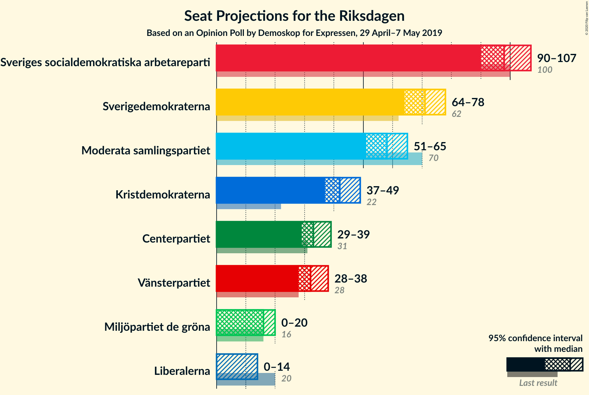
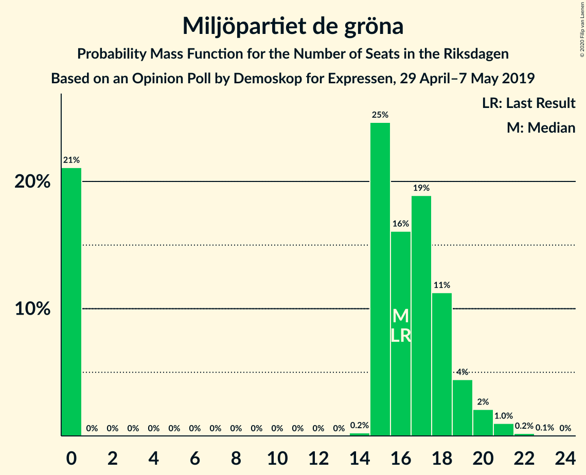
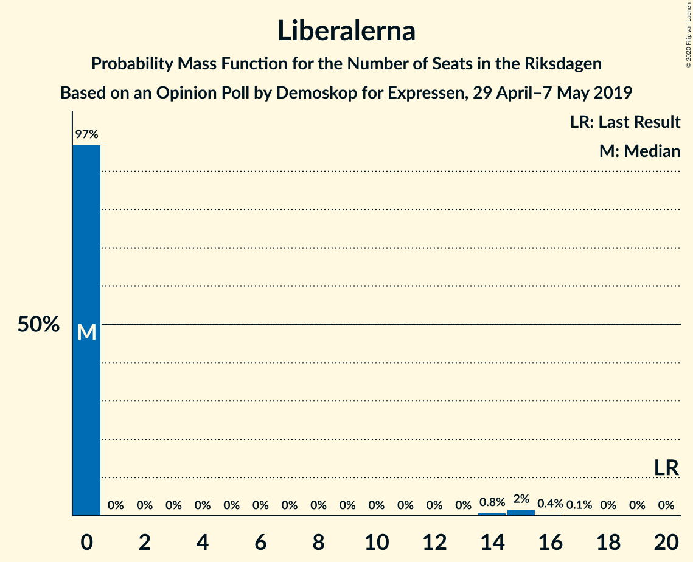

# Opinion Poll by Demoskop for Expressen, 29 April–7 May 2019

<a href="#voting-intentions">Voting Intentions</a> | <a href="#seats">Seats</a> | <a href="#coalitions">Coalitions</a> | <a href="#technical-information">Technical Information</a>

## Voting Intentions

### Confidence Intervals

| Party | Last Result | Poll Result | 80% Confidence Interval | 90% Confidence Interval | 95% Confidence Interval | 99% Confidence Interval |
|:-----:|:-----------:|:-----------:|:-----------------------:|:-----------------------:|:-----------------------:|:-----------------------:|
| Sveriges socialdemokratiska arbetareparti | 28.3% | 26.6% | 25.2–28.0% |24.8–28.4% |24.5–28.8% |23.8–29.5% |
| Sverigedemokraterna | 17.5% | 19.2% | 18.0–20.5% |17.7–20.9% |17.4–21.2% |16.8–21.9% |
| Moderata samlingspartiet | 19.8% | 15.7% | 14.6–16.9% |14.3–17.3% |14.0–17.6% |13.5–18.2% |
| Kristdemokraterna | 6.3% | 11.5% | 10.5–12.6% |10.3–12.9% |10.0–13.2% |9.6–13.7% |
| Centerpartiet | 8.6% | 9.1% | 8.2–10.1% |8.0–10.3% |7.8–10.6% |7.4–11.1% |
| Vänsterpartiet | 8.0% | 8.7% | 7.9–9.7% |7.6–10.0% |7.4–10.2% |7.0–10.7% |
| Miljöpartiet de gröna | 4.4% | 4.3% | 3.7–5.1% |3.6–5.3% |3.4–5.4% |3.2–5.8% |
| Liberalerna | 5.5% | 3.1% | 2.6–3.7% |2.5–3.9% |2.3–4.1% |2.1–4.4% |

*Note:* The poll result column reflects the actual value used in the calculations. Published results may vary slightly, and in addition be rounded to fewer digits.

## Seats

### Confidence Intervals

| Party | Last Result | Median | 80% Confidence Interval | 90% Confidence Interval | 95% Confidence Interval | 99% Confidence Interval |
|:-----:|:-----------:|:------:|:-----------------------:|:-----------------------:|:-----------------------:|:-----------------------:|
| <a href="#sveriges-socialdemokratiska-arbetareparti">Sveriges socialdemokratiska arbetareparti</a> | 100 | 96 | 87–101 |87–108 |87–110 |85–112 |
| <a href="#sverigedemokraterna">Sverigedemokraterna</a> | 62 | 69 | 68–76 |66–76 |65–76 |63–83 |
| <a href="#moderata-samlingspartiet">Moderata samlingspartiet</a> | 70 | 62 | 55–65 |53–68 |50–68 |47–68 |
| <a href="#kristdemokraterna">Kristdemokraterna</a> | 22 | 45 | 39–48 |38–50 |36–50 |34–52 |
| <a href="#centerpartiet">Centerpartiet</a> | 31 | 36 | 31–39 |30–39 |30–40 |28–41 |
| <a href="#vänsterpartiet">Vänsterpartiet</a> | 28 | 33 | 29–35 |28–36 |27–37 |25–38 |
| <a href="#miljöpartiet-de-gröna">Miljöpartiet de gröna</a> | 16 | 15 | 0–18 |0–18 |0–19 |0–21 |
| <a href="#liberalerna">Liberalerna</a> | 20 | 0 | 0 |0–15 |0–15 |0–17 |

### Sveriges socialdemokratiska arbetareparti

*For a full overview of the results for this party, see the [Sveriges socialdemokratiska arbetareparti](party-sverigessocialdemokratiskaarbetareparti.html) page.*

| Number of Seats | Probability | Accumulated | Special Marks |
|:---------------:|:-----------:|:-----------:|:-------------:|
| 84 | 0.1% | 100% |  |
| 85 | 1.4% | 99.9% |  |
| 86 | 0.7% | 98.5% |  |
| 87 | 13% | 98% |  |
| 88 | 0.9% | 85% |  |
| 89 | 5% | 84% |  |
| 90 | 3% | 79% |  |
| 91 | 0.1% | 77% |  |
| 92 | 19% | 76% |  |
| 93 | 0.5% | 57% |  |
| 94 | 0.7% | 57% |  |
| 95 | 2% | 56% |  |
| 96 | 13% | 54% | Median |
| 97 | 1.2% | 42% |  |
| 98 | 3% | 40% |  |
| 99 | 27% | 38% |  |
| 100 | 0.4% | 11% | Last Result |
| 101 | 2% | 10% |  |
| 102 | 0.4% | 9% |  |
| 103 | 0.2% | 8% |  |
| 104 | 1.0% | 8% |  |
| 105 | 2% | 7% |  |
| 106 | 0.1% | 6% |  |
| 107 | 0.3% | 6% |  |
| 108 | 0.6% | 5% |  |
| 109 | 2% | 5% |  |
| 110 | 0.7% | 3% |  |
| 111 | 0% | 2% |  |
| 112 | 2% | 2% |  |
| 113 | 0% | 0.1% |  |
| 114 | 0% | 0% |  |

### Sverigedemokraterna

*For a full overview of the results for this party, see the [Sverigedemokraterna](party-sverigedemokraterna.html) page.*

| Number of Seats | Probability | Accumulated | Special Marks |
|:---------------:|:-----------:|:-----------:|:-------------:|
| 61 | 0.1% | 100% |  |
| 62 | 0.3% | 99.8% | Last Result |
| 63 | 0.7% | 99.6% |  |
| 64 | 0.1% | 98.9% |  |
| 65 | 3% | 98.7% |  |
| 66 | 1.1% | 96% |  |
| 67 | 3% | 95% |  |
| 68 | 22% | 92% |  |
| 69 | 20% | 70% | Median |
| 70 | 7% | 50% |  |
| 71 | 3% | 43% |  |
| 72 | 2% | 40% |  |
| 73 | 19% | 38% |  |
| 74 | 5% | 18% |  |
| 75 | 4% | 14% |  |
| 76 | 8% | 10% |  |
| 77 | 0.6% | 2% |  |
| 78 | 0.3% | 1.4% |  |
| 79 | 0.1% | 1.1% |  |
| 80 | 0% | 1.0% |  |
| 81 | 0.1% | 1.0% |  |
| 82 | 0.1% | 0.9% |  |
| 83 | 0.6% | 0.8% |  |
| 84 | 0.1% | 0.2% |  |
| 85 | 0% | 0.1% |  |
| 86 | 0% | 0.1% |  |
| 87 | 0% | 0.1% |  |
| 88 | 0.1% | 0.1% |  |
| 89 | 0% | 0% |  |

### Moderata samlingspartiet

*For a full overview of the results for this party, see the [Moderata samlingspartiet](party-moderatasamlingspartiet.html) page.*

| Number of Seats | Probability | Accumulated | Special Marks |
|:---------------:|:-----------:|:-----------:|:-------------:|
| 46 | 0% | 100% |  |
| 47 | 1.3% | 99.9% |  |
| 48 | 0.1% | 98.6% |  |
| 49 | 0.7% | 98.5% |  |
| 50 | 2% | 98% |  |
| 51 | 0.2% | 96% |  |
| 52 | 0.3% | 96% |  |
| 53 | 1.1% | 96% |  |
| 54 | 3% | 95% |  |
| 55 | 7% | 92% |  |
| 56 | 4% | 85% |  |
| 57 | 11% | 81% |  |
| 58 | 4% | 70% |  |
| 59 | 1.3% | 67% |  |
| 60 | 13% | 65% |  |
| 61 | 2% | 52% |  |
| 62 | 3% | 50% | Median |
| 63 | 4% | 48% |  |
| 64 | 2% | 44% |  |
| 65 | 35% | 42% |  |
| 66 | 0.1% | 7% |  |
| 67 | 0% | 7% |  |
| 68 | 7% | 7% |  |
| 69 | 0.1% | 0.2% |  |
| 70 | 0% | 0.2% | Last Result |
| 71 | 0.2% | 0.2% |  |
| 72 | 0% | 0% |  |

### Kristdemokraterna

*For a full overview of the results for this party, see the [Kristdemokraterna](party-kristdemokraterna.html) page.*

| Number of Seats | Probability | Accumulated | Special Marks |
|:---------------:|:-----------:|:-----------:|:-------------:|
| 22 | 0% | 100% | Last Result |
| 23 | 0% | 100% |  |
| 24 | 0% | 100% |  |
| 25 | 0% | 100% |  |
| 26 | 0% | 100% |  |
| 27 | 0% | 100% |  |
| 28 | 0% | 100% |  |
| 29 | 0% | 100% |  |
| 30 | 0% | 100% |  |
| 31 | 0.2% | 100% |  |
| 32 | 0% | 99.8% |  |
| 33 | 0.1% | 99.8% |  |
| 34 | 1.0% | 99.7% |  |
| 35 | 1.2% | 98.7% |  |
| 36 | 0.3% | 98% |  |
| 37 | 1.2% | 97% |  |
| 38 | 2% | 96% |  |
| 39 | 7% | 94% |  |
| 40 | 6% | 87% |  |
| 41 | 5% | 81% |  |
| 42 | 2% | 75% |  |
| 43 | 21% | 73% |  |
| 44 | 2% | 53% |  |
| 45 | 36% | 51% | Median |
| 46 | 3% | 15% |  |
| 47 | 1.2% | 13% |  |
| 48 | 3% | 11% |  |
| 49 | 2% | 9% |  |
| 50 | 6% | 6% |  |
| 51 | 0% | 0.6% |  |
| 52 | 0.5% | 0.6% |  |
| 53 | 0% | 0% |  |

### Centerpartiet

*For a full overview of the results for this party, see the [Centerpartiet](party-centerpartiet.html) page.*

| Number of Seats | Probability | Accumulated | Special Marks |
|:---------------:|:-----------:|:-----------:|:-------------:|
| 25 | 0% | 100% |  |
| 26 | 0.1% | 99.9% |  |
| 27 | 0.2% | 99.8% |  |
| 28 | 0.7% | 99.6% |  |
| 29 | 0.2% | 98.9% |  |
| 30 | 6% | 98.7% |  |
| 31 | 4% | 93% | Last Result |
| 32 | 2% | 89% |  |
| 33 | 16% | 86% |  |
| 34 | 8% | 70% |  |
| 35 | 7% | 63% |  |
| 36 | 13% | 55% | Median |
| 37 | 28% | 42% |  |
| 38 | 3% | 14% |  |
| 39 | 9% | 11% |  |
| 40 | 2% | 3% |  |
| 41 | 0.5% | 0.5% |  |
| 42 | 0% | 0% |  |

### Vänsterpartiet

*For a full overview of the results for this party, see the [Vänsterpartiet](party-vänsterpartiet.html) page.*

| Number of Seats | Probability | Accumulated | Special Marks |
|:---------------:|:-----------:|:-----------:|:-------------:|
| 24 | 0.5% | 100% |  |
| 25 | 0.3% | 99.5% |  |
| 26 | 0.4% | 99.2% |  |
| 27 | 3% | 98.8% |  |
| 28 | 4% | 96% | Last Result |
| 29 | 4% | 91% |  |
| 30 | 0.6% | 88% |  |
| 31 | 33% | 87% |  |
| 32 | 0.6% | 55% |  |
| 33 | 17% | 54% | Median |
| 34 | 2% | 37% |  |
| 35 | 29% | 35% |  |
| 36 | 3% | 5% |  |
| 37 | 1.1% | 3% |  |
| 38 | 1.0% | 2% |  |
| 39 | 0.3% | 0.5% |  |
| 40 | 0% | 0.2% |  |
| 41 | 0.1% | 0.1% |  |
| 42 | 0% | 0% |  |

### Miljöpartiet de gröna

*For a full overview of the results for this party, see the [Miljöpartiet de gröna](party-miljöpartietdegröna.html) page.*

| Number of Seats | Probability | Accumulated | Special Marks |
|:---------------:|:-----------:|:-----------:|:-------------:|
| 0 | 40% | 100% |  |
| 1 | 0% | 60% |  |
| 2 | 0% | 60% |  |
| 3 | 0% | 60% |  |
| 4 | 0% | 60% |  |
| 5 | 0% | 60% |  |
| 6 | 0% | 60% |  |
| 7 | 0% | 60% |  |
| 8 | 0% | 60% |  |
| 9 | 0% | 60% |  |
| 10 | 0% | 60% |  |
| 11 | 0% | 60% |  |
| 12 | 0% | 60% |  |
| 13 | 0% | 60% |  |
| 14 | 1.3% | 60% |  |
| 15 | 9% | 58% | Median |
| 16 | 22% | 49% | Last Result |
| 17 | 10% | 27% |  |
| 18 | 12% | 17% |  |
| 19 | 3% | 4% |  |
| 20 | 0.5% | 1.5% |  |
| 21 | 0.8% | 1.0% |  |
| 22 | 0.1% | 0.3% |  |
| 23 | 0.1% | 0.2% |  |
| 24 | 0% | 0.1% |  |
| 25 | 0% | 0% |  |

### Liberalerna

*For a full overview of the results for this party, see the [Liberalerna](party-liberalerna.html) page.*

| Number of Seats | Probability | Accumulated | Special Marks |
|:---------------:|:-----------:|:-----------:|:-------------:|
| 0 | 94% | 100% | Median |
| 1 | 0% | 6% |  |
| 2 | 0% | 6% |  |
| 3 | 0% | 6% |  |
| 4 | 0% | 6% |  |
| 5 | 0% | 6% |  |
| 6 | 0% | 6% |  |
| 7 | 0% | 6% |  |
| 8 | 0% | 6% |  |
| 9 | 0% | 6% |  |
| 10 | 0% | 6% |  |
| 11 | 0% | 6% |  |
| 12 | 0% | 6% |  |
| 13 | 0% | 6% |  |
| 14 | 0.3% | 6% |  |
| 15 | 5% | 5% |  |
| 16 | 0% | 0.9% |  |
| 17 | 0.9% | 0.9% |  |
| 18 | 0% | 0% |  |
| 19 | 0% | 0% |  |
| 20 | 0% | 0% | Last Result |

## Coalitions

### Confidence Intervals

| Coalition | Last Result | Median | Majority? | 80% Confidence Interval | 90% Confidence Interval | 95% Confidence Interval | 99% Confidence Interval |
|:---------:|:-----------:|:------:|:---------:|:-----------------------:|:-----------------------:|:-----------------------:|:-----------------------:|
| Sveriges socialdemokratiska arbetareparti – Moderata samlingspartiet – Centerpartiet | 201 | 190 | 99.7% | 180–201 | 180–203 | 179–205 | 177–205 |
| Sveriges socialdemokratiska arbetareparti – Centerpartiet – Vänsterpartiet – Miljöpartiet de gröna – Liberalerna | 195 | 172 | 20% | 168–181 | 166–189 | 166–194 | 166–194 |
| Sverigedemokraterna – Moderata samlingspartiet – Kristdemokraterna | 154 | 177 | 80% | 168–181 | 160–183 | 155–183 | 155–183 |
| Sveriges socialdemokratiska arbetareparti – Moderata samlingspartiet | 170 | 157 | 0.1% | 144–164 | 144–167 | 144–170 | 142–172 |
| Sveriges socialdemokratiska arbetareparti – Centerpartiet – Miljöpartiet de gröna – Liberalerna | 167 | 141 | 0% | 136–149 | 135–160 | 135–162 | 129–163 |
| Sveriges socialdemokratiska arbetareparti – Vänsterpartiet – Miljöpartiet de gröna | 144 | 138 | 0% | 133–146 | 127–148 | 126–151 | 126–157 |
| Moderata samlingspartiet – Kristdemokraterna – Centerpartiet – Liberalerna | 143 | 141 | 0% | 132–148 | 129–149 | 128–149 | 124–152 |
| Moderata samlingspartiet – Kristdemokraterna – Centerpartiet | 123 | 141 | 0% | 129–148 | 124–149 | 119–149 | 117–149 |
| Sveriges socialdemokratiska arbetareparti – Vänsterpartiet | 128 | 127 | 0% | 120–134 | 117–140 | 116–142 | 116–144 |
| Sverigedemokraterna – Moderata samlingspartiet | 132 | 133 | 0% | 125–137 | 121–138 | 119–138 | 116–140 |
| Sveriges socialdemokratiska arbetareparti – Miljöpartiet de gröna | 116 | 105 | 0% | 99–115 | 96–117 | 95–121 | 92–124 |
| Moderata samlingspartiet – Centerpartiet – Liberalerna | 121 | 98 | 0% | 90–102 | 86–103 | 86–106 | 83–112 |
| Moderata samlingspartiet – Centerpartiet | 101 | 98 | 0% | 87–102 | 85–102 | 80–103 | 80–106 |

### Sveriges socialdemokratiska arbetareparti – Moderata samlingspartiet – Centerpartiet

| Number of Seats | Probability | Accumulated | Special Marks |
|:---------------:|:-----------:|:-----------:|:-------------:|
| 173 | 0.3% | 100% |  |
| 174 | 0.1% | 99.7% |  |
| 175 | 0.1% | 99.7% | Majority |
| 176 | 0% | 99.5% |  |
| 177 | 0.1% | 99.5% |  |
| 178 | 1.3% | 99.4% |  |
| 179 | 2% | 98% |  |
| 180 | 10% | 96% |  |
| 181 | 2% | 86% |  |
| 182 | 6% | 84% |  |
| 183 | 1.1% | 79% |  |
| 184 | 9% | 77% |  |
| 185 | 2% | 68% |  |
| 186 | 1.0% | 67% |  |
| 187 | 0.1% | 66% |  |
| 188 | 2% | 66% |  |
| 189 | 2% | 63% |  |
| 190 | 14% | 61% |  |
| 191 | 0% | 47% |  |
| 192 | 0.6% | 47% |  |
| 193 | 0.7% | 47% |  |
| 194 | 5% | 46% | Median |
| 195 | 8% | 41% |  |
| 196 | 0.2% | 33% |  |
| 197 | 0.2% | 33% |  |
| 198 | 4% | 33% |  |
| 199 | 0.1% | 29% |  |
| 200 | 0.9% | 29% |  |
| 201 | 22% | 28% | Last Result |
| 202 | 0% | 6% |  |
| 203 | 1.5% | 6% |  |
| 204 | 0.4% | 4% |  |
| 205 | 4% | 4% |  |
| 206 | 0.1% | 0.2% |  |
| 207 | 0% | 0.1% |  |
| 208 | 0.1% | 0.1% |  |
| 209 | 0% | 0% |  |

### Sveriges socialdemokratiska arbetareparti – Centerpartiet – Vänsterpartiet – Miljöpartiet de gröna – Liberalerna

| Number of Seats | Probability | Accumulated | Special Marks |
|:---------------:|:-----------:|:-----------:|:-------------:|
| 160 | 0.1% | 100% |  |
| 161 | 0% | 99.9% |  |
| 162 | 0.1% | 99.8% |  |
| 163 | 0% | 99.7% |  |
| 164 | 0% | 99.7% |  |
| 165 | 0% | 99.7% |  |
| 166 | 8% | 99.7% |  |
| 167 | 0.3% | 91% |  |
| 168 | 5% | 91% |  |
| 169 | 0% | 86% |  |
| 170 | 0% | 86% |  |
| 171 | 23% | 86% |  |
| 172 | 23% | 63% |  |
| 173 | 5% | 40% |  |
| 174 | 15% | 35% |  |
| 175 | 1.3% | 20% | Majority |
| 176 | 0.1% | 19% |  |
| 177 | 0.2% | 19% |  |
| 178 | 0.3% | 18% |  |
| 179 | 7% | 18% |  |
| 180 | 1.1% | 11% | Median |
| 181 | 0.5% | 10% |  |
| 182 | 0.9% | 10% |  |
| 183 | 0.3% | 9% |  |
| 184 | 0.2% | 9% |  |
| 185 | 0.8% | 8% |  |
| 186 | 0% | 8% |  |
| 187 | 0.3% | 8% |  |
| 188 | 1.1% | 7% |  |
| 189 | 2% | 6% |  |
| 190 | 0.2% | 4% |  |
| 191 | 0% | 4% |  |
| 192 | 0.1% | 4% |  |
| 193 | 1.2% | 4% |  |
| 194 | 3% | 3% |  |
| 195 | 0% | 0.1% | Last Result |
| 196 | 0% | 0.1% |  |
| 197 | 0% | 0.1% |  |
| 198 | 0% | 0.1% |  |
| 199 | 0.1% | 0.1% |  |
| 200 | 0% | 0% |  |

### Sverigedemokraterna – Moderata samlingspartiet – Kristdemokraterna

| Number of Seats | Probability | Accumulated | Special Marks |
|:---------------:|:-----------:|:-----------:|:-------------:|
| 150 | 0.1% | 100% |  |
| 151 | 0% | 99.9% |  |
| 152 | 0% | 99.9% |  |
| 153 | 0% | 99.9% |  |
| 154 | 0% | 99.9% | Last Result |
| 155 | 3% | 99.9% |  |
| 156 | 1.2% | 97% |  |
| 157 | 0.1% | 96% |  |
| 158 | 0% | 96% |  |
| 159 | 0.2% | 96% |  |
| 160 | 2% | 96% |  |
| 161 | 1.1% | 94% |  |
| 162 | 0.3% | 93% |  |
| 163 | 0% | 92% |  |
| 164 | 0.8% | 92% |  |
| 165 | 0.2% | 92% |  |
| 166 | 0.3% | 91% |  |
| 167 | 0.9% | 91% |  |
| 168 | 0.5% | 90% |  |
| 169 | 1.1% | 90% |  |
| 170 | 7% | 89% |  |
| 171 | 0.3% | 82% |  |
| 172 | 0.2% | 82% |  |
| 173 | 0.1% | 81% |  |
| 174 | 1.3% | 81% |  |
| 175 | 15% | 80% | Majority |
| 176 | 5% | 65% | Median |
| 177 | 23% | 60% |  |
| 178 | 23% | 37% |  |
| 179 | 0% | 14% |  |
| 180 | 0% | 14% |  |
| 181 | 5% | 14% |  |
| 182 | 0.3% | 9% |  |
| 183 | 8% | 9% |  |
| 184 | 0% | 0.3% |  |
| 185 | 0% | 0.3% |  |
| 186 | 0% | 0.3% |  |
| 187 | 0.1% | 0.3% |  |
| 188 | 0% | 0.2% |  |
| 189 | 0.1% | 0.1% |  |
| 190 | 0% | 0% |  |

### Sveriges socialdemokratiska arbetareparti – Moderata samlingspartiet

| Number of Seats | Probability | Accumulated | Special Marks |
|:---------------:|:-----------:|:-----------:|:-------------:|
| 141 | 0.2% | 100% |  |
| 142 | 1.0% | 99.7% |  |
| 143 | 0% | 98.8% |  |
| 144 | 10% | 98.7% |  |
| 145 | 4% | 89% |  |
| 146 | 2% | 85% |  |
| 147 | 3% | 83% |  |
| 148 | 3% | 80% |  |
| 149 | 3% | 77% |  |
| 150 | 0.4% | 74% |  |
| 151 | 0.1% | 73% |  |
| 152 | 5% | 73% |  |
| 153 | 3% | 68% |  |
| 154 | 2% | 65% |  |
| 155 | 0.5% | 63% |  |
| 156 | 6% | 62% |  |
| 157 | 16% | 57% |  |
| 158 | 2% | 40% | Median |
| 159 | 2% | 39% |  |
| 160 | 4% | 37% |  |
| 161 | 2% | 32% |  |
| 162 | 0.3% | 30% |  |
| 163 | 0.4% | 30% |  |
| 164 | 21% | 29% |  |
| 165 | 1.0% | 8% |  |
| 166 | 0.4% | 7% |  |
| 167 | 4% | 7% |  |
| 168 | 0% | 3% |  |
| 169 | 0.3% | 3% |  |
| 170 | 1.4% | 3% | Last Result |
| 171 | 0.1% | 2% |  |
| 172 | 1.3% | 2% |  |
| 173 | 0% | 0.2% |  |
| 174 | 0.1% | 0.2% |  |
| 175 | 0.1% | 0.1% | Majority |
| 176 | 0% | 0% |  |

### Sveriges socialdemokratiska arbetareparti – Centerpartiet – Miljöpartiet de gröna – Liberalerna

| Number of Seats | Probability | Accumulated | Special Marks |
|:---------------:|:-----------:|:-----------:|:-------------:|
| 125 | 0.1% | 100% |  |
| 126 | 0% | 99.9% |  |
| 127 | 0% | 99.9% |  |
| 128 | 0% | 99.9% |  |
| 129 | 0.4% | 99.9% |  |
| 130 | 0.1% | 99.5% |  |
| 131 | 0.1% | 99.4% |  |
| 132 | 0% | 99.3% |  |
| 133 | 0.1% | 99.2% |  |
| 134 | 0.3% | 99.2% |  |
| 135 | 8% | 98.9% |  |
| 136 | 25% | 91% |  |
| 137 | 2% | 66% |  |
| 138 | 0% | 64% |  |
| 139 | 0.9% | 64% |  |
| 140 | 7% | 63% |  |
| 141 | 32% | 56% |  |
| 142 | 0.1% | 24% |  |
| 143 | 5% | 24% |  |
| 144 | 3% | 20% |  |
| 145 | 0.2% | 16% |  |
| 146 | 4% | 16% |  |
| 147 | 2% | 12% | Median |
| 148 | 0% | 10% |  |
| 149 | 0.3% | 10% |  |
| 150 | 0.5% | 10% |  |
| 151 | 0.2% | 9% |  |
| 152 | 0% | 9% |  |
| 153 | 1.0% | 9% |  |
| 154 | 0.4% | 8% |  |
| 155 | 0% | 8% |  |
| 156 | 0.1% | 8% |  |
| 157 | 0.7% | 8% |  |
| 158 | 1.2% | 7% |  |
| 159 | 0.2% | 6% |  |
| 160 | 2% | 6% |  |
| 161 | 0.8% | 4% |  |
| 162 | 0.3% | 3% |  |
| 163 | 2% | 2% |  |
| 164 | 0% | 0.1% |  |
| 165 | 0% | 0.1% |  |
| 166 | 0.1% | 0.1% |  |
| 167 | 0% | 0% | Last Result |

### Sveriges socialdemokratiska arbetareparti – Vänsterpartiet – Miljöpartiet de gröna

| Number of Seats | Probability | Accumulated | Special Marks |
|:---------------:|:-----------:|:-----------:|:-------------:|
| 125 | 0.1% | 100% |  |
| 126 | 2% | 99.9% |  |
| 127 | 6% | 97% |  |
| 128 | 0% | 92% |  |
| 129 | 0.6% | 92% |  |
| 130 | 0.3% | 91% |  |
| 131 | 0.6% | 91% |  |
| 132 | 0.2% | 90% |  |
| 133 | 5% | 90% |  |
| 134 | 25% | 86% |  |
| 135 | 0.3% | 60% |  |
| 136 | 3% | 60% |  |
| 137 | 0.6% | 57% |  |
| 138 | 16% | 57% |  |
| 139 | 14% | 40% |  |
| 140 | 4% | 26% |  |
| 141 | 0.6% | 22% |  |
| 142 | 2% | 21% |  |
| 143 | 0.6% | 19% |  |
| 144 | 7% | 18% | Last Result, Median |
| 145 | 0.3% | 11% |  |
| 146 | 2% | 11% |  |
| 147 | 2% | 9% |  |
| 148 | 3% | 6% |  |
| 149 | 0.1% | 4% |  |
| 150 | 0.4% | 4% |  |
| 151 | 1.0% | 3% |  |
| 152 | 0.8% | 2% |  |
| 153 | 0.2% | 2% |  |
| 154 | 0% | 2% |  |
| 155 | 0.3% | 1.5% |  |
| 156 | 0.1% | 1.2% |  |
| 157 | 1.0% | 1.1% |  |
| 158 | 0% | 0.1% |  |
| 159 | 0% | 0% |  |

### Moderata samlingspartiet – Kristdemokraterna – Centerpartiet – Liberalerna

| Number of Seats | Probability | Accumulated | Special Marks |
|:---------------:|:-----------:|:-----------:|:-------------:|
| 121 | 0.1% | 100% |  |
| 122 | 0.1% | 99.9% |  |
| 123 | 0.2% | 99.8% |  |
| 124 | 0.5% | 99.6% |  |
| 125 | 0.2% | 99.1% |  |
| 126 | 0% | 98.9% |  |
| 127 | 1.3% | 98.9% |  |
| 128 | 0.2% | 98% |  |
| 129 | 5% | 97% |  |
| 130 | 0.3% | 92% |  |
| 131 | 0.7% | 92% |  |
| 132 | 1.2% | 91% |  |
| 133 | 6% | 90% |  |
| 134 | 2% | 84% |  |
| 135 | 3% | 82% |  |
| 136 | 4% | 79% |  |
| 137 | 0.6% | 75% |  |
| 138 | 13% | 74% |  |
| 139 | 3% | 62% |  |
| 140 | 0% | 59% |  |
| 141 | 18% | 59% |  |
| 142 | 3% | 40% |  |
| 143 | 3% | 38% | Last Result, Median |
| 144 | 0.5% | 34% |  |
| 145 | 0% | 34% |  |
| 146 | 2% | 34% |  |
| 147 | 21% | 32% |  |
| 148 | 3% | 11% |  |
| 149 | 8% | 8% |  |
| 150 | 0% | 0.8% |  |
| 151 | 0.3% | 0.8% |  |
| 152 | 0% | 0.5% |  |
| 153 | 0% | 0.5% |  |
| 154 | 0.5% | 0.5% |  |
| 155 | 0% | 0% |  |

### Moderata samlingspartiet – Kristdemokraterna – Centerpartiet

| Number of Seats | Probability | Accumulated | Special Marks |
|:---------------:|:-----------:|:-----------:|:-------------:|
| 117 | 1.0% | 100% |  |
| 118 | 1.1% | 99.0% |  |
| 119 | 1.3% | 98% |  |
| 120 | 0% | 97% |  |
| 121 | 1.2% | 97% |  |
| 122 | 0.1% | 95% |  |
| 123 | 0.2% | 95% | Last Result |
| 124 | 0.5% | 95% |  |
| 125 | 0.2% | 94% |  |
| 126 | 0.1% | 94% |  |
| 127 | 1.3% | 94% |  |
| 128 | 0.2% | 93% |  |
| 129 | 5% | 93% |  |
| 130 | 0.4% | 87% |  |
| 131 | 1.1% | 87% |  |
| 132 | 0.3% | 86% |  |
| 133 | 5% | 86% |  |
| 134 | 1.2% | 81% |  |
| 135 | 3% | 80% |  |
| 136 | 3% | 77% |  |
| 137 | 1.0% | 74% |  |
| 138 | 13% | 73% |  |
| 139 | 3% | 60% |  |
| 140 | 0% | 58% |  |
| 141 | 18% | 58% |  |
| 142 | 3% | 39% |  |
| 143 | 3% | 37% | Median |
| 144 | 0.5% | 33% |  |
| 145 | 0% | 33% |  |
| 146 | 2% | 33% |  |
| 147 | 21% | 31% |  |
| 148 | 2% | 10% |  |
| 149 | 7% | 8% |  |
| 150 | 0% | 0.3% |  |
| 151 | 0.3% | 0.3% |  |
| 152 | 0% | 0% |  |

### Sveriges socialdemokratiska arbetareparti – Vänsterpartiet

| Number of Seats | Probability | Accumulated | Special Marks |
|:---------------:|:-----------:|:-----------:|:-------------:|
| 115 | 0.2% | 100% |  |
| 116 | 3% | 99.7% |  |
| 117 | 2% | 97% |  |
| 118 | 0.1% | 95% |  |
| 119 | 0.3% | 95% |  |
| 120 | 13% | 95% |  |
| 121 | 2% | 82% |  |
| 122 | 1.0% | 80% |  |
| 123 | 18% | 79% |  |
| 124 | 0.1% | 61% |  |
| 125 | 3% | 61% |  |
| 126 | 3% | 58% |  |
| 127 | 11% | 55% |  |
| 128 | 1.1% | 44% | Last Result |
| 129 | 5% | 43% | Median |
| 130 | 0.7% | 38% |  |
| 131 | 1.2% | 37% |  |
| 132 | 2% | 36% |  |
| 133 | 0.2% | 34% |  |
| 134 | 25% | 34% |  |
| 135 | 0.5% | 8% |  |
| 136 | 0.4% | 8% |  |
| 137 | 0.3% | 7% |  |
| 138 | 1.0% | 7% |  |
| 139 | 0.3% | 6% |  |
| 140 | 3% | 6% |  |
| 141 | 0.2% | 3% |  |
| 142 | 1.4% | 3% |  |
| 143 | 0% | 1.4% |  |
| 144 | 1.3% | 1.4% |  |
| 145 | 0.1% | 0.1% |  |
| 146 | 0% | 0% |  |

### Sverigedemokraterna – Moderata samlingspartiet

| Number of Seats | Probability | Accumulated | Special Marks |
|:---------------:|:-----------:|:-----------:|:-------------:|
| 110 | 0.1% | 100% |  |
| 111 | 0% | 99.9% |  |
| 112 | 0% | 99.9% |  |
| 113 | 0% | 99.9% |  |
| 114 | 0% | 99.9% |  |
| 115 | 0.1% | 99.9% |  |
| 116 | 1.5% | 99.8% |  |
| 117 | 0.2% | 98% |  |
| 118 | 0.4% | 98% |  |
| 119 | 1.0% | 98% |  |
| 120 | 1.4% | 97% |  |
| 121 | 0.7% | 95% |  |
| 122 | 2% | 95% |  |
| 123 | 0.5% | 93% |  |
| 124 | 1.0% | 92% |  |
| 125 | 4% | 91% |  |
| 126 | 3% | 88% |  |
| 127 | 0.4% | 85% |  |
| 128 | 0.7% | 85% |  |
| 129 | 2% | 84% |  |
| 130 | 13% | 82% |  |
| 131 | 2% | 69% | Median |
| 132 | 4% | 67% | Last Result |
| 133 | 29% | 63% |  |
| 134 | 17% | 34% |  |
| 135 | 3% | 17% |  |
| 136 | 2% | 14% |  |
| 137 | 4% | 12% |  |
| 138 | 7% | 7% |  |
| 139 | 0% | 0.7% |  |
| 140 | 0.2% | 0.7% |  |
| 141 | 0.2% | 0.5% |  |
| 142 | 0.1% | 0.3% |  |
| 143 | 0% | 0.2% |  |
| 144 | 0% | 0.2% |  |
| 145 | 0.1% | 0.2% |  |
| 146 | 0% | 0.1% |  |
| 147 | 0% | 0.1% |  |
| 148 | 0.1% | 0.1% |  |
| 149 | 0% | 0% |  |

### Sveriges socialdemokratiska arbetareparti – Miljöpartiet de gröna

| Number of Seats | Probability | Accumulated | Special Marks |
|:---------------:|:-----------:|:-----------:|:-------------:|
| 90 | 0.1% | 100% |  |
| 91 | 0% | 99.9% |  |
| 92 | 0.5% | 99.9% |  |
| 93 | 0% | 99.4% |  |
| 94 | 0.5% | 99.4% |  |
| 95 | 2% | 98.9% |  |
| 96 | 6% | 97% |  |
| 97 | 0.6% | 91% |  |
| 98 | 0.1% | 91% |  |
| 99 | 25% | 91% |  |
| 100 | 0.2% | 66% |  |
| 101 | 0.2% | 66% |  |
| 102 | 2% | 65% |  |
| 103 | 3% | 64% |  |
| 104 | 2% | 61% |  |
| 105 | 15% | 59% |  |
| 106 | 3% | 44% |  |
| 107 | 5% | 41% |  |
| 108 | 15% | 36% |  |
| 109 | 1.5% | 21% |  |
| 110 | 0.8% | 20% |  |
| 111 | 0.1% | 19% | Median |
| 112 | 2% | 19% |  |
| 113 | 4% | 17% |  |
| 114 | 2% | 13% |  |
| 115 | 4% | 10% |  |
| 116 | 0.5% | 6% | Last Result |
| 117 | 2% | 5% |  |
| 118 | 0.5% | 4% |  |
| 119 | 0.5% | 3% |  |
| 120 | 0.1% | 3% |  |
| 121 | 0.4% | 3% |  |
| 122 | 1.0% | 2% |  |
| 123 | 0.5% | 1.3% |  |
| 124 | 0.5% | 0.8% |  |
| 125 | 0.2% | 0.3% |  |
| 126 | 0% | 0.1% |  |
| 127 | 0% | 0% |  |

### Moderata samlingspartiet – Centerpartiet – Liberalerna

| Number of Seats | Probability | Accumulated | Special Marks |
|:---------------:|:-----------:|:-----------:|:-------------:|
| 80 | 0.1% | 100% |  |
| 81 | 0.1% | 99.8% |  |
| 82 | 0.1% | 99.8% |  |
| 83 | 0.7% | 99.7% |  |
| 84 | 0.1% | 99.0% |  |
| 85 | 0.5% | 98.9% |  |
| 86 | 4% | 98% |  |
| 87 | 0.8% | 95% |  |
| 88 | 0.3% | 94% |  |
| 89 | 2% | 93% |  |
| 90 | 3% | 91% |  |
| 91 | 3% | 89% |  |
| 92 | 0.2% | 86% |  |
| 93 | 13% | 85% |  |
| 94 | 5% | 72% |  |
| 95 | 6% | 67% |  |
| 96 | 0.5% | 61% |  |
| 97 | 3% | 61% |  |
| 98 | 15% | 58% | Median |
| 99 | 10% | 42% |  |
| 100 | 0.4% | 33% |  |
| 101 | 2% | 32% |  |
| 102 | 25% | 31% |  |
| 103 | 2% | 6% |  |
| 104 | 0.3% | 4% |  |
| 105 | 0.3% | 3% |  |
| 106 | 2% | 3% |  |
| 107 | 0% | 0.8% |  |
| 108 | 0.1% | 0.8% |  |
| 109 | 0.1% | 0.7% |  |
| 110 | 0% | 0.5% |  |
| 111 | 0% | 0.5% |  |
| 112 | 0% | 0.5% |  |
| 113 | 0.5% | 0.5% |  |
| 114 | 0% | 0% |  |
| 115 | 0% | 0% |  |
| 116 | 0% | 0% |  |
| 117 | 0% | 0% |  |
| 118 | 0% | 0% |  |
| 119 | 0% | 0% |  |
| 120 | 0% | 0% |  |
| 121 | 0% | 0% | Last Result |

### Moderata samlingspartiet – Centerpartiet

| Number of Seats | Probability | Accumulated | Special Marks |
|:---------------:|:-----------:|:-----------:|:-------------:|
| 79 | 0% | 100% |  |
| 80 | 2% | 99.9% |  |
| 81 | 0.1% | 97% |  |
| 82 | 0.1% | 97% |  |
| 83 | 2% | 97% |  |
| 84 | 0.2% | 96% |  |
| 85 | 0.5% | 95% |  |
| 86 | 5% | 95% |  |
| 87 | 0.9% | 90% |  |
| 88 | 0.5% | 89% |  |
| 89 | 2% | 89% |  |
| 90 | 3% | 87% |  |
| 91 | 3% | 84% |  |
| 92 | 0.3% | 81% |  |
| 93 | 13% | 80% |  |
| 94 | 5% | 67% |  |
| 95 | 3% | 62% |  |
| 96 | 1.0% | 58% |  |
| 97 | 3% | 57% |  |
| 98 | 14% | 54% | Median |
| 99 | 10% | 40% |  |
| 100 | 0.4% | 30% |  |
| 101 | 0.5% | 30% | Last Result |
| 102 | 25% | 29% |  |
| 103 | 2% | 4% |  |
| 104 | 0.2% | 2% |  |
| 105 | 0% | 2% |  |
| 106 | 2% | 2% |  |
| 107 | 0% | 0.1% |  |
| 108 | 0.1% | 0.1% |  |
| 109 | 0% | 0% |  |

## Technical Information

### Opinion Poll

+ **Polling firm:** Demoskop
+ **Commissioner(s):** Expressen
+ **Fieldwork period:** 29 April–7 May 2019

### Calculations

+ **Sample size:** 1618
+ **Simulations done:** 16,384
+ **Error estimate:** 1.37%

