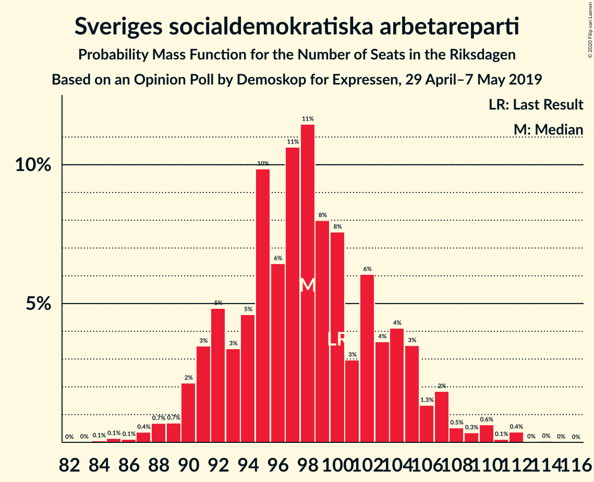
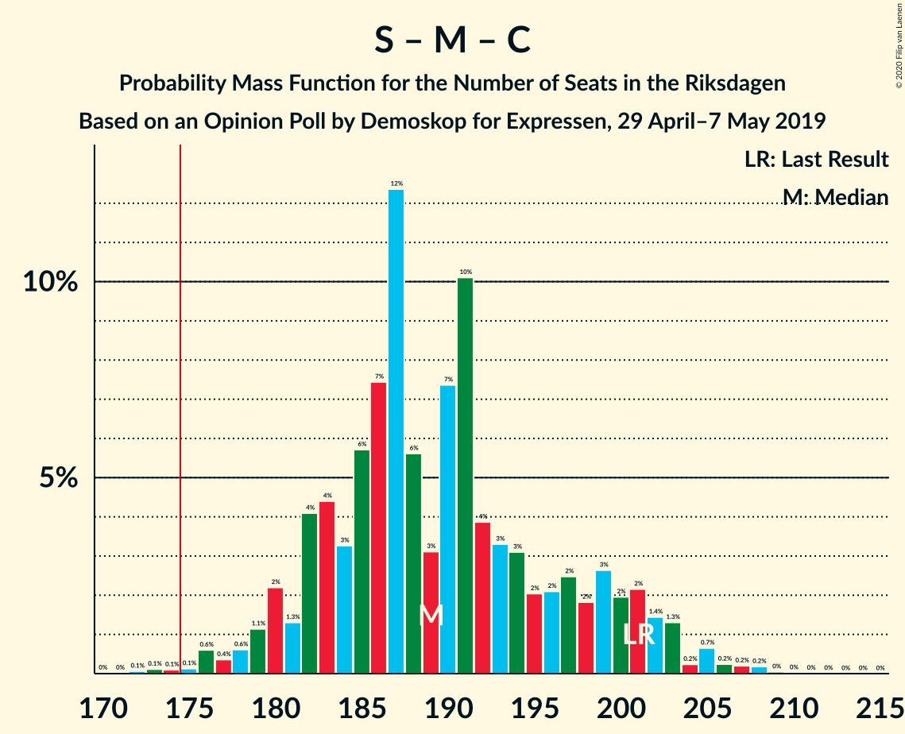
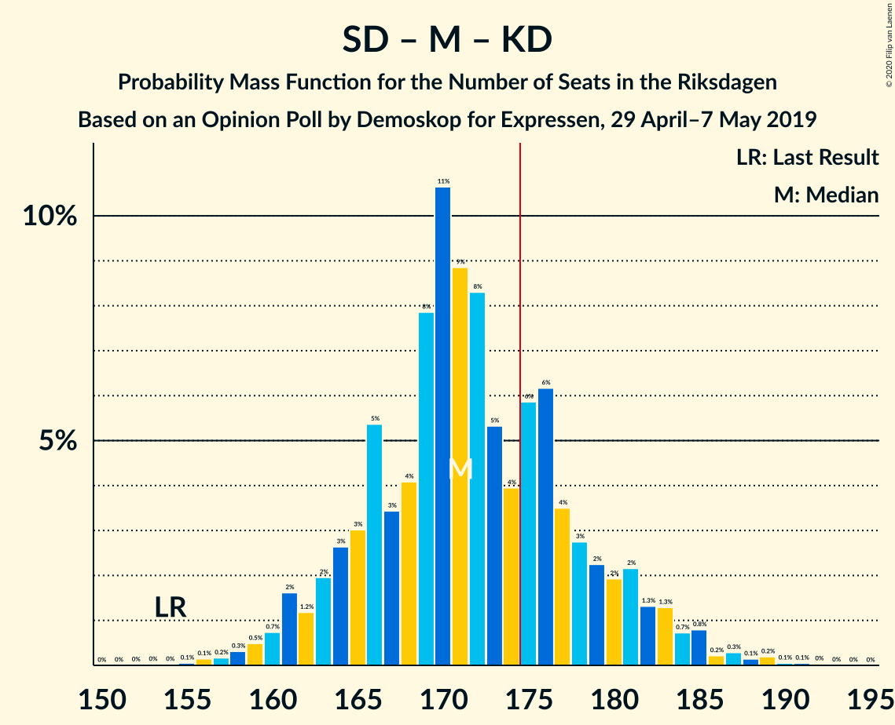
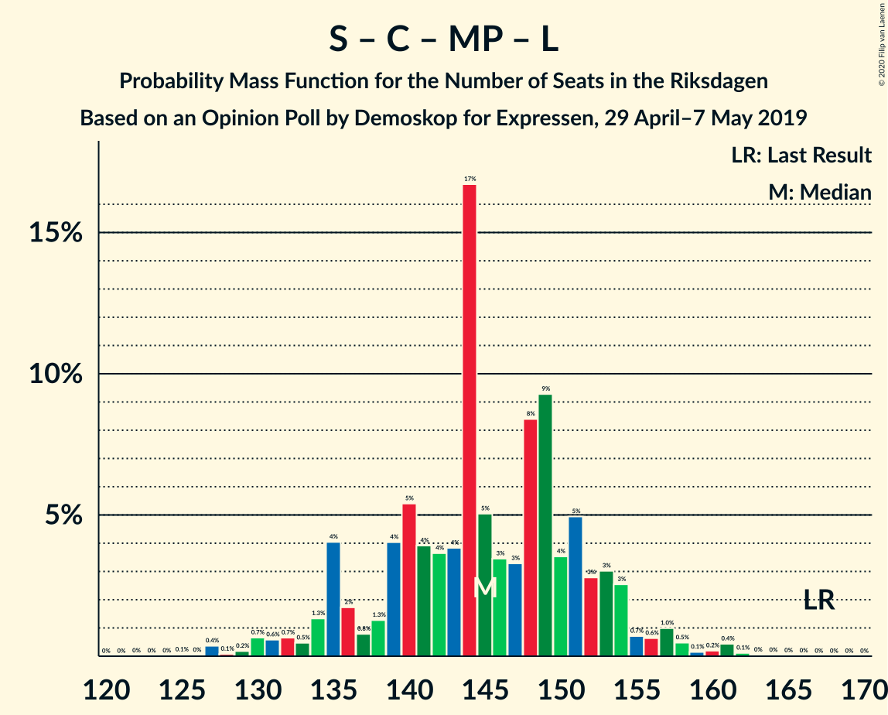
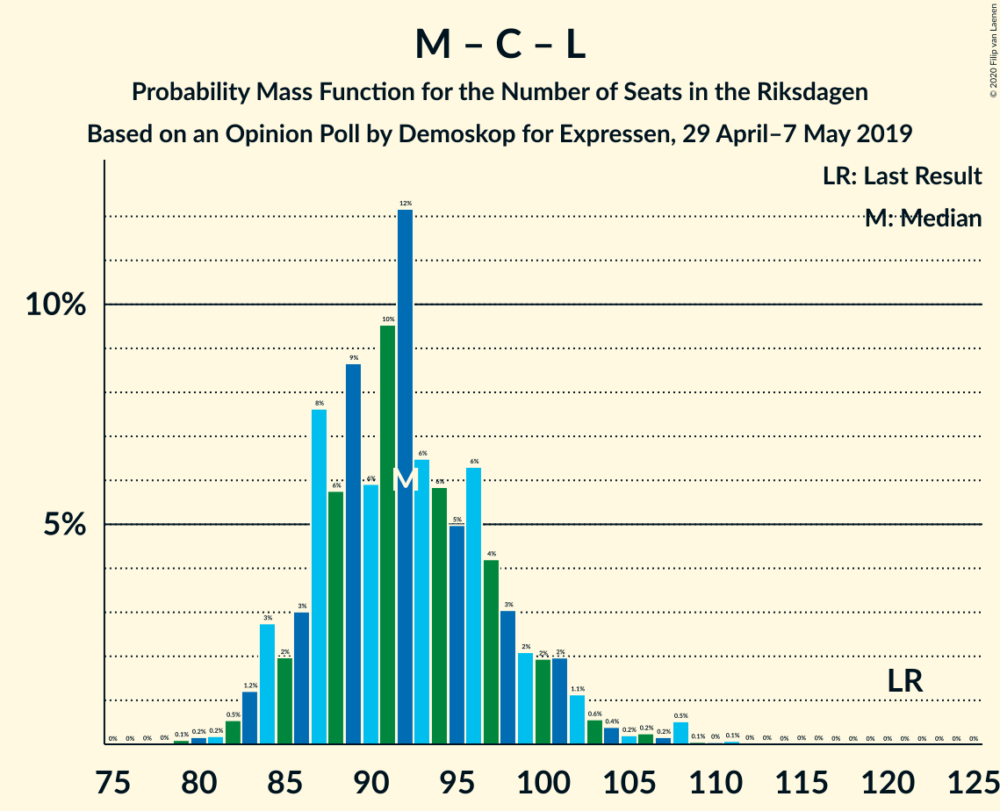

# Opinion Poll by Demoskop for Expressen, 29 April–7 May 2019

<a href="#voting-intentions">Voting Intentions</a> | <a href="#seats">Seats</a> | <a href="#coalitions">Coalitions</a> | <a href="#technical-information">Technical Information</a>

## Voting Intentions

### Confidence Intervals

| Party | Last Result | Poll Result | 80% Confidence Interval | 90% Confidence Interval | 95% Confidence Interval | 99% Confidence Interval |
|:-----:|:-----------:|:-----------:|:-----------------------:|:-----------------------:|:-----------------------:|:-----------------------:|
| Sveriges socialdemokratiska arbetareparti | 28.3% | 26.6% | 25.2–28.0% |24.8–28.4% |24.5–28.8% |23.8–29.5% |
| Sverigedemokraterna | 17.5% | 19.2% | 18.0–20.5% |17.7–20.9% |17.4–21.2% |16.8–21.9% |
| Moderata samlingspartiet | 19.8% | 15.7% | 14.6–16.9% |14.3–17.3% |14.0–17.6% |13.5–18.2% |
| Kristdemokraterna | 6.3% | 11.5% | 10.5–12.6% |10.3–12.9% |10.0–13.2% |9.6–13.7% |
| Centerpartiet | 8.6% | 9.1% | 8.2–10.1% |8.0–10.3% |7.8–10.6% |7.4–11.1% |
| Vänsterpartiet | 8.0% | 8.7% | 7.9–9.7% |7.6–10.0% |7.4–10.2% |7.0–10.7% |
| Miljöpartiet de gröna | 4.4% | 4.3% | 3.7–5.1% |3.6–5.3% |3.4–5.4% |3.2–5.8% |
| Liberalerna | 5.5% | 3.1% | 2.6–3.7% |2.5–3.9% |2.3–4.1% |2.1–4.4% |

*Note:* The poll result column reflects the actual value used in the calculations. Published results may vary slightly, and in addition be rounded to fewer digits.

## Seats

### Confidence Intervals

| Party | Last Result | Median | 80% Confidence Interval | 90% Confidence Interval | 95% Confidence Interval | 99% Confidence Interval |
|:-----:|:-----------:|:------:|:-----------------------:|:-----------------------:|:-----------------------:|:-----------------------:|
| <a href="#sveriges-socialdemokratiska-arbetareparti">Sveriges socialdemokratiska arbetareparti</a> | 100 | 98 | 92–104 |91–106 |90–107 |87–111 |
| <a href="#sverigedemokraterna">Sverigedemokraterna</a> | 62 | 71 | 67–76 |65–77 |64–81 |61–83 |
| <a href="#moderata-samlingspartiet">Moderata samlingspartiet</a> | 70 | 58 | 54–63 |52–64 |51–65 |49–68 |
| <a href="#kristdemokraterna">Kristdemokraterna</a> | 22 | 42 | 39–46 |38–47 |37–49 |35–50 |
| <a href="#centerpartiet">Centerpartiet</a> | 31 | 33 | 31–37 |30–38 |29–39 |28–42 |
| <a href="#vänsterpartiet">Vänsterpartiet</a> | 28 | 33 | 29–35 |28–37 |28–38 |26–39 |
| <a href="#miljöpartiet-de-gröna">Miljöpartiet de gröna</a> | 16 | 16 | 0–18 |0–19 |0–20 |0–21 |
| <a href="#liberalerna">Liberalerna</a> | 20 | 0 | 0 |0 |0–15 |0–15 |

### Sveriges socialdemokratiska arbetareparti

*For a full overview of the results for this party, see the [Sveriges socialdemokratiska arbetareparti](party-sverigessocialdemokratiskaarbetareparti.html) page.*

| Number of Seats | Probability | Accumulated | Special Marks |
|:---------------:|:-----------:|:-----------:|:-------------:|
| 85 | 0.1% | 100% |  |
| 86 | 0.1% | 99.9% |  |
| 87 | 0.6% | 99.8% |  |
| 88 | 0.3% | 99.2% |  |
| 89 | 0.9% | 98.9% |  |
| 90 | 1.1% | 98% |  |
| 91 | 3% | 97% |  |
| 92 | 7% | 94% |  |
| 93 | 4% | 87% |  |
| 94 | 7% | 83% |  |
| 95 | 7% | 76% |  |
| 96 | 8% | 69% |  |
| 97 | 9% | 61% |  |
| 98 | 14% | 52% | Median |
| 99 | 4% | 38% |  |
| 100 | 8% | 34% | Last Result |
| 101 | 2% | 25% |  |
| 102 | 11% | 23% |  |
| 103 | 0.5% | 11% |  |
| 104 | 4% | 11% |  |
| 105 | 1.0% | 6% |  |
| 106 | 2% | 5% |  |
| 107 | 1.1% | 3% |  |
| 108 | 0.3% | 2% |  |
| 109 | 0.5% | 1.5% |  |
| 110 | 0.4% | 1.0% |  |
| 111 | 0.2% | 0.5% |  |
| 112 | 0.3% | 0.3% |  |
| 113 | 0% | 0.1% |  |
| 114 | 0% | 0.1% |  |
| 115 | 0% | 0% |  |

### Sverigedemokraterna

*For a full overview of the results for this party, see the [Sverigedemokraterna](party-sverigedemokraterna.html) page.*

| Number of Seats | Probability | Accumulated | Special Marks |
|:---------------:|:-----------:|:-----------:|:-------------:|
| 59 | 0.1% | 100% |  |
| 60 | 0.2% | 99.9% |  |
| 61 | 0.2% | 99.7% |  |
| 62 | 0.5% | 99.5% | Last Result |
| 63 | 1.3% | 98.9% |  |
| 64 | 2% | 98% |  |
| 65 | 2% | 95% |  |
| 66 | 2% | 93% |  |
| 67 | 3% | 91% |  |
| 68 | 8% | 88% |  |
| 69 | 10% | 79% |  |
| 70 | 19% | 69% |  |
| 71 | 10% | 50% | Median |
| 72 | 8% | 40% |  |
| 73 | 4% | 32% |  |
| 74 | 7% | 28% |  |
| 75 | 7% | 21% |  |
| 76 | 6% | 15% |  |
| 77 | 4% | 8% |  |
| 78 | 1.0% | 5% |  |
| 79 | 0.7% | 4% |  |
| 80 | 0.3% | 3% |  |
| 81 | 2% | 3% |  |
| 82 | 0.3% | 0.8% |  |
| 83 | 0.4% | 0.5% |  |
| 84 | 0% | 0.1% |  |
| 85 | 0% | 0% |  |

### Moderata samlingspartiet

*For a full overview of the results for this party, see the [Moderata samlingspartiet](party-moderatasamlingspartiet.html) page.*

| Number of Seats | Probability | Accumulated | Special Marks |
|:---------------:|:-----------:|:-----------:|:-------------:|
| 47 | 0.1% | 100% |  |
| 48 | 0.2% | 99.9% |  |
| 49 | 0.5% | 99.8% |  |
| 50 | 0.7% | 99.3% |  |
| 51 | 1.2% | 98.6% |  |
| 52 | 5% | 97% |  |
| 53 | 2% | 92% |  |
| 54 | 4% | 90% |  |
| 55 | 12% | 87% |  |
| 56 | 5% | 75% |  |
| 57 | 6% | 70% |  |
| 58 | 23% | 64% | Median |
| 59 | 9% | 41% |  |
| 60 | 7% | 32% |  |
| 61 | 7% | 25% |  |
| 62 | 6% | 19% |  |
| 63 | 3% | 13% |  |
| 64 | 6% | 10% |  |
| 65 | 1.4% | 4% |  |
| 66 | 1.2% | 2% |  |
| 67 | 0.6% | 1.1% |  |
| 68 | 0.4% | 0.5% |  |
| 69 | 0.1% | 0.1% |  |
| 70 | 0.1% | 0.1% | Last Result |
| 71 | 0% | 0% |  |

### Kristdemokraterna

*For a full overview of the results for this party, see the [Kristdemokraterna](party-kristdemokraterna.html) page.*

| Number of Seats | Probability | Accumulated | Special Marks |
|:---------------:|:-----------:|:-----------:|:-------------:|
| 22 | 0% | 100% | Last Result |
| 23 | 0% | 100% |  |
| 24 | 0% | 100% |  |
| 25 | 0% | 100% |  |
| 26 | 0% | 100% |  |
| 27 | 0% | 100% |  |
| 28 | 0% | 100% |  |
| 29 | 0% | 100% |  |
| 30 | 0% | 100% |  |
| 31 | 0% | 100% |  |
| 32 | 0% | 100% |  |
| 33 | 0% | 100% |  |
| 34 | 0.2% | 99.9% |  |
| 35 | 0.8% | 99.8% |  |
| 36 | 1.0% | 99.0% |  |
| 37 | 2% | 98% |  |
| 38 | 5% | 96% |  |
| 39 | 8% | 91% |  |
| 40 | 6% | 83% |  |
| 41 | 7% | 77% |  |
| 42 | 24% | 70% | Median |
| 43 | 6% | 46% |  |
| 44 | 18% | 41% |  |
| 45 | 6% | 22% |  |
| 46 | 8% | 16% |  |
| 47 | 3% | 8% |  |
| 48 | 2% | 5% |  |
| 49 | 2% | 3% |  |
| 50 | 0.6% | 1.1% |  |
| 51 | 0.3% | 0.5% |  |
| 52 | 0.1% | 0.2% |  |
| 53 | 0% | 0.1% |  |
| 54 | 0% | 0% |  |

### Centerpartiet

*For a full overview of the results for this party, see the [Centerpartiet](party-centerpartiet.html) page.*

| Number of Seats | Probability | Accumulated | Special Marks |
|:---------------:|:-----------:|:-----------:|:-------------:|
| 26 | 0.1% | 100% |  |
| 27 | 0.3% | 99.9% |  |
| 28 | 2% | 99.6% |  |
| 29 | 3% | 98% |  |
| 30 | 3% | 95% |  |
| 31 | 20% | 92% | Last Result |
| 32 | 8% | 72% |  |
| 33 | 15% | 64% | Median |
| 34 | 10% | 48% |  |
| 35 | 9% | 38% |  |
| 36 | 12% | 29% |  |
| 37 | 9% | 18% |  |
| 38 | 5% | 8% |  |
| 39 | 1.4% | 4% |  |
| 40 | 1.4% | 2% |  |
| 41 | 0.3% | 1.0% |  |
| 42 | 0.6% | 0.7% |  |
| 43 | 0.1% | 0.1% |  |
| 44 | 0% | 0% |  |

### Vänsterpartiet

*For a full overview of the results for this party, see the [Vänsterpartiet](party-vänsterpartiet.html) page.*

| Number of Seats | Probability | Accumulated | Special Marks |
|:---------------:|:-----------:|:-----------:|:-------------:|
| 24 | 0% | 100% |  |
| 25 | 0.4% | 99.9% |  |
| 26 | 0.3% | 99.6% |  |
| 27 | 1.5% | 99.3% |  |
| 28 | 5% | 98% | Last Result |
| 29 | 6% | 93% |  |
| 30 | 11% | 87% |  |
| 31 | 11% | 77% |  |
| 32 | 14% | 65% |  |
| 33 | 19% | 52% | Median |
| 34 | 13% | 33% |  |
| 35 | 10% | 20% |  |
| 36 | 4% | 10% |  |
| 37 | 1.4% | 5% |  |
| 38 | 2% | 4% |  |
| 39 | 1.4% | 2% |  |
| 40 | 0.4% | 0.5% |  |
| 41 | 0% | 0.1% |  |
| 42 | 0% | 0.1% |  |
| 43 | 0% | 0% |  |

### Miljöpartiet de gröna

*For a full overview of the results for this party, see the [Miljöpartiet de gröna](party-miljöpartietdegröna.html) page.*

| Number of Seats | Probability | Accumulated | Special Marks |
|:---------------:|:-----------:|:-----------:|:-------------:|
| 0 | 24% | 100% |  |
| 1 | 0% | 76% |  |
| 2 | 0% | 76% |  |
| 3 | 0% | 76% |  |
| 4 | 0% | 76% |  |
| 5 | 0% | 76% |  |
| 6 | 0% | 76% |  |
| 7 | 0% | 76% |  |
| 8 | 0% | 76% |  |
| 9 | 0% | 76% |  |
| 10 | 0% | 76% |  |
| 11 | 0% | 76% |  |
| 12 | 0% | 76% |  |
| 13 | 0% | 76% |  |
| 14 | 0.2% | 76% |  |
| 15 | 25% | 76% |  |
| 16 | 15% | 51% | Last Result, Median |
| 17 | 20% | 36% |  |
| 18 | 8% | 16% |  |
| 19 | 4% | 8% |  |
| 20 | 3% | 4% |  |
| 21 | 0.8% | 1.0% |  |
| 22 | 0.2% | 0.3% |  |
| 23 | 0.1% | 0.1% |  |
| 24 | 0% | 0% |  |

### Liberalerna

*For a full overview of the results for this party, see the [Liberalerna](party-liberalerna.html) page.*

| Number of Seats | Probability | Accumulated | Special Marks |
|:---------------:|:-----------:|:-----------:|:-------------:|
| 0 | 96% | 100% | Median |
| 1 | 0% | 4% |  |
| 2 | 0% | 4% |  |
| 3 | 0% | 4% |  |
| 4 | 0% | 4% |  |
| 5 | 0% | 4% |  |
| 6 | 0% | 4% |  |
| 7 | 0% | 4% |  |
| 8 | 0% | 4% |  |
| 9 | 0% | 4% |  |
| 10 | 0% | 4% |  |
| 11 | 0% | 4% |  |
| 12 | 0% | 4% |  |
| 13 | 0% | 4% |  |
| 14 | 0.3% | 4% |  |
| 15 | 3% | 3% |  |
| 16 | 0.3% | 0.4% |  |
| 17 | 0.1% | 0.1% |  |
| 18 | 0% | 0% |  |
| 19 | 0% | 0% |  |
| 20 | 0% | 0% | Last Result |

## Coalitions

### Confidence Intervals

| Coalition | Last Result | Median | Majority? | 80% Confidence Interval | 90% Confidence Interval | 95% Confidence Interval | 99% Confidence Interval |
|:---------:|:-----------:|:------:|:---------:|:-----------------------:|:-----------------------:|:-----------------------:|:-----------------------:|
| Sveriges socialdemokratiska arbetareparti – Moderata samlingspartiet – Centerpartiet | 201 | 188 | 99.8% | 183–199 | 180–201 | 179–202 | 176–205 |
| Sveriges socialdemokratiska arbetareparti – Centerpartiet – Vänsterpartiet – Miljöpartiet de gröna – Liberalerna | 195 | 177 | 72% | 169–184 | 166–186 | 164–189 | 162–192 |
| Sverigedemokraterna – Moderata samlingspartiet – Kristdemokraterna | 154 | 172 | 28% | 165–180 | 163–183 | 160–185 | 157–187 |
| Sveriges socialdemokratiska arbetareparti – Moderata samlingspartiet | 170 | 156 | 0.1% | 149–165 | 148–166 | 145–167 | 143–170 |
| Sveriges socialdemokratiska arbetareparti – Centerpartiet – Miljöpartiet de gröna – Liberalerna | 167 | 145 | 0% | 135–151 | 135–154 | 130–156 | 130–160 |
| Sveriges socialdemokratiska arbetareparti – Vänsterpartiet – Miljöpartiet de gröna | 144 | 144 | 0% | 134–149 | 131–152 | 130–154 | 126–157 |
| Moderata samlingspartiet – Kristdemokraterna – Centerpartiet – Liberalerna | 143 | 134 | 0% | 129–142 | 127–145 | 126–147 | 123–150 |
| Moderata samlingspartiet – Kristdemokraterna – Centerpartiet | 123 | 133 | 0% | 129–141 | 127–143 | 125–145 | 122–149 |
| Sverigedemokraterna – Moderata samlingspartiet | 132 | 129 | 0% | 123–137 | 121–138 | 119–142 | 117–143 |
| Sveriges socialdemokratiska arbetareparti – Vänsterpartiet | 128 | 131 | 0% | 125–136 | 122–138 | 121–141 | 118–145 |
| Sveriges socialdemokratiska arbetareparti – Miljöpartiet de gröna | 116 | 112 | 0% | 101–118 | 97–119 | 96–122 | 95–125 |
| Moderata samlingspartiet – Centerpartiet – Liberalerna | 121 | 92 | 0% | 87–98 | 85–101 | 84–103 | 82–108 |
| Moderata samlingspartiet – Centerpartiet | 101 | 92 | 0% | 87–98 | 85–99 | 84–101 | 81–102 |

### Sveriges socialdemokratiska arbetareparti – Moderata samlingspartiet – Centerpartiet

| Number of Seats | Probability | Accumulated | Special Marks |
|:---------------:|:-----------:|:-----------:|:-------------:|
| 173 | 0.1% | 100% |  |
| 174 | 0.1% | 99.9% |  |
| 175 | 0.1% | 99.8% | Majority |
| 176 | 0.3% | 99.7% |  |
| 177 | 0.7% | 99.4% |  |
| 178 | 0.6% | 98.6% |  |
| 179 | 0.6% | 98% |  |
| 180 | 4% | 97% |  |
| 181 | 2% | 94% |  |
| 182 | 1.0% | 91% |  |
| 183 | 4% | 90% |  |
| 184 | 3% | 86% |  |
| 185 | 7% | 83% |  |
| 186 | 3% | 76% |  |
| 187 | 18% | 73% |  |
| 188 | 7% | 55% |  |
| 189 | 5% | 48% | Median |
| 190 | 4% | 43% |  |
| 191 | 9% | 39% |  |
| 192 | 4% | 30% |  |
| 193 | 2% | 27% |  |
| 194 | 4% | 25% |  |
| 195 | 1.5% | 21% |  |
| 196 | 2% | 19% |  |
| 197 | 2% | 18% |  |
| 198 | 2% | 16% |  |
| 199 | 5% | 14% |  |
| 200 | 4% | 9% |  |
| 201 | 2% | 5% | Last Result |
| 202 | 1.5% | 4% |  |
| 203 | 2% | 2% |  |
| 204 | 0.1% | 0.8% |  |
| 205 | 0.4% | 0.7% |  |
| 206 | 0.1% | 0.3% |  |
| 207 | 0% | 0.2% |  |
| 208 | 0.1% | 0.1% |  |
| 209 | 0% | 0.1% |  |
| 210 | 0% | 0% |  |

### Sveriges socialdemokratiska arbetareparti – Centerpartiet – Vänsterpartiet – Miljöpartiet de gröna – Liberalerna

| Number of Seats | Probability | Accumulated | Special Marks |
|:---------------:|:-----------:|:-----------:|:-------------:|
| 157 | 0% | 100% |  |
| 158 | 0.1% | 99.9% |  |
| 159 | 0% | 99.8% |  |
| 160 | 0.3% | 99.8% |  |
| 161 | 0% | 99.6% |  |
| 162 | 0.1% | 99.6% |  |
| 163 | 0.2% | 99.5% |  |
| 164 | 2% | 99.3% |  |
| 165 | 1.1% | 97% |  |
| 166 | 1.3% | 96% |  |
| 167 | 1.1% | 95% |  |
| 168 | 0.2% | 93% |  |
| 169 | 4% | 93% |  |
| 170 | 3% | 89% |  |
| 171 | 5% | 86% |  |
| 172 | 4% | 81% |  |
| 173 | 3% | 77% |  |
| 174 | 2% | 74% |  |
| 175 | 2% | 72% | Majority |
| 176 | 5% | 71% |  |
| 177 | 21% | 66% |  |
| 178 | 9% | 44% |  |
| 179 | 7% | 35% |  |
| 180 | 6% | 29% | Median |
| 181 | 0.2% | 23% |  |
| 182 | 2% | 22% |  |
| 183 | 7% | 21% |  |
| 184 | 5% | 13% |  |
| 185 | 3% | 8% |  |
| 186 | 2% | 5% |  |
| 187 | 0.4% | 3% |  |
| 188 | 0.4% | 3% |  |
| 189 | 1.3% | 3% |  |
| 190 | 0.2% | 1.2% |  |
| 191 | 0.5% | 1.1% |  |
| 192 | 0.4% | 0.6% |  |
| 193 | 0.1% | 0.2% |  |
| 194 | 0.1% | 0.1% |  |
| 195 | 0% | 0.1% | Last Result |
| 196 | 0% | 0% |  |

### Sverigedemokraterna – Moderata samlingspartiet – Kristdemokraterna

| Number of Seats | Probability | Accumulated | Special Marks |
|:---------------:|:-----------:|:-----------:|:-------------:|
| 154 | 0% | 100% | Last Result |
| 155 | 0.1% | 99.9% |  |
| 156 | 0.1% | 99.9% |  |
| 157 | 0.4% | 99.8% |  |
| 158 | 0.5% | 99.4% |  |
| 159 | 0.2% | 98.9% |  |
| 160 | 1.3% | 98.8% |  |
| 161 | 0.4% | 97% |  |
| 162 | 0.4% | 97% |  |
| 163 | 2% | 97% |  |
| 164 | 3% | 95% |  |
| 165 | 5% | 92% |  |
| 166 | 7% | 87% |  |
| 167 | 2% | 79% |  |
| 168 | 0.2% | 78% |  |
| 169 | 6% | 77% |  |
| 170 | 7% | 71% |  |
| 171 | 9% | 65% | Median |
| 172 | 21% | 56% |  |
| 173 | 5% | 34% |  |
| 174 | 2% | 29% |  |
| 175 | 2% | 28% | Majority |
| 176 | 3% | 26% |  |
| 177 | 4% | 23% |  |
| 178 | 5% | 19% |  |
| 179 | 3% | 14% |  |
| 180 | 4% | 11% |  |
| 181 | 0.2% | 7% |  |
| 182 | 1.1% | 7% |  |
| 183 | 1.3% | 5% |  |
| 184 | 1.1% | 4% |  |
| 185 | 2% | 3% |  |
| 186 | 0.2% | 0.7% |  |
| 187 | 0.1% | 0.5% |  |
| 188 | 0% | 0.4% |  |
| 189 | 0.3% | 0.4% |  |
| 190 | 0% | 0.2% |  |
| 191 | 0.1% | 0.2% |  |
| 192 | 0% | 0.1% |  |
| 193 | 0% | 0% |  |

### Sveriges socialdemokratiska arbetareparti – Moderata samlingspartiet

| Number of Seats | Probability | Accumulated | Special Marks |
|:---------------:|:-----------:|:-----------:|:-------------:|
| 140 | 0% | 100% |  |
| 141 | 0.2% | 99.9% |  |
| 142 | 0.1% | 99.8% |  |
| 143 | 0.2% | 99.6% |  |
| 144 | 0.9% | 99.5% |  |
| 145 | 1.4% | 98.6% |  |
| 146 | 0.8% | 97% |  |
| 147 | 1.3% | 96% |  |
| 148 | 3% | 95% |  |
| 149 | 5% | 93% |  |
| 150 | 4% | 88% |  |
| 151 | 3% | 84% |  |
| 152 | 12% | 81% |  |
| 153 | 6% | 69% |  |
| 154 | 2% | 63% |  |
| 155 | 8% | 61% |  |
| 156 | 16% | 53% | Median |
| 157 | 5% | 38% |  |
| 158 | 4% | 33% |  |
| 159 | 3% | 29% |  |
| 160 | 6% | 26% |  |
| 161 | 2% | 20% |  |
| 162 | 4% | 18% |  |
| 163 | 2% | 14% |  |
| 164 | 2% | 13% |  |
| 165 | 2% | 10% |  |
| 166 | 5% | 9% |  |
| 167 | 2% | 4% |  |
| 168 | 0.5% | 2% |  |
| 169 | 0.5% | 1.5% |  |
| 170 | 0.7% | 1.0% | Last Result |
| 171 | 0.1% | 0.3% |  |
| 172 | 0.1% | 0.2% |  |
| 173 | 0% | 0.1% |  |
| 174 | 0% | 0.1% |  |
| 175 | 0% | 0.1% | Majority |
| 176 | 0% | 0% |  |

### Sveriges socialdemokratiska arbetareparti – Centerpartiet – Miljöpartiet de gröna – Liberalerna

| Number of Seats | Probability | Accumulated | Special Marks |
|:---------------:|:-----------:|:-----------:|:-------------:|
| 124 | 0% | 100% |  |
| 125 | 0% | 99.9% |  |
| 126 | 0% | 99.9% |  |
| 127 | 0.1% | 99.9% |  |
| 128 | 0.1% | 99.7% |  |
| 129 | 0.1% | 99.6% |  |
| 130 | 2% | 99.5% |  |
| 131 | 0.2% | 97% |  |
| 132 | 0.2% | 97% |  |
| 133 | 0.2% | 97% |  |
| 134 | 0.6% | 97% |  |
| 135 | 6% | 96% |  |
| 136 | 4% | 90% |  |
| 137 | 0.8% | 86% |  |
| 138 | 0.4% | 85% |  |
| 139 | 5% | 85% |  |
| 140 | 2% | 80% |  |
| 141 | 7% | 78% |  |
| 142 | 5% | 72% |  |
| 143 | 1.3% | 66% |  |
| 144 | 14% | 65% |  |
| 145 | 8% | 51% |  |
| 146 | 5% | 43% |  |
| 147 | 2% | 38% | Median |
| 148 | 10% | 36% |  |
| 149 | 9% | 26% |  |
| 150 | 2% | 17% |  |
| 151 | 5% | 15% |  |
| 152 | 2% | 10% |  |
| 153 | 1.0% | 8% |  |
| 154 | 3% | 7% |  |
| 155 | 1.3% | 4% |  |
| 156 | 0.3% | 3% |  |
| 157 | 0.8% | 2% |  |
| 158 | 0.8% | 2% |  |
| 159 | 0.2% | 0.8% |  |
| 160 | 0.3% | 0.6% |  |
| 161 | 0.1% | 0.3% |  |
| 162 | 0% | 0.2% |  |
| 163 | 0.1% | 0.2% |  |
| 164 | 0% | 0% |  |
| 165 | 0% | 0% |  |
| 166 | 0% | 0% |  |
| 167 | 0% | 0% | Last Result |

### Sveriges socialdemokratiska arbetareparti – Vänsterpartiet – Miljöpartiet de gröna

| Number of Seats | Probability | Accumulated | Special Marks |
|:---------------:|:-----------:|:-----------:|:-------------:|
| 122 | 0% | 100% |  |
| 123 | 0% | 99.9% |  |
| 124 | 0% | 99.9% |  |
| 125 | 0.1% | 99.9% |  |
| 126 | 0.3% | 99.8% |  |
| 127 | 0.3% | 99.5% |  |
| 128 | 0.2% | 99.1% |  |
| 129 | 0.7% | 99.0% |  |
| 130 | 2% | 98% |  |
| 131 | 2% | 96% |  |
| 132 | 0.9% | 94% |  |
| 133 | 2% | 93% |  |
| 134 | 3% | 91% |  |
| 135 | 1.2% | 88% |  |
| 136 | 6% | 86% |  |
| 137 | 1.3% | 81% |  |
| 138 | 4% | 79% |  |
| 139 | 2% | 76% |  |
| 140 | 5% | 73% |  |
| 141 | 5% | 68% |  |
| 142 | 5% | 63% |  |
| 143 | 6% | 58% |  |
| 144 | 6% | 52% | Last Result |
| 145 | 5% | 46% |  |
| 146 | 14% | 41% |  |
| 147 | 9% | 27% | Median |
| 148 | 3% | 18% |  |
| 149 | 6% | 15% |  |
| 150 | 2% | 9% |  |
| 151 | 1.4% | 8% |  |
| 152 | 2% | 6% |  |
| 153 | 1.4% | 4% |  |
| 154 | 1.0% | 3% |  |
| 155 | 0.6% | 2% |  |
| 156 | 0.4% | 1.0% |  |
| 157 | 0.2% | 0.7% |  |
| 158 | 0.3% | 0.4% |  |
| 159 | 0.1% | 0.1% |  |
| 160 | 0% | 0% |  |

### Moderata samlingspartiet – Kristdemokraterna – Centerpartiet – Liberalerna

| Number of Seats | Probability | Accumulated | Special Marks |
|:---------------:|:-----------:|:-----------:|:-------------:|
| 119 | 0% | 100% |  |
| 120 | 0% | 99.9% |  |
| 121 | 0.1% | 99.9% |  |
| 122 | 0.2% | 99.8% |  |
| 123 | 0.2% | 99.5% |  |
| 124 | 0.8% | 99.3% |  |
| 125 | 1.0% | 98.5% |  |
| 126 | 1.1% | 98% |  |
| 127 | 3% | 96% |  |
| 128 | 1.1% | 94% |  |
| 129 | 6% | 93% |  |
| 130 | 6% | 87% |  |
| 131 | 9% | 81% |  |
| 132 | 6% | 73% |  |
| 133 | 17% | 67% | Median |
| 134 | 2% | 51% |  |
| 135 | 5% | 49% |  |
| 136 | 5% | 44% |  |
| 137 | 8% | 38% |  |
| 138 | 4% | 30% |  |
| 139 | 7% | 26% |  |
| 140 | 4% | 19% |  |
| 141 | 3% | 15% |  |
| 142 | 4% | 12% |  |
| 143 | 2% | 9% | Last Result |
| 144 | 0.9% | 6% |  |
| 145 | 1.5% | 5% |  |
| 146 | 0.7% | 4% |  |
| 147 | 0.8% | 3% |  |
| 148 | 0.2% | 2% |  |
| 149 | 0.4% | 2% |  |
| 150 | 1.4% | 2% |  |
| 151 | 0.1% | 0.3% |  |
| 152 | 0% | 0.2% |  |
| 153 | 0% | 0.1% |  |
| 154 | 0% | 0.1% |  |
| 155 | 0% | 0.1% |  |
| 156 | 0% | 0% |  |

### Moderata samlingspartiet – Kristdemokraterna – Centerpartiet

| Number of Seats | Probability | Accumulated | Special Marks |
|:---------------:|:-----------:|:-----------:|:-------------:|
| 117 | 0% | 100% |  |
| 118 | 0% | 99.9% |  |
| 119 | 0.1% | 99.9% |  |
| 120 | 0.1% | 99.8% |  |
| 121 | 0.2% | 99.8% |  |
| 122 | 0.3% | 99.6% |  |
| 123 | 0.2% | 99.3% | Last Result |
| 124 | 0.8% | 99.1% |  |
| 125 | 1.4% | 98% |  |
| 126 | 1.3% | 97% |  |
| 127 | 3% | 96% |  |
| 128 | 1.4% | 93% |  |
| 129 | 6% | 91% |  |
| 130 | 6% | 86% |  |
| 131 | 9% | 80% |  |
| 132 | 6% | 71% |  |
| 133 | 17% | 65% | Median |
| 134 | 2% | 49% |  |
| 135 | 6% | 47% |  |
| 136 | 5% | 40% |  |
| 137 | 8% | 35% |  |
| 138 | 4% | 27% |  |
| 139 | 7% | 22% |  |
| 140 | 3% | 15% |  |
| 141 | 2% | 12% |  |
| 142 | 4% | 9% |  |
| 143 | 2% | 6% |  |
| 144 | 0.8% | 4% |  |
| 145 | 1.0% | 3% |  |
| 146 | 0.7% | 2% |  |
| 147 | 0.7% | 1.4% |  |
| 148 | 0.1% | 0.7% |  |
| 149 | 0.3% | 0.5% |  |
| 150 | 0.1% | 0.2% |  |
| 151 | 0.1% | 0.2% |  |
| 152 | 0% | 0.1% |  |
| 153 | 0% | 0% |  |

### Sverigedemokraterna – Moderata samlingspartiet

| Number of Seats | Probability | Accumulated | Special Marks |
|:---------------:|:-----------:|:-----------:|:-------------:|
| 113 | 0% | 100% |  |
| 114 | 0.1% | 99.9% |  |
| 115 | 0.1% | 99.9% |  |
| 116 | 0.1% | 99.8% |  |
| 117 | 0.5% | 99.7% |  |
| 118 | 0.6% | 99.1% |  |
| 119 | 1.2% | 98.5% |  |
| 120 | 1.4% | 97% |  |
| 121 | 2% | 96% |  |
| 122 | 2% | 94% |  |
| 123 | 3% | 92% |  |
| 124 | 7% | 89% |  |
| 125 | 2% | 82% |  |
| 126 | 9% | 80% |  |
| 127 | 4% | 72% |  |
| 128 | 17% | 67% |  |
| 129 | 3% | 50% | Median |
| 130 | 11% | 47% |  |
| 131 | 6% | 36% |  |
| 132 | 2% | 30% | Last Result |
| 133 | 9% | 28% |  |
| 134 | 5% | 20% |  |
| 135 | 2% | 14% |  |
| 136 | 2% | 12% |  |
| 137 | 2% | 11% |  |
| 138 | 5% | 9% |  |
| 139 | 0.5% | 4% |  |
| 140 | 0.5% | 3% |  |
| 141 | 0.2% | 3% |  |
| 142 | 0.4% | 3% |  |
| 143 | 2% | 2% |  |
| 144 | 0% | 0.5% |  |
| 145 | 0% | 0.4% |  |
| 146 | 0.3% | 0.4% |  |
| 147 | 0% | 0.1% |  |
| 148 | 0% | 0% |  |

### Sveriges socialdemokratiska arbetareparti – Vänsterpartiet

| Number of Seats | Probability | Accumulated | Special Marks |
|:---------------:|:-----------:|:-----------:|:-------------:|
| 115 | 0.1% | 100% |  |
| 116 | 0.1% | 99.9% |  |
| 117 | 0.1% | 99.8% |  |
| 118 | 0.3% | 99.6% |  |
| 119 | 0.6% | 99.4% |  |
| 120 | 1.0% | 98.7% |  |
| 121 | 1.1% | 98% |  |
| 122 | 2% | 97% |  |
| 123 | 2% | 95% |  |
| 124 | 2% | 93% |  |
| 125 | 9% | 91% |  |
| 126 | 8% | 82% |  |
| 127 | 10% | 74% |  |
| 128 | 1.4% | 64% | Last Result |
| 129 | 3% | 63% |  |
| 130 | 7% | 60% |  |
| 131 | 16% | 53% | Median |
| 132 | 6% | 37% |  |
| 133 | 7% | 30% |  |
| 134 | 6% | 23% |  |
| 135 | 2% | 17% |  |
| 136 | 7% | 15% |  |
| 137 | 1.2% | 8% |  |
| 138 | 3% | 7% |  |
| 139 | 0.5% | 4% |  |
| 140 | 0.5% | 3% |  |
| 141 | 0.8% | 3% |  |
| 142 | 0.5% | 2% |  |
| 143 | 0.5% | 1.5% |  |
| 144 | 0.3% | 1.0% |  |
| 145 | 0.3% | 0.7% |  |
| 146 | 0.2% | 0.4% |  |
| 147 | 0% | 0.2% |  |
| 148 | 0.1% | 0.1% |  |
| 149 | 0% | 0.1% |  |
| 150 | 0% | 0% |  |

### Sveriges socialdemokratiska arbetareparti – Miljöpartiet de gröna

| Number of Seats | Probability | Accumulated | Special Marks |
|:---------------:|:-----------:|:-----------:|:-------------:|
| 90 | 0% | 100% |  |
| 91 | 0% | 99.9% |  |
| 92 | 0% | 99.9% |  |
| 93 | 0% | 99.9% |  |
| 94 | 0.1% | 99.8% |  |
| 95 | 0.3% | 99.7% |  |
| 96 | 2% | 99.4% |  |
| 97 | 2% | 97% |  |
| 98 | 0.3% | 95% |  |
| 99 | 3% | 95% |  |
| 100 | 1.3% | 92% |  |
| 101 | 2% | 90% |  |
| 102 | 5% | 89% |  |
| 103 | 0.4% | 84% |  |
| 104 | 3% | 83% |  |
| 105 | 1.3% | 80% |  |
| 106 | 4% | 79% |  |
| 107 | 2% | 75% |  |
| 108 | 5% | 73% |  |
| 109 | 5% | 68% |  |
| 110 | 5% | 62% |  |
| 111 | 7% | 57% |  |
| 112 | 6% | 50% |  |
| 113 | 16% | 44% |  |
| 114 | 3% | 29% | Median |
| 115 | 8% | 25% |  |
| 116 | 3% | 18% | Last Result |
| 117 | 3% | 15% |  |
| 118 | 6% | 12% |  |
| 119 | 2% | 6% |  |
| 120 | 1.2% | 4% |  |
| 121 | 0.4% | 3% |  |
| 122 | 0.6% | 3% |  |
| 123 | 0.7% | 2% |  |
| 124 | 0.5% | 1.3% |  |
| 125 | 0.5% | 0.7% |  |
| 126 | 0.2% | 0.3% |  |
| 127 | 0% | 0% |  |

### Moderata samlingspartiet – Centerpartiet – Liberalerna

| Number of Seats | Probability | Accumulated | Special Marks |
|:---------------:|:-----------:|:-----------:|:-------------:|
| 79 | 0.1% | 100% |  |
| 80 | 0.2% | 99.9% |  |
| 81 | 0.2% | 99.7% |  |
| 82 | 0.2% | 99.6% |  |
| 83 | 1.0% | 99.3% |  |
| 84 | 0.8% | 98% |  |
| 85 | 3% | 97% |  |
| 86 | 2% | 94% |  |
| 87 | 5% | 93% |  |
| 88 | 10% | 88% |  |
| 89 | 17% | 79% |  |
| 90 | 4% | 61% |  |
| 91 | 2% | 57% | Median |
| 92 | 9% | 55% |  |
| 93 | 5% | 45% |  |
| 94 | 7% | 40% |  |
| 95 | 4% | 33% |  |
| 96 | 5% | 29% |  |
| 97 | 10% | 24% |  |
| 98 | 5% | 14% |  |
| 99 | 2% | 9% |  |
| 100 | 2% | 7% |  |
| 101 | 1.3% | 6% |  |
| 102 | 2% | 5% |  |
| 103 | 0.6% | 3% |  |
| 104 | 0.1% | 2% |  |
| 105 | 0.1% | 2% |  |
| 106 | 0.2% | 2% |  |
| 107 | 0.1% | 2% |  |
| 108 | 1.4% | 2% |  |
| 109 | 0.1% | 0.3% |  |
| 110 | 0.1% | 0.2% |  |
| 111 | 0.1% | 0.2% |  |
| 112 | 0% | 0.1% |  |
| 113 | 0% | 0% |  |
| 114 | 0% | 0% |  |
| 115 | 0% | 0% |  |
| 116 | 0% | 0% |  |
| 117 | 0% | 0% |  |
| 118 | 0% | 0% |  |
| 119 | 0% | 0% |  |
| 120 | 0% | 0% |  |
| 121 | 0% | 0% | Last Result |

### Moderata samlingspartiet – Centerpartiet

| Number of Seats | Probability | Accumulated | Special Marks |
|:---------------:|:-----------:|:-----------:|:-------------:|
| 79 | 0.1% | 100% |  |
| 80 | 0.2% | 99.9% |  |
| 81 | 0.2% | 99.6% |  |
| 82 | 0.3% | 99.4% |  |
| 83 | 1.1% | 99.1% |  |
| 84 | 0.9% | 98% |  |
| 85 | 3% | 97% |  |
| 86 | 2% | 94% |  |
| 87 | 5% | 92% |  |
| 88 | 10% | 87% |  |
| 89 | 17% | 77% |  |
| 90 | 4% | 59% |  |
| 91 | 2% | 55% | Median |
| 92 | 10% | 53% |  |
| 93 | 6% | 43% |  |
| 94 | 7% | 37% |  |
| 95 | 4% | 30% |  |
| 96 | 6% | 26% |  |
| 97 | 10% | 20% |  |
| 98 | 5% | 10% |  |
| 99 | 2% | 6% |  |
| 100 | 1.1% | 4% |  |
| 101 | 1.1% | 3% | Last Result |
| 102 | 1.4% | 2% |  |
| 103 | 0.1% | 0.4% |  |
| 104 | 0.1% | 0.3% |  |
| 105 | 0.1% | 0.2% |  |
| 106 | 0.1% | 0.2% |  |
| 107 | 0% | 0% |  |

## Technical Information

### Opinion Poll

+ **Polling firm:** Demoskop
+ **Commissioner(s):** Expressen
+ **Fieldwork period:** 29 April–7 May 2019

### Calculations

+ **Sample size:** 1618
+ **Simulations done:** 262,144
+ **Error estimate:** 1.20%

